## 1. 前端开发的演变

到目前为止，前端的开发经历了四个阶段，目前处于第四个阶段。这四个阶段分别是：

### 1.1. 阶段一：静态页面阶段

在第一个阶段中前端页面都是静态的，所有前端代码和前端数据都是后端生成的。前端只是纯粹的展示功能，js脚本的作用只是增加一些特殊效果，比如那时很流行用脚本控制页面上飞来飞去的广告。

那时的网站开发，采用的是后端 MVC 模式。

- Model （模型层）：提供/保存数据
- Controller （控制层）：数据处理，实现业务逻辑
- View （视图层）：展示数据，提供用户界面

前端只是后端 MVC 的 V。

### 1.2. 阶段二：ajax 阶段

2004年，AJAX 技术诞生，改变了前端开发。Gmail 和 Google 地图这样革命性的产品出现，使得开发者发现，前端的作用不仅仅是展示页面，还可以管理数据并与用户互动。

就是从这个阶段开始，前端脚本开始变得复杂，不再仅仅是一些玩具性的功能。

### 1.3. 阶段三：前端 MVC 阶段

2010年，第一个前端 MVC 框架 Backbone.js 诞生。它基本上是把 MVC 模式搬到了前端，但是只有 M（读写数据）和 V（展示数据），没有 C（处理数据）。

有些框架提出了 MVVM模式，用 View Model 代替 Controller。Model 拿到数据以后，View Model 将数据处理成视图层（View）需要的格式，在视图层展示出来。

### 1.4. 阶段四：SPA 阶段

前端可以做到读写数据、切换视图、用户交互，这意味着，网页其实是一个应用程序，而不是信息的纯展示。这种单张网页的应用程序称为 SPA（single-page-application）。

2010年后，前端工程师从开发页面（切模板），逐渐变成了开发“前端应用”（跑在浏览器里面的应用程序）。

目前，最流行的前端框架 Vue、Angular、React 等等，都属于 SPA 开发框架。

## 2. ReactJS 简介

> - React.js 英文官网： https://react.dev
> - React.js 中文官网： https://zh-hans.react.dev

ReactJS，就是一个用于构建 Web 和原生用户交互界面的 JavaScript 框架，是 Facebook（现改名为 Meta） 开发的一款的 JS 框架。ReactJS 把复杂的页面，拆分成一个个的组件，将这些组件一个个的拼装起来，就会呈现多样的页面。ReactJS 可以用于 MVC 架构，也可以用于 MVVM 架构，或者别的架构。

ReactJS 圈内的一些框架简介：

- Flux
    - Flux 是 Facebook 用户建立客户端 Web 应用的前端架构，它通过利用一个单向的数据流补充了 React 的组合视图组件，这更是一种模式而非框架。
- Redux
    - Redux 是 JavaScript 状态容器，提供可预测化的状态管理。Redux 可以让 React 组件状态共享变得简单。
- Ant Design of React
    - 阿里开源的基于 React 的企业级后台产品，其中集成了多种框架，包含了上面提到的 Flux、Redux。
    - Ant Design 提供了丰富的组件，包括：按钮、表单、表格、布局、分页、树组件、日历等。

## 3. 搭建环境（案例使用 UmiJs）

### 3.1. 创建项目

本案例使用选择使用 UmiJS 作为构建工具。

1. 创建工程。*（如果使用vscode，就创建空的文件夹即可）*
2. 在命令行窗口，在工程所在路径上输入命令，进行初始化：

```shell
npm init -y
```

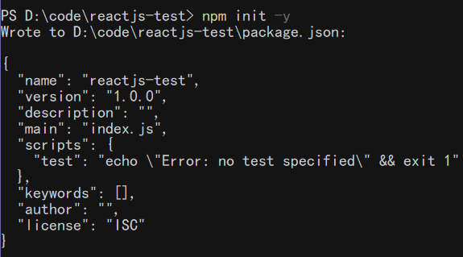

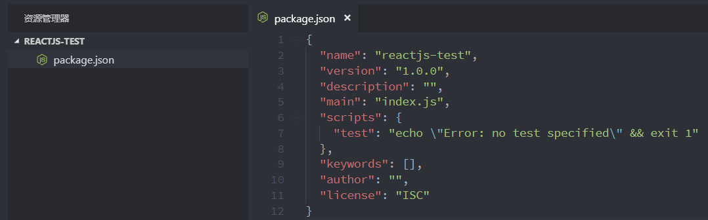

3. 在命令输入如下命令，添加umi的依赖

```shell
# 项目中添加umi的依赖
npm add umi --dev
```

### 3.2. 编写HelloWorld程序

- 第一步，在工程的根目录下创建config目录，在config目录下创建config.js文件。

> 在UmiJS的约定中，config/config.js将作为UmiJS的全局配置文件。
>
> 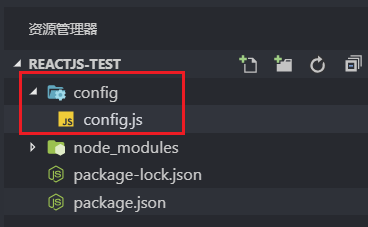  
>
> 在 umi中，约定的目录结构如下：
>
> 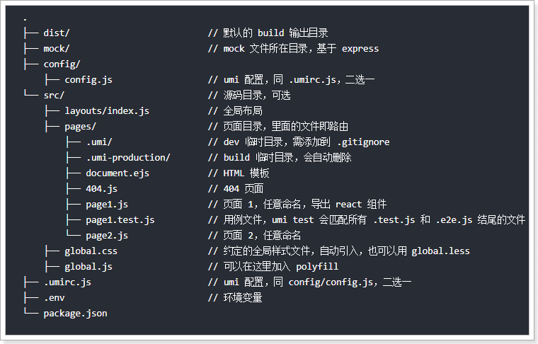

在config.js文件中输入以下内存，以便后面使用

```js
// 导出一个对象，暂时设置为空对象，后面再填充内容
export default {};
```

- 第二步，创建HelloWorld.js页面文件

在umi中，约定存放页面代码的文件夹是在src/pages，可以通过`singular:false`来设置单数的命名方式，一般采用默认即可。

在HelloWorld.js文件中输入如下内容：

```jsx
export default () => {
    return <div> hello world </div>;
}
```

**注：上面的js文件是react自创的写法，叫JSX**

- 第三步，启动服务查看页面效果

```shell
# 启动服务
umi dev
```

可以看到，通过`/HelloWorld`路径即可访问到刚刚写的HelloWorld.js文件。

在umi中，可以使用约定式的路由，在pages下面的JS文件都会按照文件名映射到一个路由，比如上面这个例子，访问 `/helloworld` 会对应到 HelloWorld.js。当然了，也可以自定义路由

### 3.3. 添加umi-plugin-react插件

umi-plugin-react插件是umi官方基于react封装的插件，包含了13个常用的进阶功能。

具体可查看：https://umijs.org/zh/plugin/umi-plugin-react.html

- 在当前工程目录下，输入以下命令添加该插件依赖。成功后会在package.json文件的`dependencies`属性中增加`"umi-plugin-react": "^1.7.4"`

```shell
# 添加插件
npm add umi-plugin-react --dev
```

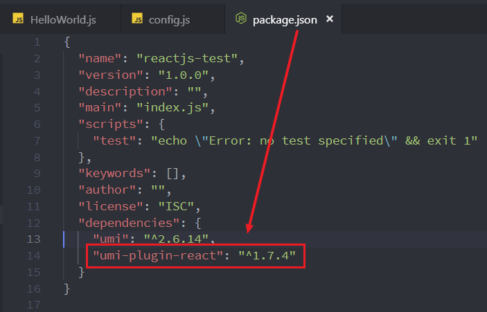

- 修改config.js文件，引入该插件：

```js
export default {
    plugins: [
        ['umi-plugin-react', {
            //暂时不启用任何功能
        }]
    ]
};
```

### 3.4. 构建和部署

- 通过umi是可以进行转码生成文件的

```shell
# 工程的目录下输入命令
umi build
```

- 运行命令后，会在dish文件夹中生成*index.html和umi.js*文件。umi.js文件是一个已经压缩过的文件，之前写的代码都已经被转码到此文件中。这些文件就是用于部署到生产环境中

## 4. JSX 语法

- JSX语法就是，可以在js文件中插入html片段，是React自创的一种语法。
- JSX语法会被Babel等转码工具进行转码，得到正常的js代码再执行。
- 使用JSX语法，需要2点注意：
    1. 所有的html标签必须是闭合的，如：`<div>HelloWorld</div>`的写法是正确；`<div>HelloWorld`的写法是错误的；
    2. 在JSX语法中，只能有一个根标签，不能有多个。

    ```jsx
    const div1 = <div>hello world</div> // 正确
    const div2 = <div>hello</div> <div>world</div> // 错误
    ```

### 4.1. JavaScript 表达式

在JSX语法中，如果想要在html标签中插入js脚本，需要通过`{}`插入js脚本。

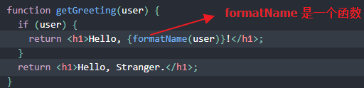

### 4.2. JSX 中的 CSS 和 对象

React 不要求必须使用内联样式（使用 CSS 类就能满足大部分情况）。当需要内联样式的时候，可以给 `style` 属性传递一个对象。如下

可以使用 camelCase 语法来设置内联样式。 React 会在指定元素数字后自动添加 px。

```jsx
const myStyle = {
    fontSize : 100,
    color : "#FF0000"
};
ReactDOM.render(
    <h1 style = {myStyle}>月の哀傷</h1>,
    document.getElementById('example')
);
```

值得注意的是：<font color=red>**内联 `style` 属性需要使用驼峰命名法编写**</font>。例如，HTML `<ul style="background-color: black">` 在组件里应该写成 `<ul style={{ backgroundColor: 'black' }}>`。

除了字符串、数字和其它 JavaScript 表达式，还可以在 JSX 中传递对象。由于对象也用大括号表示，例如 `{ name: "MooN", inventions: 5 }`。因此，为了能在 JSX 中传递，必须用另一对额外的大括号包裹对象：`person={{ name: "MooN", inventions: 5 }}`。

### 4.3. 注释

注释需要写在花括号中

```jsx
ReactDOM.render(
    <div>
        <h1>月の哀傷</h1>
        {/*注释...*/}
    </div>,
    document.getElementById('example')
);
```

### 4.4. 数组

JSX 允许在模板中插入数组，数组会自动展开所有成员

```jsx
var arr = [
    <h1>月の哀傷</h1>,
    <h2>Hello MooNkirA！</h2>,
];
ReactDOM.render(
    <div>{arr}</div>,
    document.getElementById('example')
);
```

### 4.5. HTML 标签与 React 组件

- React 可以渲染 HTML 标签 (strings) 或 React 组件 (classes)。要渲染 HTML 标签，只需在 JSX 里使用小写字母的标签名。

```jsx
var myDivElement = <div className="foo" />;
ReactDOM.render(myDivElement, document.getElementById('example'));
```

- 要渲染 React 组件，只需创建一个大写字母开头的本地变量。

```jsx
var MyComponent = React.createClass({/*...*/});
var myElement = <MyComponent someProperty={true} />;
ReactDOM.render(myElement, document.getElementById('example'));
```

- React 的 JSX 使用大、小写的约定来区分本地组件的类和 HTML 标签。

> **注意：由于 JSX 就是 JavaScript，一些标识符像 class 和 for 不建议作为 XML 属性名。作为替代，React DOM 使用 className 和 htmlFor 来做对应的属性。**

## 5. 组件

组件是 React 中最重要也是最核心的概念，一个网页，可以被拆分成一个个的组件。在 React 中，这样定义一个组件：

```jsx
import React from 'react'; // 第一步，导入React
class HelloWorld extends React.Component { // 第二步，编写类并且继承 React.Component
    render() { // 第三步，重写render()方法，用于渲染页面
        return <div>hello world!</div> // JSX语法
    }
}
export default HelloWorld; // 第四步，导出该类
```

***注：页面的标签是定义在render中的return，如果是标签是多行，则需要使用“()”进行包裹***

### 5.1. 导入自定义组件

创建Show.js文件，用于测试导入组件

```jsx
import React from 'react'
import HelloWorld from './HelloWorld' // 导入HelloWorld组件
class Show extends React.Component {
    render() {
        return <HelloWorld />; // 使用HelloWorld组件
    }
}
export default Show;
```

### 5.2. 组件参数
#### 5.2.1. 定义传递参数

组件是可以传递参数的，有2种方式传递，分别是**属性**和**标签包裹的内容**传递

如下例子，引入组件HelloWorld，定义name="zhangsan"就是属性传递，shanghai就是标签包裹的内容传递。

```jsx
import React from 'react'
import HelloWorld from './HelloWorld' // 导入HelloWorld组件
class Show extends React.Component {
    render() {
        return <HelloWorld name="zhangsan">shanghai</HelloWorld>; // 使用HelloWorld组件
    }
}
export default Show;
```

#### 5.2.2. 接收参数

接收参数也是2种方法：

- **属性**：**`this.props.name`**接收；
- **标签内容**：**`this.props.children`**接收；

```jsx
import React from 'react';
class HelloWorld extends React.Component {
    render() {
        // 属性：this.props.name 接收；
        // 标签内容：this.props.children 接收；
        return <div>hello world! name={this.props.name}, address={this.props.children}</div>
    }
}
export default HelloWorld;
```

### 5.3. 组件的状态

**每一个组件都有一个状态，其保存在this.state中，当状态值发生变化时，React框架会自动调用render()方法，重新渲染页面。**

其中，要注意两点：

- **一：this.state值的设置要在构造参数中完成；**
- **二：要修改this.state的值，需要调用this.setState()完成，不能直接对this.state进行修改**

案例说明：通过点击按钮，不断的更新this.state，从而反应到页面中。

```jsx
import React from 'react'
class List extends React.Component {
    constructor(props) { // 构造参数中必须要props参数
        super(props); // 调用父类的构造方法
        this.state = { // 初始化this.state
            dataList: [1, 2, 3],
            maxNum: 3
        };
    }
    render() {
        return (
            <div>
                <ul>
                    {
                        // 遍历值
                        this.state.dataList.map((value, index) => {
                            return <li key={index}>{value}</li>
                        })
                    }
                </ul>
                <button
                    onClick={() => { // 为按钮添加点击事件
                        let maxNum = this.state.maxNum + 1;
                        let list = [...this.state.dataList, maxNum];
                        this.setState({ // 更新状态值
                            dataList: list,
                            maxNum: maxNum
                        });
                    }}>
                    添加
                </button>
            </div>
        );
    }
}
export default List;
```

- 初始状态：

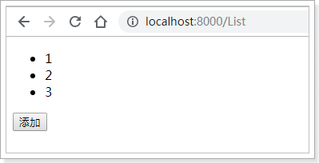

- 当点击 “添加”按钮：

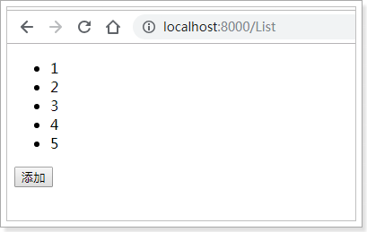

- 过程分析

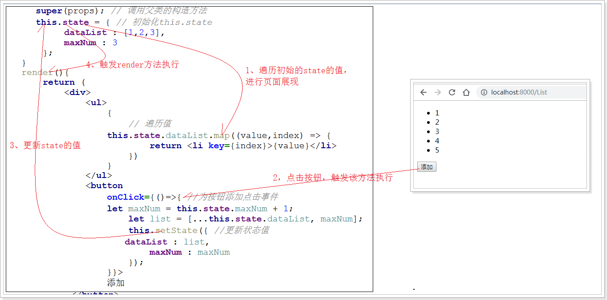

### 5.4. React 组件 API

- 设置状态：setState
- 替换状态：replaceState
- 设置属性：setProps
- 替换属性：replaceProps
- 强制更新：forceUpdate
- 获取DOM节点：findDOMNode
- 判断组件挂载状态：isMounted

#### 5.4.1. 设置状态：setState

```js
setState(object nextState[, function callback])
```

- 参数说明
    - `nextState`，将要设置的新状态，该状态会和当前的state合并
    - `callback`，可选参数，回调函数。该函数会在`setState`设置成功，且组件重新渲染后调用。
- 合并`nextState`和当前`state`，并重新渲染组件。`setState`是React事件处理函数中和请求回调函数中触发UI更新的主要方法。
- 关于setState
    - 不能在组件内部通过`this.state`修改状态，因为该状态会在调用`setState()`后被替换。
    - `setState()`并不会立即改变this.state，而是创建一个即将处理的state。`setState()`并不一定是同步的，为了提升性能React会批量执行state和DOM渲染。
    - `setState()`总是会触发一次组件重绘，除非在`shouldComponentUpdate()`中实现了一些条件渲染逻辑。

```jsx
var Counter = React.createClass({
  getInitialState: function () {
    return { clickCount: 0 };
  },
  handleClick: function () {
    this.setState(function(state) {
      return {clickCount: state.clickCount + 1};
    });
  },
  render: function () {
    return (<h2 onClick={this.handleClick}>点我！点击次数为: {this.state.clickCount}</h2>);
  }
});
ReactDOM.render(
  <Counter />,
  document.getElementById('message')
);
```

#### 5.4.2. 替换状态：replaceState

```js
replaceState(object nextState[, function callback])
```

- nextState，将要设置的新状态，该状态会替换当前的state。
- callback，可选参数，回调函数。该函数会在replaceState设置成功，且组件重新渲染后调用。

`replaceState()`方法与`setState()`类似，但是方法只会保留nextState中状态，原state不在nextState中的状态都会被删除

#### 5.4.3. 设置属性：setProps

```js
setProps(object nextProps[, function callback])
```

- nextProps，将要设置的新属性，该状态会和当前的props合并
- callback，可选参数，回调函数。该函数会在setProps设置成功，且组件重新渲染后调用。

设置组件属性，并重新渲染组件。

props相当于组件的数据流，它总是会从父组件向下传递至所有的子组件中。当和一个外部的JavaScript应用集成时，我们可能会需要向组件传递数据或通知`React.render()`组件需要重新渲染，可以使用`setProps()`。

更新组件，我可以在节点上再次调用`React.render()`，也可以通过`setProps()`方法改变组件属性，触发组件重新渲染。

#### 5.4.4. 替换属性：replaceProps

```js
replaceProps(object nextProps[, function callback])
```

- nextProps，将要设置的新属性，该属性会替换当前的props。
- callback，可选参数，回调函数。该函数会在replaceProps设置成功，且组件重新渲染后调用。

`replaceProps()`方法与`setProps`类似，但它会删除原有props

#### 5.4.5. 强制更新：forceUpdate

```js
forceUpdate([function callback])
```

- callback，可选参数，回调函数。该函数会在组件`render()`方法调用后调用。

`forceUpdate()`方法会使组件调用自身的`render()`方法重新渲染组件，组件的子组件也会调用自己的`render()`。但是，组件重新渲染时，依然会读取`this.props`和`this.state`，如果状态没有改变，那么React只会更新DOM。

`forceUpdate()`方法适用于`this.props`和`this.state`之外的组件重绘（如：修改了`this.state`后），通过该方法通知React需要调用`render()`

一般来说，应该尽量避免使用`forceUpdate()`，而仅从`this.props`和`this.state`中读取状态并由React触发`render()`调用。

#### 5.4.6. 获取DOM节点：findDOMNode

```js
DOMElement findDOMNode()
```

- 返回值：DOM元素DOMElement

如果组件已经挂载到 DOM 中，该方法返回对应的本地浏览器 DOM 元素。当render返回 null 或 false 时，`this.findDOMNode()`也会返回null。从 DOM 中读取值的时候，该方法很有用，如：获取表单字段的值和做一些 DOM 操作。

#### 5.4.7. 判断组件挂载状态：isMounted

```js
boolean isMounted()
```

- 返回值：true或false，表示组件是否已挂载到DOM中

`isMounted()`方法用于判断组件是否已挂载到DOM中。可以使用该方法保证了`setState()`和`forceUpdate()`在异步场景下的调用不会出错。

### 5.5. 组件的生命周期

组件的运行过程中，存在不同的阶段。React 为这些阶段提供了钩子方法，允许开发者自定义每个阶段自动执行的函数。这些方法统称为生命周期方法（lifecycle methods）。

- 组件的生命周期可分成三个状态：
    - **Mounting**：已插入真实 DOM
    - **Updating**：正在被重新渲染
    - **Unmounting**：已移出真实 DOM
- 生命周期的方法有：
    - **componentWillMount**：在渲染前调用,在客户端也在服务端。
    - **componentDidMount**：在第一次渲染后调用，只在客户端。之后组件已经生成了对应的DOM结构，可以通过`this.getDOMNode()`来进行访问。 如果你想和其他JavaScript框架一起使用，可以在这个方法中调用setTimeout, setInterval或者发送AJAX请求等操作(防止异部操作阻塞UI)。
    - **componentWillReceiveProps**：在组件接收到一个新的prop时被调用。这个方法在初始化render时不会被调用。
    - **shouldComponentUpdate**：返回一个布尔值。在组件接收到新的props或者state时被调用。在初始化时或者使用forceUpdate时不被调用。可以在你确认不需要更新组件时使用。
    - **componentWillUpdate**：在组件接收到新的props或者state但还没有render时被调用。在初始化时不会被调用。
    - **componentDidUpdate**：在组件完成更新后立即调用。在初始化时不会被调用。
    - **componentWillUnmount**：在组件从 DOM 中移除的时候立刻被调用。

#### 5.5.1. 组件生命周期图

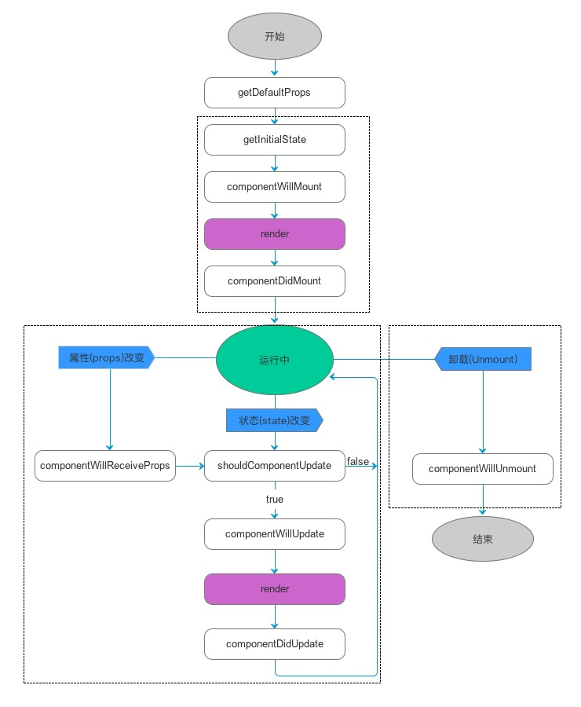

#### 5.5.2. 生命周期示例

```jsx
import React from 'react'; // 导入React
class LifeCycle extends React.Component {
    constructor(props) {
        super(props);
        // 构造方法;
        console.log("constructor()");
    }
    componentDidMount() {
        // 组件挂载后调用
        console.log("componentDidMount()");
    }
    componentWillUnmount() {
        // 在组件从 DOM 中移除之前立刻被调用。
        console.log("componentWillUnmount()");
    }
    componentDidUpdate() {
        // 在组件完成更新后立即调用。在初始化时不会被调用。
        console.log("componentDidUpdate()");
    }
    shouldComponentUpdate(nextProps, nextState) {
        // 每当this.props或this.state有变化，在render方法执行之前，就会调用这个方法。
        // 该方法返回一个布尔值，表示是否应该继续执行render方法，即如果返回false，UI 就不会更新，默认返回true。
        // 组件挂载时，render方法的第一次执行，不会调用这个方法。
        console.log("shouldComponentUpdate()");
    }
    render() {
        return (
            <div>
                <h1>React Life Cycle!</h1>
            </div>
        );
    }
}
export default LifeCycle;
```

### 5.6. React 中 Component 和 PureComponent 比较

React 15.3 中新加了一个 `PureComponent` 类，顾名思义， pure 是纯的意思， `PureComponent` 也就是纯组件，取代其前身 `PureRenderMixin`, `PureComponent` 是优化 React 应用程序最重要的方法之一，易于实施，只要把继承类从 Component 换成 PureComponent 即可，可以减少不必要的 render 操作的次数，从而提高性能，而且可以少写 `shouldComponentUpdate` 函数，节省了点代码。

```js
import React, { PureComponent } from 'react';
class App extends PureComponent {}
```

```js
import React, { Component } from 'react';
class App extends Component {}
```

Component是React App的基本构建的单位，也是React中的基本代码复用单位。PureComponent与Component在除了其shouldComponentUpdate方法的实现之外几乎完全相同。PureComponent已经替我们实现了shouldComponentUpdate方法。

对于PureComponent而言，当其props或者state改变之时，新旧props与state将进行浅对比（shallow comparison）。另一方面，Component默认的情况下其shouldComponentUpdate方法并不进行新旧props与state的对比。

因此意味着相比于Component，PureCompoent的性能表现将会更好。但**使用PureCompoent要求满足如下条件**：

1. props和state都必须是不可变对象（immutable object）。
2. props和state不能有层级嵌套的结构，（否则对子层级的改变无法反映在浅拷贝中）。
3. 如果数据改变无法反应在浅拷贝上，则应该调用forceUpdate来更新Component。
4. 一个PureComponent的子Component也应当是PureComponent。

### 5.7. 嵌套和组织组件

#### 5.7.1. 概述

组件是常规的 JavaScript 函数，所以可以将多个组件保存在同一份文件中。当组件相对较小或彼此紧密相关时，这是一种省事的处理方式。随着这个文件变得臃肿，也可以随时将里面部分组件移动到单独的文件中。

#### 5.7.2. 嵌套陷阱

组件可以渲染其他组件，但是**不要嵌套他们的定义**。例如：

```jsx
export default function Gallery() {
  // 🔴 永远不要在组件中定义组件
  function Profile() {
    // ...
  }
  // ...
}
```

上面这段代码**非常慢，并且会导致 bug 产生**。因此应该在顶层定义每个组件：

```jsx
export default function Gallery() {
  // ...
}

// ✅ 在顶层声明组件
function Profile() {
  // ...
}
```

建议当子组件需要使用父组件的数据时，可以通过 props 的形式进行传递，而不是嵌套定义。

### 5.8. 组件的导入与导出

通常，文件中仅包含一个组件时，一般会选择默认导出；而当文件中包含多个组件或某个值需要导出时，则会选择具名导出。无论选择哪种方式，建议给组件和相应的文件一个有意义的命名，不建议创建未命名的组件，比如 `export default () => {}`，因为这样会使得调试变得异常困难。

> Notes: 为了减少在默认导出和具名导出之间的混淆，一些团队会选择只使用一种风格（默认或者具名），或者禁止在单个文件内混合使用。

## 6. React 的 Refs 属性

### 6.1. 简述

- React 支持一种非常特殊的属性 Ref ，你可以用来绑定到 `render()` 输出的任何组件上。
- 这个特殊的属性允许你引用 `render()` 返回的相应的支撑实例（backing instance）。这样就可以确保在任何时间总是拿到正确的实例。
- ref 属性的值可以是一个字符串也可以是一个函数。

### 6.2. 使用方法

绑定一个 ref 属性到 render 的返回值上

```jsx
<input ref="myInput" />
```

在其它代码中，可以通过 this.refs 获取对应的支撑实例

```jsx
var input = this.refs.myInput;
var inputValue = input.value;
var inputRect = input.getBoundingClientRect();
```

### 6.3. 示例代码

通过使用 this 来获取当前 React 组件，或使用 ref 来获取组件的引用

```jsx
var MyComponent = React.createClass({
  handleClick: function() {
    // 使用原生的 DOM API 获取焦点
    this.refs.myInput.focus();
  },
  render: function() {
    //  当组件插入到 DOM 后，ref 属性添加一个组件的引用于到 this.refs
    return (
      <div>
        <input type="text" ref="myInput" />
        <input
          type="button"
          value="点我输入框获取焦点"
          onClick={this.handleClick}
        />
      </div>
    );
  }
});

ReactDOM.render(
  <MyComponent />,
  document.getElementById('example')
);
```

## 7. Model
### 7.1. 数据分层

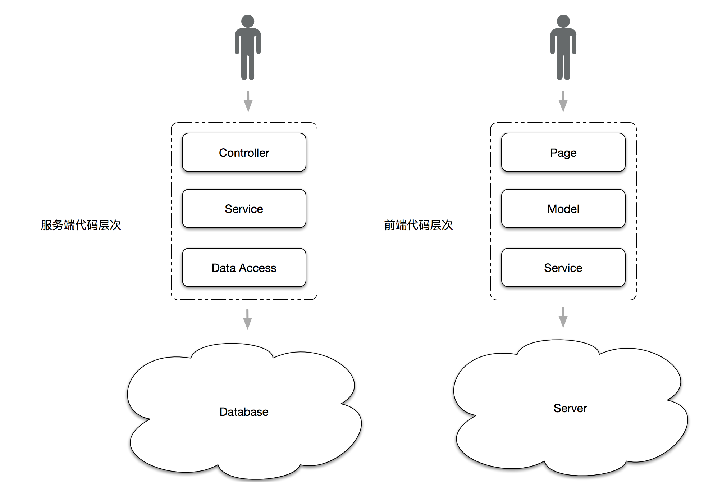

- 上图中左侧是服务端代码的层次结构，由 Controller、Service、Data Access 三层组成服务端系统
    - Controller 层负责与用户直接打交道，渲染页面、提供接口等，侧重于展示型逻辑。
    - Service 层负责处理业务逻辑，供 Controller 层调用。
    - Data Access 层顾名思义，负责与数据源对接，进行纯粹的数据读写，供 Service 层调用。
- 上图的右侧是前端代码的结构，同样需要进行必要的分层：
    - Page 负责与用户直接打交道：渲染页面、接受用户的操作输入，侧重于展示型交互性逻辑。
    - Model 负责处理业务逻辑，为 Page 做数据、状态的读写、变换、暂存等。
    - Service 负责与 HTTP 接口对接，进行纯粹的数据读写。

### 7.2. 使用 DVA 框架进行数据分层管理（好客租房项目使用，其他项目不一定使用）

dva 是基于 redux、redux-saga 和 react-router 的轻量级前端框架。官网：https://dvajs.com/

#### 7.2.1. 引入 dva 框架

引入dva框架，由于umi对dva进行了整合，所以导入时只需要修改umi项目中的config.js文件，进行如下配置：

```js
export default {
    plugins: [
        ['umi-plugin-react', {
            dva: true // 开启dva功能
        }]
    ]
};
```

#### 7.2.2. 定义 state 数据

创建 model 文件夹，在 umi 中，约定在 src/models 文件夹中定义 model，所以，在该文件夹下创建 ListData.js 文件

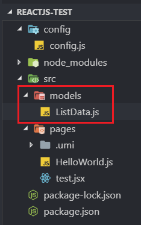

将此前定义在组件中的 state 剪切到 ListData.js 文件中

```js
export default {
    namespace: 'list',
    state: {
        data: [1, 2, 3],
        maxNum: 3
    }
}
```

对之前定义的 List.jsx 组件进行修改

```jsx
import React from 'react';  // 引入react
import { connect } from 'dva';  // 引入dva框架

// 定义变量，需要引入的model的命名空间
const namespace = 'list';

const mapStateToProps = (state) => {
    const listData = state[namespace].data; // 获取：[1, 2, 3]
    return {
        listData
    };
};

/* 参数1：函数，将model中的state数据映射到this.props中 */
@connect(mapStateToProps)
class List extends React.Component {
    render() {
        return (
            <div>
                <ul>
                    {
                        // 遍历值
                        this.props.listData.map((value, index) => {
                            return <li key={index}>{value}</li>
                        })
                    }
                </ul>
                <button
                    onClick={() => { //为按钮添加点击事件
                        // let maxNum = this.state.maxNum + 1;
                        // let list = [...this.state.dataList, maxNum];
                        // this.setState({ //更新状态值
                        //     dataList : list,
                        //     maxNum : maxNum
                        // });
                    }}>
                    添加
                </button>
            </div>
        );
    }
}

export default List;
```

测试会看到遍历对应的数据

**流程说明：**

1. umi框架启动，会自动读取models目录下model文件，即ListData.js中的数据
2. `@connect`修饰符的第一个参数，接收一个方法，该方法必须返回`{}`对象，将接收到model数据
3. 在全局的数据中，会有很多model数据，所以需要通过namespace进行区分，然后通过`state[namespace]`进行获取数据
4. 拿到model数据中state属性下的data数据，也就是`[1, 2, 3]`数据，进行包裹`{}`后返回
5. 返回的数据，将被封装到`this.props`中，所以通过`this.props.listData`即可获取到model中的数据

#### 7.2.3. 更新state数据

此前通过`this.setState()`可以修改组件中的state属性值，从而使react去刷新页面。

1. 使用dva框架对modle数据进行分层后，需要在model(案例中的ListData.js)中新增reducers方法，用于更新state中的数据

```js
export default {
    namespace: 'list',
    state: {
        data: [1, 2, 3],
        maxNum: 3
    },
    reducers: {
        addNewData(state) { // state是更新前的对象
            let maxNum = state.maxNum + 1;
            // 使用...扩展运算符，创建新的数组
            let list = [...state.data, maxNum];
            return { // 返回更新后的state对象
                data: list,
                maxNum: maxNum
            }
        }
    }
}
```

2. 修改List.js新增点击事件

```jsx
import React from 'react';  // 引入react
import { connect } from 'dva';  // 引入dva框架

// 定义变量，需要引入的model的命名空间
const namespace = 'list';

/* 定义映射数据的函数 */
const mapStateToProps = (state) => {
    const listData = state[namespace].data; // 获取：[1, 2, 3]
    const maxNum = state[namespace].maxNum;
    return {
        listData,
        maxNum
    };
};

/* 定义映射事件（方法）的函数 */
const mapDispatchToProps = (dispatch) => { // 定义方法，dispatch是内置函数
    return { // 返回的这个对象将绑定到this.props对象中
        addNewData: () => { // 定义方法
            dispatch({ // 通过调用dispatch()方法，调用model中reducers的方法
                type: namespace + "/addNewData" // 指定方法，格式：namespace/方法名
            });
        }
    }
}

/**
 * 参数1：函数，将model中的state属性中定义的数据映射到this.props中
 * 参数2：函数，将model中reducers属性中定义的方法映射到this.props中
 */
@connect(mapStateToProps, mapDispatchToProps)
class List extends React.Component {
    render() {
        return (
            <div>
                <ul>
                    {
                        // 遍历值
                        this.props.listData.map((value, index) => {
                            return <li key={index}>{value}</li>
                        })
                    }
                </ul>
                <button onClick={() => { this.props.addNewData() }}>
                    添加
                </button>
            </div>
        );
    }
}

export default List;
```

绑定方法流程梳理如下

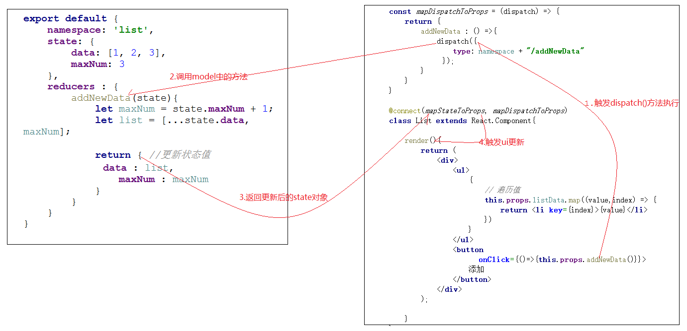

### 7.3. 在model中请求数据

实现动态查询后台获取model里的数据

1. 在src下创建util目录，新建request.js文件（用于定义异步请求后端的工具js），输入如下内容

```js
// import fetch from 'dva/fetch';
function checkStatus(response) {
    if (response.status >= 200 && response.status < 300) {
        return response;
    }
    const error = new Error(response.statusText);
    error.response = response;
    throw error;
}

/**
 * Requests a URL, returning a promise.
 *
 * @param  {string} url       The URL we want to request
 * @param  {object} [options] The options we want to pass to "fetch"
 * @return {object}           An object containing either "data" or "err"
 */
export default async function request(url, options) {
    const response = await fetch(url, options);
    checkStatus(response);
    return await response.json();
}
```

2. 修改model（即ListData.js）中新增请求方法，需要定义effects配置，用于异步加载数据

```js
// 导入请求工具js
import request from '../util/request';

export default {
    namespace: 'list',
    state: {
        data: [],
        maxNum: 0
    },
    reducers: {
        addNewData(state, result) { // state是更新前的对象；result就是拿到的结果数据

            // 判断result中的data是否存在，如果存在，说明是初始化数据，直接返回
            if (result.data) {
                return result.data;
            }

            let maxNum = state.maxNum + 1;
            // 使用...扩展运算符，创建新的数组
            let list = [...state.data, maxNum];
            return { // 返回更新后的state对象
                data: list,
                maxNum: maxNum
            }
        }
    },
    effects: { // 新增effects配置，用于异步加载数据
        *initData(params, sagaEffects) { // 定义异步方法
            const { call, put } = sagaEffects; // 获取到call、put方法
            const url = "/ds/list"; // 定义请求的url
            let data = yield call(request, url); // 执行请求
            yield put({ // 调用reducers中的方法
                type: "addNewData", // 指定方法名
                data: data // 传递ajax回来的数据
            });
        }
    }
}
```

3. 修改页面(List.jsx)逻辑

```jsx
import React from 'react';  // 引入react
import { connect } from 'dva';  // 引入dva框架

// 定义变量，需要引入的model的命名空间
const namespace = 'list';

/* 定义映射数据的函数 */
const mapStateToProps = (state) => {
    const listData = state[namespace].data; // 获取：[1, 2, 3]
    const maxNum = state[namespace].maxNum;
    return {
        listData,
        maxNum
    };
};

/* 定义映射事件（方法）的函数 */
const mapDispatchToProps = (dispatch) => { // 定义方法，dispatch是内置函数
    return { // 返回的这个对象将绑定到this.props对象中
        addNewData: () => { // 定义方法
            dispatch({ // 通过调用dispatch()方法，调用model中reducers的方法
                type: namespace + "/addNewData" // 指定方法，格式：namespace/方法名
            });
        },
        /* 定义model中的初始化方法 */
        initData: () => {
            dispatch({
                type: `${namespace}/initData`	// 使用ES6字符串模板标记
            });
        }
    }
}

/**
 * 参数1：函数，将model中的state属性中定义的数据映射到this.props中
 * 参数2：函数，将model中reducers属性中定义的方法映射到this.props中
 */
@connect(mapStateToProps, mapDispatchToProps)
class List extends React.Component {

    /* 定义生命周期的钩子方法-组件挂载后调用 */
    componentDidMount() {
        this.props.initData(); // 组件加载完后进行初始化操作
    }

    render() {
        return (
            <div>
                <ul>
                    {
                        // 遍历值
                        this.props.listData.map((value, index) => {
                            return <li key={index}>{value}</li>
                        })
                    }
                </ul>
                <button onClick={() => { this.props.addNewData() }}>
                    添加
                </button>
            </div>
        );
    }
}

export default List;
```

测试结果，发现会报错，原因是返回的是html代码，数据不是json导致解析出错。

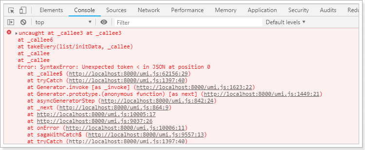

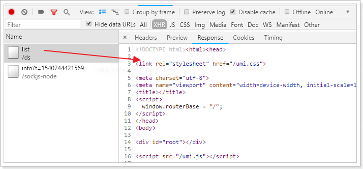

### 7.4. mock数据

umi中支持对请求的模拟，当没有后端服务的时候，可以使用mock数据进行测试

在项目根目录下创建mock目录，然后创建MockListData.js文件，并且输入如下内容：

```js
export default {
    'get /ds/list': function (req, res) { // 模拟请求返回数据
        res.json({
            data: [1, 2, 3, 4],
            maxNum: 4
        });
    }
}
```

## 8. React 其他资料

### 8.1. React 相关资源

**优质 React UI 库**：

- [Ant Design 官网](https://ant-design.gitee.io/index-cn) - 助力设计开发者「更灵活」地搭建出「更美」的产品，让用户「快乐工作」～
- [Ant Design Pro 官网](https://ant-design-pro.gitee.io/zh-CN) - 开箱即用的中台前端/设计解决方案
- [Ant Design Mobile 官网](https://mobile.ant.design/zh) - 探索移动端 Web 的极致体验
- [MATERIAL-UI](https://v4.mui.com/zh/) - React 组件用于更快速、更简便的 web 开发。你也可以建立你自己的设计系统，或者从 Material Design 开始。

**React 工具 Github 仓库**：

- [awesome-react react资源大全，该有的都有了](https://github.com/enaqx/awesome-react)
- [react-developer-roadmap react的学习路线图2018版](https://github.com/adam-golab/react-developer-roadmap)
- [react-bits react最佳实践，有你想知道](https://github.com/vasanthk/react-bits)
- [react-bits react最佳实践中文版](https://github.com/hateonion/react-bits-CN)
- react-in-patterns react 开发设计模式  star: 9903
- create-react-app facebook 官方提供 react 开发命令工具，解决初学者的各种烦恼  star: 54549
- next.js react服务端渲染框架  star: 28519 view
- [gatsby 静态页面生成器，非常强大，自定能力强，模版极多](https://github.com/gatsbyjs/gatsby)
- preact react的瘦身版，兼容官方react所有api,压缩后只有3kb  star: 19912
- recharts d3图表库的react版  star: 9706 view
- Sortable react的拖拽排序组件  star: 14180 view
- react-loadable react组件懒加载组件  star: 9932
- react-dnd react拖拽组件，满足各种拖拽需求  star: 9218 view
- react-grid-layout 可拖拽的伸缩的布局组件，admin dashboard必备精选，很高大上 recommand star: 6950 view
- docz 基于react开发的写文档的神器,号称 写文档从未如此简单 recommand star: 9670 view
- react-spring 写react动画的好帮手，不废话看样例  star: 7074 view
- react-360 react VR 开发框架  star: 6364 view
- taro 一套遵循 React 语法规范的 多端开发 解决方案, 有一套代码多端编译，适用小程序与原生app  star: 7296 view
- ink 用 react 开发命令行交互工具，很酷  star: 6252
- ag-grid 非常强大的table组件，完全满足以数据为主的数据展示表格  star: 4231
