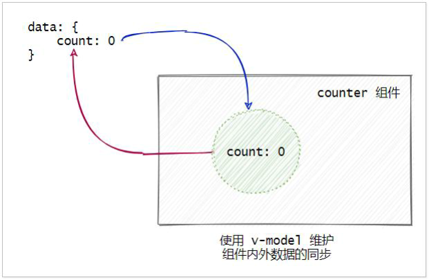
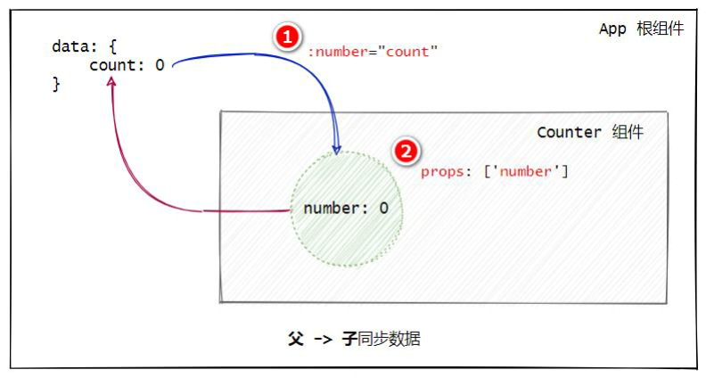
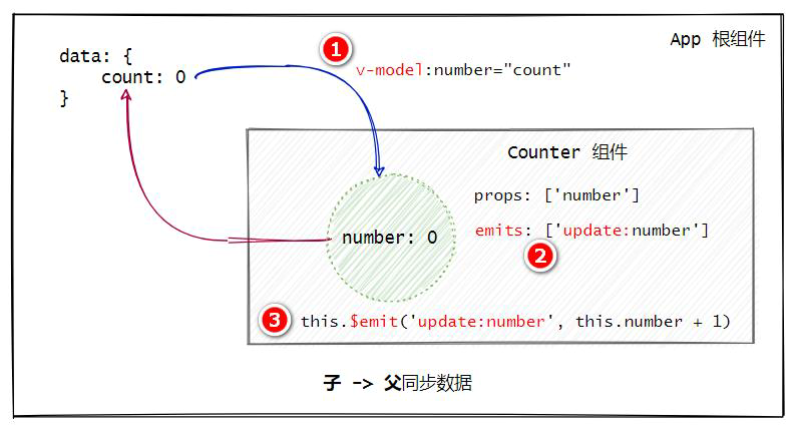
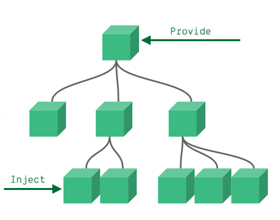

## 1. Vue3.x 概述

Vue 3 官网：https://cn.vuejs.org/

> 以下是vue的学习笔记，大部分内容引用官网

## 2. 组件

### 2.1. 自定义事件

#### 2.1.1. 事件名

与组件和 `prop` 一样，事件名提供了自动的大小写转换。如果在子组件中触发一个以 camelCase (驼峰式命名) 命名的事件，你将可以在父组件中添加一个 kebab-case (短横线分隔命名) 的监听器。

```js
this.$emit('myEvent')
```

```html
<my-component @my-event="doSomething"></my-component>
```

#### 2.1.2. 定义自定义事件

通过 `emits` 选项在组件上定义发出的事件

```js
app.component('custom-form', {
  emits: ['inFocus', 'submit']
})
```

当在 `emits` 选项中定义了原生事件 (如 click) 时，将使用组件中的事件替代原生事件侦听器。

#### 2.1.3. 验证抛出的事件

与 `prop` 类型验证类似，定义发出的事件不是使用数组语法，而使用对象语法，则可以对它进行验证。

验证规则是定义成一个函数，该函数接收传递给 `$emit` 调用的参数，并返回一个布尔值用于验证事件是否有效。

```js
app.component('custom-form', {
  emits: {
    // 没有验证
    click: null,

    // 验证 submit 事件
    submit: ({ email, password }) => {
      if (email && password) {
        return true
      } else {
        console.warn('Invalid submit event payload!')
        return false
      }
    }
  },
  methods: {
    submitForm(email, password) {
      this.$emit('submit', { email, password })
    }
  }
})
```

#### 2.1.4. 为什么需要在组件上使用 v-model

`v-model` 是双向数据绑定指令，当需要维护组件内外数据的同步时，可以在组件上使用 `v-model` 指令。



上面示例图可以看出，外界数据的变化会自动同步到 counter 组件中。counter 组件中数据的变化，也会自动同步到外界

#### 2.1.5. 在组件上使用 v-model 的步骤



1. 父组件通过 `v-bind:` 属性绑定的形式，把数据传递给子组件
2. 子组件中，通过 `props` 接收父组件传递过来的数据



1. 在 `v-bind:` 指令之前添加 `v-model` 指令
2. 在子组件中声明 `emits` 自定义事件，格式为 `update:xxx`
3. 调用 `$emit()` 触发自定义事件，更新父组件中的数据

#### 2.1.6. v-model 参数

默认情况下，组件上的 `v-model` 使用 `modelValue` 作为 `prop` 和 `update:modelValue` 作为事件。如下例：

```html
<my-component v-model:title="bookTitle"></my-component>
```

在本例中，子组件需要定义一个名为 `title` 的 `prop` 属性，并需要定义一个名为 `update:title` 的事件来进行与父组件的同步：

```js
app.component('my-component', {
  props: {
    title: String
  },
  emits: ['update:title'],
  template: `
    <input
      type="text"
      :value="title"
      @input="$emit('update:title', $event.target.value)">
  `
})
```

#### 2.1.7. 多个 v-model 绑定

单个组件实例上也可以使用多个 `v-model` 绑定参数。每个 `v-model` 将同步到不同的 `prop` 属性中，用法与单个 `v-model` 一样

```html
<user-name
  v-model:first-name="firstName"
  v-model:last-name="lastName"
></user-name>
```

```js
app.component('user-name', {
  props: {
    firstName: String,
    lastName: String
  },
  emits: ['update:firstName', 'update:lastName'],
  template: `
    <input 
      type="text"
      :value="firstName"
      @input="$emit('update:firstName', $event.target.value)">

    <input
      type="text"
      :value="lastName"
      @input="$emit('update:lastName', $event.target.value)">
  `
})
```

#### 2.1.8. 处理 v-model 修饰符（待整理）


### 2.2. Provide / Inject

如果需要从父组件传递给比较深层次结构的子组件（孙级以下组件），可以使用一对 `provide` 和 `inject`，主要应用是，父组件有一个 `provide` 选项来提供数据，子组件有一个 `inject` 选项来开始使用这些数据。



#### 2.2.1. 基础用法

在父组件通过 `provide` 属性共享数据

```js
data() {
  return {
    name: 'MooNkirA',
  }
},
provide() {
  /*
    在 provide 共享数据，只要是与本组件有关系的子级或更深层级别的组件都能获取到这些数据
    默认情况下，provide/inject 绑定并不是响应式的。
  */
  return {
    num: 1024,
    name: this.name,
  }
},
```

在子级或者更深层级的组件中，通过 `inject` 属性来获取共享的数据

```js
/*
  通过 inject 属性注入传递的数据，与定义 props 一样
  子组件不需要知道 inject 的 property 来自哪里
*/
inject: ['num', 'name'],
```

实际上，可以将依赖注入看作是“长距离的 prop”的传递：

- 父组件不需要知道哪些子组件使用了它 provide 的 property
- 子组件不需要知道 inject 的 property 来自哪里

#### 2.2.2. 处理响应性

默认情况下，`provide`/`inject` 绑定并不是响应式的。想对祖先组件中的更改做出响应，我们需要为 provide 的 todoLength 分配一个组合式 API computed property：

```js
import { computed } from 'vue'

provide() {
  /*
    在 provide 共享数据，只要是与本组件有关系的子级或更深层级别的组件都能获取到这些数据
    默认情况下，provide/inject 绑定并不是响应式的。
  */
  return {
    num: 1024,
    name: this.name,
    // 通过 computed 的函数返回一个响应式的值
    text: computed(() => this.text),
  }
}
```

更多组件式 API 用法，详见[官网](https://v3.cn.vuejs.org/guide/composition-api-provide-inject.html#%E8%AE%BE%E6%83%B3%E5%9C%BA%E6%99%AF)
