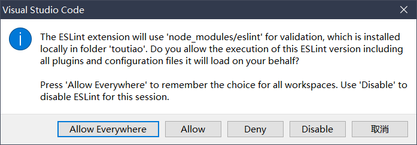

# ESLint 笔记

- 官网：https://eslint.org/
- 国内官网翻译版网址：http://eslint.cn/

## 1. 快速开始

### 1.1. ESLint 配置文件

运行 `eslint --init` 之后，会在项目根目录自动创建 `.eslintrc` 文件。可以在 `.eslintrc` 文件中配置相关的规则。如：

```js
{
    "rules": {
        "semi": ["error", "always"],
        "quotes": ["error", "double"]
    }
}
```

### 1.2. 了解 ESLint 常见的语法规则

ESLint 提供了许多**校验代码格式**的语法规则，常见的语法规则列表如下：

| 序号 |            规则名称            |             规则约束/默认约束             |
| :--: | :---------------------------: | --------------------------------------- |
|  1   |           `quotes`            | 默认：字符串需要使用单引号包裹              |
|  2   |         `key-spacing`         | 默认：对象的属性和值之间，需要有一个空格分割 |
|  3   |        `comma-dangle`         | 默认：对象或数组的末尾，不允许出现多余的逗号 |
|  4   |   `no-multiple-empty-lines`   | 不允许出现多个空行                        |
|  5   |     `no-trailing-spaces`      | 不允许在行尾出现多余的空格                 |
|  6   |          `eol-last`           | 默认：文件的末尾必须保留一个空行            |
|  7   |       `spaced-comment`        | 在注释中的`//`或`/*`后强制使用一致的间距    |
|  8   |           `indent`            | 强制一致的缩进                            |
|  9   |        `import/first`         | `import` 导入模块的语句必须声明在文件的顶部 |
|  10  | `space-before-function-paren` | 方法的形参之前是否需要保留一个空格          |

> **详细的 ESLint 语法规则列表，请参考官方文档** https://eslint.org/docs/rules/

### 1.3. 自定义 ESLint 的 rules 规则

如果希望修改 ESLint 默认的校验规则，可以在 `.eslintrc.js` 文件的 `rules` 节点下进行自定义。例如：

```js
rules: {
    // 默认情况下，ESLint 规定：方法的形参之前必须保留一个空格
    // 'space-before-function-paren': ['error', 'always']

    // 如果指定了规则的值为 never，则不允许在方法的形参之前保留任何空格
    'space-before-function-paren': ['error', 'never']
}
```

### 1.4. 安装 vscode 的 ESLint 插件

> 为了让开发者专注于业务功能的开发，推荐在 vscode 中安装并配置 ESLint 插件。它可以在保存文件的时候，遵循 ESLint 的语法规则，自动对代码进行格式化。

1. 在 vscode 中搜索并安装 ESLint 插件。
2. 打开 vscode 的 `settings.json` 配置文件，新增如下的配置节点：

```js
// ESLint 插件的配置
"editor.codeActionsOnSave": {
  "source.fixAll": true,
},
```

3. 点击 vscode 状态栏右下角的 ESLint 按钮，在弹出层中选择 `Allow Everywhere`。




