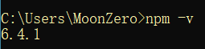
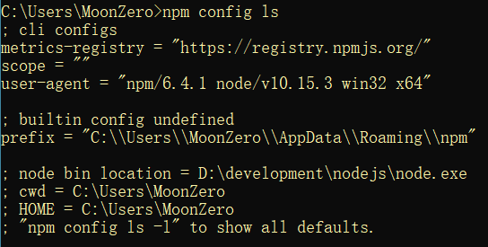
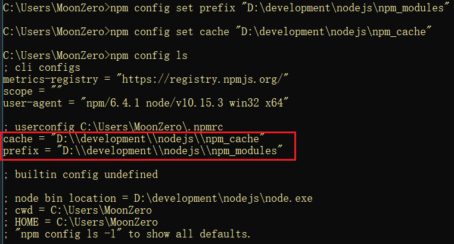

## 1. Node.js 简介

Node.js 是一个开源和跨平台的 JavaScript 运行时环境。它几乎是任何类型项目的流行工具！Node.js 在浏览器之外运行 V8 JavaScript 引擎（Google Chrome 的内核），性能非常好。

## 2. npm 包管理器

### 2.1. npm 简介

`npm` 是 Node.js 标准的软件包管理器。它起初是作为下载和管理 Node.js 包依赖的方式，但其现在也已成为前端 JavaScript 中使用的工具。

### 2.2. 查看 npm 版本

node.js 已经集成了 `npm` 工具，在命令提示符输入 `npm -v` 可查看当前 `npm` 版本



### 2.3. 设置 npm 的包路径

包路径就是npm从远程下载的js包所存放的路径

使用 `npm config ls` 查询NPM管理包路径（NPM下载的依赖包所存放的路径）



NPM 默认的管理包路径在`C:/用户/[用户名]/AppData/Roaming/npm/node_meodules`，为了方便对依赖包管理，可以将管理包的路径设置在指定的位置，建议将安装目录设置在node.js的目录下，在node.js的安装目录下创建npm_modules和npm_cache，执行下边的命令

```shell
# 例如：安装node.js在D:\development\nodejs\下，打开cmd命令符窗口，执行命令如下：
npm config set prefix "D:\development\nodejs\npm_modules"
npm config set cache "D:\development\nodejs\npm_cache"
```

此时再使用 `npm config ls` 查询NPM管理包路径发现路径已更改



> **注：配置以后，一些全局安装的工具会安装到`npm_modules`此文件夹中，需要在环境变量中配置`npm_modules`此文件夹，才可以全局的使用这些安装的工具**

### 2.4. 下载与安装包

#### 2.4.1. 安装所有依赖

如果项目具有 `package.json` 文件，则通过运行：

```bash
npm install
```

运行命令后，会在 `node_modules` 文件夹（如果尚不存在则会创建）中安装项目所需的所有东西。

#### 2.4.2. 安装单个软件包

通过运行以下命令安装特定的软件包：

```bash
npm install <package-name>
```

此命令通过会带一些参数

- `--save` 安装并添加条目到 `package.json` 文件的 `dependencies`。
- `--save-dev` 安装并添加条目到 `package.json` 文件的 `devDependencies`。

以上参数的区别主要是，`devDependencies` 通常是开发的工具（例如测试的库），而 `dependencies` 则是与生产环境中的应用程序相关。

### 2.5. npm 全局安装与本地安装

当使用 npm 安装软件包时，可以执行两种安装类型：

- 本地安装
- 全局安装

本地和全局的软件包之间的主要区别是：

- 本地的软件包：安装在运行 `npm install <package-name>` 的目录中，并且放置在此目录下的 `node_modules` 文件夹中。
- 全局的软件包：放在系统中的单独位置（确切的位置取决于设置），无论在何处运行 `npm install -g <package-name>`。

#### 2.5.1. 本地的软件包

```bash
npm install <package-name>
```

默认情况下，软件包会被安装到当前文件树中的 `node_modules` 子文件夹下。

在这种情况下，`npm` 还会在当前文件夹中存在的 `package.json` 文件的 `dependencies` 属性中添加相应软件包条目。

#### 2.5.2. 全局的软件包

使用 `-g` 参数可以执行全局安装：

```bash
npm install -g <package-name>
```

在这种情况下，`npm` 不会将软件包安装到本地文件夹下，而是使用全局的位置。

##### 2.5.2.1. 查看全局安装的位置

```bash
npm root -g
```

默认情况下，在 macOS 或 Linux 上，此位置可能是 `/usr/local/lib/node_modules`；在 Windows 上，可能是 `C:\Users\YOU\AppData\Roaming\npm\node_modules`；如果使用 nvm 管理 Node.js 版本，则软件包的位置可能为 `/Users/joe/.nvm/versions/node/v8.9.0/lib/node_modules`

##### 2.5.2.2. 查看系统已安装的全局软件包

通过在命令行上运行以下命令查看：

```bash
npm list -g --depth 0
```

### 2.6. 更新软件包

通过运行以下命令，`npm` 会检查所有软件包是否有满足版本限制的更新版本。

```bash
npm update
```

指定单个软件包进行更新：

```bash
npm update <package-name>
```

### 2.7. 卸载软件包

卸载（删除）软件包，也分为全局卸载（删除）和本地卸载（删除）

#### 2.7.1. 卸载本地软件

若要卸载之前在本地安装（在 `node_modules` 文件夹使用 `npm install <package-name>`）的软件包，则从项目的根文件夹（包含 `node_modules` 文件夹的文件夹）中运行：

```bash
npm uninstall <package-name>
```

如果使用 `-S` 或 `--save` 参数，则此操作还会移除 `package.json` 文件中的引用。如果程序包是开发依赖项（列出在 `package.json` 文件的 `devDependencies` 中），则必须使用 `-D` 或 `--save-dev` 标志从文件中移除：

```bash
npm uninstall -S <package-name>
npm uninstall -D <package-name>
```

#### 2.7.2. 卸载全局软件

如果该软件包是全局安装的，则需要添加 `-g` 或 `--global` 参数。可以在系统上的任何位置运行此命令，因为当前所在的文件夹无关紧要。

```bash
npm uninstall -g <package-name>
```

例如：

```bash
npm uninstall -g webpack
```


### 2.8. 版本控制

除了简单的下载外，npm 还可以管理版本控制，因此可以指定软件包的任何特定版本，或者要求版本高于或低于所需版本。

很多时候，一个库仅与另一个库的主版本兼容。或者，一个库的最新版本中有一个缺陷（仍未修复）引起了问题。

指定库的显式版本还有助于使每个人都使用相同的软件包版本，以便整个团队运行相同的版本，直至 `package.json` 文件被更新。

在所有这些情况中，版本控制都有很大的帮助，npm 遵循语义版本控制标准。

#### 2.8.1. npm 的语义版本控制

npm 的语义版本控制是指，所有的版本都有 3 个数字：`x.y.z`。

- 第一个数字是主版本
- 第二个数字是次版本
- 第三个数字是补丁版本

发布新的版本时，要遵循以下规则：

- 当进行不兼容的 API 更改时，则升级主版本。
- 当以向后兼容的方式添加功能时，则升级次版本。
- 当进行向后兼容的缺陷修复时，则升级补丁版本。

#### 2.8.2. 版本规则符号

npm 设置了一些规则，可用于在 `package.json` 文件中选择要将软件包更新到的版本（当运行 `npm update` 时）。

| 符号 |                                                                                                                   规则说明                                                                                                                    |
| :--: | --------------------------------------------------------------------------------------------------------------------------------------------------------------------------------------------------------------------------------------------- |
| `^`  | 只会执行不更改最左边非零数字的更新。如果写入的是`^0.13.0`，则当运行`npm update`时，可以更新到`0.13.1`、`0.13.2`等，但不能更新到`0.14.0`或更高版本。如果写入的是`^1.13.0`，则当运行`npm update`时，可以更新到`1.13.1`、`1.14.0`等，但不能更新到`2.0.0`或更高版本 |
| `~`  | 如果写入的是`〜0.13.0`，则当运行`npm update`时，会更新到补丁版本：即`0.13.1`可以，但`0.14.0`不可以                                                                                                                                                  |
| `>`  | 接受高于指定版本的任何版本                                                                                                                                                                                                                      |
| `>=` | 接受等于或高于指定版本的任何版本                                                                                                                                                                                                                 |
| `<=` | 接受等于或低于指定版本的任何版本                                                                                                                                                                                                                 |
| `<`  | 接受低于指定版本的任何版本                                                                                                                                                                                                                      |
| `=`  | 接受确切的版本                                                                                                                                                                                                                                 |
| `-`  | 接受一定范围的版本。例如：`2.1.0 - 2.6.2`                                                                                                                                                                                                       |
| `||` | 组合集合。例如 `< 2.1 || > 2.6`                                                                                                                                                                                                                |

还有其他的规则：

- `无符号`：仅接受指定的特定版本（例如 1.2.1）。
- `latest`：使用可用的最新版本。

### 2.9. 运行任务

`package.json` 文件支持一种用于指定命令行任务（可通过使用以下方式运行）的格式：

```bash
npm run <task-name>
```

修改配置文件定义代码（任务）片段，示例如下：

```json
{
  "scripts": {
    "start-dev": "node lib/server-development",
    "start": "node lib/server-production"
  },
}
```

使用此特性运行 Webpack 一些命令

```json
{
  "scripts": {
    "watch": "webpack --watch --progress --colors --config webpack.conf.js",
    "dev": "webpack --progress --colors --config webpack.conf.js",
    "prod": "NODE_ENV=production webpack -p --config webpack.conf.js",
  },
}
```

运行时只需要输入定义好的代码片段名称即可，效果相当于运行相应的长命令

```bash
$ npm run watch
$ npm run dev
$ npm run prod
```

### 2.10. package.json 指南（待整理）


## 3. 常用命令

### 3.1. 初始化包管理配置文件

在项目目录路径下，通过命令行工具输入以下命令，初始化包管理配置文件 package.json

```bash
npm init –y
```

### 3.2. 清理缓存

```bash
npm cache clean --force
```

## 4. 其他

### 4.1. 在 node.js 中体验 ES6 模块化

node.js 中默认**仅支持 CommonJS 模块化规范**，若想基于 node.js 体验与学习 ES6 的模块化语法，可以按照如下两个步骤进行配置：

- 确保安装了 v14.15.1 或更高版本的 node.js
- 在 `package.json` 的根节点中添加 `"type": "module"` 节点
