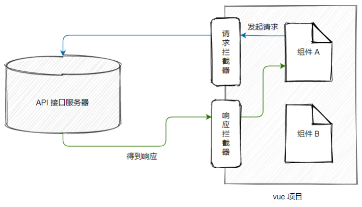

## 1. Axios 网络请求库概述

> 中文文档：https://www.axios-http.cn/

### 1.1. 为什么要全局配置 axios

在实际项目开发中，几乎每个组件中都会用到 axios 发起数据请求。此时会遇到如下两个问题：

1. 每个组件中都需要导入 axios（代码臃肿）
2. 每次发请求都需要填写完整的请求路径（不利于后期的维护）

## 2. vue 项目配置全局的 axios

### 2.1. vue3 的项目中全局配置 axios（有问题，待确认）

在 main.js 入口文件中，通过 `app.config.globalProperties` 全局挂载 `axios`

```js
/*
  1. 单独导入vue相关需要的函数或类，如：createApp 函数
      createApp 函数的作用是：创建 vue 的“单页面应用程序实例”
*/
import { createApp } from 'vue'
import axios from 'axios'

// 2. 导入待渲染的组件，如：App.vue
import App from './App.vue'

/*
  3. 调用 createApp 函数，创建 SPA 应用的实例，函数返回值是“单页面应用程序的实例”
      可以用一个常量进行接收，以为后续可以给vue实例增加注册其他插件
*/
const vueApp = createApp(App)

// 为 axios 配置请求的根路径
axios.defaults.baseURL = 'https://www.xxx.com'
/*
  将 axios 挂载为 vue 的全局自定义属性
  每个组件可以通过 this 直接访问到全局挂载的自定义属性
*/
vueApp.config.globalProperties.$http = axios

// 4. 调用 mount() 把 App 组件的模板结构，渲染到指定的 el 区域中，即指定 vue 实际要控制的区域
vueApp.mount('#app')
```

> TODO: 注：axios 0.24.0以上的版本，在配置时提示 axios 没有 `defaults.baseURL`的属性，问题待解决

### 2.2. vue2 的项目中全局配置 axios

需要在 main.js 入口文件中，通过 Vue 构造函数的 `prototype` 原型对象全局配置 axios：

```js
import Vue from 'vue'
import App from './App'

import axios from 'axios'

// 全局配置 axios 的请求根路径
axios.defaults.baseURL = 'http://xxxxxxxx'
// 将 axios 挂载到 Vue.prototype 上，可以使每个 .vue 组件的实例通过 this.$http 来发起请求
Vue.prototype.$http = axios
// 不过通常不使用此种方式，一般都会封装一个专门发送http的js文件，然后在一些api文件中定义多种请求方法，
// 组件使用时引用不同的请求方法，从而达到 API 接口的复用

new Vue({
  render: h => h(App),
}).$mount('#app')
```

> 注：通常会将一些工具类库的配置按模块独立成一个文件

## 3. 使用axios发送post请求，后端@RequestBody无法接收参数

springboot会报错`Content type 'application/x-www-form-urlencoded;charset=UTF-8' not supported`。将`@RequestBody`换成`@RequestParam`就可以，这个暂时还搞不懂是什么回事？

```java
/* 多条件查询影片资源信息 */
@PostMapping("/findByCondition")
public PageResult<JavMain> findByCondition(@RequestBody Map<String, Object> params) {
    ......
}

// 改成以下方式
@PostMapping("/findByCondition")
public PageResult<JavMain> findByCondition(@RequestParam Map<String, Object> params) {
    ......
}
```

## 4. Axios 请求配置参数详解

### 4.1. axios API

#### 4.1.1. axios 传递相关配置来创建请求

- `axios(config)`

```js
// 发送 POST 请求
axios({
  method: 'post',
  url: '/user/12345',
  data: {
    firstName: 'Fred',
    lastName: 'Flintstone'
  }
});
```

- `axios(url[, config])`

```js
// 发送 GET 请求（默认的方法）
axios('/user/12345');
```

#### 4.1.2. 为所有支持的请求方法提供了别名

- `axios.request(config)`
- `axios.get(url[, config])`
- `axios.delete(url[, config])`
- `axios.head(url[, config])`
- `axios.post(url[, data[, config]])`
- `axios.put(url[, data[, config]])`
- `axios.patch(url[, data[, config]])`

**注：在使用别名方法时， url、method、data这些属性都不必在配置中指定。**

#### 4.1.3. 处理并发请求的助手函数

- `axios.all(iterable)`
- `axios.spread(callback)`

### 4.2. 创建axios实例（用来创建自定义请求）

可以使用自定义配置新建一个 axios 实例

```js
axios.create([config])
var instance = axios.create({
  baseURL: 'https://some-domain.com/api/',
  timeout: 1000,
  headers: {'X-Custom-Header': 'foobar'}
});
```

### 4.3. 实例方法

以下是可用的实例方法。指定的配置将与实例的配置合并

- `axios#request(config)`
- `axios#get(url[, config])`
- `axios#delete(url[, config])`
- `axios#head(url[, config])`
- `axios#post(url[, data[, config]])`
- `axios#put(url[, data[, config]])`
- `axios#patch(url[, data[, config]])`

### 4.4. 请求配置

以下示例是创建请求时可以用的配置选项。其中 `url` 是必需的。如果没有指定 `method`，请求将默认使用 `GET` 方法。

```js
{
  // `url` 是用于请求的服务器 URL
  url: '/user',

  // `method` 是创建请求时使用的方法
  method: 'get', // 默认值

  // `baseURL` 将自动加在 `url` 前面，除非 `url` 是一个绝对 URL。
  // 它可以通过设置一个 `baseURL` 便于为 axios 实例的方法传递相对 URL
  baseURL: 'https://some-domain.com/api/',

  // `transformRequest` 允许在向服务器发送前，修改请求数据
  // 它只能用于 'PUT', 'POST' 和 'PATCH' 这几个请求方法
  // 数组中最后一个函数必须返回一个字符串， 一个Buffer实例，ArrayBuffer，FormData，或 Stream
  // 你可以修改请求头。
  transformRequest: [function (data, headers) {
    // 对发送的 data 进行任意转换处理

    return data;
  }],

  // `transformResponse` 在传递给 then/catch 前，允许修改响应数据
  transformResponse: [function (data) {
    // 对接收的 data 进行任意转换处理

    return data;
  }],

  // 自定义请求头
  headers: {'X-Requested-With': 'XMLHttpRequest'},

  // `params` 是与请求一起发送的 URL 参数
  // 必须是一个简单对象或 URLSearchParams 对象
  params: {
    ID: 12345
  },

  // `paramsSerializer`是可选方法，主要用于序列化`params`
  // (e.g. https://www.npmjs.com/package/qs, http://api.jquery.com/jquery.param/)
  paramsSerializer: function (params) {
    return Qs.stringify(params, {arrayFormat: 'brackets'})
  },

  // `data` 是作为请求体被发送的数据
  // 仅适用 'PUT', 'POST', 'DELETE 和 'PATCH' 请求方法
  // 在没有设置 `transformRequest` 时，则必须是以下类型之一:
  // - string, plain object, ArrayBuffer, ArrayBufferView, URLSearchParams
  // - 浏览器专属: FormData, File, Blob
  // - Node 专属: Stream, Buffer
  data: {
    firstName: 'Fred'
  },
  
  // 发送请求体数据的可选语法
  // 请求方式 post
  // 只有 value 会被发送，key 则不会
  data: 'Country=Brasil&City=Belo Horizonte',

  // `timeout` 指定请求超时的毫秒数。
  // 如果请求时间超过 `timeout` 的值，则请求会被中断
  timeout: 1000, // 默认值是 `0` (永不超时)

  // `withCredentials` 表示跨域请求时是否需要使用凭证
  withCredentials: false, // default

  // `adapter` 允许自定义处理请求，这使测试更加容易。
  // 返回一个 promise 并提供一个有效的响应 （参见 lib/adapters/README.md）。
  adapter: function (config) {
    /* ... */
  },

  // `auth` HTTP Basic Auth
  auth: {
    username: 'janedoe',
    password: 's00pers3cret'
  },

  // `responseType` 表示浏览器将要响应的数据类型
  // 选项包括: 'arraybuffer', 'document', 'json', 'text', 'stream'
  // 浏览器专属：'blob'
  responseType: 'json', // 默认值

  // `responseEncoding` 表示用于解码响应的编码 (Node.js 专属)
  // 注意：忽略 `responseType` 的值为 'stream'，或者是客户端请求
  // Note: Ignored for `responseType` of 'stream' or client-side requests
  responseEncoding: 'utf8', // 默认值

  // `xsrfCookieName` 是 xsrf token 的值，被用作 cookie 的名称
  xsrfCookieName: 'XSRF-TOKEN', // 默认值

  // `xsrfHeaderName` 是带有 xsrf token 值的http 请求头名称
  xsrfHeaderName: 'X-XSRF-TOKEN', // 默认值

  // `onUploadProgress` 允许为上传处理进度事件
  // 浏览器专属
  onUploadProgress: function (progressEvent) {
    // 处理原生进度事件
  },

  // `onDownloadProgress` 允许为下载处理进度事件
  // 浏览器专属
  onDownloadProgress: function (progressEvent) {
    // 处理原生进度事件
  },

  // `maxContentLength` 定义了node.js中允许的HTTP响应内容的最大字节数
  maxContentLength: 2000,

  // `maxBodyLength`（仅Node）定义允许的http请求内容的最大字节数
  maxBodyLength: 2000,

  // `validateStatus` 定义了对于给定的 HTTP状态码是 resolve 还是 reject promise。
  // 如果 `validateStatus` 返回 `true` (或者设置为 `null` 或 `undefined`)，
  // 则promise 将会 resolved，否则是 rejected。
  validateStatus: function (status) {
    return status >= 200 && status < 300; // 默认值
  },

  // `maxRedirects` 定义了在node.js中要遵循的最大重定向数。
  // 如果设置为0，则不会进行重定向
  maxRedirects: 5, // 默认值

  // `socketPath` 定义了在node.js中使用的UNIX套接字。
  // e.g. '/var/run/docker.sock' 发送请求到 docker 守护进程。
  // 只能指定 `socketPath` 或 `proxy` 。
  // 若都指定，这使用 `socketPath` 。
  socketPath: null, // default

  // `httpAgent` and `httpsAgent` define a custom agent to be used when performing http
  // and https requests, respectively, in node.js. This allows options to be added like
  // `keepAlive` that are not enabled by default.
  httpAgent: new http.Agent({ keepAlive: true }),
  httpsAgent: new https.Agent({ keepAlive: true }),

  // `proxy` 定义了代理服务器的主机名，端口和协议。
  // 您可以使用常规的`http_proxy` 和 `https_proxy` 环境变量。
  // 使用 `false` 可以禁用代理功能，同时环境变量也会被忽略。
  // `auth`表示应使用HTTP Basic auth连接到代理，并且提供凭据。
  // 这将设置一个 `Proxy-Authorization` 请求头，它会覆盖 `headers` 中已存在的自定义 `Proxy-Authorization` 请求头。
  // 如果代理服务器使用 HTTPS，则必须设置 protocol 为`https`
  proxy: {
    protocol: 'https',
    host: '127.0.0.1',
    port: 9000,
    auth: {
      username: 'mikeymike',
      password: 'rapunz3l'
    }
  },

  // see https://axios-http.com/zh/docs/cancellation
  cancelToken: new CancelToken(function (cancel) {
  }),

  // `decompress` indicates whether or not the response body should be decompressed 
  // automatically. If set to `true` will also remove the 'content-encoding' header 
  // from the responses objects of all decompressed responses
  // - Node only (XHR cannot turn off decompression)
  decompress: true // 默认值
}
```

### 4.5. 响应结构

某个请求的响应包含以下信息

```js
{
  // `data` 由服务器提供的响应
  data: {},

  // `status` 来自服务器响应的 HTTP 状态码
  status: 200,

  // `statusText` 来自服务器响应的 HTTP 状态信息
  statusText: 'OK',

  // `headers` 服务器响应的头
  headers: {},

  // `config` 是为请求提供的配置信息
  config: {}
}
```

使用 `then` 时，将接收下面这样的响应

```js
axios.get('/user/12345')
  .then(function(response) {
    console.log(response.data);
    console.log(response.status);
    console.log(response.statusText);
    console.log(response.headers);
    console.log(response.config);
});
```

在使用 `catch` 时，或传递 `rejection` `callback` 作为 `then` 的第二个参数时，响应可以通过 `error` 对象可被使用

## 5. 配置的默认值

可以指定将被用在各个请求的配置默认值

### 5.1. 全局的 axios 默认值

```js
axios.defaults.baseURL = 'https://api.example.com';
axios.defaults.headers.common['Authorization'] = AUTH_TOKEN;
axios.defaults.headers.post['Content-Type'] = 'application/x-www-form-urlencoded';
```

### 5.2. 自定义实例默认值

```js
// 创建实例时设置配置的默认值
var instance = axios.create({
  baseURL: 'https://api.example.com'
});

// 在实例已创建后修改默认值
instance.defaults.headers.common['Authorization'] = AUTH_TOKEN;
```

### 5.3. 配置的优先顺序

配置会以一个优先顺序进行合并。这个顺序是：在 lib/defaults.js 找到的库的默认值，然后是实例的 defaults 属性，最后是请求的 config 参数。后者将优先于前者。这里是一个例子：

```js
// 使用由库提供的配置的默认值来创建实例
// 此时超时配置的默认值是 `0`
var instance = axios.create();

// 覆写库的超时默认值
// 现在，在超时前，所有请求都会等待 2.5 秒
instance.defaults.timeout = 2500;

// 为已知需要花费很长时间的请求覆写超时设置
instance.get('/longRequest', {
  timeout: 5000
});
```

## 6. 拦截器

### 6.1. 什么是拦截器

拦截器（英文：Interceptors）会在每次发起 ajax 请求和得到响应的时候自动被触发。



> 应用场景：Token 身份认证、请求时 Loading 效果、等等。。。

### 6.2. 配置请求拦截器

在请求或响应被 `then` 或 `catch` 处理前拦截它们

```js
// 添加请求拦截器
axios.interceptors.request.use(function (config) {
    // 在发送请求之前做些什么
    return config;
  }, function (error) {
    // 对请求错误做些什么
    return Promise.reject(error);
  });
```

### 6.3. 配置响应拦截器

```js
// 添加响应拦截器
axios.interceptors.response.use(function (response) {
    // 超出 2xx 范围的状态码都会触发该函数。
    // 对响应数据做点什么
    return response;
  }, function (error) {
    // 超出 2xx 范围的状态码都会触发该函数。
    // 对响应错误做点什么
    return Promise.reject(error);
  });
```

### 6.4. 移除与添加拦截器

如果想在稍后移除拦截器，可以这样

```js
const myInterceptor = axios.interceptors.request.use(function () {/*...*/});
axios.interceptors.request.eject(myInterceptor);
```

可以为自定义 axios 实例添加拦截器

```js
const instance = axios.create();
instance.interceptors.request.use(function () {/*...*/});
```

## 7. 错误处理

```js
axios.get('/user/12345')
  .catch(function (error) {
    if (error.response) {
      // 请求成功发出且服务器也响应了状态码，但状态代码超出了 2xx 的范围
      console.log(error.response.data);
      console.log(error.response.status);
      console.log(error.response.headers);
    } else if (error.request) {
      // 请求已经成功发起，但没有收到响应
      // `error.request` 在浏览器中是 XMLHttpRequest 的实例，
      // 而在node.js中是 http.ClientRequest 的实例
      console.log(error.request);
    } else {
      // 发送请求时出了点问题
      console.log('Error', error.message);
    }
    console.log(error.config);
  });
```

可以使用 `validateStatus` 配置选项，自定义抛出错误的 HTTP 状态码的错误范围

```js
axios.get('/user/12345', {
  validateStatus: function (status) {
    return status < 500; // 状态码在大于或等于500时才会 reject
  }
})
```

使用 `toJSON` 可以获取更多关于HTTP错误的信息。

```js
axios.get('/user/12345')
  .catch(function (error) {
    console.log(error.toJSON());
  });
```

## 8. 自定义封装axios请求示例

### 8.1. 示例1

```js
/* 封闭axios的请求，此封装方式后端可以使用@RequestBody注解对象接收参数 */
import axios from 'axios'
import store from '../store'
import { getToken } from '@/utils/auth'

export default function (url, method, payload) {
  // 判断是get请求还是post请求(请求时的参数名不一样)
  let data = method.toLocaleLowerCase() === 'get' ? 'params' : 'data'
  // 合并请求参数
  let params = {
    ...{
      token: getToken()
    },
    ...payload
  }
  // 处理url
  if (url.substring(0, 1) !== '/') {
    url = '/' + url
  }
  // 返回发送请求数据
  return axios({
    method: method,
    url: process.env.BASE_API + url,
    [data]: params
  }).then(response => {
    return Promise.resolve(response.data)
  }).catch(error => {
    return Promise.reject(error)
  })
}
```

### 8.2. 示例2

在vue的后台管理开发中，应需求，需要对信息做一个校验，需要将参数传递两份过去，一份防止在body中，一份防止在formdata中，axios请求会默认将参数放在formdata中进行发送。

对前端而言其实都一样，无非就是参数的格式问题。

对后端而言

（form data）可以用request.getParameter(接收参数名)

（request payload）用request.getParameter是接收不到值，必须用输入流获取，得到字符串在转json

应需求有的接口是需要放在body中有的要放在formdata中，所以前端需要做一个灵活的处理，因为就算只是更改headers中的字段也会让人时时刻刻记得。所以最终将请求文件封装如下：

```js
/**
 * @description 配置网络请求
 */
import axios                from 'axios'
import { Message} from 'element-ui'
import router               from '../router/permission'
import Vue from 'vue'
import VueCookies from 'vue-cookies'
const moment = require('moment');
const Base64 = require('js-base64').Base64;
// loading框设置局部刷新，且所有请求完成后关闭loading框
var loading;
function startLoading() {
  loading = Vue.prototype.$loading({
    lock: true,
    text: "Loading...",
    target: document.querySelector('.loading-area')//设置加载动画区域
  });
}
function endLoading() {
  loading.close();
}
// 声明一个对象用于存储请求个数
var needLoadingRequestCount = 0;
function showFullScreenLoading() {
  if (needLoadingRequestCount === 0) {
    startLoading();
  }
  needLoadingRequestCount++;
};
function tryHideFullScreenLoading() {
  if (needLoadingRequestCount <= 0) return;
    needLoadingRequestCount--;
  if (needLoadingRequestCount === 0) {
    endLoading();
  }
};
// 请求拦截
axios.interceptors.request.use(config => {
  let token = "";
  showFullScreenLoading();
  if(VueCookies.isKey('userinfo')) { 
    const USERINFO = VueCookies.get('userinfo');
    if(config.method == 'get') {
      token = Base64.encode(USERINFO.token + '|' + moment().utc().format('YYY-MM-DD HH:mm:ss' + '|' + JSON.stringify(config.params)));
      config.params.hospitalId = USERINFO.hospitalId;
    } else {
      token = Base64.encode(USERINFO.token + '|' + moment().utc().format('YYY-MM-DD HH:mm:ss' + '|' + JSON.stringify(config.data)));
      config.data.hospitalId = USERINFO.hospitalId;
    }
    let TOKENSTART = token.slice(0,10),
        TOKENEND = token.slice(10);
    token = TOKENEND + TOKENSTART;
    config.headers['token'] = token;
  }
  return config;
}, err => {
  tryHideFullScreenLoading();
  Message.error({ message: '请求超时!' });
  return Promise.resolve(err);
})
// 响应拦截
axios.interceptors.response.use(res => {
  tryHideFullScreenLoading();
  switch(res.data.code) {
    case 200:
    return res.data.result;
    case 401:
    router.push('/login');
    VueCookies.remove('userinfo');
    return Promise.reject(res);
    case 201:
    Message.error({ message: res.data.msg });
    return Promise.reject(res);
    default :
    return Promise.reject(res);
  }
}, err => {
  tryHideFullScreenLoading();
  if(!err.response.status) {
    return false;
  }
  switch(err.response.status) {
    case 504:
    Message.error({ message: '服务器被吃了⊙﹏⊙∥' });
    break;
    case 404:
    Message.error({ message: '服务器被吃了⊙﹏⊙∥' });
    break;
    case 403:
    Message.error({ message: '权限不足,请联系管理员!' });
    break;
    default:
    return Promise.reject(err);
  }
})
axios.defaults.timeout = 300000;// 请求超时5fen
// RequestBody
export const postJsonRequest = (url, params) => {
  return axios({
    method: 'post',
    url: url,
    data: params,
    headers: {
      'Content-Type': 'application/json',
    },
  });
}
// formData
export const postRequest = (url, params) => {
  return axios({
    method: 'post',
    url: url,
    data: params,
    transformRequest: [function (data) {
      let ret = ''
      for (let it in data) {
        ret += encodeURIComponent(it) + '=' + encodeURIComponent(data[it]) + '&'
      }
      return ret
    }],
    headers: {
      'Content-Type': 'application/x-www-form-urlencoded'
    }
  });
}
export const getRequest = (url, data = '') => {
  return axios({
    method: 'get',
    params: data,
    url: url,
  });
}
```

Get请求的话是不需要进行设置的，因为get请求回默认将参数放在params中，post请求的话会有两个，所以这里post请求封装了两份。

