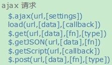

## 1. jQuery 概述

jQuery 是一个 JS 框架，运行在 JS 之上。 **jQuery 就是一组 JS 编写的方法和功能，可以提高开发 JS 的效率，降低代码的开发难度**。JS 框架很多， jQuery 只是其中一个比较流行的框架。

**使用JS框架的好处**：

1. 不同的厂商开发的浏览器之间是有差异。使用框架可以减少甚至消除浏览器之间的差异
2. 减少 javascript 程序开发的工作量

**jQuery框架特点**

1. 轻量级框架：文件体积小，占用系统资源少，效率高。
2. 只要写一套代码，几乎兼容所有主流浏览器，如：chrome，firefox，safari、ie、edge、Opera
3. jQuery本身还支持大量的插件，进一步提升jQuery功能。如：easyUI 必须运行在 jQuery 之上；Bootstrap 表示层框架等
4. 宗旨：write less do more

> Tips: 一些jQuery制作效果网站：www.17sucai.com

### 1.1. jQuery 基础使用

官网：www.jquery.com

1. 对于后台程序员来说，版本之间差别不大。
2. 2.x 以后不支持IE/6/7/8
3. min：压缩版，在使用上，压缩版功能上与正常的版本是一样的。其他主要的特点如下：
	1. 没有注释，没有换行，没有空格。
	2. 所有的变量名都尽可能的短，一般只有一个字母


Code Demo: jQuery的导入并测试是否成功

```html
<!DOCTYPE html>
<html>
	<head>
		<meta charset="utf-8" />
		<title>JQ测试</title>
		<!--导入jQuery脚本文件-->
		<script src="js/jquery-1.8.3.min.js" type="text/javascript"></script>
	</head>
	<body>
		<script type="text/javascript">
			// JQ函数的起点
			$(function(){
				// 代码写在匿名函数中
				alert("我是JQ");
			})
		</script>
	</body>
</html>
```

> Notes: 如果将 `<script>` 的代码都写到JS文件中，只需要在 HTML 文件中导入 JS 文件路径及 JQ 文件路径既可

例如：

```html
<!--导入jQuery脚本文件-->
<script src="js/jquery-1.8.3.min.js" type="text/javascript"></script>
<!--导入js脚本文件-->
<script src="js/xxx.js" type="text/javascript"></script>
```

### 1.2. JavaScript 对象与 jQuery 对象的区别

如果使用 jQuery 框架的话，将使用的是 jQuery 对象，以前使用的是 JS 对象。jQuery 对象中的方法与 JS 对象中的方法是不同的。

#### 1.2.1. 事件写法的区别

两者的区别：

- JS 中事件使用 `on` 开头属性，如：`onclick = funcation()`
- JQ 中所有的事件是方法，如：`click(function())`

#### 1.2.2. 加载次数的区别

- 加载代码的编写方式：
    - JS：`window.onload = function()`
    - JQ：`$(function())`
- 效率：
    - JS：效率更低，等到页面上所有的资源加载完毕才运行，包括引用的链接的图片等
    - JQ：效率更高，只要当前页面上所有的元素加载完毕就会执行。
- 加载次数
    - JS 中只运行最后的 `onload` 方法 1 次
    - JQ 中每个`$()`都会执行

### 1.3. jQuery 对象与 JS 对象之间的转换

原则：如果使用 JQ 框架，尽量使用 JQ 方法和对象。如果是 JS 对象要使用 JQ 对象的方法的话，必须将 JS 对象转换成 JQ 对象；同样，如果 JQ 对象要调用 JS 方法也要进行转换。

JS -> jQuery 转换操作：

```js
$(JS对象);
```

jQuery -> JS 转换操作：

```js
JQ对象[0];
// 或者
JQ对象.get(0);
```

> Notes: <font color=red>**JQ 对象在低层是一个 JS 数组对象，只需要取出第0个元素即可**</font>

### 1.4. jQuery 对象与 DOM 对象之间的转换

在 jQuery 对象中无法使用 DOM 对象的任何方法。此时需要进行转换：

- jQuery 对象转换成 DOM 对象：jquery 提供了两种方法将一个jquery对象转换成一个dom对象，即`[index]`和`get(index)`。因 jQuery 对象就是一个数组对象
- DOM 对象转换成 jQuery 对象：对于一个 DOM 对象，只需要用`$()`把 DOM 对象包装起来，就可以获得一个 jQuery 对象了，即`var ele = $(dom对象);`

## 2. jQuery 的选择器

### 2.1. 选择器的作用

JQ 中如果要对某个或一些元素进行操作，操作之前先要选择对哪些元素来操作，我们就使用选择器。选择器的功能就是用来选元素。类似于 CSS 中选择器

### 2.2. jQuery常用的选择器

1. <font color=red>**基本选择器**</font>
2. 层级选择器
3. 属性选择器
4. 基本过滤选择器
5. 表单属性选择器

### 2.3. 基本选择器（重点）

- `$("标签名")`：标签选择器，选中所有同名的标签。
- `$(".类名")`：类选择器，通过类名选中元素。
- `$("#ID名")`：ID 选择器，通过指定ID选中元素。
- `$("*")`：通配符选择器，选中当前网页上所有的元素。

注意事项：

- 通过标签、类、通配符选择器等获取到的如果是多个元素，内部已经进行了遍历的操作，不需要像JS一样，遍历修改，直接后面调用修改的方法即可批量修改。
- `$("xx","xx",……)` 可以选择多个元素操作，不同元素使用逗号(`,`)隔开
- <font color=red>**ID 名不能是`xx.xx`这种命名**</font>

### 2.4. 层级选择器

- `$("A B")`：获得 A 元素内部的所有的 B 元素。<font color=red>**注意：A 与 B 之间有空格**</font>，B 元素是 A 元素的子孙元素。
- `$("A>B")`：获得 A 元素下面的所有 B 子元素，<font color=red>**不包含孙元素**</font>。
- `$("A+B")`：获得 A 元素同级，下一个 B 元素。B 是 A 的下一个兄弟元素，如果 A 是老二，B 是老三。
- `$("A~B")`：获得 A 元素同级，所有后面 B 元素。返回值是一组 B 元素，A 是老二，B 是老三~最后一个兄弟。
- `元素.siblings()`：获得所有的兄弟元素。得到所有同级的兄弟元素，无论什么标签。
- `元素.siblings("标签名")`：获得所有指定标签的兄弟元素。得到同级的同标签名的元素。

### 2.5. 属性选择器

- `$("标签名[属性名]")`：获得指定 **属性名** 的元素
- `$("标签名[属性名='属性值']")`：获得属性名 **等于值** 的元素
- `$("标签名[属性名!='属性值']")`：获得属性名 **不等于值** 的元素
- `$("标签名[属性名^='属性值']")`：获得属性名 **以值开头** 的元素
- `$("标签名[属性名$='属性值']")`：获得属性名 **以值结尾** 的元素
- `$("标签名[属性名*='属性值']")`：获得属性名 **含有值** 的元素
- `$("标签名[属性名='属性值'] [属性名='属性值'] [属性名='属性值']……")`：复合属性选择器，**多个属性同时过滤**。复合属性选择器，可以组合上面任何一种属性选择器。

注：如果属性值是变量，需要做拼接。示例如下：

```js
// 获取文本框的值
var txt = $("#city").val();
// 根据属性选择器获取选定的元素
$("input[value="+txt+"]").prop("checked","checked");
```

### 2.6. 基本过滤选择器

基本过滤选择器一般用于表格操作，**过滤选择器前面都有一个冒号(`:`)**。

- `:first`：获得选择的元素中的第一个元素
- `:last`：获得选择的元素中的最后一个元素
- `:not()`：不包括指定内容的元素
- `:even`：偶数，从 0 开始计数（包括0）
- `:odd`：奇数，从 0 开始计数
- `:eq()`：等于第几个
- `:gt()`：大于第n个，不含第index个
- `:lt()`：小于第n个，不含第index个
- `:header`：获得标题所有标题元素 （如 `<h1>`/`<h2>`...）
- `:animated`：获得正在执行动画的元素

> Notes: 如果选择多个情况进行 not 过滤，语法为 `$("标签名:not(:first):not(:last)")`，而不是将几个过滤条件写在括号内。

### 2.7. 表单属性选择器

- `:enabled`：可用
- `:disabled`：不可用
- `:checked`：选中(单选 radio，多选 checkbox)
- `:selected`：选择(下拉列表`<select>`中的`<option>`标签)
- `:hidden`：不可见元素

## 3. jQuery 基础使用案例

### 3.1. 倒计时器

在页面中有一个按钮，要求按钮默认不可点击，在规定时间后才可以点击这个按钮

```html
<!DOCTYPE html>
<html>
	<head>
		<meta charset="utf-8">
		<title>倒计时按键</title>
		<!--导入jQuery文件-->
		<script src="js/jquery-1.8.3.min.js" type="text/javascript"></script>
	</head>
	<body>
		<h1 id="h"><span id="second">20</span>秒后按键生效</h1>
		<input type="button" id="b" disabled="disabled" value="时间到了再点我呀！"/>
	</body>
</html>

<script type="text/javascript">
	// 设置打开网页每1秒调用一次方法
	var time = setInterval("change()",1000);
	
	// 定义变量做为改变时间的参数
	var num = 20;
	
	function change(){
		// 每调用一次方法，时间减1
		num--;
		// 改变span块的内容
		$("#second").html(num);
		//当num到0的时候，将按键恢复可用状态和改变面容相关的提示内容
		if(num == 0){
			$("#h").html("现在按键可以使用了");
			$("#b").attr("value","现在可以点我了呀，来呀~");
			$("#b").removeAttr("disabled");
			// 还要将计时器清空
			clearInterval(time);
		}
	}
	
	// 设置按键点击事件
	$("#b").click(function(){
		alert("终于给你等到了！！！！");
	});
</script>
```

### 3.2. 表单操作

案例需求：文本框中输入内容，下拉列表则选中该内容。

html 页面文件

```html
<!DOCTYPE html>
<html>
	<head>
		<meta charset="utf-8">
		<title>jQuery方法</title>
		<!-- 导入jQuery文件 -->
		<script src="js/jquery-1.8.3.min.js" type="text/javascript"></script>
		<!--导入外部JS文件-->
		<script src="js/Day33Level02Test01.js" type="text/javascript"></script>
		<!--1. 在页面中编写标签
		2.引入jquery的库文件，写jquery代码
		定义数组，编写数组内容显示到下拉列表，
		判断输入项值和下拉列表值是否相同，默认选中-->
	</head>
	<body>
		<input type="button" id="b" value="点击导入选择框内容" />
		<input type="text" id="txt" value="输入内容选择下拉列表内容" />
		<hr />
		<select id="e">
			<option value="0">--匹配文本框内容--</option>
		</select>
	</body>
</html>
```

JS 文件

```js
// 定义数组
var arr = ["帝释天","剑圣","步惊云","聂风","断浪","无名"];

// 定义点击事件，给下拉菜单赋值
$(function(){
	$("#b").click(function(){
		// 每次先清单下拉菜单，不让每次点击都新增
		$("#e>option:not(:first)").remove();
	
		// 遍历数组给下拉菜单赋值
		$(arr).each(function(index, element){
			$("#e").append($("<option value="+ (element) +">"+ element+ "</option>"));
		});
	});
	
	$("#txt").bind({
		focus:function(){
			// 设置获取焦点事件，将文本框的内容清除
			$("#txt").val("");
		},
		keyup:function(){
			// 设置键盘松开事件，判断输入的内容并选择下拉菜单
			$("option[value="+ $("#txt").val() +"]").prop("selected", "selected");
		}
	});
})
```

### 3.3. 级联下拉菜单

案例需求：

1. 定义一个二维数组，保存各个城市的数据。
2. 编写城市下拉框的改变事件。先得到当前选中的城市值，把城市的值做为数组的下标。
3. 添加数组中的数据到区域的下拉框中，添加之前先清空原有的数组，但要保留第一行。
4. 使用 `each()` 函数对数组进行遍历，添加元素到区域下拉框中

```html
<!DOCTYPE html>
<html>
	<head>
		<meta charset="UTF-8">
		<title></title>
		<!--导入jQuery文件-->
		<script src="../js/jquery-1.8.3.min.js" type="text/javascript"></script>
	</head>
	<body>
		<!-- 城市 -->
		<select id="city" name="city">
			<option value="">--请选择城市--</option>
			<option value="0">北京市</option>
			<option value="1">天津市</option>
			<option value="2">上海市</option>
			<option value="3">广州市</option>
		</select>
		<!-- 区域 -->
		<select id="area" name="area">
			<option>--请选择区域--</option>
		</select>
	</body>
</html>
<script type="text/javascript">
	//准备城市的二维数组
	var areas = [
		["海淀区", "昌平区", "朝阳区"], //北京0
		["南开区", "和平区", "西青区"], //天津1
		["浦东区", "浦西区", "闵行区"], //上海2
		["天河区", "番禺区", "海珠区"] //广州3
	];
	
	// 根据城市的值增加右边的数组选项
	$("#city").change(function(){
		// 先将城市下拉列表清空
		$("#area>option:not(:first)").remove();
		// 根据省份的值，获取相关的城市列表
		var arr = areas[$("#city>option:selected").val()];
		// 遍历数组，将相关的城市增加到区域下拉列表中
		$.each(arr,function(index, element){
			$("#area").append($("<option>"+ element +"</option>"));
		});
	});
</script>
```

## 4. jQuery 的 AJAX 使用

使用 jQuery 的 ajax 开发，大大提供开发效率，并且<font color=red>**具有浏览器兼容性**</font>。

### 4.1. jQuery 的 AJAX 语法格式

#### 4.1.1. $.post()

`$.post()` 用于以 post 请求方式发送 ajax。语法格式如下：

```js
jQuery.post(url, [data], [callback], [type])
```

- 参数 1：url，请求路径(请求servlet路径)

```js
String url = "${pageContext.request.contextPath}/xxx";
```

- 参数 2：data，设置提交请求参数

```js
// 数据格式1：js对象格式
var data = {name:"admin",pwd:"123789"};
// 数据格式2：key1=value1&key2=value2……
var data = "name=admin&pwd=123456";
```

- 参数 3：callback，回调函数，直接符合参数4和200的状态码。

```js
// 这里的参数result是服务器响应的数据
function(result) {
    回调函数的代码体
};
```

- 参数 4：type，设置服务器响应的数据的类型。可以不设置，返回内容格式：xml, html, script, json, text, _default。
    - "text"，默认返回类型
    - "json"，服务器一般响应的一个字符串，默认 js 接收也是一个字符串，但是<font color=red>**如果设置 json，js 接收的就是 js 对象，如果是对象就可以调用属性**</font>。

#### 4.1.2. $.get()

`$.get()` 用于以 get 请求方式发送 ajax。除了请求方式不同，使用方式与 `$.post()` 完全一致。

> Tips: 格式中`[]`代表可选内容

#### 4.1.3. $.ajax

查看 Jquery API，ajax 请求一共有6种方式：



> Tips: 其中 `$.ajax(url, [settings])`，包括的类型最大，其他几种方式都是基于此方式修改。

`$.ajax(url,[settings])` 通用的发送 ajax 请求格式。相关参数说明如下：

- `url,[settings]`
    - `url`: 一个用来包含发送请求的URL字符串。
    - `settings`: AJAX 请求设置。所有选项都是可选的，*V1.5 版本以上才有*
- `type`：请求方式："POST" 或 "GET"，默认为"GET"
- `data`：Object 或 String 类型，发送到服务器的数据。将自动转换为请求字符串格式。
- `dataType`：预期服务器返回的数据类型。如：
    - `"json"`: 返回 JSON 数据；
    - `"script"`: 返回纯文本 JavaScript 代码；
    - `"xml"`: 返回 XML 文档；
    - `"html"`: 返回纯文本 HTML 信息；
    - `"jsonp"`: JSONP 格式；
    - `"text"`: 返回纯文本字符串；
- `success`：请求成功后的回调函数。参数：由服务器返回，并根据dataType参数进行处理后的数据；描述状态的字符串。
- `error`：请求失败时调用此函数(默认: 自动判断 xml 或 html)。有以下三个参数：
    - XMLHttpRequest 对象。
    - 错误信息。如果发生了错误时，除了得到 null 之外，还可能是 "timeout", "error", "notmodified" 和 "parsererror"。
    - （可选）捕获的异常对象。

节选 project A 项目基础使用案例

```js
// 发送ajax请求 
$.ajax({
	// 提交异步请求的url
	url:"${ctx}/sysadmin/deptAction_delete",
	// 请求提交的方式:post/get
	type:"post",
	// 请求提交的参数
	data:{"deptId":id},
	// 返回的数据格式
	dataType:"json",
	// 响应成功时候的回调函数
	success:function(result){
		// 判断返回的结果
		if(result.msg == 1){
			// 删除成功
			$.messager.alert("提示","删除成功！","info");
			// 使用datagrid的重新加载的方法,加载当前网页
			$("#deptList").datagrid("reload");
		}else{
			// 有子部门存在，不能删除
			$.messager.alert("提示","删除失败，删除的部门下有子部门！","warning");
		}
	},
	// 响应失败时候的回调函数
	error:function(){
		// 提示错误
		$.messager.alert("提示","删除请求失败，请联系管理员！","warning");
	}
});
```

### 4.2. jQuery 的 AJAX 使用注意事项

#### 4.2.1. 关于 name 属性

原本表单的提交是需要 name 的属性，但使用 ajax 提交，不需要 name 的属性。因为使用 ajax 后，是直接走 ajax 发送请求。

```js
// username就是name属性
var data = {username:$("#username").val()};
```

#### 4.2.2. 关于 Servlet 响应的类型设定

如果想发送的是 json 格式，servlet 使用 `setContentType` 是 text/html 的格式，前端 js 必须设置 `type="json"`;

```java
response.setContentType("text/html;charset=utf-8");
```

如果设置响应 `setContentType` 的是 json 类型，则前端 js 无需设置 `type="json"`

```js
response.setContentType("application/json;charset=utf-8");
```

#### 4.2.3. 同步与异步处理异常方式不同

同步处理异常可以在dao数据访问层直接处理。

<font color=red>**异步处理异常不能直接处理**</font>，因为页面不会刷新，如果在 dao 数据访问层处理后，页面完全不会接收到任何提示信息。所以需要在 dao 层抛出异常，最后<font color=red>**在 servlet 层进行捕获**</font>，再响应异常的信息到页面上。

#### 4.2.4. AJAX不能直接进行页面的跳转

不能在 servlet 里进行跳转的操作，需要在 JSP 页面的回调函数中，对返回的数据进行判断，再进行页面的跳转。

#### 4.2.5. 使用拼接字符的方式生成json格式

前端 js 的 ajax 代码获取服务器响应的 json 数据，key 必须使用双引号，value 除了 boolean 或数字也必须使用双引号。

### 4.3. AJAX 案例

#### 4.3.1. 基础使用

后端处理请求代码

```java
package lessonDemo;

import java.io.IOException;
import java.io.PrintWriter;

import javax.servlet.ServletException;
import javax.servlet.http.HttpServlet;
import javax.servlet.http.HttpServletRequest;
import javax.servlet.http.HttpServletResponse;

public class HelloServlet extends HttpServlet {

	public void doGet(HttpServletRequest request, HttpServletResponse response)
			throws ServletException, IOException {
		// 处理乱码问题，设置网页内容编码
		request.setCharacterEncoding("utf-8");
		response.setContentType("text/html;charset=utf-8");
		// 获取打印输出流对象
		PrintWriter out = response.getWriter();
		
		// 获得数据
		String name = request.getParameter("name");
		String pwd = request.getParameter("pwd");
		
		// 输入数据到控制台和响应数据
		System.out.println(name + " == " + pwd);
		out.print("提交成功，获得数据" + name + " == " + pwd);
		
		// 关闭输出流对象
		out.close();
	}

	public void doPost(HttpServletRequest request, HttpServletResponse response)
			throws ServletException, IOException {
		doGet(request, response);
	}
}
```

前端测试 jsp

```html
<%@ page language="java" import="java.util.*" pageEncoding="UTF-8"%>
<%@ taglib prefix="c" uri="http://java.sun.com/jsp/jstl/core" %>

<!DOCTYPE HTML PUBLIC "-//W3C//DTD HTML 4.01 Transitional//EN">
<html>
  <head>
    <title>ajxa test</title>
  </head>
  <script type="text/javascript" src="${pageContext.request.contextPath}/js/jquery-1.8.3.min.js"></script>

	<body>
		<input type="button" value="get请求" onclick="sendGet()"/>
		<hr/>
		<input type="button" value="post请求" onclick="sendPost()"/>
	</body>
</html>

<script type="text/javascript">
	function sendPost(){
		// $.post() 以post请求方式发送ajax
		// 格式：jQuery.post(url, [data], [callback], [type])
		// 设置请求的url
		var url = "${pageContext.request.contextPath}/hello";
		// 设置提交的数据,post数据格式是： key1=value1&key2=value2...
		var data = "name=post-伤月&pwd=123456";
		// 设置回调函数
		var callback = function(data){
			alert(data);
		}
		// 执行jquery的ajax方式post方式
		$.post(url, data, callback);
	}
	
	function sendGet(){
		// $.get() 以 get 请求方式发送 ajax
		// 除了请求方式不同，使用方式与$.post()完全一致。
		// 设置请求的url
		var url ="${pageContext.request.contextPath}/hello";
		// 设置提交数据，get数据格式是：js对象格式
		var data = {name:"get-admin",pwd:"123789"};
		// 设置回调函数
		var callback = function(data){
			alert(data);
		}
		// 执行jquery的ajax方式get方式
		$.get(url, data, callback);
	}
</script>
```

#### 4.3.2. 异步用户名校验

案例需求：

1. `<input name="username">`失去焦点时，使用 `$.post()` 将用户名 username 以 ajax 方式发送给服务器
2. 服务器获得用户名，并通过用户名查询用户
    - 如果用户名存在，返回不可用提示
    - 如果用户名可用，返回可用提示
3. 根据服务器响应的 json 数据，控制提示信息的显示和提交的按钮是否可用。 

验证 servlet 层代码

```java
package com.moonzero.servlet;

import java.io.IOException;

import javax.servlet.ServletException;
import javax.servlet.http.HttpServlet;
import javax.servlet.http.HttpServletRequest;
import javax.servlet.http.HttpServletResponse;

import com.moonzero.service.UserService;

public class UserCheckUsernameServlet extends HttpServlet {

	// 创建用户业务逻辑层对象
	private UserService us = new UserService();

	public void doGet(HttpServletRequest request, HttpServletResponse response)
			throws ServletException, IOException {
		// 处理乱码问题设置网页内容编码
		request.setCharacterEncoding("utf-8");
		// 如果想发送的是json格式,这个使用text/html，前端js必须设置type="json";
		// response.setContentType("text/html;charset=utf-8");
		// 如果设置响应的是json类型，则前端js无需设置type="json"
		response.setContentType("application/json;charset=utf-8");

		// 获取请求提交参数
		String username = request.getParameter("username");
		// 定义json数据
		String jsonData = "";

		System.out.println(username);// 测试是否传递了用户名，可删

		try {
			// 调用业务层查询用户的方法
			if (us.findByName(username)) {
				// 用户名已存在，返回不可用提示
				jsonData = "{\"message\":\"用户名不可用\",\"flag\":false}";
			} else {
				// 用户名不存在，返回可用提示
				jsonData = "{\"message\":\"用户名可使用\",\"flag\":true}";
			}

			System.out.println(jsonData);// 测试jsonData效果，可删
			// 响应数据
			response.getWriter().print(jsonData);

			// 模拟异常
			// throw new RuntimeException();

		} catch (Exception e) {
			e.printStackTrace();
			// 处理异常，将异常的信息封装成json对象发送
			jsonData = "{\"message\":\"系统出现异常\",\"flag\":\"error\"}";
			// 响应数据
			response.getWriter().print(jsonData);
		}
	}

	public void doPost(HttpServletRequest request, HttpServletResponse response)
			throws ServletException, IOException {
		doGet(request, response);
	}
}
```

dao 和 service 层代码

```java
public class UserService {

	// 创建数据访问层对象
	private UserDao dao = new UserDao();
	
	/**
	 * 查询用户的方法
	 * @param username
	 * @return
	 */
	public boolean findByName(String username) throws Exception {
		// 调用数据访问层查找方法
		if(dao.findByName(username) != null){
			// 查找返回对象不为空
			return true;
		}
		// 查找返回对象为空
		return false;
	}
	
}

public class UserDao {
	// 获取查询器对象
	private QueryRunner qr = new QueryRunner(C3P0Util.getDataSource());

	/**
	 * 根据用户名查找用户对象
	 * 
	 * @param username
	 * @return 返回用户对象
	 */
	public User findByName(String username) throws Exception {
		// 根据用户名查询sql语句
		String sql = "select * from `user` where username=?;";

		// 调用查询器对象方法查询返回用户对象
		try {
			return qr.query(sql, new BeanHandler<User>(User.class), username);
		} catch (SQLException e) {
			e.printStackTrace();
			throw new RuntimeException(e);
		}
	}
}
```

jsp 部分代码

```html
<div class="form-group">
	<label for="username" class="col-sm-2 control-label">用户名</label>
	<div class="col-sm-6">
		<input type="text" class="form-control" id="username" name="username" placeholder="请输入用户名">
		<div class="col-sm-6"><span id="usernameMsg"></span></div>
	</div>

	<%-- 使用ajax进行用户名异步验证 --%>
	<script type="text/javascript">
		$("#username").blur(function(){
			// 验证输入数据是否为空字符串
			if($("#username").val() == ""){
				$("#usernameMsg").css("color","red");
				$("#usernameMsg").html("用户名不能为空");
				return;
			}
	
			// 1.请求路径
			var url = "${pageContext.request.contextPath}/checkUsername";
			// 2.请求参数,使用json格式
			var data = {username:$("#username").val()};
			// 3.回调函数
			var callback = function(result){
			// 判断回调数据
				if(result.flag == true){
					// 用户名可以使用
					// 激活提交按钮
					$("#registerButton").prop("disabled",false);
					$("#usernameMsg").css("color","green");
					// 判断修改属性后，读取回调数据中的提示信息
					$("#usernameMsg").html(result.message);
				}else if (result.flag == false){
					// 用户名不可以使用
					// 提交按钮不可使用
					$("#registerButton").prop("disabled",true);
					$("#usernameMsg").css("color","red");
					// 判断修改属性后，读取回调数据中的提示信息
					$("#usernameMsg").html(result.message);
				}else{
					// 出现异常，读取回调数据中的提示信息
					alert(result.message);
				}
			}
			// 使用post方法提交请求
			$.post(url, data, callback, "json");
		});
	</script>
</div>

<div class="col-sm-offset-2 col-sm-10">
	<input type="submit"  width="100" value="注册" name="submit" id="registerButton" border="0"
	style="background: url('./images/register.gif') no-repeat scroll 0 0 rgba(0, 0, 0, 0);
	height:35px;width:100px;color:white;" class="form-control">
</div>
```
