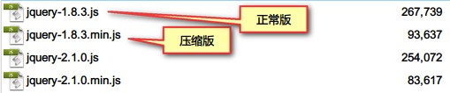

# jQuery

## 1. 概述

jQuery 是一个 JS 框架，运行在 JS 之上。 **jQuery 就是一组 JS 编写的方法和功能，可以提高开发 JS 的效率，降低代码的开发难度**。JS 框架很多， jQuery 只是其中一个比较流行的框架。

**使用JS框架的好处**：

1. 不同的厂商开发的浏览器之间是有差异。使用框架可以减少甚至消除浏览器之间的差异
2. 减少 javascript 程序开发的工作量

**jQuery框架特点**

1. 轻量级框架：文件体积小，占用系统资源少，效率高。
2. 只要写一套代码，几乎兼容所有主流浏览器，如：chrome，firefox，safari、ie、edge、Opera
3. jQuery本身还支持大量的插件，进一步提升jQuery功能。如：easyUI 必须运行在 jQuery 之上；Bootstrap 表示层框架等
4. 宗旨：write less do more

> Tips: 一些jQuery制作效果网站：www.17sucai.com

## 2. jQuery 基础使用

### 2.1. 下载与导入

官网：www.jquery.com

1. 对于后台程序员来说，版本之间差别不大。
2. 2.x 以后不支持IE/6/7/8
3. min：压缩版，在使用上，压缩版功能上与正常的版本是一样的。其他主要的特点如下：
	1. 没有注释，没有换行，没有空格。
	2. 所有的变量名都尽可能的短，一般只有一个字母



Code Demo: jQuery的导入并测试是否成功

```html
<!DOCTYPE html>
<html>
	<head>
		<meta charset="utf-8" />
		<title>JQ测试</title>
		<!--导入jQuery脚本文件-->
		<script src="js/jquery-1.8.3.min.js" type="text/javascript"></script>
	</head>
	<body>
		<script type="text/javascript">
			// JQ函数的起点
			$(function(){
				// 代码写在匿名函数中
				alert("我是JQ");
			})
		</script>
	</body>
</html>
```

> Notes: 如果将 `<script>` 的代码都写到JS文件中，只需要在 HTML 文件中导入 JS 文件路径及 JQ 文件路径既可

例如：

```html
<!--导入jQuery脚本文件-->
<script src="js/jquery-1.8.3.min.js" type="text/javascript"></script>
<!--导入js脚本文件-->
<script src="js/xxx.js" type="text/javascript"></script>
```
