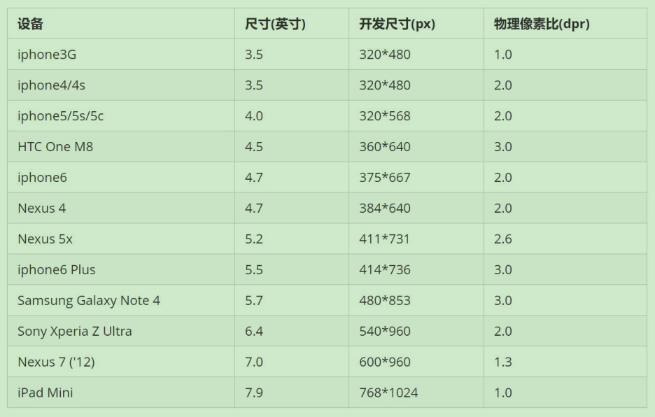
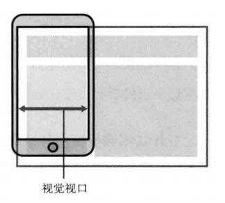
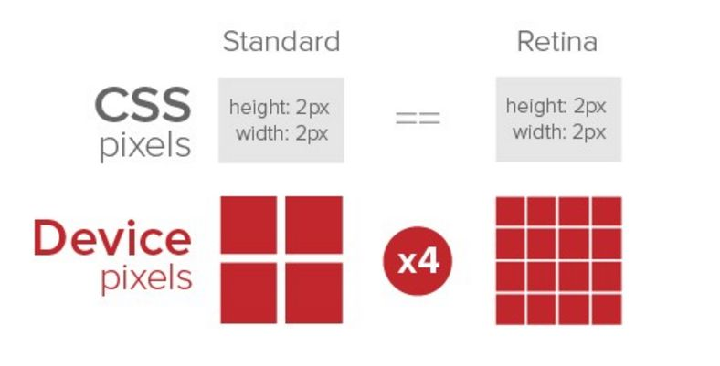
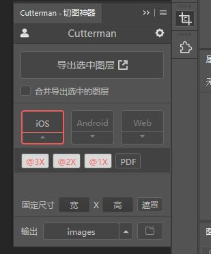
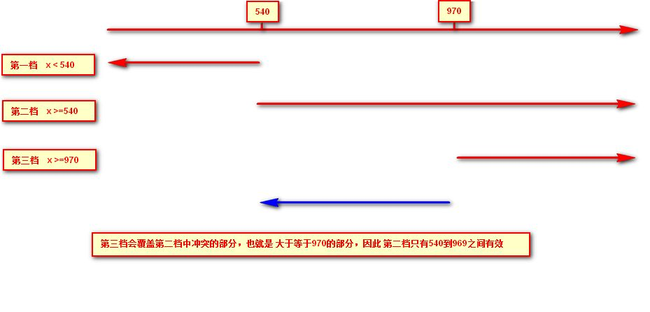
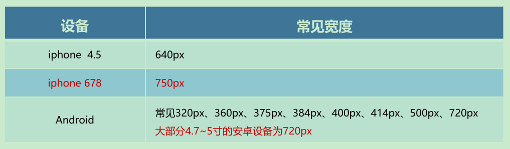
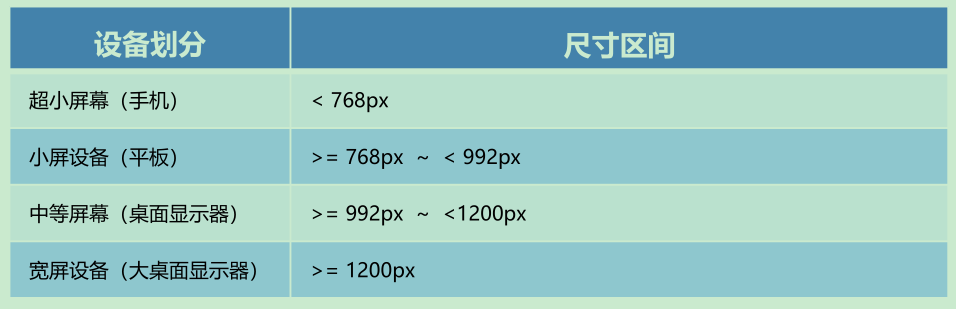
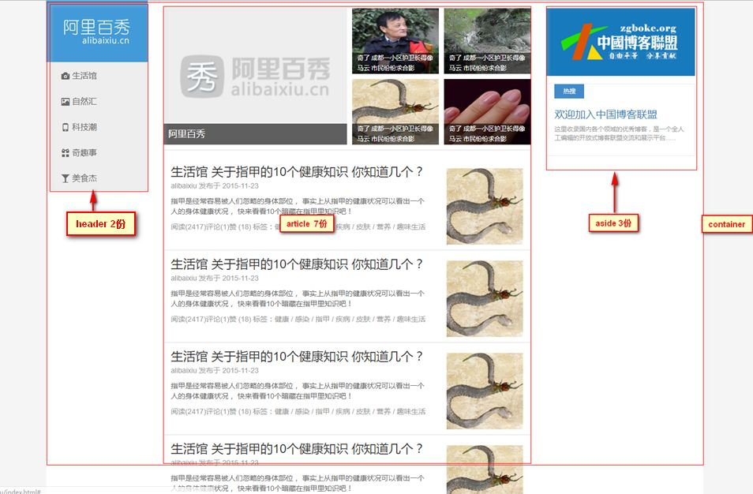

## 1. 移动端开发基础

### 1.1. 浏览器现状

国内的几乎所有手机浏览器都是根据Webkit修改过来的内核，国内尚无自主研发的内核，就像国内的手机操作系统都是基于Android修改开发的一样。

<font color=red>**总结：兼容移动端主流浏览器，处理Webkit内核浏览器即可。**</font>

### 1.2. 手机屏幕现状

- 移动端设备屏幕尺寸非常多，碎片化严重
- Android设备有多种分辨率：480x800, 480x854, 540x960, 720x1280，1080x1920等，还有传说中的2K，4k屏
- 近年来iPhone的碎片化也加剧了，其设备的主要分辨率有：640x960, 640x1136, 750x1334, 1242x2208等
- 作为开发者无需关注这些分辨率，因为常用的尺寸单位是 px 。

### 1.3. 常见移动端屏幕尺寸



> 注：
>
> - 以上数据均参考自 https://material.io/devices/
> - 作为前端开发，不建议去纠结dp，dpi，pt，ppi等单位。

### 1.4. 移动端调试方法

- Chrome DevTools（谷歌浏览器）的模拟手机调试
- 搭建本地web服务器，手机和服务器一个局域网内，通过手机访问服务器
- 使用外网服务器，直接IP或域名访问

## 2. 视口

视口（viewport）就是浏览器显示页面内容的屏幕区域。**视口可以分为布局视口、视觉视口和理想视口**

### 2.1. 布局视口 (layout viewport)

- 一般移动设备的浏览器都默认设置了一个布局视口，用于解决早期的PC端页面在手机上显示的问题。
- IOS, Android基本都将这个视口分辨率设置为 980px，所以PC上的网页大多都能在手机上呈现，只不过元素看上去很小，一般默认可以通过手动缩放网页。


### 2.2. 视觉视口 (visual viewport)

- 是指用户正在看到的网站的区域。<font color=red>**注意：是网站的区域**</font>。
- 可以通过缩放去操作视觉视口，但不会影响布局视口，布局视口仍保持原来的宽度。



### 2.3. 理想视口 (ideal viewport)

- 为了使网站在移动端有最理想的浏览和阅读宽度而设定
- 理想视口，对设备来讲，是最理想的视口尺寸
- 需要手动添写meta视口标签通知浏览器操作
- meta视口标签的主要目的：布局视口的宽度应该与理想视口的宽度一致，简单理解就是设备有多宽，我们布局的视口就多宽

### 2.4. meta 视口标签

#### 2.4.1. 定义和用法

- `<meta>` 元素可提供有关页面的元信息（meta-information），比如针对搜索引擎和更新频度的描述和关键词。
- `<meta>` 标签位于文档的头部，不包含任何内容。`<meta>` 标签的属性定义了与文档相关联的名称/值对。

示例：

```html
<meta name="viewport" content="width=device-width, user-scalable=no,
      initial-scale=1.0, maximum-scale=1.0, minimum-scale=1.0">
```

> 注：
>
> - 在 HTML 中，`<meta>` 标签没有结束标签。
> - `<meta>` 标签永远位于 head 元素内部。
> - 元数据总是以名称/值的形式被成对传递的。

#### 2.4.2. 标签的属性

|   属性    |    值     |                      描述                       |
| :-------: | :-------: | ---------------------------------------------- |
| `content` | some_text | 定义与 http-equiv 或 name 属性相关的元信息（必需） |

content 属性相应的名称/值含义

|      属性       |                     解释说明                      |
| :-------------: | ------------------------------------------------ |
|     `width`     | 宽度设置的是viewport宽度，可以设置device-width特殊值 |
| `initial-scale` | 初始缩放比，大于0的数字                             |
| `maximum-scale` | 最大缩放比，大于0的数字                             |
| `minimum-scale` | 最小缩放比，大于0的数字                             |
| `user-scalable` | 用户是否可以缩放，yes或no（1或0）                   |

### 2.5. 标准的 viewport 设置

- 视口宽度和设备保持一致
- 视口的默认缩放比例1.0
- 不允许用户自行缩放
- 最大允许的缩放比例1.0
- 最小允许的缩放比例1.0

## 3. 二倍图

### 3.1. “物理像素”与“物理像素比”

- 物理像素点指的是屏幕显示的最小颗粒，是物理真实存在的。这是厂商在出厂时就设置好了。
- PC端页面，`1px` 等于1个物理像素的，但在移动端开发时候的 `1px` 不是一定等于1个物理像素的
- 1px 能显示的物理像素点的个数，称为**物理像素比**或**屏幕像素比**
- PC端和早前的手机屏幕/普通手机屏幕: `1 CSS像素 = 1 物理像素`的
- Retina（视网膜屏幕）是一种显示技术，可以将把更多的物理像素点压缩至一块屏幕里，从而达到更高的分辨率，并提高屏幕显示的细腻程度。



### 3.2. 多倍图

在标准的viewport设置中，使用倍图来提高图片质量，解决在高清设备中的模糊问题

> 对于一张 50px×50px 的图片，在手机 Retina 屏中打开，按照刚才的物理像素比会放大倍数，这样会造成图片模糊。通常使用二倍图，因为iPhone 6\7\8 的影响,但是现在还存在3倍图4倍图的情况，这个看实际开发项目的需求

### 3.3. 扩展 - 多倍图切图 cutterman

Photoshop的插件



## 4. 移动端技术解决方案

### 4.1. 移动端开发选择方案

1. 单独制作**移动端页面**（主流）。如京东商城手机版、淘宝触屏版、...
    - 通常情况下，网址域名前面加 m(mobile) 可以打开移动端。通过判断当前用户的设备，如果是移动设备时，打开页面则跳到移动端页面。
2. **响应式页面**兼容移动端（其次）。如三星手机官网、...
    - 通过判断屏幕宽度来改变样式，以适应不同终端。缺点：制作麻烦，需要花很大精力去调兼容性问题

总结：市场是常见的移动端开发有**单独制作移动端页面**和**响应式页面**两种方案，现在市场主流的选择还是单独制作移动端页面

### 4.2. 移动端浏览器

移动端浏览器基本以 webkit 内核为主，因此只需考虑webkit兼容性问题。同时浏览器的私有前缀也只需要考虑添加 webkit 即可

### 4.3. 移动端CSS初始化 normalize.css

移动端 CSS 初始化推荐使用 normalize.css

- Normalize.css：保护了有价值的默认值
- Normalize.css：修复了浏览器的bug
- Normalize.css：是模块化的
- Normalize.css：拥有详细的文档

官网地址： http://necolas.github.io/normalize.css/

### 4.4. 移动特殊样式处理

```css
xxx {
    /* CSS3盒子模型 */
    box-sizing: border-box;
    -webkit-box-sizing: border-box;
    /* 点击会出现高亮，需要清除清除 设置为transparent 完成透明 */
    -webkit-tap-highlight-color: transparent;
    /* 在移动端浏览器默认的外观在iOS上加上这个属性才能给按钮和输入框自定义样式 */
    -webkit-appearance: none;
    /* 禁用长按页面时的弹出菜单 */
    -webkit-touch-callout: none;
}
```

## 5. 移动端常见布局

1. 单独制作移动端页面
    - 流式布局（百分比布局）
    - flex 弹性布局（强烈推荐）
    - less+rem+媒体查询布局
    - 混合布局
2. 响应式页面兼容移动端
    - 媒体查询
    - bootstarp

<font color=violet>**建议：项目开发可以灵活选取一种主要技术选型，再以其他技术做为辅助，混合技术开发**</font>

## 6. 流式布局（百分比布局）

### 6.1. 定义

- 流式布局，就是百分比布局，也称非固定像素布局。
- 通过盒子的宽度设置成百分比来根据屏幕的宽度来进行伸缩，不受固定像素的限制，内容向两侧填充。
- 流式布局方式是移动web开发使用的比较常见的布局方式。

如果只根据屏幕的大小去改变盒子的宽度（高度），那里面的内容就可能变得混乱，所以一般需要设置盒子的最大/最小的宽度（高度）

- `max-width`/`max-height` 最大宽/高度
- `min-width`/`min-height` 最小宽/高度

示例：

```html
<section>
    <div></div>
    <div></div>
</section>
```

```css
* {
    margin: 0;
    padding: 0;
}

section {
    width: 100%;
    max-width: 980px; /* 最大宽度 */
    min-width: 320px; /* 最小宽度 */
    margin: 0 auto;
}

section div {
    float: left;
    width: 50%;
    height: 400px;
}

section div:nth-child(1) {
    background-color: pink;
}

section div:nth-child(2) {
    background-color: purple;
}
```

### 6.2. 流式布局案例 - 仿京东移动端首页

案例需求：模拟京东移动端首页。案例代码详见：`html-css-js-sample\css-composite-sample\H5-jd-portal`

#### 6.2.1. 确定技术选型

- 方案：采取单独制作移动页面方案
- 技术：布局采取流式布局

#### 6.2.2. 搭建项目目录结构

```
-- css        项目样式文件
-- images     项目图片
-- upload     项目图片
-- index.html  首页
```

#### 6.2.3. 设置视口标签以及引入初始化样式

```html
<!-- 设置视口标签 -->
<meta
    name="viewport"
    content="width=device-width, initial-scale=1.0, user-scalable=no, maximum-scale=1.0, minimum-scale=1.0"
/>

<!-- 引入css初始化文件 -->
<link rel="stylesheet" href="css/normalize.css" />
<!-- 引入首页的css -->
<link rel="stylesheet" href="css/index.css" />
```

#### 6.2.4. 常用初始化样式

```css
body {
    width: 100%;
    min-width: 320px;
    max-width: 640px;
    margin: 0 auto;
    font-size: 14px;
    font-family: -apple-system, Helvetica, sans-serif;
    color: #666;
    line-height: 1.5;
}
```

#### 6.2.5. 二倍精灵图做法

因为是二倍图的缘故，如果直接测量所需图标的位置是有问题的。正常的操作如下：

- 在firework里面把精灵图等比例缩放为原来的一半
- 之后根据大小测量坐标
- 注意代码里面`background-size`，设置精灵图原来宽度的一半

#### 6.2.6. 图片格式

**DPG图片压缩技术**

京东自主研发推出DPG图片压缩技术，经测试该技术，可直接节省用户近50%的浏览流量，极大的提升了用户的网页打开速度。能够兼容jpeg，实现全平台、全部浏览器的兼容支持，经过内部和外部上万张图片的人眼浏览测试后发现，压缩后的图片和webp的清晰度对比没有差距。

**webp 图片格式**

谷歌开发的一种旨在加快图片加载速度的图片格式。图片压缩体积大约只有JPEG的2/3，并能节省大量的服务器宽带资源和数据空间

## 7. flex 布局（推荐）

flex 布局是一种"弹性布局"，特别适用于移动端

> 关于flex布局详见[《CSS 基础知识》笔记](/前端资料/CSS/CSS-基础)中的『flex 伸缩布局』章节

## 8. rem适配布局（推荐）

流式布局和flex布局主要针对于宽度布局，无法适配高度。如果需要随着屏幕大小变化，页面布局文字变化、元素高度和宽度等比例缩放，此时需要用到**rem适配布局**

### 8.1. rem 单位

rem (root em)是一个相对单位，类似于em，em是父元素字体大小。不同的是<font color=red>**rem的基准是相对于html元素的字体大小，与父元素无关**</font>。

rem的优势：父元素文字大小可能不一致，但是整个页面只有一个html，可以很好来控制整个页面的元素大小

比如，根元素（html）设置`font-size=12px;`，非根元素设置`width:2rem;`，则换成px表示就是24px。

```html
/* 根 html 为 12px */
html {
    font-size: 12px;
}
/* 此时 div 的字体大小就是 24px */
div {
    font-size: 2rem;
}
```

### 8.2. 媒体查询 (CSS3)

#### 8.2.1. 什么是媒体查询

媒体查询（Media Query）是CSS3新语法。

- 使用 `@media` 查询，可以针对不同的媒体类型定义不同的样式
- `@media` 可以针对不同的屏幕尺寸设置不同的样式
- 当在重置浏览器大小的过程中，页面也会根据浏览器的宽度和高度重新渲染页面
- 目前针对很多苹果手机、Android手机，平板等设备都用得到多媒体查询

#### 8.2.2. 语法规范

```css
@media mediatype and|not|only (media feature) {
    CSS-Code;
}
```

参数解释：

- `@media`：用于定义媒体查询的标识，注意`@`符号
- `mediatype`：媒体类型
- `and`、`not`、`only`：连接符
- `media feature`：媒体特性，必须有小括号包含

##### 8.2.2.1. mediatype 查询类型

将不同的终端设备划分成不同的类型，称为媒体类型

|    值    |                   描述                   |
| :------: | --------------------------------------- |
|  `all`   | 用于所有设备                             |
| `print`  | 用于打印机和打印预览                      |
| `screen` | 用于电脑屏幕，平板电脑，智能手机等【最常用】 |

##### 8.2.2.2. 关键字

关键字将媒体类型或多个媒体特性连接到一起做为媒体查询的条件。

- `and`：可以将多个媒体特性连接到一起，相当于“且”的意思。
- `not`：排除某个媒体类型，相当于“非”的意思，可以省略。
- `only`：指定某个特定的媒体类型，可以省略。

##### 8.2.2.3. 媒体特性

每种媒体类型都具体各自不同的特性，根据不同媒体类型的媒体特性设置不同的展示风格。<font color=red>**注意：特性需要定义在小括号内**</font>。以下列举常用的3个

|     值      |              描述               |
| :---------: | ------------------------------ |
|   `width`   | 定义输出设备中页面可见区域的宽度   |
| `min-width` | 定义输出设备中页面最小可见区域宽度 |
| `max-width` | 定义输出设备中页面最大可见区域宽度 |

> <font color=red>**注意：媒体特性中设置宽度的单位不能省略，否则不生效**</font>

#### 8.2.3. 媒体查询案例

案例需求：根据页面宽度改变背景变色

实现思路：

1. 按照从大到小的或者从小到大的思路
2. 注意我们有最大值 `max-width` 和最小值 `min-width` 都是包含等于的
3. 当屏幕小于540像素，背景颜色变为蓝色（`x <= 539`）
4. 当屏幕大于等于540像素并且小于等于969像素的时候背景颜色为绿色 (`540 <= x <= 969`）
5. 当屏幕大于等于970像素的时候，背景颜色为红色（`x >= 970`）

```html
<style>
    /* 1. 媒体查询一般按照从大到小或者从小到大的顺序来 */
    /* 2. 小于540px 页面的背景颜色变为蓝色 */

    @media screen and (max-width: 539px) {
        body {
            background-color: blue;
        }
    }
    /* 3. 540 ~ 970 我们的页面颜色改为 绿色 */
    /* @media screen and (min-width: 540px) and (max-width: 969px) {
        body {
            background-color: green;
        }
    } */

    /* 只需要写最小值即可，因为css后面的效果可以覆盖前面 */
    @media screen and (min-width: 540px) {
        body {
            background-color: green;
        }
    }
    /* 4. 大于等于970 我们页面的颜色改为 红色 */
    @media screen and (min-width: 970px) {
        body {
            background-color: red;
        }
    }
    /* 5. screen 还有 and 必须带上不能省略的 */
    /* 6. 数字后面必须跟单位  970px   这个 px 不能省略的 */
</style>

<body></body>
```

> <font color=red>**注意：为了防止混乱，媒体查询一般按照从小到大或者从大到小的顺序来写，建议从小到大的顺序来写**</font>，这样代码更简洁

媒体查询从小到大优势代码分析



### 8.3. 媒体查询 + rem实现元素动态大小变化

- rem单位是参考html根元素的字体大小，有了rem页面元素可以设置不同大小尺寸
- 媒体查询可以根据不同设备宽度来修改样式
- 媒体查询 + rem 就可以实现不同设备宽度，实现页面元素大小的动态变化

案例：

```html
<style>
    * {
        margin: 0;
        padding: 0;
    }
    /* 通过媒体查询改变html的字体大小，按从小到大的顺序变化 */
    @media screen and (min-width: 320px) {
        html {
            font-size: 50px;
        }
    }

    @media screen and (min-width: 640px) {
        html {
            font-size: 100px;
        }
    }

    .top {
        height: 1rem;
        font-size: 0.5rem;
        background-color: green;
        color: #fff;
        text-align: center;
        line-height: 1rem;
    }
</style>

<body>
    <div class="top">购物车</div>
</body>
```

### 8.4. 引入资源（理解）

当样式比较繁多的时候，可以针对不同的媒体使用不同stylesheets（样式表）。原理，就是直接在link中判断设备的尺寸，然后引用不同的css文件。

- **语法规范**

```html
<link rel="stylesheet" media="mediatype and|not|only (media feature)" href="mystylesheet.css">
```

- **示例**

```html
<head>
    <!--
        当屏幕大于等于 640px 以上的，让 div 一行显示2个
        当屏幕小于640px，让div一行显示一个
        建议媒体查询最好的方法是从小到大
        引入资源就是针对于不同的屏幕尺寸，调用不同的css文件
     -->
    <link
        rel="stylesheet"
        href="./css/style320.css"
        media="screen and (min-width: 320px)"
    />
    <link
        rel="stylesheet"
        href="./css/style640.css"
        media="screen and (min-width: 640px)"
    />
</head>

<body>
    <div>1</div>
    <div>2</div>
</body>
```

### 8.5. rem 适配方案

1. 让一些不能等比自适应的元素，达到当设备尺寸发生改变的时候，等比例适配当前设备。
2. 使用媒体查询根据不同设备按比例设置html的字体大小，然后页面元素使用rem做尺寸单位，当html字体大小变化元素尺寸也会发生变化，从而达到等比缩放的适配。

#### 8.5.1. rem 适配方案实际开发步骤

1. 按照设计稿与设备宽度的比例，动态计算并设置 html 根标签的 `font-size` 大小。（*通过媒体查询实现+*）
2. CSS 中，设计稿元素的宽、高、相对位置等取值，按照同等比例换算为 rem 为单位的值

#### 8.5.2. 适配方案的技术选择

- 技术方案1：less + 媒体查询 + rem
- 技术方案2：flexible.js + rem

总结：

1. 两种方案现在都存在
2. 方案2 更简单，底层实现结合了js代码

### 8.6. rem + 媒体查询 + less 技术的适配方案

#### 8.6.1. 设计稿常见尺寸宽度



一般情况下，常以一套或两套效果图适应大部分的屏幕，放弃极端屏或对其优雅降级，牺牲一些效果。<font color=red>**现在基本以750为准**</font>。

#### 8.6.2. 动态设置元素大小

动态设置 html 标签 font-size 大小的实现步骤

1. 假设设计稿是750px
2. 假设把整个屏幕划分为15等份（划分标准不一可以是20份也可以是10等份）
3. 每一份作为html字体大小，这里就是50px
4. 那么在 320px 设备的时候，字体大小为 `320/15` 就是 21.33px
5. 用页面元素的大小除以不同的 html 字体大小会发现他们比例还是相同的
6. 比如以 750 为标准设计稿
7. 一个 100*100 像素的页面元素在 750 屏幕下，就是 `100 / 50` 转换为 rem 是 `2rem * 2rem` 比例是 1比1
8. 320 屏幕下，html 字体大小为 21.33px，则 `2rem = 42.66px`，此时宽和高都是 42.66px，但是宽和高的比例还是 1比1

经以上步骤已经能实现不同屏幕下，页面元素盒子等比例缩放的效果

#### 8.6.3. 元素大小取值计算公式

页面元素的rem值 = 页面元素值(px) / (屏幕宽度 / 划分的份数)

> "屏幕宽度/划分的份数"，计算得到的值就是 html 元素中 `font-size` 的大小，即以上公式也可以是：页面元素的rem值 = 页面元素值(px) / html元素中font-size字体大小

### 8.7. rem适配布局案例 - 仿苏宁网移动端首页

案例需求：仿苏宁网移动端首页，访问地址：m.suning.com。案例代码详见：`html-css-js-sample\css-composite-sample\H5-suning-portal`

#### 8.7.1. 确定技术选型

- 方案：采取单独制作移动页面方案
- 技术：布局采取rem适配布局（less + rem + 媒体查询）
- 设计图：本设计图采用 750px 设计尺寸

#### 8.7.2. 搭建项目目录结构

```
-- css        项目样式文件
-- images     项目图片
-- upload     项目图片
-- index.html  首页
```

#### 8.7.3. 设置视口标签以及引入初始化样式

```html
<!-- 设置视口标签 -->
<meta
    name="viewport"
    content="width=device-width, initial-scale=1.0, maximum-scale=1.0, user-scalable=0"
/>
<!-- 引入css初始化文件 -->
<link rel="stylesheet" href="css/normalize.css" />
<!-- 引入首页的css -->
<link rel="stylesheet" href="css/index.css" />
```

#### 8.7.4. 设置公共样式文件 common.less

1. 新建common.less，设置好最常见的屏幕尺寸，利用媒体查询设置不同的html字体大小，因为除了首页其他页面也需要
2. 需要适配的尺寸有 320px、360px、375px、384px、400px、414px、424px、480px、540px、720px、750px
3. 划分的份数定为 15等份
4. 因为pc端也可以打开苏宁移动端首页，默认html字体大小为 50px，<font color=red>**注意此设置需要写到最上面**</font>

#### 8.7.5. 新建首页样式文件 index.less

1. 新建 index.less 文件，此文件编写首页的样式
2. 将刚才设置好的 common.less 引入到 index.less 里面 语法如下：

```less
// @import 导入的意思可以把一个样式文件导入到另外一个样式文件里面
// link 是把一个样式文件引入到 html 页面里面
@import "common";
```

3. 生成 index.css 引入到 index.html 里面

#### 8.7.6. 常用初始化样式

```css
body {
    min-width: 320px;
    width: 15rem;
    margin: 0 auto;
    line-height: 1.5;
    font-family: Arial, Helvetica;
    background: #f2f2f2;
}
```

### 8.8. 简洁高效的 rem 适配方案 flexible.js

flexible.js 是手机淘宝团队出的简洁高效，移动端适配库。开发者再也不需要在写不同屏幕的媒体查询，因为里面js做了处理。

它的原理是把当前设备划分为10等份，但是不同设备下，比例还是一致的。开发者只需要确定好当前设备的html 文字大小就可以了。比如当前设计稿是 750px，那么只需要把 html 文字大小设置为 75px(`750px / 10`) 就可以。里面页面元素rem值：`页面元素的px 值 / 75`。剩余的，让flexible.js来去算

> flexible.js 的 github地址：https://github.com/amfe/lib-flexible

### 8.9. 使用 flexible.js 改写 rem 适配方案

案例代码详见：`html-css-js-sample\css-composite-sample\H5-suning-portal\index_flexible.html`

#### 8.9.1. 确定技术选型

- 方案：采取单独制作移动页面方案
- 技术：布局采取第二种rem适配布局（flexible.js + rem）
- 设计图：本设计图采用 750px 设计尺寸

#### 8.9.2. 搭建项目目录结构

```
-- css        项目样式文件
-- images     项目图片
-- js         存放flexible.js等js文件
-- upload     项目图片
-- index.html  首页
```

#### 8.9.3. 设置视口标签以及引入初始化样式、flexible.js文件

```html
<!-- 设置视口标签 -->
<meta
    name="viewport"
    content="width=device-width, user-scalable=no,initial-scale=1.0, maximum-scale=1.0, minimum-scale=1.0"
/>

<!-- 引入css初始化文件 -->
<link rel="stylesheet" href="css/normalize.css" />
<!-- 引入首页的css -->
<link rel="stylesheet" href="css/index_flexible.css" />
<!-- 引入的flexible.js 文件 -->
<script src="js/flexible.js"></script>
```

#### 8.9.4. 常用初始化样式

```css
body {
    min-width: 320px;
    max-width: 750px;
    /* flexible 划分了 10 等份 */
    width: 10rem;
    margin: 0 auto;
    line-height: 1.5;
    font-family: Arial, Helvetica;
    background: #f2f2f2;
}
```

## 9. 响应式布局

### 9.1. 响应式开发

#### 9.1.1. 响应式开发原理

就是使用媒体查询针对不同宽度的设备进行布局和样式的设置，从而适配不同设备的目的。



#### 9.1.2. 响应式布局容器

响应式需要一个父级做为布局容器，来配合子级元素来实现变化效果。

原理就是在不同屏幕下，通过媒体查询来改变这个布局容器的大小，再改变里面子元素的排列方式和大小，从而实现不同屏幕下，看到不同的页面布局和样式变化

**常用的响应式尺寸划分**（也可以根据实际情况自己定义划分）

- 超小屏幕（手机，小于 768px）：设置宽度为 100%
- 小屏幕（平板，大于等于 768px）：设置宽度为 750px
- 中等屏幕（桌面显示器，大于等于 992px）：宽度设置为 970px
- 大屏幕（大桌面显示器，大于等于 1200px）：宽度设置为 1170px

#### 9.1.3. 响应式开发入门案例

案例需求：实现响应式导航

##### 9.1.3.1. 需求分析

1. 当屏幕大于等于800像素，给nav宽度为800px，因为里面子盒子需要浮动，所以nav需要清除浮动。
2. nav里面包含8个小li 盒子，每个盒子的宽度定为 100px， 高度为 30px，浮动一行显示。
3. 当屏幕缩放，宽度小于800像素的时候，nav盒子宽度修改为 100% 宽度。
4. nav里面的8个小li，宽度修改为 33.33%，这样一行就只能显示3个小li，剩余下行显示。

##### 9.1.3.2. 案例代码

```html
<style>
    * {
        margin: 0;
        padding: 0;
    }

    ul {
        list-style: none;
    }

    /* 响应式父级容器 */
    .container {
        width: 750px;
        margin: 0 auto;
    }

    .container ul li {
        float: left;
        width: 93.75px;
        height: 30px;
        background-color: green;
    }

    @media screen and (max-width: 767px) {
        .container {
            width: 100%;
        }
        .container ul li {
            width: 33.33%;
        }
    }
</style>

<body>
    <div class="container">
        <ul>
            <li>导航栏</li>
            <li>导航栏</li>
            <li>导航栏</li>
            <li>导航栏</li>
            <li>导航栏</li>
            <li>导航栏</li>
            <li>导航栏</li>
            <li>导航栏</li>
        </ul>
    </div>
</body>
```

### 9.2. Bootstrap 前端开发框架

Bootstrap 框架笔记详见[《Bootstrap 基础入门》](/前端资料/Bootstrap/Bootstrap-基础)章节

### 9.3. 响应式布局案例 - 仿阿里百秀首页

案例代码详见：`html-css-js-sample\css-composite-sample\bootstrap-alibaixiu-portal`

#### 9.3.1. 确定技术选型

- 方案：响应式页面开发方案
- 技术：bootstrap框架
- 设计图： 本设计图采用 1280px 设计尺寸

#### 9.3.2. 搭建项目目录结构

```
-- bootstrap  bootstrap 框架相关文件
-- css        项目样式文件
-- images     项目图片
-- upload     项目图片
-- index.html  首页
```

#### 9.3.3. 案例分析

**页面布局分析**



**屏幕划分分析**

- 屏幕缩放发现中屏幕和大屏幕布局是一致的。因此将列定义为 `col-md-` 就可以了，`md` 是大于等于 970 以上的
- 屏幕缩放发现小屏幕布局发生变化，因此需要为小屏幕根据需求改变布局
- 屏幕缩放发现超小屏幕布局又发生变化，因此需要为超小屏幕根据需求改变布局
- 策略：先布局 `md` 以上的 pc 端布局，最后根据实际需求在修改小屏幕和超小屏幕的特殊布局样式

#### 9.3.4. 页面制作

**container 宽度修改**

因为本效果图采取 1280 的宽度， 而Bootstrap 里面 container宽度 最大为 1170px，因此我们需要手动改下`container`宽度

```css
/* 利用媒体查询修改 container宽度适合效果图宽度 */
@media screen and (min-width: 1280px) {
    .container {
        width: 1280px;
    }
}
```
