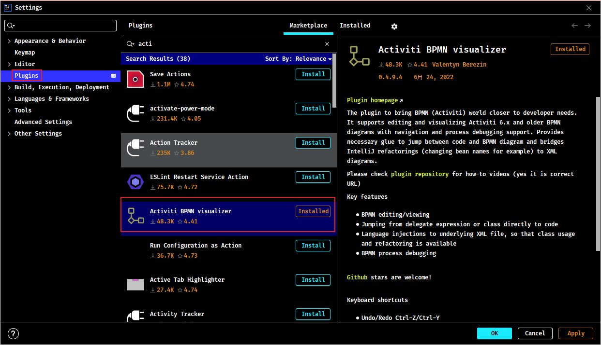
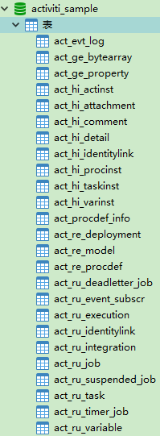
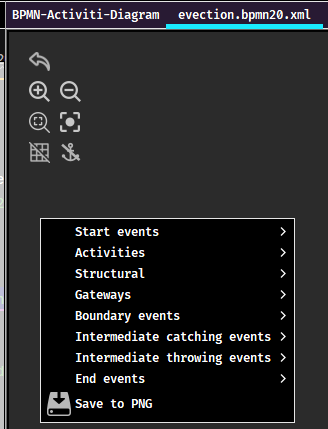
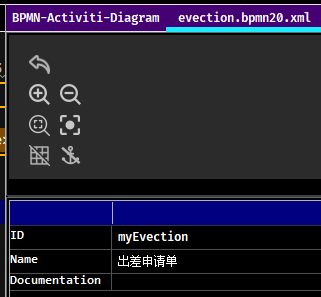
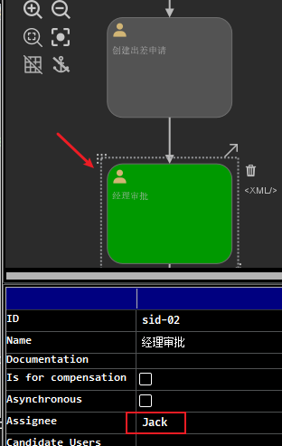

# Activiti 工作流引擎基础

> 官方网站：https://www.activiti.org/

## 1. 工作流介绍

### 1.1. 概念

工作流(Workflow)，就是通过计算机对业务流程自动化执行管理。它主要解决的是“使在多个参与者之间按照某种预定义的规则自动进行传递文档、信息或任务的过程，从而实现某个预期的业务目标，或者促使此目标的实现”。

### 1.2. 工作流系统

一个软件系统中具有工作流的功能，我们把它称为工作流系统，一个系统中工作流的功能是什么？就是对系统的业务流程进行自动化管理，所以工作流是建立在业务流程的基础上，所以一个软件的系统核心根本上还是系统的业务流程，工作流只是协助进行业务流程管理。即使没有工作流业务系统也可以开发运行，只不过有了工作流可以更好的管理业务流程，提高系统的可扩展性。

### 1.3. 适用行业

消费品行业，制造业，电信服务业，银证险等金融服务业，物流服务业，物业服务业，物业管理，大中型进出口贸易公司，政府事业机构，研究院所及教育服务业等，特别是大的跨国企业和集团公司。

### 1.4. 具体应用

1. 关键业务流程：订单、报价处理、合同审核、客户电话处理、供应链管理等
2. 行政管理类:出差申请、加班申请、请假申请、用车申请、各种办公用品申请、购买申请、日报周报等凡是原来手工流转处理的行政表单。
3. 人事管理类：员工培训安排、绩效考评、职位变动处理、员工档案信息管理等。
4. 财务相关类：付款请求、应收款处理、日常报销处理、出差报销、预算和计划申请等。
5. 客户服务类：客户信息管理、客户投诉、请求处理、售后服务管理等。
6. 特殊服务类：ISO 系列对应流程、质量管理对应流程、产品数据信息管理、贸易公司报关处理、物流公司货物跟踪处理等各种通过表单逐步手工流转完成的任务均可应用工作流软件自动规范地实施。

### 1.5. 实现方式

在没有专门的工作流引擎之前，要实现流程控制，通常的做法就是采用状态字段的值来跟踪流程的变化情况。这样不用角色的用户，通过状态字段的取值来决定记录是否显示。针对有权限可以查看的记录，当前用户根据自己的角色来决定审批是否合格的操作。如果合格将状态字段设置一个值，来代表合格；当然如果不合格也需要设置一个值来代表不合格的情况。

以上是最为原始的方式，通过状态字段虽然做到了流程控制，但是当流程发生变更的时候，这种方式所编写的代码也要进行调整。而 activiti 工作流引擎就是使用专业的方式来实现工作流的管理，并且可以做到业务流程变化之后，程序可以不用改变，使业务系统的适应能力得到了极大提升。

## 2. Activiti7 概述

### 2.1. 简介

Alfresco 软件在 2010 年 5 月 17 日宣布 Activiti 业务流程管理（BPM）开源项目的正式启动，而 jbpm 、activiti 都是工作流引擎。

Activiti 是一个工作流引擎，是轻量级、以 java 为中心的开源 BPMN 引擎，支持目前行业的流程自动化需求， activiti 可以将业务系统中复杂的业务流程抽取出来，使用专门的建模语言 BPMN 2.0 进行定义，业务流程按照预先定义的流程进行执行，实现了系统的流程由 activiti 进行管理，减少业务系统由于流程变更进行系统升级改造的工作量，从而提高系统的健壮性，同时也减少了系统开发维护成本。

Activiti Cloud 是新一代的商业自动化平台，提供了一套云端原生构建模块，旨在运行于分布式基础设施。<u>_截止 2022 年 6 月 23 日最新版本：Activiti Cloud 7.3.0.Beta_</u>

经历的版本：Activiti 6.x 与 Activiti 5.x

#### 2.1.1. BPM

BPM（Business Process Management）即业务流程管理，是一种规范化的构造端到端的业务流程，以持续的提高组织业务效率。常见商业管理教育如 EMBA、MBA 等均将 BPM 包含在内。

#### 2.1.2. BPM 软件

BPM 软件就是根据企业中业务环境的变化，推进人与人之间、人与系统之间以及系统与系统之间的整合及调整的经营方法与解决方案的 IT 工具。通过 BPM 软件对企业内部及外部的业务流程的整个生命周期进行建模、自动化、管理监控和优化，使企业成本降低，利润得以大幅提升。

BPM 软件在企业中应用领域广泛，凡是有业务流程的地方都可以 BPM 软件进行管理，比如企业人事办公管理、采购流程管理、公文审批流程管理、财务管理等。

#### 2.1.3. BPMN

BPMN（Business Process Model AndNotation）业务流程模型和符号，是由 BPMI（BusinessProcess Management Initiative）开发的一套标准的业务流程建模符号，使用 BPMN 提供的符号可以创建业务流程。

2004 年 5 月发布了 BPMN1.0 规范 .BPMI 于 2005 年 9 月并入 OMG（The Object Management Group 对象管理组织)组织。OMG 于 2011 年 1 月发布 BPMN2.0 的最终版本。具体发展历史如下:


BPMN 是目前被各 BPM 厂商广泛接受的 BPM 标准。Activiti 就是使用 BPMN 2.0 进行流程建模、流程执行管理，它包括很多的建模符号，比如：

- Event 用一个圆圈表示，它是流程中运行过程中发生的事情。


- 活动用圆角矩形表示，一个流程由一个活动或多个活动组成


Bpmn 图形表示业务流程，实质最终是生成 xml 文件，使用文本编辑器打开示例 .bpmn 文件，示例如下：

```xml
<?xml version="1.0" encoding="UTF-8"?>
<definitions xmlns="http://www.omg.org/spec/BPMN/20100524/MODEL" xmlns:xsi="http://www.w3.org/2001/XMLSchema-instance" xmlns:xsd="http://www.w3.org/2001/XMLSchema" xmlns:activiti="http://activiti.org/bpmn" xmlns:bpmndi="http://www.omg.org/spec/BPMN/20100524/DI" xmlns:omgdc="http://www.omg.org/spec/DD/20100524/DC" xmlns:omgdi="http://www.omg.org/spec/DD/20100524/DI" typeLanguage="http://www.w3.org/2001/XMLSchema" expressionLanguage="http://www.w3.org/1999/XPath" targetNamespace="http://www.activiti.org/test">
  <process id="myProcess" name="My process" isExecutable="true">
    <startEvent id="startevent1" name="Start"></startEvent>
    <userTask id="usertask1" name="创建请假单"></userTask>
    <sequenceFlow id="flow1" sourceRef="startevent1" targetRef="usertask1"></sequenceFlow>
    <userTask id="usertask2" name="部门经理审核"></userTask>
    <sequenceFlow id="flow2" sourceRef="usertask1" targetRef="usertask2"></sequenceFlow>
    <userTask id="usertask3" name="人事复核"></userTask>
    <sequenceFlow id="flow3" sourceRef="usertask2" targetRef="usertask3"></sequenceFlow>
    <endEvent id="endevent1" name="End"></endEvent>
    <sequenceFlow id="flow4" sourceRef="usertask3" targetRef="endevent1"></sequenceFlow>
  </process>
  <bpmndi:BPMNDiagram id="BPMNDiagram_myProcess">
    <bpmndi:BPMNPlane bpmnElement="myProcess" id="BPMNPlane_myProcess">
      <bpmndi:BPMNShape bpmnElement="startevent1" id="BPMNShape_startevent1">
        <omgdc:Bounds height="35.0" width="35.0" x="130.0" y="160.0"></omgdc:Bounds>
      </bpmndi:BPMNShape>
      <bpmndi:BPMNShape bpmnElement="usertask1" id="BPMNShape_usertask1">
        <omgdc:Bounds height="55.0" width="105.0" x="210.0" y="150.0"></omgdc:Bounds>
      </bpmndi:BPMNShape>
      <bpmndi:BPMNShape bpmnElement="usertask2" id="BPMNShape_usertask2">
        <omgdc:Bounds height="55.0" width="105.0" x="360.0" y="150.0"></omgdc:Bounds>
      </bpmndi:BPMNShape>
      <bpmndi:BPMNShape bpmnElement="usertask3" id="BPMNShape_usertask3">
        <omgdc:Bounds height="55.0" width="105.0" x="510.0" y="150.0"></omgdc:Bounds>
      </bpmndi:BPMNShape>
      <bpmndi:BPMNShape bpmnElement="endevent1" id="BPMNShape_endevent1">
        <omgdc:Bounds height="35.0" width="35.0" x="660.0" y="160.0"></omgdc:Bounds>
      </bpmndi:BPMNShape>
      <bpmndi:BPMNEdge bpmnElement="flow1" id="BPMNEdge_flow1">
        <omgdi:waypoint x="165.0" y="177.0"></omgdi:waypoint>
        <omgdi:waypoint x="210.0" y="177.0"></omgdi:waypoint>
      </bpmndi:BPMNEdge>
      <bpmndi:BPMNEdge bpmnElement="flow2" id="BPMNEdge_flow2">
        <omgdi:waypoint x="315.0" y="177.0"></omgdi:waypoint>
        <omgdi:waypoint x="360.0" y="177.0"></omgdi:waypoint>
      </bpmndi:BPMNEdge>
      <bpmndi:BPMNEdge bpmnElement="flow3" id="BPMNEdge_flow3">
        <omgdi:waypoint x="465.0" y="177.0"></omgdi:waypoint>
        <omgdi:waypoint x="510.0" y="177.0"></omgdi:waypoint>
      </bpmndi:BPMNEdge>
      <bpmndi:BPMNEdge bpmnElement="flow4" id="BPMNEdge_flow4">
        <omgdi:waypoint x="615.0" y="177.0"></omgdi:waypoint>
        <omgdi:waypoint x="660.0" y="177.0"></omgdi:waypoint>
      </bpmndi:BPMNEdge>
    </bpmndi:BPMNPlane>
  </bpmndi:BPMNDiagram>
</definitions>
```

### 2.2. 使用步骤

#### 2.2.1. 部署 activiti

Activiti 是一个工作流引擎本质是由多个 jar 包组成的 API，业务系统访问（操作）activiti 的接口，就可以方便的操作流程相关数据，这样就可以把工作流环境与业务系统的环境集成在一起。

#### 2.2.2. 流程定义

使用 activiti 流程建模工具(activity-designer)定义业务流程，最终生成 .bpmn 文件。

.bpmn 文件就是业务流程定义文件，本质是通过 xml 定义业务流程。

#### 2.2.3. 流程定义部署

activiti 部署业务流程定义（.bpmn 文件）。使用 activiti 提供的 api 把流程定义内容存储起来，在 Activiti 执行过程中可以查询定义的内容。

Activiti 执行会把流程定义内容存储在数据库中

#### 2.2.4. 启动一个流程实例

流程实例（ProcessInstance），启动一个流程实例表示开始一次业务流程的运行。

例如：在员工请假流程定义部署完成后，如果张三要请假就可以启动一个流程实例，如果李四要请假也启动一个流程实例，两个流程的执行互相不影响。

#### 2.2.5. 用户查询待办任务(Task)

如系统的业务流程交给 activiti 管理，通过 activiti 就可以查询当前流程执行到哪了，当前用户需要办理什么任务了，这些都由 activiti 进行管理与实现，而不需要开发人员自己编写在 sql 语句查询。

#### 2.2.6. 用户办理任务

用户查询待办任务后，就可以办理某个任务，如果这个任务办理完成还需要其它用户办理，比如采购单创建后由部门经理审核，这个过程也是由 activiti 来完成

#### 2.2.7. 流程结束

当任务办理完成没有下一个任务结点了，这个流程实例就完成了。

## 3. Activiti 开发前置准备

### 3.1. 开发环境要求

- Jdk1.8 或以上版本
- Mysql 5 及以上的版本
- Tomcat 8.5
- 学习示例的开发工具：IDEA

**注意：IDEA 与 Eclipse 开发工具均可安装相应的 activiti 流程定义工具插件**

### 3.2. Activiti 开发环境准备

本次学习使用的 Activiti 版本是：7.1.0-M16。默认支持 spring5

#### 3.2.1. 下载 activiti7

使用 Activiti 7 工作流引擎，可以直接在项目中引入从官网下载的相关 jar 包，或者使用 Maven 依赖的方式。本次学习使用 maven 依赖的方式，修改项目的 pom.xml 文件添加如下依赖：

```xml
<dependencyManagement>
    <dependencies>
        <dependency>
            <groupId>org.activiti</groupId>
            <artifactId>activiti-dependencies</artifactId>
            <version>7.1.0-M16</version>
            <scope>import</scope>
            <type>pom</type>
        </dependency>
    </dependencies>
</dependencyManagement>
```

#### 3.2.2. IDEA 流程设计器插件 - Activiti BPMN visualizer

- 点击 IDEA 的 【File】->【Settings】->【Plugins】，在【Marketplace】搜索 Activiti BPMN visualizer 插件，它就是 Activiti Designer 的 IDEA 版本，点击 Install 安装。



安装成功一般会提示需要重启 idea，点击重启即可。重启完成后，再次打开【Settings】下的 【Plugins】（插件列表），点击右侧的【Installed】（已安装的插件），在列表中看到 Activiti BPMN visualizer，就说明已经安装成功。

后面的 Activiti 学习研究，会使用这个流程设计器进行 Activiti 的流程设计。

### 3.3. Activiti 的数据库支持

Activiti 在运行时需要数据库的支持，会使用 25 张表，把流程定义节点内容读取到数据库表中，以供后续使用。activiti 支持的数据库和版本如下：

| 数据库类型 | 版本                   | JDBC 连接示例                                           | 说明                               |
| ---------- | ---------------------- | ------------------------------------------------------- | ---------------------------------- |
| h2         | 1.3.168                | jdbc:h2:tcp://localhost/activiti                        | 默认配置的数据库                   |
| mysql      | 5.1.21                 | jdbc:mysql://localhost:3306/activiti?autoReconnect=true | 使用 mysql-connector-java 驱动测试 |
| oracle     | 11.2.0.1.0             | jdbc:oracle:thin:@localhost:1521:xe                     |                                    |
| postgres   | 8.1                    | jdbc:postgresql://localhost:5432/activiti               |                                    |
| db2        | DB2 10.1 using db2jcc4 | jdbc:db2://localhost:50000/activiti                     |                                    |
| mssql      | 2008 using sqljdbc4    | jdbc:sqlserver://localhost:1433/activiti                |                                    |

> 本次学习研究使用 mysql 数据库

### 3.4. 使用 Java 程序生成 Activiti 相关表格

这里使用 Activiti 提供的默认方式生成 MySQL 数据库相关的表格

#### 3.4.1. 创建数据库

创建给 Activiti 使用的 mysql 数据库（_名称随意_）

```sql
CREATE DATABASE activiti_sample DEFAULT CHARACTER SET utf8;
```

#### 3.4.2. 添加项目依赖

使用 idea 创建 java 的 maven 工程，加入 ProcessEngine 所依赖的坐标（jar 包），包括：

1. Activiti 核心包 activiti-engine
2. activiti 依赖的 jar 包：mybatis、slf4j、log4j2 等
3. activiti 依赖的 spring 包
4. mysql 数据库驱动
5. 第三方数据连接池 dbcp（可选）
6. 单元测试 Junit

导入以上 jar 所对应的坐标到 pom.xml 文件中

```xml
<properties>
    <log4j2.version>2.17.2</log4j2.version>
    <activiti.version>7.1.0.M2</activiti.version>
    <druid.version>1.2.6</druid.version>
</properties>

<dependencies>
    <dependency>
        <groupId>org.activiti</groupId>
        <artifactId>activiti-engine</artifactId>
        <version>${activiti.version}</version>
    </dependency>
    <dependency>
        <groupId>org.activiti</groupId>
        <artifactId>activiti-spring</artifactId>
        <version>${activiti.version}</version>
    </dependency>
    <!-- bpmn 模型处理 -->
    <dependency>
        <groupId>org.activiti</groupId>
        <artifactId>activiti-bpmn-model</artifactId>
        <version>${activiti.version}</version>
    </dependency>
    <!-- bpmn 转换 -->
    <dependency>
        <groupId>org.activiti</groupId>
        <artifactId>activiti-bpmn-converter</artifactId>
        <version>${activiti.version}</version>
    </dependency>
    <!-- bpmn json数据转换 -->
    <dependency>
        <groupId>org.activiti</groupId>
        <artifactId>activiti-json-converter</artifactId>
        <version>${activiti.version}</version>
    </dependency>
    <!-- bpmn 布局 -->
    <dependency>
        <groupId>org.activiti</groupId>
        <artifactId>activiti-bpmn-layout</artifactId>
        <version>${activiti.version}</version>
    </dependency>

    <!-- mysql驱动 -->
    <dependency>
        <groupId>mysql</groupId>
        <artifactId>mysql-connector-java</artifactId>
        <version>8.0.26</version>
    </dependency>
    <!-- mybatis -->
    <dependency>
        <groupId>org.mybatis</groupId>
        <artifactId>mybatis</artifactId>
        <version>3.5.9</version>
    </dependency>
    <!-- druid 数据源 -->
    <dependency>
        <groupId>com.alibaba</groupId>
        <artifactId>druid</artifactId>
        <version>${druid.version}</version>
    </dependency>
    <!-- 测试 -->
    <dependency>
        <groupId>junit</groupId>
        <artifactId>junit</artifactId>
        <version>4.12</version>
    </dependency>

    <!-- log4j2 日志 -->
    <dependency>
        <groupId>org.apache.logging.log4j</groupId>
        <artifactId>log4j-slf4j-impl</artifactId>
        <version>${log4j2.version}</version>
    </dependency>
</dependencies>
```

#### 3.4.3. 添加日志配置（非必需）

示例使用 slf4j + log4j2 日志包，在 resources 下创建 log4j2.xml 日志配置文件

```xml
<?xml version="1.0" encoding="UTF-8"?>
<Configuration status="warn" monitorInterval="10">

    <properties>
        <property name="LOG_HOME">E:/logs</property>
    </properties>

    <!-- 日志处理对象 appender -->
    <Appenders>
        <!-- 控制台输出 appender -->
        <Console name="Console" target="SYSTEM_ERR">
            <PatternLayout pattern="%d{HH:mm:ss.SSS} [%t] [%-5level] %c{36}:%L --- %m%n"/>
        </Console>

        <!-- 日志文件输出 appender -->
        <File name="file" fileName="${LOG_HOME}/activiti-log.log">
            <PatternLayout pattern="[%d{yyyy-MM-dd HH:mm:ss.SSS}] [%-5level] %l %c{36} - %m%n"/>
        </File>
    </Appenders>

    <!-- logger 定义 -->
    <Loggers>
        <!-- 使用 rootLogger 配置，指定日志级别 info，修改为更高的日志级别，可以查看数据库表创建语句 -->
        <Root level="trace">
            <!-- 指定日志使用的处理器 -->
            <AppenderRef ref="Console"/>
        </Root>

        <!-- 自定义 logger 对象 -->
        <Logger name="com.moon.activiti" level="debug">
            <AppenderRef ref="Console"/>
            <AppenderRef ref="file"/>
        </Logger>
    </Loggers>

</Configuration>
```

> tips: 日志配置可以根据需要自行配置，也可以更换其他的日志实现

#### 3.4.4. 添加 activiti 默认配置文件

因此示例使用 activiti 提供的默认方式来创建 mysql 数据库表。默认方式的要求是在 resources 下创建 activiti.cfg.xml 文件（注意：<font color=purple>**默认方式目录和文件名不能修改**</font>，因为 activiti 的源码中已经设置，到固定的目录读取固定文件名的文件。）

默认方式需要在 activiti.cfg.xml 配置 `ProcessEngineConfiguration` 具体实现的实例对象（`org.activiti.engine.impl.cfg.StandaloneProcessEngineConfiguration` 是默认实现），并且 bean 的名字叫 `processEngineConfiguration`（名字固定不可修改），其作用是用来创建 `ProcessEngine`，在创建 `ProcessEngine` 时会执行数据库进行建表的操作。具体有以下两种配置方式：

- 方式一：不单独配置数据源，直接配置 processEngineConfiguration 对象。

```xml
<?xml version="1.0" encoding="UTF-8"?>
<beans xmlns="http://www.springframework.org/schema/beans"
       xmlns:xsi="http://www.w3.org/2001/XMLSchema-instance"
       xsi:schemaLocation="http://www.springframework.org/schema/beans
                    http://www.springframework.org/schema/beans/spring-beans.xsd">
    <!--
        配置 processEngine Activiti 的流程引擎
        注意：在默认方式下 bean 的 id 必须为 processEngineConfiguration
        org.activiti.engine.impl.cfg.StandaloneProcessEngineConfiguration 是默认实现
    -->
    <bean id="processEngineConfiguration"
          class="org.activiti.engine.impl.cfg.StandaloneProcessEngineConfiguration">
        <!--配置数据库相关的信息-->
        <!--数据库驱动-->
        <property name="jdbcDriver" value="com.mysql.cj.jdbc.Driver"/>
        <!--数据库链接-->
        <property name="jdbcUrl" value="jdbc:mysql://127.0.0.1:3306/activiti_sample?useSSL=false"/>
        <!--数据库用户名-->
        <property name="jdbcUsername" value="root"/>
        <!--数据库密码-->
        <property name="jdbcPassword" value="123456"/>
        <!--
            配置 activiti 数据库表在生成时的策略。
            databaseSchemaUpdate 属性为 true，代表如果数据库中已经存在相应的表，则直接使用；如果不存在，则会创建
        -->
        <property name="databaseSchemaUpdate" value="true"/>
    </bean>
</beans>
```

- 方式二：配置数据源，在创建 processEngineConfiguration 对象中引用

```xml
<?xml version="1.0" encoding="UTF-8"?>
<beans xmlns="http://www.springframework.org/schema/beans"
       xmlns:xsi="http://www.w3.org/2001/XMLSchema-instance"
       xsi:schemaLocation="http://www.springframework.org/schema/beans
                    http://www.springframework.org/schema/beans/spring-beans.xsd">

    <!-- 配置数据源，使用阿里druid数据源 -->
    <bean id="dataSource" class="com.alibaba.druid.pool.DruidDataSource" destroy-method="close" primary="true">
        <property name="driverClassName" value="com.mysql.cj.jdbc.Driver"/>
        <property name="url" value="jdbc:mysql://127.0.0.1:3306/activiti_sample?useSSL=false"/>
        <property name="username" value="root"/>
        <property name="password" value="123456"/>
    </bean>

    <!-- 注意：在默认方式下 bean 的 id 必须为 processEngineConfiguration -->
    <bean id="processEngineConfiguration"
          class="org.activiti.engine.impl.cfg.StandaloneProcessEngineConfiguration">
        <!-- 方式2：引用单独配置的数据源 -->
        <property name="dataSource" ref="dataSource"/>
        <!-- 配置 activiti 数据库表在生成时的策略 -->
        <property name="databaseSchemaUpdate" value="true"/>
    </bean>
</beans>
```

#### 3.4.5. 编写程序生成数据表

创建一个测试类，使用 activiti 提供的工具类 `ProcessEngines`，调用其 `getDefaultProcessEngine` 方法创建 `ProcessEngine` 对象，会默认读取 classpath 下的 activiti.cfg.xml 文件，读取其中的数据库配置，在创建 ProcessEngine 时会自动创建 activiti 需要的数据库表。

```java
@Test
public void test01() {
    /*
     * 需要使用 avtiviti 提供的工具类 ProcessEngines 的 getDefaultProcessEngine 方法
     * 会默认从 resources 下读取名字为 actviti.cfg.xml 的文件。
     * 创建 ProcessEngine 对象同时会创建相应的数据表
     */
    ProcessEngine processEngine = ProcessEngines.getDefaultProcessEngine();
    System.out.println(processEngine);
}
```

> 说明：
>
> 1. 运行示例程序段即可完成 activiti 表创建，通过改变 activiti.cfg.xml 中 `databaseSchemaUpdate` 参数的值执行不同的数据表处理策略
> 2. `getDefaultProcessEngine` 方法在执行时，从 activiti.cfg.xml 中找固定的名称 `processEngineConfiguration` 实例对象

在测试程序执行过程中，观察 idea 的控制台会输出日志，可以看到正在创建数据表输出的日志（如下框中内容）：


执行完成后查看数据库，最终会创建 25 张表，结果如下：



以上完成 Activiti 运行需要的数据库和表的创建

### 3.5. Activiti 表结构介绍

#### 3.5.1. 表的命名规则和作用

所有 Activiti 相关的表名称前缀都是 `ACT_`

表名的第二部分是表示该表的用途的两个字母标识，用途也和服务的 API 对应。

- `ACT_RE`：'RE'表示 repository。这种前缀的表包含了流程定义和流程静态资源（图片、规则等）
- `ACT_RU`：'RU'表示 runtime。这种前缀的表是在运行时使用，包含流程实例、任务、变量、异步任务等运行中的数据。Activiti 只在流程实例执行过程中保存这些数据，在流程结束时就会删除这些记录。这样运行时表可以一直很小速度很快
- `ACT_HI`：'HI'表示 history。这种前缀的表包含历史数据，比如历史流程实例、变量、任务等
- `ACT_GE`：'GE'表示 general。这种前缀的表是存储通用数据，用于不同场景下

#### 3.5.2. Activiti 数据表介绍

- 一般数据

| 表名             | 说明                     |
| ---------------- | ------------------------ |
| ACT_GE_BYTEARRAY | 通用的流程定义和流程资源 |
| ACT_GE_PROPERTY  | 系统相关属性             |

- 流程历史记录

| 表名                | 说明                         |
| ------------------- | ---------------------------- |
| ACT_HI_ACTINST      | 历史的流程实例               |
| ACT_HI_ATTACHMENT   | 历史的流程附件               |
| ACT_HI_COMMENT      | 历史的说明性信息             |
| ACT_HI_DETAIL       | 历史的流程运行中的细节信息   |
| ACT_HI_IDENTITYLINK | 历史的流程运行过程中用户关系 |
| ACT_HI_PROCINST     | 历史的流程实例               |
| ACT_HI_TASKINST     | 历史的任务实例               |
| ACT_HI_VARINST      | 历史的流程运行中的变量信息   |

- 流程定义表

| 表名              | 说明             |
| ----------------- | ---------------- |
| ACT_RE_DEPLOYMENT | 部署单元信息     |
| ACT_RE_MODEL      | 模型信息         |
| ACT_RE_PROCDEF    | 已部署的流程定义 |

- 运行实例表

| 表名                | 说明                                               |
| ------------------- | -------------------------------------------------- |
| ACT_RU_EVENT_SUBSCR | 运行时事件                                         |
| ACT_RU_EXECUTION    | 运行时流程执行实例                                 |
| ACT_RU_IDENTITYLINK | 运行时用户关系信息，存储任务节点与参与者的相关信息 |
| ACT_RU_JOB          | 运行时作业                                         |
| ACT_RU_TASK         | 运行时任务                                         |
| ACT_RU_VARIABLE     | 运行时变量表                                       |

## 4. Activiti 核心类说明

### 4.1. 核心类关系图


通过测试，发现 `IdentityService` 与 `FormService` 这两个类在新版本(7.x)中均已经删除，此两个只在存在旧的版本中

### 4.2. activiti.cfg.xml 默认配置文件

activiti.cfg.xml 是 Activiti 的引擎配置文件，包括：`ProcessEngineConfiguration` 对象的定义、数据源定义、事务管理器等，此文件本质是一个 spring 配置文件

### 4.3. ProcessEngineConfiguration 流程引擎配置类

通过流程引擎的抽象配置类 `ProcessEngineConfiguration`，可以创建工作流引擎 `ProceccEngine` 实例。有如下两个常用的实现类：

#### 4.3.1. StandaloneProcessEngineConfiguration

`StandaloneProcessEngineConfigurationActiviti` 是单独运行，用来创建 `ProcessEngine`，Activiti 会自动处理事务

通常配置文件方式是，在 activiti.cfg.xml 配置文件中定义一个 id 为 `processEngineConfiguration` 的 bean。

> _具体两种配置方式详见基础示例的《activiti 默认配置文件》章节_

#### 4.3.2. SpringProcessEngineConfiguration

`org.activiti.spring.SpringProcessEngineConfiguration` 实现类是用来与 Spring 进行整合。通过需要创建 spring 与 activiti 的整合配置文件：activity-spring.cfg.xml（名称随意修改）

> _具体配置方式详见《Activiti 与 Spring 整合》章节_

#### 4.3.3. ProcessEngineConfiguration 的创建方式

通过 `ProcessEngineConfiguration` 类的静态方法 `createProcessEngineConfigurationFromResource` 可自定义创建 `ProcessEngineConfiguration` 实例，方法参数分别指定配置文件名称与 bean 实例的名称，即意味着 activiti 的配置文件名称可以自定义，创建 `processEngineConfiguration` 实例的 id 也可以自定义

```java
ProcessEngineConfiguration processEngineConfiguration = ProcessEngineConfiguration.
        createProcessEngineConfigurationFromResource("activiti.cfg.xml", "processEngineConfiguration");
// 获取流程引擎对象 ProcessEngine
ProcessEngine processEngine = processEngineConfiguration.buildProcessEngine();
System.out.println(processEngine);
```

### 4.4. ProcessEngine 工作流引擎

工作流引擎（`ProcessEngine`）接口，是一个门面接口，通过 `ProcessEngineConfiguration` 来创建，再通过 `ProcessEngine` 创建各个 service 接口。

#### 4.4.1. 默认创建方式

通过 avtiviti 提供的工具类 `ProcessEngines` 的 `getDefaultProcessEngine` 方法。该方式要求 activiti.cfg.xml 文件名及路径固定，需放在 resources 目录下，并且配置文件中必须有一个名称为 `processEngineConfiguration` 的 bean。因此该方式不够灵活

```java
ProcessEngine processEngine = ProcessEngines.getDefaultProcessEngine();
```

#### 4.4.2. 通用创建方式

通过先构造 `ProcessEngineConfiguration`，再通过 `ProcessEngineConfiguration` 创建 `ProcessEngine`，该方式不受配置文件名、路径、配置 bean 的 id 等因素的限制

```java
ProcessEngineConfiguration processEngineConfiguration = ProcessEngineConfiguration.
        createProcessEngineConfigurationFromResource("activiti.cfg.xml", "processEngineConfiguration");
// 获取流程引擎对象 ProcessEngine
ProcessEngine processEngine = processEngineConfiguration.buildProcessEngine();
System.out.println(processEngine);
```

### 4.5. Servcie 服务接口

Service 是工作流引擎提供用于进行工作流部署、执行、管理的服务接口，使用这些接口相当于操作服务对应的数据表

#### 4.5.1. Service 服务的创建方式

通过 `ProcessEngine` 对象可以创建不同的 Service 接口实例


```java
RuntimeService runtimeService = processEngine.getRuntimeService();
RepositoryService repositoryService = processEngine.getRepositoryService();
TaskService taskService = processEngine.getTaskService();
```

#### 4.5.2. 各种 Service 接口简介

各种 Serivce 接口与作用如下表：

| service 名称      | service 作用              |
| ----------------- | ------------------------- |
| RepositoryService | activiti 的资源管理类     |
| RuntimeService    | activiti 的流程运行管理类 |
| TaskService       | activiti 的任务管理类     |
| HistoryService    | activiti 的历史管理类     |
| ManagerService    | activiti 的引擎管理类     |

> tips: 以上这些接口实质都是操作 Activity 各张数据库表

##### 4.5.2.1. RepositoryService

Activiti 的资源管理类，提供了管理和控制流程发布包和流程定义的操作。使用工作流建模工具设计的业务流程图需要使用此 service 将流程定义文件的内容部署到计算机。

除了部署流程定义以外还可以：查询引擎中的发布包和流程定义。

暂停或激活发布包，对应全部和特定流程定义。暂停意味着它们不能再执行任何操作了，激活是对应的反向操作。获得多种资源，像是包含在发布包里的文件，或引擎自动生成的流程图。

获得流程定义的 pojo 版本，可以用来通过 java 解析流程，而不必通过 xml。

##### 4.5.2.2. RuntimeService

Activiti 的流程运行管理类。可以从这个服务类中获取很多关于流程执行相关的信息

##### 4.5.2.3. TaskService

Activiti 的任务管理类。可以从这个类中获取任务的信息。

##### 4.5.2.4. HistoryService

Activiti 的历史管理类，可以查询历史信息，执行流程时，引擎会保存很多数据（根据配置），比如流程实例启动时间、任务的参与者、完成任务的时间、每个流程实例的执行路径等等。这个服务主要通过查询功能来获得这些数据。

##### 4.5.2.5. ManagementService

Activiti 的引擎管理类，提供了对 Activiti 流程引擎的管理和维护功能，这些功能不在工作流驱动的应用程序中使用，主要用于 Activiti 系统的日常维护。

## 5. Activiti 快速入门

创建一个 Activiti 工作流，并启动这个流程，具体包含如下步骤：

1. 定义流程：按照 BPMN 的规范，使用流程定义工具，用**流程符号**把整个流程描述出来
2. 部署流程：把画好的流程定义文件，加载到数据库中，生成表的数据
3. 启动流程：使用程序来操作数据库表中的内容

### 5.1. 流程符号

BPMN 2.0 是业务流程建模符号 2.0 的缩写。它由 Business Process Management Initiative 这个非营利协会创建并不断发展。作为一种标识，BPMN 2.0 是使用一些**符号**来明确业务流程设计流程图的一整套符号规范，它能增进业务建模时的沟通效率。

目前 BPMN 2.0 是最新的版本，它用于在 BPM 上下文中进行布局和可视化的沟通。在流程设计中 BPMN 2.0 常见的**基本符合**主要包含：

#### 5.1.1. 事件 Event


#### 5.1.2. 活动 Activity

活动是工作或任务的一个通用术语。一个活动可以是一个任务，还可以是一个当前流程的子处理流程；其次，还可以为活动指定不同的类型。常见活动如下：


#### 5.1.3. 网关 GateWay

网关用来处理决策，有几种常用网关需要了解：


##### 5.1.3.1. 排他网关 (x)

只有一条路径会被选择。流程执行到该网关时，按照输出流的顺序逐个计算：

- 当条件的计算结果为 true 时，继续执行当前网关的输出流
- 如果多条线路计算结果都是 true，则会执行第一个值为 true 的线路
- 如果所有网关计算结果没有是 true，则引擎会抛出异常

排他网关需要和条件顺序流结合使用，default 属性指定默认顺序流，当所有的条件不满足时会执行默认顺序流。

##### 5.1.3.2. 并行网关 (+)

所有路径会被同时选择

- **拆分**：并行执行所有输出顺序流，为每一条顺序流创建一个并行执行线路。
- **合并**：所有从并行网关拆分并执行完成的线路均在此等候，直到所有的线路都执行完成才继续向下执行。

##### 5.1.3.3. 包容网关 (+)

可以同时执行多条线路，也可以在网关上设置条件

- **拆分**：计算每条线路上的表达式，当表达式计算结果为 true 时，创建一个并行线路并继续执行
- **合并**：所有从并行网关拆分并执行完成的线路均在此等候，直到所有的线路都执行完成才继续向下执行

##### 5.1.3.4. 事件网关 (+)

专门为中间捕获事件设置的，允许设置多个输出流指向多个不同的中间捕获事件。当流程执行到事件网关后，流程处于等待状态，需要等待抛出事件才能将等待状态转换为活动状态。

#### 5.1.4. 流向 Flow

流是连接两个流程节点的连线。常见的流向包含以下几种：


### 5.2. 流程设计器使用（IDEA）插件

> 注：此学习笔记是使用 IDEA 的 Activiti BPMN visualizer 插件，其他相关的流程设计器软件使用方法大同小异

#### 5.2.1. 新建流程图

在 idea 中安装插件即可使用，在项目目录中右键生成 Activiti BPMN 文件（其实最终是生成一个 xml 文件）


右键文件，选择【View BPMN (Activiti) Diagram】，使用画板打开


#### 5.2.2. Palette（画板）

使用 Activiti BPMN visualizer 插件打开的文件，在画板的空白处，右键可以看到包括以下结点：



- Start events：开始事件
- Activities：任务
- Structural：结构
- Gateway：网关
- Boundary event：边界事件
- Intermediate catching events：中间事件（捕获）
- Intermediate throwing events：中间事件（抛出）
- End events：结束事件

> Tips: 在画板中，可以将流程图导出图片

#### 5.2.3. 绘制流程

在工程的 resources 目录创建 bpmn 目录，右键使用【New】->【New Activiti 6.x BPMN 2.0 file】。在弹出如下图所示框，输入文件名 evection，表示出差审批流程：


在画板空白处右键选择流程符号进行绘制

- **指定流程定义 ID**

流程定义 key 即流程定义的标识，通过左键点击空白处，查看流程定义的信息。在 properties 视图面板中可以修改流程定义的标识，主要是修改 ID 与 Name 属性



- **指定任务负责人**

在 properties 视图指定每个任务结点的负责人，如：填写出差申请的负责人为 zhangsan



> 番外：如果打开的流程图出现中文乱码的问题，解决方案详见[《IntelliJ IDEA 常用配置》](/其他/development-software/IDEA)的“修改默认字符集”章节

#### 5.2.4. 注意事项

Activiti BPMN visualizer 插件有比较坑人的地方是，此插件不能定义监听器功能，如果需要定义，则使用 Camunda Modeler 工具来实现

### 5.3. 流程定义部署

将上面在设计器中定义的流程部署到 activiti 数据库中，就是流程定义部署。

通过调用 activiti 的 api 将流程定义的 bpmn 和 png 两个文件添加部署到 activiti 中，也可以将两个文件打成 zip 包进行部署。

#### 5.3.1. 单个文件部署方式

分别将 bpmn 文件和 png 图片文件部署。通过 `RepositoryService` 对象将指定的 bpm 文件和图片文件保存在 activiti 数据库。

```java
@Test
public void testDeployment() {
    // 1、创建 ProcessEngine 流程引擎
    ProcessEngine processEngine = ProcessEngines.getDefaultProcessEngine();
    // 2、获取RepositoryServcie
    RepositoryService repositoryService = processEngine.getRepositoryService();
    // 3、使用service进行流程的部署，定义一个流程的名字，把bpmn和png部署到数据中
    Deployment deploy = repositoryService.createDeployment()
            .name("出差申请流程")
            .addClasspathResource("bpmn/evection.bpmn")
            .addClasspathResource("bpmn/evection.png")
            .deploy();
    // 4、输出部署信息
    System.out.println("流程部署id=" + deploy.getId());
    System.out.println("流程部署名字=" + deploy.getName());
}
```

#### 5.3.2. 压缩包部署方式

将 evection.bpmn 和 evection.png 压缩成 zip 包，通过 `RepositoryService` 对象将指定的 bpm 文件和图片文件保存在 activiti 数据库。

```java
@Test
public void testDeployByZip() {
    // 1、创建 ProcessEngine 流程引擎
    ProcessEngine processEngine = ProcessEngines.getDefaultProcessEngine();
    // 2、获取 RepositoryServcie
    RepositoryService repositoryService = processEngine.getRepositoryService();
    // 3、读取资源包文件，构造成 InputStream
    InputStream inputStream = this.getClass().getClassLoader().getResourceAsStream("bpmn/evection.zip");
    // 将 InputStream 转成 ZipInputStream
    ZipInputStream zipInputStream = new ZipInputStream(inputStream);
    // 4、使用 RepositoryService 对压缩包的流进行流程部署
    Deployment deploy = repositoryService.createDeployment()
            .name("出差申请流程")
            .addZipInputStream(zipInputStream)
            .deploy();
    // 5、输出部署信息
    System.out.println("流程部署id=" + deploy.getId());
    System.out.println("流程部署名字=" + deploy.getName());
}
```

#### 5.3.3. 定义部署操作的数据表

流程定义部署后操作 activiti 数据库以下的 3 张表如下：

- act_re_deployment：流程定义部署表，每部署一次增加一条记录

```sql
SELECT * FROM act_re_deployment # 流程定义部署表，记录流程部署信息
```

- act_re_procdef：流程定义表，部署每个新的流程定义都会在这张表中增加一条记录

```sql
SELECT * FROM act_re_procdef # 流程定义表，记录流程定义信息
```

> tips：注意表中的 KEY 这个字段是用来唯一识别不同流程的关键字

- act_ge_bytearray：流程资源表

```sql
SELECT * FROM act_ge_bytearray # 资源表
```

**总结**：

act_re_deployment 和 act_re_procdef 一对多关系，一次部署在流程部署表生成一条记录，但一次部署可以部署多个流程定义，每个流程定义在流程定义表生成一条记录。每一个流程定义在 act_ge_bytearray 会存在两个资源记录，bpmn 和 png。

建议：一次部署一个流程，这样部署表和流程定义表是一对一有关系，方便读取流程部署及流程定义信息。

### 5.4. 启动流程实例

流程定义部署在 activiti 之后，就可以通过工作流管理业务流程了。_即前面部署的出差申请流程示例可以使用了_

针对示例的流程，启动一个流程实例即表示发起一个新的出差申请单，类似于 java 中的类与对象的关系，类定义好后使用 new 关键字创建一个对象后即可使用，也可以 new 多个对象。对于出差申请流程，张三发起一个出差申请单需要启动一个流程实例，出差申请单发起一个出差单也需要启动一个流程实例。

#### 5.4.1. 代码实现

```java
@Test
public void testStartProcess() {
    // 1、创建 ProcessEngine 流程引擎
    ProcessEngine processEngine = ProcessEngines.getDefaultProcessEngine();
   // 2、获取 RuntimeService 流程运行管理类
    RuntimeService runtimeService = processEngine.getRuntimeService();
    // 3、根据流程定义Id（其实是数据库表 act_re_procdef 的 key 字段），启动流程
    ProcessInstance instance = runtimeService.startProcessInstanceByKey("myEvection");
    // 4、输出流程信息
    System.out.println("流程定义ID：" + instance.getProcessDefinitionId());
    System.out.println("流程实例ID：" + instance.getId());
    System.out.println("当前活动的ID：" + instance.getActivityId());
}
```

输出的内容：

```
流程定义ID：myEvection:2:2504
流程实例ID：5001
当前活动的ID：null
```

#### 5.4.2. 启动流程实例涉及操作的数据表

- act_hi_actinst：流程实例执行历史
- act_hi_identitylink：流程的参与用户历史信息
- act_hi_procinst：流程实例历史信息
- act_hi_taskinst：流程任务历史信息
- act_ru_execution：流程执行信息
- act_ru_identitylink：流程的参与用户信息
- act_ru_task：任务信息

### 5.5. 任务查询

流程启动后，任务的负责人就可以查询自己当前需要处理的任务，查询出来的任务都是该用户的待办任务。

#### 5.5.1. 代码实现

```java
@Test
public void testTaskQueryByAssignee() {
    // 1、创建 ProcessEngine 流程引擎
    ProcessEngine processEngine = ProcessEngines.getDefaultProcessEngine();
    // 2、获取 TaskService 任务管理类
    TaskService taskService = processEngine.getTaskService();
    // 3、根据流程 key 和 任务的负责人 查询任务
    List<Task> taskQuery = taskService.createTaskQuery()
            .processDefinitionKey("myEvection") // 流程Key
            .taskAssignee("Sam") // 只查询该任务负责人的任务
            .list();
    // 4、输出任务信息
    for (Task task : taskQuery) {
        System.out.println("流程实例id：" + task.getProcessInstanceId());
        System.out.println("任务id：" + task.getId());
        System.out.println("任务负责人：" + task.getAssignee());
        System.out.println("任务名称：" + task.getName());
    }
}
```

查询结果：

```
流程实例id：5001
任务id：5005
任务负责人：Sam
任务名称：创建出差申请
```

#### 5.5.2. 执行流程分析

观察控制台日志的输出，查询关键字：`act_`


可以看到，任务查询主要根据以下 sql 语句进行查询，主要查询的是 `ACT_RU_TASK` 表，并且会做 `DISTINCT` 去重的操作

```sql
SELECT DISTINCT
	RES.*
FROM
	ACT_RU_TASK RES
	INNER JOIN ACT_RE_PROCDEF D ON RES.PROC_DEF_ID_ = D.ID_
WHERE
	RES.ASSIGNEE_ = 'Sam'
	AND D.KEY_ = 'myEvection'
ORDER BY
	RES.ID_ ASC
	LIMIT 2147483647 OFFSET 0;
```

### 5.6. 流程任务处理

任务负责人查询待办任务，选择任务进行处理，完成任务。

#### 5.6.1. 代码实现

```java
@Test
public void testCompletTask() {
    // 1、创建 ProcessEngine 流程引擎
    ProcessEngine processEngine = ProcessEngines.getDefaultProcessEngine();
    // 2、获取 TaskService 任务管理类
    TaskService taskService = processEngine.getTaskService();
    // 3、先根据流程 key 和 任务的负责人 查询当前任务
    Task task = taskService.createTaskQuery()
            .processDefinitionKey("myEvection") // 流程Key
            .taskAssignee("Sam") // 只查询该任务负责人的任务
            .singleResult();
    // 4、根据任务id，完成任务
    taskService.complete(task.getId());
}
```

#### 5.6.2. 执行流程分析

同样观察控制台日志的输出，查询关键字：`act_` 来分析任务完成的整个流程

```sql
-- 根据id查询
select * from ACT_RU_TASK where ID_ = '5005'
-- 查询流程实体
select * from ACT_RE_PROCDEF where ID_ = '2504'
-- 查询部署信息
select * from ACT_RE_DEPLOYMENT where ID_ = '2501'
-- 查询资源信息
select * from ACT_GE_BYTEARRAY where DEPLOYMENT_ID_ = '2501' order by NAME_ asc
-- 根据流程key 去查询流程定义
select * from ACT_RE_PROCDEF where DEPLOYMENT_ID_ = '2501' and KEY_ = 'myEvection' and (TENANT_ID_ = '' or TENANT_ID_ is null)

-- 流程发生变化，都会更新该表
update ACT_GE_PROPERTY SET REV_ = 5, VALUE_ = '10001' where NAME_ = 'next.dbid' and REV_ = 4
-- 创建流程的下一步骤的历史记录（示例的“经理审批”步骤）
INSERT INTO ACT_HI_TASKINST (
    ID_, PROC_DEF_ID_, PROC_INST_ID_, EXECUTION_ID_, NAME_, PARENT_TASK_ID_, DESCRIPTION_, OWNER_,
    ASSIGNEE_, START_TIME_, CLAIM_TIME_, END_TIME_, DURATION_, DELETE_REASON_, TASK_DEF_KEY_, FORM_KEY_,
    PRIORITY_, DUE_DATE_, CATEGORY_, TENANT_ID_
)
VALUES
    ('7502', 'myEvection:2:2504', '5001', '5002', '经理审批', null, null, null, 'Jack', 2022-07-11 11:08:43.212, null, null, null, null, 'sid-02', null, 50, null, null, '')
-- 同样创建下一步骤的记录（示例的“经理审批”步骤）
INSERT INTO ACT_HI_ACTINST (
	ID_, PROC_DEF_ID_, PROC_INST_ID_, EXECUTION_ID_, ACT_ID_, TASK_ID_, CALL_PROC_INST_ID_, ACT_NAME_, ACT_TYPE_,
	ASSIGNEE_, START_TIME_, END_TIME_, DURATION_, DELETE_REASON_, TENANT_ID_
)
VALUES
	(...)
-- 创建历史审批参与者记录（示例的“经理审批”步骤中，审批人“Jack”）
insert into ACT_HI_IDENTITYLINK (ID_, TYPE_, USER_ID_, GROUP_ID_, TASK_ID_, PROC_INST_ID_) values (?, ?, ?, ?, ?, ?)
-- 在流程任务表创建下一步骤（当前）的记录（示例的“经理审批”步骤）
insert into ACT_RU_TASK (
    ID_, REV_, NAME_, PARENT_TASK_ID_, DESCRIPTION_, PRIORITY_, CREATE_TIME_, OWNER_, ASSIGNEE_, DELEGATION_, EXECUTION_ID_, PROC_INST_ID_,
    PROC_DEF_ID_, TASK_DEF_KEY_, DUE_DATE_, CATEGORY_, SUSPENSION_STATE_, TENANT_ID_, FORM_KEY_, CLAIM_TIME_
)
values
    (?, 1, ?, ?, ?, ?, ?, ?, ?, ?, ?, ?, ?, ?, ?, ?, ?, ?, ?, ? )
-- 创建流程运行时审批人身份记录（示例的“经理审批”步骤中，审批人“Jack”）
insert into ACT_RU_IDENTITYLINK (ID_, REV_, TYPE_, USER_ID_, GROUP_ID_, TASK_ID_, PROC_INST_ID_, PROC_DEF_ID_) values (?, 1, ?, ?, ?, ?, ?, ?)
-- 更新流程运行时处理记录
UPDATE ACT_RU_EXECUTION
SET REV_ = ?, BUSINESS_KEY_ = ?, PROC_DEF_ID_ = ?, ACT_ID_ = ?, IS_ACTIVE_ = ?, IS_CONCURRENT_ = ?, IS_SCOPE_ = ?,
IS_EVENT_SCOPE_ = ?, IS_MI_ROOT_ = ?, PARENT_ID_ = ?, SUPER_EXEC_ = ?, ROOT_PROC_INST_ID_ = ?, SUSPENSION_STATE_ = ?,
NAME_ = ?, IS_COUNT_ENABLED_ = ?, EVT_SUBSCR_COUNT_ = ?, TASK_COUNT_ = ?, JOB_COUNT_ = ?, TIMER_JOB_COUNT_ = ?,
SUSP_JOB_COUNT_ = ?, DEADLETTER_JOB_COUNT_ = ?, VAR_COUNT_ = ?, ID_LINK_COUNT_ = ?
WHERE
	ID_ = ?
	AND REV_ = ?
-- 更新历史记录（上一步骤已完成的记录，即流程发起步骤，处理人是“Sam”，更新结束记录）
update ACT_HI_ACTINST set EXECUTION_ID_ = '5002', ASSIGNEE_ = 'Sam', END_TIME_ = (Timestamp), DURATION_ = 3314178, DELETE_REASON_ = null where ID_ = '5004'
-- 创建流程的上一步骤的历史记录（示例的“创建出差申请”步骤）
UPDATE ACT_HI_TASKINST
SET PROC_DEF_ID_ = ?, EXECUTION_ID_ = ?, NAME_ = ?, PARENT_TASK_ID_ = ?, DESCRIPTION_ = ?, OWNER_ = ?, ASSIGNEE_ = ?, CLAIM_TIME_ = ?,
END_TIME_ = ?, DURATION_ = ?, DELETE_REASON_ = ?, TASK_DEF_KEY_ = ?, FORM_KEY_ = ?, PRIORITY_ = ?, DUE_DATE_ = ?, CATEGORY_ = ?
WHERE
	ID_ = ?
-- 删除流程运行中上一步骤的记录（示例的“创建出差申请”步骤）
delete from ACT_RU_TASK where ID_ = '5005' and REV_ = 1
```

### 5.7. 流程定义信息查询

查询流程相关信息，包含流程定义，流程部署，流程定义版本

```java
@Test
public void testQueryProcessDefinition() {
    // 1、创建 ProcessEngine 流程引擎
    ProcessEngine processEngine = ProcessEngines.getDefaultProcessEngine();
    // 2、获取 Repositoryservice 资源管理类
    RepositoryService repositoryService = processEngine.getRepositoryService();
    // 3、创建 ProcessDifinitionQuery 对象，用于查询
    ProcessDefinitionQuery processDefinitionQuery = repositoryService.createProcessDefinitionQuery();
    /*
     * 查询当前所有的流程定义，返回流程定义信息的集合
     *   processDefinitionKey 方法是根据流程定义Key 查询
     *   orderByProcessDefinitionVersion 方法是进行排序
     */
    List<ProcessDefinition> processDefinitions = processDefinitionQuery.processDefinitionKey("myEvection")
            .orderByProcessDefinitionVersion()
            .desc()
            .list();
    // 输出相关信息
    for (ProcessDefinition processDefinition : processDefinitions) {
        System.out.println("流程定义ID：" + processDefinition.getId());
        System.out.println("流程定义名称:" + processDefinition.getName());
        System.out.println("流程定义Key:" + processDefinition.getKey());
        System.out.println("流程定义版本:" + processDefinition.getVersion());
        System.out.println("流程部署ID:" + processDefinition.getDeploymentId());
    }
}
```

输出结果：

```
流程定义ID：myEvection:2:2504
流程定义名称:出差申请单
流程定义Key:myEvection
流程定义版本:2
流程部署ID:2501
```

### 5.8. 流程删除

删除流程部署信息，删除时涉及操作的表如下：

- `act_ge_bytearray`
- `act_re_deployment`
- `act_re_procdef`

> <font color=red>**notes: 若当前的流程实例启动并且没有完成，删除时需要使用级联删除，否则会报错**</font>

#### 5.8.1. 代码实现

```java
@Test
public void testDeleteDeployMent() {
    // 1、创建 ProcessEngine 流程引擎
    ProcessEngine processEngine = ProcessEngines.getDefaultProcessEngine();
    // 2、获取 Repositoryservice 资源管理类
    RepositoryService repositoryService = processEngine.getRepositoryService();
    // 3、通过查询来获取部署id（此处省略，参考上面的查询示例）
    String deploymentId = "12501";
    // 4、删除流程部署。值得注意：如果该流程部署已有流程实例启动则删除时会报错
    repositoryService.deleteDeployment(deploymentId);
    // 方法第二个参数用于设置是否级联删除流程部署，设置 true 则表示级联删除，否则设置为 false
    // 级联删除意味着该流程即使有流程实例启动也可以删除
    // repositoryService.deleteDeployment(deploymentId, true);
}
```

#### 5.8.2. 流程删除注意事项

流程删除需要注意几点：

1. 使用 `RepositoryService` 接口删除流程定义，历史表信息不会被删除
2. 如果该流程定义下没有正在运行的流程，则可以用普通删除。
3. 如果该流程定义下存在已经运行的流程，使用普通删除报错，可使用级联删除方法将流程及相关记录全部删除。原理是先删除没有完成流程节点，最后就可以完全删除流程定义信息。<u>_项目开发中级联删除操作一般只开放给超级管理员使用_</u>

### 5.9. 流程资源下载

在前面流程定义部署时，流程资源文件已经上传到数据库了，如果其他用户想要查看这些资源文件，可以从数据库中把资源文件下载到本地。解决方案有两种：

1. 通过 jdbc 操作数据，将 blob 类型数据读取出来，保存到文件目录
2. 使用 activiti 的 api 来实现（推荐）

因为涉及到文件 IO 操作，示例使用 commons-io.jar 解决 IO 的操作。在示例项目中，引入 commons-io 依赖包：

```xml
<dependency>
    <groupId>commons-io</groupId>
    <artifactId>commons-io</artifactId>
    <version>2.11.0</version>
</dependency>
```

通过流程定义对象获取流程定义资源，获取 bpmn 和 png

```java
@Test
public void testGetDeployMentResources() throws Exception {
    // 1、创建 ProcessEngine 流程引擎
    ProcessEngine processEngine = ProcessEngines.getDefaultProcessEngine();
    // 2、获取 Repositoryservice 资源管理类
    RepositoryService repositoryService = processEngine.getRepositoryService();
    // 3、获取查询对象 ProcessDefinitionQuery 查询流程定义信息
    ProcessDefinition processDefinition = repositoryService.createProcessDefinitionQuery()
            .processDefinitionKey("myEvection")
            .singleResult();
    // 4、通过流程定义信息，获取部署ID
    String deploymentId = processDefinition.getDeploymentId();
    // 5、通过 RepositoryService 接口根据部署id参数，读取资源信息（png 和 bpmn）
    // 从流程定义表中，获取png图片的目录和名字
    String pngName = processDefinition.getDiagramResourceName();
    // 通过 部署id和 文件名字来获取图片的资源输入流
    InputStream pngInput = repositoryService.getResourceAsStream(deploymentId, pngName);
    // 同样的方式获取 bpmn 的输入流
    String bpmnName = processDefinition.getResourceName();
    InputStream bpmnInput = repositoryService.getResourceAsStream(deploymentId, bpmnName);

    // 6、构造 OutputStream 流
    File pngFile = new File("E:/evectionflow01.png");
    File bpmnFile = new File("E:/evectionflow01.bpmn");
    FileOutputStream pngOutStream = new FileOutputStream(pngFile);
    FileOutputStream bpmnOutStream = new FileOutputStream(bpmnFile);
    // 7、输入流，输出流的转换
    IOUtils.copy(pngInput, pngOutStream);
    IOUtils.copy(bpmnInput, bpmnOutStream);
    // 8、关闭流
    pngOutStream.close();
    bpmnOutStream.close();
    pngInput.close();
    bpmnInput.close();
}
```

说明：

1. `deploymentId` 为流程部署 ID
2. `resource_name` 为 `act_ge_bytearray` 表中 `NAME_` 列的值
3. 使用 `RepositoryService` 的 `getDeploymentResourceNames` 方法可以获取指定部署下得所有文件的名称
4. 使用 `RepositoryService` 的 `getResourceAsStream` 方法传入部署 ID 和资源图片名称可以获取部署下指定名称文件的输入流

最后的将输入流中的图片资源进行输出。

### 5.10. 查看流程历史信息

即使流程定义已经删除了，流程执行的历史信息依然保存在 activiti 的 `act_hi_*` 相关的表中。所以还是可以通过 `HistoryService` 历史管理类来查询流程执行的相关历史信息。

```java
@Test
public void testQueryHistoryInfo() {
    // 1、创建 ProcessEngine 流程引擎
    ProcessEngine processEngine = ProcessEngines.getDefaultProcessEngine();
    // 2、获取 HistoryService 历史管理类
    HistoryService historyService = processEngine.getHistoryService();
    // 3、获取 act_hi_actinst 表的查询对象
    HistoricActivityInstanceQuery instanceQuery = historyService.createHistoricActivityInstanceQuery();
    // 4、设置查询条件进行查询
    List<HistoricActivityInstance> historicActivityInstances = instanceQuery
            // .processInstanceId("5001") // 条件：根据 InstanceId 查询
            .processDefinitionId("myEvection:2:2504") // 条件：根据 InstanceId 查询
            .orderByHistoricActivityInstanceStartTime().asc() // 排序操作，根据开始时间 asc 升序排序
            .list(); // 查询所有内容列表
    // 循环数据
    for (HistoricActivityInstance instance : historicActivityInstances) {
        System.out.println(instance.getActivityId());
        System.out.println(instance.getActivityName());
        System.out.println(instance.getProcessDefinitionId());
        System.out.println(instance.getProcessInstanceId());
        System.out.println("==========================");
    }
}
```
