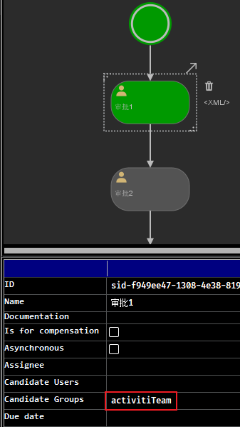
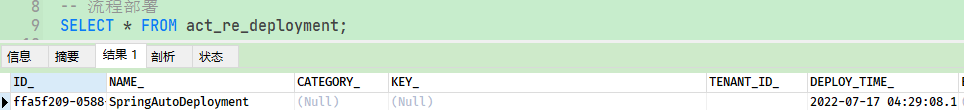
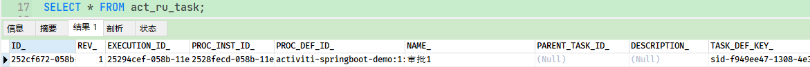
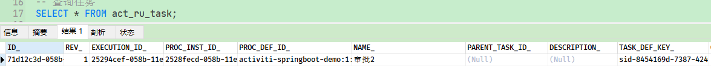

> Notes: 以下都是简单的整合示例，没有涉及真正的业务逻辑

## 1. Activiti7 与 Spring 整合开发

### 1.1. pom 依赖配置
 
pom.xml 配置如下：

```xml
<properties>
    <log4j2.version>2.17.2</log4j2.version>
    <activiti.version>7.1.0.M2</activiti.version>
    <druid.version>1.2.6</druid.version>
</properties>

<dependencies>
    <!-- Activiti 引擎核心依赖 -->
    <dependency>
        <groupId>org.activiti</groupId>
        <artifactId>activiti-engine</artifactId>
        <version>${activiti.version}</version>
    </dependency>
    <!-- Activiti 与 Spring 整合核心依赖 -->
    <dependency>
        <groupId>org.activiti</groupId>
        <artifactId>activiti-spring</artifactId>
        <version>${activiti.version}</version>
    </dependency>
    <!-- bpmn 模型处理 -->
    <dependency>
        <groupId>org.activiti</groupId>
        <artifactId>activiti-bpmn-model</artifactId>
        <version>${activiti.version}</version>
    </dependency>
    <!-- bpmn 转换 -->
    <dependency>
        <groupId>org.activiti</groupId>
        <artifactId>activiti-bpmn-converter</artifactId>
        <version>${activiti.version}</version>
    </dependency>
    <!-- bpmn json数据转换 -->
    <dependency>
        <groupId>org.activiti</groupId>
        <artifactId>activiti-json-converter</artifactId>
        <version>${activiti.version}</version>
    </dependency>
    <!-- bpmn 布局 -->
    <dependency>
        <groupId>org.activiti</groupId>
        <artifactId>activiti-bpmn-layout</artifactId>
        <version>${activiti.version}</version>
    </dependency>
    <!-- activiti 云支持 -->
    <!--<dependency>
        <groupId>org.activiti.cloud</groupId>
        <artifactId>activiti-cloud-services-api</artifactId>
        <version>${activiti.version}</version>
    </dependency>-->

    <!-- mysql驱动 -->
    <dependency>
        <groupId>mysql</groupId>
        <artifactId>mysql-connector-java</artifactId>
        <version>8.0.26</version>
    </dependency>
    <!-- mybatis -->
    <dependency>
        <groupId>org.mybatis</groupId>
        <artifactId>mybatis</artifactId>
        <version>3.5.9</version>
    </dependency>
    <!-- druid 数据源 -->
    <dependency>
        <groupId>com.alibaba</groupId>
        <artifactId>druid</artifactId>
        <version>${druid.version}</version>
    </dependency>
    <dependency>
        <groupId>junit</groupId>
        <artifactId>junit</artifactId>
        <version>4.12</version>
        <scope>test</scope>
    </dependency>
    <dependency>
        <groupId>org.springframework</groupId>
        <artifactId>spring-test</artifactId>
        <version>5.1.4.RELEASE</version>
        <scope>test</scope>
    </dependency>

    <!-- log4j2 日志 -->
    <dependency>
        <groupId>org.apache.logging.log4j</groupId>
        <artifactId>log4j-slf4j-impl</artifactId>
        <version>${log4j2.version}</version>
    </dependency>

    <dependency>
        <groupId>aspectj</groupId>
        <artifactId>aspectjweaver</artifactId>
        <version>1.5.4</version>
    </dependency>
</dependencies>
```


### 1.2. Activiti 与 Spring 整合配置文件

#### 1.2.1. 基于 xml 文件配置

在 Activiti 中核心类的是 `ProcessEngine` 流程引擎，与 Spring 整合就是让 Spring 来管理 `ProcessEngine` 实例。通过 `org.activiti.spring.SpringProcessEngineConfiguration` 与 Spring 整合方式来创建 `ProcessEngine` 对象

在示例项目中，创建 spring 与 activiti 的整合配置文件：activiti-spring.xml（名称自定）

```xml
<beans xmlns="http://www.springframework.org/schema/beans"
       xmlns:xsi="http://www.w3.org/2001/XMLSchema-instance"
       xmlns:tx="http://www.springframework.org/schema/tx"
       xmlns:aop="http://www.springframework.org/schema/aop"
       xsi:schemaLocation="http://www.springframework.org/schema/beans
        http://www.springframework.org/schema/beans/spring-beans.xsd
        http://www.springframework.org/schema/tx
        http://www.springframework.org/schema/tx/spring-tx.xsd
        http://www.springframework.org/schema/aop
        http://www.springframework.org/schema/aop/spring-aop.xsd">

    <!-- 配置数据源，使用阿里druid数据源 -->
    <bean id="dataSource" class="com.alibaba.druid.pool.DruidDataSource" destroy-method="close" primary="true">
        <property name="driverClassName" value="com.mysql.cj.jdbc.Driver"/>
        <property name="url" value="jdbc:mysql://127.0.0.1:3306/activiti_sample?useSSL=false"/>
        <property name="username" value="root"/>
        <property name="password" value="123456"/>
    </bean>

    <!-- 工作流引擎配置bean -->
    <bean id="processEngineConfiguration" class="org.activiti.spring.SpringProcessEngineConfiguration">
        <!-- 数据源 -->
        <property name="dataSource" ref="dataSource"/>
        <!-- 使用spring事务管理器 -->
        <property name="transactionManager" ref="transactionManager"/>
        <!-- 数据库策略 -->
        <property name="databaseSchemaUpdate" value="drop-create"/>
    </bean>
    <!-- 流程引擎 -->
    <bean id="processEngine" class="org.activiti.spring.ProcessEngineFactoryBean">
        <property name="processEngineConfiguration" ref="processEngineConfiguration"/>
    </bean>
    <!-- 资源服务service -->
    <bean id="repositoryService" factory-bean="processEngine" factory-method="getRepositoryService"/>
    <!-- 流程运行service -->
    <bean id="runtimeService" factory-bean="processEngine" factory-method="getRuntimeService"/>
    <!-- 任务管理service -->
    <bean id="taskService" factory-bean="processEngine" factory-method="getTaskService"/>
    <!-- 历史管理service -->
    <bean id="historyService" factory-bean="processEngine" factory-method="getHistoryService"/>
    <!-- 事务管理器 -->
    <bean id="transactionManager" class="org.springframework.jdbc.datasource.DataSourceTransactionManager">
        <property name="dataSource" ref="dataSource"/>
    </bean>
    <!-- 通知 -->
    <tx:advice id="txAdvice" transaction-manager="transactionManager">
        <tx:attributes>
            <!-- 传播行为 -->
            <tx:method name="save*" propagation="REQUIRED"/>
            <tx:method name="insert*" propagation="REQUIRED"/>
            <tx:method name="delete*" propagation="REQUIRED"/>
            <tx:method name="update*" propagation="REQUIRED"/>
            <tx:method name="find*" propagation="SUPPORTS" read-only="true"/>
            <tx:method name="get*" propagation="SUPPORTS" read-only="true"/>
        </tx:attributes>
    </tx:advice>
    <!-- 切面，根据具体项目修改切点配置 -->
    <!--<aop:config proxy-target-class="true">
        <aop:advisor advice-ref="txAdvice"
                     pointcut="execution(*com.moon.activiti.service.impl..(..))"/>
    </aop:config>-->
</beans>
```

数据库策略 databaseSchemaUpdate 的取值说明：

- flase：默认值。activiti 在启动时，会对比数据库表中保存的版本，如果没有表或者版本不匹配，将抛出异常。（生产环境常用）
- true：activiti 会对数据库中所有表进行更新操作。如果表不存在，则自动创建。（开发时常用）
- create_drop：在 activiti 启动时创建表，在关闭时删除表（必须手动关闭引擎，才能删除表）。（单元测试常用）
- drop-create：在 activiti 启动时删除原来的旧表，然后在创建新表（不需要手动关闭引擎）。

#### 1.2.2. 基于纯注解配置

> 参考 xml 配置，改成使用注解方式即可

1. 创建 Activiti 配置类 `ActivitiConfig`

```java
@Configuration
@ComponentScan("com.moon.activiti")
public class ActivitiConfig {

    /* 配置数据源，使用阿里druid数据源 */
    @Bean
    public DruidDataSource dataSource() {
        DruidDataSource druidDataSource = new DruidDataSource();
        druidDataSource.setDriverClassName("com.mysql.cj.jdbc.Driver");
        druidDataSource.setUrl("jdbc:mysql://127.0.0.1:3306/activiti_sample?useSSL=false");
        druidDataSource.setUsername("root");
        druidDataSource.setPassword("123456");
        return druidDataSource;
    }

    /* 工作流引擎配置bean */
    @Bean
    public SpringProcessEngineConfiguration processEngineConfiguration(DruidDataSource dataSource, DataSourceTransactionManager transactionManager) {
        SpringProcessEngineConfiguration processEngineConfiguration = new SpringProcessEngineConfiguration();
        // 设置数据源
        processEngineConfiguration.setDataSource(dataSource);
        // 设置 spring 事务管理器
        processEngineConfiguration.setTransactionManager(transactionManager);
        // 设置数据库策略
        processEngineConfiguration.setDatabaseSchemaUpdate("drop-create");
        return processEngineConfiguration;
    }

    /* 流程引擎 */
    @Bean
    public ProcessEngineFactoryBean processEngine(SpringProcessEngineConfiguration processEngineConfiguration) {
        ProcessEngineFactoryBean processEngineFactoryBean = new ProcessEngineFactoryBean();
        processEngineFactoryBean.setProcessEngineConfiguration(processEngineConfiguration);
        return processEngineFactoryBean;
    }

    /* Spring 事务管理器 */
    @Bean
    public DataSourceTransactionManager transactionManager(DruidDataSource dataSource) {
        DataSourceTransactionManager transactionManager = new DataSourceTransactionManager();
        transactionManager.setDataSource(dataSource);
        return transactionManager;
    }
}
```

2. 通过 `FactoryBean` 接口的方法，创建 `RepositoryService` 实例（*其他的 Service 操作实例同样的方式*）

```java
@Component("taskService")
public class RepositoryServiceFactoryBean implements FactoryBean<TaskService> {

    @Autowired
    private ProcessEngineFactoryBean processEngineFactoryBean;

    @Override
    public TaskService getObject() throws Exception {
        return processEngineFactoryBean.getObject().getTaskService();
    }

    @Override
    public Class<?> getObjectType() {
        return TaskService.class;
    }
}
```

相当于 xml 的配置

```xml
<bean id="taskService" factory-bean="processEngine" factory-method="getTaskService"/>
```

### 1.3. 测试

编写简单的测试代码，如果能获取 Activiti 相关 Service 类实例，即说明与 Spring 的整合成功。

- 基于 xml 配置测试

```java
@RunWith(SpringJUnit4ClassRunner.class)
@ContextConfiguration("classpath:activiti-spring.xml")
public class ActivitiSpringXmlTest {

    @Autowired
    private RepositoryService repositoryService;

    @Test
    public void testBasic() {
        System.out.println(repositoryService);
    }
}
```

- 基于注解配置测试

```java
@RunWith(SpringJUnit4ClassRunner.class)
@ContextConfiguration(classes = ActivitiConfig.class)
public class ActivitiSpringAnnotationTest {

    @Autowired
    private TaskService taskService;

    @Test
    public void testBasic() {
        System.out.println(taskService);
    }
}
```

### 1.4. 执行流程分析

Activiti 与 Spring 整合加载的过程分析：

1. 加载 activiti-spring.xml 配置文件（名称自定）
2. 加载 `SpringProcessEngineConfiguration` 对象，该对象需要依赖注入 `DataSource` 对象和 `TransactionManager` 对象。
3. 加载 `ProcessEngineFactoryBean` 工厂来创建 `ProcessEngine` 对象，而 `ProcessEngineFactoryBean` 工厂又需要依赖注入 `ProcessEngineConfiguration` 对象。
4. ProcessEngine 对象来负责创建 Activiti 各种 Service 处理对象，从而简化 Activiti 的开发过程。

## 2. Activiti7 与 SpringBoot 整合开发

Activiti7 发布正式版之后，它与 Spring Boot 2.x 已经完全支持整合开发。

### 2.1. pom 依赖配置

为了能够实现 SpringBoot 与 Activiti7 整合开发，首先需要在工程的 pom.xml 文件中引入相关的依赖，其中整合 activiti 核心的依赖是：activiti-spring-boot-starter。

具体依赖如下所示：

```xml
<dependencyManagement>
    <dependencies>
        <dependency>
            <groupId>org.springframework.boot</groupId>
            <artifactId>spring-boot-dependencies</artifactId>
            <version>2.2.6.RELEASE</version>
            <type>pom</type>
            <scope>import</scope>
        </dependency>
    </dependencies>
</dependencyManagement>

<dependencies>
    <!-- SpringBoot 整合 Activiti7 的核心依赖 -->
    <dependency>
        <groupId>org.activiti</groupId>
        <artifactId>activiti-spring-boot-starter</artifactId>
        <version>7.1.0.M2</version>
    </dependency>

    <dependency>
        <groupId>org.springframework.boot</groupId>
        <artifactId>spring-boot-starter-web</artifactId>
    </dependency>
    <dependency>
        <groupId>org.springframework.boot</groupId>
        <artifactId>spring-boot-starter-jdbc</artifactId>
    </dependency>
    <dependency>
        <groupId>org.springframework.boot</groupId>
        <artifactId>spring-boot-starter-test</artifactId>
        <scope>test</scope>
    </dependency>

    <dependency>
        <groupId>mysql</groupId>
        <artifactId>mysql-connector-java</artifactId>
        <version>8.0.26</version>
    </dependency>
</dependencies>

<build>
    <plugins>
        <!-- spring boot 打包插件 -->
        <plugin>
            <groupId>org.springframework.boot</groupId>
            <artifactId>spring-boot-maven-plugin</artifactId>
        </plugin>
    </plugins>
</build>
```

> 注：示例 import 的方式引入 Spring Boot 的依赖，也可以使用继承父项目的方式引入

### 2.2. Spring Boot 项目配置

为了能够实现 Activiti7 生成的表放到 Mysql 数据库中，需要在 Spring Boot 配置文件 application.yml 中添加相关的配置

> Notes: Activiti7 默认没有开启数据库历史记录，需要手动配置开启

```yml
spring:
  datasource:
    driver-class-name: com.mysql.cj.jdbc.Driver
    url: jdbc:mysql://127.0.0.1:3306/activiti_sample?useUnicode=true&characterEncoding=utf8&serverTimezone=GMT&useSSL=false
    username: root
    password: 123456
  activiti: # Activiti 相关配置
    # 1.flase：默认值。activiti在启动时，对比数据库表中保存的版本，如果没有表或者版本不匹配，将抛出异常
    # 2.true： activiti会对数据库中所有表进行更新操作。如果表不存在，则自动创建
    # 3.create_drop： 在activiti启动时创建表，在关闭时删除表（必须手动关闭引擎，才能删除表）
    # 4.drop-create： 在activiti启动时删除原来的旧表，然后在创建新表（不需要手动关闭引擎）
    database-schema-update: true
    # 检测历史表是否存在 activiti7默认没有开启数据库历史记录 启动数据库历史记录
    db-history-used: true
    # 记录历史等级 可配置的历史级别有none, activity, audit, full
    # none：不保存任何的历史数据，因此，在流程执行过程中，这是最高效的。
    # activity：级别高于none，保存流程实例与流程行为，其他数据不保存。
    # audit：除activity级别会保存的数据外，还会保存全部的流程任务及其属性。audit为history的默认值。
    # full：保存历史数据的最高级别，除了会保存audit级别的数据外，还会保存其他全部流程相关的细节数据，包括一些流程参数等。
    history-level: full
    # 校验流程文件，默认校验resources下的processes文件夹里的流程文件
    # check-process-definitions: false
```

### 2.3. 整合 Spring Security 安全框架

因为 Activiti7 与 Spring Boot 整合后，默认情况下，集成了 Spring Security 安全框架，因此需要准备 Spring Security 所需相关用户权限配置信息。

Spring Boot 的依赖已经包含 Spring Security 的依赖。

#### 2.3.1. 编写项目启动类

```java
@SpringBootApplication
public class ActivitiApplication {
    public static void main(String[] args) {
        SpringApplication.run(ActivitiApplication.class, args);
    }
}
```

#### 2.3.2. Spring Security 配置类

创建配置类，它的作用是为了实现 Spring Security 框架的用户权限的配置，这样就可以在系统中使用用户权限信息。

```java
@Configuration
public class SpringSecurityConfig {

    /* 日志对象 */
    private static final Logger LOGGER = LoggerFactory.getLogger(SpringSecurityConfig.class);

    /**
     * 创建 UserDetailsService 实例。用于定义用户信息服务（查询用户信息）
     * 此示例为了方便，直接硬编码用户信息并加入到内存中
     *
     * @return
     */
    @Bean
    public UserDetailsService userDetailsService() {
        // 创建用户内存管理器
        InMemoryUserDetailsManager inMemoryUserDetailsManager = new InMemoryUserDetailsManager();
        // 构造用户的信息。（后面处理流程时用到的任务负责人，需要添加在这里）
        String[][] usersGroupAndRoles = {
                {"jack", "password", "ROLE_ACTIVITI_USER", "GROUP_activitiTeam"},
                {"rose", "password", "ROLE_ACTIVITI_USER", "GROUP_activitiTeam"},
                {"tom", "password", "ROLE_ACTIVITI_USER", "GROUP_activitiTeam"},
                {"jerry", "password", "ROLE_ACTIVITI_USER", "GROUP_activitiTeam"},
                {"other", "password", "ROLE_ACTIVITI_USER", "GROUP_otherTeam"},
                {"system", "password", "ROLE_ACTIVITI_USER"},
                {"admin", "password", "ROLE_ACTIVITI_ADMIN"}
        };

        for (String[] users : usersGroupAndRoles) {
            // 用户的角色和组
            List<String> authStrList = Arrays.asList(Arrays.copyOfRange(users, 2, users.length));

            LOGGER.info("> Registering new user: {} with the following Authorities[{}]", users[0], authStrList);

            User user = new User(users[0], passwordEncoder().encode(users[1]),
                    authStrList.stream().map(SimpleGrantedAuthority::new).collect(Collectors.toList()));
            // 将用户信息加载到内存中
            inMemoryUserDetailsManager.createUser(user);
        }
        return inMemoryUserDetailsManager;

    }

    /**
     * 密码编码器，即设置登陆时密码的校验
     *
     * @return
     */
    @Bean
    public PasswordEncoder passwordEncoder() {
        return new BCryptPasswordEncoder();
    }
}
```

> Notes:
>
> - 本次示例项目为了方便，基本是在文件中定义用户信息加载到内存中，而实际项目都是从数据库中查询的用户权限信息。后面处理流程时用到的任务负责人，需要添加在这里
> - 此配置类参考在 Activiti7 官方源码的 Example 中找到 `DemoApplicationConfig` 类

#### 2.3.3. 添加 SecurityUtil 类

为了能够快速实现 Spring Security 安全框架的配置，增加一个工具类

```java
@Component
public class SecurityUtil {

    /* 日志对象 */
    private static final Logger LOGGER = LoggerFactory.getLogger(SecurityUtil.class);

    @Autowired
    @Qualifier("userDetailsService")
    private UserDetailsService userDetailsService;

    public void logInAs(String username) {
        UserDetails user = userDetailsService.loadUserByUsername(username);
        if (user == null) {
            throw new IllegalStateException("User " + username + " doesn't exist, please provide a valid user");
        }
        LOGGER.info("> Logged in as: " + username);

        Authentication authentication = new Authentication() {
            private static final long serialVersionUID = -773994554780044680L;

            @Override
            public Collection<? extends GrantedAuthority> getAuthorities() {
                return user.getAuthorities();
            }

            @Override
            public Object getCredentials() {
                return user.getPassword();
            }

            @Override
            public Object getDetails() {
                return user;
            }

            @Override
            public Object getPrincipal() {
                return user;
            }

            @Override
            public boolean isAuthenticated() {
                return true;
            }

            @Override
            public void setAuthenticated(boolean isAuthenticated) throws IllegalArgumentException {
            }

            @Override
            public String getName() {
                return user.getUsername();
            }
        };

        SecurityContextHolder.setContext(new SecurityContextImpl(authentication));

        org.activiti.engine.impl.identity.Authentication.setAuthenticatedUserId(username);
    }
}
```

> 此工具类参考在 Activiti7 官方源码的 Example 中找到 `SecurityUtil` 类

### 2.4. 创建 bpmn 流程文件

Activiti7 可以自动部署流程，前提是在 resources 目录下，创建一个新的目录 processes，用来放置 bpmn 文件。

创建一个简单的 bpmn 流程文件，并设置任务的用户组【Candidate Groups】。【Candidate Groups】中的内容与上面示例的 `SpringSecurityConfig` 类中出现的用户组名称要保持一致，因此可以填写：`activitiTeam` 或者 `otherTeam`。此方式配置的好处是：当不确定到底由谁来负责当前任务的时候，只要是 Groups 内的用户都可以拾取这个任务



### 2.5. 流程测试

#### 2.5.1. 查询流程定义

查询流程定义同时，Activiti7 会自动部署流程

```java
@RunWith(SpringRunner.class)
@SpringBootTest
public class ActivitiSpringBootTest {

    /* 日志对象 */
    private static final Logger LOGGER = LoggerFactory.getLogger(ActivitiSpringBootTest.class);

    @Autowired
    private ProcessRuntime processRuntime;

    @Autowired
    private SecurityUtil securityUtil;

    /**
     * 查看流程定义内容。
     * Activiti7 可以自动部署流程
     */
    @Test
    public void testQueryProcessDefinition() {
        // 需要先登陆用户
        securityUtil.logInAs("jack");
        // 流程定义的分页对象
        Page<ProcessDefinition> definitionPage = processRuntime.processDefinitions(Pageable.of(0, 10));
        LOGGER.info("可用的流程定义总数：{}", definitionPage.getTotalItems());
        for (ProcessDefinition processDefinition : definitionPage.getContent()) {
            LOGGER.info("==============================");
            LOGGER.info("流程定义内容：{}", processDefinition);
            LOGGER.info("==============================");
        }
    }
}
```



#### 2.5.2. 启动流程

```java
@Test
public void testStartProcess() {
    // 设置登录用户
    securityUtil.logInAs("system");
    ProcessInstance processInstance = processRuntime.start(
            ProcessPayloadBuilder.start()
                    .withProcessDefinitionKey("activiti-springboot-demo")
                    .build()
    );
    LOGGER.info("流程实例的内容，{}", processInstance);
}
```



#### 2.5.3. 完成任务

```java
@Autowired
private TaskRuntime taskRuntime;

@Test
public void testCompleteTask() {
    // 设置登录用户
    securityUtil.logInAs("jerry");
    // 查询任务
    Page<Task> taskPage = taskRuntime.tasks(Pageable.of(0, 10));
    if (taskPage != null && taskPage.getTotalItems() > 0) {
        for (Task task : taskPage.getContent()) {
            // 拾取任务
            taskRuntime.claim(TaskPayloadBuilder.claim().withTaskId(task.getId()).build());
            LOGGER.info("任务内容,{}", task);
            // 完成任务
            taskRuntime.complete(TaskPayloadBuilder.complete().withTaskId(task.getId()).build());
        }
    }
}
```



## 3. Spring Boot 的工作流开源项目推荐

### 3.1. Spring-boot-activiti

> 项目地址：https://gitee.com/shenzhanwang/Spring-activiti

本项目旨在基于 Spring boot 这一平台，整合业界流行的工作流引擎Activiti，并建立了两个完整的工作流进行演示：请假OA和采购流程。

### 3.2. RuoYi-vue 4.x + flowable

基于 RuoYi-vue 4.x + flowable 6.5 的工作流管理

**项目概述**

- 前端采用Vue、Element UI。
- 后端采用Spring Boot、Spring Security、Redis & Jwt。
- 权限认证使用Jwt，支持多终端认证系统。
- 支持加载动态权限菜单，多方式轻松权限控制。
- 高效率开发，使用代码生成器可以一键生成前后端代码。

**内置功能**

- 流程设计
- 表单配置
- 流程发起
- 流转处理

**项目地址**

- Gitee：https://gitee.com/tony2y/RuoYi-flowable.git
- GitHub：https://github.com/tony2y/RuoYi-flowable.git
- 演示访问链接：http://www.tony2y.top
- 使用文档：https://www.yuque.com/u1024153/icipor
- RuoYi 文档地址：http://doc.ruoyi.vip

**演示图**


