# Authorization Overview（授权认证概述）

此部分是对于授权认证的综合概述，是各种授权认证框架的公共介绍。具体授权框架的使用教程详见各个框架笔记

## 1. 基本概念

### 1.1. 什么是认证

认证 ：一般是指用户认证，就是判断一个用户的身份是否合法的过程，用户去访问系统资源时系统要求验证用户的身份信息，身份合法方可继续访问，不合法则拒绝访问。认证是为了保护系统的隐私数据与资源，用户的身份合法方可访问该系统的资源。

常见的用户身份认证方式有：用户名密码登录，二维码登录，手机短信登录，指纹认证等方式。

### 1.2. 什么是会话

用户认证通过后，为了避免用户的每次操作都进行认证可将用户的信息保证在会话中。会话就是系统为了保持当前用户的登录状态所提供的机制，常见的有基于 session 方式、基于 token 方式等。

#### 1.2.1. 基于 session 的认证方式

交互流程是，用户认证成功后，在服务端生成用户相关的数据保存在 session(当前会话)中，发给客户端的 sesssion_id 存放到 cookie 中，这样用户客户端请求时带上 session_id 就可以验证服务器端是否存在 session 数据，以此完成用户的合法校验，当用户退出系统或 session 过期销毁时，客户端的 session_id 也就无效了。

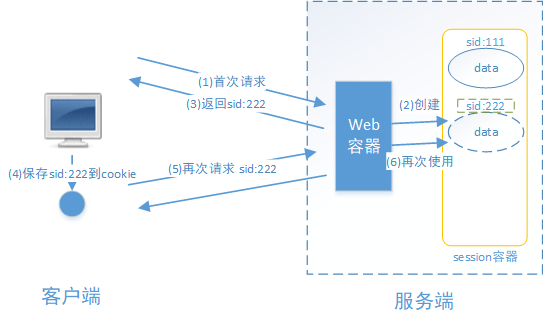

#### 1.2.2. 基于 token 的认证方式

交互流程是，用户认证成功后，服务端生成一个 token 发给客户端，客户端可以放到 cookie 或 localStorage 等存储中，每次请求时带上 token，服务端收到 token 通过验证后即可确认用户身份。


#### 1.2.3. 两种方式的区别

- 基于 session 的认证方式由 Servlet 规范定制，服务端要存储 session 信息需要占用内存资源，客户端需要支持 cookie；
- 基于 token 的方式则一般不需要服务端存储 token，并且不限制客户端的存储方式。

如今移动互联网时代更多类型的客户端需要接入系统，系统多是采用前后端分离的架构进行实现，所以基于 token 的方式更适合。

### 1.3. 什么是授权

授权是用户认证通过后，根据用户的权限来控制用户访问资源的过程，拥有资源的访问权限则正常访问，没有权限则拒绝访问。

认证是为了保证用户身份的合法性，授权则是为了更细粒度的对隐私数据进行划分，授权是在认证通过后发生的，控制不同的用户能够访问不同的资源。

### 1.4. 授权的数据模型

授权即对用户访问资源进行控制。

#### 1.4.1. 数据模型的类型

授权是有相关的数据模型，主要分成以下几种类型：

- 主体（Subject），一般是指用户，也可以是程序，需要访问系统中的资源。
- 资源（Resource），如系统菜单、页面、按钮、代码方法、系统商品信息、系统订单信息等。系统菜单、页面、按钮、代码方法都属于系统功能资源，对于 web 系统每个功能资源通常对应一个 URL；系统商品信息、系统订单信息都属于实体资源（数据资源），实体资源由资源类型和资源实例组成，比如商品信息为资源类型，商品编号 为 001 的商品为资源实例。
- 权限/许可（Permission），规定了用户对资源的操作许可，权限离开资源没有意义，如用户查询权限、用户添加权限、某个代码方法的调用权限、编号为 001 的用户的修改权限等，通过权限可知用户对哪些资源都有哪些操作许可。

#### 1.4.2. 数据模型之间的关系

对于权限的控制，一般是会引入角色这个概念，定义一个角色所拥有那些权限，再根据权限去访问相应的资源。相关的数据模型如下：

- 主体表（用户 id、账号、密码、...）
- 资源表（资源 id、资源名称、访问地址、...）
- 权限表（权限 id、权限标识、权限名称、资源 id、...）
- 角色表（角色 id、角色名称、...）
- 角色和权限关系表（角色 id、权限 id、...）
- 主体（用户）和角色关系表（用户 id、角色 id、...）

关系如下图：

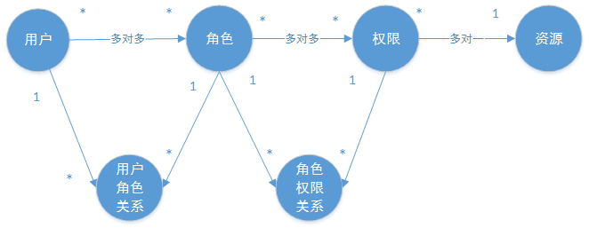

通常企业开发中会设计将资源和权限表合并为一张权限表，如下：

- 权限表（权限 id、权限标识、权限名称、资源名称、资源访问地址、...）

修改后数据模型之间的关系如下图：

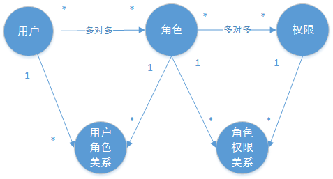

### 1.5. RBAC 授权方案

#### 1.5.1. 基于角色的访问控制

RBAC 基于角色的访问控制（Role-Based Access Control）是按角色进行授权。

例如：定义角色 A 可以进行删除某些资源的操作，那么代码的处理逻辑就是，在删除这些资源之前，就需要判断当前用户是否为角色 A。如果是，则可以删除资源；否则不能删除。但如果当前有新需求需要增加角色 B，并且也可以进行删除资源的操作，此时就需要修改代码，将删除资源需要判断当前用户是否为角色 A 或者角色 B，如果是，则可以删除资源。

根据上面的例子发现，当需要修改角色的权限时就需要修改授权的相关代码，系统可扩展性差。

#### 1.5.2. 基于资源的访问控制

RBAC 基于资源的访问控制（Resource-Based Access Control）是按资源（或权限）进行授权。

例如：同样是上面的示例，如果调整为拥有权限 A 的才可以进行删除资源操作，那么代码的实现逻辑是判断当前用户的角色 A 是否有权限 A，如果有，则可以删除资源。那么当新增一个角色 B 时，如果也需要进行删除操作，则需要在表中新增记录，将角色 B 与权限 A 绑定，则角色 B 就拥有了删除资源的权限，此时是不需要修改原代码的判断逻辑。

根据上面的例子可发现，根据系统设计时定义好相关权限关系，即使修改主体相关的角色，也不需要修改原授权的逻辑代码，系统可扩展性强。

## 2. 基于 Session 实现认证的示例

本案例工程使用 maven 进行构建，使用 SpringMVC、Servlet3.0 实现。

### 2.1. 认证流程

> 基于 Session 认证方式的流程描述详见《[基于 session 的认证方式](#_121-基于-session-的认证方式)》

基于 Session 的认证机制由 Servlet 规范定制，Servlet 容器已实现，用户通过 `HttpSession` 的操作方法即可实现，如下是 `HttpSession` 常用的相关操作 API。

| 方法                                          | 作用                        |
| --------------------------------------------- | --------------------------- |
| `HttpSession getSession(Boolean create)`      | 获取当前 `HttpSession` 对象 |
| `void setAttribute(String name,Object value)` | 向 session 中存放对象       |
| `object getAttribute(String name)`            | 从 session 中获取对象       |
| `void removeAttribute(String name);`          | 移除 session 中对象         |
| `void invalidate()`                           | 使 `HttpSession` 失效       |

### 2.2. 创建示例工程

#### 2.2.1. 创建 maven 工程

创建 maven 工程：security-session-sample。最终项目结构如下：

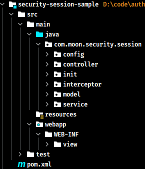

引入如下依赖如下，注意：

1. 由于示例项目是 web 工程，所以 `packaging` 设置为 `war`
2. 使用 tomcat7-maven-plugin 插件来运行工程

```xml
<?xml version="1.0" encoding="UTF-8"?>
<project xmlns="http://maven.apache.org/POM/4.0.0"
         xmlns:xsi="http://www.w3.org/2001/XMLSchema-instance"
         xsi:schemaLocation="http://maven.apache.org/POM/4.0.0 http://maven.apache.org/xsd/maven-4.0.0.xsd">

    <modelVersion>4.0.0</modelVersion>
    <groupId>com.moon</groupId>
    <artifactId>security-session-sample</artifactId>
    <version>1.0-SNAPSHOT</version>
    <name>${artifactId}</name>
    <packaging>war</packaging>
    <description>
        基于 Session 实现授权认证的示例工程
    </description>

    <properties>
        <project.build.sourceEncoding>UTF-8</project.build.sourceEncoding>
        <maven.compiler.source>8</maven.compiler.source>
        <maven.compiler.target>8</maven.compiler.target>
    </properties>

    <dependencies>
        <dependency>
            <groupId>org.springframework</groupId>
            <artifactId>spring-webmvc</artifactId>
            <version>5.1.5.RELEASE</version>
        </dependency>

        <dependency>
            <groupId>javax.servlet</groupId>
            <artifactId>javax.servlet-api</artifactId>
            <version>3.0.1</version>
            <scope>provided</scope>
        </dependency>
        <dependency>
            <groupId>org.projectlombok</groupId>
            <artifactId>lombok</artifactId>
            <version>1.18.22</version>
        </dependency>
    </dependencies>

    <build>
        <finalName>${artifactId}</finalName>
        <pluginManagement>
            <plugins>
                <plugin>
                    <groupId>org.apache.tomcat.maven</groupId>
                    <artifactId>tomcat7-maven-plugin</artifactId>
                    <version>2.2</version>
                </plugin>
                <!-- 编译插件 -->
                <plugin>
                    <groupId>org.apache.maven.plugins</groupId>
                    <artifactId>maven-compiler-plugin</artifactId>
                    <configuration>
                        <source>1.8</source>
                        <target>1.8</target>
                    </configuration>
                </plugin>
                <!-- 资源打包插件 -->
                <plugin>
                    <artifactId>maven-resources-plugin</artifactId>
                    <configuration>
                        <encoding>utf-8</encoding>
                        <useDefaultDelimiters>true</useDefaultDelimiters>
                        <resources>
                            <resource>
                                <directory>src/main/resources</directory>
                                <filtering>true</filtering>
                                <includes>
                                    <include>**/*</include>
                                </includes>
                            </resource>
                            <resource>
                                <directory>src/main/java</directory>
                                <includes>
                                    <include>**/*.xml</include>
                                </includes>
                            </resource>
                        </resources>
                    </configuration>
                </plugin>
            </plugins>
        </pluginManagement>
    </build>

</project>
```

#### 2.2.2. 创建 Spring 容器配置类

创建 `com.moon.security.session.config.ApplicationConfig` 类，用于替代 applicationContext.xml 配置文件。对应在 web.xml 中的 `ContextLoaderListener` 等配置。

```java
/**
 * 替代 applicationContext.xml 配置文件
 * 在此类中配置除了Controller的其它bean，比如：数据库链接池、事务管理器、业务bean等。
 */
@Configuration
@ComponentScan(basePackages = "com.moon.security.session",
        excludeFilters = {@ComponentScan.Filter(type = FilterType.ANNOTATION, value = Controller.class)})
public class ApplicationConfig {
}
```

#### 2.2.3. 创建 ServletContext 配置类

本案例采用 Servlet3.0 无 web.xml 方式，创建 `com.moon.security.session.config.WebConfig` 类，它对应于 web.xml 文件中的 `DispatcherServlet` 配置

```java
/**
 * 此配置类相当于在 web.xml 的 DispatcherServlet 配置。
 * 在此类中配置 Spring MVC 的视频解析器
 */
@Configuration
@EnableWebMvc
@ComponentScan(basePackages = "com.moon.security.session",
        includeFilters = {@ComponentScan.Filter(type = FilterType.ANNOTATION, value = Controller.class)})
public class WebConfig implements WebMvcConfigurer {

    // 视图解析器
    @Bean
    public InternalResourceViewResolver viewResolver() {
        InternalResourceViewResolver viewResolver = new InternalResourceViewResolver();
        viewResolver.setPrefix("/WEB-INF/view/");
        viewResolver.setSuffix(".jsp");
        return viewResolver;
    }

}
```

#### 2.2.4. 加载 Spring 容器

在 init 包下创建 Spring 容器初始化类 `SpringApplicationInitializer`，此类实现 `WebApplicationInitializer` 接口，Spring 容器启动时加载 `WebApplicationInitializer` 接口的所有实现类。

注：一般自定义的初始化类会继承抽象现实类 `org.springframework.web.servlet.support.AbstractAnnotationConfigDispatcherServletInitializer` ，它实现了 `WebApplicationInitializer` 接口。

```java
/**
 * 实现 WebApplicationInitializer 接口。用于初始化 Spring 容器。
 * 此类相当于 web.xml 配置文件，使用了 servlet3.0 开发则不需要再定义 web.xml
 */
public class SpringApplicationInitializer extends AbstractAnnotationConfigDispatcherServletInitializer {
    /* 指定rootContext的配置类 */
    @Override
    protected Class<?>[] getRootConfigClasses() {
        return new Class<?>[]{ApplicationConfig.class};
    }

    /* 指定servletContext的配置类 */
    @Override
    protected Class<?>[] getServletConfigClasses() {
        return new Class<?>[]{WebConfig.class};
    }

    /* 配置 servlet 访问地址映射 */
    @Override
    protected String[] getServletMappings() {
        return new String[]{"/"};
    }
}
```

`SpringApplicationInitializer` 相当于 web.xml，使用了 servlet3.0 开发则不需要再定义 web.xml，`ApplicationConfig.class` 对应以下配置的 application-context.xml，`WebConfig.class` 对应以下配置的 spring-mvc.xml，上面示例配置相当于 web.xml 的内容参考如下：

```xml
<web‐app>
    <listener>
        <listener‐class>org.springframework.web.context.ContextLoaderListener</listener‐class>
    </listener>
    <context‐param>
        <param‐name>contextConfigLocation</param‐name>
        <param‐value>/WEB‐INF/application‐context.xml</param‐value>
    </context‐param>

    <servlet>
        <servlet‐name>springmvc</servlet‐name>
        <servlet‐class>org.springframework.web.servlet.DispatcherServlet</servlet‐class>
        <init‐param>
            <param‐name>contextConfigLocation</param‐name>
            <param‐value>/WEB‐INF/spring‐mvc.xml</param‐value>
        </init‐param>
        <load‐on‐startup>1</load‐on‐startup>
    </servlet>

    <servlet‐mapping>
        <servlet‐name>springmvc</servlet‐name>
        <url‐pattern>/</url‐pattern>
    </servlet‐mapping>
</web‐app>
```

### 2.3. 认证功能的实现

#### 2.3.1. 认证页面

在 webapp/WEB-INF/views 下创建认证页面 login.jsp，本案例只是测试认证流程，页面没有添加 css 样式，只实现可填入用户名，密码，触发登录将提交表单信息至 /login，内容如下：

```jsp
<%@ page contentType="text/html;charset=UTF-8" pageEncoding="utf-8" %>
<html>
<head>
    <title>用户登录</title>
</head>
<body>
<form action="login" method="post">
    用户名：<input type="text" name="username"/><br/>
    密&nbsp;&nbsp;&nbsp;码:
    <input type="password" name="password"/><br/>
    <input type="submit" value="登录">
</form>
</body>
</html>
```

在 `WebConfig` 类中新增如下配置，将 url `/` 重定向到 login.jsp 页面：

```java
/**
 * 配置 url 的与页面的映射关系
 *
 * @param registry
 */
@Override
public void addViewControllers(ViewControllerRegistry registry) {
    // 增加 url 为 '/' 时，映射到 login.jsp 页面
    registry.addViewController("/").setViewName("login");
}
```

#### 2.3.2. 创建认证接口

用户进入认证页面，输入账号和密码，点击登录，请求 /login 进行身份认证。

- 创建接收请求参数、响应参数的实体类

认证请求实体类：

```java
@Data
public class AuthenticationRequest {
    /** 用户名 */
    private String username;

    /** 密码 */
    private String password;
}
```

认证成功后返回的用户详细信息，也就是当前登录用户的信息：

```java
@Data
@AllArgsConstructor
public class UserDto {
    // 用户身份信息
    private String id;
    private String username;
    private String password;
    private String fullname;
    private String mobile;
}
```

- 定义认证检验业务接口，此接口用于对传来的用户名、密码校验，若成功则返回该用户的详细信息，否则抛出错误异常：

> _注：此处只是模拟登陆，没有查询数据库，代码写死用户_

```java
public interface AuthenticationService {
    /**
     * 用户认证
     *
     * @param authenticationRequest 用户认证请求，账号和密码
     * @return 认证成功的用户信息
     */
    UserDto authentication(AuthenticationRequest authenticationRequest);
}
```

实现类

```java
@Service
public class AuthenticationServiceImpl implements AuthenticationService {

    @Override
    public UserDto authentication(AuthenticationRequest authenticationRequest) {
        // 校验参数是否为空
        if (authenticationRequest == null
                || StringUtils.isEmpty(authenticationRequest.getUsername())
                || StringUtils.isEmpty(authenticationRequest.getPassword())) {
            throw new RuntimeException("账号和密码为空");
        }

        // 根据账号去查询数据库，这里测试程序采用模拟方法
        UserDto user = getUserDto(authenticationRequest.getUsername());
        // 判断用户是否为空
        if (user == null) {
            throw new RuntimeException("查询不到该用户");
        }
        // 校验密码
        if (!authenticationRequest.getPassword().equals(user.getPassword())) {
            throw new RuntimeException("账号或密码错误");
        }
        // 认证通过，返回用户身份信息
        return user;
    }


    // 模拟根据账号查询用户信息
    private UserDto getUserDto(String userName) {
        return userMap.get(userName);
    }

    // 保存用户信息的map
    private final Map<String, UserDto> userMap = new HashMap<>();
    // 初始化一些测试使用的用户信息到内存中
    {
        userMap.put("admin", new UserDto("1000", "admin", "123", "管理员", "133443"));
        userMap.put("moon", new UserDto("1011", "moon", "456", "月之哀伤", "144553"));
    }
}
```

- 创建请求控制类，对 /login 请求处理，并调用 `AuthenticationService` 完成认证并返回登录结果提示信息：

```java
@RestController
public class LoginController {
    @Autowired
    AuthenticationService authenticationService;

    /**
     * 用户登陆
     *
     * @param authenticationRequest 登陆请求参数
     * @return
     */
    @PostMapping(value = "/login", produces = "text/plain;charset=utf-8")
    public String login(AuthenticationRequest authenticationRequest) {
        UserDto userDto = authenticationService.authentication(authenticationRequest);
        return userDto.getUsername() + "登录成功";
    }
}
```

#### 2.3.3. 启动项目测试

使用 maven 命令启动项目，以下是使用 idea 为示例：

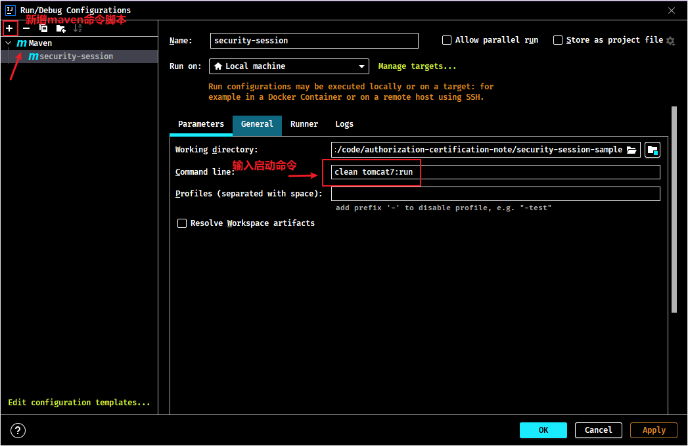

```bash
clean tomcat7:run
```

输入网址：http://localhost:8080/security-session-sample 进行测试

填入错误的用户信息，页面返回错误信息：

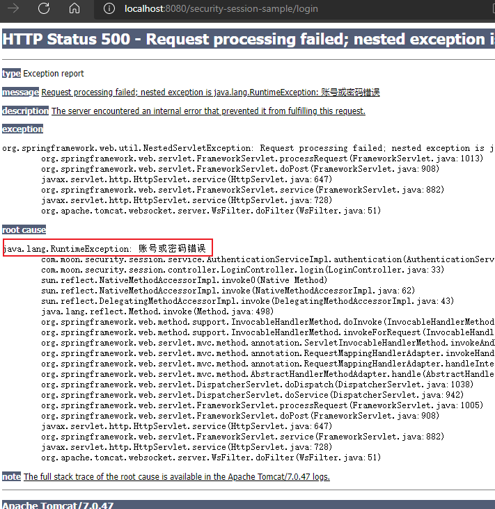

填入正确的用户信息，页面提示登录成功：

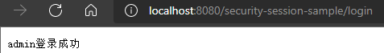

以上的测试全部符合预期，到目前为止最基础的认证功能已经完成，但目前仅仅实现了对用户身份凭证的校验，若某用户认证成功，只能说明他是该系统的一个合法用户而已。

### 2.4. 实现会话功能

会话是指用户登入系统后，系统会记住该用户的登录状态，可以在系统连续操作直到退出系统的过程。

认证的目的是对系统资源的保护，每次对资源的访问，系统必须得知道是谁在访问资源，才能对该请求进行合法性拦截。因此，在认证成功后，一般会把认证成功的用户信息放入 Session 中，在后续的请求中，系统能够从 Session 中获取到当前用户，用这样的方式来实现会话机制。

#### 2.4.1. 增加会话控制逻辑

在 UserDto 定义一个 `SESSION_USER_KEY` 常量，作为 Session 中存放登录用户信息的 key。

```java
public class UserDto {
    // 用户session的key
    public static final String SESSION_USER_KEY = "_user";
    ...
}
```

修改 `LoginController`，在认证成功后，增加将用户信息放入当前会话的逻辑

```java
@PostMapping(value = "/login", produces = "text/plain;charset=utf-8")
public String login(AuthenticationRequest authenticationRequest, HttpSession httpSession) {
    UserDto userDto = authenticationService.authentication(authenticationRequest);
    // 将用户信息存入session中
    httpSession.setAttribute(UserDto.SESSION_USER_KEY, userDto);
    return userDto.getUsername() + "登录成功";
}
```

在 `LoginController` 类中增加用户登出方法，只需要将 session 设置为失效即可

```java
@GetMapping(value = "/logout",produces = {"text/plain;charset=UTF-8"})
public String logout(HttpSession session){
    session.invalidate();
    return "退出成功";
}
```

#### 2.4.2. 增加 session 测试方法

在 `LoginController` 类中增加 session 的校验方法，根据用户的 key 值从当前会话 session 中获取当前登录用户，并返回提示信息给前台。

```java
@GetMapping(value = "/check", produces = {"text/plain;charset=UTF-8"})
public String checkSession(HttpSession session) {
    String fullname = null;
    // 从 session 中获取用户信息
    Object object = session.getAttribute(UserDto.SESSION_USER_KEY);
    if (object == null) {
        fullname = "匿名"; // 无登陆
    } else {
        UserDto userDto = (UserDto) object;
        fullname = userDto.getFullname(); // 有登陆
    }
    return fullname + "访问资源";
}
```

#### 2.4.3. 测试

- 未登录情况下直接访问测试资源 /check，返回结果是“匿名访问资源”
- 成功登录的情况下访问测试资源 /check，返回结果是“管理员访问资源”

测试结果说明，在用户登录成功时，该用户信息已被成功放入 session，并且后续请求可以正常从 session 中获取当前登录用户信息，符合预期结果。

### 2.5. 实现授权功能

通过上次两个步骤，已经实现了用户登陆与使用 session 保存用户的登陆状态。然后现在需要完成如下功能：

- 匿名用户（未登录用户）访问拦截：禁止匿名用户访问某些资源。
- 登录用户访问拦截：根据用户的权限决定是否能访问某些资源。

#### 2.5.1. 给用户增加权限

- 在 `UserDto` 类中增加权限属性，用于表示该登录用户所拥有的权限

```java
public class UserDto {
    ...
    /** 用户权限 */
    private Set<String> authorities;
}
```

- 在 `AuthenticationServiceImpl` 中为模拟用户初始化权限，分别给两个用户 p1 和 p2 权限

```java
{
    Set<String> authorities1 = new HashSet<>();
    authorities1.add("p1"); // 模拟增加权限1
    Set<String> authorities2 = new HashSet<>();
    authorities2.add("p2"); // 模拟增加权限2
    // 分别给两个用户设置不同的权限标识
    userMap.put("admin", new UserDto("1000", "admin", "123", "管理员", "133443", authorities1));
    userMap.put("moon", new UserDto("1011", "moon", "456", "月之哀伤", "144553", authorities2));
}
```

#### 2.5.2. 增加不同权限测试请求资源

在 `LoginController` 类分别定义两个针对不同的用户访问的不同资源

```java
/**
 * 测试当前用户是否有登陆
 *
 * @param session
 * @return
 */
@GetMapping(value = "/check/p1", produces = {"text/plain;charset=UTF-8"})
public String checkSession(HttpSession session) {
    String fullname = null;
    // 从 session 中获取用户信息
    Object object = session.getAttribute(UserDto.SESSION_USER_KEY);
    if (object == null) {
        fullname = "匿名"; // 无登陆
    } else {
        UserDto userDto = (UserDto) object;
        fullname = userDto.getFullname(); // 有登陆
    }
    return fullname + "访问资源p1";
}

/**
 * 测试当前用户是否有登陆
 *
 * @param session
 * @return
 */
@GetMapping(value = "/check/p2", produces = {"text/plain;charset=UTF-8"})
public String checkSession2(HttpSession session) {
    String fullname = null;
    // 从 session 中获取用户信息
    Object object = session.getAttribute(UserDto.SESSION_USER_KEY);
    if (object == null) {
        fullname = "匿名"; // 无登陆
    } else {
        UserDto userDto = (UserDto) object;
        fullname = userDto.getFullname(); // 有登陆
    }
    return fullname + "访问资源p2";
}
```

#### 2.5.3. 授权拦截器

在 interceptor 包下创建 `AuthenticationInterceptor` 拦截器，需要实现 `org.springframework.web.servlet.HandlerInterceptor` 接口，实现简单授权拦截，主要处理的逻辑如下：

1. 校验用户是否登录
2. 校验用户是否拥有操作权限

```java
@Component
public class AuthenticationInterceptor implements HandlerInterceptor {
    /**
     * 请求前置拦截逻辑。在此方法中校验用户请求的url是否在用户的权限范围内
     *
     * @param request
     * @param response
     * @param handler
     * @return
     * @throws Exception
     */
    @Override
    public boolean preHandle(HttpServletRequest request, HttpServletResponse response, Object handler) throws Exception {
        // 获取用户身份信息
        Object object = request.getSession().getAttribute(UserDto.SESSION_USER_KEY);

        if (object == null) {
            // 用户无登陆
            responseContent(response, "请登录");
            return false;
        }

        UserDto userDto = (UserDto) object;
        // 请求的url
        String requestURI = request.getRequestURI();
        if (userDto.getAuthorities().contains("p1") && requestURI.contains("/check/p1")) {
            return true;
        }
        if (userDto.getAuthorities().contains("p2") && requestURI.contains("/check/p2")) {
            return true;
        }
        responseContent(response, "没有权限，拒绝访问");

        return false;
    }

    /**
     * 响应处理
     *
     * @param response
     * @param msg
     */
    private void responseContent(HttpServletResponse response, String msg) throws IOException {
        response.setContentType("text/html;charset=utf-8");
        PrintWriter writer = response.getWriter();
        writer.print(msg);
        writer.close();
    }
}
```

#### 2.5.4. 配置拦截器

在 `WebConfig` 配置类中，重写 `addInterceptors` 方法，配置自定义的授权拦截器，匹配 `/check/**` 的资源为受保护的系统资源，访问该资源的请求进入 `AuthenticationInterceptor` 拦截器。

```java
@Configuration
@EnableWebMvc
@ComponentScan(basePackages = "com.moon.security.session",
        includeFilters = {@ComponentScan.Filter(type = FilterType.ANNOTATION, value = Controller.class)})
public class WebConfig implements WebMvcConfigurer {

    @Autowired
    private AuthenticationInterceptor authenticationInterceptor;

    // 视图解析器
    @Bean
    public InternalResourceViewResolver viewResolver() {
        InternalResourceViewResolver viewResolver = new InternalResourceViewResolver();
        viewResolver.setPrefix("/WEB-INF/view/");
        viewResolver.setSuffix(".jsp");
        return viewResolver;
    }

    /**
     * 配置 url 的与页面的映射关系
     *
     * @param registry
     */
    @Override
    public void addViewControllers(ViewControllerRegistry registry) {
        // 增加 url 为 '/' 时，映射到 login.jsp 页面
        registry.addViewController("/").setViewName("login");
    }

    /**
     * 增加自定义的授权拦截器
     *
     * @param registry
     */
    @Override
    public void addInterceptors(InterceptorRegistry registry) {
        registry.addInterceptor(authenticationInterceptor).addPathPatterns("/check/**");
    }
}
```

#### 2.5.5. 测试

- 未登陆情况：访问 `/check/p1` 与 `/check/p2`，均提示先登陆
- 登陆 admin 账号，测试可以访问 `/check/p1`，无权限访问 `/check/p2`
- 登陆 moon 账号，测试可以访问 `/check/p2`，无权限访问 `/check/p1`

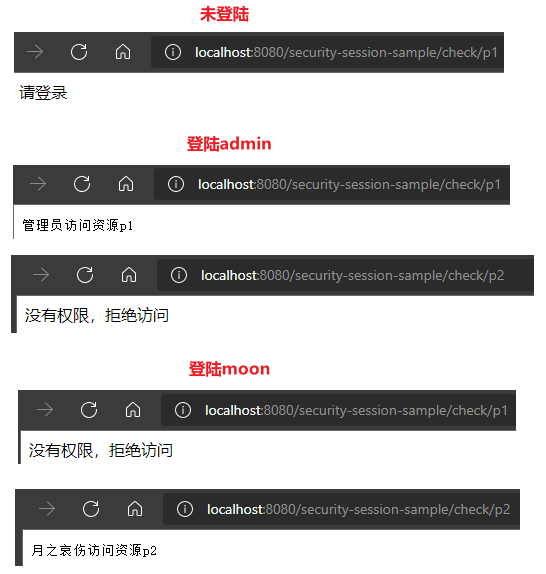

### 2.6. 小结

基于 Session 的认证方式是一种常见的认证方式，至今还有非常多的系统在使用。以上示例使用 Spring MVC 技术对它进行简单实现，通过此示例可能了解用户认证、授权以及会话的功能意义及实现套路。

而在正式生产项目中，往往会考虑使用第三方安全框架（如 spring security，shiro 等安全框架）来实现认证授权功能，因为使用这些成熟框架在一定程度提高生产力，提高软件标准化程度，另外往往这些框架的可扩展性考虑的非常全面。但是缺点也非常明显，这些通用化组件为了提高支持范围会增加很多可能不需要的功能，结构上也会比较抽象，如果不够了解它，一旦出现问题，将会很难定位。

## 3. 分布式系统认证方案

### 3.1. 分布式系统概述

随着软件环境和需求的变化 ，软件的架构由单体结构演变为分布式架构，具有分布式架构的系统叫分布式系统，分布式系统的运行通常依赖网络，它将单体结构的系统分为若干服务，服务之间通过网络交互来完成用户的业务处理，当前流行的微服务架构就是分布式系统架构，如下图：

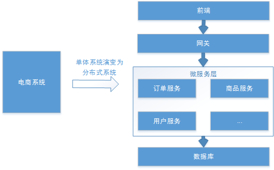

分布式系统具体如下基本特点：

1. 分布性：每个部分都可以独立部署，服务之间交互通过网络进行通信，比如：订单服务、商品服务。
2. 伸缩性：每个部分都可以集群方式部署，并可针对部分结点进行硬件及软件扩容，具有一定的伸缩能力。
3. 共享性：每个部分都可以作为共享资源对外提供服务，多个部分可能有操作共享资源的情况。
4. 开放性：每个部分根据需求都可以对外发布共享资源的访问接口，并可允许第三方系统访问。

### 3.2. 分布式认证需求

分布式系统的每个服务都会有认证、授权的需求，如果每个服务都实现一套认证授权逻辑会非常冗余，考虑分布式系统共享性的特点，需要由独立的认证服务处理系统认证授权的请求；考虑分布式系统开放性的特点，不仅对系统内部服务提供认证，对第三方系统也要提供认证。分布式认证的需求总结如下：

#### 3.2.1. 统一认证授权

提供独立的认证服务，统一处理认证授权。无论是不同类型的用户，还是不同种类的客户端(web 端，H5、APP)，均采用一致的认证、权限、会话机制，实现统一认证授权。

要实现统一则认证方式必须可扩展，支持各种认证需求，比如：用户名密码认证、短信验证码、二维码、人脸识别等认证方式，并可以非常灵活的切换。

#### 3.2.2. 应用接入认证

应提供扩展和开放能力，提供安全的系统对接机制，并可开放部分 API 给接入第三方使用，一方应用（内部 系统服务）和三方应用（第三方应用）均采用统一机制接入。

### 3.3. 分布式认证方案选型分析

#### 3.3.1. 基于 session 的认证方式

在分布式的环境下，基于 session 的认证会出现一个问题，每个应用服务都需要在 session 中存储用户身份信息，通过负载均衡将本地的请求分配到另一个应用服务需要将 session 信息带过去，否则会重新认证。

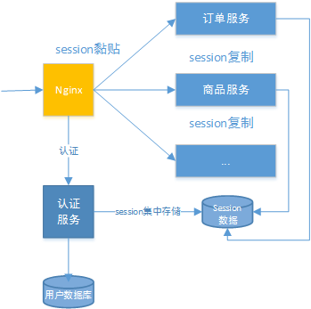

通常的做法有下面几种：

- **Session 复制**：多台应用服务器之间同步 session，使 session 保持一致，对外透明。
- **Session 黏贴**：当用户访问集群中某台服务器后，强制指定后续所有请求均落到此机器上。
- **Session 集中存储**：将 Session 存入分布式缓存中，所有服务器应用实例统一从分布式缓存中存取 Session。

总体来讲，基于 session 认证的认证方式，可以更好的在服务端对会话进行控制，且安全性较高。但是，session 机制方式基于 cookie，在复杂多样的移动客户端上不能有效的使用，并且无法跨域，另外随着系统的扩展需提高 session 的复制、黏贴及存储的容错性。

#### 3.3.2. 基于 token 的认证方式

优点：基于 token 的认证方式，服务端不用存储认证数据，易维护扩展性强，客户端可以把 token 存在任意地方，并且可以实现 web 和 app 统一认证机制。

缺点：token 由于自包含信息，因此一般数据量较大，而且每次请求都需要传递，因此比较占带宽。另外，token 的签名验签操作也会给 cpu 带来额外的处理负担。

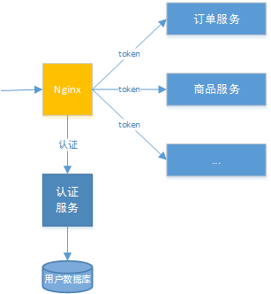

### 3.4. 分布式认证技术方案

根据认证方案选型的分析，决定采用基于 token 的认证方式，它的优点是：

1. 适合统一认证的机制，客户端、一方应用、三方应用都遵循一致的认证机制。
2. token 认证方式对第三方应用接入更适合，因为它更开放，可使用当前有流行的开放协议 Oauth2.0、JWT 等。
3. 一般情况服务端无需存储会话信息，减轻了服务端的压力。

#### 3.4.1. 分布式系统认证技术方案流程图

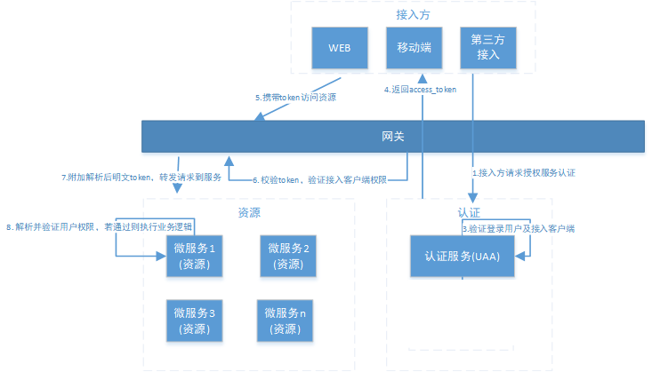

#### 3.4.2. 流程描述

1. 用户通过接入方（应用）登录，接入方采取 OAuth2.0 方式在统一认证服务(UAA)中认证。
2. 认证服务(UAA)调用验证该用户的身份是否合法，并获取用户权限信息。
3. 认证服务(UAA)获取接入方权限信息，并验证接入方是否合法。
4. 若登录用户以及接入方都合法，认证服务生成 jwt 令牌返回给接入方，其中 jwt 中包含了用户权限及接入方权限。
5. 后续，接入方携带 jwt 令牌对 AP I 网关内的微服务资源进行访问。
6. API 网关对令牌解析、并验证接入方的权限是否能够访问本次请求的微服务。
7. 如果接入方的权限没问题，API 网关将原请求 header 中附加解析后的明文 Token，并将请求转发至微服务。
8. 微服务收到请求，明文 token 中包含登录用户的身份和权限信息。因此后续微服务自己可以干两件事：
   1. 用户授权拦截（看当前用户是否有权访问该资源）
   2. 将用户信息存储进当前线程上下文（有利于后续业务逻辑随时获取当前用户信息）

#### 3.4.3. 方案涉及的相关组件

流程所涉及到 UAA 服务、API 网关这些组件职责如下：

- **统一认证服务(UAA)**

它承载了 OAuth2.0 接入方认证、登入用户的认证、授权以及生成令牌的职责，完成实际的用户认证、授权功能。

- **API 网关**

作为系统的唯一入口，API 网关为接入方提供定制的 API 集合，它可能还具有其它职责，如身份验证、监控、负载均衡、缓存等。API 网关方式的核心要点是，所有的接入方和消费端都通过统一的网关接入微服务，在网关层处理所有的非业务功能。

## 4. OAuth 2.0

### 4.1. 概述

OAuth（开放授权）是一个开放标准，允许用户授权第三方应用访问他们存储在另外的服务提供者上的信息，而不需要将用户名和密码提供给第三方应用或分享他们数据的所有内容。OAuth2.0 是 OAuth 协议的延续版本，但不向后兼容 OAuth 1.0 即完全废止了 OAuth1.0。很多大公司如 Google，Yahoo，Microsoft 等都提供了 OAUTH 认证服务，这些都足以说明 OAUTH 标准逐渐成为开放资源授权的标准。

Oauth 协议目前发展到 2.0 版本，1.0 版本过于复杂，2.0 版本已得到广泛应用。

> 参考资料：
>
> - OAuth 协议：https://tools.ietf.org/html/rfc6749
> - oAuth 百度百科：https://baike.baidu.com/item/oAuth/7153134?fr=aladdin

### 4.2. OAuth2.0 协议的认证流程示例

下面分析一个 Oauth2 认证的例子，通过例子去理解 OAuth2.0 协议的认证流程，本例子是某网站（_<u>下面简称 A 网站</u>_）使用微信认证登陆的过程，这个过程的简要描述如下：

用户借助微信认证登录 A 网站，用户就不用单独在 A 网站上注册用户，怎么样算认证成功吗？A 网站需要成功从微信获取用户的身份信息则认为用户认证成功，那如何从微信获取用户的身份信息？用户信息的拥有者是用户本人，微信需要经过用户的同意方可为 A 网站生成令牌，A 网站拿此令牌方可从微信获取用户的信息。

1. **客户端请求第三方授权**

用户进入 A 网站的登录页面，点击微信的图标以微信账号登录系统，用户是自己在微信里信息的资源拥有者。


点击“微信”出现一个二维码，此时用户扫描二维码，开始给 A 网站授权。


2. **资源拥有者同意给客户端授权**

资源拥有者扫描二维码表示资源拥有者同意给客户端授权，微信会对资源拥有者的身份进行验证，验证通过后，微信会询问用户是否给授权 A 网站访问自己的微信数据，用户点击“确认登录”表示同意授权，微信认证服务器会颁发一个授权码，并重定向到 A 网站

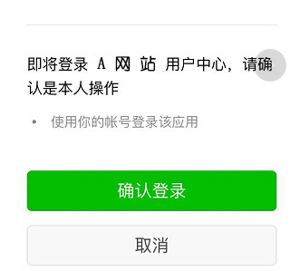

3. **客户端获取到授权码，请求认证服务器申请令牌**

此过程用户看不到，客户端应用程序请求认证服务器，请求携带授权码。

4. **认证服务器向客户端响应令牌**

微信认证服务器验证了客户端请求的授权码，如果合法则给客户端颁发令牌，令牌是客户端访问资源的通行证。此交互过程用户看不到，当客户端拿到令牌后，用户在 A 网站看到已经登录成功。

5. **客户端请求资源服务器的资源**

客户端携带令牌访问资源服务器的资源。A 网站携带令牌请求访问微信服务器获取用户的基本信息。

6. **资源服务器返回受保护资源**

资源服务器校验令牌的合法性，如果合法则向用户响应资源信息内容。

示例流程图如下：


### 4.3. OAuth2.0 认证流程中相关角色

> 引自 OAauth2.0 协议 rfc6749：https://tools.ietf.org/html/rfc6749


- **客户端**：即第三方应用，本身不存储资源，需要通过资源拥有者的授权去请求资源服务器的资源，比如：Android 客户端、Web 客户端（浏览器端）、微信客户端等。
- **资源拥有者**：通常为用户，也可以是应用程序，即该资源的拥有者。
- **授权服务器（也称认证服务器）**：用于服务提供商对资源拥有的身份进行认证、对访问资源进行授权，认证成功后会给客户端发放令牌（access_token），作为客户端访问资源服务器的凭据。本例为微信的认证服务器。
- **资源服务器**：存储资源的服务器，本例子为微信存储的用户信息。

服务提供商是不会允许随便一个客户端就接入到它的授权服务器。服务提供商会给准入的接入方一个身份，用于接入时的凭据：

- **client_id**：客户端标识
- **client_secret**：客户端秘钥

因此，授权服务器对两种 OAuth2.0 中的两个角色进行认证授权，分别是资源拥有者、客户端。

## 5. JWT 令牌

### 5.1. JWT 介绍

JSON Web Token（JWT）是一个开放的行业标准（RFC 7519），是目前最流行的跨域身份验证解决方案。它为了在网络应用环境间传递声明而制定的定义了一种简介的、自包含的协议格式，用于在通信双方传递 json 对象，传递的信息经过数字签名可以被验证和信任。JWT 可以使用 HMAC 算法或使用 RSA 的公钥/私钥对来签名，防止被篡改。

JWT 特别适用于分布式站点的单点登录（SSO）场景。JWT 的声明一般被用来在身份提供者和服务提供者间传递被认证的用户身份信息，以便于从资源服务器获取资源，也可被加密。

- 官网地址：https://jwt.io/
- JSON Web Token (JWT) 标准：https://tools.ietf.org/html/rfc7519

JWT 令牌的优点：

- jwt 基于 json，非常方便解析。
- 可以在令牌中自定义丰富的内容，易扩展。
- 通过非对称加密算法及数字签名技术，JWT 防止篡改，安全性高。
- 资源服务使用 JWT 可不依赖认证服务即可完成授权。

JWT 令牌的缺点：

- JWT 令牌较长，占存储空间比较大。

### 5.2. JWT 令牌数据结构

JWT 令牌其实是一个很长的字符串，由三部分组成，每部分的字符之间通过点"`.`"分隔符分为三个子串，各字串之间没有换行符。每一个子串表示了一个功能块，总共有三个部分：**JWT 头(header)**、**有效载荷(payload)**、**签名(signature)**，比如：`xxxxx.yyyyy.zzzzz`

#### 5.2.1. Header

头部是一个描述 JWT 元数据的 JSON 对象，包括令牌的类型（即 JWT）及使用的哈希算法（如 HMAC、SHA256 或 RSA）。Header 部分的内容如下：

```json
{
  "alg": "HS256",
  "typ": "JWT"
}
```

- `alg`：表示签名使用的算法，默认为 HMAC SHA256（写为 HS256）
- `typ`：表示令牌的类型，JWT 令牌统一写为 JWT

将上边的内容使用 Base64Url 编码，得到一个字符串就是 JWT 令牌的第一部分。

#### 5.2.2. Payload

第二部分是有效负载，内容也是一个 json 对象，是 JWT 的主体内容部分，它是存放需要传递的数据。它可以存放 jwt 提供的现成字段，有效载荷部分规定有如下七个默认字段供选择：

- iss：签发者
- exp：到期时间戳
- sub：主题
- aud：用户
- nbf：在此之前不可用
- iat：发布时间
- jti：JWT ID 用于标识该 JWT

除以上默认字段外，还可以自定义私有字段。

```json
{
  "sub": "1234567890",
  "name": "456",
  "admin": true
}
```

最后将第二部分负载使用 Base64Url 编码，得到一个字符串就是 JWT 令牌的第二部分。

> 注：此部分不建议存放敏感信息，因为此部分可以解码还原原始内容。

#### 5.2.3. Signature

第三部分是签名，实际上是一个加密的过程，是对上面两部分数据通过指定的算法生成哈希，以确保 JWT 数据不会被篡改。

这个部分使用 base64url 将前两部分进行编码，编码后使用点（`.`）连接组成字符串，还需要指定一个密码（secret），该密码仅仅保存在服务器中，并且不能向用户公开。然后使用 JWT 头（header）中指定的签名算法（默认情况下为 HMAC SHA256）进行签名，根据以下公式生成签名哈希：

```java
HMACSHA256(base64UrlEncode(header) + "." + base64UrlEncode(payload), secret)
```

参数说明：

- `base64UrlEncode(header)`：JWT 令牌的第一部分
- `base64UrlEncode(payload)`：JWT 令牌的第二部分
- `secret`：签名所使用的密钥

在计算出签名哈希后，JWT 头，有效载荷和签名哈希的三个部分组合成一个字符串，每个部分用"`.`"分隔，就构成整个 JWT 对象。

### 5.3. JWT 签名算法

JWT 签名算法中，一般有两个选择：HS256 和 RS256。

- HS256（带有 SHA-256 的 HMAC）是一种对称加密算法，双方之间仅共享一个密钥。由于使用相同的密钥生成签名和验证签名，因此必须注意确保密钥不被泄密。
- RS256（采用 SHA-256 的 RSA 签名）是一种非对称加密算法，它使用公共/私钥对：JWT 的提供方采用私钥生成签名，JWT 的使用方获取公钥以验证签名。

### 5.4. jjwt 介绍

jjwt 是一个提供 JWT 创建和验证的 Java 库。永远免费和开源(Apache License，版本 2.0)，JJWT 很容易使用和理解。jjwt 的 maven 坐标如下：

```xml
<!-- https://mvnrepository.com/artifact/io.jsonwebtoken/jjwt -->
<dependency>
    <groupId>io.jsonwebtoken</groupId>
    <artifactId>jjwt</artifactId>
    <version>0.9.1</version>
</dependency>
```

> 示例项目代码：pinda-authority-project\pinda-authority\pd-examples\jwt-demo\

# 权限校验框架资料

## 1. 学习笔记

- [Spring Security 学习笔记](/后端框架/Authorization-Certification/Spring-Security)
- [Spring Security OAuth 学习笔记](/后端框架/Authorization-Certification/Spring-Security-OAuth)
- [Spring Cloud Security 学习笔记](/分布式架构&微服务架构/SpringCloud/Spring-Cloud-Security)

## 2. 示例源码仓库

- [认证授权框架示例项目](https://github.com/MooNkirA/authorization-certification-note)
