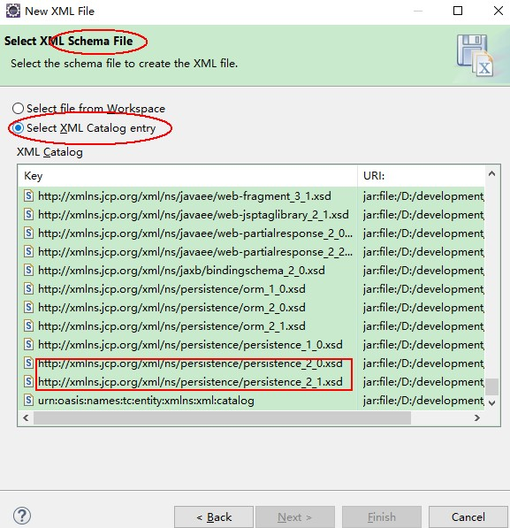

## 1. JPA 概述

JPA（Java Persistence API）：Java 持久化 API。是一套 Sun Java 官方制定的 ORM 标准。Hibernate 对 JPA 标准有两套支持：

- **兼容性的支持**：操作的接口是 Hibernate 原来框架的，只有<font color=red>映射注解</font>使用 JPA 标准接口提供。
- **完全性的支持**：<font color=red>操作的接口和映射的注解全部使用 JPA 的标准</font>。

## 2. Hibernate JPA 兼容性的支持（了解）

操作的接口是 Hibernate 框架提供的，只有映射注解使用 JPA 标准接口提供。操作步骤如下：

1. 其他操作的类不变，删除映射文件。修改实体类加上映射的注解（与完全性支持一样）。
2. 修改配置文件的加载为实体类。

```xml
<!-- 加载映射文件(必须) -->
<mapping class="com.moon.entity.Customer"/>
```

## 3. Hibernate JPA 完全性的支持

完全性的支持是指，操作的 API 和映射的注解全部使用 JPA 的标准。

### 3.1. 配置流程说明


1. 需要一个总配置文件存储框架需要的信息。<font color=red>**注意：配置文件必须要放在 `classpath:/META-INF/persistence.xml`**</font>。
2. 需要通过 `Persistence` 类来获得配置文件的信息，构造 `EntityManagerFactory`（实体管理工厂）。
3. 通过实体管理工厂的对象获得操作类对象，实体管理类对象。
4. 操作类操作数据库表之前，必须要配置一个和数据表关联的实体类（有关联注解的），<font color=red>**不要忘了在总配置文件加载**</font>。

### 3.2. 配置步骤示例（待补充测试用例）

- **导入包**。除了 hibernate 核心包和 mysql 驱动包外，还需要导入 JPA 标准规则包。传统应用程序导入 hibernate-release-5.0.12.Final\lib\jpa；Maven 方式引入以下依赖：

```xml
<!-- https://mvnrepository.com/artifact/jakarta.persistence/jakarta.persistence-api -->
<dependency>
    <groupId>jakarta.persistence</groupId>
    <artifactId>jakarta.persistence-api</artifactId>
    <version>3.x.x</version>
</dependency>
```

- **创建一个总配置文件（persistence.xml）**。<font color=red>**注意此文件必须放在 classpath:/META-INF/persistence.xml**</font>，Eclipse 已经支持了 JPA 框架，所有不需要配置 xsd 文件，直接使用。

 

persistence.xml 配置示例：

```xml
<?xml version="1.0" encoding="UTF-8"?>
<persistence version="2.1"
	xmlns="http://xmlns.jcp.org/xml/ns/persistence" xmlns:xsi="http://www.w3.org/2001/XMLSchema-instance"
	xsi:schemaLocation="http://xmlns.jcp.org/xml/ns/persistence http://xmlns.jcp.org/xml/ns/persistence/persistence_2_1.xsd ">
	<!-- 持久单元，作用：配置一个数据库的连接 name:就是持久单元名，是一个标识符 -->
	<persistence-unit name="crm">
	<!-- 加载映射实体类,不写也是默认加载，但建议写 -->
	<class>com.moon.entity.Customer</class>
		<!-- 四要素 -->
		<properties>
			<!-- 如果使用Hibernate实现的JPA，使用的就是原来Hibernate的环境参数  -->
			<property name="hibernate.connection.driver_class" value="com.mysql.cj.jdbc.Driver"/>
			<property name="hibernate.connection.url" value="jdbc:mysql://localhost:3306/hibernate_db?allowPublicKeyRetrieval=true&amp;useSSL=false&amp;useUnicode=true&amp;characterEncoding=UTF-8"/>
			<property name="hibernate.connection.username" value="root"/>
			<property name="hibernate.connection.password" value="123456"/>
			<!-- 配置hibernate可选常用属性 -->
			<property name="hibernate.show_sql" value="true"/>
			<property name="hibernate.format_sql" value="true"/>
			<property name="hibernate.hbm2ddl.auto" value="update"/>
			<property name="hibernate.dialect" value="org.hibernate.dialect.MySQL5InnoDBDialect"/>
		</properties>
	</persistence-unit>
</persistence>
```

- 创建一个工具类 `JPAUtils`，获得操作对象 `EntityManager`。

```java
import javax.persistence.EntityManager;
import javax.persistence.EntityManagerFactory;
import javax.persistence.Persistence;

/**
 * 获取JPA操作对象工具类
 */
public class JPAUtil {
	// 获取唯一的实体管理工厂
	public static EntityManagerFactory emf;

	// 创建静态代码块，类加载时创建实体管理工厂
	static {
		// 读取配置文件,参数persistenceUnitName是配置文件中persistence-unit的name
		emf = Persistence.createEntityManagerFactory("crm");
	}

	// 获取操作对象的静态方法
	public static EntityManager getEntityManager() {
		return emf.createEntityManager();
	}
}
```

- 创建一个实体类，并且配置映射的注解。

```java
// 配置类与表的关系
@Entity
@Table(name = "cst_customer")
public class Customer implements Serializable {
	private static final long serialVersionUID = 1L;
	// 配置属性与字段的关系
	// 配置ID与主键的生成策略
	@Id
	@GeneratedValue(strategy = GenerationType.IDENTITY)
	@Column(name = "cust_id")
	private Long custId;
	// 注意，如果属性名和字段同名，可以不配置@Column
	@Column(name = "cust_name")
	private String custName; 
	@Column(name = "cust_source")
	private String custSource; 
	@Column(name = "cust_industry")
	private String custIndustry;
	@Column(name = "cust_level")
	private String custLevel; 

	// 配置在属性上面的注解可以配置 get方法的上面（建议放在属性上面）
	public Set<Linkman> getLinkmans() {
		return linkmans;
	}
	// ...省略 getter/setter
}
```

- 操作测试（待补充）

### 3.3. 使用 JPA 注解来替代配置文件

<font color=red>JPA 注解的作用其实就是代替 XML 配置文件</font>，将程序的元数据写在代码上。而<font color=red>元数据就是，启动程序必须依赖的数据</font>。

配置文件不是编程语言的语法，所以是无法断点调试的。而注解是 Java 语法，报错的时候，可以快速的定位问题。

**使用 JPA 注解的注意事项**：

- 如果属性名和数据库表的字段名相同，可以不配置 `@Column`。
- 配置在属性上面的注解也可以配置 get 方法的上面（**建议放在属性上面**），并且要统一配置在属性或 get 方法。

### 3.4. 将 Hibernate 配置的纯 JPA 的代码移植到 OpenJPA（了解）

如果代码使用纯 JPA 标准编写，不修改代码只修改一下配置文件，即可将 Hibernate 的代码移植到其他 OpenJPA 和 EclipseTOP 等 JPA 框架。

注意：<font color=red>OpenJPA 使用是 JPA2.0 规则</font>，而 Hibernate 使用的 JPA2.1 规范。所以将 Hibernate 编写的 JPA 代码切换 OpenJPA 的代码，需要修改配置文件版本。<font color=red>**配置文件中的属性名必须大写开头**</font>。

示例：修改配置文件，openJPA 可以直接使用。

```xml
<?xml version="1.0" encoding="UTF-8"?>
<persistence version="2.0" xmlns="http://java.sun.com/xml/ns/persistence"
	xmlns:xsi="http://www.w3.org/2001/XMLSchema-instance"
	xsi:schemaLocation="http://java.sun.com/xml/ns/persistence http://xmlns.jcp.org/xml/ns/persistence/persistence_2_0.xsd ">
	<!-- 
		更改成openJPA即可,注意OpenJPA使用是JPA2.0规则
	 -->
	<!-- 持久单元，作用：配置一个数据库的连接 -->
	<persistence-unit name="crm">
	<!-- 加载映射实体类,不写也是默认加载，但建议写 -->
	<class>day61.entity.Customer</class>
		<!-- 四要素 -->
		<properties>
			<!-- org.apache.openjpa.conf.OpenJPAConfigurationImpl -->
			<!-- 使用openjpa实现的JPA  -->
			<!-- 属性必须大写开头 -->
			<property name="openjpa.ConnectionDriverName" value="com.mysql.jdbc.Driver"/>
			<property name="openjpa.ConnectionURL" value="jdbc:mysql://localhost:3306/day58_hibernate"/>
			<property name="openjpa.ConnectionUserName" value="root"/>
			<property name="openjpa.ConnectionPassword" value="123456"/>
		</properties>
	</persistence-unit>
</persistence>
```

## 4. JPA 映射注解汇总

- `@Entity`：声明该类是一个 JPA 标准的实体类。标识此注解会在创建 SessionFactory 时，加载映射配置。
- `@Table`：指定实体类关联的表。
    - `name`：指定数据库表的名称。<font color=red>**注意如果不指定表名，默认使用类名对应表名。不区别大小写**</font>。
- `@Column`：指定实体类属性和数据库表字段之间的对应关系。可选属性如下：
    - `name`：指定数据库表的列名称。<font color=red>**如果属性和字段一致，可以省略不写**</font>
    - `unique`：是否唯一
    - `nullable`：是否可以为空
    - `inserttable`：是否可以插入
    - `updateable`：是否可以更新
- `@Id`：声明属性是一个 OID，对应的一定是数据库的主键字段。
- `@GenerateValue`：声明 OID 的主键策略。可选属性如下：
    - `strategy`：主键生成策略。可选值如下：
        - `IDENTITY`：主键由数据库自动生成（主要是支持自动增长的数据库，如 mysql）
        - `TABLE`：使用一个特定的数据库表格来保存主键。
        - `SEQUENCE`：根据底层数据库的序列来生成主键，条件是数据库支持序列。这个值要与 generator 一起使用，generator 指定生成主键使用的生成器（可能是 orcale 中自己编写的序列）。
        - `AUTO`：主键由程序控制，也是 `GenerationType` 的默认值。
    - `generator`：引用自定义生成策略，值与 `@GenericGenerator` 的 `name` 属性一致。
- `@GenericGenerator`：自定义主键生成策略。可选属性如下：
    - `name`：指定自定义的主键生成策略的名字
    - `strategy`：自定义主键生成策略
- `@SequenceGenerate`：使用 SEQUENCE 策略时，用于设置策略的参数。
- `@TableGenerate`：使用 TABLE 主键策略时，用于设置策略的参数。
- `@JoinTable`：关联查询时，表与表是<font color=red>多对多</font>的关系时，指定多对多关联表<font color=red>中间表的参数</font>。针对中间表的配置。
    - `name`：配置中间表的名称
    - `joinColumns`：中间表的外键字段关联当前实体类所对应表的主键字段
    - `inverseJoinColumn`：中间表的外键字段关联对方表的主键字段
- `@JoinColumn`：关联查询时，表与表是一对多或者多对一的关系时，声明表关联的<font color=red>外键字段</font>作为连接表的条件。必须配合关联表的注解一起使用。
    - `name`：指定外键字段的名称
    - `referencedColumnName`：指定引用主表的主键字段名称
    - `unique`：是否唯一。默认值不唯一
    - `nullable`：是否允许为空。默认值允许。
    - `insertable`：是否允许插入。默认值允许。
    - `updatable`：是否允许更新。默认值允许。
    - `columnDefinition`：列的定义信息。
- `@OneToMany`：关联表注解，表示对应的实体和本类是一对多的关系。
    - `targetEntityClass`：指定多的多方的类的字节码
    - `mappedBy`：指定从表实体类中引用主表对象的名称。
    - `cascade`：指定要使用的级联操作
    - `fetch`：指定是否采用延迟加载
    - `orphanRemoval`：是否使用孤儿删除
- `@ManyToOne`：关联表注解，表示对应的实体和本类是多对一的关系。
    - `targetEntityClass`：指定一的一方实体类字节码
    - `cascade`：指定要使用的级联操作
    - `fetch`：指定是否采用延迟加载
    - `optional`：关联是否可选。如果设置为false，则必须始终存在非空关系。
- `@ManyToMany`：关联表注解，表示对应的实体和本类是多对多的关系。
    - `cascade`：配置级联操作。
    - `fetch`：配置是否采用延迟加载。
    - `targetEntity`：配置目标的实体类。映射多对多的时候不用写。
- `@Transient`：使用该注解标识的字段，不与数据库表字段进行映射。注，就算属性标识 `@Column` 的注解，也不会与数据库相应名字的字段进行映射。

### 4.1. 主键生成策略

所谓的主键生成策略即使，自动生成 ID 列值的策略。JPA 提供了四种主键生成策略：

1. `IDENTITY`：ID 自增长策略。<font color=red>**只能用于支持 ID 自增长的数据库**</font>，并且只能用于数字类型。

```java
@Id
@GeneratedValue(strategy = GenerationType.IDENTITY)
private BigInteger id;
```

2. `SEQUENCE`：序列生成策略，<font color=red>**用于有序列的数据库，如 Oracle**</font>，并且只能用于数字类型。指定使用 SEQUENCE 策略时和 Hibernate 的 xml 一样用法。如果在 MySQL 里面使用一个表模拟序列；如果使用在 Oracle 里面直接使用序列。

```java
@Id
@GeneratedValue(strategy = GenerationType.SEQUENCE)
private BigInteger id;
```

3. `TABLE`（不常用），不管什么数据库，都是使用一个表来模拟序列。

```java
@Id
@GeneratedValue(strategy = GenerationType.TABLE)
private BigInteger id;
```

4. `AUTO`（了解）：由框架决定<font color=red>根据不同的数据库指定一个策略</font>。由于结果的不固定性。基本上没有人使用。

```java
@Id
@GeneratedValue(strategy = GenerationType.AUTO)
private BigInteger id;
```

### 4.2. 自定义主键生成策略（待补充）

> TODO: 参考项目一持久化类

## 5. JPA 的增删改查（待完善）

### 5.1. 基础增删改查

```java
// 获取JPA实体管理类对象
EntityManager em = JPAUtil.getEntityManager();
// 创建对象
Customer c = new Customer();
c.setCustName("撼地神牛");
em.persist(c);
// 注意：使用JPA删除数据也必须使用持久化对象
// Customer c = new Customer();
// c.setCustId(24L);;
// 删除对象,获取持久态对象
Customer c = em.find(Customer.class, 24L);
em.remove(c);
// 更新数据
Customer c = new Customer();
c.setCustId(25L);
c.setCustName("是不是更新的？");
c.setCustIndustry("xx");
em.merge(c);
// 无延迟查找数据
Customer c = em.find(Customer.class, 22L);
// 有延迟查找数据
Customer c = em.getReference(Customer.class, 22L);
```

<font color=red>**注意：使用 JPA 删除数据也必须使用持久化对象，否则报错**</font> `java.lang.IllegalArgumentException: Removing a detached instance day61.entity.Customer#24`

### 5.2. JPQL 操作（删除，修改）

JPQL（Java Persistence Query Language）：Java 持久化查询语言。几乎等同 HQL，一样直接操作的是对象，不是表。

注意：与 HQL 有所区别，<font color=red>**在 JPQL 中，如果使用 `?` 设置参数，必须要在 `?` 后面指定下标，并且下标必须不能是负数**</font>

```java
/**
 * JPQL操作Query（删除，修改）
 */
public class JPA_JPQLTest {
	// 1.需求：通过客户名删除客户记录
	public void remove() {
		// 获取JPA实体管理类对象
		EntityManager em = JPAUtil.getEntityManager();
		// 获取事务对象
		EntityTransaction transaction = em.getTransaction();
		// 开启事务
		transaction.begin();
		// 获取JPQL操作对象
		// JPQL，如果使用?设置参数，必须要在?后面指定下标。下标必须不能是负数
		Query query = em.createQuery("delete from Customer c where c.custName like ?0");
		// 设置?参数值
		query.setParameter(0, "%是%");
		// 执行操作
		int row = query.executeUpdate();
		System.out.println("成功执行的行数是：" + row);
		// 提交事务
		transaction.commit();
		// 关闭资源
		em.close();
	}

	// 需求：将名字为"敌法师"的客户修改来源为，DOTA2
	public void marge() {
		// 获取JPA实体管理类对象
		EntityManager em = JPAUtil.getEntityManager();
		// 获取事务对象
		EntityTransaction transaction = em.getTransaction();
		// 开启事务
		transaction.begin();
		// 获取JPQL操作对象,使用命名参数
		Query query = em.createQuery("update Customer c set c.custSource=:source where c.custName=:name");
		// 设置命名参数值
		query.setParameter("source", "DOTA2");
		query.setParameter("name", "敌法师");
		// 执行操作
		int row = query.executeUpdate();
		System.out.println("成功执行的行数是：" + row);
		// 提交事务
		transaction.commit();
		// 关闭资源
		em.close();
	}
}
```

### 5.3. JPQL 查询

```java
/**
 * JPQL操作TypedQuery（查询）
 */
public class JPA_JPQLTest2 {
	// 1.通过JPQL查询所有客户的数据
	@Test
	public void findAll() {
		// 获取JPA实体管理类对象
		EntityManager em = JPAUtil.getEntityManager();
		// 获取JPQL操作对象,标准JPQL建议加上select
		TypedQuery<Customer> query = em.createQuery("select c from Customer c", Customer.class);
		// 查询结果集合
		List<Customer> resultList = query.getResultList();
		// 输出结果
		for (Customer customer : resultList) {
			System.out.println("客户名称：" + customer.getCustName());
		}
		// 关闭资源
		em.close();
	}

	// 2.条件查询。查询有“剑”的客户
	@Test
	public void findByCustName() {
		// 获取JPA实体管理类对象
		EntityManager em = JPAUtil.getEntityManager();
		// 获取JPQL操作对象,标准JPQL建议加上select
		TypedQuery<Customer> query = em.createQuery("select c from Customer c where c.custName like ?0", Customer.class);
		// 设置参数值
		query.setParameter(0, "%剑%");
		// 查询结果集合
		List<Customer> resultList = query.getResultList();
		// 输出结果
		for (Customer customer : resultList) {
			System.out.println("客户名称：" + customer.getCustName());
		}
		// 关闭资源
		em.close();
	}

	// 3.分页，需求，从第三条取，取四条数据
	@Test
	public void findByPage() {
		// 获取JPA实体管理类对象
		EntityManager em = JPAUtil.getEntityManager();
		// 获取JPQL操作对象,标准JPQL建议加上select
		TypedQuery<Customer> query = em.createQuery("select c from Customer c", Customer.class);
		// 设置分页参数,索引从0开始
		query.setFirstResult(2);
		query.setMaxResults(4);
		// 查询结果集合
		List<Customer> resultList = query.getResultList();
		// 输出结果
		for (Customer customer : resultList) {
			System.out.println("客户名称：" + customer.getCustName());
		}
		// 关闭资源
		em.close();
	}

	// 返回，客户表的记录数
	@Test
	public void count() {
		// 获取JPA实体管理类对象
		EntityManager em = JPAUtil.getEntityManager();
		// 获取JPQL操作对象,标准JPQL建议加上select
		TypedQuery<Long> query = em.createQuery("select count(*) from Customer", Long.class);
		// 查询结果集合
		Long count = query.getSingleResult();
		// 输出结果
		System.out.println(count);
		// 关闭资源
		em.close();
	}

	// 投影查询，就是使构造方法设置指定的属性值。
	@Test
	public void findAll2() {
		// 获取JPA实体管理类对象
		EntityManager em = JPAUtil.getEntityManager();
		// 获取JPQL操作对象,标准JPQL建议加上select
		TypedQuery<Customer> query = em.createQuery("select new Customer(c.custName,c.custSource) from Customer c", Customer.class);
		// 查询结果集合
		List<Customer> resultList = query.getResultList();
		// 输出结果
		for (Customer c : resultList) {
			System.out.println("客户名称：" + c.getCustName() + " 来源：" + c.getCustSource());
		}
		// 关闭资源
		em.close();
	}
}
```

### 5.4. Criteria 查询（了解）

```java
// 1.通过Criteria查询所有客户的数据
public void findAll() {
	// 1.获得操作对象，entitymanager
	EntityManager manager = JPAUtil.getEntityManager();
	// 2.获得Criteria操作对象
	CriteriaBuilder builder = manager.getCriteriaBuilder();
	// 3. 指定操作的实体类,获得操作对象
	CriteriaQuery<Customer> criteriaQuery = builder.createQuery(Customer.class);
	// 4.获得设置查询的条件的对象
	criteriaQuery.from(Customer.class);
	// 5.将Criteria查询对象交个通用的查询对象
	TypedQuery<Customer> query = manager.createQuery(criteriaQuery);
	// 6.通过通用的查询对象查询数据
	List<Customer> customers = query.getResultList();
	// 7.输出
	for (Customer c : customers) {
		System.out.println(c.getCustName());
	}
	manager.close();
}
```

## 6. JPA 多表关联查询（待整理）

多表关联查询的作用就是，实现使用一个实体类操作或者查询多个表的数据。

回顾：配置多表联系查询必须有两个步骤：

1. 在实体类里面建立表与表之间的关系。
2. 配置关联关系，JPA 使用注解配置。

- `@JoinColumn`：配置外键。
    - `name`：外键的字段名。
    - `referencedColumnName`：外键的值来源于主表的主键，配置的是主表的主键。
