## 1. Hibernate 概述

Hibernate 是应用在 javaee 三层结构中 dao 层，开源的轻量级持久层框架。Hibernate 是一个不用写 SQL，直接使用对象实现对数据库 CRUD 操作的框架！！！！

Hibernate 底层是对 JDBC 进行封装，使用 Hibernate 的好处是，不需要写复杂 JDBC 代码，也不需要写 sql 语句就可以实现一部分功能。

每种数据库的 SQL 语句是有差异的。如果 SQL 语句由 Hibernate 框架生成，那么就屏蔽了不同数据库 SQL 语法的差异。这样，使用 Hibernate 开发出来的代码，一套代码可以兼容多个数据库。除了主要的屏蔽 SQL 差异的功能，还支持大量功能组件。

1. 支持快照
2. 支持缓存
3. 支持第三方的连接池
4. 支持线程绑定

回顾 JavaEE 三层结构

- web 层：struts2 框架
- service 层：spring 框架
- dao 层：hibernate 框架。对数据库进行 CRUD 操作

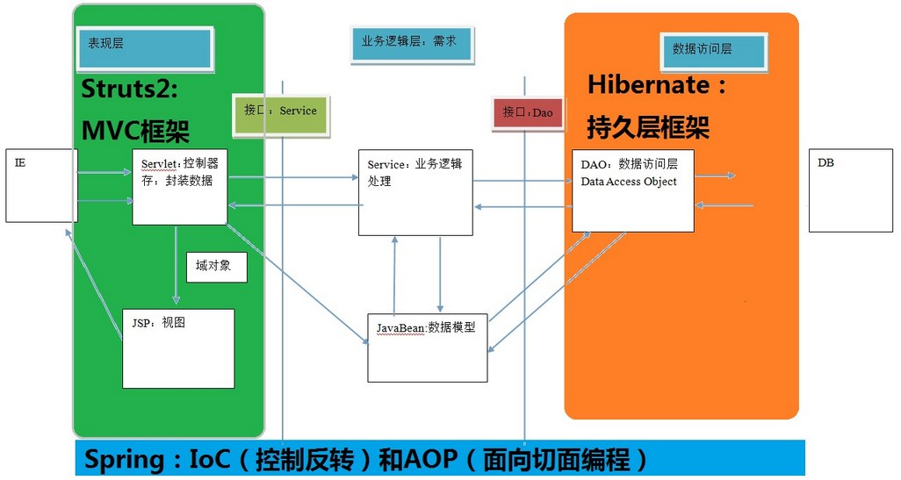

### 1.1. Hibernate 版本

- Hibernate 3.x
- Hibernate 4.x：过渡版本，比较少用
- Hibernate 5.x：目前使用，要求JDK 6+

### 1.2. Hibernate 文件结构

- documentation：hibernate 相关文档
- lib：hibernate 相关 jar 包
- project：hibernate 相关开源代码

### 1.3. ORM 思想

ORM：（Object Relational Mapping）对象关系映射。在访问数据库前，<font color=red>**将实体类的类名和数据库表的表名关联起来**</font>。通过**操作实体类的对象**，直接由框架生成操作数据库的 SQL 操作数据库表。

ORM 是一种实现使用实体类对象操作数据库表的设计思想。

1. 让实体类和数据库表进行一一对应关系。
    - 让实体类首先和数据库表对应。
    - 让实体类属性和表里面字段对应。
2. 不需要直接操作数据库表，而操作表对应的实体类对象。
    - 通过使用配置文件方式实现，不需要操作表，而直接使用 hibernate 封装的对象 Session 直接操作实体类对象。

**应用场景**：

开发产品型项目（兼容多种数据库的项目）：使用 Hibernate 写一套代码就可以实现多种数据库的操作。

**ORM 的操作流程**：

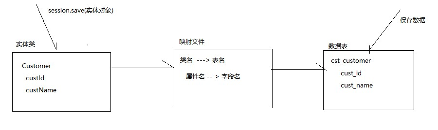

## 2. Hibernate 基础使用

### 2.1. 配置流程

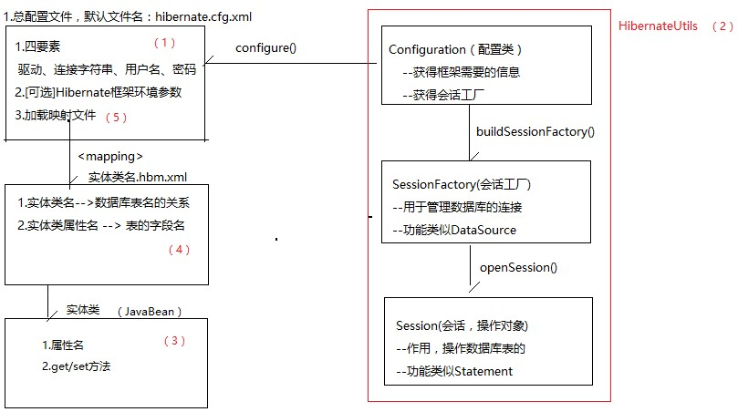

1. Hibernate 需要一个总配置文件（hibernate.cfg.xml）用于存储连接数据库的信息。
2. 总配置文件的信息需要一个读取它类，Configuration。
3. 配置类可以通过 `buildSessionFactory()` 方法获得会话工厂。通过会话工厂管理数据库的连接。
4. 通过会话工厂可以获得操作对象会话（Session），Session 可以操作数据库（增删改查）。
5. 会话的增删改查必须要依赖映射文件，操作前必须配置一个实体类，然后配置实体类对应的映射文件。

### 2.2. 搭建 Hibernate 环境（传统方式）

#### 2.2.1. Step 1：导入 hibernate 相关 jar 包

1. 引入 hibernate 核心的 jar 包。
    - 必须的支撑包：hibernate-release-5.0.12.Final\lib\required
    - JPA 实现包：hibernate-release-5.0.12.Final\lib\jpa
    - 可选的组件（如：第三方缓存，连接池）：hibernate-release-5.0.12.Final\lib\optional
2. 使用 hibernate 时，有日志信息输出，hibernate 本身没有日志输出的 jar 包，所以需要导入其他日志的 jar 包。如：log4j-1.2.16.jar、slf4j-api-1.6.1.jar 等
3. 数据库 MySQL 驱动的 jar 包，如：mysql-connector-java-5.1.44-bin.jar。

#### 2.2.2. Step 2：创建实体类

<font color=red>**hibernate 要求实体类有一个属性是唯一的，一般都是用作 id（对应数据表的主键）**</font>。注：使用 hibernate 时，不需要手动创建表，hibernate 会自动创建表格。

#### 2.2.3. Step 3：配置实体类和数据库表 - 对应关系(映射关系)

1. 创建 xml 格式配置文件实现映射关系，这个映射配置文件名称和位置没有固定要求。<font color=red>*建议：在实体类所在包里面创建。命名：`实体类名称.hbm.xml`*</font>
2. 配置文件是 xml 格式，在配置文件中首先引入 xml 约束。
    - 在 hibernate 里面引入的约束目前都是 dtd 约束
    - 使用网络约束：从【`http://www.hibernate.org/dtd/hibernate-mapping-3.0.dtd`】可下载 dtd 约束文件 `hibernate-mapping-3.0.dtd`。或者使用本址约束：解压 hibernate-core-5.0.12.Final.jar 再搜索 `*.dtd`

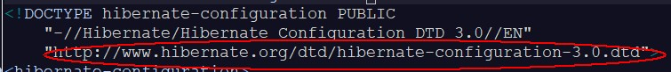

3. 配置映射关系。`<hibernate-mapping></hibernate-mapping>` -- 根标签

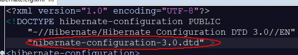

Code Dome: User.hbm.xml

```xml
<?xml version="1.0" encoding="UTF-8"?>
<!-- Hibernate配置文件引入xml约束 -->
<!DOCTYPE hibernate-mapping PUBLIC 
    "-//Hibernate/Hibernate Mapping DTD 3.0//EN"
    "http://www.hibernate.org/dtd/hibernate-mapping-3.0.dtd">
<!-- 配置hibernate映射关系 -->
<hibernate-mapping>
	<!-- 1.配置类和表对应
		class标签
		name属性：实体类全路径
		table属性：数据库表名称
	 -->
	<class name="com.moonzero.entity.User" table="t_user">
		<!-- 2.配置实体类id和表id对应
			hibernate要求实体类有一个属性唯一值
			hibernate要求表有字段作为唯一值
			id标签
			name属性：实体类里面id属性名称
			column属性：生成的表字段名称
		 -->
		 <id name="uid" column="uid">
		 	<!-- generator设置数据库表id生成策略 
		 		native:生成表id值就是主键并自动增长
		 	-->
		 	<generator class="native"></generator>
		 </id>
		 <!-- 配置其他属性和表字段对应
		 	name属性：实体类属性名称
		 	column属性：生成表字段名称
		  -->
		 <property name="username" column="username"></property>
		 <property name="password" column="password"></property>
		 <property name="address" column="address"></property>
	</class>
</hibernate-mapping>
```

#### 2.2.4. Step 4：创建 hibernate 的核心配置文件

1. 配置文件，默认是放在 classpath 根目录下（即 src 目录下），文件名默认必须为 `hibernate.cfg.xml`
2. 引人 dtd 约束。查询文件：hibernate-configuration-3.0.dtd
3. hibernate 操作过程中，只会加载核心配置文件，其他配置文件不会加载。
    - 第一部分：配置数据库信息（必须的）
    - 第二部分：配置hibernate信息（可选的）
    - 第三部分：把映射文件放到核心配置文件中（必须的）。注：是文件路径，配置后按 `ctrl+左键` 点击可以链接到文件即可

Code Dome: hibernate.cfg.xml

```xml
<?xml version="1.0" encoding="UTF-8"?>
<!DOCTYPE hibernate-configuration PUBLIC
	"-//Hibernate/Hibernate Configuration DTD 3.0//EN"
	"http://www.hibernate.org/dtd/hibernate-configuration-3.0.dtd">
<hibernate-configuration>
	<session-factory>
		<!-- 第一部分：配置数据库信息（必须的） -->
		<property name="hibernate.connection.driver_class">com.mysql.jdbc.Driver</property>
		<property name="hibernate.connection.url">jdbc:mysql://localhost:3306/hibernateTest</property>
		<property name="hibernate.connection.username">root</property>
		<property name="hibernate.connection.password">123456</property>
		
		<!-- 第二部分：配置hibernate信息（可选的） -->
		<!-- 输出底层sql语句 -->
		<property name="hibernate.show_sql">true</property>
		<!-- 输出底层sql语句格式 -->
		<property name="hibernate.format_sql">true</property>
		<!-- 需要配置此属性后，hibernate才会自动创建表
			update：如果已经有表，则更新；如果没有表，则创建表
		 -->
		<property name="hibernate.hbm2ddl.auto">update</property>
		<!-- 配置数据库方言
			让hibernate框架识别不同数据库自己特有的语句（关键字）
		 -->
		<property name="hibernate.dialect">org.hibernate.dialect.MySQL5InnoDBDialect</property>
		
		<!-- 第三部分：把映射文件放到核心配置文件中（必须的） -->
		<mapping resource="com/moonzero/entity/User.hbm.xml"/>
	</session-factory>
</hibernate-configuration>
```

### 2.3. Hibernate 使用步骤

<font color=red>**前 4 步和后 2 步都是固定，第 5 步是根据实际情况而变化。**</font>

> Notes: 这里的 Session 与 Javaweb 中的 Session 是两个不同的东西。

#### 2.3.1. Step 1：加载 hibernate 核心配置文件

```java
Configuration cfg = new Configuration();
cfg.configure();
```

执行的过程：先到 src 下面找到名称是 hibernate.cfg.xml，把该文件放入这个对象中，然后调用方法执行加载配置文件。也可以指定配置文件名字 `cfg.configure(config.xml);`，但不推荐。

#### 2.3.2. Step 2：创建 SessionFactory 对象

```java
SessionFactory sessionFactory = cfg.buildSessionFactory();
```

读取 hibernate 核心配置文件内容，创建 `sessionFactory`。在这过程中，根据映射关系，在配置的数据库里面把表创建。

#### 2.3.3. Step 3：使用 SessionFactory 创建 Session 对象

```java
Session session = sessionFactory.openSession();
```

类似于连接(可认为是和数据库建立的一个连接)

#### 2.3.4. Step 4：开启事务

```java
Transaction transaction = session.beginTransaction();
```

#### 2.3.5. Step 5：写具体逻辑 CRUD 操作

直接对对象进行操作，最后调用 Session 的方法实现操作。例如，添加数据：

```java
session.save(xxx对象);
```

#### 2.3.6. Step 6：提交事务

```java
transaction.commit();
```

#### 2.3.7. Step 7：关闭资源

```java
session.close();
sessionFactory.close();
```

### 2.4. 创建 Hibernate 工具类

<font color=red>**注意：要理解为什么，一个项目只能有一个连接池。如果出现多个连接池，有可能导致事务处理不同步。**</font>

hibernate 工具类示例：

```java
package hibernate.demo.utils;

import org.hibernate.Session;
import org.hibernate.SessionFactory;
import org.hibernate.cfg.Configuration;

public class HibernateUtil {
	// 使用static的关键字，整个项目共享一个对象。
	// 如果一个项目里面出现多个连接池，有可能导致事务处理不同步。事务同步提交的前提是同一个连接。
	// 创建静态Session工厂成员变量
	public static SessionFactory sessionFactory = HibernateUtil.createSessionFactory();

	// 获得会话工厂
	private static SessionFactory createSessionFactory() {
		// 1.创建Configuration对象
		Configuration cfg = new Configuration();
		// 2.读取配置文件，获得框架信息，默认读取classpath根目录hibernate.cfg.xml
		cfg.configure();
		// 3.获得会话工厂,如果要连接数据库必须需要连接数据库的信息（四要素）
		// 获得会话工厂必须要在读取配置文件之后
		return cfg.buildSessionFactory();
	}

	// 获取会话操作对象
	public static Session getSession() {
		// 每次打开一个新连接
		return sessionFactory.openSession();
	}
}
```

## 3. Hibernate 核心配置

### 3.1. 总配置文件常用属性

配置加载 xml 文件

```xml
<mapping resource="实体类映射文件相对路径"/>
```

注：相对路径是指相对 hibernate.cfg.xml 文件的路径，路径的最前面没有 "`/`"。例如：

```xml
<mapping resource="demo/entity/hbm/Customer.hbm.xml"/>
```

### 3.2. 实体类映射配置文件常用属性（整理中）

> TODO: 整理中

## 4. Hibernate 核心 API

Hibernate 常用的 API：

- Configuration：配置类
- SessionFactory：会话工厂
- Session：会话
- Transaction：事务处理类
- Environment：用于存储所有配置的环境参数

> API 全称：应用程序接口。就是类库对外提供的接口、类、枚举、注解等元素。如：JDK API帮忙文档，就是JDK对外提供的（接口，类，枚举，注解）元素的帮助文档

### 4.1. Configuration 类

作用：用于获得框架的信息，构建将会话工厂。


## 5. Hibernate 相关扩展知识

### 5.1. eclipse 创建 XML 的配置 DTD 规则文件生成配置文件

大部分的框架规则文件都在核心包，Hibernate 的规则文件也是在 core 核心包里面找。有注意事项如下：

1. 任何的框架只要提供了 XML 配置文件，那么必定会提供对应的规则文件：dtd 或者 schema 规则文件 ！！！！
2. 必须要学会在 Eclipse 里面配置规则文件，在 Eclipse 里面配置规则文件的作用。在框架代码（org.hibernate.cfg.Environment）里面找到配置需要的属性
    1. 通过规则文件生成 xml 文件
    2. 让 Eclipse 工具有提示标签的功能
3. Hibernate 的规则文件都在核心包里面 hibernate-core-5.0.12.Final.jar
4. 配置文件最重要的步骤，就是在核心包里面 cfg 找到对应的属性！！！！！

#### 5.1.1. 关联本地 dtd 约束文件的方式1

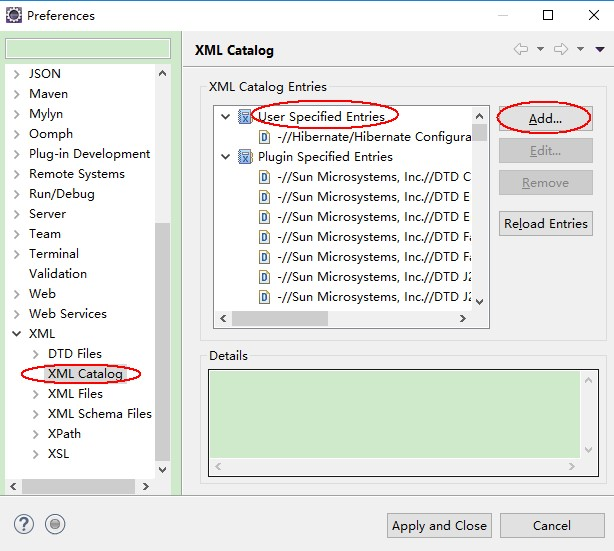 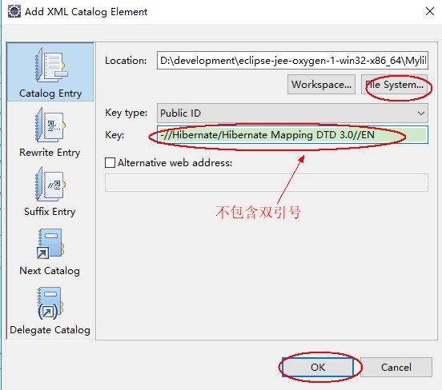

Key的值打开 DTD 文件中获得（注：不能复制双引号）

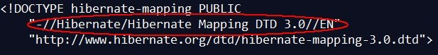

新建 xml 文件时，引用 DTD 模版即可

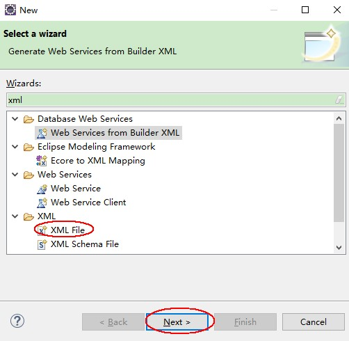 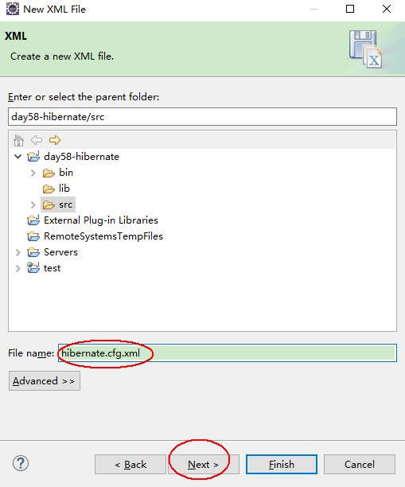

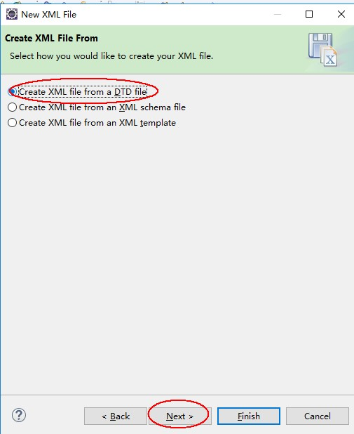 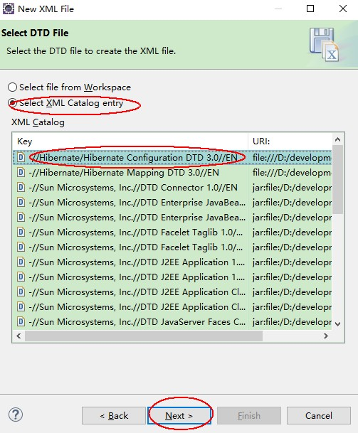

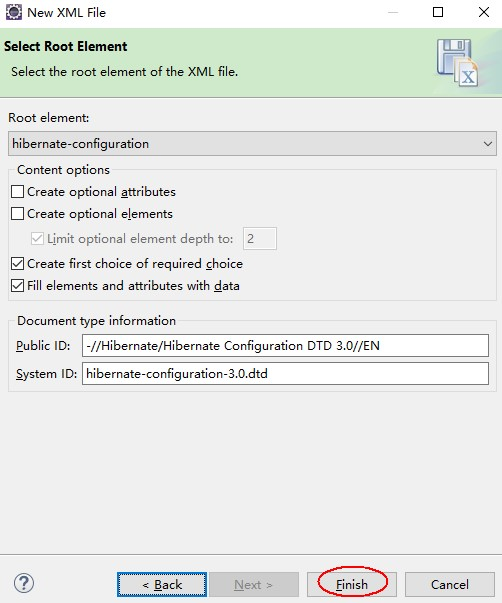 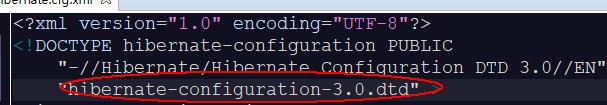

使用本地约束的好处是，不需要联网，在编写的过程都有标签的提示。

配置文件的参数的属性名去哪里找？

任何的框架，只有是配置文件里面的属性值，必定在代码里面可以找到。直接通过查询 jar 包的方式查看配置 name 属性的名称。

hibernate-core-5.0.12.Final.jar -> org.hibernate.cfg -> AvailableSettings.class

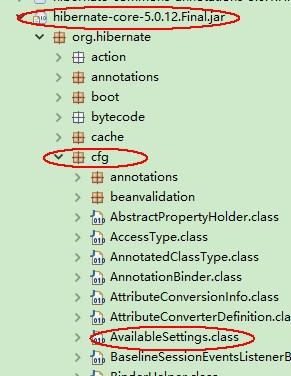

#### 5.1.2. 关联本地 dtd 约束文件的方式2

关联 dtd 文件时选择 url，对应是 hibernate/struts 的 dtd 下载网址（注意前后不能有空格和 `""` 双引号）

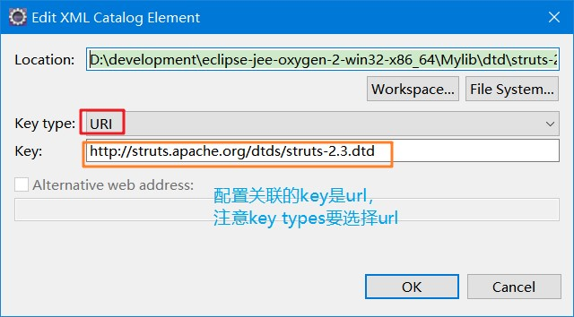


