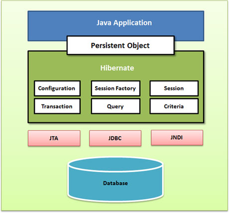

## 1. Hibernate 概述

Hibernate 是应用在 javaee 三层结构中 dao 层，开源的轻量级持久层框架。Hibernate 是一个不用写 SQL，直接使用对象实现对数据库 CRUD 操作的框架！！！！

Hibernate 底层是对 JDBC 进行封装，使用 Hibernate 的好处是，不需要写复杂 JDBC 代码，也不需要写 sql 语句就可以实现一部分功能。

每种数据库的 SQL 语句是有差异的。如果 SQL 语句由 Hibernate 框架生成，那么就屏蔽了不同数据库 SQL 语法的差异。这样，使用 Hibernate 开发出来的代码，一套代码可以兼容多个数据库。除了主要的屏蔽 SQL 差异的功能，还支持大量功能组件。

1. 支持快照
2. 支持缓存
3. 支持第三方的连接池
4. 支持线程绑定

回顾 JavaEE 三层结构

- web 层：struts2 框架
- service 层：spring 框架
- dao 层：hibernate 框架。对数据库进行 CRUD 操作


### 1.1. Hibernate 版本

- Hibernate 3.x
- Hibernate 4.x：过渡版本，比较少用
- Hibernate 5.x：目前使用，要求JDK 6+

### 1.2. Hibernate 文件结构

- documentation：hibernate 相关文档
- lib：hibernate 相关 jar 包
- project：hibernate 相关开源代码

### 1.3. ORM 思想

ORM：（Object Relational Mapping）对象关系映射。在访问数据库前，<font color=red>**将实体类的类名和数据库表的表名关联起来**</font>。通过**操作实体类的对象**，直接由框架生成操作数据库的 SQL 操作数据库表。

ORM 是一种实现使用实体类对象操作数据库表的设计思想。

1. 让实体类和数据库表进行一一对应关系。
    - 让实体类首先和数据库表对应。
    - 让实体类属性和表里面字段对应。
2. 不需要直接操作数据库表，而操作表对应的实体类对象。
    - 通过使用配置文件方式实现，不需要操作表，而直接使用 hibernate 封装的对象 Session 直接操作实体类对象。

**应用场景**：

开发产品型项目（兼容多种数据库的项目）：使用 Hibernate 写一套代码就可以实现多种数据库的操作。

**ORM 的操作流程**：


## 2. Hibernate 基础使用

### 2.1. 配置流程


1. Hibernate 需要一个总配置文件（hibernate.cfg.xml）用于存储连接数据库的信息。
2. 总配置文件的信息需要一个读取它类，Configuration。
3. 配置类可以通过 `buildSessionFactory()` 方法获得会话工厂。通过会话工厂管理数据库的连接。
4. 通过会话工厂可以获得操作对象会话（Session），Session 可以操作数据库（增删改查）。
5. 会话的增删改查必须要依赖映射文件，操作前必须配置一个实体类，然后配置实体类对应的映射文件。

### 2.2. 搭建 Hibernate 环境（传统方式）

#### 2.2.1. Step 1：导入 hibernate 相关 jar 包

1. 引入 hibernate 核心的 jar 包。
    - 必须的支撑包：hibernate-release-5.0.12.Final\lib\required
    - JPA 实现包：hibernate-release-5.0.12.Final\lib\jpa
    - 可选的组件（如：第三方缓存，连接池）：hibernate-release-5.0.12.Final\lib\optional
2. 使用 hibernate 时，有日志信息输出，hibernate 本身没有日志输出的 jar 包，所以需要导入其他日志的 jar 包。如：log4j-1.2.16.jar、slf4j-api-1.6.1.jar 等
3. 数据库 MySQL 驱动的 jar 包，如：mysql-connector-java-5.1.44-bin.jar。

#### 2.2.2. Step 2：创建实体类

<font color=red>**hibernate 要求实体类有一个属性是唯一的，一般都是用作 id（对应数据表的主键）**</font>。注：使用 hibernate 时，不需要手动创建表，hibernate 会自动创建表格。

#### 2.2.3. Step 3：配置实体类和数据库表 - 对应关系(映射关系)

1. 创建 xml 格式配置文件实现映射关系，这个映射配置文件名称和位置没有固定要求。<font color=red>*建议：在实体类所在包里面创建。命名：`实体类名称.hbm.xml`*</font>
2. 配置文件是 xml 格式，在配置文件中首先引入 xml 约束。
    - 在 hibernate 里面引入的约束目前都是 dtd 约束
    - 使用网络约束：从【`http://www.hibernate.org/dtd/hibernate-mapping-3.0.dtd`】可下载 dtd 约束文件 `hibernate-mapping-3.0.dtd`。或者使用本址约束：解压 hibernate-core-5.0.12.Final.jar 再搜索 `*.dtd`


3. 配置映射关系。`<hibernate-mapping></hibernate-mapping>` -- 根标签


Code Dome: User.hbm.xml

```xml
<?xml version="1.0" encoding="UTF-8"?>
<!-- Hibernate配置文件引入xml约束 -->
<!DOCTYPE hibernate-mapping PUBLIC 
    "-//Hibernate/Hibernate Mapping DTD 3.0//EN"
    "http://www.hibernate.org/dtd/hibernate-mapping-3.0.dtd">
<!-- 配置hibernate映射关系 -->
<hibernate-mapping>
	<!-- 1.配置类和表对应
		class标签
		name属性：实体类全路径
		table属性：数据库表名称
	 -->
	<class name="com.moonzero.entity.User" table="t_user">
		<!-- 2.配置实体类id和表id对应
			hibernate要求实体类有一个属性唯一值
			hibernate要求表有字段作为唯一值
			id标签
			name属性：实体类里面id属性名称
			column属性：生成的表字段名称
		 -->
		 <id name="uid" column="uid">
		 	<!-- generator设置数据库表id生成策略 
		 		native:生成表id值就是主键并自动增长
		 	-->
		 	<generator class="native"></generator>
		 </id>
		 <!-- 配置其他属性和表字段对应
		 	name属性：实体类属性名称
		 	column属性：生成表字段名称
		  -->
		 <property name="username" column="username"></property>
		 <property name="password" column="password"></property>
		 <property name="address" column="address"></property>
	</class>
</hibernate-mapping>
```

#### 2.2.4. Step 4：创建 hibernate 的核心配置文件

1. 配置文件，默认是放在 classpath 根目录下（即 src 目录下），文件名默认必须为 `hibernate.cfg.xml`
2. 引人 dtd 约束。查询文件：hibernate-configuration-3.0.dtd
3. hibernate 操作过程中，只会加载核心配置文件，其他配置文件不会加载。
    - 第一部分：配置数据库信息（必须的）
    - 第二部分：配置hibernate信息（可选的）
    - 第三部分：把映射文件放到核心配置文件中（必须的）。注：是文件路径，配置后按 `ctrl+左键` 点击可以链接到文件即可

Code Dome: hibernate.cfg.xml

```xml
<?xml version="1.0" encoding="UTF-8"?>
<!DOCTYPE hibernate-configuration PUBLIC
	"-//Hibernate/Hibernate Configuration DTD 3.0//EN"
	"http://www.hibernate.org/dtd/hibernate-configuration-3.0.dtd">
<hibernate-configuration>
	<session-factory>
		<!-- 第一部分：配置数据库信息（必须的） -->
		<property name="hibernate.connection.driver_class">com.mysql.jdbc.Driver</property>
		<property name="hibernate.connection.url">jdbc:mysql://localhost:3306/hibernateTest</property>
		<property name="hibernate.connection.username">root</property>
		<property name="hibernate.connection.password">123456</property>
		
		<!-- 第二部分：配置hibernate信息（可选的） -->
		<!-- 输出底层sql语句 -->
		<property name="hibernate.show_sql">true</property>
		<!-- 输出底层sql语句格式 -->
		<property name="hibernate.format_sql">true</property>
		<!-- 需要配置此属性后，hibernate才会自动创建表
			update：如果已经有表，则更新；如果没有表，则创建表
		 -->
		<property name="hibernate.hbm2ddl.auto">update</property>
		<!-- 配置数据库方言
			让hibernate框架识别不同数据库自己特有的语句（关键字）
		 -->
		<property name="hibernate.dialect">org.hibernate.dialect.MySQL5InnoDBDialect</property>
		
		<!-- 第三部分：把映射文件放到核心配置文件中（必须的） -->
		<mapping resource="com/moonzero/entity/User.hbm.xml"/>
	</session-factory>
</hibernate-configuration>
```

### 2.3. 使用 Maven 方式搭建 Hibernate

#### 2.3.1. 引入依赖

引入 hibernate 的 core、c3p0（数据源），MySQL 数据库的驱动等依赖

```xml
<dependencies>
    <dependency>
        <groupId>org.hibernate</groupId>
        <artifactId>hibernate-core</artifactId>
        <version>${hibernate.version}</version>
    </dependency>
    <!-- https://mvnrepository.com/artifact/org.hibernate/hibernate-c3p0 -->
    <dependency>
        <groupId>org.hibernate</groupId>
        <artifactId>hibernate-c3p0</artifactId>
        <version>${hibernate.version}</version>
    </dependency>
    <!-- https://mvnrepository.com/artifact/junit/junit -->
    <dependency>
        <groupId>junit</groupId>
        <artifactId>junit</artifactId>
        <version>${junit4.version}</version>
        <scope>test</scope>
    </dependency>
    <dependency>
        <groupId>mysql</groupId>
        <artifactId>mysql-connector-java</artifactId>
        <version>8.0.26</version>
    </dependency>
</dependencies>
```

#### 2.3.2. 数据库映射配置文件与实体类

```java
public class Customer {
    private long custId; // bigint(32) NOT NULL AUTO_INCREMENT COMMENT '客户编号(主键)',
    private String custName; // varchar(32) NOT NULL COMMENT '客户名称(公司名称)',
    private String custSource; // varchar(32) DEFAULT NULL COMMENT '客户信息来源',
    private String custIndustry; // varchar(32) DEFAULT NULL COMMENT '客户所属行业',
    private String custLevel; // varchar(32) DEFAULT NULL COMMENT '客户级别',
    // ...省略 getter/setter
}
```

在 resources 目录下，创建数据表与实现类的映射配置文件 `hbm/Customer.hbm.xml`

```xml
<?xml version="1.0" encoding="UTF-8"?>
<!DOCTYPE hibernate-mapping PUBLIC
        "-//Hibernate/Hibernate Mapping DTD 3.0//EN"
        "hibernate-mapping-3.0.dtd" >
<!-- 配置hibernate映射关系 -->
<hibernate-mapping>
    <!--
        配置类与表的对应
        class标签
        name属性：实体类全路径
        table属性：数据库表名称
     -->
    <class name="com.moon.hibernate.entity.Customer" table="cst_customer">
        <!-- 2.配置实体类id和表id对应
            hibernate要求实体类有一个属性唯一值
            hibernate要求表有字段作为唯一值
            id标签
            name属性：实体类里面id属性名称
            column属性：生成的表字段名称
         -->
        <id name="custId" column="cust_id">
            <!-- generator设置数据库表id生成策略
                native:生成表id值就是主键并自动增长
            -->
            <generator class="native"></generator>
        </id>
        <!-- 配置其他属性和表字段对应
            name属性：实体类属性名称
            column属性：生成表字段名称
         -->
        <property name="custName" column="cust_name"></property>
        <property name="custSource" column="cust_source"></property>
        <property name="custIndustry" column="cust_industry"></property>
        <property name="custLevel" column="cust_level"></property>
    </class>
</hibernate-mapping>
```

#### 2.3.3. hibernate 总配置文件

在 resources 目录下创建 hibernate 总配置文件 hibernate.cfg.xml

```xml
<?xml version="1.0" encoding="UTF-8"?>
<!DOCTYPE hibernate-configuration PUBLIC
        "-//Hibernate/Hibernate Configuration DTD 3.0//EN"
        "hibernate-configuration-3.0.dtd" >
<hibernate-configuration>
    <session-factory>
        <!-- 配置数据连接信息(4要素)(必须) -->
        <!-- 任何框架只有是参数名信息，必须可以在代码里面找到对应的声明代码 org.hibernate.cfg.Environment -->
        <!-- 数据库连接驱动 -->
        <property name="hibernate.connection.driver_class">com.mysql.cj.jdbc.Driver</property>
        <!-- 连接字符串 -->
        <property name="hibernate.connection.url">jdbc:mysql://localhost:3306/hibernate_db?allowPublicKeyRetrieval=true&amp;useSSL=false&amp;useUnicode=true&amp;characterEncoding=UTF-8</property>
        <!-- 用户名 -->
        <property name="hibernate.connection.username">root</property>
        <!-- 密码 -->
        <property name="hibernate.connection.password">123456</property>

        <!-- 配置hibernate可选常用属性 -->
        <!-- 输出sql语句 -->
        <property name="hibernate.show_sql">true</property>
        <!-- 格式化sql语句 -->
        <property name="hibernate.format_sql">true</property>
        <!-- 需要配置此属性后，hibernate才会自动创建表
              update：如果已经有表，则更新；如果没有表，则创建表,
              create:如果有表覆盖，没有就创建
              create-drop:启动就创建表，如果关闭sessionFactory会删除表（一般不使用）
            作用：通过代码生成表结构，可以实现快速部署项目。因为不用创建表结构。
       -->
        <property name="hibernate.hbm2ddl.auto">update</property>
        <!--
            数据库方言 ：
            所有的数据库的SQL语言都有在标准的SQL语言的基础做了扩展。我们将每一种数据库的SQL语言称为方言。
           我们知道，每一种数据库的方言都和标准的SQL语言有差异的。
          Hibernate将每一种数据库不同的实现写在方言类里面

          数据库的方言其实已经默认根据连接的信息自动加载了。不用配置也可以。
          但是我们还是建议手工配置
          因为，自动加载的方言不是最优化的。
         -->
        <property name="hibernate.dialect">org.hibernate.dialect.MySQL5InnoDBDialect</property>

        <!-- 加载映射文件(必须) -->
        <mapping resource="hbm/Customer.hbm.xml"/>
    </session-factory>
</hibernate-configuration>
```

#### 2.3.4. c3p0 连接池的配置（额外）

Hibernate 内置的连接池功能是很弱的，所以 Hibernate 支持第三方的连接池。而 c3p0 是开源最流行的连接池之一，使用连接池的作用是为了提高并发访问数据库的效率。

- 若使用传统方式是导入 hibernate 集成 c3p0 包：`hibernate-c3p0-5.0.12.Final.jar`（以前旧版本可能还需要 c3p0 本身的 jar 包，如 `c3p0-0.9.2.1.jar`、`mchange-commons-java-0.2.3.4.jar`）。
- 若使用 maven 的方式创建的项目，则只需要引入 hibernate-c3p0 依赖即可

修改总配置 hibernate.cfg.xml，增加 c3p0 相关的配置：

```xml
<!-- c3p0连接池配置 -->
<!-- 设置连接的提供者 -->
<property name="hibernate.connection.provider_class">org.hibernate.c3p0.internal.C3P0ConnectionProvider</property>
<!-- 设置c3p0参数 -->
<!-- 设置最大连接数 -->
<property name="hibernate.c3p0.max_size">10</property>
<!-- 设置启动连接池支持的连接数量 -->
<property name="hibernate.c3p0.min_size">5</property>
<!-- 设置操作时间，单位：毫秒。 -->
<property name="hibernate.c3p0.timeout">300000</property>
<!-- 最大操作数据statement,不能大于最大连接数，一般配置95%左右 -->
<property name="hibernate.c3p0.max_statements">9</property>
```

运行测试程序时，控制台会有输出以下信息，则说明 c3p0 连接池配置成功


扩展：配置 c3p0 连接池后，可能有一个数据库会出现异常。

```java
INFO: HHH000424: Disabling contextual LOB creation as createClob() method threw error : java.lang.reflect.InvocationTargetException
```

出现的原因是因为 c3p0 的类型检查和 Hibernate 默认的类型检查不同。解决方案：忽略 Hibernate 的类型检查。

> Tips: 强调一下，如果没有出现这个错误的数据库不用配置以下代码！！！！！！

```xml
<!--
    出现：creation as createClob() method threw error异常的原因
    答：是因为c3p0和hibernate类型检查不兼容导致。 
    如何解决？
    答：关闭hibernate的类型检查

    由于方言的自动加载是基于Hibernate类型检查的。如果关闭了类型检查，导致无法自动加载方言。
    所以，配置了关闭hibernate的类型检查。必须要手动设置方言
-->
<!-- 所在位置org.hibernate.engine.jdbc.env.internal.JdbcEnvironmentInitiator -->
<property name="hibernate.temp.use_jdbc_metadata_defaults">false</property>
```

### 2.4. Hibernate 使用步骤

<font color=red>**前 4 步和后 2 步都是固定，第 5 步是根据实际情况而变化。**</font>

> Notes: 这里的 Session 与 Javaweb 中的 Session 是两个不同的东西。

#### 2.4.1. Step 1：加载 hibernate 核心配置文件

```java
Configuration cfg = new Configuration();
cfg.configure();
```

执行的过程：先到 src 下面找到名称是 hibernate.cfg.xml，把该文件放入这个对象中，然后调用方法执行加载配置文件。也可以指定配置文件名字 `cfg.configure(config.xml);`，但不推荐。

#### 2.4.2. Step 2：创建 SessionFactory 对象

```java
SessionFactory sessionFactory = cfg.buildSessionFactory();
```

读取 hibernate 核心配置文件内容，创建 `sessionFactory`。在这过程中，根据映射关系，在配置的数据库里面把表创建。

#### 2.4.3. Step 3：使用 SessionFactory 创建 Session 对象

```java
Session session = sessionFactory.openSession();
```

类似于连接(可认为是和数据库建立的一个连接)

#### 2.4.4. Step 4：开启事务

```java
Transaction transaction = session.beginTransaction();
```

#### 2.4.5. Step 5：写具体逻辑 CRUD 操作

直接对对象进行操作，最后调用 Session 的方法实现操作。例如，添加数据：

```java
session.save(xxx对象);
```

#### 2.4.6. Step 6：提交事务

```java
transaction.commit();
```

#### 2.4.7. Step 7：关闭资源

```java
session.close();
sessionFactory.close();
```

### 2.5. 创建 Hibernate 工具类

<font color=red>**注意：要理解为什么，一个项目只能有一个连接池。如果出现多个连接池，有可能导致事务处理不同步。**</font>

hibernate 工具类示例：

```java
package hibernate.demo.utils;

import org.hibernate.Session;
import org.hibernate.SessionFactory;
import org.hibernate.cfg.Configuration;

public class HibernateUtil {
	// 使用static的关键字，整个项目共享一个对象。
	// 如果一个项目里面出现多个连接池，有可能导致事务处理不同步。事务同步提交的前提是同一个连接。
	// 创建静态Session工厂成员变量
	public static SessionFactory sessionFactory = HibernateUtil.createSessionFactory();

	// 获得会话工厂
	private static SessionFactory createSessionFactory() {
		// 1.创建Configuration对象
		Configuration cfg = new Configuration();
		// 2.读取配置文件，获得框架信息，默认读取classpath根目录hibernate.cfg.xml
		cfg.configure();
		// 3.获得会话工厂,如果要连接数据库必须需要连接数据库的信息（四要素）
		// 获得会话工厂必须要在读取配置文件之后
		return cfg.buildSessionFactory();
	}

	// 获取会话操作对象
	public static Session getSession() {
		// 每次打开一个新连接
		return sessionFactory.openSession();
	}
}
```

## 3. Hibernate 核心配置

### 3.1. 概述

Hibernate 需要一套相关数据库和其它相关参数的配置设置，这些映射信息定义了 Java 类怎样关联到数据库表。所有的核心配置信息有以下两种提供方式：

- 作为一个标准的 Java 属性文件提供的，文件默认名称：hibernate.properties
- 作为 XML 文件提供的，文件默认名称：hibernate.cfg.xml

### 3.2. 总配置文件

总配置以 XML 格式文件 hibernate.cfg.xml 为例，核心配置主要是设置 `<hibernate-configuration>` -> `<session-factory>` -> `<property>` 标签的 `name` 属性

#### 3.2.1. 常用配置项

- `hibernate.connection.driver_class`：设置数据库驱动。例如 MySQL 的配置值是 `com.mysql.cj.jdbc.Driver`
- `hibernate.connection.url`：数据库连接字符串。例如 `jdbc:mysql://localhost:3306/xxx`
- `hibernate.connection.username`：数据库用户名。
- `hibernate.connection.password`：数据库密码。
- `hibernate.show_sql`：设置是否显示操作的 SQL 语句，可选值是 true/false
- `hibernate.format_sql`：格式化输出 SQL 语句，前提是 `show_sql` 为 true。可选值是 true/false
- `hibernate.dialect`：配置方言。例如 MySQL 默认选择 `org.hibernate.dialect.MySQL5InnoDBDialect`。更多各种重要数据库同源语属性类型详见下表。

|           数据库           |                   方言属性                   |
| ------------------------- | ------------------------------------------ |
| DB2                       | org.hibernate.dialect.DB2Dialect           |
| HSQLDB                    | org.hibernate.dialect.HSQLDialect          |
| HypersonicSQL             | org.hibernate.dialect.HSQLDialect          |
| Informix                  | org.hibernate.dialect.InformixDialect      |
| Ingres                    | org.hibernate.dialect.IngresDialect        |
| Interbase                 | org.hibernate.dialect.InterbaseDialect     |
| Microsoft SQL Server 2000 | org.hibernate.dialect.SQLServerDialect     |
| Microsoft SQL Server 2005 | org.hibernate.dialect.SQLServer2005Dialect |
| Microsoft SQL Server 2008 | org.hibernate.dialect.SQLServer2008Dialect |
| MySQL                     | org.hibernate.dialect.MySQLDialect         |
| Oracle (any version)      | org.hibernate.dialect.OracleDialect        |
| Oracle 11g                | org.hibernate.dialect.Oracle10gDialect     |
| Oracle 10g                | org.hibernate.dialect.Oracle10gDialect     |
| Oracle 9i                 | org.hibernate.dialect.Oracle9iDialect      |
| PostgreSQL                | org.hibernate.dialect.PostgreSQLDialect    |
| Progress                  | org.hibernate.dialect.ProgressDialect      |
| SAP DB                    | org.hibernate.dialect.SAPDBDialect         |
| Sybase                    | org.hibernate.dialect.SybaseDialect        |
| Sybase Anywhere           | org.hibernate.dialect.SybaseAnywhereDialec |

- `hibernate.hbm2ddl.auto`：配置通过代码生成数据库的表结构，可以实现快速部署项目。因为不用创建表结构，大大减少部署的时间。可选值如下：
    - `create`：不管数据库里是否有表，覆盖
    - `update`：数据库有表就使用原来的表，没有的表就增加新表
    - `drop-create`：如果显示关闭 SessionFactory，会在程序结束后删除表
- `hibernate.current_session_context_class`：配置绑定线程，取值是 `thread`
- `hibernate.temp.use_jdbc_metadata_defaults`：因为 c3p0 和 hibernate 类型检查不兼容，会导致出现 `creation as createClob() method threw error` 异常，因此需要关闭 hibernate 的类型检查。由于方言的自动加载是基于 Hibernate 类型检查的。如果关闭了类型检查，导致无法自动加载方言。所以配置了关闭 hibernate 的类型检查，必须要手动设置方言，取值：`false`。
- `hibernate.connection.provider_class`：设置连接的提供者。如，`org.hibernate.c3p0.internal.C3P0ConnectionProvider`。

#### 3.2.2. c3p0 连接池相关配置项

- `hibernate.c3p0.max_size`：设置c3p0参数：最大连接数（如：10）
- `hibernate.c3p0.min_size`：设置c3p0参数：设置启动连接池支持的连接数量（如：5）
- `hibernate.c3p0.timeout`：设置c3p0参数：设置操作时间，单位：毫秒（如：300000）
- `hibernate.c3p0.max_statements`：设置c3p0参数：最大操作数据statement,不能大于最大连接数，一般配置95%左右（如：9）

#### 3.2.3. 导入其他 xml 文件

配置加载 xml 文件

```xml
<mapping resource="实体类映射文件相对路径"/>
```

注：相对路径是指相对 hibernate.cfg.xml 文件的路径，路径的最前面没有 "`/`"。例如：

```xml
<mapping resource="demo/entity/hbm/Customer.hbm.xml"/>
```

### 3.3. 实体类映射配置文件

#### 3.3.1. 映射文件

在传统项目中，一个对象/关系型映射一般定义在 XML 文件中。映射文件指示 Hibernate 如何将已经定义的类或类组与数据库中的表对应起来。

> Notes: **目前的项目都是直接使用全注解(指 JPA 的注解)的方式来配置对象与表的映射关系，xml 映射配置已过时**。

例如，有如下 RDBMS 表

```sql
create table EMPLOYEE (
    id INT NOT NULL auto_increment,
    first_name VARCHAR(20) default NULL,
    last_name  VARCHAR(20) default NULL,
    salary     INT  default NULL,
    PRIMARY KEY (id)
);
```

对于想通过 ORM 框架将数据库的数据映射到相应的持久性的对象，需要根据上表的字段来定义 POJO 类：

```java
public class Employee {
    private int id;
    private String firstName; 
    private String lastName;   
    private int salary;  

    // ...省略无参构造、有参构造、setter/getter方法
}
```

基于前面的表与持久化类，可以定义下列映射文件来指示 Hibernate 如何将已定义的类或类组与数据库表匹配。

```xml
<?xml version="1.0" encoding="utf-8"?>
<!DOCTYPE hibernate-mapping PUBLIC 
 "-//Hibernate/Hibernate Mapping DTD//EN"
 "http://www.hibernate.org/dtd/hibernate-mapping-3.0.dtd"> 

<hibernate-mapping>
   <class name="Employee" table="EMPLOYEE">
      <meta attribute="class-description">
         This class contains the employee detail. 
      </meta>
      <id name="id" type="int" column="id">
         <generator class="native"/>
      </id>
      <property name="firstName" column="first_name" type="string"/>
      <property name="lastName" column="last_name" type="string"/>
      <property name="salary" column="salary" type="int"/>
   </class>
</hibernate-mapping>
```

Hibernate 默认情况下，需要以格式 `<classname>.hbm.xml` 保存映射文件。示例中保存映射配置在 Employee.hbm.xml 文件中。其中映射文件中使用的一些基础的标签：

- 映射文件是一个以 `<hibernate-mapping>` 为根元素的 XML 文件，里面包含所有 `<class>` 标签。
- `<class>` 标签是用来定义从一个 Java 类到数据库表的特定映射。Java 的类名使用 `name` 属性来表示，数据库表明用 `table` 属性来表示。
- `<meta>` 标签是一个可选元素，可以被用来修饰类。
- `<id>` 标签将类中独一无二的 ID 属性与数据库表中的主键关联起来。标签中的 `name` 属性引用类的属性名，`column` 属性引用数据库表的列名。`type` 属性保存 Hibernate 映射的类型，这个类型会将从 Java 转换成 SQL 数据类型。
- 在`<id>` 标签中，包含的 `<generator>` 子标签用来自动生成主键值。标签中的 `class` 属性可以设置 `native`, `identity`, `sequence` 或 `hilo` 算法，会根据底层数据库的情况来创建主键。
- `<property>` 标签用来将 Java 类的属性与数据库表的列匹配（除主键外的列）。标签中 `name` 属性引用的是类的性质，`column` 属性引用的是数据库表的列。`type` 属性保存 Hibernate 映射的类型，这个类型会将从 Java 转换成 SQL 数据类型。

#### 3.3.2. 主键生成策略

主键生成策略，就是 Hibernate 提供了多种生成主键值的方法。常用的 Hibernate 的主键生成策略：

- `increment`：不使用数据库本地的自增长策略，而是由程序(Hibernate 框架)产生一个自增长的ID 值，赋予数据库
- `idenitty`：指定使用数据库里面的 ID 自增长策略
    - 只能用于有 ID 自增长功能的数据库，如：MySQL, SQLServer...
    - 不支持没有 ID 自增长策略的数据库，如：Oracle, DB2...
- `sequence`：使用序列的实现 ID 生成策略
    - 主要用于有序列的数据库，如：Oracle, DB2...
    - 如果不支持序列的数据库（如：MYSQL），该策略会使用一个表模拟序列。
- `native`：使用数据库本地的策略，就是数据库里面使用怎么样的策略就用什么策略，HIbernate 不做任何的判断。如 MySQL 数据库使用了 `increment_auto`(自增长策略)，配置 `native` 则表示直接调用数据库里面的`increment_auto` 策略
- `uuid`：是数据库的主键是使用一个唯一的字符串的来存储。这个唯一的字符串就是 UUID。
- `assigned`：就是不使用主键生成策略，由手工输入 ID

配置示例：

```xml
<id name="custId" column="cust_id">
    <generator class="native"></generator>
</id>
```

##### 3.3.2.1. increment

increment 策略是指<font color=red>**不使用数据库本地的自增长策略**</font>，而是由 Hibernate 框架产生一个自增长的 ID 值，赋予数据库的主键。


实现原理：每次的 sql 语句，都先获得 id 的最大值（如：`select max(id) form 表名`），再在此 ID 值基础上加 1 做为插入数据的 id 值。

- 好处：兼容好，可以支持各种数据库。
- 缺点：由于主键值由框架生成，所有效率相对低。

应用场景：适合一些需要支持多种数据库的产品型项目。

##### 3.3.2.2. identity（重要，一般用于 MySQL）

identity 策略指定使用数据库里面的 ID 自增长策略。但只能用于有 ID 自增长功能的数据库，如:MySQL, SQLServer 等；不支持没有 ID 自增长策略的数据库，如 Oracle, DB2 等。

- 好处：默认就认为数据库是使用 ID 自增长策略，效率高。
- 缺陷：兼容差。不支持使用序列实现 ID 自增长的数据库。


##### 3.3.2.3. sequence（重要，一般用于 Oracle）

sequence 是使用序列的实现 ID 生成策略，主要用于有序列的数据库，如：Oracle, DB2 等；如果不支持序列的数据库（如：MYSQL），该策略会使用一个表模拟序列。

为什么有序列的数据库（Oracle）使用 SEQUENCE 策略而不用 native 策略？因为 SEQUENCE 策略是可以设置序列的名字，步长等参数的，而 Native 策略是不可以。另外 Native 策略生成的序列名统一使用 Hibernate_sequence。如果出现多个表的情况，就导致多个表使用同一个序列，这样会导致表的 ID 值断号不连续。

<font color=red>**使用 SEQUENCE 策略可以设置每一个表对应的一个序列的参数，参数设置参数名！！！！**</font>

##### 3.3.2.4. native

native 是使用数据库本地的策略，就是数据库里面使用怎么样的策略就用什么策略，HIbernate 不做任何的判断。如 MySQL 数据库使用了 `increment_auto`(自增长策略)；如果 Oracle 使用 native 则使用序列生成主键值。

<font color=red>**注意：Oracle 使用 native 这种方式不好的地方是，序列名为 Hibernate_SEQUENCE.而且多个表使用一个序列。会导致序列断号。**</font>

##### 3.3.2.5. uuid

uuid 主键策略就是使用一个唯一的字符串的来存储数据库的主键，这个唯一的字符串就是 UUID。**UUID 用于存储基础数据的表。所谓的基础数据，就是系统必须依赖的数据。**

应用场景：如果几个不同开发人员一起开发一个项目，使用 UUID 可以确保 ID 的冲突。

##### 3.3.2.6. assigned

assigned 就是不使用 ID 自动生成值的策略，需要手工写入 ID 的值。

> Notes: 此策略创建的实体类对象必须提供 `setXxId(xx)` 方法，如果调用代码没有 ID 值，会报异常。

#### 3.3.3. 映射类型

在 Hibernate 映射文件中，Java 数据类型会映射到相应的 RDBMS 数据格式。在映射文件中声明被使用的 types 不是 Java 数据类型，也不是 SQL 数据库类型。这种类型被称为 Hibernate 映射类型，可以从 Java 翻译成 SQL，反之亦然。

**原始类型**

|   映射类型    |           Java 类型           |     ANSI SQL 类型     |
| ----------- | ---------------------------- | -------------------- |
| integer     | int 或 java.lang.Integer     | INTEGER              |
| long        | long 或 java.lang.Long       | BIGINT               |
| short       | short 或 java.lang.Short     | SMALLINT             |
| float       | float 或 java.lang.Float     | FLOAT                |
| double      | double 或 java.lang.Double   | DOUBLE               |
| big_decimal | java.math.BigDecimal         | NUMERIC              |
| character   | java.lang.String             | CHAR(1)              |
| string      | java.lang.String             | VARCHAR              |
| byte        | byte 或 java.lang.Byte       | TINYINT              |
| boolean     | boolean 或 java.lang.Boolean | BIT                  |
| yes/no      | boolean 或 java.lang.Boolean | CHAR(1) ('Y' or 'N') |
| true/false  | boolean 或 java.lang.Boolean | CHAR(1) ('T' or 'F') |

**日期和时间类型**

|    映射类型     |               Java 类型               | ANSI SQL 类型 |
| ------------- | ------------------------------------ | ------------ |
| date          | java.util.Date 或 java.sql.Date      | DATE          |
| time          | java.util.Date 或 java.sql.Time      | TIME          |
| timestamp     | java.util.Date 或 java.sql.Timestamp | TIMESTAMP     |
| calendar      | java.util.Calendar                   | TIMESTAMP     |
| calendar_date | java.util.Calendar                   | DATE          |

**二进制和大型数据对象**

|    映射类型    |                      Java 类型                       |    ANSI SQL 类型     |
| ------------ | --------------------------------------------------- | ------------------- |
| binary       | byte[]                                              | VARBINARY (or BLOB) |
| text         | java.lang.String                                    | CLOB                |
| serializable | any Java class that implements java.io.Serializable | VARBINARY (or BLOB) |
| clob         | java.sql.Clob                                       | CLOB                |
| blob         | java.sql.Blob                                       | BLOB                |

**JDK 相关类型**

|  映射类型  |      Java 类型      | ANSI SQL 类型 |
| -------- | ------------------ | ------------- |
| class    | java.lang.Class    | VARCHAR       |
| locale   | java.util.Locale   | VARCHAR       |
| timezone | java.util.TimeZone | VARCHAR       |
| currency | java.util.Currency | VARCHAR       |


## 4. Hibernate 核心类

### 4.1. Hibernate 架构与核心类概述

Hibernate 架构是分层的，Hibernate 利用数据库以及配置数据来为应用程序提供持续性服务（以及持续性对象）。下图是 Hibernate 应用程序体系结构视图以及一些重要的类：



Hibernate 使用不同的现存 Java API，比如 JDBC，Java 事务 API（JTA），以及 Java 命名和目录界面（JNDI）。JDBC 提供了一个基本的抽象级别的通用关系数据库的功能，Hibernate 支持几乎所有带有 JDBC 驱动的数据库。JNDI 和 JTA 允许 Hibernate 与 J2EE 应用程序服务器相集成。Hibernate 常用的 API：

- Configuration：配置类。是在任何 Hibernate 应用程序中创造的第一个 Hibernate 对象，并且经常只在应用程序初始化期间创造。它代表了 Hibernate 所需一个配置或属性文件。配置对象提供了两种基础组件：
    - **数据库连接**：由 Hibernate 支持的一个或多个配置文件处理。这些文件是 hibernate.properties 和 hibernate.cfg.xml。
    - **类映射设置**：这个组件建立了 Java 类和数据库表格之间的联系。
- SessionFactory：会话工厂。通过 Configuration 创造一个 SessionFactory 对象，使用提供的配置文件为应用程序依次配置 Hibernate，并允许实例化一个会话对象。
- Session：会话被用于与数据库的物理连接。
- Transaction：事务处理类
- Environment：用于存储所有配置的环境参数
- Query：使用 SQL 或者 Hibernate 查询语言（HQL）字符串在数据库中来检索数据并创造对象。一个查询的实例被用于连结查询参数，限制由查询返回的结果数量，并最终执行查询。
- Criteria：被用于创造和执行面向规则查询的对象来检索对象。

### 4.2. Configuration 类

`org.hibernate.cfg.Configuration` 类的作用是对 Hibernate 进行配置，以及对它进行启动。在 Hibernate 的启动过程中，`Configuration` 类的实例首先定位映射文档的位置，读取这些配置，然后创建一个 `SessionFactory` 对象。虽然 `Configuration` 类在整个 Hibernate 项目中只扮演着一个很小的角色，但它是启动 hibernate 时所遇到的第一个对象。

总结：Configuration 类用于获得框架的信息，构建将会话工厂。

#### 4.2.1. 构造函数

```java
public Configuration() {
	this( new BootstrapServiceRegistryBuilder().build() );
}

public Configuration(BootstrapServiceRegistry serviceRegistry) {
	this.bootstrapServiceRegistry = serviceRegistry;
	this.metadataSources = new MetadataSources( serviceRegistry );
	reset();
}

public Configuration(MetadataSources metadataSources) {
	this.bootstrapServiceRegistry = getBootstrapRegistry( metadataSources.getServiceRegistry() );
	this.metadataSources = metadataSources;
	reset();
}
```

#### 4.2.2. 常用方法

```java
public Configuration configure() throws HibernateException
```

- 获得默认的配置文件，直接获得 src 目录下 hibernate.hbm.xml 的配置。

```java
public Configuration configure(String resource) throws HibernateException
```

- 获得非默认名称的配置文件，例如 `xxx.xml`，则 `config.configure(xxx.xml);`

```java
public SessionFactory buildSessionFactory() throws HibernateException
```

- 获取一个 `SessionFactory` 对象

#### 4.2.3. 示例

不使用配置文件获得框架的信息示例（*不推荐，了解*）。

> 原因：配置放在类里面，编译后 java 文件就变成了 class 文件。导致不可修改配置的信息

```java
// 获得一个会话工厂
private static SessionFactory createSessionFactory(){
	// 1. 创建一个Configuration的对象
	Configuration config = new Configuration();
	// 2. 设置配置的信息
	// 2.1. 创建一个键值对
	Properties p = new Properties();
	p.setProperty("hibernate.connection.driver_class", "com.mysql.cj.jdbc.Driver");
	p.setProperty("hibernate.connection.url", "jdbc:mysql://localhost:3306/hibernate_db?useSSL=false&useUnicode=true&characterEncoding=UTF-8");
	p.setProperty("hibernate.connection.username", "root");
	p.setProperty("hibernate.connection.password", "123456");
	p.setProperty("hibernate.show_sql", "true");
	p.setProperty("hibernate.format_sql", "true");
	// 2.2. 将设置的属性加入到配置
	config.addProperties(p);
	
	// 2.3. 加载映射文件
	config.addResource("com/moon/pojo/hbm/Customer.hbm.xml");

	// 3. 构造一个会话工厂
	SessionFactory sessionFactory = config.buildSessionFactory();
	return sessionFactory;
}
```

### 4.3. SessionFactory 接口

#### 4.3.1. 概述

```java
public interface SessionFactory extends EntityManagerFactory, HibernateEntityManagerFactory, Referenceable, Serializable, java.io.Closeable
```

`org.hibernate.SessionFactory` 的作用类似 `DataSource`，用于管理数据库的连接，它充当数据存储源的代理，并负责创建 Session 对象。`SessionFactory` 对象可以通过 `Configuration` 类的 `buildSessionFactory()` 工厂方法获取。SessionFactory 是一个线程安全对象并由应用程序所有的线程所使用。

需要注意的是，SessionFactory 是一个重量级对象，一般情况下，一个项目通常只需要一个 SessionFactory 就足够，所以通常它都是在应用程序启动时创造然后保存为以后使用。每个数据库需要一个 SessionFactory 对象使用一个单独的配置文件。所以如果使用多个（种）数据库，那么就要每个（种）数据库指定一个 SessionFactory 对象。

#### 4.3.2. 常用方法

```java
Session openSession() throws HibernateException;
```

- 获取 `Session` 操作对象，相当于创建一次连接。

```java
Session getCurrentSession() throws HibernateException;
```

- 获得当前线程的 session（线程绑定）

```java
void close() throws HibernateException;
```

- 关闭会话工厂

### 4.4. Session 接口

#### 4.4.1. 概述

```java
public interface Session extends SharedSessionContract, EntityManager, HibernateEntityManager, AutoCloseable, Closeable
```

`org.hibernate.Session` 接口的作用类似 JDBC 的 Statement。用于操作数据库的数据。<font color=red>**Session 操作是必须先映射，后操作**</font>。Session 对象是轻量级的，并被设计为每次实例化都需要与数据库的交互。持久对象通过 Session 对象保存和检索。

Session 对象不应该长时间保持开启状态因为它们通常情况下并非线程安全，并且它们应该按照所需创造和销毁。

Session接口负责执行被持久化对象的CRUD操作(CRUD的任务是完成与数据库的交流，包含了很多常见的SQL语句)。但需要注意的是Session对象是非线程安全的。同时，Hibernate的session不同于JSP应用中的HttpSession。这里当使用session这个术语时，其实指的是Hibernate中的session，而以后会将HttpSession对象称为用户session。

#### 4.4.2. 常用方法

```java
Serializable save(Object object);
Serializable save(String entityName, Object object);
```

- 保存数据到数据库

```java
void saveOrUpdate(Object object);
void saveOrUpdate(String entityName, Object object);
```

- 如果数据库没有记录就保存，如果有记录就更新，重要的判断依据是 OID 是否相同，OID（Object ID）就是在配置文件配置为 `<id>` 属性。<font color=purple>**注：如果想修改某个字段，保留其他字段，必须先查询再修改**</font>。

```java
void delete(Object object);
void delete(String entityName, Object object);
```

- 用于通过 OID 删除数据库记录

```java
void update(Object object);
void update(String entityName, Object object);
```

- 用于通过 OID 更新数据的记录

```java
<T> T load(Class<T> theClass, Serializable id, LockMode lockMode);
<T> T load(Class<T> theClass, Serializable id, LockOptions lockOptions);
Object load(String entityName, Serializable id, LockMode lockMode);
Object load(String entityName, Serializable id, LockOptions lockOptions);
<T> T load(Class<T> theClass, Serializable id);
Object load(String entityName, Serializable id);
void load(Object object, Serializable id);
```

- 用于通过 OID，获得一条记录，<font color=red>**有延迟**</font>。

```java
<T> T get(Class<T> entityType, Serializable id);
<T> T get(Class<T> entityType, Serializable id, LockMode lockMode);
<T> T get(Class<T> entityType, Serializable id, LockOptions lockOptions);
Object get(String entityName, Serializable id);
Object get(String entityName, Serializable id, LockMode lockMode);
Object get(String entityName, Serializable id, LockOptions lockOptions);
```

- 用于通过 OID，获得一条记录，<font color=red>**无延迟**</font>。

```java
Transaction beginTransaction();
```

- 打开并且启动事务（增删改操作必须），并返回关联事务对象。继承自 `org.hibernate.SharedSessionContract`。<font color=purple>**注：在同一个 session 对象中，如果多次 `beginTransaction()`，并且在事务没有提交的情况下，都是同一个事务对象。**</font>

```java
Transaction getTransaction();
```

- 打开了事务，但没有开启。继承自 `org.hibernate.SharedSessionContract`


```java
void clear();
```

- 清除 session 所有对象的持久态。包含所有已加载的实例，取消所有待处理的保存、更新和删除。但不会关闭已开启打开的 iterators 或 ScrollableResults 实例。

```java
void close() throws HibernateException;
```

- 关闭 session 对象，继承自 `org.hibernate.SharedSessionContract`

```java
void evict(Object object);
```

- 清除指定的对象的持久态

```java
// 继承自 org.hibernate.query.QueryProducer，用 QueryProducer 中暴露的类型覆盖 JPA 返回类型
@Override
<T> org.hibernate.query.Query<T> createQuery(CriteriaQuery<T> criteriaQuery);

@Override
org.hibernate.query.Query createQuery(CriteriaUpdate updateQuery);

@Override
org.hibernate.query.Query createQuery(CriteriaDelete deleteQuery);

@Override
<T> org.hibernate.query.Query<T> createQuery(String queryString, Class<T> resultType);

// 继承自 org.hibernate.SharedSessionContract
@Override
org.hibernate.query.Query createQuery(String queryString);
```

- 获得使用 HQL 查询的 Query 对象

```java
@Override
NativeQuery createSQLQuery(String queryString);
// 继承自 org.hibernate.query.QueryProducer
@Deprecated
default SQLQuery createSQLQuery(String queryString)
```

- 获得使用 SQL 查询的 Query 对象。继承自 `org.hibernate.query.QueryProducer`

```java
@Deprecated
Criteria createCriteria(Class persistentClass);
@Deprecated
Criteria createCriteria(Class persistentClass, String alias);
@Deprecated
Criteria createCriteria(String entityName);
@Deprecated
Criteria createCriteria(String entityName, String alias);
```

- 获得标准查询的 Criteria 对象（已过时）。继承自 `org.hibernate.SharedSessionContract`

#### 4.4.3. 绑定 Session 到当前线程

##### 4.4.3.1. 将 Session 当参数的传递的方式实现

```java
@Test
public void testSession() {
	// 获取会话对象
	Session session = HibernateUtil.getSession();
	System.out.println(session.hashCode());
	// 开启事务
	Transaction transaction = session.beginTransaction();

	// 新增数据
	HibernateDao dao = new HibernateDao(session);
	Customer c1 = new Customer();
	Customer c2 = new Customer();

	c1.setCustName("试试");
	dao.save(c1);
	c2.setCustName("xx");
	dao.save(c2);
	// 提交事务
	transaction.commit();
	// 关闭资源
	session.close();
}

public class HibernateDao {
	// 定义session成员变量
	private Session session;

	// 通过构造函数传递Session
	public HibernateDao(Session session) {
		this.session = session;
	}

	// 增加数据方法
	public void save(Customer customer) {
		System.out.println(session.hashCode() + "--dao层");
		// 保存数据
		session.save(customer);
	}
}
```

##### 4.4.3.2. Hibernate 内置实现

由于项目几乎都使用 Spring 框架，不能使用 new 创建对象。所以不能使用构造函数传递 session 给 DAO，可以使用线程绑定来实现外层的 session 和 DAO 的 session 是同一个对象。

所谓的线程绑定，就是使用一个线程变量将对象 `ThreadLoad` 保存起来，从而保证同一条线程获得同一个对象。<font color=red>**线程绑定的作用，就是让同一条线程获得 session 对象是相同的，不需要参数传递 session！！！**</font>实现步骤如下：

- 修改全局配置文件配置

```java
<!-- 配置绑定线程 -->
<property name="hibernate.current_session_context_class">thread</property>
```

- 修改工具类获取 Session 代码

```java
public static Session getSession() {
	// 每次打开一个新连接
	return sessionFactory.getCurrentSession();
	// return sessionFactory.openSession();
}
```

**注意事项**：

1. session 不能手动关闭。如果 session 绑定到当前线程，会随线程启动而启动，随线程结束而结束。因此不能手工关闭。
2. 所有的操作都要打开事务，包括查询（原来查询是不需要启动事务的）。配置了线程绑定，Hibernate 就要验证事务激活状态，导致了所有的操作都要开启事务，包括查询！！

##### 4.4.3.3. 使用 ThreadLocal 实现

使用 `ThreadLocal` 类实现线路绑定。注意，自定义实现线程绑定是不需要配置 Hibernate 的线程绑定的。修改前面示例中 `HibernateUtil` 的核心部分：

```java
public class HibernateUtil {
	// 使用static的关键字，整个项目共享一个对象。
	// 创建静态Session工厂成员变量
	public static SessionFactory sessionFactory = HibernateUtil.createSessionFactory();
	// 创建线程共享对象
	private static ThreadLocal<Session> local = new ThreadLocal<Session>();

	// 获得会话工厂
	private static SessionFactory createSessionFactory() {
		// 1.创建Configuration对象
		Configuration cfg = new Configuration();
		// 2.读取配置文件，获得框架信息，默认读取classpath根目录hibernate.cfg.xml
		cfg.configure();
		// 3.获得会话工厂,如果要连接数据库必须需要连接数据库的信息（四要素）
		// 获得会话工厂必须要在读取配置文件之后
		return cfg.buildSessionFactory();
	}

	// 获取会话操作对象
	public static Session getSession() {
		// 判断线程共享对象是否有值
		if (local.get() == null) {
			Session session = sessionFactory.openSession();
			// 将Session存入线程共享对象中
			local.set(session);
		}
		// 返回线路共享值
		return local.get();
	}
}
```

#### 4.4.4. 小结

##### 4.4.4.1. get 和 load 方法的区别（了解）

`get()` 方法：

1. 由于 get 方法是无延迟的，所以查不到数据直接返回 null。
2. 由于 get 方法是无延迟的，查询的时候数据已经在对象里面，所以关闭 session，数据依然可以使用。

`load()` 方法：

1. load 是有延迟，基于延迟的机制，如果找不到数据就报异常。
2. load 是有延迟，意味着在对象的时候才去查询数据库。导致在使用对象前关闭数据库，报错。
3. load 方法可以通过修改全局配置文件，将 `<class lazy="false">` 修改为无延迟获得数据，修改方法如下：

```xml
<!-- 设置 load 直接查询。设置 class 标签的 lazy 为 false -->
<class name="com.moon.pojo.Customer" table="cst_customer" lazy="false">
```

> Tips: 由于 load 方法拿不到数据报异常，又需要处理异常导致代码增加。所以开发都是使用 get 方法

#### 4.4.5. 示例

基础的增删改查

```java
import org.hibernate.Session;
import org.hibernate.Transaction;
import org.junit.Test;

import com.moon.entiry.Customer;
import com.moon.utils.HibernateUtil;

/**
 * hibernate 测试类
 */
public class TestHibernate {
	@Test
	public void testSession() {
		// 获取会话对象
		Session session = HibernateUtil.getSession();
		System.out.println(session);
	}

	@Test
	public void save() {
		// 获取会话
		Session session = HibernateUtil.getSession();
		// 开启事务
		Transaction transaction = session.beginTransaction();

		// 进行添加数据操作
		Customer c = new Customer();
		c.setCustName("MooN");
		session.save(c);
		
		// 提交事务
		transaction.commit();
		// 关闭资源
		session.close();
	}
	
	@Test
	public void update() {
		// 获取会话
		Session session = HibernateUtil.getSession();
		// 开启事务
		Transaction transaction = session.beginTransaction();

		// 进行修改数据操作
		Customer c = new Customer();
		c.setCustId(1L);
		// c.setCustName("xxoo");
		c.setCustLevel("一级");
		session.saveOrUpdate(c);
		
		// 提交事务
		transaction.commit();
		// 关闭资源
		session.close();
	}
	
	@Test
	public void update2() {
		// 获取会话
		Session session = HibernateUtil.getSession();
		// 开启事务
		Transaction transaction = session.beginTransaction();

		// 进行修改数据操作，如果想修改某个字段，保留其他字段，必须先查询再修改
		Customer c = session.get(Customer.class, 1L);
		c.setCustName("xxoo");
		session.saveOrUpdate(c);
		
		// 提交事务
		transaction.commit();
		// 关闭资源
		session.close();
	}
	
	@Test
	public void delete() {
		// 获取会话
		Session session = HibernateUtil.getSession();
		// 开启事务
		Transaction transaction = session.beginTransaction();

		// 进行修改数据操作，如果想修改某个字段，保留其他字段，必须先查询再修改
		Customer c = new Customer();
		c.setCustId(2L);
		session.delete(c);
		
		// 提交事务
		transaction.commit();
		// 关闭资源
		session.close();
	}
	
	@Test
	public void get() {
		// 获取会话
		Session session = HibernateUtil.getSession();
		// 开启事务
		Transaction transaction = session.beginTransaction();

		// 进行修改数据操作，如果想修改某个字段，保留其他字段，必须先查询再修改
		Customer c = session.get(Customer.class, 1L);
		System.out.println(c);
		// 提交事务
		transaction.commit();
		// 关闭资源
		session.close();
	}
}
```

### 4.5. Transaction 接口

#### 4.5.1. 概述

```java
public interface Transaction extends EntityTransaction
```

一个事务代表了与数据库工作的一个单元，目前大部分 RDBMS 均支持事务功能。

`org.hibernate.Transaction` 接口主要用于处理事务。Transaction 接口是 Hibernate 对实际事务实现的一个抽象，由底层事务管理器和事务处理，这些实现包括 JDBC 的事务、JTA 中的 UserTransaction、甚至可以是 CORBA 事务。这样设计是能让开发者能够使用一个统一事务的操作界面，使得自己的项目可以在不同的环境和容器之间方便地移植。

Transaction 是一个可选的 API，因此 Hibernate 应用程序可以选择不使用这个接口，取而代之的是 Hibernate 的设计者在应用程序中自己实现底层事务处理代码。

#### 4.5.2. 常用方法

```java
public void begin();
```

- 开启事务。继承自 `javax.persistence.EntityTransaction`

```java
public void commit();
```

- 提交事务。继承自 `javax.persistence.EntityTransaction`

```java
public void rollback();
```

- 回滚事务。继承自 `javax.persistence.EntityTransaction`

## 5. Hibernate 持久化类

### 5.1. 概述

Hibernate 的核心工作就是提取 Java 类属性中的值，并且将它们保存到数据库表相应的字段中。而实体类映射文件能够帮助 Hibernate 确定如何从该类中提取值，并将它们映射在表格和相关域中。

在 Hibernate 中，其对象或实例将会被存储在数据库表单中的 Java 类被称为**持久化类**。若该类遵循一些简单的规则或者符合 Plain Old Java Object (POJO) 编程模型，Hibernate 将会处于其最佳运行状态。以下所列就是持久化类的主要规则，但值得注意的是，在这些规则中，没有一条是硬性要求。

#### 5.1.1. 编写规则

持久化类就是实体类(符合 JavaBean 的规则)，编写规则如下：

- 所有将被持久化的 Java 类都需要一个默认的构造函数。
- 为了使对象能够在 Hibernate 和数据库中容易识别，所有类都需要包含一个代表 ID 的字段（名称可随意）。此属性映射到数据库表的主键列。
- 所有将被持久化的属性声明必须使用私有的 `private`，并具有由 JavaBean 风格定义的 getXxx 和 setXxx 方法，用于设置和获得属性值。
- Hibernate 的一个重要特征为代理，因此所有持久化类属性的声明<font color=red>**不能使用 `final` 关键字**</font>修饰，所有方法都声明为 `public`。
- 所有的类是不可扩展或按 EJB 要求实现的一些特殊的类和接口。
- [**可选**]建议实现一个序列接口 `Serializable`。<font color=red>**如果需要将对象缓存到本地文件，必须加上**</font>。

> Tips: POJO 的名称用于强调一个给定的对象是普通的 Java 对象，而不是特殊的对象，尤其不是一个 Enterprise JavaBean。

#### 5.1.2. 常用的分包规则

- `xxx.entity`：实体
- `xxx.pojo`：简单的 Java 对象
- `xxx.domian`：域对象

#### 5.1.3. 一个简单的 POJO 的例子

基于以上所述规则，定义如下 POJO 类：

```java
public class Employee {
    private int id;
    private String firstName;
    private String lastName;
    private int salary;

    public Employee() {
        // ...省略
    }

    // ...省略所有 getter / setter 方法
}
```

### 5.2. 持久化类的三种状态

由于 Hibernate 框架是一个<font color=red>**先映射，后操作**</font>的框架，因此实体类（持久化类）对象是有状态的。所谓的状态就是实体类的<font color=red>**对象和数据库是否有关联的情况**</font>。

1. 瞬时态/自由态（transient）：与数据库的表没有任何关联关系的实体对象。瞬时态对象不存在持久化标识 OID（相当于主键值），并且尚未与 Hibernate Session 关联。
2. 持久态：正在与数据库保持连接的关系，通常是将一个瞬时状态实例通过与一个 Session 关联的方式将其转化为持久状态实例。持久态对象存在持久化标识 OID，加入到了 Session 缓存中，并且相关联的 Session 没有关闭，在数据库中有对应的记录。
3. 游离态：曾经被 session 操作过，但 session 失效了、关闭、清除。脱管态对象存在持久化标识 OID，并且仍然与数据库中的数据存在关联，只是失去了与当前 Session 的关联。

### 5.3. 状态的转换

- 当使用 `new` 关键字创建实体对象，此时实体对象与数据库没有任何关系，对象的状态为瞬时态（自由态）。
- 当调用 session 对象的 `save(实体对象)` 方法，即对象被 session 操作过，对象的状态为持久态（托管态）。
- 当调用 `session.close()` 方法后，session 会失效，被该 session 操作过的实体对象的状态为游离态。


#### 5.3.1. 持久态的获取

持久类的其他不重要，只要了解如何获得持久态对象即可。有以下情况可以获得持久态：

- 保存（save / persist）
- 更新（update / saveOrUpdate）
- 查询（get / load，Criteria 和 HQL 查询返回的对象） 

对于 `persist()` 方法，按照官方文档的说明：

1. `persist()` 方法把一个瞬时态的实例持久化，但是并不保证标识符被立刻填入到持久化实例中，标识符的填入可能被推迟到 flush 的时间。
2. `persist()` 方法保证当它在一个事务外部被调用的时候并不触发一个 INSERT 语句，当需要封装一个长会话流程的时候，`persist()` 方法是很有必要的。
3. `save()` 方法不保证第 2 条，它要返回标识符，所以它会立即执行 INSERT 语句，不管是在事务内部还是外部。至于 `lock()` 方法和 `update()` 方法的区别，`update()` 方法是把一个已经更改过的脱管状态的对象变成持久状态；`lock()` 方法是把一个没有更改过的脱管状态的对象变成持久状态。

#### 5.3.2. 持久态支持的功能

Hibernate 持久态的对象就是正在和数据表关联的状态对象，有如下的功能：

1. 支持缓存
2. 支持快照
3. 支持导航导航查询：即通过一个表直接获得关联的表的数据。

## 6. Criteria（Hibernate 标准查询）

### 6.1. 概述

```java
public interface Criteria extends CriteriaSpecification
```

`org.hibernate.Criteria` 接口与 `Query` 接口非常类似，允许创建并执行面向对象的标准化查询 API（QBC: Query By Criteria），是 Hibernate 提供了操纵对象和相应的 RDBMS 表中可用的数据的替代方法。它允许建立一个标准的可编程查询对象来应用过滤规则和逻辑条件。简单的理解就是完全是 Java 代码查询数据库，不用写 SQL。

值得注意的是 Criteria 接口也是轻量级的，它不能在 Session 之外使用。

### 6.2. Criteria 对象获取

`Session` 是 `Criteria` 实例的工厂，通过其 `createCriteria` 方法获取 `Criteria` 对象。

```java
@Deprecated
Criteria createCriteria(Class persistentClass);
@Deprecated
Criteria createCriteria(Class persistentClass, String alias);
@Deprecated
Criteria createCriteria(String entityName);
@Deprecated
Criteria createCriteria(String entityName, String alias);
```

其中参数 `persistentClass` 是指定查询的类字节码对象。

### 6.3. 查询所有

```java
public List list() throws HibernateException;
```

- 返回查询的结果 List 集合（查询所有的数据）

### 6.4. 条件查询

#### 6.4.1. 增加条件

```java
public Criteria add(Criterion criterion);
```

- 添加查询条件，用于检索结果集。参数 `Criterion criterion` 是查询的限制条件，相当于 SQL 语句中 where 后面的条件，取值是通过 `org.hibernate.criterion.Restrictions` 相应静态方法获取的 `Criterion` 对象。

#### 6.4.2. Restrictions 类（QBC 限制条件）

QBC 限制条件 Restrictions 类常用方法：

```java
public static SimpleExpression eq(String propertyName, Object value)
```

- 等同于 SQL 语句查询条件的`=`（等于）判断

```java
public static Criterion allEq(Map<String,?> propertyNameValues)
```

- 等同于 SQL 语句查询条件使用 Map 中 key/value 进行多个字段`=`（等于）的判断 

```java
public static SimpleExpression gt(String propertyName, Object value)
```

- 等同于 SQL 语句查询条件的`>`（大于）判断

```java
public static SimpleExpression ge(String propertyName, Object value)
```

- 等同于 SQL 语句查询条件的`>=`（大于等于）判断

```java
public static SimpleExpression lt(String propertyName, Object value)
```

- 等同于 SQL 语句查询条件的`<`（小于）判断

```java
public static SimpleExpression le(String propertyName, Object value)
```

- 等同于 SQL 语句查询条件的`<=`（小于等于）判断

```java
public static Criterion between(String propertyName, Object low, Object high)
```

- 等同于 SQL 语句查询条件的 `between` 子句

```java
public static SimpleExpression like(String propertyName, Object value)
public static SimpleExpression like(String propertyName, String value, MatchMode matchMode)
```

- 等同于 SQL 语句查询条件的 `like` 子句

```java
public static Criterion in(String propertyName, Object... values)
public static Criterion in(String propertyName, Collection values)
```

- 等同于 SQL 语句查询条件的 `in` 子句

```java
public static LogicalExpression and(Criterion lhs, Criterion rhs)
public static Conjunction and(Criterion... predicates)
```

- 等同于 SQL 语句查询条件的 `and` 关系

```java
public static LogicalExpression or(Criterion lhs, Criterion rhs)
public static Disjunction or(Criterion... predicates)
```

- 等同于 SQL 语句查询条件的 `or` 关系

```java
public static Criterion sqlRestriction(String sql, Object[] values, Type[] types)
public static Criterion sqlRestriction(String sql, Object value, Type type)
public static Criterion sqlRestriction(String sql)
```

- SQL 限定查询 

### 6.5. 分页查询

```java
public Criteria setFirstResult(int firstResult);
```

- 设置分页查询的首页页码（查询索引是从0开始）

```java
public Criteria setMaxResults(int maxResults);
```

- 设置分页查询的每页记录数

### 6.6. 统计查询

```java
public Criteria setProjection(Projection projection);
```

- QBC 使用聚合函数统计查询。参数 `Projection`：要添加的查询投影。

#### 6.6.1. Projection

```java
public interface Projection extends Serializable 
```

`org.hibernate.criterion.Projection` 接口是作为离线查询对象的聚合函数条件。

#### 6.6.2. Projections 工具类常用方法

```java
public static CountProjection count(String propertyName)
```

- 设置查询聚合函数语句

```java
public static Projection rowCount()
```

- 返回 `Projection` 对象，设置离线对象的查询条件，相当于 `count(*)`。

#### 6.6.3. 示例

```java
// QBC使用聚合函数：统计查询
@Test
public void testProjection() {
	// 获取Session对象
	Session session = HibernateUtil.getSession();
	// 开启事务
	Transaction tx = session.beginTransaction();
	// 获取Criteria对象,相当于from Customer 或 select * from cst_customer
	Criteria c = session.createCriteria(Customer.class);
	// 想办法把 select * 变成 select count(*)
	c.setProjection(Projections.count("custId"));
	Long total = (Long) c.uniqueResult();
	System.out.println(total);
	// 提交事务
	tx.commit();
	// 关闭资源
	session.close();
}
```

### 6.7. 离线查询 DetachedCriteria

#### 6.7.1. 概述

Criteria 对象是一个在线对象，它是由一个可用的（活动的）Session 对象获取的出来的。当 session 失效时，就无法再获取该对象了。

有与 Criteria 相对的一个对象，它也可以用于设置条件，但是获取的时候并不需要 Session 对象。该对象就叫做离线对象：`DetachedCriteria`。使用该对象进行的查询就叫做：**离线查询**。

#### 6.7.2. 常用方法

```java
public static DetachedCriteria forClass(Class clazz);
public static DetachedCriteria forClass(Class clazz, String alias);
```

- 通过 `DetachedCriteria` 类中的 `forClass` 静态方法，根据传入持久化实体类创建离线查询对象。相当于：`select * from Xxx表`

```java
public DetachedCriteria add(Criterion criterion)
```

- 给离线查询对象增加查询条件。参数 `Criterion` 是 QBC 限制条件的语句。

```java
public DetachedCriteria setProjection(Projection projection)
```

- 给离线查询对象增加聚合函数的查询条件。例如，`dc.setProjection(Projections.rowCount())`；如果去掉聚合函数条件则 `dc.setProjection(null)`

#### 6.7.3. 基础示例

```java
// 离线查询
@Test
public void testDetachedCriteria() {
	// 模拟一次web操作: 浏览器发送请求——调用servlet——调用service——调用dao——拿到结果到jsp上展示
	List list = servletFindAllCustomer();
	for (Object o : list) {
		System.out.println(o);
	}
}

// 模拟 servlet
public List<Customer> servletFindAllCustomer() {
	// 离线对象
	DetachedCriteria dCriteria = DetachedCriteria.forClass(Customer.class);
	// 设置条件：和 Criteria 是一样的
	dCriteria.add(Restrictions.like("custName", "%剑%"));
	return serviceFindAllCustomer(dCriteria);
}

public List<Customer> serviceFindAllCustomer(DetachedCriteria dCriteria) {
	return daoFindAllCustomer(dCriteria);
}

public List<Customer> daoFindAllCustomer(DetachedCriteria dCriteria) {
	Session s = HibernateUtil.getSession();
	Transaction tx = s.beginTransaction();
	// 把离线对象使用可用 Session 激活
	Criteria c = dCriteria.getExecutableCriteria(s);
	List<Customer> list = c.list();
	tx.commit();
	return list;
}
```

#### 6.7.4. HibernateTemplate 关于离线查询的方法

```java
public class HibernateTemplate implements HibernateOperations, InitializingBean
```

`org.springframework.orm.hibernate5.HibernateTemplate` 是 Spring 提供的操作 Hibernate 的模板对象。在设置离线查询条件后，需要使用 HibernateTemplate 激活离线查询。常用的方法如下：

```java
public List<?> findByCriteria(DetachedCriteria criteria) throws DataAccessException
```

- 激活离线查询条件，返回 `List<?>`。

```java
public List<?> findByCriteria(DetachedCriteria criteria, int firstResult, int maxResults) throws DataAccessException
```

- 根据离线查询条件 criteria、开始记录索引 firstResult、每页最大记录数 maxResults 查询返回对象集合。

### 6.8. 使用示例

```java
public class TestHibernate_Criteria {
	// 1.查询所有的数据，QBC
	public void findAll() {
		// 获取Session对象
		Session session = HibernateUtil.getSession();
		// 获取Criteria对象，必须指定查询的类.class
		Criteria criteria = session.createCriteria(Customer.class);
		// 调用list方法，查询所有数据，返回对象list集合
		List<Customer> list = criteria.list();

		// 遍历集合
		for (Customer c : list) {
			System.out.println(c.getCustName());
		}
		// 关闭资源
		session.close();
	}

	// 通过条件查询,通过客户名模糊查询
	public void findByName() {
		// 获取Session对象
		Session session = HibernateUtil.getSession();
		// 获取Criteria对象，必须指定查询的类.class
		Criteria criteria = session.createCriteria(Customer.class);
		
		// 设置查询条件
		criteria.add(Restrictions.like("custName", "%剑%"));
		
		// 调用list方法，查询所有数据，返回对象list集合
		List<Customer> list = criteria.list();

		// 遍历集合
		for (Customer c : list) {
			System.out.println(c.getCustName());
		}
		// 关闭资源
		session.close();
	}
	
	// 查询第3条开始，取4条件数据
	public void findByPage() {
		// 获取Session对象
		Session session = HibernateUtil.getSession();
		// 获取Criteria对象，必须指定查询的类.class
		Criteria criteria = session.createCriteria(Customer.class);
		
		// 设置首页开始索引
		criteria.setFirstResult(2);
		// 设置分页显示的数据条数
		criteria.setMaxResults(4);

		// 调用list方法，查询所有数据，返回对象list集合
		List<Customer> list = criteria.list();

		// 遍历集合
		for (Customer c : list) {
			System.out.println(c.getCustName());
		}
		// 关闭资源
		session.close();
	}
}
```

## 7. HQL（Hibernate Query Language）

### 7.1. HQL 概述

Hibernate 查询语言（HQL, Hibernate Query Language）是一种面向对象的查询语言，类似于 SQL，但不是去对表和列进行操作，而是面向对象和它们的属性，操作的是持久化对象。HQL 查询最终会被 Hibernate 翻译为传统的 SQL 查询从而对数据库进行操作。

注意：尽管能直接使用本地 SQL 语句，但还是建议尽可能的使用 HQL 语句。因为<font color=red>使用 HQL 操作数据库表的好处是，不同的关系型数据库使用的 HQL 的语法是相同的，从而避免不同数据库关于可移植性的麻烦，并且体现了 Hibernate 的 SQL 生成和缓存策略。（推荐）</font>

**关于大小写敏感性问题**：在 HQL 中一些关键字比如 SELECT，FROM 和 WHERE 等，是不区分大小写的，但是一些属性（比如 Java 类与属性的名称、表名、列名）是区分大小写。

### 7.2. Query 接口

#### 7.2.1. 获取 Query 对象

`org.hibernate.Query` 接口可以方便地对数据库及持久对象进行查询，它可以有两种表达方式：HQL 语言或本地数据库的 SQL 语句。Query 经常被用来绑定查询参数、限制查询记录数量，并最终执行查询操作。

```java
public interface Query<R> extends TypedQuery<R>, CommonQueryContract
```

使用 Session 对象的 `createQuery` 方法获取 HQL 查询对象 `Query`，其中参数 `queryString` 是 HQL 查询语句。

```java
Query query = session.createQuery(String queryString);
```

#### 7.2.2. Query 接口的常用方法

```java
List<R> list();
```

- 返回查询的结果 List 集合（查询所有符合条件的数据）

```java
default Query<R> setString(int position, String val)
default Query<R> setString(String name, String val)
```

- 根据参数位置/参数名称，绑定字符串类型的参数值

> Tips: 接口中还有其他数据类型 `setXxx` 方法，都是用于设置不同类型的参数，用法几乎一样。

```java
R uniqueResult();
```

- 返回与查询匹配的单个单个结果，如果查询没有返回结果，则返回 null。常用聚合函数，如 `count()`

```java
Query<R> setFirstResult(int startPosition);
```

- 设置分页查询的当前页首行记录的索引值（查询索引是从 0 开始）

```java
Query<R> setMaxResults(int maxResult);
```

- 设置分页查询的每页固定记录数，即 maxResults 个对象。

```java
int executeUpdate();
```

- 执行修改和删除的操作，返回成功执行的行数。继承自 `javax.persistence.Query`

### 7.3. FROM 语句

FROM 语句用于在存储中加载一个完整并持久的对象。以下是 FROM 语句的一些简单的语法：

- `from com.moon.pojo.Cat`：指定对象类全名
- `from Cat`：对象类名
- `from Cat c`：给类起别名 c

<font color=red>**注意：如果需要使用 `select` 查询所有数据，那么返回的是一个对象。不能使用 `*`**</font>。例如：

```sql
from Cat
-- 或者
select c from Cat c
```

在 HQL 可以直接指定类名，如下：

```java
String hql = "FROM Employee";
Query query = session.createQuery(hql);
List results = query.list();
```

在 HQL 中的 From 语句可以使用全限定名或者给类指定别名，如下：

```java
// 全限定名
Query query = session.createQuery("from Customer");
List<Customer> list = query.list(query);
// 给类指定别名
Query query2 = session.createQuery("select c from Customer c");
List<Customer> list2 = query.list(query2);
```

### 7.4. AS 语句

在 HQL 中 AS 语句用于给类分配别名，尤其是在长查询的情况下。例如之前的例子：

```java
Query query = session.createQuery("FROM Employee AS E");
List results = query.list();
```

关键字 `AS` 是可省略的，并且也可以在类名后直接指定一个别名，如下：

```java
Query query = session.createQuery("FROM Employee E");
List results = query.list();
```

### 7.5. SELECT 语句

SELECT 语句比 FROM 语句提供了更多的对结果集的控制。如果只想得到对象的其中的几个属性而不是整个对象时，则需要使用 SELECT 语句。例如仅需要获取 Employee 对象的 first_name 字段：

```java
Query query = session.createQuery("SELECT e.firstName FROM Employee e");
List results = query.list();
```

> Notes: 需要注意 `firstName` 是 `Employee` 对象的属性，而不是 `EMPLOYEE` 表的字段。

### 7.6. WHERE 语句

如果要精确地从数据库存储中返回特定对象，则需要使用 WHERE 语句。

```java
Query query = session.createQuery("FROM Employee e WHERE e.id = 10");
List results = query.list();
```

### 7.7. ORDER BY 语句

使用 ORDER BY 语句可以给 HQL 查询结果进行排序。可以利用任意一个属性对结果进行排序，包括升序或降序排序。

```java
Query query = session.createQuery("FROM Employee e WHERE e.id > 10 ORDER BY e.salary DESC");
List results = query.list();
```

对多个属性进行排序，只需要在 ORDER BY 语句后面添加要进行排序的属性，并且用逗号进行分隔：

```java
String hql = "FROM Employee e WHERE e.id > 10 " +
             "ORDER BY e.firstName DESC, e.salary DESC";
Query query = session.createQuery(hql);
List results = query.list();
```

### 7.8. GROUP BY 语句

GROUP BY 语句允许 Hibernate 将从数据库中获取的数据基于某种属性的值来进行分组。通常，该语句会使用得到的结果来包含一个聚合值。

```java
Query query = session.createQuery("SELECT SUM(e.salary), e.firtName FROM Employee e GROUP BY e.firstName");
List results = query.list();
```

### 7.9. 动态参数

#### 7.9.1. ?（问号）占位符

通过 `?` 占位符来动态设置参数值，通过 `setString(int position, String val) ` 方法根据占位符位置来设置参数值。

```java
// 获取Query查询接口
Query query = session.createQuery("from Customer c where c.custName like ?");
// 设置 ? 占位符的值，如果是多个 ? 号，索引是从 0 开始
query.setString(0, "%剑%");
List<Customer> list = query.list(query);
```

#### 7.9.2. 命名参数

Hibernate 的 HQL 查询功能支持命名参数。声明一个命名参数，例如 `:name`(注意参数前有冒号 `:`)，通过 `setString(String name, String val)` 方法来设置参数值。注意：设置命名参数时，不用冒号。

```java
// 声明一个命名参数，:name(注意参数前有冒号 :)
Query query = session.createQuery("from Customer c where c.custName like :name");
// 设置命名参数的值，注意：调用命名参数，不用冒号
query.setString("name", "%剑%");
List<Customer> list = query.list(query);

// 示例2 使用 setParameter 方法
Query query = session.createQuery("FROM Employee e WHERE e.id = :employee_id");
query.setParameter("employee_id", 10);
List results = query.list();
```

### 7.10. 聚合函数

HQL 类似于 SQL，支持一系列的聚合函数，它们以同样的方式在 HQL 和 SQL 中工作。常用的聚合函数如下：

- `avg(属性名)`：属性的平均值
- `sum(属性名)`：属性值的总和
- `min(属性名)`：属性值的最大值
- `max(属性名)`：属性值的最小值
-` count(*)`, `count(属性名)`, `count(distinct 属性名)`, `count(all 属性名)`：属性在结果中出现的次数

示例：

```java
// 获取Query查询接口
Query query = session.createQuery("select count(*) from Customer");
// 调用Query查询方法,查询返回只有一条数据uniqueResult
Long count = (Long) query.uniqueResult();

// distinct 关键字表示只计算行集中的唯一值。下面的查询只计算唯一的值：
String hql = "SELECT count(distinct E.firstName) FROM Employee E";
Query query = session.createQuery(hql);
List results = query.list();
```

> Notes: 聚合函数 `count(*)` 是一个固定写法，统计记录数，返回的是 Long 类型。

### 7.11. 分页查询

通过 `setFirstResult` 和 `setMaxResults` 方法进行分页查询。

```java
// 获取Query查询接口
Query query = session.createQuery("from Customer");
// 设置分页条件，分页的开始位置，下标从0开始
query.setFirstResult(2);
// 设置每页显示的数量
query.setMaxResults(4);
// 调用Query查询方法
List<Customer> list = query.list();
```

### 7.12. 投影查询（了解）

当查询的记录不是所有字段，而是指定的字段。如果需要使用一个实体类接收，那么需要一个有参数的构造方法（包含这指定的字段）。这种<font color=purple>有构造方法参数的查询，称为投影查询</font>。

```java
// 需求：查询客户表，只需要,custName,custSource
public void findCustomer() {
	// 获取Session对象
	Session session = HibernateUtil.getSession();
	// 获取Query查询接口
	Query query = session.createQuery("select new Customer(c.custName, c.custSource) from Customer c");
	// 调用Query查询方法
	List<Customer> list = query.list();
	// 关闭资源
	session.close();
	// 遍历输出结果
	for (Customer c : list) {
		System.out.println(c.getCustName());
	}
}

public void findCustomer2() {
	// 获取Session对象
	Session session = HibernateUtil.getSession();
	// 获取Query查询接口
	Query query = session.createQuery("select c.custName,c.custSource from Customer c");
	// 调用Query查询方法 返回的是一个Object[]类型。取数据不方便
	List<Object[]> list = query.list();
	// 关闭资源
	session.close();
	// 遍历输出结果
	for (Object[] obj : list) {
		System.out.println(obj[0] + "===" + obj[1]);
	}
}
```

### 7.13. 增删改操作

注意：HQL 是没有插入语法的，因为插入数据 `save()`/`saveOrUpdate()`/`update()` 不需条件判断，所以 Hibernate 没有实现 HQL 插入的语法。HQL 操作数据库的语法是更新和删除。

HQL Hibernate 3 较 HQL Hibernate 2，新增了批量更新功能和选择性删除工作的功能。`org.hibernate.Query` 查询接口包含一个 `executeUpdate()` 方法，可以执行 HQL 的 UPDATE 或 DELETE 语句。

#### 7.13.1. UPDATE 语句

UPDATE 语句能够更新一个或多个对象的一个或多个属性。

```java
// 更新一个字段，需求，更新，客户名为剑圣的客户，的来源为：Dota2
public void update() {
	// 获取Session对象
	Session session = HibernateUtil.getSession();
	// 增删改操作，需要开启事务
	Transaction transaction = session.beginTransaction();
	// 获取Query操作接口
	Query query = session.createQuery("update Customer c set c.custSource = :source where c.custName = :name");
	// 设置命名参数的值
	query.setString("source", "Dota2");
	query.setString("name", "剑圣");
	// 执行操作,返回成功影响的行数
	int row = query.executeUpdate();
	System.out.println(row);
	// 提交事务
	transaction.commit();
	// 关闭资源
	session.close();
}
```

#### 7.13.2. DELETE 语句

DELETE 语句可以用来删除一个或多个对象。

```java
// 删除，通过客户名字删除
public void delete() {
	// 获取Session对象
	Session session = HibernateUtil.getSession();
	// 增删改操作，需要开启事务
	Transaction transaction = session.beginTransaction();
	// 获取Query操作接口
	Query query = session.createQuery("delete from Customer c where c.custName = :name");
	// 设置命名参数的值
	query.setString("name", "拿来删除");
	// 执行操作,返回成功影响的行数
	int row = query.executeUpdate();
	System.out.println(row);
	// 提交事务
	transaction.commit();
	// 关闭资源
	session.close();
}
```

#### 7.13.3. INSERT 语句

HQL 只有当记录从一个对象插入到另一个对象时才支持 INSERT INTO 语句。

```java
String hql = "INSERT INTO Employee(firstName, lastName, salary)"  + 
             "SELECT firstName, lastName, salary FROM old_employee";
Query query = session.createQuery(hql);
int result = query.executeUpdate();
System.out.println("Rows affected: " + result);
```

## 8. 原生 SQL

Hibernate 建议如果使用 Criteria 和 HQL 可以解决的问题，就不要使用 SQL 操作。但是有一些复杂的需求，使用 HQL 实现不了，那么可以使用原生的 SQL 操作。

如果想使用数据库特定的功能如查询提示或 Oracle 中的 CONNECT 关键字的话，可以使用原生 SQL 数据库来表达查询。Hibernate 3.x 允许为所有的创建，更新，删除和加载操作指定手写 SQL，包括存储过程。

### 8.1. SQLQuery 接口

`org.hibernate.SQLQuery` 接口是用于操作原生 SQL。

```java
@Deprecated
public interface SQLQuery<T> extends Query<T>, SynchronizeableQuery<T>
```

#### 8.1.1. SQLQuery 对象的获取

使用 Session 接口的 `createSQLQuery` 方法来获取 SQL 查询对象 `SQLQuery`，参数 `queryString` 是 SQL 查询语句。

```java
NativeQuery createSQLQuery(String queryString);
```

当通过一个包含 SQL 查询的 `createsqlquery()` 方法的字符串时，可以将 SQL 的结果与现有的 Hibernate 实体，一个连接或一个标量结果分别使用 `addEntity()`，`addJoin()` 和 `addScalar()` 方法进行关联。

#### 8.1.2. SQLQuery 常用方法

```java
SQLQuery<T> addEntity(String entityName);
SQLQuery<T> addEntity(String tableAlias, String entityName);
SQLQuery<T> addEntity(String tableAlias, String entityName, LockMode lockMode);
SQLQuery<T> addEntity(Class entityType);
SQLQuery<T> addEntity(String tableAlias, Class entityType);
SQLQuery<T> addEntity(String tableAlias, Class entityClass, LockMode lockMode);
```

- 关联需要操作的实体字节码对象，使用 SQL 需要手动关联实体类。

```java
List<R> list();
```

- 返回查询的结果 List 集合（查询所有的数据）。继承于 `org.hibernate.Query`

```java
R uniqueResult();
```

- 使用聚合函数查询，返回 `BigInteger` 类型。继承于 `org.hibernate.Query`

> Notes: 由于 SQL 查询返回的是一个 Object 数组，如果需要指定的实体类接收，要强制绑定。

### 8.2. 标量查询

最基本的 SQL 查询是从一个或多个列表中获取一个标量（值）列表。

```java
SQLQuery query = session.createSQLQuery("SELECT first_name, salary FROM EMPLOYEE");
query.setResultTransformer(Criteria.ALIAS_TO_ENTITY_MAP);
List results = query.list();
```

### 8.3. 实体查询

标量查询都是返回标量值，只是基础性地返回结果集中的“原始”值。通过 `addEntity()` 方法可以从原生 SQL 查询中获取实体对象。

```java
SQLQuery query = session.createSQLQuery("SELECT * FROM EMPLOYEE");
query.addEntity(Employee.class);
List<Employee> results = query.list(); 
```

### 8.4. 指定 SQL 查询

通过 addEntity() 方法和使用指定 SQL 查询，从原生 SQL 查询中来获取实体对象。

```java
SQLQuery query = session.createSQLQuery("SELECT * FROM EMPLOYEE WHERE id = :employee_id");
query.addEntity(Employee.class);
query.setParameter("employee_id", 10);
List results = query.list();  
```

### 8.5. 综合示例

```java
public class HibernateSQLTest {
	// 1.查询所有的数据
	public void findAll() {
		// 获取session操作对象
		Session session = HibernateUtil.getSession();
		// 获取SQLQuery操作对象
		SQLQuery sqlQuery = session.createSQLQuery("select * from cst_customer");
		// 使用SQL需要手动关联实体类
		// 由于SQL查询返回的是一个Object数组，如果需要指定的实体类接收，需求强制绑定
		sqlQuery.addEntity(Customer.class);
		List<Customer> list = sqlQuery.list();
		// 关闭资源
		session.close();
		for (Customer c : list) {
			System.out.println(c.getCustName());
		}
	}

	// 2.需求：查询客户表客户名有“剑”数据，通过SQL
	public void findByName() {
		// 获取session操作对象
		Session session = HibernateUtil.getSession();
		// 获取SQLQuery操作对象,Hibernate支持命名参数
		SQLQuery sqlQuery = session.createSQLQuery("select * from cst_customer c where c.cust_name like :name");
		// 使用SQL需要手动关联实体类
		// 由于SQL查询返回的是一个Object数组，如果需要指定的实体类接收，需求强制绑定
		sqlQuery.addEntity(Customer.class);
		sqlQuery.setString("name", "%剑%");
		List<Customer> list = sqlQuery.list();
		// 关闭资源
		session.close();
		for (Customer c : list) {
			System.out.println(c.getCustName());
		}
	}

	// 需求3：查询第3条开始，取4条件数据
	public void findByPage() {
		// 获取session操作对象
		Session session = HibernateUtil.getSession();
		// 获取SQLQuery操作对象,Hibernate支持命名参数
		SQLQuery sqlQuery = session.createSQLQuery("select * from cst_customer");
		// 使用SQL需要手动关联实体类
		// 由于SQL查询返回的是一个Object数组，如果需要指定的实体类接收，需求强制绑定
		sqlQuery.addEntity(Customer.class);
		// 设置分页参数
		sqlQuery.setFirstResult(2);
		sqlQuery.setMaxResults(4);
		List<Customer> list = sqlQuery.list();
		// 关闭资源
		session.close();
		for (Customer c : list) {
			System.out.println(c.getCustName());
		}
	}

	// 需求：查询返回表里面的记录数
	public void count() {
		// 获取session操作对象
		Session session = HibernateUtil.getSession();
		// 获取SQLQuery操作对象,Hibernate支持命名参数
		SQLQuery sqlQuery = session.createSQLQuery("select count(*) from cst_customer");
		// 使用SQL需要手动关联实体类
		// 由于SQL查询返回的是一个Object数组，如果需要指定的实体类接收，需求强制绑定
		BigInteger count = (BigInteger) sqlQuery.uniqueResult();
		// 关闭资源
		session.close();
		System.out.println(count);
	}
}
```

## 9. 多表关联

### 9.1. 概述

#### 9.1.1. 表与表之间有哪些关系

- 1:1 一对一（一般情况下，只使用一个表就好）
- 1:N 一对多
- N:1 多对一
- N:N 多对多

<font color=red>**数据库本身是不支持多对多的业务。如果遇到多对多，必须拆分一个中间表！！**</font>因为数据表每个字段只能保存单个数据，不能保存集合。<font color=red>**表与表之间的关系是由需求决定！！**</font>

#### 9.1.2. 多表关联查询的概念

所谓多表关联查询，就是**查询多个表的数据**，使用**一个实体类对象封装**起来。实现这个操作必须做两个步骤：

1. 创建一个可以存储多个表数据的实体类
2. 将查询的多个表的数据封装这个实体类的对象里面

多表关联查询实现的方案：

1. 手工关联的多表关联查询（JDBC）
2. 自动的关联多表关联查询（Hibernate）

**重要的注意事项：表与表直接的关联关系是通过外键建立的！！！**

#### 9.1.3. 创建实体类的注意事项

在创建实体类的成员变量，建议使用包装类，因为数据库里面的字段是可以设置为 null 值，而基础数据类型是不能接受 null 值。如：`private Long id;`

### 9.2. 使用 Hibernate 实现自动的多表关联查询

#### 9.2.1. 概述

Hibernate 多表关联查询，表与表的关系不需要手动写代码关联，可以通过配置实现自动关联。

<font color=red>**注意：通过 JDBC 的配置，可以知道表与表之间的关系是通过外键建立的。所以，不管之前的 JDBC 手工的代码编写，还是后面的 Hibernate 自动关联的配置，离不开的都是外键。**</font>

#### 9.2.2. 多表关联查询配置步骤

- hibernate 外键机制：关联的双方维护外键，在一和多两边都配置外键。
- 一对多、多对一、多对多，<font color=red>配置的关键是外键</font>。

**配置步骤**：

1. 创建一个可以存储多个表数据的实体。
2. 通过配置来实现，将查询的多个表的数据封装这个实体类的对象中。
3. 从表的映射文件。注意：不要忘了在 Hibernate.cfg.xml 里面加载。

### 9.3. 一对多配置

在一对多中，实体类外键的成员变量一般会使用 Set 集合封装，hibernate 推荐使用 Set 集合。

#### 9.3.1. 映射配置项

在实体类映射配置文件中对应使用 `<set>` 标签：用于指定实体类里面 Set 集合的属性。

`<set>` 标签的属性解析：

- `name`：值是实体类中表示外键的成员变量名。`name="实体类中一对多引用集合属性名"`，如，`name="linkmans"`
- `cascade`：配置支持级联操作。可选值：
    - `save-update`：表示支持保存和更新
    - `delete`：支持级联删除
    - > 注：如果需要同时支持，使用逗号隔开。如 `save-update,delete`

`<set>` 标签内的必须有的子属性标签：

- `<key>`：必须配置外键，因为表与表的关系都是通过外键关联。相关标签属性如下：
    - `column`：外键名，如 `column="lkm_cust_id"`
- `<one-to-many>`：声明表与表关联关系。注意，声明关联关系时，必须要指定集合元素的类型。相关标签属性如下：
    - `class`：外键表对应的类全名。如 `class="com.moon.entity.Linkman"`

#### 9.3.2. 示例

```java
// 客户表和联系人表的关系是一对多，一条客户表的记录对应多条联系人表的记录
private Set<Linkman> linkmans = new HashSet<Linkman>();
public Set<Linkman> getLinkmans() {
	return linkmans;
}
public void setLinkmans(Set<Linkman> linkmans) {
	this.linkmans = linkmans;
}
```

映射配置文件：

```xml
<!-- 
	在客户映射文件中，表示所有联系人
	使用set标签表示所有联系人
	set标签中的name属性，属性值为实体类表示多个外键的集合
-->
<set name="linkmans">
	<!-- 一对多建表，有外键
		hibernate外键机制：双身维护外键，在一和多两边都配置外键
		column属性值：外键的名称
	-->
	<!-- 必须配置外键，因为表与表的关系都是通过外键关联 -->
	<key column="lkm_cust_id"></key>
	<!-- one-to-many 标签：作用声明表与表的关系 -->
	<!-- class属性是外键集合的对应类的全路径 -->
	<one-to-many class="day60.entiry.Linkman"/>
</set>
```

### 9.4. 多对一配置

#### 9.4.1. 映射配置项

同一个映射配置文件里面，如果出现了两个以上相同的 column，在更新的时候和插入的时候，不知道以哪个字段的值为准。解决方案如下：

- 方式一：删除一个外键字段。
- 方式二：将一个外键字段设置为，插入和更新的时候忽略它的值 `insert="false"` 和 `update="false"`

<font color=red>**推荐使用直接注释外键属性的配置，即方式一。**</font>

##### 9.4.1.1. 方式一

在映射配置文件中，先将原本外键的 `<property>` 属性标签删除。在实体类映射配置文件中对应使用 `<many-to-one>` 标签：只能用于多对一的关系

`<many-to-one>` 标签中的属性解析：

- `name`：指定多对一的属性名，引用的属性名。`name="实体类中多对一引用属性名"`，如 `name="customer"`
- `column`：关联外键的字段。`column="外键名"`，如 `column="lkm_cust_id"`

使用此方式设置，如果在增加数据时，需要<font color=red>创建外键对应的对象，再设置其外键的值</font>。

##### 9.4.1.2. 方式二

保留原本外键的 `<property>` 属性标签。在实体类映射配置文件中对应 `<many-to-one>` 标签中，增加属性 `insert="false"` 和 `update="false"`。

#### 9.4.2. 示例

- 创建实体类

```java
// 一个客户对应多个联系人
private Customer customer;
public Customer getCustomer() {
	return customer;
}
public void setCustomer(Customer customer) {
	this.customer = customer;
}
```

- 配置方式一：注释原本与后面设置的数据库字段c olumn

```xml
<!-- <property name="lkmCustid" column="lkm_cust_id"></property> -->
<!-- 
	配置多对一关系
	many-to-one:用于只能多对一的关系
	name：指定多对一的属性名，引用的属性名
	column：对于关联外键的字段lkm_cust_id
	-->
<many-to-one name="customer" column="lkm_cust_id"></many-to-one>
```

- 配置方式二：

```xml
<property name="lkmCustid" column="lkm_cust_id"></property>
<many-to-one name="customer" column="lkm_cust_id" insert="false" update="false"></many-to-one>
```

多对一不同配置的操作区别示例：

```java
public void save() {
	// 获取session操作对象
	Session session = HibernateUtil.getSession();
	// 开启事务
	Transaction transaction = session.beginTransaction();

	// 使用方式一新增数据：保留一个数据库外键字段列
	Linkman l = new Linkman();
	// l.setLkmName("方式一");
	// Customer c = new Customer();
	// c.setCustId(3L);
	// l.setCustomer(c);

	// 使用方式二新增数据：保留两个数据库外键字段列
	l.setLkmName("方式二");
	l.setLkmCustid(19L);
	
	// 保存数据
	session.save(l);

	// 提交事务
	transaction.commit();
	// 关闭资源
	session.close();
}
```

### 9.5. 多对多配置

#### 9.5.1. 映射配置项

<font color=red>多对多通常是通过一个表找到另一个表的数据，一般有3个条件（重点）</font>

1. 中间表
2. 中间表对应本表的外键
3. 中间表对应关联表的外键

在多对多中，实体类外键的成员变量一般会使用 Set 集合封装，hibernate 推荐使用 Set 集合。

在实体类映射配置文件中对应使用`<set>`标签：用于指定实体类里面 Set 集合的属性。

`<set>` 标签的属性说明（设置中间表）：

- `name`：值是实体类中表示外键的成员变量名。`name="实体类中一对多引用集合属性名"`，如 `name="roles"`
- `table`：设置多对多关联的中间表。`table="中间表名"`，如 `table="sys_user_role"`
- `cascade`：配置支持级联操作。可选值如下：
    - `save-update`：表示支持保存和更新
    - `delete`：支持级联删除
    - > 如果需要同时支持，使用逗号隔开。如 `save-update,delete` 

`<set>` 标签内的必须有的子属性标签：

- `<key>`：必须配置本实体类对应表在中间表的外键，因为表与表的关系都是通过外键关联。相关标签属性如下：
    - `column`：外键名，如 `column="user_id"`
- `<many-to-many>`：声明表与表关联关系。注意：声明关联关系时，必须要指定集合元素的类型。相关标签属性如下：
    - `class`：外键表对应的类全名。如 `class="com.moon.entity.Role"`
    - `column`：配置关联表在中间表对应的外键。如 `column="role_id"`

#### 9.5.2. 示例

- 修改用户实体类

```java
// 用户和角色是多对多的关系,一个用户可以有多个角色
private Set<Role> roles = new HashSet<Role>();
public Set<Role> getRoles() {
	return roles;
}
public void setRoles(Set<Role> roles) {
	this.roles = roles;
}
```

- 修改 user 配置文件

```xml
<!-- 
	多对多的关系
	1.中间表
	2.中间表对应本表的外键
	3.中间表对应关联表的外键
 -->
<set name="roles" table="sys_user_role">
<!-- 本实体类对应表在中间表的外键 -->
	<key column="user_id"></key>
	<!-- 
		声明多对多关系
		class:本类指定集合的元素对应类的类全名
		column:配置关联表在中间表对应的外键
	 -->
	<many-to-many class="day60.entity.Role" column="role_id"></many-to-many>
</set>
```

- 测试类

```java
public void get() {
	// 获取session操作对象
	Session session = HibernateUtil.getSession();
	// 查询User对象
	User user = session.get(User.class, 3L);
	// 输出查询结果
	System.out.println("用户名：" + user.getUserName());
	for (Role role : user.getRoles()) {
		System.out.println("用户的角色是：" + role.getRoleName());
	}
	// 关闭资源
	session.close();
}
```

### 9.6. 多表关联操作

**级联操作**：Hibernate 支持根据配置的关联关系，实现通过一个实体类的对象，可以操作多个表的数据(增删改)。具体的实现是在多表关联配置中，设置外键`<set>`标签的`cascade`的属性，配置其支持级联操作，可选值如下：

- `save-update`：表示支持保存和更新
- `delete`：支持级联删除

如果需要同时支持，则使用逗号隔开，如 `save-update,delete`

> Notes: <font color=red>**其中级联删除和级联更新都必须使用持久态对象。**</font>

#### 9.6.1. 级联增加

在映射配置文件中，配置关联关系支持级联增加：

```xml
<set name="linkmans" cascade="save-update,delete">
```

测试代码：

```java
// 需求：通过Customer的对象插入客户信息和对应的联系人信息！
public void save() {
	// 获取session操作对象
	Session session = HibernateUtil.getSession();
	// 开启事务
	Transaction transaction = session.beginTransaction();
	// 创建客户对象
	Customer c = new Customer();
	c.setCustName("级联增加");
	// 创建联系人
	Linkman l1 = new Linkman();
	Linkman l2 = new Linkman();
	l1.setLkmName("级联增加联系人1");
	l2.setLkmName("级联增加联系人2");
	c.getLinkmans().add(l1);
	c.getLinkmans().add(l2);
	// 增加数据
	session.save(c);
	// 提交事务
	transaction.commit();
	// 关闭资源
	session.close();
}
```

<font color=red>**注意：级联增加必须外键字段设置为空。**</font>

  

因为 Hibernate 级联增加的顺序(执行顺序可以在控制台SQL语句查看)是：

1. 先插入主键表的主键。
2. 然后插入外键表的数据。
3. 最后在将主键表的主键值更新到外键键字段。
4. 如果外键不能为 null，会导致第 2 步，插入外键表的数据的时候就报错了。

所以外键字段一定要设置为 null。

#### 9.6.2. 级联删除（不建议使用）

级联删除就是通过删除一个主键表的记录，同时也删除掉外键表关联的记录。*基于上面示例，已配置 `cascade` 属性*

```java
// 需求：通过Customer的对象删除客户信息和对应的联系人信息！
public void delete() {
	// 获取session操作对象
	Session session = HibernateUtil.getSession();
	// 开启事务
	Transaction transaction = session.beginTransaction();
	// 通过id获取持久化对象
	Customer c = session.get(Customer.class, 24L);
	// 增加数据
	session.delete(c);
	// 提交事务
	transaction.commit();
	// 关闭资源
	session.close();
}
```

#### 9.6.3. 级联更改(不常用，一般都是直接修改表)

注：*基于上面示例，已配置 `cascade` 属性*

```java
// 需求：通过Customer的对象删除客户信息和对应的联系人信息！
public void update() {
	// 获取session操作对象
	Session session = HibernateUtil.getSession();
	// 开启事务
	Transaction transaction = session.beginTransaction();
	// 通过id获取持久化对象
	Customer c = session.get(Customer.class, 19L);
	// 获取set集合的迭代器
	Iterator<Linkman> iterator = c.getLinkmans().iterator();
	// 将迭代器指针指向下一个元素，如果有值，则更新
	if (iterator.hasNext()) {
		iterator.next().setLkmGender("妖");
	}
	// 增加数据
	session.update(c);
	// 提交事务
	transaction.commit();
	// 关闭资源
	session.close();
}
```

### 9.7. 延迟加载的抓取策略

<font color=red>**默认情况是多表关联查询是支持延迟抓取数据的。**</font>

创建多个表的关联关系时，只要不使用关联的表是不会查找这个表的。当使用的该表时才查询，不使用的表不查询，这种情况称为**延迟加载**。

<font color=red>**结论：如果使用了延迟加载，不管配置了多少个表的关联，只要不访问它的数据，就不会查询数据库。不会降低查询的效率！！**</font>

如果不需要延迟加载，设置`<set>`标签的属性 `lazy="false"`，无论查询单表还是多表，都多个表都一起查询。

总结：<font color=red>其实是根据连接的两个表，一起出现的一起使用概率来判断的是否使用延迟加载。</font>

- 如果两个表的数据基本都是一起使用的。那么使用非延迟加载。
- 如果两个表的数据分开使用的情况多于一起使用的情况，那么使用延迟加载。
- 如果出现，有时候使用一个单表，有时候使用两个表连接查询，此时只能通过使用的概率分析了。
- <font color=red>**延迟加载是开发完以后才配置的**</font>。

### 9.8. 导航查询

#### 9.8.1. 导航查询概述

导航查询：用于持久化对象。如果表与表之间建立的关联关系，可以一级一级往下访问。

```java
/**
 * 导航查询测试
 */
public void findAllByNav() {
	// 获取session操作对象
	Session session = HibernateUtil.getSession();
	// 获取HQL操作对象
	Query query = session.createQuery("from User");
	List<User> list = query.list();
	for (User user : list) {
		System.out.println("用户名：" + user.getUserName());
		// 使用导航查询：用于持久化对象。
		// 如果表与表之间建立的关联关系，可以一级一级往下访问。
		// 出现N+1次查询问题
		for (Role role : user.getRoles()) {
			System.out.println("角色名：" + role.getRoleName());
		}
	}
	// 关闭资源
	session.close();
}
```

#### 9.8.2. N+1 的问题的解决方案（待补充）

使用导航查询的存在问题：每一条记录都查询一次数据库。所以，如果一条数据查询一次，五十条数据就查询 了50 次数据库，就是 N+1 问题。如果要解决 N+1 的问题，需要通过 HQL 连接表查询。

值得注意的是，HQL 连接表查询必须别表与表之间的关系，使用 HQL 连接表查询是不需要关联条件的，因为关联条件在配置文件已经配置好了，但查询的数据必须要去重复！

使用的关键字：

- `fetch`：就是将数据赋予对应的对象，如果不使用经关键字，导致返回的是一个 `Object[]`。
- `distinct`：返回两个表多条的数据时，出现重复的数据。

```java
/**
 * 使用HQL查询解决N+1问题测试
 */
public void findAllByHQL() {
	// 获取session操作对象
	Session session = HibernateUtil.getSession();
	// 获取HQL操作对象
	// 注意，查询的数据必须去重复
	// [可选]fetch：就是将数据赋予对应的集合
	Query query = session.createQuery("select distinct u from User u inner join fetch u.roles");
	List<User> list = query.list();
	for (User user : list) {
		System.out.println("用户名：" + user.getUserName());
		for (Role role : user.getRoles()) {
			System.out.println("角色名：" + role.getRoleName());
		}
	}
	// 关闭资源
	session.close();
}
```

### 9.9. 多表关联相关注意事项

#### 9.9.1. 配置多表关联映射文件相关注意事项

一对多和多对一，配置的的都是外键，不用配置主键。因为主键本身就有一个单独的标签 `<id>`，标签是唯一的。而外键没有单独的标签的。

1. 必须知道为什么导致字段冲突。因为出现两个属性对应一个数据库的字段（column）。
2. 必须知道如何解决字段冲突的问题。

保留一个单独的属性 `<property>`，用于插入和更新使用的外键，缺陷导致级联增加外键字段值为 null。

使用多对一的关联关系用于插入和更新的外键属性，缺陷导致每次插入数据都要 new 一个关联对象。

- 如果要保证功能的完整性，需要支持级联增加，使用多对的关系作为外键属性。
- 如果不需要级联增加，那么就可以使用一个属性单独作为外键

#### 9.9.2. 不建议使用 List 类型做实体类封装外键

List 类型的配置也与 Set 类型的配置基本是一致，将实体类映射配置`<set>`标签改成`<list>`。

但不推荐使用 List，其原因是，List 集合必须要在数据库里面的外键表增加一个排序字段来排列数据。这样导致，插入数据和查询数据，都很麻烦。

> Notes: Hibernate 配置 list 必须要在数据库外键表指定一个排序字段，在 `<list>` 标签中增加属性标签。

```xml
<index column="sort"></index>
```

还需注意，如果排序列中出现了断号（即顺序不连续），list 集合会将断号的对应的索引号的值都设置为 null，所以遍历 list 集合时必须判断是否为空。示例如下：

```java
// 用户和角色是多对多的关系,一个用户可以有多个角色
private List<Role> roles = new ArrayList<Role>();
public List<Role> getRoles() {
    return roles;
}
public void setRoles(List<Role> roles) {
    this.roles = roles;
}
```

映射配置：

```xml
<list name="roles" table="sys_user_role">
<!-- 本实体类对应表在中间表的外键 -->
<key column="user_id"></key>
<!-- list集合必须指定哪个字段为排序字段 -->
<index column="sort"></index>
<!-- 
	声明多对多关系
	class:本类指定集合的元素对应类的类全名
	column:配置关联表在中间表对应的外键
	-->
<many-to-many class="day60.entity.Role" column="role_id"></many-to-many>
```

测试：

```java
public void get() {
	// 获取session操作对象
	Session session = HibernateUtil.getSession();
	// 查询User对象
	User user = session.get(User.class, 3L);
	// 输出查询结果
	System.out.println("用户名：" + user.getUserName());
	for (Role role : user.getRoles()) {
		if (role != null) {
			System.out.println("用户的角色是：" + role.getRoleName());
		}
	}
	// 关闭资源
	session.close();
}
```

多建一列用作排序：


#### 9.9.3. 一对多、多对一、多对多实体类重写 toString 方法

在建立实体类关系后，重写 toString 方法时，不能将同时将两个外键写到 toString 方法，否则会出现死循环互相调用。


## 10. JPA

### 10.1. JPA 概述

JPA（Java Persistence API）：Java 持久化 API。是一套 Sun Java 官方制定的 ORM 标准。Hibernate 对 JPA 标准有两套支持：

- **兼容性的支持**：操作的接口是 Hibernate 原来框架的，只有<font color=red>映射注解</font>使用 JPA 标准接口提供。
- **完全性的支持**：<font color=red>操作的接口和映射的注解全部使用 JPA 的标准</font>。

### 10.2. 兼容性的支持（了解）

操作的接口是 Hibernate 框架提供的，只有映射注解使用 JPA 标准接口提供。操作步骤如下：

1. 其他操作的类不变，删除映射文件。修改实体类加上映射的注解（与完全性支持一样）。
2. 修改配置文件的加载为实体类。

```xml
<!-- 加载映射文件(必须) -->
<mapping class="com.moon.entity.Customer"/>
```

### 10.3. 完全性的支持

完全性的支持是指，操作的 API 和映射的注解全部使用 JPA 的标准。

#### 10.3.1. 配置流程说明


1. 需要一个总配置文件存储框架需要的信息。<font color=red>**注意：配置文件必须要放在 `classpath:/META-INF/persistence.xml`**</font>。
2. 需要通过 `Persistence` 类来获得配置文件的信息，构造 `EntityManagerFactory`（实体管理工厂）。
3. 通过实体管理工厂的对象获得操作类对象，实体管理类对象。
4. 操作类操作数据库表之前，必须要配置一个和数据表关联的实体类（有关联注解的），<font color=red>**不要忘了在总配置文件加载**</font>。

#### 10.3.2. 配置步骤示例（待补充测试用例）

- **导入包**。除了 hibernate 核心包和 mysql 驱动包外，还需要导入 JPA 标准规则包。传统应用程序导入 hibernate-release-5.0.12.Final\lib\jpa；Maven 方式引入以下依赖：

```xml
<!-- https://mvnrepository.com/artifact/jakarta.persistence/jakarta.persistence-api -->
<dependency>
    <groupId>jakarta.persistence</groupId>
    <artifactId>jakarta.persistence-api</artifactId>
    <version>3.x.x</version>
</dependency>
```

- **创建一个总配置文件（persistence.xml）**。<font color=red>**注意此文件必须放在 classpath:/META-INF/persistence.xml**</font>，Eclipse 已经支持了 JPA 框架，所有不需要配置 xsd 文件，直接使用。

 

persistence.xml 配置示例：

```xml
<?xml version="1.0" encoding="UTF-8"?>
<persistence version="2.1"
	xmlns="http://xmlns.jcp.org/xml/ns/persistence" xmlns:xsi="http://www.w3.org/2001/XMLSchema-instance"
	xsi:schemaLocation="http://xmlns.jcp.org/xml/ns/persistence http://xmlns.jcp.org/xml/ns/persistence/persistence_2_1.xsd ">
	<!-- 持久单元，作用：配置一个数据库的连接 name:就是持久单元名，是一个标识符 -->
	<persistence-unit name="crm">
	<!-- 加载映射实体类,不写也是默认加载，但建议写 -->
	<class>com.moon.entity.Customer</class>
		<!-- 四要素 -->
		<properties>
			<!-- 如果使用Hibernate实现的JPA，使用的就是原来Hibernate的环境参数  -->
			<property name="hibernate.connection.driver_class" value="com.mysql.cj.jdbc.Driver"/>
			<property name="hibernate.connection.url" value="jdbc:mysql://localhost:3306/hibernate_db?allowPublicKeyRetrieval=true&amp;useSSL=false&amp;useUnicode=true&amp;characterEncoding=UTF-8"/>
			<property name="hibernate.connection.username" value="root"/>
			<property name="hibernate.connection.password" value="123456"/>
			<!-- 配置hibernate可选常用属性 -->
			<property name="hibernate.show_sql" value="true"/>
			<property name="hibernate.format_sql" value="true"/>
			<property name="hibernate.hbm2ddl.auto" value="update"/>
			<property name="hibernate.dialect" value="org.hibernate.dialect.MySQL5InnoDBDialect"/>
		</properties>
	</persistence-unit>
</persistence>
```

- 创建一个工具类 `JPAUtils`，获得操作对象 `EntityManager`。

```java
import javax.persistence.EntityManager;
import javax.persistence.EntityManagerFactory;
import javax.persistence.Persistence;

/**
 * 获取JPA操作对象工具类
 */
public class JPAUtil {
	// 获取唯一的实体管理工厂
	public static EntityManagerFactory emf;

	// 创建静态代码块，类加载时创建实体管理工厂
	static {
		// 读取配置文件,参数persistenceUnitName是配置文件中persistence-unit的name
		emf = Persistence.createEntityManagerFactory("crm");
	}

	// 获取操作对象的静态方法
	public static EntityManager getEntityManager() {
		return emf.createEntityManager();
	}
}
```

- 创建一个实体类，并且配置映射的注解。

```java
// 配置类与表的关系
@Entity
@Table(name = "cst_customer")
public class Customer implements Serializable {
	private static final long serialVersionUID = 1L;
	// 配置属性与字段的关系
	// 配置ID与主键的生成策略
	@Id
	@GeneratedValue(strategy = GenerationType.IDENTITY)
	@Column(name = "cust_id")
	private Long custId;
	// 注意，如果属性名和字段同名，可以不配置@Column
	@Column(name = "cust_name")
	private String custName; 
	@Column(name = "cust_source")
	private String custSource; 
	@Column(name = "cust_industry")
	private String custIndustry;
	@Column(name = "cust_level")
	private String custLevel; 

	// 配置在属性上面的注解可以配置 get方法的上面（建议放在属性上面）
	public Set<Linkman> getLinkmans() {
		return linkmans;
	}
	// ...省略 getter/setter
}
```

- 操作测试（待补充）

#### 10.3.3. 使用 JPA 注解来替代配置文件

<font color=red>JPA 注解的作用其实就是代替 XML 配置文件</font>，将程序的元数据写在代码上。而<font color=red>元数据就是，启动程序必须依赖的数据</font>。

配置文件不是编程语言的语法，所以是无法断点调试的。而注解是 Java 语法，报错的时候，可以快速的定位问题。

**使用 JPA 注解的注意事项**：

- 如果属性名和数据库表的字段名相同，可以不配置 `@Column`。
- 配置在属性上面的注解也可以配置 get 方法的上面（**建议放在属性上面**），并且要统一配置在属性或 get 方法。

#### 10.3.4. 将 Hibernate 配置的纯 JPA 的代码移植到 OpenJPA（了解）

如果代码使用纯 JPA 标准编写，不修改代码只修改一下配置文件，即可将 Hibernate 的代码移植到其他 OpenJPA 和 EclipseTOP 等 JPA 框架。

注意：<font color=red>OpenJPA 使用是 JPA2.0 规则</font>，而 Hibernate 使用的 JPA2.1 规范。所以将 Hibernate 编写的 JPA 代码切换 OpenJPA 的代码，需要修改配置文件版本。<font color=red>**配置文件中的属性名必须大写开头**</font>。

示例：修改配置文件，openJPA 可以直接使用。

```xml
<?xml version="1.0" encoding="UTF-8"?>
<persistence version="2.0" xmlns="http://java.sun.com/xml/ns/persistence"
	xmlns:xsi="http://www.w3.org/2001/XMLSchema-instance"
	xsi:schemaLocation="http://java.sun.com/xml/ns/persistence http://xmlns.jcp.org/xml/ns/persistence/persistence_2_0.xsd ">
	<!-- 
		更改成openJPA即可,注意OpenJPA使用是JPA2.0规则
	 -->
	<!-- 持久单元，作用：配置一个数据库的连接 -->
	<persistence-unit name="crm">
	<!-- 加载映射实体类,不写也是默认加载，但建议写 -->
	<class>day61.entity.Customer</class>
		<!-- 四要素 -->
		<properties>
			<!-- org.apache.openjpa.conf.OpenJPAConfigurationImpl -->
			<!-- 使用openjpa实现的JPA  -->
			<!-- 属性必须大写开头 -->
			<property name="openjpa.ConnectionDriverName" value="com.mysql.jdbc.Driver"/>
			<property name="openjpa.ConnectionURL" value="jdbc:mysql://localhost:3306/day58_hibernate"/>
			<property name="openjpa.ConnectionUserName" value="root"/>
			<property name="openjpa.ConnectionPassword" value="123456"/>
		</properties>
	</persistence-unit>
</persistence>
```

### 10.4. JPA 映射注解汇总

- `@Entity`：声明该类是一个 JPA 标准的实体类。标识此注解会在创建 SessionFactory 时，加载映射配置。
- `@Table`：指定实体类关联的表。
    - `name`：指定数据库表的名称。<font color=red>**注意如果不指定表名，默认使用类名对应表名。不区别大小写**</font>。
- `@Column`：指定实体类属性和数据库表字段之间的对应关系。可选属性如下：
    - `name`：指定数据库表的列名称。<font color=red>**如果属性和字段一致，可以省略不写**</font>
    - `unique`：是否唯一
    - `nullable`：是否可以为空
    - `inserttable`：是否可以插入
    - `updateable`：是否可以更新
- `@Id`：声明属性是一个 OID，对应的一定是数据库的主键字段。
- `@GenerateValue`：声明 OID 的主键策略。可选属性如下：
    - `strategy`：主键生成策略。可选值如下：
        - `IDENTITY`：主键由数据库自动生成（主要是支持自动增长的数据库，如 mysql）
        - `TABLE`：使用一个特定的数据库表格来保存主键。
        - `SEQUENCE`：根据底层数据库的序列来生成主键，条件是数据库支持序列。这个值要与 generator 一起使用，generator 指定生成主键使用的生成器（可能是 orcale 中自己编写的序列）。
        - `AUTO`：主键由程序控制，也是 `GenerationType` 的默认值。
    - `generator`：引用自定义生成策略，值与 `@GenericGenerator` 的 `name` 属性一致。
- `@GenericGenerator`：自定义主键生成策略。可选属性如下：
    - `name`：指定自定义的主键生成策略的名字
    - `strategy`：自定义主键生成策略
- `@SequenceGenerate`：使用 SEQUENCE 策略时，用于设置策略的参数。
- `@TableGenerate`：使用 TABLE 主键策略时，用于设置策略的参数。
- `@JoinTable`：关联查询时，表与表是<font color=red>多对多</font>的关系时，指定多对多关联表<font color=red>中间表的参数</font>。针对中间表的配置。
    - `name`：配置中间表的名称
    - `joinColumns`：中间表的外键字段关联当前实体类所对应表的主键字段
    - `inverseJoinColumn`：中间表的外键字段关联对方表的主键字段
- `@JoinColumn`：关联查询时，表与表是一对多或者多对一的关系时，声明表关联的<font color=red>外键字段</font>作为连接表的条件。必须配合关联表的注解一起使用。
    - `name`：指定外键字段的名称
    - `referencedColumnName`：指定引用主表的主键字段名称
    - `unique`：是否唯一。默认值不唯一
    - `nullable`：是否允许为空。默认值允许。
    - `insertable`：是否允许插入。默认值允许。
    - `updatable`：是否允许更新。默认值允许。
    - `columnDefinition`：列的定义信息。
- `@OneToMany`：关联表注解，表示对应的实体和本类是一对多的关系。
    - `targetEntityClass`：指定多的多方的类的字节码
    - `mappedBy`：指定从表实体类中引用主表对象的名称。
    - `cascade`：指定要使用的级联操作
    - `fetch`：指定是否采用延迟加载
    - `orphanRemoval`：是否使用孤儿删除
- `@ManyToOne`：关联表注解，表示对应的实体和本类是多对一的关系。
    - `targetEntityClass`：指定一的一方实体类字节码
    - `cascade`：指定要使用的级联操作
    - `fetch`：指定是否采用延迟加载
    - `optional`：关联是否可选。如果设置为false，则必须始终存在非空关系。
- `@ManyToMany`：关联表注解，表示对应的实体和本类是多对多的关系。
    - `cascade`：配置级联操作。
    - `fetch`：配置是否采用延迟加载。
    - `targetEntity`：配置目标的实体类。映射多对多的时候不用写。
- `@Transient`：使用该注解标识的字段，不与数据库表字段进行映射。注，就算属性标识 `@Column` 的注解，也不会与数据库相应名字的字段进行映射。

#### 10.4.1. 主键生成策略

所谓的主键生成策略即使，自动生成 ID 列值的策略。JPA 提供了四种主键生成策略：

1. `IDENTITY`：ID 自增长策略。<font color=red>**只能用于支持 ID 自增长的数据库**</font>，并且只能用于数字类型。

```java
@Id
@GeneratedValue(strategy = GenerationType.IDENTITY)
private BigInteger id;
```

2. `SEQUENCE`：序列生成策略，<font color=red>**用于有序列的数据库，如 Oracle**</font>，并且只能用于数字类型。指定使用 SEQUENCE 策略时和 Hibernate 的 xml 一样用法。如果在 MySQL 里面使用一个表模拟序列；如果使用在 Oracle 里面直接使用序列。

```java
@Id
@GeneratedValue(strategy = GenerationType.SEQUENCE)
private BigInteger id;
```

3. `TABLE`（不常用），不管什么数据库，都是使用一个表来模拟序列。

```java
@Id
@GeneratedValue(strategy = GenerationType.TABLE)
private BigInteger id;
```

4. `AUTO`（了解）：由框架决定<font color=red>根据不同的数据库指定一个策略</font>。由于结果的不固定性。基本上没有人使用。

```java
@Id
@GeneratedValue(strategy = GenerationType.AUTO)
private BigInteger id;
```

#### 10.4.2. 自定义主键生成策略（待补充）

> TODO: 参考项目一持久化类

### 10.5. JPA 的增删改查（待完善）

#### 10.5.1. 基础增删改查

```java
// 获取JPA实体管理类对象
EntityManager em = JPAUtil.getEntityManager();
// 创建对象
Customer c = new Customer();
c.setCustName("撼地神牛");
em.persist(c);
// 注意：使用JPA删除数据也必须使用持久化对象
// Customer c = new Customer();
// c.setCustId(24L);;
// 删除对象,获取持久态对象
Customer c = em.find(Customer.class, 24L);
em.remove(c);
// 更新数据
Customer c = new Customer();
c.setCustId(25L);
c.setCustName("是不是更新的？");
c.setCustIndustry("xx");
em.merge(c);
// 无延迟查找数据
Customer c = em.find(Customer.class, 22L);
// 有延迟查找数据
Customer c = em.getReference(Customer.class, 22L);
```

<font color=red>**注意：使用 JPA 删除数据也必须使用持久化对象，否则报错**</font> `java.lang.IllegalArgumentException: Removing a detached instance day61.entity.Customer#24`

#### 10.5.2. JPQL 操作（删除，修改）

JPQL（Java Persistence Query Language）：Java 持久化查询语言。几乎等同 HQL，一样直接操作的是对象，不是表。

注意：与 HQL 有所区别，<font color=red>**在 JPQL 中，如果使用 `?` 设置参数，必须要在 `?` 后面指定下标，并且下标必须不能是负数**</font>

```java
/**
 * JPQL操作Query（删除，修改）
 */
public class JPA_JPQLTest {
	// 1.需求：通过客户名删除客户记录
	public void remove() {
		// 获取JPA实体管理类对象
		EntityManager em = JPAUtil.getEntityManager();
		// 获取事务对象
		EntityTransaction transaction = em.getTransaction();
		// 开启事务
		transaction.begin();
		// 获取JPQL操作对象
		// JPQL，如果使用?设置参数，必须要在?后面指定下标。下标必须不能是负数
		Query query = em.createQuery("delete from Customer c where c.custName like ?0");
		// 设置?参数值
		query.setParameter(0, "%是%");
		// 执行操作
		int row = query.executeUpdate();
		System.out.println("成功执行的行数是：" + row);
		// 提交事务
		transaction.commit();
		// 关闭资源
		em.close();
	}

	// 需求：将名字为"敌法师"的客户修改来源为，DOTA2
	public void marge() {
		// 获取JPA实体管理类对象
		EntityManager em = JPAUtil.getEntityManager();
		// 获取事务对象
		EntityTransaction transaction = em.getTransaction();
		// 开启事务
		transaction.begin();
		// 获取JPQL操作对象,使用命名参数
		Query query = em.createQuery("update Customer c set c.custSource=:source where c.custName=:name");
		// 设置命名参数值
		query.setParameter("source", "DOTA2");
		query.setParameter("name", "敌法师");
		// 执行操作
		int row = query.executeUpdate();
		System.out.println("成功执行的行数是：" + row);
		// 提交事务
		transaction.commit();
		// 关闭资源
		em.close();
	}
}
```

#### 10.5.3. JPQL 查询

```java
/**
 * JPQL操作TypedQuery（查询）
 */
public class JPA_JPQLTest2 {
	// 1.通过JPQL查询所有客户的数据
	@Test
	public void findAll() {
		// 获取JPA实体管理类对象
		EntityManager em = JPAUtil.getEntityManager();
		// 获取JPQL操作对象,标准JPQL建议加上select
		TypedQuery<Customer> query = em.createQuery("select c from Customer c", Customer.class);
		// 查询结果集合
		List<Customer> resultList = query.getResultList();
		// 输出结果
		for (Customer customer : resultList) {
			System.out.println("客户名称：" + customer.getCustName());
		}
		// 关闭资源
		em.close();
	}

	// 2.条件查询。查询有“剑”的客户
	@Test
	public void findByCustName() {
		// 获取JPA实体管理类对象
		EntityManager em = JPAUtil.getEntityManager();
		// 获取JPQL操作对象,标准JPQL建议加上select
		TypedQuery<Customer> query = em.createQuery("select c from Customer c where c.custName like ?0", Customer.class);
		// 设置参数值
		query.setParameter(0, "%剑%");
		// 查询结果集合
		List<Customer> resultList = query.getResultList();
		// 输出结果
		for (Customer customer : resultList) {
			System.out.println("客户名称：" + customer.getCustName());
		}
		// 关闭资源
		em.close();
	}

	// 3.分页，需求，从第三条取，取四条数据
	@Test
	public void findByPage() {
		// 获取JPA实体管理类对象
		EntityManager em = JPAUtil.getEntityManager();
		// 获取JPQL操作对象,标准JPQL建议加上select
		TypedQuery<Customer> query = em.createQuery("select c from Customer c", Customer.class);
		// 设置分页参数,索引从0开始
		query.setFirstResult(2);
		query.setMaxResults(4);
		// 查询结果集合
		List<Customer> resultList = query.getResultList();
		// 输出结果
		for (Customer customer : resultList) {
			System.out.println("客户名称：" + customer.getCustName());
		}
		// 关闭资源
		em.close();
	}

	// 返回，客户表的记录数
	@Test
	public void count() {
		// 获取JPA实体管理类对象
		EntityManager em = JPAUtil.getEntityManager();
		// 获取JPQL操作对象,标准JPQL建议加上select
		TypedQuery<Long> query = em.createQuery("select count(*) from Customer", Long.class);
		// 查询结果集合
		Long count = query.getSingleResult();
		// 输出结果
		System.out.println(count);
		// 关闭资源
		em.close();
	}

	// 投影查询，就是使构造方法设置指定的属性值。
	@Test
	public void findAll2() {
		// 获取JPA实体管理类对象
		EntityManager em = JPAUtil.getEntityManager();
		// 获取JPQL操作对象,标准JPQL建议加上select
		TypedQuery<Customer> query = em.createQuery("select new Customer(c.custName,c.custSource) from Customer c", Customer.class);
		// 查询结果集合
		List<Customer> resultList = query.getResultList();
		// 输出结果
		for (Customer c : resultList) {
			System.out.println("客户名称：" + c.getCustName() + " 来源：" + c.getCustSource());
		}
		// 关闭资源
		em.close();
	}
}
```

#### 10.5.4. Criteria 查询（了解）

```java
// 1.通过Criteria查询所有客户的数据
public void findAll() {
	// 1.获得操作对象，entitymanager
	EntityManager manager = JPAUtil.getEntityManager();
	// 2.获得Criteria操作对象
	CriteriaBuilder builder = manager.getCriteriaBuilder();
	// 3. 指定操作的实体类,获得操作对象
	CriteriaQuery<Customer> criteriaQuery = builder.createQuery(Customer.class);
	// 4.获得设置查询的条件的对象
	criteriaQuery.from(Customer.class);
	// 5.将Criteria查询对象交个通用的查询对象
	TypedQuery<Customer> query = manager.createQuery(criteriaQuery);
	// 6.通过通用的查询对象查询数据
	List<Customer> customers = query.getResultList();
	// 7.输出
	for (Customer c : customers) {
		System.out.println(c.getCustName());
	}
	manager.close();
}
```

### 10.6. JPA 多表关联查询（待整理）

多表关联查询的作用就是，实现使用一个实体类操作或者查询多个表的数据。

回顾：配置多表联系查询必须有两个步骤：

1. 在实体类里面建立表与表之间的关系。
2. 配置关联关系，JPA 使用注解配置。

- `@JoinColumn`：配置外键。
    - `name`：外键的字段名。
    - `referencedColumnName`：外键的值来源于主表的主键，配置的是主表的主键。

## 11. Hibernate 缓存与快照

缓存是关于应用程序性能的优化，降低了应用程序对物理数据源访问的频次，从而提高应用程序的运行性能。Hibernate 使用了如下解释的多级缓存方案：


### 11.1. 一级缓存

#### 11.1.1. 概述

Hibernate 是支持一级缓存，即 Session 级别的缓存。<font color=red>同一个 session 查询同样的数据，只查询一次数据库</font>。如果出现同多次同样的查询（get/load），直接返回缓存的数据。

Hibernate 默认情况就支持一级缓存。如果支持缓存，使用多次 get 查方法只有一条 sql 语句，说明只查询一次数据库，其余次数的数据直接在缓存中获得。

#### 11.1.2. 清空缓存的方法

调用以下三个方法，会清空缓存：

1. 关闭 `close()`
2. 清空 `clear()`。没有关闭 session，只是将缓存清空
3. 清空指定的实体态对象 `evit()`

<font color=red>**注意：close，clear，evit 清空缓存只是将持久态转成游离态，清空的是数据和数据库的关联，而不是清空数据。**</font>

### 11.2. 二级缓存

#### 11.2.1. 概述

1. HQL 支持缓存，不过是二级缓存，如果返回的记录是多条数据，需要使用二级缓存。
2. 一级缓存是 session 级别的缓存。

hql 使用的使用 query 对象，需要配置二级缓存。

#### 11.2.2. 二级缓存的配置

1. 导入包 `hibernate-release-5.x.x.Final.jar`（源码在 `\lib\optional\ehcache`）
2. 在 hibernate.cfg.xml 配置文件中，配置打开缓存。

```xml
<!-- 配置支持二级缓存 -->
<!-- 用于指定使用的缓存框架 -->
<property name="hibernate.cache.region.factory_class">org.hibernate.cache.ehcache.EhCacheRegionFactory</property>
<!-- 打开二级缓存 -->
<property name="hibernate.cache.use_second_level_cache">true</property>
<!-- 打开支持查询的二级缓存,如果要缓存查询的数据，必须打开 -->
<property name="hibernate.cache.use_query_cache">true</property>
```

3. 代码中设置查询对象使用二级缓存

```java
// 设置当前 query 对象使用二级缓存
// 二级缓存是 sessionFactory 级别的缓存，只要连接池不关闭，一直存在。
query.setCacheable(true);
```

4. <font color=red>**注意：配置二级缓存，实体类必须要实现序列化接口**</font>9.7. 
### 11.3. 查询层次缓存

Hibernate 也实现了一个和二级缓存密切集成的查询结果集缓存。这是一个可选择的、并且需要两个额外的物理缓存区域，它们保存着缓存的查询结果和表单上一次更新时的时间戳。这仅对以同一个参数频繁运行的查询来说是有用的。

### 11.4. 快照机制

#### 11.4.1. 概述

当对象变成<font color=red>持久态对象</font>的时候，和数据库表关联后。在 session 中<font color=red>**会保存<u>两份数据的副本</u>：一份是缓存，一个是快照**</font>。缓存与快照的区别如下：

- 缓存的作用：用于提高查询的效率。
- 快照的作用：用于更新数据，用于对比使用。

<font color=red>**快照的支持就是持久态对象直接可以通过直接修改属性更新数据库表的数据，不需要 update 方法**</font>。示例：

```java
public void update2() {
	// 获取会话
	Session session = HibernateUtil.getSession();
	// 开启事务
	Transaction transaction = session.beginTransaction();

	// 进行修改数据操作，如果想修改某个字段，保留其他字段，必须先查询再修改
	Customer c = session.get(Customer.class, 1L);
	// 持久态对象修改了属性，直接提交就可以更新到数据库里面
	c.setCustIndustry("xxoo");
	// session.saveOrUpdate(c);
	
	// 提交事务
	transaction.commit();
	// 关闭资源
	session.close();
}
```

#### 11.4.2. 实现原理

当获得一个持久态对象，此时 Session 保存两份副本，一份是快照数据(不能手动修改)，一份是缓存数据。此时再调用对象的 set 方法修改某个属性，<font color=red>修改属性的同时修改缓存的数据，但快照数据保持不变</font>。最后提交事务，就会<font color=red>对比快照与缓存中的数据，如果数据不一样，则更新数据库</font>（不需要再将使用 `update()` 方法）。


## 12. Hibernate 拦截器

### 12.1. 概述

在 Hibernate 中，一个对象将被创建和保持。一旦对象已经被修改，它必须被保存到数据库里。这个过程持续直到下一次对象被需要，它将被从持久的存储中加载。

Hibernate 提供了一个 Interceptor 接口，可以实现在持久化对象不同的生命周期阶段，被调用进行一些所需要的任务的方法。这些方法是从会话到应用程序的回调函数，允许应用程序在持久化对象被保存，更新，删除或上传之前，对其进行检查或操作。

### 12.2. Interceptor 接口

`org.hibernate.Interceptor` 常用方法如下：

```java
int[] findDirty(Object entity, Serializable id, Object[] currentState,
		    Object[] previousState, String[] propertyNames, Type[] types);
```

- 在当 `flush()` 方法在一个 Session 对象上被调用时，会调用此方法。

```java
Object instantiate(String entityName, EntityMode entityMode, Serializable id) throws CallbackException;
```

- 在一个持续的类被实例化时被调用。

```java
void onDelete(Object entity, Serializable id, Object[] state, String[] propertyNames, Type[] types) throws CallbackException;
```

- 在一个对象被删除前被调用。

```java
boolean onFlushDirty(Object entity, Serializable id, Object[] currentState, 
            Object[] previousState, String[] propertyNames, Type[] types) throws CallbackException;
```

- 在当 Hibernate 探测到一个对象在一次 flush（例如，更新操作）中是脏操作（例如，被修改）时被调用。

```java
boolean onLoad(Object entity, Serializable id, Object[] state, String[] propertyNames, Type[] types) throws CallbackException;
```

- 在一个对象被初始化之前被调用。

```java
boolean onSave(Object entity, Serializable id, Object[] state, String[] propertyNames, Type[] types) throws CallbackException;
```

- 在一个对象被保存前被调用。

```java
void preFlush(Iterator entities) throws CallbackException;
```

- 在一次 flush 前被调用。

```java
void postFlush(Iterator entities) throws CallbackException;
```

- 在一次 flush 已经发生并且一个对象已经在内存中被更新后被调用。

```java
isUnsaved()
```

- （没有找到此方法，待确认）

### 12.3. 拦截器的基础使用

自定义拦截器可以直接实现 `Interceptor` 类或者继承 `EmptyInterceptor` 类。以下是简单的使用 Hibernate 拦截器功能的步骤。

#### 12.3.1. 基础代码准备

1. 在数据库中创建 EMPLOYEE 表
2. 根据 EMPLOYEE 表的字段，创建相应的 Employee 类
3. 创建 Hibernate 总配置文件 hibernate.cfg.xml
3. 创建 Mapping 配置文件 Employee.hbm.xml，定义类与表的映射关系。（也可以直接使用 JPA 注解的方法来定义映射关系）

```xml
<?xml version="1.0" encoding="utf-8"?>
<!DOCTYPE hibernate-mapping PUBLIC 
 "-//Hibernate/Hibernate Mapping DTD//EN"
 "http://www.hibernate.org/dtd/hibernate-mapping-3.0.dtd"> 

<hibernate-mapping>
   <class name="Employee" table="EMPLOYEE">
      <meta attribute="class-description">
         This class contains the employee detail. 
      </meta>
      <id name="id" type="int" column="id">
         <generator class="native"/>
      </id>
      <property name="firstName" column="first_name" type="string"/>
      <property name="lastName" column="last_name" type="string"/>
      <property name="salary" column="salary" type="int"/>
   </class>
</hibernate-mapping>
```

#### 12.3.2. 创建拦截器

例子中继承 `EmptyInterceptor`，当 Employee 对象被创建和更新时拦截器的方法将自动被调用。*也可以根据需求实现更多的方法*。

```java
import java.io.Serializable;
import java.util.Date;
import java.util.Iterator;

import org.hibernate.EmptyInterceptor;
import org.hibernate.Transaction;
import org.hibernate.type.Type;

public class MyInterceptor extends EmptyInterceptor {
   private int updates;
   private int creates;
   private int loads;

   public void onDelete(Object entity,
                     Serializable id,
                     Object[] state,
                     String[] propertyNames,
                     Type[] types) {
       // do nothing
   }

   // This method is called when Employee object gets updated.
   public boolean onFlushDirty(Object entity,
                     Serializable id,
                     Object[] currentState,
                     Object[] previousState,
                     String[] propertyNames,
                     Type[] types) {
       if ( entity instanceof Employee ) {
          System.out.println("Update Operation");
          return true; 
       }
       return false;
   }
   public boolean onLoad(Object entity,
                    Serializable id,
                    Object[] state,
                    String[] propertyNames,
                    Type[] types) {
       // do nothing
       return true;
   }
   // This method is called when Employee object gets created.
   public boolean onSave(Object entity,
                    Serializable id,
                    Object[] state,
                    String[] propertyNames,
                    Type[] types) {
       if ( entity instanceof Employee ) {
          System.out.println("Create Operation");
          return true; 
       }
       return false;
   }
   //called before commit into database
   public void preFlush(Iterator iterator) {
      System.out.println("preFlush");
   }
   //called after committed into database
   public void postFlush(Iterator iterator) {
      System.out.println("postFlush");
   }
}
```

#### 12.3.3. 创建测试程序

测试程序需要注意，当创建 `Session` 对象时使用 `Interceptor` 类作为参数。

```java
import java.util.List; 
import java.util.Date;
import java.util.Iterator; 

import org.hibernate.HibernateException; 
import org.hibernate.Session; 
import org.hibernate.Transaction;
import org.hibernate.SessionFactory;
import org.hibernate.cfg.Configuration;

public class ManageEmployee {
   private static SessionFactory factory; 
   public static void main(String[] args) {
      try{
         factory = new Configuration().configure().buildSessionFactory();
      }catch (Throwable ex) { 
         System.err.println("Failed to create sessionFactory object." + ex);
         throw new ExceptionInInitializerError(ex); 
      }

      ManageEmployee ME = new ManageEmployee();

      /* Add few employee records in database */
      Integer empID1 = ME.addEmployee("Zara", "Ali", 1000);
      Integer empID2 = ME.addEmployee("Daisy", "Das", 5000);
      Integer empID3 = ME.addEmployee("John", "Paul", 10000);

      /* List down all the employees */
      ME.listEmployees();

      /* Update employee's records */
      ME.updateEmployee(empID1, 5000);

      /* Delete an employee from the database */
      ME.deleteEmployee(empID2);

      /* List down new list of the employees */
      ME.listEmployees();
   }
   /* Method to CREATE an employee in the database */
   public Integer addEmployee(String fname, String lname, int salary){
      Session session = factory.openSession( new MyInterceptor() );
      Transaction tx = null;
      Integer employeeID = null;
      try{
         tx = session.beginTransaction();
         Employee employee = new Employee(fname, lname, salary);
         employeeID = (Integer) session.save(employee); 
         tx.commit();
      }catch (HibernateException e) {
         if (tx!=null) tx.rollback();
         e.printStackTrace(); 
      }finally {
         session.close(); 
      }
      return employeeID;
   }
   /* Method to  READ all the employees */
   public void listEmployees( ){
      Session session = factory.openSession( new MyInterceptor() );
      Transaction tx = null;
      try{
         tx = session.beginTransaction();
         List employees = session.createQuery("FROM Employee").list(); 
         for (Iterator iterator = employees.iterator(); iterator.hasNext();){
            Employee employee = (Employee) iterator.next(); 
            System.out.print("First Name: " + employee.getFirstName()); 
            System.out.print("  Last Name: " + employee.getLastName()); 
            System.out.println("  Salary: " + employee.getSalary()); 
         }
         tx.commit();
      }catch (HibernateException e) {
         if (tx!=null) tx.rollback();
         e.printStackTrace(); 
      }finally {
         session.close(); 
      }
   }
   /* Method to UPDATE salary for an employee */
   public void updateEmployee(Integer EmployeeID, int salary ){
      Session session = factory.openSession( new MyInterceptor() );
      Transaction tx = null;
      try{
         tx = session.beginTransaction();
         Employee employee = 
                    (Employee)session.get(Employee.class, EmployeeID); 
         employee.setSalary( salary );
         session.update(employee); 
         tx.commit();
      }catch (HibernateException e) {
         if (tx!=null) tx.rollback();
         e.printStackTrace(); 
      }finally {
         session.close(); 
      }
   }
   /* Method to DELETE an employee from the records */
   public void deleteEmployee(Integer EmployeeID){
      Session session = factory.openSession( new MyInterceptor() );
      Transaction tx = null;
      try{
         tx = session.beginTransaction();
         Employee employee = 
                   (Employee)session.get(Employee.class, EmployeeID); 
         session.delete(employee); 
         tx.commit();
      }catch (HibernateException e) {
         if (tx!=null) tx.rollback();
         e.printStackTrace(); 
      }finally {
         session.close(); 
      }
   }
}
```

测试结果：

```
$java ManageEmployee
.......VARIOUS LOG MESSAGES WILL DISPLAY HERE........

Create Operation
preFlush
postFlush
Create Operation
preFlush
postFlush
Create Operation
preFlush
postFlush
First Name: Zara  Last Name: Ali  Salary: 1000
First Name: Daisy  Last Name: Das  Salary: 5000
First Name: John  Last Name: Paul  Salary: 10000
preFlush
postFlush
preFlush
Update Operation
postFlush
preFlush
postFlush
First Name: Zara  Last Name: Ali  Salary: 5000
First Name: John  Last Name: Paul  Salary: 10000
preFlush
postFlush
```

数据库 EMPLOYEE 表被创建，并且查询到以下结果：

```sql
mysql> select * from EMPLOYEE;
+----+------------+-----------+--------+
| id | first_name | last_name | salary |
+----+------------+-----------+--------+
| 29 | Zara       | Ali       |   5000 |
| 31 | John       | Paul      |  10000 |
+----+------------+-----------+--------+
```

## 13. Hibernate 相关扩展知识

### 13.1. eclipse 创建 XML 的配置 DTD 规则文件生成配置文件

大部分的框架规则文件都在核心包，Hibernate 的规则文件也是在 core 核心包里面找。有注意事项如下：

1. 任何的框架只要提供了 XML 配置文件，那么必定会提供对应的规则文件：dtd 或者 schema 规则文件 ！！！！
2. 必须要学会在 Eclipse 里面配置规则文件，在 Eclipse 里面配置规则文件的作用。在框架代码（org.hibernate.cfg.Environment）里面找到配置需要的属性
    1. 通过规则文件生成 xml 文件
    2. 让 Eclipse 工具有提示标签的功能
3. Hibernate 的规则文件都在核心包里面 hibernate-core-5.0.12.Final.jar
4. 配置文件最重要的步骤，就是在核心包里面 cfg 找到对应的属性！！！！！

#### 13.1.1. 关联本地 dtd 约束文件的方式1

 

Key的值打开 DTD 文件中获得（注：不能复制双引号）


新建 xml 文件时，引用 DTD 模版即可

 

 

 

使用本地约束的好处是，不需要联网，在编写的过程都有标签的提示。

配置文件的参数的属性名去哪里找？

任何的框架，只有是配置文件里面的属性值，必定在代码里面可以找到。直接通过查询 jar 包的方式查看配置 name 属性的名称。

hibernate-core-5.0.12.Final.jar -> org.hibernate.cfg -> AvailableSettings.class


#### 13.1.2. 关联本地 dtd 约束文件的方式2

关联 dtd 文件时选择 url，对应是 hibernate/struts 的 dtd 下载网址（注意前后不能有空格和 `""` 双引号）


### 13.2. Eclipse 插件 ERMaster 根据数据库表生成 JavaBean 代码

- 将 ERMaster 解压到 Eclipse 里面


- 创建一个 ERMaster 文件，创建一个 ER 图


- 导入数据库


- 配置信息


- 选择数据库驱动


- 选择需要的组件，导出 JavaBean


### 13.3. Hibernate 的 session 跟 servlet 的 session 的 区别

- servlet 的 session 保持的是请求状态的。（用于返回当前用户的数据到页面）
- hibernate 的 session 保持程序和数据库连接的状态。（用于操作数据库）

### 13.4. Hibernate 使用 JDBC（了解，基本不用）

```java
// 使用 JDBC 操作（了解）
public void findALLByJDBC(){
	// 1.获得 Session 对象
	Session session = HibernateUtils.getSession();
	session.doWork(new Work() {
		@Override
		public void execute(Connection connection) throws SQLException {
			// 2.获得操作对象
			Statement statement = connection.createStatement();
			ResultSet rs = statement.executeQuery("SELECT * FROM cst_customer");
			while(rs.next()){
				System.out.println("客户名 ：" + rs.getString("cust_name"));
			}
			rs.close();
			statement.close();
			// 注意，不能在里面关闭连接，必须由session关闭
		}
	});
	session.close();
}
```

### 13.5. 逆向工程

逆向工程是通过数据库的结构生成代码。下面是以 eclipse 为例：

- 创建项目，修改为不用任何类库。

 

- 创建表，获得数据库的连接。

 

- 修改关联关系，设置实体类的注解格式。

 

- 修改单个实体类的属性。主要修改实体类名，可以生成实体类与 persistence.xml 配置文件。

 
