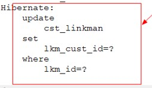

## 1. 多表关联概述

### 1.1. 表与表之间有哪些关系

- 1:1 一对一（一般情况下，只使用一个表就好）
- 1:N 一对多
- N:1 多对一
- N:N 多对多

<font color=red>**数据库本身是不支持多对多的业务。如果遇到多对多，必须拆分一个中间表！！**</font>因为数据表每个字段只能保存单个数据，不能保存集合。<font color=red>**表与表之间的关系是由需求决定！！**</font>

### 1.2. 多表关联查询的概念

所谓多表关联查询，就是**查询多个表的数据**，使用**一个实体类对象封装**起来。实现这个操作必须做两个步骤：

1. 创建一个可以存储多个表数据的实体类
2. 将查询的多个表的数据封装这个实体类的对象里面

多表关联查询实现的方案：

1. 手工关联的多表关联查询（JDBC）
2. 自动的关联多表关联查询（Hibernate）

**重要的注意事项：表与表直接的关联关系是通过外键建立的！！！**

### 1.3. 创建实体类的注意事项

在创建实体类的成员变量，建议使用包装类，因为数据库里面的字段是可以设置为 null 值，而基础数据类型是不能接受 null 值。如：`private Long id;`

## 2. 使用 Hibernate 实现自动的多表关联查询

### 2.1. 概述

Hibernate 多表关联查询，表与表的关系不需要手动写代码关联，可以通过配置实现自动关联。

<font color=red>**注意：通过 JDBC 的配置，可以知道表与表之间的关系是通过外键建立的。所以，不管之前的 JDBC 手工的代码编写，还是后面的 Hibernate 自动关联的配置，离不开的都是外键。**</font>

### 2.2. 多表关联查询配置步骤

- hibernate 外键机制：关联的双方维护外键，在一和多两边都配置外键。
- 一对多、多对一、多对多，<font color=red>配置的关键是外键</font>。

**配置步骤**：

1. 创建一个可以存储多个表数据的实体。
2. 通过配置来实现，将查询的多个表的数据封装这个实体类的对象中。
3. 从表的映射文件。注意：不要忘了在 Hibernate.cfg.xml 里面加载。

## 3. 一对多配置

在一对多中，实体类外键的成员变量一般会使用 Set 集合封装，hibernate 推荐使用 Set 集合。

### 3.1. 映射配置项

在实体类映射配置文件中对应使用 `<set>` 标签：用于指定实体类里面 Set 集合的属性。

`<set>` 标签的属性解析：

- `name`：值是实体类中表示外键的成员变量名。`name="实体类中一对多引用集合属性名"`，如，`name="linkmans"`
- `cascade`：配置支持级联操作。可选值：
    - `save-update`：表示支持保存和更新
    - `delete`：支持级联删除
    - > 注：如果需要同时支持，使用逗号隔开。如 `save-update,delete`

`<set>` 标签内的必须有的子属性标签：

- `<key>`：必须配置外键，因为表与表的关系都是通过外键关联。相关标签属性如下：
    - `column`：外键名，如 `column="lkm_cust_id"`
- `<one-to-many>`：声明表与表关联关系。注意，声明关联关系时，必须要指定集合元素的类型。相关标签属性如下：
    - `class`：外键表对应的类全名。如 `class="com.moon.entity.Linkman"`

### 3.2. 示例

```java
// 客户表和联系人表的关系是一对多，一条客户表的记录对应多条联系人表的记录
private Set<Linkman> linkmans = new HashSet<Linkman>();
public Set<Linkman> getLinkmans() {
	return linkmans;
}
public void setLinkmans(Set<Linkman> linkmans) {
	this.linkmans = linkmans;
}
```

映射配置文件：

```xml
<!-- 
	在客户映射文件中，表示所有联系人
	使用set标签表示所有联系人
	set标签中的name属性，属性值为实体类表示多个外键的集合
-->
<set name="linkmans">
	<!-- 一对多建表，有外键
		hibernate外键机制：双身维护外键，在一和多两边都配置外键
		column属性值：外键的名称
	-->
	<!-- 必须配置外键，因为表与表的关系都是通过外键关联 -->
	<key column="lkm_cust_id"></key>
	<!-- one-to-many 标签：作用声明表与表的关系 -->
	<!-- class属性是外键集合的对应类的全路径 -->
	<one-to-many class="day60.entiry.Linkman"/>
</set>
```

## 4. 多对一配置

### 4.1. 映射配置项

同一个映射配置文件里面，如果出现了两个以上相同的 column，在更新的时候和插入的时候，不知道以哪个字段的值为准。解决方案如下：

- 方式一：删除一个外键字段。
- 方式二：将一个外键字段设置为，插入和更新的时候忽略它的值 `insert="false"` 和 `update="false"`

<font color=red>**推荐使用直接注释外键属性的配置，即方式一。**</font>

#### 4.1.1. 方式一

在映射配置文件中，先将原本外键的 `<property>` 属性标签删除。在实体类映射配置文件中对应使用 `<many-to-one>` 标签：只能用于多对一的关系

`<many-to-one>` 标签中的属性解析：

- `name`：指定多对一的属性名，引用的属性名。`name="实体类中多对一引用属性名"`，如 `name="customer"`
- `column`：关联外键的字段。`column="外键名"`，如 `column="lkm_cust_id"`

使用此方式设置，如果在增加数据时，需要<font color=red>创建外键对应的对象，再设置其外键的值</font>。

#### 4.1.2. 方式二

保留原本外键的 `<property>` 属性标签。在实体类映射配置文件中对应 `<many-to-one>` 标签中，增加属性 `insert="false"` 和 `update="false"`。

### 4.2. 示例

- 创建实体类

```java
// 一个客户对应多个联系人
private Customer customer;
public Customer getCustomer() {
	return customer;
}
public void setCustomer(Customer customer) {
	this.customer = customer;
}
```

- 配置方式一：注释原本与后面设置的数据库字段c olumn

```xml
<!-- <property name="lkmCustid" column="lkm_cust_id"></property> -->
<!-- 
	配置多对一关系
	many-to-one:用于只能多对一的关系
	name：指定多对一的属性名，引用的属性名
	column：对于关联外键的字段lkm_cust_id
	-->
<many-to-one name="customer" column="lkm_cust_id"></many-to-one>
```

- 配置方式二：

```xml
<property name="lkmCustid" column="lkm_cust_id"></property>
<many-to-one name="customer" column="lkm_cust_id" insert="false" update="false"></many-to-one>
```

多对一不同配置的操作区别示例：

```java
public void save() {
	// 获取session操作对象
	Session session = HibernateUtil.getSession();
	// 开启事务
	Transaction transaction = session.beginTransaction();

	// 使用方式一新增数据：保留一个数据库外键字段列
	Linkman l = new Linkman();
	// l.setLkmName("方式一");
	// Customer c = new Customer();
	// c.setCustId(3L);
	// l.setCustomer(c);

	// 使用方式二新增数据：保留两个数据库外键字段列
	l.setLkmName("方式二");
	l.setLkmCustid(19L);
	
	// 保存数据
	session.save(l);

	// 提交事务
	transaction.commit();
	// 关闭资源
	session.close();
}
```

## 5. 多对多配置

### 5.1. 映射配置项

<font color=red>多对多通常是通过一个表找到另一个表的数据，一般有3个条件（重点）</font>

1. 中间表
2. 中间表对应本表的外键
3. 中间表对应关联表的外键

在多对多中，实体类外键的成员变量一般会使用 Set 集合封装，hibernate 推荐使用 Set 集合。

在实体类映射配置文件中对应使用`<set>`标签：用于指定实体类里面 Set 集合的属性。

`<set>` 标签的属性说明（设置中间表）：

- `name`：值是实体类中表示外键的成员变量名。`name="实体类中一对多引用集合属性名"`，如 `name="roles"`
- `table`：设置多对多关联的中间表。`table="中间表名"`，如 `table="sys_user_role"`
- `cascade`：配置支持级联操作。可选值如下：
    - `save-update`：表示支持保存和更新
    - `delete`：支持级联删除
    - > 如果需要同时支持，使用逗号隔开。如 `save-update,delete` 

`<set>` 标签内的必须有的子属性标签：

- `<key>`：必须配置本实体类对应表在中间表的外键，因为表与表的关系都是通过外键关联。相关标签属性如下：
    - `column`：外键名，如 `column="user_id"`
- `<many-to-many>`：声明表与表关联关系。注意：声明关联关系时，必须要指定集合元素的类型。相关标签属性如下：
    - `class`：外键表对应的类全名。如 `class="com.moon.entity.Role"`
    - `column`：配置关联表在中间表对应的外键。如 `column="role_id"`

### 5.2. 示例

- 修改用户实体类

```java
// 用户和角色是多对多的关系,一个用户可以有多个角色
private Set<Role> roles = new HashSet<Role>();
public Set<Role> getRoles() {
	return roles;
}
public void setRoles(Set<Role> roles) {
	this.roles = roles;
}
```

- 修改 user 配置文件

```xml
<!-- 
	多对多的关系
	1.中间表
	2.中间表对应本表的外键
	3.中间表对应关联表的外键
 -->
<set name="roles" table="sys_user_role">
<!-- 本实体类对应表在中间表的外键 -->
	<key column="user_id"></key>
	<!-- 
		声明多对多关系
		class:本类指定集合的元素对应类的类全名
		column:配置关联表在中间表对应的外键
	 -->
	<many-to-many class="day60.entity.Role" column="role_id"></many-to-many>
</set>
```

- 测试类

```java
public void get() {
	// 获取session操作对象
	Session session = HibernateUtil.getSession();
	// 查询User对象
	User user = session.get(User.class, 3L);
	// 输出查询结果
	System.out.println("用户名：" + user.getUserName());
	for (Role role : user.getRoles()) {
		System.out.println("用户的角色是：" + role.getRoleName());
	}
	// 关闭资源
	session.close();
}
```

## 6. 多表关联操作

**级联操作**：Hibernate 支持根据配置的关联关系，实现通过一个实体类的对象，可以操作多个表的数据(增删改)。具体的实现是在多表关联配置中，设置外键`<set>`标签的`cascade`的属性，配置其支持级联操作，可选值如下：

- `save-update`：表示支持保存和更新
- `delete`：支持级联删除

如果需要同时支持，则使用逗号隔开，如 `save-update,delete`

> Notes: <font color=red>**其中级联删除和级联更新都必须使用持久态对象。**</font>

### 6.1. 级联增加

在映射配置文件中，配置关联关系支持级联增加：

```xml
<set name="linkmans" cascade="save-update,delete">
```

测试代码：

```java
// 需求：通过Customer的对象插入客户信息和对应的联系人信息！
public void save() {
	// 获取session操作对象
	Session session = HibernateUtil.getSession();
	// 开启事务
	Transaction transaction = session.beginTransaction();
	// 创建客户对象
	Customer c = new Customer();
	c.setCustName("级联增加");
	// 创建联系人
	Linkman l1 = new Linkman();
	Linkman l2 = new Linkman();
	l1.setLkmName("级联增加联系人1");
	l2.setLkmName("级联增加联系人2");
	c.getLinkmans().add(l1);
	c.getLinkmans().add(l2);
	// 增加数据
	session.save(c);
	// 提交事务
	transaction.commit();
	// 关闭资源
	session.close();
}
```

<font color=red>**注意：级联增加必须外键字段设置为空。**</font>

  

因为 Hibernate 级联增加的顺序(执行顺序可以在控制台SQL语句查看)是：

1. 先插入主键表的主键。
2. 然后插入外键表的数据。
3. 最后在将主键表的主键值更新到外键键字段。
4. 如果外键不能为 null，会导致第 2 步，插入外键表的数据的时候就报错了。

所以外键字段一定要设置为 null。

### 6.2. 级联删除（不建议使用）

级联删除就是通过删除一个主键表的记录，同时也删除掉外键表关联的记录。*基于上面示例，已配置 `cascade` 属性*

```java
// 需求：通过Customer的对象删除客户信息和对应的联系人信息！
public void delete() {
	// 获取session操作对象
	Session session = HibernateUtil.getSession();
	// 开启事务
	Transaction transaction = session.beginTransaction();
	// 通过id获取持久化对象
	Customer c = session.get(Customer.class, 24L);
	// 增加数据
	session.delete(c);
	// 提交事务
	transaction.commit();
	// 关闭资源
	session.close();
}
```

### 6.3. 级联更改(不常用，一般都是直接修改表)

注：*基于上面示例，已配置 `cascade` 属性*

```java
// 需求：通过Customer的对象删除客户信息和对应的联系人信息！
public void update() {
	// 获取session操作对象
	Session session = HibernateUtil.getSession();
	// 开启事务
	Transaction transaction = session.beginTransaction();
	// 通过id获取持久化对象
	Customer c = session.get(Customer.class, 19L);
	// 获取set集合的迭代器
	Iterator<Linkman> iterator = c.getLinkmans().iterator();
	// 将迭代器指针指向下一个元素，如果有值，则更新
	if (iterator.hasNext()) {
		iterator.next().setLkmGender("妖");
	}
	// 增加数据
	session.update(c);
	// 提交事务
	transaction.commit();
	// 关闭资源
	session.close();
}
```

## 7. 延迟加载的抓取策略

<font color=red>**默认情况是多表关联查询是支持延迟抓取数据的。**</font>

创建多个表的关联关系时，只要不使用关联的表是不会查找这个表的。当使用的该表时才查询，不使用的表不查询，这种情况称为**延迟加载**。

<font color=red>**结论：如果使用了延迟加载，不管配置了多少个表的关联，只要不访问它的数据，就不会查询数据库。不会降低查询的效率！！**</font>

如果不需要延迟加载，设置`<set>`标签的属性 `lazy="false"`，无论查询单表还是多表，都多个表都一起查询。

总结：<font color=red>其实是根据连接的两个表，一起出现的一起使用概率来判断的是否使用延迟加载。</font>

- 如果两个表的数据基本都是一起使用的。那么使用非延迟加载。
- 如果两个表的数据分开使用的情况多于一起使用的情况，那么使用延迟加载。
- 如果出现，有时候使用一个单表，有时候使用两个表连接查询，此时只能通过使用的概率分析了。
- <font color=red>**延迟加载是开发完以后才配置的**</font>。

## 8. 导航查询

### 8.1. 导航查询概述

导航查询：用于持久化对象。如果表与表之间建立的关联关系，可以一级一级往下访问。

```java
/**
 * 导航查询测试
 */
public void findAllByNav() {
	// 获取session操作对象
	Session session = HibernateUtil.getSession();
	// 获取HQL操作对象
	Query query = session.createQuery("from User");
	List<User> list = query.list();
	for (User user : list) {
		System.out.println("用户名：" + user.getUserName());
		// 使用导航查询：用于持久化对象。
		// 如果表与表之间建立的关联关系，可以一级一级往下访问。
		// 出现N+1次查询问题
		for (Role role : user.getRoles()) {
			System.out.println("角色名：" + role.getRoleName());
		}
	}
	// 关闭资源
	session.close();
}
```

### 8.2. N+1 的问题的解决方案（待补充）

使用导航查询的存在问题：每一条记录都查询一次数据库。所以，如果一条数据查询一次，五十条数据就查询 了50 次数据库，就是 N+1 问题。如果要解决 N+1 的问题，需要通过 HQL 连接表查询。

值得注意的是，HQL 连接表查询必须别表与表之间的关系，使用 HQL 连接表查询是不需要关联条件的，因为关联条件在配置文件已经配置好了，但查询的数据必须要去重复！

使用的关键字：

- `fetch`：就是将数据赋予对应的对象，如果不使用经关键字，导致返回的是一个 `Object[]`。
- `distinct`：返回两个表多条的数据时，出现重复的数据。

```java
/**
 * 使用HQL查询解决N+1问题测试
 */
public void findAllByHQL() {
	// 获取session操作对象
	Session session = HibernateUtil.getSession();
	// 获取HQL操作对象
	// 注意，查询的数据必须去重复
	// [可选]fetch：就是将数据赋予对应的集合
	Query query = session.createQuery("select distinct u from User u inner join fetch u.roles");
	List<User> list = query.list();
	for (User user : list) {
		System.out.println("用户名：" + user.getUserName());
		for (Role role : user.getRoles()) {
			System.out.println("角色名：" + role.getRoleName());
		}
	}
	// 关闭资源
	session.close();
}
```

## 9. 多表关联相关注意事项

### 9.1. 配置多表关联映射文件相关注意事项

一对多和多对一，配置的的都是外键，不用配置主键。因为主键本身就有一个单独的标签 `<id>`，标签是唯一的。而外键没有单独的标签的。

1. 必须知道为什么导致字段冲突。因为出现两个属性对应一个数据库的字段（column）。
2. 必须知道如何解决字段冲突的问题。

保留一个单独的属性 `<property>`，用于插入和更新使用的外键，缺陷导致级联增加外键字段值为 null。

使用多对一的关联关系用于插入和更新的外键属性，缺陷导致每次插入数据都要 new 一个关联对象。

- 如果要保证功能的完整性，需要支持级联增加，使用多对的关系作为外键属性。
- 如果不需要级联增加，那么就可以使用一个属性单独作为外键

### 9.2. 不建议使用 List 类型做实体类封装外键

List 类型的配置也与 Set 类型的配置基本是一致，将实体类映射配置`<set>`标签改成`<list>`。

但不推荐使用 List，其原因是，List 集合必须要在数据库里面的外键表增加一个排序字段来排列数据。这样导致，插入数据和查询数据，都很麻烦。

> Notes: Hibernate 配置 list 必须要在数据库外键表指定一个排序字段，在 `<list>` 标签中增加属性标签。

```xml
<index column="sort"></index>
```

还需注意，如果排序列中出现了断号（即顺序不连续），list 集合会将断号的对应的索引号的值都设置为 null，所以遍历 list 集合时必须判断是否为空。示例如下：

```java
// 用户和角色是多对多的关系,一个用户可以有多个角色
private List<Role> roles = new ArrayList<Role>();
public List<Role> getRoles() {
    return roles;
}
public void setRoles(List<Role> roles) {
    this.roles = roles;
}
```

映射配置：

```xml
<list name="roles" table="sys_user_role">
<!-- 本实体类对应表在中间表的外键 -->
<key column="user_id"></key>
<!-- list集合必须指定哪个字段为排序字段 -->
<index column="sort"></index>
<!-- 
	声明多对多关系
	class:本类指定集合的元素对应类的类全名
	column:配置关联表在中间表对应的外键
-->
<many-to-many class="day60.entity.Role" column="role_id"></many-to-many>
```

测试：

```java
public void get() {
	// 获取session操作对象
	Session session = HibernateUtil.getSession();
	// 查询User对象
	User user = session.get(User.class, 3L);
	// 输出查询结果
	System.out.println("用户名：" + user.getUserName());
	for (Role role : user.getRoles()) {
		if (role != null) {
			System.out.println("用户的角色是：" + role.getRoleName());
		}
	}
	// 关闭资源
	session.close();
}
```

多建一列用作排序：


### 9.3. 一对多、多对一、多对多实体类重写 toString 方法

在建立实体类关系后，重写 toString 方法时，不能将同时将两个外键写到 toString 方法，否则会出现死循环互相调用。
