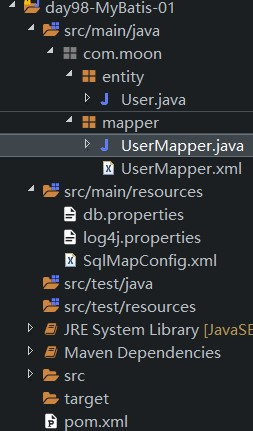
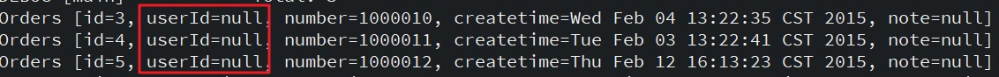
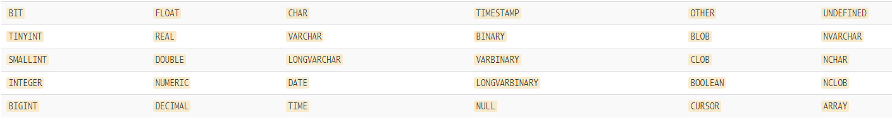
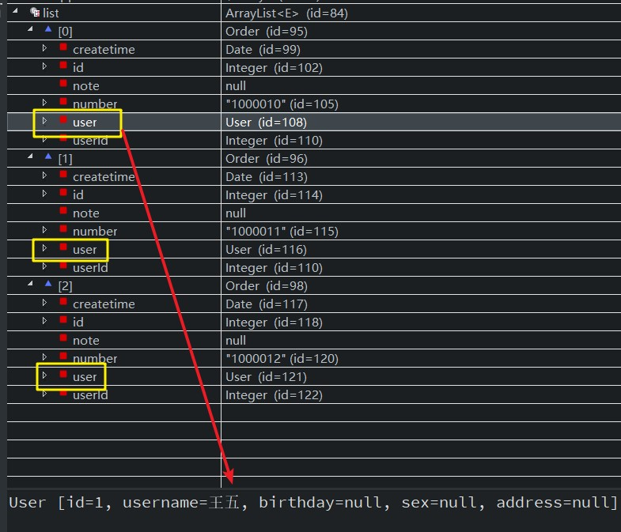
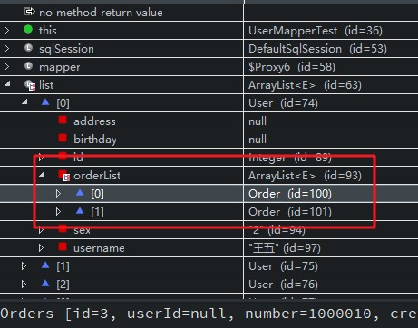
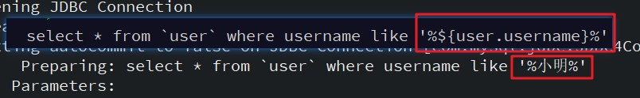
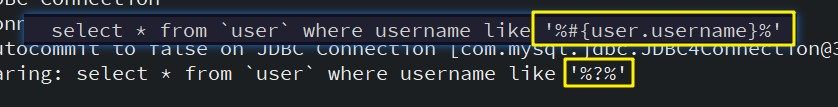
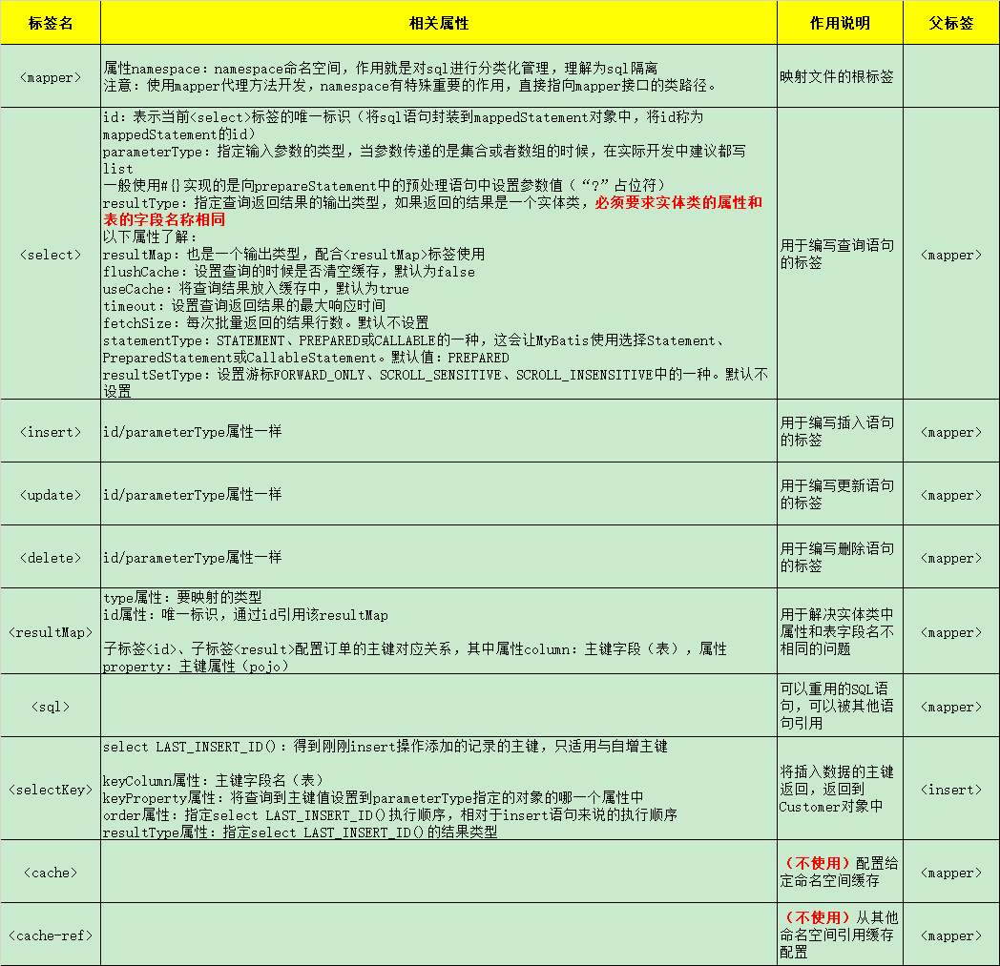

## 1. XML 映射器配置

MyBatis 的真正强大在于它的语句映射，这是它的魔力所在。由于它的异常强大，映射器的 XML 文件就显得相对简单。如果拿它跟具有相同功能的 JDBC 代码进行对比，你会立即发现省掉了将近 95% 的代码。MyBatis 致力于减少使用成本，让用户能更专注于 SQL 代码。

### 1.1. SQL 映射文件的元素

SQL 映射文件的顶级元素（以下是按照应被定义的顺序列出）：

- `<cache>` – 该命名空间的缓存配置。
- `<cache-ref>` – 引用其它命名空间的缓存配置。
- `<resultMap>` – 描述如何从数据库结果集中加载对象，是最复杂也是最强大的元素。
- ~~`<parameterMap>`~~ – 老式风格的参数映射。此元素已被废弃，并可能在将来被移除！改使用行内参数映射。
- `<sql>` – 可被其它语句引用的可重用语句块。
- `<insert>` – 映射插入语句。
- `<update>` – 映射更新语句。
- `<delete>` – 映射删除语句。
- `<select>` – 映射查询语句。

### 1.2. 映射文件编写注意问题

- 映射文件中，`<select>`标签体内的sql语句不能出现“`;`”结尾
- `namespace`属性：命名空间，作用就是对 sql 进行分类化管理，理解为 sql 隔离；<font color=red>**注意：！！使用 mapper 代理方法开发，namespace 必须和 Mapper 代理接口的全限定名称一致**</font>

## 2. select 查询映射

### 2.1. 标签作用与属性

`<select>`标签的作用是MyBatis对数据库表数据进行查询操作，用于定义sql查询映射

- `id`属性：标识映射文件中的sql，将sql语句封装到mappedStatement对象中，将id称为mappedStatement的id
- `parameterType`属性：在映射文件中通过parameterType指定输入参数的类型
- `resultType`属性：在映射文件中通过resultType指定输出结果的类型。【指定的是返回结构单条记录对应的java对象类型】

### 2.2. 查询单个结果

1. 创建实体类。实体类作为MyBatis进行sql映射使用，实体类通常与数据库表一一对应。

2. 配置映射文件查询单个结果。创建映射文件User.xml文件

```xml
<?xml version="1.0" encoding="UTF-8" ?>
<!DOCTYPE mapper
	PUBLIC "-//mybatis.org//DTD Mapper 3.0//EN"
	"http://mybatis.org/dtd/mybatis-3-mapper.dtd">
<!--
	namespace命名空间，作用就是对sql进行分类化管理，理解为sql隔离
	注意：！！使用mapper代理方法开发，namespace必须和Mapper代理接口的全限定名称一致
 -->
<mapper namespace="test">
	<!-- 在映射文件中配置多条sql语句 -->
	<!--
		通过select标签执行数据库查询
		id属性：标识映射文件中的sql
			将sql语句封装到mappedStatement对象中，将id称为mappedStatement的id
		parameterType属性：指定输入参数的类型，例子是Long类型
		resultType属性：指定sql输出结果的所映射的java对象类型
						select指定resultType表示单条记录映射成的java对象

		在sql语句中，#{}表示一个占位符号
		#{id}:其中的id表示接收输入的参数，参数名称就是“id”，
				如果输入参数是基本数据类型，#{}中的参数名可以是任意，可以是value或者其它名称
	 -->
	<select id="findUserById" parameterType="int" resultType="com.moon.entity.User">
		select * from `user` where id=#{id}
	</select>
</mapper>
```

3. 编写测试程序

```java
public class MybatisTest01 {
	// 模拟注入sql工厂对象
	private SqlSessionFactory sqlSessionFactory;
	/**
	 * 初始化SqlSessionFactory对象
	 */
	@Before
	public void init() throws IOException {
		// 定义MyBatis配置文件字符串
		String resource = "SqlMapConfig.xml";
		// 1. 使用MyBatis提供的Resources类静态方法，得到配置文件输入流
		InputStream inputStream = Resources.getResourceAsStream(resource);
		// 2. 创建会话工厂，传入MyBatis的配置文件信息
		// 它是mybatis框架的核心对象，是线程安全的，一个应用中，通常只需要一个（单例设计模式）
		sqlSessionFactory = new SqlSessionFactoryBuilder().build(inputStream);
	}
	/**
	 * 根据id查询客户信息，返回一条查询记录
	 */
	@Test
	public void findUserByIdTest() throws IOException {
		// 3. 通过工厂得到SqlSession
		SqlSession sqlSession = sqlSessionFactory.openSession();
		// 4. 通过SqlSession操作数据库
		// 第1个参数statement：映射文件中的statement的id，等于映射文件中的namespace+"."+statement的id
		// 第2个参数parameter：指定和映射文件中所匹配的parameterType类型的参数
		// sqlSession.selectOne返回结果是与映射文件中所匹配的resultType类型的对象
		User user = sqlSession.selectOne("test.findUserById", 1);
		System.out.println(user);
		// 5. 关闭sqlSession，释放资源
		sqlSession.close();
	}
}
```

### 2.3. 查询多个结果

1. 配置映射文件模糊查询多个结果。映射文件User.xml如下：

```xml
<!-- 模糊查询，可能返回多个结果
	resultType属性：表示单条记录映射成的java对象，就算返回是集合，但集合中存放还是自定义类型

	${}：表示拼接sql串，将接收到参数的内容不加任何修饰拼接在sql中
		使用${}拼接sql，会引起sql注入问题【不安全，不建议使用】
	${value}：接收输入参数的内容，如果传入类型是简单类型，${}中只能使用value
 -->
<select id="findUserByName" parameterType="java.lang.String" resultType="com.moon.entity.User">
	<!-- where username like '%小明%',说明：
		字符串拼接符：${value},处理参数
	-->
	<!-- select * from `user` where username like '%${value}%' -->
	<!-- 对应方法需要传参数为"%小明%" -->
	select * from `user` where username like #{username}
</select>
```

2. 测试程序

```java
/**
 * 根据名字查询客户信息，可能返回多条查询记录
 */
@Test
public void findUserByNameTest() throws IOException {
	// 3. 通过工厂得到SqlSession
	SqlSession sqlSession = sqlSessionFactory.openSession();
	/* 4. 通过SqlSession操作数据库
	 * sqlSession.selectList:查询多条记录，返回结果是与映射文件中所匹配的resultType类型的对象 
	 * 第1个参数statement：映射文件中的statement的id，等于映射文件中的namespace+"."+statement的id
	 * 第2个参数parameter：指定和映射文件中所匹配的parameterType类型的参数
	 */
	List<User> users = sqlSession.selectList("test.findUserByName", "%小明%");
	for (User user : users) {
		System.out.println(user);
	}
	// 5. 关闭sqlSession，释放资源
	sqlSession.close();
}
```

## 3. insert 新增映射

### 3.1. 标签作用与属性

`<insert>`标签的作用是 MyBatis 对数据库表数据进行新增操作，用于添加映射

- `parameterType`属性：在添加功能中指定输入类型是实体类
- `resultType`属性：用于指定返回值的结果类型，如：`select LAST_INSERT_ID()`

> 标签体可以定义主键的返回，详见下面的小节

### 3.2. 添加数据示例

1. 配置映射文件添加数据，映射文件 User.xml 如下：

```xml
<!-- 添加功能<insert>标签
	parameterType属性：在添加功能中指定输入类型是实体类
	#{}中指定实体的属性名，接收到实体类对象的属性值，MyBatis是通过OGNL获取对象的属性值
		！占位符，当参数传递的是entity的时候，花括号中的内容是pojo的属性
 -->
<insert id="insertUser" parameterType="com.moon.entity.User">
	<!-- 将插入数据的主键返回，返回到User对象中
		select LAST_INSERT_ID()：得到刚刚insert操作添加的记录的主键，只适用与自增主键

		keyColumn属性：主键字段名（表）
		keyProperty属性：将查询到主键值设置到parameterType指定的对象的哪一个属性中
		order属性：指定select LAST_INSERT_ID()执行顺序，相对于insert语句来说的执行顺序
			BEFORE：在insert语句执行之前；
			AFTER：在insert语句执行之后；
		resultType属性：指定select LAST_INSERT_ID()的结果类型

			oracle数据库中使用BEFORE:
	 			<selectKey keyColumn="id" keyProperty="id" resultType="int" order="BEFORE">
		 	 	 	select seq.nextVal from dual;
		 	 	</selectKey>
		 	 	insert into `user`(id,username,birthday,sex,address)
		 	 	values(#{id},#{username},#{birthday},#{sex},#{address})
	 -->
	 <selectKey keyProperty="id" order="AFTER" resultType="java.lang.Integer">
	 	select LAST_INSERT_ID()
	 </selectKey>
	insert into user(username,birthday,address) values(#{username},#{birthday},#{address})
</insert>

<!-- 定义主键的方式2
	useGeneratedKeys="true",使用数据库的主键生成策略，默认值是true
	keyColumn：主键字段（表）
	keyProperty：主键属性（pojo）
-->
<insert id="insertUser2" parameterType="com.moon.entity.User" useGeneratedKeys="true"
	keyColumn="id" keyProperty="id">
	insert into user(username,birthday,address) values(#{username},#{birthday},#{address})
</insert>
```

2. 测试程序

```java
/**
 * 添加客户数据
 */
@Test
public void insertUserTest() throws IOException {
	// 3. 通过工厂得到SqlSession
	SqlSession sqlSession = sqlSessionFactory.openSession();
	// 创建sqlSession对象，指定自动提交事务。true：提交；false：不提交。默认false
	// SqlSession sqlSession = sqlSessionFactory.openSession(true);
	// 4. 通过SqlSession操作数据库
	User user = new User();
	user.setUsername("测试一下");
	user.setAddress("123456");
	user.setBirthday(new Date());
	// 第1个参数statement：映射文件中的statement的id，等于映射文件中的namespace+"."+statement的id
	// 第2个参数parameter：指定和映射文件中所匹配的parameterType类型的参数
	// sqlSession.insert("test.insertUser", user);
	sqlSession.insert("test.insertUser2", user);
	// 5. 提交事务（默认是关闭自动提交）
	sqlSession.commit();
	System.out.println(user.getId());
	// 6. 关闭sqlSession，释放资源
	sqlSession.close();
}
```

> Tips: **数据库中的主键id是自动增长的，不需要传递，由数据库自己进行维护。需要配置获取到自动增长的主键id**。

### 3.3. 获取自动生成的(主)键值

#### 3.3.1. 通过 selectKey 获取主键

使用 `<insert>` 标签的 `<selectKey>` 子标签获取新增后的主键。涉及属性如下：

- `keyColumn` 属性：主键字段名（表）
- `keyProperty` 属性：将查询到主键值设置到`parameterType`指定的对象的哪一个属性中
- `order` 属性：指定`select LAST_INSERT_ID()`执行顺序，相对于insert语句来说的执行顺序
    - `BEFORE`：在 insert 语句执行之前；
    - `AFTER`：在 insert 语句执行之后；

示例 mysql 数据库可以使用 `select LAST_INSERT_ID()` 来得到刚刚 insert 操作添加的记录的主键。**注意：只适用于自增主键**

```xml
<selectKey keyProperty="id" order="AFTER" resultType="java.lang.Integer">
    select LAST_INSERT_ID()
 </selectKey>
```

示例 oracle 数据库中使用 `BEFORE`:

```xml
<selectKey keyColumn="id" keyProperty="id" resultType="int" order="BEFORE">
	select seq.nextVal from dual;
</selectKey>
```

#### 3.3.2. 通过 useGeneratedKeys 属性获取主键

使用 `<insert>` 标签的 `useGeneratedKeys` 相关属性获取新增后的主键。涉及属性如下：

- `useGeneratedKeys="true"`，使用数据库的主键生成策略，默认值是 true
- `keyColumn`：主键字段（表）
- `keyProperty`：主键属性（pojo）

```xml
<insert id="insertDemo" parameterType="com.moon.entity.User" useGeneratedKeys="true" keyColumn="id" keyProperty="id">
	insert into user(username,birthday,address) values(#{username},#{birthday},#{address})
</insert>
```

#### 3.3.3. 示例1：设置自增主键返回

MySQL 数据库表设置自增主键，执行 insert 提交之前自动生成一个自增主键。通过 MySQL 的 `LAST_INSERT_ID()` 函数可以获取到刚插入记录的自增主键，需要在 insert 操作之后调用此函数。

修改映射文件中添加功能的标签示例:

```xml
<insert id="insertCustomer" parameterType="com.moon.mybatis.entity.Customer">
	<!-- 将插入数据的主键返回，返回到Customer对象中
		select LAST_INSERT_ID()：得到刚刚insert操作添加的记录的主键，只适用与自增主键

		keyProperty属性：将查询到主键值设置到parameterType指定的对象的哪一个属性中
		order属性：指定select LAST_INSERT_ID()执行顺序，相对于insert语句来说的执行顺序
		resultType属性：指定select LAST_INSERT_ID()的结果类型
	 -->
	 <selectKey keyProperty="cust_id" order="AFTER" resultType="java.lang.Long">
	 	select LAST_INSERT_ID()
	 </selectKey>
	insert into cst_customer(cust_name,cust_phone) values(#{cust_name},#{cust_phone})
</insert>
```

#### 3.3.4. 示例2：非自增主键返回（使用uuid()，多数用在oracle）

使用 mysql 的`uuid()`函数生成主键，需要修改表中id字段类型为string，长度设置成35位。执行思路如下：

1. 先通过`uuid()`查询到主键，将主键输入到sql语句中。
2. 执行`uuid()`语句顺序相对于insert语句之前执行

修改映射文件中添加功能的标签示例：

```xml
<insert id="insertCustomer" parameterType="com.moon.mybatis.entity.Customer">
	<!-- 使用mysql的uuid()生成主键
		执行过程：
		1、通过uuid()得到主键，将主键设置到Customer的id属性中
		2、在insert执行时，从customer对象中取出id属性值
	 -->
	<selectKey keyProperty="cust_id" order="BEFORE" resultType="java.lang.Long">
		select uuid()
	</selectKey>
	
    <!-- ========通过oracle的序列生成主键=========== -->
    <selectKey keyProperty="cust_id" order="BEFORE" resultType="java.lang.Long">
	    select 序列名.nextval()
    </selectKey>
	insert into cst_customer(cust_name,cust_phone) values(#{cust_name},#{cust_phone})
</insert>
```

## 4. update 更新映射

### 4.1. 标签作用与属性

`<update>`标签的作用是 MyBatis 对数据库表数据进行更新操作，用于更新映射。需要传入更新的记录的id，和记录的更新信息

- `parameterType`指定实体类对象类型，包括id（主键）和更新的信息。**注意：id（主键）必须存在**

### 4.2. 更新数据示例

1. 配置映射文件更新数据。映射文件Customer.xml:

```xml
<!-- 更新功能<update>标签
	分析：
	需要传入客户的id，和客户的更新信息
	parameterType指定user对象，包括id和更新的信息，注意：id必须存在
	#{id}：从输入user对象获取id属性值
-->
<update id="updateUser" parameterType="com.moon.entity.User">
	update user set username=#{username},address=#{address} where id=#{id}
</update>
```

2. 测试程序

```java
/**
 * 更新客户数据
 */
@Test
public void updateUserTest() throws IOException {
	// 3. 通过工厂得到SqlSession(开启自动提交事务)
	SqlSession sqlSession = sqlSessionFactory.openSession(true);
	// 4. 通过SqlSession操作数据库
	// 第1个参数statement：映射文件中的statement的id，等于映射文件中的namespace+"."+statement的id
	// 第2个参数parameter：指定和映射文件中所匹配的parameterType类型的参数
	// 创建客户对象,必须设置id
	User user = new User();
	user.setId(28);
	user.setUsername("测试一下2");
	user.setAddress("654321");
	// 调用更新方法
	sqlSession.update("test.updateUser", user);
	// 6. 关闭sqlSession，释放资源
	sqlSession.close();
}
```

## 5. delete 删除映射

### 5.1. 标签作用与属性

`<delete>` 标签的作用是 MyBatis 对数据库表数据进行删除操作，用于删除映射

- `parameterType`属性：在映射文件中通过 parameterType 指定输入参数的类型

### 5.2. 删除数据示例

1. 配置映射文件删除数据。修改映射文件Customer.xml文件如下：

```xml
<!-- 删除功能<delete>标签
	根据id删除用户，需要输入ID值
 -->
<delete id="deleteUser" parameterType="int">
	delete from user where id=#{id}
</delete>
```

2. 测试程序

```java
/**
 * 删除客户数据
 */
@Test
public void deleteUserTest() throws IOException {
	// 3. 通过工厂得到SqlSession(开启自动提交事务)
	SqlSession sqlSession = sqlSessionFactory.openSession(true);
	// 4. 通过SqlSession操作数据库
	// 第1个参数statement：映射文件中的statement的id，等于映射文件中的namespace+"."+statement的id
	// 第2个参数parameter：指定和映射文件中所匹配的parameterType类型的参数
	sqlSession.delete("test.deleteUser", 30);
	// 6. 关闭sqlSession，释放资源
	sqlSession.close();
}
```

## 6. insert, update, delete 标签总结

### 6.1. 标签元素的属性清单

- `id`：在命名空间中唯一的标识符，可以被用来引用这条语句。
- `parameterType`：将会传入这条语句的参数的类全限定名或别名。这个属性是可选的，因为 MyBatis 可以通过类型处理器（TypeHandler）推断出具体传入语句的参数，默认值为未设置（`unset`）。
- `parameterMap`：用于引用外部 parameterMap 的属性，目前已被废弃。请使用行内参数映射和 parameterType 属性。
- `flushCache`：将其设置为 true 后，只要语句被调用，都会导致本地缓存和二级缓存被清空，默认值：（对 insert、update 和 delete 语句）true。
- `timeout`：这个设置是在抛出异常之前，驱动程序等待数据库返回请求结果的秒数。默认值为未设置（unset）（依赖数据库驱动）。
- `statementType`：可选 STATEMENT，PREPARED 或 CALLABLE。这会让 MyBatis 分别使用 Statement，PreparedStatement 或 CallableStatement，默认值：PREPARED。
- `useGeneratedKeys`：（仅适用于 insert 和 update）这会令 MyBatis 使用 JDBC 的 getGeneratedKeys 方法来取出由数据库内部生成的主键（比如：像 MySQL 和 SQL Server 这样的关系型数据库管理系统的自动递增字段），默认值：false。
- `keyProperty`：（仅适用于 insert 和 update）指定能够唯一识别对象的属性，MyBatis 会使用 getGeneratedKeys 的返回值或 insert 语句的 selectKey 子元素设置它的值，默认值：未设置（`unset`）。如果生成列不止一个，可以用逗号分隔多个属性名称。
- `keyColumn`：（仅适用于 insert 和 update）设置生成键值在表中的列名，在某些数据库（像 PostgreSQL）中，当主键列不是表中的第一列的时候，是必须设置的。如果生成列不止一个，可以用逗号分隔多个属性名称。
- `databaseId`：如果配置了数据库厂商标识（databaseIdProvider），MyBatis 会加载所有不带 databaseId 或匹配当前 databaseId 的语句；如果带和不带的语句都有，则不带的会被忽略。

### 6.2. selectKey 子元素的属性清单

- `keyProperty`：`selectKey` 语句结果应该被设置到的目标属性。如果生成列不止一个，可以用逗号分隔多个属性名称。
- `keyColumn`：返回结果集中生成列属性的列名。如果生成列不止一个，可以用逗号分隔多个属性名称。
- `resultType`：结果的类型。通常 MyBatis 可以推断出来，但是为了更加准确，写上也不会有什么问题。MyBatis 允许将任何简单类型用作主键的类型，包括字符串。如果生成列不止一个，则可以使用包含期望属性的 Object 或 Map。
- `order`：可以设置为 `BEFORE` 或 `AFTER`。
    - 如果设置为 `BEFORE`，那么它首先会生成主键，设置 `keyProperty` 再执行插入语句。
    - 如果设置为 `AFTER`，那么先执行插入语句，然后是 `selectKey` 中的语句（这和 Oracle 数据库的行为相似），在插入语句内部可能有嵌入索引调用。
- `statementType`：和前面一样，MyBatis 支持 `STATEMENT`，`PREPARED` 和 `CALLABLE` 类型的映射语句，分别代表 `Statement`, `PreparedStatement` 和 `CallableStatement` 类型。

## 7. sql 标签(sql片段)（通过 include 标签引用）

`<sql>` 标签的作用是，提取公共的 SQL 语句片段，再通过使用 `<include>` 标签进行引用。


## 8. MyBatis 输入输出映射准备项目测试环境

1. 创建maven项目，修改pom.xml文件，添加MyBatis、数据库等依赖，配置jdk插件
2. 准备数据库参数的配置文件db.properties；MyBatis总配置文件SqlMapConfig.xml；日志配置文件log4j.properties
3. 创建实体类
4. 使用mapper动态代理方式开发dao，准备mapper接口与Mapper.xml配置文件



## 9. ~~parameterType（输入参数映射，已被废弃）~~

> 官网：`parameterMap` – 老式风格的参数映射。此元素已被废弃，并可能在将来被移除！请使用行内参数映射。此文档中介绍是以前的使用方式。

### 9.1. java 的简单类型（四类八种）

示例：parameeterType为整形数据类型

```xml
<select id="findUserById" parameterType="int" resultType="user">
	select * from `user` where id=#{id}
</select>
```

### 9.2. pojo 类型（对象类型）

示例：parameeterType是User封装的实体类型

```xml
<!-- 添加功能<insert>标签 -->
<insert id="insertUser" parameterType="com.moon.entity.User">
     <selectKey keyProperty="id" order="AFTER" resultType="java.lang.Integer">
        select LAST_INSERT_ID()
     </selectKey>
    insert into user(username,birthday,address) values(#{username},#{birthday},#{address})
</insert>
```

### 9.3. pojo 包装类型

> - pojo包装类型：指的是在pojo中包含了其他的pojo。（即实体类的一个属性是引用其他的实体类）
> - 一般在项目中用于接收综合查询条件

- 定义包装类

```java
public class QueryVo {
	private User user;
	public User getUser() {
		return user;
	}
	public void setUser(User user) {
		this.user = user;
	}
}
```

- 在UserMapper.xml文件修改paramterType的类型是包装类型

```xml
<!-- 使用pojo包装类型，模糊查询，可能返回多个结果
	parameterType属性：使用包装类型
	resultType属性：表示单条记录映射成的java对象，就算返回是集合，但集合中存放还是自定义类型
	${value}：接收输入参数的内容，如果传入类型是简单类型，${}中只能使用value
 -->
<select id="queryUserByCondition" parameterType="queryVo" resultType="user">
	<!-- 因为输入参数是包装类，
		#{}或${}接收pojo对象值，通过OGNL读取对象中的属性值，
		如果实体类中属性是引用类型，通过属性.属性.属性...的方式获取对象属性值
	-->
	select * from `user` where username like '%${user.username}%'
</select>
```

- 修改UserMapper接口模糊查询的方法

```java
/**
 * 根据用户名模糊查询
 */
List<User> queryUserByCondition(QueryVo queryVo);
```

- 测试方法

```java
/**
 * 测试使用包装类型的进行模糊查询
 */
@Test
public void queryUserByConditionTest() {
	// 1.创建sqlSession
	SqlSession sqlSession = sqlSessionFactory.openSession();
	// 2.获取接口mapper动态代理对象
	UserMapper mapper = sqlSession.getMapper(UserMapper.class);
	// 3.调用接口方法
	// 创建包装类
	QueryVo queryVo = new QueryVo();
	// 创建用户对象
	User user = new User();
	user.setUsername("小明");
	// 将用户对象设置到包装类中
	queryVo.setUser(user);
	List<User> list = mapper.queryUserByCondition(queryVo);
	if (list != null && list.size() > 0) {
		for (User u : list) {
			System.out.println(u);
		}
	}
	// 4.关闭资源 
	sqlSession.close();
}
```

## 10. resultType（输出结果映射）

### 10.1. java的简单类型

- 需求：统计用户数量，这种情况输出映射是基本数据类型
- 定义UserMapper.xml

```xml
<!-- 需求：统计用户数量
	resultType：返回基本数据类型
 -->
<select id="countUser" resultType="int">
	select COUNT(*) from `user`
</select>
```

- UserMapper接口增加统计查询的方法

```java
int countUsers();
```

- 编写测试方法

```java
/**
 * 2.测试统计查询，返回类型是基本数据类型
 */
@Test
public void countUsersTest() {
	// 1.创建sqlSession
	SqlSession sqlSession = sqlSessionFactory.openSession();
	// 2.获取接口mapper动态代理对象
	UserMapper mapper = sqlSession.getMapper(UserMapper.class);
	// 3.调用接口方法
	int count = mapper.countUsers();
	System.out.println(count);
	// 4.关闭资源
	sqlSession.close();
}
```

### 10.2. 输出pojo（对象）类型

参考上面的demo(待整理)

## 11. resultMap（输出结果映射）

`resultMap` 元素是 MyBatis 中最重要最强大的元素。ResultMap 的设计思想是，对于简单的语句根本不需要配置显式的结果映射，而对于复杂一点的语句只需要描述它们的关系就行了

### 11.1. ResultMap 的属性列表

|     属性     |                                                         描述                                                         |
| ----------- | -------------------------------------------------------------------------------------------------------------------- |
| id          | 当前命名空间中的一个唯一标识，用于标识一个结果映射                                                                           |
| type        | 类的完全限定名，或者一个类型别名（关于内置的类型别名，可以参考上面的表格）                                                       |
| autoMapping | 如果设置这个属性，MyBatis将会为本结果映射开启或者关闭自动映射。这个属性会覆盖全局的属性 autoMappingBehavior。默认值：未设置（unset） |

> **【最佳实践】最好一步步地建立结果映射。单元测试可以在这个过程中起到很大帮助。如果尝试一次创建一个像上面示例那样的巨大的结果映射，那么很可能会出现错误而且很难去使用它来完成工作。从最简单的形态开始，逐步迭代。而且别忘了单元测试！使用框架的缺点是有时候它们看上去像黑盒子（无论源代码是否可见）。为了确保实现的行为和想要的一致，最好的选择是编写单元测试。提交 bug 的时候它也能起到很大的作用。**

### 11.2. resultMap 基础使用示例

#### 11.2.1. 使用 resultType 输出属性与表不一致时存在问题

- 实体类

```java
public class Order implements Serializable {
	private Integer id;
	private Integer userId;
	private String number;
	private Date createtime;
	private String note;
	public Integer getUserId() {
		return userId;
	}
	public void setUserId(Integer userId) {
		this.userId = userId;
	}
}
```

- 定义 OrderMapper.xml

```xml
<mapper namespace="com.moon.mapper.OrderMapper">
	<!-- 需求：查询全部订单数据
		resultType已经使用了别名
	 -->
	<select id="queryAllOrders" resultType="order">
		select * from orders
	</select>
</mapper>
```

- OrderMapper接口增加查询所有的方法

```java
List<Order> queryAllOrders();
```

- 测试

```java
public void queryAllOrdersTest() {
	// 1.创建sqlSession
	SqlSession sqlSession = sqlSessionFactory.openSession();
	// 2.获取接口mapper动态代理对象
	OrderMapper mapper = sqlSession.getMapper(OrderMapper.class);
	// 3.调用接口方法
	List<Order> list = mapper.queryAllOrders();
	if (list != null && list.size() > 0) {
		for (Order order : list) {
			System.out.println(order);
		}
	}
	// 4.关闭资源
	sqlSession.close();
}
```

- 输出结果：



> - 注：出现userId值为null的问题
>     - 原因(注意事项)：使用resultType完成输出映射，要求sql语句中的字段名称，与java对象的属性名称（与set/get方法的后面部分）要一致。
>     - 解决方法：使用返回值类型是resultMap

#### 11.2.2. 使用 resultMap 映射查询结果

在mapper配置文件中，配置resultMap标签，配置对象与表的映射关系。在`<select>`标签引用`<resultMap>`，修改OrderMapper.xml配置文件

```xml
<!-- 需求：查询全部订单数据
	使用resultMap实现
 -->
<select id="queryAllOrdersByResultMap" resultMap="orderResultMap">
	select * from orders
</select>
<!-- 配置Java对象属性与数据库表字段的对应关系
	type属性：要映射的属性类型
	id属性：唯一标识名称，通过id引用该resultMap
 -->
<resultMap type="order" id="orderResultMap">
	<!-- <id>与<result>配置订单的主键对应关系，说明：
		column：主键字段（表）
		property：主键属性（pojo）
	-->
	<id column="id" property="id"/>

	<!-- 配置订单的普通字段对应关系 -->
	<result column="user_id" property="userId"/>
	<result column="number" property="number"/>
	<result column="createtime" property="createtime"/>
	<result column="note" property="note"/>
</resultMap>
```

> 注：字段一样的属性可以不需要配置，但实际开发中建议配置，方便日后维护。

### 11.3. resultMap 标签内部标签元素

- `constructor` - 用于在实例化类时，注入结果到构造方法中
    - `idArg` - ID 参数；标记出作为 ID 的结果可以帮助提高整体性能
    - `arg` - 将被注入到构造方法的一个普通结果
- `id` – 一个 ID 结果；标记出作为 ID 的结果可以帮助提高整体性能
- `result` – 注入到字段或 JavaBean 属性的普通结果
- `association` – 一个复杂类型的关联；许多结果将包装成这种类型
    - 嵌套结果映射 – 关联本身可以是一个 resultMap 元素，或者从别处引用一个
- `collection` – 一个复杂类型的集合
    - 嵌套结果映射 – 集合本身可以是一个 resultMap 元素，或者从别处引用一个
- `discriminator` – 使用结果值来决定使用哪个 resultMap
    - `case` – 基于某些值的结果映射
    - 嵌套结果映射 – `case` 本身可以是一个 resultMap 元素，因此可以具有相同的结构和元素，或者从别处引用一个

#### 11.3.1. id 和 result 标签

```xml
<id property="id" column="post_id"/>
<result property="subject" column="post_subject"/>
```

结果映射最基本的内容。`<id>` 和 `<result>` 元素都将一个列的值映射到一个简单数据类型（String, int, double, Date 等）的属性或字段。其中 `<id>` 元素表示的结果将是对象的标识属性，这会在比较对象实例时用到。

**id 和 result 的属性**

- `property`：映射到列结果的字段或属性。如果用来匹配的 JavaBean 存在给定名字的属性，那么它将会被使用。否则 MyBatis 将会寻找给定名称的字段（找不到将报错）。
> 具体用法如：映射一些简单结构上：`username`，映射到一些复杂结构上：`address.street.number`
- `column`：数据库中的列名，或者是列的别名。一般情况下，这和传递给 `resultSet.getString(columnName)` 方法的参数一样
- `javaType`：一个 Java 类的完全限定名，或一个类型别名。如果映射到一个 JavaBean，MyBatis 通常可以推断类型；如果映射到的是 HashMap，应该明确地指定 javaType 来保证行为与期望的相一致
- `jdbcType`：JDBC 类型，所支持的 JDBC 类型参见下面的“支持的 JDBC 类型”表格。只需要在可能执行插入、更新和删除的且允许空值的列上指定 JDBC 类型。
> *注：这是 JDBC 的要求而非 MyBatis 的要求。如果直接面向 JDBC 编程，需要对可能存在空值的列指定这个类型。*
- `typeHandler`：覆盖默认的类型处理器。 这个属性值是一个类型处理器实现类的完全限定名，或者是类型别名

**支持的 JDBC 类型**

为了以后可能的使用场景，MyBatis 通过内置的 jdbcType 枚举类型支持下面的 JDBC 类型



#### 11.3.2. constructor 构造

通过构造方法进行注入。构造方法注入允许你在初始化时为类设置属性的值，而不用暴露出公有方法。

- 构造方法

```java
public class User {
    //...
    public User(Integer id, String username, int age) {
        //...
    }
    //...
}
```

- 添加绑定，为了通过名称来引用构造方法参数，你可以添加 `@Param` 注解，或者使用 '-parameters' 编译选项并启用 `useActualParamName` 选项（默认开启）来编译项目。

```xml
<!-- 3.4.3版本以前的写法，参数类型必须按顺序给出 -->
<constructor>
    <idArg column="id" javaType="int"/>
    <arg column="username" javaType="String"/>
    <arg column="age" javaType="_int"/>
</constructor>

<!-- 当你在处理一个带有多个形参的构造方法时，很容易搞乱 arg 元素的顺序。 从版本 3.4.3 开始，可以在指定参数名称的前提下，以任意顺序编写 arg 元素 -->
<constructor>
    <idArg column="id" javaType="int" name="id" />
    <arg column="age" javaType="_int" name="age" />
    <arg column="username" javaType="String" name="username" />
</constructor>
```

**constructor 相关属性**

|     属性     |                                            描述                                            |
| ----------- | ----------------------------------------------------------------------------------------- |
| column      | 数据库中的列名，或者是列的别名                                                                 |
| javaType    | 一个 Java 类的完全限定名，或一个类型别名                                                        |
| jdbcType    | JDBC 类型                                                                                  |
| typeHandler | 覆盖默认的类型处理器。 这个属性值是一个类型处理器实现类的完全限定名，或者是类型别名                     |
| select      | 用于加载复杂类型属性的映射语句的 ID，它会从 column 属性中指定的列检索数据，作为参数传递给此 select 语句 |
| resultMap   | 结果映射的 ID，可以将嵌套的结果集映射到一个合适的对象树中。它可以作为使用额外 select 语句的替代方案      |
| name        | 构造方法形参的名字。从 3.4.3 版本开始，通过指定具体的参数名，可以以任意顺序写入 arg 元素               |

#### 11.3.3. (！待整理) association 关联

> 参考：http://www.mybatis.org/mybatis-3/zh/sqlmap-xml.html#Result_Maps

```xml
<association property="author" column="blog_author_id" javaType="Author">
    <id property="id" column="author_id"/>
    <result property="username" column="author_username"/>
</association>
```

关联（association）元素处理“有一个”类型的关系。

#### 11.3.4. collection 集合

```xml
<collection property="posts" ofType="domain.blog.Post">
    <id property="id" column="post_id"/>
    <result property="subject" column="post_subject"/>
    <result property="body" column="post_body"/>
</collection>
```

- 集合元素`<collection>`和关联元素`<association>`几乎是一样的，它们相似程度高
- 如果映射的对象中有集合，使用`<collection>`标签进行映射绑定
    - `ofType` 属性是映射的对象全类名
    - 标签体内为映射的类的属性与sql字段名

1. **集合的嵌套 Select 查询**示例：将id为selectPostsForBlog的查询语句结果集映射到Blog类的posts属性中

```xml
<resultMap id="blogResult" type="Blog">
    <collection property="posts" javaType="ArrayList" column="id" ofType="Post" select="selectPostsForBlog"/>
</resultMap>

<select id="selectBlog" resultMap="blogResult">
    SELECT * FROM BLOG WHERE ID = #{id}
</select>

<select id="selectPostsForBlog" resultType="Post">
    SELECT * FROM POST WHERE BLOG_ID = #{id}
</select>
```

2. **集合的嵌套结果映射**示例：左连接查询Blog表与Post表，获取blog的数据映射到Blog类中，并该blog下的所有文章post集合映射到Blog对象中的posts集合属性中

```xml
<select id="selectBlog" resultMap="blogResult">
    select
        B.id as blog_id,
        B.title as blog_title,
        B.author_id as blog_author_id,
        P.id as post_id,
        P.subject as post_subject,
        P.body as post_body
    from Blog B
        left outer join Post P on B.id = P.blog_id
    where B.id = #{id}
</select>

<resultMap id="blogResult" type="Blog">
    <id property="id" column="blog_id" />
    <result property="title" column="blog_title"/>
    <collection property="posts" ofType="Post">
        <id property="id" column="post_id"/>
        <result property="subject" column="post_subject"/>
        <result property="body" column="post_body"/>
    </collection>
</resultMap>

<!--
    等价上面的第二种写法
-->
<resultMap id="blogResult" type="Blog">
    <id property="id" column="blog_id" />
    <result property="title" column="blog_title"/>
    <collection property="posts" ofType="Post" resultMap="blogPostResult" columnPrefix="post_"/>
</resultMap>

<resultMap id="blogPostResult" type="Post">
    <id property="id" column="id"/>
    <result property="subject" column="subject"/>
    <result property="body" column="body"/>
</resultMap>
```

3. **学成项目，课程计划树形结构映射示例**

```xml
<!-- 定义课程计划树型结构的映射关系 -->
<resultMap id="teachplanMap" type="com.xuecheng.framework.domain.course.ext.TeachplanNode">
    <id column="one_id" property="id"/>
    <result column="one_pname" property="pname"/>
    <!-- 定义二级节点集合 -->
    <collection property="children" ofType="com.xuecheng.framework.domain.course.ext.TeachplanNode">
        <id column="two_id" property="id"/>
        <result column="two_pname" property="pname"/>
        <!-- 定义三级节点集合 -->
        <collection property="children" ofType="com.xuecheng.framework.domain.course.ext.TeachplanNode">
            <id column="three_id" property="id"/>
            <result column="three_pname" property="pname"/>
        </collection>
    </collection>
</resultMap>
```

#### 11.3.5. （！待整理）discriminator 鉴别器

> 参考：http://www.mybatis.org/mybatis-3/zh/sqlmap-xml.html#Result_Maps

### 11.4. 高级结果映射示例

```xml
<!-- 非常复杂的语句 -->
<select id="selectBlogDetails" resultMap="detailedBlogResultMap">
  select
       B.id as blog_id,
       B.title as blog_title,
       B.author_id as blog_author_id,
       A.id as author_id,
       A.username as author_username,
       A.password as author_password,
       A.email as author_email,
       A.bio as author_bio,
       A.favourite_section as author_favourite_section,
       P.id as post_id,
       P.blog_id as post_blog_id,
       P.author_id as post_author_id,
       P.created_on as post_created_on,
       P.section as post_section,
       P.subject as post_subject,
       P.draft as draft,
       P.body as post_body,
       C.id as comment_id,
       C.post_id as comment_post_id,
       C.name as comment_name,
       C.comment as comment_text,
       T.id as tag_id,
       T.name as tag_name
  from Blog B
       left outer join Author A on B.author_id = A.id
       left outer join Post P on B.id = P.blog_id
       left outer join Comment C on P.id = C.post_id
       left outer join Post_Tag PT on PT.post_id = P.id
       left outer join Tag T on PT.tag_id = T.id
  where B.id = #{id}
</select>

<!-- 非常复杂的结果映射 -->
<resultMap id="detailedBlogResultMap" type="Blog">
  <constructor>
    <idArg column="blog_id" javaType="int"/>
  </constructor>
  <result property="title" column="blog_title"/>
  <association property="author" javaType="Author">
    <id property="id" column="author_id"/>
    <result property="username" column="author_username"/>
    <result property="password" column="author_password"/>
    <result property="email" column="author_email"/>
    <result property="bio" column="author_bio"/>
    <result property="favouriteSection" column="author_favourite_section"/>
  </association>
  <collection property="posts" ofType="Post">
    <id property="id" column="post_id"/>
    <result property="subject" column="post_subject"/>
    <association property="author" javaType="Author"/>
    <collection property="comments" ofType="Comment">
      <id property="id" column="comment_id"/>
    </collection>
    <collection property="tags" ofType="Tag" >
      <id property="id" column="tag_id"/>
    </collection>
    <discriminator javaType="int" column="draft">
      <case value="1" resultType="DraftPost"/>
    </discriminator>
  </collection>
</resultMap>
```

## 12. MyBatis 关联查询

- 一对一关联关系
- 一对多关联关系
- 多对多关联关系(也可以看成是两个一对多关联关系)

> 此部分主要使用了`<association>`标签和`<conllection>`标签，在上一节【resultMap（输出结果映射）】有相关的参数说明与用法

### 12.1. association 标签（一对一关联查询）

#### 12.1.1. 定义与属性

`<association>`标签，用于配置一对一关联关系专用标签，有如下属性：

- `property`属性：要映射的属性名称
- `javaType`属性：要映射的属性的类型（必须要指定）

```xml
<association property="" javaType="">
	<!-- 配置用户的主键对应关系 -->
	<id property="" column=""/>
	<!-- 配置用户普通字段对应关系 -->
	<result property="" column=""/>
</association>
```

#### 12.1.2. 使用示例

需求：查询订单数据，并且关联查询出订单所属的用户数据

- 修改Order实体类，增加User引用属性，建立Order与User一对一关系

```java
// 建立订单与用户一对一关系
private User user;
public User getUser() {
    return user;
}
public void setUser(User user) {
	this.user = user;
}

```

- 修改UserMapper.xml配置一对一关系`<association>`标签

```xml
<!--
	需求：查询订单数据，并且关联查询出所属的用户数据
		使用resultMap属性返回映射
 -->
<select id="queryOrdersAndUsers" resultMap="orderAndUserResultMap">
  select
	  o.id, o.`user_id`, o.`number`, o.`createtime`, o.`note`, u.`username`, u.`address`
	from
	  `orders` o
	left join `user` u
	on o.`user_id` = u.`id`
</select>
<!-- 
	配置订单到用户的一对一关联关系，说明：
    type：映射的类型（因为最后获取订单对象，所以写order）
    id：唯一标识名称，通过id引用该resultMap
-->
<resultMap type="order" id="orderAndUserResultMap">
 	<!-- 配置order的主键关系 -->
 	<id property="id" column="id"/>

 	<!-- 配置order普通字段对应关系 -->
 	<result property="userId" column="user_id"/>
 	<result property="number" column="number"/>
 	<result property="createtime" column="createtime"/>
 	<result property="note" column="note"/>

 	<!-- 
      association 标签：配置一对一关联关系
        property 属性：要映射的属性名称
        javaType 属性：要映射的属性类型（!必须要指定）
 	 -->
 	 <association property="user" javaType="user">
 	 	<!-- 
			配置用户主键对应关系
 	 			配置查询语句根据表的哪个字段进行关联查询
 	 	 -->
 	 	<id property="id" column="user_id"/>

 	 	<!-- 配置用户普通字段对应关系 -->
 	 	<result property="username" column="username"/>
 	 	<result property="address" column="address"/>
	</association>
</resultMap>

```

- mapper接口添加查询方法，测试多表查询（一对一）

```java
public void queryOrdersAndUsersTest() {
	// 1.创建sqlSession
	SqlSession sqlSession = sqlSessionFactory.openSession();
	// 2.获取接口mapper动态代理对象
	OrderMapper mapper = sqlSession.getMapper(OrderMapper.class);
	// 3.调用接口方法
	List<Order> list = mapper.queryOrdersAndUsers();
	if (list != null && list.size() > 0) {
		for (Order order : list) {
			System.out.println(order);
		}
	}
	// 4.关闭资源
	sqlSession.close();
}
```

- 成功查询结果，使用debug查询（因为没有重写toString）



### 12.2. conllection 标签（一对多关联查询）

#### 12.2.1. 定义与属性

`<conllection>`标签：配置一对多关联关系标签。属性如下：

- `property`：要映射的属性名称
- `javaType`：要映射的属性类型（可以指定，也可以不指定。建议指定）
- `ofType`：集合中存放的类型（**必须要指定**）

#### 12.2.2. 使用示例

需求：查询用户数据，并且关联查询出用户的所有订单数据

- 修改用户实体类，包含一对多的关系

```java
// 建立用户与订单的一对多的关联关系(在MyBatis框架建议使用list比较方便)
private List<Order> orderList;
public List<Order> getOrderList() {
	return orderList;
}
public void setOrderList(List<Order> orderList) {
	this.orderList = orderList;
}
```

- 在 UserMapper 配置文件中增加查询方法与使用 resultMap 输出映射

```xml
<!-- 需求：查询用户数据，并且关联查询出用户的所有订单数据 -->
<select id="queryUsersAndOrders" resultMap="userOrderResultMap">
	select 
	  u.`id`, u.`username`, u.`birthday`, u.`sex`, u.`address`, o.`id` oid, o.`number`, o.`createtime`
	from
	  `user` u
	left join `orders` o
	on u.`id` = o.`user_id`
</select>
<!--
	配置用户到订单的一对多关联关系
		type：要映射的类型(查询的结果是user集合)
	 	id：唯一标识名称，通过id引用该resultMap
 -->
<resultMap type="user" id="userOrderResultMap">
	<!-- 配置用户的主键字段的对应关系 -->
	<id property="id" column="id"/>
	<!-- 配置用户的其他属性与字段的对应关系 -->
	<result property="username" column="username"/>
	<result property="birthday" column="birthday"/>
	<result property="sex" column="sex"/>
	<result property="address" column="address"/>

	<!--
		配置用户一对多的关系
			collection：配置一对多关联关系
 			property：要映射的属性名称
 			javaType：要映射的属性类型（可以指定，可以不指定。建议指定）
 			ofType：集合中存放的类型（必须要指定）
	 -->
	<collection property="orderList" javaType="list" ofType="order">
		<!-- 配置订单主键与字段的对应关系（对应的查询定义的别名） -->
		<id property="id" column="oid"/>
		<!-- 配置订单其他字段的对应关系 -->
		<result property="number" column="number"/>
		<result property="createtime" column="createtime"/>
	</collection>
</resultMap>
```

- 在mapper接口添加查询所有用户和订单的方法，并测试

```java
/**
 * 7.测试多表关联查询（一对多）
 */
@Test
public void queryUsersAndOrdersTest() {
	// 1.创建sqlSession
	SqlSession sqlSession = sqlSessionFactory.openSession();
	// 2.获取接口mapper动态代理对象
	UserMapper mapper = sqlSession.getMapper(UserMapper.class);
	// 3.调用接口方法
	List<User> list = mapper.queryUsersAndOrders();
	if (list != null && list.size() > 0) {
		for (User user : list) {
			System.out.println(user);
		}
	}
	// 4.关闭资源 
	sqlSession.close();
}
```

- 查看结果数据，订单封装到用户实体类list属性集合中



## 13. 占位符 #{} 与字符串拼接符 ${}

### 13.1. #{} 占位符

`#{}`表示一个占位符号，用于预编译处理，`#{}`接收输入参数，类型可以是简单类型（八种基本类型+字符串String），pojo、hashmap。

- <font color=red>**如果接收简单类型，`#{}`中可以写成value或其它名称**</font>。
- 如果接收pojo对象值，通过OGNL读取对象中的属性值，如果实体类中属性是引用类型，通过`属性.属性.属性...`的方式获取对象属性值

### 13.2. ${} 字符串拼接符

`${}`表示一个拼接符号。`${}`接收输入参数，类型可以是简单类型，pojo、hashmap。

- 但<font color=red>如果接收简单类型，`${}`中只能写成value</font>。
- `${}`接收pojo对象值，通过OGNL读取对象中的属性值，通过`属性.属性.属性...`的方式获取对象属性值

> Notes: 通常不建议使用 `${}`，因为可能会引用 sql 注入的问题。虽然实际项目中会经过三层构架后可以将字符进行处理，但还是不建议使用。

### 13.3. 区别

占位符与字符串拼接符的重要区别是，`?`是独立时才算是占位符，不能写成`'%?%'`。如果这样操作最后的结果是没有赋值，而是`?`与其它拼接了：`'%?%'`，不再是一个占位符，会当前字符串处理





### 13.4. 应用案例 - 模糊查询like语句

1. 使用`${}`拼接，可能引起SQL注入，不推荐

```sql
select * from user where username like '%${username}%'
```

2.  使用`#{}`拼接。 注意：因为`#{…}`解析成sql语句时候，会在变量外侧自动加单引号`''`，所以这里 `%` 需要使用双引号`""`包裹，不能使用单引号`''`，不然会查不到任何结果。

```sql
select * from user where username like "%"#{username}"%"
```

3. 使用 `CONCAT` 函数拼接（推荐）

```sql
select * from user where username like CONCAT('%', #{username}, '%')
```

4. 使用 `<bind>` 标签

```xml
<select id="listUserLikeUsername" resultType="com.moon.pojo.User">
    <bind name="pattern" value="'%' + username + '%'" />
    select * from user where username like #{pattern}
</select>
```

## 14. 映射文件(Mapper.xml)主要配置总结


