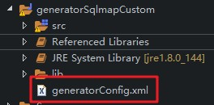
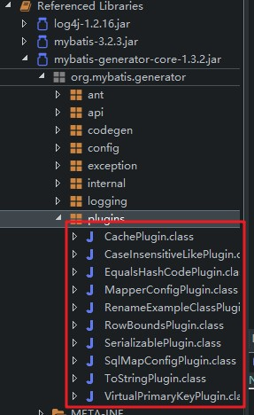
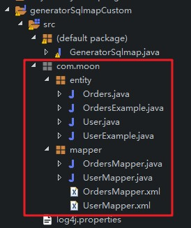
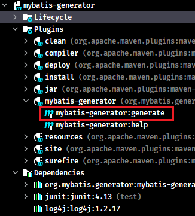
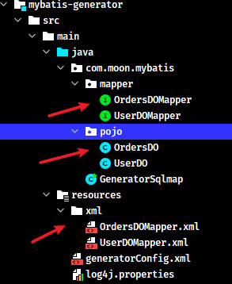

## 1. 逆向工程

根据数据库表，反向生成java代码（实体bean与mapper接口）和配置文件（mapper.xml）

> 源码项目：https://github.com/mybatis/generator
>
> 说明文档：http://mybatis.org/generator/index.html

## 2. 配置逆向工程生成代码（eclipse 版）

使用 github 上的【generatorSqlmapCustom】项目，导入到 eclipse 中

1. 修改配置文件 generatorConfig.xml



2. 可以配置的相关插件，可配置的插件名称详见 mybatis-generator-core-1.3.2.jar 下的 org.mybatis.generator.plugins



3. generatorConfig.xml 修改相关的配置，需要根据每次使用的情况进行修改

```xml
<?xml version="1.0" encoding="UTF-8"?>
<!DOCTYPE generatorConfiguration
  PUBLIC "-//mybatis.org//DTD MyBatis Generator Configuration 1.0//EN"
  "http://mybatis.org/dtd/mybatis-generator-config_1_0.dtd">

<generatorConfiguration>
	<context id="testTables" targetRuntime="MyBatis3">

		<!-- 【!需要修改】0.配置生成toString方法的插件
			其他的插件详见mybatis-generator-core-1.3.2.jar下的org.mybatis.generator.plugins
		 -->
		<plugin type="org.mybatis.generator.plugins.ToStringPlugin"></plugin>

		<commentGenerator>
			<!-- 是否去除自动生成的注释 true：是 ： false:否 -->
			<property name="suppressAllComments" value="true" />
		</commentGenerator>

		<!-- 【!需要修改】1.数据库连接的信息：驱动类、连接地址、用户名、密码 -->
		<jdbcConnection driverClass="com.mysql.jdbc.Driver"
			connectionURL="jdbc:mysql://localhost:3306/day97_mybatis" userId="root"
			password="123456">
		</jdbcConnection>

		<!-- 默认false，把JDBC DECIMAL 和 NUMERIC 类型解析为 Integer，为 true时把JDBC DECIMAL 和 
			NUMERIC 类型解析为java.math.BigDecimal -->
		<javaTypeResolver>
			<property name="forceBigDecimals" value="false" />
		</javaTypeResolver>

		<!-- 【!需要修改】2.targetPackage:生成PO类的位置 -->
		<javaModelGenerator targetPackage="com.moon.entity"
			targetProject=".\src">
			<!-- enableSubPackages:是否让schema作为包的后缀 -->
			<property name="enableSubPackages" value="false" />
			<!-- 从数据库返回的值被清理前后的空格 -->
			<property name="trimStrings" value="true" />
		</javaModelGenerator>

        <!-- 【!需要修改】3.targetPackage:mapper映射文件生成的位置 -->
		<sqlMapGenerator targetPackage="com.moon.mapper" 
			targetProject=".\src">
			<!-- enableSubPackages:是否让schema作为包的后缀 -->
			<property name="enableSubPackages" value="false" />
		</sqlMapGenerator>

		<!-- 【!需要修改】4.targetPackage：mapper接口生成的位置 -->
		<javaClientGenerator type="XMLMAPPER"
			targetPackage="com.moon.mapper" 
			targetProject=".\src">
			<!-- enableSubPackages:是否让schema作为包的后缀 -->
			<property name="enableSubPackages" value="false" />
		</javaClientGenerator>

		<!-- 【!需要修改】5. 指定数据库表 -->
		<table schema="" tableName="user"></table>
		<table schema="" tableName="orders"></table>

	</context>
</generatorConfiguration>
```

4. 配置完成后，执行 GeneratorSqlmap.java 主方法，生成需要的 pojo、mapper 接口和 mapper 映射文件，拷贝到实际项目中直接使用



## 3. 配置逆向工程操作（IDEA 版）

1. 在pom.xml配置插件依赖，并指定生成规则的配置文件位置

```xml
<build>
    <plugins>
        <plugin>
            <groupId>org.mybatis.generator</groupId>
            <artifactId>mybatis-generator-maven-plugin</artifactId>
            <version>${mybatis.generator.version}</version>
            <configuration>
                <!--配置文件的位置-->
                <configurationFile>src/main/resources/generatorConfig.xml</configurationFile>
                <verbose>true</verbose>
                <overwrite>true</overwrite>
            </configuration>
            <executions>
                <execution>
                    <id>Generate MyBatis Artifacts</id>
                    <goals>
                        <goal>generate</goal>
                    </goals>
                </execution>
            </executions>
        </plugin>
    </plugins>
</build>
```

2. 使用配置`generatorConfig.xml`配置文件内容，注意要指定数据库驱动包位置

```xml
<?xml version="1.0" encoding="UTF-8"?>
<!DOCTYPE generatorConfiguration
        PUBLIC "-//mybatis.org//DTD MyBatis Generator Configuration 1.0//EN"
        "http://mybatis.org/dtd/mybatis-generator-config_1_0.dtd">

<generatorConfiguration>
    <!-- 配置数据库驱动包位置 -->
    <classPathEntry
            location="D:\development\maven\repository\mysql\mysql-connector-java\5.1.25\mysql-connector-java-5.1.25.jar"/>

    <context id="Mysql" targetRuntime="MyBatis3" defaultModelType="flat">
        <property name="autoDelimitKeywords" value="true"/>
        <property name="beginningDelimiter" value="`"/>
        <property name="endingDelimiter" value="`"/>

        <!-- 【!需要修改】0.配置生成toString()方法的插件
            其他的插件详见mybatis-generator-core-1.3.2.jar下的org.mybatis.generator.plugins
	    解决每次都会生成的重复的xml 代码文件
         -->
        <plugin type="org.mybatis.generator.plugins.ToStringPlugin"/>

        <!-- 不生成注释 -->
        <commentGenerator>
            <!-- 是否去除自动生成的注释 true：是 ： false:否 -->
            <property name="suppressAllComments" value="true"/>
        </commentGenerator>

        <!-- 【!需要修改】1.数据库连接的信息：驱动类、连接地址、用户名、密码 -->
        <jdbcConnection driverClass="com.mysql.jdbc.Driver"
                        connectionURL="jdbc:mysql://192.168.12.132:3306/mybatis_sample_db"
                        userId="root"
                        password="123456">
        </jdbcConnection>

        <!-- 默认false，把JDBC DECIMAL 和 NUMERIC 类型解析为 Integer，为 true时把JDBC DECIMAL 和
            NUMERIC 类型解析为java.math.BigDecimal -->
        <javaTypeResolver>
            <property name="forceBigDecimals" value="false"/>
        </javaTypeResolver>

        <!-- 【!需要修改】2.targetPackage:生成PO类的位置 -->
        <javaModelGenerator targetPackage="com.moon.mybatis.pojo"
                            targetProject=".\src\main\java">
            <!-- enableSubPackages:是否让schema作为包的后缀 -->
            <property name="enableSubPackages" value="false"/>
            <!-- 从数据库返回的值被清理前后的空格 -->
            <property name="trimStrings" value="true"/>
        </javaModelGenerator>

        <!-- 【!需要修改】3.targetPackage:mapper的xml映射文件生成的位置 -->
        <sqlMapGenerator targetPackage="xml"
                         targetProject=".\src\main\resources">
            <!-- enableSubPackages:是否让schema作为包的后缀 -->
            <property name="enableSubPackages" value="false"/>
        </sqlMapGenerator>

        <!-- 【!需要修改】4.targetPackage：mapper接口生成的位置 -->
        <javaClientGenerator type="XMLMAPPER"
                             targetPackage="com.moon.mybatis.mapper"
                             targetProject=".\src\main\java">
            <!-- enableSubPackages:是否让schema作为包的后缀 -->
            <property name="enableSubPackages" value="false"/>
        </javaClientGenerator>

        <!-- 【!需要修改】5. 指定待生成的数据库表
            tableName: 表名
            domainObjectName: 表相应的实体类名称
        -->
        <table schema="" tableName="orders" domainObjectName="OrdersDO"
               enableCountByExample="false" enableUpdateByExample="false"
               enableDeleteByExample="false" enableSelectByExample="false"
               selectByExampleQueryId="false"/>
        <table schema="" tableName="user" domainObjectName="UserDO"
               enableCountByExample="false" enableUpdateByExample="false"
               enableDeleteByExample="false" enableSelectByExample="false"
               selectByExampleQueryId="false"/>
    </context>
</generatorConfiguration>
```

3. 双击maven面板相应项目中的【mybatis-generator】->【mybatis-generator:generator】

  

## 4. 关于逆向生成的代码说明

### 4.1. 注意事项

1. 逆向工程生成的是对应 mapper 代理开发的方法
2. 逆向工程生成的都是单表的 CRUD 操作
3. 逆向工程生成的文件，在企业项目中直接使用即可，不推荐进行修改（如果不能满足业务需求，直接再新增一套mapper接口和映射文件即可）
4. 如果执行逆向工程再次生成代码，**需要将上一次生成的文件删除，再执行重新生成**（因为再次生成的代码是在原来的代码基础上增加进行。）

### 4.2. 源代码跳转流程

逆向工程中主要使用到 `Crateria` 对象，它是提供了一种完全面向对象的查询方式，它的本意就是在java代码中不使用sql语句，而是直接通过调用方法设置条件。比如： `add(Criterion criterion)`。内部使用 `Criterion` 对象，即 sql 条件。比如：AND（并且）、OR（或者）、eq（等于）、gt（大于）、ge（大于等于）等操作

> Notes: 用一句话理解，使用 java 代码调用方法设置条件，最终执行数据库操作时转换成 where 条件。等于完全面向对象

```java
// 测试根据用户名称模糊查询用户
@Test
public void queryUserByNameTest(){
	// 1.加载spring配置文件
	ClassPathXmlApplicationContext context = new ClassPathXmlApplicationContext("classpath:spring/applicationContext.xml");
	
	// 2.从上下文对象context获取mapper代理对象
	UserMapper mapper = (UserMapper) context.getBean("userMapper");
	
	// 3.使用mapper代理对象，调用方法执行
	// 3.1.创建辅助类对象
	UserExample example = new UserExample();
	
	// 3.2.使用UserExample对象，创建Criteria
	Criteria cri = example.createCriteria();
	
	// 3.3.使用Criteria对象，调用andXXX方法设置where条件
	cri.andUsernameLike("%小明%");
	
	List<User> list = mapper.selectByExample(example);
	for(User u:list){
		System.out.println(u);
	}
}

public Criteria andUsernameLike(String value) {
    addCriterion("username like", value, "username");
    return (Criteria) this;
}

protected void addCriterion(String condition, Object value, String property) {
    if (value == null) {
        throw new RuntimeException("Value for " + property + " cannot be null");
    }
    criteria.add(new Criterion(condition, value));
}

 protected Criterion(String condition, Object value) {
    this(condition, value, null);
}

protected Criterion(String condition, Object value, String typeHandler) {
    super();
    this.condition = condition; // 查询条件，比如username like 
    this.value = value; // '%小明%'。最后拼装在一起的条件就是：where username like '%小明%'
    this.typeHandler = typeHandler;
    if (value instanceof List<?>) {
        this.listValue = true;
    } else {
        this.singleValue = true;
    }
}
```

拼接 sql 的

```xml
<sql id="Example_Where_Clause" >
    <where >
        <foreach collection="oredCriteria" item="criteria" separator="or" >
        <if test="criteria.valid" >
            <trim prefix="(" suffix=")" prefixOverrides="and" >
            <foreach collection="criteria.criteria" item="criterion" >
                <choose >
                <when test="criterion.noValue" >
                    and ${criterion.condition}
                </when>
                <when test="criterion.singleValue" >
                    and ${criterion.condition} #{criterion.value}
                </when>
                <when test="criterion.betweenValue" >
                    and ${criterion.condition} #{criterion.value} and #{criterion.secondValue}
                </when>
                <when test="criterion.listValue" >
                    and ${criterion.condition}
                    <foreach collection="criterion.value" item="listItem" open="(" close=")" separator="," >
                        #{listItem}
                    </foreach>
                </when>
                </choose>
            </foreach>
            </trim>
        </if>
        </foreach>
    </where>
</sql>
```