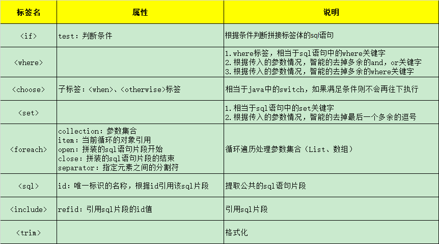
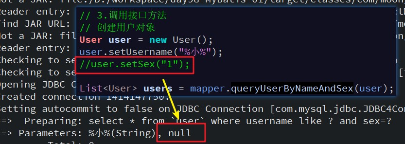
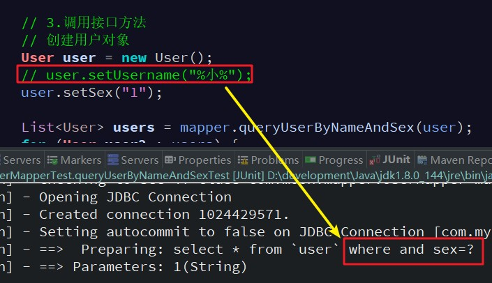

## 1. 动态 SQL 主要标签

MyBatis 中用于实现动态 SQL 的元素，主要存放在`<select>`标签中



为什么要使用动态SQL标签？因为在多条件查询下，MyBatis框架，当参数不传递，它会默认设置一个null值，导致查询不到数据。所以**多条件查询使用到动态sql标签**

```xml
<select id="queryUserByNameAndSex" parameterType="user" resultType="user">
	select * from `user` where username like #{username} and sex=#{sex}
</select>
```



## 2. if 标签

作用：根据判断条件是否拼接标签体内的内容

`<select>`标签中使用`<if>`标签示例：

```xml
<select id="queryUserByNameAndSex" parameterType="user" resultType="user">
	select * from `user`
	where
	<!-- if标签：判断用户名称不为空，并且不为空字符串，才作为查询的条件 -->
	<if test="username != null and username != ''">
		username like #{username}
	</if>
	<!-- if标签：判断性别不为空，并且不为空字符串，才作为查询的条件 -->
	<if test="sex != null and sex != ''">
		 and sex=#{sex}
	</if>
</select>
```

结果：但如果没有and的语句判断为空，执行后面带and的语句，会报错



## 3. where 标签

为了解决`<if>`标签判断后会出现错误拼接sql语句，使用`<where>`标签，将SQL语句中where替换成`<where>`标签。其作用如下：

1. `<where>`标签，相当于sql语句中的`where`关键字
2. 根据传入的参数情况，智能的去掉多余的`and`，`or`关键字
3. 根据传入的参数情况，智能的去掉多余的`where`关键字

示例：

```xml
<select id="queryUserByNameAndSex" parameterType="user" resultType="user">
	select * from `user`
	<where>
		<!-- if标签：判断用户名称不为空，并且不为空字符串，才作为查询的条件 -->
		<if test="username != null and username != ''">
			username like #{username}
		</if>
		<!-- if标签：判断性别不为空，并且不为空字符串，才作为查询的条件 -->
		<if test="sex != null and sex != ''">
			 and sex=#{sex}
		</if>
	</where>
</select>
```

## 4. set 标签

标签作用：

1. `<set>`标签，相当于sql语句中的`set`关键字
2. 根据传入的参数情况，智能的去掉最后一个多余的逗号

示例，动态修改用户数据：

```xml
<!-- 需求：动态修改用户数据 -->
<update id="dynamicUpdateUser" parameterType="user">
	<!-- 原sql语句：update `user` set username='傷月',sex='2' where id='32'; -->
	update `user`
	<set>
		<if test="username != null and username != ''">
			username=#{username},
		</if>
		<if test="sex != null and sex != ''">
			sex=#{sex},
		</if>
	</set>
	<where>
		<if test="id != null and id != ''">
			id=#{id}
		</if>
	</where>
</update>
```

## 5. foreach 标签

`<foreach>` 标签作用是，循环遍历处理参数集合（List、数组）。主要的属性如下：

- `collection`：参数集合（必须指定），但是在不同情况下，该属性的值是不一样的，主要有一下3种情况：
    - 如果传入的是单参数且参数类型是一个 List 集合，`collection` 属性值为 `list`
    - 如果传入的是单参数且参数类型是一个 array 数组，`collection` 的属性值为 `array`
    - 如果传入的是一个Map或者实体类，此时 `collection` 属性值是需要遍历的集合或数组所对应 Map 的 key 值或者实体类的属性名称
- `item`：表示集合中每一个元素进行迭代时的别名，随便起的变量名；
- `index`：指定一个名字，用于表示在迭代过程中，每次迭代到的位置，不常用；
- `open`：表示该语句以什么开始，常用“`(`”；
- `separator`：表示在每次进行迭代之间以什么符号作为分隔符，常用“`,`”；
- `close`：表示该语句以什么结束，常用“`)`”。

### 5.1. 示例1：批量新增用户

- 批量新增用户的sql语句

```sql
insert into `user` (username, birthday, sex, address)
values
  ('灵魂守卫','2018-3-2','1','dota2'),
  ('幽鬼','2018-3-3','2','dota2');
```

- UserMapper.xml配置foreach标签

```xml
<!-- 需求：批量新增用户 -->
<insert id="batchInsertUsers" parameterType="list">
	insert into `user` (username, birthday, sex, address)
	values
	<!-- 使用foreach标签
		collection:参数集合，这里是list
		item:当前循环的对象引用
		separator:指定分割符(批量插入多个数据sql的分割符)
	 -->
	<foreach collection="list" item="user" separator=",">
		(#{user.username},#{user.birthday},#{user.sex},#{user.address})
	</foreach>
</insert>
```

- mapper接口新增方法

```java
void batchInsertUsers(List<User> list);
```

- 测试方法

```java
public void batchInsertUsersTest() {
	// 1.创建sqlSession（设置自动提交事务）
	SqlSession sqlSession = sqlSessionFactory.openSession(true);
	// 2.获取接口mapper动态代理对象
	UserMapper mapper = sqlSession.getMapper(UserMapper.class);
	// 3.调用接口方法
	// 创建集合存放用户对象
	List<User> list = new ArrayList<User>();
	for (int i = 0; i < 3; i++) {
		User user = new User();
		user.setUsername("敌法师" + i);
		user.setSex("1");
		user.setBirthday(new Date());
		user.setAddress("dota2");
		list.add(user);
	}
	mapper.batchInsertUsers(list);
	// 4.关闭资源
	sqlSession.close();
}
```

### 5.2. 示例2：批量删除用户

- 批量删除用户的sql语句

```sql
delete from `user` where id in(35,36,37);
```

- UserMapper.xml配置foreach标签

```xml
<!-- 需求：批量删除用户的sql语句 -->
<delete id="batchDeleteUsers" parameterType="list">
	delete from `user` <!-- id in(35,36,37) -->
	<where>
		<!-- foreach标签：循环处理参数集合
			collection：参数集合，这里是数组array
 	 		open：拼装的sql语句片段开始
 	 		close：拼装的sql语句片段的结束
 	 		item：当前遍历的元素
 	 		separator：指定元素之间的分割符
		 -->
		<foreach collection="array" item="id" separator="," open="id in(" close=")">
			#{id}
		</foreach>
	</where>
</delete>
```

- 接口添加批量删除方法

```java
void batchDeleteUsers(Integer[] ids);
```

- 测试方法

```java
public void batchDeleteUsersTest() {
	// 1.创建sqlSession（设置自动提交事务）
	SqlSession sqlSession = sqlSessionFactory.openSession(true);
	// 2.获取接口mapper动态代理对象
	UserMapper mapper = sqlSession.getMapper(UserMapper.class);
	// 3.调用接口方法
	// 创建id数组
	Integer[] ids = { 38, 39, 40 };
	mapper.batchDeleteUsers(ids);
	// 4.关闭资源
	sqlSession.close();
}
```

<font color=purple>*批量删除时需要注意：在foreach标签中，collection的取值只能是array，如果是“list”会报错*</font>

## 6. choose、when、otherwise 标签

`choose` 元素，它有点像 Java 中的 `switch` 语句

提供了“title”就按“title”查找，提供了“author”就按“author”查找的情形，若两者都没有提供，就返回所有符合条件的 BLOG（实际情况可能是由管理员按一定策略选出 BLOG 列表，而不是返回大量无意义的随机结果）。示例如下：

```xml
<select id="findActiveBlogLike" resultType="Blog">
	SELECT * FROM BLOG WHERE state = ‘ACTIVE’
	<choose>
		<when test="title != null">
			AND title like #{title}
		</when>
		<when test="author != null and author.name != null">
			AND author_name like #{author.name}
		</when>
		<otherwise>
			AND featured = 1
		</otherwise>
	</choose>
</select>
```

## 7. trim 标签

`<trim>`标签是一个格式化的标记，可以完成`<set>`或者是`<where>`标签的功能，示例代码如下：

Code Demo1:

```xml
<select id="" resultType="" parameterType="">
	select * from user
	<trim prefix="WHERE" prefixoverride="AND |OR">
		<if test="name != null and name.length()>0"> AND name=#{name}</if>
		<if test="gender != null and gender.length()>0"> AND gender=#{gender}</if>
	</trim>
</select>
```

假如说name和gender的值都不为null的话打印的SQL为：`select * from user where name = 'xx' and gender = 'xx'`

在“name”前不存在第一个and的，上面两个属性的意思如下：

- `prefix`：前缀
- `prefixoverride`：去掉第一个`and`或者`or`

Code Demo2:

```xml
<update id="" parameterType="">
	update user
	<trim prefix="set" suffixoverride="," suffix=" where id = #{id} ">
		<if test="name != null and name.length()>0"> name=#{name}, </if>
		<if test="gender != null and gender.length()>0"> gender=#{gender}, </if>
	</trim>
</update>
```

假如说name和gender的值都不为null的话打印的SQL为：`update user set name='xx' , gender='xx' where id='x'`

在最后的不存在逗号，而且自动加了一个set前缀和where后缀，上面三个属性的意义如下，其中prefix意义如上：

- `suffixoverride`：去掉最后一个逗号（也可以是其他的标记，就像是上面前缀中的and一样）
- `suffix`：后缀
