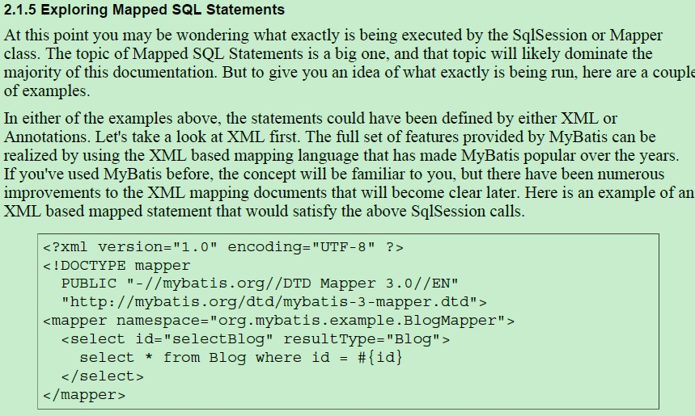

## 1. MyBatis 框架概述

### 1.1. 原生 JDBC 存在问题

1. 数据库连接，使用时就创建，不使用立即释放。对数据库进行频繁连接开启和关闭，造成数据库资源浪费，影响数据库性能

> 解决方案：使用数据库连接池管理数据库连接。MyBatis内部自带连接池

2. 将sql语句硬编码到java代码中，在企业项目中，sql语句变化的需求比较大。如果sql语句修改，需要重新编译java代码，不利于系统维护

> 解决方案：将sql语句配置在xml配置文件中，即使sql语句变化，不需要对java代码进行重新编译

3. 向preparedStatement中设置参数，对占位符位置和设置参数值，硬编码在java代码中，不利于系统维护

> 解决方案：将sql语句及占位符和参数全部配置在xml配置文件中

4. 从resultSet中遍历结果集数据时，存在硬编码，将获取表的字段进行硬编码，不利于系统维护。如果可以映射成java对象会比较方便

> 解决方案：将查询的结果集，自动映射成java对象

### 1.2. MyBatis 简介

MyBatis是一个持久层的框架，本是 apache 的一个开源项目 iBatis，2010 年这个项目由 apache software foundation 迁移到了google code，并且改名为 MyBatis。2013年11月迁移到Github

MyBatis 让程序将主要精力放在 sql 上，通过 MyBatis 提供的映射方式，自由灵活生成(半自动化)满足需要的sql语句。还可以将向 `preparedStatement` 中的输入参数自动进行输入映射，将查询结果集映射成j ava 对象(输出映射)

> - Mybatis 源码仓库：https://github.com/mybatis/mybatis-3/releases
> - Mybatis 中文文档：https://mybatis.org/mybatis-3/zh/index.html

### 1.3. 使用 MyBatis 解决 JDBC 编程的问题

1. 数据库连接创建、释放频繁造成系统资源浪费从而影响系统性能，如果使用数据库连接池可解决此问题。

> MyBatis解决方案：在SqlMapConfig.xml中配置数据连接池，使用连接池管理数据库链接。

2. Sql语句写在代码中造成代码不易维护，实际应用sql变化的可能较大，sql变动需要改变java代码。

> MyBatis解决方案：将Sql语句配置在XXXXmapper.xml文件中与java代码分离。

3. 向sql语句传参数麻烦，因为sql语句的where条件不一定，可能多也可能少，占位符需要和参数一一对应。

> MyBatis解决方案：Mybatis自动将java对象映射至sql语句，通过statement中的parameterType定义输入参数的类型。

4. 对结果集解析麻烦，sql变化导致解析代码变化，且解析前需要遍历，如果能将数据库记录封装成pojo对象解析比较方便。

> MyBatis解决方案：Mybatis自动将sql执行结果映射至java对象，通过statement中的resultType定义输出结果的类型。

## 2. MyBatis 基础使用

### 2.1. MyBatis 目录结构


> 注：在搭建MyBatis环境时，记得加入MySQL/Oracle的驱动包

### 2.2. MyBatis 基础使用步骤

#### 2.2.1. log4j.properties

log4j.properties文件的内容在MyBatis帮助文档可以查询


log4j.properties示例：

```properties
# Global logging configuration
log4j.rootLogger=debug, stdout
# MyBatis logging configuration...
log4j.logger.org.mybatis.example.BlogMapper=TRACE
# Console output...
log4j.appender.stdout=org.apache.log4j.ConsoleAppender
log4j.appender.stdout.layout=org.apache.log4j.PatternLayout
log4j.appender.stdout.layout.ConversionPattern=%5p [%t] - %m%n
```

#### 2.2.2. 搭建MyBatis开发环境


- SqlMapConfig.xml是MyBatis全局配置文件
- sqlmap包是存放mapper.xml映射配置文件

#### 2.2.3. 引入 MyBatis 依赖

配置 pom.xml 文件

```xml
<!-- mybatis核心包 -->
<dependency>
	<groupId>org.mybatis</groupId>
	<artifactId>mybatis</artifactId>
	<version>${mybatis.version}</version>
</dependency>
```

> 注：在搭建MyBatis环境时，记得加入MySQL/Oracle的驱动包依赖

#### 2.2.4. SqlMapConfig.xml（MyBatis全局配置文件）

配置 mybatis 的运行环境，数据源、事务等。了解即可，因为在整合 Spring 的时候，这个配置文件的标签都不用了

> <font color=red>注：mybatis 框架需要加载 Mapper.xml 映射文件</font>

SqlMapConfig.xml 示例：

```xml
<?xml version="1.0" encoding="UTF-8" ?>
<!DOCTYPE configuration
	PUBLIC "-//mybatis.org//DTD Config 3.0//EN"
	"http://mybatis.org/dtd/mybatis-3-config.dtd">
<configuration>
	<!-- 和Spring整合后environments标签配置将废除 -->
	<!-- 运行环境配置 -->
	<!-- default属性：指定默认使用哪一个运行环境 -->
	<environments default="development">
		<!-- 配置运行环境，说明：
			id属性：给运行环境取一个唯一的名称
		 -->
		<environment id="development">
			<!-- 使用jdbc事务管理，事务控制由MyBatis管理 -->
			<transactionManager type="JDBC" />
			<!-- 数据库连接池，由MyBatis管理
				type：指定mybatis内部提供的连接池
			 -->
			<dataSource type="POOLED">
				<property name="driver" value="com.mysql.jdbc.Driver" />
				<property name="url" value="jdbc:mysql://localhost:3306/day97_mybatis" />
				<property name="username" value="root" />
				<property name="password" value="123456" />
			</dataSource>
		</environment>
	</environments>
	<!-- 加载映射文件 -->
	<mappers>
		<!-- resource属性：加载的映射文件路径 -->
		<mapper resource="sqlmap/User.xml" />
	</mappers>
</configuration>
```

全局配置文件模版在参考文档可以查询


#### 2.2.5. 映射文件(XxxMapper.xml)

**映射文件命名格式**：

- User.xml（原始ibatis命名方式）
- <font color=red>**mapper代理开发映射文件名称格式：XxxMapper.xml**</font>，如：UserMapper.xml、ItemsMapper.xml。**在映射文件中配置sql语句**

映射配置文件模版在参考文档可以查询



映射配置文件初始模版：（*可以在IDE里设置文件模版，快速生成*）

```xml
<?xml version="1.0" encoding="UTF-8" ?>
<!DOCTYPE mapper
	PUBLIC "-//mybatis.org//DTD Mapper 3.0//EN"
	"http://mybatis.org/dtd/mybatis-3-mapper.dtd">
<mapper>
	......
</mapper>
```

### 2.3. 快速入门程序开发步骤总结

1. 创建SqlSessionFactoryBuilder对象
2. 加载SqlMapConfig.xml配置文件
3. 创建SqlSessionFactory对象
4. 创建SqlSession对象
5. 执行SqlSession对象执行查询，获取结果
6. 释放资源

## 3. MyBatis 架构

### 3.1. MyBatis 执行流程图


1. SqlSessionFactoryBuilder：读取配置文件内容（包含如下）。返回框架的核心对象 SqlSessionFactory
    - 加载 MyBatis 的全局配置文件（名称不固定的，如：`SqlMapConfig.xml`）：配置了数据源、事务等 MyBatis 运行环境
    - 加载 配置映射文件（配置sql语句），如：`mapper1.xml（映射文件）、mapper2.xml、mapperN.xml.....`，相当于每个实体类与数据库映射
2. SqlSessionFactory（会话工厂），根据配置文件创建。一旦被创建就应该在应用的运行期间一直存在，是单例。其作用是：创建 SqlSession
3. SqlSession（会话），是一个接口，面向用户（程序员）的接口。由会话工厂 SqlSessionFactory 创建，每个线程都有它自己的 SqlSession 实例。其作用是：该对象中包含了执行 SQL 语句的所有方法。发送 SQL 操作数据库（增、删、改、查）
4. Executor（执行器），是一个接口（基本执行器、缓存执行器）。其作用是：根据 SqlSession 传递的参数动态地生成需要执行的 SQL 语句来操作数据库，同时负责查询缓存的维护。
5. MappedStatement（底层封装对象，输入输出映射对象，ParameterType 参数输入，ResultType）：在 Executor 接口的执行方法中有一个 MappedStatement 类型的参数，该参数是对操作数据库映射信息的封装，用于存储要映射的 SQL 语句的 id、输入参数、输出结果类型等信息。
    - 输入参数映射：输入参数类型可以是 java 基本数据类型、Map、List 等集合类型、自定义 POJO 类等。输入参数映射过程类似于 JDBC 对 `PreparedStatement` 对象设置参数的过程
    - 输出结果映射：输出结果类型可以是 java 基本数据类型、Map、List 等集合类型、自定义 POJO 类等。输出结果映射过程类似于 JDBC 对结果集的解析过程
6. 操作数据库

### 3.2. MyBatis 的框架设计


### 3.3. MyBatis 的主要构件及其相互关系

从 MyBatis 代码实现的角度来看，MyBatis 的主要的核心部件有以下几个：

- SqlSession：作为 MyBatis 工作的主要顶层API，表示和数据库交互的会话，完成必要数据库增删改查功能
- Executor：MyBatis 执行器，是 MyBatis 调度的核心，负责SQL语句的生成和查询缓存的维护
- StatementHandler：封装了JDBC Statement操作，负责对JDBC statement 的操作，如设置参数、将Statement结果集转换成List集合。
- ParameterHandler：负责对用户传递的参数转换成JDBC Statement 所需要的参数，
- ResultSetHandler：负责将JDBC返回的ResultSet结果集对象转换成List类型的集合；
- TypeHandler：负责java数据类型和jdbc数据类型之间的映射和转换
- MappedStatement：MappedStatement维护了一条`<select|update|delete|insert>`节点的封装
- SqlSource：负责根据用户传递的parameterObject，动态地生成SQL语句，将信息封装到BoundSql对象中，并返回
- BoundSql：表示动态生成的SQL语句以及相应的参数信息
- Configuration：MyBatis所有的配置信息都维持在Configuration对象之中。


## 4. MyBatis开发数据层

### 4.1. MyBatis 开发数据层两种方式

使用 MyBatis 开发 Dao，通常有两种方式：

1. 原始 Dao 开发：需要开发接口和实现类
2. Mapper 动态代理开发：只需要开发接口

> 企业项目开发，推荐 mapper 代理方式

### 4.2. MyBaties 原始 dao 开发方式

#### 4.2.1. 原始 dao 开发的步骤

原始 DAO 开发方法需要编写 DAO 接口和 DAO 实现类

#### 4.2.2. 原始 dao 开发方式 demo

1. 编写映射文件。使用原来开发的映射配置文件即可，即 User.xml
2. 编写 dao 接口与实现类

```java
public interface IUserDao {
	/**
	 * 根据id查询
	 */
	User findUserById(Integer id);
	/**
	 * 根据用户名模糊查询
	 */
	List<User> findUserByName(String username);
	/**
	 * 插入数据
	 */
	void insertUser(User user);
}
```

```java
public class UserDaoImpl implements IUserDao {
	// 手动注入sqlSessionFactory
	private SqlSessionFactory sqlSessionFactory;
	// 创建构造方法
	public UserDaoImpl(SqlSessionFactory sqlSessionFactory) {
		super();
		this.sqlSessionFactory = sqlSessionFactory;
	}
	@Override
	public User findUserById(Integer id) {
		// 创建sqlSession
		SqlSession sqlSession = sqlSessionFactory.openSession();
		// 执行sql语句
		User user = sqlSession.selectOne("findUserById", id);
		// 释放资源
		sqlSession.close();
		return user;
	}
	@Override
	public List<User> findUserByName(String name) {
		// 创建sqlSession
		SqlSession sqlSession = sqlSessionFactory.openSession();
		// 执行sql语句
		List<User> users = sqlSession.selectList("findUserByName", name);
		// 释放资源
		sqlSession.close();
		return users;
	}
	@Override
	public void insertUser(User user) {
		// 创建sqlSession
		SqlSession sqlSession = sqlSessionFactory.openSession(true);
		// 执行sql语句
		sqlSession.insert("insertUser", user);
		// 释放资源
		sqlSession.close();
	}
}
```

3. 编写测试类

```java
public class MyBatisTest02 {
	// 初始化时注入sqlSessionFactory
	private SqlSessionFactory sqlSessionFactory;
	// 使用实现类，注入dao层对象
	private IUserDao userDao;
	/**
	 * 运行测试方法前创建工厂
	 */
	@Before
	public void init() throws IOException {
		// 定义MyBatis配置文件字符串
		String config = "SqlMapConfig.xml";
		// 获取输入流对象
		InputStream is = Resources.getResourceAsStream(config);
		// 创建会话工厂
		sqlSessionFactory = new SqlSessionFactoryBuilder().build(is);
		// 使用实现类，注入dao层对象
		userDao = new UserDaoImpl(sqlSessionFactory);
	}
	/**
	 * 测试查询单个对象方法
	 */
	@Test
	public void findUserByIdTest() {
		// 调用dao层方法
		User user = userDao.findUserById(1);
		System.out.println(user);
	}
	/**
	 * 测试模糊查询
	 */
	@Test
	public void findUserByNameTest() {
		// 调用dao层方法
		List<User> users = userDao.findUserByName("%小明%");
		// 遍历集合
		if (users != null && users.size() > 0) {
			for (User user : users) {
				System.out.println(user);
			}
		}
	}
	/**
	 * 测试插入数据
	 */
	@Test
	public void insertUserTest() {
		// 创建插入的对象
		User user = new User();
		user.setUsername("测试一下");
		user.setAddress("123456");
		user.setBirthday(new Date());
		// 调用dao层方法
		userDao.insertUser(user);
	}
}
```

#### 4.2.3. 原始 dao 开发问题总结

1. dao 接口实现类方法中存在大量模板方法，设想能否将这些代码提取出来，大大减轻程序员的工作量
2. 调用 sqlsession 方法时将 statement 的 id 硬编码了
3. 调用 sqlsession 方法时传入的变量，由于 sqlsession 方法使用泛型，即使变量类型传入错误，在编译阶段也不报错，不利于程序员开发

### 4.3. MyBatis的Mapper动态代理方式开发数据层【重点】

#### 4.3.1. Mapper 动态代理开发规则【重点】

Mapper 接口开发方法只需要编写Mapper接口（相当于Dao接口），由Mybatis框架根据接口定义创建接口的动态代理对象，代理对象的方法体同上边Dao接口实现类方法。

mybatis官方推荐使用mapper代理方法开发mapper接口，程序员不用编写mapper接口实现类，使用mapper代理方法时，输入参数可以使用pojo包装对象或map对象，保证dao的通用性。**Mapper接口开发需要遵循以下规范**：

1. Mapper.xml文件中的**namespace属性值必须与mapper接口的全限定名称相同**（包名称+类名称）。
2. Mapper接口**方法名**和Mapper.xml中定义的每个statement操作**标签的id**相同
3. Mapper接口方法的**输入参数类型**和mapper.xml中定义的每个sql 的**parameterType的类型**相同
4. Mapper接口方法的**输出参数类型**和mapper.xml中定义的每个sql的**resultType的类型**相同。如果返回值的类型是一个集合，此时ResultType指定的类型，是集合中存放的类型。

#### 4.3.2. Mapper 动态代理方式开发步骤

1. 定义 mapper 映射文件，UserMapper.xml 文件。必须配置 `<mapper>` 根标签的 `namepace` 属性，指定 UserMapper.xml 映射的对应**接口类全名**。如：`<mapper namespace="com.moon.mapper.UserMapper">`
2. 编写数据层接口，命名规则一般为`XxxMapper.java`。与 MyBatis 原始 dao 开发接口一样
3. 在 MyBatis 总配置文件（SqlMapConfig.xml）中，加载mapper代理配置文件（UserMapper.xml）

```xml
<!-- 加载映射文件 -->
<mappers>
	<!-- resource属性：加载的映射文件路径 -->
	<mapper resource="sqlmap/UserMapper.xml" />
</mappers>
```

4. 编写测试案例

注：当加载映射文件时使用`<package name="" />`子标签。包扫描方式配置映射文件，扫描该包下的所有mapper接口映射文件。`<package>`标签的`name`属性配置需要扫描的包名

**包扫描方式使用要求**：

1. 前提是mapper代理开发方法
2. 要求mapper映射文件，与mapper接口要放在同一目录
3. 要求mapper映射文件的名称，与mapper接口的名称要一致

#### 4.3.3. Mapper动态代理方式开发数据层demo

1. UserMapper接口，不需要编写实现类，在mapper映射配置文件指定映射对应的

```java
public interface UserMapper {
	/**
	 * 根据id查询
	 */
	User findUserById(Integer id);
	/**
	 * 根据用户名模糊查询
	 */
	List<User> findUserByName(String username);
	/**
	 * 插入数据
	 */
	void insertUser(User user);
}
```

2. 编写测试类

```java
public class MyBatisTest03_Mapper {
	// 初始化时注入sqlSessionFactory
	private SqlSessionFactory sqlSessionFactory;
	/**
	 * 运行测试方法前创建工厂(模拟使用spring整合)
	 */
	@Before
	public void init() throws IOException {
		// 定义MyBatis配置文件字符串
		String config = "SqlMapConfig.xml";
		// 获取输入流对象
		InputStream is = Resources.getResourceAsStream(config);
		// 创建会话工厂
		sqlSessionFactory = new SqlSessionFactoryBuilder().build(is);
	}
	/**
	 * 测试查询单个对象方法
	 */
	@Test
	public void findUserByIdTest() {
		// 1.创建sqlSession对象
		SqlSession sqlSession = sqlSessionFactory.openSession();
		// 2.从sqlSession对象获取mapper代理对象
		UserMapper mapper = sqlSession.getMapper(UserMapper.class);
		// 3.调用动态代理的方法
		User user = mapper.findUserById(1);
		System.out.println(user);
		// 4.释放资源
		sqlSession.close();
	}
	/**
	 * 测试模糊查询
	 */
	@Test
	public void findUserByNameTest() {
		// 1.创建sqlSession对象
		SqlSession sqlSession = sqlSessionFactory.openSession();
		// 2.从sqlSession对象获取mapper代理对象
		UserMapper mapper = sqlSession.getMapper(UserMapper.class);
		// 3.调用动态代理的方法
		List<User> users = mapper.findUserByName("%小明%");
		// 遍历集合
		if (users != null && users.size() > 0) {
			for (User user : users) {
				System.out.println(user);
			}
		}
		// 4.释放资源
		sqlSession.close();
	}
	/**
	 * 测试插入数据
	 */
	@Test
	public void insertUserTest() {
		// 创建插入的对象
		User user = new User();
		user.setUsername("测试一下");
		user.setAddress("123456");
		user.setBirthday(new Date());
		// 1.创建sqlSession对象(开启自动提交事务)
		SqlSession sqlSession = sqlSessionFactory.openSession(true);
		// 2.从sqlSession对象获取mapper代理对象
		UserMapper mapper = sqlSession.getMapper(UserMapper.class);
		// 3.调用动态代理的方法
		mapper.insertUser(user);
		// 4.释放资源
		sqlSession.close();
	}
}
```

## 5. 映射器注解（了解）

设计初期的 MyBatis 是一个 XML 驱动的框架。配置信息是基于 XML 的，映射语句也是定义在 XML 中的。而在 MyBatis 3 中，提供了其它的配置方式。MyBatis 3 构建在全面且强大的基于 Java 语言的配置 API 之上。它是 XML 和注解配置的基础。注解提供了一种简单且低成本的方式来实现简单的映射语句。

### 5.1. mapper 接口注解清单


### 5.2. 基础使用

使用 MyBatis 提供 `@Select`、`@Insert`、`@Delete`、`@Update` 相关注解开发 dao 接口，直接在注解中定义相关的语句。定义 UserMapper 接口：

```java
/**
 * 根据用户id查询用户（使用注解开发）
 */
@Select("select * from `user` where id=#{id}")
User queryUserById_annotation(Integer userId);
```

测试代码：

```java
public void queryUserById_annotationTest() {
	// 1.创建sqlSession对象
	SqlSession sqlSession = sqlSessionFactory.openSession();
	// 2.从sqlSession对象获取mapper代理对象
	UserMapper mapper = sqlSession.getMapper(UserMapper.class);
	// 3.调用动态代理的方法
	User user = mapper.queryUserById_annotation(1);
	System.out.println(user);
	// 4.释放资源
	sqlSession.close();
}
```

> Tips: <font color=purple>*注解开发，实际开发中不推荐使用*</font>

## 6. MyBatis 缓存

MyBatis 包含一个非常强大的查询缓存特性，使用缓存可以使应用更快地获取数据，避免频繁的数据库交互。分成一级缓存和二级缓存


### 6.1. 一级缓存（sqlSession 级别缓存）

#### 6.1.1. 实现步骤

一级缓存是指 `SqlSession` 级别的缓存，当在同一个 `SqlSession` 中进行相同的 SQL 语句查询时，第二次以后的查询不会从数据库查询，而是直接从缓存中获取，一级缓存最多缓存 1024 条 SQL。<font color=red>**一级缓存默认开启，无需配置**</font>。测试代码如下：

```java
public void oneCacheTest() {
	// 1.创建sqlSession对象
	SqlSession sqlSession = sqlSessionFactory.openSession();
	// 2.从sqlSession对象获取mapper代理对象
	UserMapper mapper = sqlSession.getMapper(UserMapper.class);
	// 3.调用动态代理的方法
	User user = mapper.findUserById(1);
	System.out.println(user);
	System.out.println("===================");
	user = mapper.findUserById(1);
	System.out.println(user);
	// 4.释放资源
	sqlSession.close();
}
```


从上例日志可以看出，查询多次，只生成一句sql语句

#### 6.1.2. 关闭一级缓存

要想关闭某个查询语句的一级缓存，只需要将`flushCache`属性设置为 true 即可

```xml
<select ... flushCache="false"/>
```

#### 6.1.3. 一级缓存原理（SqlSession 级别）

第一次发出一个查询 sql，其查询结果写入 SqlSession 的一级缓存中，缓存使用的数据结构是 map，其中，key 是 `MapperID + offset + limit + Sql + 所有的入参`；value是用户查询的数据结果集。

同一个 SqlSession 再次发出相同的 sql，就从缓存中获取数据。如果两次中间出现 commit 操作（修改、添加、删除），则认为数据已发生了变化，MyBatis 会将该 SqlSession 中的一级缓存区域全部清空，下次再去缓存中将查询不到对应的缓存数据，因此会再次从数据库查询并将查询结果集写入缓存。

若使用不同的 SqlSession，因为不同的 SqlSession 是相互隔离的，所以不会使用一级缓存。

### 6.2. 二级缓存（SqlSessionFactory 级别缓存）

#### 6.2.1. 实现步骤

二级缓存是指`SqlSessionFactory`级别缓存，在同一个`SqlSessionFactory`中多个sqlSession之间共享，开启此缓存的步骤如下：

1. 在mybatis总配置文件（如：SqlMapConfig.xml）中配置开启缓存。*注意配置的位置*

```xml
<!-- 全局参数配置 -->
<settings>
	<!-- 配置启用缓存 -->
	<setting name="cacheEnabled" value="true"/>
</settings>
```

2. 实体类需要实现序列化接口

```java
public class User implements Serializable{ }
```

3. 在需要开启的 mapper 映射文件中，启用缓存

```xml
<!-- 启用缓存 -->
<cache
  eviction="FIFO"
  flushInterval="60000"
  size="512"
  readOnly="true"/>
```

- eviction（清除策略）：这个更高级的配置创建了一个 FIFO 缓存，每隔 60 秒刷新，最多可以存储结果对象或列表的 512 个引用，而且返回的对象被认为是只读的，因此对它们进行修改可能会在不同线程中的调用者产生冲突。可用的清除策略有：
    - `LRU` – 最近最少使用：移除最长时间不被使用的对象。是默认的清除策略。
    - `FIFO` – 先进先出：按对象进入缓存的顺序来移除它们。
    - `SOFT` – 软引用：基于垃圾回收器状态和软引用规则移除对象。
    - `WEAK` – 弱引用：更积极地基于垃圾收集器状态和弱引用规则移除对象。
- flushInterval（刷新间隔）属性可以被设置为任意的正整数，设置的值应该是一个以毫秒为单位的合理时间量。 默认情况是不设置，也就是没有刷新间隔，缓存仅仅会在调用语句时刷新。
- size（引用数目）属性可以被设置为任意正整数，要注意欲缓存对象的大小和运行环境中可用的内存资源。默认值是 1024。
- readOnly（只读）属性可以被设置为 true 或 false。只读的缓存会给所有调用者返回缓存对象的相同实例。 因此这些对象不能被修改。这就提供了可观的性能提升。而可读写的缓存会（通过序列化）返回缓存对象的拷贝。 速度上会慢一些，但是更安全，因此默认值是 false。

> **提示：二级缓存是事务性的。这意味着，当 SqlSession 完成并提交时，或是完成并回滚，即使没有执行 `flushCache=true` 的 insert/delete/update 语句时，缓存会获得更新。**

4. 在相应的查询语句标签中配置`useCache="true"`（*注：其实标签的`useCache`属性值默认为true，如果配置成false，但对应的查询语句二级缓存不生效*）

```xml
<select ... flushCache="false" useCache="true"/>
```

5. 测试代码

```java
public void secondCacheTest() {
	// 1.创建sqlSession对象
	SqlSession sqlSession = sqlSessionFactory.openSession();
	// 2.从sqlSession对象获取mapper代理对象
	UserMapper mapper = sqlSession.getMapper(UserMapper.class);
	// 3.调用动态代理的方法
	User user = mapper.findUserById(1);
	System.out.println(user);
	// 测试二级缓存，一定要关闭sqlSession
	sqlSession.close();
	System.out.println("===================");
	sqlSession = sqlSessionFactory.openSession();
	mapper = sqlSession.getMapper(UserMapper.class);
	user = mapper.findUserById(1);
	System.out.println(user);
	// 4.释放资源
	sqlSession.close();
}
```


<font color=purple>**说明：MyBatis 框架的二级缓存，实际开发中不推荐使用，尤其在分布式项目中。原因是 MyBatis 的二级缓存不能实现细粒度的控制。如果使用缓存，推荐可以使用 Redis**</font>

#### 6.2.2. 二级缓存原理

二级缓存的范围是 mapper 级别（mapper同一个命名空间），mapper 以命名空间为单位创建缓存数据结构，结构是 Map 类型。其中 key为 `MapperID + offset + limit + Sql + 所有的入参`

Mybatis 的二级缓存是通过 `CacheExecutor` 实现的。`CacheExecutor` 其实是 `Executor` 的代理对象。所有的查询操作，在 `CacheExecutor` 中都会先匹配缓存中是否存在，不存在则查询数据库。

具体使用需要配置：

1. Mybatis 全局配置中启用二级缓存配置
2. 在对应的 Mapper.xml 中配置 cache 节点
3. 在对应的 select 查询节点中添加 `useCache=true`(*该配置为默认值*)

### 6.3. 自定义缓存

除了MyBatis提供的两种缓存机制，还可以实现自定义缓存，或为其他第三方缓存方案创建适配器，来完全覆盖二级缓存的行为。配置开启自定义缓存实现步骤与开启二级缓存一样。

1. 在 MyBatis 总配置文件中，配置开启缓存。
2. 在 xml 映射器文件中开启缓存，增加配置`type`属性，需要注意的是，`type`属性指定的类必须实现 `org.apache.ibatis.cache.Cache` 接口

```xml
<!-- 启用二级缓存，配置使用自定义缓存 -->
<cache type="com.moon.mybatis.cache.CustomCache"
       eviction="FIFO" flushInterval="60000"
       size="512" readOnly="true"/>
```

3. 创建自定义缓存实现类，实现MyBatis框架的`Cache`接口

```java
public interface Cache {
  String getId();
  int getSize();
  void putObject(Object key, Object value);
  Object getObject(Object key);
  boolean hasKey(Object key);
  Object removeObject(Object key);
  void clear();
}
```

此示例借用了开源缓存工具框架`caffeine`，

```xml
<!-- 第三方缓存工具框架，用于实现自定义mybatis缓存 -->
<dependency>
    <groupId>com.github.ben-manes.caffeine</groupId>
    <artifactId>caffeine</artifactId>
    <version>2.8.0</version>
</dependency>
```

```java
package com.moon.mybatis.cache;

import com.alibaba.fastjson.JSONObject;
import com.github.benmanes.caffeine.cache.Caffeine;
import org.apache.ibatis.cache.Cache;

import java.time.Duration;

/**
 * 自定义缓存，需要实现 mybatis 的 Cache 接口。
 * 此示例借助了第三方缓存框架 caffeine 来实现功能
 */
public class CustomCache implements Cache {

    private final String id;

    static com.github.benmanes.caffeine.cache.Cache<String, String> cache = null;

    static {
        cache = Caffeine.newBuilder()
                .expireAfterWrite(Duration.ofSeconds(100L))
                .maximumSize(10000L)
                .initialCapacity(10)
                .build();
    }

    public CustomCache(String id) {
        this.id = id;
    }

    @Override
    public String getId() {
        return id;
    }

    @Override
    public void putObject(Object key, Object value) {
        cache.put(JSONObject.toJSONString(key), JSONObject.toJSONString(value));
    }

    @Override
    public Object getObject(Object key) {
        return JSONObject.parse(cache.getIfPresent(JSONObject.toJSONString(key)));
    }

    @Override
    public Object removeObject(Object key) {
        cache.invalidate(key);
        return null;
    }

    @Override
    public void clear() {
        cache.cleanUp();
    }

    @Override
    public int getSize() {
        return Integer.parseInt(cache.estimatedSize() + "");
    }
}
```

4. 运行以下测试代码，观察sql打印的次数

```java
@Test
public void testCustomCacheDiffSqlSessionFactory() throws IOException {
    InputStream inputStream = Resources.getResourceAsStream("mybatis-config.xml");
    SqlSessionFactory sqlSessionFactory = new SqlSessionFactoryBuilder().build(inputStream);
    SqlSession sqlSession = sqlSessionFactory.openSession();
    CacheMapper mapper = sqlSession.getMapper(CacheMapper.class);
    System.out.println("=========第一次查询==========");
    System.out.println(mapper.selectAllUser());
    System.out.println("=========第二次查询==========");
    System.out.println(mapper.selectAllUser());
    // 注意：一样需要提交事务与关闭sqlSession，才会序列化结果到自定义缓存
    sqlSession.commit();
    sqlSession.close();

    // 获取新的sqlSessionFactory后，再开启一个SqlSession
    InputStream inputStream = Resources.getResourceAsStream("mybatis-config.xml");
    SqlSessionFactory sqlSessionFactory = new SqlSessionFactoryBuilder().build(inputStream);
    SqlSession sqlSession1 = sqlSessionFactory.openSession();
    System.out.println("=========新的sqlSessionFactory开启的sqlSession查询第一次查询==========");
    System.out.println(sqlSession1.getMapper(CacheMapper.class).selectAllUser());
    sqlSession1.commit();
    sqlSession1.close();
}
```

### 6.4. MyBatis 缓存机制示意图


### 6.5. 缓存的注意事项

请注意，缓存的配置和缓存实例会被绑定到 SQL 映射文件的命名空间中。因此，同一命名空间中的所有语句和缓存将通过命名空间绑定在一起。每条语句可以自定义与缓存交互的方式，或将它们完全排除于缓存之外，这可以通过在每条语句上使用两个简单属性来达成。默认情况下，语句会这样来配置：

```xml
<select ... flushCache="false" useCache="true"/>
<insert ... flushCache="true"/>
<update ... flushCache="true"/>
<delete ... flushCache="true"/>
```

鉴于上面的配置都是默认值，所以不应该再显式配置上述的默认属性。当想改变默认的行为，才需要设置 `flushCache` 和 `useCache` 属性。比如，某些情况下可能希望特定`select`语句的结果排除于缓存之外，或希望一条 select 语句清空缓存。类似地，也可能希望某些 update 语句执行时不要刷新缓存。

## 7. MyBatis 插件开发快速入门

### 7.1. 示例需求

此示例需求：开发一个记录慢查询的插件。通过该插件定义一个阈值，当查询操作运行时间超过这个阈值记录日志供运维人员定位慢查询。

### 7.2. 插件实现步骤

1. 创建 MyBatis 的自定义插件类，必须实现 `Interceptor` 接口。该接口有如下三个方法：

```java
public interface Interceptor {
    // 插件对业务进行增强的核心方法
    Object intercept(Invocation invocation) throws Throwable;

    // target 是被拦截的对象，此方法的作用就是给被拦截的对象生成一个代理对象
    default Object plugin(Object target) {
        return Plugin.wrap(target, this);
    }

    // 读取在 plugin 中标签（属性）中设置的参数
    default void setProperties(Properties properties) {
    }
}
```

2. 插件实现类，需要确定拦截的签名。`@Intercepts`和`@Signature`就是用于标识插件拦截的位置。
    - `@Intercepts`：其值是一个`@Signature`数组。`@Intercepts`用于表明当前的对象是一个`Interceptor`
    - `@Signature`：则表明要拦截的接口、方法以及对应的参数类型

```java
@Intercepts({@Signature(type = StatementHandler.class, method = "query", args = {Statement.class, ResultHandler.class})})
public class ThresholdInterceptor implements Interceptor {

    // 查询操作超时阈值
    private long threshold;

    /**
     * 插件对业务进行增强的核心方法
     *
     * @param invocation 拦截到的目标方法
     * @return
     * @throws Throwable
     */
    @Override
    public Object intercept(Invocation invocation) throws Throwable {
        // 记录开始时间
        long begin = System.currentTimeMillis();
        // 执行sql操作
        Object result = invocation.proceed();
        // 记录结果时间
        long end = System.currentTimeMillis();
        // 执行时间
        long runTime = end - begin;
        if (runTime > this.threshold) {
            // 获取sql的参数
            Object[] args = invocation.getArgs();
            Statement statement = (Statement) args[0];
            MetaObject metaObjectStat = SystemMetaObject.forObject(statement);
            PreparedStatementLogger statementLogger = (PreparedStatementLogger) metaObjectStat.getValue("h");
            PreparedStatement preparedStatement = statementLogger.getPreparedStatement();
            System.out.println("sql语句：“" + preparedStatement.toString() + "”执行时间为：" + runTime + "毫秒，已经超过阈值！");
        }

        return result;
    }

    /**
     * target 是被拦截的对象，此方法的作用是给被拦截的对象生成一个代理对象
     *
     * @param target 是被拦截的对象
     * @return
     */
    @Override
    public Object plugin(Object target) {
        return Plugin.wrap(target, this);
    }

    /**
     * 读取在 plugin 中设置的参数
     *
     * @param properties
     */
    @Override
    public void setProperties(Properties properties) {
        // 读取配置的超时阈值
        this.threshold = Long.valueOf(properties.getProperty("threshold"));
    }
}
```

- 在 MyBatis 核心配置文件中 `<plugins>` 标签配置自定义的插件实现类


- 测试代码与结果

```java
@Test
public void testMyBatisPlugins() throws IOException {
    // 从 XML 文件中构建 SqlSessionFactory 的实例
    InputStream inputStream = Resources.getResourceAsStream("mybatis-config.xml");
    // 读取配置文件，创建SqlSessionFactory
    SqlSessionFactory sqlSessionFactory = new SqlSessionFactoryBuilder().build(inputStream);
    // 通过SqlSessionFactory开启一个SqlSession
    SqlSession sqlSession = sqlSessionFactory.openSession();
    // 通过SqlSession获取指定的mapper映射器（其实是Mapper接口的代理）
    UserMapper mapper = sqlSession.getMapper(UserMapper.class);
    // 通过代理实例调用相应Mapper接口中的方法
    System.out.println(mapper.queryAllUser());
}
```


### 7.3. Mybatis 的插件运行原理

MyBatis 仅可以编写针对 `ParameterHandler`、`ResultSetHandler`、`StatementHandler`、`Executor` 这4种接口的插件，Mybatis 使用 JDK 的动态代理，为需要拦截的接口生成代理对象，以实现接口方法拦截功能。每当执行这4种接口对象的方法时，就会进入拦截方法，具体就是 `InvocationHandler` 的 `invoke()` 方法，并且只会拦截指定需要拦截的方法。

## 8. MyBatis 与 Spring 整合

### 8.1. 官方资源

- 官方说明文档：http://mybatis.org/spring/zh/

### 8.2. 整合的思路

思路：把 MyBatis 框架对象，交给 Spring 管理

1. 把 SqlSessionFactory 对象，交给 spring 管理
2. 把 SqlSession 对象，交给 spring 管理
3. 在原始的 dao 开发方法中，把 dao 实现类对象，交给 spring 管理
4. 在 mapper 代理开发方法中，把 mapper 代理对象，交给 spring 管理
5. 把数据源对象交给 spring 管理

### 8.3. MyBatis-Spring 集成最佳实践

#### 8.3.1. 简介

Mybatis-Spring 用于将 MyBatis 代码无缝地整合到 Spring 中，集成过程中的增强主要包括：

- Spring 将会加载必要的 MyBatis 工厂类和 Session 类
- 提供一个简单的方式来注入 MyBatis 数据映射器和 SqlSession 到业务层的 bean 中
- 方便集成 Spring 事务
- 将 MyBatis 的异常转换到 Spring 的 `DataAccessException` 异常(数据访问异常)中

在使用 Mybatis-Spring 的过程中，需注意版本的兼容性

| MyBatis-Spring | MyBatis | Spring Framework | Spring Batch |  Java   |
| :------------: | :-----: | :--------------: | :----------: | :-----: |
|    **2.0**     |  3.5+   |       5.0+       |     4.0+     | Java 8+ |
|    **1.3**     |  3.4+   |      3.2.2+      |     2.1+     | Java 6+ |

#### 8.3.2. MyBatis-Spring 相关依赖

创建 maven 项目，配置 pom.xml 文件引入 mybatis-spring 相关依赖，具体清单如下：

- mybatis 框架包
- spring 框架包
- mybatis-spring 整合包
- 数据库驱动包
- 数据库连接池包（如：dbcp）
- 日志包（如：log4j）
- 配置插件：如 jdk1.8 插件

pom.xml 依赖示例：

```xml
<dependencies>
    <!-- mybatis 核心依赖 -->
    <dependency>
        <groupId>org.mybatis</groupId>
        <artifactId>mybatis</artifactId>
        <version>3.5.2</version>
    </dependency>
    <!-- mysql 驱动 -->
    <dependency>
        <groupId>mysql</groupId>
        <artifactId>mysql-connector-java</artifactId>
        <version>5.1.45</version>
    </dependency>
    <!-- druid 数据源 -->
    <dependency>
        <groupId>com.alibaba</groupId>
        <artifactId>druid</artifactId>
        <version>1.2.4</version>
    </dependency>

    <!-- MyBatis 与 Spring 整合的核心包 -->
    <dependency>
        <groupId>org.mybatis</groupId>
        <artifactId>mybatis-spring</artifactId>
        <version>2.0.2</version>
    </dependency>
    <!-- spring 核心依赖 -->
    <dependency>
        <groupId>org.springframework</groupId>
        <artifactId>spring-context</artifactId>
        <version>5.2.8.RELEASE</version>
    </dependency>
    <dependency>
        <groupId>org.springframework</groupId>
        <artifactId>spring-jdbc</artifactId>
        <version>5.2.8.RELEASE</version>
    </dependency>
    <!-- 使用批量时需要依赖 -->
    <!-- <dependency>
        <groupId>org.springframework.batch</groupId>
        <artifactId>spring-batch-core</artifactId>
        <version>4.2.1.RELEASE</version>
    </dependency> -->
</dependencies>
```

### 8.4. 基于 xml 配置方式的整合

#### 8.4.1. 配置 pom 依赖

> Tips: 以下配置版本比较老旧，只用于参考

```xml
<project xmlns="http://maven.apache.org/POM/4.0.0" xmlns:xsi="http://www.w3.org/2001/XMLSchema-instance"
	xsi:schemaLocation="http://maven.apache.org/POM/4.0.0 http://maven.apache.org/xsd/maven-4.0.0.xsd">

	<modelVersion>4.0.0</modelVersion>
	<groupId>com.moon</groupId>
	<artifactId>mybatis-spring-demo-xml</artifactId>
	<version>0.0.1-SNAPSHOT</version>

	<properties>
		<project.build.sourceEncoding>UTF-8</project.build.sourceEncoding>
		<!-- mysql版本 -->
		<mysql.version>5.1.30</mysql.version>
		<!-- junit版本 -->
		<junit.version>4.12</junit.version>
		<!-- mybatis版本号 -->
		<mybatis.version>3.4.5</mybatis.version>
		<!-- log4j日志包版本 -->
		<slf4j.version>1.7.7</slf4j.version>
		<log4j.version>1.2.17</log4j.version>
		<!-- dbcp数据源连接池jar包 -->
		<dbcp.version>1.2.2</dbcp.version>
		<!-- spring版本 -->
		<spring.version>4.3.8.RELEASE</spring.version>
		<!-- mybatis-spring整合包版本 -->
		<mybatis.spring.version>1.3.1</mybatis.spring.version>
	</properties>

	<dependencies>
		<!-- mysql数据库依赖 -->
		<dependency>
			<groupId>mysql</groupId>
			<artifactId>mysql-connector-java</artifactId>
			<version>${mysql.version}</version>
		</dependency>
		<!-- mybatis核心包 -->
		<dependency>
			<groupId>org.mybatis</groupId>
			<artifactId>mybatis</artifactId>
			<version>${mybatis.version}</version>
		</dependency>
		<!-- log4j日志包 -->
		<dependency>
			<groupId>log4j</groupId>
			<artifactId>log4j</artifactId>
			<version>${log4j.version}</version>
		</dependency>
		<dependency>
			<groupId>org.slf4j</groupId>
			<artifactId>slf4j-api</artifactId>
			<version>${slf4j.version}</version>
		</dependency>
		<dependency>
			<groupId>org.slf4j</groupId>
			<artifactId>slf4j-log4j12</artifactId>
			<version>${slf4j.version}</version>
		</dependency>
		<!-- spring框架包 -->
		<dependency>
			<groupId>org.springframework</groupId>
			<artifactId>spring-core</artifactId>
			<version>${spring.version}</version>
		</dependency>
		<dependency>
			<groupId>org.springframework</groupId>
			<artifactId>spring-tx</artifactId>
			<version>${spring.version}</version>
		</dependency>
		<dependency>
			<groupId>org.springframework</groupId>
			<artifactId>spring-jdbc</artifactId>
			<version>${spring.version}</version>
		</dependency>
		<dependency>
			<groupId>org.springframework</groupId>
			<artifactId>spring-aop</artifactId>
			<version>${spring.version}</version>
		</dependency>
		<dependency>
			<groupId>org.springframework</groupId>
			<artifactId>spring-context-support</artifactId>
			<version>${spring.version}</version>
		</dependency>
		<!-- mybatis-spring整合包 -->
		<dependency>
			<groupId>org.mybatis</groupId>
			<artifactId>mybatis-spring</artifactId>
			<version>${mybatis.spring.version}</version>
		</dependency>
		<!-- 导入dbcp数据源连接池jar包 -->
		<dependency>
			<groupId>commons-dbcp</groupId>
			<artifactId>commons-dbcp</artifactId>
			<version>${dbcp.version}</version>
		</dependency>
		<dependency>
			<groupId>junit</groupId>
			<artifactId>junit</artifactId>
			<version>${junit.version}</version>
			<scope>test</scope>
		</dependency>
	</dependencies>

	<build>
		<!-- 配置jdk插件 -->
		<pluginManagement>
			<plugins>
				<plugin>
					<groupId>org.apache.maven.plugins</groupId>
					<artifactId>maven-compiler-plugin</artifactId>
					<version>3.2</version>
					<configuration>
						<source>1.8</source>
						<target>1.8</target>
						<encoding>UTF-8</encoding>
						<showWarnings>true</showWarnings>
					</configuration>
				</plugin>
			</plugins>
		</pluginManagement>
	</build>
</project>
```

#### 8.4.2. 配置文件

在项目的 resource 目录中创建 MyBatis 总配置文件 sqlMapConfig.xml，配置如下内容：

- 配置包的别名
- 配置加入的映射文件（只针对原始的dao开发）

```xml
<?xml version="1.0" encoding="UTF-8" ?>
<!DOCTYPE configuration
	PUBLIC "-//mybatis.org//DTD Config 3.0//EN"
	"http://mybatis.org/dtd/mybatis-3-config.dtd">
<configuration>
	<!-- 配置包的别名 -->
	<typeAliases>
		<!-- 使用包扫描方式配置别名 -->
		<package name="com.moon.entity" />
	</typeAliases>
	<!-- 配置加载映射文件 -->
	<mappers>
		<!-- 指定加载的映射文件 -->
		<mapper resource="sqlmap/User.xml" />
	</mappers>
</configuration>
```

数据库配置文件 db.properties

```properties
db.driverClassName =com.mysql.jdbc.Driver
db.url=jdbc:mysql://localhost:3306/mybatis_demo
db.username=root
db.password=123456

db.maxActive=10
db.minIdle=2
db.maxIdle=5
db.initialSize=5
db.maxWait=6000
```

日志配置文件 log4j.properties

```properties
# Global logging configuration
log4j.rootLogger=debug, stdout
# MyBatis logging configuration...
log4j.logger.org.mybatis.example.BlogMapper=TRACE
# Console output...
log4j.appender.stdout=org.apache.log4j.ConsoleAppender
log4j.appender.stdout.layout=org.apache.log4j.PatternLayout
log4j.appender.stdout.layout.ConversionPattern=%5p [%t] - %m%n
```

Spring 框架的总配置文件 applicationContext.xml，配置如下内容：

1. 配置数据源对象(dataSource，本 demo 使用 DBCP 连接池：`BasicDataSource`)
2. 配置 MyBatis 框架的核心对象(`SqlSessionFactoryBean`)
    1. 注入连接池对象（`dataSource` 属性）
    2. 注入加载 MyBatis 主配置文件位置（`configLocation` 属性）

```xml
<!-- 配置加载数据库db.properties属性文件 -->
<context:property-placeholder location="classpath:db.properties"/>

<!-- 配置数据库连接池(这次使用的是DBCP连接池)
	destroy-method="close"的作用是当数据库连接不使用的时候,就把该连接重新放到数据池中,方便下次使用调用.
 -->
<bean id="dataSource" class="org.apache.commons.dbcp.BasicDataSource" destroy-method="close">
	<!-- 配置数据4要素 -->
	<property name="driverClassName" value="${db.driverClassName}"/>
	<property name="url" value="${db.url}" />
	<property name="username" value="${db.username}" />
	<property name="password" value="${db.password}" />
	<!-- 最大连接数量 -->
	<property name="maxActive" value="${db.maxActive}"/>
	<!-- 最小空闲连接数量 -->
	<property name="minIdle" value="${db.minIdle}"/>
	<!-- 最大空闲连接数量 -->
	<property name="maxIdle" value="${db.maxIdle}"/>
	<!-- 初始化连接数数量 -->
	<property name="initialSize" value="${db.initialSize}"/>
	<!-- 超时等待时间,以毫秒为单位 -->
	<property name="maxWait" value="${db.maxWait}"/>
</bean>

<!-- 配置sqlSessionFactory -->
<bean id="sqlSessionFactory" class="org.mybatis.spring.SqlSessionFactoryBean">
	<!-- 注入连接池对象 -->
	<property name="dataSource" ref="dataSource"/>
	<!-- 注入加载myBatis主配置文件 -->
	<property name="configLocation" value="classpath:mybatis/sqlMapConfig.xml"/>
</bean>
```

> Tips: 配置连接池的时候使用 `destroy-method="close"` 的作用是，当数据库连接不使用的时候，就把该连接重新放到数据池中，方便下次使用调用。

整合前需要准备的内容构架如下图：


#### 8.4.3. 传统 dao 开发方式

示例实现需求：1.根据用户id查询用户；2.新增用户

创建实体类，与对应映射文件 sqlmap/User.xml

```xml
<?xml version="1.0" encoding="UTF-8" ?>
<!DOCTYPE mapper
	PUBLIC "-//mybatis.org//DTD Mapper 3.0//EN"
	"http://mybatis.org/dtd/mybatis-3-mapper.dtd">
<mapper namespace="test">
	<!-- 根据id查询用户 -->
	<select id="findUserById" parameterType="int" resultType="user">
		select * from `user` where id=#{id}
	</select>
	<!-- 新增用户  -->
	<insert id="insertUser" parameterType="user">
		 <selectKey keyProperty="id" order="AFTER" resultType="java.lang.Integer">
		 	select LAST_INSERT_ID()
		 </selectKey>
		insert into user(username,birthday,address,sex) 
		values(#{username},#{birthday},#{address},#{sex})
	</insert>
</mapper>
```

创建dao接口

```java
public interface IUserDao {
	/**
	 * 根据id查询
	 */
	User findUserById(Integer id);
	/**
	 * 插入数据
	 */
	void insertUser(User user);
}
```

创建 dao 实现类

```java
// 整合包提供了一个SqlSessionDaoSupport类，dao实现类需要继承它，获取SqlSession对象
public class UserDaoImpl extends SqlSessionDaoSupport implements IUserDao {
	@Override
	public User findUserById(Integer id) {
		// 1.创建sqlSession
		SqlSession sqlSession = this.getSqlSession();
		// 2.执行sql语句
		User user = sqlSession.selectOne("test.findUserById", id);
		// 3.与spring整合以后，sqlSession对象，交给spring管理，不需要再手动释放（不能手动释放）
		// sqlSession.close();
		return user;
	}
	@Override
	public void insertUser(User user) {
		// 1.创建sqlSession
		SqlSession sqlSession = getSqlSession();
		// 2.执行sql语句
		sqlSession.insert("test.insertUser", user);
		// 3.与spring整合以后，sqlSession对象，交给spring管理，不需要再关心事务
		//（如果配置了spring的事务，它就使用spring的事务；如果没有配置spring事务，它就使用jdbc事务）
	}
}
```

创建实现类时，有以下注意问题：

1. 整合包提供了一个 `SqlSessionDaoSupport` 类，dao 实现类需要继承它，用于获取 `SqlSession` 对象。
2. 与 spring 整合以后，`SqlSession` 对象交给 spring 管理，不需要再手动释放（不能手动释放，即无需 `sqlSession.close();`）
3. 与 spring 整合以后，`SqlSession` 对象交给 spring 管理，不需要处理事务。
    - 如果配置了spring 的事务，它就使用 spring 的事务；
    - 如果没有配置 spring 事务，它就使用 jdbc 事务

在 applicationContext.xml 文件中，配置 dao 对象。主要配置 dao 层对象给 spring 管理，并给 dao 层实现类注入 sqlSessionFactory 对象

```xml
<!-- 配置用户dao对象 -->
<bean id="userDao" class="com.moon.dao.impl.UserDaoImpl">
	<!-- 注入sqlSessionFactory -->
	<property name="sqlSessionFactory" ref="sqlSessionFactory"></property>
</bean>
```

测试功能实现

```java
/**
 * 测试根据用户id查询用户
 */
@Test
public void queryUserByIdTest() {
	// 1.加载spring配置文件，创建spring容器
	ApplicationContext ac = new ClassPathXmlApplicationContext("classpath:spring/applicationContext.xml");
	// 2.从spring容器中获取dao对象
	IUserDao userDao = (IUserDao) ac.getBean("userDao");
	// 3.调用查询方法
	User user = userDao.findUserById(1);
	System.out.println(user);
}
/**
 * 测试插入用户
 */
@Test
public void insertUserTest() {
	// 1.加载spring配置文件，创建spring容器
	ApplicationContext ac = new ClassPathXmlApplicationContext("classpath:spring/applicationContext.xml");
	// 2.从spring容器中获取dao对象
	IUserDao userDao = (IUserDao) ac.getBean("userDao");
	// 3.创建用户对象，调用插入方法
	User user = new User();
	user.setUsername("主宰2");
	user.setAddress("Dota2");
	user.setBirthday(new Date());
	user.setSex("1");
	userDao.insertUser(user);
}
```

#### 8.4.4. 使用 mapper 代理开发方式

示例实现需求：	1.根据用户名称模糊查询用户；2.新增用户

##### 8.4.4.1. mapper 代理对象配置方式一

根据上面示例配置搭建项目，只需要注意以下内容：

在单独使用 mapper 代理开发的方式时，总配置文件需要配置加载 mapper 包下的 XxxMapper.xml 映射文件。但此次使用 spring 整合 MyBatis，可以不需要扫描配置映射文件，spring 整合包下的 `MapperFactoryBean` 接口代理对象实现类与 `MapperScannerConfigurer` 接口代理对象扫描类实现加载映射文件的功能

  

直接使用逆向工程生成的 mapper 接口和映射文件


修改 applicationContext.xml 配置文件，将 dao 层对象修改为创建整合包提供的 `MapperFactoryBean` 类，配置 mapper 代理对象。创建 `MapperFactoryBean` 类时需要注入两个属性：

1. 注入 `sqlSessionFactory`，引入已经创建的 bean
2. 注入 `mapperInterface` 属性，值为被代理接口全限定名


```xml
<!-- 配置用户mapper代理对象 
	整合包提供的MapperFactoryBean类，用于配置mapper代理对象
-->
<bean id="userMapper" class="org.mybatis.spring.mapper.MapperFactoryBean">
	<!-- 注入sqlSessionFactory，引入已经创建的bean -->
	<property name="sqlSessionFactory" ref="sqlSessionFactory" />
	<!-- 注入mapperInterface属性，值为被代理接口全限定名 -->
	<property name="mapperInterface" value="com.moon.mapper.UserMapper" />
</bean>
```

测试使用逆向生成的mapper代理进行条件查询步骤：

1. 加载 spring 配置文件，创建 mapper 代理对象
2. 创建辅助类对象 `XxxExample`
3. 使用辅助类 `XxxExample` 调用 `XxxExample.createCriteria();` 方法创建 `Criteria` 对象
4. 给 `Criteria` 对象设置查询的条件，调用 `andXxx()` 方法
5. 使用 mapper 代理对象调用相应的方法，传入设置条件后的辅助类对象 `XxxExample`

```java
public class UserMapperTest {
	/**
	 * 测试根据用户名称模糊查询用户
	 */
	@Test
	public void queryUserByNameTest() {
		// 1.加载spring配置文件，创建spring容器
		ApplicationContext ac = new ClassPathXmlApplicationContext("classpath:spring/applicationContext.xml");
		// 2.从spring容器中获取用户mapper代理对象
		UserMapper mapper = (UserMapper) ac.getBean("userMapper");
		// 3.使用mapper代理对象调用查询方法
		// 3.1 使用代理对象创建辅助类对象
		UserExample userExample = new UserExample();
		// 3.2 使用辅助类，创建Criteria对象
		Criteria criteria = userExample.createCriteria();
		// 3.3 使用criteria对象，调用andXxx()方法，设置条件
		criteria.andUsernameLike("%小明%");
		// 3.4 使用mapper代理对象调用查询方法
		List<User> list = mapper.selectByExample(userExample);
		for (User user : list) {
			System.out.println(user);
		}
	}
}
```

测试使用逆向生成的 mapper 代理进行插入数据步骤：

1. 加载 spring 配置文件，创建 mapper 代理对象
2. 使用 mapper 代理对象调用 `insertSelective(xx)` 的方法插入数据

```java
public class UserMapperTest {
	/**
	 * 测试插入用户
	 */
	@Test
	public void insertUserTest() {
		// 1.加载spring配置文件，创建spring容器
		ApplicationContext ac = new ClassPathXmlApplicationContext("classpath:spring/applicationContext.xml");
		// 2.从spring容器中获取用户mapper代理对象
		UserMapper mapper = (UserMapper) ac.getBean("userMapper");
		// 3.创建用户对象，使用代理对象调用插入方法
		User user = new User();
		user.setUsername("主宰3");
		user.setAddress("Dota2");
		user.setBirthday(new Date());
		user.setSex("1");
		mapper.insertSelective(user);
	}
}
```

##### 8.4.4.2. mapper 代理对象配置方式二（推荐使用）

修改 spring 配置文件 applicationContext.xml，将配置创建 `MapperFactoryBean` 修改成创建 `MapperScannerConfigurer`，并配置扫描的包。具体说明如下：

1. 如果有多个包，在同一个父包下，配置父包即可
2. 如果不在同一父包下，以半角逗号（`,`）进行分割
3. 同样在 MyBatis 总配置文件中也不需要再扫描 XxxMapper.xml 映射文件

```xml
<!-- mapper代理对象配置方式二【掌握】 -->
<bean class="org.mybatis.spring.mapper.MapperScannerConfigurer">
	<!--配置扫描的包，说明：
		1.如果有多个包，在同一个父包下，配置父包即可
		2.如果不在同一父包下，以半角逗号（,）进行分割
	-->
	<property name="basePackage" value="com.moon.mapper" />
</bean>
```

### 8.5. 基于 xml 配置 + Mapper 接口的整合（较新版本的配置示例）

创建 spring 的总配置文件，主要配置包扫描与引入 mybatis 基础配置

```xml
<?xml version="1.0" encoding="UTF-8"?>
<beans xmlns="http://www.springframework.org/schema/beans"
       xmlns:xsi="http://www.w3.org/2001/XMLSchema-instance"
       xmlns:context="http://www.springframework.org/schema/context"
       xsi:schemaLocation="http://www.springframework.org/schema/beans
       http://www.springframework.org/schema/beans/spring-beans.xsd
       http://www.springframework.org/schema/context
       http://www.springframework.org/schema/context/spring-context.xsd">

    <!-- 引入整合 Mybatis 配置文件 -->
    <import resource="spring-jdbc.xml"/>
    <!-- 配置包扫描 -->
    <context:component-scan base-package="com.moon.mybatis"/>

</beans>
```

创建 spring 整合 MyBatis 的 xml 配置文件

```xml
<beans xmlns="http://www.springframework.org/schema/beans"
       xmlns:xsi="http://www.w3.org/2001/XMLSchema-instance"
       xsi:schemaLocation="http://www.springframework.org/schema/beans
        http://www.springframework.org/schema/beans/spring-beans.xsd"
       default-lazy-init="false">

    <!-- 配置读取properties配置文件 -->
    <bean id="propertyConfigurerForProject"
          class="org.springframework.beans.factory.config.PropertyPlaceholderConfigurer">
        <property name="order" value="1"/>
        <property name="ignoreUnresolvablePlaceholders" value="true"/>
        <property name="location" value="classpath:db.properties"/>
    </bean>

    <!-- 配置数据源，使用阿里druid数据源 -->
    <bean id="dataSource" class="com.alibaba.druid.pool.DruidDataSource" destroy-method="close" primary="true">
        <property name="driverClassName" value="${mybatis.driverClassName}"/>
        <property name="url" value="${mybatis.url}"/>
        <property name="username" value="${mybatis.username}"/>
        <property name="password" value="${mybatis.password}"/>
    </bean>

    <!-- 配置 SqlSessionFactoryBean -->
    <bean id="sqlSessionFactory" class="org.mybatis.spring.SqlSessionFactoryBean">
        <!-- 用于配置数据源，该属性为必选项 -->
        <property name="dataSource" ref="dataSource"/>
        <!-- 配置扫描 XML 映射文件的路径 -->
        <!--<property name="mapperLocations">
            <value>classpath:xml/*Mapper.xml</value>
        </property>-->
        <!-- 配置 mybatis config XML 的路径，，除了数据源外，可以通过此方式对 MyBatis 的各种进行配置 -->
        <property name="configLocation" value="mybatis-config.xml"/>
    </bean>

    <!-- 配置 MapperScannerConfigurer，扫描mapper接口，对dao生成代理并且交给spring管理 -->
    <bean id="mapperScannerConfigurer" class="org.mybatis.spring.mapper.MapperScannerConfigurer">
        <!-- 用于过滤被扫描的接口，如果设置了该属性，那么 MyBatis 的接口只有包含该注解才会被扫描进去 -->
        <!--<property name="annotationClass" value="org.springframework.stereotype.Repository"/>-->
        <!-- 用于配置基本的包路径。可以使用分号或逗号作为分隔符设置多于一个的包路径，每个映射器将会在指定的包路径中递归地被扫描 -->
        <property name="basePackage" value="com.moon.mybatis.dao"/>
    </bean>

    <!-- 配置 MapperFactoryBean 对应一个映射器注册到 Spring 中（一般不会使用此方式注册Mapper接口） -->
    <!--<bean id="userMapper" class="org.mybatis.spring.mapper.MapperFactoryBean">
        <property name="mapperInterface" value="com.moon.mybatis.dao.UserMapper" />
        <property name="sqlSessionFactory" ref="sqlSessionFactory" />
    </bean>-->

    <!-- 配置事务管理器，集成spring的事务 -->
    <bean id="transactionManager" class="org.springframework.jdbc.datasource.DataSourceTransactionManager">
        <property name="dataSource" ref="dataSource"/>
    </bean>

</beans>
```

spring 整合 MyBatis 的配置主要包含以下几点：

1. 配置数据源。（可以使用阿里 druid 或者 apache 等第三方数据源）
2. 配置`SqlSessionFactoryBean`。在 MyBatis-Spring 中，`SqlSessionFactoryBean`是用于创建`SqlSessionFactory`对象。常用配置有以下的属性：
    - `dataSource`：用于配置数据源，该属性为必选项，必须通过这个属性配置数据源。
    - `mapperLocations`：配置`SqlSessionFactoryBean`扫描 XML 映射文件的路径，可以使用 Ant 风格的路径进行配置。
    - `configLocation`：用于总配置 mybatis config XML 的路径，除了数据源外，其他都可以使用此方式对 MyBatis 的进行各种配置，并且配置 MyBatis settings 时只能使用这种方式。但配置文件中任意环境，数据源和 MyBatis 的事务管理器都会被忽略
    - `typeAliasesPackage`：配置包中类的别名，包中的类在XML映射文件中使用时可以省略包名部分，直接使用类名。这个配置不支持Ant风格的路径，当需要配置多个包路径时可以使用分号或逗号进行分隔
3. 配置`MapperScannerConfigurer`，通过该类的 `basePackage` 属性来配置自动扫描所有的 Mapper 接口，使用时可以直接通过 Spring 自动注入接口。
4. 配置事务管理器，一般都会配置 Mybatis 集成 Spring 的事务管理器，不会使用 MyBatis 原生的事务

创建 MyBatis 总配置文件 mybatis-config.xml，参考示例或者官网。以下是测试代码

```java
@Test
public void testMyBatisSpringBasic() {
    // 1. 基于xml配置，创建spring容器
    ClassPathXmlApplicationContext context = new ClassPathXmlApplicationContext("spring.xml");
    // 2. 从spring容器中，获取SqlSessionFactory实例
    SqlSessionFactory sqlSessionFactory = context.getBean(SqlSessionFactory.class);
    // 3. 通过SqlSessionFactory开启一个SqlSession
    SqlSession sqlSession = sqlSessionFactory.openSession();
    // 4. 通过SqlSession获取指定的mapper映射器
    UserMapper mapper = sqlSession.getMapper(UserMapper.class);
    // 5. 通过代理实例调用相应Mapper接口中的方法
    List<User> users = mapper.queryAllUser();
    System.out.println(users);
}
```

### 8.6. 基于纯注解配置方式的整合

- 创建数据源配置类（*定义在任意一个配置类中都可以*）

```java
@PropertySource("classpath:db.properties") // 获取配置文件
public class DruidConfig {

    @Value("${mybatis.url}")
    private String jdbcUrl;
    @Value("${mybatis.driverClassName}")
    private String driverClassName;
    @Value("${mybatis.username}")
    private String username;
    @Value("${mybatis.password}")
    private String password;

    @Bean("dataSource")
    public DataSource createDataSource() {
        // 1. 创建Druid数据源
        DruidDataSource druidDataSource = new DruidDataSource();
        // 2. 配置数据源相关参数
        druidDataSource.setDriverClassName(this.driverClassName);
        druidDataSource.setUrl(this.jdbcUrl);
        druidDataSource.setUsername(this.username);
        druidDataSource.setPassword(this.password);
        return druidDataSource;
    }
}
```

- 创建MyBatis核心配置类

```java
/*
 * 配置Mapper接口的包扫描，相当于xml方式的配置：
 * <bean id="mapperScannerConfigurer" class="org.mybatis.spring.mapper.MapperScannerConfigurer">
 */
@MapperScan("com.moon.mybatis.dao")
public class MyBatisConfig {

    @Autowired
    private ApplicationContext context;

    /*
     * 配置 SqlSessionFactoryBean，相当于xml方式的配置：
     * <bean id="sqlSessionFactory" class="org.mybatis.spring.SqlSessionFactoryBean">
     */
    @Bean
    public SqlSessionFactoryBean sqlSessionFactoryBean(DataSource dataSource) throws IOException {
        // 创建 SqlSessionFactoryBean
        SqlSessionFactoryBean sqlSessionFactoryBean = new SqlSessionFactoryBean();
        /* 配置SqlSessionFactoryBean对象相应属性值 */
        // 设置数据源
        sqlSessionFactoryBean.setDataSource(dataSource);
        // 创建 MyBatis 的“大管家”类
        Configuration configuration = new Configuration();
        // 将手动创建的 Configuration 实例设置到 SqlSessionFactoryBean 对象中
        sqlSessionFactoryBean.setConfiguration(configuration);
        // 设置日志的具体实现
        configuration.setLogImpl(Log4jImpl.class);
        // 设置读取mybatis总配置文件（此示例使用纯注解方式，所以没有此配置文件）
        // sqlSessionFactoryBean.setConfigLocation(context.getResource("classpath:mybatis-config.xml"));
        // 设置读取映射器xml配置文件
        sqlSessionFactoryBean.setMapperLocations(context.getResources("classpath:xml/*Mapper.xml"));
        // 设置别名
        sqlSessionFactoryBean.setTypeAliasesPackage("com.moon.mybatis.pojo");
        // 设置数据库厂商标识
        VendorDatabaseIdProvider databaseIdProvider = new VendorDatabaseIdProvider();
        Properties properties = new Properties();
        properties.setProperty("MySQL", "mysql");
        databaseIdProvider.setProperties(properties);
        sqlSessionFactoryBean.setDatabaseIdProvider(databaseIdProvider);
        /* 其他配置也可以按上面的方式进行配置 */
        return sqlSessionFactoryBean;
    }
}
```

- 创建Spring核心配置类，引入MyBatis相关的配置类

```java
@Configuration
@Import({MyBatisConfig.class, DruidConfig.class}) // 导入MyBatis的配置类、Druid数据源配置类（基于@PropertySource注解读取properties配置）
@ComponentScan("com.moon.mybatis") // 配置spring的包扫描
// @EnableTransactionManagement // 配置是否开启事务管理器
@PropertySource("classpath:log4j.properties") // 引入日志配置文件
public class SpringConfig {
}
```

- 准备相关的Mapper接口与映射文件，测试

```java
@Test
public void testMyBatisSpringAnnoBasic() {
    // 1. 基于xml配置，创建spring容器
    AnnotationConfigApplicationContext context = new AnnotationConfigApplicationContext(SpringConfig.class);
    // 2. 从spring容器中，获取SqlSessionFactory实例
    SqlSessionFactory sqlSessionFactory = context.getBean(SqlSessionFactory.class);
    // 3. 通过SqlSessionFactory开启一个SqlSession
    SqlSession sqlSession = sqlSessionFactory.openSession();
    // 4. 通过SqlSession获取指定的mapper映射器
    UserMapper mapper = sqlSession.getMapper(UserMapper.class);
    // 5. 通过代理实例调用相应Mapper接口中的方法
    List<User> users = mapper.queryAllUser();
    System.out.println(users);
}
```

## 9. MyBatis 常用 API

### 9.1. Resources 类

#### 9.1.1. 简述

MyBatis提供的文件IO转换的工具类

#### 9.1.2. 常用方法

```java
static InputStream getResourceAsStream(String resource)
```

- 作用：将指定的文件资源转成输入流对象。
- 参数`resource`：需要转换的文件资源名称（路径）

### 9.2. SqlSessionFactoryBuilder 类

#### 9.2.1. 简述

通过SqlSessionFactoryBuilder创建会话工厂SqlSessionFactory。将SqlSessionFactoryBuilder当成一个工具类使用即可，不需要使用单例管理SqlSessionFactoryBuilder

在需要创建SqlSessionFactory时候，只需要new一次SqlSessionFactoryBuilder即可

#### 9.2.2. 常用方法

```java
SqlSessionFactory build(InputStream inputStream);
```

- 作用：根据全局配置文件，创建SqlSessionFactory会话工厂。
- 参数`inputStream`：MyBatis的配置文件输入流对象

### 9.3. SqlSessionFactory 接口

#### 9.3.1. 简述

它是mybaties框架的核心对象，是线程安全的。通过SqlSessionFactory创建SqlSession，可以使用单例模式管理sqlSessionFactory（工厂一旦创建，使用一个实例）

mybatis和spring整合后，使用单例模式管理sqlSessionFactory

#### 9.3.2. 常用方法

<font color=violet>*说明：自动提交事务，只要sql语句一执行，就马上提交。如果同时有多个操作，如果有个操作失败，则之前的其他操作无法回滚，此时需要使用手动提交的方式*</font>

```java
SqlSession openSession();
```

- 开启会话，返回SqlSession对象。<font color=red>**默认是关闭自动提交事务**</font>

```java
SqlSession openSession(boolean autoCommit);
```

- 作用：开启会话并指定是否自动提交事务，返回SqlSession对象
- 参数`autoCommit`：true开启自动提交/false关闭自动提交

### 9.4. SqlSession 接口

#### 9.4.1. 简述

```java
public interface SqlSession extends Closeable
```

`org.apache.ibatis.session.SqlSession` 是一个面向用户（程序员）的接口，提供了很多操作数据库的方法。如：selectOne(返回单个对象)、selectList（返回单个或多个对象）。在 SqlSesion 实现类中除了有接口中的方法（操作数据库的方法）还有数据域属性。

<font color=red>*SqlSession是线程不安全的*</font>。因此 **SqlSession 最佳应用场合在方法体内，定义成局部变量使用**

#### 9.4.2. 常用方法

```java
void close()
```

- 作用：关闭会话

```java
void commit()
```

- 作用：提交事务

```java
void rollback()
```

- 作用：回滚事务

```java
<T> T selectOne(String statement, Object parameter)
```

- 作用：查询返回单行记录(对象)
- 参数`statement`：唯一标识符匹配语句。等于映射文件中的`namespace+"."+statement`的id
- 参数`parameter`：传递给语句的参数对象，和映射文件中的parameterType类型一致


```java
<E> List<E> selectList(String statement, Object parameter)
```

- 作用：查询返回多行记录(对象)的List集合
- 参数`statement`：唯一标识符匹配语句。等于映射文件中的`namespace+"."+statement`的id
- 参数`parameter`：传递给语句的参数对象，和映射文件中的parameterType类型一致

```java
int insert(String statement, Object parameter)
```

- 作用：使用给定的参数对象statement执行插入语句。返回受影响的行数
- 参数`statement`：唯一标识符匹配语句。等于映射文件中的`namespace+"."+statement`的id
- 参数`parameter`：传递给语句的参数对象，和映射文件中的parameterType类型一致

```java
int delete(String statement, Object parameter)
```

- 作用：使用给定的参数对象statement执行删除语句。返回受影响的行数
- 参数`statement`：唯一标识符匹配语句。等于映射文件中的`namespace+"."+statement`的id
- 参数parameter``：传递给语句的参数对象，和映射文件中的parameterType类型一致

```java
int update(String statement, Object parameter)
```

- 作用：使用给定的参数对象statement执行更新语句。返回受影响的行数
- 参数`statement`：唯一标识符匹配语句。等于映射文件中的`namespace+"."+statement`的id
- 参数`parameter`：传递给语句的参数对象，和映射文件中的`parameterType`类型一致，<font color=red>注意参数必须设置id（主键）</font>

```java
<T> T getMapper(Class<T> type)
```

- 作用：获取指定的mapper接口动态代理对象
- 参数`type`：指定的mapper接口的字节码对象

#### 9.4.3. selectOne 和 selectList 区别

- `selectOne`表示查询出一条记录进行映射。如果使用`selectOne`可以实现使用`selectList`也可以实现（list中只有一个对象）。
- `selectList`表示查询出一个列表（多条记录）进行映射。如果使用`selectList`查询多条记录，不能使用`selectOne`。

> 如果查询多条记录时使用 selectOne 会报错：
>
> org.apache.ibatis.exceptions.TooManyResultsException: Expected one result (or null) to be returned by selectOne(), but found: 4

注：在动态代理对象调用`selectOne`和`selectList`是根据mapper接口方法的返回值决定，如果返回list则调用`selectList`方法，如果返回单个对象则调用`selectOne`方法。

## 10. 其他扩展

### 10.1. MyBatis 和 Hibernate 本质区别和应用场景（了解）

#### 10.1.1. MyBatis 和 Hibernate 相同点

1. 对JDBC的封装
2. 持久层的框架
3. 用于dao层开发

#### 10.1.2. MyBatis 和 Hibernate 区别

1.	SQL支持
    - hibernate是封装了sql语句，支持数据库无关性，在项目需要支持多种数据库的情况下，代码开发量较少，sql语句优化困难。
    - mybatis直接使用sql语句，不支持数据库无关性，在项目需要支持多种数据库的情况下，代码开发量较多，sql语句优化容易。
2.	多表关联
    - hibernate是配置java对象与表的对应关系，多表关联关系配置复杂。
    - mybatis是配置java对象与sql语句的对应关系，多表关联关系配置简单。
3.	应用场景
    - hibernate是一个相对重量级的框架，学习使用门槛高，适合于需求相对稳定的中小型项目，中小型的项目，比如办公自动化系统（OA），后台管理系统，erp、orm等
    - mybatis框架是一个轻量级的框架，学习使用门槛低，适合于大型的项目与需求变化较多的项目，比如互联网的项目。

注：hibernate是一个完全ORM构架，MyBatis是一个半ORM构架。快照是为了提高hibernate的保存数据的效率，是hibernate特有，其他框架没有存在。

企业进行技术选型，以低成本高回报作为技术选型的原则，根据项目组的技术力量进行选择

### 10.2. Mybatis 的预编译

<font color=red>**Mybatis 默认情况下，将对所有的 SQL 进行预编译**</font>。

Mybatis 底层使用 `PreparedStatement` 和占位符来实现预编译。默认情况下，将对所有的 SQL 进行预编译，将 `#{}` 替换为占位符 `?`，然后将带有占位符`?`的 SQL 模板发送至数据库服务器，由服务器对此无参数的 SQL 进行编译后，将编译结果缓存，然后直接执行带有真实参数的 SQL。

### 10.3. 逻辑比较符在 xml 配置文件中处理方式

在 mybatis 的 mapper 配置文件 sql 语句中，有时用到大于，小于等等的比较符，直接写在里面就被当做标签的开头来处理了，会报格式不正确的错。有2种解决方法：

#### 10.3.1. `<![CDATA[ ]]>` 标识

```xml
<if test="menu.authority != null">
	<![CDATA[ and authority < #{menu.authority}]]>
</if>
```

> 注：其中都能使用大于`>`，小于`<`，小于等于`<=`，大于等于`>=`，不等于`<>`

#### 10.3.2. 转义

```xml
<if test="menu.authority != null">
	and authority &lt; #{menu.authority}
</if>

<!-- 同样可以和等号'='一起来使用，来表示大于等于，小于等于等 -->
<if test="menu.authority != null">
	and authority &gt;= #{menu.authority}
</if>
```
