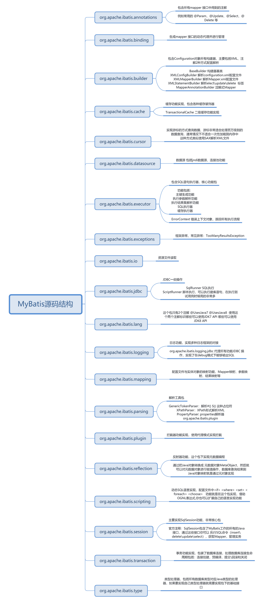
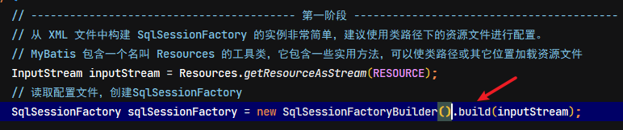
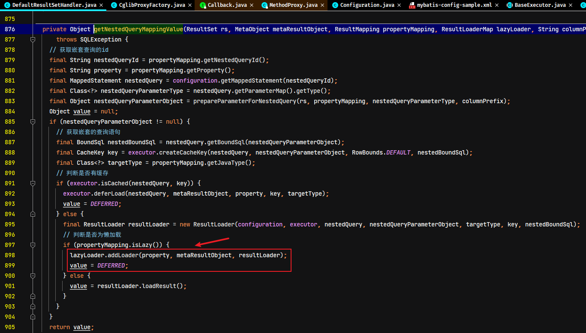

## 1. MyBatis 源码概述

> MyBatis 源码仓库地址：https://github.com/MyBatis/MyBatis-3

### 1.1. MyBatis 源码包导入

目前学习的 MyBatis 版本是：3.5.2，源码包导入过程：

1. 下载 MyBatis 的源码
2. 检查 maven 的版本，必须是 3.25 以上，建议使用 maven 的最新版本
3. MyBatis 的工程是 maven 工程，在开发工具中导入，工程必须使用 jdk1.8 以上版本
4. <font color=red>**把 MyBatis 源码的 pom 文件中`<optional>true</optional>`，全部改为 false或者注释掉，因为这个会阻断依赖的传递，会导致自己做的demo示例无法依赖到mybatis所依赖的第三方的jar包**</font>
5. 在工程目录下执行 `mvn clean install -Dmaven.test.skip=true`，将当前工程安装到本地仓库（pdf 插件报错的话，需要将这个插件屏蔽）
> 注意：安装过程中会可能会有很多异常信息，只要不中断运行，请耐心等待
6. 创建测试工程，并依赖此工程

> 直接用`mybatis-3-master（注释版）.zip`的源码包，在里面加注释

### 1.2. 源码架构分析

#### 1.2.1. 物理分层



#### 1.2.2. 逻辑分层

MyBatis 源码共 16 个模块，可以分成三层，MyBatis源码分层图如下：


- 接口层：MyBatis 对外提供的访问接口，面向 SqlSession 编程，开发人员通过这些本地API来操纵数据库。接口层一接收到调用请求就会调用数据处理层来完成具体的数据处理。
- 核心（数据）处理层：负责具体的SQL查找、SQL解析、SQL执行和执行结果映射处理等。它主要的目的是根据调用的请求完成一次数据库操作。业务组件专注 MyBatis 的业务流程实现，依赖于基础支撑层
- 基础支撑层：负责最基础的功能支撑，包括连接管理、事务管理、配置加载和缓存处理等等共用的功能，将它们抽取出来作为最基础的组件。为上层的数据处理层提供最基础的支撑。技术组件专注于底层技术实现，通用性较强无业务含义

> 拓展思考问题：系统为什么要分层？
>
> 1. 代码和系统的可维护性更高。系统分层之后，每个层次都有自己的定位，每个层次内部的组件都有自己的分工，系统就会变得很清晰，维护起来非常明确；
> 2. 方便开发团队分工和开发效率的提升；举个例子，mybatis 这么大的一个源码框架不可能是一个人开发的，他需要一个团队，团队之间肯定有分工，既然有了层次的划分，分工也会变得容易，开发人员可以专注于某一层的某一个模块的实现，专注力提升了，开发效率自然也会提升
> 3. 提高系统的伸缩性和性能。系统分层之后，只要把层次之间的调用接口明确了，那就可以从逻辑上的分层变成物理上的分层。当系统并发量吞吐量上来了，怎么办？为了提高系统伸缩性和性能，可以把不同的层部署在不同服务器集群上，不同的组件放在不同的机器上，用多台机器去抗压力，这就提高了系统的性能。压力大的时候扩展节点加机器，压力小的时候，压缩节点减机器，系统的伸缩性就是这么来的

## 2. MyBatis涉及的设计模式

### 2.1. 外观模式（门面模式）

从源码的架构分析，特别是接口层的设计，MyBatis的整体架构的设计模式符合外观模式

门面模式定义：提供了一个统一的接口，用来访问子系统中的一群接口。外观模式定义了一个高层接口，让子系统更容易使用。类图如下：


- **Facade 角色**：提供一个外观接口，对外，它提供一个易于客户端访问的接口，对内，它可以访问子系统中的所有功能。
- **SubSystem（子系统）角色**：子系统在整个系统中可以是一个或多个模块，每个模块都有若干类组成，这些类可能相互之间有着比较复杂的关系

门面模式优点：使复杂子系统的接口变的简单可用，减少了客户端对子系统的依赖，达到了解耦的效果；遵循了迪米特法则(又叫作最少知识原则)，对内封装具体细节，对外只暴露必要的接口。门面模式使用场景如下：

- 一个复杂的模块或子系统提供一个供外界访问的接口
- 子系统相对独立，外界对子系统的访问只要黑箱操作即可

### 2.2. 面向对象设计需要遵循的六大设计原则

> 学习源码除了学习编程的技巧、经验之外，最重要的是学习源码的设计的思想以及设计模式的灵活应用

1. **单一职责原则**：一个类或者一个接口只负责唯一项职责，尽量设计出功能单一的接口；
2. **依赖倒转原则**：高层模块不应该依赖低层模块具体实现，解耦高层与低层。简单来说，既**面向接口编程**，当实现发生变化时，只需提供新的实现类，不需要修改高层模块代码
3. **开放-封闭原则**：程序对外扩展开放，对修改关闭；换句话说，当需求发生变化时，可以通过添加新模块来满足新需求，而不是通过修改原来的实现代码来满足新需求
4. **迪米特法则**：一个对象应该对其他对象保持最少的了解，尽量降低类与类之间的耦合度。实现这个原则，要注意以下两点：
    1. 在做类结构设计的时候尽量降低成员的访问权限，能用 private 的尽量用 private；
    2. 在类之间，如果没有必要直接调用，就不要有依赖关系；这个法则强调的还是类之间的松耦合；
5. **里氏代换原则**：所有引用基类（父类）的地方必须能透明地使用其子类的对象；
6. **接口隔离原则**：客户端不应该依赖它不需要的接口，一个类对另一个类的依赖应该建立在最小的接口上

### 2.3. 建造者模式

#### 2.3.1. 什么是建造者模式

在配置加载阶段大量的使用了建造者模式，首先学习建造者模式。建造者模式（Builder Pattern）使用多个简单的对象一步一步构建成一个复杂的对象。这种类型的设计模式属于创建型模式，它提供了一种创建对象的最佳方式。建造者模式类图如下：


建造者模式中主要的元素是：

- `Product`：要创建的复杂对象
- `Builder`：给出一个抽象接口，以规范产品对象的各个组成成分的建造。这个接口规定要实现复杂对象的哪些部分的创建，并不涉及具体的对象部件的创建；
- `ConcreteBuilder`：实现`Builder`接口，针对不同的商业逻辑，具体化复杂对象的各部分的创建。 在建造过程完成后，提供产品的实例；
- `Director`：调用具体建造者来创建复杂对象的各个部分，在指导者中不涉及具体产品的信息，只负责保证对象各部分完整创建或按某种顺序创建

> **关于建造器模式的扩展知识**：流式编程风格越来越流行，如 zookeeper 的 Curator、JDK8 的流式编程等等都是例子。流式编程的优点在于代码编程性更高、可读性更好，缺点在于对程序员编码要求更高、不太利于调试。建造者模式是实现流式编程风格的一种方式。

#### 2.3.2. 与工厂模式区别

建造者模式应用场景如下：

- 需要生成的对象具有复杂的内部结构，实例化对象时要屏蔽掉对象内部的细节，让上层代码与复杂对象的实例化过程解耦，可以使用建造者模式；简而言之，如果“遇到多个构造器参数时要考虑用构建器”
- 对象的实例化是依赖各个组件的产生以及装配顺序，关注的是一步一步地组装出目标对象，可以使用建造器模式

建造者模式与工程模式的区别在于：

- **对象复杂度**：
    - 工厂模式：关注的是一个产品整体，无须关心产品的各部分是如何创建出来的
    - 建造者模式：建造的对象更加复杂，是一个复合产品，它由各个部件复合而成，部件不同产品对象不同，生成的产品粒度细
- **客户端参与程度**
    - 工厂模式：客户端对产品的创建过程参与度低，对象实例化时属性值相对比较固定
    - 建造者模式：客户端参与了产品的创建，决定了产品的类型和内容，参与度高；适合实例化对象时属性变化频繁的场景

### 2.4. 策略模式

#### 2.4.1. 什么是策略模式

策略模式（Strategy Pattern）策略模式定义了一系列的算法，并将每一个算法封装起来，而且使他们可以相互替换，让算法独立于使用它的客户而独立变化。Spring 容器中使用配置可以灵活的替换掉接口的实现类就是策略模式最常见的应用。类图如下：


- Context：算法调用者，使用 setStrategy 方法灵活的选择策略（strategy）
- Strategy：算法的统一接口
- ConcreteStrategy：算法的具体实现

#### 2.4.2. 策略模式的使用场景

- 针对同一类型问题的多种处理方式，仅仅是具体行为有差别时
- 出现同一抽象类有多个子类，而又需要使用 if-else 或者 switch-case 来选择具体子类时

### 2.5. 模板模式

**模板模式**是：一个抽象类公开定义了执行它的方法的方式/模板。它的子类可以按需要重写方法实现，但调用将以抽象类中定义的方式进行。定义一个操作中的算法的骨架，而将一些步骤延迟到子类中。模板方法使得子类可以不改变一个算法的结构即可重定义该算法的某些特定实现。类结构如下：


`AbstractClass`中模板方法`template()`定义了功能实现的多个步骤，抽象父类只会对其中几个通用的步骤有实现，而一些可定制化的步骤延迟到子类`ConcreteClass1`、`ConcreteClass2`中实现，子类只能定制某几个特定步骤的实现，而不能改变算法的结构

**应用场景**：遇到由一系列步骤构成的过程需要执行，这个过程从高层次上看是相同的，但是有些步骤的实现可能不同，这个时候就需要考虑用模板模式了

### 2.6. 装饰器模式

#### 2.6.1. 模式的结构

装饰器模式是一种用于代替继承的技术，无需通过继承增加子类就能扩展对象的新功能。使用对象的关联关系代替继承关系，更加灵活，同时避免类型体系的快速膨胀。装饰器 UML 类图如下：


- **组件（Component）**：组件接口定义了全部组件类和装饰器实现的行为
- **组件实现类（ConcreteComponent）**：实现Component接口，组件实现类就是被装饰器装饰的原始对象，新功能或者附加功能都是通过装饰器添加到该类的对象上的
- **装饰器抽象类（Decorator）**：实现Component接口的抽象类，在其中封装了一个Component对象，也就是被装饰的对象
- **具体装饰器类（ConcreteDecorator）**：该实现类要向被装饰的对象添加某些功能

#### 2.6.2. 装饰器与继承的区别

装饰器相对于继承，装饰器模式灵活性更强，扩展性更强：

- 灵活性：装饰器模式将功能切分成一个个独立的装饰器，在运行期可以根据需要动态的添加功能，甚至对添加的新功能进行自由的组合
- 扩展性：当有新功能要添加的时候，只需要添加新的装饰器实现类，然后通过组合方式添加这个新装饰器，无需修改已有代码，符合开闭原则

#### 2.6.3. 装饰器模式使用举例

- IO 中输入流和输出流的设计

```java
BufferedReader bufferedReader = new BufferedReader(new InputStreamReader(new FileInputStream("c://a.txt")));
```

- 对网络爬虫的自定义增强，可增强的功能包括：多线程能力、缓存、自动生成报表、黑白名单、random 触发等

### 2.7. 责任链模式

责任链模式：就是把一件工作分别经过链上的各个节点，让这些节点依次处理这个工作。和装饰器模式不同，每个节点都知道后继者是谁；适合为完成同一个请求需要多个处理类的场景。责任链模式类图如下：


- Handler：定义了一个处理请求的标准接口
- ConcreteHandler：具体的处理者，处理它负责的部分，根据业务可结束处理流程，也可将请求转发给它的后继者
- client：发送者，发起请求的客户端

责任链模式优点：

1. 降低耦合度：它将请求的发送者和接收者解耦
2. 简化了对象：使得对象不需要知道链的结构
3. 增强给对象指派职责的灵活性。通过改变链内的成员或者调动它们的次序，允许动态地新增或者删除责任
4. 增加新的请求处理类很方便

## 3. 日志模块分析

### 3.1. 日志模块需求分析

1. MyBatis 没有提供日志的实现类，需要接入第三方的日志组件，但第三方日志组件都有各自的 Log 级别，且各不相同，而 MyBatis 统一提供了 trace、debug、warn、error 四个级别；
2. 自动扫描日志实现，并且第三方日志插件加载优先级如下：slf4J -> commonsLoging -> Log4J2 -> Log4J -> JdkLog;
3. 日志的使用要优雅的嵌入到主体功能中

### 3.2. 适配器模式

日志模块的第一个需求是一个典型的使用适配器模式的场景。

**适配器模式（Adapter Pattern）**是作为两个不兼容的接口之间的桥梁，将一个类的接口转换成客户希望的另外一个接口。适配器模式使得原本由于接口不兼容而不能一起工作的那些类可以一起工作；适配器模块类图如下：


- Target：目标角色，期待得到的接口
- Adaptee：适配者角色，被适配的接口
- Adapter：适配器角色，将源接口转换成目标接口

适用场景：当调用双方都不太容易修改的时候，为了复用现有组件可以使用适配器模式；在系统中接入第三方组件的时候经常被使用到；

> 注意适配器使用的缺点：如果系统中存在过多的适配器，会增加系统的复杂性，设计人员应考虑对系统进行重构

MyBatis 日志模块使用适配器模式，具体实现如下：

- Target：目标角色，期待得到的接口。`org.apache.ibatis.logging.Log` 接口，对内提供了统一的日志接口
- Adaptee：适配者角色，被适配的接口。其他日志组件组件如 slf4J、commonsLoging、Log4J2 等被包含在适配器中。
- Adapter：适配器角色，将源接口转换成目标接口。针对每个日志组件都提供了适配器，每个适配器都对特定的日志组件进行封装和转换；如 Slf4jLoggerImpl、JakartaCommonsLoggingImpl 等

日志模块适配器结构类图：


**总结：日志模块实现采用适配器模式，日志组件（Target）、适配器以及统一接口（Log 接口）定义清晰明确符合单一职责原则；同时，客户端在使用日志时，面向 Log 接口编程，不需要关心底层日志模块的实现，符合依赖倒转原则；最为重要的是，如果需要加入其他第三方日志框架，只需要扩展新的模块满足新需求，而不需要修改原有代码，这又符合了开闭原则**

### 3.3. 怎么实现优先加载日志组件

见 org.apache.ibatis.logging.LogFactory 中的静态代码块，通过静态代码块确保第三方日志插件加载优先级如下：slf4J → commonsLoging → Log4J2 → Log4J → JdkLog。在`tryImplementation`方法，会判断适配器的构造方法是否为空，为空时才会执行

```java
public final class LogFactory {
  ...
  // 被选定的第三方日志组件适配器的构造方法
  private static Constructor<? extends Log> logConstructor;

  // 自动扫描日志实现，并且第三方日志插件加载优先级如下：slf4J → commonsLoging → Log4J2 → Log4J → JdkLog
  static {
    tryImplementation(LogFactory::useSlf4jLogging);
    tryImplementation(LogFactory::useCommonsLogging);
    tryImplementation(LogFactory::useLog4J2Logging);
    tryImplementation(LogFactory::useLog4JLogging);
    tryImplementation(LogFactory::useJdkLogging);
    tryImplementation(LogFactory::useNoLogging);
  }
  ......

  private static void tryImplementation(Runnable runnable) {
    // 当构造方法不为空才执行方法
    if (logConstructor == null) {
      try {
        runnable.run();
      } catch (Throwable t) {
        // ignore
      }
    }
  }

  // 通过指定的log类来初始化构造方法
  private static void setImplementation(Class<? extends Log> implClass) {
    try {
      Constructor<? extends Log> candidate = implClass.getConstructor(String.class);
      Log log = candidate.newInstance(LogFactory.class.getName());
      if (log.isDebugEnabled()) {
        log.debug("Logging initialized using '" + implClass + "' adapter.");
      }
      logConstructor = candidate;
    } catch (Throwable t) {
      throw new LogException("Error setting Log implementation.  Cause: " + t, t);
    }
  }
  .....
}
```

### 3.4. 代理模式和动态代理(知识回顾)

代理模式定义：给目标对象提供一个代理对象，并由代理对象控制对目标对象的引用。有以下两个目的：

1. 通过引入代理对象的方式来间接访问目标对象，防止直接访问目标对象给系统带来的不必要复杂性；
2. 通过代理对象对原有的业务增强；

代理模式类图


代理模式有**静态代理**和**动态代理**两种实现方式

#### 3.4.1. 静态代理

静态代理方式需要代理对象和目标对象实现一样的接口

- 优点：可以在不修改目标对象的前提下扩展目标对象的功能
- 缺点：
    - 冗余。由于代理对象要实现与目标对象一致的接口，会产生过多的代理类
    - 不易维护。一旦接口增加方法，目标对象与代理对象都要进行修改

#### 3.4.2. 动态代理

- 动态代理利用了 JDK API，动态地在内存中构建代理对象，从而实现对目标对象的代理功能
- 动态代理又被称为 JDK 代理或接口代理。静态代理与动态代理的区别主要在
    1. 静态代理在编译时就已经实现，编译完成后代理类是一个实际的 class 文件
    2. 动态代理是在运行时动态生成的，即编译完成后没有实际的 class 文件，而是在运行时动态生成类字节码，并加载到 JVM 中
- **注意：动态代理对象不需要实现接口，但是要求目标对象必须实现接口，否则不能使用动态代理**

JDK 中生成代理对象主要涉及两个类/接口

- 第一个为 `java.lang.reflect.Proxy` 类，通过静态方法 `newProxyInstance` 生成代理对象
- 第二个为 `java.lang.reflect.InvocationHandler` 接口，通过 `invoke` 方法对业务进行增强

### 3.5. 优雅的增强日志功能

通过观察Mybatis框架的日志打印信息，总结框架对如下几个位置需要打日志：

1. 在创建 prepareStatement 时，打印执行的 SQL 语句；
2. 访问数据库时，打印参数的类型和值
3. 查询出结构后，打印结果数据条数

因此Mybatis框架在日志模块中有 BaseJdbcLogger、ConnectionLogger、PreparedStatementLogger 和 ResultSetLogger 通过动态代理负责在不同的位置打印日志；日志模块几个相关类的类图如下：


- `BaseJdbcLogger`：所有日志增强的抽象基类，用于记录 JDBC 那些方法需要增强，保存运行期间 sql 参数信息
- `ConnectionLogger`：负责打印连接信息和 SQL 语句。通过动态代理，对 connection 进行增强，如果是调用 prepareStatement、prepareCall、createStatement 的方法，打印要执行的 sql 语句并返回 prepareStatement 的代理对象（PreparedStatementLogger），让prepareStatement 也具备日志能力，打印参数
- `PreparedStatementLogger`：对 prepareStatement 对象增强，增强的点如下：
    - 增强 PreparedStatement 的 setxxx 方法将参数设置到 columnMap、columnNames、columnValues，为打印参数做好准备
    - 增强 PreparedStatement 的 execute 相关方法，当方法执行时，通过动态代理打印参数,返回动态代理能力的 resultSet
    - 如果是查询，增强 PreparedStatement 的 getResultSet 方法，返回动态代理能力的 resultSet；如果是更新，直接打印影响的行数
- `ResultSetLogger`：负责打印数据结果信息
- `StatementLooger`：与PreparedStatementLogger一样，只是打印没有预编译的SQL语句

#### 3.5.1. 日志功能是如何加入主体功能中

既然在 Mybatis 中 Executor 才是访问数据库的组件，日志功能是在 Executor 中被嵌入的，具体代码在`org.apache.ibatis.executor.SimpleExecutor.prepareStatement(StatementHandler, Log)`方法中


## 4. 数据源模块分析

数据源模块重点：数据源的创建和数据库连接池（*池化技术*）的源码分析；数据源创建比较复杂，对于复杂对象的创建，可以考虑使用工厂模式来优化，接下来介绍下简单工厂模式和工厂模式

### 4.1. 简单工厂模式（未整理）

### 4.2. 工厂模式(未整理)

### 4.3. 数据源的创建

数据源对象是比较复杂的对象，其创建过程相对比较复杂，对于 MyBatis 创建一个数据源，具体来讲有如下难点

1. 常见的数据源组件都实现了 `javax.sql.DataSource` 接口
2. MyBatis 不但要能集成第三方的数据源组件，自身也提供了数据源的实现
3. 一般情况下，数据源的初始化过程参数较多，比较复杂
- 综上所述，数据源的创建是一个典型使用工厂模式的场景，实现类图如下所示

**需求补充工厂模式的类图**

- `DataSource`：数据源接口，JDBC 标准规范之一，定义了获取获取 Connection 的方法
- `UnPooledDataSource`：不带连接池的数据源，获取连接的方式和手动通过 JDBC 获取连接的方式是一样的
- `PooledDataSource`：带连接池的数据源，提高连接资源的复用性，避免频繁创建、关闭连接资源带来的开销
- `DataSourceFactory`：工厂接口，定义了创建 Datasource 的方法
- `UnpooledDataSourceFactory`：工厂接口的实现类之一，用于创建 UnpooledDataSource(不带连接池的数据源)
- `PooledDataSourceFactory`：工厂接口的实现类之一，用于创建 PooledDataSource（带连接池的数据源）

## 5. MyBatis 基础执行流程分析

使用MyBatis完成一次数据库基础操作的代码如下：

```java
@Test
public void testMyBatisGetMapper() {
    try {
        // ----------------------------------------- 第一阶段 -----------------------------------------
        // 从 XML 文件中构建 SqlSessionFactory 的实例非常简单，建议使用类路径下的资源文件进行配置。
        // MyBatis 包含一个名叫 Resources 的工具类，它包含一些实用方法，可以使类路径或其它位置加载资源文件
        InputStream inputStream = Resources.getResourceAsStream("mybatis-config.xml");
        // 读取配置文件，创建SqlSessionFactory
        SqlSessionFactory sqlSessionFactory = new SqlSessionFactoryBuilder().build(inputStream);

        // ----------------------------------------- 第二阶段 -----------------------------------------
        // 通过SqlSessionFactory开启一个SqlSession
        SqlSession sqlSession = sqlSessionFactory.openSession();
        // 通过SqlSession获取指定的mapper映射器（其实是Mapper接口的代理）
        CommonMapper mapper = sqlSession.getMapper(CommonMapper.class);

        // ----------------------------------------- 第三阶段 -----------------------------------------
        // 通过代理实例调用相应Mapper接口中的方法
        System.out.println(mapper.queryAreaByAreaCode(new HashMap<>()));
    } catch (IOException e) {
        e.printStackTrace();
    }
}
```

通过对快速入门代码的分析，可以把 MyBatis 的运行流程分为三大阶段：

1. 初始化阶段：读取 XML 配置文件和注解中的配置信息，创建配置对象，并完成各个模块的初始化的工作。
2. 代理封装阶段：封装 iBatis 的编程模型，使用 mapper 接口开发的初始化工作。
3. 数据访问阶段：通过 SqlSession 完成 SQL 的解析，参数的映射、SQL 的执行、结果的解析过程。

## 6. 第一阶段：加载与解析配置

### 6.1. 配置加载的核心类

#### 6.1.1. 建造器三个核心类

在 MyBatis 中负责加载配置文件的核心类有三个，类图如下：


- `BaseBuilder`：所有解析器的父类，包含配置文件实例，为解析文件提供的一些通用的方法；
- `XMLConfigBuilder`：主要负责解析总配置文件 mybatis-config.xml；
- `XMLMapperBuilder`：主要负责解析映射配置 Mapper.xml 文件；
- `XMLStatementBuilder`：主要负责解析映射配置文件中的 SQL 节点；

#### 6.1.2. 三个核心类分工示意图

`XMLConfigBuilder`、`XMLMapperBuilder`、`XMLStatementBuilder` 这三个类在配置文件加载过程中非常重要，具体分工如下图所示：


这三个类使用了建造者模式对 configuration 对象进行初始化，使用建造者模式屏蔽复杂对象的创建过程，把建造者模式演绎成了工厂模式。

### 6.2. SqlSessionFactory（MyBatis启动入口）

根据MyBatis基础的执行代码可知，通过`new SqlSessionFactoryBuilder().build(inputStream);`可创建`SqlSessionFactory`实例，这也是MyBatis项目的启动入口

在执行`SqlSessionFactoryBuilder.build`方法后，会返回`SqlSessionFactory`对象（其默认的实现类为`DefaultSqlSessionFactory`）。

```java
SqlSessionFactory sqlSessionFactory = new SqlSessionFactoryBuilder().build(inputStream);
```


`SqlSessionFactoryBuilder`有五种`build()`方法，每一种都允许从不同的资源中创建一个 `SqlSessionFactory` 实例。

```java
SqlSessionFactory build(InputStream inputStream)
SqlSessionFactory build(InputStream inputStream, String environment)
SqlSessionFactory build(InputStream inputStream, Properties properties)
SqlSessionFactory build(InputStream inputStream, String env, Properties props)
SqlSessionFactory build(Configuration config)
```

### 6.3. 配置加载过程

第一个阶段配置加载过程分解为四个步骤，四个步骤如下图：


### 6.4. 配置文件的解析（XMLConfigBuilder）

#### 6.4.1. 核心配置文件读取

通过`SqlSessionFactoryBuilder`建造`SqlSessionFactory`，并创建`XMLConfigBuilder`对象读取MyBatis核心配置文件。具体代码如下：




#### 6.4.2. parseConfiguration 配置元素解析

进入`XMLConfigBuilder`的`parseConfiguration`方法，对MyBatis核心配置文件的各个元素进行解析，读取元素信息后填充到`Configuration`对象。重点关注以下的几个解析方法：

- 在`XMLConfigBuilder`的`typeAliasesElement()`方法中会解析总配置文件中`<typeAliases>`别名标签，进行别名的注册（**重点关注一下Mybatis扫描类的逻辑，比较与spring的不同点**）
    - 在指定包扫描的处理逻辑中，有`VFS.getInstance()`的方法获取`VFS`单例实例的方法，这里**使用静态内部类来创建外部类实例的方式来实现单例模式**，因为静态内部在jvm加载的时候就会初始化，并且内存中只会存在一份，jvm的初始化时是线程互斥的（*此处值得关注，具体这种单例实现的方式说明详见 \01-Java\20-设计模式.md*）
- 在`XMLConfigBuilder`的`mapperElement()`方法中通过`XMLMapperBuilder`对象读取所有 mapper.xml 映射文件

```java
/**
 * 解析配置文件的入口
 * @return Configuration 对象
 */
public Configuration parse() {
  // 判断标识，不允许重复解析
  if (parsed) {
    throw new BuilderException("Each XMLConfigBuilder can only be used once.");
  }
  // 设置解析标识
  parsed = true;
  // 从根节点<configuration>标签开始解析
  parseConfiguration(parser.evalNode("/configuration"));
  return configuration;
}
```

```java
/**
 * 从根节点configuration开始解析下层节点
 * @param root 根节点configuration节点
 */
/* 当前类中有一个Configuration类的成员属性，在此方法中，所有解析信息的都放入此Configuration实例中 */
private void parseConfiguration(XNode root) {
  try {
    // 首先解析<properties>标签，以保证在解析其他节点时可以会用到properties中的参数值
    //issue #117 read properties first
    propertiesElement(root.evalNode("properties"));
    // 解析<settings>标签
    Properties settings = settingsAsProperties(root.evalNode("settings"));
    // 获取 <setting> 标签name属性为vfsImpl的值，加载自定义类扫描器(类似spring的类扫描器)
    loadCustomVfs(settings);
    // 获取 <setting> 标签name属性为logImpl的值
    loadCustomLogImpl(settings);
    // 别名标签 <typeAliases> 扫描注册【重点】
    typeAliasesElement(root.evalNode("typeAliases"));
    // 插件标签 <plugins> 的解析
    pluginElement(root.evalNode("plugins"));
    // 解析Pojo对象工厂类。可以用于自定义数据库与pojo对象的映射逻辑，一般都使用默认的【不重要】
    objectFactoryElement(root.evalNode("objectFactory"));
    objectWrapperFactoryElement(root.evalNode("objectWrapperFactory"));
    reflectorFactoryElement(root.evalNode("reflectorFactory"));
    // 解析settings标签
    settingsElement(settings);
    // read it after objectFactory and objectWrapperFactory issue #631
    // 解析环境标签
    environmentsElement(root.evalNode("environments"));
    // 解析数据库厂商标识（databaseIdProvider）
    databaseIdProviderElement(root.evalNode("databaseIdProvider"));
    // 解析类型转换器，即解析<typeHandlers>标签，注册（建立）类型处理器的映射关系
    typeHandlerElement(root.evalNode("typeHandlers"));
    // 解析mappers映射器标签
    mapperElement(root.evalNode("mappers"));
  } catch (Exception e) {
    throw new BuilderException("Error parsing SQL Mapper Configuration. Cause: " + e, e);
  }
}
```

#### 6.4.3. xml映射配置文件（Mapper.xml）的解析

`XMLConfigBuilder`类的`parseConfiguration(XNode root)`方法，其中一个重点是`mapperElement(root.evalNode("mappers"))`，主要处理逻辑是读取MyBatis总配置文件中所配置的XML映射文件，然后再对映射文件逐个解析

```java
/**
 * 解析mappers节点，例如：
 * <mappers>
 *    <mapper resource="com/github/yeecode/mybatisDemo/UserDao.xml"/>
 *    <package name="com.github.yeecode.mybatisDemo" />
 * </mappers>
 * @param parent mappers节点
 * @throws Exception
 */
private void mapperElement(XNode parent) throws Exception {
  if (parent != null) {
    // 处理mappers的子节点，即mapper节点或者package节点
    for (XNode child : parent.getChildren()) {
      // package节点
      if ("package".equals(child.getName())) {
        // 取出包路径
        String mapperPackage = child.getStringAttribute("name");
        // 全部加入Mappers中
        configuration.addMappers(mapperPackage);
      } else {
        // 单独配置的mapper节点。注意：resource、url、class这三个属性只有一个生效
        String resource = child.getStringAttribute("resource");
        String url = child.getStringAttribute("url");
        String mapperClass = child.getStringAttribute("class");
        if (resource != null && url == null && mapperClass == null) {
          ErrorContext.instance().resource(resource);
          // 获取文件的输入流
          InputStream inputStream = Resources.getResourceAsStream(resource);
          // 使用XMLMapperBuilder解析映射文件
          XMLMapperBuilder mapperParser = new XMLMapperBuilder(inputStream, configuration, resource, configuration.getSqlFragments());
          mapperParser.parse();
        } else if (resource == null && url != null && mapperClass == null) {
          ErrorContext.instance().resource(url);
          // 从网络获得输入流
          InputStream inputStream = Resources.getUrlAsStream(url);
          // 使用XMLMapperBuilder解析映射文件
          XMLMapperBuilder mapperParser = new XMLMapperBuilder(inputStream, configuration, url, configuration.getSqlFragments());
          mapperParser.parse();
        } else if (resource == null && url == null && mapperClass != null) {
          // 配置的不是映射文件，而是映射接口
          Class<?> mapperInterface = Resources.classForName(mapperClass);
          // 直接加到
          configuration.addMapper(mapperInterface);
        } else {
          throw new BuilderException("A mapper element may only specify a url, resource or class, but not more than one.");
        }
      }
    }
  }
}
```

其中主要通过`XMLMapperBuilder`类的`parse`方法对 mapper.xml 配置文件的各个元素进行解析，读取元素信息后填充到`Configuration`对象。该方法的逻辑如下：

```java
/**
 * 解析映射文件
 */
public void parse() {
  // 判断该节点是否被解析过
  if (!configuration.isResourceLoaded(resource)) {
    // 处理mapper节点，即对配置的mapper.xml文件进行解析
    configurationElement(parser.evalNode("/mapper"));
    // 加入已解析的列表，防止重复解析
    configuration.addLoadedResource(resource);
    // 将Mapper注册到Configuration类中
    bindMapperForNamespace();
  }

  // 下面分别用来处理失败的<resultMap>、<cache-ref>、SQL语句
  parsePendingResultMaps();
  parsePendingCacheRefs();
  parsePendingStatements();
}
```

```java
/**
 * 解析映射文件的下层节点
 * @param context 映射文件根节点
 */
private void configurationElement(XNode context) {
  try {
    // 读取当前mapper映射文件namespace
    String namespace = context.getStringAttribute("namespace");
    if (namespace == null || namespace.equals("")) {
      throw new BuilderException("Mapper's namespace cannot be empty");
    }
    // 设置 MapperBuilderAssistant 实例的 currentNamespace 属性
    builderAssistant.setCurrentNamespace(namespace);
    // 解析cache-ref节点
    cacheRefElement(context.evalNode("cache-ref"));
    // 解析cache节点。【重点分析】
    cacheElement(context.evalNode("cache"));
    // 解析parameterMap节点（官网已废弃）
    parameterMapElement(context.evalNodes("/mapper/parameterMap"));
    // 解析resultMap节点（基于数据结果去理解）。【重点分析】
    resultMapElements(context.evalNodes("/mapper/resultMap"));
    // 解析sql节点。【重点分析】
    sqlElement(context.evalNodes("/mapper/sql"));
    // 解析select|insert|update|delete节点，即处理数据库各种操作语句。重要程度【5】
    buildStatementFromContext(context.evalNodes("select|insert|update|delete"));
  } catch (Exception e) {
    throw new BuilderException("Error parsing Mapper XML. The XML location is '" + resource + "'. Cause: " + e, e);
  }
}
```

在`XMLMapperBuilder.configurationElement()`方法解析xml映射文件过程中，有以下几个重点解析过程需要注意。

### 6.5. 解析xml映射文件（XMLMapperBuilder）

#### 6.5.1. xml映射配置的 cache 节点解析（待整理分析）

`XMLMapperBuilder`类的`cacheElement(XNode)`方法用于实例化二级缓存，此过程中都使用了建造者模式，是建造者模式的典型应用。

```java
private void cacheElement(XNode context) {
  if (context != null) {
    String type = context.getStringAttribute("type", "PERPETUAL");
    Class<? extends Cache> typeClass = typeAliasRegistry.resolveAlias(type);
    String eviction = context.getStringAttribute("eviction", "LRU");
    Class<? extends Cache> evictionClass = typeAliasRegistry.resolveAlias(eviction);
    Long flushInterval = context.getLongAttribute("flushInterval");
    Integer size = context.getIntAttribute("size");
    boolean readWrite = !context.getBooleanAttribute("readOnly", false);
    boolean blocking = context.getBooleanAttribute("blocking", false);
    Properties props = context.getChildrenAsProperties();
    builderAssistant.useNewCache(typeClass, evictionClass, flushInterval, size, readWrite, blocking, props);
  }
}
```

#### 6.5.2. xml映射配置的 resultMap 节点解析

`XMLMapperBuilder`类的`resultMapElements(List<XNode>)`方法用于解析`<resultMap>`节点，**需要重点理解此方法的处理流程**。解析完之后数据保存在`Configuration`对象的`Map<String, ResultMap> resultMaps`属性中。此实例化`resultMap`过程中都使用了建造者模式


```java
private void resultMapElements(List<XNode> list) throws Exception {
  /* 循环mapper.xml映射配置文件中的resultMap标签 */
  for (XNode resultMapNode : list) {
    try {
      resultMapElement(resultMapNode);
    } catch (IncompleteElementException e) {
      // ignore, it will be retried
    }
  }
}

private ResultMap resultMapElement(XNode resultMapNode, List<ResultMapping> additionalResultMappings, Class<?> enclosingType) throws Exception {
  ErrorContext.instance().activity("processing " + resultMapNode.getValueBasedIdentifier());
  String type = resultMapNode.getStringAttribute("type",
      resultMapNode.getStringAttribute("ofType",
          resultMapNode.getStringAttribute("resultType",
              resultMapNode.getStringAttribute("javaType"))));
  Class<?> typeClass = resolveClass(type);
  if (typeClass == null) {
    typeClass = inheritEnclosingType(resultMapNode, enclosingType);
  }
  Discriminator discriminator = null;
  // 创建resultMappings集合，用于存储所有子标签
  List<ResultMapping> resultMappings = new ArrayList<>();
  resultMappings.addAll(additionalResultMappings);
  List<XNode> resultChildren = resultMapNode.getChildren();
  // 循环 resultMap 所有的子标签
  for (XNode resultChild : resultChildren) {
    // 判断子标签的类型
    if ("constructor".equals(resultChild.getName())) {
      processConstructorElement(resultChild, typeClass, resultMappings);
    } else if ("discriminator".equals(resultChild.getName())) {
      discriminator = processDiscriminatorElement(resultChild, typeClass, resultMappings);
    } else {
      List<ResultFlag> flags = new ArrayList<>();
      // 判断是否为id子标签，设置标识
      if ("id".equals(resultChild.getName())) {
        flags.add(ResultFlag.ID);
      }
      // 创建ResultMapping实例，并加到 resultMappings 集合中
      resultMappings.add(buildResultMappingFromContext(resultChild, typeClass, flags));
    }
  }
  String id = resultMapNode.getStringAttribute("id",
          resultMapNode.getValueBasedIdentifier());
  String extend = resultMapNode.getStringAttribute("extends");
  Boolean autoMapping = resultMapNode.getBooleanAttribute("autoMapping");
  ResultMapResolver resultMapResolver = new ResultMapResolver(builderAssistant, id, typeClass, extend, discriminator, resultMappings, autoMapping);
  try {
    // 创建结果映射对象（ResultMap）
    return resultMapResolver.resolve();
  } catch (IncompleteElementException  e) {
    configuration.addIncompleteResultMap(resultMapResolver);
    throw e;
  }
}
```

在解析`<resultMap>`节点后，会通过`MapperBuilderAssistant`“助手”类将解析的数据保存到`Configuration`类中

```java
public class ResultMapResolver {
  // 映射文件解析助手，主要用将解析的数据保存到Configuration类中
  private final MapperBuilderAssistant assistant;
  ....省略
  public ResultMap resolve() {
    return assistant.addResultMap(this.id, this.type, this.extend, this.discriminator, this.resultMappings, this.autoMapping);
  }
}
```

```java
/**
 * MapperBuilderAssistant 类提供了许多辅助方法，如 Mapper 命 名空间的设置、缓存的创建、鉴别器的创建等
 */
public class MapperBuilderAssistant extends BaseBuilder {
  ....省略
  /**
   * 创建结果映射对象
   * @param id 输入参数参照 ResultMapResolver 属性
   * @return ResultMap对象
   */
  public ResultMap addResultMap(
      String id,
      Class<?> type,
      String extend,
      Discriminator discriminator,
      List<ResultMapping> resultMappings,
      Boolean autoMapping) {
    id = applyCurrentNamespace(id, false);
    extend = applyCurrentNamespace(extend, true);

    // 解析ResultMap的继承关系
    if (extend != null) {
	    // 如果存在ResultMap的继承
      if (!configuration.hasResultMap(extend)) {
        throw new IncompleteElementException("Could not find a parent resultmap with id '" + extend + "'");
      }
      // 获取父级的ResultMap
      ResultMap resultMap = configuration.getResultMap(extend);
      // 获取父级的属性映射
      List<ResultMapping> extendedResultMappings = new ArrayList<>(resultMap.getResultMappings());
      // 删除当前ResultMap中已有的父级属性映射，为当前属性映射覆盖父级属性创造条件
      extendedResultMappings.removeAll(resultMappings);
      // Remove parent constructor if this resultMap declares a constructor.
      // 如果当前ResultMap设置有构建器，则移除父级构建器
      boolean declaresConstructor = false;
      for (ResultMapping resultMapping : resultMappings) {
        if (resultMapping.getFlags().contains(ResultFlag.CONSTRUCTOR)) {
          declaresConstructor = true;
          break;
        }
      }
      if (declaresConstructor) {
        extendedResultMappings.removeIf(resultMapping -> resultMapping.getFlags().contains(ResultFlag.CONSTRUCTOR));
      }
      // 最终从父级继承而来的所有属性映射
      resultMappings.addAll(extendedResultMappings);
    }
    // 创建当前的ResultMap
    ResultMap resultMap = new ResultMap.Builder(configuration, id, type, resultMappings, autoMapping)
        .discriminator(discriminator)
        .build();
    // 将当前的ResultMap加入configuration
    configuration.addResultMap(resultMap);
    return resultMap;
  }
  ....省略
}
```

#### 6.5.3. 扩展细节：javaType与jdbcType的配置推导

通过`<resultMap>`标签可以不配置`javaType`与`jdbcType`，MyBatis框架会根据绑定的对象类型来推导出相应的`javaType`，即使`jdbcType`为空（没有配置），可以配置到相应的类型处理器`TypeHandler`，具体源码的处理位置在解析Mapper映射文件中的`<resultMap>`子标签时：


`XMLMapperBuilder.buildResultMappingFromContext`方法中，如果xml映射文件都没有配置`javaType`与`jdbcType`，此时调用`MapperBuilderAssistant`类的`buildResultMapping`方法中，会根据`<resultMap>`所配置的对象属性来推导出`javaType`。需要注意的是，此时的`TypeHandler`还是为null，在最后的`ResultMapping.Builder.build()`方法中，会获取到相应的类型处理器实例


此时，就是算`jdbcType`没有配置为null，根据`javaType`也可以从类型处理器的注册中心获取到相应的`TypeHandler`


### 6.6. 解析xml映射文件操作语句相关节点（XMLStatmentBuilder）

#### 6.6.1. xml映射配置的 select、insert、update、delete 节点解析

在`XMLMapperBuilder`类的`buildStatementFromContext(List<XNode>)`方法中，会创建`XMLStatmentBuilder`实例解析Mapper.xml映射文件的`<select>`、`<insert>`、`<update>`、`<delete>`节点

```java
private void buildStatementFromContext(List<XNode> list) {
  // 同样会判断是否有配置了数据库厂商标识databaseId
  if (configuration.getDatabaseId() != null) {
    buildStatementFromContext(list, configuration.getDatabaseId());
  }
  buildStatementFromContext(list, null);
}

private void buildStatementFromContext(List<XNode> list, String requiredDatabaseId) {
  for (XNode context : list) {
    // 创建xml配置文件中数据库操作语句（Statement）解析类
    final XMLStatementBuilder statementParser = new XMLStatementBuilder(configuration, builderAssistant, context, requiredDatabaseId);
    try {
      statementParser.parseStatementNode();
    } catch (IncompleteElementException e) {
      configuration.addIncompleteStatement(statementParser);
    }
  }
}
```

在`XMLStatementBuilder`的`parseStatementNode()`方法中，对Mapper.xml中select、insert、update、delete节点进行解析，并调用`MapperBuilderAssistant`负责将信息填充到
`Configuration`类中。在理解`parseStatementNod()`方法之前，有必要了解`MappedStatement`，这个类用于封装select、insert、update、delete节点的信息。如下图所示：


源码如下：

```java
public class XMLStatementBuilder extends BaseBuilder {

  private final MapperBuilderAssistant builderAssistant;
  private final XNode context;
  private final String requiredDatabaseId;

  public XMLStatementBuilder(Configuration configuration, MapperBuilderAssistant builderAssistant, XNode context) {
    this(configuration, builderAssistant, context, null);
  }

  public XMLStatementBuilder(Configuration configuration, MapperBuilderAssistant builderAssistant, XNode context, String databaseId) {
    super(configuration);
    this.builderAssistant = builderAssistant;
    this.context = context;
    this.requiredDatabaseId = databaseId;
  }

  /**
   * 解析select、insert、update、delete这四类标签节点
   */
  public void parseStatementNode() {
    // 读取当前标签节点的id与databaseId
    String id = context.getStringAttribute("id");
    String databaseId = context.getStringAttribute("databaseId");

    // 验证id与databaseId是否匹配。MyBatis允许多数据库配置，因此有些语句只对特定数据库生效
    if (!databaseIdMatchesCurrent(id, databaseId, this.requiredDatabaseId)) {
      return;
    }

    // 读取节点名称，即select、insert、update、delete
    String nodeName = context.getNode().getNodeName();
    // 读取和判断语句类型
    SqlCommandType sqlCommandType = SqlCommandType.valueOf(nodeName.toUpperCase(Locale.ENGLISH));
    // 判断是否为<select>标签
    boolean isSelect = sqlCommandType == SqlCommandType.SELECT;
    /*
     * 获取相关属性值
     *  flushCache属性值：如果是select标签，默认值是false；其他标签默认值为true
     *  useCache属性值：如果是select标签，默认值是true；其他标签默认值为false
     *  resultOrdered属性值：所有标签其默认值均为false
     */
    boolean flushCache = context.getBooleanAttribute("flushCache", !isSelect);
    boolean useCache = context.getBooleanAttribute("useCache", isSelect);
    boolean resultOrdered = context.getBooleanAttribute("resultOrdered", false);

    // Include Fragments before parsing
    XMLIncludeTransformer includeParser = new XMLIncludeTransformer(configuration, builderAssistant);
    // 处理语句标签中的include节点
    includeParser.applyIncludes(context.getNode());

    // 获取标签配置的参数类型
    String parameterType = context.getStringAttribute("parameterType");
    Class<?> parameterTypeClass = resolveClass(parameterType);

    // 语言类型
    String lang = context.getStringAttribute("lang");
    LanguageDriver langDriver = getLanguageDriver(lang);

    // Parse selectKey after includes and remove them.
    // 处理SelectKey节点，在这里会将KeyGenerator加入到Configuration.keyGenerators中
    processSelectKeyNodes(id, parameterTypeClass, langDriver);

    // Parse the SQL (pre: <selectKey> and <include> were parsed and removed)
    // 此时，<selectKey> 和 <include> 节点均已被解析完毕并被删除，开始进行SQL解析
    KeyGenerator keyGenerator;
    String keyStatementId = id + SelectKeyGenerator.SELECT_KEY_SUFFIX;
    keyStatementId = builderAssistant.applyCurrentNamespace(keyStatementId, true);
    // 判断是否已经有解析好的KeyGenerator
    if (configuration.hasKeyGenerator(keyStatementId)) {
      keyGenerator = configuration.getKeyGenerator(keyStatementId);
    } else {
      // 全局或者本语句只要启用自动key生成，则使用key生成
      keyGenerator = context.getBooleanAttribute("useGeneratedKeys",
          configuration.isUseGeneratedKeys() && SqlCommandType.INSERT.equals(sqlCommandType))
          ? Jdbc3KeyGenerator.INSTANCE : NoKeyGenerator.INSTANCE;
    }

    // 解析操作语句中的sql，封装成SqlSource。(注意：目前只是将解析后的sql结构包装成SqlSource对象，在执行阶段时，才真正拼接可执行的sql)
    SqlSource sqlSource = langDriver.createSqlSource(configuration, context, parameterTypeClass);
    /* 读取操作标签各个配置属性-start */
    // 获取预编译类型设置，默认值为 StatementType.PREPARED
    StatementType statementType = StatementType.valueOf(context.getStringAttribute("statementType", StatementType.PREPARED.toString()));
    Integer fetchSize = context.getIntAttribute("fetchSize");
    Integer timeout = context.getIntAttribute("timeout");
    String parameterMap = context.getStringAttribute("parameterMap");
    String resultType = context.getStringAttribute("resultType");
    Class<?> resultTypeClass = resolveClass(resultType);
    String resultMap = context.getStringAttribute("resultMap");
    String resultSetType = context.getStringAttribute("resultSetType");
    ResultSetType resultSetTypeEnum = resolveResultSetType(resultSetType);
    if (resultSetTypeEnum == null) {
      resultSetTypeEnum = configuration.getDefaultResultSetType();
    }
    String keyProperty = context.getStringAttribute("keyProperty");
    String keyColumn = context.getStringAttribute("keyColumn");
    String resultSets = context.getStringAttribute("resultSets");
    /* 读取操作标签各个配置属性-end */

    // 使用MapperBuilderAssistant类，创建MappedStatement对象，并写入到Configuration类中
    // 即在MyBatis中，每个select、insert、update、delete标签都相应一个MappedStatement对象实例
    builderAssistant.addMappedStatement(id, sqlSource, statementType, sqlCommandType,
        fetchSize, timeout, parameterMap, parameterTypeClass, resultMap, resultTypeClass,
        resultSetTypeEnum, flushCache, useCache, resultOrdered,
        keyGenerator, keyProperty, keyColumn, databaseId, langDriver, resultSets);
  }
  ....省略
}
```

> <font color=red>**小总结：`XMLMapperBuilder`和`XMLStatementBuilder`负责解析读取配置文件里面的信息，`MapperBuilderAssistant`负责将信息填充到`Configuration`。将文件解析和数据的填充的工作分离在不同的类中，符合单一职责原则。**</font>

#### 6.6.2. xml配置动态sql的解析封装

最终SQL节点树的解析由`XMLScriptBuilder`类负责，该类继承了`BaseBuilder`抽象类。

```java
public class XMLScriptBuilder extends BaseBuilder
```

最终会将sql内容封装成`SqlSource`对象

```java
SqlSource sqlSource = langDriver.createSqlSource(configuration, context, parameterTypeClass);
```


```java
/**
 * SqlSource 对象主要由 XMLScriptBuilder 的 parseScriptNode 方法生成
 * @param configuration 配置信息
 * @param script 映射文件中的数据库操作节点
 * @param parameterType 参数类型
 * @return SqlSource
 */
@Override
public SqlSource createSqlSource(Configuration configuration, XNode script, Class<?> parameterType) {
  // 创建XMLScriptBuilder实例
  XMLScriptBuilder builder = new XMLScriptBuilder(configuration, script, parameterType);
  // 解析操作语句标签核心方法
  return builder.parseScriptNode();
}
```

该类初始化时，会绑定相应的标签处理类`*Handler`，此处理类都会实现`XMLScriptBuilder.NodeHandler`内部接口

```java
public XMLScriptBuilder(Configuration configuration, XNode context, Class<?> parameterType) {
  super(configuration);
  this.context = context;
  this.parameterType = parameterType;
  initNodeHandlerMap();
}

/**
 * 初始化 SQL节点中相应的动态标签和 NodeHandler 实现类的对应关系。存储到 nodeHandlerMap 容器中。
 * 扩展知识：可以尝试改成SPI的方式完成处理类的映射？！
 */
private void initNodeHandlerMap() {
  nodeHandlerMap.put("trim", new TrimHandler());
  nodeHandlerMap.put("where", new WhereHandler());
  nodeHandlerMap.put("set", new SetHandler());
  nodeHandlerMap.put("foreach", new ForEachHandler());
  nodeHandlerMap.put("if", new IfHandler());
  nodeHandlerMap.put("choose", new ChooseHandler());
  nodeHandlerMap.put("when", new IfHandler());
  nodeHandlerMap.put("otherwise", new OtherwiseHandler());
  nodeHandlerMap.put("bind", new BindHandler());
}

private interface NodeHandler {
  /**
   * 该方法将当前节点拼装到节点树中
   * @param nodeToHandle 要被拼接的节点
   * @param targetContents 节点树
   */
  void handleNode(XNode nodeToHandle, List<SqlNode> targetContents);
}
```

下面以`<if>`标签的处理类`IfHandler`来说明。标签的处理都在方法开始位置就会递归调用`parseDynamicTags`方法，解析该节点的下级节点，直到最终节点下的内容为**静态文本（即内容不存在动态sql标签）**

```java
private class IfHandler implements NodeHandler {
  public IfHandler() {
    // Prevent Synthetic Access
  }
  /**
   * 该方法将当前节点拼装到节点树中
   * @param nodeToHandle 要被拼接的节点
   * @param targetContents 节点树
   */
  @Override
  public void handleNode(XNode nodeToHandle, List<SqlNode> targetContents) {
    // 递归调用parseDynamicTags方法，解析该节点的下级节点
    MixedSqlNode mixedSqlNode = parseDynamicTags(nodeToHandle);
    // 获取该节点的test属性
    String test = nodeToHandle.getStringAttribute("test");
    // 创建一个IfSqlNode
    IfSqlNode ifSqlNode = new IfSqlNode(mixedSqlNode, test);
    // 将创建的IfSqlNode放到SQL节点树中
    targetContents.add(ifSqlNode);
  }
}
```

`parseDynamicTags`方法源码如下：

```java
/**
 * 将 XNode 对象解析为节点树
 * parseDynamicTags 会逐级分析 XML 文件中的节点并使用对应的NodeHandler 实现来处理该节点，
 * 最终将所有的节点整合到一个 MixedSqlNode 对象中。MixedSqlNode对象就是 SQL节点树。
 *
 * 在整合节点树的过程中，只要存在一个动态节点，则 SQL节点树就是动态的。动态的SQL节点树将用来创建 DynamicSqlSource对象，否则就创建 RawSqlSource对象
 *
 * @param node XNode对象，即数据库操作节点
 * @return 解析后得到的节点树
 */
protected MixedSqlNode parseDynamicTags(XNode node) {
  // 将 XNode 按层级拆分出的 SqlNode 列表
  List<SqlNode> contents = new ArrayList<>();
  // 获取 XNode 的子XNode
  NodeList children = node.getNode().getChildNodes();
  for (int i = 0; i < children.getLength(); i++) {
    // 循环遍历每一个子XNode
    XNode child = node.newXNode(children.item(i));
    if (child.getNode().getNodeType() == Node.CDATA_SECTION_NODE || child.getNode().getNodeType() == Node.TEXT_NODE) {
      // 判断是CDATA类型或者text类型的XNode节点。获取XNode内的信息
      String data = child.getStringBody("");
      TextSqlNode textSqlNode = new TextSqlNode(data);
      // 只要有一个TextSqlNode对象是动态的，则整个MixedSqlNode就是动态的
      if (textSqlNode.isDynamic()) {
        contents.add(textSqlNode);
        isDynamic = true;
      } else {
        // 如果当前节点是非动态的，转纯文本 StaticTextSqlNode 对象
        contents.add(new StaticTextSqlNode(data));
      }
    } else if (child.getNode().getNodeType() == Node.ELEMENT_NODE) { // issue #628
  	  // 判断如果子XNode类型还是XNode类型，获取标签的名称
      String nodeName = child.getNode().getNodeName();
      // 根据节点名称，找到对应的节点处理器
      NodeHandler handler = nodeHandlerMap.get(nodeName);
      if (handler == null) {
        throw new BuilderException("Unknown element <" + nodeName + "> in SQL statement.");
      }
      // 用处理器处理节点
      handler.handleNode(child, contents);
      isDynamic = true;
    }
  }
  // 返回一个混合节点，其实就是一个SQL节点树
  return new MixedSqlNode(contents);
}
```

其主要处理逻辑是，先创建节点下按层级拆分出的内容列表`List<SqlNode>`，然后节点（标签）的内容，依次加入到`List<SqlNode>`中。如果内容是动态sql标签，则会调用相应的标签的处理类，然后递归调用`parseDynamicTags`，然后再次创建内容列表`List<SqlNode>`来存放该标签中的内容。当前标签解析完成后，会将其包装成相应的`SqlNode`实现类，并且加入到上一级节点的`List<SqlNode>`列表中，结构示例如下：


### 6.7. 解析后注册Mapper（XMLMapperBuilder）

通过上面的一系列解析后，`XMLMapperBuilder.configurationElement`方法已经执行完成，继续执行`bindMapperForNamespace`方法，实现mapper接口的注解扫描与接口代理注册的工作


方法源码如下：

```java
private void bindMapperForNamespace() {
  String namespace = builderAssistant.getCurrentNamespace();
  if (namespace != null) {
    Class<?> boundType = null;
    try {
      boundType = Resources.classForName(namespace);
    } catch (ClassNotFoundException e) {
      //ignore, bound type is not required
    }
    if (boundType != null) {
      if (!configuration.hasMapper(boundType)) {
        // Spring may not know the real resource name so we set a flag
        // to prevent loading again this resource from the mapper interface
        // look at MapperAnnotationBuilder#loadXmlResource
        // 加入到Configuration对象中的 Set<String> loadedResources 属性，用于判断是否已加载
        configuration.addLoadedResource("namespace:" + namespace);
        // 将相应的Mapper接口Class对象加入到 Configuration 对象中的 MapperRegistry mapperRegistry 属性中
        configuration.addMapper(boundType);
      }
    }
  }
}
```

Mapper接口注册是注册到`MapperRegistry`类中。`Configuration`实例中持有`MapperRegistry`对象的引用。

```java
// Configuration 类
public <T> void addMapper(Class<T> type) {
  // 注册Mapper映射
  mapperRegistry.addMapper(type);
}
```

调用`MapperRegistry`实例的`addMapper`方法。

- `knownMappers.put(type, new MapperProxyFactory<>(type));`建立了mapper接口类型与接口代理的映射。

```java
public <T> void addMapper(Class<T> type) {
  // 判断是否接口
  if (type.isInterface()) {
    // 判断是否已注册
    if (hasMapper(type)) {
      throw new BindingException("Type " + type + " is already known to the MapperRegistry.");
    }
    boolean loadCompleted = false;
    try {
      // 接口类型与接口代理建立映射关系，注册到本类的 Map<Class<?>, MapperProxyFactory<?>> knownMappers 属性中
      knownMappers.put(type, new MapperProxyFactory<>(type));
      // It's important that the type is added before the parser is run
      // otherwise the binding may automatically be attempted by the
      // mapper parser. If the type is already known, it won't try.
      // 注释原文翻译：重要的是，在解析器运行之前添加了该类型否则映射器解析器可以自动尝试绑定。如果类型已知，则不会尝试。
      // 创建MapperAnnotationBuilder实例，用于处理在Mapper接口中使用注解的方式来定义sql的情况
      MapperAnnotationBuilder parser = new MapperAnnotationBuilder(config, type);
      // 解析注释方式的sql
      parser.parse();
      loadCompleted = true;
    } finally {
      if (!loadCompleted) {
        knownMappers.remove(type);
      }
    }
  }
}
```

- `parser.parse();`方法主要是解析接口有sql语句的注解

```java
// MapperAnnotationBuilder 类
/**
 * 解析包含注解的接口文档
 */
public void parse() {
  String resource = type.toString();
  // 防止重复解析
  if (!configuration.isResourceLoaded(resource)) {
    // 寻找类名称对应的 resource路径下是否有 xml 配置，如果有则直接解析掉，这样就支持注解和xml一起混合使用了
    loadXmlResource();
    // 记录资源路径
    configuration.addLoadedResource(resource);
    // 设置命名空间
    assistant.setCurrentNamespace(type.getName());
    // 处理缓存
    parseCache();
    parseCacheRef();
    // 获取接口的所有方法
    Method[] methods = type.getMethods();
    for (Method method : methods) {
      try {
        // issue #237
        // 排除桥接方法，桥接方法是为了匹配泛型的类型擦除而由编译器自动引入的，并非用户编写的方法，因此要排除掉。
        if (!method.isBridge()) {
          // 解析该方法
          parseStatement(method);
        }
      } catch (IncompleteElementException e) {
        // 异常方法暂存起来
        configuration.addIncompleteMethod(new MethodResolver(this, method));
      }
    }
  }
  // 处理异常的方法
  parsePendingMethods();
}
```

## 7. 第二阶段：代理的封装

经过上面第一阶段的准备，MyBatis已经将所有SQL数据都包装到`Configuration`类中

### 7.1. SqlSession

#### 7.1.1. 作用简述

第二个阶段使用到的第一个对象就是`SqlSession`，`SqlSession` 是 MyBaits 对外提供的最关键的核心接口，通过它可以执行数据库读写命令、获取映射器、管理事务等；`SqlSession` 也意味着客户端与数据库的一次连接，客户端对数据库的访问请求都是由 `SqlSession` 来处理的。如下图所示：


- `SqlSession` 是 MyBatis 的门面，是 MyBatis 对外提供数据访问的主要 API
- 实际上`Sqlsession`的功能都是基于`Executor`来实现的，遵循了单一职责原则，例如在`SqlSession`中的各种查询形式，最终会把请求转发到`Executor.query`方法，如下图所示：


#### 7.1.2. 获取

`SqlSession`由`SqlSessionFactory`（其默认的实现类为`DefaultSqlSessionFactory`）使用工厂模式创建，每个`SqlSession`都会引用`SqlSessionFactory`中全局唯一单例存在的`Configuration`实例。而获取`SqlSession`的核心方法是：

```java
public class DefaultSqlSessionFactory implements SqlSessionFactory {

  private final Configuration configuration;

  public DefaultSqlSessionFactory(Configuration configuration) {
    this.configuration = configuration;
  }
  ....省略
  /**
   * 从数据源中获取SqlSession对象
   * @param execType 执行器类型
   * @param level 事务隔离级别
   * @param autoCommit 是否自动提交事务
   * @return SqlSession对象
   */
  private SqlSession openSessionFromDataSource(ExecutorType execType, TransactionIsolationLevel level, boolean autoCommit) {
    Transaction tx = null;
    try {
      // 获取配置中使用的指定环境。如xml配置中，<environment>配置
      final Environment environment = configuration.getEnvironment();
      // 从环境中获取相应的事务工厂
      final TransactionFactory transactionFactory = getTransactionFactoryFromEnvironment(environment);
      // 从事务工厂中创建事务实例，配置 JDBC 对应的事务实例是 JdbcTransactionFactory；MANAGED 对应事务实例是 ManagedTransactionFactory
      // 注：MyBatis有自己的事务的管理器，但一般项目都与spring整合，事务都用spring来管理
      tx = transactionFactory.newTransaction(environment.getDataSource(), level, autoCommit);
      // 根据配置的执行器类型，创建相应的执行器
      final Executor executor = configuration.newExecutor(tx, execType);
      // 创建DefaultSqlSession对象
      return new DefaultSqlSession(configuration, executor, autoCommit);
    } catch (Exception e) {
      closeTransaction(tx); // may have fetched a connection so lets call close()
      throw ExceptionFactory.wrapException("Error opening session.  Cause: " + e, e);
    } finally {
      ErrorContext.instance().reset();
    }
  }
  ....省略
}
```

通过源码可知，最终开启session后，返回的具体实现是`DefaultSqlSession`

#### 7.1.3. 多种获取重载方法

`SqlSessionFactory` 有六个方法创建 `SqlSession` 实例。通常来说，当选择其中一个方法时，需要考虑以下几点：

- **事务处理**：希望在 session 作用域中使用事务作用域，还是使用自动提交（auto-commit）？（对很多数据库和/或 JDBC 驱动来说，等同于关闭事务支持）
- **数据库连接**：希望 MyBatis 帮你从已配置的数据源获取连接，还是使用自己提供的连接？
- **语句执行**：希望 MyBatis 复用 `PreparedStatement` 和/或 批量更新语句（包括插入语句和删除语句）吗？

基于以上需求，有下列已重载的多个 `openSession()` 方法供使用。

```java
SqlSession openSession()
SqlSession openSession(boolean autoCommit)
SqlSession openSession(Connection connection)
SqlSession openSession(TransactionIsolationLevel level)
SqlSession openSession(ExecutorType execType, TransactionIsolationLevel level)
SqlSession openSession(ExecutorType execType)
SqlSession openSession(ExecutorType execType, boolean autoCommit)
SqlSession openSession(ExecutorType execType, Connection connection)
Configuration getConfiguration();
```

### 7.2. TransactionFactory 事务工厂

此方法是从`Configuration`类中获取的事务工厂`TransactionFactory`是典型的策略模式的应用。运行期，`TransactionFactory`接口的实现，是由配置文件的配置决定，可配置选项包括：

- `JDBC` – 这个配置直接使用了 JDBC 的提交和回滚设施，它依赖从数据源获得的连接来管理事务作用域。
- `MANAGED` – 这个配置几乎没做什么。它从不提交或回滚一个连接，而是让容器来管理事务的整个生命周期（比如 JEE 应用服务器的上下文）。默认情况下它会关闭连接。然而一些容器并不希望连接被关闭，因此需要将`closeConnection`属性设置为 false 来阻止默认的关闭行为

可根据需求灵活的替换`TransactionFactory`的实现，配置文件截图如下：


> 配置参考官网：https://mybatis.org/mybatis-3/zh/configuration.html#environments

事务工厂设置到`Configuration`实例的时机，是在解析MyBatis总配置文件时。


### 7.3. Executor 组件

#### 7.3.1. 配置默认执行器类型

在 MyBatis 总配置文件中，可以设置默认使用的执行器（*不配置则默认为`SIMPLE`*）。

```xml
<!--配置默认的执行器。SIMPLE 就是普通的执行器；REUSE 执行器会重用预处理语句（prepared statements）；
    BATCH 执行器将重用语句并执行批量更新。默认值为SIMPLE -->
<setting name="defaultExecutorType" value="SIMPLE"/>
```

在配置文件的标签解析时，会将配置值存到`Configuration`实例中


也可以通过代码直接修改执行器的类型，如：

```java
sqlSessionFactory.getConfiguration().setDefaultExecutorType(ExecutorType.BATCH);
```

#### 7.3.2. 执行器的创建

在调用`sqlSessionFactory.openSession()`方法时，通过`Configuration`类的`getDefaultExecutorType()`方法可以获取到配置的默认执行器类型`ExecutorType`（枚举），然后调用`configuration.newExecutor(tx, execType)`方法，根据执行器类型来获取相应的执行器实现。具体源码如下：

```java
/**
 * 创建一个执行器
 * @param transaction 事务
 * @param executorType 数据库操作类型
 * @return 执行器
 */
public Executor newExecutor(Transaction transaction, ExecutorType executorType) {
  executorType = executorType == null ? defaultExecutorType : executorType;
  executorType = executorType == null ? ExecutorType.SIMPLE : executorType;
  Executor executor;
  // 根据数据库操作类型创建市级执行器
  if (ExecutorType.BATCH == executorType) {
    executor = new BatchExecutor(this, transaction);
  } else if (ExecutorType.REUSE == executorType) {
    executor = new ReuseExecutor(this, transaction);
  } else {
    executor = new SimpleExecutor(this, transaction);
  }
  // 根据配置文件中的 settings 节点cacheEnabled配置项确定是否启用缓存
  if (cacheEnabled) { // 如果配置启用该缓存
    // 使用CachingExecutor装饰实际的执行器
    executor = new CachingExecutor(executor);
  }
  // 为执行器增加拦截器（插件），以启用各个拦截器的功能【重点】
  executor = (Executor) interceptorChain.pluginAll(executor);
  return executor;
}
```

#### 7.3.3. 执行器的作用与其实现类

`Sqlsession` 的功能都是基于 `Executor` 来实现的，`Executor` 是 MyBaits 核心接口之一，定义了数据库操作最基本的方法，在其内部遵循 JDBC 规范完成对数据库的访问。其类继承结构如下图所示：


`BaseExecutor`：抽象类，实现了`Executor`接口的大部分方法，主要提供了缓存管理和事务管理的能力，其他子类需要实现的抽象方法为：`doUpdate`、`doQuery`等方法。主要有以下几种实现：

- `SimpleExecutor`：**默认执行器**，每次执行都会创建一个`Statement`对象，用完后立刻关闭。（比较鸡肋）
- `ReuseExecutor`：**可重用执行器**，执行 update 或 select 语句后，以 sql 作为 key 在`Map<String, Statement>`的集合内查找 `Statement` 对象，存在就使用，不存在则创建。使用完后，不关闭 `Statement` 对象，并将 `Statement` 对象存入缓存的 Map 中，以后操作 Map 中的 `Statement` 对象而不会重复创建。<u>**在不做大量的更新/新增操作的情况下，推荐使用**</u>。
- `BatchExecutor`：基于 JDBC 的 Batch 操作实现批处理，批量执行所有更新语句（没有select，JDBC批处理不支持select），将所有 SQL 都添加到批处理中（`addBatch()`），等待统一执行（`executeBatch()`），它缓存了多个 `Statement` 对象，每个 `Statement` 对象都是 `addBatch()` 执行完毕后，等待逐一执行 `executeBatch()` 批处理。<u>**不建议使用，效率不高。如果涉及批量操作，推荐使用原生的 JDBC 的`clearbatch`的 API**</u>。

`CachingExecutor`：使用装饰器模式，对真正提供数据库查询的`Executor`增强了二级缓存的能力，具体生成此增加的位置在`DefaultSqlSessionFactory.openSessionFromDataSource`方法中，会判断是否开启了`<settings>`节点`cacheEnabled`配置，如开启则将原`Executor`实例包装成`CacheingExecutor`


> Notes: 以上 Executor 的各种实现的特点，都严格限制在 SqlSession 生命周期范围内。

##### 7.3.3.1. ReuseExecutor

不同类型的执行器使用了模板模式。以查询操作为例：

在`BaseExecutor`类的`query`方法，在此方法中去做查询时会调用钩子方法`doQuery`，具体的实现在相应的子类重写的方法中


```java
@Override
public <E> List<E> doQuery(MappedStatement ms, Object parameter, RowBounds rowBounds, ResultHandler resultHandler, BoundSql boundSql) throws SQLException {
  // 获取configuration对象
  Configuration configuration = ms.getConfiguration();
  // 创建StatementHandler对象
  StatementHandler handler = configuration.newStatementHandler(wrapper, ms, parameter, rowBounds, resultHandler, boundSql);
  // StatementHandler对象创建stmt,并使用parameterHandler对占位符进行处理
  Statement stmt = prepareStatement(handler, ms.getStatementLog());
  // 通过statementHandler对象调用ResultSetHandler将结果集转化为指定对象返回
  return handler.query(stmt, resultHandler);
}
```

在`prepareStatement`方法中会根据sql语句，从`Map<String, Statement> statementMap`容器中获取缓存的`Statement`实例


##### 7.3.3.2. BatchExecutor

`BatchExecutor`执行器需要注意的是，这个主要用于增删改的操作中，下面以修改操作为例：

在`BaseExecutor`类中的`update`方法中，会调用钩子方法`doUpdate`，具体的实现在相应的子类重写的方法中


具体的操作就是调用了原生JDBC的批量API


##### 7.3.3.3. CachingExecutor

`CachingExecutor`执行器没有继承抽象模板类`BaseExecutor`，直接实现了`Executor`接口。在创建执行器时候，会将用户配置的执行器实例通过构造函数传入，因此`CachingExecutor`实例中持有其他执行器的实例。


以查询操作为例，会先从二级缓存中获取数据，如果缓存中没有结果，就交给包装类去执行。此时就走相应执行器的逻辑


##### 7.3.3.4. SimpleExecutor

在源码分析中一直此类型的执行器，具体详见源码分析的流程

### 7.4. MapperProxyFactory 代理工厂的映射建立

通过`SqlSession`实例获取`Mapper`接口实例，其实是jdk的动态代理。在`SqlSessionFactoryBuilder.build`创建`SqlSessionFactory`的过程，会扫描与建立相应Mapper接口代理工厂的映射关系，具体的实现位置如下：

`SqlSessionFactoryBuilder().build` -> `XMLConfigBuilder.parse` -> `parseConfiguration` -> `mapperElement` -> `XMLMapperBuilder.parse` -> `bindMapperForNamespace`

最后建立的映射关系是存放到`MapperRegistry`类中的` Map<Class<?>, MapperProxyFactory<?>> knownMappers`属性中

```java
// 接口类型与接口代理建立映射关系，注册到本类的 Map<Class<?>, MapperProxyFactory<?>> knownMappers 属性中
knownMappers.put(type, new MapperProxyFactory<>(type));
```

> 详见《解析后注册Mapper（XMLMapperBuilder）》章节

### 7.5. Mapper 接口模块分析及相关核心类

`SqlSession` 是 MyBatis 对外提供数据库访问最主要的 API，但是因为直接使用 `SqlSession` 进行数据库开发存在代码可读性差、可维护性差的问题。通过都使用 Mapper 接口的方式进行数据库的开发。实际上 MyBatis 的内部，将对 Mapper 接口的调用转发给了`SqlSession`，这个请求的转发是建立在配置文件解读、动态代理增强的基础之上实现的，实现的过程有三个关键要素

- 找到 SqlSession 中对应的方法执行
- 找到命名空间和方法名（两维坐标）
- 传递参数

Mapper接口实例操作数据库功能所涉及的核心类结构如下：


- `MapperRegistry`：mapper接口和对应的代理对象工厂的注册中心
- `MapperProxyFactory`：用于生成 mapper 接口动态代理的实例对象；保证 Mapper 实例对象是局部变量
- `MapperProxy`：实现了 `InvocationHandler` 接口，它是增强 mapper 接口的实现
- `MapperMethod`：封装了 Mapper 接口中对应方法的信息，以及对应的 sql 语句的信息；它是 mapper 接口与映射配置文件中 sql 语句的桥梁； MapperMethod 对象不记录任何状态信息，所以它可以在多个代理对象之间共享；MapperMethod 内几个关键数据结构如下：
    - `SqlCommand`：从 configuration 中获取方法的`命名空间.方法名`以及 SQL 语句的类型
    - `MethodSignature`：封装 mapper 接口方法的相关信息（入参，返回类型）
    - `ParamNameResolver`：解析 mapper 接口方法中的入参，将多个参数转成 Map

### 7.6. Mapper 代理绑定流程

从`SqlSession.getMapper(Class<T>)`方法获取Mapper实例开始，Mapper代理生成与绑定的时序图如下所示：


#### 7.6.1. 获取代理阶段

通过`SqlSession`获取相应的Mapper接口，具体是由`Configuration`类来实现

```java
@Override
public <T> T getMapper(Class<T> type) {
  return configuration.getMapper(type, this);
}
```

在`Configuration`类中，会调用`MapperRegistry`对象的`getMapper`方法

```java
public <T> T getMapper(Class<T> type, SqlSession sqlSession) {
  return mapperRegistry.getMapper(type, sqlSession);
}
```

直接从`knownMappers`容器中根据mapper接口类型获取到相应的`MapperProxyFactory`代理工厂实例。

```java
/**
 * 找到指定的映射文件，并根据映射文件信息为该映射接口生成一个代理实现
 * @param type 映射接口
 * @param sqlSession sqlSession
 * @param <T> 映射接口类型
 * @return 代理实现对象
 */
@SuppressWarnings("unchecked")
public <T> T getMapper(Class<T> type, SqlSession sqlSession) {
  // 根据类型，获取指定的接口的代理工厂实例
  final MapperProxyFactory<T> mapperProxyFactory = (MapperProxyFactory<T>) knownMappers.get(type);
  if (mapperProxyFactory == null) {
    throw new BindingException("Type " + type + " is not known to the MapperRegistry.");
  }
  try {
    // 通过 mapperProxyFactory 获取相应的代理实例
    return mapperProxyFactory.newInstance(sqlSession);
  } catch (Exception e) {
    throw new BindingException("Error getting mapper instance. Cause: " + e, e);
  }
}
```

通过代理工厂的`newInstance`方法，返回`MapperProxy`的代理实例

```java
public class MapperProxyFactory<T> {

  private final Class<T> mapperInterface;
  private final Map<Method, MapperMethod> methodCache = new ConcurrentHashMap<>();

  /**
   * MapperProxyFactory 构造方法
   * @param mapperInterface 映射接口
   */
  public MapperProxyFactory(Class<T> mapperInterface) {
    this.mapperInterface = mapperInterface;
  }

  public Class<T> getMapperInterface() {
    return mapperInterface;
  }

  public Map<Method, MapperMethod> getMethodCache() {
    return methodCache;
  }

  // 生成一个 MapperProxy 对象，该类实现了InvocationHandler接口
  @SuppressWarnings("unchecked")
  protected T newInstance(MapperProxy<T> mapperProxy) {
    return (T) Proxy.newProxyInstance(mapperInterface.getClassLoader(), new Class[] { mapperInterface }, mapperProxy);
  }

  public T newInstance(SqlSession sqlSession) {
    final MapperProxy<T> mapperProxy = new MapperProxy<>(sqlSession, mapperInterface, methodCache);
    return newInstance(mapperProxy);
  }
}
```

#### 7.6.2. MapperMethod （接口与sql信息的封装）

`MapperMethod`类是封装了 Mapper 接口中对应方法的信息，以及对应的 sql 语句的信息（*xml映射文件或者注解配置的*）。`MapperProxy`代理的`invoke`方法中调用`cachedMapperMethod`方法，从`Map<Method, MapperMethod> methodCache`属性中获取到当前执行的接口方法相应`MapperMethod`实例，如果缓存中不存在，则创建并存入缓存中

```java
private MapperMethod cachedMapperMethod(Method method) {
  // 从方法缓存 Map<Method, MapperMethod> methodCache 中获取相应MapperMethod实例，如果缓存中没有，则直接new出新的实现
  return methodCache.computeIfAbsent(method, k -> new MapperMethod(mapperInterface, method, sqlSession.getConfiguration()));
}
```

`MapperMethod`的构造函数中，会分别创建`SqlCommand`（方法名和sql的类型）与`MethodSignature`（方法的相关信息）。这两个都是`MapperMethod`的内部类

```java
/**
 * MapperMethod的构造方法
 *
 * @param mapperInterface 映射接口
 * @param method          映射接口中的具体方法
 * @param config          配置信息Configuration
 */
public MapperMethod(Class<?> mapperInterface, Method method, Configuration config) {
  this.command = new SqlCommand(config, mapperInterface, method);
  this.method = new MethodSignature(config, mapperInterface, method);
}
```

内部类`SqlCommand`相当一条SQL，类中有两个属性`name`和`type`，其中`name`是`mappper接口名.方法名`的组合字符串，`type`是sql的类型（`SqlCommandType`枚举）


内部类`MethodSignature`封装了 mapper 接口方法的相关信息（入参，返回类型）


`ParamNameResolver`类是用于方法参数的解析，主要建立方法的参数的映射关系，**参数顺序->参数名称**。其实方法的参数名称并不重要，普通方法参数只记录参数索引；如果方法参数使用了`@Param`注解，则需要记录注解的value值，用于以后替换sql占位符

#### 7.6.3. SQL 绑定与执行总结

```java
public class MapperMethod {
  ....省略
  public Object execute(SqlSession sqlSession, Object[] args)
  ....省略
}
```

以上是执行相应SQL流程时，对sql语句、方法参数等要素的绑定的核心方法：

- 通过 Sql 语句的类型（`MapperMethod.SqlCommand.type`）和 mapper 接口方法的返回参数（`MapperMethod.MethodSignature.returnType`）确定调用 SqlSession 中的某个方法
- 通过 `MapperMethod.SqlCommand.name` 生成两维坐标
- 通过 `MapperMethod.MethodSignature.paramNameResolve` 将传入的多个参数转成 Map 进行参数传递

## 8. 第三个阶段：数据访问阶段

### 8.1. Mapper 接口（代理）执行方法流程

#### 8.1.1. 代理的调用

上一个阶段，已经拿到Mapper的代理实例`MapperProxy`，然后在调用Mapper接口的相应的方法时，就会调用到`MapperProxy`代理的`invoke`方法

```java
public class MapperProxy<T> implements InvocationHandler, Serializable {

  private final SqlSession sqlSession;
  private final Class<T> mapperInterface;
  // methodCache 属性维护接口方法和 MapperMethod 对象的对应关系
  // 该Map的键为方法，值为MapperMethod对象，通过该属性，完成MapperProxy内（即映射接口内）方法和MapperMethod的绑定
  private final Map<Method, MapperMethod> methodCache;

  public MapperProxy(SqlSession sqlSession, Class<T> mapperInterface, Map<Method, MapperMethod> methodCache) {
    this.sqlSession = sqlSession;
    this.mapperInterface = mapperInterface;
    this.methodCache = methodCache;
  }

  /**
   * 代理方法
   * @param proxy 代理对象
   * @param method 代理方法
   * @param args 代理方法的参数
   * @return 方法执行结果
   * @throws Throwable
   */
  @Override
  public Object invoke(Object proxy, Method method, Object[] args) throws Throwable {
    try {
      if (Object.class.equals(method.getDeclaringClass())) {
        // 继承自Object的方法，直接执行原有方法
        return method.invoke(this, args);
      } else if (method.isDefault()) {
        // 执行默认方法
        return invokeDefaultMethod(proxy, method, args);
      }
    } catch (Throwable t) {
      throw ExceptionUtil.unwrapThrowable(t);
    }
    // 找对应的 MapperMethod 对象
    final MapperMethod mapperMethod = cachedMapperMethod(method);
    // 调用 MapperMethod 中的execute方法
    return mapperMethod.execute(sqlSession, args);
  }

  private MapperMethod cachedMapperMethod(Method method) {
    // 从方法缓存 Map<Method, MapperMethod> methodCache 中获取相应MapperMethod实例，如果缓存中没有，则直接new出新的实现
    return methodCache.computeIfAbsent(method, k -> new MapperMethod(mapperInterface, method, sqlSession.getConfiguration()));
  }
  ....省略
}
```

`MapperMethod`的`execute`方法，即会执行到真正的数据库操作。方法中会判断当前执行的方法的类型（增/改/删/查），然后调用相应的操作数据库方法

```java
/**
 * 执行映射接口中的方法
 * <p>
 * MapperMethod类将一个数据库操作语句和一个 Java方法绑 定在了一起:它的MethodSignature属性保存了这个方法的详细信息;
 * 它的 SqlCommand属性持有这个方法对应的 SQL语句。因而只要调用 MapperMethod对象的 execute方法，就可以触发具 体的数据库操作，于是数据库操作就被转化为了方法
 *
 * @param sqlSession sqlSession接口的实例，通过它可以进行数据库的操作
 * @param args       执行接口方法时传入的参数
 * @return 执行结果
 */
public Object execute(SqlSession sqlSession, Object[] args) {
  Object result;
  switch (command.getType()) { // 根据SQL语句类型，执行不同的操作
    case INSERT: { // 如果是插入语句
      // 将参数顺序与实参对应好
      Object param = method.convertArgsToSqlCommandParam(args);
      // 执行操作并返回结果
      result = rowCountResult(sqlSession.insert(command.getName(), param));
      break;
    }
    case UPDATE: { // 如果是更新语句
      // 将参数顺序与实参对应好
      Object param = method.convertArgsToSqlCommandParam(args);
      // 执行操作并返回结果
      result = rowCountResult(sqlSession.update(command.getName(), param));
      break;
    }
    case DELETE: { // 如果是删除语句
      // 将参数顺序与实参对应好
      Object param = method.convertArgsToSqlCommandParam(args);
      // 执行操作并返回结果
      result = rowCountResult(sqlSession.delete(command.getName(), param));
      break;
    }
    case SELECT: // 如果是查询语句
      if (method.returnsVoid() && method.hasResultHandler()) { // 返回返回为void，且有结果处理器
        // 使用结果处理器执行查询
        executeWithResultHandler(sqlSession, args);
        result = null;
      } else if (method.returnsMany()) { // 多条结果查询
        result = executeForMany(sqlSession, args);
      } else if (method.returnsMap()) { // map结果查询
        result = executeForMap(sqlSession, args);
      } else if (method.returnsCursor()) { // 游标类型结果查询
        result = executeForCursor(sqlSession, args);
      } else { // 单条结果查询
        // 将参数顺序与实参对应好
        Object param = method.convertArgsToSqlCommandParam(args);
        result = sqlSession.selectOne(command.getName(), param);
        if (method.returnsOptional()
            && (result == null || !method.getReturnType().equals(result.getClass()))) {
          result = Optional.ofNullable(result);
        }
      }
      break;
    case FLUSH: // 如果是清空缓存语句
      result = sqlSession.flushStatements();
      break;
    default: // 未知语句类型，抛出异常
      throw new BindingException("Unknown execution method for: " + command.getName());
  }
  if (result == null && method.getReturnType().isPrimitive() && !method.returnsVoid()) {
    // 查询结果为null,但返回类型为基本类型。因此返回变量无法接收查询结果，抛出异常。
    throw new BindingException("Mapper method '" + command.getName()
        + " attempted to return null from a method with a primitive return type (" + method.getReturnType() + ").");
  }
  return result;
}
```

以select查询语句为例。

```java
private <E> Object executeForMany(SqlSession sqlSession, Object[] args) {
  List<E> result;
  // 获取执行方法的入参值
  Object param = method.convertArgsToSqlCommandParam(args);
  // 判断是否有分页
  if (method.hasRowBounds()) {
    RowBounds rowBounds = method.extractRowBounds(args);
    result = sqlSession.selectList(command.getName(), param, rowBounds);
  } else {
    result = sqlSession.selectList(command.getName(), param);
  }
  // issue #510 Collections & arrays support
  if (!method.getReturnType().isAssignableFrom(result.getClass())) {
    if (method.getReturnType().isArray()) {
      return convertToArray(result);
    } else {
      return convertToDeclaredCollection(sqlSession.getConfiguration(), result);
    }
  }
  return result;
}
```

#### 8.1.2. 方法参数的封装

通过`method.convertArgsToSqlCommandParam(args)`方法获取当前执行的方法入参，实际是调用了参数解析器`ParamNameResolver`类的`getNamedParams`方法。如果只有一个参数，直接返回参数；如果有多个参数，则进行与之前解析出的参数名称进行对应，返回映射关系map。

此处有一个点值得注意：创建参数解析器`ParamNameResolver`时，是记录了方法参数的映射是`参数位置索引->参数名称`。这里获取方法参数映射的时候，会将key与value的位置交换了，最终返回的映射是`@Param名称->参数值`或者`param+位置索引->参数值`。

```java
public Object getNamedParams(Object[] args) {
  final int paramCount = names.size();
  if (args == null || paramCount == 0) {
    return null;
  } else if (!hasParamAnnotation && paramCount == 1) {
    // 如果只有一个参数，直接返回参数
    return args[names.firstKey()];
  } else {
    // 多个参数
    final Map<String, Object> param = new ParamMap<>();
    int i = 0;
    for (Map.Entry<Integer, String> entry : names.entrySet()) {
      // 首先按照类注释中提供的key,存入一遍  【参数的@Param名称 或者 参数排序：实参值】
      // 注意，key和value交换了位置
      param.put(entry.getValue(), args[entry.getKey()]);
      // 再按照param1, param2, ...的命名方式存入一遍
      // add generic param names (param1, param2, ...)
      final String genericParamName = GENERIC_NAME_PREFIX + String.valueOf(i + 1);
      // ensure not to overwrite parameter named with @Param
      if (!names.containsValue(genericParamName)) {
        // 存入map集合，key是：参数名（如：param1）；value是：参数的位置索引
        param.put(genericParamName, args[entry.getKey()]);
      }
      i++;
    }
    return param;
  }
}
```

#### 8.1.3. 执行数据库操作

上面获取到待调用的方法的参数之后，就调用MyBatis相关操作数据库的方法（如`selectList`、`selectOne`、`insert`、`update`、`delete`等）。此时会交给`Executor`执行器来执行操作

```java
/**
 * 查询结果列表
 * @param <E> 返回的列表元素的类型
 * @param statement SQL语句id (即解析xml映射配置时，namespace + sqlId)
 * @param parameter 参数对象
 * @param rowBounds  翻页限制条件
 * @return 结果对象列表
 */
@Override
public <E> List<E> selectList(String statement, Object parameter, RowBounds rowBounds) {
  try {
    // 获取查询语句
    MappedStatement ms = configuration.getMappedStatement(statement);
    // 交由执行器进行查询
    return executor.query(ms, wrapCollection(parameter), rowBounds, Executor.NO_RESULT_HANDLER);
  } catch (Exception e) {
    throw ExceptionFactory.wrapException("Error querying database.  Cause: " + e, e);
  } finally {
    ErrorContext.instance().reset();
  }
}
```

具体的查询逻辑在抽象子类`BaseExecutor`中

```java
@Override
public <E> List<E> query(MappedStatement ms, Object parameter, RowBounds rowBounds, ResultHandler resultHandler) throws SQLException {
  // 获取拼凑后的sql
  BoundSql boundSql = ms.getBoundSql(parameter);
  // 生成缓存键
  CacheKey key = createCacheKey(ms, parameter, rowBounds, boundSql);
  // 查询数据
  return query(ms, parameter, rowBounds, resultHandler, key, boundSql);
}
```

#### 8.1.4. 动态sql的拼接

`MappedStatement.getBoundSql`方法是用于获取拼接好sql语句，具体实现逻辑如下：

```java
public BoundSql getBoundSql(Object parameterObject) {
  // 拼凑sql
  BoundSql boundSql = sqlSource.getBoundSql(parameterObject);
  List<ParameterMapping> parameterMappings = boundSql.getParameterMappings();
  if (parameterMappings == null || parameterMappings.isEmpty()) {
    boundSql = new BoundSql(configuration, boundSql.getSql(), parameterMap.getParameterMappings(), parameterObject);
  }

  // check for nested result maps in parameter mappings (issue #30)
  for (ParameterMapping pm : boundSql.getParameterMappings()) {
    String rmId = pm.getResultMapId();
    if (rmId != null) {
      ResultMap rm = configuration.getResultMap(rmId);
      if (rm != null) {
        hasNestedResultMaps |= rm.hasNestedResultMaps();
      }
    }
  }

  return boundSql;
}
```

之前解析xml映射文件时，会将sql语句内容封装成`SqlSource`对象，此时`sqlSource.getBoundSql(parameterObject)`方法就会拼凑成真正可执行的sql语句。


回忆之前解析xml映射相关操作语句时，会判断是否为动态sql，如果是则创建`DynamicSqlSource`，否则创建`RawSqlSource`


下面以动态sql为例（`DynamicSqlSource`），每种`SqlSource`都会创建相应类型的拼接辅助类，每个辅助类都有用于拼接sql的`StringBuilder`属性，在调用每个节点的`SqlNode`类的`apply`方法，都传入辅助类。将各自负责的sql拼接后最终都会传到父类`DynamicContext`中（*详细流程跟踪源码，这里比较难截图说明，源码相对还是比较容易理解*）


#### 8.1.5. 执行并返回结果

上面获取到可执行的sql后，调用`BaseExecutor`执行器的相应的操作数据库方法。这里以查询为例，先从本地缓存获取结果，如果没有则查询数据库


<font color=red>**这里需要注意的是：MyBatis是一级缓存就是存储`BaseExecutor`执行器实例的`PerpetualCache localCache`属性中，所以如果每次创建新的`SqlSession`时，都会创建新的执行器缓存，这就是一级缓存不能跨`SqlSession`的原因**</font>


`BaseExecutor`的抽象方法`doQuery`，是执行真正的数据库操作，具体的实现由子类来实现。根据前面所配置的执行器类型来调用不同的实现类，这里调用了`SimpleExecutor`类

```java
private <E> List<E> queryFromDatabase(MappedStatement ms, Object parameter, RowBounds rowBounds, ResultHandler resultHandler, CacheKey key, BoundSql boundSql) throws SQLException {
  List<E> list;
  // 向缓存中增加占位符，表示正在查询
  localCache.putObject(key, EXECUTION_PLACEHOLDER);
  try {
    // 真正的查询操作
    list = doQuery(ms, parameter, rowBounds, resultHandler, boundSql);
  } finally {
    // 删除占位符
    localCache.removeObject(key);
  }
  // 将查询结果写入缓存
  localCache.putObject(key, list);
  if (ms.getStatementType() == StatementType.CALLABLE) {
    localOutputParameterCache.putObject(key, parameter);
  }
  return list;
}
```

> **以上就是Mapper代理方法调用操作数据库的基础流程，具体还有数据库的操作、预编译SQL语句的占位符处理、数据库结果集的封装成指定实体类等操作，是由`Executor`执行器分别调度`StatementHandler`、`ParameterHandler`、`ResultSetHandler`等三大核心组件来完成。具体源码的处理分析，详见下面章节**

### 8.2. Executor 执行器的数据库处理流程

MyBatis 的执行器组件是使用模板模式的典型应用，其中`BaseExecutor`、`BaseStatementHandler`是模板模式的最佳实践。（*模板模式简介详见上面《MyBatis涉及的设计模式》*）

`BaseExecutor`执行器抽象类，实现了 executor 接口的大部分方法，主要提供了缓存管理和事务管理的能力，其他子类需要实现的抽象方法为：`doUpdate`、`doQuery` 等方法。在 BaseExecutor 中进行一次数据库查询操作的流程如下：


如上图所示，`doQuery`方法是查询数据的结果的子步骤，有三种`SIMPLE`、`REUSER`、`BATCH`实现，分别在相应的子类中定义

- `SimpleExecutor`：默认配置，在`doQuery`方法中使用 `PrepareStatement` 对象访问数据库，每次访问都要创建新的 `PrepareStatement` 对象
- `ReuseExecutor`：在`doQuery`方法中，使用预编译 `PrepareStatement` 对象访问数据库，访问时，会重用缓存中的 `PrepareStatement` 对象
- `BatchExecutor`：在`doQuery`方法中，实现批量执行多条 SQL 语句的能力

### 8.3. Executor 执行器调度的三个组件

对`SimpleExecutor.doQuery()`方法的源码分析可知，`Executor`执行器会调度三个组件来完成数据库的操作

- `StatementHandler`：它的作用是使用数据库的`Statement`或`PrepareStatement`执行操作，启承上启下作用
- `ParameterHandler`：对预编译的SQL语句进行参数设置，SQL语句中的的占位符`?`都对应`BoundSql.parameterMappings`集合中的一个元素，在该对象中记录了对应的参数名称以及该参数的相关属性
- `ResultSetHandler`：对数据库返回的结果集（`ResultSet`）进行封装，返回用户指定的实体类型

`Executor`调度三个组件的流程图如下：


### 8.4. StatementHandler 组件

#### 8.4.1. 组件功能简介

`StatementHandler`完成Mybatis最核心的工作，也是`Executor`实现的基础；功能包括：创建`Statement`对象，为SQL语句绑定参数，执行增删改查等SQL语句、将结果映射集进行转化。

`StatementHandler`的类继承关系如下图所示：


- `BaseStatementHandler`：所有`StatementHandler`子类的抽象父类，定义了初始化`Statement`对象的操作逻辑顺序，由子类实现具体的实例化不同的`Statement`（*模板模式的运用*）
    - `SimpleStatmentHandler`：使用`Statement`对象访问数据库，无须参数化
    - `PreparedStatmentHandler`：使用预编译`PrepareStatement`对象访问数据库
    - `CallableStatmentHandler`：调用存储过程对象操作数据库
- `RoutingStatementHandler`：`StatementHandler`组件的真正实例化的子类，该类中使用了<font color=red>**静态代理模式**</font>。在构造函数中会根据`MappedStatement`对象所设置的`statementType`值，来创建具体类型的`StatementHandler`实现类，并赋值到类的`delegate`属性中。<font color=red>**注：该类在执行数据库操作时，其实是直接调用了`SimpleStatmentHandler`、`PreparedStatmentHandler`或者`CallableStatmentHandler`的代理实例相应的方法**</font>

`statementType`具体是在每个sql操作标签中的`statementType`指定，默认值：`PREPARED`

```xml
<select id="xxx" statementType="PREPARED" ...>
    ....省略
</select>
```

#### 8.4.2. 组件源码处理流程分析

还是上面操作查询语句为示例，具体在`MapperMethod`类的`executeForMany`方法中，通过`DefaultSqlSession`类中的`Executor`执行器调用`query`方法进行真正的查询操作，而逻辑都在`BaseExecutor`的子类中。

`StatementHandler`组件的具体源码位置分别在`SimpleExecutor`、`ReuseExecutor`、`BatchExecutor`都有运用。下面以`SimpleExecutor`的`doQuery`方法为示例：

```java
@Override
public <E> List<E> doQuery(MappedStatement ms, Object parameter, RowBounds rowBounds, ResultHandler resultHandler, BoundSql boundSql) throws SQLException {
  Statement stmt = null;
  try {
    Configuration configuration = ms.getConfiguration();
    // 获取StatementHandler组件，其实就是使用jdk原生数据库的Statement或PrepareStatement执行操作
    // 这里创建RoutingStatementHandler实例，该实例中会持有根据statementType来决定具体的StatementHandler实现类
    StatementHandler handler = configuration.newStatementHandler(wrapper, ms, parameter, rowBounds, resultHandler, boundSql);
    // 通过StatementHandler来获取Statement对象
    stmt = prepareStatement(handler, ms.getStatementLog());
    // 执行查询
    return handler.query(stmt, resultHandler);
  } finally {
    closeStatement(stmt);
  }
}
```

##### 8.4.2.1. RoutingStatementHandler 实现类的创建

在`Configuration`类的`newStatementHandler()`方法中，会创建`StatementHandler`，其具体的实现是`RoutingStatementHandler`

```java
/* Configuration类 */
public StatementHandler newStatementHandler(Executor executor, MappedStatement mappedStatement, Object parameterObject, RowBounds rowBounds, ResultHandler resultHandler, BoundSql boundSql) {
  // 默认创建RoutingStatementHandler实例，在此类的构造函数中，根据MappedStatement对象中的statementType值，来创建具体类型的StatementHandler实现类
  StatementHandler statementHandler = new RoutingStatementHandler(executor, mappedStatement, parameterObject, rowBounds, resultHandler, boundSql);
  // 加入插件
  statementHandler = (StatementHandler) interceptorChain.pluginAll(statementHandler);
  return statementHandler;
}
```

在`RoutingStatementHandler`构造函数中，会根据`MappedStatement`中的`statementType`值来创建相应类型的`StatementHandler`实现类，并赋值给`delegate`属性，执行相应方法时其实是直接调用所持有的被代理类的方法，是**静态代理的运用**

```java
/**
 * RoutingStatementHandler 类是一个代理类，它能够根据传入的 MappedStatement 对象的具体类型选中一个具体的被代理对象，然后将所有实际操作都委托给被代理对象。
 */
public class RoutingStatementHandler implements StatementHandler {

  // 根据语句类型选取的被代理类型的对象
  private final StatementHandler delegate;

  public RoutingStatementHandler(Executor executor, MappedStatement ms, Object parameter, RowBounds rowBounds, ResultHandler resultHandler, BoundSql boundSql) {
    // 根据语句类型选择创建相应的StatementHandler实现类，并赋值给delegate属性
    switch (ms.getStatementType()) {
      case STATEMENT:
        delegate = new SimpleStatementHandler(executor, ms, parameter, rowBounds, resultHandler, boundSql);
        break;
      case PREPARED:
        delegate = new PreparedStatementHandler(executor, ms, parameter, rowBounds, resultHandler, boundSql);
        break;
      case CALLABLE:
        delegate = new CallableStatementHandler(executor, ms, parameter, rowBounds, resultHandler, boundSql);
        break;
      default:
        throw new ExecutorException("Unknown statement type: " + ms.getStatementType());
    }
  }
  ....省略
  @Override
  public <E> List<E> query(Statement statement, ResultHandler resultHandler) throws SQLException {
    return delegate.query(statement, resultHandler);
  }
  ....省略
}
```

创建`StatementHandler`对象后，接着就通过该对象来获取`Statement`

```java
private Statement prepareStatement(StatementHandler handler, Log statementLog) throws SQLException {
  Statement stmt;
  // 创建带日志记录的Connection连接对象（代理）
  Connection connection = getConnection(statementLog);
  // 获取Statement实例
  stmt = handler.prepare(connection, transaction.getTimeout());
  // 此方法将sql语句的占位符转成具体参数值。重点方法
  handler.parameterize(stmt);
  return stmt;
}
```

##### 8.4.2.2. 创建带日志功能的 Connection 代理实例

<font color=red>**值得注意的是，这个`Connection`对象是一个带有日志功能的代理对象**</font>。具体创建的位置在`StatementHandler`组件创建`Statement`对象的前一步


当通过此`Connection`代理对象调用`prepareStatement`方法时，就会调到动态代理`ConnectionLogger`类的`invoke`方法，又是创建了一个`Statement`代理实例


##### 8.4.2.3. 创建 Statement 数据库操作实例

`handler.prepare()`方法首先会调到具体实现类`RoutingStatementHandler`的方法

```java
@Override
public Statement prepare(Connection connection, Integer transactionTimeout) throws SQLException {
  // 调用被代理实例的prepare方法，此时会先调用抽象父类BaseStatementHandler的prepare
  return delegate.prepare(connection, transactionTimeout);
}
```

在该方法中会直接调用被代理类的方法，此时会先调用被代理实例抽象父类`BaseStatementHandler`的`prepare`方法

```java
// 使用模板模式，定义了获取Statement的步骤，其子类实现实例化Statement的具体的方式
@Override
public Statement prepare(Connection connection, Integer transactionTimeout) throws SQLException {
  ErrorContext.instance().sql(boundSql.getSql());
  Statement statement = null;
  try {
    // 通过Connection对象来获取到Statement操作实例。此方法为抽象方法（钩子方法），具体由子类来实现
    // 通过不同的子类实例化不同的Statement，分为三类：simple(statment)、prepare(prepareStatement)、callable(CallableStatementHandler)
    statement = instantiateStatement(connection);
    // 设置超时时间
    setStatementTimeout(statement, transactionTimeout);
    // 设置数据集大小
    setFetchSize(statement);
    return statement;
  } catch (SQLException e) {
    closeStatement(statement);
    throw e;
  } catch (Exception e) {
    closeStatement(statement);
    throw new ExecutorException("Error preparing statement.  Cause: " + e, e);
  }
}
```

然后在方法中会执行抽象父类的`instantiateStatement`抽象方法（钩子方法）时，就会调用到具体子类的方法（*此示例是子类是`PreparedStatementHandler`*）

```java
@Override
// 使用底层的prepareStatement对象来完成对数据库的操作
protected Statement instantiateStatement(Connection connection) throws SQLException {
  String sql = boundSql.getSql();
  // 根据mappedStatement.getKeyGenerator字段（在insert标签中的useGeneratedKeys为true时，该类型即为Jdbc3KeyGenerator），创建prepareStatement
  if (mappedStatement.getKeyGenerator() instanceof Jdbc3KeyGenerator) {
    // 对于insert语句，获取到自增主键
    String[] keyColumnNames = mappedStatement.getKeyColumns();
    if (keyColumnNames == null) {
  	  // 返回数据库生成的主键
      return connection.prepareStatement(sql, PreparedStatement.RETURN_GENERATED_KEYS);
    } else {
  	  // 返回数据库生成的主键填充至keyColumnNames中指定的列
      return connection.prepareStatement(sql, keyColumnNames);
    }
  } else if (mappedStatement.getResultSetType() == ResultSetType.DEFAULT) {
    // 创建普通的prepareStatement对象
    return connection.prepareStatement(sql);
  } else {
    // 设置结果集是否可以滚动以及其游标是否可以上下移动，设置结果集是否可更新
    return connection.prepareStatement(sql, mappedStatement.getResultSetType().getValue(), ResultSet.CONCUR_READ_ONLY);
  }
}
```

##### 8.4.2.4. sql语句的占位符

创建完成数据操作对象`Statement`后，就要处理预编译SQL语句，主要是进行`?`占位符的处理。<font color=red>**此部分的处理逻辑是由`ParameterHandler`组件来实现，具体源码分析详见《ParameterHandler 组件》章节**</font>

### 8.5. ParameterHandler 组件

#### 8.5.1. 组件功能简介

`ParameterHandler`相比于其他的组件就简单很多了，`ParameterHandler`译为参数处理器，负责为`PreparedStatement`的预编译SQL语句`?`占位符参数动态赋值，这个接口很简单只有两个方法

```java
public interface ParameterHandler {
  /** 用于读取参数 */
  Object getParameterObject();
  /** 用于对PreparedStatement的参数赋值 */
  void setParameters(PreparedStatement ps) throws SQLException;
}
```

`ParameterHandler`只有一个实现类`DefaultParameterHandler`，它实现了这两个方法。

#### 8.5.2. ParameterHandler 的创建

在`PreparedStatementHandler`中会调用`ParameterHandler`来对SQL语句的占位符进行处理，所以在其抽象父类的构造方法中会进行`ParameterHandler`的初始化


在`Configuration`类的`newParameterHandler`方法中创建参数处理器，默认实现类是`DefaultParameterHandler`

```java
 /**
  * 创建参数处理器
  * @param mappedStatement 数据库操作的信息
  * @param parameterObject 参数对象
  * @param boundSql SQL 语句信息
  * @return 参数处理器
  */
 public ParameterHandler newParameterHandler(MappedStatement mappedStatement, Object parameterObject, BoundSql boundSql) {
   // 交由 LanguageDriver 来创建具体的参数处理器，LanguageDriver 默认的实现类是 XMLLanguageDriver，具体实现类是DefaultParameterHandler
   ParameterHandler parameterHandler = mappedStatement.getLang().createParameterHandler(mappedStatement, parameterObject, boundSql);
   // 将参数处理器交给拦截器链进行替换
   parameterHandler = (ParameterHandler) interceptorChain.pluginAll(parameterHandler);
   // 返回最终的参数处理器
   return parameterHandler;
 }
```

#### 8.5.3. 组件源码处理流程分析

##### 8.5.3.1. DefaultParameterHandler 参数处理器默认实现

上面查询操作为例，具体SQL占位符转成参数值是在`SimpleExecutor.prepareStatement`中方法进行处理

```java
// 此方法将sql语句的占位符转成具体参数值。重点方法
handler.parameterize(stmt);
```

调用`PreparedStatementHandler`子类的`parameterize`方法

```java
/**
 * PreparedStatementHandler中 parameterize方法最终通过 ParameterHandler接口经过多级中转后调用了 java.sql.PreparedStatement类中的参数赋值方法。
 */
@Override
public void parameterize(Statement statement) throws SQLException {
  // 使用parameterHandler对sql语句的占位符进行处理
  parameterHandler.setParameters((PreparedStatement) statement);
}
```

调用参数处理器接口默认实现类`DefaultParameterHandler`的`setParameters`方法来处理SQL占位符转换成参数值

```java
/**
 * 为语句设置参数，
 * setParameters 方法的实现逻辑也很简单，就是依次取出每个参数的值，然后根据参数类型调用 PreparedStatement中的赋值方法完成赋值。
 * @param ps 语句
 */
@Override
public void setParameters(PreparedStatement ps) {
  ErrorContext.instance().activity("setting parameters").object(mappedStatement.getParameterMap().getId());
  // 取出参数列表，ParameterMapping 就是对 #{} 或者 ${} 里面参数的封装
  List<ParameterMapping> parameterMappings = boundSql.getParameterMappings();
  if (parameterMappings != null) {
    for (int i = 0; i < parameterMappings.size(); i++) {
      ParameterMapping parameterMapping = parameterMappings.get(i);
      // ParameterMode.OUT是 CallableStatement的输出参数，已经单独注册，故忽略
      if (parameterMapping.getMode() != ParameterMode.OUT) {
        Object value;
        // 取出参数名称
        String propertyName = parameterMapping.getProperty();
        if (boundSql.hasAdditionalParameter(propertyName)) { // issue #448 ask first for additional params
          // 从附加参数中读取属性
          value = boundSql.getAdditionalParameter(propertyName);
        } else if (parameterObject == null) {
          value = null;
        } else if (typeHandlerRegistry.hasTypeHandler(parameterObject.getClass())) {
          // 参数对象是基本类型，则参数对象即为参数值
          value = parameterObject;
        } else {
          // 参数对象是复杂类型，取出参数对象的该属性值
          MetaObject metaObject = configuration.newMetaObject(parameterObject);
          value = metaObject.getValue(propertyName);
        }
        // 获取该参数相应的处理器（注：策略设计模式的应用）
        TypeHandler typeHandler = parameterMapping.getTypeHandler();
        JdbcType jdbcType = parameterMapping.getJdbcType();
        if (value == null && jdbcType == null) {
          jdbcType = configuration.getJdbcTypeForNull();
        }
        try {
          // 此方法最终根据参数类型，调用java.sql.PreparedStatement类中的参数赋值方法，对SQL语句中的参数赋值
          typeHandler.setParameter(ps, i + 1, value, jdbcType);
        } catch (TypeException | SQLException e) {
          throw new TypeException("Could not set parameters for mapping: " + parameterMapping + ". Cause: " + e, e);
        }
      }
    }
  }
}
```

##### 8.5.3.2. ParameterMapping 对SQL中的#{}或者${}的封装

在上面处理占位符过程中，会获取将`#{}`或者`${}`里面参数的封装成`ParameterMapping`对象，具体封装的处理在`RawSqlSource`中的构造函数中进行，然后在`getBoundSql`方法返回的`BoundSql`实例时，已经将`#{}`转成占位符`?`并且包含了每个占位符信息封装的`ParameterMapping`对象集合

```java
public class RawSqlSource implements SqlSource {
  ....省略
  public RawSqlSource(Configuration configuration, String sql, Class<?> parameterType) {
    SqlSourceBuilder sqlSourceParser = new SqlSourceBuilder(configuration);
    Class<?> clazz = parameterType == null ? Object.class : parameterType;
    // 处理RawSqlSource中的#{}占位符，最终得到StaticSqlSource
    sqlSource = sqlSourceParser.parse(sql, clazz, new HashMap<>());
  }
  ....省略
  @Override
  public BoundSql getBoundSql(Object parameterObject) {
    // BoundSql对象由sqlSource持有的StaticSqlSource对象返回，这里返回的sql已经是将#{}转成占位符?
    return sqlSource.getBoundSql(parameterObject);
  }
}
```

调用`SqlSourceBuilder`类的`parse`方法，完成占位符的转换与其相应信息的封装

```java
/**
 * 将 DynamicSqlSource 和 RawSqlSource 中的 “#{}” 符号替换掉，从而将他们转化为 StaticSqlSource
 * @param originalSql sqlNode.apply()拼接之后的sql语句。已经不包含<if> <where>等节点，也不含有${}符号
 * @param parameterType 实参类型
 * @param additionalParameters 附加参数
 * @return 解析结束的StaticSqlSource
 */
public SqlSource parse(String originalSql, Class<?> parameterType, Map<String, Object> additionalParameters) {
  // 用来完成#{}处理的处理器
  ParameterMappingTokenHandler handler = new ParameterMappingTokenHandler(configuration, parameterType, additionalParameters);
  // 通用的占位符解析器，用来进行占位符替换
  GenericTokenParser parser = new GenericTokenParser("#{", "}", handler);
  // 将#{}替换为?的SQL语句
  String sql = parser.parse(originalSql);
  // 替换后，生成新的StaticSqlSource对象。此时已经占位符都已经被替换，是静态sql
  return new StaticSqlSource(configuration, sql, handler.getParameterMappings());
}
```

具体在`GenericTokenParser.parse(originalSql)`方法中会调用`ParameterMappingTokenHandler.parse()`方法，将SQL中`#{}`占位符转成`?`，并且将占位符信息封装到`ParameterMapping`对象


在创建`StaticSqlSource`对象时，会保存`List<ParameterMapping> parameterMappings`参数列表数据，然后在调用`getBoundSql`方法时，创建的`BoundSql`对象时会传入`parameterMappings`参数集合并返回。所以在`RawSqlSource.getBoundSql`方法中会获取带有`parameterMappings`参数列表数据的`BoundSql`对象


##### 8.5.3.3. 参数类型处理器

在`DefaultParameterHandler.setParameters()`方法中，会调用相应参数类型的处理类，*会首先调用抽象父类`BaseTypeHandler`中的`setParameter`*

```java
try {
  // 此方法最终根据参数类型，调用java.sql.PreparedStatement类中的参数赋值方法，对SQL语句中的参数赋值
  typeHandler.setParameter(ps, i + 1, value, jdbcType);
} catch (TypeException | SQLException e) {
  throw new TypeException("Could not set parameters for mapping: " + parameterMapping + ". Cause: " + e, e);
}
```

上面的示例，全局映射文件中没有`<typeHandlers>`配置类型处理类，则会调用`UnknownTypeHandler`的实现来完成参数转换，

```java
@Override
public void setNonNullParameter(PreparedStatement ps, int i, Object parameter, JdbcType jdbcType)
    throws SQLException {
  // 通过实际的参数类型去获取相应的类型处理器
  TypeHandler handler = resolveTypeHandler(parameter, jdbcType);
  handler.setParameter(ps, i, parameter, jdbcType);
}

private TypeHandler<?> resolveTypeHandler(Object parameter, JdbcType jdbcType) {
  TypeHandler<?> handler;
  if (parameter == null) {
    handler = OBJECT_TYPE_HANDLER;
  } else {
    // 根据参数的类型来获取相应的TypeHandler（类型处理类）
    handler = typeHandlerRegistry.getTypeHandler(parameter.getClass(), jdbcType);
    // check if handler is null (issue #270)
    if (handler == null || handler instanceof UnknownTypeHandler) {
      handler = OBJECT_TYPE_HANDLER;
    }
  }
  return handler;
}
```

`resolveTypeHandler`方法就是根据参数的类型来寻找相应的`*TypeHandler`处理类，如`StringTypeHandler`字符串类型处理类，具体的逻辑就是`PreparedStatement`实例的`setString`方法，给预编译的占位符赋值


### 8.6. ResultSetHandler 组件

#### 8.6.1. 组件功能简介

在`StatementHandler`组件的执行过程中，通过`ParameterHandler`组件对预编译的sql占位符进行赋值后，就会执行相应的sql操作，此时就会通过`ResultSetHandler`组件来将sql操作结果进行封装处理

`ResultSetHandler` 将从数据库查询得到的结果按照映射配置文件的映射规则，映射成相应的结果集对象。<font color=red>**在 `ResultSetHandler` 内部实际是做三个步骤：找到映射匹配规则 -> 反射实例化目标对象 -> 根据规则填充属性值**</font>，具体步骤内部调用的流程图如下：


#### 8.6.2. ResultSetHandler 的创建

与`ParameterHandler`组件一样，在`PreparedStatementHandler`中会调用`ResultSetHandler`来对SQL语句的结果集进行处理，所以在其抽象父类`BaseStatementHandler`的构造方法中会进行`ResultSetHandler`的初始化。这里如果有配置代理则生成代理对象，如果没有，则生成`DefaultResultSetHandler`实例


#### 8.6.3. 组件源码处理流程分析（DefaultResultSetHandler 结果集处理器默认实现）

以上面查询为例，在`SimpleExecutor`执行`doQuery`操作时，会通过`StatementHandler`组件调用其`query`查询方法（*示例的sql语句会调用`PreparedStatementHandler`实现*）

```java
@Override
public <E> List<E> query(Statement statement, ResultHandler resultHandler) throws SQLException {
  PreparedStatement ps = (PreparedStatement) statement;
  // 执行sql语句
  ps.execute();
  // 使用resultSetHandler处理查询结果
  return resultSetHandler.handleResultSets(ps);
}
```

此时会调用默认实现`DefaultResultSetHandler`

```java
/**
 * 处理statement得到的多结果集（也可能是单结果集，这是多结果集的一种简化形式），最终得到结果列表
 *
 * handleResultSets 方法完成了对多结果集的处理。但是对于每一个结果集的处理是由handleResultSet子方法实现的
 * @param stmt Statement语句
 * @return 结果列表
 * @throws SQLException
 */
@Override
public List<Object> handleResultSets(Statement stmt) throws SQLException {
  ErrorContext.instance().activity("handling results").object(mappedStatement.getId());

  // 用以存储处理结果的列表
  final List<Object> multipleResults = new ArrayList<>();

  // 可能会有多个结果集，该变量用来对结果集进行计数
  int resultSetCount = 0;
  // 取出第一个结果集（如果是存储过程，可能是会有多个结果集），并包装成ResultSetWrapper对象
  ResultSetWrapper rsw = getFirstResultSet(stmt);

  // 查询语句对应的resultMap节点，可能含有多个
  List<ResultMap> resultMaps = mappedStatement.getResultMaps();
  int resultMapCount = resultMaps.size();
  // 合法性校验（存在输出结果集的情况下，resultMapCount不能为0）
  validateResultMapsCount(rsw, resultMapCount);
  // 循环遍历每一个设置了resultMap的结果集
  while (rsw != null && resultMapCount > resultSetCount) {
    // 获得当前结果集对应的ResultMap
    ResultMap resultMap = resultMaps.get(resultSetCount);
    // 进行结果集的处理，根据映射规则（resultMap）对结果集进行转化，转换成目标对象以后放入multipleResults中
    handleResultSet(rsw, resultMap, multipleResults, null);
    // 获取下一结果集
    rsw = getNextResultSet(stmt);
    // 清理上一条结果集的环境
    cleanUpAfterHandlingResultSet();
    resultSetCount++;
  }

  // 获取多结果集中所有结果集的名称。多结果集一般出现在存储过程的执行，存储过程返回多个resultset，
  // mappedStatement.resultSets属性列出多个结果集的名称，用逗号分割。多结果集的处理不是重点，暂时不分析
  String[] resultSets = mappedStatement.getResultSets();
  if (resultSets != null) {
    // 循环遍历每一个设置resultMap的结果集
    while (rsw != null && resultSetCount < resultSets.length) {
      // 获取该结果集对应的父级resultMap中的resultMapping(注：resultMapping用来描述对象属性的映射关系)
      ResultMapping parentMapping = nextResultMaps.get(resultSets[resultSetCount]);
      if (parentMapping != null) {
        // 获取被嵌套的resultMap编号
        String nestedResultMapId = parentMapping.getNestedResultMapId();
        ResultMap resultMap = configuration.getResultMap(nestedResultMapId);
        // 处理嵌套映射
        handleResultSet(rsw, resultMap, null, parentMapping);
      }
      rsw = getNextResultSet(stmt);
      cleanUpAfterHandlingResultSet();
      resultSetCount++;
    }
  }

  // 判断是否为单结果集：如果是，则返回结果列表；如果不是则返回结果集列表
  return collapseSingleResultList(multipleResults);
}
```

结果集的处理流程如下：


校验后，将结果集每一行记录进行映射处理


`applyPropertyMappings`方法中获取结果集中相应的字段值与待封装的对象属性值，再通过反射将结果赋值到相应的对象属性中


上面循环处理每条记录后，最后将转化后的对象保存到相应的容器中。其中相应的处理类如下

- `DefaultResultHandler`类负责将`DefaultResultContext`类中的结果对象聚合成一个`List`返回
- `DefaultMapResultHandler`类负责将`DefaultResultContext`类中的结果对象聚合成一个`Map`返回

```java
// 把这一行记录转化出的对象存起来
storeObject(resultHandler, resultContext, rowValue, parentMapping, resultSet);
```


最后将结果集返回

#### 8.6.4. ${} 拼接符的赋值

> 这里先回忆之前知识，如果是使用`${}`字符串拼接符，此时会将sql包装成`DynamicSqlSource`对象；如果使用`#{}`占位符，会将sql包装成`RawSqlSource`对象（*注：sql语句没有使用相关的动态标签的情况下*）


在`MappedStatement.getBoundSql`方法中，会获取待执行的sql语句。所以这里如果是解析`${}`拼接符的sql，就会调用到`DynamicSqlSource`类的实现


<font color=red>**这里做的操作就是直接将`${}`先设置为`null`做为占位，然后再将相应的参数值原样替换。所以`${}`拼接符是不会加上引号`''`**</font>


## 9. MyBatis 嵌套查询分析

### 9.1. 正常情况下非懒加载查询测试

- 实体类

```java
@Alias("consultContractCardInfo") // 设置mybatis的类型别名
@Data
public class ConsultContractCardInfo implements Serializable {
    private static final long serialVersionUID = 5898926697727427877L;
    private Integer contractId;
    private String psptId;
    private String contractCode;
    private String activeTime;
    private Integer state;
    private List<ConsultIdCardInfo> infos;
}
```

```java
@Alias("consultIdCardInfo") // 设置mybatis的类型别名
@Data
public class ConsultIdCardInfo implements Serializable {
    private static final long serialVersionUID = -3509992727837716565L;
    public Integer innerId;
    public String psptId;
    public String name;
    public String sex;
    public String birthday;
    public String address;
    public String picture;
    public String activeTime;
    public String nation;
}
```

- 配置xml映射文件，创建两个单表查询

```xml
<!-- 单表查询，使用 collection 标签 select 属性进行嵌套查询 -->
<select id="queryAllConsultContract" resultMap="ContractResultMapWithIdCardInfo">
    SELECT * FROM consult_contract
</select>

<!-- 单表查询，用于测试 collection 标签 select 属性的嵌套查询 -->
<select id="queryUserByPsptId" parameterType="java.util.Map" resultMap="CardIdInfoResultMap">
    select * from consult_idcardinfo where psptId = #{psptId,jdbcType=VARCHAR}
</select>
```

- 配置xml映射文件，使用`<collection>`标签配置嵌套查询

```xml
<!-- resultMap 子标签 collection 使用 select 与 column 属性进行嵌套查询 -->
<resultMap id="ContractResultMapWithIdCardInfo" type="com.moon.mybatis.pojo.ConsultContractCardInfo">
    <id column="CONTRACT_ID" property="contractId"/>
    <result column="PSPTID" property="psptId"/>
    <result column="CONTRACT_CODE" property="contractCode"/>
    <result column="ACTIVETIME" property="activeTime"/>
    <result column="STATE" property="state"/>
    <!-- 关联的嵌套 Select 查询
        column：数据库中的列名，或者是列的别名。一般情况下，这和传递给 resultSet.getString(columnName) 方法的参数一样。
                注意：在使用复合主键的时候，你可以使用 column="{prop1=col1,prop2=col2}"
                这样的语法来指定多个传递给嵌套 Select 查询语句的列名。这会使得 prop1 和 prop2 作为参数对象，被设置为对应嵌套 Select 语句的参数。
        select：用于加载复杂类型属性的映射语句的 ID，它会从 column 属性指定的列中检索数据，作为参数传递给目标 select 语句。 具体请参考下面的例子。
                注意：在使用复合主键的时候，你可以使用 column="{prop1=col1,prop2=col2}" 这样的语法来指定多个传递给嵌套 Select 查询语句的列名。
                这会使得 prop1 和 prop2 作为参数对象，被设置为对应嵌套 Select 语句的参数。
     -->
    <collection property="infos" javaType="java.util.List" column="PSPTID" select="queryUserByPsptId"/>
</resultMap>

<!-- 基础结果集映射，使用类型别名的方式指定type -->
<resultMap id="CardIdInfoResultMap" type="consultIdCardInfo">
    <id column="innerId" property="innerId"/>
    <result column="PSPTID" property="psptId" jdbcType="VARCHAR"/>
    <result column="NAME" property="name"/>
    <result column="Birthday" property="birthday"/>
    <result column="Sex" property="sex"/>
    <result column="Address" property="address"/>
    <result column="activeTime" property="activeTime"/>
    <result column="picture" property="picture"/>
    <result column="nation" property="nation"/>
</resultMap>
```

- 测试代码

```java
public interface CommonMapper {
    List<ConsultContractCardInfo> queryAllConsultContract();
}
```

```java
@Test
public void testSingleTableCollection() throws Exception {
    InputStream inputStream = Resources.getResourceAsStream("mybatis-config.xml");
    SqlSessionFactory sqlSessionFactory = new SqlSessionFactoryBuilder().build(inputStream);
    SqlSession sqlSession = sqlSessionFactory.openSession();
    CommonMapper mapper = sqlSession.getMapper(CommonMapper.class);
    List<ConsultContractCardInfo> contracts = mapper.queryAllConsultContract();
    for (ConsultContractCardInfo contract : contracts) {
        System.out.println(contract.getContractCode() + " :: " + contract.getInfos());
    }
}
```

- 测试结果


### 9.2. 嵌套查询

在MyBatis框架中，如果一个查询语句中，通过在`<resultMap>`中使用`<collection>`配置，触发了其中一些字段的再次查询，称为“嵌套查询”。

嵌套查询的处理就在MyBatis源码中的`ResultSet`的处理属性的映射时，会触发嵌套查询的`selectList`操作

#### 9.2.1. 源码分析

首先会执行主查询语句的查询逻辑，通过`BaseExecutor`执行器的`query`方法进行查询


定位在查询处理结果的源码位置`PreparedStatementHandler.query`方法，`resultSetHandler.handleResultSets(ps);`处理查询结果


在`DefaultResultSetHandler.handleResultSets`方法中，根据自身的查询结果集，处理嵌套映射


`applyPropertyMappings`方法来处理结果集的映射


判断是否有嵌套查询的id，如有，则走嵌套查询的处理逻辑


最后又重新调用了`Executor`执行器的`query`方法，即会执行嵌套查询的语句


#### 9.2.2. 嵌套查询的N+1问题

尽管嵌套查询大量的简化了存在关联关系的查询，但它存在N+1的问题。关联的嵌套查询显示得到一个结果集，然后根据这个结果集的每一条记录进行关联查询。现在假设嵌套查询就一个（即resultMap 内部就一个association标签），现查询的结果集返回条数为N，那么关联查询语句将会被执行N次，加上自身返回结果集查询1次，共需要访问数据库N+1次，进而有可能影响到性能。

#### 9.2.3. 嵌套查询的N+1问题解决方案

解决“N+1 查询问题”的办法就是开启懒加载、按需加载数据，开启懒加载配置：

- 方式一：配置MyBatis总核心配置，配置全局懒加载。即所有关联对象的查询语句都会延迟加载

```xml
<!-- 延迟加载的全局开关。当开启时，所有关联对象都会延迟加载。 特定关联关系中可通过设置 fetchType 属性来覆盖该项的开关状态。默认值false -->
<setting name="aggressiveLazyLoading" value="true"/>
```

- 方式二：对关联的嵌套`<select>`查询节点，在`<association>`标签上配置`fetchType`属性。注：此配置会全局配置参数 `lazyLoadingEnabled`，并以此属性配置为准。

```xml
<resultMap id="blogResult" type="Blog">
  <association property="author" column="author_id" javaType="Author" select="selectAuthor" fetchType="lazy"/>
</resultMap>
```

## 10. MyBatis 懒加载（延迟加载）原理

### 10.1. MyBatis 对懒加载的支持

Mybatis 仅支持 association 关联对象（一对一查询）和 collection 关联集合对象（一对多查询）的延迟加载。在 Mybatis 配置文件中，可以配置是否启用延迟加载 `lazyLoadingEnabled=true|false`。

### 10.2. 懒加载实现原理

它的原理是，使用 CGLIB 创建目标对象的代理对象，当调用目标方法时，进入拦截器方法，比如调用 `a.getB().getName()`，拦截器 `invoke()` 方法发现 `a.getB()` 是 null 值，那么就会单独发送事先保存好的查询关联B对象的sql，获取B的查询结果，然后调用 `a.setB(b)`，于是a的对象b属性就有值了，接着完成 `a.getB().getName()` 方法的调用。这就是延迟加载的基本原理。

> Tips: 不光是 Mybatis，几乎所有的持久层框架（包括 Hibernate），支持延迟加载的原理都是一样的。

### 10.3. 懒加载情况下的嵌套查询测试

在`collection`标签中加上`fetchType="lazy"`即可

```xml
resultMap id="ContractResultMapWithIdCardInfo" type="com.moon.mybatis.pojo.ConsultContractCardInfo">
    <id column="CONTRACT_ID" property="contractId"/>
    <result column="PSPTID" property="psptId"/>
    <result column="CONTRACT_CODE" property="contractCode"/>
    <result column="ACTIVETIME" property="activeTime"/>
    <result column="STATE" property="state"/>
    <!-- 关联的嵌套 Select 查询
        fetchType：设置获取映射属性的值的方式，lazy-代表懒加载，将对象属性被调用时再触发相应的映射语句
     -->
    <collection property="infos" javaType="java.util.List" column="PSPTID" select="queryUserByPsptId" fetchType="lazy"/>
</resultMap>
```

此时再次运行测试用例，此时只执行了主查询语句，并没有执行嵌套查询语句


如果调用获取`<collection>`标签映射的属性值时，就会触发相应的嵌套查询语句的执行。


### 10.4. 懒加载的逻辑处理源码分析

与非懒加载的情况不一样，如果是懒加载的情况，在`ResultSetHandler`组件循环处理结果封装时，不是直接返回结果对象，而是返回结果的代理对象，从而在调用相应获取属性的方法时，就会触发嵌套查询的语句。所以懒加载的逻辑处理源码位置肯定会在`ResultSetHandler`组件处理结果集的位置


`DefaultResultSetHandler`类的`handleResultSet` -> `handleRowValues` -> `handleRowValuesForSimpleResultMap` -> `getRowValue`的方法中，会将数据库表的行记录封装成对象


获取配置中生成代理的类型实例，调用相应类型的代理生成


以`CGLIB`的类型代理来说，在`CglibProxyFactory`的静态私有类`EnhancedResultObjectProxyImpl`的`createProxy`来生成代理对象


创建完代理对象后，`getRowValue`方法继续执行。然后在`applyPropertyMappings`方法给对象赋值，但注意此时是给代理对象赋值，然后那些非懒加载的属性，都是按原样处理赋值。赋值就是调用`setXxx`的方法，所以调用`CglibProxyFactory$EnhancedResultObjectProxyImpl`的`intercept`方法


如果是懒加载的属性，在循环主查询语句的结果集时，与正常的嵌套查询处理一样，最后的执行到`DefaultResultSetHandler.getNestedQueryMappingValue`方法，只是懒加载的情况下，不会调用`resultLoader.loadResult()`方法去调用`selectList`的处理。而是调用`lazyLoader.addLoader(property, metaResultObject, resultLoader)`方法



被代理对象可能会有多个属性可以被懒加载，这里会将这些尚未完成加载的属性是在`ResultLoaderMap`类的实例中存储的。当获取被代理类懒加载的属性时，就会调调用`CglibProxyFactory$EnhancedResultObjectProxyImpl`的`intercept`方法（*示例使用CGLIB的类型代理*）


调用`ResultLoaderMap`类的`load`方法


通过`this.resultLoader.loadResult()`，又重新调用`ResultLoader.loadResult`方法，方法去调用`selectList`方法，通过执行器`BaseExecutor`调用`query`方法，即重新发送sql查询。


## 11. MyBatis 缓存原理

### 11.1. 缓存模块需求分析

1. MyBatis 缓存的实现是基于 Map 的，从缓存里面读写数据是缓存模块的核心基础功能
2. 除核心功能之外，有很多额外的附加功能，如：防止缓存击穿，添加缓存清空策略（fifo、lru）、序列化功能、日志能力、定时清空能力等
3. 附加功能可以以任意的组合附加到核心基础功能之上

基于Map核心缓存能力，将阻塞、清空策略、序列化、日志等等能力以任意组合的方式优雅的增强是MyBatis缓存模块实现最大的难题，用动态代理或者继承的方式扩展多种附加能力的传统方式存在以下问题：

- 这些方式是静态的，用户不能控制增加行为的方式和时机
- 新功能的存在多种组合，使用继承可能导致大量子类存在

所以MyBatis缓存模块采用了装饰器模式实现了缓存模块

### 11.2. 缓存源码分析

#### 11.2.1. 一级缓存的实现原理

查询缓存，肯定是在发起sql查询前去判断是否存在缓存，如果存在则直接返回缓存的结果。


每次查询都创建新的缓存键对象


通过每次都创建的key在map容器获取对应的值，必须要重写`CacheKey`对象的`equals`和`hashCode`方法。从上面可以看到创建`CacheKey`，都会`CacheKey.update`方法来更新相关的参数，这些参数都是用于比较是否是相同的语句

```java
cacheKey.update(ms.getId());
cacheKey.update(rowBounds.getOffset());
cacheKey.update(rowBounds.getLimit());
cacheKey.update(boundSql.getSql());
cacheKey.update(value); // 更新 SQL 中占位符的属性值
cacheKey.update(configuration.getEnvironment().getId());
```

创建与更新`CacheKey`后，在`query`方法中，根据`CacheKey`从`PerpetualCache`对象中获取缓存。如果缓存中有结果，则再根据`CacheKey`从另一个`PerpetualCache`对象中获取Callable查询的输出参数；如果缓存没有，则去查询数据库，并将查询结果写入缓存。


至此就是一级缓存的实现流程

需要注意的是，一级缓存多个`SqlSession`之间不能共享，原因是在每次通过`SqlSessionFactory.openSession()`开启新的session时，都会创建一个新的`Executor`对象，所以对应的每个对象中的`PerpetualCache`实例都不一样，所以一级缓存不能在`SqlSession`之间共享。


#### 11.2.2. 二级缓存的实现原理

二级缓存是`SqlSessionFactory`级别缓存，不同的`SqlSession`之间共享，因为在创建`SqlSessionFactory`时，同时会创建`Configuration`，相应的缓存是存储在`Configuration`实例中，而该实例是唯一，所以缓存是可以跨不同的`SqlSession`


### 11.3. 装饰器在缓存模块的使用

MyBatis 缓存模块是一个经典的使用装饰器实现的模块。结构如下：

- Cache：Cache 接口是缓存模块的核心接口，定义了缓存的基本操作；
- PerpetualCache：在缓存模块中扮演ConcreteComponent角色，使用HashMap来实现 cache 的相关操作；
- BlockingCache：阻塞版本的缓存装饰器，保证只有一个线程到数据库去查找指定的 key 对应的数据；

`BlockingCache` 是阻塞版本的缓存装饰器，这个装饰器通过 `ConcurrentHashMap` 对锁的粒度进行了控制，提高加锁后系统代码运行的效率（注：缓存雪崩的问题可以使用细粒度锁的方式提升锁性能）。*具体详见源码*

除了 `BlockingCache` 之外，缓存模块还有其他的装饰器如：

1. `LoggingCache`：日志能力的缓存；
2. `ScheduledCache`：定时清空的缓存；
3. `BlockingCache`：阻塞式缓存；
4. `SerializedCache`：序列化能力的缓存；
5. `SynchronizedCache`：进行同步控制的缓存；

思考：Mybatis 的缓存功能使用 HashMap 实现会不会出现并发安全的问题？

答：MyBati的缓存分为一级缓存、二级缓存。二级缓存是多个会话共享的缓存，确实会出现并发安全的问题，因此MyBatis在初始化二级缓存时，会给二级缓存默认加上SynchronizedCache装饰器的增强，在对共享数据HashMap操作时进行同步控制，所以二级缓存不会出现并发安全问题；而一级缓存是会话独享的，不会出现多个线程同时操作缓存数据的场景，因此一级缓存也不会出现并发安全的问题；

### 11.4. 缓存的唯一标识 CacheKey

MyBatis 中涉及到动态 SQL 的原因，缓存项的 key 不能仅仅通过一个 String 来表示，所以通过 CacheKey 来封装缓存的 Key 值，CacheKey可以封装多个影响缓存项的因素；判断两个CacheKey是否相同关键是比较两个对象的 hash 值是否一致；构成 CacheKey 对象的要素包括：

1. mappedStatment 的 id
2. 指定查询结果集的范围（分页信息）
3. 查询所使用的SQL语句
4. 用户传递给SQL语句的实际参数值

CacheKey 中`update`方法和`equals`方法是进行比较时非常重要的两个方法：

- `update`方法：用于添加构成CacheKey对象的要素，每添加一个元素会对hashcode、checksum、count 以及 updateList 进行更新；

```java
public void update(Object object) {
  // 获取object的hash值
  int baseHashCode = object == null ? 1 : ArrayUtil.hashCode(object);
  // 更新count、checksum以及hashcode的值
  count++;
  checksum += baseHashCode;
  baseHashCode *= count;
  hashcode = multiplier * hashcode + baseHashCode;
  //将对象添加到updateList中
  updateList.add(object);
}
```

- `equals` 方法：用于比较两个元素是否相等。首先比较 hashcode、checksum、count 是否相等，如果这三个值相等，会循环比较 updateList 中每个元素的 hashCode 是否一致；按照这种方式判断两个对象是否相等，一方面能很严格的判断是否一致避免出现误判，另外一方面能提高比较的效率；

```java
@Override
public boolean equals(Object object) {
  // 比较是不是同一个对象
  if (this == object) {
    return true;
  }
  // 是否类型相同
  if (!(object instanceof CacheKey)) {
    return false;
  }

  final CacheKey cacheKey = (CacheKey) object;

  // hashcode是否相同
  if (hashcode != cacheKey.hashcode) {
    return false;
  }
  // checksum是否相同
  if (checksum != cacheKey.checksum) {
    return false;
  }
  // count是否相同
  if (count != cacheKey.count) {
    return false;
  }

  // 详细比较变更历史中的每次变更。以上都不相同，才按顺序比较updateList中元素的hash值是否一致
  for (int i = 0; i < updateList.size(); i++) {
    Object thisObject = updateList.get(i);
    Object thatObject = cacheKey.updateList.get(i);
    if (!ArrayUtil.equals(thisObject, thatObject)) {
      return false;
    }
  }
  return true;
}
```

## 12. 插件模块源码分析

### 12.1. 插件的理解

插件是用来改变或者扩展MyBatis的原有的功能，MyBatis的插件就是通过继承`Interceptor`拦截器实现的。注意：在没有完全理解插件之前禁止使用插件对MyBatis进行扩展，有可能会导致严重的问题。MyBatis中能使用插件进行拦截的接口和方法如下：

- Executor（update、query、flushStatment、commit、rollback、getTransaction、close、isClose）
- StatementHandler（prepare、paramterize、batch、update 、query）
- ParameterHandler（getParameterObject 、setParameters）
- ResultSetHandler（handleResultSets、handleCursorResultSets 、handleOutputParameters）

### 12.2. 源码分析

插件模块的源码分析主要搞清楚初始化、插件加载以及插件如何调用等三个问题。**MyBatis 的插件是通过动态代理对原有的对象进行增强的。**

#### 12.2.1. Interceptor 接口

自定义MyBatis插件必须实现`Interceptor`接口。该接口有如下三个方法：

```java
public interface Interceptor {
  /**
   * 拦截器类必须实现该方法。
   * 执行拦截逻辑，是插件对业务进行增强的核心方法
   *
   * @param invocation 拦截到的目标方法
   * @return
   * @throws Throwable
   */
  Object intercept(Invocation invocation) throws Throwable;

  /**
   * 拦截器类可以选择实现该方法。该方法中可以输出一个对象来替换输入参数传入的目标对象。
   * 即给被拦截的对象生成一个代理对象
   *
   * @param target 是被拦截的对象
   * @return
   */
  default Object plugin(Object target) {
    return Plugin.wrap(target, this);
  }

  /**
   * 拦截器类可以选择实现该方法。该方法用来为拦截器设置属性。
   * 读取在plugin中设置的参数
   *
   * @param properties
   */
  default void setProperties(Properties properties) {
    // NOP
  }
}
```

#### 12.2.2. Plugin 类

`Plugin`类实现`InvocationHandler`接口，该类提供了几个核心方法

- 给Interceptor拦截器生成动态代理

```java
/**
 * 用于帮助Interceptor生成动态代理，会根据拦截器的配置来生成一个对象用来替换被代理对象。
 * 因此，如果一个目标类需要被某个拦截器拦截的话，那么这个类的对象已经在 warp方法中被替换成了代理对象，即 Plugin对象。
 * @param target 被代理对象
 * @param interceptor 拦截器
 * @return 用来替换被代理对象的对象
 */
public static Object wrap(Object target, Interceptor interceptor) {
  // 解析拦截器Interceptor上@Intercepts注解得到的signature信息，即要拦截的类型与方法
  Map<Class<?>, Set<Method>> signatureMap = getSignatureMap(interceptor);
  // 获取目标对象（被代理对象）的类型
  Class<?> type = target.getClass();
  // 获取目标对象实现的接口（拦截器可以拦截4大对象实现的接口）。逐级寻找被代理对象类型的父类，将父类中需要被拦截的全部找出
  Class<?>[] interfaces = getAllInterfaces(type, signatureMap);
  if (interfaces.length > 0) {
    // 使用jdk的方式创建动态代理对象，是Plugin类的实例
    return Proxy.newProxyInstance(
        type.getClassLoader(),
        interfaces,
        new Plugin(target, interceptor, signatureMap));
  }
  // 直接返回原有被代理对象，这意味着被代理对象的方法不需要被拦截
  return target;
}
```

- 拦截器所配置方法签名，获取需要拦截的所有类和类中的方法的信息

```java
/**
 * 获取拦截器所配置需要拦截的所有类和类中的方法的信息
 * @param interceptor 拦截器
 * @return
 */
private static Map<Class<?>, Set<Method>> getSignatureMap(Interceptor interceptor) {
  // 获取拦截器中的@Intercepts注解实例
  Intercepts interceptsAnnotation = interceptor.getClass().getAnnotation(Intercepts.class);
  // issue #251
  if (interceptsAnnotation == null) {
    throw new PluginException("No @Intercepts annotation was found in interceptor " + interceptor.getClass().getName());
  }
  // 将 Intercepts 注解的value信息取出来，是一个 Signature 数组。获取其中@Signature实例，并将里面的method信息添加至signatureMap中
  Signature[] sigs = interceptsAnnotation.value();
  // 将 Signature 数组放入一个Map中，键为 Signature 注解的type类型，值为该类型下的方法集合
  Map<Class<?>, Set<Method>> signatureMap = new HashMap<>();
  for (Signature sig : sigs) {
    Set<Method> methods = signatureMap.computeIfAbsent(sig.type(), k -> new HashSet<>());
    try {
      Method method = sig.type().getMethod(sig.method(), sig.args());
      methods.add(method);
    } catch (NoSuchMethodException e) {
      throw new PluginException("Could not find method on " + sig.type() + " named " + sig.method() + ". Cause: " + e, e);
    }
  }
  return signatureMap;
}
```

- 逐级寻找判断目标类是否有父类需要被拦截器拦截

```java
/**
 * 逐级寻找目标类的父类，判断是否有父类需要被拦截器拦截
 * @param type 目标类类型
 * @param signatureMap 拦截器要拦截的所有类和类中的方法
 * @return 拦截器要拦截的所有父类的列表
 */
private static Class<?>[] getAllInterfaces(Class<?> type, Map<Class<?>, Set<Method>> signatureMap) {
  Set<Class<?>> interfaces = new HashSet<>();
  while (type != null) {
    for (Class<?> c : type.getInterfaces()) {
      if (signatureMap.containsKey(c)) {
        interfaces.add(c);
      }
    }
    type = type.getSuperclass();
  }
  return interfaces.toArray(new Class<?>[interfaces.size()]);
}
```

- 被代理对象方法被调用时触发`invoke`的方法（*详见下面《插件的调用》章节*）

#### 12.2.3. 插件初始化

插件的初始化实际是在 Mybatis 第一个阶段初始化的过程中，解析总配置xml文件中的`<plugins>`插件标签时加载到`Configuration`对象中的，具体代码位置：`XMLConfigBuilder.pluginElement`

```java
private void pluginElement(XNode parent) throws Exception {
  // 如配置中有 <plugins> 节点
  if (parent != null) {
    // 依次取出<plugins>节点下的每个<plugin>节点
    for (XNode child : parent.getChildren()) {
      // 读取拦截器名称
      String interceptor = child.getStringAttribute("interceptor");
      // 读取拦截器属性
      Properties properties = child.getChildrenAsProperties();
      // 实例化拦截器类，resolveClass方法会根据配置中的interceptor属性去匹配相应的别名，获取Class对象，再反射获取类实例
      Interceptor interceptorInstance = (Interceptor) resolveClass(interceptor).newInstance();
      // 设置拦截器属性
      interceptorInstance.setProperties(properties);
      // 将当前拦截器加入到拦截器链中（存储在Configuration类）
      configuration.addInterceptor(interceptorInstance);
    }
  }
}
```

从上面的源码可知，在解析`<plugins>`插件标签时，读取配置中的类全限定名称，然后通过反射生成类实例，再设置标签设置的相应属性值`Properties`到`Interceptor`实现类中。

在`Configuration`对象中，使用`InterceptorChain`类属性保存所有的插件，该类中有个List用于顺序保存所有的插件。


#### 12.2.4. 插件的加载

插件可以拦截`Executor`、`StatementHandler`、`ParameterHandler`、`ResultSetHandler`四个接口指定的方法。都通过`Configuration`对象创建这四大对象时，通过责任链模式按插件的顺序对四大对象进行了反复装饰（增强）

##### 12.2.4.1. 加载 Executor 的增强插件

`Executor`的加载时机是在`DefaultSqlSessionFactory`开启`SqlSession`的时候，通过`Configuration.newExecutor`方法加载


这里会调用`InterceptorChain.pluginAll`方法，会循环所有拦截器，调用`plugin`方法。此方法是默认方法，有默认的实现是调用`Plugin.wrap`方法生成代理对象。

```java
public Object pluginAll(Object target) {
  // 依次交给每个拦截器完成目标对象的替换工作
  for (Interceptor interceptor : interceptors) {
    target = interceptor.plugin(target);
  }
  return target;
}
```

`wrap`方法的源码详见《Plugin 类》章节，此方法的主要逻辑是拦截器`Interceptor`相关实现类上的`@Intercepts`注解配置签名信息，里面是配置需要拦截的类与方法。根据签名信息获取需要拦截的目标类所有实现的接口，再使用JDK动态代理的方式生成代理对象（即`Plugin`类的实例）；如果不需要拦截，即直接返回原对象。

> 注：其余类型对象增强的逻辑是一样，只是各个加载的插件的位置不一样

##### 12.2.4.2. 加载 StatementHandler 的增强插件

`StatementHandler`加载增强插件的位置是在执行增删改查时，通过`Configuration.newStatementHandler`方法加载


##### 12.2.4.3. 加载 ParameterHandler 与 ResultSetHandler 的增强插件

`ParameterHandler`与`ResultSetHandler`加载增强插件的位置是创建`RoutingStatementHandler`时，其构造函数会调用父类的`BaseStatementHandler`构造器时


分别通过`Configuration.newParameterHandler`与`Configuration.newResultSetHandler`方法加载


#### 12.2.5. 插件的调用

上面已经分别初始化了插件与加载了插件，即已经生成相应四大对象的代理实例（有配置才会生代理，否则使用原对象）。如果有生成代理，当调用代理的方法时，即会调用`Plugin`类的`invoke`方法

```java
/**
 * 代理对象的拦截方法，当被代理对象中方法被触发时会进入这里
 * @param proxy 代理类
 * @param method 被触发的方法
 * @param args 被触发的方法的参数
 * @return 被触发的方法的返回结果
 * @throws Throwable
 */
@Override
public Object invoke(Object proxy, Method method, Object[] args) throws Throwable {
  try {
    // 获取当前接口所有需要拦截的方法
    Set<Method> methods = signatureMap.get(method.getDeclaringClass());
    // 如果当前方法需要被拦截，则调用interceptor.intercept方法进行拦截处理
    if (methods != null && methods.contains(method)) {
      // 该方法确实需要被拦截器拦截，因此交给拦截器处理
      return interceptor.intercept(new Invocation(target, method, args));
    }
    // 如果当前方法不需要被拦截，则调用对象自身的方法（被代理对象处理）
    return method.invoke(target, args);
  } catch (Exception e) {
    throw ExceptionUtil.unwrapThrowable(e);
  }
}
```

该方法的主要处理逻辑是，先从之前解析`@Intercepts`注解得到的signature信息，包含拦截器要拦截的所有类，以及类中的方法的Map集合中，获取当前接口需要拦截的方法，如果存在需要拦截的方法，则调用`Interceptor`接口的`intercept`方法，即由自定义拦截器类来实现；如果不需要拦截，即直接通过反射调用该对象原生的方法。

## 13. MyBatis-Spring 集成原理分析（流程分析不太清晰，待完善）

### 13.1. 官方资源

- 代码仓库：https://github.com/mybatis/spring
- 官方说明文档：http://mybatis.org/spring/zh/

> mybatis-spring 源码安装过程和 mybatis 源码的安装过程一样

### 13.2. SqlSessionFactoryBean 源码分析

通过Spring整合的MyBatis的基础示例可知，无论基础xml配置还是注解配置方式，都需要创建`SqlSessionFactoryBean`对象。

在基础的 MyBatis 用法中，是通过`SqlSessionFactoryBuilder`来创建`SqlSessionFactory`的。而在 MyBatis-Spring 整合后中，则使用`SqlSessionFactoryBean`来创建。

```java
public class SqlSessionFactoryBean
    implements FactoryBean<SqlSessionFactory>, InitializingBean, ApplicationListener<ApplicationEvent>
```

看`SqlSessionFactoryBean`的继承关系，该类实现了`InitializingBean`接口，那么容器在初始化完成`SqlSessionFactoryBean`之后必然会调用`afterPropertiesSet()`方法。在此方法中，会在Spring容器中创建全局唯一的`SqlSessionFactory`对象。其中调用的`buildSqlSessionFactory()`方法实际是对MyBatis初始化加载配置阶段的封装

```java
@Override
// 在spring容器中创建全局唯一的SqlSessionFactory
public void afterPropertiesSet() throws Exception {
  notNull(dataSource, "Property 'dataSource' is required");
  notNull(sqlSessionFactoryBuilder, "Property 'sqlSessionFactoryBuilder' is required");
  state((configuration == null && configLocation == null) || !(configuration != null && configLocation != null),
      "Property 'configuration' and 'configLocation' can not specified with together");
  // 创建SqlSessionFactory对象，封装了MyBatis的初始化阶段
  this.sqlSessionFactory = buildSqlSessionFactory();
}
```


`SqlSessionFactoryBean`还实现了`FactoryBean`接口，当在Spring容器中配置`FactoryBean`的实现类时，并不是将该`FactoryBean`实现类实例注入到容器，而是调用`FactoryBean`的`getObject`方法产生的实例对象注入容器。

```java
/**
 * 将SqlSessionFactory对象注入spring容器
 * {@inheritDoc}
 */
@Override
public SqlSessionFactory getObject() throws Exception {
  if (this.sqlSessionFactory == null) {
    afterPropertiesSet();
  }
  return this.sqlSessionFactory;
}
```

所以根据源码可知，`SqlSessionFactoryBean`类最终作用是将通过使用`SqlSessionFactoryBuilder`创建的`SqlSessionFactory`实例注入到Spring容器中。IOC容器中的其他类就能通过`SqlSessionFactory`获取到`SqlSession`实例了，进行相关的SQL执行任务了

### 13.3. MapperFactoryBean 源码分析

在XML配置中，可以通过加入`MapperFactoryBean`来将Mapper映射器注册到 Spring 容器中。

```java
<!-- 配置 MapperFactoryBean 对应一个映射器注册到 Spring 中（一般不会使用此方式注册Mapper接口） -->
<bean id="userMapper" class="org.mybatis.spring.mapper.MapperFactoryBean">
    <property name="mapperInterface" value="com.moon.mybatis.dao.UserMapper" />
    <property name="sqlSessionFactory" ref="sqlSessionFactory" />
</bean>
```

`MapperFactoryBean`作用是真正帮助Spring生成Mapper接口实现类。`MapperFactoryBean`实现了`FactoryBean`接口，`getObject`方法实际是封装了MyBatis的第二阶段，注入容器的是`SqlSession`实例化的Mapper接口的实现类

```java
public class MapperFactoryBean<T> extends SqlSessionDaoSupport implements FactoryBean<T> {
  // 当前处理的Mapper接口
  private Class<T> mapperInterface;
  // ...省略
  @Override
  // MapperFactoryBean在容器初始化时，要确保mapper接口被注册到mapperRegistry
  protected void checkDaoConfig() {
    super.checkDaoConfig();

    notNull(this.mapperInterface, "Property 'mapperInterface' is required");
    // 通过SqlSession从容器中拿到configuration
    Configuration configuration = getSqlSession().getConfiguration();
    if (this.addToConfig && !configuration.hasMapper(this.mapperInterface)) {
      try {
    	  // 如果mapperRegistry中不包含当前接口的动态代理工厂，则添加一个
        configuration.addMapper(this.mapperInterface);
      } catch (Exception e) {
        logger.error("Error while adding the mapper '" + this.mapperInterface + "' to configuration.", e);
        throw new IllegalArgumentException(e);
      } finally {
        ErrorContext.instance().reset();
      }
    }
  }

  /**
   * 通过在容器中的mapperRegistry，返回当前mapper接口的动态代理
   *
   * {@inheritDoc}
   */
  @Override
  public T getObject() throws Exception {
    return getSqlSession().getMapper(this.mapperInterface);
  }
  // ...省略
}
```

需要注意：<font color=red>**每一个Mapper接口对应一个MapperFactoryBean对象**</font>

### 13.4. SqlSessionTemplate 源码分析

`MapperFactoryBean`类继承了`SqlSessionDaoSupport`抽象父类，该类中一个`SqlSessionTemplate`对象属性。

```java
public abstract class SqlSessionDaoSupport extends DaoSupport {
  private SqlSessionTemplate sqlSessionTemplate;
  // ...省略
}
```

在`MapperFactoryBean.getObject`方法中会生成Mapper接口的代理，但需要注意此方法中的`getSqlSession()`方法获取的是mybatis-spring包中的`SqlSessionTemplate`对象，不是原生的`SqlSession`对象

```java
public SqlSession getSqlSession() {
  return this.sqlSessionTemplate;
}
```

在`SqlSessionTemplate`的构造函数中创建了JDK的动态代理，具体的代理类型是`SqlSessionInterceptor`（`SqlSessionTemplate`的内部类）

```java
public SqlSessionTemplate(SqlSessionFactory sqlSessionFactory, ExecutorType executorType,
    PersistenceExceptionTranslator exceptionTranslator) {

  notNull(sqlSessionFactory, "Property 'sqlSessionFactory' is required");
  notNull(executorType, "Property 'executorType' is required");

  this.sqlSessionFactory = sqlSessionFactory;
  this.executorType = executorType;
  this.exceptionTranslator = exceptionTranslator;
  this.sqlSessionProxy = (SqlSession) newProxyInstance(SqlSessionFactory.class.getClassLoader(),
      new Class[] { SqlSession.class }, new SqlSessionInterceptor());
}
```

通过`SqlSessionTemplate`调用`getMapper`方法时，实际就会调用到`SqlSessionInterceptor`的`invoke`方法


`getSqlSession`方法是通Spring的`TransactionSynchronizationManager`中获取`SqlSessionHolder`，再从`SqlSessionHolder`获取缓存的`SqlSession`，如果缓存存在`SqlSession`实例，则直接返回；如果没有，则开启新的`SqlSession`，然后再判断相应执行的方法上是否`@Transactional`事务注解并且在同一个线程中，才会将`SqlSession`注册到`TransactionSynchronizationManager`中


`isSqlSessionTransactional`方法是用于判断当前执行的方法是否有加Spring的`@Transactional`事务注解并且同一个`SqlSession`，则不会进入if代码块，不会将事务提交。

```java
public static boolean isSqlSessionTransactional(SqlSession session, SqlSessionFactory sessionFactory) {
  notNull(session, NO_SQL_SESSION_SPECIFIED);
  notNull(sessionFactory, NO_SQL_SESSION_FACTORY_SPECIFIED);
  SqlSessionHolder holder = (SqlSessionHolder) TransactionSynchronizationManager.getResource(sessionFactory);
  return (holder != null) && (holder.getSqlSession() == session);
}
```

### 13.5. MapperScannerConfigurer 源码分析

在xml配置中，会在Spring容器中配置`MapperScannerConfigurer`实例。一般情况下项目的Mapper接口的数量很多，此时就通过`MapperScannerConfigurer`类扫描每个 Mapper 接口一对一的生成 `MapperFactoryBean`实例

```java
public class MapperScannerConfigurer
    implements BeanDefinitionRegistryPostProcessor, InitializingBean, ApplicationContextAware, BeanNameAware
```

`MapperScannerConfigurer`实现了`BeanDefinitionRegistryPostProcessor`接口，Spring在Bean实例化前，`BeanDefinitionRegistry`与`BeanFactory`初始化后，会实例`BeanDefinitionRegistryPostProcessor`接口实现类并且调用`postProcessBeanDefinitionRegistry()`方法

因此可以此方法中，对 BeanDefinition 的结构调整之后再注入容器。


`MapperScannerConfigurer`会创建`ClassPathMapperScanner`扫描器，该类继承了Spring框架的`ClassPathBeanDefinitionScanner`扫描器。重写了`TypeFilter`的`match`方法，直接返回true，即会默认扫描到包中所有的类型


在调用父类`ClassPathBeanDefinitionScanner`的`scan`方法，其中`doScan`就会调用子类重写的方法


`ClassPathMapperScanner`的`doScan`方法，先调用了父类的`doScan`方法进行包扫描，然后再调用`processBeanDefinitions`方法对已经扫描并封装成BeanDefinition对象进行再次处理，主要是将 Mapper 接口的BeanDefinition对象中的`beanClass`一个个的转换成 `MapperFactoryBean` 类型再注入容器


### 13.6. Connection 连接对象

MyBatis与Spring整合后，连接对象其实是从Spring的TheadLocal中获取。然后使用了Spring的事务，MyBatis里面的连接对象，就是Spring的连接对象


## 14. 框架核心组件 - Configuration 类

### 14.1. 类作用简述

`Configuration`，里面包含了配置的信息、反射工厂、对象工厂、代理工厂等数据是一个非常庞大的类。**在整个Mybatis流程中无处不在，需要重点关注**

实例化并初始化 `Configuration` 对象是第一个阶段的最终目的。该类的关键属性解析如下：

```java
public class Configuration {
    ....省略
    // 映射注册表
    protected final MapperRegistry mapperRegistry = new MapperRegistry(this);
    // 映射的数据库操作语句
    protected final Map<String, MappedStatement> mappedStatements = new StrictMap<MappedStatement>("Mapped Statements collection")
        .conflictMessageProducer((savedValue, targetValue) ->
            ". please check " + savedValue.getResource() + " and " + targetValue.getResource());
    // 结果映射，即所有的<resultMap>节点
    protected final Map<String, ResultMap> resultMaps = new StrictMap<>("Result Maps collection");
    ....省略
}
```

- `MapperRegistry`：mapper 接口动态代理工厂类的注册中心。在MyBatis中，通过mapperProxy实现`InvocationHandler`接口，`MapperProxyFactory`用于生成动态代理的实例对象
- `Map<String, ResultMap> resultMaps`：用于解析 mapper.xml 文件中的 resultMap 节点，使用 `ResultMapping` 来封装 id，result 等子元素；
- `Map<String, MappedStatement> mappedStatements`：用于存储 mapper.xml 文件中的 select、insert、update 和 delete 节点，同时还包含了这些节点的很多重要属性；
- `SqlSource`：用于创建`BoundSql`实例，mapper.xml 文件中的 sql 语句会被解析成`BoundSql`对象，经过解析`BoundSql`包含的语句最终仅仅包含`?`占位符，可以直接提交给数据库执行

### 14.2. Configuration 对象的创建与生命周期

#### 14.2.1. 对象的创建

`Configuration`对象的初始化（属性复制），是在建造 `SqlSessionfactory` 的过程中进行的

```java
/* 创建SqlSessionFactory核心方法 */
public SqlSessionFactory build(InputStream inputStream, String environment, Properties properties) {
  try {
    // 创建XMLConfigBuilder实例，主要是完成将xml配置文件流封装成Document对象，还有重点是创建了Configuration实例
    XMLConfigBuilder parser = new XMLConfigBuilder(inputStream, environment, properties);
    // 解析xml配置文件，将解析的信息都放入Configuration实例中
    // build 方法，创建DefaultSqlSessionFactory实例，该实例中持有Configuration实例
    return build(parser.parse());
  } catch (Exception e) {
    throw ExceptionFactory.wrapException("Error building SqlSession.", e);
  } finally {
    ErrorContext.instance().reset();
    try {
      inputStream.close();
    } catch (IOException e) {
      // Intentionally ignore. Prefer previous error.
    }
  }
}
```

需要特别注意的是 `Configuration` 对象在MyBatis中是单例的，生命周期是应用级的，换句话说只要MyBatis运行`Configuration`对象就会独一无二的存在；在MyBatis中仅在调用`XMLConfigBuilder`的构造函数`XMLConfigBuilder(XPathParser, String, Properties)`时，创建了`Configuration`实例

```java
public XMLConfigBuilder(InputStream inputStream, String environment, Properties props) {
  // 先创建XPathParser实例，然后XMLConfigBuilder类的自己的构造函数
  this(new XPathParser(inputStream, true, props, new XMLMapperEntityResolver()), environment, props);
}

private XMLConfigBuilder(XPathParser parser, String environment, Properties props) {
  // 在这里创建了一个核心类Configuration的实例，调用抽象父类BaseBuilder构造函数，设置成员变量configuration
  super(new Configuration());
  ErrorContext.instance().resource("SQL Mapper Configuration");
  this.configuration.setVariables(props);
  this.parsed = false;
  this.environment = environment;
  this.parser = parser;
}
```

#### 14.2.2. 类属性的填充

在创建`SqlSessionFactory`的过程，会调用`XMLConfigBuilder`实例的`parse`方法，在该方法中会对MyBatis的总配置文件的解析，从根节点`<configuration>`开始逐个解析下层节点，然后将解析的数据都封装到`Configuration`类中

```java
/**
 * 解析配置文件的入口
 * @return Configuration 对象
 */
public Configuration parse() {
  // 判断标识，不允许重复解析
  if (parsed) {
    throw new BuilderException("Each XMLConfigBuilder can only be used once.");
  }
  // 设置解析标识
  parsed = true;
  // 从根节点<configuration>标签开始解析
  parseConfiguration(parser.evalNode("/configuration"));
  return configuration;
}

/**
 * 从根节点configuration开始解析下层节点
 * @param root 根节点configuration节点
 */
/* 当前类中有一个Configuration类的成员属性，在此方法中，所有解析信息的都放入此Configuration实例中 */
private void parseConfiguration(XNode root) {
  try {
    // 首先解析<properties>标签，以保证在解析其他节点时可以会用到properties中的参数值
    //issue #117 read properties first
    propertiesElement(root.evalNode("properties"));
    // 解析<settings>标签
    Properties settings = settingsAsProperties(root.evalNode("settings"));
    // 获取 <setting> 标签name属性为vfsImpl的值，加载自定义类扫描器(类似spring的类扫描器)
    loadCustomVfs(settings);
    // 获取 <setting> 标签name属性为logImpl的值
    loadCustomLogImpl(settings);
    // 别名标签 <typeAliases> 扫描注册【重点】
    typeAliasesElement(root.evalNode("typeAliases"));
    // 插件标签 <plugins> 的解析
    pluginElement(root.evalNode("plugins"));
    // 解析Pojo对象工厂类。可以用于自定义数据库与pojo对象的映射逻辑，一般都使用默认的【不重要】
    objectFactoryElement(root.evalNode("objectFactory"));
    objectWrapperFactoryElement(root.evalNode("objectWrapperFactory"));
    reflectorFactoryElement(root.evalNode("reflectorFactory"));
    // 解析settings标签
    settingsElement(settings);
    // read it after objectFactory and objectWrapperFactory issue #631
    // 解析环境标签
    environmentsElement(root.evalNode("environments"));
    // 解析数据库厂商标识（databaseIdProvider）
    databaseIdProviderElement(root.evalNode("databaseIdProvider"));
    // 解析类型转换器
    typeHandlerElement(root.evalNode("typeHandlers"));
    // 解析mappers
    mapperElement(root.evalNode("mappers"));
  } catch (Exception e) {
    throw new BuilderException("Error parsing SQL Mapper Configuration. Cause: " + e, e);
  }
}
```
