# MyBatis 基础笔记

## 1. MyBatis 框架概述

MyBatis是一个持久层的框架，本是apache的一个开源项目iBatis，2010年这个项目由apache software foundation迁移到了google code，并且改名为MyBatis。2013年11月迁移到Github

MyBatis让程序将主要精力放在sql上，通过MyBatis提供的映射方式，自由灵活生成(半自动化)满足需要的sql语句

MyBatis可以将向preparedStatement中的输入参数自动进行输入映射，将查询结果集映射成java对象(输出映射)

> 下载地址：https://github.com/mybatis/mybatis-3/releases
>
> Mybatis中文文档：https://mybatis.org/mybatis-3/zh/index.html

## 2. MyBatis基本使用

### 2.1. MyBatis文件结构

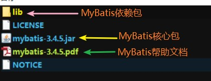

> 注：在搭建MyBatis环境时，记得加入MySQL/Oracle的驱动包

### 2.2. MyBatis 基本使用步骤

#### 2.2.1. log4j.properties

log4j.properties文件的内容在MyBatis帮助文档可以查询


log4j.properties示例：

```properties
# Global logging configuration
log4j.rootLogger=debug, stdout
# MyBatis logging configuration...
log4j.logger.org.mybatis.example.BlogMapper=TRACE
# Console output...
log4j.appender.stdout=org.apache.log4j.ConsoleAppender
log4j.appender.stdout.layout=org.apache.log4j.PatternLayout
log4j.appender.stdout.layout.ConversionPattern=%5p [%t] - %m%n
```

#### 2.2.2. 搭建MyBatis开发环境


- SqlMapConfig.xml是MyBatis全局配置文件
- sqlmap包是存放mapper.xml映射配置文件

#### 2.2.3. MyBatis的依赖

配置pom.xml文件

```xml
<!-- mybatis核心包 -->
<dependency>
	<groupId>org.mybatis</groupId>
	<artifactId>mybatis</artifactId>
	<version>${mybatis.version}</version>
</dependency>
```

> 注：在搭建MyBatis环境时，记得加入MySQL/Oracle的驱动包依赖

#### 2.2.4. SqlMapConfig.xml（MyBatis全局配置文件）

配置 mybatis 的运行环境，数据源、事务等。了解即可，因为在整合 Spring 的时候，这个配置文件的标签都不用了

> <font color=red>注：mybatis 框架需要加载 Mapper.xml 映射文件</font>

SqlMapConfig.xml 示例：

```xml
<?xml version="1.0" encoding="UTF-8" ?>
<!DOCTYPE configuration
	PUBLIC "-//mybatis.org//DTD Config 3.0//EN"
	"http://mybatis.org/dtd/mybatis-3-config.dtd">
<configuration>
	<!-- 和Spring整合后environments标签配置将废除 -->
	<!-- 运行环境配置 -->
	<!-- default属性：指定默认使用哪一个运行环境 -->
	<environments default="development">
		<!-- 配置运行环境，说明：
			id属性：给运行环境取一个唯一的名称
		 -->
		<environment id="development">
			<!-- 使用jdbc事务管理，事务控制由MyBatis管理 -->
			<transactionManager type="JDBC" />
			<!-- 数据库连接池，由MyBatis管理
				type：指定mybatis内部提供的连接池
			 -->
			<dataSource type="POOLED">
				<property name="driver" value="com.mysql.jdbc.Driver" />
				<property name="url" value="jdbc:mysql://localhost:3306/day97_mybatis" />
				<property name="username" value="root" />
				<property name="password" value="123456" />
			</dataSource>
		</environment>
	</environments>
	<!-- 加载映射文件 -->
	<mappers>
		<!-- resource属性：加载的映射文件路径 -->
		<mapper resource="sqlmap/User.xml" />
	</mappers>
</configuration>
```

全局配置文件模版在参考文档可以查询


#### 2.2.5. 映射文件(XxxMapper.xml)

**映射文件命名格式**：

- User.xml（原始ibatis命名方式）
- <font color=red>**mapper代理开发映射文件名称格式：XxxMapper.xml**</font>，如：UserMapper.xml、ItemsMapper.xml。**在映射文件中配置sql语句**

映射配置文件模版在参考文档可以查询


映射配置文件初始模版：（*可以在IDE里设置文件模版，快速生成*）

```xml
<?xml version="1.0" encoding="UTF-8" ?>
<!DOCTYPE mapper
	PUBLIC "-//mybatis.org//DTD Mapper 3.0//EN"
	"http://mybatis.org/dtd/mybatis-3-mapper.dtd">
<mapper>
	......
</mapper>
```

#### 2.2.6. 基本使用程序步骤

1. 创建SqlSessionFactoryBuilder对象
2. 加载SqlMapConfig.xml配置文件
3. 创建SqlSessionFactory对象
4. 创建SqlSession对象
5. 执行SqlSession对象执行查询，获取结果
6. 释放资源

## 3. MyBatis 小结

### 3.1. 原生 JDBC 存在问题

1. 数据库连接，使用时就创建，不使用立即释放。对数据库进行频繁连接开启和关闭，造成数据库资源浪费，影响数据库性能

> 解决方案：使用数据库连接池管理数据库连接。MyBatis内部自带连接池

2. 将sql语句硬编码到java代码中，在企业项目中，sql语句变化的需求比较大。如果sql语句修改，需要重新编译java代码，不利于系统维护

> 解决方案：将sql语句配置在xml配置文件中，即使sql语句变化，不需要对java代码进行重新编译

3. 向preparedStatement中设置参数，对占位符位置和设置参数值，硬编码在java代码中，不利于系统维护

> 解决方案：将sql语句及占位符和参数全部配置在xml配置文件中

4. 从resultSet中遍历结果集数据时，存在硬编码，将获取表的字段进行硬编码，不利于系统维护。如果可以映射成java对象会比较方便

> 解决方案：将查询的结果集，自动映射成java对象

### 3.2. 使用 MyBatis 解决 JDBC 编程的问题

1. 数据库连接创建、释放频繁造成系统资源浪费从而影响系统性能，如果使用数据库连接池可解决此问题。

> MyBatis解决方案：在SqlMapConfig.xml中配置数据连接池，使用连接池管理数据库链接。

2. Sql语句写在代码中造成代码不易维护，实际应用sql变化的可能较大，sql变动需要改变java代码。

> MyBatis解决方案：将Sql语句配置在XXXXmapper.xml文件中与java代码分离。

3. 向sql语句传参数麻烦，因为sql语句的where条件不一定，可能多也可能少，占位符需要和参数一一对应。

> MyBatis解决方案：Mybatis自动将java对象映射至sql语句，通过statement中的parameterType定义输入参数的类型。

4. 对结果集解析麻烦，sql变化导致解析代码变化，且解析前需要遍历，如果能将数据库记录封装成pojo对象解析比较方便。

> MyBatis解决方案：Mybatis自动将sql执行结果映射至java对象，通过statement中的resultType定义输出结果的类型。

### 3.3. MyBatis 框架执行流程

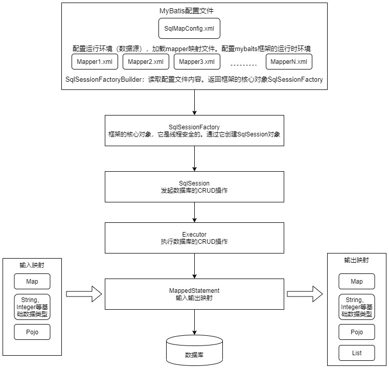

1. SqlSessionFactoryBuilder：读取配置文件内容。返回框架的核心对象 SqlSessionFactory
    - `SqlMapConfig.xml`（是mybatis的全局配置文件，名称不固定的）：配置了数据源、事务等mybatis运行环境
    - `mapper1.xml（映射文件）、mapper2.xml、mapperN.xml.....	`：配置映射文件（配置sql语句），相当于每个实体类与数据库映射
2. SqlSessionFactory（会话工厂），根据配置文件创建会话工厂。一旦被创建就应该在应用的运行期间一直存在，是单例。
    - 作用：创建SqlSession
3. SqlSession（会话），是一个接口，面向用户（程序员）的接口。由会话工厂 SqlSessionFactory 创建，每个线程都有它自己的 SqlSession 实例。
    - 作用：该对象中包含了执行 SQL 语句的所有方法。发送 SQL 操作数据库（增、删、改、查）
4. Executor（执行器），是一个接口（基本执行器、缓存执行器）。
    - 作用：根据 SqlSession 传递的参数动态地生成需要执行的 SQL 语句来操作数据库，同时负责查询缓存的维护。
5. MappedStatement（底层封装对象，输入输出映射对象，ParameterType参数输入，ResultType）：在 Executor 接口的执行方法中有一个 MappedStatement 类型的参数，该参数是对映射信息的封装，用于存储要映射的 SQL 语句的 id、参数等信息。
    - 作用：对操作数据库存储封装，包括 sql语句，**输入参数、输出结果类型**
    - 输入参数映射：输入参数类型可以是java基本数据类型、Map、List 等集合类型、自定义 POJO 类等。输入参数映射过程类似于 JDBC 对 `PreparedStatement` 对象设置参数的过程
    - 输出结果映射：输出结果类型可以是java基本数据类型、Map、List 等集合类型、自定义 POJO 类等。输出结果映射过程类似于 JDBC 对结果集的解析过程
6. 操作数据库

## 4. MyBatis开发数据层

### 4.1. MyBatis开发数据层两种方式

使用MyBatis开发Dao，通常有两种方式：

1. 原始Dao开发：需要开发接口和实现类
2. Mapper动态代理开发：只需要开发接口

企业项目开发，推荐mapper代理方式

### 4.2. MyBaties原始 dao 开发方式

#### 4.2.1. 原始dao开发的步骤

原始Dao开发方法需要编写Dao接口和Dao实现类

#### 4.2.2. 原始dao开发方式demo

1. 编写映射文件。使用原来开发的映射配置文件即可，即User.xml
2. 编写dao接口与实现类

```java
public interface IUserDao {
	/**
	 * 根据id查询
	 */
	User findUserById(Integer id);
	/**
	 * 根据用户名模糊查询
	 */
	List<User> findUserByName(String username);
	/**
	 * 插入数据
	 */
	void insertUser(User user);
}
```

```java
public class UserDaoImpl implements IUserDao {
	// 手动注入sqlSessionFactory
	private SqlSessionFactory sqlSessionFactory;
	// 创建构造方法
	public UserDaoImpl(SqlSessionFactory sqlSessionFactory) {
		super();
		this.sqlSessionFactory = sqlSessionFactory;
	}
	@Override
	public User findUserById(Integer id) {
		// 创建sqlSession
		SqlSession sqlSession = sqlSessionFactory.openSession();
		// 执行sql语句
		User user = sqlSession.selectOne("findUserById", id);
		// 释放资源
		sqlSession.close();
		return user;
	}
	@Override
	public List<User> findUserByName(String name) {
		// 创建sqlSession
		SqlSession sqlSession = sqlSessionFactory.openSession();
		// 执行sql语句
		List<User> users = sqlSession.selectList("findUserByName", name);
		// 释放资源
		sqlSession.close();
		return users;
	}
	@Override
	public void insertUser(User user) {
		// 创建sqlSession
		SqlSession sqlSession = sqlSessionFactory.openSession(true);
		// 执行sql语句
		sqlSession.insert("insertUser", user);
		// 释放资源
		sqlSession.close();
	}
}
```

3. 编写测试类

```java
public class MyBatisTest02 {
	// 初始化时注入sqlSessionFactory
	private SqlSessionFactory sqlSessionFactory;
	// 使用实现类，注入dao层对象
	private IUserDao userDao;
	/**
	 * 运行测试方法前创建工厂
	 */
	@Before
	public void init() throws IOException {
		// 定义MyBatis配置文件字符串
		String config = "SqlMapConfig.xml";
		// 获取输入流对象
		InputStream is = Resources.getResourceAsStream(config);
		// 创建会话工厂
		sqlSessionFactory = new SqlSessionFactoryBuilder().build(is);
		// 使用实现类，注入dao层对象
		userDao = new UserDaoImpl(sqlSessionFactory);
	}
	/**
	 * 测试查询单个对象方法
	 */
	@Test
	public void findUserByIdTest() {
		// 调用dao层方法
		User user = userDao.findUserById(1);
		System.out.println(user);
	}
	/**
	 * 测试模糊查询
	 */
	@Test
	public void findUserByNameTest() {
		// 调用dao层方法
		List<User> users = userDao.findUserByName("%小明%");
		// 遍历集合
		if (users != null && users.size() > 0) {
			for (User user : users) {
				System.out.println(user);
			}
		}
	}
	/**
	 * 测试插入数据
	 */
	@Test
	public void insertUserTest() {
		// 创建插入的对象
		User user = new User();
		user.setUsername("测试一下");
		user.setAddress("123456");
		user.setBirthday(new Date());
		// 调用dao层方法
		userDao.insertUser(user);
	}
}
```

#### 4.2.3. 总结原始dao开发问题

1. dao接口实现类方法中存在大量模板方法，设想能否将这些代码提取出来，大大减轻程序员的工作量
2. 调用sqlsession方法时将statement的id硬编码了
3. 调用sqlsession方法时传入的变量，由于sqlsession方法使用泛型，即使变量类型传入错误，在编译阶段也不报错，不利于程序员开发

### 4.3. MyBatis的Mapper动态代理方式开发数据层【重点】

#### 4.3.1. Mapper动态代理开发规则【重点】

Mapper接口开发方法只需要编写Mapper接口（相当于Dao接口），由Mybatis框架根据接口定义创建接口的动态代理对象，代理对象的方法体同上边Dao接口实现类方法。

mybatis官方推荐使用mapper代理方法开发mapper接口，程序员不用编写mapper接口实现类，使用mapper代理方法时，输入参数可以使用pojo包装对象或map对象，保证dao的通用性。

- **Mapper接口开发需要遵循以下规范**：
    1. Mapper.xml文件中的**namespace属性值必须与mapper接口的全限定名称相同**（包名称+类名称）。
    2. Mapper接口**方法名**和Mapper.xml中定义的每个statement操作**标签的id**相同
    3. Mapper接口方法的**输入参数类型**和mapper.xml中定义的每个sql 的**parameterType的类型**相同
    4. Mapper接口方法的**输出参数类型**和mapper.xml中定义的每个sql的**resultType的类型**相同。如果返回值的类型是一个集合，此时ResultType指定的类型，是集合中存放的类型。

#### 4.3.2. Mapper动态代理方式步骤

1. 定义mapper映射文件，UserMapper.xml文件。必须配置`<mapper>`根标签的`namepace`属性，指定UserMapper.xml映射的对应**接口类全名**。如：`<mapper namespace="com.moon.mapper.UserMapper">`
2. 编写数据层接口，命名规则一般为`XxxMapper.java`。与MyBatis原始dao开发接口一样
3. 在MyBatis总配置文件（SqlMapConfig.xml）中，加载mapper代理配置文件（UserMapper.xml）

```xml
<!-- 加载映射文件 -->
<mappers>
	<!-- resource属性：加载的映射文件路径 -->
	<mapper resource="sqlmap/UserMapper.xml" />
</mappers>
```

4. 编写测试案例

注：当加载映射文件时使用`<package name="" />`子标签。包扫描方式配置映射文件，扫描该包下的所有mapper接口映射文件。`<package>`标签的`name`属性配置需要扫描的包名

**包扫描方式使用要求**：

1. 前提是mapper代理开发方法
2. 要求mapper映射文件，与mapper接口要放在同一目录
3. 要求mapper映射文件的名称，与mapper接口的名称要一致


#### 4.3.3. Mapper动态代理方式开发数据层demo

1. UserMapper接口，不需要编写实现类，在mapper映射配置文件指定映射对应的

```java
public interface UserMapper {
	/**
	 * 根据id查询
	 */
	User findUserById(Integer id);
	/**
	 * 根据用户名模糊查询
	 */
	List<User> findUserByName(String username);
	/**
	 * 插入数据
	 */
	void insertUser(User user);
}
```

2. 编写测试类

```java
public class MyBatisTest03_Mapper {
	// 初始化时注入sqlSessionFactory
	private SqlSessionFactory sqlSessionFactory;
	/**
	 * 运行测试方法前创建工厂(模拟使用spring整合)
	 */
	@Before
	public void init() throws IOException {
		// 定义MyBatis配置文件字符串
		String config = "SqlMapConfig.xml";
		// 获取输入流对象
		InputStream is = Resources.getResourceAsStream(config);
		// 创建会话工厂
		sqlSessionFactory = new SqlSessionFactoryBuilder().build(is);
	}
	/**
	 * 测试查询单个对象方法
	 */
	@Test
	public void findUserByIdTest() {
		// 1.创建sqlSession对象
		SqlSession sqlSession = sqlSessionFactory.openSession();
		// 2.从sqlSession对象获取mapper代理对象
		UserMapper mapper = sqlSession.getMapper(UserMapper.class);
		// 3.调用动态代理的方法
		User user = mapper.findUserById(1);
		System.out.println(user);
		// 4.释放资源
		sqlSession.close();
	}
	/**
	 * 测试模糊查询
	 */
	@Test
	public void findUserByNameTest() {
		// 1.创建sqlSession对象
		SqlSession sqlSession = sqlSessionFactory.openSession();
		// 2.从sqlSession对象获取mapper代理对象
		UserMapper mapper = sqlSession.getMapper(UserMapper.class);
		// 3.调用动态代理的方法
		List<User> users = mapper.findUserByName("%小明%");
		// 遍历集合
		if (users != null && users.size() > 0) {
			for (User user : users) {
				System.out.println(user);
			}
		}
		// 4.释放资源
		sqlSession.close();
	}
	/**
	 * 测试插入数据
	 */
	@Test
	public void insertUserTest() {
		// 创建插入的对象
		User user = new User();
		user.setUsername("测试一下");
		user.setAddress("123456");
		user.setBirthday(new Date());
		// 1.创建sqlSession对象(开启自动提交事务)
		SqlSession sqlSession = sqlSessionFactory.openSession(true);
		// 2.从sqlSession对象获取mapper代理对象
		UserMapper mapper = sqlSession.getMapper(UserMapper.class);
		// 3.调用动态代理的方法
		mapper.insertUser(user);
		// 4.释放资源
		sqlSession.close();
	}
}
```

## 5. SqlMapConfig.xml（MyBatis 总配置文件）

### 5.1. 配置文件内容顺序

SqlMapConfig.xml中配置的内容和顺序如下：（必须按顺序，否则为报错）

- configuration（配置根标签）
    - properties（属性）
    - settings（设置全局配置参数）
    - typeAliases（类型别名）
    - typeHandlers（类型处理器）
    - objectFactory（对象工厂）
    - plugins（插件）
    - environments（环境集合配置）
        - environment（环境子属性对象）
            - transactionManager（事务管理器）
            - dataSource（数据源）
    - databaseIdProvider（数据库厂商标识）
    - mappers（映射器）

### 5.2. properties 属性标签

#### 5.2.1. 配置属性

1. `resource`属性：指定本地属性文件的位置
2. `url`属性：指定网络上的配置文件位置（用于放置多个服务器统一使用一份配置文件）
3. 使用内部`property`标签，定义属性。子标签示例：`<property name="" value=""/>`
4. 加载顺序：先加载内部property标签定义的属性；再加上属性文件中定义的属性。如果有相同的属性，属性文件中的属性会覆盖内部property标签定义的属性

> 注：在配置文件中使用el表达式获取值

sqlMapConfig.xml文件`<properties>`标签示例：

```xml
<!-- 加载属性文件和定义属性 ,说明：
	1.resource：指定本地的配置文件位置
	2.url：指定网络上的配置文件位置（http://127.0.0.1:8080/db.properties）
	3.使用内部property标签，定义属性
	4.加载顺序：先加载内部property标签定义的属性；再加上属性文件中定义的属性。如果有相同的属性，
		属性文件中的属性，覆盖内部property标签定义的属性
-->
<!-- <properties resource="db.properties" /> -->
<!-- <properties resource="http://localhost:8080/db.properties" /> -->
<properties resource="db.properties">
	<property name="username" value="rootX"/>
	<property name="password" value="123456"/>
</properties>
...省略内容
<dataSource type="POOLED">
	<property name="driver" value="${db.driver}" />
	<property name="url" value="${db.url}" />
	<property name="username" value="${db.username}" />
	<property name="password" value="${db.password}" />
</dataSource>
```

除了通过`<properties>`标签的方式，也可以在 `SqlSessionFactoryBuilder.build()` 方法中传入属性值。

```java
SqlSessionFactory factory = new SqlSessionFactoryBuilder().build(reader, props);
// ... 或者 ...
SqlSessionFactory factory = new SqlSessionFactoryBuilder().build(reader, environment, props);
```

<font color=red>**注意：如果一个属性在不只一个地方进行了配置，MyBatis将按照下面的顺序来加载属性**</font>：

1. 在properties元素体内定义的属性首先被读取。
2. 然后会读取properties元素中resource或url加载的属性，它会覆盖已读取的同名属性。
3. 最后读取作为方法参数传递的属性，并覆盖之前读取过的同名属性。

因此，<font color=red>**通过方法参数传递的属性具有最高优先级，resource/url 属性中指定的配置文件次之，最低优先级的则是 properties 元素中指定的属性。**</font>

#### 5.2.2. 属性默认值

从 MyBatis 3.4.2 开始，可以为占位符指定一个默认值。例如：

```xml
<dataSource type="POOLED">
  ...省略内容
  <property name="username" value="${username:ut_user}"/> <!-- 如果属性 'username' 没有被配置，'username' 属性的值将为 'ut_user' -->
</dataSource>
```

这个特性默认是关闭的。要启用这个特性，需要添加一个特定的属性来开启这个特性。例如：

```xml
<properties resource="org/mybatis/example/config.properties">
  ...省略内容
  <property name="org.apache.ibatis.parsing.PropertyParser.enable-default-value" value="true"/> <!-- 启用默认值特性 -->
</properties>
```

#### 5.2.3. 属性名中的“:”字符处理

**提示**：如果在属性名中使用了"`:`"字符（如：`db:username`），或者在 SQL 映射中使用了 OGNL 表达式的三元运算符（如：`${tableName != null ? tableName : 'global_constants'}`），就需要设置特定的属性来修改分隔属性名和默认值的字符。例如：

```xml
<properties resource="org/mybatis/example/config.properties">
  ...省略内容
  <property name="org.apache.ibatis.parsing.PropertyParser.default-value-separator" value="?:"/> <!-- 修改默认值的分隔符 -->
</properties>
```

```xml
<dataSource type="POOLED">
  ...省略内容
  <property name="username" value="${db:username?:ut_user}"/>
</dataSource>
```

### 5.3. settings 设置标签

#### 5.3.1. 配置示例

1. 在`<settings>`标签中，配置用生成的主键值

```xml
<setting name="useGeneratedKeys" value="true" />
```

2. 在`<settings>`标签中，配置开启驼峰命名(方便自动映射)。

```xml
<setting name="mapUnderscoreToCamelCase" value="true" />
```

> 效果说明：当数据库表的字段为dept_id，会自动转换成deptId

#### 5.3.2. 相关设置含义清单

> 这是 MyBatis 中极为重要的调整设置，它们会改变 MyBatis 的运行时行为。 下表描述了设置中各项设置的含义、默认值等。(官网提供)

| 设置名                            | 描述                                                                                                                                                                                                                              | 有效值                                                                                      | 默认值                                                 |
| :------------------------------- | :-------------------------------------------------------------------------------------------------------------------------------------------------------------------------------------------------------------------------------- | :----------------------------------------------------------------------------------------- | :---------------------------------------------------- |
| cacheEnabled                     | 全局性地开启或关闭所有映射器配置文件中已配置的任何缓存。                                                                                                                                                                                | true \| false                                                                              | true                                                  |
| lazyLoadingEnabled               | 延迟加载的全局开关。当开启时，所有关联对象都会延迟加载。 特定关联关系中可通过设置 `fetchType` 属性来覆盖该项的开关状态。                                                                                                                     | true \| false                                                                              | false                                                 |
| aggressiveLazyLoading            | 开启时，任一方法的调用都会加载该对象的所有延迟加载属性。 否则，每个延迟加载属性会按需加载（参考 `lazyLoadTriggerMethods`)。                                                                                                                 | true \| false                                                                              | false （在 3.4.1 及之前的版本中默认为 true）             |
| multipleResultSetsEnabled        | 是否允许单个语句返回多结果集（需要数据库驱动支持）。                                                                                                                                                                                   | true \| false                                                                              | true                                                  |
| useColumnLabel                   | 使用列标签代替列名。实际表现依赖于数据库驱动，具体可参考数据库驱动的相关文档，或通过对比测试来观察。                                                                                                                                         | true \| false                                                                              | true                                                  |
| useGeneratedKeys                 | 允许 JDBC 支持自动生成主键，需要数据库驱动支持。如果设置为 true，将强制使用自动生成主键。尽管一些数据库驱动不支持此特性，但仍可正常工作（如 Derby）。                                                                                           | true \| false                                                                              | False                                                 |
| autoMappingBehavior              | 指定 MyBatis 应如何自动映射列到字段或属性。 NONE 表示关闭自动映射；PARTIAL 只会自动映射没有定义嵌套结果映射的字段。 FULL 会自动映射任何复杂的结果集（无论是否嵌套）。                                                                            | NONE, PARTIAL, FULL                                                                        | PARTIAL                                               |
| autoMappingUnknownColumnBehavior | 指定发现自动映射目标未知列（或未知属性类型）的行为。`NONE`: 不做任何反应`WARNING`: 输出警告日志（`'org.apache.ibatis.session.AutoMappingUnknownColumnBehavior'` 的日志等级必须设置为 `WARN`）`FAILING`: 映射失败 (抛出 `SqlSessionException`) | NONE, WARNING, FAILING                                                                     | NONE                                                  |
| defaultExecutorType              | 配置默认的执行器。SIMPLE 就是普通的执行器；REUSE 执行器会重用预处理语句（PreparedStatement）； BATCH 执行器不仅重用语句还会执行批量更新。                                                                                                    | SIMPLE REUSE BATCH                                                                         | SIMPLE                                                |
| defaultStatementTimeout          | 设置超时时间，它决定数据库驱动等待数据库响应的秒数。                                                                                                                                                                                   | 任意正整数                                                                                  | 未设置 (null)                                          |
| defaultFetchSize                 | 为驱动的结果集获取数量（fetchSize）设置一个建议值。此参数只可以在查询设置中被覆盖。                                                                                                                                                       | 任意正整数                                                                                  | 未设置 (null)                                          |
| defaultResultSetType             | 指定语句默认的滚动策略。（新增于 3.5.2）                                                                                                                                                                                             | FORWARD_ONLY \| SCROLL_SENSITIVE \| SCROLL_INSENSITIVE \| DEFAULT（等同于未设置）            | 未设置 (null)                                          |
| safeRowBoundsEnabled             | 是否允许在嵌套语句中使用分页（RowBounds）。如果允许使用则设置为 false。                                                                                                                                                                 | true \| false                                                                              | False                                                 |
| safeResultHandlerEnabled         | 是否允许在嵌套语句中使用结果处理器（ResultHandler）。如果允许使用则设置为 false。                                                                                                                                                       | true \| false                                                                              | True                                                  |
| mapUnderscoreToCamelCase         | 是否开启驼峰命名自动映射，即从经典数据库列名 A_COLUMN 映射到经典 Java 属性名 aColumn。                                                                                                                                                  | true \| false                                                                              | False                                                 |
| localCacheScope                  | MyBatis 利用本地缓存机制（Local Cache）防止循环引用和加速重复的嵌套查询。 默认值为 SESSION，会缓存一个会话中执行的所有查询。 若设置值为 STATEMENT，本地缓存将仅用于执行语句，对相同 SqlSession 的不同查询将不会进行缓存。                           | SESSION \| STATEMENT                                                                       | SESSION                                               |
| jdbcTypeForNull                  | 当没有为参数指定特定的 JDBC 类型时，空值的默认 JDBC 类型。 某些数据库驱动需要指定列的 JDBC 类型，多数情况直接用一般类型即可，比如 NULL、VARCHAR 或 OTHER。                                                                                     | JdbcType 常量，常用值：NULL、VARCHAR 或 OTHER。                                              | OTHER                                                 |
| lazyLoadTriggerMethods           | 指定对象的哪些方法触发一次延迟加载。                                                                                                                                                                                                  | 用逗号分隔的方法列表。                                                                       | equals,clone,hashCode,toString                        |
| defaultScriptingLanguage         | 指定动态 SQL 生成使用的默认脚本语言。                                                                                                                                                                                                | 一个类型别名或全限定类名。                                                                    | org.apache.ibatis.scripting.xmltags.XMLLanguageDriver |
| defaultEnumTypeHandler           | 指定 Enum 使用的默认 `TypeHandler` 。（新增于 3.4.5）                                                                                                                                                                               | 一个类型别名或全限定类名。                                                                    | org.apache.ibatis.type.EnumTypeHandler                |
| callSettersOnNulls               | 指定当结果集中值为 null 的时候是否调用映射对象的 setter（map 对象时为 put）方法，这在依赖于 Map.keySet() 或 null 值进行初始化时比较有用。注意基本类型（int、boolean 等）是不能设置成 null 的。                                                  | true \| false                                                                              | false                                                 |
| returnInstanceForEmptyRow        | 当返回行的所有列都是空时，MyBatis默认返回 `null`。 当开启这个设置时，MyBatis会返回一个空实例。 请注意，它也适用于嵌套的结果集（如集合或关联）。（新增于 3.4.2）                                                                                 | true \| false                                                                              | false                                                 |
| logPrefix                        | 指定 MyBatis 增加到日志名称的前缀。                                                                                                                                                                                                 | 任何字符串                                                                                  | 未设置                                                 |
| logImpl                          | 指定 MyBatis 所用日志的具体实现，未指定时将自动查找。                                                                                                                                                                                 | SLF4J \| LOG4J \| LOG4J2 \| JDK_LOGGING \| COMMONS_LOGGING \| STDOUT_LOGGING \| NO_LOGGING | 未设置                                                 |
| proxyFactory                     | 指定 Mybatis 创建可延迟加载对象所用到的代理工具。                                                                                                                                                                                     | CGLIB \| JAVASSIST                                                                         | JAVASSIST （MyBatis 3.3 以上）                         |
| vfsImpl                          | 指定 VFS 的实现                                                                                                                                                                                                                    | 自定义 VFS 的实现的类全限定名，以逗号分隔。                                                    | 未设置                                                 |
| useActualParamName               | 允许使用方法签名中的名称作为语句参数名称。 为了使用该特性，你的项目必须采用 Java 8 编译，并且加上 `-parameters` 选项。（新增于 3.4.1）                                                                                                       | true \| false                                                                              | true                                                  |
| configurationFactory             | 指定一个提供 `Configuration` 实例的类。 这个被返回的 Configuration 实例用来加载被反序列化对象的延迟加载属性值。 这个类必须包含一个签名为`static Configuration getConfiguration()` 的方法。（新增于 3.2.3）                                     | 一个类型别名或完全限定类名。                                                                  | 未设置                                                 |
| shrinkWhitespacesInSql           | 从SQL中删除多余的空格字符。请注意，这也会影响SQL中的文字字符串。 (新增于 3.5.5)                                                                                                                                                          | true \| false                                                                              | false                                                 |
| defaultSqlProviderType           | Specifies an sql provider class that holds provider method (Since 3.5.6). This class apply to the `type`(or `value`) attribute on sql provider annotation(e.g. `@SelectProvider`), when these attribute was omitted.              | A type alias or fully qualified class name                                                 | Not set                                               |

一个配置完整的 settings 元素的示例如下：

```xml
<settings>
  <setting name="cacheEnabled" value="true"/>
  <setting name="lazyLoadingEnabled" value="true"/>
  <setting name="multipleResultSetsEnabled" value="true"/>
  <setting name="useColumnLabel" value="true"/>
  <setting name="useGeneratedKeys" value="false"/>
  <setting name="autoMappingBehavior" value="PARTIAL"/>
  <setting name="autoMappingUnknownColumnBehavior" value="WARNING"/>
  <setting name="defaultExecutorType" value="SIMPLE"/>
  <setting name="defaultStatementTimeout" value="25"/>
  <setting name="defaultFetchSize" value="100"/>
  <setting name="safeRowBoundsEnabled" value="false"/>
  <setting name="mapUnderscoreToCamelCase" value="false"/>
  <setting name="localCacheScope" value="SESSION"/>
  <setting name="jdbcTypeForNull" value="OTHER"/>
  <setting name="lazyLoadTriggerMethods" value="equals,clone,hashCode,toString"/>
</settings>
```

### 5.4. typeAliases 类型别名标签

#### 5.4.1. mybatis 本身所支持的别名

|    别名    | 映射类型 |    别名    |  映射类型   |
| ---------- | ------- | ---------- | ---------- |
| `_byte`    | byte    | double     | Double     |
| `_long`    | long    | float      | Float      |
| `_short`   | short   | boolean    | Boolean    |
| `_int`     | int     | date       | Date       |
| `_integer` | int     | decimal    | BigDecimal |
| `_double`  | double  | bigdecimal | BigDecimal |
| `_float`   | float   | object     | Object     |
| `_boolean` | boolean | map        | Map        |
| string     | String  | hashmap    | HashMap    |
| byte       | Byte    | list       | List       |
| long       | Long    | arraylist  | ArrayList  |
| short      | Short   | collection | Collection |
| int        | Integer | iterator   | Iterator   |
| integer    | Integer |            |            |

说明：

1. 内置别名可以直接使用
2. 别名不区分大小写

*注：mybatis内置别名中，没有配置set集合，所以mybatis中使用List比较多*

#### 5.4.2. 自定义别名

##### 5.4.2.1. 方式1：typeAlias 子标签

1. `type`属性：指定别名的类型
2. 默认使用类的名称，作为别名的名称
3. `alias`：指定别名的名称

sqlMapConfig.xml文件配置示例：

```xml
<!-- 自定义别名配置 -->
<typeAliases>
	<!-- 配置用户的别名，说明：
		1.type：指定别名的类型
		2.默认使用类的名称，作为别名的名称
		3.alias：指定别名的名称
	 -->
	<typeAlias type="com.moon.entity.User" alias="user"/>
</typeAliases>
```

Mapper.xml 文件配置示例：

```xmL
<select id="findUserById" parameterType="int" resultType="user">
	select * from `user` where id=#{id}
</select>
```

##### 5.4.2.2. 方式2：package 子标签

1. `name`属性：配置要扫描的包
2. 默认都使用类的名称作为别名的名称
3. 如果有多个包，在同一个父包，配置父包即可
4. 如果不在同一个父下，配置多个`<package>`

sqlMapConfig.xml文件包扫描方式配置别名示例：

```xml
<typeAliases>
	<!-- 包扫描方式配置别名，说明：
		1.name：配置要扫描的包
		2.默认都使用类的名称作为别名的名称
		3.如果有多个包，在同一个父包，配置父包即可
		4.如果不在同一个父包下，配置多个package
		5.在企业项目中，推荐使用包扫描方式
	 -->
	 <package name="com.moon.entity"/>
</typeAliases>
```

<font color=purple>*注：实现开发中，推荐使用包扫描方式*</font>

每一个在包`com.moon.entity`中的 Java Bean，在没有注解的情况下，会使用 Bean 的首字母小写的非限定类名来作为它的别名。比如`com.moon.entity.Author`的别名为`author`；若有注解，则别名为其注解值。见下面的例子：

```java
@Alias("author")
public class Author {
    ...
}
```

#### 5.4.3. 配置别名示例

sqlMapConfig.xml文件综合配置别名示例：

```xmL
<typeAliases>
	<!-- 单个别名定义 -->
	<typeAlias alias="user" type="com.moon.mybatis.pojo.User" />
	<!-- 批量别名定义，扫描整个包下的类，别名为类名（大小写不敏感） -->
	<package name="com.moon.mybatis.pojo" />
	<package name="其它包" />
</typeAliases>
```

### 5.5. （待整理）environments 环境配置标签

> TODO: 待整理

### 5.6. mappers 映射器标签

`<mappers>`映射器标签用于定义 SQL 映射语句，可以使用相对于类路径的资源引用，或完全限定资源定位符（包括 `file:///` 形式的 URL），或类名和包名等。

#### 5.6.1. mapper 标签的 resource 属性

使用相对于类路径的资源（现在的使用方式），resource：指定配置文件的位置。如下：

```xml
<mapper resource="sqlmap/User.xml" />
```

#### 5.6.2. mapper 标签的 url 属性

url引用的完全限定名（包括`file:///URLs`）

```xml
<!-- 使用完全限定资源定位符（URL） -->
<mappers>
  <mapper url="file:///var/mappers/AuthorMapper.xml"/>
  <mapper url="file:///var/mappers/BlogMapper.xml"/>
  <mapper url="file:///var/mappers/PostMapper.xml"/>
</mappers>
```

#### 5.6.3. mapper 标签的 class 属性

使用mapper接口类路径。注意：此种方法要求mapper接口名称和mapper映射文件名称相同，且放在同一个目录中。

```xml
<mappers>
	<!--
		<mapper class=" " />子标签
		使用mapper接口类路径
		此种方法要求mapper接口名称和mapper映射文件名称相同，且放在同一个目录中。
	-->
	<mapper class="com.moon.mapper.UserMapper"/>
</mappers>
```

#### 5.6.4. package 标签的 name 属性

包扫描方式配置映射文件，扫描该包下的所有mapper接口。其中`name`属性是配置需要扫描的包名。包扫描方式使用要求如下：

1. 前提是mapper代理开发方法
2. 要求mapper映射文件，与mapper接口要放在同一目录
3. 要求mapper映射文件的名称，与mapper接口的名称要一致

```xml
<mappers>
	<!-- 包扫描方式配置映射文件，说明：
		1.前提是mapper代理开发方法
		2.要求mapper映射文件，与mapper接口要放在同一目录
		3.要求mapper映射文件的名称，与mapper接口的名称要一致
	-->
	<package name="com.moon.mapper"/>
</mappers>
```

## 6. Mapper.xml（SQL映射文件）

### 6.1. 映射文件编写注意问题

- 映射文件中，`<select>`标签体内的sql语句不能出现“`;`”结尾
- `namespace`属性：命名空间，作用就是对 sql 进行分类化管理，理解为 sql 隔离；<font color=red>**注意：！！使用 mapper 代理方法开发，namespace 必须和 Mapper 代理接口的全限定名称一致**</font>

### 6.2. select 查询映射

#### 6.2.1. 标签作用与属性

`<select>`标签的作用是MyBatis对数据库表数据进行查询操作，用于定义sql查询映射

- `id`属性：标识映射文件中的sql，将sql语句封装到mappedStatement对象中，将id称为mappedStatement的id
- `parameterType`属性：在映射文件中通过parameterType指定输入参数的类型
- `resultType`属性：在映射文件中通过resultType指定输出结果的类型。【指定的是返回结构单条记录对应的java对象类型】

#### 6.2.2. 使用MyBatis查询单个结果

1. 创建实体类。实体类作为MyBatis进行sql映射使用，实体类通常与数据库表一一对应。

2. 配置映射文件查询单个结果。创建映射文件User.xml文件

```xml
<?xml version="1.0" encoding="UTF-8" ?>
<!DOCTYPE mapper
	PUBLIC "-//mybatis.org//DTD Mapper 3.0//EN"
	"http://mybatis.org/dtd/mybatis-3-mapper.dtd">
<!--
	namespace命名空间，作用就是对sql进行分类化管理，理解为sql隔离
	注意：！！使用mapper代理方法开发，namespace必须和Mapper代理接口的全限定名称一致
 -->
<mapper namespace="test">
	<!-- 在映射文件中配置多条sql语句 -->
	<!--
		通过select标签执行数据库查询
		id属性：标识映射文件中的sql
			将sql语句封装到mappedStatement对象中，将id称为mappedStatement的id
		parameterType属性：指定输入参数的类型，例子是Long类型
		resultType属性：指定sql输出结果的所映射的java对象类型
						select指定resultType表示单条记录映射成的java对象

		在sql语句中，#{}表示一个占位符号
		#{id}:其中的id表示接收输入的参数，参数名称就是“id”，
				如果输入参数是基本数据类型，#{}中的参数名可以是任意，可以是value或者其它名称
	 -->
	<select id="findUserById" parameterType="int" resultType="com.moon.entity.User">
		select * from `user` where id=#{id}
	</select>
</mapper>
```

3. 编写测试程序

```java
public class MybatisTest01 {
	// 模拟注入sql工厂对象
	private SqlSessionFactory sqlSessionFactory;
	/**
	 * 初始化SqlSessionFactory对象
	 */
	@Before
	public void init() throws IOException {
		// 定义MyBatis配置文件字符串
		String resource = "SqlMapConfig.xml";
		// 1. 使用MyBatis提供的Resources类静态方法，得到配置文件输入流
		InputStream inputStream = Resources.getResourceAsStream(resource);
		// 2. 创建会话工厂，传入MyBatis的配置文件信息
		// 它是mybatis框架的核心对象，是线程安全的，一个应用中，通常只需要一个（单例设计模式）
		sqlSessionFactory = new SqlSessionFactoryBuilder().build(inputStream);
	}
	/**
	 * 根据id查询客户信息，返回一条查询记录
	 */
	@Test
	public void findUserByIdTest() throws IOException {
		// 3. 通过工厂得到SqlSession
		SqlSession sqlSession = sqlSessionFactory.openSession();
		// 4. 通过SqlSession操作数据库
		// 第1个参数statement：映射文件中的statement的id，等于映射文件中的namespace+"."+statement的id
		// 第2个参数parameter：指定和映射文件中所匹配的parameterType类型的参数
		// sqlSession.selectOne返回结果是与映射文件中所匹配的resultType类型的对象
		User user = sqlSession.selectOne("test.findUserById", 1);
		System.out.println(user);
		// 5. 关闭sqlSession，释放资源
		sqlSession.close();
	}
}
```

#### 6.2.3. 使用MyBatis查询多个结果

1. 配置映射文件模糊查询多个结果。映射文件User.xml如下：

```xml
<!-- 模糊查询，可能返回多个结果
	resultType属性：表示单条记录映射成的java对象，就算返回是集合，但集合中存放还是自定义类型

	${}：表示拼接sql串，将接收到参数的内容不加任何修饰拼接在sql中
		使用${}拼接sql，会引起sql注入问题【不安全，不建议使用】
	${value}：接收输入参数的内容，如果传入类型是简单类型，${}中只能使用value
 -->
<select id="findUserByName" parameterType="java.lang.String" resultType="com.moon.entity.User">
	<!-- where username like '%小明%',说明：
		字符串拼接符：${value},处理参数
	-->
	<!-- select * from `user` where username like '%${value}%' -->
	<!-- 对应方法需要传参数为"%小明%" -->
	select * from `user` where username like #{username}
</select>
```

2. 测试程序

```java
/**
 * 根据名字查询客户信息，可能返回多条查询记录
 */
@Test
public void findUserByNameTest() throws IOException {
	// 3. 通过工厂得到SqlSession
	SqlSession sqlSession = sqlSessionFactory.openSession();
	/* 4. 通过SqlSession操作数据库
	 * sqlSession.selectList:查询多条记录，返回结果是与映射文件中所匹配的resultType类型的对象 
	 * 第1个参数statement：映射文件中的statement的id，等于映射文件中的namespace+"."+statement的id
	 * 第2个参数parameter：指定和映射文件中所匹配的parameterType类型的参数
	 */
	List<User> users = sqlSession.selectList("test.findUserByName", "%小明%");
	for (User user : users) {
		System.out.println(user);
	}
	// 5. 关闭sqlSession，释放资源
	sqlSession.close();
}
```

### 6.3. insert 新增映射

#### 6.3.1. 标签作用与属性

`<insert>`标签的作用是MyBatis对数据库表数据进行新增操作，用于添加映射

- `parameterType`属性：在添加功能中指定输入类型是实体类
- `resultType`属性：指定`select LAST_INSERT_ID()`的结果类型

> 标签体可以定义主键的返回，详见下面的MyBatis基本使用

##### 6.3.1.1. 定义主键的方式1

- `select LAST_INSERT_ID()`：得到刚刚insert操作添加的记录的主键，只适用与自增主键
- `keyColumn` 属性：主键字段名（表）
- `keyProperty` 属性：将查询到主键值设置到`parameterType`指定的对象的哪一个属性中
- `order` 属性：指定`select LAST_INSERT_ID()`执行顺序，相对于insert语句来说的执行顺序
    - `BEFORE`：在insert语句执行之前；
    - `AFTER`：在insert语句执行之后；

##### 6.3.1.2. 定义主键的方式2

- `useGeneratedKeys="true"`，使用数据库的主键生成策略，默认值是true
- `keyColumn`：主键字段（表）
- `keyProperty`：主键属性（pojo）

oracle数据库中使用BEFORE:

```xml
<selectKey keyColumn="id" keyProperty="id" resultType="int" order="BEFORE">
	select seq.nextVal from dual;
</selectKey>
```

#### 6.3.2. 使用MyBatis添加数据

1. 配置映射文件添加数据，映射文件User.xml如下：

```xml
<!-- 添加功能<insert>标签
	parameterType属性：在添加功能中指定输入类型是实体类
	#{}中指定实体的属性名，接收到实体类对象的属性值，MyBatis是通过OGNL获取对象的属性值
		！占位符，当参数传递的是entity的时候，花括号中的内容是pojo的属性
 -->
<insert id="insertUser" parameterType="com.moon.entity.User">
	<!-- 将插入数据的主键返回，返回到User对象中
		select LAST_INSERT_ID()：得到刚刚insert操作添加的记录的主键，只适用与自增主键

		keyColumn属性：主键字段名（表）
		keyProperty属性：将查询到主键值设置到parameterType指定的对象的哪一个属性中
		order属性：指定select LAST_INSERT_ID()执行顺序，相对于insert语句来说的执行顺序
			BEFORE：在insert语句执行之前；
			AFTER：在insert语句执行之后；
		resultType属性：指定select LAST_INSERT_ID()的结果类型

			oracle数据库中使用BEFORE:
	 				<selectKey keyColumn="id" keyProperty="id" resultType="int" order="BEFORE">
		 	 	 	select seq.nextVal from dual;
		 	 	 </selectKey>
		 	 	insert into `user`(id,username,birthday,sex,address)
		 	 	values(#{id},#{username},#{birthday},#{sex},#{address})
	 -->
	 <selectKey keyProperty="id" order="AFTER" resultType="java.lang.Integer">
	 	select LAST_INSERT_ID()
	 </selectKey>
	insert into user(username,birthday,address) values(#{username},#{birthday},#{address})
</insert>

<!-- 定义主键的方式2
	useGeneratedKeys="true",使用数据库的主键生成策略，默认值是true
	keyColumn：主键字段（表）
	keyProperty：主键属性（pojo）
-->
<insert id="insertUser2" parameterType="com.moon.entity.User" useGeneratedKeys="true"
	keyColumn="id" keyProperty="id">
	insert into user(username,birthday,address) values(#{username},#{birthday},#{address})
</insert>
```

2. 测试程序

```java
/**
 * 添加客户数据
 */
@Test
public void insertUserTest() throws IOException {
	// 3. 通过工厂得到SqlSession
	SqlSession sqlSession = sqlSessionFactory.openSession();
	// 创建sqlSession对象，指定自动提交事务。true：提交；false：不提交。默认false
	// SqlSession sqlSession = sqlSessionFactory.openSession(true);
	// 4. 通过SqlSession操作数据库
	User user = new User();
	user.setUsername("测试一下");
	user.setAddress("123456");
	user.setBirthday(new Date());
	// 第1个参数statement：映射文件中的statement的id，等于映射文件中的namespace+"."+statement的id
	// 第2个参数parameter：指定和映射文件中所匹配的parameterType类型的参数
	// sqlSession.insert("test.insertUser", user);
	sqlSession.insert("test.insertUser2", user);
	// 5. 提交事务（默认是关闭自动提交）
	sqlSession.commit();
	System.out.println(user.getId());
	// 6. 关闭sqlSession，释放资源
	sqlSession.close();
}
```

**说明：数据库中的主键id是自动增长的，不需要传递，由数据库自己进行维护。需要配置获取到自动增长的主键id**

#### 6.3.3. 设置自增主键返回

- mysql自增主键，执行insert提交之前自动生成一个自增主键。
- 通过mysql函数获取到刚插入记录的自增主键：`LAST_INSERT_ID()`。是insert之后调用此函数

修改映射文件中添加功能的标签示例:

```xml
<insert id="insertCustomer" parameterType="com.moon.mybatis.entity.Customer">
	<!-- 将插入数据的主键返回，返回到Customer对象中
		select LAST_INSERT_ID()：得到刚刚insert操作添加的记录的主键，只适用与自增主键

		keyProperty属性：将查询到主键值设置到parameterType指定的对象的哪一个属性中
		order属性：指定select LAST_INSERT_ID()执行顺序，相对于insert语句来说的执行顺序
		resultType属性：指定select LAST_INSERT_ID()的结果类型
	 -->
	 <selectKey keyProperty="cust_id" order="AFTER" resultType="java.lang.Long">
	 	select LAST_INSERT_ID()
	 </selectKey>
	insert into cst_customer(cust_name,cust_phone) values(#{cust_name},#{cust_phone})
</insert>
```

#### 6.3.4. 非自增主键返回(使用uuid()，多数用在oracle)

使用mysql的`uuid()`函数生成主键，需要修改表中id字段类型为string，长度设置成35位

- 执行思路：
    1. 先通过`uuid()`查询到主键，将主键输入到sql语句中。
    2. 执行`uuid()`语句顺序相对于insert语句之前执行

修改映射文件中添加功能的标签示例：

```xml
<insert id="insertCustomer" parameterType="com.moon.mybatis.entity.Customer">
	<!-- 使用mysql的uuid()生成主键
		执行过程：
		1、通过uuid()得到主键，将主键设置到Customer的id属性中
		2、在insert执行时，从customer对象中取出id属性值
	 -->
	<selectKey keyProperty="cust_id" order="BEFORE" resultType="java.lang.Long">
		select uuid()
	</selectKey>
	insert into cst_customer(cust_name,cust_phone) values(#{cust_name},#{cust_phone})
</insert>

<!-- ========通过oracle的序列生成主键=========== -->
<selectKey keyProperty="cust_id" order="BEFORE" resultType="java.lang.Long">
	select 序列名.nextval()
</selectKey>
```

### 6.4. update 更新映射

#### 6.4.1. 标签作用与属性

`<update>`标签的作用是MyBatis对数据库表数据进行更新操作，用于更新映射。需要传入更新的记录的id，和记录的更新信息

- `parameterType`指定实体类对象类型，包括id（主键）和更新的信息。**注意：id（主键）必须存在**


#### 6.4.2. 使用MyBatis更新数据

1. 配置映射文件更新数据。映射文件Customer.xml:

```xml
<!-- 更新功能<update>标签
	分析：
	需要传入客户的id，和客户的更新信息
	parameterType指定user对象，包括id和更新的信息，注意：id必须存在
	#{id}：从输入user对象获取id属性值
-->
<update id="updateUser" parameterType="com.moon.entity.User">
	update user set username=#{username},address=#{address} where id=#{id}
</update>
```

2. 测试程序

```java
/**
 * 更新客户数据
 */
@Test
public void updateUserTest() throws IOException {
	// 3. 通过工厂得到SqlSession(开启自动提交事务)
	SqlSession sqlSession = sqlSessionFactory.openSession(true);
	// 4. 通过SqlSession操作数据库
	// 第1个参数statement：映射文件中的statement的id，等于映射文件中的namespace+"."+statement的id
	// 第2个参数parameter：指定和映射文件中所匹配的parameterType类型的参数
	// 创建客户对象,必须设置id
	User user = new User();
	user.setId(28);
	user.setUsername("测试一下2");
	user.setAddress("654321");
	// 调用更新方法
	sqlSession.update("test.updateUser", user);
	// 6. 关闭sqlSession，释放资源
	sqlSession.close();
}
```

### 6.5. delete 删除映射

#### 6.5.1. 标签作用与属性

`<delete>`标签的作用是MyBatis对数据库表数据进行删除操作，用于删除映射

- `parameterType`属性：在映射文件中通过parameterType指定输入参数的类型

#### 6.5.2. 使用MyBatis删除数据

1. 配置映射文件删除数据。修改映射文件Customer.xml文件如下：

```xml
<!-- 删除功能<delete>标签
	根据id删除用户，需要输入ID值
 -->
<delete id="deleteUser" parameterType="int">
	delete from user where id=#{id}
</delete>
```

2. 测试程序

```java
/**
 * 删除客户数据
 */
@Test
public void deleteUserTest() throws IOException {
	// 3. 通过工厂得到SqlSession(开启自动提交事务)
	SqlSession sqlSession = sqlSessionFactory.openSession(true);
	// 4. 通过SqlSession操作数据库
	// 第1个参数statement：映射文件中的statement的id，等于映射文件中的namespace+"."+statement的id
	// 第2个参数parameter：指定和映射文件中所匹配的parameterType类型的参数
	sqlSession.delete("test.deleteUser", 30);
	// 6. 关闭sqlSession，释放资源
	sqlSession.close();
}
```

### 6.6. insert, update, delete 标签总结

#### 6.6.1. 标签元素的属性清单

| 属性               | 描述                                                                                                                                                                                                      |
| :----------------- | :------------------------------------------------------------------------------------------------------------------------------------------------------------------------------------------------------- |
| `id`               | 在命名空间中唯一的标识符，可以被用来引用这条语句。                                                                                                                                                             |
| `parameterType`    | 将会传入这条语句的参数的类全限定名或别名。这个属性是可选的，因为 MyBatis 可以通过类型处理器（TypeHandler）推断出具体传入语句的参数，默认值为未设置（`unset`）。                                                         |
| `parameterMap`     | 用于引用外部 parameterMap 的属性，目前已被废弃。请使用行内参数映射和 parameterType 属性。                                                                                                                       |
| `flushCache`       | 将其设置为 true 后，只要语句被调用，都会导致本地缓存和二级缓存被清空，默认值：（对 insert、update 和 delete 语句）true。                                                                                           |
| `timeout`          | 这个设置是在抛出异常之前，驱动程序等待数据库返回请求结果的秒数。默认值为未设置（unset）（依赖数据库驱动）。                                                                                                          |
| `statementType`    | 可选 STATEMENT，PREPARED 或 CALLABLE。这会让 MyBatis 分别使用 Statement，PreparedStatement 或 CallableStatement，默认值：PREPARED。                                                                           |
| `useGeneratedKeys` | （仅适用于 insert 和 update）这会令 MyBatis 使用 JDBC 的 getGeneratedKeys 方法来取出由数据库内部生成的主键（比如：像 MySQL 和 SQL Server 这样的关系型数据库管理系统的自动递增字段），默认值：false。                   |
| `keyProperty`      | （仅适用于 insert 和 update）指定能够唯一识别对象的属性，MyBatis 会使用 getGeneratedKeys 的返回值或 insert 语句的 selectKey 子元素设置它的值，默认值：未设置（`unset`）。如果生成列不止一个，可以用逗号分隔多个属性名称。 |
| `keyColumn`        | （仅适用于 insert 和 update）设置生成键值在表中的列名，在某些数据库（像 PostgreSQL）中，当主键列不是表中的第一列的时候，是必须设置的。如果生成列不止一个，可以用逗号分隔多个属性名称。                                     |
| `databaseId`       | 如果配置了数据库厂商标识（databaseIdProvider），MyBatis 会加载所有不带 databaseId 或匹配当前 databaseId 的语句；如果带和不带的语句都有，则不带的会被忽略。                                                           |

#### 6.6.2. selectKey 元素的属性清单

| 属性            | 描述                                                                                                                                                                                                                               |
| :-------------- | :-------------------------------------------------------------------------------------------------------------------------------------------------------------------------------------------------------------------------------- |
| `keyProperty`   | `selectKey` 语句结果应该被设置到的目标属性。如果生成列不止一个，可以用逗号分隔多个属性名称。                                                                                                                                               |
| `keyColumn`     | 返回结果集中生成列属性的列名。如果生成列不止一个，可以用逗号分隔多个属性名称。                                                                                                                                                             |
| `resultType`    | 结果的类型。通常 MyBatis 可以推断出来，但是为了更加准确，写上也不会有什么问题。MyBatis 允许将任何简单类型用作主键的类型，包括字符串。如果生成列不止一个，则可以使用包含期望属性的 Object 或 Map。                                                   |
| `order`         | 可以设置为 `BEFORE` 或 `AFTER`。如果设置为 `BEFORE`，那么它首先会生成主键，设置 `keyProperty` 再执行插入语句。如果设置为 `AFTER`，那么先执行插入语句，然后是 `selectKey` 中的语句 - 这和 Oracle 数据库的行为相似，在插入语句内部可能有嵌入索引调用。 |
| `statementType` | 和前面一样，MyBatis 支持 `STATEMENT`，`PREPARED` 和 `CALLABLE` 类型的映射语句，分别代表 `Statement`, `PreparedStatement` 和 `CallableStatement` 类型。                                                                                  |

### 6.7. MyBatis 输入输出映射准备项目测试环境

1. 创建maven项目，修改pom.xml文件，添加MyBatis、数据库等依赖，配置jdk插件
2. 准备数据库参数的配置文件db.properties；MyBatis总配置文件SqlMapConfig.xml；日志配置文件log4j.properties
3. 创建实体类
4. 使用mapper动态代理方式开发dao，准备mapper接口与Mapper.xml配置文件


### 6.8. ~~parameterType（输入参数映射，已被废弃）~~

> 官网：`parameterMap` – 老式风格的参数映射。此元素已被废弃，并可能在将来被移除！请使用行内参数映射。此文档中介绍是以前的使用方式。

#### 6.8.1. java的简单类型（四类八种）

示例：parameeterType为整形数据类型

```xml
<select id="findUserById" parameterType="int" resultType="user">
	select * from `user` where id=#{id}
</select>
```

#### 6.8.2. pojo类型（对象类型）

示例：parameeterType是User封装的实体类型

```xml
<!-- 添加功能<insert>标签 -->
<insert id="insertUser" parameterType="com.moon.entity.User">
     <selectKey keyProperty="id" order="AFTER" resultType="java.lang.Integer">
        select LAST_INSERT_ID()
     </selectKey>
    insert into user(username,birthday,address) values(#{username},#{birthday},#{address})
</insert>
```

#### 6.8.3. pojo包装类型

> - pojo包装类型：指的是在pojo中包含了其他的pojo。（即实体类的一个属性是引用其他的实体类）
> - 一般在项目中用于接收综合查询条件

- 定义包装类

```java
public class QueryVo {
	private User user;
	public User getUser() {
		return user;
	}
	public void setUser(User user) {
		this.user = user;
	}
}
```

- 在UserMapper.xml文件修改paramterType的类型是包装类型

```xml
<!-- 使用pojo包装类型，模糊查询，可能返回多个结果
	parameterType属性：使用包装类型
	resultType属性：表示单条记录映射成的java对象，就算返回是集合，但集合中存放还是自定义类型
	${value}：接收输入参数的内容，如果传入类型是简单类型，${}中只能使用value
 -->
<select id="queryUserByCondition" parameterType="queryVo" resultType="user">
	<!-- 因为输入参数是包装类，
		#{}或${}接收pojo对象值，通过OGNL读取对象中的属性值，
		如果实体类中属性是引用类型，通过属性.属性.属性...的方式获取对象属性值
	-->
	select * from `user` where username like '%${user.username}%'
</select>
```

- 修改UserMapper接口模糊查询的方法

```java
/**
 * 根据用户名模糊查询
 */
List<User> queryUserByCondition(QueryVo queryVo);
```

- 测试方法

```java
/**
 * 测试使用包装类型的进行模糊查询
 */
@Test
public void queryUserByConditionTest() {
	// 1.创建sqlSession
	SqlSession sqlSession = sqlSessionFactory.openSession();
	// 2.获取接口mapper动态代理对象
	UserMapper mapper = sqlSession.getMapper(UserMapper.class);
	// 3.调用接口方法
	// 创建包装类
	QueryVo queryVo = new QueryVo();
	// 创建用户对象
	User user = new User();
	user.setUsername("小明");
	// 将用户对象设置到包装类中
	queryVo.setUser(user);
	List<User> list = mapper.queryUserByCondition(queryVo);
	if (list != null && list.size() > 0) {
		for (User u : list) {
			System.out.println(u);
		}
	}
	// 4.关闭资源 
	sqlSession.close();
}
```

### 6.9. resultType（输出结果映射）

#### 6.9.1. java的简单类型

- 需求：统计用户数量，这种情况输出映射是基本数据类型
- 定义UserMapper.xml

```xml
<!-- 需求：统计用户数量
	resultType：返回基本数据类型
 -->
<select id="countUser" resultType="int">
	select COUNT(*) from `user`
</select>
```

- UserMapper接口增加统计查询的方法

```java
int countUsers();
```

- 编写测试方法

```java
/**
 * 2.测试统计查询，返回类型是基本数据类型
 */
@Test
public void countUsersTest() {
	// 1.创建sqlSession
	SqlSession sqlSession = sqlSessionFactory.openSession();
	// 2.获取接口mapper动态代理对象
	UserMapper mapper = sqlSession.getMapper(UserMapper.class);
	// 3.调用接口方法
	int count = mapper.countUsers();
	System.out.println(count);
	// 4.关闭资源
	sqlSession.close();
}
```

#### 6.9.2. 输出pojo（对象）类型

参考上面的demo(待整理)

### 6.10. resultMap（输出结果映射）

`resultMap` 元素是 MyBatis 中最重要最强大的元素。ResultMap 的设计思想是，对于简单的语句根本不需要配置显式的结果映射，而对于复杂一点的语句只需要描述它们的关系就行了

#### 6.10.1. resultMap 简单使用示例
##### 6.10.1.1. 使用 resultType 输出属性与表不一致时存在问题

- 实体类

```java
public class Order implements Serializable {
	private Integer id;
	private Integer userId;
	private String number;
	private Date createtime;
	private String note;
	public Integer getUserId() {
		return userId;
	}
	public void setUserId(Integer userId) {
		this.userId = userId;
	}
}
```

- 定义OrderMapper.xml

```xml
<mapper namespace="com.moon.mapper.OrderMapper">
	<!-- 需求：查询全部订单数据
		resultType已经使用了别名
	 -->
	<select id="queryAllOrders" resultType="order">
		select * from orders
	</select>
</mapper>
```

- OrderMapper接口增加查询所有的方法

```java
List<Order> queryAllOrders();
```

- 测试

```java
public void queryAllOrdersTest() {
	// 1.创建sqlSession
	SqlSession sqlSession = sqlSessionFactory.openSession();
	// 2.获取接口mapper动态代理对象
	OrderMapper mapper = sqlSession.getMapper(OrderMapper.class);
	// 3.调用接口方法
	List<Order> list = mapper.queryAllOrders();
	if (list != null && list.size() > 0) {
		for (Order order : list) {
			System.out.println(order);
		}
	}
	// 4.关闭资源
	sqlSession.close();
}
```

- 输出结果：

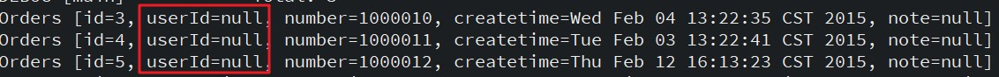

> - 注：出现userId值为null的问题
>     - 原因(注意事项)：使用resultType完成输出映射，要求sql语句中的字段名称，与java对象的属性名称（与set/get方法的后面部分）要一致。
>     - 解决方法：使用返回值类型是resultMap

##### 6.10.1.2. 使用 resultMap 映射查询结果

在mapper配置文件中，配置resultMap标签，配置对象与表的映射关系。在`<select>`标签引用`<resultMap>`，修改OrderMapper.xml配置文件

```xml
<!-- 需求：查询全部订单数据
	使用resultMap实现
 -->
<select id="queryAllOrdersByResultMap" resultMap="orderResultMap">
	select * from orders
</select>
<!-- 配置Java对象属性与数据库表字段的对应关系
	type属性：要映射的属性类型
	id属性：唯一标识名称，通过id引用该resultMap
 -->
<resultMap type="order" id="orderResultMap">
	<!-- <id>与<result>配置订单的主键对应关系，说明：
		column：主键字段（表）
		property：主键属性（pojo）
	-->
	<id column="id" property="id"/>

	<!-- 配置订单的普通字段对应关系 -->
	<result column="user_id" property="userId"/>
	<result column="number" property="number"/>
	<result column="createtime" property="createtime"/>
	<result column="note" property="note"/>
</resultMap>
```

> 注：字段一样的属性可以不需要配置，但实际开发中建议配置，方便日后维护。


#### 6.10.2. ResultMap 的属性列表

| 属性        | 描述                                                         |
| ----------- | ------------------------------------------------------------ |
| id          | 当前命名空间中的一个唯一标识，用于标识一个结果映射           |
| type        | 类的完全限定名，或者一个类型别名（关于内置的类型别名，可以参考上面的表格） |
| autoMapping | 如果设置这个属性，MyBatis将会为本结果映射开启或者关闭自动映射。这个属性会覆盖全局的属性 autoMappingBehavior。默认值：未设置（unset） |

> **【最佳实践】最好一步步地建立结果映射。单元测试可以在这个过程中起到很大帮助。如果你尝试一次创建一个像上面示例那样的巨大的结果映射，那么很可能会出现错误而且很难去使用它来完成工作。从最简单的形态开始，逐步迭代。而且别忘了单元测试！使用框架的缺点是有时候它们看上去像黑盒子（无论源代码是否可见）。为了确保你实现的行为和想要的一致，最好的选择是编写单元测试。提交 bug 的时候它也能起到很大的作用。**

#### 6.10.3. resultMap 标签内部标签元素

- `constructor` - 用于在实例化类时，注入结果到构造方法中
    - `idArg` - ID 参数；标记出作为 ID 的结果可以帮助提高整体性能
    - `arg` - 将被注入到构造方法的一个普通结果
- `id` – 一个 ID 结果；标记出作为 ID 的结果可以帮助提高整体性能
- `result` – 注入到字段或 JavaBean 属性的普通结果
- `association` – 一个复杂类型的关联；许多结果将包装成这种类型
    - 嵌套结果映射 – 关联本身可以是一个 resultMap 元素，或者从别处引用一个
- `collection` – 一个复杂类型的集合
    - 嵌套结果映射 – 集合本身可以是一个 resultMap 元素，或者从别处引用一个
- `discriminator` – 使用结果值来决定使用哪个 resultMap
    - `case` – 基于某些值的结果映射
    - 嵌套结果映射 – `case` 本身可以是一个 resultMap 元素，因此可以具有相同的结构和元素，或者从别处引用一个

##### 6.10.3.1. id 和 result 标签

```xml
<id property="id" column="post_id"/>
<result property="subject" column="post_subject"/>
```

结果映射最基本的内容。`<id>` 和 `<result>` 元素都将一个列的值映射到一个简单数据类型（String, int, double, Date 等）的属性或字段。其中 `<id>` 元素表示的结果将是对象的标识属性，这会在比较对象实例时用到。

**id 和 result 的属性**

| 属性        | 描述                                                         |
| ----------- | ------------------------------------------------------------ |
| property    | 映射到列结果的字段或属性。如果用来匹配的 JavaBean 存在给定名字的属性，那么它将会被使用。否则 MyBatis 将会寻找给定名称的字段（找不到将报错）。<br/>具体用法如：映射一些简单结构上：“username”，映射到一些复杂结构上：“address.street.number” |
| column      | 数据库中的列名，或者是列的别名。一般情况下，这和传递给 `resultSet.getString(columnName)` 方法的参数一样 |
| javaType    | 一个 Java 类的完全限定名，或一个类型别名。如果映射到一个 JavaBean，MyBatis 通常可以推断类型；如果映射到的是 HashMap，应该明确地指定 javaType 来保证行为与期望的相一致 |
| jdbcType    | JDBC 类型，所支持的 JDBC 类型参见下面的“支持的 JDBC 类型”表格。只需要在可能执行插入、更新和删除的且允许空值的列上指定 JDBC 类型。*注：这是 JDBC 的要求而非 MyBatis 的要求。如果直接面向 JDBC 编程，需要对可能存在空值的列指定这个类型。* |
| typeHandler | 覆盖默认的类型处理器。 这个属性值是一个类型处理器实现类的完全限定名，或者是类型别名 |

**支持的 JDBC 类型**

为了以后可能的使用场景，MyBatis 通过内置的 jdbcType 枚举类型支持下面的 JDBC 类型


##### 6.10.3.2. constructor 构造

通过构造方法进行注入。构造方法注入允许你在初始化时为类设置属性的值，而不用暴露出公有方法。

- 构造方法

```java
public class User {
    //...
    public User(Integer id, String username, int age) {
        //...
    }
    //...
}
```

- 添加绑定，为了通过名称来引用构造方法参数，你可以添加 `@Param` 注解，或者使用 '-parameters' 编译选项并启用 `useActualParamName` 选项（默认开启）来编译项目。

```xml
<!-- 3.4.3版本以前的写法，参数类型必须按顺序给出 -->
<constructor>
    <idArg column="id" javaType="int"/>
    <arg column="username" javaType="String"/>
    <arg column="age" javaType="_int"/>
</constructor>

<!-- 当你在处理一个带有多个形参的构造方法时，很容易搞乱 arg 元素的顺序。 从版本 3.4.3 开始，可以在指定参数名称的前提下，以任意顺序编写 arg 元素 -->
<constructor>
    <idArg column="id" javaType="int" name="id" />
    <arg column="age" javaType="_int" name="age" />
    <arg column="username" javaType="String" name="username" />
</constructor>
```

**constructor 相关属性**

|    属性     |                                              描述                                              |
| ----------- | ---------------------------------------------------------------------------------------------- |
| column      | 数据库中的列名，或者是列的别名                                                                    |
| javaType    | 一个 Java 类的完全限定名，或一个类型别名                                                          |
| jdbcType    | JDBC 类型                                                                                      |
| typeHandler | 覆盖默认的类型处理器。 这个属性值是一个类型处理器实现类的完全限定名，或者是类型别名                     |
| select      | 用于加载复杂类型属性的映射语句的 ID，它会从 column 属性中指定的列检索数据，作为参数传递给此 select 语句 |
| resultMap   | 结果映射的 ID，可以将嵌套的结果集映射到一个合适的对象树中。它可以作为使用额外 select 语句的替代方案     |
| name        | 构造方法形参的名字。从 3.4.3 版本开始，通过指定具体的参数名，可以以任意顺序写入 arg 元素               |

##### 6.10.3.3. (！待整理) association 关联

> 参考：http://www.mybatis.org/mybatis-3/zh/sqlmap-xml.html#Result_Maps

```xml
<association property="author" column="blog_author_id" javaType="Author">
    <id property="id" column="author_id"/>
    <result property="username" column="author_username"/>
</association>
```

关联（association）元素处理“有一个”类型的关系。

##### 6.10.3.4. collection 集合

```xml
<collection property="posts" ofType="domain.blog.Post">
    <id property="id" column="post_id"/>
    <result property="subject" column="post_subject"/>
    <result property="body" column="post_body"/>
</collection>
```

- 集合元素`<collection>`和关联元素`<association>`几乎是一样的，它们相似程度高
- 如果映射的对象中有集合，使用`<collection>`标签进行映射绑定
    - `ofType` 属性是映射的对象全类名
    - 标签体内为映射的类的属性与sql字段名

1. **集合的嵌套 Select 查询**示例：将id为selectPostsForBlog的查询语句结果集映射到Blog类的posts属性中

```xml
<resultMap id="blogResult" type="Blog">
    <collection property="posts" javaType="ArrayList" column="id" ofType="Post" select="selectPostsForBlog"/>
</resultMap>

<select id="selectBlog" resultMap="blogResult">
    SELECT * FROM BLOG WHERE ID = #{id}
</select>

<select id="selectPostsForBlog" resultType="Post">
    SELECT * FROM POST WHERE BLOG_ID = #{id}
</select>
```

2. **集合的嵌套结果映射**示例：左连接查询Blog表与Post表，获取blog的数据映射到Blog类中，并该blog下的所有文章post集合映射到Blog对象中的posts集合属性中

```xml
<select id="selectBlog" resultMap="blogResult">
    select
        B.id as blog_id,
        B.title as blog_title,
        B.author_id as blog_author_id,
        P.id as post_id,
        P.subject as post_subject,
        P.body as post_body
    from Blog B
        left outer join Post P on B.id = P.blog_id
    where B.id = #{id}
</select>

<resultMap id="blogResult" type="Blog">
    <id property="id" column="blog_id" />
    <result property="title" column="blog_title"/>
    <collection property="posts" ofType="Post">
        <id property="id" column="post_id"/>
        <result property="subject" column="post_subject"/>
        <result property="body" column="post_body"/>
    </collection>
</resultMap>

<!--
    等价上面的第二种写法
-->
<resultMap id="blogResult" type="Blog">
    <id property="id" column="blog_id" />
    <result property="title" column="blog_title"/>
    <collection property="posts" ofType="Post" resultMap="blogPostResult" columnPrefix="post_"/>
</resultMap>

<resultMap id="blogPostResult" type="Post">
    <id property="id" column="id"/>
    <result property="subject" column="subject"/>
    <result property="body" column="body"/>
</resultMap>
```

3. **学成项目，课程计划树形结构映射示例**

```xml
<!-- 定义课程计划树型结构的映射关系 -->
<resultMap id="teachplanMap" type="com.xuecheng.framework.domain.course.ext.TeachplanNode">
    <id column="one_id" property="id"/>
    <result column="one_pname" property="pname"/>
    <!-- 定义二级节点集合 -->
    <collection property="children" ofType="com.xuecheng.framework.domain.course.ext.TeachplanNode">
        <id column="two_id" property="id"/>
        <result column="two_pname" property="pname"/>
        <!-- 定义三级节点集合 -->
        <collection property="children" ofType="com.xuecheng.framework.domain.course.ext.TeachplanNode">
            <id column="three_id" property="id"/>
            <result column="three_pname" property="pname"/>
        </collection>
    </collection>
</resultMap>
```

##### 6.10.3.5. （！待整理）discriminator 鉴别器

> 参考：http://www.mybatis.org/mybatis-3/zh/sqlmap-xml.html#Result_Maps

#### 6.10.4. 高级结果映射示例

```xml
<!-- 非常复杂的语句 -->
<select id="selectBlogDetails" resultMap="detailedBlogResultMap">
  select
       B.id as blog_id,
       B.title as blog_title,
       B.author_id as blog_author_id,
       A.id as author_id,
       A.username as author_username,
       A.password as author_password,
       A.email as author_email,
       A.bio as author_bio,
       A.favourite_section as author_favourite_section,
       P.id as post_id,
       P.blog_id as post_blog_id,
       P.author_id as post_author_id,
       P.created_on as post_created_on,
       P.section as post_section,
       P.subject as post_subject,
       P.draft as draft,
       P.body as post_body,
       C.id as comment_id,
       C.post_id as comment_post_id,
       C.name as comment_name,
       C.comment as comment_text,
       T.id as tag_id,
       T.name as tag_name
  from Blog B
       left outer join Author A on B.author_id = A.id
       left outer join Post P on B.id = P.blog_id
       left outer join Comment C on P.id = C.post_id
       left outer join Post_Tag PT on PT.post_id = P.id
       left outer join Tag T on PT.tag_id = T.id
  where B.id = #{id}
</select>

<!-- 非常复杂的结果映射 -->
<resultMap id="detailedBlogResultMap" type="Blog">
  <constructor>
    <idArg column="blog_id" javaType="int"/>
  </constructor>
  <result property="title" column="blog_title"/>
  <association property="author" javaType="Author">
    <id property="id" column="author_id"/>
    <result property="username" column="author_username"/>
    <result property="password" column="author_password"/>
    <result property="email" column="author_email"/>
    <result property="bio" column="author_bio"/>
    <result property="favouriteSection" column="author_favourite_section"/>
  </association>
  <collection property="posts" ofType="Post">
    <id property="id" column="post_id"/>
    <result property="subject" column="post_subject"/>
    <association property="author" javaType="Author"/>
    <collection property="comments" ofType="Comment">
      <id property="id" column="comment_id"/>
    </collection>
    <collection property="tags" ofType="Tag" >
      <id property="id" column="tag_id"/>
    </collection>
    <discriminator javaType="int" column="draft">
      <case value="1" resultType="DraftPost"/>
    </discriminator>
  </collection>
</resultMap>
```

### 6.11. MyBatis 关联查询

- 一对一关联关系
- 一对多关联关系
- 多对多关联关系(也可以看成是两个一对多关联关系)

> 此部分主要使用了`<association>`标签和`<conllection>`标签，在上一节【resultMap（输出结果映射）】有相关的参数说明与用法

#### 6.11.1. association 标签（一对一关联查询）

##### 6.11.1.1. 定义与属性

`<association>`标签，用于配置一对一关联关系专用标签，有如下属性：

- `property`属性：要映射的属性名称
- `javaType`属性：要映射的属性的类型（必须要指定）

```xml
<association property="" javaType="">
	<!-- 配置用户的主键对应关系 -->
	<id property="" column=""/>
	<!-- 配置用户普通字段对应关系 -->
	<result property="" column=""/>
</association>
```

##### 6.11.1.2. 使用示例

需求：查询订单数据，并且关联查询出订单所属的用户数据

- 修改Order实体类，增加User引用属性，建立Order与User一对一关系

```java
// 建立订单与用户一对一关系
private User user;
public User getUser() {
    return user;
}
public void setUser(User user) {
	this.user = user;
}

```

- 修改UserMapper.xml配置一对一关系`<association>`标签

```xml
<!--
	需求：查询订单数据，并且关联查询出所属的用户数据
		使用resultMap属性返回映射
 -->
<select id="queryOrdersAndUsers" resultMap="orderAndUserResultMap">
  select
	  o.id,
	  o.`user_id`,
	  o.`number`,
	  o.`createtime`,
	  o.`note`,
	  u.`username`,
	  u.`address`
	from
	  `orders` o
	left join `user` u
	on o.`user_id` = u.`id`
</select>
<!-- 
	配置订单到用户的一对一关联关系，说明：
    type：映射的类型（因为最后获取订单对象，所以写order）
    id：唯一标识名称，通过id引用该resultMap
-->
<resultMap type="order" id="orderAndUserResultMap">
 	<!-- 配置order的主键关系 -->
 	<id property="id" column="id"/>

 	<!-- 配置order普通字段对应关系 -->
 	<result property="userId" column="user_id"/>
 	<result property="number" column="number"/>
 	<result property="createtime" column="createtime"/>
 	<result property="note" column="note"/>

 	<!-- 
		配置一对一关联关系
      association标签：配置一对一关联关系
      property：要映射的属性名称
      javaType：要映射的属性类型（!必须要指定）
 	 -->
 	 <association property="user" javaType="user">
 	 	<!-- 
			配置用户主键对应关系
 	 			配置查询语句根据表的哪个字段进行关联查询
 	 	 -->
 	 	<id property="id" column="user_id"/>

 	 	<!-- 配置用户普通字段对应关系 -->
 	 	<result property="username" column="username"/>
 	 	<result property="address" column="address"/>
	</association>
</resultMap>

```

- mapper接口添加查询方法，测试多表查询（一对一）

```java
public void queryOrdersAndUsersTest() {
	// 1.创建sqlSession
	SqlSession sqlSession = sqlSessionFactory.openSession();
	// 2.获取接口mapper动态代理对象
	OrderMapper mapper = sqlSession.getMapper(OrderMapper.class);
	// 3.调用接口方法
	List<Order> list = mapper.queryOrdersAndUsers();
	if (list != null && list.size() > 0) {
		for (Order order : list) {
			System.out.println(order);
		}
	}
	// 4.关闭资源
	sqlSession.close();
}
```

- 成功查询结果，使用debug查询（因为没有重写toString）

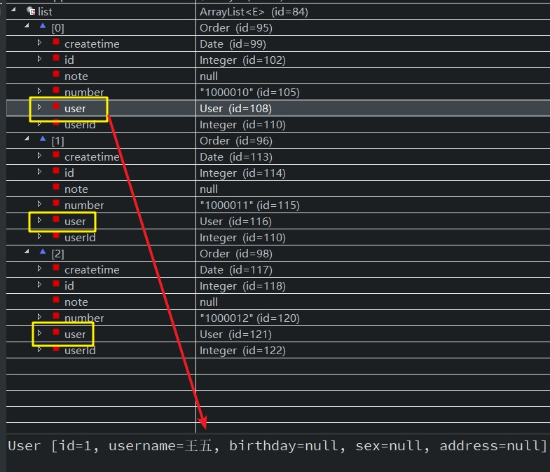

#### 6.11.2. conllection 标签（一对多关联查询）

##### 6.11.2.1. 定义与属性

- `<conllection>`标签：配置一对多关联关系标签
    - **property**属性：要映射的属性名称
    - **javaType**属性：要映射的属性类型（可以指定，也可以不指定。建议指定）
    - **ofType**属性：集合中存放的类型（**必须要指定**）

##### 6.11.2.2. 使用示例

需求：查询用户数据，并且关联查询出用户的所有订单数据

- 修改用户实体类，包含一对多的关系

```java
// 建立用户与订单的一对多的关联关系(在MyBatis框架建议使用list比较方便)
private List<Order> orderList;
public List<Order> getOrderList() {
	return orderList;
}
public void setOrderList(List<Order> orderList) {
	this.orderList = orderList;
}
```

- 在UserMapper配置文件中增加查询方法与使用resultMap输出映射

```xml
<!-- 需求：查询用户数据，并且关联查询出用户的所有订单数据 -->
<select id="queryUsersAndOrders" resultMap="userOrderResultMap">
	select
	  u.`id`,
	  u.`username`,
	  u.`birthday`,
	  u.`sex`,
	  u.`address`,
	  o.`id` oid,
	  o.`number`,
	  o.`createtime`
	from
	  `user` u
	left join `orders` o
	on u.`id` = o.`user_id`
</select>
<!--
	配置用户到订单的一对多关联关系
		type：要映射的类型(查询的结果是user集合)
	 	id：唯一标识名称，通过id引用该resultMap
 -->
<resultMap type="user" id="userOrderResultMap">
	<!-- 配置用户的主键字段的对应关系 -->
	<id property="id" column="id"/>
	<!-- 配置用户的其他属性与字段的对应关系 -->
	<result property="username" column="username"/>
	<result property="birthday" column="birthday"/>
	<result property="sex" column="sex"/>
	<result property="address" column="address"/>

	<!--
		配置用户一对多的关系
			collection：配置一对多关联关系
 			property：要映射的属性名称
 			javaType：要映射的属性类型（可以指定，可以不指定。建议指定）
 			ofType：集合中存放的类型（必须要指定）
	 -->
	<collection property="orderList" javaType="list" ofType="order">
		<!-- 配置订单主键与字段的对应关系（对应的查询定义的别名） -->
		<id property="id" column="oid"/>
		<!-- 配置订单其他字段的对应关系 -->
		<result property="number" column="number"/>
		<result property="createtime" column="createtime"/>
	</collection>
</resultMap>
```

- 在mapper接口添加查询所有用户和订单的方法，并测试

```java
/**
 * 7.测试多表关联查询（一对多）
 */
@Test
public void queryUsersAndOrdersTest() {
	// 1.创建sqlSession
	SqlSession sqlSession = sqlSessionFactory.openSession();
	// 2.获取接口mapper动态代理对象
	UserMapper mapper = sqlSession.getMapper(UserMapper.class);
	// 3.调用接口方法
	List<User> list = mapper.queryUsersAndOrders();
	if (list != null && list.size() > 0) {
		for (User user : list) {
			System.out.println(user);
		}
	}
	// 4.关闭资源 
	sqlSession.close();
}
```

- 查看结果数据，订单封装到用户实体类list属性集合中

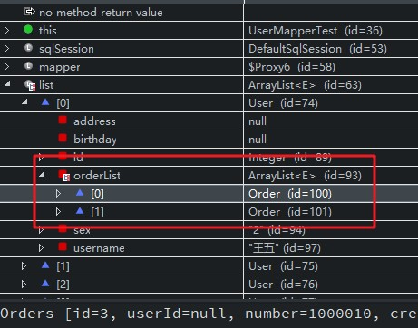

### 6.12. 映射文件(Mapper.xml)主要配置总结

|     标签名     |                                                                                                                                                                                                                                                                                                                                                                                                                                                        相关属性                                                                                                                                                                                                                                                                                                                                                                                                                                                        |                         作用说明                         |   父标签    |
| ------------- | --------------------------------------------------------------------------------------------------------------------------------------------------------------------------------------------------------------------------------------------------------------------------------------------------------------------------------------------------------------------------------------------------------------------------------------------------------------------------------------------------------------------------------------------------------------------------------------------------------------------------------------------------------------------------------------------------------------------------------------------------------------------------------------------------------------------------------------------------------------------------------------------------------------------- | ------------------------------------------------------- | ---------- |
| `<mapper>`    | 属性namespace：namespace命名空间，作用就是对sql进行分类化管理，理解为sql隔离<br/>注意：使用mapper代理方法开发，namespace有特殊重要的作用，直接指向mapper接口的类路径。                                                                                                                                                                                                                                                                                                                                                                                                                                                                                                                                                                                                                                                                                                                                                             | 映射文件的根标签                                          |            |
| `<select>`    | `id`：表示当前`<select>`标签的唯一标识（将sql语句封装到mappedStatement对象中，将id称为mappedStatement的id）<br/>`parameterType`：指定输入参数的类型，当参数传递的是集合或者数组的时候，在实际开发中建议都写list<br/>一般使用`#{}`实现的是向prepareStatement中的预处理语句中设置参数值（“`?`”占位符）<br/>`resultType`：指定查询返回结果的输出类型，如果返回的结果是一个实体类，<font color=red>必须要求实体类的属性和表的字段名称相同</font><br/><br/>以下属性了解：<br/>resultMap：也是一个输出类型，配合<resultMap>标签使用<br/>flushCache：设置查询的时候是否清空缓存，默认为false<br/>useCache：将查询结果放入缓存中，默认为true<br/>timeout：设置查询返回结果的最大响应时间<br/>fetchSize：每次批量返回的结果行数。默认不设置<br/>statementType：STATEMENT、PREPARED或CALLABLE的一种，这会让MyBatis使用选择Statement、PreparedStatement或CallableStatement。默认值：PREPARED<br/>resultSetType：设置游标FORWARD_ONLY、SCROLL_SENSITIVE、SCROLL_INSENSITIVE中的一种。认不设置 | 用于编写查询语句用的标签                                   | `<mapper>` |
| `<insert>`    | id/parameterType属性一样                                                                                                                                                                                                                                                                                                                                                                                                                                                                                                                                                                                                                                                                                                                                                                                                                                                                                               | 用于编写插入语句用的标签                                   | `<mapper>` |
| `<update>`    | id/parameterType属性一样                                                                                                                                                                                                                                                                                                                                                                                                                                                                                                                                                                                                                                                                                                                                                                                                                                                                                               | 用于编写更新语句用的标签                                   | `<mapper>` |
| `<delete>`    | id/parameterType属性一样                                                                                                                                                                                                                                                                                                                                                                                                                                                                                                                                                                                                                                                                                                                                                                                                                                                                                               | 用于编写删除语句用的标签                                   | `<mapper>` |
| `<resultMap>` | `type`属性：要映射的类型<br/>`id`属性：唯一标识，通过id引用该resultMap<br/><br/>子标签`<id>`、子标签<result>配置订单的主键对应关系，其中属性`column`：主键字段（表），属性`property`：主键属性（pojo）                                                                                                                                                                                                                                                                                                                                                                                                                                                                                                                                                                                                                                                                                                                              | 用于解决实体类中属性和表字段名不相同的问题                   | `<mapper>` |
| `<sql>`       |                                                                                                                                                                                                                                                                                                                                                                                                                                                                                                                                                                                                                                                                                                                                                                                                                                                                                                                       | 可以重用的SQL语句，可以被其他语句引用                       | `<mapper>` |
| `<selectKey>` | `select LAST_INSERT_ID()`：得到刚刚insert操作添加的记录的主键，只适用与自增主键<br/><br/>`keyColumn`属性：主键字段名（表）<br/>`keyProperty`属性：将查询到主键值设置到`parameterType`指定的对象的哪一个属性中<br/>`order`属性：指定`select LAST_INSERT_ID()`执行顺序，相对于insert语句来说的执行顺序<br/>`resultType`属性：指定`select LAST_INSERT_ID()`的结果类型                                                                                                                                                                                                                                                                                                                                                                                                                                                                                                                                                                         | 将插入数据的主键返回，返回到Customer对象中                  | `<insert>` |
| `<cache>`     |                                                                                                                                                                                                                                                                                                                                                                                                                                                                                                                                                                                                                                                                                                                                                                                                                                                                                                                       | <font color=red>（不使用）</font>配置给定命名空间缓存      | `<mapper>` |
| `<cache-ref>` |                                                                                                                                                                                                                                                                                                                                                                                                                                                                                                                                                                                                                                                                                                                                                                                                                                                                                                                       | <font color=red>（不使用）</font>从其他命名空间引用缓存配置 | `<mapper>` |

### 6.13. 占位符 #{} 和字符串拼接符 ${} 的区别总结

#### 6.13.1. #{} 占位符

- `#{}`表示一个占位符号，用于预编译处理，`#{}`接收输入参数，类型可以是简单类型（八种基本类型+字符串String），pojo、hashmap。
- <font color=red>**如果接收简单类型，`#{}`中可以写成value或其它名称**</font>。
- `#{}`接收pojo对象值，通过OGNL读取对象中的属性值，如果实体类中属性是引用类型，通过`属性.属性.属性...`的方式获取对象属性值

#### 6.13.2. ${} 字符串拼接符

- `${}`表示一个拼接符号，可能会引用sql注入的问题，所以<font color=red>不建议使用`${}`</font>。虽然经过三层构架可以将字符处理，但还是不建议使用。
- `${}`接收输入参数，类型可以是简单类型，pojo、hashmap。但<font color=red>如果接收简单类型，`${}`中只能写成value</font>。
- `${}`接收pojo对象值，通过OGNL读取对象中的属性值，通过`属性.属性.属性...`的方式获取对象属性值

#### 6.13.3. 区别

占位符与字符串拼接符的重要区别是，`?`是独立时才算是占位符，不能写成`'%?%'`。如果这样操作最后的结果是没有赋值，而是`?`与其它拼接了：`'%?%'`，不再是一个占位符，会当前字符串处理

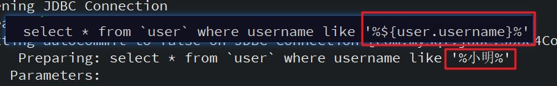


#### 6.13.4. 应用案例 - 模糊查询like语句

1. 使用`${}`拼接，可能引起SQL注入，不推荐

```sql
select * from user where username like '%${username}%'
```

2.  使用`#{}`拼接。 注意：因为`#{…}`解析成sql语句时候，会在变量外侧自动加单引号`''`，所以这里 `%` 需要使用双引号`""`包裹，不能使用单引号`''`，不然会查不到任何结果。

```sql
select * from user where username like "%"#{username}"%"
```

3. 使用 `CONCAT` 函数拼接（推荐）

```sql
select * from user where username like CONCAT('%', #{username}, '%')
```

4. 使用 `<bind>` 标签

```xml
<select id="listUserLikeUsername" resultType="com.moon.pojo.User">
    <bind name="pattern" value="'%' + username + '%'" />
    select * from user where username like #{pattern}
</select>
```


## 7. MyBatis 动态 SQL

### 7.1. 动态 SQL 主要标签

MyBatis中用于实现动态SQL的元素，主要存放在`<select>`标签中

|    标签名    |                                                                           属性                                                                           |                                                                    说明                                                                     |
| ----------- | -------------------------------------------------------------------------------------------------------------------------------------------------------- | ------------------------------------------------------------------------------------------------------------------------------------------- |
| `<if>`      | test：判断条件                                                                                                                                            | 根据条件判断拼接标签体的sql语句                                                                                                                |
| `<where>`   |                                                                                                                                                          | 1.where标签，相当于sql语句中的where关键字<br/>2.根据传入的参数情况，智能的去掉多余的and，or关键字<br/>3.根据传入的参数情况，智能的去掉多余的where关键字 |
| `<choose>`  | 子标签：<br/>`<when>`、`<otherwise>`标签                                                                                                                  | 相当于java中的switch，如果满足条件则不会再往下执行                                                                                              |
| `<set>`     |                                                                                                                                                          | 1.相当于sql语句中的set关键字<br/>2.根据传入的参数情况，智能的去掉最后一个多余的逗号                                                                |
| `<foreach>` | `collection`：参数集合<br/>`item`：当前循环的对象引用<br/>`open`：拼装的sql语句片段开始<br/>`close`：拼装的sql语句片段的结束<br/>`separator`：指定元素之间的分割符 | 循环遍历处理参数集合（List、数组）                                                                                                             |
| `<sql>`     | id：唯一标识的名称，根据id引用该sql片段                                                                                                                     | 提取公共的sql语句片段                                                                                                                         |
| `<include>` | refid：引用sql片段的id值                                                                                                                                  | 引用sql片段                                                                                                                                 |
| `<trim>`    |                                                                                                                                                          | 格式化                                                                                                                                      |


为什么要使用动态SQL标签？因为在多条件查询下，MyBatis框架，当参数不传递，它会默认设置一个null值，导致查询不到数据。所以**多条件查询使用到动态sql标签**

```xml
<select id="queryUserByNameAndSex" parameterType="user" resultType="user">
	select * from `user` where username like #{username} and sex=#{sex}
</select>
```

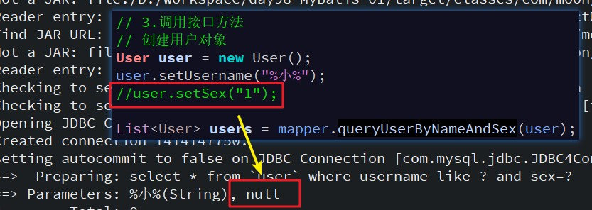

### 7.2. if 标签

作用：根据判断条件是否拼接标签体内的内容

`<select>`标签中使用`<if>`标签示例：

```xml
<select id="queryUserByNameAndSex" parameterType="user" resultType="user">
	select * from `user`
	where
	<!-- if标签：判断用户名称不为空，并且不为空字符串，才作为查询的条件 -->
	<if test="username != null and username != ''">
		username like #{username}
	</if>
	<!-- if标签：判断性别不为空，并且不为空字符串，才作为查询的条件 -->
	<if test="sex != null and sex != ''">
		 and sex=#{sex}
	</if>
</select>
```

结果：但如果没有and的语句判断为空，执行后面带and的语句，会报错


### 7.3. where 标签

为了解决`<if>`标签判断后会出现错误拼接sql语句，使用`<where>`标签，将SQL语句中where替换成`<where>`标签。其作用如下：

1. `<where>`标签，相当于sql语句中的`where`关键字
2. 根据传入的参数情况，智能的去掉多余的`and`，`or`关键字
3. 根据传入的参数情况，智能的去掉多余的`where`关键字

示例：

```xml
<select id="queryUserByNameAndSex" parameterType="user" resultType="user">
	select * from `user`
	<where>
		<!-- if标签：判断用户名称不为空，并且不为空字符串，才作为查询的条件 -->
		<if test="username != null and username != ''">
			username like #{username}
		</if>
		<!-- if标签：判断性别不为空，并且不为空字符串，才作为查询的条件 -->
		<if test="sex != null and sex != ''">
			 and sex=#{sex}
		</if>
	</where>
</select>
```

### 7.4. set 标签

标签作用：

1. `<set>`标签，相当于sql语句中的`set`关键字
2. 根据传入的参数情况，智能的去掉最后一个多余的逗号

示例，动态修改用户数据：

```xml
<!-- 需求：动态修改用户数据 -->
<update id="dynamicUpdateUser" parameterType="user">
	<!-- 原sql语句：update `user` set username='傷月',sex='2' where id='32'; -->
	update `user`
	<set>
		<if test="username != null and username != ''">
			username=#{username},
		</if>
		<if test="sex != null and sex != ''">
			sex=#{sex},
		</if>
	</set>
	<where>
		<if test="id != null and id != ''">
			id=#{id}
		</if>
	</where>
</update>
```

### 7.5. sql 标签(sql片段)（include 标签引用）

作用：提取公共的sql语句片段。再使用`<include>`标签进行引用


### 7.6. foreach 标签

`<foreach>` 标签作用是，循环遍历处理参数集合（List、数组）。主要的属性如下：

- `collection`：参数集合（必须指定），但是在不同情况下，该属性的值是不一样的，主要有一下3种情况：
    - 如果传入的是单参数且参数类型是一个 List 集合，`collection` 属性值为 `list`
    - 如果传入的是单参数且参数类型是一个 array 数组，`collection` 的属性值为 `array`
    - 如果传入的是一个Map或者实体类，此时 `collection` 属性值是需要遍历的集合或数组所对应 Map 的 key 值或者实体类的属性名称
- `item`：表示集合中每一个元素进行迭代时的别名，随便起的变量名；
- `index`：指定一个名字，用于表示在迭代过程中，每次迭代到的位置，不常用；
- `open`：表示该语句以什么开始，常用“`(`”；
- `separator`：表示在每次进行迭代之间以什么符号作为分隔符，常用“`,`”；
- `close`：表示该语句以什么结束，常用“`)`”。

#### 7.6.1. 示例1：批量新增用户

- 批量新增用户的sql语句

```sql
insert into `user` (username, birthday, sex, address)
values
  ('灵魂守卫','2018-3-2','1','dota2'),
  ('幽鬼','2018-3-3','2','dota2');
```

- UserMapper.xml配置foreach标签

```xml
<!-- 需求：批量新增用户 -->
<insert id="batchInsertUsers" parameterType="list">
	insert into `user` (username, birthday, sex, address)
	values
	<!-- 使用foreach标签
		collection:参数集合，这里是list
		item:当前循环的对象引用
		separator:指定分割符(批量插入多个数据sql的分割符)
	 -->
	<foreach collection="list" item="user" separator=",">
		(#{user.username},#{user.birthday},#{user.sex},#{user.address})
	</foreach>
</insert>
```

- mapper接口新增方法

```java
void batchInsertUsers(List<User> list);
```

- 测试方法

```java
public void batchInsertUsersTest() {
	// 1.创建sqlSession（设置自动提交事务）
	SqlSession sqlSession = sqlSessionFactory.openSession(true);
	// 2.获取接口mapper动态代理对象
	UserMapper mapper = sqlSession.getMapper(UserMapper.class);
	// 3.调用接口方法
	// 创建集合存放用户对象
	List<User> list = new ArrayList<User>();
	for (int i = 0; i < 3; i++) {
		User user = new User();
		user.setUsername("敌法师" + i);
		user.setSex("1");
		user.setBirthday(new Date());
		user.setAddress("dota2");
		list.add(user);
	}
	mapper.batchInsertUsers(list);
	// 4.关闭资源
	sqlSession.close();
}
```

#### 7.6.2. 示例2：批量删除用户

- 批量删除用户的sql语句

```sql
delete from `user` where id in(35,36,37);
```

- UserMapper.xml配置foreach标签

```xml
<!-- 需求：批量删除用户的sql语句 -->
<delete id="batchDeleteUsers" parameterType="list">
	delete from `user` <!-- id in(35,36,37) -->
	<where>
		<!-- foreach标签：循环处理参数集合
			collection：参数集合，这里是数组array
 	 		open：拼装的sql语句片段开始
 	 		close：拼装的sql语句片段的结束
 	 		item：当前遍历的元素
 	 		separator：指定元素之间的分割符
		 -->
		<foreach collection="array" item="id" separator="," open="id in(" close=")">
			#{id}
		</foreach>
	</where>
</delete>
```

- 接口添加批量删除方法

```java
void batchDeleteUsers(Integer[] ids);
```

- 测试方法

```java
public void batchDeleteUsersTest() {
	// 1.创建sqlSession（设置自动提交事务）
	SqlSession sqlSession = sqlSessionFactory.openSession(true);
	// 2.获取接口mapper动态代理对象
	UserMapper mapper = sqlSession.getMapper(UserMapper.class);
	// 3.调用接口方法
	// 创建id数组
	Integer[] ids = { 38, 39, 40 };
	mapper.batchDeleteUsers(ids);
	// 4.关闭资源
	sqlSession.close();
}
```

<font color=purple>*批量删除时需要注意：在foreach标签中，collection的取值只能是array，如果是“list”会报错*</font>

### 7.7. choose、when、otherwise 标签

`choose` 元素，它有点像 Java 中的 `switch` 语句

提供了“title”就按“title”查找，提供了“author”就按“author”查找的情形，若两者都没有提供，就返回所有符合条件的 BLOG（实际情况可能是由管理员按一定策略选出 BLOG 列表，而不是返回大量无意义的随机结果）。

Code Demo:

```xml
<select id="findActiveBlogLike" resultType="Blog">
	SELECT * FROM BLOG WHERE state = ‘ACTIVE’
	<choose>
		<when test="title != null">
			AND title like #{title}
		</when>
		<when test="author != null and author.name != null">
			AND author_name like #{author.name}
		</when>
		<otherwise>
			AND featured = 1
		</otherwise>
	</choose>
</select>
```

### 7.8. trim 标签

`<trim>`标签是一个格式化的标记，可以完成`<set>`或者是`<where>`标签的功能，示例代码如下：

Code Demo1:

```xml
<select id="" resultType="" parameterType="">
	select * from user
	<trim prefix="WHERE" prefixoverride="AND |OR">
		<if test="name != null and name.length()>0"> AND name=#{name}</if>
		<if test="gender != null and gender.length()>0"> AND gender=#{gender}</if>
	</trim>
</select>
```

假如说name和gender的值都不为null的话打印的SQL为：`select * from user where name = 'xx' and gender = 'xx'`

在“name”前不存在第一个and的，上面两个属性的意思如下：

- `prefix`：前缀
- `prefixoverride`：去掉第一个`and`或者`or`

Code Demo2:

```xml
<update id="" parameterType="">
	update user
	<trim prefix="set" suffixoverride="," suffix=" where id = #{id} ">
		<if test="name != null and name.length()>0"> name=#{name}, </if>
		<if test="gender != null and gender.length()>0"> gender=#{gender}, </if>
	</trim>
</update>
```

假如说name和gender的值都不为null的话打印的SQL为：`update user set name='xx' , gender='xx' where id='x'`

在最后的不存在逗号，而且自动加了一个set前缀和where后缀，上面三个属性的意义如下，其中prefix意义如上：

- `suffixoverride`：去掉最后一个逗号（也可以是其他的标记，就像是上面前缀中的and一样）
- `suffix`：后缀

### 7.9. 逻辑比较符在 xml 配置文件中处理方式

在 mybatis 的 mapper 配置文件 sql 语句中，有时用到大于，小于等等的比较符，直接写在里面就被当做标签的开头来处理了，会报格式不正确的错。有2种解决方法：

#### 7.9.1. `<![CDATA[   ]]>` 标识

```xml
<if test="menu.authority != null">
	<![CDATA[ and authority < #{menu.authority}]]>
</if>
```

> 注：其中都能使用大于'`>`'，小于'`<`'，小于等于'`<=`'，大于等于'`>=`'，不等于'`<>`'

#### 7.9.2. 转义

```xml
<if test="menu.authority != null">
	and authority &lt; #{menu.authority}
</if>

<!-- 同样可以和等号'='一起来使用，来表示大于等于，小于等于等 -->
<if test="menu.authority != null">
	and authority &gt;= #{menu.authority}
</if>
```

## 8. 映射器注解（了解）

设计初期的 MyBatis 是一个 XML 驱动的框架。配置信息是基于 XML 的，映射语句也是定义在 XML 中的。而在 MyBatis 3 中，提供了其它的配置方式。MyBatis 3 构建在全面且强大的基于 Java 语言的配置 API 之上。它是 XML 和注解配置的基础。注解提供了一种简单且低成本的方式来实现简单的映射语句。

### 8.1. mapper 接口注解清单


### 8.2. 基础使用

使用 MyBatis 提供 `@Select`、`@Insert`、`@Delete`、`@Update` 相关注解开发 dao 接口，直接在注解中定义相关的语句。定义 UserMapper 接口：

```java
/**
 * 根据用户id查询用户（使用注解开发）
 */
@Select("select * from `user` where id=#{id}")
User queryUserById_annotation(Integer userId);
```

测试代码：

```java
public void queryUserById_annotationTest() {
	// 1.创建sqlSession对象
	SqlSession sqlSession = sqlSessionFactory.openSession();
	// 2.从sqlSession对象获取mapper代理对象
	UserMapper mapper = sqlSession.getMapper(UserMapper.class);
	// 3.调用动态代理的方法
	User user = mapper.queryUserById_annotation(1);
	System.out.println(user);
	// 4.释放资源
	sqlSession.close();
}
```

> Tips: <font color=purple>*注解开发，实际开发中不推荐使用*</font>

## 9. MyBatis 缓存

MyBatis 包含一个非常强大的查询缓存特性，使用缓存可以使应用更快地获取数据，避免频繁的数据库交互。分成一级缓存和二级缓存

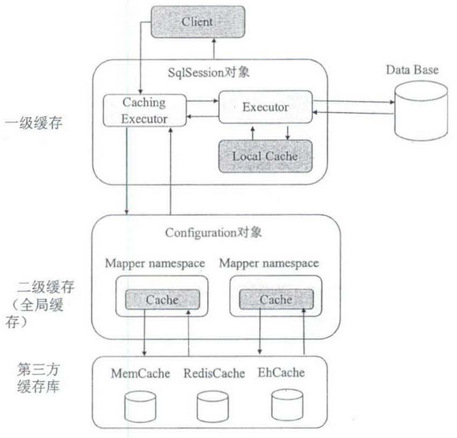

### 9.1. 一级缓存（sqlSession 级别缓存）

#### 9.1.1. 实现步骤

<font color=red>**一级缓存默认开启，无需配置**</font>。一级缓存是指 `SqlSession` 级别的缓存，当在同一个 `SqlSession` 中进行相同的 SQL 语句查询时，第二次以后的查询不会从数据库查询，而是直接从缓存中获取，一级缓存最多缓存 1024 条 SQL。测试代码如下：

```java
public void oneCacheTest() {
	// 1.创建sqlSession对象
	SqlSession sqlSession = sqlSessionFactory.openSession();
	// 2.从sqlSession对象获取mapper代理对象
	UserMapper mapper = sqlSession.getMapper(UserMapper.class);
	// 3.调用动态代理的方法
	User user = mapper.findUserById(1);
	System.out.println(user);
	System.out.println("===================");
	user = mapper.findUserById(1);
	System.out.println(user);
	// 4.释放资源
	sqlSession.close();
}
```

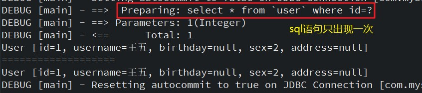

从上例日志可以看出，查询多次，只生成一句sql语句

#### 9.1.2. 关闭一级缓存

要想关闭某个查询语句的一级缓存，只需要将`flushCache`属性设置为 true 即可

```java
<select ... flushCache="false"/>
```

#### 9.1.3. 一级缓存原理（sqlsession 级别）

第一次发出一个查询 sql，sql 查询结果写入 sqlsession 的一级缓存中，缓存使用的数据结构是 map，其中，key 是 `MapperID + offset + limit + Sql + 所有的入参`；value是用户查询的数据结果集

同一个 sqlsession 再次发出相同的 sql，就从缓存中获取数据。如果两次中间出现 commit 操作（修改、添加、删除），则认为数据已发生了变化，MyBatis 会将该 sqlsession 中的一级缓存区域全部清空，下次再去缓存中将查询不到对应的缓存数据，因此会再次从数据库查询并将查询结果集写入缓存。

### 9.2. 二级缓存（SqlSessionFactory 级别缓存）

#### 9.2.1. 实现步骤

二级缓存是指`SqlSessionFactory`级别缓存，在同一个`SqlSessionFactory`中多个sqlSession之间共享，开启此缓存的步骤如下：

1. 在mybatis总配置文件（如：SqlMapConfig.xml）中配置开启缓存。*注意配置的位置*

```xml
<!-- 全局参数配置 -->
<settings>
	<!-- 配置启用缓存 -->
	<setting name="cacheEnabled" value="true"/>
</settings>
```

2. 实体类需要实现序列化接口

```java
public class User implements Serializable{ }
```

3. 在需要开启的mapper映射文件中，启用缓存

```xml
<!-- 启用缓存 -->
<cache
  eviction="FIFO"
  flushInterval="60000"
  size="512"
  readOnly="true"/>
```

- eviction（清除策略）：这个更高级的配置创建了一个 FIFO 缓存，每隔 60 秒刷新，最多可以存储结果对象或列表的 512 个引用，而且返回的对象被认为是只读的，因此对它们进行修改可能会在不同线程中的调用者产生冲突。可用的清除策略有：
    - `LRU` – 最近最少使用：移除最长时间不被使用的对象。是默认的清除策略。
    - `FIFO` – 先进先出：按对象进入缓存的顺序来移除它们。
    - `SOFT` – 软引用：基于垃圾回收器状态和软引用规则移除对象。
    - `WEAK` – 弱引用：更积极地基于垃圾收集器状态和弱引用规则移除对象。
- flushInterval（刷新间隔）属性可以被设置为任意的正整数，设置的值应该是一个以毫秒为单位的合理时间量。 默认情况是不设置，也就是没有刷新间隔，缓存仅仅会在调用语句时刷新。
- size（引用数目）属性可以被设置为任意正整数，要注意欲缓存对象的大小和运行环境中可用的内存资源。默认值是 1024。
- readOnly（只读）属性可以被设置为 true 或 false。只读的缓存会给所有调用者返回缓存对象的相同实例。 因此这些对象不能被修改。这就提供了可观的性能提升。而可读写的缓存会（通过序列化）返回缓存对象的拷贝。 速度上会慢一些，但是更安全，因此默认值是 false。

> **提示：二级缓存是事务性的。这意味着，当 SqlSession 完成并提交时，或是完成并回滚，即使没有执行 `flushCache=true` 的 insert/delete/update 语句时，缓存会获得更新。**

4. 在相应的查询语句标签中配置`useCache="true"`（*注：其实标签的`useCache`属性值默认为true，如果配置成false，但对应的查询语句二级缓存不生效*）

```xml
<select ... flushCache="false" useCache="true"/>
```

5. 测试代码

```java
public void secondCacheTest() {
	// 1.创建sqlSession对象
	SqlSession sqlSession = sqlSessionFactory.openSession();
	// 2.从sqlSession对象获取mapper代理对象
	UserMapper mapper = sqlSession.getMapper(UserMapper.class);
	// 3.调用动态代理的方法
	User user = mapper.findUserById(1);
	System.out.println(user);
	// 测试二级缓存，一定要关闭sqlSession
	sqlSession.close();
	System.out.println("===================");
	sqlSession = sqlSessionFactory.openSession();
	mapper = sqlSession.getMapper(UserMapper.class);
	user = mapper.findUserById(1);
	System.out.println(user);
	// 4.释放资源
	sqlSession.close();
}
```


<font color=purple>**说明：MyBatis框架的二级缓存，实际开发中不推荐使用，尤其在分布式项目中。原因是MyBatis的二级缓存不能实现细粒度的控制。如果使用缓存，推荐可以使用Redis**</font>

#### 9.2.2. 二级缓存原理

二级缓存的范围是 mapper 级别（mapper同一个命名空间），mapper 以命名空间为单位创建缓存数据结构，结构是 Map 类型。其中 key为 `MapperID + offset + limit + Sql + 所有的入参`

Mybatis 的二级缓存是通过 `CacheExecutor` 实现的。CacheExecutor 其实是 Executor 的代理对象。所有的查询操作，在 CacheExecutor 中都会先匹配缓存中是否存在，不存在则查询数据库。

具体使用需要配置：

1. Mybatis 全局配置中启用二级缓存配置
2. 在对应的 Mapper.xml 中配置 cache 节点
3. 在对应的 select 查询节点中添加 `useCache=true`(*该配置为默认值*)

### 9.3. 自定义缓存

除了MyBatis提供的两种缓存机制，还可以实现自定义缓存，或为其他第三方缓存方案创建适配器，来完全覆盖二级缓存的行为。配置开启自定义缓存实现步骤与开启二级缓存一样。

1. 在mybatis总配置文件中，配置开启缓存。
2. 在xml映射器文件中开启缓存，增加配置`type`属性，需要注意的是，`type`属性指定的类必须实现 `org.apache.ibatis.cache.Cache` 接口

```java
<!-- 启用二级缓存，配置使用自定义缓存 -->
<cache type="com.moon.mybatis.cache.CustomCache"
       eviction="FIFO" flushInterval="60000"
       size="512" readOnly="true"/>
```

3. 创建自定义缓存实现类，实现MyBatis框架的`Cache`接口

```java
public interface Cache {
  String getId();
  int getSize();
  void putObject(Object key, Object value);
  Object getObject(Object key);
  boolean hasKey(Object key);
  Object removeObject(Object key);
  void clear();
}
```

此示例借用了开源缓存工具框架`caffeine`，

```xml
<!-- 第三方缓存工具框架，用于实现自定义mybatis缓存 -->
<dependency>
    <groupId>com.github.ben-manes.caffeine</groupId>
    <artifactId>caffeine</artifactId>
    <version>2.8.0</version>
</dependency>
```

```java
package com.moon.mybatis.cache;

import com.alibaba.fastjson.JSONObject;
import com.github.benmanes.caffeine.cache.Caffeine;
import org.apache.ibatis.cache.Cache;

import java.time.Duration;

/**
 * 自定义缓存，需要实现 mybatis 的 Cache 接口。
 * 此示例借助了第三方缓存框架 caffeine 来实现功能
 */
public class CustomCache implements Cache {

    private final String id;

    static com.github.benmanes.caffeine.cache.Cache<String, String> cache = null;

    static {
        cache = Caffeine.newBuilder()
                .expireAfterWrite(Duration.ofSeconds(100L))
                .maximumSize(10000L)
                .initialCapacity(10)
                .build();
    }

    public CustomCache(String id) {
        this.id = id;
    }

    @Override
    public String getId() {
        return id;
    }

    @Override
    public void putObject(Object key, Object value) {
        cache.put(JSONObject.toJSONString(key), JSONObject.toJSONString(value));
    }

    @Override
    public Object getObject(Object key) {
        return JSONObject.parse(cache.getIfPresent(JSONObject.toJSONString(key)));
    }

    @Override
    public Object removeObject(Object key) {
        cache.invalidate(key);
        return null;
    }

    @Override
    public void clear() {
        cache.cleanUp();
    }

    @Override
    public int getSize() {
        return Integer.parseInt(cache.estimatedSize() + "");
    }
}
```

4. 运行以下测试代码，观察sql打印的次数

```java
@Test
public void testCustomCacheDiffSqlSessionFactory() throws IOException {
    InputStream inputStream = Resources.getResourceAsStream("mybatis-config.xml");
    SqlSessionFactory sqlSessionFactory = new SqlSessionFactoryBuilder().build(inputStream);
    SqlSession sqlSession = sqlSessionFactory.openSession();
    CacheMapper mapper = sqlSession.getMapper(CacheMapper.class);
    System.out.println("=========第一次查询==========");
    System.out.println(mapper.selectAllUser());
    System.out.println("=========第二次查询==========");
    System.out.println(mapper.selectAllUser());
    // 注意：一样需要提交事务与关闭sqlSession，才会序列化结果到自定义缓存
    sqlSession.commit();
    sqlSession.close();

    // 获取新的sqlSessionFactory后，再开启一个SqlSession
    InputStream inputStream = Resources.getResourceAsStream("mybatis-config.xml");
    SqlSessionFactory sqlSessionFactory = new SqlSessionFactoryBuilder().build(inputStream);
    SqlSession sqlSession1 = sqlSessionFactory.openSession();
    System.out.println("=========新的sqlSessionFactory开启的sqlSession查询第一次查询==========");
    System.out.println(sqlSession1.getMapper(CacheMapper.class).selectAllUser());
    sqlSession1.commit();
    sqlSession1.close();
}
```

### 9.4. MyBatis缓存机制示意图


### 9.5. 缓存的注意事项

请注意，缓存的配置和缓存实例会被绑定到 SQL 映射文件的命名空间中。因此，同一命名空间中的所有语句和缓存将通过命名空间绑定在一起。每条语句可以自定义与缓存交互的方式，或将它们完全排除于缓存之外，这可以通过在每条语句上使用两个简单属性来达成。默认情况下，语句会这样来配置：

```java
<select ... flushCache="false" useCache="true"/>
<insert ... flushCache="true"/>
<update ... flushCache="true"/>
<delete ... flushCache="true"/>
```

鉴于上面的配置都是默认值，所以不应该再显式配置上述的默认属性。当想改变默认的行为，才需要设置 `flushCache` 和 `useCache` 属性。比如，某些情况下可能希望特定`select`语句的结果排除于缓存之外，或希望一条select语句清空缓存。类似地，也可能希望某些update语句执行时不要刷新缓存。

## 10. MyBatis 插件开发快速入门

### 10.1. 示例需求

此示例需求：开发一个记录慢查询的插件。通过该插件定义一个阈值，当查询操作运行时间超过这个阈值记录日志供运维人员定位慢查询。

### 10.2. 插件实现步骤

1. 创建 MyBatis 的自定义插件类，必须实现 `Interceptor` 接口。该接口有如下三个方法：

```java
public interface Interceptor {
    // 插件对业务进行增强的核心方法
    Object intercept(Invocation invocation) throws Throwable;

    // target 是被拦截的对象，此方法的作用就是给被拦截的对象生成一个代理对象
    default Object plugin(Object target) {
        return Plugin.wrap(target, this);
    }

    // 读取在 plugin 中标签（属性）中设置的参数
    default void setProperties(Properties properties) {
    }
}
```

2. 插件实现类，需要确定拦截的签名。`@Intercepts`和`@Signature`就是用于标识插件拦截的位置。
    - `@Intercepts`：其值是一个`@Signature`数组。`@Intercepts`用于表明当前的对象是一个`Interceptor`
    - `@Signature`：则表明要拦截的接口、方法以及对应的参数类型

```java
@Intercepts({@Signature(type = StatementHandler.class, method = "query", args = {Statement.class, ResultHandler.class})})
public class ThresholdInterceptor implements Interceptor {

    // 查询操作超时阈值
    private long threshold;

    /**
     * 插件对业务进行增强的核心方法
     *
     * @param invocation 拦截到的目标方法
     * @return
     * @throws Throwable
     */
    @Override
    public Object intercept(Invocation invocation) throws Throwable {
        // 记录开始时间
        long begin = System.currentTimeMillis();
        // 执行sql操作
        Object result = invocation.proceed();
        // 记录结果时间
        long end = System.currentTimeMillis();
        // 执行时间
        long runTime = end - begin;
        if (runTime > this.threshold) {
            // 获取sql的参数
            Object[] args = invocation.getArgs();
            Statement statement = (Statement) args[0];
            MetaObject metaObjectStat = SystemMetaObject.forObject(statement);
            PreparedStatementLogger statementLogger = (PreparedStatementLogger) metaObjectStat.getValue("h");
            PreparedStatement preparedStatement = statementLogger.getPreparedStatement();
            System.out.println("sql语句：“" + preparedStatement.toString() + "”执行时间为：" + runTime + "毫秒，已经超过阈值！");
        }

        return result;
    }

    /**
     * target 是被拦截的对象，此方法的作用是给被拦截的对象生成一个代理对象
     *
     * @param target 是被拦截的对象
     * @return
     */
    @Override
    public Object plugin(Object target) {
        return Plugin.wrap(target, this);
    }

    /**
     * 读取在 plugin 中设置的参数
     *
     * @param properties
     */
    @Override
    public void setProperties(Properties properties) {
        // 读取配置的超时阈值
        this.threshold = Long.valueOf(properties.getProperty("threshold"));
    }
}
```

- 在MyBatis核心配置文件中`<plugins>`标签配置自定义的插件实现类


- 测试代码与结果

```java
@Test
public void testMyBatisPlugins() throws IOException {
    // 从 XML 文件中构建 SqlSessionFactory 的实例
    InputStream inputStream = Resources.getResourceAsStream("mybatis-config.xml");
    // 读取配置文件，创建SqlSessionFactory
    SqlSessionFactory sqlSessionFactory = new SqlSessionFactoryBuilder().build(inputStream);
    // 通过SqlSessionFactory开启一个SqlSession
    SqlSession sqlSession = sqlSessionFactory.openSession();
    // 通过SqlSession获取指定的mapper映射器（其实是Mapper接口的代理）
    UserMapper mapper = sqlSession.getMapper(UserMapper.class);
    // 通过代理实例调用相应Mapper接口中的方法
    System.out.println(mapper.queryAllUser());
}
```


## 11. MyBatis 与 Spring 整合

### 11.1. 官方资源

- 官方说明文档：http://mybatis.org/spring/zh/

### 11.2. 整合的思路

思路：把 MyBatis 框架对象，交给 Spring 管理

1. 把 SqlSessionFactory 对象，交给 spring 管理
2. 把 SqlSession 对象，交给 spring 管理
3. 在原始的 dao 开发方法中，把 dao 实现类对象，交给 spring 管理
4. 在 mapper 代理开发方法中，把 mapper 代理对象，交给 spring 管理
5. 把数据源对象交给 spring 管理

### 11.3. MyBatis-Spring 集成最佳实践

#### 11.3.1. 简介

Mybatis-Spring 用于将 MyBatis 代码无缝地整合到 Spring 中，集成过程中的增强主要包括：

- Spring 将会加载必要的 MyBatis 工厂类和 Session 类
- 提供一个简单的方式来注入 MyBatis 数据映射器和 SqlSession 到业务层的 bean 中
- 方便集成 Spring 事务
- 将 MyBatis 的异常转换到 Spring 的 `DataAccessException` 异常(数据访问异常)中

在使用 Mybatis-Spring 的过程中，需注意版本的兼容性

| MyBatis-Spring | MyBatis | Spring Framework | Spring Batch | Java    |
| :------------- | :------ | :--------------- | :----------- | :------ |
| **2.0**        | 3.5+    | 5.0+             | 4.0+         | Java 8+ |
| **1.3**        | 3.4+    | 3.2.2+           | 2.1+         | Java 6+ |

#### 11.3.2. MyBatis-Spring 相关依赖

创建 maven 项目，配置 pom.xml 文件引入 mybatis-spring 相关依赖，具体清单如下：

- mybatis 框架包
- spring 框架包
- mybatis-spring 整合包
- 数据库驱动包
- 数据库连接池包（如：dbcp）
- 日志包（如：log4j）
- 配置插件：如 jdk1.8 插件

pom.xml 依赖示例：

```xml
<dependencies>
    <!-- mybatis 核心依赖 -->
    <dependency>
        <groupId>org.mybatis</groupId>
        <artifactId>mybatis</artifactId>
        <version>3.5.2</version>
    </dependency>
    <!-- mysql 驱动 -->
    <dependency>
        <groupId>mysql</groupId>
        <artifactId>mysql-connector-java</artifactId>
        <version>5.1.45</version>
    </dependency>
    <!-- druid 数据源 -->
    <dependency>
        <groupId>com.alibaba</groupId>
        <artifactId>druid</artifactId>
        <version>1.2.4</version>
    </dependency>

    <!-- MyBatis 与 Spring 整合的核心包 -->
    <dependency>
        <groupId>org.mybatis</groupId>
        <artifactId>mybatis-spring</artifactId>
        <version>2.0.2</version>
    </dependency>
    <!-- spring 核心依赖 -->
    <dependency>
        <groupId>org.springframework</groupId>
        <artifactId>spring-context</artifactId>
        <version>5.2.8.RELEASE</version>
    </dependency>
    <dependency>
        <groupId>org.springframework</groupId>
        <artifactId>spring-jdbc</artifactId>
        <version>5.2.8.RELEASE</version>
    </dependency>
    <!-- 使用批量时需要依赖 -->
    <!-- <dependency>
        <groupId>org.springframework.batch</groupId>
        <artifactId>spring-batch-core</artifactId>
        <version>4.2.1.RELEASE</version>
    </dependency> -->
</dependencies>
```

### 11.4. 基于 xml 配置方式的整合

#### 11.4.1. 配置 pom 依赖

> Tips: 以下配置版本比较老旧，只用于参考

```xml
<project xmlns="http://maven.apache.org/POM/4.0.0" xmlns:xsi="http://www.w3.org/2001/XMLSchema-instance"
	xsi:schemaLocation="http://maven.apache.org/POM/4.0.0 http://maven.apache.org/xsd/maven-4.0.0.xsd">

	<modelVersion>4.0.0</modelVersion>
	<groupId>com.moon</groupId>
	<artifactId>mybatis-spring-demo-xml</artifactId>
	<version>0.0.1-SNAPSHOT</version>

	<properties>
		<project.build.sourceEncoding>UTF-8</project.build.sourceEncoding>
		<!-- mysql版本 -->
		<mysql.version>5.1.30</mysql.version>
		<!-- junit版本 -->
		<junit.version>4.12</junit.version>
		<!-- mybatis版本号 -->
		<mybatis.version>3.4.5</mybatis.version>
		<!-- log4j日志包版本 -->
		<slf4j.version>1.7.7</slf4j.version>
		<log4j.version>1.2.17</log4j.version>
		<!-- dbcp数据源连接池jar包 -->
		<dbcp.version>1.2.2</dbcp.version>
		<!-- spring版本 -->
		<spring.version>4.3.8.RELEASE</spring.version>
		<!-- mybatis-spring整合包版本 -->
		<mybatis.spring.version>1.3.1</mybatis.spring.version>
	</properties>

	<dependencies>
		<!-- mysql数据库依赖 -->
		<dependency>
			<groupId>mysql</groupId>
			<artifactId>mysql-connector-java</artifactId>
			<version>${mysql.version}</version>
		</dependency>
		<!-- mybatis核心包 -->
		<dependency>
			<groupId>org.mybatis</groupId>
			<artifactId>mybatis</artifactId>
			<version>${mybatis.version}</version>
		</dependency>
		<!-- log4j日志包 -->
		<dependency>
			<groupId>log4j</groupId>
			<artifactId>log4j</artifactId>
			<version>${log4j.version}</version>
		</dependency>
		<dependency>
			<groupId>org.slf4j</groupId>
			<artifactId>slf4j-api</artifactId>
			<version>${slf4j.version}</version>
		</dependency>
		<dependency>
			<groupId>org.slf4j</groupId>
			<artifactId>slf4j-log4j12</artifactId>
			<version>${slf4j.version}</version>
		</dependency>
		<!-- spring框架包 -->
		<dependency>
			<groupId>org.springframework</groupId>
			<artifactId>spring-core</artifactId>
			<version>${spring.version}</version>
		</dependency>
		<dependency>
			<groupId>org.springframework</groupId>
			<artifactId>spring-tx</artifactId>
			<version>${spring.version}</version>
		</dependency>
		<dependency>
			<groupId>org.springframework</groupId>
			<artifactId>spring-jdbc</artifactId>
			<version>${spring.version}</version>
		</dependency>
		<dependency>
			<groupId>org.springframework</groupId>
			<artifactId>spring-aop</artifactId>
			<version>${spring.version}</version>
		</dependency>
		<dependency>
			<groupId>org.springframework</groupId>
			<artifactId>spring-context-support</artifactId>
			<version>${spring.version}</version>
		</dependency>
		<!-- mybatis-spring整合包 -->
		<dependency>
			<groupId>org.mybatis</groupId>
			<artifactId>mybatis-spring</artifactId>
			<version>${mybatis.spring.version}</version>
		</dependency>
		<!-- 导入dbcp数据源连接池jar包 -->
		<dependency>
			<groupId>commons-dbcp</groupId>
			<artifactId>commons-dbcp</artifactId>
			<version>${dbcp.version}</version>
		</dependency>
		<dependency>
			<groupId>junit</groupId>
			<artifactId>junit</artifactId>
			<version>${junit.version}</version>
			<scope>test</scope>
		</dependency>
	</dependencies>

	<build>
		<!-- 配置jdk插件 -->
		<pluginManagement>
			<plugins>
				<plugin>
					<groupId>org.apache.maven.plugins</groupId>
					<artifactId>maven-compiler-plugin</artifactId>
					<version>3.2</version>
					<configuration>
						<source>1.8</source>
						<target>1.8</target>
						<encoding>UTF-8</encoding>
						<showWarnings>true</showWarnings>
					</configuration>
				</plugin>
			</plugins>
		</pluginManagement>
	</build>
</project>
```

#### 11.4.2. 配置文件

在项目的 resource 目录中创建 MyBatis 总配置文件 sqlMapConfig.xml，配置如下内容：

- 配置包的别名
- 配置加入的映射文件（只针对原始的dao开发）

```xml
<?xml version="1.0" encoding="UTF-8" ?>
<!DOCTYPE configuration
	PUBLIC "-//mybatis.org//DTD Config 3.0//EN"
	"http://mybatis.org/dtd/mybatis-3-config.dtd">
<configuration>
	<!-- 配置包的别名 -->
	<typeAliases>
		<!-- 使用包扫描方式配置别名 -->
		<package name="com.moon.entity" />
	</typeAliases>
	<!-- 配置加载映射文件 -->
	<mappers>
		<!-- 指定加载的映射文件 -->
		<mapper resource="sqlmap/User.xml" />
	</mappers>
</configuration>
```

数据库配置文件 db.properties

```properties
db.driverClassName =com.mysql.jdbc.Driver
db.url=jdbc:mysql://localhost:3306/mybatis_demo
db.username=root
db.password=123456

db.maxActive=10
db.minIdle=2
db.maxIdle=5
db.initialSize=5
db.maxWait=6000
```

日志配置文件 log4j.properties

```properties
# Global logging configuration
log4j.rootLogger=debug, stdout
# MyBatis logging configuration...
log4j.logger.org.mybatis.example.BlogMapper=TRACE
# Console output...
log4j.appender.stdout=org.apache.log4j.ConsoleAppender
log4j.appender.stdout.layout=org.apache.log4j.PatternLayout
log4j.appender.stdout.layout.ConversionPattern=%5p [%t] - %m%n
```

Spring 框架的总配置文件 applicationContext.xml，配置如下内容：

1. 配置数据源对象(dataSource，本 demo 使用 DBCP 连接池：`BasicDataSource`)
2. 配置 MyBatis 框架的核心对象(`SqlSessionFactoryBean`)
    1. 注入连接池对象（`dataSource` 属性）
    2. 注入加载 MyBatis 主配置文件位置（`configLocation` 属性）

```xml
<!-- 配置加载数据库db.properties属性文件 -->
<context:property-placeholder location="classpath:db.properties"/>

<!-- 配置数据库连接池(这次使用的是DBCP连接池)
	destroy-method="close"的作用是当数据库连接不使用的时候,就把该连接重新放到数据池中,方便下次使用调用.
 -->
<bean id="dataSource" class="org.apache.commons.dbcp.BasicDataSource" destroy-method="close">
	<!-- 配置数据4要素 -->
	<property name="driverClassName" value="${db.driverClassName}"/>
	<property name="url" value="${db.url}" />
	<property name="username" value="${db.username}" />
	<property name="password" value="${db.password}" />
	<!-- 最大连接数量 -->
	<property name="maxActive" value="${db.maxActive}"/>
	<!-- 最小空闲连接数量 -->
	<property name="minIdle" value="${db.minIdle}"/>
	<!-- 最大空闲连接数量 -->
	<property name="maxIdle" value="${db.maxIdle}"/>
	<!-- 初始化连接数数量 -->
	<property name="initialSize" value="${db.initialSize}"/>
	<!-- 超时等待时间,以毫秒为单位 -->
	<property name="maxWait" value="${db.maxWait}"/>
</bean>

<!-- 配置sqlSessionFactory -->
<bean id="sqlSessionFactory" class="org.mybatis.spring.SqlSessionFactoryBean">
	<!-- 注入连接池对象 -->
	<property name="dataSource" ref="dataSource"/>
	<!-- 注入加载myBatis主配置文件 -->
	<property name="configLocation" value="classpath:mybatis/sqlMapConfig.xml"/>
</bean>
```

> Tips: 配置连接池的时候使用 `destroy-method="close"` 的作用是，当数据库连接不使用的时候，就把该连接重新放到数据池中，方便下次使用调用。

整合前需要准备的内容构架如下图：

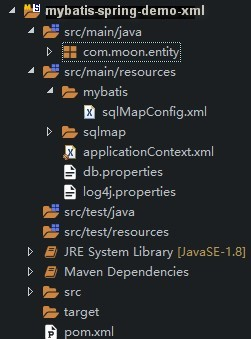

#### 11.4.3. 传统 dao 开发方式

示例实现需求：	1.根据用户id查询用户；2.新增用户

创建实体类，与对应映射文件 sqlmap/User.xml

```xml
<?xml version="1.0" encoding="UTF-8" ?>
<!DOCTYPE mapper
	PUBLIC "-//mybatis.org//DTD Mapper 3.0//EN"
	"http://mybatis.org/dtd/mybatis-3-mapper.dtd">
<mapper namespace="test">
	<!-- 根据id查询用户 -->
	<select id="findUserById" parameterType="int" resultType="user">
		select * from `user` where id=#{id}
	</select>
	<!-- 新增用户  -->
	<insert id="insertUser" parameterType="user">
		 <selectKey keyProperty="id" order="AFTER" resultType="java.lang.Integer">
		 	select LAST_INSERT_ID()
		 </selectKey>
		insert into user(username,birthday,address,sex) 
		values(#{username},#{birthday},#{address},#{sex})
	</insert>
</mapper>
```

创建dao接口

```java
public interface IUserDao {
	/**
	 * 根据id查询
	 */
	User findUserById(Integer id);
	/**
	 * 插入数据
	 */
	void insertUser(User user);
}
```

创建 dao 实现类

```java
// 整合包提供了一个SqlSessionDaoSupport类，dao实现类需要继承它，获取SqlSession对象
public class UserDaoImpl extends SqlSessionDaoSupport implements IUserDao {
	@Override
	public User findUserById(Integer id) {
		// 1.创建sqlSession
		SqlSession sqlSession = this.getSqlSession();
		// 2.执行sql语句
		User user = sqlSession.selectOne("test.findUserById", id);
		// 3.与spring整合以后，sqlSession对象，交给spring管理，不需要再手动释放（不能手动释放）
		// sqlSession.close();
		return user;
	}
	@Override
	public void insertUser(User user) {
		// 1.创建sqlSession
		SqlSession sqlSession = getSqlSession();
		// 2.执行sql语句
		sqlSession.insert("test.insertUser", user);
		// 3.与spring整合以后，sqlSession对象，交给spring管理，不需要再关心事务
		//（如果配置了spring的事务，它就使用spring的事务；如果没有配置spring事务，它就使用jdbc事务）
	}
}
```

创建实现类时，有以下注意问题：

1. 整合包提供了一个 `SqlSessionDaoSupport` 类，dao 实现类需要继承它，用于获取 `SqlSession` 对象。
2. 与 spring 整合以后，`SqlSession` 对象交给 spring 管理，不需要再手动释放（不能手动释放，即无需 `sqlSession.close();`）
3. 与 spring 整合以后，`SqlSession` 对象交给 spring 管理，不需要处理事务。
    - 如果配置了spring 的事务，它就使用 spring 的事务；
    - 如果没有配置 spring 事务，它就使用 jdbc 事务

在 applicationContext.xml 文件中，配置 dao 对象。主要配置 dao 层对象给 spring 管理，并给 dao 层实现类注入 sqlSessionFactory 对象

```xml
<!-- 配置用户dao对象 -->
<bean id="userDao" class="com.moon.dao.impl.UserDaoImpl">
	<!-- 注入sqlSessionFactory -->
	<property name="sqlSessionFactory" ref="sqlSessionFactory"></property>
</bean>
```

测试功能实现

```java
/**
 * 测试根据用户id查询用户
 */
@Test
public void queryUserByIdTest() {
	// 1.加载spring配置文件，创建spring容器
	ApplicationContext ac = new ClassPathXmlApplicationContext("classpath:spring/applicationContext.xml");
	// 2.从spring容器中获取dao对象
	IUserDao userDao = (IUserDao) ac.getBean("userDao");
	// 3.调用查询方法
	User user = userDao.findUserById(1);
	System.out.println(user);
}
/**
 * 测试插入用户
 */
@Test
public void insertUserTest() {
	// 1.加载spring配置文件，创建spring容器
	ApplicationContext ac = new ClassPathXmlApplicationContext("classpath:spring/applicationContext.xml");
	// 2.从spring容器中获取dao对象
	IUserDao userDao = (IUserDao) ac.getBean("userDao");
	// 3.创建用户对象，调用插入方法
	User user = new User();
	user.setUsername("主宰2");
	user.setAddress("Dota2");
	user.setBirthday(new Date());
	user.setSex("1");
	userDao.insertUser(user);
}
```

#### 11.4.4. 使用 mapper 代理开发方式

示例实现需求：	1.根据用户名称模糊查询用户；2.新增用户

##### 11.4.4.1. mapper 代理对象配置方式一

根据上面示例配置搭建项目，只需要注意以下内容：

在单独使用 mapper 代理开发的方式时，总配置文件需要配置加载 mapper 包下的 XxxMapper.xml 映射文件。但此次使用 spring 整合 MyBatis，可以不需要扫描配置映射文件，spring 整合包下的 `MapperFactoryBean` 接口代理对象实现类与 `MapperScannerConfigurer` 接口代理对象扫描类实现加载映射文件的功能

  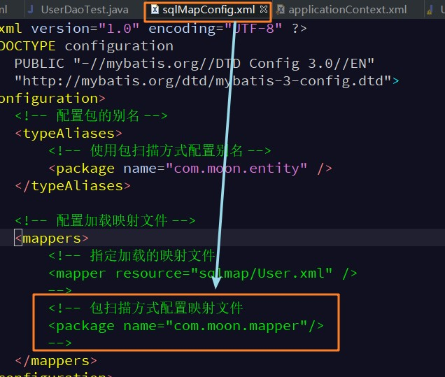

直接使用逆向工程生成的 mapper 接口和映射文件

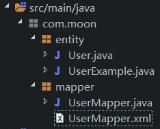

修改 applicationContext.xml 配置文件，将 dao 层对象修改为创建整合包提供的 `MapperFactoryBean` 类，配置 mapper 代理对象。创建 `MapperFactoryBean` 类时需要注入两个属性：

1. 注入 `sqlSessionFactory`，引入已经创建的 bean
2. 注入 `mapperInterface` 属性，值为被代理接口全限定名


```xml
<!-- 配置用户mapper代理对象 
	整合包提供的MapperFactoryBean类，用于配置mapper代理对象
-->
<bean id="userMapper" class="org.mybatis.spring.mapper.MapperFactoryBean">
	<!-- 注入sqlSessionFactory，引入已经创建的bean -->
	<property name="sqlSessionFactory" ref="sqlSessionFactory" />
	<!-- 注入mapperInterface属性，值为被代理接口全限定名 -->
	<property name="mapperInterface" value="com.moon.mapper.UserMapper" />
</bean>
```

测试使用逆向生成的mapper代理进行条件查询步骤：

1. 加载 spring 配置文件，创建 mapper 代理对象
2. 创建辅助类对象 `XxxExample`
3. 使用辅助类 `XxxExample` 调用 `XxxExample.createCriteria();` 方法创建 `Criteria` 对象
4. 给 `Criteria` 对象设置查询的条件，调用 `andXxx()` 方法
5. 使用 mapper 代理对象调用相应的方法，传入设置条件后的辅助类对象 `XxxExample`

```java
public class UserMapperTest {
	/**
	 * 测试根据用户名称模糊查询用户
	 */
	@Test
	public void queryUserByNameTest() {
		// 1.加载spring配置文件，创建spring容器
		ApplicationContext ac = new ClassPathXmlApplicationContext("classpath:spring/applicationContext.xml");
		// 2.从spring容器中获取用户mapper代理对象
		UserMapper mapper = (UserMapper) ac.getBean("userMapper");
		// 3.使用mapper代理对象调用查询方法
		// 3.1 使用代理对象创建辅助类对象
		UserExample userExample = new UserExample();
		// 3.2 使用辅助类，创建Criteria对象
		Criteria criteria = userExample.createCriteria();
		// 3.3 使用criteria对象，调用andXxx()方法，设置条件
		criteria.andUsernameLike("%小明%");
		// 3.4 使用mapper代理对象调用查询方法
		List<User> list = mapper.selectByExample(userExample);
		for (User user : list) {
			System.out.println(user);
		}
	}
}
```

测试使用逆向生成的 mapper 代理进行插入数据步骤：

1. 加载 spring 配置文件，创建 mapper 代理对象
2. 使用 mapper 代理对象调用 `insertSelective(xx)` 的方法插入数据

```java
public class UserMapperTest {
	/**
	 * 测试插入用户
	 */
	@Test
	public void insertUserTest() {
		// 1.加载spring配置文件，创建spring容器
		ApplicationContext ac = new ClassPathXmlApplicationContext("classpath:spring/applicationContext.xml");
		// 2.从spring容器中获取用户mapper代理对象
		UserMapper mapper = (UserMapper) ac.getBean("userMapper");
		// 3.创建用户对象，使用代理对象调用插入方法
		User user = new User();
		user.setUsername("主宰3");
		user.setAddress("Dota2");
		user.setBirthday(new Date());
		user.setSex("1");
		mapper.insertSelective(user);
	}
}
```

##### 11.4.4.2. mapper 代理对象配置方式二（推荐使用）

修改 spring 配置文件 applicationContext.xml，将配置创建 `MapperFactoryBean` 修改成创建 `MapperScannerConfigurer`，并配置扫描的包。具体说明如下：

1. 如果有多个包，在同一个父包下，配置父包即可
2. 如果不在同一父包下，以半角逗号（`,`）进行分割
3. 同样在 MyBatis 总配置文件中也不需要再扫描 XxxMapper.xml 映射文件

```xml
<!-- mapper代理对象配置方式二【掌握】 -->
<bean class="org.mybatis.spring.mapper.MapperScannerConfigurer">
	<!--配置扫描的包，说明：
		1.如果有多个包，在同一个父包下，配置父包即可
		2.如果不在同一父包下，以半角逗号（,）进行分割
	-->
	<property name="basePackage" value="com.moon.mapper" />
</bean>
```

### 11.5. 基于 xml 配置 + Mapper 接口的整合（较新版本的配置示例）

创建 spring 的总配置文件，主要配置包扫描与引入 mybatis 基础配置

```xml
<?xml version="1.0" encoding="UTF-8"?>
<beans xmlns="http://www.springframework.org/schema/beans"
       xmlns:xsi="http://www.w3.org/2001/XMLSchema-instance"
       xmlns:context="http://www.springframework.org/schema/context"
       xsi:schemaLocation="http://www.springframework.org/schema/beans
       http://www.springframework.org/schema/beans/spring-beans.xsd
       http://www.springframework.org/schema/context
       http://www.springframework.org/schema/context/spring-context.xsd">

    <!-- 引入整合 Mybatis 配置文件 -->
    <import resource="spring-jdbc.xml"/>
    <!-- 配置包扫描 -->
    <context:component-scan base-package="com.moon.mybatis"/>

</beans>
```

创建 spring 整合 MyBatis 的 xml 配置文件

```xml
<beans xmlns="http://www.springframework.org/schema/beans"
       xmlns:xsi="http://www.w3.org/2001/XMLSchema-instance"
       xsi:schemaLocation="http://www.springframework.org/schema/beans
        http://www.springframework.org/schema/beans/spring-beans.xsd"
       default-lazy-init="false">

    <!-- 配置读取properties配置文件 -->
    <bean id="propertyConfigurerForProject"
          class="org.springframework.beans.factory.config.PropertyPlaceholderConfigurer">
        <property name="order" value="1"/>
        <property name="ignoreUnresolvablePlaceholders" value="true"/>
        <property name="location" value="classpath:db.properties"/>
    </bean>

    <!-- 配置数据源，使用阿里druid数据源 -->
    <bean id="dataSource" class="com.alibaba.druid.pool.DruidDataSource" destroy-method="close" primary="true">
        <property name="driverClassName" value="${mybatis.driverClassName}"/>
        <property name="url" value="${mybatis.url}"/>
        <property name="username" value="${mybatis.username}"/>
        <property name="password" value="${mybatis.password}"/>
    </bean>

    <!-- 配置 SqlSessionFactoryBean -->
    <bean id="sqlSessionFactory" class="org.mybatis.spring.SqlSessionFactoryBean">
        <!-- 用于配置数据源，该属性为必选项 -->
        <property name="dataSource" ref="dataSource"/>
        <!-- 配置扫描 XML 映射文件的路径 -->
        <!--<property name="mapperLocations">
            <value>classpath:xml/*Mapper.xml</value>
        </property>-->
        <!-- 配置 mybatis config XML 的路径，，除了数据源外，可以通过此方式对 MyBatis 的各种进行配置 -->
        <property name="configLocation" value="mybatis-config.xml"/>
    </bean>

    <!-- 配置 MapperScannerConfigurer，扫描mapper接口，对dao生成代理并且交给spring管理 -->
    <bean id="mapperScannerConfigurer" class="org.mybatis.spring.mapper.MapperScannerConfigurer">
        <!-- 用于过滤被扫描的接口，如果设置了该属性，那么 MyBatis 的接口只有包含该注解才会被扫描进去 -->
        <!--<property name="annotationClass" value="org.springframework.stereotype.Repository"/>-->
        <!-- 用于配置基本的包路径。可以使用分号或逗号作为分隔符设置多于一个的包路径，每个映射器将会在指定的包路径中递归地被扫描 -->
        <property name="basePackage" value="com.moon.mybatis.dao"/>
    </bean>

    <!-- 配置 MapperFactoryBean 对应一个映射器注册到 Spring 中（一般不会使用此方式注册Mapper接口） -->
    <!--<bean id="userMapper" class="org.mybatis.spring.mapper.MapperFactoryBean">
        <property name="mapperInterface" value="com.moon.mybatis.dao.UserMapper" />
        <property name="sqlSessionFactory" ref="sqlSessionFactory" />
    </bean>-->

    <!-- 配置事务管理器，集成spring的事务 -->
    <bean id="transactionManager" class="org.springframework.jdbc.datasource.DataSourceTransactionManager">
        <property name="dataSource" ref="dataSource"/>
    </bean>

</beans>
```

spring 整合 MyBatis 的配置主要包含以下几点：

1. 配置数据源。（可以使用阿里 druid 或者 apache 等第三方数据源）
2. 配置`SqlSessionFactoryBean`。在 MyBatis-Spring 中，`SqlSessionFactoryBean`是用于创建`SqlSessionFactory`对象。常用配置有以下的属性：
    - `dataSource`：用于配置数据源，该属性为必选项，必须通过这个属性配置数据源。
    - `mapperLocations`：配置`SqlSessionFactoryBean`扫描 XML 映射文件的路径，可以使用 Ant 风格的路径进行配置。
    - `configLocation`：用于总配置 mybatis config XML 的路径，除了数据源外，其他都可以使用此方式对 MyBatis 的进行各种配置，并且配置 MyBatis settings 时只能使用这种方式。但配置文件中任意环境，数据源和 MyBatis 的事务管理器都会被忽略
    - `typeAliasesPackage`：配置包中类的别名，包中的类在XML映射文件中使用时可以省略包名部分，直接使用类名。这个配置不支持Ant风格的路径，当需要配置多个包路径时可以使用分号或逗号进行分隔
3. 配置`MapperScannerConfigurer`，通过该类的 `basePackage` 属性来配置自动扫描所有的 Mapper 接口，使用时可以直接通过 Spring 自动注入接口。
4. 配置事务管理器，一般都会配置 Mybatis 集成 Spring 的事务管理器，不会使用 MyBatis 原生的事务

创建 MyBatis 总配置文件 mybatis-config.xml，参考示例或者官网。以下是测试代码

```java
@Test
public void testMyBatisSpringBasic() {
    // 1. 基于xml配置，创建spring容器
    ClassPathXmlApplicationContext context = new ClassPathXmlApplicationContext("spring.xml");
    // 2. 从spring容器中，获取SqlSessionFactory实例
    SqlSessionFactory sqlSessionFactory = context.getBean(SqlSessionFactory.class);
    // 3. 通过SqlSessionFactory开启一个SqlSession
    SqlSession sqlSession = sqlSessionFactory.openSession();
    // 4. 通过SqlSession获取指定的mapper映射器
    UserMapper mapper = sqlSession.getMapper(UserMapper.class);
    // 5. 通过代理实例调用相应Mapper接口中的方法
    List<User> users = mapper.queryAllUser();
    System.out.println(users);
}
```

### 11.6. 基于纯注解配置方式的整合

- 创建数据源配置类（*定义在任意一个配置类中都可以*）

```java
@PropertySource("classpath:db.properties") // 获取配置文件
public class DruidConfig {

    @Value("${mybatis.url}")
    private String jdbcUrl;
    @Value("${mybatis.driverClassName}")
    private String driverClassName;
    @Value("${mybatis.username}")
    private String username;
    @Value("${mybatis.password}")
    private String password;

    @Bean("dataSource")
    public DataSource createDataSource() {
        // 1. 创建Druid数据源
        DruidDataSource druidDataSource = new DruidDataSource();
        // 2. 配置数据源相关参数
        druidDataSource.setDriverClassName(this.driverClassName);
        druidDataSource.setUrl(this.jdbcUrl);
        druidDataSource.setUsername(this.username);
        druidDataSource.setPassword(this.password);
        return druidDataSource;
    }
}
```

- 创建MyBatis核心配置类

```java
/*
 * 配置Mapper接口的包扫描，相当于xml方式的配置：
 * <bean id="mapperScannerConfigurer" class="org.mybatis.spring.mapper.MapperScannerConfigurer">
 */
@MapperScan("com.moon.mybatis.dao")
public class MyBatisConfig {

    @Autowired
    private ApplicationContext context;

    /*
     * 配置 SqlSessionFactoryBean，相当于xml方式的配置：
     * <bean id="sqlSessionFactory" class="org.mybatis.spring.SqlSessionFactoryBean">
     */
    @Bean
    public SqlSessionFactoryBean sqlSessionFactoryBean(DataSource dataSource) throws IOException {
        // 创建 SqlSessionFactoryBean
        SqlSessionFactoryBean sqlSessionFactoryBean = new SqlSessionFactoryBean();
        /* 配置SqlSessionFactoryBean对象相应属性值 */
        // 设置数据源
        sqlSessionFactoryBean.setDataSource(dataSource);
        // 创建 MyBatis 的“大管家”类
        Configuration configuration = new Configuration();
        // 将手动创建的 Configuration 实例设置到 SqlSessionFactoryBean 对象中
        sqlSessionFactoryBean.setConfiguration(configuration);
        // 设置日志的具体实现
        configuration.setLogImpl(Log4jImpl.class);
        // 设置读取mybatis总配置文件（此示例使用纯注解方式，所以没有此配置文件）
        // sqlSessionFactoryBean.setConfigLocation(context.getResource("classpath:mybatis-config.xml"));
        // 设置读取映射器xml配置文件
        sqlSessionFactoryBean.setMapperLocations(context.getResources("classpath:xml/*Mapper.xml"));
        // 设置别名
        sqlSessionFactoryBean.setTypeAliasesPackage("com.moon.mybatis.pojo");
        // 设置数据库厂商标识
        VendorDatabaseIdProvider databaseIdProvider = new VendorDatabaseIdProvider();
        Properties properties = new Properties();
        properties.setProperty("MySQL", "mysql");
        databaseIdProvider.setProperties(properties);
        sqlSessionFactoryBean.setDatabaseIdProvider(databaseIdProvider);
        /* 其他配置也可以按上面的方式进行配置 */
        return sqlSessionFactoryBean;
    }
}
```

- 创建Spring核心配置类，引入MyBatis相关的配置类

```java
@Configuration
@Import({MyBatisConfig.class, DruidConfig.class}) // 导入MyBatis的配置类、Druid数据源配置类（基于@PropertySource注解读取properties配置）
@ComponentScan("com.moon.mybatis") // 配置spring的包扫描
// @EnableTransactionManagement // 配置是否开启事务管理器
@PropertySource("classpath:log4j.properties") // 引入日志配置文件
public class SpringConfig {
}
```

- 准备相关的Mapper接口与映射文件，测试

```java
@Test
public void testMyBatisSpringAnnoBasic() {
    // 1. 基于xml配置，创建spring容器
    AnnotationConfigApplicationContext context = new AnnotationConfigApplicationContext(SpringConfig.class);
    // 2. 从spring容器中，获取SqlSessionFactory实例
    SqlSessionFactory sqlSessionFactory = context.getBean(SqlSessionFactory.class);
    // 3. 通过SqlSessionFactory开启一个SqlSession
    SqlSession sqlSession = sqlSessionFactory.openSession();
    // 4. 通过SqlSession获取指定的mapper映射器
    UserMapper mapper = sqlSession.getMapper(UserMapper.class);
    // 5. 通过代理实例调用相应Mapper接口中的方法
    List<User> users = mapper.queryAllUser();
    System.out.println(users);
}
```

# 其他

## 1. MyBatis 和 Hibernate 本质区别和应用场景（了解）

### 1.1. MyBatis 和 Hibernate 相同点

1. 对JDBC的封装
2. 持久层的框架
3. 用于dao层开发

### 1.2. MyBatis 和 Hibernate 区别

1.	SQL支持
    - hibernate是封装了sql语句，支持数据库无关性，在项目需要支持多种数据库的情况下，代码开发量较少，sql语句优化困难。
    - mybatis直接使用sql语句，不支持数据库无关性，在项目需要支持多种数据库的情况下，代码开发量较多，sql语句优化容易。
2.	多表关联
    - hibernate是配置java对象与表的对应关系，多表关联关系配置复杂。
    - mybatis是配置java对象与sql语句的对应关系，多表关联关系配置简单。
3.	应用场景
    - hibernate是一个相对重量级的框架，学习使用门槛高，适合于需求相对稳定的中小型项目，中小型的项目，比如办公自动化系统（OA），后台管理系统，erp、orm等
    - mybatis框架是一个轻量级的框架，学习使用门槛低，适合于大型的项目与需求变化较多的项目，比如互联网的项目。

注：hibernate是一个完全ORM构架，MyBatis是一个半ORM构架。快照是为了提高hibernate的保存数据的效率，是hibernate特有，其他框架没有存在。

企业进行技术选型，以低成本高回报作为技术选型的原则，根据项目组的技术力量进行选择

## 2. Mybatis 3.5.0 全配置示例(demo项目配置更新优先)

> 参考Mybatis源码学习项目：https://github.com/MooNkirA/mybatis-note
>
> \mybatis-note\mybatis-demo-2019\src\main\resources\mybatis-config-3.5.0-all.xml

```xml
<?xml version="1.0" encoding="UTF-8" ?>
<!DOCTYPE configuration PUBLIC "-//mybatis.org//DTD Config 3.0//EN" "http://mybatis.org/dtd/mybatis-3-config.dtd">
<configuration>

    <!-- 参数设置 -->
    <settings>
        <!-- 这个配置使全局的映射器启用或禁用缓存 -->
        <setting name="cacheEnabled" value="true"/>
        <!-- 全局启用或禁用延迟加载。当禁用时，所有关联对象都会即时加载 -->
        <setting name="lazyLoadingEnabled" value="true"/>
        <!-- 当启用时，有延迟加载属性的对象在被调用时将会完全加载任意属性。否则，每种属性将会按需要加载 -->
        <setting name="aggressiveLazyLoading" value="true"/>
        <!-- 允许或不允许多种结果集从一个单独的语句中返回（需要适合的驱动） -->
        <setting name="multipleResultSetsEnabled" value="true"/>
        <!-- 使用列标签代替列名。不同的驱动在这方便表现不同。参考驱动文档或充分测试两种方法来决定所使用的驱动 -->
        <setting name="useColumnLabel" value="true"/>
        <!-- 允许JDBC支持生成的键。需要适合的驱动。如果设置为true则这个设置强制生成的键被使用，尽管一些驱动拒绝兼容但仍然有效（比如Derby） -->
        <setting name="useGeneratedKeys" value="true"/>
        <!-- 指定MyBatis如何自动映射列到字段/属性。PARTIAL只会自动映射简单，没有嵌套的结果。FULL会自动映射任意复杂的结果（嵌套的或其他情况） -->
        <setting name="autoMappingBehavior" value="PARTIAL"/>
        <!--当检测出未知列（或未知属性）时，如何处理，默认情况下没有任何提示，这在测试的时候很不方便，不容易找到错误。 NONE : 不做任何处理
            (默认值) WARNING : 警告日志形式的详细信息 FAILING : 映射失败，抛出异常和详细信息 -->
        <setting name="autoMappingUnknownColumnBehavior" value="WARNING"/>
        <!-- 配置默认的执行器。SIMPLE执行器没有什么特别之处。REUSE执行器重用预处理语句。BATCH执行器重用语句和批量更新 -->
        <setting name="defaultExecutorType" value="SIMPLE"/>
        <!-- 设置超时时间，它决定驱动等待一个数据库响应的时间 -->
        <setting name="defaultStatementTimeout" value="25000"/>
        <!--设置查询返回值数量，可以被查询数值覆盖 -->
        <setting name="defaultFetchSize" value="100"/>
        <!-- 允许在嵌套语句中使用分页 -->
        <setting name="safeRowBoundsEnabled" value="false"/>
        <!-- 是否开启自动驼峰命名规则（camel case）映射，即从经典数据库列名 A_COLUMN 到经典 Java 属性名 aColumn 的类似映射。 -->
        <setting name="mapUnderscoreToCamelCase" value="false"/>
        <!--MyBatis 利用本地缓存机制（Local Cache）防止循环引用（circular references）和加速重复嵌套查询。
            默认值为 SESSION，这种情况下会缓存一个会话中执行的所有查询。 若设置值为 STATEMENT，本地会话仅用在语句执行上，对相同 SqlSession
            的不同调用将不会共享数据。 -->
        <setting name="localCacheScope" value="SESSION"/>
        <!-- 当没有为参数提供特定的 JDBC 类型时，为空值指定 JDBC 类型。 某些驱动需要指定列的 JDBC 类型，多数情况直接用一般类型即可，比如
            NULL、VARCHAR OTHER。 -->
        <setting name="jdbcTypeForNull" value="OTHER"/>
        <!-- 指定哪个对象的方法触发一次延迟加载。 -->
        <setting name="lazyLoadTriggerMethods" value="equals,clone,hashCode,toString"/>
    </settings>

    <!-- 别名定义 -->
    <typeAliases>
        <typeAlias alias="pageAccessURL" type="com.lgm.mybatis.model.PageAccessURL"/>
    </typeAliases>

    <!-- 自定义类型处理器 -->
    <typeHandlers>
        <!-- <typeHandler handler="com.xhm.util.BooleanTypeHandlder" /> -->
        <!-- 扫描整个包下的自定义类型处理器 -->
        <package name="com.xhm.util"/>
    </typeHandlers>

    <!--plugins插件之 分页拦截器 -->
    <plugins>
        <plugin interceptor="com.xhm.util.PageInterceptor"></plugin>
    </plugins>

    <!--配置environment环境 -->
    <environments default="development">
        <!-- 环境配置1，每个SqlSessionFactory对应一个环境 -->
        <environment id="development1">
            <!-- 事务配置 type = JDBC、MANAGED
                    1.JDBC:这个配置直接简单使用了JDBC的提交和回滚设置。它依赖于从数据源得到的连接来管理事务范围。
                    2.MANAGED:这个配置几乎没做什么。它从来不提交或回滚一个连接。而它会让容器来管理事务的整个生命周期（比如Spring或JEE应用服务器的上下文）。
                    默认情况下它会关闭连接。然而一些容器并不希望这样，因此如果你需要从连接中停止它，将closeConnection属性设置为false
            -->
            <transactionManager type="JDBC"/>
            <!--< transactionManager type="MANAGED">
                <property name="closeConnection"
                          value="false"/>
            </transactionManager> -->
            <!-- 数据源类型：type = UNPOOLED、POOLED、JNDI
                    1.UNPOOLED：这个数据源的实现是每次被请求时简单打开和关闭连接。它有一点慢，这是对简单应用程序的一个很好的选择，因为它不需要及时的可用连接。
                    不同的数据库对这个的表现也是不一样的，所以对某些数据库来说配置数据源并不重要，这个配置也是闲置的
                    2.POOLED：这是JDBC连接对象的数据源连接池的实现，用来避免创建新的连接实例时必要的初始连接和认证时间。
                    这是一种当前Web应用程序用来快速响应请求很流行的方法。
                    3.JNDI：这个数据源的实现是为了使用如Spring或应用服务器这类的容器，容器可以集中或在外部配置数据源，然后放置一个JNDI上下文的引用
             -->
            <dataSource type="UNPOOLED">
                <property name="driver" value="com.mysql.jdbc.Driver"/>
                <property name="url" value="jdbc:mysql://localhost:3306/xhm"/>
                <property name="username" value="root"/>
                <property name="password" value="root"/>
                <!-- 默认连接事务隔离级别 -->
                <!-- <property name="defaultTransactionIsolationLevel" value=""/> -->
            </dataSource>
        </environment>

        <!-- 环境配置2 -->
        <environment id="development2">
            <transactionManager type="JDBC"/>
            <dataSource type="POOLED">
                <property name="driver" value="com.mysql.jdbc.Driver"/>
                <property name="url" value="jdbc:mysql://localhost:3306/xhm"/>
                <property name="username" value="root"/>
                <property name="password" value="root"/>
                <!-- 在任意时间存在的活动（也就是正在使用）连接的数量 -->
                <property name="poolMaximumActiveConnections" value="10"/>
                <!-- 任意时间存在的空闲连接数 -->
                <property name="poolMaximumIdleConnections" value="5"/>
                <!-- 在被强制返回之前，池中连接被检查的时间 -->
                <property name="poolMaximumCheckoutTime" value="20000"/>
                <!-- 这是给连接池一个打印日志状态机会的低层次设置，还有重新尝试获得连接，这些情况下往往需要很长时间（为了避免连接池没有配置时静默失败） -->
                <property name="poolTimeToWait" value="20000"/>
                <!-- 发送到数据的侦测查询，用来验证连接是否正常工作，并且准备接受请求。 -->
                <property name="poolPingQuery" value="NO PING QUERY SET"/>
                <!-- 这是开启或禁用侦测查询。如果开启，你必须用一个合法的SQL语句（最好是很快速的）设置poolPingQuery属性 -->
                <property name="poolPingEnabled" value="false"/>
                <!-- 这是用来配置poolPingQuery多次时间被用一次。这可以被设置匹配标准的数据库连接超时时间，来避免不必要的侦测 -->
                <property name="poolPingConnectionsNotUsedFor" value="0"/>
            </dataSource>
        </environment>

        <!-- 环境配置3 -->
        <environment id="development3">
            <transactionManager type="JDBC"/>
            <dataSource type="JNDI">
                <property name="data_source" value="java:comp/env/jndi/mybatis"/>
                <property name="env.encoding" value="UTF8"/>
                <!-- <property name="initial_context" value=""/>
                <property name="env.encoding" value="UTF8"/> -->
            </dataSource>
        </environment>
    </environments>

    <!-- 映射文件，mapper的配置文件 -->
    <mappers>
        <!-- 直接映射到相应的mapper文件 -->
        <mapper resource="com/xhm/mapper/UserMapper.xml"/>
        <!-- 扫描包路径下所有xxMapper.xml文件 -->
        <package name="com.xhm.mapper"/>
    </mappers>

</configuration>
```

## 3. MyBatis常用API总结

### 3.1. Resources 类

#### 3.1.1. 简述

MyBatis提供的文件IO转换的工具类

#### 3.1.2. 常用方法

```java
static InputStream getResourceAsStream(String resource)
```

- 作用：将指定的文件资源转成输入流对象。
- 参数`resource`：需要转换的文件资源名称（路径）

### 3.2. SqlSessionFactoryBuilder 类

#### 3.2.1. 简述

通过SqlSessionFactoryBuilder创建会话工厂SqlSessionFactory。将SqlSessionFactoryBuilder当成一个工具类使用即可，不需要使用单例管理SqlSessionFactoryBuilder

在需要创建SqlSessionFactory时候，只需要new一次SqlSessionFactoryBuilder即可

#### 3.2.2. 常用方法

```java
SqlSessionFactory build(InputStream inputStream);
```

- 作用：根据全局配置文件，创建SqlSessionFactory会话工厂。
- 参数`inputStream`：MyBatis的配置文件输入流对象

### 3.3. SqlSessionFactory 接口

#### 3.3.1. 简述

它是mybaties框架的核心对象，是线程安全的。通过SqlSessionFactory创建SqlSession，可以使用单例模式管理sqlSessionFactory（工厂一旦创建，使用一个实例）

mybatis和spring整合后，使用单例模式管理sqlSessionFactory

#### 3.3.2. 常用方法

<font color=violet>*说明：自动提交事务，只要sql语句一执行，就马上提交。如果同时有多个操作，如果有个操作失败，则之前的其他操作无法回滚，此时需要使用手动提交的方式*</font>

```java
SqlSession openSession();
```

- 开启会话，返回SqlSession对象。<font color=red>**默认是关闭自动提交事务**</font>

```java
SqlSession openSession(boolean autoCommit);
```

- 作用：开启会话并指定是否自动提交事务，返回SqlSession对象
- 参数`autoCommit`：true开启自动提交/false关闭自动提交

### 3.4. SqlSession 接口

#### 3.4.1. 简述

```java
public interface SqlSession extends Closeable
```

`org.apache.ibatis.session.SqlSession` 是一个面向用户（程序员）的接口，提供了很多操作数据库的方法。如：selectOne(返回单个对象)、selectList（返回单个或多个对象）。在 SqlSesion 实现类中除了有接口中的方法（操作数据库的方法）还有数据域属性。

<font color=red>*SqlSession是线程不安全的*</font>。因此 **SqlSession 最佳应用场合在方法体内，定义成局部变量使用**

#### 3.4.2. 常用方法

```java
void close()
```

- 作用：关闭会话

```java
void commit()
```

- 作用：提交事务

```java
void rollback()
```

- 作用：回滚事务

```java
<T> T selectOne(String statement, Object parameter)
```

- 作用：查询返回单行记录(对象)
- 参数`statement`：唯一标识符匹配语句。等于映射文件中的`namespace+"."+statement`的id
- 参数`parameter`：传递给语句的参数对象，和映射文件中的parameterType类型一致


```java
<E> List<E> selectList(String statement, Object parameter)
```

- 作用：查询返回多行记录(对象)的List集合
- 参数`statement`：唯一标识符匹配语句。等于映射文件中的`namespace+"."+statement`的id
- 参数`parameter`：传递给语句的参数对象，和映射文件中的parameterType类型一致

```java
int insert(String statement, Object parameter)
```

- 作用：使用给定的参数对象statement执行插入语句。返回受影响的行数
- 参数`statement`：唯一标识符匹配语句。等于映射文件中的`namespace+"."+statement`的id
- 参数`parameter`：传递给语句的参数对象，和映射文件中的parameterType类型一致

```java
int delete(String statement, Object parameter)
```

- 作用：使用给定的参数对象statement执行删除语句。返回受影响的行数
- 参数`statement`：唯一标识符匹配语句。等于映射文件中的`namespace+"."+statement`的id
- 参数parameter``：传递给语句的参数对象，和映射文件中的parameterType类型一致

```java
int update(String statement, Object parameter)
```

- 作用：使用给定的参数对象statement执行更新语句。返回受影响的行数
- 参数`statement`：唯一标识符匹配语句。等于映射文件中的`namespace+"."+statement`的id
- 参数`parameter`：传递给语句的参数对象，和映射文件中的`parameterType`类型一致，<font color=red>注意参数必须设置id（主键）</font>

```java
<T> T getMapper(Class<T> type)
```

- 作用：获取指定的mapper接口动态代理对象
- 参数`type`：指定的mapper接口的字节码对象

#### 3.4.3. selectOne 和 selectList 区别

- `selectOne`表示查询出一条记录进行映射。如果使用`selectOne`可以实现使用`selectList`也可以实现（list中只有一个对象）。
- `selectList`表示查询出一个列表（多条记录）进行映射。如果使用`selectList`查询多条记录，不能使用`selectOne`。

> 如果查询多条记录时使用 selectOne 会报错：
>
> org.apache.ibatis.exceptions.TooManyResultsException: Expected one result (or null) to be returned by selectOne(), but found: 4

注：在动态代理对象调用`selectOne`和`selectList`是根据mapper接口方法的返回值决定，如果返回list则调用`selectList`方法，如果返回单个对象则调用`selectOne`方法。

## 4. 预编译

### 4.1. 定义

SQL 预编译指的是数据库驱动在发送 SQL 语句和参数给 DBMS 之前对 SQL 语句进行编译，这样 DBMS 执行 SQL 时，就不需要重新编译。

### 4.2. 为什么需要预编译

JDBC 中使用对象 `PreparedStatement` 来抽象预编译语句，使用预编译。预编译阶段可以优化 SQL 的执行。预编译之后的 SQL 多数情况下可以直接执行，DBMS 不需要再次编译，越复杂的SQL，编译的复杂度将越大，预编译阶段可以合并多次操作为一个操作。同时预编译语句对象可以重复利用。把一个 SQL 预编译后产生的 `PreparedStatement` 对象缓存下来，下次对于同一个SQL，可以直接使用这个缓存的对象。**Mybatis 默认情况下，将对所有的 SQL 进行预编译**。

## 5. ！！待整合

### 5.1. MyBatis 的框架设计

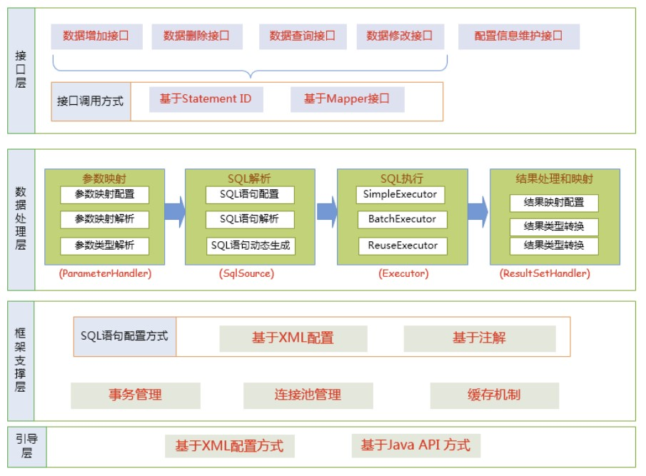

### 5.2. MyBatis 的主要构件及其相互关系

从MyBatis代码实现的角度来看，MyBatis的主要的核心部件有以下几个：

- SqlSession：作为 MyBatis 工作的主要顶层API，表示和数据库交互的会话，完成必要数据库增删改查功能
- Executor：MyBatis 执行器，是 MyBatis 调度的核心，负责SQL语句的生成和查询缓存的维护
- StatementHandler：封装了JDBC Statement操作，负责对JDBC statement 的操作，如设置参数、将Statement结果集转换成List集合。
- ParameterHandler：负责对用户传递的参数转换成JDBC Statement 所需要的参数，
- ResultSetHandler：负责将JDBC返回的ResultSet结果集对象转换成List类型的集合；
- TypeHandler：负责java数据类型和jdbc数据类型之间的映射和转换
- MappedStatement：MappedStatement维护了一条`<select|update|delete|insert>`节点的封装
- SqlSource：负责根据用户传递的parameterObject，动态地生成SQL语句，将信息封装到BoundSql对象中，并返回
- BoundSql：表示动态生成的SQL语句以及相应的参数信息
- Configuration：MyBatis所有的配置信息都维持在Configuration对象之中。


