## 1. JPA 基础回顾

> 详情 JPA 详见 [《Java基础-数据库编程》笔记](/Java/Java基础-数据库编程)

### 1.1. 概述

JPA 的全称是 Java Persistence API，即 Java 持久化 API，是 SUN 公司推出的一套基于 ORM 的规范，注意不是 ORM 框架——因为 JPA 并未提供 ORM 实现，它只是提供了一些编程的 API 接口。

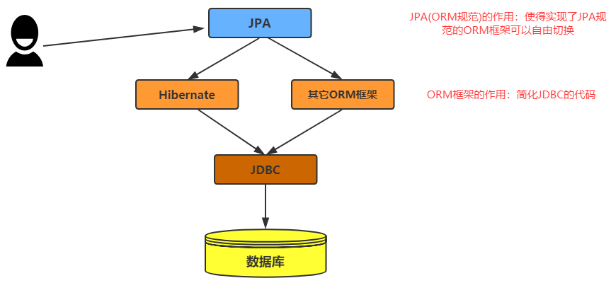

### 1.2. JPA 基础使用

#### 1.2.1. 数据库环境

```sql
-- 准备数据库，创建一张文章表备用
CREATE TABLE `article` (
	`aid` INT ( 11 ) NOT NULL auto_increment COMMENT '主键',
	`author` VARCHAR ( 255 ) DEFAULT NULL COMMENT '作者',
	`createTime` datetime DEFAULT NULL COMMENT '创建时间',
	`title` VARCHAR ( 255 ) DEFAULT NULL COMMENT '标题',
	PRIMARY KEY ( `aid` ) 
);
```

#### 1.2.2. 创建工程

创建 maven 工程，导入相关依赖：

```xml
<dependencies>
    <!-- Jpa 的实现框架 Hibernate-->
    <dependency>
        <groupId>org.hibernate</groupId>
        <artifactId>hibernate-entitymanager</artifactId>
        <version>5.0.7.Final</version>
    </dependency>

    <!-- mysql 连接驱动 -->
    <dependency>
        <groupId>mysql</groupId>
        <artifactId>mysql-connector-java</artifactId>
        <version>5.1.48</version>
    </dependency>
    <!-- junit -->
    <dependency>
        <groupId>junit</groupId>
        <artifactId>junit</artifactId>
        <version>4.13.2</version>
    </dependency>

    <!-- lombok 工具依赖 -->
    <dependency>
        <groupId>org.projectlombok</groupId>
        <artifactId>lombok</artifactId>
        <version>1.18.22</version>
    </dependency>
</dependencies>
```

> 注：JPA 是一套 Java 持久化 API 的规范，是没有具体实现，所以此示例使用 hibernate 框架的实现

#### 1.2.3. 创建数据库表映射实体类

使用 `javax.persistence` 包中相应的注解，配置实体类与数据库表的映射关系

```java
import lombok.Data;

import javax.persistence.Column;
import javax.persistence.Entity;
import javax.persistence.GeneratedValue;
import javax.persistence.GenerationType;
import javax.persistence.Id;
import javax.persistence.Table;
import java.util.Date;

@Data
@Entity // @Entity 注解用于告诉jpa这是一个实体类，需要把它跟数据库中的表做映射
@Table(name = "article") // 使用 @Table 注解建立了实体类和数据表的关系，name 属性指定映射的表名
public class Article {
    // 标识此属性为主键字段
    @Id
    // 指定主键生成策略，GenerationType.IDENTITY 就是对应到 mysql 中的数据自增策略
    @GeneratedValue(strategy = GenerationType.IDENTITY)
    @Column(name = "aid")
    private Integer id;

    /*
     * 使用 @Column 映射类的属性和数据表的字段关系，name 属性指定表中的字段名
     * 当类的属性名和数据表的字段名一致时，此注解可省略
     */
    @Column(name = "author")
    private String author;
    private Date createTime;
    private String title;
}
```

#### 1.2.4. JPA 的核心配置文件

在 maven 工程的 resources 路径下创建一个名为 `META-INF` 的文件夹，在文件夹下创建一个名为 `persistence.xml` 的配置文件。

> <font color=violet>**注意：`META-INF` 文件夹名称 与 `persistence.xml` 文件名称均不能修改**</font>

```xml
<?xml version="1.0" encoding="UTF-8"?>
<persistence xmlns="http://java.sun.com/xml/ns/persistence"
             xmlns:xsi="http://www.w3.org/2001/XMLSchema-instance"
             xsi:schemaLocation="http://java.sun.com/xml/ns/persistence
             http://java.sun.com/xml/ns/persistence/persistence_2_0.xsd"
             version="2.0">

    <!--
        持久化单元
           name属性：持久化单元的名称，需要保证唯一
           transaction-type属性：指定事务类型。 RESOURCE_LOCAL-本地事务；JTA：分布式事务
    -->
    <persistence-unit name="jpa" transaction-type="RESOURCE_LOCAL">

        <!-- 配置 JPA 规范的服务提供商，当项目中只有一个JPA的实现时，此选项可省略 -->
        <provider>org.hibernate.jpa.HibernatePersistenceProvider</provider>

        <!-- 指定实体类，此选项可省略 -->
        <class>com.moon.review.jpa.domain.Article</class>

        <properties>
            <!--跟数据库相关的信息 驱动 url 用户名 密码-->
            <property name="javax.persistence.jdbc.driver" value="com.mysql.jdbc.Driver"/>
            <property name="javax.persistence.jdbc.url" value="jdbc:mysql://localhost:3306/tempdb?useSSL=false&amp;useUnicode=true&amp;characterEncoding=UTF-8"/>
            <property name="javax.persistence.jdbc.user" value="root"/>
            <property name="javax.persistence.jdbc.password" value="123456"/>

            <!-- jpa的核心配置中兼容hibernate的配置（只在实现是hibernate框架时可用） -->
            <!-- 是否显示SQL -->
            <property name="hibernate.show_sql" value="true"/>
            <!-- 是否格式化显示的SQL -->
            <property name="hibernate.format_sql" value="true"/>
            <!--
                自动建表
                    update：如果数据库存在数据表，就使用。不存在，就创建
                    create：不管数据库有没有数据表，每次SQL请求都会重新建表
            -->
            <property name="hibernate.hbm2ddl.auto" value="update"/>
        </properties>
    </persistence-unit>

</persistence>
```

#### 1.2.5. JPA 基础操作测试

```java
public class HibernateJpaTest {

    // 持久化管理器工厂
    private EntityManagerFactory factory;
    // 持久化管理器
    private EntityManager entityManager;

    @Before
    public void before() {
        // 持久化单元名称，与 META-INF/persistence.xml 配置中的 persistence-unit 标签的 name 属性一致
        String persistenceUnitName = "jpa";
        // 1. 初始化持久化管理器工厂
        factory = Persistence.createEntityManagerFactory(persistenceUnitName);
        // 2. 初始化持久化管理器
        entityManager = factory.createEntityManager();
    }

    /* 新增测试 */
    @Test
    public void testSave() {
        // 3. 获取事务管理器（事务没有开启）
        EntityTransaction transaction = entityManager.getTransaction();
        // 4. 开启事务
        transaction.begin();

        // 5. 数据库操作
        Article article = new Article();
        article.setTitle("这是一个测试文章标题");
        article.setAuthor("MooN");
        article.setCreateTime(new Date());
        entityManager.persist(article); // 插入数据

        // 6. 事务提交
        transaction.commit();
    }

    /* 查询测试 */
    @Test
    public void testFindById() {
        // 5. 根据 id 查询数据
        Article article = entityManager.find(Article.class, 3);
        System.out.println(article);
    }

    /* 更新测试 */
    @Test
    public void testUpdate() {
        // 3. 获取事务管理器（事务没有开启）
        EntityTransaction transaction = entityManager.getTransaction();
        // 4. 开启事务
        transaction.begin();

        // 5. 数据库操作（更新需要先查询）
        Article article = entityManager.find(Article.class, 3);
        // 修改
        article.setTitle("我是修改了");
        article.setAuthor("MooN！！");
        article.setCreateTime(new Date());
        entityManager.merge(article); // 更新数据

        // 6. 事务提交
        transaction.commit();
    }

    /* 删除测试 */
    @Test
    public void testDelete() {
        // 3. 获取事务管理器（事务没有开启）
        EntityTransaction transaction = entityManager.getTransaction();
        // 4. 开启事务
        transaction.begin();

        // 5. 数据库操作（删除前先查询）
        Article article = entityManager.find(Article.class, 2);
        entityManager.remove(article); // 删除数据

        // 6. 事务提交
        transaction.commit();
    }

    @After
    public void after() {
        // 7. 关闭资源
        entityManager.close();
    }
}
```

## 2. Spring Data JPA 简介

Spring Data JPA 是 Spring Data 全家桶的一员，是 Spring Data 对 JPA 的封装，目的在于简化基于 JPA 的数据访问技术。使用 Spring Data JPA 技术之后，开发者只需要声明 Dao 层的接口，不必再写实现类或其它代码，剩下的一切交给 Spring Data JPA 来实现。

## 3. Spring Data JPA 快速开始

此示例基于传统的 spring xml 配置方式实现

### 3.1. 准备数据环境

让 JPA 自动生成表结构

### 3.2. 创建工程

#### 3.2.1. 引入依赖

创建 maven 工程，导入相关依赖：

```xml
<dependencies>
    <!-- Spring框架相关jar包 -->
    <dependency>
        <groupId>org.springframework</groupId>
        <artifactId>spring-context</artifactId>
        <version>5.1.6.RELEASE</version>
    </dependency>
    <dependency>
        <groupId>org.springframework</groupId>
        <artifactId>spring-orm</artifactId>
        <version>5.1.6.RELEASE</version>
    </dependency>

    <!-- spring data jpa 依赖 -->
    <dependency>
        <groupId>org.springframework.data</groupId>
        <artifactId>spring-data-jpa</artifactId>
        <version>2.1.8.RELEASE</version>
    </dependency>
    <!-- Jpa 的实现框架 Hibernate-->
    <dependency>
        <groupId>org.hibernate</groupId>
        <artifactId>hibernate-entitymanager</artifactId>
        <version>5.0.7.Final</version>
    </dependency>

    <!-- mysql 连接驱动 -->
    <dependency>
        <groupId>mysql</groupId>
        <artifactId>mysql-connector-java</artifactId>
        <version>5.1.48</version>
    </dependency>

    <!-- 测试相关 -->
    <dependency>
        <groupId>org.springframework</groupId>
        <artifactId>spring-test</artifactId>
        <version>5.1.6.RELEASE</version>
        <scope>test</scope>
    </dependency>
    <!-- junit -->
    <dependency>
        <groupId>junit</groupId>
        <artifactId>junit</artifactId>
        <version>4.13.2</version>
        <scope>test</scope>
    </dependency>

    <!-- lombok 工具依赖 -->
    <dependency>
        <groupId>org.projectlombok</groupId>
        <artifactId>lombok</artifactId>
        <version>1.18.22</version>
        <scope>provided</scope>
    </dependency>
</dependencies>
```

#### 3.2.2. 创建数据库表映射实体类

使用 `javax.persistence` 包中相应的注解，配置实体类与数据库表的映射关系

```java
import lombok.Data;

import javax.persistence.Column;
import javax.persistence.Entity;
import javax.persistence.GeneratedValue;
import javax.persistence.GenerationType;
import javax.persistence.Id;
import javax.persistence.Table;
import java.util.Date;

/**
 * article 表映射实体类
 */
@Data
@Entity // @Entity 注解用于告诉jpa这是一个实体类，需要把它跟数据库中的表做映射
@Table(name = "article") // 使用 @Table 注解建立了实体类和数据表的关系，name 属性指定映射的表名
public class Article {
    // 标识此属性为主键字段
    @Id
    // 指定主键生成策略，GenerationType.IDENTITY 就是对应到 mysql 中的数据自增策略
    @GeneratedValue(strategy = GenerationType.IDENTITY)
    /*
     * 使用 @Column 映射类的属性和数据表的字段关系，name 属性指定表中的字段名
     * 当类的属性名和数据表的字段名一致时，此注解可省略
     */
    @Column(name = "aid")
    private Integer id;
    private String author;
    private Date createTime;
    private String title;
}
```

#### 3.2.3. 编写 dao 接口

使用 Spring Data JPA 操作数据库，只需要按照框架的规范定义 dao 接口，不需要提供在接口中定义方法，也不需要为接口提供实现类就能完成基本的数据库的增删改查等功能。

在 Spring Data JPA 中定义的 Dao 层接口，需要继承 `JpaRepository` 和 `JpaSpecificationExecutor`（非必须）接口，并指定接口的泛型。接口说明如下：

- `JpaRepository<实体类类型，主键类型>`：用来完成基本 CRUD 操作
- `JpaSpecificationExecutor<实体类类型>`：用于复杂查询（分页等查询操作）

示例dao接口：

```java
/*
 * 在 Spring Data JPA 中定义的dao接口，需要继承以下接口：
 * `JpaRepository<实体类类型，主键类型>`：用来完成基本 CRUD 操作
 * [非必须] `JpaSpecificationExecutor<实体类类型>`：用于复杂查询（分页等查询操作）
 */
public interface ArticleDao extends JpaRepository<Article, Integer>, JpaSpecificationExecutor<Article> {
}
```

#### 3.2.4. Spring 整合 jpa 的配置文件

在 resources 目录下创建 Spring 整合 jpa 的配置文件 applicationContext-jpa.xml

```xml
<?xml version="1.0" encoding="UTF-8"?>
<beans xmlns="http://www.springframework.org/schema/beans"
       xmlns:xsi="http://www.w3.org/2001/XMLSchema-instance" xmlns:aop="http://www.springframework.org/schema/aop"
       xmlns:context="http://www.springframework.org/schema/context"
       xmlns:jdbc="http://www.springframework.org/schema/jdbc" xmlns:tx="http://www.springframework.org/schema/tx"
       xmlns:jpa="http://www.springframework.org/schema/data/jpa"
       xsi:schemaLocation="http://www.springframework.org/schema/beans http://www.springframework.org/schema/beans/spring-beans.xsd
		http://www.springframework.org/schema/aop http://www.springframework.org/schema/aop/spring-aop.xsd
		http://www.springframework.org/schema/context http://www.springframework.org/schema/context/spring-context.xsd
		http://www.springframework.org/schema/jdbc http://www.springframework.org/schema/jdbc/spring-jdbc.xsd
		http://www.springframework.org/schema/tx http://www.springframework.org/schema/tx/spring-tx.xsd
		http://www.springframework.org/schema/data/jpa http://www.springframework.org/schema/data/jpa/spring-jpa.xsd">

    <!-- 配置 spring 包扫描 -->
    <context:component-scan base-package="com.moon.springdata.jpa"/>

    <!-- 配置数据源 -->
    <bean id="dataSource" class="org.springframework.jdbc.datasource.DriverManagerDataSource">
        <property name="driverClassName" value="com.mysql.jdbc.Driver"/>
        <property name="url"
                  value="jdbc:mysql://localhost:3306/tempdb?useSSL=false&amp;useUnicode=true&amp;characterEncoding=UTF-8"/>
        <property name="username" value="root"/>
        <property name="password" value="123456"/>
    </bean>

    <!-- 配置 EntityManagerFactory，用于创建 EntityManger 实例 -->
    <bean id="entityManagerFactory" class="org.springframework.orm.jpa.LocalContainerEntityManagerFactoryBean">
        <!-- 配置数据源 -->
        <property name="dataSource" ref="dataSource"/>

        <!-- 指定扫描实体类所在包 -->
        <property name="packagesToScan" value="com.moon.springdata.jpa.domain"/>

        <!-- 配置服务的提供商 -->
        <property name="persistenceProvider">
            <bean class="org.hibernate.jpa.HibernatePersistenceProvider"/>
        </property>

        <!-- SpringData Jpa 兼容 Hibernate 使用 -->
        <property name="jpaVendorAdapter">
            <bean class="org.springframework.orm.jpa.vendor.HibernateJpaVendorAdapter">
                <!-- 配置数据库厂商名称 -->
                <property name="database" value="MYSQL"/>
                <!-- 是否自动建表  true 自动建表  false 不会自动建表-->
                <property name="generateDdl" value="true"/>
                <!-- 是否显示SQL -->
                <property name="showSql" value="true"/>
                <!-- 数据库方言 -->
                <property name="databasePlatform"
                          value="org.hibernate.dialect.MySQLDialect"/>
            </bean>
        </property>
    </bean>

    <!-- 声明事务管理器 -->
    <bean id="transactionManager" class="org.springframework.orm.jpa.JpaTransactionManager">
        <property name="dataSource" ref="dataSource"/>
    </bean>

    <!--
        jpa:repository 的配置
            base-package 属性：配置dao包的包名 它会为此包下所有的接口动态产生代理对象
     -->
    <jpa:repositories base-package="com.moon.springdata.jpa.dao"
                      entity-manager-factory-ref="entityManagerFactory"
                      transaction-manager-ref="transactionManager"
    />

</beans>
```

### 3.3. 测试

注入dao接口，进行基础的 crud 操作

```java
@RunWith(SpringJUnit4ClassRunner.class)
@ContextConfiguration("classpath:applicationContext-jpa.xml") // 加载配置文件
public class SpringDataJpaTest {

    @Autowired
    private ArticleDao articleDao;

    /* 新增数据 */
    @Test
    public void testSave() {
        Article article = new Article();
        article.setTitle("金田一少年事件簿");
        article.setAuthor("MooN");
        article.setCreateTime(new Date());

        articleDao.save(article);
    }

    /* 根据id查询 */
    @Test
    public void testFindById() {
        Optional<Article> optional = articleDao.findById(3);
        optional.ifPresent(System.out::println);
    }

    /* 查询所有 */
    @Test
    public void testFindAll() {
        List<Article> articles = articleDao.findAll();
        for (Article article : articles) {
            System.out.println(article);
        }
    }

    /* 修改数据 */
    @Test
    public void testUpdate() {
        Article article = new Article();
        article.setAuthor("只改这部分属性");
        article.setId(2);
        /*
         * Sping data Jpa 的保存和修改使用的都是 save 方法
         *  如果主键属性有值，则进行修改操作
         *  如果主键属性没有值，则进行新增操作
         */
        articleDao.save(article);
    }

    /* 修改数据（先查询，后修改） */
    @Test
    public void testUpdate2() {
        articleDao.findById(3).ifPresent(a -> {
            a.setAuthor("kira");
            a.setTitle("我是查询后修改的！");
            articleDao.save(a);
        });
    }

    /* 删除数据 */
    @Test
    public void testDelete() {
        articleDao.deleteById(8);
    }
}
```

## 4. Spring Data JPA 的多种查询方式

### 4.1. 父接口方法查询

#### 4.1.1. 概述

自定义的 Dao 接口可以直接使用其父接口 `JpaRepository` 提供的方法。

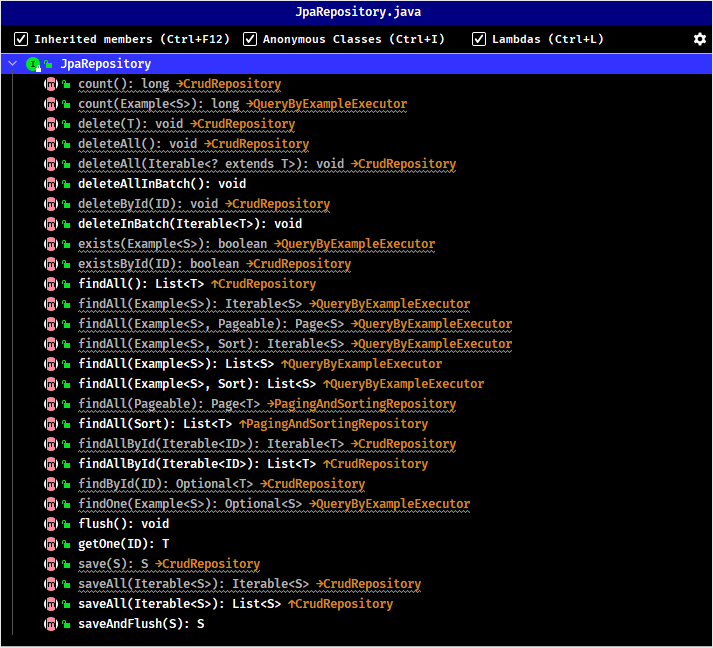

其中值得注意的是：

- `deleteAll` 与 `deleteInBatch` 的区别
    - `deleteAll`：会先查询数据，再一条一条删除数据
    - `deleteInBatch`：不会查询数据，直接删除，并且只使用一条删除语句

#### 4.1.2. 测试

```java
@Autowired
private ArticleDao articleDao;

/* 保存单条数据 */
@Test
public void testSave() {
    Article article = new Article();
    article.setTitle("射雕三部曲");
    article.setAuthor("金庸");
    article.setCreateTime(new Date());

    // 保存一个实体
    articleDao.save(article);
}

/* 保存单条数据，并且立即刷新缓存 */
@Test
public void testSaveAndFlush() {
    Article article = new Article();
    article.setTitle("鬼灭之刃");
    article.setAuthor("吾峠呼世晴");
    article.setCreateTime(new Date());

    // 保存一个实体,并且立即刷新缓存
    articleDao.saveAndFlush(article);
}

/* 保存多条数据 */
@Test
public void testSaveAll() {
    List<Article> list = new ArrayList<>();
    for (int i = 1; i < 4; i++) {
        Article article = new Article();
        article.setTitle("bleach" + i);
        article.setAuthor("斩月");
        article.setCreateTime(new Date());
        list.add(article);
    }

    // 保存多条数据
    articleDao.saveAll(list);
}

/* 根据主键id删除单条数据 */
@Test
public void testDeleteById() {
    // 根据id删除
    articleDao.deleteById(14);
}

/* 根据主键id删除单条数据 */
@Test
public void testDeleteOne() {
    // 根据实体删除，但是此实体必须要有主键
    Article article = new Article();
    article.setId(13);
    articleDao.delete(article);
}

/* 批量删除数据（底层都是先查询，再多条删除语句） */
@Test
public void testDeleteAll() {
    // 直接删除表所有数据，一般不会使用
    // articleDao.deleteAll();

    // 根据多个实体删除数据，实体类需要有主键id
    List<Article> list = new ArrayList<>();
    for (int i = 15; i < 18; i++) {
        Article article = new Article();
        article.setId(i);
        list.add(article);
    }
    articleDao.deleteAll(list);
}

/* 批量删除数据（直接删除，一条删除语句） */
@Test
public void testDeleteInBatch() {
    // 直接删除表所有数据，一般不会使用
    // articleDao.deleteAllInBatch();

    // 根据多个实体删除数据，实体类需要有主键id
    List<Article> list = new ArrayList<>();
    for (int i = 18; i < 21; i++) {
        Article article = new Article();
        article.setId(i);
        list.add(article);
    }
    articleDao.deleteInBatch(list);
}

/* 查询总记录数 */
@Test
public void testCount() {
    long count = articleDao.count();
    System.out.println("总记录数：" + count);
}

/* 根据id查询记录是否存在 */
@Test
public void testExistsById() {
    boolean b = articleDao.existsById(99);
    System.out.println("ID为5是否存在：" + b);
}

/* 根据主键查询单条数据 */
@Test
public void testFindById() {
    // 根据一个主键查询
    articleDao.findById(3).ifPresent(System.out::println);
}

/* 根据多个主键查询多条数据 */
@Test
public void testFindAllById() {
    // 根据多个主键查询
    List<Integer> list = new ArrayList<>();
    list.add(3);
    list.add(6);
    list.add(10);
    List<Article> articles = articleDao.findAllById(list);
    for (Article article : articles) {
        System.out.println(article);
    }
}

/* 查询所有 */
@Test
public void testFindAll() {
    List<Article> articles = articleDao.findAll();
    for (Article article : articles) {
        System.out.println(article);
    }
}

/* 查询所有数据并排序 */
@Test
public void testFindAllWithSort() {
    // 按照 aid 主键倒序排列，需要注意：这个排列的字段是实体类的属性名称，非表字段名称！！
    Sort sort = Sort.by(Sort.Order.desc("id"));
    List<Article> articles = articleDao.findAll(sort);
    for (Article article : articles) {
        System.out.println(article);
    }
}

/* 分页查询所有数据 */
@Test
public void testFindAllWithPage() {
    /*
        * 创建分页条件对象Pageable
        *  参数 page：当前是第几页(从0开始)
        *  参数 size：每页大小
        */
    Pageable pageable = PageRequest.of(0, 2);
    Page<Article> page = articleDao.findAll(pageable);

    // 获取查询的总记录数
    System.out.println("总记录数:" + page.getTotalElements());
    // 获取总页数
    System.out.println("总页数:" + page.getTotalPages());
    // 获取每页大小
    System.out.println("每页大小:" + page.getSize());

    // 获取当前查询的元素
    List<Article> content = page.getContent();
    for (Article article : content) {
        System.out.println(article);
    }
}

/* 查询所有数据（分页+排序） */
@Test
public void testFindAllWithPageAndPage() {
    // 创建排序对象，按照主键 aid 倒序排列
    Sort sort = Sort.by(Sort.Order.desc("id"));

    /*
        * 创建分页条件对象 Pageable
        *  参数 page：当前是第几页(从0开始)
        *  参数 size：每页大小
        *  参数 sort：排序对象 Sort
        */
    Pageable pageable = PageRequest.of(0, 2, sort);
    Page<Article> page = articleDao.findAll(pageable);

    System.out.println("总记录数:" + page.getTotalElements());
    System.out.println("总页数:" + page.getTotalPages());
    System.out.println("每页大小:" + page.getSize());
    for (Article article : page.getContent()) {
        System.out.println(article);
    }
}
```

### 4.2. 方法命名规则查询

#### 4.2.1. 概述

**方法命名规则查询**就是按照 Spring Data JPA 提供的方法命名规则，来定义查询方法的名称。Spring Data JPA 在程序执行的时候会根据方法名称进行解析，并自动生成查询语句进行查询。

按照 Spring Data JPA 定义的规则，查询方法以 `findBy` 开头，涉及条件查询时，条件的属性用条件关键字连接，<font color=red>**值得注意的是：条件属性首字母需大写**</font>。框架在进行方法名解析时，会先把方法名多余的前缀截取掉，然后对剩下部分进行解析。

#### 4.2.2. 命名规则

> 详情查询官方文档（示例是2.4.15版本）：https://docs.spring.io/spring-data/jpa/docs/2.4.15/reference/html/#jpa.query-methods.query-creation

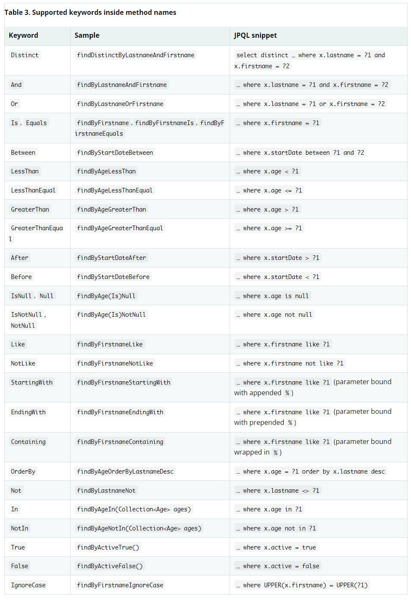

#### 4.2.3. 方法命名规则查询的缺点

- 当要查询的条件比较多的时候，此时方法的名称就非常的长
- 查询条件每个值只能通过形参一个个传递，不能使用实体类的方式来接收查询条件的值

#### 4.2.4. 测试

- 在自定义 dao 接口增加相应的方法命名查询方法

```java
public interface ArticleDao extends JpaRepository<Article, Integer>, JpaSpecificationExecutor<Article> {

    // 根据标题查询
    List<Article> findByTitle(String title);

    // 根据标题模糊查询
    List<Article> findByTitleLike(String title);

    // 根据标题和作者查询
    List<Article> findByTitleAndAuthor(String title, String author);

    // 根据ID范围查询 小于
    List<Article> findByIdIsLessThan(Integer aid);

    // 根据ID范围查询 between in
    List<Article> findByIdBetween(Integer startAid, Integer endAid);

    // 根据ID范围查询 in
    List<Article> findByIdIn(List<Integer> aids);

    // 根据创建时间之后查询
    List<Article> findByCreateTimeAfter(Date createTime);
}
```

- 测试

```java
@Autowired
private ArticleDao articleDao;

@Test
public void testFindByTitle() {
    List<Article> articles = articleDao.findByTitle("金田一少年事件簿");
    for (Article article : articles) {
        System.out.println(article);
    }
}

@Test
public void testFindByTitleLike() {
    List<Article> articles = articleDao.findByTitleLike("%一%");
    for (Article article : articles) {
        System.out.println(article);
    }
}

@Test
public void testFindByTitleAndAuthor() {
    List<Article> articles = articleDao.findByTitleAndAuthor("金田一少年事件簿", "MooN");
    for (Article article : articles) {
        System.out.println(article);
    }
}

@Test
public void testFindByAidIsLessThan() {
    List<Article> articles = articleDao.findByIdIsLessThan(9);
    for (Article article : articles) {
        System.out.println(article);
    }
}

@Test
public void testFindByAidBetween() {
    List<Article> articles = articleDao.findByIdBetween(6, 9);
    for (Article article : articles) {
        System.out.println(article);
    }
}

@Test
public void testFindByAidIn() {
    List<Integer> list = Stream.of(6, 8, 10).collect(Collectors.toList());
    List<Article> articles = articleDao.findByIdIn(list);
    for (Article article : articles) {
        System.out.println(article);
    }
}

@Test
public void testFindByCreateTimeAfter() {
    List<Article> articles = articleDao.findByCreateTimeAfter(new Date());
    for (Article article : articles) {
        System.out.println(article);
    }
}
```

### 4.3. JPQL 查询

使用 Spring Data JPA 提供的查询方法已经可以解决大部分的应用场景，但是对于某些业务来说，还是需要灵活的构造查询条件，此就可以使用 `@Query` 注解，结合 JPQL 的语句方式完成查询。

JPQL，全称是 Java Persistence Query Language。JPQL 语句是 JPA 中定义的一种查询语言，此种语言的用意是让开发者忽略数据库表和表中的字段，而关注实体类及实体类中的属性。它的写法十分类似于 SQL 语句的写法，但值得注意的是，<font color=red>**把查询的表名换成实体类名称，把表中的字段名换成实体类的属性名称**</font>。

- 在自定义 dao 接口，使用 `@Query`注解，增加 JPQL 查询方法

```java
public interface ArticleDao extends JpaRepository<Article, Integer>, JpaSpecificationExecutor<Article> {

    /*
     * JPQL 语句是 JPA 中定义的一种查询语言。类似于SQL语句，但是要使用实体类名代替表名，使用属性名代替字段名[面向对象查询]
     */
    // 按展示位置参数绑定，占位符从1开始，按照位置替换 title 和 author 查询
    @Query("from Article a where a.title = ?1 and a.author =?2")
    List<Article> findByCondition1(String title, String author);

    // 按名字参数绑定
    @Query("from Article a where a.title = :title and a.author = :authors")
    List<Article> findByCondition2(@Param("title") String title, @Param("authors") String author);

    // like模糊查询
    @Query("from Article a where a.title like %:title%")
    List<Article> findByCondition3(@Param("title") String title);

    // 排序查询
    @Query("from Article a where a.title like %:title% order by a.id desc ")
    List<Article> findByCondition4(@Param("title") String title);

    // 分页查询
    @Query("from Article a where a.title like %:title%")
    List<Article> findByCondition5(Pageable pageable, @Param("title") String title);

    // 传入集合参数查询
    @Query("from Article a where a.id in :aids")
    List<Article> findByCondition6(@Param("aids") List<Integer> aids);

    // 传入Bean进行查询（SPEL表达式查询）
    @Query("from Article a where a.title = :#{#article.title} and a.author = :#{#article.author}")
    List<Article> findByCondition7(@Param("article") Article article);
}
```

- 测试

```java
@Autowired
private ArticleDao articleDao;

@Test
public void testFindByCondition1() {
    List<Article> articles = articleDao.findByCondition1("金田一少年事件簿", "MooN");
    for (Article article : articles) {
        System.out.println(article);
    }
}

@Test
public void testFindByCondition2() {
    List<Article> articles = articleDao.findByCondition2("金田一少年事件簿", "MooN");
    for (Article article : articles) {
        System.out.println(article);
    }
}

@Test
public void testFindByCondition3() {
    List<Article> articles = articleDao.findByCondition3("一");
    for (Article article : articles) {
        System.out.println(article);
    }
}

@Test
public void testFindByCondition4() {
    List<Article> articles = articleDao.findByCondition4("金田一少年事件簿");
    for (Article article : articles) {
        System.out.println(article);
    }
}

@Test
public void testFindByCondition5() {
    Pageable pageable = PageRequest.of(0, 3);
    List<Article> articles = articleDao.findByCondition5(pageable, "金田一少年事件簿");
    for (Article article : articles) {
        System.out.println(article);
    }
}

@Test
public void testFindByCondition6() {
    List<Integer> list = Stream.of(6, 10).collect(Collectors.toList());
    List<Article> articles = articleDao.findByCondition6(list);
    for (Article article : articles) {
        System.out.println(article);
    }
}

@Test
public void testFindByCondition7() {
    Article articleParam = new Article();
    articleParam.setTitle("金田一少年事件簿");
    articleParam.setAuthor("MooN");
    List<Article> articles = articleDao.findByCondition7(articleParam);
    for (Article article : articles) {
        System.out.println(article);
    }
}
```

### 4.4. 本地（原生）SQL 查询

使用原生的 SQL 查询，只需要在方法使用 `@Query` 注解，设置属性 `nativeQuery` 为 true。但实际项目基本不会使用，除非是出现非常复杂的业务情况导致 SQL 非常复杂，JPQL 搞不定的时候

- 在自定义 dao 接口，使用 `@Query`注解，增加原生 SQL 查询方法

```java
// 本地SQL查询
@Query(value = "select * from article a where a.title = ?1 and a.author =?2", nativeQuery = true)
List<Article> findByNativeSql(String title, String author);
```

- 测试

```java
@Autowired
private ArticleDao articleDao;

@Test
public void testFindByNativeSql() {
    List<Article> articles = articleDao.findByNativeSql("金田一少年事件簿", "MooN");
    for (Article article : articles) {
        System.out.println(article);
    }
}
```

### 4.5. Specifications 动态查询

Spring Data JPA 中可以通过自定义 dao 继承 `JpaSpecificationExecutor` 接口，来实现实体类支柱动态条件查询。相比 JPQL，其优势是类型安全，更加的面向对象，缺点是书写比较麻烦。

```java
@Autowired
private ArticleDao articleDao;

/* 动态条件拼接查询。以不为空的属性作为查询条件，按照标题和作者进行查询 */
@Test
public void testFindAll() {
    // 模拟动态的查询条件
    String title = "金田一少年事件簿";
    String author = "";

    List<Article> articles = articleDao.findAll(new Specification<Article>() {
        /**
            * 查询条件拼接方法
            *
            * @param root  代表实体对象,我们可以通过它获取属性值
            * @param cq    用于生成SQL语句
            * @param cb    用于拼接查询条件
            * @return
            */
        @Override
        public Predicate toPredicate(Root<Article> root, CriteriaQuery<?> cq, CriteriaBuilder cb) {

            List<Predicate> list = new ArrayList<>();
            if (!StringUtils.isEmpty(title)) {
                // 拼接作为查询条件
                Predicate predicate = cb.equal(root.get("title").as(String.class), title);
                list.add(predicate);
            }
            if (!StringUtils.isEmpty(author)) {
                // 拼接作为查询条件
                Predicate predicate = cb.equal(root.get("author").as(String.class), author);
                list.add(predicate);
            }

            return cb.and(list.toArray(new Predicate[]{}));
        }
    });

    for (Article article : articles) {
        System.out.println(article);
    }
}

/* 动态条件拼接查询 - 分页查询 */
@Test
public void testFindAllWithPage() {
    // 模拟动态的查询条件
    String title = "";
    String author = "";

    // 设置分页
    Pageable pageable = PageRequest.of(0, 3);
    // 使用 lambda 表达式方式创建
    Page<Article> page = articleDao.findAll((Specification<Article>) (root, cq, cb) -> {

        List<Predicate> list = new ArrayList<>();
        if (!StringUtils.isEmpty(title)) {
            // 拼接作为查询条件
            Predicate predicate = cb.equal(root.get("title").as(String.class), title);
            list.add(predicate);
        }
        if (!StringUtils.isEmpty(author)) {
            // 拼接作为查询条件
            Predicate predicate = cb.equal(root.get("author").as(String.class), author);
            list.add(predicate);
        }

        return cb.and(list.toArray(new Predicate[]{}));
    }, pageable);

    for (Article article : page.getContent()) {
        System.out.println(article);
    }
}

/* 动态条件拼接查询 - 分页与排序查询 */
@Test
public void testFindAllWithPageAndSort() {
    // 模拟动态的查询条件
    String title = "金田一少年事件簿";
    String author = "";

    // 创建分页与排序
    Pageable pageable = PageRequest.of(0, 3, Sort.by(Sort.Order.desc("id")));

    Page<Article> page = articleDao.findAll((Specification<Article>) (root, cq, cb) -> {

        List<Predicate> list = new ArrayList<>();
        if (!StringUtils.isEmpty(title)) {
            //拼接作为查询条件
            Predicate predicate = cb.equal(root.get("title").as(String.class), title);
            list.add(predicate);
        }
        if (!StringUtils.isEmpty(author)) {
            //拼接作为查询条件
            Predicate predicate = cb.equal(root.get("author").as(String.class), author);
            list.add(predicate);
        }

        return cb.and(list.toArray(new Predicate[]{}));
    }, pageable);

    for (Article article : page.getContent()) {
        System.out.println(article);
    }
}
```

## 5. Spring Data JPA 实现多表操作

### 5.1. 多表关系分析回顾

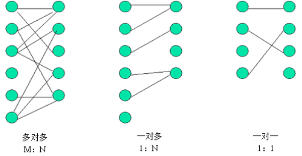

系统设计的三种实体关系分别为： 多对多、一对多和一对一关系。

> 注意：一对多关系可以看为两种： 即一对多，多对一

在实际开发中，数据库的表难免会有相互的关联关系，在操作表的时候就有可能会涉及到多张表的操作。而在这种实现了ORM思想的框架中（如 JPA），可以通过操作实体类就实现对数据库表的操作。

### 5.2. 配置表间关联关系的步骤

- 第一步：首先确定两张表之间的关系
- 第二步：在实体类中描述出两个实体的关系
- 第三步：配置出实体类和数据库表的关系映射（重点）

### 5.3. 一对一关系

#### 5.3.1. 数据表结构

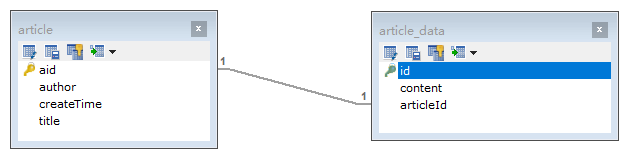

#### 5.3.2. 创建实体类配置表关系

- 创建文章实体类、文章详情实体类

```java
@Data
@Entity
@Table(name = "article_data")
public class ArticleData {
    @Id
    @GeneratedValue(strategy = GenerationType.IDENTITY)
    private Integer id;
    private String content;
}
```

```java
@Data
@Entity
@Table(name = "article")
public class Article {
    @Id
    @GeneratedValue(strategy = GenerationType.IDENTITY)
    @Column(name = "aid")
    private Integer id;
    private String author;
    private Date createTime;
    private String title;
}
```

- 在 `Article` 类引入 `ArticleData` 类做为属性，使用 `@OneToOne` 标识一对一关系。

```java
@Data
@Entity
@Table(name = "article")
public class Article {
    ....
    /*
     * @OneToOne 注解声明类间关系，与文章内容 ArticleData 为一对一关系。
     *  mappedBy 属性：一对一关系的对方实体类相应的属性名称，并代表放弃关系维护，由对方来维护关系
     *  cascade 属性：设置级联操作。CascadeType.ALL 代表所有操作都进行级联操作
     */
    @OneToOne(mappedBy = "article", cascade = CascadeType.ALL)
    private ArticleData articleData;
}
```

- 在 `ArticleData` 类引入 `Article` 类做为属性，使用 `@OneToOne` 标识一对一关系，并使用 `@JoinColumn` 注解维护表间关系

```java
@Data
@Entity
@Table(name = "article_data")
public class ArticleData {
    ....
    /*
     * @OneToOne 注解声明类间关系，与文章内容 ArticleData 为一对一关系。由此类来维护关系
     */
    @OneToOne
    /*
     * @JoinColumn 注解声明维护外键关系，当前表中的外键 articleId 指向 Article 表的主键 id
     *  name 属性：当前表中的外键名
     *  referencedColumnName 属性：指向的对方表中的主键名
     *  unique 属性：代表外键是否唯一，默认值是 false：不唯一；true：唯一。（因为一对一关系所以需要设置为 true）
     */
    @JoinColumn(name = "articleId", referencedColumnName = "aid", unique = true)
    private Article article;
}
```

#### 5.3.3. 创建 dao 接口

创建 ArticleDao 接口

```java
public interface ArticleDataDao extends JpaRepository<ArticleData, Integer>, JpaSpecificationExecutor<ArticleData> {
}
```

#### 5.3.4. 测试

```java
@Autowired
private ArticleDao articleDao;

// 一对一表关系测试
@Test
public void testSave() {
    // 创建文章对象
    Article article = new Article();
    article.setTitle("月色真美");
    article.setAuthor("柿原优子");
    article.setCreateTime(new Date());

    // 创建文章内容对象
    ArticleData articleData = new ArticleData();
    articleData.setContent("该作的背景作画相当细致，在校园风景、街景上，光影与行人的应用让场景看起来更为鲜活并富有风情。");

    // 建立两个对象间的关系
    article.setArticleData(articleData);
    articleData.setArticle(article);

    // 保存操作
    articleDao.save(article);
}
```

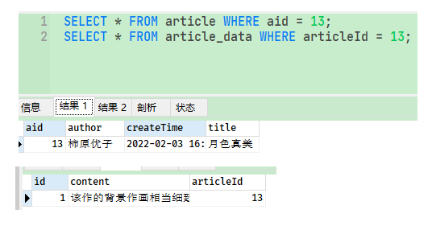

### 5.4. 一对多关系

#### 5.4.1. 数据表结构

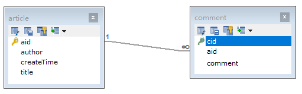

#### 5.4.2. 创建实体类配置表关系

- 创建文章评论类 `Comment`，使用 `@ManyToOne` 注解多对一关系，并使用 `@JoinColumn` 注解维护表间关系

```java
@Setter
@Getter
@Entity
@Table(name = "comment")
public class Comment {
    @Id
    @GeneratedValue(strategy = GenerationType.IDENTITY)
    private Integer cid;
    private String comment;
    /*
     * @ManyToOne 注解声明类间关系，与文章 Article 为多对一关系。由此类来维护关系
     */
    @ManyToOne
    /*
     * @JoinColumn 注解声明维护外键关系，当前表中的外键 articleId 指向 Article 表的主键 id
     *  name 属性：当前表中的外键名
     *  referencedColumnName 属性：指向的对方表中的主键名
     */
    @JoinColumn(name = "aid", referencedColumnName = "aid")
    private Article article;
}
```

- 在文章 `Article` 类中，添加文章评论 `Comment` 属性集合

```java
@Setter
@Getter
@Entity
@Table(name = "article")
public class Article {
    /*
     * @OneToMany 注解声明类间关系，与文章评论 Comment 为一对多关系。
     *  mappedBy 属性：一对多关系的对方实体类相应的属性名称，并代表放弃关系维护，由对方来维护关系
     */
    @OneToMany(mappedBy = "article")
    private Set<Comment> comments = new HashSet<>(0);
}
```

#### 5.4.3. 创建 dao 接口

- 添加 `CommentDao` 接口

```java
public interface CommentDao extends JpaRepository<Comment, Integer>, JpaSpecificationExecutor<Comment> {
}
```

#### 5.4.4. 测试

```java
@Autowired
private ArticleDao articleDao;
@Autowired
private CommentDao commentDao;

// 一对多/多对一表关系测试
@Test
public void testSave() {
    // 创建文章对象
    Article article = new Article();
    article.setTitle("君の名は");
    article.setAuthor("新海诚");
    article.setCreateTime(new Date());

    // 创建文章评论对象
    Comment comment1 = new Comment();
    comment1.setComment("真不错");
    Comment comment2 = new Comment();
    comment2.setComment("挺好的");

    // 建立两个对象间的关系
    comment1.setArticle(article);
    comment2.setArticle(article);

    Set<Comment> comments = new HashSet<>();
    comments.add(comment1);
    comments.add(comment2);
    article.setComments(comments);

    // 保存操作
    articleDao.save(article);
    commentDao.save(comment1);
    commentDao.save(comment2);
}
```

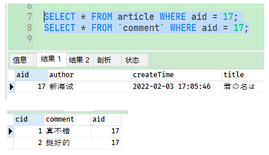

### 5.5. 多对多关系

#### 5.5.1. 数据表结构

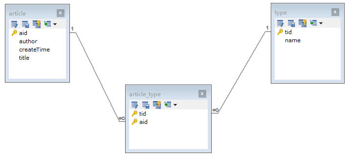

#### 5.5.2. 创建实体类配置表关系

- 创建文章类型类 `Type`，使用 `@ManyToMany` 注解多对多关系，并使用 `@JoinTable` 注解维护表间关系，创建多对多的中间表。

```java
@Setter
@Getter
@Entity
@Table(name = "type")
public class Type {
    @Id
    @GeneratedValue(strategy = GenerationType.IDENTITY)
    private Integer tid;
    private String name;
    /*
     * @ManyToMany 注解声明类间关系，与文章 Article 为多对多关系。由此类来维护关系
     */
    @ManyToMany
    @JoinTable(
            // 代表中间表名称
            name = "article_type",
            // 中间表的外键对应到当前表的主键名称
            joinColumns = {@JoinColumn(name = "tid", referencedColumnName = "tid")},
            // 中间表的外键对应到对方表的主键名称
            inverseJoinColumns = {@JoinColumn(name = "aid", referencedColumnName = "aid")}
    )
    private Set<Article> articles = new HashSet<>(0);
}
```

- 在文章 `Article` 类中，添加文章类型 `types` 属性集合

```java
@Setter
@Getter
@ToString
@Entity
@Table(name = "article")
public class Article {
    ....
    /*
     * @ManyToMany 注解声明类间关系，与文章类型 Type 为多对多关系。
     *  mappedBy 属性：多对多关系的对方实体类相应的属性名称，并代表放弃关系维护，由对方来维护关系
     */
    @ManyToMany(mappedBy = "articles")
    private Set<Type> types = new HashSet<>(0);
}
```


#### 5.5.3. 创建 dao 接口

- 添加 `TypeDao` 接口

```java
public interface TypeDao extends JpaRepository<Type, Integer>, JpaSpecificationExecutor<Type> {
}
```

#### 5.5.4. 测试

```java
@Autowired
private ArticleDao articleDao;
@Autowired
private TypeDao typeDao;

// 多对多表关系测试
@Test
public void testSave() {
    // 创建文章对象
    Article article1 = new Article();
    article1.setTitle("秒速5センチメートル");
    article1.setAuthor("新海诚");
    article1.setCreateTime(new Date());
    Article article2 = new Article();
    article2.setTitle("言の葉の庭");
    article2.setAuthor("新海诚");
    article2.setCreateTime(new Date());

    // 创建文章评论对象
    Type type1 = new Type();
    type1.setName("动画");
    Type type2 = new Type();
    type2.setName("恋爱");

    // 建立两个对象间的关系
    Set<Type> types = new HashSet<>();
    types.add(type1);
    types.add(type2);
    article1.setTypes(types);
    article2.setTypes(types);

    Set<Article> articles = new HashSet<>();
    articles.add(article1);
    articles.add(article2);
    type1.setArticles(articles);
    type2.setArticles(articles);

    // 保存操作
    articleDao.save(article1);
    articleDao.save(article2);
    typeDao.save(type1);
    typeDao.save(type2);
}
```

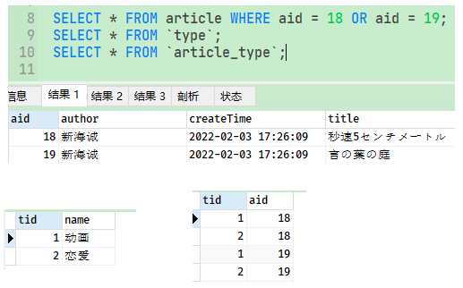

## 6. Spring Data JPA 原理分析

### 6.1. Spring Data JPA 中的几个重要 API 接口分析

Spring Data JPA 提供给用户使用的，主要有以下几个接口：

- `Repository`：仅仅是一个标识，表明任何继承它的均为仓库接口类，方便 Spring 自动扫描识别。进而可以在接口中声明一些满足规范的方法
- `CrudRepository`：继承 `Repository`，实现了一组基础 CRUD 相关的方法 
- `PagingAndSortingRepository`：继承 `CrudRepository`，实现了一组分页和排序相关的方法
- `JpaRepository`：继承 `PagingAndSortingRepository`，实现一组 JPA 规范相关查找和删除的方法
- `JpaSpecificationExecutor`：比较特殊，不属于 `Repository` 体系，实现一组 JPA Criteria 查询相关的方法。

Spring Data JPA 提供的接口的类关系图：

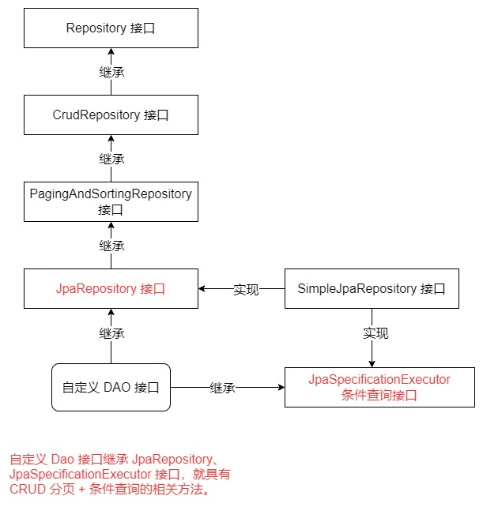

### 6.2. 底层运行原理

通过 debug 跟踪源码，分析底层运行原理：

1. 在运行时，Spring 会使用 `JdkDynamicAopProxy` 为 dao 接口生成一个代理对象

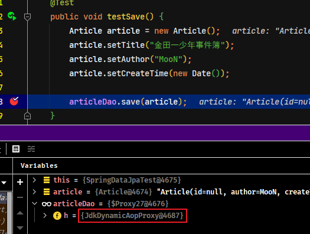

2. 通过 `JdkDynamicAopProxy` 源码查看 `invoke` 方法，发现 `targetSource` 代理的是 `SimpleJpaRepository` 类

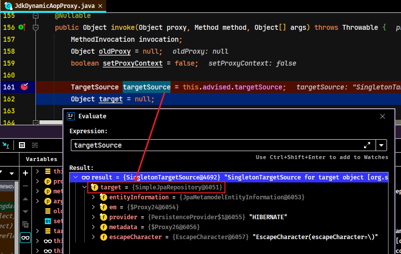

3. 通过对 `SimpleJpaRepository` 中代码的分析，看到最终执行保存的是 `EntityManager` 对象

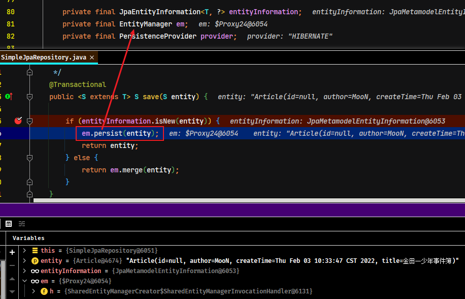

**总结：使用 Spring Data JPA 开发底层还是用的 JPA 的 API，Spring Data JPA 只是对标准 JPA 操作进行了进一步封装**，已达到简化了 Dao 层代码开发的目的。

**实际示例**

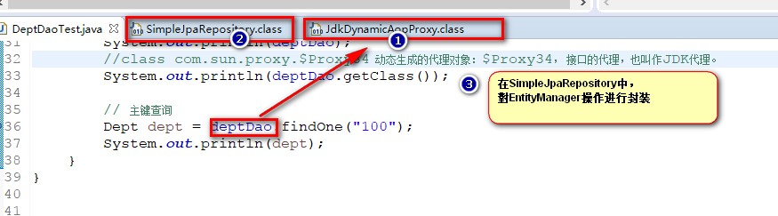

1. 加载 Spring 的配置文件
2. 扫描 dao 所在的包，对 dao 接口生成代理对象
3. 调用 dao 接口的方法，其实就是通过 dao 的代理对象，调用 `JpaRepository` 的默认实现类 `SimpleJpaRepository`
4. `SimpleJpaRepository` 中，具体的接口实现方法，其实就是对 `EntityManager` 操作进行的封装

Spring Data JPA 实现的是数据访问层解决方案，底层的实现就是对 EntityManager 的封装，所以需要在 Spring 整合 jpa 的基础上，只有配置包扫描，就可以进行 Spring Data JPA 开发

```xml
<jpa:repositories base-package="com.moon.dao"></jpa:repositories>
```

### 6.3. Spring Data Jpa 与 Jpa 及 Hibernate 的关系

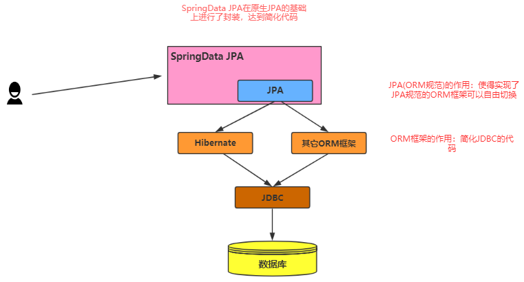

