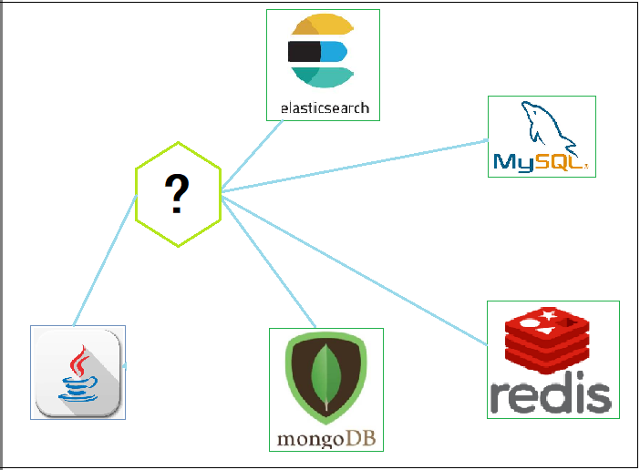

# Spring Data 概述

## 1. 持久层开发存在的问题

随着互联网技术的发展，现在的企业开发中用到的用于数据存储的产品，不再仅仅是关系型数据库，而是要根据场景需要选择不同的存储技术，比如用于缓存热点数据的 redis，用于存储文档数据的 mongodb，用于支持强大搜索功能的 elasticsearch 等等。

在 Java 中，对于上面所说的产品都提供了优秀的访问技术。比如针对关系型数据库的 mybatis、jpa 等技术，针对于 redis 的 jedis 技术等等……这些技术虽然可以很好的针对各个存储产品进行访问操作，但同时也带来了新的问题，那就是不同的持久层技术的 API 是不一样的。

开发人员就必须同时掌握多种数据访问技术，这无疑增加了开发成本。Spring Data 就是为了实现使用一套 API 支持各个不同的存储的访问而存在的一种技术。

## 2. SpringData 简介

Spring Data 是为数据访问提供一个熟悉的、一致的、基于 Spring 的编程模型。大大简化 dao 层开发，提供了一套统一的数据访问 API，同时还保留了各个底层数据存储的特殊特性。它可以很好的支持常用的关系型数据库、非关系型数据库、MapReduce 框架和云数据服务。

Spring Data 作为 dao 层开发技术，将大大简化代码量，而且其 API 比各个技术的原生 API 更加简单易用。Spring Data 具有以下的特性：

1. 良好的数据库存储资源和对象映射封装 
2. 针刘不同的存储资源提供灵活的查询
3. 提供数据库字段和实体类的映射
4. 支持透明数据审查(新增数据、最后一次修改数据)
5. 可集成自定义数据库存储
6. 通过 JavaConfig 和自定义 XML 名称空间轻松集成 Spring
7. 与 Spring MVC 控制器的高级集成
8. 支持跨库存储

## 3. Spring Data 的主要模块

Spring Data 支持的持久层技术非常多，分成以下两大模块：

**主要模块**：

- Spring Data Commons - Spring Data 的核心模块，定义了 Spring Data 的核心功能，为其他摸块提供基础的操作规范和依赖
- Spring Data JDBC - Spring Data 存储库对 JDBC 的支持。
- Spring Data JDBC Ext - 支持标准 JDBC 的数据库特定扩展，包括支持 Oracle RAC 快速连接故障切换、AQ JMS 支持和使用高级数据类型的支持
- Spring Data JPA - 支持 JPA 的 Spring Data 存储库。
- Spring Data KeyValue - 基于 Map 结构的存储库和SPI，可轻松构建键值存储的 Spring Data 模块。
- Spring Data LDAP - Spring Data 存储库对 Spring LDAP 的支持。
- Spring Data MongoDB - 基于 Spring，支持 MongoDB 的对象文档和存储库。
- Spring Data Redis - 基于 Spring 应用程序配置和访问 Redis。
- Spring Data REST - 将 Spring Data 资源库导出为基于 RESTful 资源模型。
- Spring Data for Apache Cassandra - 轻松配置和访问 Apache Cassandra 或大规模、高可用、面向数据的 Spring 应用程序
- Spring Data for Apache Geode - 轻松配置和访问 Apache Geode，实现高度一致、低延迟、面向数据的 Spring 应用
- Spring Data for VMware Tanzu GemFire - 高度一致、低延迟/高吞吐量、面向数据的 Spring 应用轻松配置和访问 Pivotal GemFire

**社区模块**：

- Spring Data Aerospike - 用于 Aerospike 的 Spring Data 模块
- Spring Data ArangoDB - 用于 ArangoDB 的 Spring Data 模块
- Spring Data Couchbase - 用于 Couchbase 的 Spring Data 模块
- Spring Data Azure Cosmos DB - 用于 Microsoft Azure Cosmos DB 的 Spring Data 模块
- Spring Data Cloud Datastore - Google Datastore 的 Spring Data 模块
- Spring Data Cloud Spanner - Google Spanner 的 Spring Data 模块
- Spring Data DynamoDB - DynamoDB 的 Spring Data 模块
- Spring Data Elasticsearch - Elasticsearch 的 Spring Data 模块
- Spring Data Hazelcast - 为 Hazelcast 提供 Spring Data 资源库支持
- Spring Data Jest - 基于 Jest REST 客户端的 Elasticsearch 的 Spring Data 模块
- Spring Data Neo4j - 为 Neo4j 提供基于 Spring 的对象图支持和存储库
- Oracle NoSQL Database SDK for Spring Data - 用于 Oracle NoSQL 数据库和 Oracle NoSQL 云服务的 Spring Data 模块
- Spring Data for Apache Solr - 为您面向搜索的 Spring 应用轻松配置和访问 Apache Solr
- Spring Data Vault - 建立在 Spring Data KeyValue 之上的 Vault 存储库
- Spring Data YugabyteDB - YugabyteDB 分布式 SQL 数据库的 Spring Data 模块

## 4. SpringData 扩展内容

### 4.1. Repository 和 Template 的选用

在 Spring Data 的模块中，使用 Spring Data Jpa 的时候，采用了继承 Spring Data 提供的一个接口的形式，即继承 `JpaRepository<T, ID>, JpaSpecificationExecutor<T>` ，而使用 Sping Data Redis 的时候，通常是在实现类中注入一个 `RedisTemplate` 的方式。

其实 Spring Data 这两种方式都可以完成对持久层的操作，此两种方式的对比如下：

- 第一种方式，直接继承 `xxxRepository` 接口，可以不需要写实现类，而轻松实现简单的增删改查、分页、排序操作，但是对于非常复杂的查询，用起来就比较的费力了；
- 第二种方式，直接使用 `xxxTemplate` 模板接口，就需要编写实现类，但是这样增删改查可以自由控制，对于复杂查询来说，用起来更加得心应手。

两种方式在企业开发中都可能用到，甚至有的项目开发中会同时使用两种方式。对于简单的操作，直接继承 `Repository` 接口，对于复杂操作，使用 `Template` 完成。
