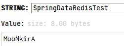
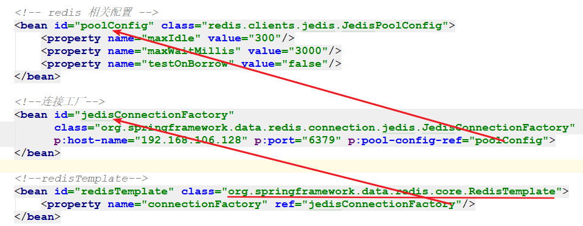
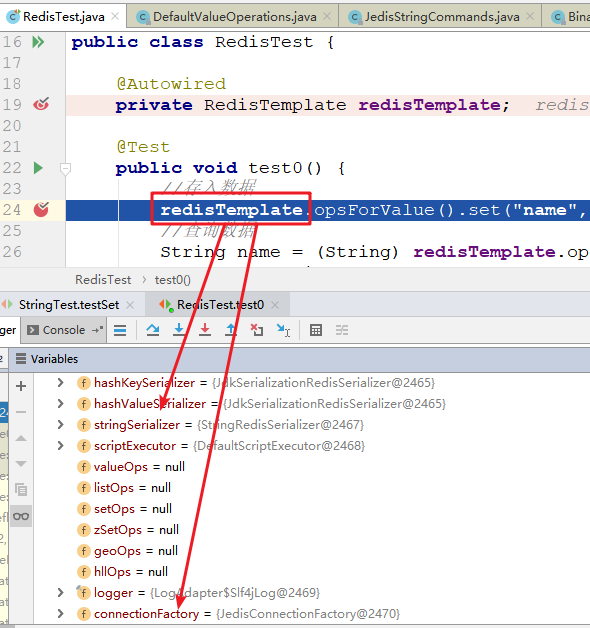
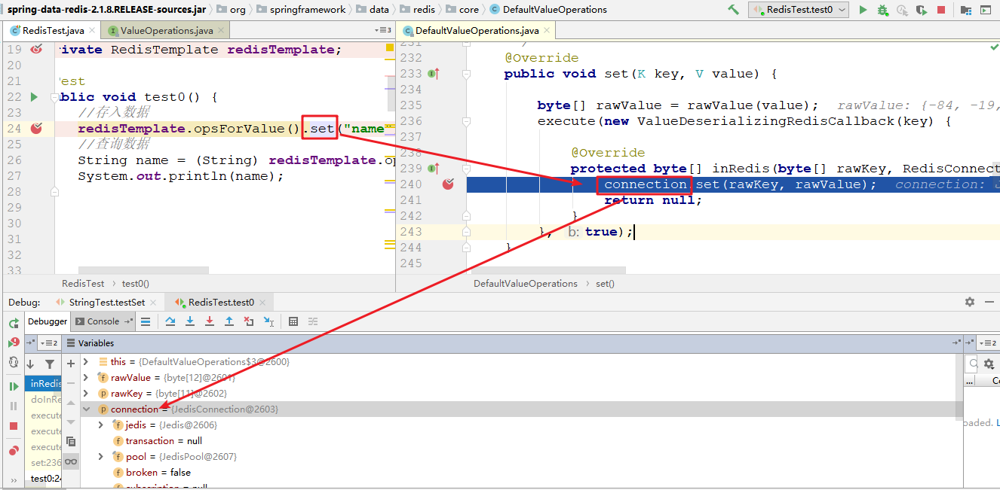
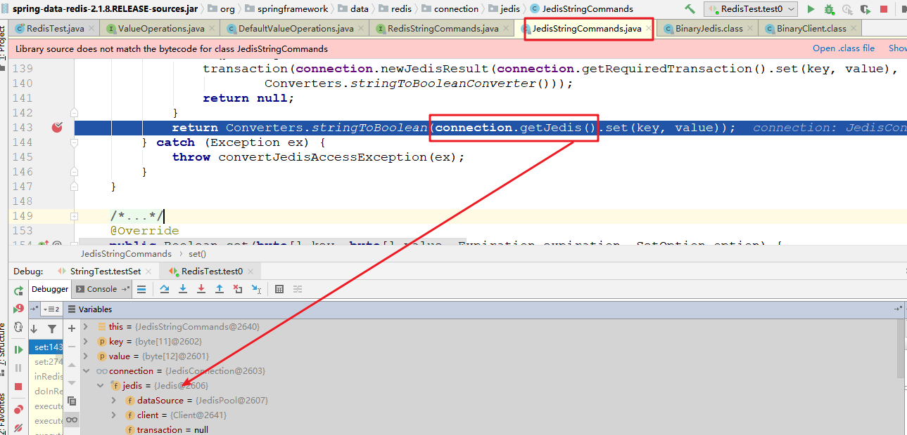

# Spring Data Redis

## 1. Spring Data Redis 简介

Redis 是一个基于内存的数据结构存储系统，它可以用作数据库或者缓存。它支持多种类型的数据结构，这些数据结构类型分别为 String（字符串）、List（列表）、Set（集合）、Hash（散列）和 Zset（有序集合）。

Spring Data Redis 的作用是通过一段简单的配置即可访问 redis 服务，它的底层是对 java 提供的 redis 开发包(比如 jedis 等)进行了高度封装，主要提供了如下功能：

- 连接池自动管理，提供了一个高度封装的 `RedisTemplate` 类，基于这个类的对象可以对 redis 进行各种操作
- 针对 jedis 客户端中大量 api 进行了归类封装，将同一类型操作封装为 `*Operations` 系列的接口
    - `ValueOperations`：简单字符串类型数据操作
    - `SetOperations`：set 类型数据操作
    - `ZSetOperations`：zset 类型数据操作
    - `HashOperations`：map 类型的数据操作
    - `ListOperations`：list 类型的数据操作

## 2. Spring Data Redis 快速入门案例

### 2.1. Redis 环境搭建

- Redis 的测试环境搭建，详见 [《Redis 安装笔记》](/Database/Redis/Redis-安装部署) 章节
- Redis 的基础使用，详见 [《Redis 基础笔记》](/Database/Redis/Redis-基础) 章节

### 2.2. 创建案例项目

#### 2.2.1. 引入依赖
 
创建 maven 项目 `spring-data-redis`，依赖相关依赖

```xml
<dependencies>
    <!-- jedis 客户端依赖 -->
    <dependency>
        <groupId>redis.clients</groupId>
        <artifactId>jedis</artifactId>
        <version>2.9.3</version>
    </dependency>
    <!-- Spring Data Redis 依赖 -->
    <dependency>
        <groupId>org.springframework.data</groupId>
        <artifactId>spring-data-redis</artifactId>
        <version>2.1.8.RELEASE</version>
    </dependency>

    <!-- 测试 -->
    <dependency>
        <groupId>junit</groupId>
        <artifactId>junit</artifactId>
        <version>4.13.2</version>
        <scope>test</scope>
    </dependency>
    <dependency>
        <groupId>org.springframework</groupId>
        <artifactId>spring-test</artifactId>
        <version>5.1.6.RELEASE</version>
        <scope>test</scope>
    </dependency>

    <dependency>
        <groupId>com.fasterxml.jackson.core</groupId>
        <artifactId>jackson-databind</artifactId>
        <version>2.9.8</version>
    </dependency>
</dependencies>
```

#### 2.2.2. 创建配置文件

在 resources 目录创建 applicationContext-redis.xml 配置文件

```xml
<?xml version="1.0" encoding="UTF-8"?>
<beans xmlns="http://www.springframework.org/schema/beans"
       xmlns:xsi="http://www.w3.org/2001/XMLSchema-instance"
       xmlns:p="http://www.springframework.org/schema/p"
       xsi:schemaLocation="http://www.springframework.org/schema/beans
            http://www.springframework.org/schema/beans/spring-beans.xsd">

    <!-- 配置 Jedis 连接池参数 -->
    <bean id="jedisPoolConfig" class="redis.clients.jedis.JedisPoolConfig">
        <!-- 最大连接数 -->
        <property name="maxTotal" value="30"/>
        <!-- 最大空闲连接数 -->
        <property name="maxIdle" value="20"/>
        <!-- 最小空闲连接数 -->
        <property name="minIdle" value="10"/>
        <!-- 连接时的最大等待毫秒数 -->
        <property name="maxWaitMillis" value="3000"/>
        <!-- 在提取一个 jedis 实例时，是否提前进行验证操作；如果为 true，则得到的 jedis 实例均是可用的 -->
        <property name="testOnBorrow" value="false"/>
    </bean>

    <!-- 配置 Jedis 连接工厂 -->
    <bean id="jedisConnectionFactory"
          class="org.springframework.data.redis.connection.jedis.JedisConnectionFactory"
          p:hostName="192.168.106.128" p:port="6379" p:poolConfig-ref="jedisPoolConfig"
    />

    <!-- 配置 RedisTemplate -->
    <bean id="redisTemplate" class="org.springframework.data.redis.core.RedisTemplate">
        <!-- 配置 jedis 的连接工厂,目的是为了获取 jedis 连接 -->
        <property name="connectionFactory" ref="jedisConnectionFactory"/>
    </bean>

</beans>
```

#### 2.2.3. 测试

创建测试类，完成一条简单数据的存取

```java
@RunWith(SpringJUnit4ClassRunner.class)
@ContextConfiguration("classpath:applicationContext-redis.xml") // 加载配置文件
public class RedisBasicTest {

    @Autowired
    private RedisTemplate redisTemplate;

    @Test
    public void testSave() {
        // 获取操作简单字符串类型数据的数据句柄
        ValueOperations<String, String> ops = redisTemplate.opsForValue();
        // 存入数据
        ops.set("SpringDataRedisTest1", "MooNkirA");

        // 查询数据
        String value = ops.get("SpringDataRedisTest");
        System.out.println("查询的数据：" + value);
    }
}
```

## 3. Spring Data Redis 的序列化器

通过 Redis 提供的客户端查看入门案例中存入 redis 的数据。会发现，存入的数据并不是简单的字符串，而是一些类似于二进制的数据


因为 Spring Data Redis 在保存数据的时候，底层有一个序列化器在工作，它会将要保存的数据（键和值）按照一定的规则进行序列化操作后再进行存储。spring-data-redis 提供如下几种序列化器：

- `StringRedisSerializer`：简单的字符串序列化
- `GenericToStringSerializer`：可以将任何对象泛化为字符串并序列化
- `Jackson2JsonRedisSerialize`：序列化对象为 json 字符串
- `GenericJackson2JsonRedisSerializer`：功能同上，但是更容易反序列化
- `OxmSerializer`：序列化对象为 xml 字符串
- `JdkSerializationRedisSerializer`：序列化对象为二进制数据

<font color=purple>`RedisTemplate` 默认使用的是 `JdkSerializationRedisSerializer` 对数据进行序列化。</font>

Spring Data 提供了两种方式选择不同的序列化器：

方式1：通过配置文件配置

```xml
<!-- 配置 RedisTemplate -->
<bean id="redisTemplate" class="org.springframework.data.redis.core.RedisTemplate">
    <!-- 配置 jedis 的连接工厂,目的是为了获取 jedis 连接 -->
    <property name="connectionFactory" ref="jedisConnectionFactory"/>

    <!-- 指定非 hash 类型的数据序列化器 -->
    <property name="keySerializer">
        <bean class="org.springframework.data.redis.serializer.StringRedisSerializer"/>
    </property>
    <property name="valueSerializer">
        <bean class="org.springframework.data.redis.serializer.StringRedisSerializer"/>
    </property>
</bean>
```

方式2：通过 `RedisTemplate` 对象的方法设定

```java
@Autowired
private RedisTemplate redisTemplate;

@Test
public void test() {
    // 指定非 hash 类型的数据序列化器
    redisTemplate.setKeySerializer(new StringRedisSerializer());
    redisTemplate.setValueSerializer(new StringRedisSerializer());
    // RedisTemplate 操作....
}
```

配置后正常序列化：



## 4. Spring Data Redis 常用类型操作 API

在 Redis 中有五种常见类型，Spring Data Redis 对每一种数据类型都提供了一个 `xxxOperations` 的API，分别是：

- `ValueOperations`：用来操作字符串类型数据
- `HashOperations`：用来操作 hash 类型数据
- `ListOperations`：用来操作 list 类型数据
- `SetOperations`：用来操作 set 类型数据
- `ZSetOperations`：用来操作 zset 类型数据

### 4.1. String 类型操作 API
 
#### 4.1.1. 操作句柄的获取

通过 `RedisTemplate` 实体获取到字符串类型操作句柄 `ValueOperations<K, V>`

```java
public ValueOperations<K, V> opsForValue()
```

#### 4.1.2. 常用 API（待整理）


#### 4.1.3. 示例

```java
@RunWith(SpringJUnit4ClassRunner.class)
@ContextConfiguration("classpath:applicationContext-redis.xml")
public class RedisStringTest {

    @Autowired
    private RedisTemplate<String, String> redisTemplate;

    private ValueOperations<String, String> ops;

    @Before
    public void init() {
        // 指定非 hash 类型的数据序列化器
        redisTemplate.setKeySerializer(new StringRedisSerializer());
        redisTemplate.setValueSerializer(new StringRedisSerializer());
        // 获取操作数据句柄
        ops = redisTemplate.opsForValue();
    }

    /* 保存数据 */
    @Test
    public void testSet() {
        // 存入数据
        ops.set("key1", "MooNkirA");
    }

    /* 保存有效时间的数据 */
    @Test
    public void testSetWithTimeout() {
        // 存入数据，有效时间为10s
        ops.set("key2", "N", 10, TimeUnit.SECONDS);
    }

    /* 保存并替换指定范围的原值 */
    @Test
    public void testSetWithOffset() {
        // 存入数据，从指定的索引开始替换。如果 key 值原不存在，则新增键，但值为空。
        ops.set("key1", "aa", 2);
    }

    /* 当key不存在时保存 */
    @Test
    public void testSetIfAbsent() {
        // 当 key 不存在时执行保存操作；当 key 存在时则什么都不做
        ops.setIfAbsent("key3", "斩月");
    }

    /* 批量保存 */
    @Test
    public void testMultiSet() {
        Map<String, String> map = new HashMap<>();
        for (int i = 4; i < 8; i++) {
            map.put("key" + i, "天锁斩月");
        }
        // 当 key 不存在时执行保存操作；当 key 存在时则什么都不做
        ops.multiSet(map);
    }

    /* 追加保存 */
    @Test
    public void testAppend() {
        // 追加保存，当key存在时，会执行追加操作；当key不存在时，会执行保存操作
        ops.append("key7", "appendString");
    }

    /* 根据键查询 */
    @Test
    public void testGet() {
        // 根据键获取值
        String value = ops.get("key1");
        System.out.println(value);
    }

    /* 根据键查询并对值截取 */
    @Test
    public void testGetSubstring() {
        /*
         * 首先根据 key 获取 value，然后再根据 value 进行截取，从start位置截取到end位置（包含start和end）
         *  K key：键
         *  long start：截取的开始位置
         *  long end：截取的结束位置
         */
        String value = ops.get("key1", 1, 3);
        System.out.println(value);
    }

    /* 批量获取 */
    @Test
    public void testMultiGet() {
        /*
         * 首先根据 key 获取 value，然后再根据 value 进行截取，从start位置截取到end位置（包含start和end）
         *  K key：键
         *  long start：截取的开始位置
         *  long end：截取的结束位置
         */
        List<String> list = ops.multiGet(Arrays.asList("key1", "key4", "key5"));
        if (list != null) {
            list.forEach(System.out::println);
        }
    }

    /* 获取 value 字符的长度 */
    @Test
    public void testSize() {
        // 根据key获取value的长度
        Long length = ops.size("key1");
        System.out.println("key1的值的长度：" + length);
    }

    /* value 自增 */
    @Test
    public void testIncrement() {
        String key = "testIncrement";
        ops.set(key, "18");
        // 默认自增 1
        ops.increment(key);
        System.out.println(ops.get(key)); // 结果：19
        // 指定自增 5
        ops.increment(key, 5);
        System.out.println(ops.get(key)); // 结果：24
    }

    /* value 自减 */
    @Test
    public void testDecrement() {
        String key = "testDecrement";
        ops.set(key, "18");
        // 默认自减 1
        ops.decrement(key);
        System.out.println(ops.get(key)); // 结果：17
        // 指定自减 5
        ops.decrement(key, 5);
        System.out.println(ops.get(key)); // 结果：12
    }

    /* 删除单个键。字符串类型的删除是通过 redisTemplate 对象删除整个键 */
    @Test
    public void testDelete() {
        // 删除单个键
        redisTemplate.delete("testIncrement");
    }

    /* 批量删除多个键 */
    @Test
    public void testMultiDelete() {
        // 删除多个键
        redisTemplate.delete(Arrays.asList("key4", "key5", "key6"));
    }
}
```

### 4.2. Hash 类型操作 API

#### 4.2.1. 操作句柄的获取

通过 `RedisTemplate` 实体获取到 Hash 类型数据操作句柄 `HashOperations<K, HK, HV>`

```java
public <HK, HV> HashOperations<K, HK, HV> opsForHash()
```

- `H`：指定键的类型
- `HK`：hash 类型值的键类型
- `HV`：hash 类型值的值类型（可以是自定义类，但此类必须实现 `Serializable` 序列化接口）

#### 4.2.2. 常用 API（待整理）


#### 4.2.3. 示例

```java
@RunWith(SpringJUnit4ClassRunner.class)
@ContextConfiguration("classpath:applicationContext-redis.xml")
public class RedisHashTest {

    @Autowired
    private RedisTemplate<String, String> redisTemplate;

    // private HashOperations<String, String, Object> ops;
    /*
     *  HashOperations<H, HK, HV>
     *      H：指定键的类型
     *      HK：hash 类型值的键类型
     *      HV：hash 类型值的值类型（可以是自定义类，但此类必须实现 Serializable 序列化接口）
     */
    private HashOperations<String, String, Student> ops;

    @Before
    public void init() {
        // 指定非 hash 类型的数据序列化器
        redisTemplate.setKeySerializer(new StringRedisSerializer());
        redisTemplate.setHashKeySerializer(new StringRedisSerializer()); // hash 类型值中键的序列化类型
        redisTemplate.setHashValueSerializer(new JdkSerializationRedisSerializer()); // hash 类型值中值的序列化类型
        // 获取操作数据句柄
        ops = redisTemplate.opsForHash();
    }

    /* 保存数据 */
    @Test
    public void testPut() {
        Student student = new Student();
        student.setName("夜神月");
        student.setAge(18);
        Student student2 = new Student();
        student2.setName("L");
        student2.setAge(19);

        ops.put("key1", "key1-1", student);
        ops.put("key1", "key1-2", student2);
    }

    /* 判断值中的某个 hashKey 是否存在 */
    @Test
    public void testHasKey() {
        String key = "key1";
        String valueKey = "key1-2";
        Boolean b = ops.hasKey(key, valueKey);
        System.out.println(key + "键中的" + valueKey + "是否存在：" + b);
    }

    /* 根据 key 与 hashKey 获取数据 */
    @Test
    public void testGet() {
        Student s = ops.get("key1", "key1-1");
        System.out.println(s);
    }

    /* 获取指定 key 中所有 hashKey 的集合 */
    @Test
    public void testKeys() {
        Set<String> keys = ops.keys("key1");
        keys.forEach(System.out::println);
    }

    /* 获取指定 key 中所有 hashValue 的集合 */
    @Test
    public void testValues() {
        List<Student> values = ops.values("key1");
        values.forEach(System.out::println);
    }

    /* 获取指定 key 中所有 hash 对象的集合 */
    @Test
    public void testEntries() {
        Map<String, Student> map = ops.entries("key1");
        map.entrySet().forEach(e -> System.out.println(e.getKey() + " :: " + e.getValue()));
    }

    /* 根据 key 与 hashKey 删除数据 */
    @Test
    public void testDelete() {
        // 可以删除多个数据，当 hash 类型中的数据全部被删除后，整个 hash 类型的键也被删除
        Long num = ops.delete("key1", "key1-2", "key1-1");
        System.out.println("成功删除的数量" + num);
    }
}
```

### 4.3. List 类型操作 API

#### 4.3.1. 操作句柄的获取

通过 `RedisTemplate` 实体获取到 List 类型操作句柄 `ListOperations<K, V>`

```java
public ListOperations<K, V> opsForList()
```

#### 4.3.2. 常用 API（待整理）


#### 4.3.3. 示例

```java
@RunWith(SpringJUnit4ClassRunner.class)
@ContextConfiguration("classpath:applicationContext-redis.xml")
public class RedisListTest {

    @Autowired
    private RedisTemplate<String, String> redisTemplate;

    private ListOperations<String, String> ops;

    private final static String KEY = "key-list"; // 测试使用的键

    @Before
    public void init() {
        // 指定非 hash 类型的数据序列化器
        redisTemplate.setKeySerializer(new StringRedisSerializer());
        redisTemplate.setValueSerializer(new StringRedisSerializer());
        // 获取操作数据句柄
        ops = redisTemplate.opsForList();
    }

    /* 左增加数据 */
    @Test
    public void testLeftPush() {
        // 将所有指定的值插入存储在键的列表的头部（或尾部）。如果键不存在，则在执行推送操作之前将其创建为空列表。
        // 从左边添加一个元素
        ops.leftPush(KEY, "L");
        // 从左边添加多个元素
        ops.leftPushAll(KEY, "夜神月", "香风智乃", "樱木花道");
    }

    /* 右增加数据 */
    @Test
    public void testRightPush() {
        // 将所有指定的值插入存储在键的列表的头部（或尾部）。如果键不存在，则在执行推送操作之前将其创建为空列表。
        // 从右边添加一个元素
        ops.rightPush(KEY, "流川枫");
        // 从右边添加多个元素
        ops.rightPushAll(KEY, "仙道彰", "路飞", "女帝波雅·汉库克");
    }

    /* 根据索引获取数据 */
    @Test
    public void testFindIndex() {
        // 0和正数代表从左边开始查找，第一个元素索引是0
        String val = ops.index(KEY, 1);
        System.out.println("左边第2个元素是：" + val);
        // 负数代表从右边开始查找，第一个元素索引是-1
        String val2 = ops.index(KEY, -2);
        System.out.println("右边第2个元素是：" + val2);
    }

    /* 根据范围获取数据 */
    @Test
    public void testRange() {
        // 根据 key 查询一个范围(包含开始索引,结束索引)，索引从0开始
        List<String> range = ops.range(KEY, 1, 4);
        if (range != null) {
            range.forEach(System.out::println);
        }
    }

    /* 删除左边第一个元素 */
    @Test
    public void testLeftLop() {
        // 弹出左边第1个元素
        String s = ops.leftPop(KEY);
        System.out.println("删除左边第1个元素是：" + s);
    }

    /* 删除右边第一个元素 */
    @Test
    public void testRightPop() {
        // 弹出右边第1个元素
        String s = ops.rightPop(KEY);
        System.out.println("删除右边第1个元素是：" + s);
    }

    /* 删除指定的元素 */
    @Test
    public void testRemove() {
        /*
         * Long remove(K key, long count, Object value)
         *  key：键值
         *  count：删除元素的个数
         *      count > 0：删除左边起第几个等于指定值的元素
         *      count < 0：删除右边起第几个等于指定值的元素
         *      count = 0：删除所有等于value的元素。
         *  value：元素值
         */
        ops.remove(KEY, 1, "L");
    }
}
```

### 4.4. Set 类型操作 API

#### 4.4.1. 操作句柄的获取

通过 `RedisTemplate` 实体获取到 Set 类型操作句柄 `SetOperations<K, V>`

```java
public SetOperations<K, V> opsForSet()
```

#### 4.4.2. 常用 API（待整理）


#### 4.4.3. 示例

```java
@RunWith(SpringJUnit4ClassRunner.class)
@ContextConfiguration("classpath:applicationContext-redis.xml")
public class RedisSetTest {

    @Autowired
    private RedisTemplate<String, String> redisTemplate;

    private SetOperations<String, String> ops;

    // 测试使用的键
    private final static String KEY = "key-set";
    private final static String KEY1 = "key-set1";
    private final static String KEY2 = "key-set2";

    @Before
    public void init() {
        // 指定非 hash 类型的数据序列化器
        redisTemplate.setKeySerializer(new StringRedisSerializer());
        redisTemplate.setValueSerializer(new StringRedisSerializer());
        // 获取操作数据句柄
        ops = redisTemplate.opsForSet();
    }

    /* 增加数据 */
    @Test
    public void testAdd() {
        // 增加一个或多个数据，如果重复的数据不会增加
        ops.add(KEY, "夜神月", "香风智乃", "樱木花道", "仙道彰", "路飞", "女帝波雅·汉库克", "夜神月");
    }

    /* 查询所有元素 */
    @Test
    public void testMembers() {
        Set<String> members = ops.members(KEY);
        if (members != null) {
            members.forEach(System.out::println);
        }
    }

    /* 随机获取一个元素 */
    @Test
    public void testRandomMember() {
        String value = ops.randomMember(KEY);
        System.out.println("随机获取一个元素：" + value);
    }

    /* 随机获取多个元素（可能会获取重复的值） */
    @Test
    public void testRandomMembers() {
        // 随机获取多个元素，count 参数指定获取元素的个数。
        List<String> randomMembers = ops.randomMembers(KEY, 3);
        if (randomMembers != null) {
            randomMembers.forEach(System.out::println);
        }
    }

    /* 删除元素 */
    @Test
    public void testRemove() {
        // 删除指定的元素，并返回成功移除的个数
        Long count = ops.remove(KEY, "樱木花道", "仙道彰", "路飞");
        System.out.println("成功移除的元素总数：" + count);
    }

    /* 随机删除元素 */
    @Test
    public void testPop() {
        // 随机删除指定个数的元素，并返回成功移除的元素
        List<String> pops = ops.pop(KEY, 2);
        if (pops != null) {
            pops.forEach(System.out::println);
        }
    }

    /* 多集合操作 - 交集 */
    @Test
    public void testIntersect() {
        ops.add(KEY1, "夜神月", "香风智乃", "樱木花道");
        ops.add(KEY2, "路飞", "女帝波雅·汉库克", "夜神月");

        // 获取两个key的值的交集
        Set<String> result = ops.intersect(KEY1, KEY2);
        if (result != null) {
            result.forEach(System.out::println);
        }
    }

    /* 多集合操作 - 并集 */
    @Test
    public void testUnion() {
        ops.add(KEY1, "夜神月", "香风智乃", "樱木花道");
        ops.add(KEY2, "路飞", "女帝波雅·汉库克", "夜神月");

        // 获取两个key的值的交集
        Set<String> result = ops.union(KEY1, KEY2);
        if (result != null) {
            result.forEach(System.out::println);
        }
    }

    /* 多集合操作 - 差集 */
    @Test
    public void testDifference() {
        ops.add(KEY1, "夜神月", "香风智乃", "樱木花道");
        ops.add(KEY2, "路飞", "女帝波雅·汉库克", "夜神月");

        /*
         * 获取两个key的值的差集
         *  规则是获取第一个集合中存在，但是在第二个集合中不存在的元素
         */
        Set<String> result = ops.difference(KEY2, KEY1);
        if (result != null) {
            result.forEach(System.out::println);
        }
    }
}
```

### 4.5. ZSet 类型操作 API

#### 4.5.1. 操作句柄的获取

通过 `RedisTemplate` 实体获取到 ZSet 类型操作句柄 `ZSetOperations<K, V>`

```java
public ZSetOperations<K, V> opsForZSet()
```

#### 4.5.2. 常用 API（待整理）


#### 4.5.3. 示例

```java
@RunWith(SpringJUnit4ClassRunner.class)
@ContextConfiguration("classpath:applicationContext-redis.xml")
public class RedisZSetTest {

    @Autowired
    private RedisTemplate<String, String> redisTemplate;

    private ZSetOperations<String, String> ops;

    // 测试使用的键
    private final static String KEY = "key-zset";
    private final static String KEY1 = "key-zset1";
    private final static String KEY2 = "key-zset2";

    @Before
    public void init() {
        // 指定非 hash 类型的数据序列化器
        redisTemplate.setKeySerializer(new StringRedisSerializer());
        redisTemplate.setValueSerializer(new StringRedisSerializer());
        // 获取操作数据句柄
        ops = redisTemplate.opsForZSet();
    }

    /* 增加单个数据 */
    @Test
    public void testAdd() {
        /*
         * Boolean add(K key, V value, double score)
         *  key：键值
         *  value：值
         *  score：分数值，用于排名（排序）
         */
        ops.add(KEY, "夜神月", 190);
        ops.add(KEY, "香风智乃", 90);
        ops.add(KEY, "樱木花道", 25);
        ops.add(KEY, "L", 191);
        ops.add(KEY, "金田一", 180);
    }

    /* 分数的增减 */
    @Test
    public void testIncrementScore() {
        // incrementScore 可以用来增减分数，正数就是增加，负数则减少
        // 增加分数
        ops.incrementScore(KEY, "樱木花道", 10);
        // 减少分数
        ops.incrementScore(KEY, "香风智乃", -20);
    }

    /* 查询元素的分数 */
    @Test
    public void testScore() {
        // 查询元素的分数
        Double score = ops.score(KEY, "金田一");
        System.out.println("分数：" + score);
    }

    /* 查询元素的排名 */
    @Test
    public void testRank() {
        // 查询元素在集合中的排名，排名从0开始
        Long rank = ops.rank(KEY, "夜神月");
        System.out.println("排名：" + rank);
    }

    /* 列表查询:分为两大类，正序和逆序。以下只列表正序的，逆序的只需在方法前加上reverse即可 */
    /* 根据排名区间来获取元素列表 */
    @Test
    public void testRange() {
        // 正序根据排名区间来获取元素列表，包含开始与结束索引，索引从0开始
        Set<String> range = ops.range(KEY, 0, 2);
        if (range != null) {
            range.forEach(System.out::println);
        }

        // 逆序根据排名区间来获取元素列表，包含开始与结束索引，索引从0开始
        Set<String> reverseRange = ops.reverseRange(KEY, 0, 2);
        if (reverseRange != null) {
            reverseRange.forEach(System.out::println);
        }
    }

    /* 根据分数排序区间来获取元素列表 */
    @Test
    public void testRangeWithScores() {
        // 正序根据分数排序区间来获取元素列表，包含开始与结束索引，索引从0开始
        Set<ZSetOperations.TypedTuple<String>> typedTuples = ops.rangeWithScores(KEY, 1, 3);
        if (typedTuples != null) {
            typedTuples.forEach(i -> {
                System.out.println("值：" + i.getValue() + "；分数：" + i.getScore());
            });
        }

        // 逆序根据分数排序区间来获取元素列表，包含开始与结束索引，索引从0开始
        Set<ZSetOperations.TypedTuple<String>> reverseTypedTuples = ops.reverseRangeWithScores(KEY, 1, 3);
        if (reverseTypedTuples != null) {
            reverseTypedTuples.forEach(i -> {
                System.out.println("值：" + i.getValue() + "；分数：" + i.getScore());
            });
        }
    }

    /* 根据分数范围来获取元素列表 */
    @Test
    public void testRangeByScore() {
        // 正序根据指定的最小分数与最大分数范围来获取元素列表（包含最小和最大值）
        Set<String> range = ops.rangeByScore(KEY, 70, 180);
        if (range != null) {
            range.forEach(System.out::println);
        }

        // 逆序根据指定的最小分数与最大分数范围来获取元素列表（包含最小和最大值）
        Set<String> reverseRange = ops.reverseRangeByScore(KEY, 70, 180);
        if (reverseRange != null) {
            reverseRange.forEach(System.out::println);
        }
    }

    /* 根据分数范围来获取元素和分数列表 */
    @Test
    public void testRangeByScoreWithScores() {
        // 正序根据指定的最小分数与最大分数范围来获取元素和分数列表（包含最小和最大值）
        Set<ZSetOperations.TypedTuple<String>> typedTuples = ops.rangeByScoreWithScores(KEY, 70, 190);
        if (typedTuples != null) {
            typedTuples.forEach(i -> System.out.println("值：" + i.getValue() + "；分数：" + i.getScore()));
        }

        // 逆序根据指定的最小分数与最大分数范围来获取元素和分数列表（包含最小和最大值）
        Set<ZSetOperations.TypedTuple<String>> reverseTypedTuples = ops.reverseRangeByScoreWithScores(KEY, 70, 190);
        if (reverseTypedTuples != null) {
            reverseTypedTuples.forEach(i -> System.out.println("值：" + i.getValue() + "；分数：" + i.getScore()));
        }
    }

    /* 统计集合大小 */
    @Test
    public void testZCard() {
        // 统计指定的键的集合大小
        Long zCard = ops.zCard(KEY);
        System.out.println("集合大小：" + zCard);
    }

    /* 统计分数区间的元素数量 */
    @Test
    public void testCount() {
        // 根据指定的最小分数与最大分数范围来统计元素的数量（包含最小和最大值）
        Long count = ops.count(KEY, 70, 190);
        System.out.println("70~190分数的元素总计：" + count);
    }

    /* 删除指定的元素 */
    @Test
    public void testRemove() {
        // 删除指定单个或者多个元素
        ops.remove(KEY, "L", "夜神月");
    }

    /* 根据排名区间删除元素 */
    @Test
    public void testRemoveRange() {
        // 根据排名区间删除，排名是从0开始
        ops.removeRange(KEY, 0, 2);
    }

    /* 根据分数区间删除元素 */
    @Test
    public void testRemoveRangeByScore() {
        // 根据指定的最小分数与最大分数区间删除元素，包含最小值和最大值
        ops.removeRangeByScore(KEY, 90, 190);
    }
}
```

# Spring Data Redis 原理分析

## 1. RestTemplate 底层实现

Spring Data Redis 操作 Redis 服务器只要是通过 `RestTemplate` 实现的。下面通过源码追踪的形式来查阅 `RestTemplate` 底层到底是如何操作 redis

- 首先看配置文件中关于 `RestTemplate` 的 bean 的配置，可以看到在 `RedisTemplate` 的 bean 声明中注入了一个 `JedisConnectionFactory` 实例，这个连接工厂是用来获取 Jedis 连接的，那么通过这种方式 `RedisTemplate` 就可以拿到操作 Redis 服务器的句柄了。



- 使用 debug 运行入门案例，观察创建好的 `RestTemplate` 实例，可以看到里面主要有序列化器和 redis 的连接信息，



- 跟踪进入 `set` 方法，可以看到 `set` 方法中使用了一个 `connection` 实例来进行操作，此 `connection` 的类型是 `JedisConnetion`，而这个 `connection` 实例肯定是通过配置文件配置的 `JedisConnectionFactory` 产生的，也就是底层开始调用 jedis 的 api 了。



- 继续追踪 `set` 方法，选择 `JedisStringCommands` 实现


- 继续跟踪 `set` 方法，可以看到底层已经获取到了 jedis 的实例，再调用 `set` 方法已经在调 jedis 的 `set` 方法了



- 再往下追踪，就会发现底层最终调用的是 jedis 的原生 API `setCommand`方法，这个方法就是 jedis 提供的对 redis 的各种操作命令了。


结论：Spring Data 提供 `RedisTemplate` 就是在原生的 Jedis 或者其他操作 redis 的技术上做的一层封装，它屏蔽掉了这些原生技术的实现细节，统一了调用接口，使得操作更加简单明了。
