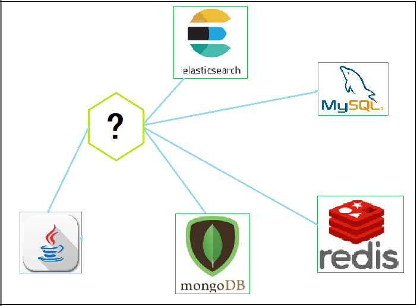

# Spring Data

## 1. 持久层开发存在的问题

随着互联网技术的发展，现在的企业开发中用到的用于数据存储的产品，不再仅仅是关系型数据库，而是要根据场景需要选择不同的存储技术，比如用于缓存热点数据的 redis，用于存储文档数据的 mongodb，用于支持强大搜索功能的 elasticsearch 等等。

在 Java 中，对于上面所说的产品都提供了优秀的访问技术。比如针对关系型数据库的 mybatis、jpa 等技术，针对于 redis 的 jedis 技术等等……这些技术虽然可以很好的针对各个存储产品进行访问操作，但同时也带来了新的问题，那就是不同的持久层技术的 API 是不一样的。

开发人员就必须同时掌握多种数据访问技术，这无疑增加了开发成本。Spring Data 就是为了实现使用一套 API 支持各个不同的存储的访问而存在的一种技术。

## 2. SpringData 简介

Spring Data 是为数据访问提供一个熟悉的、一致的、基于 Spring 的编程模型。大大简化 dao 层开发，提供了一套统一的数据访问 API，同时还保留了各个底层数据存储的特殊特性。它可以很好的支持常用的关系型数据库和非关系型数据库。

使用 SpringData 作为 dao 层开发技术，将大大简化代码量，而且其 API 比各个技术的原生 API 更加简单易用。

## 3. SpringData 的主要模块

Spring Data 支持的持久层技术非常多，以下是几个常见的：

- Spring Data common：SpringData 的核心模块，定义了 SpringData 的核心功能
- Spring Data JDBC：对 JDBC 的 Spring Data 存储库支持
- Spring Data JPA：对 JPA 的 Spring Data 存储库支持
- Spring Data MongoDB：对 MongoDB 的基于 Spring 对象文档的存储库支持
- Spring Data Redis：封装 Jedis 技术，对 redis 实现访问操作
- Spring Data Elasticsearch：对 Elasticsearch 实现访问操作

主要模块的详细笔记如下：

- [Spring Data JPA](/后端框架/Spring-Data/Spring-Data-JPA)
- [Spring Data Redis](/后端框架/Spring-Data/Spring-Data-Redis)

## 4. SpringData 扩展内容

### 4.1. Repository 和 Template 的选用

在 Spring Data 的模块中，使用 Spring Data Jpa 的时候，采用了继承 Spring Data 提供的一个接口的形式，即继承 `JpaRepository<T, ID>, JpaSpecificationExecutor<T>` ，而使用 Sping Data Redis 的时候，通常是在实现类中注入一个 `RedisTemplate` 的方式。

其实 Spring Data 这两种方式都可以完成对持久层的操作，此两种方式的对比如下：

- 第一种方式，直接继承 `xxxRepository` 接口，可以不需要写实现类，而轻松实现简单的增删改查、分页、排序操作，但是对于非常复杂的查询，用起来就比较的费力了；
- 第二种方式，直接使用 `xxxTemplate` 模板接口，就需要编写实现类，但是这样增删改查可以自由控制，对于复杂查询来说，用起来更加得心应手。

两种方式在企业开发中都可能用到，甚至有的项目开发中会同时使用两种方式。对于简单的操作，直接继承 `Repository` 接口，对于复杂操作，使用 `Template` 完成。
