## 1. Spring AOP（面向切面编程）思想与实现原理

在软件业，AOP 为 Aspect Oriented Programming 的缩写，意为：面向切面编程，通过预编译方式和运行期动态代理实现程序功能的统一维护的一种技术。AOP 是 OOP(Object-Oriented Programming, 面向对象编程)的延续，是软件开发中的一个热点，也是 Spring 框架中的一个重要内容，是函数式编程的一种衍生范型。利用 AOP 可以对业务逻辑的各个部分进行隔离，从而使得业务逻辑各部分之间的耦合度降低，提高程序的可重用性，同时提高了开发的效率。

### 1.1. AOP 概述

它就是把程序重复的代码抽取出来，在需要执行的时候，使用**动态代理**的技术，在不修改源码的基础上，对已有方法进行增强

**AOP的作用**：在程序运行期间，不修改源码对已有方法进行增强

**AOP的优势**：

- 减少重复代码
- 提高开发效率
- 维护方便

**AOP实现方式**：基于动态代理技术

### 1.2. AOP 实现原理

AOP 实现原理是基于动态代理技术实现的。具体的两种实现方式分别是**基于接口的动态代理**和**基于子类的动态代理**，

#### 1.2.1. 设计模式-代理模式

代理模式：给某一个对象提供一个代理对象，并由代理对象控制对源对象的引用。

代理模式可以并不知道真正的被代理对象，而仅仅持有一个被代理对象的接口，这时候代理对象不能够创建被代理对象，被代理对象必须有系统的其他角色代为创建并传入。

为什么要使用代理模式呢？

1. 它有间接的特点，可以起到中介隔离作用。减少耦合
2. 它有增强的功能。

> 代理模式示例代码详见：`spring-note\spring-sample\40-spring-aop-proxy\`

#### 1.2.2. 动态代理简述

- **特点**：字节码随用随创建，随用随加载。
- **分类**：
    1. 基于接口的动态代理
    2. 基于子类的动态代理
- **作用**：不修改源码的基础上对方法增强

动态代理与静态代理的区别是：静态代理是字节码一上来就创建好，并完成加载。**装饰者模式就是静态代理的一种体现。**

#### 1.2.3. 基于接口的动态代理【推荐】

JDK 官方有一套动态代理的实现，使用要求是被代理类最少实现一个接口。动态代理主要类是 `Proxy`

```java
public class Proxy implements java.io.Serializable {
    ...
}
```

创建代理对象的方法：

```java
@CallerSensitive
public static Object newProxyInstance(ClassLoader loader, Class<?>[] interfaces, InvocationHandler h) throws IllegalArgumentException
```

- 方法参数`ClassLoader loader`：类加载器，用于加载代理对象的字节码的。和被代理对象使用相同的类加载器即可，固定写法。
- 方法参数`Class<?>[] interfaces`：被代理类实现的所有接口的字节码数组，用于给代理对象提供方法，和被代理对象具有相同的方法。也是有以下的固定写法。
    - 如果被代理类是一个普通类：`被代理类对象.getClass().getInterfaces();`
    - 如果被代理类是一个接口：`new Class[]{被代理类.class}`。
- 方法参数`InvocationHandler h`：要增强的方法。此处是一个接口，需要提供它的实现类。通常写的是匿名内部类，增强的代码谁用谁写。

基础使用示例如下：

```java
/**
 * 使用JDK官方的Proxy类创建代理对象
 */
public class Client_Proxy {
	public static void main(String[] args) {
		// 获取接口实现类
		IActor actor = new ActorImpl();

		System.out.println("=============没有使用动态代理模式前=============");
		actor.basicAct(108.89F);
		actor.wonderfulAct(3000.1F);
		System.out.println("=============没有使用动态代理模式后=============");

		// 获取代理
		IActor proxy = (IActor) Proxy.newProxyInstance(ActorImpl.class.getClassLoader(),
				ActorImpl.class.getInterfaces(), new InvocationHandler() {
					// 重写拦截的方法
					@Override
					public Object invoke(Object proxy, Method method, Object[] args) throws Throwable {
						// 获取调用方法的名字
						String mothodName = method.getName();
						// 获取调用方法的参数
						float money = (float) args[0];

						// 开始判断
						if ("basicAct".equals(mothodName)) {
							// 对象调用了basicAct方法
							if (money > 2000) {
								// 满足条件才执行方法
							  // 注：此处直接引用外面的IActoer对象，如果是在jdk1.7，则前端创建的对象需要使用final关键字修饰
								proxy = method.invoke(actor, money / 2);
							}
						} else if ("wonderfulAct".equals(mothodName)) {
							// 对象调用了wonderfulAct方法
							if (money > 5000) {
								// 满足条件才执行方法
								proxy = method.invoke(actor, money / 2);
							}
						}
						// 真实方法返回值
						return proxy;
					}
				});

		// 使用代理调用方法
		proxy.basicAct(1003F);
		proxy.wonderfulAct(6234F);
	}
}

/**
 * 接口实现类
 */
public class ActorImpl implements IActor {

	@Override
	public void basicAct(float money) {
		System.out.println("拿到 " + money + " 元，开始基本的表演!!");
	}

	@Override
	public void wonderfulAct(float money) {
		System.out.println("拿到 " + money + " 元，开始精彩的表演!!");
	}
}
```

#### 1.2.4. 基于子类的动态代理

##### 1.2.4.1. CGlib 框架

第三方的 cglib 工具框架实现基于子类的动态代理，在使用时需要先导包(maven工程导入坐标即可)。*如果报 asmxxxx 异常，缺少jar包，需要导入jar包：`asm.jar`和`cglib-2.1.3.jar`。*

- 使用要求：被代理类不能用 final 修饰的类（最终类）
- 涉及的类：`Enhancer`
- 涉及的方法：`create(Class type, Callback callback)`
    - 参数`Class type`：与被代理对像的字节码对象。可以创建被代理对象的子类，还可以获取被代理对象的类加载器。
    - 参数`Callback callback`：是接口，里面写的也是增加的策略，要使用一个子接口：`MethodInterceptor`。通常都是写一个接口的实现类或者匿名内部类。

源码节选：

```java
public class Enhancer extends AbstractClassGenerator {
    // ...省略
    public static Object create(Class type, Callback callback) {
        Enhancer e = new Enhancer();
        e.setSuperclass(type);
        e.setCallback(callback);
        return e.create();
    }
    // ...省略
}
```

##### 1.2.4.2. MethodInterceptor 接口

Callback 接口中没有任何方法，所以一般使用它的子接口，即使用匿名内部类的方式来创建`MethodInterceptor`对象，涉及的需要重写的拦截方法 `intercept()`。

```java
public interface Callback {}
// 使用 Callback 的子接口
public interface MethodInterceptor extends Callback {
    Object intercept(Object proxy, Method method, Object[] args, MethodProxy methodProxy) throws Throwable;
}
```

`intercept` 方法也具有拦截功能，前面三个参数与基于接口的动态代理的`InvocationHandler`中的`invoke`方法的参数一模一样。参数说明如下：

- `proxy`:代理对象的引用【一般不用】
- `method`:拦截的方法
- `args`:拦截的方法中的参数
- `methodProxy`: 方法代理对象的引用【一般不用】

##### 1.2.4.3. 基础使用示例

```java
/**
 * 使用cglib，基于子类的动态代理
 */
public class Client_Cglib {
    public static void main(String[] args) {
        // 获取被代理对象
        Actor actor = new Actor();

        /**
         * 来自cglib 要求： 被代理对象不能是最终类
         * 涉及的类：Enhancer
         * 涉及方法：create
         * 涉及参数：
         *        Class : 与被代理对像的字节码对象
         *        CallBack：接口来的，里面写的也是策略
         *                  要使用一个子接口：MethodInterceptor
         */
        Actor cglibActor = (Actor) Enhancer.create(actor.getClass(), new MethodInterceptor() {
            /**
             * 此方法也具有拦截功能
             *
             * 前面三个参数与基于接口的动态代理的InvocationHandler中的invoke方法的参数一模一样
             *  参数解释：
             *          proxy:代理对象的引用【一般不用】
             *          method:拦截的方法
             *          args: 拦截的方法中的参数
             *          methodProxy : 方法代理对象的引用【一般不用】
             */
            @Override
            public Object intercept(Object proxy, Method method, Object[] args, MethodProxy methodProxy) throws Throwable {
                // 获取执行的方法名
                String methodName = method.getName();
                // 获取调用的方法的参数，知道只有一个参数
                float money = (float) args[0];
                // 定义返回对象
                Object result = null;

                // 判断执行的方法
                if ("basicAct".equals(methodName)) {
                    // 对象调用了basicAct方法
                    if (money > 1000F) {
                        // 满足条件才执行方法
                        result = method.invoke(actor, money / 2);
                    }
                } else if ("wonderfulAct".equals(methodName)) {
                    // 对象调用了wonderfulAct方法
                    if (money > 2000F) {
                        // 满足条件才执行方法
                        result = method.invoke(actor, money / 4);
                    }
                }
                // 返回执行方法后的对象
                return result;
            }
        });

        // 使用代理调用方法
        cglibActor.basicAct(1200F);
        cglibActor.wonderfulAct(4290F);
    }
}

public class Actor {
    public void basicAct(float money) {
        System.out.println("拿到 " + money + " 元，开始基本的表演!!");
    }

    public void wonderfulAct(float money) {
        System.out.println("拿到 " + money + " 元，开始精彩的表演!!");
    }
}
```

### 1.3. AOP 相关术语

#### 1.3.1. Joinpoint(连接点)

**Joinpoint(连接点)**：是指那些被拦截到的点，即目标对象中所有的方法或者被拦截的具体某个方法。在 Spring 中这些连接点指的是方法，因为 Spring 只支持方法类型的连接点。

#### 1.3.2. Pointcut(切入点)

**Pointcut(切入点)**：是指要对哪些 Joinpoint 进行拦截的定义。即真正需要增强的方法的集合，也可以理解为连接点（Joinpoint）的集合。通常使用明确的类和方法名称，或是利用正则表达式定义所匹配的类和方法名称来指定这些切点。

#### 1.3.3. Advice(通知/增强)

**Advice(通知/增强)**：是指拦截到Joinpoint之后所要做的处理（<font color=red>**即要增强的功能代码**</font>）。通知的类型（<font color=red>**可以理解成拦截到的方法，什么时候进行增强**</font>），主要以下几种类型：

- **前置通知(Before)**：在切入点之前执行
- **后置通知(After Returning)**：在切入点之后执行（只有在切入点方法执行成功时才执行）
- **异常通知(After Throwing)**：在切入点出现异常才执行
- **最终通知(After)**：在切入点之后执行，不管有无异常都会执行。
- **环绕通知(Around)**：在切入点之前和之后分别执行

#### 1.3.4. Introduction(引介)

**Introduction(引介)**：是一种特殊的通知，在不修改类代码的前提下，Introduction 可以在运行期为类动态地添加一些方法或字段

#### 1.3.5. Target(目标对象)

**Target(目标对象)**：代理的目标对象。既然 Spring AOP 是通过运行时代理实现的，这个对象永远是一个被代理（proxied）对象。

#### 1.3.6. Weaving(织入)

**Weaving(织入)**：是指把增强应用到目标对象，并创建新的代理对象的过程。在目标对象的生命周期里，有以下时间点可以进行织入：

- 编译期：切面在目标类编译时被织入。AspectJ 的织入编译器是以这种方式织入切面的
- 类加载期：切面在目标类加载到 JVM 时被织入。需要特殊的类加载器，它可以在目标类被引入应用之前增强该目标类的字节码。AspectJ 的加载时织入就支持以这种方式织入切面。
- 运行期：切面在应用运行的某个时刻被织入。一般情况下，在织入切面时，AOP 容器会为目标对象动态地创建一个代理对象。SpringAOP 就是以这种方式织入切面。

> Notes: Spring 采用动态代理织入，而 AspectJ 采用编译期织入和类装载期织入。

#### 1.3.7. Proxy(代理)

**Proxy（代理）**：一个类被 AOP 织入增强后，就产生一个结果代理类

#### 1.3.8. Aspect(切面)

**Aspect(切面)**：是切入点(Pointcut)和通知（引介）(Advice)的结合。把增强功能应用到具体方法上面（即将增强用到切入点的过程），这过程称为切面。在 Spring AOP 中，切面可以使用通用类（基于模式的风格）或者在普通类中以 `@AspectJ` 注解来实现

#### 1.3.9. AOP 术语图解

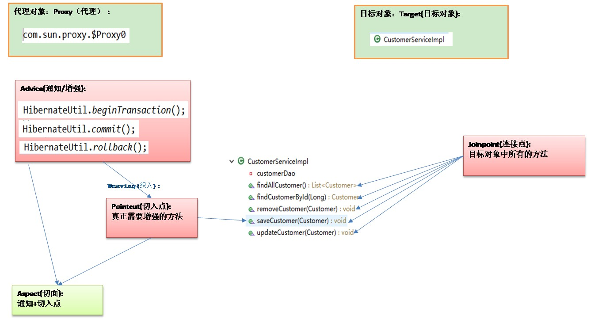

## 2. Spring 的 AOP 概述

### 2.1. Spring 中的 AOP 代理方式的选择

Spring AOP 中的动态代理主要有两种方式：JDK 动态代理和 CGLib 动态代理。在 spring 中，具体生成代理对象的方式由 `AopProxyFactory` 根据 `AdvisedSupport` 对象的配置来决定。Spring 默认的代理对象生成策略是根据目标类是否实现了接口：如果目录类实现接口，则使用 JDK 动态代理技术；否则使用 CGLib 动态代理技术。

#### 2.1.1. JDK 动态接口代理

JDK 动态代理主要涉及到 java.lang.reflect 包中的两个类：`Proxy` 和 `InvocationHandler`。**`InvocationHandler` 是一个接口，通过实现该接口定义横切逻辑，并通过反射机制调用目标类的代码，动态将横切逻辑和业务逻辑编制在一起。`Proxy` 利用 `InvocationHandler` 动态创建一个符合某一接口的实例，生成目标类的代理对象。**

#### 2.1.2. CGLib 动态代理

CGLib 全称为 Code Generation Library，是一个强大的高性能，高质量的代码生成类库，**可以在运行期扩展 Java 类与实现 Java 接口，覆盖其中指定的方法并添加增强代码**。CGLib 的底层通过字节码处理构架 ASM 来实现，通过转换字节码生成新的类。

**CGLib 动态代理和 JDK 动态代理相的区别是：JDK 创建代理有一个限制，就是只能为接口创建代理实例，而对于没有通过接口定义业务方法的类，则可以通过 CGLib 创建动态代理**。

> Tips: CGLIB 是通过继承的方式做的动态代理，因此如果某个类被标记为 final，那么它是无法使用 CGLIB 做动态代理的。

### 2.2. Spring 的 AOP 操作

Spring 里面进行 AOP 操作是使用 aspectj 实现，但 AspectJ 不是 spring 的组成部分，只是一起使用进行 aop 操作而已。使用 AspectJ 实现 aop 的有以下两种方式：

1. 基于 aspectj 的xml配置
2. 基于 aspectj 的注解方式

Spring 的 aop 操作基本 jar 包：

- spring-aop-x.x.x.RELEASE.jar
- spring-aspects-x.x.x.RELEASE.jar

aop 相关的 jar 包

- aopalliance-x.x.jar
- aspectjweaver-x.x.x.jar

### 2.3. Spring AOP 总结

#### 2.3.1. 使用 spring 中的 AOP 要明确的事

开发阶段（由开发者完成）

- 编写核心业务代码（开发主线）：大部分程序员来做，要求熟悉业务需求。
- 把公用代码抽取出来，制作成通知。（开发阶段最后再做）：AOP 编程人员来做。
- 在配置文件中，声明切入点与通知间的关系，即切面：AOP 编程人员来做。

运行阶段（由 Spring 框架完成的）

- Spring 框架监控切入点方法的执行。一旦监控到切入点方法被运行，使用代理机制，动态创建目标对象的代理对象，根据通知类别，在代理对象的对应位置，将通知对应的功能织入，完成完整的代码逻辑运行

#### 2.3.2. Spring AOP 核心要素总结

- 在 Spring 框架中，**Aspect(切面)会封装成`Advisor`**，并且必须包含`Pointcut`(切入点)和`Advice`(增强)两个要素
- **Pointcut(切入点)**的作用是：<font color=red>**匹配、拦截**</font>，`ClassFilter`是用于类的拦截；`MethodMatcher`是用过匹配需要增强的方法。主要是用在以下两个节点：
    1. <font color=red>**初始化时，校验相应的类上是否有切面，并生成代理**</font>
    2. <font color=red>**当代理对象调用方法的时候，进行匹配拦截**</font>
- **Advice(增强)**就是具体的增强的逻辑

#### 2.3.3. 代理的进一步理解

- Spring 在依赖注入和初始化影响的是原始对象，因此如果**直接读取**代理对象依赖注入的属性是为 null，只能通过代理调用方法去读取属性，才会获取注入后的值
- Spring 代理与目标是两个对象，二者成员变量并不共用数据
- 代理的增强是基于方法重写，因此 static 方法、final 方法、private 方法均无法增强

### 2.4. 扩展 - AOP 其他实现方式

#### 2.4.1. 基于 ajc 编译器

- <font color=red>**编译器增强能突破代理仅能通过方法重写增强的限制：可以对构造方法、静态方法等实现增强**</font>
- 这种使用编译器修改 class 实现增强，<font color=red>**需要使用 aspectj-maven-plugin 插件进行编译**</font>

引入依赖，基于 ajc 编译器方式实现 AOP，不依赖于 Spring。

```xml
<dependencies>
    <!-- AspectJ 依赖 -->
    <dependency>
        <groupId>org.aspectj</groupId>
        <artifactId>aspectjweaver</artifactId>
    </dependency>
    <!-- 扩展内容：基于 ajc 编译器与基于 agent 类加载实现的 AOP 的依赖 -->
    <dependency>
        <groupId>org.aspectj</groupId>
        <artifactId>aspectjrt</artifactId>
    </dependency>

    <dependency>
        <groupId>junit</groupId>
        <artifactId>junit</artifactId>
        <scope>test</scope>
    </dependency>
</dependencies>

<build>
    <plugins>
        <plugin>
            <groupId>org.codehaus.mojo</groupId>
            <artifactId>aspectj-maven-plugin</artifactId>
            <version>1.14.0</version>
            <configuration>
                <complianceLevel>1.8</complianceLevel>
                <source>8</source>
                <target>8</target>
                <showWeaveInfo>true</showWeaveInfo>
                <verbose>true</verbose>
                <Xlint>ignore</Xlint>
                <encoding>UTF-8</encoding>
            </configuration>
            <executions>
                <execution>
                    <goals>
                        <!-- use this goal to weave all your main classes -->
                        <goal>compile</goal>
                        <!-- use this goal to weave all your test classes -->
                        <goal>test-compile</goal>
                    </goals>
                </execution>
            </executions>
        </plugin>
    </plugins>
</build>
```

准备被增强的测试类

```java
public class AjcCompilerDemo {

    public AjcCompilerDemo() {
        System.out.println("AjcCompilerDemo 的构造方法执行了...");
    }

    public void normalMethod() {
        System.out.println("AjcCompilerDemo 类的普通方法执行了...");
    }

    public static void staticMethod() {
        System.out.println("AjcCompilerDemo 类的静态方法执行了...");
    }
}
```

编写切面类，使用 `@Aspect` 注解标识当前类为切面类，定义相应切面方法

```java
@Aspect // 注意此切面与常规使用 Spring Aop 不一样，此切面不需要依赖 Spring 管理
public class AjcCompilerAspect {

    @Before("execution(* com.moon.springsample.service.AjcCompilerDemo.normalMethod())")
    public void beforeNormal() {
        System.out.println("基于 ajc 编译器实现的 AOP 切面对普通方法前置增强");
    }

    @Before("execution(* com.moon.springsample.service.AjcCompilerDemo.staticMethod())")
    public void beforeStatic() {
        System.out.println("基于 ajc 编译器实现的 AOP 切面对静态方法前置增强");
    }

    // TODO: 构造方法的切面暂时不知道如何写
}
```

测试程序

```java
@Test
public void testAjcCompilerAop() {
    // 不依赖 Spring，通过修改编译的文件实现
    AjcCompilerDemo ajcCompilerDemo = new AjcCompilerDemo();
    // 3.执行普通方法，观察是否有增强
    ajcCompilerDemo.normalMethod();
    // 4.执行静态方法，观察是否有增强
    AjcCompilerDemo.staticMethod();
}
```

> 注意
>
> - 版本选择 java 8，因为目前的 aspectj-maven-plugin 1.14.0 最高只支持到 java 16
> - 一定要用 maven 的 compile或者test 来编译，直接使用 idea 不会调用 ajc 编译器

测试运行结果：

```
AjcCompilerDemo 的构造方法执行了...
基于 ajc 编译器实现的 AOP 切面对普通方法前置增强
AjcCompilerDemo 类的普通方法执行了...
基于 ajc 编译器实现的 AOP 切面对静态方法前置增强
AjcCompilerDemo 类的静态方法执行了...
```

查看编译后的 class 文件，实际是编译时直接对被增强的方法进行了修改

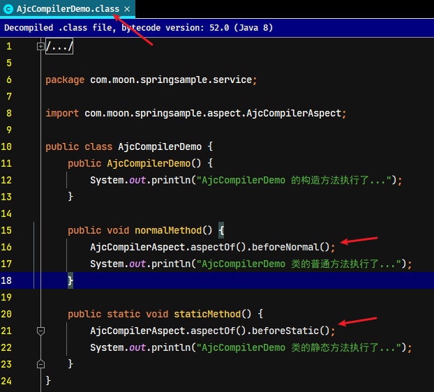

#### 2.4.2. (待整理)基于 agent 类加载

> TODO: 41-aspectj-aop-extension-agent

## 3. 基于纯 XML 的 AOP

> 具体示例代码详见 `spring-note\spring-sample\10-spring-aop-xml`

### 3.1. 使用步骤

#### 3.1.1. 添加相关的依赖(或拷贝jar包到lib目录)

```xml
<dependency>
    <groupId>org.springframework</groupId>
    <artifactId>spring-aop</artifactId>
    <version>${spring.version}</version>
</dependency>
<dependency>
    <groupId>org.springframework</groupId>
    <artifactId>spring-aspects</artifactId>
    <version>${spring.version}</version>
</dependency>
```

#### 3.1.2. 创建 spring 的配置文件并导入约束

- 导入约束时需要多导入一个**aop名称空间下的约束**。
- 导入schema文件：【spring-aop-4.2.xsd】
- 约束文件所在路径：
    - `根目录\schema\aop`
- 约束文件文档：
    - 根目录`\docs\spring-framework-reference\html\xsd-configuration.html`
    - 打开文件在html，约束位置【40.2.7 the aop schema】
- 约束内容（黄字为新增内容）

```xml
<?xml version="1.0" encoding="UTF-8"?>
<beans xmlns="http://www.springframework.org/schema/beans"
		xmlns:aop="http://www.springframework.org/schema/aop"
		xmlns:xsi="http://www.w3.org/2001/XMLSchema-instance"
		xsi:schemaLocation="http://www.springframework.org/schema/beans
					http://www.springframework.org/schema/beans/spring-beans.xsd
					http://www.springframework.org/schema/aop
					http://www.springframework.org/schema/aop/spring-aop.xsd">
</beans>
```

将相关需要创建对象资源配置到 spring 容器中

#### 3.1.3. 制作通知类（增强类）

编写用于增强业务逻辑层核心方法相关功能的类。

#### 3.1.4. 配置 bean.xml 文件，设置通知类执行方式

1. 使用`<bean>`标签配置通知(增强)类给spring管理
2. 使用 `aop:config` 声明 aop 配置
3. 使用 `aop:pointcut` 配置切入点表达式（可以写在切面标签内外都可以，但必须在配置通知前）
4. 使用 `aop:aspect` 配置切面
5. 使用 `aop:before/after-returning/after-throwing/after/around` 配置通知方式

注：AOP的约束提醒必需配置两个xsd约束（beans-4.2.xsd和tool-4.2.xsd）

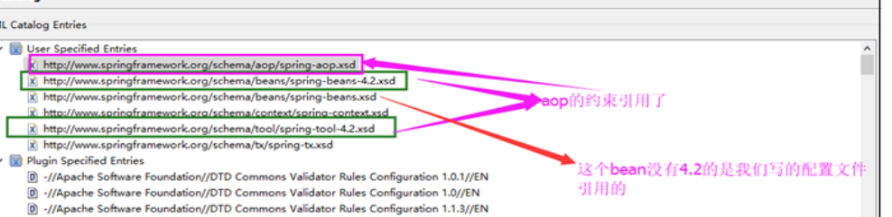

```xml
<?xml version="1.0" encoding="UTF-8"?>
<beans xmlns="http://www.springframework.org/schema/beans"
		xmlns:aop="http://www.springframework.org/schema/aop"
		xmlns:xsi="http://www.w3.org/2001/XMLSchema-instance"
		xsi:schemaLocation="http://www.springframework.org/schema/beans
							http://www.springframework.org/schema/beans/spring-beans.xsd
							http://www.springframework.org/schema/aop
							http://www.springframework.org/schema/aop/spring-aop.xsd ">
	<!-- 配置需要创建对象给spring管理 -->
	<bean id="customerService" class="com.moonzero.service.impl.CustomerServiceImpl"></bean>

	<!-- 配置通知类给spring管理 -->
	<bean id="logger" class="com.moonzero.utils.Logger"></bean>

	<!-- 声明开始aop的配置 -->
	<aop:config>
		<!-- 配置的代码都写在此处 -->

		<!--
			1. 配置切面：此标签要出现在aop:config内部
				id：给切面提供一个唯一标识
				ref：引用的是通知类的 bean 的 id
		 -->
		<aop:aspect id="logActive" ref="logger">
			<!-- 配置通知的类型写在此处 -->

			<!--
				2. 配置切入点 aop:pointcut 配置切入点表达式(写在切面aspect内外都可以)
					expression：用于定义切入点表达式,切入点表达式都写在 execution() 中。
					id：用于给切入点表达式提供一个唯一标识。
				表达式语法：execution([修饰符] 返回值类型 包名.类名.方法名(参数))
			-->
			<!-- 全匹配方式，public可以省略 -->
			<aop:pointcut expression="execution(public void com.moonzero.service.impl.CustomerServiceImpl.saveCustomer())" id="pt1"/>
			<!-- 使用通配方式 -->
			<!-- <aop:pointcut expression="execution(* com.moonzero.service.impl.CustomerServiceImpl.updateCustomer(..))" id="pt2"/> -->
			<!-- <aop:pointcut expression="execution(* *.*.*.*.CustomerServiceImpl.updateCustomer(..))" id="pt2"/> -->
			<!-- <aop:pointcut expression="execution(* *..CustomerServiceImpl.updateCustomer(..))" id="pt2"/> -->
			<!-- <aop:pointcut expression="execution(* *..*Impl.updateCustomer(..))" id="pt2"/> -->
			<!-- <aop:pointcut expression="execution(* *..*.updateCustomer(..))" id="pt2"/> -->
			<!-- <aop:pointcut expression="execution(* *..*.*Customer(..))" id="pt2"/> -->
			<aop:pointcut expression="execution(* *..*.*(..))" id="pt2"/>

			<!--
				用于配置前置通知：指定增强的方法在切入点方法之前执行
					method:用于指定通知类中的增强方法名称
					pointcut-ref：用于指定切入点的表达式的引用
					pointcut:直接写切入点表达式
			-->
			<!-- 前置通知 -->
			<aop:before method="beforePrintLog" pointcut-ref="pt1"/>
			<!-- 后置通知 -->
			<aop:after method="afterReturnningPrintLog" pointcut-ref="pt2"/>
			<!-- 异常通知 -->
			<aop:after-throwing method="afterThrowingPrintLog" pointcut-ref="pt1"/>
			<!-- 最终通知 -->
			<aop:after method="afterPrintLog" pointcut-ref="pt1"/>

			<!-- 环绕通知-->
			<aop:around method="aroundPrintLog" pointcut-ref="pt1"/>

		</aop:aspect>
	</aop:config>
</beans>
```

#### 3.1.5. 测试

```java
public class Logger {
	/**
	 * 前置通知 作用：在业务层执行核心方法之前执行此方法记录日志
	 */
	public void beforePrintLog() {
		System.out.println("前置通知：正在记录日志。。。。。。");
	}

	/**
	 * 后置通知 作用：在业务层执行核心方法之后执行此方法记录日志
	 */
	public void afterReturnningPrintLog() {
		System.out.println("后置通知：正在记录日志。。。。。。");
	}

	/**
	 * 异常通知 作用：在业务层执行核心方法出现异常后执行此方法记录日志
	 */
	public void afterThrowingPrintLog() {
		System.out.println("异常通知：正在记录日志。。。。。。");
	}

	/**
	 * 最终通知 作用：在业务层执行核心方法最终执行此方法记录日志
	 */
	public void afterPrintLog() {
		System.out.println("最终通知：正在记录日志。。。。。。");
	}

	/**
	 * 环绕通知:是spring提供给我们的特殊通知，需要我们手动调用目标方法
	 * 		在调用目标方法之前的输出的就是前置通知
	 * 		在调用目标方法之后的输出的就是后置通知
	 * 		在调用目标方法之后有异常的输出的就是异常通知
	 * 		不管有无异常都会执行的代码是最终通知
	 */
	public Object aroundPrintLog(ProceedingJoinPoint pjp) {
		// 获取方法参数列表
		Object[] args = pjp.getArgs();
		// 定义返回变量
		Object result = null;
		try {
			// 前置通知
			System.out.println("前：记录日志。。。");
			// 手动调用目标方法
			result = pjp.proceed(args);
			// 后置通知
			System.out.println("后：记录日志。。。");
		} catch (Throwable e) {
			e.printStackTrace();
			// 异常通知
			System.out.println("异：记录日志。。。");
		} finally {
			// 最终通知
			System.out.println("终：记录日志。。。");
		}
		return result;
	}
}

public class ClientTest {
	public static void main(String[] args) {
		// 获取spring容器操作对象
		ApplicationContext context = new ClassPathXmlApplicationContext("bean.xml");
		// 根据id获取对象
		ICustomerService cs = (ICustomerService) context.getBean("customerService");
		// 打印对象查看是否为代理对象
		System.out.println(cs.getClass().getName());

		// 要使用基于子类的，对象不能实现接口
		// CustomerServiceImpl cs = (CustomerServiceImpl) context.getBean("customerService");

		// 调用方法
		cs.saveCustomer();
		//cs.updateCustomer(10);
	}
}
```

<font color="purple">**注意：如果使用基于子类的方式创建动态代理，对象就不能实现接口，创建的代理需要自己用子类去接收。**</font>

### 3.2. 常用标签

|          标签名          |                                           属性                                            |        作用         |
| :---------------------: | ----------------------------------------------------------------------------------------- | ------------------ |
|     `<aop:config>`      | \                                                                                         | 用于声明开始aop的配置 |
|     `<aop:aspect>`      | id：给切面提供一个唯一标识</br>ref：引用配置好的通知类 bean 的 id                                | 用于配置切面         |
|    `<aop:pointcut>`     | expression：用于定义切入点表达式</br>id：用于给切入点表达式提供一个唯一标识                        | 用于配置切入点表达式  |
|     `<aop:before>`      | method：指定通知中方法的名称</br>pointct：定义切入点表达式</br>pointcut-ref：指定切入点表达式的引用 | 用于配置前置通知      |
| `<aop:after-returning>` | 同上                                                                                      | 用于配置后置通知      |
| `<aop:after-throwing>`  | 同上                                                                                      | 用于配置异常通知      |
|      `<aop:after>`      | 同上                                                                                      | 用于配置最终通知      |
|     `<aop:around>`      | method：指定通知中方法的名称</br>pointct：定义切入点表达式</br>pointcut-ref：指定切入点表达式的引用 | 用于配置环绕通知      |

eg.

```xml
<aop:before method="beforePrintLog" pointcut-ref="pt1"/>
<aop:after-returning method="afterReturningPrintLog" pointcut-ref="pt1"/>
<aop:after-throwing method="afterThrowingPrintLog" pointcut-ref="pt1"/>
<aop:after method="afterPrintLog" pointcut-ref="pt1"/>
<aop:around method="aroundPringLog" pointcut-ref="pt1"/>
```

### 3.3. 通知的类型

#### 3.3.1. 配置通知的类型说明

- `aop:before`：用于配置前置通知。前置通知的执行时间点：切入点方法执行之前执行
- `aop:after-returning`：用于配置后置通知。后置通知的执行时间点：切入点方法正常执行之后。它和异常通知只能有一个执行
- `aop:after-throwing`：用于配置异常通知。异常通知的执行时间点：切入点方法执行产生异常后执行。它和后置通知只能执行一个。
- `aop:after`：用于配置最终通知。最终通知的执行时间点：无论切入点方法执行时是否有异常，它都会在其后面执行。类似try-catch中的finally

#### 3.3.2. 环绕通知的特殊说明(了解)

**环绕通知`aop:around`（了解）**

- 用于配置环绕通知。他和前面四个不一样，他不是用于指定通知方法何时执行的。是Spring提供给我们的特殊通知，需要我们手动调用目标方法
- 在通知方法的参数中，需要定义一个接口`ProceedingJoinPoint`，此接口的实现类，spring 会注入

问题：当配置了环绕通知之后，增强的代码执行了，业务核心方法没有执行。

分析：通过动态代理可以知道在 `invoke` 方法中，有明确调用业务核心方法：`method.invoke()`。但配置的环绕通知中，没有明确调用业务核心方法。

解决：

- spring 框架为我们提供了一个接口：`ProceedingJoinPoint`，它可以作为环绕通知的方法参数
- 在环绕通知执行时，spring 框架会为我们提供该接口的实现类对象，我们直接使用就行。
- 该接口中有一个方法`proceed()`，执行目标方法，此方法就相当于`method.invoke()`
- `getArgs()`方法：获取参数列表
    - 在调用目标方法之前的输出的就是前置通知
    - 在调用目标方法之后的输出的就是后置通知
    - 在调用目标方法之后有异常的输出的就是异常通知
    - 不管有无异常都会执行的代码是最终通知

## 4. 基于纯注解方式的 AOP

> 示例代码详见 `spring-note\spring-sample\12-spring-aop-annotation-noXML` 或者 `spring-note\spring-sample\xx-annotation-aop-xxx` 相关工程

Spring 支持 AspectJ 的注解式切面编程，使用的整体步骤

1. 使用 `@Aspect` 声明是一个切面
2. 使用 `@After`、`@Before`、`@Around` 等注解定义建言（advice），可以直接将拦截规则（切点）作为参数
3. 拦截规则为切点(PointCut)，可使用 `@PointCut` 定义好拦截规则，然后在 `@After`、`@Before`、`@Around` 的参数中调用
4. 符合条件的每一个被拦截处为连接点（JoinPoint）

### 4.1. 基于 execution 表达式拦截的使用步骤

#### 4.1.1. 添加相关的依赖(或拷贝jar包到lib目录)

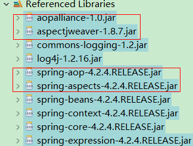

```xml
<dependency>
    <groupId>org.springframework</groupId>
    <artifactId>spring-aop</artifactId>
    <version>${spring.version}</version>
</dependency>
<dependency>
    <groupId>org.springframework</groupId>
    <artifactId>spring-aspects</artifactId>
    <version>${spring.version}</version>
</dependency>
```

#### 4.1.2. AOP 配置

关于 AOP 配置以下有两种方式

1. 基于 xml 配置文件方式：创建 spring 的配置文件并导入约束，指定 spring 要扫描的包与 `aop:aspectj-autoproxy` 开启 AOP 支持

```xml
<?xml version="1.0" encoding="UTF-8"?>
<beans xmlns="http://www.springframework.org/schema/beans"
		xmlns:aop="http://www.springframework.org/schema/aop"
		xmlns:context="http://www.springframework.org/schema/context"
		xmlns:xsi="http://www.w3.org/2001/XMLSchema-instance"
		xsi:schemaLocation="http://www.springframework.org/schema/beans
			http://www.springframework.org/schema/beans/spring-beans.xsd
			http://www.springframework.org/schema/aop
			http://www.springframework.org/schema/aop/spring-aop.xsd
			http://www.springframework.org/schema/context
			http://www.springframework.org/schema/context/spring-context.xsd">
	<!-- 配置创建spring容器需要扫描的基础包 -->
	<context:component-scan base-package="com.moon.spring"></context:component-scan>
	
    <!-- 开启spring容器对AOP注解的支持 -->
    <aop:aspectj-autoproxy />
</beans>
```

2. **基于注解配置类的方式（推荐）**：创建 Spring 配置类并标识 `@EnableAspectJAutoProxy` 注解，用于替代传统的 xml 配置文件中的 `<aop:aspectj-autoproxy />` 标签。**其作用都是开启 Spring 容器对 AOP 注解的支持**。（*删除项目的 xml 配置文件*）

```java
/** 配置开启 Spring 容器的 AOP 注解支持。代替传统的 bean.xml 文件的配置类 */
@Configuration // 用于指定当前类是一个配置类
@ComponentScan(basePackages = {"com.moon.spring"}) // 配置包扫描
/* 注解的方式开启AOP注解支持，相当于xml配置文件中的 <aop:aspectj-autoproxy/> 标签 */
@EnableAspectJAutoProxy(proxyTargetClass = false, exposeProxy = true)
public class SpringConfig {
}
```

#### 4.1.3. 创建待增强资源

准备测试的接口与实现类，使用注解配置相关资源和通知类给 spring 来管理

```java
public interface LogService {
    String logErrorMessage(String message);
}

@Service
public class LogServiceImpl implements LogService {
    @Override
    public String logErrorMessage(String message) {
        System.out.println("测试aop增强，LogServiceImpl.logErrorMessage()方法调用，入参message->" + message);
        return "LogServiceImpl.logErrorMessage()返回：" + message;
    }
}
```

#### 4.1.4. 创建切面类

编写切面类，在通知类上标识 `@Aspect` 注解，声明该类为切面。在方法上使用 `@Pointcut` 注解定义切入点，在增强通知方法上配置相关通知类型的注解，如 `@Before`、`@Around`

```java
package com.moon.spring.aop.aspectj;

import org.aspectj.lang.ProceedingJoinPoint;
import org.aspectj.lang.annotation.Around;
import org.aspectj.lang.annotation.Aspect;
import org.aspectj.lang.annotation.Pointcut;
import org.springframework.stereotype.Component;

/**
 * 基于注解的方式的AOP使用
 */
@Component // 配置通知类给spring管理
@Aspect // 声明此类是一个切面
public class AspectOnAnnotation {

    /*
     * @Pointcut注解标识定义切入点
     * execution(表达式)：表示拦截的位置（方法）
     *  表达式语法：execution([修饰符] 返回值类型 包名.类名.方法名(参数))
     *  例子："execution(* *..*.CustomerServiceImpl.saveCustomer())"
     */
    @Pointcut("execution(public * com.moon.spring.service.*.*(..))")
    public void pc1() {
    }
    
    @Pointcut(value="execution(* *..*.*(..))")
	public void pt2() {
	}

    /**
	 * 前置通知 作用：在业务层执行核心方法之前执行此方法记录日志
	 */
	// 指定切入点表达式的引用
	// 注意:在注解因为定义切入是在方法上，所以value值的id需要写上()
	@Before("pt1()")
	public void beforePrintLog(JoinPoint point) {
		System.out.println("前置通知：正在记录日志。。。。。。");
	}

	/**
	 * 后置通知 作用：在业务层执行核心方法之后执行此方法记录日志
	 */
	// 直接指定切入点表达式
	@AfterReturning("execution(* *..*.*(..))")
	public void afterReturnningPrintLog() {
		System.out.println("后置通知：正在记录日志。。。。。。");
	}

	/**
	 * 异常通知 作用：在业务层执行核心方法出现异常后执行此方法记录日志
	 */
	@AfterThrowing("pt1()")
	public void afterThrowingPrintLog() {
		System.out.println("异常通知：正在记录日志。。。。。。");
	}

	/**
	 * 最终通知 作用：在业务层执行核心方法最终执行此方法记录日志
	 */
	@After("pt1()")
	public void afterPrintLog() {
		System.out.println("最终通知：正在记录日志。。。。。。");
	}

	/**
	 * 环绕通知:
	 */
	@Around("pt1()")
	public Object aroundPrintLog(ProceedingJoinPoint joinPoint) {
		// 获取方法参数列表
		Object[] args = joinPoint.getArgs();
		// 定义返回变量
		Object result = null;

		try {
			// 前置通知
			System.out.println("==============AspectOnAnnotation类的 @Around环绕通知的前置通知=========");
			// 手动调用目标方法
			result = joinPoint.proceed(args);
			// 后置通知
			System.out.println("==============AspectOnAnnotation类的 @Around环绕通知的后置通知=========");
		} catch (Throwable e) {
			e.printStackTrace();
			// 异常通知
			System.out.println("异常通知：记录日志。。。");
		} finally {
			// 最终通知
			System.out.println("最终通知：记录日志。。。");
		}

		return result;
	}
}
```

> *注意：为什么切入点表达式是写在通知增加方法上，而不是写在切入点所在的类的方法上？从aop理念就可以理解，如果写在被增强的类上，就是违反原来不修改源代码而得到增强的理念。*

#### 4.1.5. 测试

```java
private final ApplicationContext context = new AnnotationConfigApplicationContext(SpringConfig.class);

/**
 * 基于注解方式的aop测试 - @Around环绕增强
 */
@Test
public void testAspectOnAnnotationAround() {
    LogService logService = context.getBean(LogService.class);
    logService.logErrorMessage("You have an error!");
}
```

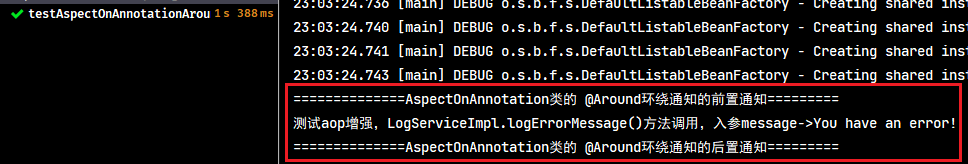

### 4.2. AOP 常用注解

|           注解名           |                             属性                             |         作用         |
| :-----------------------: | ----------------------------------------------------------- | -------------------- |
| `@EnableAspectJAutoProxy` | `proxyTargetClass`：指定代理类型<br/>`exposeProxy`：是否暴露代理 | 开启 AOP 注解支持      |
|         `@Aspect`         | \                                                           | 把当前类声明为切面类     |
|         `@Before`         | `value`：用于指定切入点表达式，还可以指定切入点表达式的引用           | 把当前方法看成是前置通知 |
|     `@AfterReturning`     | 同上                                                         | 把当前方法看成是后置通知 |
|     `@AfterThrowing`      | 同上                                                         | 把当前方法看成是异常通知 |
|         `@After`          | 同上                                                         | 把当前方法看成是最终通知 |
|         `@Around`         | 同上                                                         | 把当前方法看成是环绕通知 |
|        `@Pointcut`        | `value`：指定表达式的内容                                      | 指定切入点表达式        |

> Notes: 更多常用注解的说明详见《Spring 注解汇总》笔记

#### 4.2.1. @EnableAspectJAutoProxy

`@EnableAspectJAutoProxy` 注解用于开启 AOP 注解支持，相关属性说明如下：

- `proxyTargetClass` 属性：指定是否采用 cglib 进行代理。默认值是 false。创建代理分以下三种情况：
    - `proxyTargetClass = false` 时，并且目标实现了接口，则使用 JDK 实现代理（`JdkDynamicAopProxy`）
    - `proxyTargetClass = false` 时，并且目标没有实现了接口，则使用 CGlib 实现代理（`ObjenesisCglibAopProxy`）
    - `proxyTargetClass = true` 时，则使用 CGlib 实现代理（`ObjenesisCglibAopProxy`）
- `exposeProxy` 属性：指定是否暴露代理对象，默认值是 false。如果设置为 `true` 暴露则通过 AopContext 可以进行访问

#### 4.2.2. @Pointcut

`@Pointcut` 注解标识在方法上，用于配置切入点

```java
@Pointcut("execution(* *..*.*(..))")
public void pt1() {
}

@Before("pt1()")
public void beforePrintLog() {
    xxx;
}
```

> **注意：在注解因为定义切入点 `@Pointcut` 是在成员方法上，所以通知用于指定切入点表达式的引用的值需要写上“`()`”！！**

### 4.3. 基于自定义注解拦截的使用步骤

1. 使用注解式拦截首先编写一个注解，如

```java
@Target(ElementType.METHOD)
@Retention(RetentionPolicy.RUNTIME)
@Documented
public @interface DataScope {
    public String name() default "";
}
```

2. 编写切面（类），如：

```java
@Aspect
@Component
public class DataScopeAspect {
    // 配置织入点
    @Pointcut("@annotation(com.moon.common.annotation.DataScope)")
    public void dataScopePointCut() {}

    @Before("dataScopePointCut()")
    public void doBefore(JoinPoint point) throws Throwable {
        MethodSignature signature = (MethodSignature) point.getSignature();
        Method method = signature.getMethod();
        DataScope annotation = method.getAnnotation(DataScope.class);
        System.out.println("注解属性name值：" + method.getName());
    }
}
```

3. 在需要拦截的方法上加上注解，如

```java
// 使用aop拦截方法
@DataScope(name = "u")
public List<SysRole> selectRoleList(SysRole role) {
    return roleMapper.selectRoleList(role);
}
```

**注：注解式拦截与方法规则拦截的用法是一样的，使用方法规则拦截不需要定义注解。区别在于定义切入点（@PointCut）注解时的参数不一样，使用注解式拦截的参数是：`"@annotation(自定义的注解全类名)"`，使用方法规则拦截的参数是：`"execution(* *..*.*(..))"`**

### 4.4. 移除配置类的 @Configuration 注解

以下测试如果移除配置类中的 `@Configuration` 注解，该类没有给spring管理，即 `@EnableAspectJAutoProxy` 注解不生效。此时测试方法可以看到从 Spring 容器中拿到的是接口实现类实例本身

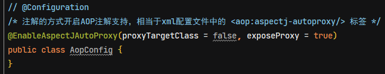

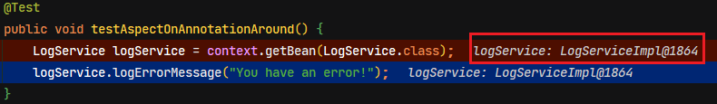

如果配置类上有的 `@Configuration` 注解，即 `@EnableAspectJAutoProxy` 注解生效。此时测试方法从 spring 容器中拿到的是接口的代理实例

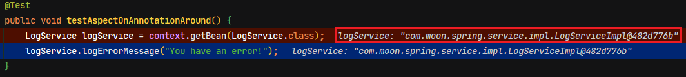

## 5. Spring AOP APIs（了解）

前面介绍了 Spring 对 AOP 的支持，使用 `@Aspect` 定义切面。此章节，介绍低级别的 Spring AOP API 创建 Advisor 实现 AOP 功能。对于普通的应用，推荐使用前面使用 AspectJ 的 Spring AOP

### 5.1. 基于编程式实现 AOP

#### 5.1.1. Spring AOP 相关接口调用关系图

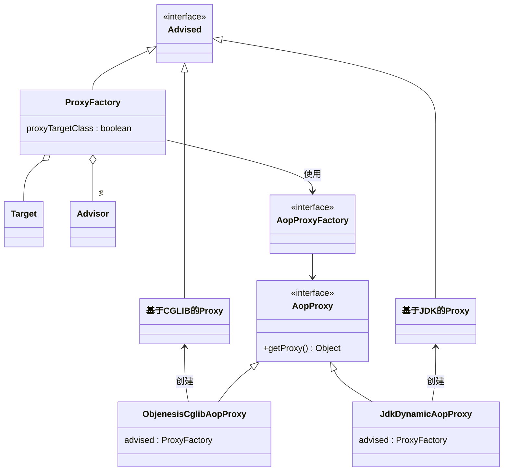

- `AopProxyFactory` 根据 `proxyTargetClass` 等设置选择 `AopProxy` 实现
- `AopProxy` 通过 `getProxy` 创建代理对象
- 图中 Proxy 都实现了 `Advised` 接口，能够获得关联的切面集合与目标（其实是从 `ProxyFactory` 取得）
- 调用代理方法时，会借助 `ProxyFactory` 将通知统一转为环绕通知：`MethodInterceptor`

#### 5.1.2. 基础使用步骤

创建测试的相关接口与实现

```java
public interface DemoSerivce {
    void foo();
    void bar();
}

public class DemoServiceImpl implements DemoSerivce {

    @Override
    public void foo() {
        System.out.println("DemoServiceImpl foo() 方法执行...");
    }

    @Override
    public void bar() {
        System.out.println("DemoServiceImpl bar() 方法执行...");
    }
}

public class TestService {

    public void foo() {
        System.out.println("无实现接口的 TestService foo() 方法执行...");
    }

    public void bar() {
        System.out.println("无实现接口的 TestService bar() 方法执行...");
    }
}
```

使用 Spring Aop 相关 API 编写测试程序

```java
@Test
public void testAopApis() {
    // 1. 备好切入点
    AspectJExpressionPointcut pointcut = new AspectJExpressionPointcut();
    // 设置切入点 execution 表达式
    pointcut.setExpression("execution(* foo())"); // 所有类中的 foo 方法

    // 2. 设置增强通知。注意：拦截接口是 org.aopalliance.intercept.MethodInterceptor
    MethodInterceptor advice = invocation -> {
        System.out.println("do something before...");
        Object result = invocation.proceed(); // 调用目标方法
        System.out.println("do something after...");
        return result;
    };

    // 3. 根据切入点和通知，创建切面 Advisor
    DefaultPointcutAdvisor advisor = new DefaultPointcutAdvisor(pointcut, advice);

    /*
     * 创建代理，代理的类型分以下三种情况
     *  a. proxyTargetClass = false, 目标实现了接口, 用 jdk 实现
     *  b. proxyTargetClass = false,  目标没有实现接口, 用 cglib 实现
     *  c. proxyTargetClass = true, 总是使用 cglib 实现
     */
    // DemoSerivce target = new DemoServiceImpl();
    TestService target = new TestService();
    ProxyFactory factory = new ProxyFactory();
    factory.setTarget(target); // 设置目标对象
    factory.addAdvisor(advisor); // 设置切面
    // 如果想使用 jdk 代理，必须在 ProxyFactory 中设置目标的实现了接口
    factory.setInterfaces(target.getClass().getInterfaces());
    factory.setProxyTargetClass(false); // 设置是否使用 cglib 实现代理
    // DemoSerivce proxy = (DemoSerivce) factory.getProxy();
    TestService proxy = (TestService) factory.getProxy();

    System.out.println(proxy.getClass()); // 用于查询代理的类型
    // 通过代理执行方法
    proxy.foo();
    proxy.bar();
}
```

> 注意：要区别 Spring AOP 用于通知的接口 `MethodInterceptor` 与 Cglib 中的方法增加拦截的同名接口

### 5.2. Spring 中 Pointcut（切入点）的 API

#### 5.2.1. 切入点的匹配

Spring 中定义了 `MethodMatcher` 接口，其中 `matches` 方法用于对切入点与类的方法进行判断是否匹配。Spring 提供了相关的实现，用于去查找哪些方法需要被增强。

```java
public interface MethodMatcher {

    boolean matches(Method m, Class<?> targetClass);

    boolean isRuntime();

    boolean matches(Method m, Class<?> targetClass, Object... args);
}
```

#### 5.2.2. 基于 AspectJ 表达式 execution 匹配指定方法

创建切入点对象，设置 `execution` 关键字的 AspectJ 表达式，匹配相应的方法

```java
@Test
public void testAspectJExpressionMethod() throws NoSuchMethodException {
    // 创建切入点
    AspectJExpressionPointcut pointcut = new AspectJExpressionPointcut();
    // 设置 AspectJ 表达式
    pointcut.setExpression("execution(* bar())");
    // 调用 AspectJExpressionPointcut 类中的 matches 判断指定类中方法是否与切入点匹配
    Class<?> clazz = DemoServiceImpl.class;
    System.out.println(pointcut.matches(clazz.getMethod("foo"), clazz));
    System.out.println(pointcut.matches(clazz.getMethod("bar"), clazz));
}
```

#### 5.2.3. 基于 AspectJ 表达式 @annotation 匹配标识指定注解的方法

创建切入点对象，设置 `@annotation` 关键字的 AspectJ 表达式，匹配标识了指定注解的方法

```java
@Test
public void testAspectJExpressionAnnotation() throws NoSuchMethodException {
    // 创建切入点
    AspectJExpressionPointcut pointcut = new AspectJExpressionPointcut();
    // 设置 AspectJ 表达式，匹配标识了指定注解的方法
    pointcut.setExpression("@annotation(com.moon.springsample.annotations.MyAnnotation)");
    // 调用 AspectJExpressionPointcut 类中的 matches 测试以下情况是否匹配
    // 情况1：测试普通类中标识了 @MyAnnotation 注解的 foo 方法是否匹配
    System.out.println(pointcut.matches(DemoServiceImpl.class.getMethod("foo"), DemoServiceImpl.class)); // 结果：true
    // 情况2：测试普通类中没有标识了 @MyAnnotation 注解的 bar 方法是否匹配
    System.out.println(pointcut.matches(DemoServiceImpl.class.getMethod("bar"), DemoServiceImpl.class)); // 结果：false
    // 情况3：测试普通类上标识了 @MyAnnotation 注解，类中的 foo 方法是否匹配
    System.out.println(pointcut.matches(TestService.class.getMethod("foo"), TestService.class)); // 结果：false
    // 情况4：测试接口上标识了 @MyAnnotation 注解，其实现类中的 foo 方法是否匹配
    System.out.println(pointcut.matches(DemoClass1.class.getMethod("foo"), DemoClass1.class)); // 结果：false
}
```

> 注：`@annotation` 表达式只能匹配注解直接标识在方法的情况，如注解标识到类上或者接口上，则无法匹配

#### 5.2.4. 自定义切入点匹配规则

Spring 提供了 `StaticMethodMatcherPointcut` 抽象类，实现其 `matches` 方法，可以自定义匹配的规则。下例实现了匹配指定的注解标识在方法上、类、接口等多种情况

```java
@Test
public void testStaticMethodMatcherPointcut() throws NoSuchMethodException {
    // 创建 StaticMethodMatcherPointcut 切入点，自定义匹配规则
    StaticMethodMatcherPointcut pointcut = new StaticMethodMatcherPointcut() {
        // 自定义匹配的规则
        @Override
        public boolean matches(Method method, Class<?> targetClass) {
            // 检查方法上是否加了 @MyAnnotation 注解
            MergedAnnotations annotations = MergedAnnotations.from(method);
            if (annotations.isPresent(MyAnnotation.class)) {
                return true;
            }
            // 查看类上或者接口上是否加了 @MyAnnotation 注解
            annotations = MergedAnnotations.from(targetClass, MergedAnnotations.SearchStrategy.TYPE_HIERARCHY);
            return annotations.isPresent(MyAnnotation.class);
        }
    };
    // 调用 StaticMethodMatcherPointcut 类中的 matches 测试以下情况是否匹配
    // 情况1：测试普通类中标识了 @MyAnnotation 注解的 foo 方法是否匹配
    System.out.println(pointcut.matches(DemoServiceImpl.class.getMethod("foo"), DemoServiceImpl.class)); // 结果：true
    // 情况2：测试普通类中没有标识了 @MyAnnotation 注解的 bar 方法是否匹配
    System.out.println(pointcut.matches(DemoServiceImpl.class.getMethod("bar"), DemoServiceImpl.class)); // 结果：false
    // 情况3：测试普通类上标识了 @MyAnnotation 注解，类中的 foo 方法是否匹配
    System.out.println(pointcut.matches(TestService.class.getMethod("foo"), TestService.class)); // 结果：true
    // 情况4：测试接口上标识了 @MyAnnotation 注解，其实现类中的 foo 方法是否匹配
    System.out.println(pointcut.matches(DemoClass1.class.getMethod("foo"), DemoClass1.class)); // 结果：true
}
```

### 5.3. Spring 中 JoinPoint 的 API

任何增强方法都可以声明一个 `org.aspectj.lang.JoinPoint` 类型的参数作为其方法第一个参数。通过此对象可以获取连接点（被增强的方法）签名（声明类型和方法名称）、方法参数、目标对象与代理对象

通常建议在环绕通知方法声明一个 `ProceedingJoinPoint` 类型参数，它是 `JoinPoint` 的一个子类。

```java
public interface ProceedingJoinPoint extends JoinPoint
```

`JoinPoint` 接口 API：

```java
Object getThis();    
```

- 返回代理对象

```java
Object getTarget();
```

- 返回目标对象，即被代理包装前的原始 bean 对象

```java
Object[] getArgs();
```

- 返回方法的参数。

```java
Signature getSignature();
```

- 返回被增强的方法签名。

```java
String toString();
```

- 输出被增强的方法有用描述。

## 6. Spring AOP 建言的执行顺序

### 6.1. 当方法正常执行时的执行顺序

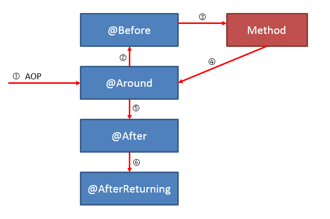

### 6.2. 当方法出现异常时的执行顺序

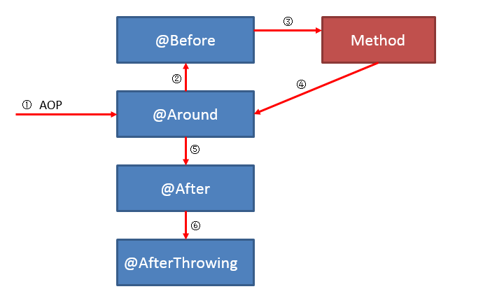

### 6.3. 当同一个方法被多个注解 @Aspect 类拦截时

可以通过在为上注解 `@Order` 指定 Aspect 类的执行顺序。例如 Aspect1 上注解了 `@Order(1)`，Aspect2 上注解了 `@Order(2)`，则建言的执行顺序为：

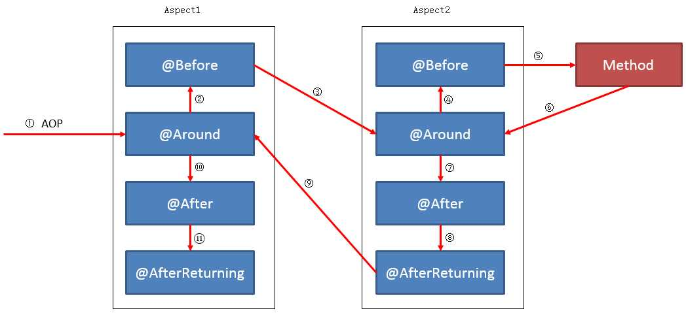

> <font color=red>**注意：`@Order` 注解只能用于切面类上才能生效，标识在方法上无任何效果**</font>

## 7. 切入点表达式

### 7.1. 切入点表达式概念及作用

- 概念：指的是遵循特定的语法用于捕获每一个种类的可使用连接点的语法。
- 作用：用于对符合语法格式的连接点进行增强。

### 7.2. 按照用途分类

- 方法执行：`execution(MethodSignature)`
- 方法调用：`call(MethodSignature)`
- 构造器执行：`execution(ConstructorSignature)`
- 构造器调用：`call(ConstructorSignature)`
- 类初始化：`staticinitialization(TypeSignature)`
- 属性读操作：`get(FieldSignature)`
- 属性写操作：`set(FieldSignature)`
- 例外处理执行：`handler(TypeSignature)`
- 对象初始化：`initialization(ConstructorSignature)`
- 对象预先初始化：`preinitialization(ConstructorSignature)`

> **在 spring aop 主要只支持方法的增强，所以只用到 `execution(MethodSignature)`**

### 7.3. 切入点表达式的关键字

支持的 AspectJ 切入点指示符如下：

- `execution`：用于匹配方法执行的连接点；
- `within`：用于匹配指定类型内的方法执行；
- `this`：用于匹配当前 AOP 代理对象类型的执行方法；注意是 AOP 代理对象的类型匹配，这样就可能包括引入接口也类型匹配；
- `target`：用于匹配当前目标对象类型的执行方法；注意是目标对象的类型匹配，这样就不包括引入接口也类型匹配；
- `args`：用于匹配当前执行的方法传入的参数为指定类型的执行方法；
- `@within`：用于匹配所以持有指定注解类型内的方法；
- `@target`：用于匹配当前目标对象类型的执行方法，其中目标对象持有指定的注解；
- `@args`：用于匹配当前执行的方法传入的参数持有指定注解的执行；
- `@annotation`：用于匹配当前执行方法持有指定注解的方法；
- `bean`：Spring AOP 扩展的，AspectJ 没有对于指示符，用于匹配特定名称的 Bean 对象的执行方法；
- `reference pointcut`：表示引用其他命名切入点，只有 `@ApectJ` 风格支持，Schema 风格不支持。

### 7.4. 切入点表达式的通配符

AspectJ类型匹配的通配符：

- `*`：匹配任何数量字符；
- `..`：匹配任何数量字符的重复，如在类型模式中匹配任何数量子包；而在方法参数模式中匹配任何数量参数。
- `+`：匹配指定类型的子类型；仅能作为后缀放在类型模式后边。

示例：

- `java.lang.String`：匹配String类型
- `java.*.String`：匹配java包下的任何“一级子包”下的String类型。如匹配java.lang.String，但不匹配java.lang.ss.String
- `java..*`：匹配java包及任何子包下的任何类型。如匹配java.lang.String、java.lang.annotation.Annotation
- `java.lang.*ing`：匹配任何java.lang包下的以ing结尾的类型
- `java.lang.Number+`：匹配java.lang包下的任何Number的子类型。如匹配java.lang.Integer，也匹配java.math.BigInteger

### 7.5. 切入点表达式的逻辑条件

- `&&`：与（and）
- `||`：或（or）
- `!`：非（not）

### 7.6. 使用说明

execution 表达式，用于匹配方法的执行(常用)。**表达式语法**如下：

```java
execution([修饰符] 返回值类型 包名.类名.方法名(参数))
```

**写法示例说明**：

1. 全匹配方式（修饰符public可以省略）：`public void com.moon.service.impl.CustomerServiceImpl.saveCustomer()`
2. 访问修饰符可以省略：`void com.moon.service.impl.CustomerServiceImpl.saveCustomer()`
3. 返回值可以使用`*`号，表示任意返回值：`* com.moon.service.impl.CustomerServiceImpl.saveCustomer()`
4. 包名：
    - 可以使用`*`号，表示任意包，但是有几级包，需要写几个`*`：`* *.*.*.*.CustomerServiceImpl.saveCustomer()`
    - 使用`..`来表示当前包，及其子包：`* com..CustomerServiceImpl.saveCustomer()`
5. 类名：
	- 可以使用`*`号，表示任意类：`* com..*.saveCustomer()`
	- 可以使用部分通配的方法：`* com..*Impl.saveCustomer()`
6. 方法名：
	- 可以使用`*`号，表示任意方法：`* com..*.*()`
	- 可以使用部分通配的方法：`* com..*.*all()`
7. 参数列表：
	- 参数列表可以使用`*`，表示参数可以是任意数据类型，但是必须有参数：`* com..*.*(*)`
	- 参数列表可以使用 `..` 表示有无参数均可，有参数可以是任意类型：`* com..*.*(..)`
8. **全通配方式**：`* *..*.*(..)`

## 8. 其他综合

### 8.1. Spring AOP 与 AspectJ AOP 的区别

AOP 实现的关键在于代理模式，AOP 代理主要分为静态代理和动态代理。静态代理的代表为 AspectJ；动态代理则以 Spring AOP 为代表。

- AspectJ 是静态代理的增强，所谓静态代理，就是 AOP 框架会在编译阶段生成 AOP 代理类，因此也称为编译时增强，他会在编译阶段将 AspectJ(切面)织入到 Java 字节码中，运行的时候就是增强之后的 AOP 对象。
- Spring AOP 使用的动态代理，所谓的动态代理就是说 AOP 框架不会去修改字节码，而是每次运行时在内存中临时为方法生成一个 AOP 对象，这个 AOP 对象包含了目标对象的全部方法，并且在特定的切点做了增强处理，并回调原对象的方法。

总结：

- 静态代理与动态代理主要区别在于生成 AOP 代理对象的时机不同，相对来说 AspectJ 的静态代理方式具有更好的性能，但是 AspectJ 需要特定的编译器进行处理，而 Spring AOP 则无需特定的编译器处理。
- Spring AOP 仅支持方法级别的增强；而 AspectJ 提供了完全的 AOP 支持，还支持属性级别的 AOP 增强。

### 8.2. 关于通知类型的注意事项

- 环绕通知类型非常强大且灵活，因为可以修改原始的参数值并改变最终的返回值。但使用此通知类型时，需要注意别忘记调用初始的连接点`ProceedingJoinPoint`的`proceed()`（即被增加的方法）
- 选择通知类型的一般原则是：使用可以满足需求的功能最小范围的哪一个。
