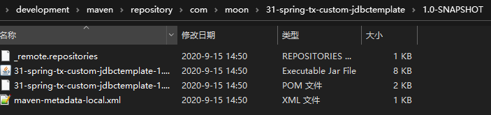
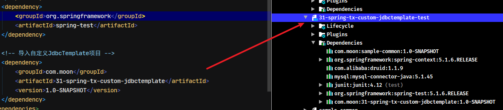
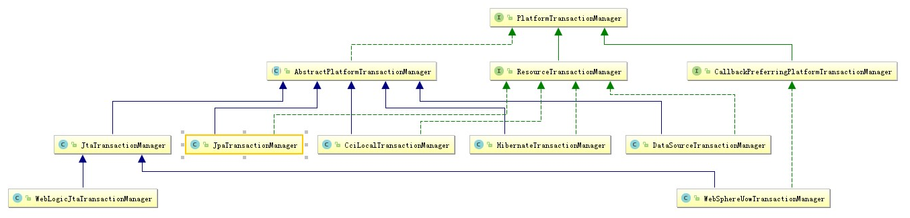
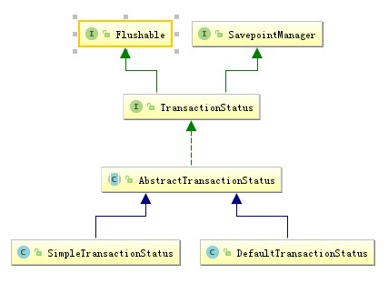
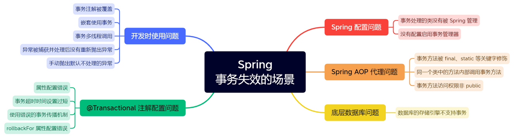
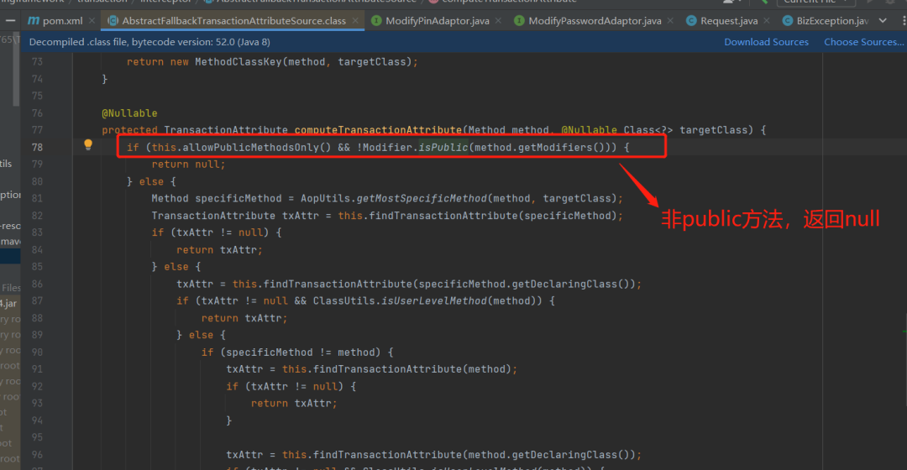
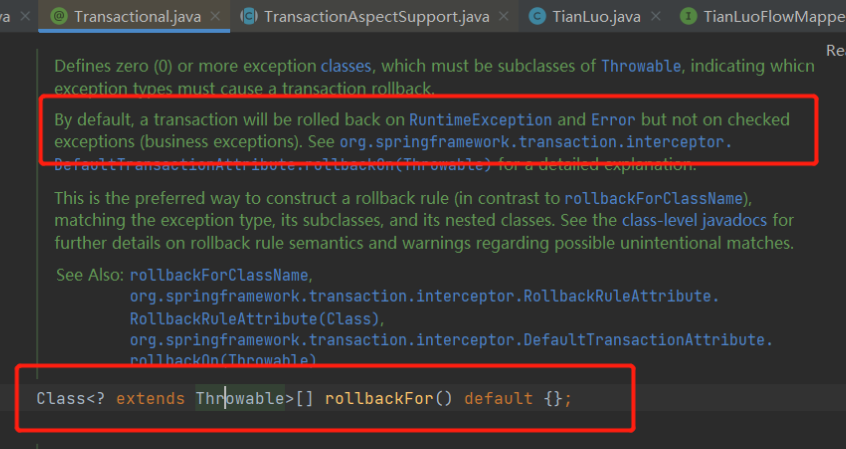
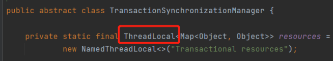

## 1. Spring Transaction（事务）概述

事务是 Web 应用中不可缺少的组件模型，它保证了用户操作的原子性(Atomicity)、一致性(Consistency)、隔离性(Isolation)和持久性(Durabilily)。其中事务又分为本地事务和分布式事务两种。

## 2. Spring 中的 JdbcTemplate

### 2.1. JdbcTemplate 概述

`JdbcTeTemplate` 是 Spring 框架中提供的一个操作持久层的对象，是 Spring 对数据库的操作原始 Jdbc API 对象的简单封装，让开发者在操作数据库时只需关注 SQL 语句和查询结果处理器，即可完成功能（当然，只使用 JdbcTemplate，还不能摆脱持久层实现类的编写）。

在配合 Spring 的 IoC 功能，可以把 `DataSource` 注册到 `JdbcTemplate` 之中。同时利用 Spring 基于 aop 的事务即可完成简单的数据库 CRUD 操作。要使用 JdbcTemlate 需要导入 spring-jdbc 和 spring-tx 两个坐标。其核心 jar 包如下：

- spring-jdbc-x.x.x.RELEASE.jar
- ~~spring-orm-x.x.x.RELEASE.jar~~
- spring-tx-x.x.x.RELEASE.jar（和事务相关的）

#### 2.1.1. 节选源码

```java
package org.springframework.jdbc.core;

/* JdbcTemplate实现了JdbcOperations接口，jdbc相关操作方法都定义在此接口中 */
public class JdbcTemplate extends JdbcAccessor implements JdbcOperations {
    /* 使用默认构造函数构建JdbcTemplate */
	public JdbcTemplate() {
	}
	/* 通过数据源构建JdbcTemplate */
	public JdbcTemplate(DataSource dataSource) {
		setDataSource(dataSource);
		afterPropertiesSet();
	}
	public JdbcTemplate(DataSource dataSource, boolean lazyInit) {
		setDataSource(dataSource);
		setLazyInit(lazyInit);
		afterPropertiesSet();
	}
	// 忽略其他代码
}

// 继承父类JdbcAccessor的方法
/* 当使用默认构造函数构建时，提供了设置数据源的方法 */
public void setDataSource(@Nullable DataSource dataSource) {
	this.dataSource = dataSource;
}
```

> 结论：除了默认构造函数之外，都需要提供一个数据源。既然有 set 方法，就是可以使用依赖注入，在配置文件中配置。

#### 2.1.2. 核心方法说明

JdbcTemplate主 要提供以下五类方法：

- `execute`方法：可以用于执行任何SQL语句，一般用于执行DDL语句
- `update`方法：用于执行新增、修改、删除等语句
- `batchUpdate`方法：用于执行批处理相关语句
- `query`方法及`queryForXxx`方法：用于执行查询相关语句
- `call`方法：用于执行存储过程、函数相关语句

### 2.2. 入门案例

#### 2.2.1. 引入依赖

```xml
<!-- 注：依赖的版本按实际需要，此处省略 -->
<dependencies>
    <!-- spring核心依赖 -->
    <dependency>
        <groupId>org.springframework</groupId>
        <artifactId>spring-context</artifactId>
    </dependency>
    <!-- spring操作持久层依赖 -->
    <dependency>
        <groupId>org.springframework</groupId>
        <artifactId>spring-jdbc</artifactId>
    </dependency>
    <!-- druid数据源 -->
    <dependency>
        <groupId>com.alibaba</groupId>
        <artifactId>druid</artifactId>
    </dependency>
    <!-- mysql驱动 -->
    <dependency>
        <groupId>mysql</groupId>
        <artifactId>mysql-connector-java</artifactId>
    </dependency>
    <dependency>
        <groupId>junit</groupId>
        <artifactId>junit</artifactId>
    </dependency>
    <dependency>
        <groupId>org.springframework</groupId>
        <artifactId>spring-test</artifactId>
    </dependency>
</dependencies>
```

#### 2.2.2. 编写实体类

```java
public class Account implements Serializable {
    private Integer id;
    private String name;
    private Double money;
    // 省略setter/getter...
}
```

#### 2.2.3. 编写配置类、配置文件

- spring核心配置类

```java
@Configuration
// 导入其他模块的配置类
@Import({JdbcConfig.class})
// 导入配置文件（支持类路径方式）
@PropertySource("classpath:jdbc.properties")
public class SpringConfiguration {
}
```

- jdbc配置类

```java
public class JdbcConfig {
    @Value("${jdbc.driver}")
    private String driver;
    @Value("${jdbc.url}")
    private String url;
    @Value("${jdbc.username}")
    private String username;
    @Value("${jdbc.password}")
    private String password;

    /**
     * 创建 DataSource 数据源对象，并注册到ioc容器中
     */
    @Bean("dataSource")
    public DataSource createDataSource() {
        // 1. 创建druid数据源
        DruidDataSource dataSource = new DruidDataSource();
        // 2. 配置数据源相关参数
        dataSource.setDriverClassName(this.driver);
        dataSource.setUrl(this.url);
        dataSource.setUsername(this.username);
        dataSource.setPassword(this.password);
        return dataSource;
    }

    /**
     * 创建 JDBCTemplate 持久层操作对象，并注册到ioc容器中
     */
    @Bean("jdbcTemplate")
    // 方法的入参无论是否加上@Autowired 注解，都会自动注入数据源对象
    public JdbcTemplate createJdbcTemplate(@Autowired DataSource dataSource) {
        return new JdbcTemplate(dataSource);
    }
}
```

- jdbc.properties配置文件

```properties
jdbc.driver=com.mysql.jdbc.Driver
jdbc.url=jdbc:mysql://localhost:3306/tempdb?characterEncoding=utf-8&useSSL=false
jdbc.username=root
jdbc.password=123456
```

#### 2.2.4. 测试方法

```java
@RunWith(SpringJUnit4ClassRunner.class)
@ContextConfiguration(classes = SpringConfiguration.class)
public class SpringJdbcTemplateTest {
    @Autowired
    private JdbcTemplate jdbcTemplate;

    /* 新增测试 */
    @Test
    public void testSave() {
        jdbcTemplate.update("insert into account(name,money)values(?,?)", "敌法师", 6712d);
    }

    /* 更新测试 */
    @Test
    public void testUpdate() {
        jdbcTemplate.update("update account set name=?,money=? where id=?", "敌法师", 23456d, 6);
    }

    /* 删除测试 */
    @Test
    public void testDelete() {
        jdbcTemplate.update("delete from account where id = ?", 6);
    }

    /* 单个数据查找测试 */
    @Test
    public void testFindOne() {
        // 方式一：查询出列表后，再取第一个数据
        BeanPropertyRowMapper<Account> beanPropertyRowMapper = new BeanPropertyRowMapper<>(Account.class);
        List<Account> accountList = jdbcTemplate.query("select * from account where id = ?", beanPropertyRowMapper, 6);
        System.out.println(accountList.isEmpty() ? null : accountList.get(0));

        // 方式二：查询单个对象
        Account account = jdbcTemplate.queryForObject("select * from account where id = ?", new BeanPropertyRowMapper<>(Account.class), 6);
        System.out.println(account);
    }

    /* 根据条件查询数据集合测试 */
    @Test
    public void testQueryForList() {
        /*
         * 查询集合，指定行记录的封装类型
         *   <T> List<T> query(String sql, RowMapper<T> rowMapper, @Nullable Object... args)
         *       第2个参数rowMapper：是指定sql查询后转换的对象类型
         */
        List<Account> accountList = jdbcTemplate.query("select * from account where money > ?", new BeanPropertyRowMapper<>(Account.class), 1400d);
        for (Account account : accountList) {
            System.out.println(account);
        }
        System.out.println("-------------------------------------------");

        /*
         * 查询指定某种类型（单个字段）的集合
         *  <T> List<T> queryForList(String sql, Class<T> elementType, @Nullable Object... args)
         *      第2个参数elementType：是指定sql查询后的数据类型
         */
        List<Double> moneyList = jdbcTemplate.queryForList("select money from account where money > ?", Double.class, 1400d);
        for (Double m : moneyList) {
            System.out.println(m);
        }
        System.out.println("-------------------------------------------");

        /*
         * 查询返回Map类型的集合，不指定类型的时候，返回是一个Map数据结构的集合
         *  List<Map<String, Object>> queryForList(String sql, @Nullable Object... args)
         */
        List<Map<String, Object>> mapList = jdbcTemplate.queryForList("select * from account where money > ?", 1400d);
        for (Map<String, Object> map : mapList) {
            for (Map.Entry<String, Object> entry : map.entrySet()) {
                System.out.println(entry.getKey() + " = " + entry.getValue());
            }
        }
    }

    /* 统计查询测试 */
    @Test
    public void testFindCount() {
        Long total = jdbcTemplate.queryForObject("select count(*) from account where money > ?", Long.class, 1400d);
        System.out.println("查询总记录数：" + total);
    }

    /* 查询所有数据测试 */
    @Test
    public void testFindAll() {
        List<Account> accountList = jdbcTemplate.query("select * from account", new BeanPropertyRowMapper<>(Account.class));
        for (Account account : accountList) {
            System.out.println(account);
        }
    }

    /* 查询数据封装成Map结构集合测试 */
    @Test
    public void testQueryForMap() {
        Map<String, Object> map = jdbcTemplate.queryForMap("select * from account where id = ?", 5d);
        for (Map.Entry entry : map.entrySet()) {
            System.out.println(entry.getKey() + " = " + entry.getValue());
        }
    }

    /* 查询SqlRowSet测试 */
    @Test
    public void testQueryForRowSet() {
        SqlRowSet sqlRowSet = jdbcTemplate.queryForRowSet("select * from account where money > ?", 1400d);
        System.out.println(sqlRowSet);

        // 处理SqlRowSet对象，next()方法判断是否有下一个元素
        while (sqlRowSet.next()) {
            String name = sqlRowSet.getString("name");
            System.out.println(name);
        }
    }
}
```

### 2.3. LobHandler 和 LobCreator

BLOB (binary large object)，二进制大对象，是一个可以存储二进制文件的容器。在计算机中，BLOB常常是数据库中用来存储二进制文件的字段类型。

`LobHandler`就是`JdbcTemplate`用于处理大对象

#### 2.3.1. 示例环境准备

- 创建表

```sql
-- 用户信息表
CREATE TABLE `userinfo` (
  `id` int(11) NOT NULL AUTO_INCREMENT,
  `images` longblob,
  `description` longtext,
  PRIMARY KEY (`id`)
) ENGINE=InnoDB DEFAULT CHARSET=utf8;
```

- 创建实体类

```java
public class Userinfo implements Serializable {
    private Integer id;
    private byte[] images;
    private String description;
    // 省略getter/setter...
}
```

- 修改入门案例中的`JdbcConfig.java`配置类，增加`LobHandler`对象注册到容器中

```java
/**
 * 创建 LobHandler 对象，并注册到ioc容器中
 */
@Bean("lobHandler")
public LobHandler createLobHandler() {
    // 直接创建spring框架的提供的LobHandler实现类
    return new DefaultLobHandler();
}
```

#### 2.3.2. 使用示例

```java
@RunWith(SpringJUnit4ClassRunner.class)
@ContextConfiguration(classes = SpringConfiguration.class)
public class SpringLobHandlerTest {

    @Autowired
    private JdbcTemplate jdbcTemplate;

    @Autowired
    private LobHandler lobHandler;

    /* 存储大对象数据测试 */
    @Test
    public void lobHandlerWriteTest() {
        try {
            // 准备images的字节数组
            Resource resource = new FileSystemResource("E:\\00-Downloads\\6.jpg");
            // 使用spring框架的工具类FileCopyUtils，将文件资源转成字节数组
            byte[] images = FileCopyUtils.copyToByteArray(resource.getFile());

            // 准备description
            String description = "接口类中的方法和属性不要加任何修饰符号（public 也不要加），保持代码的简洁性，并加上有效的 Javadoc 注释。尽量不要在接口里定义变量，如果一定要定义变量，确定与接口方法相关，并且是整个应用的基础常量。\n" +
                    "【参考】枚举类名带上 Enum 后缀，枚举成员名称需要全大写，单词间用下划线隔开。\n" +
                    "说明：枚举其实就是特殊的常量类，且构造方法被默认强制是私有。\n" +
                    "正例：枚举名字为 ProcessStatusEnum 的成员名称：SUCCESS / UNKNOWN_REASON。";

            // 创建userinfo对象
            Userinfo userinfo = new Userinfo();
            userinfo.setImages(images);
            userinfo.setDescription(description);

            // 插入到数据库中
            jdbcTemplate.execute("insert into userinfo(images,description)values(?,?)", new AbstractLobCreatingPreparedStatementCallback(lobHandler) {
                // 此方法用于设置Blob类型与长文本类型
                @Override
                protected void setValues(PreparedStatement ps, LobCreator lobCreator) throws SQLException, DataAccessException {
                    lobCreator.setBlobAsBytes(ps, 1, userinfo.getImages());
                    lobCreator.setClobAsString(ps, 2, userinfo.getDescription());
                }
            });
        } catch (IOException e) {
            e.printStackTrace();
        }

    }

    /* 读取大对象数据测试 */
    @Test
    public void lobHandlerReadTest() {
        // 直接通过JdbcTemplate读取
        Userinfo userinfo1 = jdbcTemplate.queryForObject("select * from userinfo where id = ?", new BeanPropertyRowMapper<>(Userinfo.class), 1);
        System.out.println(userinfo1.getImages());
        System.out.println(userinfo1.getDescription());

        System.out.println("--------------------------");

        // 通过结果集对象处理读取
        Userinfo userinfo2 = jdbcTemplate.query("select * from userinfo where id = ?", new ResultSetExtractor<Userinfo>() {
            @Override
            public Userinfo extractData(ResultSet rs) throws SQLException, DataAccessException {
                Userinfo userinfo = null;
                if (rs.next()) {
                    userinfo = new Userinfo();
                    userinfo.setId(rs.getInt("id"));
                    userinfo.setImages(lobHandler.getBlobAsBytes(rs, "images"));
                    userinfo.setDescription(lobHandler.getClobAsString(rs, "description"));
                }
                return userinfo;
            }
        }, 1);
        System.out.println(userinfo2.getImages());
        System.out.println(userinfo2.getDescription());
    }
}
```

## 3. Spring 中 JDBC 相关类

### 3.1. 概述

在 Spring 中除了提供 `JdbcTeTemplate` 作为操作持久层的对象之外，还提供了以下更多扩展功能的持久层操作类

- ~~SimpleJdbcTemplate~~
- `org.springframework.jdbc.core.namedparam.NamedParameterJdbcTemplate`
- `org.springframework.jdbc.core.simple.SimpleJdbcInsert`
- `org.springframework.jdbc.core.simple.SimpleJdbcCall`

### 3.2. NamedParameterJdbcTemplate

#### 3.2.1. 基本介绍

在经典的 JDBC 用法中，SQL 参数是用占位符 `?` 表示，并且受到位置的限制，定位参数的问题在于一旦参数的顺序发生变化，就必须改变参数绑定。在 Spring JDBC 框架中，绑定 SQL 参数的另一种选择是使用具名参数(named parameter)

**具名参数**：SQL 按名称(以冒号开头)而不是按位置进行指定。具名参数更易于维护，也提升了可读性。具名参数由框架类在运行时用占位符取代

具名参数只在 `NamedParameterJdbcTemplate` 中得到支持。`NamedParameterJdbcTemplate`可以使用全部`jdbcTemplate`方法。

#### 3.2.2. 节选源码

```java
/*
 * 通过观察源码可发现，NamedParameterJdbcTemplate里面封装了一个JdbcTemplate对象
 * 只不过把它看成了接口类型JdbcOperations。
 */
public class NamedParameterJdbcTemplate implements NamedParameterJdbcOperations {
    // 省略其他代码
	/** The JdbcTemplate we are wrapping. */
	/* 将JdbcTemplate再次包装 */
	private final JdbcOperations classicJdbcTemplate;

	/**
	 * Create a new NamedParameterJdbcTemplate for the given {@link DataSource}.
	 * <p>Creates a classic Spring {@link org.springframework.jdbc.core.JdbcTemplate} and wraps it.
	 * @param dataSource the JDBC DataSource to access
	 */
	/* 使用DataSource 构建一个NamedParameterJdbcTemplate */
	public NamedParameterJdbcTemplate(DataSource dataSource) {
		Assert.notNull(dataSource, "DataSource must not be null");
		this.classicJdbcTemplate = new JdbcTemplate(dataSource);
	}

	/**
	 * Create a new NamedParameterJdbcTemplate for the given classic
	 * Spring {@link org.springframework.jdbc.core.JdbcTemplate}.
	 * @param classicJdbcTemplate the classic Spring JdbcTemplate to wrap
	 */
	/* 使用JdbcOperations 构建一个NamedParameterJdbcTemplate */
	public NamedParameterJdbcTemplate(JdbcOperations classicJdbcTemplate) {
		Assert.notNull(classicJdbcTemplate, "JdbcTemplate must not be null");
		this.classicJdbcTemplate = classicJdbcTemplate;
	}
	// 省略其他代码
}
```

#### 3.2.3. 入门案例

> 注：入门案例使用上面JdbcTemplate的基础代码

- 修改入门案例中的`JdbcConfig.java`配置类，增加`NamedParameterJdbcTemplate`对象注册到容器中

```java
/**
 * 创建 NamedParameterJdbcTemplate 对象，并注册到ioc容器中
 */
@Bean("namedParameterJdbcTemplate")
public NamedParameterJdbcTemplate createNamedParameterJdbcTemplate(JdbcTemplate jdbcTemplate) {
    // NamedParameterJdbcTemplate其实就是对JdbcTemplate进行再次封装
    return new NamedParameterJdbcTemplate(jdbcTemplate);
}
```

- 测试代码

```java
@RunWith(SpringJUnit4ClassRunner.class)
@ContextConfiguration(classes = SpringConfiguration.class)
public class SpringNamedParameterJdbcTemplateTest {
    @Autowired
    private NamedParameterJdbcTemplate jdbcTemplate;

    /* 测试查询 */
    @Test
    public void testFind() {
        // 定义sql具名名称的值，key需要与具名名称相对应，与顺序无关
        Map<String, Object> map = new HashMap<>();
        map.put("id", 1);
        // 具名名称，SQL 按名称(以冒号开头)而不是按位置进行指定，这样不会受到以前“?”占位符位置的限制
        Account account = jdbcTemplate.queryForObject("select * from account where id = :id", map, new BeanPropertyRowMapper<>(Account.class));
        System.out.println(account);
    }

    /* 测试根据id查询多个数据 */
    @Test
    public void testFindByIds() {
        // 定义sql具名名称的值，key需要与具名名称相对应，与顺序无关
        Map<String, List<Integer>> map = new HashMap<>();
        List<Integer> list = new ArrayList<>();
        list.add(1);
        list.add(5);
        list.add(7);
        map.put("ids", list);
        // 具名名称，SQL 按名称(以冒号开头)而不是按位置进行指定，这样不会受到以前“?”占位符位置的限制
        List<Account> account = jdbcTemplate.query("select * from account where id in (:ids)", map, new BeanPropertyRowMapper<>(Account.class));
        System.out.println(account);
    }

    /* 测试新增 */
    @Test
    public void testSave() {
        Account account = new Account();
        account.setName("新垣结衣");
        account.setMoney(2222d);
        // bean转成map
        BeanMap beanMap = BeanMap.create(account);
        jdbcTemplate.update("insert into account(name, money) values(:name, :money)", beanMap);
    }
}
```

## 4. JdbcTemplate 的实现原理

### 4.1. 自定义 JdbcTemplate

#### 4.1.1. 创建工程并导入坐标

```xml
<!-- 版本按实际需求来定 -->
<dependencies>
    <!-- druid数据源 -->
    <dependency>
        <groupId>com.alibaba</groupId>
        <artifactId>druid</artifactId>
    </dependency>
    <!-- mysql驱动 -->
    <dependency>
        <groupId>mysql</groupId>
        <artifactId>mysql-connector-java</artifactId>
    </dependency>
</dependencies>
```

#### 4.1.2. 编写自定义JdbcTemplate

```java
public class JdbcTemplate {

    // 定义数据源属性
    private DataSource dataSource;

    // 通过set方法给数据源赋值
    public void setDataSource(DataSource dataSource) {
        this.dataSource = dataSource;
    }

    // 无参构造方法
    public JdbcTemplate() {
    }

    // 通过构造函数给数据源赋值
    public JdbcTemplate(DataSource dataSource) {
        this.dataSource = dataSource;
    }

    /**
     * 定义用于执行SQL增删改的方法
     *
     * @param sql    需要执行的SQL语句
     * @param params 执行SQL语句所需要的参数
     * @return 影响数据库记录的行数
     */
    public int update(String sql, Object... params) {
        // 1. 验证数据源是否为空，没有数据源直接抛出异常
        if (this.dataSource == null) {
            throw new NullPointerException("DataSource can not be null!");
        }

        // 2. 定义jdbc相关操作的对象
        Connection conn = null;
        PreparedStatement pstm = null;
        // 返回值
        int res = 0;

        try {
            // 3. 获取数据库连接对象
            conn = dataSource.getConnection();
            // 4. 获取预处理对象
            pstm = conn.prepareStatement(sql);
            // 5. 获取参数的元信息
            ParameterMetaData metaData = pstm.getParameterMetaData();
            // 6. 从参数的元信息中获取sql域中参数的个数（即占位符（?）的个数）
            int parameterCount = metaData.getParameterCount();
            // 7. 判断sql语句中是否有参数，如有，则校验参数
            if (parameterCount > 0) {
                // 7-1. 判断调用方法时是否提供参数
                if (params == null) {
                    throw new IllegalArgumentException("Parameter can not be null!");
                }
                // 7-2. 判断方法的参数个数是否匹配
                if (params.length != parameterCount) {
                    throw new IllegalArgumentException("Incorrect parameter size: expected " +
                            parameterCount + ", actual " + params.length);
                }
                // 7-3. 参数校验通过，给占位符赋值
                for (int i = 0; i < parameterCount; i++) {
                    pstm.setObject(i + 1, params[i]);
                }
            }
            // 8. 执行sql语句
            res = pstm.executeUpdate();
        } catch (Exception e) {
            e.printStackTrace();
        } finally {
            // 释放连接
            releaseResources(null, pstm, conn);
        }
        return res;
    }

    /**
     * 定义用于执行SQL查询的方法
     *
     * @param sql              需要执行的SQL语句
     * @param resultSetHandler 结果集处理器
     * @param params           执行SQL语句所需要的参数
     * @return 查询的结果集合
     */
    public Object query(String sql, ResultSetHandler resultSetHandler, Object... params) {
        // 1. 验证数据源是否为空，没有数据源直接抛出异常
        if (this.dataSource == null) {
            throw new NullPointerException("DataSource can not be null!");
        }

        // 2. 定义jdbc相关操作的对象
        Connection conn = null;
        PreparedStatement pstm = null;
        // 返回值
        ResultSet rs = null;

        try {
            // 3. 获取数据库连接对象
            conn = dataSource.getConnection();
            // 4. 获取预处理对象
            pstm = conn.prepareStatement(sql);
            // 5. 获取参数的元信息
            ParameterMetaData metaData = pstm.getParameterMetaData();
            // 6. 从参数的元信息中获取sql域中参数的个数（即占位符（?）的个数）
            int parameterCount = metaData.getParameterCount();
            // 7. 判断sql语句中是否有参数，如有，则校验参数
            if (parameterCount > 0) {
                // 7-1. 判断调用方法时是否提供参数
                if (params == null) {
                    throw new IllegalArgumentException("Parameter can not be null!");
                }
                // 7-2. 判断方法的参数个数是否匹配
                if (params.length != parameterCount) {
                    throw new IllegalArgumentException("Incorrect parameter size: expected " +
                            parameterCount + ", actual " + params.length);
                }
                // 7-3. 参数校验通过，给占位符赋值
                for (int i = 0; i < parameterCount; i++) {
                    pstm.setObject(i + 1, params[i]);
                }
            }
            // 8. 执行sql语句
            rs = pstm.executeQuery();
            // 9. 自定义结果处理器，将ResultSet进行处理
            return resultSetHandler.handler(rs);
        } catch (Exception e) {
            e.printStackTrace();
            throw new RuntimeException(e);
        } finally {
            // 释放连接
            releaseResources(rs, pstm, conn);
        }
    }

    /**
     * 释放资源
     *
     * @param rs
     * @param pstm
     * @param conn
     */
    private void releaseResources(ResultSet rs, PreparedStatement pstm, Connection conn) {
        // 关闭ResultSet对象
        if (rs != null) {
            try {
                rs.close();
            } catch (Exception e) {
                e.printStackTrace();
            }
        }
        // 关闭预处理PreparedStatement对象
        if (pstm != null) {
            try {
                pstm.close();
            } catch (Exception e) {
                e.printStackTrace();
            }
        }
        // 关闭数据库连接Connection对象
        if (conn != null) {
            try {
                conn.close();
            } catch (Exception e) {
                e.printStackTrace();
            }
        }
    }
}
```

### 4.2. 自定义结果集处理器

#### 4.2.1. 定义接口

```java
/**
 * 结果集的处理器
 */
public interface ResultSetHandler<T> {
    /**
     * 处理结果集方法
     */
    Object handler(ResultSet resultSet);
}
```

#### 4.2.2. 编写不同的实现

- 单个对象结果处理实现

```java
public class BeanHandler<T> implements ResultSetHandler {
    // 定义数据封装实体类型字节码对象
    private final Class<T> requiredType;

    // 定义有参构造函数，覆盖默认无参构造。当创建BeanHandler对象时，就需要提供封装到的实体类类型字节码
    public BeanHandler(Class<T> requiredType) {
        this.requiredType = requiredType;
    }

    @Override
    public Object handler(ResultSet resultSet) {
        // 1. 定义返回值
        T bean;
        try {
            // 2. 判断结果集有值（由于是查询一个，所以只需判断rs能往下走，不用while循环即可）
            if (resultSet.next()) {
                // 3. 实例化返回值对象
                bean = requiredType.newInstance();
                // 4. 获取结果集的元信息
                ResultSetMetaData metaData = resultSet.getMetaData();
                // 5. 获取结果集的列数
                int columnCount = metaData.getColumnCount();
                // 6. 遍历结果集列个数
                for (int i = 0; i < columnCount; i++) {
                    // 7. 取出列的标题
                    String columnLabel = metaData.getColumnLabel(i + 1);
                    // 8. 根据当前列标题，获取对应的数据内容
                    Object value = resultSet.getObject(columnLabel);
                    // 9. 借助java的内省机制，创建实体类的属性描述器，使用内省填充对象数据
                    PropertyDescriptor propertyDescriptor = new PropertyDescriptor(columnLabel, requiredType);
                    // 10. 获取属性的写方法
                    Method method = propertyDescriptor.getWriteMethod();
                    // 11. 执行方法，填充数据
                    method.invoke(bean, value);
                }
            }
        } catch (Exception e) {
            e.printStackTrace();
        }
        // 返回封装后对象
        return bean;
    }
}
```

- 集合结果处理实现

```java
public class BeanListHandler<T> implements ResultSetHandler {
    // 定义数据封装实体类型字节码对象
    private final Class<T> requiredType;

    // 定义有参构造函数，覆盖默认无参构造。当创建BeanHandler对象时，就需要提供封装到的实体类类型字节码
    public BeanListHandler(Class<T> requiredType) {
        this.requiredType = requiredType;
    }

    @Override
    public Object handler(ResultSet resultSet) {
        // 1. 定义返回值
        List<T> list = new ArrayList<>();
        T bean;

        try {
            // 2. 循环结果集
            while (resultSet.next()) {
                // 3. 实例化返回值对象
                bean = requiredType.newInstance();
                // 4. 获取结果集的元信息
                ResultSetMetaData metaData = resultSet.getMetaData();
                // 5. 获取结果集的列数
                int columnCount = metaData.getColumnCount();
                // 6. 遍历结果集列个数
                for (int i = 0; i < columnCount; i++) {
                    // 7. 取出列的标题
                    String columnLabel = metaData.getColumnLabel(i + 1);
                    // 8. 根据当前列标题，获取对应的数据内容
                    Object value = resultSet.getObject(columnLabel);
                    // 9. 借助java的内省机制，创建实体类的属性描述器，使用内省填充对象数据
                    PropertyDescriptor propertyDescriptor = new PropertyDescriptor(columnLabel, requiredType);
                    // 10. 获取属性的写方法
                    Method method = propertyDescriptor.getWriteMethod();
                    // 11. 执行方法，填充数据
                    method.invoke(bean, value);
                }
                // 12. 把填充好的bean封装到集合中
                list.add(bean);
            }
        } catch (Exception e) {
            e.printStackTrace();
        }
        // 返回结果集合
        return list;
    }
}
```

### 4.3. 测试

#### 4.3.1. 打包自定义JdbcTemplate项目到本地仓库（非必须）




> **注：如果测试工程与自定义JdbcTemplate工程在同一个project里，则直接引入依赖即可**

#### 4.3.2. 创建测试工程并导入自定义JdbcTemplate项目的依赖

```xml
<!-- 版本按实际需求来定 -->
<dependencies>
    <!-- spring核心依赖 -->
    <dependency>
        <groupId>org.springframework</groupId>
        <artifactId>spring-context</artifactId>
    </dependency>
    <!-- druid数据源 -->
    <dependency>
        <groupId>com.alibaba</groupId>
        <artifactId>druid</artifactId>
    </dependency>
    <!-- mysql驱动 -->
    <dependency>
        <groupId>mysql</groupId>
        <artifactId>mysql-connector-java</artifactId>
    </dependency>
    <dependency>
        <groupId>junit</groupId>
        <artifactId>junit</artifactId>
    </dependency>
    <dependency>
        <groupId>org.springframework</groupId>
        <artifactId>spring-test</artifactId>
    </dependency>

    <!-- 导入自定义JdbcTemplate项目 -->
    <dependency>
        <groupId>com.moon</groupId>
        <artifactId>31-spring-tx-custom-jdbctemplate</artifactId>
        <version>1.0-SNAPSHOT</version>
    </dependency>
</dependencies>
```



#### 4.3.3. 实体类、配置类、配置文件

> 注：实体类（Account.java）、配置文件（jdbc.properties）、核心配置类（SpringConfiguration.java）均复用上面JdbcTemplate快速入门的代码即可

```java
/** JDBC 配置类 */
public class JdbcConfig {
    @Value("${jdbc.driver}")
    private String driver;
    @Value("${jdbc.url}")
    private String url;
    @Value("${jdbc.username}")
    private String username;
    @Value("${jdbc.password}")
    private String password;

    /**
     * 创建 DataSource 数据源对象，并注册到ioc容器中
     */
    @Bean("dataSource")
    public DataSource createDataSource() {
        // 1. 创建druid数据源
        DruidDataSource dataSource = new DruidDataSource();
        // 2. 配置数据源相关参数
        dataSource.setDriverClassName(driver);
        dataSource.setUrl(url);
        dataSource.setUsername(username);
        dataSource.setPassword(password);
        return dataSource;
    }

    /**
     * 创建自定义的 JDBCTemplate 持久层操作对象，并注册到ioc容器中
     */
    @Bean("jdbcTemplate")
    public JdbcTemplate createJdbcTemplate(DataSource dataSource) {
        return new JdbcTemplate(dataSource);
    }
}
```

### 4.4. 番外 - 策略模式

策略模式（Strategy Pattern）也叫政策模式（Policy Pattern）。指的是对象具备某个行为，但是在不同的场景中，该行为有不同的实现。例如：动态代理就是一个经典的策略模式，谁用谁实现。

策略模式的应用场景非常广泛，通常情况下，需要两个条件：

1. 数据已经有了。
2. 目的明确。

在满足这两个条件下，达成目标的过程就是策略。通常这个达成目标的过程有使用者自己实现。因为每个需求场景不一样，只有当前使用者最清楚当前的需求。

策略模式是面向接口编程思想的具体体现，通常情况下，作为设计者会暴露出来一个接口，同时可以提供一些接口实现，也可以不提供，而让使用者根据具体情况去编写具体实现代码。以达到灵活的扩展目的。

## 5. Spring 中的事务控制

- 第一：JavaEE 体系进行分层开发，事务处理位于业务层，Spring 提供了分层设计业务层的事务处理解决方案
- 第二：Spring 框架提供了一组事务控制的接口。这组接口是在spring-tx-4.2.4.RELEASE.jar中
- 第三：Spring 的事务控制都是基于 AOP 的，它既可以使用编程的方式实现，也可以使用声明式（基于xml配置文件与注解方式）实现。**学习重点是使用配置的方式实现**。

### 5.1. Spring 事务机制的实现方式

Spring 事务机制主要包括<u>**声明式事务**</u>和<u>**编程式事务**</u>两种方式。

- **编程式事务管理**，直接使用 `TransactionTemplate` 或者底层的 `PlatformTransactionManager` 进行事务的控制。对于编程式事务管理，Spring 推荐使用 `TransactionTemplate`。
- **声明式事务管理**，建立在 AOP 之上的。其本质是对方法前后进行拦截，然后在目标方法开始之前创建或者加入一个事务，在执行完目标方法之后根据执行情况提交或者回滚事务。声明式事务最大的优点就是，不需要像编程的方式管理事务，要在业务逻辑代码中掺杂事务管理的代码，来处理获得连接、关闭连接、事务提交和回滚等这些操作。只需做相关的事务规则声明，便可以将事务规则应用到业务逻辑中。声明式事务管理有以下两种常用的方式：
    - 基于 tx 和 aop名 字空间的 xml 配置文件
    - 基于`@Transactional`注解（*显然基于注解的方式更简单易用，更清爽*）

**总结**：

1. 显然声明式事务管理要优于编程式事务管理，这正是 Spring 推荐的<u>**非侵入式**</u>的开发方式。声明式事务管理使业务代码不受污染，一个普通的 POJO 对象，只要加上注解就可以获得完全的事务支持。
2. 和编程式事务相比，<u>声明式事务唯一不足地方是，后者的最细粒度只能作用到方法级别，无法做到像编程式事务那样可以作用到代码块级别</u>。但是即便有这样的需求，也存在很多变通的方法，比如，可以将需要进行事务管理的代码块独立为方法等等。

### 5.2. Spring 中事务控制的 API

- `PlatformTransactionManager`：平台事务管理接口
- `TransactionDefinition`：事务定义接口
- `TransactionStatus`：事务状态接口

### 5.3. PlatformTransactionManager 接口和它的实现类

#### 5.3.1. 接口作用

此接口是Spring的事务管理器核心接口。Spring本身并不支持事务实现，只是负责提供标准，应用底层支持什么样的事务，需要提供具体实现类。此处也是策略模式的具体应用。

在Spring框架中，也内置了一些具体策略，`PlatformTransactionManager` 接口中常用的实现类如下：

- `DataSourceTransactionManager`**（重点）**：使用SpringJDBC或iBatis进行持久化数据时使用
- `HibernateTransactionManager`**（重点）**：使用Hibernate3.0版本以上进行持久化数据时使用
- `JpaTransactionManager`：使用JPA进行持久化时使用
- `JtaTransactionManager`：使用JTA实现管理事务，在一个事务跨越多个资源时必须使用
- `JdoTransactionManager`：当持久化机制是Jdo时使用

> 注：`JpaTransactionManager` 和 `HibernateTransactionManager` 事务管理器在`spring-orm`包中

#### 5.3.2. 类视图



#### 5.3.3. 接口主要方法说明

- 获取事务状态信息

```java
TransactionStatus getTransaction(@Nullable TransactionDefinition definition) throws TransactionException;
```

- 提交事务

```java
void commit(TransactionStatus status) throws TransactionException;
```

- 回滚事务

```java
void rollback(TransactionStatus status) throws TransactionException;
```

### 5.4. TransactionDefinition 接口

#### 5.4.1. 接口作用

`org.springframework.transaction.TransactionDefinition` 接口是 Spring 中事务可控属性的顶层接口，里面定义了事务的一些属性以及获取属性的方法。例如：事务的传播行为，事务的隔离级别，事务的只读，事务的超时等等。

通常情况下，在开发中都可以配置这些属性，以求达到最佳效果。配置的方式支持xml和注解。

#### 5.4.2. 类视图


#### 5.4.3. 接口常用方法说明

- 获取事务传播行为

```java
int getPropagationBehavior();
```

- 获取事务隔离级别

```java
int getIsolationLevel();
```

- 获取事务超时时间

```java
int getTimeout();
```

- 获取事务是否只读

```java
boolean isReadOnly();
```

- 获取事务对象名称

```java
@Nullable
String getName();
```

#### 5.4.4. 事务的传播行为

Spring 事务的传播行为是指，当多个事务同时存在的时候，Spring 如何处理这些事务的行为。主要有以下几种：

- `PROPAGATION_REQUIRED`：（默认值）如果当前没有事务，则新建一个事务；如果已经存在一个事务中，加入到这个事务中。如果嵌套调用的两个方法都加了事务注解，并且运行在相同线程中，则这两个方法使用相同的事务；如果运行在不同线程中，则会开启新的事务。
- `PROPAGATION_SUPPORTS`：使用当前的事务；如果当前没有事务，就以非事务方式执行（没有事务）
- `PROPAGATION_MANDATORY`：使用当前的事务；如果当前没有事务，就抛出异常`IllegalTransactionStateException`
- `PROPAGATION_REQUIRES_NEW`：无论当前存不存在事务，都创建新事务。（*如果当前在事务中，把当前事务挂起？待确认*）需要使用 `JtaTransactionManager` 作为事务管理器。
- `PROPAGATION_NOT_SUPPORTED`：总是以非事务方式执行操作；如果当前存在事务，则把当前事务挂起。需要使用 `JtaTransactionManager` 作为事务管理器。
- `PROPAGATION_NEVER`：总是以非事务方式运行；如果当前存在事务，抛出异常
- `PROPAGATION_NESTED`：如果当前存在事务，则在嵌套事务内执行；如果当前没有事务，则执行 `PROPAGATION_REQUIRED` 类似的操作。嵌套事务是外部事务的一部分，可以在外部事务提交或回滚时部分提交或回滚。

以上常量定义在 `org.springframework.transaction.TransactionDefinition` 接口中，源码节选如下：

```java
public interface TransactionDefinition {
    /* REQUIRED:如果当前没有事务，就新建一个事务，如果已经存在一个事务中，加入到这个事务中。一般的选择（默认值） */
    int PROPAGATION_REQUIRED = 0;
    /* SUPPORTS:支持当前事务，如果当前没有事务，就以非事务方式执行（没有事务） */
    int PROPAGATION_SUPPORTS = 1;
    /* MANDATORY：使用当前的事务，如果当前没有事务，就抛出异常 */
    int PROPAGATION_MANDATORY = 2;
    /* REQUERS_NEW:新建事务，如果当前在事务中，把当前事务挂起 */
    int PROPAGATION_REQUIRES_NEW = 3;
    /* NOT_SUPPORTED:以非事务方式执行操作，如果当前存在事务，就把当前事务挂起 */
    int PROPAGATION_NOT_SUPPORTED = 4;
    /* NEVER:以非事务方式运行，如果当前存在事务，抛出异常 */
    int PROPAGATION_NEVER = 5;
    /* NESTED:如果当前存在事务，则在嵌套事务内执行。如果当前没有事务，则执行REQUIRED类似的操作 */
    int PROPAGATION_NESTED = 6;
    // ...省略
}
```

**`PROPAGATION_NESTED` 与 `PROPAGATION_REQUIRES_NEW` 的区别**:

- 使用 `PROPAGATION_REQUIRES_NEW` 时，内层事务与外层事务是两个独立的事务。一旦内层事务进行了提交后，外层事务不能对其进行回滚。两个事务互不影响。
- 使用 `PROPAGATION_NESTED` 时，外层事务的回滚可以引起内层事务的回滚。而内层事务的异常并不会导致外层事务的回滚，它是一个真正的嵌套事务。

Spring 较新版本的 `@Transactional` 注解的 `propagation` 属性值已换成 `Propagation` 枚举。

```java
public @interface Transactional {
    Propagation propagation() default Propagation.REQUIRED;
    // ...省略
}
```

`org.springframework.transaction.annotation.Propagation` 枚举值（*与 `TransactionDefinition` 的名称一样*）如下：

```java
public enum Propagation {
    REQUIRED(0),
    SUPPORTS(1),
    MANDATORY(2),
    REQUIRES_NEW(3),
    NOT_SUPPORTED(4),
    NEVER(5),
    NESTED(6);
    // ...省略
}
```

#### 5.4.5. 事务的隔离级别（接口的常量属性）

事务隔离级别反映事务提交并发访问时的处理态度。Spring 有五大隔离级别，默认值为 `ISOLATION_DEFAULT`（使用数据库的设置），其他四个隔离级别和数据库的隔离级别一致：

|          事务隔离级别          |                                                      说明                                                       |
| :--------------------------: | --------------------------------------------------------------------------------------------------------------- |
|     `ISOLATION_DEFAULT`      | 事务的隔离级别默认值，当取值-1时，会采用下面的4个值其中一个。(使用底层数据库的设置隔离级别，不同数据库的默认隔离级别不一样)        |
| `ISOLATION_READ_UNCOMMITTED` | 事务隔离级别为：读未提交。执行效率最高，但什么错误情况也无法避免                                                          |
|  `ISOLATION_READ_COMMITTED`  | 事务隔离级别为：读已提交。可以防止脏读的发生，但是无法防止不可重复读和幻读的发生(Oracle默认级别)                              |
| `ISOLATION_REPEATABLE_READ`  | 事务隔离级别为：可重复读（是否读取其他事务提交修改后的数据）。可以防止脏读和不可重复读的发生，但是无法防住幻读的发生(MySQL默认级别) |
|   `ISOLATION_SERIALIZABLE`   | 事务隔离级别为：串行化。此时所有错误情况均可防止，但是由于事务变成了独占模式（排他模式），因此效率最低                           |

源码节选：

```java
public interface TransactionDefinition {

    int ISOLATION_DEFAULT = -1;
    int ISOLATION_READ_UNCOMMITTED = 1;
    int ISOLATION_READ_COMMITTED = 2;
    int ISOLATION_REPEATABLE_READ = 4;
    int ISOLATION_SERIALIZABLE = 8;
    // ...省略
}
```

#### 5.4.6. 超时时间

<font color=red>**默认值是-1，没有超时限制**</font>。如果有，以秒为单位进行设置

```java
int TIMEOUT_DEFAULT = -1;
```

#### 5.4.7. 是否是只读事务

建议<font color=red>**查询时设置为只读**</font>。属性`Reonly`，取值如下：

- `true`：只读，只用于查询
- `false`：不只读，用于增删改

### 5.5. TransactionStatus 接口

#### 5.5.1. 接口作用

`org.springframework.transaction.TransactionStatus` 接口是事务运行状态表示的顶层接口，里面定义着获取事务运行状态的一些方法。包含有6个具体的操作

```java
public interface TransactionStatus extends TransactionExecution, SavepointManager, Flushable
```

#### 5.5.2. 类视图



#### 5.5.3. 接口主要方法说明

- 是否一个新的事务

```java
boolean isNewTransaction();
```

- 是否包含存储点

```java
boolean hasSavepoint();
```

- 设置事务回滚

```java
void setRollbackOnly();
```

- 是否是只回滚事务

```java
boolean isRollbackOnly();
```

- 刷新事务

```java
@Override
void flush();
```

- 事务是否已经完成(标识就是提交或者回滚了)

```java
boolean isCompleted();
```

## 6. Spring 事务扩展知识

### 6.1. Spring 事务不生效的场景

在某些情况下，Spring 的事务会失效。



1. 使用 `@Transactional` 注解标识的方法所在的类，没有让 Spring 管理。因为 Spring 事务是由 AOP 机制实现的，也就是说从 Spring IOC 容器获取 bean 时，Spring 会为目标类创建代理，从而支持事务的。
2. 没有在 Spring 配置文件（或者配置类）中启用事务管理器。<font color=red>**注：如果是 Spring Boot 项目，它默认会自动配置事务管理器并开启事务支持**</font>。

```java
@Configuration
public class AppConfig {
    @Bean
    public PlatformTransactionManager transactionManager() {
        return new DataSourceTransactionManager(dataSource());
    }
}
```

3. 事务方法被 `final` 或 `static` 关键字修饰，则该方法不能被子类重写，即无法在该方法上进行动态代理，导致 Spring 无法生成事务代理对象来管理事务。

```java
@Service
public class OrderServiceImpl implements OrderService {
    @Transactional
    public final void addOrder(Order order) {
         // do something...
    }
}
```

4. 同一个类中，方法内部调用 `@Transactional` 注解标识的事务方法。事务是通过 Spring AOP 代理来实现的，而在同一个类中通过一个普通方法调用事务方法时，实际是通过当前类对象（`this`）直接调用事务方法的代码，而不是通过代理类进行调用。即以下代码，调用目标 `executeAddOrder` 方法不是通过代理类进行的，因此事务不生效。

```java
@Service
public class OrderServiceImpl implements OrderService {
	@Override
	public void addOrder(Order order) {
		// 调用内部的事务方法
		this.executeAddOrder(order);
	}

	@Transactional
	public void executeAddOrder(Order order) {
		// 执行一系列数据库操作
	}
}
```

> 解决方案：将事务定义在另一个类中，再通过注入该类来调用事务方法；或者在 `OrderServiceImpl` 中注入自己，调用注入实例对象来调用事务方法；又或者通过 `AopContext.currentProxy()` 获取代理对象。

5. 事务方法的访问权限非 `public`。

```java
@Transactional
private void addOrder(Order order) {
    // do something...
}
```

因为 Spring 事务本质就是动态代理，而代理的事务方法非 `public` 权限时，源码中 `computeTransactionAttribute()` 就会返回 null，即此时事务属性不存在。以下是 `AbstractFallbackTransactionAttributeSource` 类的源码：



6. 数据库的存储引擎不支持事务。例如，在 MySQL 中，MyISAM 存储引擎是不支持事务的，InnoDB 引擎才支持事务。因此开发阶段设计表的时要正确选择支持事务的存储引擎。
7. 配置错误的 `@Transactional` 注解。例如，在需要更新的事务方法中，设置注解属性 `readOnly=true`，这表示是一个只读事务，因此在更新操作时会抛出异常。

```java
@Transactional(readOnly = true)
public void updateUser(User user) {
    userDao.updateUser(user);
}
```

8. 事务超时时间设置过短。例如，将 `@Transactional` 注解的 `timeout` 属性设置为 1，这就意味着如果事务在 1 秒内无法完成，则报事务超时异常。

```java
@Transactional(timeout = 1)
public void doSomething() {
    //...
}
```

9. 设置错误的事务传播机制。例如，设置 `propagation` 属性为 `Propagation.NOT_SUPPORTED`，此传播特性是不支持事务。

```java
@Transactional(propagation = Propagation.NOT_SUPPORTED)
public void addOrder(Order order) {
	// 执行一系列数据库操作
}
```

10. `@Transactional` 注解的 `rollbackFor` 属性配置错误。`rollbackFor` 属性指定的异常必须是 `Throwable` 或者其子类。默认情况下，`RuntimeException` 和 `Error` 两种异常都是会自动回滚的。但如下例中，指定了 `rollbackFor = Error.class`，但是抛出的异常却是 `Exception`，而 `Exception` 和 `Error` 没有任何什么继承关系，因此事务就不生效。

```java
@Transactional(rollbackFor = Error.class)
public void addOrder(Order order) throws Exception {
	// 执行一系列数据库操作，模拟异常抛出
	throw new Exception();
}
```

详见 `Transactional` 的源码：



11. 事务注解被覆盖导致事务失效。如下例中，当调用 `MyServiceNew` 的 `doSomething()` 方法时，由于子类方法覆盖了 `doSomething()` 方法，并且子类的 `@Transactional` 注解使用了不同的传播行为（`REQUIRES_NEW`）覆盖了父类 `MyService` 的注解，Spring 框架将不会在父类的方法中启动事务。因此，当 `MyRepository` 的 `save()` 方法被调用时，事务将不会被启动，进行的数据库操作也不会回滚。这将导致数据不一致的问题。

```java
public interface MyRepository {
	@Transactional
	void save(String data);
}

public class MyRepositoryImpl implements MyRepository {
	@Override
	public void save(String data) {
		// 数据库操作
	}
}

public class MyService {
	@Autowired
	private MyRepository myRepository;

	@Transactional
	public void doSomething(String data) {
		myRepository.save(data);
	}
}

public class MyServiceNew extends MyService {
	@Transactional(propagation = Propagation.REQUIRES_NEW)
	public void doSomething(String data) {
		super.doSomething(data);
	}
}
```

12. 嵌套事务。

```java
@Service
public class OrderService {
	@Autowired
	private FlowService flowService;
	@Autowired
	private OrderMapper orderMapper;

	@Transactional
	public void addOrder(Order order, Flow flow) throws Exception {
		orderMapper.save(order);
		flowService.saveFlow(flow);
	}
}

@Service
public class FlowService {
	@Autowired
	private FlowMapper flowMapper;

	@Transactional(propagation = Propagation.NESTED)
	public void saveFlow(Flow flow) {
		flowMapper.save(flow);
		throw new RuntimeException();
	}
}
```

以上代码使用了嵌套事务，如果 `saveFlow` 出现运行时异常，会继续往上抛到外层 `addOrder` 的方法，导致 `orderMapper.save` 也会回滚。如果不想因为被内部嵌套的事务影响，可以用 try-catch 包住，如下：

```java
@Transactional
public void addOrder(Order order, Flow flow) throws Exception {
	orderMapper.save(order);
	try {
		flowService.saveFlow(flow);
	} catch (Exception e) {
		log.error("save flow fail,message:{}", e.getMessage());
	}
}
```

13. 事务多线程调用。因为 Spring 事务是基于线程绑定的，每个线程都有自己的事务上下文，而多线程环境下可能会存在多个线程共享同一个事务上下文的情况，导致事务不生效。

```java
@Service
public class OrderService {
	@Autowired
	private FlowService flowService;
	@Autowired
	private OrderMapper orderMapper;

	@Transactional
	public void addOrder(Order order, Flow flow) throws Exception {
		orderMapper.save(order);
		// 多线程调用
		new Thread(() -> {
			flowService.saveFlow(flow);
		}).start();
	}
}

@Service
public class FlowService {
	@Autowired
	private FlowMapper flowMapper;

	@Transactional
	public void saveFlow(Flow flow) {
		flowMapper.save(flow);
	}
}
```

在 Spring 事务管理器中，通过 `TransactionSynchronizationManager` 类来管理事务上下文。该类内部维护了一个线程本地变量 `ThreadLocal` 对象，用来存储当前线程的事务上下文，实现线程安全。在事务开始时，`TransactionSynchronizationManager` 会将事务上下文绑定到当前线程的 `ThreadLocal` 对象中，当事务结束时，就会将事务上下文从 `ThreadLocal` 对象中移除。源码节选如下：



14. 事务中的异常被捕获并处理了，没有重新抛出被正确地传播回事务管理器，事务将无法回滚。

```java
@Service
public class OrderService {
	@Autowired
	private FlowMapper flowMapper;
	@Autowired
	private OrderMapper orderMapper;

	@Transactional
	public void addOrder(Order order, Flow flow) throws Exception {
		try {
			orderMapper.save(order);
			flowMapper.save(flow);
		} catch (Exception e) {
			log.error("add order fail,message:{}", e.getMessage());
		}
	}
}
```

在 `TransactionAspectSupport` 抽象类的 `invokeWithinTransaction` 方法中，当Spring 捕获到 `Throwable` 异常的时候，就会调用 `completeTransactionAfterThrowing()` 方法进行事务回滚的逻辑。但是在上面示例中 `OrderService` 类的事务方法 `addOrder` 中，直接把异常 catch 后，并没有重新 throw 出来，因此 Spring 自然就 catch 不到异常，因此事务回滚的逻辑不会执行，事务失效。以下是部分关键源码：

```java
public abstract class TransactionAspectSupport implements BeanFactoryAware, InitializingBean {

	// 这方法会省略部分代码，只留关键代码
	@Nullable
	protected Object invokeWithinTransaction(Method method, @Nullable Class<?> targetClass, final InvocationCallback invocation) throws Throwable {

		if (txAttr == null || !(ptm instanceof CallbackPreferringPlatformTransactionManager)) {

			TransactionInfo txInfo = createTransactionIfNecessary(ptm, txAttr, joinpointIdentification);
			Object retVal;
			try {
				// Spring AOP中MethodInterceptor接口的一个方法，它允许拦截器在执行被代理方法之前和之后执行额外的逻辑。
				retVal = invocation.proceedWithInvocation();
			} catch (Throwable ex) {
				// 用于在发生异常时完成事务(如果Spring catch不到对应的异常的话，就不会进入回滚事务的逻辑)
				completeTransactionAfterThrowing(txInfo, ex);
				throw ex;
			} finally {
				cleanupTransactionInfo(txInfo);
			}

			// 用于在方法正常返回后提交事务。
			commitTransactionAfterReturning(txInfo);
			return retVal;
		}
	}
}
```

15. 抛出 Spring 默认不处理的异常。因为 Spring 的 `@Transactional` 注解为事务范围的方法中，默认事务的回滚仅仅对于 unchecked 的异常有效，对于 checked 异常无效。即事务回滚仅仅发生在出现 `RuntimeException` 或 `Error` 的时候，对于普通的 `Exception` 不会回滚。例如，代码中出现的空指针等异常，会被回滚；而文件读写、网络超时问题等，Spring 就没法回滚了。但可以通过 `rollbackFor` 属性指定回滚的异常类型，例如，`@Transactional(rollbackFor = Exception.class)`。

```java
@Transactional
public void addOrder(Order order, Flow flow) throws Exception {
	orderMapper.save(order);
	flowMapper.save(flow);
	throw new Exception();
}
```
