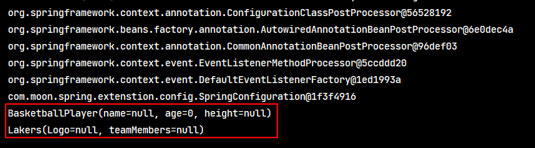

## 1. （策略模式）一个接口多个实现类，如何根据外部条件来实时替换具体实现类

- 涉及的ApplicationContext的方法，语法如下：

```java
<T> Map<String, T> getBeansOfType(Class<T> var1) throws BeansException;
```

- 该方法用于获取 Spring 容器中指定类型的所有 JavaBean 对象。
	1. 传入一个接口的Class 类型，获取这个class 的所有具体实现，不包括抽象类
	2. 还可以将 applicationContext 单独设置一个值，写成一个工具类，结合ApplicationContext 类的其他方法，比如: getBean(String var1)

### 1.1. 案例1：网络资料案例（待整理与优化）

#### 1.1.1. 需求

定义了一个接口，来对外提供服务，这个接口下的方法不能随便改变，而接口有一系列实现，且实现还在不断添加，如何在传入外部不同的条件下，实现实时更换接口的实现类

#### 1.1.2. 实现步骤

1. 任何类实现 ApplicationContextAware 接口，实现setApplicationContext 方法，就会在启动时，向实现类的实现方法注入applicationContext对象。定义工具类，使用枚举，将所有实现类使用map进行封装

```java
package com.util;

import com.service.TestService;
import org.springframework.beans.BeansException;
import org.springframework.beans.factory.annotation.Configurable;
import org.springframework.context.ApplicationContext;
import org.springframework.context.ApplicationContextAware;
import org.springframework.stereotype.Component;

import java.util.HashMap;
import java.util.Map;

@Component
public class TestServiceFactory implements ApplicationContextAware {

    private static Map<TypeEnum, TestService> testServiceMap;

    @Override
    public void setApplicationContext(ApplicationContext applicationContext) throws BeansException {
        Map<String,TestService> map = applicationContext.getBeansOfType(TestService.class);
        testServiceMap = new HashMap<>();
        map.forEach((key,value) -> testServiceMap.put(value.getCode(),value));
    }

    public TestService getTestService(TypeEnum typeEnum) {
        return testServiceMap.get(typeEnum);
    }
}
```

2. 可以在接口中加一个getCode方法,实现类实现这个方法,然后返回一个定义的枚举类型,然后将getBeansOfType获得map进行转换
- 定义枚举

```java
package com.util;

public enum TypeEnum {
    impl1,
    impl2
}
```

- 定义接口

```java
package com.service;

import com.util.TypeEnum;
import org.springframework.stereotype.Service;

@Service
public interface TestService {
    public TypeEnum getCode();
    public String test();
}
```

- 定义对应类型的实现类

```java
package com.service.impl;

import com.service.TestService;
import com.util.TypeEnum;
import org.springframework.stereotype.Service;

@Service
public class TestServiceImpl1 implements TestService {
    @Override
    public TypeEnum getCode() {
        return TypeEnum.impl1;
    }

    @Override
    public String test() {
        return this.toString();
    }
}


package com.service.impl;

import com.service.TestService;
import com.util.TypeEnum;
import org.springframework.context.annotation.Primary;
import org.springframework.stereotype.Service;

@Service
public class TestServiceImpl2  implements TestService {
    @Override
    public TypeEnum getCode() {
        return TypeEnum.impl2;
    }

    @Override
    public String test() {
        return this.toString();
    }
}
```

- 定义controller类

```java
package com.controller;

import com.util.TestServiceFactory;
import com.util.TypeEnum;
import org.springframework.beans.factory.annotation.Autowired;
import org.springframework.stereotype.Controller;
import org.springframework.web.bind.annotation.RequestMapping;
import org.springframework.web.bind.annotation.ResponseBody;
import com.service.TestService;

import javax.servlet.http.HttpServletRequest;
import javax.servlet.http.HttpServletResponse;

@Controller
@RequestMapping("test")
public class TestController {

    @Autowired
    TestServiceFactory testServiceFactory;

    private TestService testService;

    @ResponseBody
    @RequestMapping("test")
        public String test(HttpServletRequest request, HttpServletResponse response){
        String type = request.getParameter("type");
        testService = getTestService(type);
        return testService.test();
    }

    public TestService getTestService(String type) {
        TypeEnum typeEnum = null;
        if(type.equals("1")) typeEnum = TypeEnum.impl1;
        if(type.equals("2")) typeEnum = TypeEnum.impl2;
        return testServiceFactory.getTestService(typeEnum);
    }
}
```

### 1.2. 案例2：个人项目MoonSystem项目
#### 1.2.1. 需求

定义一个公共查询数据字典查询接口，该接口有多个不同的实现类，根据请求参数中字典类型，调用不同的实现类中的查询不同的数据转换成数据字典返回

#### 1.2.2. 实现步骤

1. 定义字典枚举类，设置类型字符串值

```java
package com.moon.system.common.enums;

/**
 * 数据字典类型枚举
 */
public enum DictType {

    JAV_CATEGORY("JAV_CATEGORY"), JAV_STORAGE("JAV_STORAGE");

    private String type;

    DictType(String type) {
        this.type = type;
    }
}
```

2. 自定义数据字典注解，用于标签查询字典接口的相关实现类的名称

```java
package com.moon.system.common.annotaion;

import com.moon.system.common.enums.DictType;

import java.lang.annotation.Documented;
import java.lang.annotation.ElementType;
import java.lang.annotation.Inherited;
import java.lang.annotation.Retention;
import java.lang.annotation.RetentionPolicy;
import java.lang.annotation.Target;

/**
 * 数据字典注解
 * @description 使用该注解的类，里面都有查询所有数据做为数据字典的方法
 */
@Target(ElementType.TYPE)   // 标识注解使用范围：用在类和接口上
@Retention(RetentionPolicy.RUNTIME)    // 标识注解的生命周期（有效作用范围）
@Documented // 注解会出现在帮忙文档（javadoc）中
@Inherited  // 该注解可以被子类继承
public @interface Dict {
    /**
     * 定义该类的数据字典类型名称
     *
     * @return 字典类型名称枚举
     */
    DictType value();
}
```

3. 定义yml配置文件，设置指定需要扫描的包路径

```yml
# 存放自定义配置（属性），用于javMain module存放一些公共的配置参数
params:
  dictModule:
    dictScanBasePackages: com.moon.jav.service
```

4. 创建数据字典处理的接口，定义一个查询数据字典方法

```java
package com.moon.system.api.common;

import com.moon.system.common.model.response.DictVO;

import java.util.List;

/**
 * 数据字典处理接口
 */
public interface DictHandlerApi {
    /**
     * 从缓存中获取所有分类
     *
     * @return 数据字典集合
     */
    List<DictVO> getDictList();
}
```

5. 创建两个数据字典处理接口实现类，使用`@Dict`自定义注解标识实现类的名称

```java
@Service("JavCategoryService")
@Dict(DictType.JAV_CATEGORY)
public class JavCategoryServiceImpl implements JavCategoryService, DictHandlerApi {
    ......

    /**
     * 从缓存中获取所有分类
     *
     * @return 数据字典集合
     */
    @Override
    public List<DictVO> getDictList() {
        // 查询redis中JavCategory分类key是否过期时间
        Long keyTime = redisService.getExpire(REDIS_DICT_KEY, TimeUnit.MINUTES);
        List<DictVO> categoryList;
        // 判断key是否过期
        if (keyTime > 0) {
            // key 未过期，获取数据
            categoryList = (List<DictVO>) redisService.get(REDIS_DICT_KEY);
        } else {
            // key已过期，查询数据库所有分类
            categoryList = javCategoryMapper.getAllCategoryDict(DictType.JAV_CATEGORY);
            // 设置数据到redis
            redisService.set(REDIS_DICT_KEY, categoryList, REDIS_KEY_TIMEOUT, TimeUnit.MINUTES);
        }
        return categoryList;
    }
}
```

```java
@Service("JavStorageService")
@Dict(DictType.JAV_STORAGE)
public class JavStorageServiceImpl implements JavStorageService, DictHandlerApi {
    ......

    /**
     * 从缓存中获取所有存储位置
     *
     * @return 数据字典集合
     */
    @Override
    public List<DictVO> getDictList() {
        // 查询redis中JavStorage存储位置数据key是否过期时间
        Long keyTime = redisService.getExpire(REDIS_DICT_KEY, TimeUnit.MINUTES);
        List<DictVO> storageList;
        // 判断key是否过期
        if (keyTime > 0) {
            // key 未过期，获取数据
            storageList = (List<DictVO>) redisService.get(REDIS_DICT_KEY);
        } else {
            // key已过期，查询数据库所有存储位置
            storageList = javStorageMapper.getAllStorageDict(DictType.JAV_STORAGE);
            // 设置数据到redis
            redisService.set(REDIS_DICT_KEY, storageList, REDIS_KEY_TIMEOUT, TimeUnit.MINUTES);
        }
        return storageList;
    }
}
```

6. 创建DictHandler类，注册到spring容器中，在类加载到Spring容器前，扫描指定的包下所有`@Dict`注解的类，将存储数据字典类型与对应的字典实例对象放入的map中

```java
package com.moon.jav.handler;

import com.google.common.collect.Maps;
import com.moon.system.api.common.DictHandlerApi;
import com.moon.system.common.annotaion.Dict;
import com.moon.system.common.enums.DictType;
import com.moon.system.utils.ClassScaner;
import org.springframework.beans.BeansException;
import org.springframework.beans.factory.BeanInitializationException;
import org.springframework.beans.factory.annotation.Value;
import org.springframework.context.ApplicationContext;
import org.springframework.context.ApplicationContextAware;
import org.springframework.stereotype.Component;

import javax.annotation.PostConstruct;
import java.util.Map;

/**
 * 数据字典接口相关实现的处理类
 *
 * @author MoonZero
 * @version 1.0
 * @date 2019-9-15 16:02
 * @description
 */
@Component
public class DictHandler implements ApplicationContextAware {

    /* 注入配置文件中需要扫描的包路径 */
    @Value("${params.dictModule.dictScanBasePackages}")
    private String basePackages;

    /**
     * 存储数据字典类型与对应的字典实例对象的map
     *
     * <p>Maps.newHashMapWithExpectedSize(DictType.values().length);这里使用了google的一个工具类
     * <p>初始化一个大小合适的map集合，避免在向集合添加元素的时候，因为大小不合适而resize，
     * 每次resize都得执行以下步骤：再次去分配空间，再次去计算所以元素的hashcode，再次根据hashcode计算数组的分配位置，然后数组拷贝。
     * <p>这样就可以大大提升 在使用hashmap时候的性能。和不必要的空间浪费。
     * <p>注：因为字典的类型名称都定义了一个枚举类，因为类实例的名称不能重复，所以枚举的长度就等于将会创建的map的个数大小
     */
    private Map<DictType, DictHandlerApi> handlerMap = Maps.newHashMapWithExpectedSize(DictType.values().length);

    /**
     * 根据字典类型获取DictHandlerApi字典接口对应的实例对象
     *
     * @param dictType 数据字典类型
     * @return 对应的字典
     */
    public DictHandlerApi getDictHandlerInstance(DictType dictType) {
        return handlerMap.get(dictType);
    }

    /**
     * 在类加载到Spring容器前，扫描指定的包下所有@Dict注解的类，将存储数据字典类型与对应的字典实例对象放入的map中
     */
    @PostConstruct  // PostConstruct 注释用于在依赖关系注入完成之后需要执行的方法上，以执行任何初始化。此方法必须在将类放入服务之前调用。
    public void register() {
        // 使用类扫描工具类，查询指定的包下所有带有@Dict注解的类，遍历所以class对象
        ClassScaner.scan(basePackages, Dict.class).forEach(clazz -> {
            // 获取注解中定义的DictType名称值，用作存储实例对象map的key值
            DictType dictType = clazz.getAnnotation(Dict.class).value();

            // 根据字节码对象获取容器中相关的bean对象
            Map<String, ?> beansOfType = context.getBeansOfType(clazz);
            // 迭代bean对象
            for (Object value : beansOfType.values()) {
                // 将注解中DictType名称值做为key，class对象做为value，存储到Map中
                handlerMap.put(dictType, (DictHandlerApi) value);
            }
        });
    }

    /* 注入spring 容器ApplicationContext对象 */
    private ApplicationContext context;

    @Override
    public void setApplicationContext(ApplicationContext applicationContext) throws BeansException {
        this.context = applicationContext;
    }
}
```

7. 创建controller，定义查询的方法。注入字典处理类，根据请求参数中的字典类型值，生成不同的查询字典实现类，执行不同的查询的逻辑

```java
package com.moon.jav.controller;

import com.moon.jav.handler.DictHandler;
import com.moon.system.api.common.DictHandlerApi;
import com.moon.system.api.jav.CommonControllerApi;
import com.moon.system.common.enums.DictType;
import com.moon.system.common.model.dto.DictDTO;
import com.moon.system.common.model.response.CommonCode;
import com.moon.system.common.model.response.DictVO;
import com.moon.system.common.model.response.QueryResult;
import com.moon.system.common.model.response.QueryResultResponse;
import org.springframework.beans.factory.annotation.Autowired;
import org.springframework.util.CollectionUtils;
import org.springframework.web.bind.annotation.PostMapping;
import org.springframework.web.bind.annotation.RequestBody;
import org.springframework.web.bind.annotation.RequestMapping;
import org.springframework.web.bind.annotation.RestController;

import java.util.ArrayList;
import java.util.List;

/**
 * 通用请求处理控制层
 */
@RestController
@RequestMapping("/common")
public class CommonController implements CommonControllerApi {

    /* 注入字典处理类 */
    @Autowired
    private DictHandler dictHandler;

    /**
     * 根据请求参数中的字典分类，查询对应的数据字典集合
     * 因为前端直接上送数组对象后端不能直接使用集合接收，需要使用包装类DTO定义一个集合的属性来，前端发送POST请求，用@RequestBody来接收
     *
     * @return 字典响应对象
     */
    @Override
    @PostMapping("/getDictList")
    public QueryResultResponse getDictList(@RequestBody DictDTO dictDTO) {
        // 定义返回的集合
        List<DictVO> dictVOList = new ArrayList<>();
        // 获取请求查询的数据字典类型集合
        List<DictType> dictTypeList = dictDTO.getDictTypeList();

        // 判断字典类型集合是否为空
        if (!CollectionUtils.isEmpty(dictTypeList)) {
            dictTypeList.forEach(dictType -> {
                // 调用字典处理类，根据字典类型获取DictHandlerApi字典接口对应的实例对象
                DictHandlerApi dictHandlerInstance = dictHandler.getDictHandlerInstance(dictType);
                // 调用实例对象的查询数据字典方法
                List<DictVO> dictList = dictHandlerInstance.getDictList();
                // 将查询的内容增加到返回的集合中
                dictVOList.addAll(dictList);
            });
        }

        // 返回数据
        QueryResult<DictVO> queryResult = new QueryResult<>();
        queryResult.setRows(dictVOList);
        queryResult.setTotal(dictVOList.size());

        return new QueryResultResponse(CommonCode.SUCCESS, queryResult);
    }
}
```

## 2. 自定义扫描器

> 此示例源码位置：spring-note\spring-analysis-note\spring-source-study-2021\00-spring-extension\custom-scanner
>
> - 其他相同的示例（spring注解驱动开发案例工程）源码位置：spring-note\spring-analysis-note\spring-sample-annotation\07-annotation-import-importbeandefinitionregistrar
> - 相应笔记的详见《02-Spring注解汇总.md》中的《自定义 ImportBeanDefinitionRegistrar》章节

### 2.1. 需求

- 案例实现的需求：如果出现大量类需要注册到Spring进行管理，但又不想每个类上都加上`@Component`等注解，实现指定包的路径即可将此包下所有bean扫描到并且实例化
- 实现思路：可以通过实现`ImportBeanDefinitionRegistrar`（或者`ImportSelector`）接口来批量注册bean对象到容器中，再使用`@Import`注解引入其实现类即可

### 2.2. 实现步骤

准备工作：创建一些测试使用的实体类

#### 2.2.1. 创建自定义扫描器注解

```java
package com.moon.spring.extenstion.annotation;

import com.moon.spring.extenstion.registrar.BeansScannerRegistrar;
import com.moon.spring.extenstion.registrar.CustomBeanDefinitionScanner;
import org.springframework.context.annotation.Import;
import org.springframework.core.annotation.AliasFor;

import java.lang.annotation.Annotation;
import java.lang.annotation.Documented;
import java.lang.annotation.ElementType;
import java.lang.annotation.Retention;
import java.lang.annotation.RetentionPolicy;
import java.lang.annotation.Target;

/**
 * 自定义实体扫描注解，用于指定扫描的包路径
 */
@Retention(RetentionPolicy.RUNTIME)
@Target(ElementType.TYPE)
@Documented
@Import(BeansScannerRegistrar.class) // 通过@Import注解导入自定义包扫描的处理逻辑类
public @interface BeansScanner {

    @AliasFor("basePackages")
    String[] value() default {};

    @AliasFor("value")
    String[] basePackages() default {};

    Class<? extends Annotation> annotationClass() default Annotation.class;
}
```

#### 2.2.2. 创建自定义扫描器

自定义扫描器，继承Spring框架的扫描器`ClassPathBeanDefinitionScanner`，重写`doScan`方法，可以对其进行扩展（*但本示例没有做扩展*）

```java
package com.moon.spring.extenstion.registrar;

import org.springframework.beans.factory.config.BeanDefinitionHolder;
import org.springframework.beans.factory.support.BeanDefinitionRegistry;
import org.springframework.context.annotation.ClassPathBeanDefinitionScanner;

import java.util.Set;

/**
 * 自定义类扫描器，继承Spring框架的ClassPathBeanDefinitionScanner
 */
public class CustomBeanDefinitionScanner extends ClassPathBeanDefinitionScanner {

    public CustomBeanDefinitionScanner(BeanDefinitionRegistry registry) {
        super(registry, false);
    }

    // 重写扫描的方法，即可以做相应的扩展，但此示例暂无做扩展
    @Override
    protected Set<BeanDefinitionHolder> doScan(String... basePackages) {
        return super.doScan(basePackages);
    }
}
```

#### 2.2.3. 创建自定义注册器

自定义注册器，须实现 `ImportBeanDefinitionRegistrar` 接口，在`registerBeanDefinitions`方法中实现注册的相关逻辑

```java
package com.moon.spring.extenstion.registrar;

import com.moon.spring.extenstion.annotation.BeansScanner;
import org.springframework.beans.factory.support.BeanDefinitionRegistry;
import org.springframework.context.annotation.ImportBeanDefinitionRegistrar;
import org.springframework.core.annotation.AnnotationAttributes;
import org.springframework.core.type.AnnotationMetadata;
import org.springframework.core.type.filter.AnnotationTypeFilter;
import org.springframework.util.StringUtils;

import java.lang.annotation.Annotation;
import java.util.ArrayList;
import java.util.List;

/**
 * 自定义 bean 注册器，实现 ImportBeanDefinitionRegistrar 接口
 */
public class BeansScannerRegistrar implements ImportBeanDefinitionRegistrar {

    /**
     * 注册 BeanDefinition 的处理逻辑
     *
     * @param importingClassMetadata 注解元数据
     * @param registry               BeanDefinition 注册中心
     */
    @Override
    public void registerBeanDefinitions(AnnotationMetadata importingClassMetadata, BeanDefinitionRegistry registry) {
        // 是否扫描所有类标识
        boolean scanAllBeans = true;

        // 获取自定义的扫描器注解
        AnnotationAttributes annotationAttributes = AnnotationAttributes
                .fromMap(importingClassMetadata.getAnnotationAttributes(BeansScanner.class.getName()));

        // 创建自定义包扫描器（其实没有做扩展）
        CustomBeanDefinitionScanner scanner = new CustomBeanDefinitionScanner(registry);

        // 判断自定义BeansScaner注解annotationClass属性
        Class<? extends Annotation> clazz = annotationAttributes.getClass("annotationClass");
        // 判断是否设置扫描指定的注解，如有，则设置全部类扫描标识为false
        if (!Annotation.class.equals(clazz)) {
            scanAllBeans = false;
            scanner.addIncludeFilter(new AnnotationTypeFilter(clazz));
        }

        // 分别获取value与basePackages属性，收集所有配置的包路径
        List<String> basePackages = new ArrayList<>();
        for (String pkg : annotationAttributes.getStringArray("value")) {
            if (StringUtils.hasText(pkg)) {
                basePackages.add(pkg);
            }
        }
        for (String pkg : annotationAttributes.getStringArray("basePackages")) {
            if (StringUtils.hasText(pkg)) {
                basePackages.add(pkg);
            }
        }

        // 判断是否整个包扫描
        if (scanAllBeans) {
            // 方法的入参TypeFilter是函数式接口，直接使用lambda表达，直接返回true就是扫描所有的类
            scanner.addIncludeFilter((metadataReader, metadataReaderFactory) -> true);
        }

        // 扫描包
        scanner.doScan(StringUtils.toStringArray(basePackages));
    }
}
```

> 示例中也可以直接使用Spring提供的包扫描器

#### 2.2.4. spring的配置类中使用

在配置类中，标识自定义扫描器注解

```java
package com.moon.spring.extenstion.config;

import com.moon.spring.extenstion.annotation.BeansScanner;

/**
 * Spring 项目的配置类
 */
// 标识自定义扫描规则注解，指定要批量扫描的包路径
@BeansScanner("com.moon.spring.extenstion.bean")
public class SpringConfiguration {
}
```

#### 2.2.5. 测试

```java
@Test
public void testBeansScanner() {
    // 加载spring配置类
    AnnotationConfigApplicationContext context = new AnnotationConfigApplicationContext(SpringConfiguration.class);
    // 输出容器中所有实例
    for (String beanName : context.getBeanDefinitionNames()) {
        Object bean = context.getBean(beanName);
        System.out.println(bean);
    }
}
```


