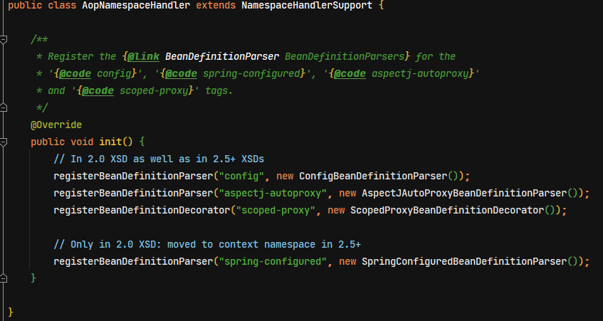
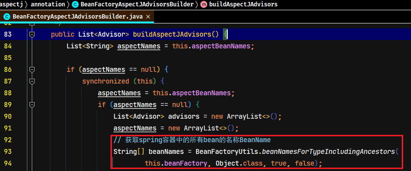
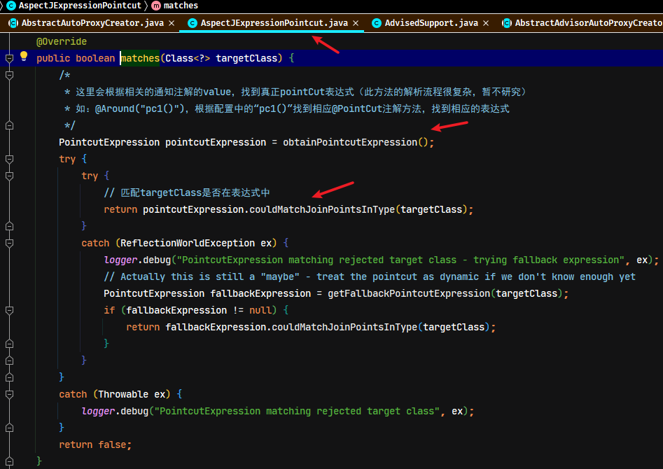

> 此笔记只针对 Spring 源码中 AOP 功能实现分析，关于 Spring AOP 基础理论与使用详见[《Spring 基础-AOP》笔记](/后端框架/Spring/Spring-AOP)

## 1. Spring AOP 前置知识

Spring 会用到 JDK 与 CGlib 来实现 AOP 功能

### 1.1. Spring 对 AOP 相关要素的封装

Spring 中对切点、通知、切面的抽象如下：

#### 1.1.1. 切入点

切入点抽象成 `Pointcut` 接口，其典型实现有 `AspectJExpressionPointcut`

```java
public interface Pointcut {

	/**
	 * Return the ClassFilter for this pointcut.
	 * @return the ClassFilter (never {@code null})
	 */
	ClassFilter getClassFilter();

	/**
	 * Return the MethodMatcher for this pointcut.
	 * @return the MethodMatcher (never {@code null})
	 */
	MethodMatcher getMethodMatcher();


	/**
	 * Canonical Pointcut instance that always matches.
	 */
	Pointcut TRUE = TruePointcut.INSTANCE;
}
```

#### 1.1.2. 通知

- 通知：典型接口为 MethodInterceptor 代表环绕通知

#### 1.1.3. 切面

- 切面：Advisor，包含一个 Advice 通知，PointcutAdvisor 包含一个 Advice 通知和一个 Pointcut

### 1.2. AOP 相关接口关系图


### 1.3. Spring AOP 相关接口调用关系图


- `AopProxyFactory` 根据 `proxyTargetClass` 等设置选择 `AopProxy` 实现
- `AopProxy` 通过 `getProxy` 创建代理对象
- 图中 Proxy 都实现了 `Advised` 接口，能够获得关联的切面集合与目标（其实是从 `ProxyFactory` 取得）
- 调用代理方法时，会借助 `ProxyFactory` 将通知统一转为环绕通知：`MethodInterceptor`

## 2. AOP 源码入口位置

AOP的源码分析，因为AOP的实现是需要生成代理，因此可以推断AOP入口会是在Bean的实例化之后。当一个bean实例化完成之后，就会判断是当前bean是否需要生成代理，所以aop的处理时机（入口）就在`AbstractAutowireCapableBeanFactory`类中`doCreateBean`方法中完成DI依赖注入以后，具体位置如下图：


`initializeBean()`方法中生成代理具体逻辑，具体位置如下图：


## 3. 基于 xml 配置 AOP 实现类的导入（了解）

基于 xml 配置的方式导入aop实现类。从Spring解析xml自定义标签的流程可知，通过spring.handlers文件中找到aop自定义标签的解析初始化处理类`AopNamespaceHandler`




### 3.1. 开启注解支持标签

`<aop:aspectj-autoproxy>`标签是开启注解支持。

```xml
<aop:aspectj-autoproxy proxy-target-class="false" expose-proxy="true"/>
```

通过源码分析知道，其相应的解析类是`AspectJAutoProxyBeanDefinitionParser`，方法会注册了`AnnotationAwareAspectJAutoProxyCreator`，是`AbstractAutoProxyCreator`的子类。*与基于注解导入的aop实现类是同一个*


### 3.2. 声明aop配置标签

`<aop:config>`标签声明aop配置，配置切入点、切面、增加通知等。通过源码分析知道，其相应的解析类是`ConfigBeanDefinitionParser`，方法是注册`AspectJAwareAdvisorAutoProxyCreator`类，是`AbstractAutoProxyCreator`的子类

> 基于xml配置声明aop的示例详见`spring-source-study-2021/24-spring-xml-aop`项目，或《Spring笔记02-AOP.md》
>
> **以上两个都是自定义标签解析，解析过程可参照 `<context:component-scan>` 标签解析过程。最终也是完成 AOP 入口类的注册。**

## 4. 基于注解配置 AOP 实现类导入

### 4.1. 加载 @EnableAspectJAutoproxy 注解

在Spring工程的配置类上标识`@EnableAspectJAutoproxy`注解，即开启Spring AOP注解的支持

```java
@Configuration
/* 注解的方式开启AOP注解支持，相当于xml配置文件中的 <aop:aspectj-autoproxy/> 标签 */
@EnableAspectJAutoProxy(proxyTargetClass = false, exposeProxy = true)
public class AopConfig {
}
```

当spring扫描到`@EnableAspectJAutoProxy`注解时，会加载通过`@Import`注解导入的`AspectJAutoProxyRegistrar`的注册类。

```java
@Target(ElementType.TYPE)
@Retention(RetentionPolicy.RUNTIME)
@Documented
@Import(AspectJAutoProxyRegistrar.class) // 引入AOP注解开启注册类
public @interface EnableAspectJAutoProxy {
	/**
	 * 指定是否采用cglib进行代理。
	 *
	 * 设置为true时，目标对象无论是否实现了接口，都使用CGLIB代理机制
	 * 设置为false时（默认值）
	 * 1、目标对象实现了接口，则使用JDK动态代理机制(代理所有实现了的接口)；
	 * 2、目标对象没有实现接口（只有实现类），则使用CGLIB代理机制
	 */
	boolean proxyTargetClass() default false;

	/**
	 * 指定是否暴露代理对象，如果暴露则通过AopContext可以进行访问
	 */
	boolean exposeProxy() default false;
}
```

### 4.2. AspectJAutoProxyRegistrar 注册基于注解AOP实现类

`AspectJAutoProxyRegistrar`运行注册逻辑后，会往容器中注册`AnnotationAwareAspectJAutoProxyCreator`实例。

#### 4.2.1. 注解开启AOP

- 注解的扫描逻辑是：通过读取项目的配置类上的`@ComponentScan`注解，首先会扫描到`@Configuration`、`@Service`、`@Component`等注解，对标识这些注解的类进行收集并封装成BeanDefinition对象，再扫描到`@EnableAspectJAutoProxy`注解（其实是扫描该注解上的`@Import`注解）
- 通过扫描注解`@EnableAspectJAutoProxy(proxyTargetClass = false, exposeProxy = true)`注册了 AOP 入口类，入口是在`@Import(AspectJAutoProxyRegistrar.class)`注解中导入

```java
class AspectJAutoProxyRegistrar implements ImportBeanDefinitionRegistrar {

	/**
	 * Register, escalate, and configure the AspectJ auto proxy creator based on the value
	 * of the @{@link EnableAspectJAutoProxy#proxyTargetClass()} attribute on the importing
	 * {@code @Configuration} class.
	 */
	@Override
	public void registerBeanDefinitions(
			AnnotationMetadata importingClassMetadata, BeanDefinitionRegistry registry) {

		// 此方法注册了AOP入口类（AnnotationAwareAspectJAutoProxyCreator）
		AopConfigUtils.registerAspectJAnnotationAutoProxyCreatorIfNecessary(registry);

		// 判断是否有@EnableAspectJAutoProxy注解
		AnnotationAttributes enableAspectJAutoProxy =
				AnnotationConfigUtils.attributesFor(importingClassMetadata, EnableAspectJAutoProxy.class);
		if (enableAspectJAutoProxy != null) {
			/*
			 * 设置为true时，目标对象无论是否实现了接口，都使用CGLIB代理机制
			 * 设置为false时（默认值）
			 * 	1、目标对象实现了接口，则使用JDK动态代理机制(代理所有实现了的接口)；
			 * 	2、目标对象没有实现接口（只有实现类），则使用CGLIB代理机制
			 */
			if (enableAspectJAutoProxy.getBoolean("proxyTargetClass")) {
				AopConfigUtils.forceAutoProxyCreatorToUseClassProxying(registry);
			}
			// 是否需要把代理对象暴露出来，简单来说是否需要把代理对象用ThreadLocal存起来，如需要则设置为true
			if (enableAspectJAutoProxy.getBoolean("exposeProxy")) {
				AopConfigUtils.forceAutoProxyCreatorToExposeProxy(registry);
			}
		}
	}
}
```


- 在`AspectJAutoProxyRegistrar`类中，注册了 AOP 入口类 `AnnotationAwareAspectJAutoProxyCreator`（*注：此类与xml配置方式开启AOP注解支持是同一个处理类*）。同时也在此类中设置了`proxyTargetClass`与`exposeProxy`的两个属性

> 番外：`@Import(AspectJAutoProxyRegistrar.class)`导入的这个类中，注册了AOP入口类`AnnotationAwareAspectJAutoProxyCreator`，并且设置了两个属性，至于`AspectJAutoProxyRegistrar`中的`registerBeanDefinitions`方法是如何调到的，参考前面Spring源码分析的`@Import`注解解析章节

#### 4.2.2. @EnableAspectJAutoProxy 的两个属性说明

|       属性名        |                                                                作用                                                                |    取值    |
| :----------------: | ---------------------------------------------------------------------------------------------------------------------------------- | ---------- |
| `proxyTargetClass` | 设置代理机制。指定是否采用cglib进行代理。默认值是false，表示使用jdk的代理                                                                | true/false |
|   `exposeProxy`    | 指定是否暴露代理对象，默认值是false。如果暴露则通过AopContext可以进行访问，简单来说是否需要把代理对象用`ThreadLocal`存起来，如需要则设置为true | true/false |

> `proxyTargetClass`属性注意事项说明：
>
> - 设置为true时，目标对象无论是否实现了接口，都使用CGLIB代理机制
> - 设置为false时，目标对象实现了接口，则使用JDK动态代理机制(代理所有实现了的接口)；没有实现接口（只有实现类），则使用CGLIB代理机制

## 5. AOP 执行过程及核心对象导入的分析

### 5.1. applyBeanPostProcessorsAfterInitialization AOP 处理入口

在`AbstractAutowireCapableBeanFactory`类中的`doCreateBean`方法，其中执行`initializeBean`方法是一个 bean 实例化完成后做的操作，而这个代理实例生成也是在 bean 实例化完成后做的操作。在`applyBeanPostProcessorsAfterInitialization`方法中，又是一个 `BeanPostProcessor` 接口的运用，处理代码如下：

```java
@Override
public Object applyBeanPostProcessorsAfterInitialization(Object existingBean, String beanName)
		throws BeansException {

	Object result = existingBean;
	/*
	 * 这里又是BeanPostProcessor接口的运用，这里主要理解以下实现类
	 * 	1、AbstractAutoProxyCreator 主要处理AOP代理生成的逻辑
	 *  2、ApplicationListenerDetector 主要将所有实现ApplicationListener接口的事件监听类加入到监听集合中
	 */
	for (BeanPostProcessor processor : getBeanPostProcessors()) {
		Object current = processor.postProcessAfterInitialization(result, beanName);
		if (current == null) {
			return result;
		}
		result = current;
	}
	return result;
}
```

### 5.2. AbstractAutoProxyCreator

切面由切点和增强（引介）组成，它既包括了横切逻辑的定义，也包括了连接点的定义，Spring AOP 就是负责实施切面的框架，它将切面所定义的横切逻辑织入到切面所指定的连接点中。`Advisor = pointCut + advice`

- AOP的核心逻辑代码在`BeanPostProcessor`接口现实类`AbstractAutoProxyCreator`中。执行父类`AbstractAutoProxyCreator`中的`postProcessAfterInitialization()`方法

```java
@Override
public Object postProcessAfterInitialization(@Nullable Object bean, String beanName) {
	if (bean != null) {
		// 首先根据bean的class和name构建缓存中的key
		Object cacheKey = getCacheKey(bean.getClass(), beanName);
		// 根据缓存key从代理缓存中获取代理实例，并判断是否与当前创建中的实例是否是同一个
		if (this.earlyProxyReferences.remove(cacheKey) != bean) {
			// 判断是否需要包装成代理的（从方法名可以很容易看出意图）
			return wrapIfNecessary(bean, beanName, cacheKey);
		}
	}
	return bean;
}
```

- 获取Aop代理缓存中的key

```java
/* 构建key */
protected Object getCacheKey(Class<?> beanClass, @Nullable String beanName) {
	if (StringUtils.hasLength(beanName)) {
		return (FactoryBean.class.isAssignableFrom(beanClass) ?
				BeanFactory.FACTORY_BEAN_PREFIX + beanName : beanName);
	}
	else {
		return beanClass;
	}
}
```

### 5.3. wrapIfNecessary 判断是否需要增强

- 判断当前实例是否需要增强或已经被增强过了

```java
/* 判断当前的bean对象是否需要增强或已经被增强过，需要则返回增加后对象，不需要则直接返回原对象 */
protected Object wrapIfNecessary(Object bean, String beanName, Object cacheKey) {
	// 判断该对象是否已经处理过了，返回原对象
	if (StringUtils.hasLength(beanName) && this.targetSourcedBeans.contains(beanName)) {
		return bean;
	}
	// 判断如不需要进行AOP增强，返回原对象
	if (Boolean.FALSE.equals(this.advisedBeans.get(cacheKey))) {
		return bean;
	}
	// 判断这个Bean是不是基础设施类，或者配置了跳过自动代理
	if (isInfrastructureClass(bean.getClass()) || shouldSkip(bean.getClass(), beanName)) {
		this.advisedBeans.put(cacheKey, Boolean.FALSE);
		return bean;
	}

	// 给当前的bean寻找advisor切面，如果这个bean有advice的话，则代表后面需要创建当前bean的代理。重要程度【5】
	// Create proxy if we have advice.
	Object[] specificInterceptors = getAdvicesAndAdvisorsForBean(bean.getClass(), beanName, null);
	// 判断获取到了要切面增强的方法，如果有，则需要针对这些需要增强的方法创建该bean的代理对象
	if (specificInterceptors != DO_NOT_PROXY) {
		this.advisedBeans.put(cacheKey, Boolean.TRUE);
		// 把被代理对象bean实例封装到SingletonTargetSource对象中
		Object proxy = createProxy(
				bean.getClass(), beanName, specificInterceptors, new SingletonTargetSource(bean));
		this.proxyTypes.put(cacheKey, proxy.getClass());
		return proxy;
	}

	// 代码执行到这里，代表当前bean对象不需要生成代理，所以在这里设置了标识
	this.advisedBeans.put(cacheKey, Boolean.FALSE);
	return bean;
}
```

- 判断是否为基础类（通知类）

```java
/*
 * 判断是否为基础设施类，基础设施了不需要代理
 * 	Advisor、Advice、AopInfrastructureBean这3个类属于基础设施类。
 */
protected boolean isInfrastructureClass(Class<?> beanClass) {
	boolean retVal = Advice.class.isAssignableFrom(beanClass) ||
			Pointcut.class.isAssignableFrom(beanClass) ||
			Advisor.class.isAssignableFrom(beanClass) ||
			AopInfrastructureBean.class.isAssignableFrom(beanClass);
	if (retVal && logger.isTraceEnabled()) {
		logger.trace("Did not attempt to auto-proxy infrastructure class [" + beanClass.getName() + "]");
	}
	return retVal;
}
```

### 5.4. getAdvicesAndAdvisorsForBean 获取增强器

获取增强的代码。在`AbstractAdvisorAutoProxyCreator`类实现`getAdvicesAndAdvisorsForBean()`抽象方法进行处理。就是判断当前bean是否有切面advisor，如果有切面则后面会执行到`createProxy()`方法，生成代理对象然后返回

```java
@Override
@Nullable
protected Object[] getAdvicesAndAdvisorsForBean(
		Class<?> beanClass, String beanName, @Nullable TargetSource targetSource) {
	// 这里是找到合格的切面，返回一个对象数组
	List<Advisor> advisors = findEligibleAdvisors(beanClass, beanName);
	if (advisors.isEmpty()) {
		return DO_NOT_PROXY;
	}
	return advisors.toArray();
}
```

### 5.5. findEligibleAdvisors 匹配候选切面封装成Advisor

`findEligibleAdvisors`方法，主要是一个匹配当前实例是否有合格的切面，并且封装成`Advisor`的过程。包含自定义创建的 Advisor 与 `@Aspect` 注解标识的切面类。

```java
protected List<Advisor> findEligibleAdvisors(Class<?> beanClass, String beanName) {
	// 找到候选的切面，其实就是寻找有@Aspectj注解的过程，把工程中所有加上了此注解的类封装成Advisor返回
	List<Advisor> candidateAdvisors = findCandidateAdvisors();
	// 判断候选的切面是否作用在当前beanClass上面，就是一个匹配过程
	List<Advisor> eligibleAdvisors = findAdvisorsThatCanApply(candidateAdvisors, beanClass, beanName);
	// 针对@Aspect注解切面添加了一个默认的切面 DefaultPointcutAdvisor
	extendAdvisors(eligibleAdvisors);
	if (!eligibleAdvisors.isEmpty()) {
		// 此方法是对有@Order、@Priority等注解进行排序
		eligibleAdvisors = sortAdvisors(eligibleAdvisors);
	}
	return eligibleAdvisors;
}
```

### 5.6. findCandidateAdvisors 寻找合格切面的过程

#### 5.6.1. 定义切面的两种方式

匹配候选切面的首先是寻找有`@Aspectj`注解或者实现`Advisor`接口的类，进行处理封装成`Advisor`返回。相应的处理会先调用AOP入口实现类`AnnotationAwareAspectJAutoProxyCreator`重写的`findCandidateAdvisors`方法

```java
@Override
protected List<Advisor> findCandidateAdvisors() {
	// Add all the Spring advisors found according to superclass rules.
	// 调用父类AbstractAdvisorAutoProxyCreator的方法，找到所有直接实现了Advisor接口的实例
	List<Advisor> advisors = super.findCandidateAdvisors();
	// Build Advisors for all AspectJ aspects in the bean factory.
	if (this.aspectJAdvisorsBuilder != null) {
		// 重点关注`buildAspectJAdvisors`方法，此方法主要作用是创建候选的切面，即对@Aspect注解的类进行处理
		advisors.addAll(this.aspectJAdvisorsBuilder.buildAspectJAdvisors());
	}
	return advisors;
}
```

从上面源码可行，定义Spring切面的两种方式

- 编写类实现`Advisor`接口，并且在类里定义pointCut和advice。源码匹配的方法位置如下：

```java
List<Advisor> advisors = super.findCandidateAdvisors();
```

- 标识`@Aspectj`注解的类，Spring具体处理是：会解析有`@Aspectj`的类，然后再解析类中标识了`@Aroud`、`@Before`等注解的方法，创建advice对象，通过注解中配置的value值创建pointCut对象，最终根据advice对象和pointCut对象创建`Advisor`对象实例。源码处理方法位置如下：

```java
this.aspectJAdvisorsBuilder.buildAspectJAdvisors()
```

#### 5.6.2. 查找实现 Advisor 接口的切面

先调用父类`AbstractAdvisorAutoProxyCreator`的逻辑，通过分析父类的方法的逻辑可知，Spring会收集所有实现`Advisor`接口的实例，所以可以<font color=red>**通过实现`Advisor`接口来自定义一些切面实现，这种方式实现的切面也会被Spring收集与管理**</font>


#### 5.6.3. 查找标识 @Aspect 注解的切面

接下来在调用`BeanFactoryAspectJAdvisorsBuilder.buildAspectJAdvisors()`方法，处理匹配`@Aspect`注解的切面类。此方法的处理逻辑如下：

- 获取 spring 容器中的所有 bean 的名称 `BeanName` 的数组



- 循环遍历 `BeanNames` 数组，判断该类上面是否有`@Aspect`注解，如果有则为需要处理的实例，添加到 `aspectNames` 集合中。


- 将标识了`@Aspect`注解的单个beanName包装成`MetadataAwareAspectInstanceFactory`工厂对象，然后通过`getAdvisors`方法获取与创建当前实例中所有切面`Advisor`集合。(注：一个bean当中可能有多个`Advisor`，单个`Advisor`是由`poinCut`和`advice`组成，因此每个bean对应的都是一个`Advisors`集合)


- 重点分析`ReflectiveAspectJAdvisorFactory.getAdvisors`方法。该方法主要作用是创建切面`Advisor`对象，主要处理流程是：循环单个Bean实例里面所有方法，通过`getAdvisorMethods(aspectClass)`方法获取除了`@PointCut`注解的其他所有方法，判断当前方法上面的注解是否有标识`@Around`、`@Before`、`@After`、`@AfterReturning`、`@AfterThrowing`等的注解，如果包含在这些注解之中，就把注解里面的信息，比如表达式、argNames、注解类型等信息封装成`AspectJAnnotation`对象

1. 从工厂中获取有`@Aspect`注解的类Class
2. 从工厂中获取有`@Aspect`注解的类的名称
3. 创建工厂的装饰类，获取实例只会获取一次


4. 从上面包装的工厂中获取对应的带`@Aspect`注解的单个实例的`Class`对象，遍历这个`aspectClass`对象中的所有没有被`@Pointcut`注解标注的方法，然后把收集到的方法进行过滤


```java
private List<Method> getAdvisorMethods(Class<?> aspectClass) {
	final List<Method> methods = new ArrayList<>();
	ReflectionUtils.doWithMethods(aspectClass, method -> {
		// Exclude pointcuts
		// 这里判断没有@Pointcut注解的方法
		if (AnnotationUtils.getAnnotation(method, Pointcut.class) == null) {
			methods.add(method);
		}
	}, ReflectionUtils.USER_DECLARED_METHODS);
	if (methods.size() > 1) {
		// 按照注解先后顺序+自然顺序排序
		methods.sort(METHOD_COMPARATOR);
	}
	return methods;
}
```

5. 核心处理逻辑方法`getAdvisor`，循环遍历没有`@Pointcut`注解的方法，并且把每个方法组装成`Advisor`对象：


```java
/* 参数 candidateAdviceMethod 是候选的Advice方法，候选的增强方法 */
@Override
@Nullable
public Advisor getAdvisor(Method candidateAdviceMethod, MetadataAwareAspectInstanceFactory aspectInstanceFactory,
		int declarationOrderInAspect, String aspectName) {

	validate(aspectInstanceFactory.getAspectMetadata().getAspectClass());

	// 获取PointCut对象，最重要的是从注解中获取表达式
	AspectJExpressionPointcut expressionPointcut = getPointcut(
			candidateAdviceMethod, aspectInstanceFactory.getAspectMetadata().getAspectClass());
	if (expressionPointcut == null) {
		return null;
	}

	/*
	 * 创建Advisor切面类，这才是真正的切面类，一个切面类里面肯定要包含两个元素
	 * 	1. pointCut，这里的pointCut是 expressionPointcut
	 * 	2. advice，增强方法是 candidateAdviceMethod
	 */
	return new InstantiationModelAwarePointcutAdvisorImpl(expressionPointcut, candidateAdviceMethod,
			this, aspectInstanceFactory, declarationOrderInAspect, aspectName);
}
```

`getPointcut()`方法，主要处理逻辑是：把注解信息封装成`AspectJAnnotation`对象，封装一个`PointCut`类实例，并且把前面从注解里面解析的表达式设置进去

```java
@Nullable
private AspectJExpressionPointcut getPointcut(Method candidateAdviceMethod, Class<?> candidateAspectClass) {
	/*
	 * 从候选的增强方法里面 candidateAdviceMethod 找有以下注解
	 * 	@Pointcut, @Around, @Before, @After, @AfterReturning, @AfterThrowing
	 * 并把注解信息封装成AspectJAnnotation对象
	 */
	AspectJAnnotation<?> aspectJAnnotation =
			AbstractAspectJAdvisorFactory.findAspectJAnnotationOnMethod(candidateAdviceMethod);
	if (aspectJAnnotation == null) {
		return null;
	}

	// 创建一个PointCut类
	AspectJExpressionPointcut ajexp =
			new AspectJExpressionPointcut(candidateAspectClass, new String[0], new Class<?>[0]);
	/*
	 * 把前面从注解里面解析的表达式设置到PointCut对象中。
	 * 	注意：此时只是获取到AspectJ相关注解的value值，可能有些是pointCut的引入字符串而已
	 */
	ajexp.setExpression(aspectJAnnotation.getPointcutExpression());
	if (this.beanFactory != null) {
		ajexp.setBeanFactory(this.beanFactory);
	}
	return ajexp;
}
```

在`findAspectJAnnotationOnMethod`方法中，循环`ASPECTJ_ANNOTATION_CLASSES`容器中相关的注解，判断`Method`是否包含这些注解，如有，则将其封装成`AspectJAnnotation`对象

```java
@Nullable
protected static AspectJAnnotation<?> findAspectJAnnotationOnMethod(Method method) {
	// ASPECTJ_ANNOTATION_CLASSES容器的值：Pointcut.class, Around.class, Before.class, After.class, AfterReturning.class, AfterThrowing.class
	for (Class<?> clazz : ASPECTJ_ANNOTATION_CLASSES) {
		// 找到ASPECTJ_ANNOTATION_CLASSES容器包含的注解的方法对象，并且把注解里面的信息封装成AspectJAnnotation对象
		AspectJAnnotation<?> foundAnnotation = findAnnotation(method, (Class<Annotation>) clazz);
		if (foundAnnotation != null) {
			return foundAnnotation;
		}
	}
	return null;
}
```


找到相应合格的增强注解后，就创建`PointCut`对象，并设置表达式


在上面已创建`AspectJExpressionPointcut`对象，接下来就通过`InstantiationModelAwarePointcutAdvisorImpl`实现类构造函数，创建`Advisor`切面类


核心处理逻辑在`instantiateAdvice`方法中

```java
private Advice instantiateAdvice(AspectJExpressionPointcut pointcut) {
	// 创建Advice对象
	Advice advice = this.aspectJAdvisorFactory.getAdvice(this.aspectJAdviceMethod, pointcut,
			this.aspectInstanceFactory, this.declarationOrder, this.aspectName);
	return (advice != null ? advice : EMPTY_ADVICE);
}
```

其中`getAdvice`方法是获取有`@Aspect`注解的类，然后把方法上面的注解包装成`AspectJAnnotation`对象，这个对象中包括6种注解类型


`AspectJAnnotation`包含的注解类型


`getAdvice`方法往下执行，之前针对单个方法创建的`PointCut`对象，并已经将注解对象中的表达式设置到`PointCut`对象中，此时就根据不同的注解类型创建出不同的`Advice`对象，包括：`AspectJAroundAdvice`（环绕通知）、`AspectJMethodBeforeAdvice`（前置通知）、`AspectJAfterAdvice`（后置通知）、`AspectJAfterReturningAdvice`（最终通知）、`AspectJAfterThrowingAdvice`（异常通知）。最终会把注解对应的`Advice`和`PointCut`对象封装成`Advisor`对象，并返回


> 注：其中 `AspectJAroundAdvice`、`AspectJAfterAdvice`、`AspectJAfterThrowingAdvice` 都实现 `MethodInterceptor` 接口。而 `AspectJMethodBeforeAdvice` 与 `AspectJAfterReturningAdvice` 没有实现，最终都会转成环绕通知类型。这里使用**适配器设计模式（Adapter模式）**

返回`Advisor`切面类


上面的所有处理就是为了给一个类中的某一个方法包装成对应的`Advisor`对象，下面的方法是一个类中可能有多个不同的方法，每个方法都包装成对应的`Advisor`对象，这样对应的一个类中就会有一个`List<Advisor>`集合


获取到`List<Advisor>`集合后，`buildAspectJAdvisors`方法继续往下执行逻辑已经将收集到的`Advisor`集合加入到`advisorsCache`缓存与返回


**总结`buildAspectJAdvisors`方法的处理流程**：就是循环遍历`Beanfactory`中的所有的bean实例，判断 bean上是否有`@Aspect`注解，如果有此注解，则遍历该类中所有的非`@Pointcut`注解的方法，然后把该方法上的注解信息封装成`AspectJAnnotation`对象，并且把此对象中的`pointcutExpression`表达式，通过`setExpression`方法包装到`AspectJExpressionPointcut`对象（即`PointCut`对象）；然后通过方法中的`AspectJAnnotation`中的不同的`AnnotationType`，创建创建不同的`Advice`类实例，最后把`pointcut`和`advice`对象封装成对应的`Advisor`对象，然后一个类中对应一个 `List<Advisor>`对象。

> TODO: 【然后不同的 bean 循环添加到`List<Advisor>`集合中，封装成`List<List<Advisor>>`最后的集合中去】这句话如何理解？？？

> **以上就是`findCandidateAdvisors`方法寻找切面的全部过程**

### 5.7. findAdvisorsThatCanApply 匹配合格切面的过程

`findEligibleAdvisors`方法寻找到合格的切面

```java
protected List<Advisor> findEligibleAdvisors(Class<?> beanClass, String beanName) {
	....
	// 判断候选的切面是否作用在当前beanClass上面，就是一个匹配过程
	List<Advisor> eligibleAdvisors = findAdvisorsThatCanApply(candidateAdvisors, beanClass, beanName);
	....
}
```

```java
protected List<Advisor> findAdvisorsThatCanApply(
		List<Advisor> candidateAdvisors, Class<?> beanClass, String beanName) {

	ProxyCreationContext.setCurrentProxiedBeanName(beanName);
	try {
		// 判断当前类实例是否在这些切面的PointCut中，是调用类和方法的match匹配的过程
		return AopUtils.findAdvisorsThatCanApply(candidateAdvisors, beanClass);
	}
	finally {
		ProxyCreationContext.setCurrentProxiedBeanName(null);
	}
}

/* AopUtils类 */
public static List<Advisor> findAdvisorsThatCanApply(List<Advisor> candidateAdvisors, Class<?> clazz) {
	if (candidateAdvisors.isEmpty()) {
		return candidateAdvisors;
	}
	List<Advisor> eligibleAdvisors = new ArrayList<>();
	for (Advisor candidate : candidateAdvisors) {
		// 如果是引介切面并且匹配
		if (candidate instanceof IntroductionAdvisor && canApply(candidate, clazz)) {
			eligibleAdvisors.add(candidate);
		}
	}
	boolean hasIntroductions = !eligibleAdvisors.isEmpty();
	// 循环所有切面Advisor
	for (Advisor candidate : candidateAdvisors) {
		if (candidate instanceof IntroductionAdvisor) {
			// already processed
			continue;
		}
		// 调用pointCut中的ClassFilter和MethodMatcher的match方法进行匹配
		if (canApply(candidate, clazz, hasIntroductions)) {
			eligibleAdvisors.add(candidate);
		}
	}
	return eligibleAdvisors;
}
```

在`canApply`方法中，调用`PointCut`类的`ClassFilter`和`MethodMatcher`的`match`方法进行匹配，找到与当前类匹配的合格的切面。（*注：匹配过程比较复杂，暂不研究*）


类匹配`pointCut`



方法匹配`pointCut`


### 5.8. extendAdvisors 添加默认切面

在查找与匹配完切面的后，会调用`extendAdvisors`方法，当工程中存在`@Aspect`注解时，会增加一个默认切面`DefaultPointcutAdvisor`，其作用是用于不同切面之间参数传递。此方法的具体在`AspectJAwareAdvisorAutoProxyCreator`类中

```java
@Override
protected void extendAdvisors(List<Advisor> candidateAdvisors) {
	AspectJProxyUtils.makeAdvisorChainAspectJCapableIfNecessary(candidateAdvisors);
}
```

调用`AspectJProxyUtils`类的`makeAdvisorChainAspectJCapableIfNecessary`方法

```java
public static boolean makeAdvisorChainAspectJCapableIfNecessary(List<Advisor> advisors) {
	// Don't add advisors to an empty list; may indicate that proxying is just not required
	if (!advisors.isEmpty()) {
		boolean foundAspectJAdvice = false;
		// 循环所有切面
		for (Advisor advisor : advisors) {
			// Be careful not to get the Advice without a guard, as this might eagerly
			// instantiate a non-singleton AspectJ aspect...
			// 判断是否为使用@Aspect注解的切面
			if (isAspectJAdvice(advisor)) {
				foundAspectJAdvice = true;
				break;
			}
		}
		// 判断当前的切面集合中是否包含DefaultPointcutAdvisor类型的切面
		if (foundAspectJAdvice && !advisors.contains(ExposeInvocationInterceptor.ADVISOR)) {
			// 如果没有，则往集合首位置增加默认切面DefaultPointcutAdvisor
			advisors.add(0, ExposeInvocationInterceptor.ADVISOR);
			return true;
		}
	}
	return false;
}
```

默认切面`ExposeInvocationInterceptor.ADVISOR`


当前某个方法被切面拦截了，就会执行`invoke`方法，该默认的切面的主要处理逻辑是往当前线程`ThreadLocal`中放入`MethoInvocation`实例


<font color=red>**总结：因为切面都是链式调用，所以增加此默认切面的目的是，可以在任意其他切面上，通过工具方法`ExposeInvocationInterceptor.currentInvocation()`，获取到当前`MethodInvocation`对象，从此对象中可以获取到调用的参数、方法、实例对象等，用于切面间的数据传递**</font>

### 5.9. 切面的排序

此部分的内容会关系到切面调用的顺序

#### 5.9.1. 查找切面方法时的排序

排序的具体源码位置：

```
getAdvicesAndAdvisorsForBean -> findEligibleAdvisors -> findCandidateAdvisors -> buildAspectJAdvisors -> getAdvisors -> getAdvisorMethods
```


具体排序器逻辑如下：

```java
public class ReflectiveAspectJAdvisorFactory extends AbstractAspectJAdvisorFactory implements Serializable {

    private static final Comparator<Method> METHOD_COMPARATOR;

    static {
    	// Note: although @After is ordered before @AfterReturning and @AfterThrowing,
    	// an @After advice method will actually be invoked after @AfterReturning and
    	// @AfterThrowing methods due to the fact that AspectJAfterAdvice.invoke(MethodInvocation)
    	// invokes proceed() in a `try` block and only invokes the @After advice method
    	// in a corresponding `finally` block.
    	// 先按注解类型排序
    	Comparator<Method> adviceKindComparator = new ConvertingComparator<>(
    			new InstanceComparator<>(
    					Around.class, Before.class, After.class, AfterReturning.class, AfterThrowing.class),
    			(Converter<Method, Annotation>) method -> {
    				AspectJAnnotation<?> ann = AbstractAspectJAdvisorFactory.findAspectJAnnotationOnMethod(method);
    				return (ann != null ? ann.getAnnotation() : null);
    			});
		// 再按方法名称自然排序
    	Comparator<Method> methodNameComparator = new ConvertingComparator<>(Method::getName);
    	// 两次排序
    	METHOD_COMPARATOR = adviceKindComparator.thenComparing(methodNameComparator);
    }
    ....省略
}
```

> 注：这一步处理没有涉及类标识`@Order`、`@Priority`等注解或者实现`Ordered`接口等排序

#### 5.9.2. 针对@Order、@Priority等注解的切面排序

前面经过寻找到切面，匹配切面，增加默认的切面后，进行再次进行排序后返回


具体会调用`AspectJAwareAdvisorAutoProxyCreator.sortAdvisors`方法

```java
protected List<Advisor> sortAdvisors(List<Advisor> advisors) {
	List<PartiallyComparableAdvisorHolder> partiallyComparableAdvisors = new ArrayList<>(advisors.size());
	for (Advisor advisor : advisors) {
		/*
		 * 针对@Aspect注解的排序
		 * 将每个Advisor包装成PartiallyComparableAdvisorHolder对象，
		 * DEFAULT_PRECEDENCE_COMPARATOR 是一个排序比较器
		 */
		partiallyComparableAdvisors.add(
				new PartiallyComparableAdvisorHolder(advisor, DEFAULT_PRECEDENCE_COMPARATOR));
	}
	// 排序
	List<PartiallyComparableAdvisorHolder> sorted = PartialOrder.sort(partiallyComparableAdvisors);
	if (sorted != null) {
		List<Advisor> result = new ArrayList<>(advisors.size());
		for (PartiallyComparableAdvisorHolder pcAdvisor : sorted) {
			result.add(pcAdvisor.getAdvisor());
		}
		return result;
	}
	else {
		// 调用父类的排序方法
		return super.sortAdvisors(advisors);
	}
}
```

`DEFAULT_PRECEDENCE_COMPARATOR`是排序比较器

```java
private static final Comparator<Advisor> DEFAULT_PRECEDENCE_COMPARATOR = new AspectJPrecedenceComparator();
```

在`AspectJPrecedenceComparator`类的中`compare`方法处理具体的排序逻辑。主要是先处理`@Order`注解与实现`Ordered`接口的排序，如果当前两个切面是在同一个标识`@Aspect`注解的类中，则方法返回值为0，即按原顺序，不排序。

```java
/* 具体排序的逻辑 */
@Override
public int compare(Advisor o1, Advisor o2) {
	// 针对@Order注解与实现Ordered接口的排序，如果是@Aspect注解类的切面，则会返回0
	int advisorPrecedence = this.advisorComparator.compare(o1, o2);
	// 针对@Aspect注解类的切面排序，当前两个比较的Advisor是在同一个@Aspect注解标识的类中，进入此if代码块
	if (advisorPrecedence == SAME_PRECEDENCE && declaredInSameAspect(o1, o2)) {
		advisorPrecedence = comparePrecedenceWithinAspect(o1, o2);
	}
	return advisorPrecedence;
}

private int comparePrecedenceWithinAspect(Advisor advisor1, Advisor advisor2) {
	boolean oneOrOtherIsAfterAdvice =
			(AspectJAopUtils.isAfterAdvice(advisor1) || AspectJAopUtils.isAfterAdvice(advisor2));
	// 如果是同一个@Aspect注解标识的类的两个切面，getAspectDeclarationOrder这个方法永远返回是0（Spring 5.2.7以后的版本）
	int adviceDeclarationOrderDelta = getAspectDeclarationOrder(advisor1) - getAspectDeclarationOrder(advisor2);

	if (oneOrOtherIsAfterAdvice) {
		// the advice declared last has higher precedence
		if (adviceDeclarationOrderDelta < 0) {
			// advice1 was declared before advice2
			// so advice1 has lower precedence
			return LOWER_PRECEDENCE;
		}
		else if (adviceDeclarationOrderDelta == 0) {
			// adviceDeclarationOrderDelta为0的时候，返回也是0，即不会排序
			return SAME_PRECEDENCE;
		}
		else {
			return HIGHER_PRECEDENCE;
		}
	}
	else {
		// the advice declared first has higher precedence
		if (adviceDeclarationOrderDelta < 0) {
			// advice1 was declared before advice2
			// so advice1 has higher precedence
			return HIGHER_PRECEDENCE;
		}
		else if (adviceDeclarationOrderDelta == 0) {
			return SAME_PRECEDENCE;
		}
		else {
			return LOWER_PRECEDENCE;
		}
	}
}
```

> 注：针对标识了`@Aspect`的切面的`getAspectDeclarationOrder(advisor1)`方法值为什么返回是0，原因是Spring在`buildAspectJAdvisors`方法中处理`@Aspect`注解的创建切面，传入的`declarationOrder`属性值就是0（Spring 5.2.7以后的版本）

### 5.10. createProxy 代理的创建

如果找到当前Bean实例的`Advisor`切面，即从收集到的所有切面中，每一个切面都会有`PointCut`来进行模块匹配，这个过程就是一个匹配过程，看`PointCut`表达式中的内容是否包含了当前bean，如果包含了，即代表当前bean有切面，就会生成代理。


一般在创建jdk动态代理时，会持有被代理的实例。在生成代理实例前，Spring的做法是将被代理的实例封装成`TargetSource`的对象（具体实现类`SingletonTargetSource`），然后在增强处理时，通过`getTarget`方法获取被代理实例。以下`createProxy`方法就是根据增强切面创建代理对象具体处理

```java
protected Object createProxy(Class<?> beanClass, @Nullable String beanName,
		@Nullable Object[] specificInterceptors, TargetSource targetSource) {

	if (this.beanFactory instanceof ConfigurableListableBeanFactory) {
		AutoProxyUtils.exposeTargetClass((ConfigurableListableBeanFactory) this.beanFactory, beanName, beanClass);
	}

    // 创建代理工厂
	ProxyFactory proxyFactory = new ProxyFactory();
	// 把AnnotationAwareAspectJAutoProxyCreator中的某些属性copy到proxyFactory对象中，如proxyTargetClass、exposeProxy等
	proxyFactory.copyFrom(this);

    // 对代理的方式做处理，例如使用者将proxyTargetClass属性设置为false，代表使用jdk代理，
	// 但工程内的所有需要被代理的类都没有实现接口，所以此时在这里对proxyTargetClass属性做相应的处理转换
	if (!proxyFactory.isProxyTargetClass()) {
		if (shouldProxyTargetClass(beanClass, beanName)) {
			proxyFactory.setProxyTargetClass(true);
		}
		else {
			evaluateProxyInterfaces(beanClass, proxyFactory);
		}
	}
	// Advisor切面对象重新包装，会把自定义的 MethodInterceptor 类型的类包装成 Advisor 切面类并加入到代理工厂中
	Advisor[] advisors = buildAdvisors(beanName, specificInterceptors);
	// 把advisor加入到proxyFactory
	proxyFactory.addAdvisors(advisors);
	// 把targetSource对象加入到proxyFactory
	proxyFactory.setTargetSource(targetSource);
	customizeProxyFactory(proxyFactory);

	proxyFactory.setFrozen(this.freezeProxy);
	if (advisorsPreFiltered()) {
		proxyFactory.setPreFiltered(true);
	}
	// 获取代理对象
	return proxyFactory.getProxy(getProxyClassLoader());
}
```

### 5.11. buildAdvisors 组装切面

#### 5.11.1. 源码处理逻辑

`AbstractAutoProxyCreator`类的`buildAdvisors`方法，主要是切面对象重新包装，会把自定义的`MethodInterceptor`类型的类包装成`Advisor`切面类。源码如下：

```java
protected Advisor[] buildAdvisors(@Nullable String beanName, @Nullable Object[] specificInterceptors) {
	// Handle prototypes correctly...
	// 设置自定义的 MethodInterceptor 和 Advice，
	// 获取AnnotationAwareAspectJAutoProxyCreator对象调用setInterceptorNames方法
	Advisor[] commonInterceptors = resolveInterceptorNames();

	List<Object> allInterceptors = new ArrayList<>();
	if (specificInterceptors != null) {
		// 加入当前实例相应的拦截器
		allInterceptors.addAll(Arrays.asList(specificInterceptors));
		if (commonInterceptors.length > 0) {
			// 设置自定义的公共拦截器
			if (this.applyCommonInterceptorsFirst) {
				allInterceptors.addAll(0, Arrays.asList(commonInterceptors));
			}
			else {
				allInterceptors.addAll(Arrays.asList(commonInterceptors));
			}
		}
	}
	if (logger.isTraceEnabled()) {
		int nrOfCommonInterceptors = commonInterceptors.length;
		int nrOfSpecificInterceptors = (specificInterceptors != null ? specificInterceptors.length : 0);
		logger.trace("Creating implicit proxy for bean '" + beanName + "' with " + nrOfCommonInterceptors +
				" common interceptors and " + nrOfSpecificInterceptors + " specific interceptors");
	}

	Advisor[] advisors = new Advisor[allInterceptors.size()];
	for (int i = 0; i < allInterceptors.size(); i++) {
		// 将所有拦截器都转成Advisor，包括对自定义的Advice进行包装，把adivce包装成Advisor切面对象
		advisors[i] = this.advisorAdapterRegistry.wrap(allInterceptors.get(i));
	}
	return advisors;
}
```

- 设置自定义的 `MethodInterceptor` 和 `Advice`

```java
private Advisor[] resolveInterceptorNames() {
	BeanFactory bf = this.beanFactory;
	ConfigurableBeanFactory cbf = (bf instanceof ConfigurableBeanFactory ? (ConfigurableBeanFactory) bf : null);
	List<Advisor> advisors = new ArrayList<>();
	// 循环interceptorNames数组，该数组是存放通用拦截器，初始值为空。
	for (String beanName : this.interceptorNames) {
		if (cbf == null || !cbf.isCurrentlyInCreation(beanName)) {
			Assert.state(bf != null, "BeanFactory required for resolving interceptor names");
			// 将自定义拦截器实例化，实例的类型是MethodInterceptor
			Object next = bf.getBean(beanName);
			// 将自定义拦截器MethodInterceptor包装成Advisor（具体是DefaultPointcutAdvisor）
			advisors.add(this.advisorAdapterRegistry.wrap(next));
		}
	}
	return advisors.toArray(new Advisor[0]);
}
```

初始化时，`interceptorNames`通用拦截器数组为空，但可以通过`AbstractAutoProxyCreator`类中的`setInterceptorNames`方法来设置

```java
public abstract class AbstractAutoProxyCreator extends ProxyProcessorSupport
		implements SmartInstantiationAwareBeanPostProcessor, BeanFactoryAware {
	....省略
    /** Default is no common interceptors. */
    	private String[] interceptorNames = new String[0];

    public void setInterceptorNames(String... interceptorNames) {
    	this.interceptorNames = interceptorNames;
    }
    ....省略
}
```

通过`this.advisorAdapterRegistry.wrap(next)`方法（其具体实现在`DefaultAdvisorAdapterRegistry`类中），将`MethodInterceptor`类型转成`DefaultPointcutAdvisor`返回

```java
@Override
public Advisor wrap(Object adviceObject) throws UnknownAdviceTypeException {
	if (adviceObject instanceof Advisor) {
		return (Advisor) adviceObject;
	}
	if (!(adviceObject instanceof Advice)) {
		throw new UnknownAdviceTypeException(adviceObject);
	}
	Advice advice = (Advice) adviceObject;
	if (advice instanceof MethodInterceptor) {
		// So well-known it doesn't even need an adapter.
		return new DefaultPointcutAdvisor(advice);
	}
	for (AdvisorAdapter adapter : this.adapters) {
		// Check that it is supported.
		if (adapter.supportsAdvice(advice)) {
			return new DefaultPointcutAdvisor(advice);
		}
	}
	throw new UnknownAdviceTypeException(advice);
}
```

#### 5.11.2. 番外：手动设置AOP入口类的拦截器

通过`BeanPostProcessor`类型的接口，在AOP入口类实例化后设置全局拦截器interceptorNames数组

- 创建测试使用的全局拦截器（其实就是AOP的增强Advice），实现`MethodInterceptor`接口

```java
package com.moon.spring.aop.advice;

import org.aopalliance.intercept.MethodInterceptor;
import org.aopalliance.intercept.MethodInvocation;
import org.springframework.stereotype.Component;

/**
 * 全局增强Advice，实现MethodInterceptor接口，
 * 用于测试用于手动设置到 AbstractAutoProxyCreator类的 interceptorNames 数组中
 */
@Component
public class GlobleAdvice implements MethodInterceptor {
    @Override
    public Object invoke(MethodInvocation invocation) throws Throwable {
        System.out.println("GlobleAdvice.invoke拦截方法执行了....");
        return invocation.proceed();
    }
}
```

- 创建`BeanPostProcessor`接口实现，重写`postProcessAfterInitialization`方法，该方法是`BeanPostProcessor`接口的功能埋点，在bean实例化完成后会调用。所以

```java
package com.moon.spring.beanpostprocessor;

import org.springframework.aop.aspectj.annotation.AnnotationAwareAspectJAutoProxyCreator;
import org.springframework.beans.BeansException;
import org.springframework.beans.factory.config.BeanPostProcessor;
import org.springframework.core.PriorityOrdered;
import org.springframework.stereotype.Component;

/**
 * 通过 BeanPostProcessor 类型的接口，在AOP入口类实例化后设置全局拦截器interceptorNames数组
 */
@Component
public class GlobleAdvicePostProcessor implements BeanPostProcessor, PriorityOrdered {
    @Override
    public int getOrder() {
        return 101;
    }

    @Override
    public Object postProcessAfterInitialization(Object bean, String beanName) throws BeansException {
        // 判断是否为AOP注解入口类
        if (bean instanceof AnnotationAwareAspectJAutoProxyCreator) {
            AnnotationAwareAspectJAutoProxyCreator annotationAwareAspectJAutoProxyCreator = (AnnotationAwareAspectJAutoProxyCreator) bean;
            // 设置全局拦截器
            annotationAwareAspectJAutoProxyCreator.setInterceptorNames("globleAdvice");
        }
        return bean;
    }
}
```

启动测试，观察控制台输出。

> **注意事项：以上这种方式设置aop入口类的拦截器数组，需要注意实例生成的时序问题。TODO: 以后要慢慢深入理解**

### 5.12. getProxy 获取代理

`createProxy`方法最后调用`proxyFactory.getProxy(getProxyClassLoader())`方法获取代理，会根据`proxyTargetClass`参数和是否实现接口来判断是采用JDK代理还是cglib代理

```java
public Object getProxy(@Nullable ClassLoader classLoader) {
    // 根据目标对象是否有接口来判断采用哪种代理方式（cglib代理还是jdk动态代理）
	return createAopProxy().getProxy(classLoader);
}
```

```java
/* ProxyCreatorSupport类 */
protected final synchronized AopProxy createAopProxy() {
	if (!this.active) {
		activate();
	}
	return getAopProxyFactory().createAopProxy(this);
}
```

`getAopProxyFactory()`方法获取到`AopProxyFactory`接口类型实例（具体实现是`DefaultAopProxyFactory`类），再调用该类中的`createAopProxy`方法，肯定生成哪种代理

```java
@Override
public AopProxy createAopProxy(AdvisedSupport config) throws AopConfigException {
    // 入参config其实就是ProxyFactory实例
	if (config.isOptimize() || config.isProxyTargetClass() || hasNoUserSuppliedProxyInterfaces(config)) {
		Class<?> targetClass = config.getTargetClass();
		if (targetClass == null) {
			throw new AopConfigException("TargetSource cannot determine target class: " +
					"Either an interface or a target is required for proxy creation.");
		}
		if (targetClass.isInterface() || Proxy.isProxyClass(targetClass)) {
			return new JdkDynamicAopProxy(config);
		}
		return new ObjenesisCglibAopProxy(config);
	}
	else {
		return new JdkDynamicAopProxy(config);
	}
}
```

前面`createAopProxy`方法返回了`JdkDynamicAopProxy`或者`ObjenesisCglibAopProxy`，调用`getProxy`方法创建代理对象，并且把代理工厂对象传递到 jdk 和 cglib 中，<font color=red>**特别注意：这里的代理对象和`JdkDynamicAopProxy`或者`ObjenesisCglibAopProxy`是一一对应的，一个需要代理的bean对应一个代理**</font>


JDK动态代理


CGlig代理


**以上的流程结束，代理就已经创建完成，即`createProxy`方法执行完**


### 5.13. 代理加载流程总结

1. 首先调用`getCacheKey`方法，进行创建代理缓存的cacheKey
2. 判断是否已经处理过了
3. 判断是否不需要增强
4. 判断是否基础设施类或者是否需要跳过的bean
5. 调用`getAdvicesAndAdvisorsForBean`方法，获取增强器。即当前类中是否有advice增强的方法
6. 根据增强器进行创建代理对象

### 5.14. AnnotationAwareAspectJAutoProxyCreator 类视图与对象的分析

`AnnotationAwareAspectJAutoProxyCreator`是`AbstractAutoProxyCreator`抽象类的子类


## 6. 代理实例的调用

上面章节就是AOP实现类的导入与bean最后生成aop代理的流程。现在分析代理对象调用，以JDK动态代理为例（*cglib代理的调用逻辑一样*）分析源码的代理调用流程

代理对象创建完成后，参考JDK动态代理的原理，在调用被代理实例的方法时，实际上是调用了生成的字节码文件加载成对应的Class对象，Class对象内部有个跟被代理对象一样的方法名称，此方法内部只有`h.invoke()`一个操作。此时就会调用JDK或者CGlib的实例对象。因为对应的`h`就是`Proxy`中的`InvocatioinHandler`对象，而JDK和CGlib代理对象都实现了该接口。当发生代理对象调用时，肯定会调用到实现了`InvocatioinHandler`接口的类，在Spring中，该类就是`JdkDynamicAopProxy`，也必定会调用到该类的`invoke`方法。所以Spring aop的代理调用逻辑就是此方法中

### 6.1. JdkDynamicAopProxy 的 invoke 方法

```java
public Object invoke(Object proxy, Method method, Object[] args) throws Throwable {
	Object oldProxy = null;
	boolean setProxyContext = false;

	// 从代理工厂中拿到TargetSource对象，该对象包装了被代理实例bean
	TargetSource targetSource = this.advised.targetSource;
	Object target = null;

	try {
		// 被代理对象的equals方法和hashCode方法是不能被代理的，不会走切面
		if (!this.equalsDefined && AopUtils.isEqualsMethod(method)) {
			// The target does not implement the equals(Object) method itself.
			return equals(args[0]);
		}
		else if (!this.hashCodeDefined && AopUtils.isHashCodeMethod(method)) {
			// The target does not implement the hashCode() method itself.
			return hashCode();
		}
		else if (method.getDeclaringClass() == DecoratingProxy.class) {
			// There is only getDecoratedClass() declared -> dispatch to proxy config.
			return AopProxyUtils.ultimateTargetClass(this.advised);
		}
		else if (!this.advised.opaque && method.getDeclaringClass().isInterface() &&
				method.getDeclaringClass().isAssignableFrom(Advised.class)) {
			// Service invocations on ProxyConfig with the proxy config...
			return AopUtils.invokeJoinpointUsingReflection(this.advised, method, args);
		}

		Object retVal;

		// 如果该属性设置为true，则把代理对象设置到ThreadLocal中
		if (this.advised.exposeProxy) {
			// Make invocation available if necessary.
			// 就是将代理对象存储到 ThreadLocal<Object> currentProxy
			oldProxy = AopContext.setCurrentProxy(proxy);
			setProxyContext = true;
		}

		// Get as late as possible to minimize the time we "own" the target,
		// in case it comes from a pool.
		// 这个target就是被代理实例
		target = targetSource.getTarget();
		Class<?> targetClass = (target != null ? target.getClass() : null);

		// Get the interception chain for this method.
		/*
		 * 从代理工厂中拿过滤器链 Object是一个MethodInterceptor类型的对象，其实就是一个advice对象
		 * 过程就是对象当前调用的方法，与所收集的所有切面进行match（匹配），返回匹配的MethodInterceptor拦截器的集合
		 */
		List<Object> chain = this.advised.getInterceptorsAndDynamicInterceptionAdvice(method, targetClass);

		// Check whether we have any advice. If we don't, we can fallback on direct
		// reflective invocation of the target, and avoid creating a MethodInvocation.
		if (chain.isEmpty()) {
			// We can skip creating a MethodInvocation: just invoke the target directly
			// Note that the final invoker must be an InvokerInterceptor so we know it does
			// nothing but a reflective operation on the target, and no hot swapping or fancy proxying.
			// 如果该方法没有执行链，则说明这个方法不需要被拦截，则直接反射调用
			Object[] argsToUse = AopProxyUtils.adaptArgumentsIfNecessary(method, args);
			retVal = AopUtils.invokeJoinpointUsingReflection(target, method, argsToUse);
		}
		else {
			// We need to create a method invocation...
			// 将代理、被代理实例、方法、参数、拦截器链等信息再包装成ReflectiveMethodInvocation对象
			MethodInvocation invocation =
					new ReflectiveMethodInvocation(proxy, target, method, args, targetClass, chain);
			// Proceed to the joinpoint through the interceptor chain.
			// 执行链式调用
			retVal = invocation.proceed();
		}

		// Massage return value if necessary.
		Class<?> returnType = method.getReturnType();
		if (retVal != null && retVal == target &&
				returnType != Object.class && returnType.isInstance(proxy) &&
				!RawTargetAccess.class.isAssignableFrom(method.getDeclaringClass())) {
			// Special case: it returned "this" and the return type of the method
			// is type-compatible. Note that we can't help if the target sets
			// a reference to itself in another returned object.
			retVal = proxy;
		}
		else if (retVal == null && returnType != Void.TYPE && returnType.isPrimitive()) {
			throw new AopInvocationException(
					"Null return value from advice does not match primitive return type for: " + method);
		}
		return retVal;
	}
	finally {
		if (target != null && !targetSource.isStatic()) {
			// Must have come from TargetSource.
			targetSource.releaseTarget(target);
		}
		if (setProxyContext) {
			// Restore old proxy.
			AopContext.setCurrentProxy(oldProxy);
		}
	}
}
```

### 6.2. getInterceptorsAndDynamicInterceptionAdvice 获取方法拦截器链

获取方法拦截器链的源码位置如下：

```java
/* JdkDynamicAopProxy#invoke */
List<Object> chain = this.advised.getInterceptorsAndDynamicInterceptionAdvice(method, targetClass);
```

以上方法是从代理工厂中拿到所有切面，并且与当前被代理类和当前被调用方法进行匹配，如果匹配就返回切面中的`advice`对象，这就是`advice`执行链，其实就是对应的 `interceptorList` 列表，主要的逻辑在实现类`AdvisedSupport`中

```java
public class AdvisedSupport extends ProxyConfig implements Advised {
    ....省略
    /** The AdvisorChainFactory to use. */
    AdvisorChainFactory advisorChainFactory = new DefaultAdvisorChainFactory();

    /* 根据此配置，确定指定方法的MethodInterceptor对象列表 */
    public List<Object> getInterceptorsAndDynamicInterceptionAdvice(Method method, @Nullable Class<?> targetClass) {
    	MethodCacheKey cacheKey = new MethodCacheKey(method);
    	List<Object> cached = this.methodCache.get(cacheKey);
    	if (cached == null) {
    		// 获取过滤器链
    		cached = this.advisorChainFactory.getInterceptorsAndDynamicInterceptionAdvice(
    				this, method, targetClass);
    		// 将匹配到的过滤器链放入缓存中
    		this.methodCache.put(cacheKey, cached);
    	}
    	return cached;
    }
    ....省略
}
```

调用 `DefaultAdvisorChainFactory` 类的 `getInterceptorsAndDynamicInterceptionAdvice` 方法，主要的处理流程如下：

1. `config` 是代理工厂对象，从代理工厂中获得该被代理类的所有切面 `Advisor` 数组，然后遍历
2. 从切面`Advisor`的`PointCut`中获取`ClassFilter`，调用`matches`方法与被代理对象`Class`类进行匹配 如果切面的`PointCut`是匹配的，说明被代理对象这个`Class`类是切面要拦截的对象
3. 类匹配完后，调用`MethodMatcher`的`matches`方法进行方法的匹配，判断匹配的被代理对象中的方法是否是切面`Pointcut`需要拦截的方法
4. 一个类中包含了多个`Advisor`，遍历每个`Advisor`，通过`registry.getInterceptors(advisor)`获取对应的`Advice`数组，然后添加到拦截器列表，然后返回

```java
@Override
public List<Object> getInterceptorsAndDynamicInterceptionAdvice(
		Advised config, Method method, @Nullable Class<?> targetClass) {

	// This is somewhat tricky... We have to process introductions first,
	// but we need to preserve order in the ultimate list.
	AdvisorAdapterRegistry registry = GlobalAdvisorAdapterRegistry.getInstance();
	// 从代理工厂中获得该被代理类的所有切面advisor，config就是代理工厂对象
	Advisor[] advisors = config.getAdvisors();
	List<Object> interceptorList = new ArrayList<>(advisors.length);
	Class<?> actualClass = (targetClass != null ? targetClass : method.getDeclaringClass());
	Boolean hasIntroductions = null;

	for (Advisor advisor : advisors) {
		// 大部分都是PointcutAdvisor这种类型
		if (advisor instanceof PointcutAdvisor) {
			// Add it conditionally.
			PointcutAdvisor pointcutAdvisor = (PointcutAdvisor) advisor;
			// 如果切面的pointCut和被代理对象是匹配的，说明是切面要拦截的对象。先进行类匹配 pointcutAdvisor.getPointcut().getClassFilter().matches
			if (config.isPreFiltered() || pointcutAdvisor.getPointcut().getClassFilter().matches(actualClass)) {
				// 先类匹配后，然后再方法匹配，通过MethodMatcher的matches方法匹配
				MethodMatcher mm = pointcutAdvisor.getPointcut().getMethodMatcher();
				boolean match;
				if (mm instanceof IntroductionAwareMethodMatcher) {
					if (hasIntroductions == null) {
						hasIntroductions = hasMatchingIntroductions(advisors, actualClass);
					}
					match = ((IntroductionAwareMethodMatcher) mm).matches(method, actualClass, hasIntroductions);
				}
				else {
					match = mm.matches(method, actualClass);
				}
				// 如果类和方法都匹配
				if (match) {
					// 获取到切面advisor中的advice，并且包装成MethodInterceptor类型的对象
					MethodInterceptor[] interceptors = registry.getInterceptors(advisor);
					// mm.isRuntime() 用于判断是否自定义的MethodMatcher，如果是生成动态的Interceptor，
					// 即包装成InterceptorAndDynamicMethodMatcher类型，匹配的粒度大一点
					if (mm.isRuntime()) {
						// Creating a new object instance in the getInterceptors() method
						// isn't a problem as we normally cache created chains.
						for (MethodInterceptor interceptor : interceptors) {
							interceptorList.add(new InterceptorAndDynamicMethodMatcher(interceptor, mm));
						}
					}
					else {
						interceptorList.addAll(Arrays.asList(interceptors));
					}
				}
			}
		}
		// 如果是引介切面
		else if (advisor instanceof IntroductionAdvisor) {
			IntroductionAdvisor ia = (IntroductionAdvisor) advisor;
			if (config.isPreFiltered() || ia.getClassFilter().matches(actualClass)) {
				Interceptor[] interceptors = registry.getInterceptors(advisor);
				interceptorList.addAll(Arrays.asList(interceptors));
			}
		}
		else {
			Interceptor[] interceptors = registry.getInterceptors(advisor);
			interceptorList.addAll(Arrays.asList(interceptors));
		}
	}

	return interceptorList;
}
```

`getInterceptors`此步骤最关键对不同类型的`advice`进行了统一包装，体现了适配器设计模式，方便后续进行统计的代码调用如下所示：

- 如果是 `MethodInterceptor` 类型的，如：`AspectJAroundAdvice`、`AspectJAfterAdvice`、`AspectJAfterThrowingAdvice`直接添加到拦截器数组中
- 如果是`AspectJMethodBeforeAdvice`、`AspectJAfterReturningAdvice`、`ThrowsAdvice` 则包装成 `MethodInterceptor` 类型的 `advice`
    - `MethodBeforeAdviceAdapter` 类用于将 `AspectJMethodBeforeAdvice` 转换为 `MethodBeforeAdviceInterceptor`
    - `AfterReturningAdviceAdapter` 类用于将 `AspectJAfterReturningAdvice` 转换为 `AfterReturningAdviceInterceptor`
    - `ThrowsAdviceAdapter` 类用于将 `ThrowsAdvice` 转换为 `ThrowsAdviceInterceptor`

```java
@Override
public MethodInterceptor[] getInterceptors(Advisor advisor) throws UnknownAdviceTypeException {
	List<MethodInterceptor> interceptors = new ArrayList<>(3);
	Advice advice = advisor.getAdvice();
	if (advice instanceof MethodInterceptor) {
		interceptors.add((MethodInterceptor) advice);
	}
	for (AdvisorAdapter adapter : this.adapters) {
		if (adapter.supportsAdvice(advice)) {
			interceptors.add(adapter.getInterceptor(advisor));
		}
	}
	if (interceptors.isEmpty()) {
		throw new UnknownAdviceTypeException(advisor.getAdvice());
	}
	return interceptors.toArray(new MethodInterceptor[0]);
}
```

### 6.3. 链式调用 invocation.proceed

在匹配到相应的切面后，会判断拦截器链是否为空。如果为空，则表示方法不需要拦截，直接反射调用；如果不为空，则 `MethodInvocation` 对象执行链式调用。此处使用了**责任链设计模式**，

```java
// Check whether we have any advice. If we don't, we can fallback on direct
// reflective invocation of the target, and avoid creating a MethodInvocation.
if (chain.isEmpty()) {
	// We can skip creating a MethodInvocation: just invoke the target directly
	// Note that the final invoker must be an InvokerInterceptor so we know it does
	// nothing but a reflective operation on the target, and no hot swapping or fancy proxying.
	// 如果该方法没有执行链，则说明这个方法不需要被拦截，则直接反射调用
	Object[] argsToUse = AopProxyUtils.adaptArgumentsIfNecessary(method, args);
	retVal = AopUtils.invokeJoinpointUsingReflection(target, method, argsToUse);
}
else {
	// We need to create a method invocation...
	// 将代理、被代理实例、方法、参数、拦截器链等信息再包装成ReflectiveMethodInvocation对象
	MethodInvocation invocation =
			new ReflectiveMethodInvocation(proxy, target, method, args, targetClass, chain);
	// Proceed to the joinpoint through the interceptor chain.
	// 执行链式调用
	retVal = invocation.proceed();
}
```

#### 6.3.1. 拦截器的链式调用

`proceed`方法的具体实现在`ReflectiveMethodInvocation`类中，其方法的主要处理逻辑是，将一个个地调用拦截器链中的增强方法`invoke`，而每个拦截器的`invoke`方法，都会再次调用`proceed`方法，让链式调用不会中断。如果是拦截链数组执行完最后一个时，就会调用`invokeJoinpoint`方法，进行被代理方法的反射调用。

```java
@Override
@Nullable
public Object proceed() throws Throwable {
	// We start with an index of -1 and increment early.
	/*
	 * currentInterceptorIndex此索引初始值为-1，如果索引等于拦截器集合-1时，则终止链式调用
	 * 如果执行链中的advice全部执行完，则反射调用被代理方法
	 */
	if (this.currentInterceptorIndex == this.interceptorsAndDynamicMethodMatchers.size() - 1) {
		return invokeJoinpoint();
	}

	// 索引+1后，获取拦截器链上相应位置的拦截器对象
	Object interceptorOrInterceptionAdvice =
			this.interceptorsAndDynamicMethodMatchers.get(++this.currentInterceptorIndex);
	if (interceptorOrInterceptionAdvice instanceof InterceptorAndDynamicMethodMatcher) {
		// Evaluate dynamic method matcher here: static part will already have
		// been evaluated and found to match.
		InterceptorAndDynamicMethodMatcher dm =
				(InterceptorAndDynamicMethodMatcher) interceptorOrInterceptionAdvice;
		Class<?> targetClass = (this.targetClass != null ? this.targetClass : this.method.getDeclaringClass());
		// 调用InterceptorAndDynamicMethodMatcher的matches方法，判断方法是否匹配
		if (dm.methodMatcher.matches(this.method, targetClass, this.arguments)) {
			// 若匹配，则调用拦截器的invoke方法，并且传入当前类实例本身
			return dm.interceptor.invoke(this);
		}
		else {
			// Dynamic matching failed.
			// Skip this interceptor and invoke the next in the chain.
			// InterceptorAndDynamicMethodMatcher 的 matches 为 false，递归调用执行链下一个拦截器
			return proceed();
		}
	}
	else {
		// It's an interceptor, so we just invoke it: The pointcut will have
		// been evaluated statically before this object was constructed.
		// 转成MethodInterceptor类型后，调用拦截器的invoke方法，并且传入当前类实例本身
		return ((MethodInterceptor) interceptorOrInterceptionAdvice).invoke(this);
	}
}
```

#### 6.3.2. AOP链式调用示例（流程梳理有点乱，慢慢再完善）

以具体的 Spring-AOP 示例来梳理一下具体AOP调用的过程，此例中共有一个`@Before`、一个`@After`和一个`@Around`切面，通过调试发现拦截器数组中的顺序为`AspectJAroundAdvice`、`MethodBeforeAdviceInterceptor`、`AspectJAfterAdvice`，并且首次进入`proceed()`方法时，`this.currentInterceptorIndex`的值为-1


- 如果是工程中使用了`@Aspect`注解，则Spring会增加一个默认的切面，并且每次调用拦截方法都首先调用此切面的`invoke`方法，此方法只做了一件事情，就将`ReflectiveMethodInvocation`实例放到`ThreadLocal`中，然后再调用`ReflectiveMethodInvocation`实例的`proceed`方法


- 在调用完默认切面后，又会再次调用`proceed`方法，<font color=red>**此时`this.currentInterceptorIndex`的值为0**</font>，按拦截器数组的顺序会先执行`AspectJAroundAdvice`内部的`invoke`方法，如下图所示:


获取到`AspectJAroundAdvice`拦截器后，`currentInterceptorIndex`会加1，并调用下一个`@Around`注解切面的方法，调用到切面的`invoke`方法


在`invokeAdviceMethod`方法中，会调用到`@Aournd`切面的方法


<font color=red>**注意的是，通过`joinPoint.proceed()`方法会再次调用到`proceed`方法，此时会将`MethodBeforeAdviceInterceptor`与`AspectJAfterAdvice`的拦截器都执行完，`joinPoint.proceed()`方法才会执行结束**</font>


- 在调用`@Around`切面中，又会再次调用`proceed`方法，<font color=red>**此时`this.currentInterceptorIndex`的值为1**</font>，按拦截器数组的顺序会先执行`MethodBeforeAdviceInterceptor`内部的`invoke`方法，如下图所示:


获取到`MethodBeforeAdviceInterceptor`拦截器后，`currentInterceptorIndex`会加1，并调用执行链下一个`@Before`注解的方法


<font color=red>**注意的是：与`@Around`的切面调用不一样，`@Before`拦截器会在`invoke`方法中，先调用`@Before`的方法，然后再自己再回调`proceed()`方法**</font>


- 在调用完`@Before`切面后，又会再次调用`proceed`方法，<font color=red>**此时`this.currentInterceptorIndex`的值为2**</font>，按拦截器数组的顺序会先执行`AspectJAfterAdvice`内部的`invoke`方法，如下图所示:


获取到`AspectJAfterAdvice`拦截器后，`currentInterceptorIndex`会加1，并调用执行链下一个`@After`注解的方法，此时的索引值已经等于“数组大小-1”了。直到数组链中全部调用完后会调用到具体的 `invokeJoinpoint`方法，如图所示:


此时方法继续执行，切面`AspectJAfterAdvice`中的`invoke`完成值的返回，把返回值返回给上一个执行的advice，然后在`finally`代码块中会反射调用`@After`的方法。

> <font color=red>**注意此时此finally中的逻辑还没有调用，在等`@Around`注解方法中的`joinPoint.proceed()`方法执行完成后，再执行**</font>如下图所示


- 数组链中全部调用完后，调用`invokeJoinpoint`方法，此时就会调用被代理的方法了，调用完毕后，返回的值通过`MethodBeforeAdviceInterceptor`返回到`AspectJAroundAdvice`最终返回到`@Around`切面方法的调用，如下图所示:


在上面执行`invokeJoinpoint`即是完成了反射调用`@Around`注解的方法中的`proceed`方法，此时再会执行在`AspectJAfterAdvice`类中的`invoke`方法的`finally`代码块（*即反射调用`@After`注解的方法*）


以上就是整个 aop 链式增强调用的过程

#### 6.3.3. 其他的拦截器调用

- 使用`@AfterReturning`注解的通知实现，在`AfterReturningAdviceInterceptor`的`invoke`方法中先调用代理方法，拿到返回值后，再反射调用通知增强方法

```java
public class AfterReturningAdviceInterceptor implements MethodInterceptor, AfterAdvice, Serializable {
    ....省略
	@Override
	public Object invoke(MethodInvocation mi) throws Throwable {
		// 调用ReflectiveMethodInvocation的proceed方法，
		// 当执行了拦截器链最后一个的时候，会调用被代理方法，然后拿到返回值
		Object retVal = mi.proceed();
		// 反射调用@AfterReturning的通知方法时，将返回值作为入参传到方法中
		this.advice.afterReturning(retVal, mi.getMethod(), mi.getArguments(), mi.getThis());
		return retVal;
	}
}
```

- 使用`@AfterThrowing`注解的通知实现，在`AspectJAfterThrowingAdvice`的`invoke`方法中调用代理方法，然后在`catch`异常中再反射调用通知增加方法

```java
public class AspectJAfterThrowingAdvice extends AbstractAspectJAdvice
		implements MethodInterceptor, AfterAdvice, Serializable {
    ....省略
	@Override
	public Object invoke(MethodInvocation mi) throws Throwable {
		try {
			// 调用ReflectiveMethodInvocation的proceed方法
			return mi.proceed();
		}
		catch (Throwable ex) {
			if (shouldInvokeOnThrowing(ex)) {
				// 如果在调用被代理方法的时出现异常，再将异常作为方法入参，反射调用通知增强方法
				invokeAdviceMethod(getJoinPointMatch(), null, ex);
			}
			throw ex;
		}
	}
}
```

### 6.4. 代理对象调用流程

代理对象调用流程如下（以 JDK 动态代理实现为例）

- 从 `ProxyFactory` 获得 Target 和环绕通知链，根据它们创建 `MethodInvocation`，简称 mi
- 首次执行 `mi.proceed()` 发现有下一个环绕通知，调用它的 `invoke(mi)`
- 进入环绕通知1，执行前增强，再次调用 `mi.proceed()` 发现有下一个环绕通知，调用它的 `invoke(mi)`
- 进入环绕通知2，执行前增强，调用 `mi.proceed()` 发现没有环绕通知，调用 `mi.invokeJoinPoint()` 执行目标方法
- 目标方法执行结束，将结果返回给环绕通知2，执行环绕通知2 的后增强
- 环绕通知2继续将结果返回给环绕通知1，执行环绕通知1 的后增强
- 环绕通知1返回最终的结果

> 下图不同颜色对应一次环绕通知或目标的调用起始至终结


## 7. 代理的提前生成（非重点，有时间再研究）

AOP 代理的正常创建时机是在对象初始化后，但如果出现了循环依赖的场景，依赖一方需要注入另一方的代理对象，此时就会在依赖注入之前生成代理。

### 7.1. 代理提前生成实现流程

在`AbstractAutowireCapableBeanFactory`的`createBean`方法中，在生成实例方法`doCreateBean`前，会执行`resolveBeforeInstantiation`方法，如果这里有返回值，就会直接返回，不会再执行下面生成实例的代码。又是** `BeanPostProcessor` 接口的运用**

```java
....省略
try {
	/*
	 * TargetSource接口的运用，可以创建一个类实现该接口，然后在里面定义实例化对象的方式，然后返回
	 * 也就是说不需要spring帮助实例化对象(即自己实现)
	 *
	 * 这里可以直接返回实例本身（这个代码不用深入研究，实际开发过程中用不到）
	 */
	// Give BeanPostProcessors a chance to return a proxy instead of the target bean instance.
	Object bean = resolveBeforeInstantiation(beanName, mbdToUse);
	if (bean != null) {
		return bean;
	}
}
catch (Throwable ex) {
	throw new BeanCreationException(mbdToUse.getResourceDescription(), beanName,
			"BeanPostProcessor before instantiation of bean failed", ex);
}

try {
	// 创建bean实例的核心方法，重要程度【5】
	Object beanInstance = doCreateBean(beanName, mbdToUse, args);
	if (logger.isTraceEnabled()) {
		logger.trace("Finished creating instance of bean '" + beanName + "'");
	}
	return beanInstance;
}
....省略
```

判断是否为`InstantiationAwareBeanPostProcessor`类型的`BeanPostProcessor`，调用`postProcessBeforeInstantiation`方法

```java
@Nullable
protected Object resolveBeforeInstantiation(String beanName, RootBeanDefinition mbd) {
	Object bean = null;
	if (!Boolean.FALSE.equals(mbd.beforeInstantiationResolved)) {
		// Make sure bean class is actually resolved at this point.
		if (!mbd.isSynthetic() && hasInstantiationAwareBeanPostProcessors()) {
			Class<?> targetType = determineTargetType(beanName, mbd);
			if (targetType != null) {
				// 调用InstantiationAwareBeanPostProcessor类型的postProcessBeforeInstantiation方法
				bean = applyBeanPostProcessorsBeforeInstantiation(targetType, beanName);
				if (bean != null) {
					bean = applyBeanPostProcessorsAfterInitialization(bean, beanName);
				}
			}
		}
		mbd.beforeInstantiationResolved = (bean != null);
	}
	return bean;
}
```


```java
@Override
public Object postProcessBeforeInstantiation(Class<?> beanClass, String beanName) {
	Object cacheKey = getCacheKey(beanClass, beanName);

	if (!StringUtils.hasLength(beanName) || !this.targetSourcedBeans.contains(beanName)) {
		if (this.advisedBeans.containsKey(cacheKey)) {
			return null;
		}
		if (isInfrastructureClass(beanClass) || shouldSkip(beanClass, beanName)) {
			this.advisedBeans.put(cacheKey, Boolean.FALSE);
			return null;
		}
	}

	// Create proxy here if we have a custom TargetSource.
	// Suppresses unnecessary default instantiation of the target bean:
	// The TargetSource will handle target instances in a custom fashion.
	// 如果存在自定义的TargetSource，在此方法中以自定义的方式创建代理
	TargetSource targetSource = getCustomTargetSource(beanClass, beanName);
	if (targetSource != null) {
		if (StringUtils.hasLength(beanName)) {
			this.targetSourcedBeans.add(beanName);
		}
		// 获取bean相应的切面
		Object[] specificInterceptors = getAdvicesAndAdvisorsForBean(beanClass, beanName, targetSource);
		// 生成代理，这里与正常流程生成代理不一样的是，方法入参是TargetSource，而不是SingletonTargetSource
		Object proxy = createProxy(beanClass, beanName, specificInterceptors, targetSource);
		this.proxyTypes.put(cacheKey, proxy.getClass());
		return proxy;
	}

	return null;
}
```

由上面的源码分析可知，通过`getCustomTargetSource`方法创建`TargetSource`的实例，如果`TargetSource`实例不为空，则根据此实例生成代理。而下面就是具体获取自定义`TargetSource`的实例的源码逻辑如下：

```java
@Nullable
protected TargetSource getCustomTargetSource(Class<?> beanClass, String beanName) {
	// We can't create fancy target sources for directly registered singletons.
	// customTargetSourceCreators 是 TargetSourceCreator[] 的数组
	if (this.customTargetSourceCreators != null &&
			this.beanFactory != null && this.beanFactory.containsBean(beanName)) {
		// 循环所有TargetSourceCreator
		for (TargetSourceCreator tsc : this.customTargetSourceCreators) {
			// 通过TargetSourceCreator获取TargetSource
			TargetSource ts = tsc.getTargetSource(beanClass, beanName);
			if (ts != null) {
				// Found a matching TargetSource.
				if (logger.isTraceEnabled()) {
					logger.trace("TargetSourceCreator [" + tsc +
							"] found custom TargetSource for bean with name '" + beanName + "'");
				}
				return ts;
			}
		}
	}

	// No custom TargetSource found.
	return null;
}
```

如果`TargetSourceCreator`数组不为空，则会循环数组中每个`TargetSourceCreator`，调用`getTargetSource`方法获取`TargetSource`实例。方法的具体逻辑在`AbstractBeanFactoryBasedTargetSourceCreator`抽象类中。从源码分析可知，`createBeanFactoryBasedTargetSource`是钩子方法，所以工程中需要去实现此方法，在方法中返回`AbstractBeanFactoryBasedTargetSource`实例，往后的代码逻辑会**生成一个新的BeanFactory实例，并将当前实例设置为多例，将实例注册到新的BeanFactory中**

```java
/* AbstractBeanFactoryBasedTargetSourceCreator */
@Override
@Nullable
public final TargetSource getTargetSource(Class<?> beanClass, String beanName) {
	// createBeanFactoryBasedTargetSource是钩子方法，重写该方法，在方法中返回AbstractBeanFactoryBasedTargetSource实例
	AbstractBeanFactoryBasedTargetSource targetSource =
			createBeanFactoryBasedTargetSource(beanClass, beanName);
	if (targetSource == null) {
		return null;
	}

	if (logger.isDebugEnabled()) {
		logger.debug("Configuring AbstractBeanFactoryBasedTargetSource: " + targetSource);
	}

	/* getInternalBeanFactoryForBean 创建了一个新的 BeanFactory 实例 */
	DefaultListableBeanFactory internalBeanFactory = getInternalBeanFactoryForBean(beanName);

	// We need to override just this bean definition, as it may reference other beans
	// and we're happy to take the parent's definition for those.
	// Always use prototype scope if demanded.
	BeanDefinition bd = this.beanFactory.getMergedBeanDefinition(beanName);
	GenericBeanDefinition bdCopy = new GenericBeanDefinition(bd);
	if (isPrototypeBased()) {
		// 将目标实例变成多例，因为目标对象此时还没有被实例化，
		// 设置为多例的话，就变成懒加载，当目标对象方法被调用时才实例化
		bdCopy.setScope(BeanDefinition.SCOPE_PROTOTYPE);
	}
	// 将目标实例测试到新的BeanFactory中
	internalBeanFactory.registerBeanDefinition(beanName, bdCopy);

	// Complete configuring the PrototypeTargetSource.
	targetSource.setTargetBeanName(beanName);
	targetSource.setBeanFactory(internalBeanFactory);

	return targetSource;
}
```


### 7.2. 自定义 TargetSource 示例

根据上面源码的分析可知，

1. 通过`AbstractAutoProxyCreator`类提供的set方法，将自定义的`TargetSourceCreator`放入`TargetSourceCreator[] customTargetSourceCreators`属性中。下面示例通过使用实现`BeanPostProcessor`接口的方式来赋值

```java
@Component
public class TargetSourceCreatorPostProcessor implements BeanPostProcessor, PriorityOrdered, BeanFactoryAware {

    private BeanFactory beanFactory;

    @Override
    public void setBeanFactory(BeanFactory beanFactory) throws BeansException {
        this.beanFactory = beanFactory;
    }

    @Override
    public Object postProcessAfterInitialization(Object bean, String beanName) throws BeansException {
        // 判断是否为AOP注解入口类
        if (bean instanceof AnnotationAwareAspectJAutoProxyCreator) {
            AnnotationAwareAspectJAutoProxyCreator annotationAwareAspectJAutoProxyCreator = (AnnotationAwareAspectJAutoProxyCreator) bean;
            // 设置自定义的 TargetSourceCreator 接口的实现
            CustomTargetSourceCreator customTargetSourceCreator = new CustomTargetSourceCreator();
            customTargetSourceCreator.setBeanFactory(this.beanFactory); // 设置beanFactory
            annotationAwareAspectJAutoProxyCreator.setCustomTargetSourceCreators(customTargetSourceCreator);
        }
        return bean;
    }

    @Override
    public int getOrder() {
        return 69;
    }
}
```

2. 创建类继承`AbstractBeanFactoryBasedTargetSourceCreator`抽象类或者实现`TargetSourceCreator`接口。*此示例使用继承抽象类的方式*
    - 实现接口，需要重写`getTargetSource`方法
    - 继承抽象类，需要重写`createBeanFactoryBasedTargetSource`方法

```java
public class CustomTargetSourceCreator extends AbstractBeanFactoryBasedTargetSourceCreator {
    @Override
    protected AbstractBeanFactoryBasedTargetSource createBeanFactoryBasedTargetSource(Class<?> beanClass, String beanName) {
        if (getBeanFactory() instanceof ConfigurableListableBeanFactory) {
            // 判断是否为需要代理的类型
            if (beanClass.isAssignableFrom(LogServiceImpl.class)) {
                // 创建自定义的TargetSource
                return new CustomTargetSource();
            }
        }
        return null;
    }
}
```

3. `TargetSourceCreator`的实现类需要返回自定义的`TargetSource`，所以接下来创建类继承`AbstractBeanFactoryBasedTargetSource`抽象类或者实现`TargetSource`接口。*此示例使用继承抽象类的方式*
    - 实现接口，需要重写`getTarget`、`getTargetClass`等多个方法
    - 继承抽象类，需要重写`getTarget`方法

```java
public class CustomTargetSource extends AbstractBeanFactoryBasedTargetSource {
    @Override
    public Object getTarget() throws Exception {
        // 从BeanFactory中根据bean名称返回实例
        return getBeanFactory().getBean(getTargetBeanName());
    }
}
```

4. 单元测试，断点调试

```java
private final ApplicationContext context = new AnnotationConfigApplicationContext(AppConfig.class);

@Test
public void testTargetSourceBasic() {
    LogService logService = context.getBean(LogService.class);
    logService.logErrorMessage("You have an error!");
}
```

### 7.3. 代理提前生成需注意的问题

1. 生成的实例是多例，将其设计成多例的用意是，可以加快工程启动的速度
2. 生成的实例是缓存另一个BeanFactory中，与正常流程创建的实例不一样
3. 如果某个实例是有切面，但在上面的示例中，自定义的`TargetSource`类中的`getTarget`方法，通过`BeanFactory`的`getBean`方法，返回的不会是代理实例，而实例本身。这个是因为获取自定义`TargetSource`实例的过程中，会通过复制原来的BeanFactory，创建一个新的BeanFactory实例，此新的BeanFactory中是没有AOP的入口类，所以此BeanFactory的`getBean`方法是不会返回代理实例


## 8. 作用域代理 ScopedProxy（非重点，有时间再研究）

### 8.1. 作用域代理测试

#### 8.1.1. 测试示例代码

- 创建测试类，设置作用域为多例，作用域代理模式为缺省值，即不创建作用域代理

```java
@Component
@Scope(scopeName = ConfigurableBeanFactory.SCOPE_PROTOTYPE, proxyMode = ScopedProxyMode.DEFAULT)
public class DefaultProxyModeBean {
    public void getHashCode() {
        System.out.println(this.hashCode());
    }
}
```

- 创建测试类，设置作用域为多例，作用域代理模式为`ScopedProxyMode.TARGET_CLASS`，即创建基于子类的作用域代理

```java
@Component
@Scope(scopeName = ConfigurableBeanFactory.SCOPE_PROTOTYPE, proxyMode = ScopedProxyMode.TARGET_CLASS)
public class TargetClassProxyModeBean {
    public void getHashCode() {
        System.out.println(this.hashCode());
    }
}
```

- 创建类，使用`@Autowired`注解注入以上两种类型的测试类

```java
@Component
public class ScopedProxyBean {
    @Autowired
    private DefaultProxyModeBean defaultProxyModeBean;
    @Autowired
    private TargetClassProxyModeBean targetClassProxyModeBean;

    public void testDefaultProxyModeBean() {
        defaultProxyModeBean.getHashCode();
    }

    public void testTargetClassProxyModeBean() {
        targetClassProxyModeBean.getHashCode();
    }
}
```

- 单元测试，分别循环5次调用注入类的方法，观察输出注入实例的hashCode值

```java
private final ApplicationContext context = new AnnotationConfigApplicationContext(basePackages);

@Test
public void testScopedProxy() {
    ScopedProxyBean scopedProxyBean = context.getBean("scopedProxyBean", ScopedProxyBean.class);

    for (int i = 0; i < 5; i++) {
        scopedProxyBean.testDefaultProxyModeBean();
    }
    System.out.println("=================");
    for (int i = 0; i < 5; i++) {
        scopedProxyBean.testTargetClassProxyModeBean();
    }
}
```


#### 8.1.2. 测试结论

- 当使用`@Autowired`注解自动注入多例对象时，如果注入类的`@Scope`注解`proxyMode`属性值为缺省值，则不创建作用域代理，即类实例化的过程依赖注入时会调用`getBean`创建实例，就确定了注入类的值，即使多次调用注入类实例都是同一实例
- 当使用`@Autowired`注解自动注入多例对象时，如果注入类的`@Scope`注解`proxyMode`属性值为`ScopedProxyMode.TARGET_CLASS`，则会创建基于子类的作用域代理，每次调用注入类的方法时，都是不同的实例

### 8.2. 作用域代理生成源码流程

使用`@Autowired`自动注入的实例可以是代理，是因为在Spring容器中，会同时存储该类型的实例与相应的代理。其实现的原理是利用了`BeanDefinition`的`autowire-candidate`属性，该属性的作用是采用 xml 格式配置 bean 时，将`<bean/>`元素的 `autowire-candidate` 属性设置为 false，这样容器在查找自动装配对象时，将不考虑该 bean，即它不会被考虑作为其它 bean 自动装配的候选者，但是该 bean 本身还是可以使用自动装配来注入其它 bean 的。

根据分析可知，要实现以上逻辑，就会在注解的解析流程中，获取`@Scope`注解中的`proxyMode`属性值，再去修改`BeanDefinition`的`autowire-candidate`属性

#### 8.2.1. ScopedProxy作用域代理生成源码流程位置

注解的扫描与解析在`ConfigurationClassPostProcessor`类中（*详见源码分析IOC篇*），

```
ConfigurationClassPostProcessor.postProcessBeanDefinitionRegistry -> processConfigBeanDefinitions -> ConfigurationClassParser.parse -> processConfigurationClass -> doProcessConfigurationClass -> ComponentScanAnnotationParser.parse -> ClassPathBeanDefinitionScanner.doScan -> AnnotationScopeMetadataResolver.resolveScopeMetadata -> AnnotationConfigUtils.applyScopedProxyMode
```


#### 8.2.2. 包扫描时处理是否生成代理

在`ClassPathBeanDefinitionScanner`类的`doScan`方法处理类的扫描时，会解析类止`@Scope`注解，然后再判断是否需要生成代理


#### 8.2.3. 解析@Scope注解

`this.scopeMetadataResolver.resolveScopeMetadata(candidate)`方法作用是解析类上的`@Scope`注解，具体实现在`AnnotationScopeMetadataResolver`中

```java
@Override
public ScopeMetadata resolveScopeMetadata(BeanDefinition definition) {
	ScopeMetadata metadata = new ScopeMetadata();
	if (definition instanceof AnnotatedBeanDefinition) {
		AnnotatedBeanDefinition annDef = (AnnotatedBeanDefinition) definition;
		AnnotationAttributes attributes = AnnotationConfigUtils.attributesFor(
				annDef.getMetadata(), this.scopeAnnotationType);
		if (attributes != null) {
			// 获取@Scope注解的value属性值
			metadata.setScopeName(attributes.getString("value"));
			// 获取@Scope注解的proxyMode属性值
			ScopedProxyMode proxyMode = attributes.getEnum("proxyMode");
			if (proxyMode == ScopedProxyMode.DEFAULT) {
				proxyMode = this.defaultProxyMode;
			}
			metadata.setScopedProxyMode(proxyMode);
		}
	}
	return metadata;
}
```

#### 8.2.4. 生成作用域代理

再调用`AnnotationConfigUtils.applyScopedProxyMode`方法来判断是否需要生成代理

```java
static BeanDefinitionHolder applyScopedProxyMode(
		ScopeMetadata metadata, BeanDefinitionHolder definition, BeanDefinitionRegistry registry) {

	ScopedProxyMode scopedProxyMode = metadata.getScopedProxyMode();
	// 如果ScopedProxyMode是NO，则直接返回原BeanDefinition
	if (scopedProxyMode.equals(ScopedProxyMode.NO)) {
		return definition;
	}
	// 判断作用域代理模式是否为TARGET_CLASS
	boolean proxyTargetClass = scopedProxyMode.equals(ScopedProxyMode.TARGET_CLASS);
	// 生成代理并返回
	return ScopedProxyCreator.createScopedProxy(definition, registry, proxyTargetClass);
}
```

```java
final class ScopedProxyCreator {

	private ScopedProxyCreator() {
	}

	public static BeanDefinitionHolder createScopedProxy(
			BeanDefinitionHolder definitionHolder, BeanDefinitionRegistry registry, boolean proxyTargetClass) {

		return ScopedProxyUtils.createScopedProxy(definitionHolder, registry, proxyTargetClass);
	}

	public static String getTargetBeanName(String originalBeanName) {
		return ScopedProxyUtils.getTargetBeanName(originalBeanName);
	}
}
```

调用`ScopedProxyUtils`的`createScopedProxy`方法，创建作用域的代理。值得注意的是，在这里将原来实例的BeanDefinition的autowireCandidate属性与primary属性都设置为false，令自动注入时不会注入源实例，再将源实例重新注册到容器中

```java
public static BeanDefinitionHolder createScopedProxy(BeanDefinitionHolder definition,
		BeanDefinitionRegistry registry, boolean proxyTargetClass) {

	String originalBeanName = definition.getBeanName();
	BeanDefinition targetDefinition = definition.getBeanDefinition();
	String targetBeanName = getTargetBeanName(originalBeanName);

	// Create a scoped proxy definition for the original bean name,
	// "hiding" the target bean in an internal target definition.
	// 为原始bean名称创建作用域代理BeanDefinition（ScopedProxyFactoryBean类型），并将目标bean“隐藏”在内部目标BeanDefinition中
	RootBeanDefinition proxyDefinition = new RootBeanDefinition(ScopedProxyFactoryBean.class);
	proxyDefinition.setDecoratedDefinition(new BeanDefinitionHolder(targetDefinition, targetBeanName));
	// 设置原始的BeanDefinition
	proxyDefinition.setOriginatingBeanDefinition(targetDefinition);
	proxyDefinition.setSource(definition.getSource());
	proxyDefinition.setRole(targetDefinition.getRole());

	proxyDefinition.getPropertyValues().add("targetBeanName", targetBeanName);
	if (proxyTargetClass) {
		targetDefinition.setAttribute(AutoProxyUtils.PRESERVE_TARGET_CLASS_ATTRIBUTE, Boolean.TRUE);
		// ScopedProxyFactoryBean's "proxyTargetClass" default is TRUE, so we don't need to set it explicitly here.
	}
	else {
		proxyDefinition.getPropertyValues().add("proxyTargetClass", Boolean.FALSE);
	}

	// Copy autowire settings from original bean definition.
	// 将源BeanDefinition的autowireCandidate属性与primary属性值赋值给代理BeanDefinition
	proxyDefinition.setAutowireCandidate(targetDefinition.isAutowireCandidate());
	proxyDefinition.setPrimary(targetDefinition.isPrimary());
	if (targetDefinition instanceof AbstractBeanDefinition) {
		proxyDefinition.copyQualifiersFrom((AbstractBeanDefinition) targetDefinition);
	}

	// The target bean should be ignored in favor of the scoped proxy.
	// 这里将源BeanDefinition的autowireCandidate属性与primary属性都设置为false，令自动注入时不会注入源实例
	targetDefinition.setAutowireCandidate(false);
	targetDefinition.setPrimary(false);

	// Register the target bean as separate bean in the factory.
	registry.registerBeanDefinition(targetBeanName, targetDefinition);

	// Return the scoped proxy definition as primary bean definition
	// (potentially an inner bean).
	return new BeanDefinitionHolder(proxyDefinition, originalBeanName, definition.getAliases());
}
```

#### 8.2.5. ScopedProxyFactoryBean

作用域代理是`ScopedProxyFactoryBean`类型，此类实现了` FactoryBean<Object>`接口，会在重写的`getObject`方法中返回代理实例。而代理的创建是在实现`BeanFactoryAware`接口的`setBeanFactory`方法中完成

```java
public class ScopedProxyFactoryBean extends ProxyConfig
		implements FactoryBean<Object>, BeanFactoryAware, AopInfrastructureBean {

	/** The TargetSource that manages scoping. */
	private final SimpleBeanTargetSource scopedTargetSource = new SimpleBeanTargetSource();

	/** The name of the target bean. */
	@Nullable
	private String targetBeanName;

	/** The cached singleton proxy. */
	@Nullable
	private Object proxy;

	/**
	 * Create a new ScopedProxyFactoryBean instance.
	 */
	public ScopedProxyFactoryBean() {
		setProxyTargetClass(true);
	}

	/**
	 * Set the name of the bean that is to be scoped.
	 */
	public void setTargetBeanName(String targetBeanName) {
		this.targetBeanName = targetBeanName;
		this.scopedTargetSource.setTargetBeanName(targetBeanName);
	}

	@Override
	public void setBeanFactory(BeanFactory beanFactory) {
		if (!(beanFactory instanceof ConfigurableBeanFactory)) {
			throw new IllegalStateException("Not running in a ConfigurableBeanFactory: " + beanFactory);
		}
		ConfigurableBeanFactory cbf = (ConfigurableBeanFactory) beanFactory;

		this.scopedTargetSource.setBeanFactory(beanFactory);

		ProxyFactory pf = new ProxyFactory();
		pf.copyFrom(this);
		pf.setTargetSource(this.scopedTargetSource);

		Assert.notNull(this.targetBeanName, "Property 'targetBeanName' is required");
		// 根据bean的名称，获取到bean的类型（Class）。此API比较实用
		Class<?> beanType = beanFactory.getType(this.targetBeanName);
		if (beanType == null) {
			throw new IllegalStateException("Cannot create scoped proxy for bean '" + this.targetBeanName +
					"': Target type could not be determined at the time of proxy creation.");
		}
		if (!isProxyTargetClass() || beanType.isInterface() || Modifier.isPrivate(beanType.getModifiers())) {
			pf.setInterfaces(ClassUtils.getAllInterfacesForClass(beanType, cbf.getBeanClassLoader()));
		}

		// Add an introduction that implements only the methods on ScopedObject.
		ScopedObject scopedObject = new DefaultScopedObject(cbf, this.scopedTargetSource.getTargetBeanName());
		pf.addAdvice(new DelegatingIntroductionInterceptor(scopedObject));

		// Add the AopInfrastructureBean marker to indicate that the scoped proxy
		// itself is not subject to auto-proxying! Only its target bean is.
		pf.addInterface(AopInfrastructureBean.class);

		this.proxy = pf.getProxy(cbf.getBeanClassLoader());
	}

	@Override
	public Object getObject() {
		if (this.proxy == null) {
			throw new FactoryBeanNotInitializedException();
		}
		return this.proxy;
	}

	@Override
	public Class<?> getObjectType() {
		if (this.proxy != null) {
			return this.proxy.getClass();
		}
		return this.scopedTargetSource.getTargetClass();
	}

	@Override
	public boolean isSingleton() {
		return true;
	}

}
```


## 9. 其他

### 9.1. 解析切入点表达式的加载流程(!待整理)

spring在解析切入点表达式时，是通过一些类进行封装的。此实现类`PointcutImpl`实现了`Pointcut`接口。

- 如果使用`@Pointcut`注解的话，则会将切入点表达式封装到`PointcutImpl`类中，此类实现Spring框架的`Pointcut`接口。
- 如果没有使用`@Pointcut`注解的话，则会将切入点表达式封装到`KindedPointcut`类中，此类继承了aspectjweaver依赖包下`Pointcut`抽象类

*注：`PointcutImpl`与`KindedPointcut`是在`org.aspectj.aspectjweaver`的依赖包下*

### 9.2. 解析通知注解

#### 9.2.1. 初始化通知注解的Map(!待整理)

首先在执行初始化时容器创建时，spring框架把和通知相关的注解都放到一个受保护的内部类中了。

```java
public abstract class AbstractAspectJAdvisorFactory implements AspectJAdvisorFactory {
    // 类中的其他代码略
    /*
     * 在protected权限的内部类中，在静态代码块中定义着和通知类型相关的注解。
     */
    protected static class AspectJAnnotation<A extends Annotation> {
    	private static final String[] EXPRESSION_ATTRIBUTES = new String[] {"pointcut", "value"};
    	private static Map<Class<?>, AspectJAnnotationType> annotationTypeMap = new HashMap<>(8);
    	static {
    		annotationTypeMap.put(Pointcut.class, AspectJAnnotationType.AtPointcut);
    		annotationTypeMap.put(Around.class, AspectJAnnotationType.AtAround);
    		annotationTypeMap.put(Before.class, AspectJAnnotationType.AtBefore);
    		annotationTypeMap.put(After.class, AspectJAnnotationType.AtAfter);
    		annotationTypeMap.put(AfterReturning.class, AspectJAnnotationType.AtAfterReturning);
    		annotationTypeMap.put(AfterThrowing.class, AspectJAnnotationType.AtAfterThrowing);
    	}
    	// 内部类的其余代码略
	}
    // 类中的其他代码略
}
```

#### 9.2.2. 构建通知的拦截器链(!待整理)

