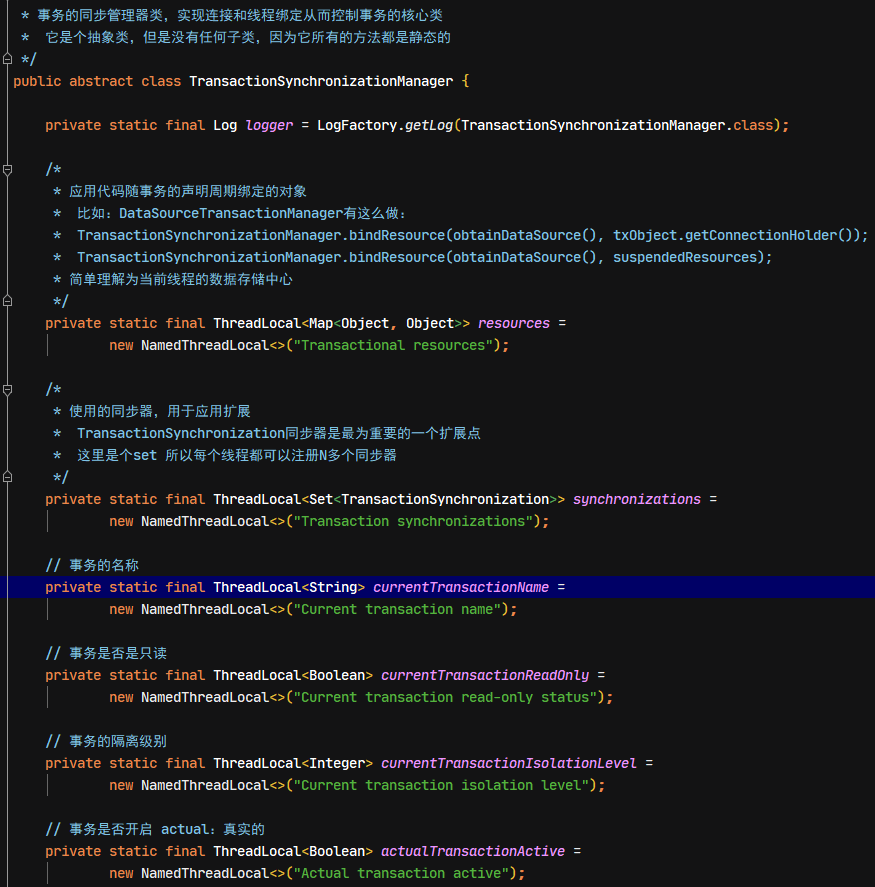
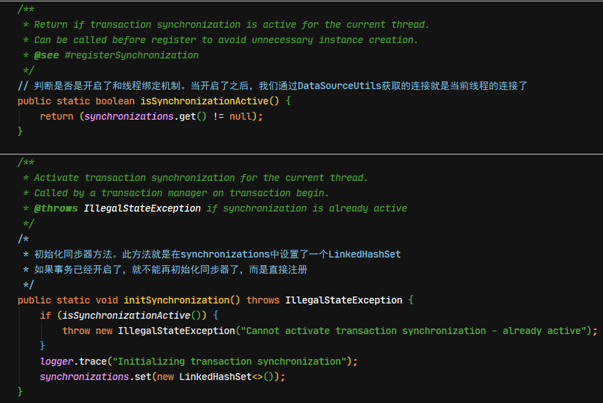
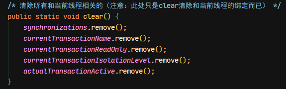

## 1. 声明式事务实现原理

主要通过 AOP/动态代理实现。

1. **在 Bean 初始化阶段创建代理对象**：Spring 容器在初始化每个单例 bean 的时候，会遍历容器中的所有 `BeanPostProcessor` 实现类，并执行其 `postProcessAfterInitialization` 方法，在执行 `AbstractAutoProxyCreator` 类的 `postProcessAfterInitialization` 方法时会遍历容器中所有的切面，查找与当前实例化 bean 匹配的切面，这里会获取事务属性切面，查找 `@Transactional` 注解及其属性值，然后根据得到的切面创建一个代理对象，默认是使用 JDK 动态代理创建代理，如果目标类是接口，则使用 JDK 动态代理，否则使用 Cglib。
2. **在执行目标方法时进行事务增强操作**：当通过代理对象调用 Bean 方法的时候，会触发对应的 AOP 增强拦截器，声明式事务是一种环绕增强，对应接口为 `MethodInterceptor`，事务增强对该接口的实现为`TransactionInterceptor`。事务拦截器 `TransactionInterceptor` 在 `invoke` 方法中，通过调用父类 `TransactionAspectSupport` 的 `invokeWithinTransaction` 方法进行事务处理，包括开启事务、事务提交、异常回滚。

## 2. Spring 事务相关注解源码分析

### 2.1. @EnableTransactionManagement 源码分析

`@EnableTransactionManagement`通过在`@Import`注解中传入`TransactionManagementConfigurationSelector`类，会给容器中导入两个组件：

- AutoProxyRegistrar
- ProxyTransactionManagementConfiguration

```java
/* Spring支持注解事务配置的标志，表明Spring开启注解事务配置的支持。 */
@Target(ElementType.TYPE)
@Retention(RetentionPolicy.RUNTIME)
@Documented
@Import(TransactionManagementConfigurationSelector.class)
public @interface EnableTransactionManagement {
    /* 指定基于目标类代理还是基于接口代理。默认采用JDK官方的基于接口代理。 */
	boolean proxyTargetClass() default false;

	/*
	 * 指定事务通知是如何执行的。默认是通过代理方式执行的。
	 * 如果是同一个类中调用的话，请采用AdviceMode.ASPECTJ
	 */
	AdviceMode mode() default AdviceMode.PROXY;

	/*
	 * 指示在特定连接点应用多个通知时事务处理的执行顺序。
	 * 默认值是：最低优先级（Integer.MAX_VALUE）
	 */
	int order() default Ordered.LOWEST_PRECEDENCE;
}
```

#### 2.1.1. TransactionManagementConfigurationSelector

`TransactionManagementConfigurationSelector`类的作用是给容器导入两个组件：`AutoProxyRegistrar`、`ProxyTransactionManagementConfiguration`

#### 2.1.2. AutoProxyRegistrar

`AutoProxyRegistrar` 此类的作用是给容器中注册一个 `InfrastructureAdvisorAutoProxyCreator` 组件

利用后置处理器机制在对象创建以后，包装对象，并返回一个代理对象（增强器），代理对象执行方法利用拦截器链进行调用。

#### 2.1.3. ProxyTransactionManagementConfiguration

`ProxyTransactionManagementConfiguration`使用`@Configuration`注解修饰，表明是一个配置类。

```java
@Configuration
public class ProxyTransactionManagementConfiguration extends AbstractTransactionManagementConfiguration {
	/* 此方法的作用：给容器中注册事务增强器transactionAdvisor */
	@Bean(name = TransactionManagementConfigUtils.TRANSACTION_ADVISOR_BEAN_NAME)
	@Role(BeanDefinition.ROLE_INFRASTRUCTURE)
	public BeanFactoryTransactionAttributeSourceAdvisor transactionAdvisor() {
		BeanFactoryTransactionAttributeSourceAdvisor advisor = new BeanFactoryTransactionAttributeSourceAdvisor();
		advisor.setTransactionAttributeSource(transactionAttributeSource());
		advisor.setAdvice(transactionInterceptor());
		if (this.enableTx != null) {
			advisor.setOrder(this.enableTx.<Integer>getNumber("order"));
		}
		return advisor;
	}

	/* 创建事务属性信息管理器 TransactionAttributeSource */
	@Bean
	@Role(BeanDefinition.ROLE_INFRASTRUCTURE)
	public TransactionAttributeSource transactionAttributeSource() {
		return new AnnotationTransactionAttributeSource();
	}

	/* 创建事务拦截器 TransactionInterceptor */
	@Bean
	@Role(BeanDefinition.ROLE_INFRASTRUCTURE)
	public TransactionInterceptor transactionInterceptor() {
		TransactionInterceptor interceptor = new TransactionInterceptor();
		interceptor.setTransactionAttributeSource(transactionAttributeSource());
		if (this.txManager != null) {
			interceptor.setTransactionManager(this.txManager);
		}
		return interceptor;
	}
}
```

1. `transactionAdvisor()`方法
    - 给容器中注册事务增强器`transactionAdvisor`
2. `transactionAttributeSource()`方法
    - 创建AnnotationTransactionAttributeSource解析事务注解，包含事务增强器要用事务注解的信息
3. `transactionInterceptor()`方法
    - 创建事务拦截器transactionInterceptor，保存了事务属性信息，事务管理器
    - `TransactionInterceptor`本身是一个 `MethodInterceptor`。在目标方法执行的时候，会`getAdvisors()`获取拦截器链，并执行拦截器链，当只有事务拦截器时：
        1. 先获取事务相关的属性
        2. 再获取`PlatformTransactionManager`，如果事先没有添加指定任何`transactionmanger`，最终会从容器中按照类型获取一个`PlatformTransactionManager`
        3. 执行目标方法。如果正常，利用事务管理器，提交事务；如果异常，获取到事务管理器，利用事务管理回滚操作。

### 2.2. @Transactional 源码分析

1. 在`@EnableTransactionManagement`注解中，有一个导入器：`TransactionManagementConfigurationSelector`，该导入器中在`AdiviceMode`为默认值`PROXY`时，往容器中注入了两个bean对象，`AutoProxyRegistrar`和`ProxyTransactionManagementConfiguration`
2. `ProxyTransactionManagementConfiguration`类中的一个方法`transactionAttributeSource()`，创建了一个注解事务的属性解析对象
3. `AnnotationTransactionAttributeSource`类的实例化，调用一个有参构造方法，在该方法中会判断注解的类型，此时会构建一个`SpringTransactionAnnotationParser`（事务注解解析器）
4. `SpringTransactionAnnotationParser`会进行注解解析，里面有多个重载`parseTransactionAnnotation`方法，用于解析传入的注解，事务的注解封装到`RuleBasedTransactionAttribute`对象，该对象其实就是`TransactionAttribute`。最后会存储到容器中，用于以后读取相关信息来进行事务的操作。

### 2.3. @TransactionalEventListener 源码分析

1. 在IoC容器加载时，执行`AbstractApplicationContext`的`refresh()`方法，在执行到`finishBeanFactoryInitialization(beanFactory)`方法时，就会初始化剩余的单例bean对象。
2. 初始化剩余单例bean对象.调用的是`DefaultListableBeanFactory`类中的`preInstantiateSingletons`方法。
3. `DefaultListableBeanFactory`类中的`preInstantiateSingletons`方法中执行了`afterSingletonsInstantiated()`方法。此方法是`SmartInitializingSingleton`接口中声明的。具体实现类包含：`EventListenerMethodProcessor`事件监听器方法处理器。
4. `EventListenerMethodProcessor`中的`afterSingletonsInstantiated`会被执行，该方法中包含处理bean的方法：`processBean`。
5. 在`processBean`方法中调用了创建事件监听器的方法`createApplicationListener`。该方法是`EventListenerFactory`接口中声明的方法。
6. `TransactionalEventListenerFactory`类实现了`EventListenerFactory`接口，并重写了`createApplicationListener`方法。
7. `ApplicationListenerMethodTransactionalAdapter`的实例化。至此，解析`TransactionalEventListener`注解的过程完成

## 3. 事务涉及相关类源码分析

### 3.1. TransactionTemplate

`TransactionTemplate`类是用于编程式事务的模板对象。其中实现编程式事务控制的核心方法是重写了`TransactionOperations`接口中的`execute()`方法

```java
/* 编程事务控制的核心方法,重写的是TransactionOperations接口中的方法 */
@Override
@Nullable
public <T> T execute(TransactionCallback<T> action) throws TransactionException {
	Assert.state(this.transactionManager != null, "No PlatformTransactionManager set");

	/*
	 * 判断当前事务管理器是否为CallbackPreferringPlatformTransactionManager类型，
	 * 如果是的话，直接使用该接口实现类中的execute方法执行。
	 * 而无需继续让PlatformTransactionManager的实现类控制事务，
	 * 当前坐标环境下它只有一个实现类：WebSphereUowTransactionManager
	 */
	if (this.transactionManager instanceof CallbackPreferringPlatformTransactionManager) {
		return ((CallbackPreferringPlatformTransactionManager) this.transactionManager).execute(this, action);
	}
	else {
		// 需要借助PlatformTransactionManager的实现类控制事务
		TransactionStatus status = this.transactionManager.getTransaction(this);
		T result;
		try {
			/*
			 * 执行TransactionCallback中的doInTransaction方法，此处又是策略模式。
			 * spring只提供了一个接口（还有一个抽象实现类），而具体需要事务支持的业务代码由使用者提供。
			 */
			result = action.doInTransaction(status);
		}
		catch (RuntimeException | Error ex) {
			// Transactional code threw application exception -> rollback
			// 当doInTransaction执行有异常时事务回滚
			rollbackOnException(status, ex);
			throw ex;
		}
		catch (Throwable ex) {
			// Transactional code threw unexpected exception -> rollback
			// 当doInTransaction执行有无法预知的异常时，事务回滚。
			rollbackOnException(status, ex);
			throw new UndeclaredThrowableException(ex, "TransactionCallback threw undeclared checked exception");
		}
		// 没有异常，则事务提交
		this.transactionManager.commit(status);
		// 返回执行结果（有可能是结果集，也有可能是影响数据库记录的行数）
		return result;
	}
}
```

### 3.2. DataSourceUtils

`DataSourceUtils`是Spring中数据源的工具类。里面定义着获取连接的方法

```java
/* spring中数据源的工具类。里面定义着获取连接的方法 */
public abstract class DataSourceUtils {
    // ....省略部分代码....
	/* 获取连接的方法，它本身没有任何操作而是调用了doGetConnection */
	public static Connection getConnection(DataSource dataSource) throws CannotGetJdbcConnectionException {
		try {
			// 真正获取连接的方法
			return doGetConnection(dataSource);
		}
		catch (SQLException ex) {
			throw new CannotGetJdbcConnectionException("Failed to obtain JDBC Connection", ex);
		}
		catch (IllegalStateException ex) {
			throw new CannotGetJdbcConnectionException("Failed to obtain JDBC Connection: " + ex.getMessage());
		}
	}

	/* 从数据源中获取连接的方法 */
	public static Connection doGetConnection(DataSource dataSource) throws SQLException {
		Assert.notNull(dataSource, "No DataSource specified");

		// 通过事务同步管理器对象获取连接持有者对象
		ConnectionHolder conHolder = (ConnectionHolder) TransactionSynchronizationManager.getResource(dataSource);
		/*
		 * 当连接持有者不为null时，并且再满足连接持有者有连接或者是同步的事务其中任何一个条件，则直接返回连接持有者的连接对象。
		 * synchronizedWithTransaction默认值为false。
		 * 但是在DataSourceTransactionManager中的doBegin方法中对synchronizedWithTransaction属性赋值为true了
		 */
		if (conHolder != null && (conHolder.hasConnection() || conHolder.isSynchronizedWithTransaction())) {
			conHolder.requested();
			// 如果ConnectionHandle为null，则返回false，此处取反。就表示ConnectionHandle为null时，进入if代码块中，给ConnectionHolder设置一个连接
			if (!conHolder.hasConnection()) {
				logger.debug("Fetching resumed JDBC Connection from DataSource");
				conHolder.setConnection(fetchConnection(dataSource));
			}
			// 返回ConnectionHolder对象中的连接
			return conHolder.getConnection();
		}
		// Else we either got no holder or an empty thread-bound holder here.

		logger.debug("Fetching JDBC Connection from DataSource");
		// 如果不满足上面的条件，则从数据源中获取一个连接
		Connection con = fetchConnection(dataSource);

		// 判断是否激活了事务同步器
		if (TransactionSynchronizationManager.isSynchronizationActive()) {
			logger.debug("Registering transaction synchronization for JDBC Connection");
			// Use same Connection for further JDBC actions within the transaction.
			// Thread-bound object will get removed by synchronization at transaction completion.
			// 在激活同步的条件下，如果ConnectionHolder为null就创建连接持有者对象
			ConnectionHolder holderToUse = conHolder;
			if (holderToUse == null) {
				// 创建连接持有者对象
				holderToUse = new ConnectionHolder(con);
			}
			else {
				// 如已经存在的连接持有者，直接使用并把获取到的连接填充进去
				holderToUse.setConnection(con);
			}
			holderToUse.requested();
			// 注册同步器
			TransactionSynchronizationManager.registerSynchronization(
					new ConnectionSynchronization(holderToUse, dataSource));
			// 设置snchronizedWithTransaction属性为true
			holderToUse.setSynchronizedWithTransaction(true);
			// 判断当新创建了连接持有者时
			if (holderToUse != conHolder) {
				// 从名称为Transactional resources的ThreadLocal中获取绑定的Map，并把数据源和ConnectionHolder存入map中
				TransactionSynchronizationManager.bindResource(dataSource, holderToUse);
			}
		}
		// 此时如果激活了事务同步管理器，则返回当前线程的连接。如果没激活，返回的就是数据源中拿到的连接
		return con;
	}

	/* 从数据源中获取一个连接的方法，此时没有和线程绑定 */
	private static Connection fetchConnection(DataSource dataSource) throws SQLException {
		// 从数据源中获取一个连接
		Connection con = dataSource.getConnection();
		// 判断连接是否为空。如果没有，则表示数据源中没有连接
		if (con == null) {
			throw new IllegalStateException("DataSource returned null from getConnection(): " + dataSource);
		}
		// 返回拿到的连接对象
		return con;
	}
	// ....省略其余代码....
}
```

### 3.3. TransactionSynchronizationManager

`TransactionSynchronizationManager`事务的同步管理器类，实现连接和线程绑定从而控制事务的核心类。它是个抽象类，但是没有任何子类，因为它所有的方法都是静态的







### 3.4. TransactionAwareDataSourceProxy

`TransactionAwareDataSourceProxy`是Spring提供的一个数据源代理类，它继承了`DelegatingDataSource`类。而`DelegatingDataSource`类实现了`javax.sql.DataSource`接口。

Spring通过装饰者模式，把原始DataSource中一些不希望用户直接使用的方法又套了一个壳子。因为数据连接泄露是个很头疼的问题，Spring框架也提供了很多种办法来避免这个问题。

比如使用XXXTemplate，当然其背后是`DataSourceUtils`。同时还有另外一种办法，使用`TransactionAwareDataSourceProxy`。通过`TransactionAwareDataSourceProxy`对数据源代理后，数据源对象就有了事务上下文感知的能力了。通过源码会发现，其实它还是使用的`DataSourceUtils`

### 3.5. High-level Synchronization Approach和Low-level Synchronization Approach

#### 3.5.1. High-level Synchronization Approach

首选的方法是使用基于Spring的和持久化集成的API高级模板，或者使用原生的ORM API，应用于事务支持型工厂bean或者管理原生资源的工厂的代理。这些事务型解决方案内建对资源创建、重用、清理、资源的可选事务同步以及异常的映射的支持。这样用户的数据访问代码就可以不再关心定位任务，专心于非样板化的持久化逻辑。通常，使用原生的ORM API或者使用JdbcTemplate的方法来进行JDBC访问

#### 3.5.2. Low-level Synchronization Approach

像DataSourceUtils (JDBC), EntityManagerFactoryUtils (JPA), SessionFactoryUtils(Hibernate), PersistenceManagerFactoryUtils (JDO), 等等这些类都是属于低级方法中的。当你的代码想要直接使用有关本地持久化事务API的时候，你需要让这些类明确Spring 框架管理的实例已经得到了，事务已经同步好了（可选的），并且异常运行中的异常也都会映射到一个一致的API

例如, 在JDBC的例子中, 可以使用Spring框架中提供的`org.springframework.jdbc.datasource.Datasourceutils`类，而不是对数据源调用`getconnection()`这种原始JDBC方法，就像这样：`Connection conn = DataSourceUtils.getConnection(dataSource);`

如果存在一个已经和他同步(已连接)的事务，那就返回它。否则，方法就会激发一个触发器创建一个新的连接，并且是(可选的)与任何存在的事务同步的，并且已经准备好在接下来在相同的事务中重用。就像提到的那样，所有的SQLException都会被包装成Spring Framework的CannotGetJdbcConnectionException，这是 Spring Framework的非检查型数据访问异常(DataAccessExceptions)的一种层次。这个方法给你的信息比 SQLException给你的信息多，并且确保跨数据库，即使是不同的持久化技术的可移植性

该方法同样可以独立于Spring事务管理工作(事务同步是可选的)，所以可以使用它不管是使用或者不使用Spring的事务管理
