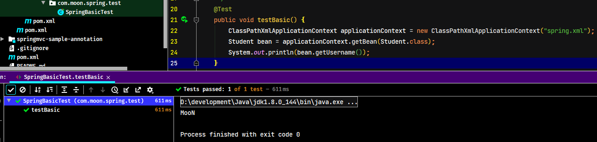

# Spring 源码分析01 - 底层核心概念解析

> 官方参考文档：https://docs.spring.io/spring-framework/docs/5.2.12.RELEASE/spring-framework-reference/

## 1. IOC相关理论

### 1.1. 设计模式-工厂模式

工厂模式是最常用的实例化对象模式了，它是用工厂中的方法代替new创建对象的一种设计模式。

### 1.2. IOC（Inversion of Control）控制反转

控制反转（IOC），它不是一个技术，而是一种思想。其作用是用于削减代码间的耦合。它的实现思想就是利用了工厂设计模式，把创建对象代码从具体类中剥离出去，交由工厂来完成，从而降低代码间的依赖关系。耦合有如下分类：

1. 内容耦合。当一个模块直接修改或操作另一个模块的数据时，或一个模块不通过正常入口而转入另一个模块时，这样的耦合被称为内容耦合。内容耦合是最高程度的耦合，应该避免使用之。
2. 公共耦合。两个或两个以上的模块共同引用一个全局数据项，这种耦合被称为公共耦合。在具有大量公共耦合的结构中，确定究竟是哪个模块给全局变量赋了一个特定的值是十分困难的。
3. 外部耦合。一组模块都访问同一全局简单变量而不是同一全局数据结构，而且不是通过参数表传递该全局变量的信息，则称之为外部耦合。
4. 控制耦合。一个模块通过接口向另一个模块传递一个控制信号，接受信号的模块根据信号值而进行适当的动作，这种耦合被称为控制耦合。
5. 标记耦合。若一个模块A通过接口向两个模块B和C传递一个公共参数，那么称模块B和C之间存在一个标记耦合。
6. 数据耦合。模块之间通过参数来传递数据，那么被称为数据耦合。数据耦合是最低的一种耦合形式，系统中一般都存在这种类型的耦合，因为为了完成一些有意义的功能，往往需要将某些模块的输出数据作为另一些模块的输入数据。
7. 非直接耦合。两个模块之间没有直接关系，它们之间的联系完全是通过主模块的控制和调用来实现的。

解耦的必要性在于，耦合是影响软件复杂程度和设计质量的一个重要因素，在设计上应采用以下原则：如果模块间必须存在耦合，就尽量使用数据耦合，少用控制耦合，限制公共耦合的范围，尽量避免使用内容耦合。

### 1.3. DI（Dependency Injection）依赖注入

依赖注入（DI），是 Spring 框架核心 IOC 的具体实现。IOC 解耦只是降低他们的依赖关系，但不会消除。比如：业务层需要依赖数据层的方法。

## 2. Spring 源码分析准备工作

> 注：下载spring源码并写注释，里面会标识相应方法的重要程度：1~5。
>
> - 0：不重要，可以不看
> - 1：一般重要，可看可不看
> - 5：非常重要，一定要看

### 2.1. 源码的下载与编译

详见[《Spring 源码编译教程》](/后端框架/03-Spring/05-Spring源码编译教程)

### 2.2. 创建 Spring 最基础示例项目

- 创建maven项目，修改pom.xml导入 spring 依赖。其中 spring 中最核心的4个jar如下
    - spring-beans
    - spring-core
    - spring-context
    - spring-expression
- 一个最简单的 spring 工程，理论上就只需要依赖一个 spring-context 就足够了

1. 创建pom父工程，此工程包含所有示例项目

```xml
<?xml version="1.0" encoding="UTF-8"?>
<project xmlns="http://maven.apache.org/POM/4.0.0"
         xmlns:xsi="http://www.w3.org/2001/XMLSchema-instance"
         xsi:schemaLocation="http://maven.apache.org/POM/4.0.0 http://maven.apache.org/xsd/maven-4.0.0.xsd">
    <parent>
        <artifactId>spring-analysis-note</artifactId>
        <groupId>com.moon</groupId>
        <version>1.0-SNAPSHOT</version>
    </parent>

    <modelVersion>4.0.0</modelVersion>
    <artifactId>spring-source-study-2021</artifactId>
    <packaging>pom</packaging>
    <name>${project.artifactId}</name>
    <description>
        Spring Framework 5.2.8.RELEASE 版本的源码学习案例工程(包括基础使用示例、涉及设计模式示例) - 2021年整理版本
    </description>
    <modules>
        <module>01-spring-basic</module>
    </modules>

    <!-- 版本号管理 -->
    <properties>
        <spring.version>5.2.8.RELEASE</spring.version>
        <lombok.version>1.18.4</lombok.version>
        <junit.version>4.13</junit.version>
        <slf4j.version>1.7.10</slf4j.version>
        <logback.version>1.1.2</logback.version>
    </properties>

    <!-- 版本控制 -->
    <dependencyManagement>
        <dependencies>
            <!-- spring framework 核心依赖 -->
            <dependency>
                <groupId>org.springframework</groupId>
                <artifactId>spring-context</artifactId>
                <version>${spring.version}</version>
            </dependency>

            <!-- junit测试框架 -->
            <dependency>
                <groupId>junit</groupId>
                <artifactId>junit</artifactId>
                <version>${junit.version}</version>
            </dependency>

            <!-- 日志相关依赖 -->
            <dependency>
                <groupId>org.slf4j</groupId>
                <artifactId>slf4j-api</artifactId>
                <version>${slf4j.version}</version>
            </dependency>
            <dependency>
                <groupId>ch.qos.logback</groupId>
                <artifactId>logback-classic</artifactId>
                <version>${logback.version}</version>
            </dependency>
            <dependency>
                <groupId>ch.qos.logback</groupId>
                <artifactId>logback-core</artifactId>
                <version>${logback.version}</version>
            </dependency>

            <!-- 工具框架 -->
            <dependency>
                <groupId>org.projectlombok</groupId>
                <artifactId>lombok</artifactId>
                <version>${lombok.version}</version>
            </dependency>
        </dependencies>
    </dependencyManagement>

    <!-- 公共依赖 -->
    <dependencies>
        <dependency>
            <groupId>junit</groupId>
            <artifactId>junit</artifactId>
            <scope>test</scope>
        </dependency>

        <dependency>
            <groupId>org.projectlombok</groupId>
            <artifactId>lombok</artifactId>
        </dependency>
    </dependencies>

</project>
```

2. 创建子项目，只需要引入 spring-context 的依赖，其包本身就依赖了 spring-aop，spring-beans，spring-core 等模块jar包

```xml
<?xml version="1.0" encoding="UTF-8"?>
<project xmlns="http://maven.apache.org/POM/4.0.0"
         xmlns:xsi="http://www.w3.org/2001/XMLSchema-instance"
         xsi:schemaLocation="http://maven.apache.org/POM/4.0.0 http://maven.apache.org/xsd/maven-4.0.0.xsd">
    <parent>
        <artifactId>spring-source-study-2021</artifactId>
        <groupId>com.moon</groupId>
        <version>1.0-SNAPSHOT</version>
    </parent>

    <modelVersion>4.0.0</modelVersion>
    <artifactId>01-spring-basic</artifactId>
    <packaging>war</packaging>
    <name>${project.artifactId}</name>
    <description>Spring Framework 基础入门示例</description>

    <dependencies>
        <!--
            spring框架最核心的依赖，一个最基本的spring项目只需要引入此依赖即可
                此依赖包括：spring-context,spring-aop,spring-beans,spring-core,spring-expression
        -->
        <dependency>
            <groupId>org.springframework</groupId>
            <artifactId>spring-context</artifactId>
        </dependency>
    </dependencies>

</project>
```

3. 创建一个spring的xml配置文件

```xml
<beans xmlns="http://www.springframework.org/schema/beans"
       xmlns:xsi="http://www.w3.org/2001/XMLSchema-instance"
       xmlns:context="http://www.springframework.org/schema/context"
       xmlns:aop="http://www.springframework.org/schema/aop"
       xmlns:p="http://www.springframework.org/schema/p"
       xmlns:c="http://www.springframework.org/schema/c"
       xsi:schemaLocation="
	http://www.springframework.org/schema/beans
	http://www.springframework.org/schema/beans/spring-beans.xsd
    http://www.springframework.org/schema/context
    http://www.springframework.org/schema/context/spring-context.xsd
    http://www.springframework.org/schema/aop
	http://www.springframework.org/schema/aop/spring-aop-3.2.xsd"
       default-lazy-init="false">

    <bean id="student" class="com.moon.spring.bean.Student"/>

</beans>
```

4. 编写示例方法

```java
@Test
public void testBasic() {
    ClassPathXmlApplicationContext applicationContext = new ClassPathXmlApplicationContext("spring.xml");
    Student bean = applicationContext.getBean(Student.class);
    System.out.println(bean.getUsername());
}
```



5. 一个空的 spring 工程是不能打印日志的，要导入 spring 依赖的日志 jar 包

```xml
<!-- spring 框架输出日志的依赖包 -->
<dependency>
    <groupId>org.slf4j</groupId>
    <artifactId>slf4j-api</artifactId>
</dependency>
<dependency>
    <groupId>ch.qos.logback</groupId>
    <artifactId>logback-classic</artifactId>
</dependency>
<dependency>
    <groupId>ch.qos.logback</groupId>
    <artifactId>logback-core</artifactId>
</dependency>
```


## 3. Spring 基础

### 3.1. spring 配置文件中xsd文件引入

XSD 是编写 xml 文件的一种规范，有了这个规范才能校验当前 xml 文件是否准确，在 spring 中同样有 XSD 规范。

### 3.2. spring 容器加载方式（了解）

现在实际项目中几乎用不到

#### 3.2.1. ClassPathXmlApplicationContext(类路径获取配置文件上下文对象)

比较常用的上下文对象，用于启动时读取类路径下的配置文件，创建xml的上下文对象

```java
/* 类路径获取配置文件上下文对象（ClassPathXmlApplicationContext） */
@Test
public void testClassPathXmlApplicationContext() {
    // 读取spring类路径下的配置文件
    ClassPathXmlApplicationContext applicationContext = new ClassPathXmlApplicationContext("spring.xml");
    Student student = (Student) applicationContext.getBean("student");
    System.out.println(student.getUsername());
}
```

#### 3.2.2. FileSystemXmlApplicationContext(文件系统路径【绝对路径】获取配置文件上下文对象)

此上下文对象很少使用，一般都使用类路径读取配置文件的上下文对象

```java
/* 文件系统路径获取配置文件【绝对路径】上下文对象（FileSystemXmlApplicationContext）【基本上不用】 */
@Test
public void testFileSystemXmlApplicationContext() {
    // 读取spring的配置文件，需要绝对路径
    FileSystemXmlApplicationContext applicationContext = new FileSystemXmlApplicationContext("D:\\code\\spring-note\\spring.xml");
    Student student = (Student) applicationContext.getBean("student");
    System.out.println(student.getUsername());
}
```

#### 3.2.3. AnnotationConfigApplicationContext(无配置文件加载容器上下文对象)

此上下文对象也比较少用，一般在测试用例中使用比较多，因为可以直接扫描指定的包，获取包下所有有spring注解标识的类实例

```java
private static final String BASE_PACKAGE = "com.moon.spring";

/* 无配置文件加载容器上下文对象（AnnotationConfigApplicationContext） */
@Test
public void testAnnotationConfigApplicationContext() {
    // 注解扫描上下文对象
    AnnotationConfigApplicationContext applicationContext = new AnnotationConfigApplicationContext(BASE_PACKAGE);
    BeanWithAnnotation bean = (BeanWithAnnotation) applicationContext.getBean("beanWithAnnotation");
    System.out.println(bean.getData());
}
```

#### 3.2.4. EmbeddedWebApplicationContext(SpringBoot 加载容器)

此上下文对象是spring boot的框架，启动的时候可以创建一个嵌入式的tomcat

```xml
<!-- springboot web 的依赖，用于引入EmbeddedWebApplicationContext类 -->
<dependency>
    <groupId>org.springframework.boot</groupId>
    <artifactId>spring-boot</artifactId>
    <version>1.5.17.RELEASE</version>
</dependency>
<dependency>
    <groupId>org.springframework</groupId>
    <artifactId>spring-webmvc</artifactId>
</dependency>
<dependency>
    <groupId>javax.servlet</groupId>
    <artifactId>servlet-api</artifactId>
    <version>2.5</version>
</dependency>
```

```java
/* springboot 加载容器的上下文对象（EmbeddedWebApplicationContext） */
@Test
public void testEmbeddedWebApplicationContext() {
    // springboot在启动的时候就会用到此上下文对象，启动spring容器，创建一个嵌入式的tomcat
    new EmbeddedWebApplicationContext();
}
```

### 3.3. Bean 实例注册到 Spring 容器的方式

#### 3.3.1. 使用xml配置

最传统的配置方式，通过xml配置文件，配置需要实例化类的全限定名称，与实例id

```xml
<!-- 注册bean到spring容器方式1: 使用xml配置文件配置 -->
<bean id="student" class="com.moon.spring.common.bean.Student"/>
```

```java
@Test
public void testXmlRegisterBean() {
    ClassPathXmlApplicationContext context = new ClassPathXmlApplicationContext("spring.xml");
    Student student = context.getBean("student", Student.class);
    System.out.println(student);
    Assert.assertNotNull(student);
}
```

#### 3.3.2. 使用注解

通过在需要spring实例化与管理的类上标识`@Component`等注解，开启包扫描

```java
/**
 * 注册bean到spring容器方式2: 使用@Component等注解配置
 */
@Data
@Component
public class Dog {
    private String name;
    private int age;
}
```

```java
@Test
public void testAnnotationRegisterBean() {
    AnnotationConfigApplicationContext context = new AnnotationConfigApplicationContext("com.moon.spring");
    Dog dog = context.getBean("dog", Dog.class);
    System.out.println(dog);
    Assert.assertNotNull(dog);
}
```

#### 3.3.3. 通过BeanFactory手动注册

通过阅读源码，在spring的核心流程中的`initApplicationEventMulticaster`初始化事件管理器的方式是手动创建管理器实例，然后通过`BeanFactory`的`registerSingleton`手动注册到spring容器

```java
@Data
public class Fish {
    private String name;
    private String color;
}
```

测试代码

```java
@Test
public void testBeanFactoryRegisterBean() {
    AnnotationConfigApplicationContext context = new AnnotationConfigApplicationContext("com.moon.spring");
    // 获取bean实例工厂
    ConfigurableListableBeanFactory beanFactory = context.getBeanFactory();
    // 获取目前容器中所有实例的名称
    System.out.println("===== 手动注册Fish实例前 =====");
    for (String singletonName : beanFactory.getSingletonNames()) {
        System.out.println(singletonName);
    }

    // 实例工厂注册实例
    beanFactory.registerSingleton("fish", new Fish());
    // 获取目前容器中所有实例的名称
    System.out.println("===== 手动注册Fish实例后 =====");
    for (String singletonName : beanFactory.getSingletonNames()) {
        System.out.println(singletonName);
    }

    // 通过实例工厂删除实例
    ((DefaultListableBeanFactory) beanFactory).destroySingleton("dog");
    // 获取目前容器中所有实例的名称
    System.out.println("===== 删除容器中的Dog实例后 =====");
    for (String singletonName : beanFactory.getSingletonNames()) {
        System.out.println(singletonName);
    }
}
```

## 4. Spring 框架涉及的设计模式

### 4.1. 设计模式1 - 模板设计模式

在 spring 中大量的使用了模板设计模式，可以说是用得最多的设计模式。

模板设计模式demo代码详见：spring-analysis-note项目中的spring-source-study-2021\00-spring-design-patterns\01-design-patterns-template-method模块中demo

**模板设计模式的核心是：创建抽象类或者接口，定义一个主业务方法，而主业务方法有些业务逻辑可以抽象类已经实现，在主业务方法中预留了一些抽象方法，这些抽象方法由子类继承(或实现)的时候实现该方法的业务逻辑，到根据不同的业务场景，使用不同的子类，从而在调用父类主业务方法时，实现不同的（子类）业务逻辑**

> 注：模板类中的主业务可以使用final声明此方法，从而子类不可以重写，只能继承使用。至于其他的抽象方法，子类可以实现自己的业务逻辑，

spring框架中使用模板设计模式案例


### 4.2. 设计模式2 - 委托模式(代理模式)

有两个对象参与处理同一个请求，接受请求的对象将请求委托给另一个对象来处理

### 4.3. 设计模式3 - 装饰模式

- 装饰模式主要分几个元素
    1. 被装饰者：已存在的具体对象，需要被增强的对象
    2. 抽象装饰者：具体对象与装饰对象的共同父接口
    3. 装饰者对象：对具体对象进行功能的增强，进行装饰的类。对方法进行增强。(自定义的类)

装饰者设计模式demo详见：moonzero-system项目中的mz-learning-springsource模块，`com.moon.learningspring.designPattern.decorator`包下的demo

### 4.4. SPI 设计思想

#### 4.4.1. SPI是什么

SPI全称Service Provider Interface，是Java提供的一套用来被第三方实现或者扩展的API，它可以用来启用框架扩展和替换组件。整体机制图如下：


<font color=red>**Java SPI 实际上是“基于接口的编程＋策略模式＋配置文件”组合实现的动态加载机制。**</font>

#### 4.4.2. Java SPI 机制基础实现

要使用Java SPI，需要遵循如下约定：

1. 当服务提供者提供了接口的一种具体实现后，在jar包的`META-INF/services`目录下创建一个以“接口全限定名”为命名的文件，内容为实现类的全限定名；
2. 接口实现类所在的jar包放在主程序的classpath中；
3. 主程序通过`java.util.ServiceLoder`动态装载实现模块，它通过扫描`META-INF/services`目录下的配置文件找到实现类的全限定名，把类加载到JVM；
4. SPI的实现类必须携带一个不带参数的构造方法；

自定义标签的解析就是一个 SPI 设计思想，即通过加装全文配置文件，做到代码灵活的调用案例。实现步骤如下：

1. 定义一个服务提供接口

```java
package com.moon.spring.spi;

/**
 * service provider interface
 * <P>服务提供接口，需要提供一个可配置的服务接口的实现类</P>
 */
public interface SpiService {
    String query(String param)
}
```

2. 编写服务接口的实现类

```java
package com.moon.spring.spi;

/**
 * SPI 服务接口实现
 */
public class SpiServiceImpl implements SpiService {
    @Override
    public String query(String param) {
        System.out.println(String.format("=======SpiServiceImpl.query(%s)方法执行了======", param));
        return "OK";
    }
}
```

3. 在 resources 目录下创建 META-INF/services 文件夹，创建文件（文件的名称为服务接口全限定名）


4. 这样就可以通过这个接口，找到配置在文件中的所有该接口的实现类（可以是多个实现类）。
    - **这种设计的好处是：实现业务代码解耦，扩展性高。**核心的业务不需要再修改，日后增加新的业务需求时，可以通过增加新的实现类与修改配置文件即可
    - 缺点是：粒度不够细，通过配置的方式不能唯一确定一个实现类

```java
package com.moon.spring.spi;

import java.util.ServiceLoader;

/**
 * SPI 服务接口测试
 */
public class SpiTest {
    /**
     * 此设计的好处是：实现业务代码解耦，扩展性高。核心的业务不需要再修改，日后增加新的业务需求时，可以通过增加新的实现类与修改配置文件即可
     * 缺点是：粒度不够细，通过配置的方式不能唯一确定一个实现类
     */
    public static void main(String[] args) {
        // 通过jdk的api，ServiceLoader获取配置文件中定义所有实现类实例
        ServiceLoader<SpiService> load = ServiceLoader.load(SpiService.class);

        // 调用实现类的业务方法
        for (SpiService spiService : load) {
            spiService.query("呵呵");
        }
    }
}
```

#### 4.4.3. spring 框架对spi设计的运用

spring 中自定义标签的解析就是这种 SPI 设计的运用，在自定义标签中解析的过程中，spring 会去加载 META-INF/spring.handlers 文件，然后建立映射关系，程序在解析标签头的时候，如：`<context:>`这种的标签头。会拿到一个 namespaceUri，然后再从映射关系中找到这个 namespaceUri 所对应的处理类


#### 4.4.4. 扩展：dubbo对spi的优化(有时间研究)

dubbo在spi的配置文件中，设置为key-value的形式，这样在xml配置文件中配置相关属性，就可以唯一的确认一个实现类。

## 5. Spring 中的 BeanDefinition

### 5.1. BeanDefinition 简介

```java
public interface BeanDefinition extends AttributeAccessor, BeanMetadataElement
```

BeanDefinition 在 spring 中贯穿全部，spring 要根据 BeanDefinition 对象来实例化 bean，只要把解析的标签或者扫描的注解类封装成 BeanDefinition 对象，spring 才能实例化 bean。BeanDefinition 中存在很多属性用来描述一个 Bean 的特点

#### 5.1.1. 作用说明

Spring 的容器是用于存储 bean 对象。通常对于容器中存储 bean 的理解是一个个对应配置文件中的 `<bean/>` 标签或者是被注解的类，但是这些都是 bean 的静态表示，是还没有放入容器的物料，最终（<font color=red>**加载完配置，且在 getBean 之前**</font>）加载到容器中的是一个个 `BeanDefinition` 实例。

BeanDefinition 的继承关系如下图，`RootBeanDefinition`、`ChildBeanDefinition`，以及 `GenericBeanDefinition` 是三个主要的实现。

在配置时，通过 `parent` 属性指定 bean 的父子关系，这个时候父 bean 则用 `RootBeanDefinition` 表示，而子 bean 则用 `ChildBeanDefinition` 表示。`GenericBeanDefinition` 自 2.5 版本引入，是对于一般的 bean 定义的一站式服务中心。

#### 5.1.2. BeanDefinition类视图


### 5.2. Bean 的定义方式

#### 5.2.1. 申明式定义

在 Spring 中，通常有以下几种方式来定义Bean：

- xml 配置文件中定义 `<bean/>` 标签
- 在配置类中使用 `@Bean` 注解
- 在类上标识 `@Component` 注解及其衍生注解（`@Service`, `@Controller` 等）

#### 5.2.2. 编程式定义

也可以直接通过 java 代码创建 BeanDefinition 对象来完成 Bean 的定义

```java
// 创建容器
AnnotationConfigApplicationContext context = new AnnotationConfigApplicationContext(AppConfig.class);

// 生成一个BeanDefinition对象，并设置beanClass为User.class，并注册到ApplicationContext中
AbstractBeanDefinition beanDefinition = BeanDefinitionBuilder.genericBeanDefinition().getBeanDefinition();
beanDefinition.setBeanClass(User.class);
// 还可以通过BeanDefinition设置一个Bean的其他属性
beanDefinition.setScope("prototype"); // 设置作用域
beanDefinition.setInitMethodName("init"); // 设置初始化方法
beanDefinition.setLazyInit(true); // 设置懒加载

// 注册 BeanDefinition
context.registerBeanDefinition("user", beanDefinition);

// 通过 getBean 方法获取实例
System.out.println(context.getBean("user"));
```

### 5.3. BeanDefinition 接口与实现类

#### 5.3.1. AbstractBeanDefinition 抽象类

**源码分析**

```java
/*
 * RootBeanDefinition，ChildBeanDefinition，GenericBeanDefinition三个类都是由AbstractBeanDefinition派生而来
 * 该抽象类中包含了bean的所有配置项和一些支持程序运行的属性。
 */
public abstract class AbstractBeanDefinition extends BeanMetadataAttributeAccessor
		implements BeanDefinition, Cloneable {
    ......省略定义的变量

	/* bean 对应的类实例 */
	@Nullable
	private volatile Object beanClass;
	/* bean的作用域，对应scope属性 */
	@Nullable
	private String scope = SCOPE_DEFAULT;
	/* 是否是抽象类，对应abstract属性 */
	private boolean abstractFlag = false;
	/* 是否延迟加载，对应lazy-init属性 */
	private boolean lazyInit = false;
	/* 自动装配模式，对应autowire属性 */
	private int autowireMode = AUTOWIRE_NO;
	/* 依赖检查，对应dependency-check属性 */
	private int dependencyCheck = DEPENDENCY_CHECK_NONE;

	/* 对应depends-on，表示一个bean实例化前置依赖另一个bean */
	@Nullable
	private String[] dependsOn;
	/* 对应autowire-candidate属性，设置为false时表示取消当前bean作为自动装配候选者的资格 */
	private boolean autowireCandidate = true;
	/* 对应primary属性，当自动装配存在多个候选者时，将其作为首选 */
	private boolean primary = false;
	/* 对应qualifier属性 */
	private final Map<String, AutowireCandidateQualifier> qualifiers = new LinkedHashMap<>();

	@Nullable
	private Supplier<?> instanceSupplier;
	/* 非配置项：表示允许访问非公开的构造器和方法，由程序设置 */
	private boolean nonPublicAccessAllowed = true;

	/*
	 * 非配置项：表示是否允许以宽松的模式解析构造函数，由程序设置
	 * 	例如：如果设置为true，则在下列情况时不会抛出异常
	 * 		interface ITest{}
	 * 		class ITestImpl implements ITest {}
	 * 		class Main {
	 * 			Main(ITest i){}
	 * 			Main(ITestImpl i){}
	 * 		}
	 */
	private boolean lenientConstructorResolution = true;
	/* 对应factory-bean属性 */
	@Nullable
	private String factoryBeanName;
	/* 对应factory-method属性 */
	@Nullable
	private String factoryMethodName;
	/* 记录构造函数注入属性，对应<construct-arg/>标签 */
	@Nullable
	private ConstructorArgumentValues constructorArgumentValues;
	/* 记录<property/>属性集合 */
	@Nullable
	private MutablePropertyValues propertyValues;
	/* 记录<lookup-method/>和<replaced-method/>标签配置 */
	@Nullable
	private MethodOverrides methodOverrides;
	/* 对应init-method属性 */
	@Nullable
	private String initMethodName;
	/* 对应destroy-method属性 */
	@Nullable
	private String destroyMethodName;
	/* 非配置项：是否执行init-method，由程序设置 */
	private boolean enforceInitMethod = true;
	/* 非配置项：是否执行destroy-method，由程序设置 */
	private boolean enforceDestroyMethod = true;
	/* 非配置项：表示是否是用户定义，而不是程序定义的，创建AOP时为true,由程序设置 */
	private boolean synthetic = false;
	/*
	 * 非配置项：定义bean的应用场景，由程序设置，角色如下：
	 * 		ROLE_APPLICATION：用户
	 * 		ROLE_INFRASTRUCTURE：完全内部使用
	 * 		ROLE_SUPPORT：某些复杂配置的一部分
	 */
	private int role = BeanDefinition.ROLE_APPLICATION;
	/* bean的描述信息，对应description标签 */
	@Nullable
	private String description;
	/* bean定义的资源 */
	@Nullable
	private Resource resource;

    ......省略定义的方法
}
```

**总结**：`BeanDefinition` 是容器对于bean配置的内部表示，Spring 将各个 bean 的 `BeanDefinition` 实例注册记录在 `BeanDefinitionRegistry` 中，该接口定义了对 `BeanDefinition` 的各种增删查操作，类似于内存数据库，其实现类 `SimpleBeanDefinitionRegistry` 主要以 Map 作为存储标的。

#### 5.3.2. RootBeanDefinition 类

- 一个 RootBeanDefinition 定义表明它是一个可合并的 beanDefinition：即在 spring beanFactory 运行期间，可以返回一个特定的 bean。RootBeanDefinition 可以作为一个重要的通用的 beanDefinition 视图。
- RootBeanDefinition 用来在配置阶段进行注册 beanDefinition。然后，从 spring 2.5 后，编写注册 beanDefinition 有了更好的的方法：GenericBeanDefinition。GenericBeanDefinition 支持动态定义父类依赖，而非硬编码作为 root bean definition。

在Spring实例化过程开始循环全部BeanDefinitionName集合时，会将转成`RootBeanDefinition`


从构造函数可以知道，将原来的`BeanDefinition`属性值逐个填充到`RootBeanDefinition`类型实例中


#### 5.3.3. ChildBeanDefinition 类

- ChildBeanDefinition 是一种 bean definition，它可以继承它父类的设置，即ChildBeanDefinition 对 RootBeanDefinition 有一定的依赖关系
- ChildBeanDefinition 从父类继承构造参数值，属性值并可以重写父类的方法，同时也可以增加新的属性或者方法。(类同于 java 类的继承关系)。若指定初始化方法，销毁方法或者静态工厂方法，ChildBeanDefinition 将重写相应父类的设置。`depends on`，`autowire mode`，`dependency check`，`sigleton`，`lazy init` 一般由子类自行设定。

#### 5.3.4. GenericBeanDefinition 类（源码分析的重点关注的实现类）

- 注意：从 spring 2.5 开始，提供了一个更好的注册 bean definition 类 GenericBeanDefinition，它支持动态定义父依赖，方法是GenericBeanDefinition对象中`public void setParentName(@Nullable String parentName);`，GenericBeanDefinition 可以在绝大分部使用场合有效的替代 ChildBeanDefinition
- GenericBeanDefinition 是一站式的标准 bean definition，除了具有指定类、可选的构造参数值和属性参数这些其它 bean definition 一样的特性外，它还具有通过 parenetName 属性来灵活设置 parent bean definition
- 通常，GenericBeanDefinition 用来注册用户可见的 bean definition(可见的bean definition意味着可以在该类bean definition上定义post-processor来对bean进行操作，甚至为配置 parent name 做扩展准备)。RootBeanDefinition / ChildBeanDefinition 用来预定义具有 parent/child 关系的 bean definition。

#### 5.3.5. ScannedGenericBeanDefinition

```java
public class ScannedGenericBeanDefinition extends GenericBeanDefinition implements AnnotatedBeanDefinition
```

`ScannedGenericBeanDefinition`是在xml配置中，自定义标签`<context:component-scan>`解析时，会使用此类型的`BeanDefinition`进行封装


#### 5.3.6. AnnotatedGenericBeanDefinition

```java
public class AnnotatedGenericBeanDefinition extends GenericBeanDefinition implements AnnotatedBeanDefinition
```

`AnnotatedGenericBeanDefinition`是在使用`@Import`注解导入的类或者内部类时，会使用此类型的`BeanDefinition`进行封装


#### 5.3.7. ConfigurationClassBeanDefinition

```java
class ConfigurationClassBeanDefinitionReader {
    ....省略
    private static class ConfigurationClassBeanDefinition extends RootBeanDefinition implements AnnotatedBeanDefinition
}
```

`ConfigurationClassBeanDefinition`是在解析`@Bean`注解创建的实例时，会使用此类型的`BeanDefinition`进行封装


### 5.4. BeanDefinition 中的属性

#### 5.4.1. 属性图示

> 原文件：`BeanDefinition属性结构图.xmind`


#### 5.4.2. 属性作用解释

- 【id】：Bean 的唯一标识名。它必须是合法的 XMLID，在整个 XML 文档中唯一
- 【class】：用来定义类的全限定名（包名+类名）。只有子类 Bean 不用定义该属性
- 【name】：用来为 id 创建一个或多个别名。它可以是任意的字母符合。多个别名之间用逗号或空格分开
- 【parent】：子类 Bean 定义它所引用它的父类 Bean。这时前面的 class 属性失效。子类 Bean 会继承父类 Bean 的所有属性，子类 Bean 也可以覆盖父类 Bean 的属性。注意：子类 Bean 和父类 Bean 是同一个 Java 类
- 【abstract】：默认为“false”。用来定义 Bean 是否为抽象 Bean。它表示这个 Bean 将不会被实例化，一般用于父类 Bean，因为父类 Bean 主要是供子类 Bean 继承使用
- 【lazy-init】：默认为“default”。用来定义这个 Bean 是否实现懒初始化。如果为“true”，它将在 BeanFactory 启动时初始化所有的 SingletonBean。反之，如果为“false”,它只在 Bean 请求时才开始创建 SingletonBean
- 【autowire】：自动装配，默认为“default”。它定义了 Bean 的自动装载方式。
    - `no`：不使用自动装配功能
    - `byName`：通过 Bean 的属性名实现自动装配
    - `byType`：通过 Bean 的类型实现自动装配
    - `constructor`：类似于`byType`，但它是用于构造函数的参数的自动组装
    - `autodetect`：通过 Bean 类的反省机制（introspection）决定是使用`constructor`还是使用`byType`
- 【autowire-candidate】：**采用 xml 格式配置 bean 时**，将`<bean/>`元素的 autowire-candidate 属性设置为 false，这样容器在查找自动装配对象时，将不考虑该 bean，即它不会被考虑作为其它 bean 自动装配的候选者，但是该 bean 本身还是可以使用自动装配来注入其它 bean 的。
    - 主要的使用场景是：如果一个接口有多个实现类，但不希望某一个类自动注入的时候可以使用此配置，*注意，只有在用xml配置的时候生效*
- 【dependency-check】：依赖检查，默认值为“default”。它用来确保Bean组件通过JavaBean描述的所以依赖关系都得到满足。在与自动装配功能一起使用时，它特别有用。
    - `none`：不进行依赖检查
    - `objects`：只做对象间依赖的检查
    - `simple`：只做原始类型和String类型依赖的检查
    - `all`：对所有类型的依赖进行检查。它包括了前面的objects和simple
- 【depends-on】：依赖对象。这个 Bean 在初始化时依赖的对象，这个对象会在这个 Bean 初始化之前创建
- 【init-method】：用来定义 Bean 的初始化方法，它会在 Bean 组装之后调用。它**必须是一个无参数的方法**
- 【primary】：用于定义某个实现类是否优先被选择注入。当一个接口有多个实现类时，如果在xml配置文件中将primary的值设置为true，并在某一个实现类上加上`@Primary`注解，此时spring容器在需要自动注入该接口时，优先选择此实现类进行注入
- 【destroy-method】：用来定义 Bean 的销毁方法，它在 BeanFactory 关闭时调用。同样，它也**必须是一个无参数的方法，而且只能应用于 singletonBean**
- 【factory-method】：定义创建该 Bean 对象的工厂方法。它用于相应的属性“factory-bean”，表示这个 Bean 是通过工厂方法创建。此时，“class”属性失效
- 【factory-bean】：定义创建该 Bean 对象的工厂类。如果使用了“factory-bean”则“class”属性失效
- 【MutablePropertyValues】：用于封装`<property>`标签的信息，其实类里面就是有一个 list，list里面是 PropertyValue 对象，PropertyValue 就是一个 name 和 value 属性，用于封装`<property>`标签的名称和值信息
- 【ConstructorArgumentValues】：用于封装`<constructor-arg>`标签的信息，其实类里面就是有一个 map，map 中用构造函数的参数顺序作为 key，值作为 value 存储到 map 中
- 【MethodOverrides】：用于封装 bean 标签下的 lookup-method 和 replaced-method 等子标签的信息，同样的类里面有一个 Set 对象添加 LookupOverride 对象和 ReplaceOverride 对象

### 5.5. GenericBeanDefinition 创建实例测试

手动创建`BeanDefinition`对象并注册到spring容器中，定义一个被spring容器管理的类，实现`BeanDefinitionRegistryPostProcessor`接口，实现`postProcessBeanDefinitionRegistry`方法，在方法里设置需要实例化的类即可

```java
package com.moon.learningspring.beanDefinition;

import org.springframework.beans.BeansException;
import org.springframework.beans.MutablePropertyValues;
import org.springframework.beans.factory.config.ConfigurableListableBeanFactory;
import org.springframework.beans.factory.support.BeanDefinitionRegistry;
import org.springframework.beans.factory.support.BeanDefinitionRegistryPostProcessor;
import org.springframework.beans.factory.support.GenericBeanDefinition;
import org.springframework.stereotype.Component;

/**
 * BeanDefinition 创建测试
 */
@Component
public class BeanDefinitionTest implements BeanDefinitionRegistryPostProcessor {
    /**
     * 在spring容器加载的执行此方法，可以手动创建BeanDefinition对象并注册到spring容器中
     *
     * @param registry
     * @throws BeansException
     */
    @Override
    public void postProcessBeanDefinitionRegistry(BeanDefinitionRegistry registry) throws BeansException {
        // 创建GenericBeanDefinition对象
        GenericBeanDefinition genericBeanDefinition = new GenericBeanDefinition();
        // 设置需要实例化的类
        genericBeanDefinition.setBeanClass(BeanClass.class);

        // 如果需要实例化的类中属性赋值，需要获取MutablePropertyValues属性，赋值到此属性中
        MutablePropertyValues propertyValues = genericBeanDefinition.getPropertyValues();
        propertyValues.addPropertyValue("userName", "moon");

        // 将BeanDefinition对象注册到spring容器中，spring实例化对象，必须将beanName与BeanDefinition对象进行映射。（即添加到beanDefinitionMap属性中）
        registry.registerBeanDefinition("beanClass", genericBeanDefinition);
    }

    @Override
    public void postProcessBeanFactory(ConfigurableListableBeanFactory beanFactory) throws BeansException {
    }
}
```

### 5.6. BeanDefinition 创建过程

主要在`BeanDefinitionParserDelegate`类的`parseBeanDefinitionElement()`方法中进行对xml配置文件里面的bean标签进行解析，并创建BeanDefinition对象。

1. 创建BeanDefinition对象

```java
// 创建GenericBeanDefinition对象
AbstractBeanDefinition bd = createBeanDefinition(className, parent);
```

2. 解析属性

```java
// 解析bean标签的属性，并把解析出来的属性设置到BeanDefinition对象中
parseBeanDefinitionAttributes(ele, beanName, containingBean, bd);
```

3. 解析子标签

```java
// 解析bean中的meta标签
parseMetaElements(ele, bd);

// 解析bean中的lookup-method标签  重要程度【2】，可看可不看
parseLookupOverrideSubElements(ele, bd.getMethodOverrides());

// 解析bean中的replaced-method标签  重要程度【2】，可看可不看
parseReplacedMethodSubElements(ele, bd.getMethodOverrides());

// 解析bean中的constructor-arg标签  重要程度【2】，可看可不看
parseConstructorArgElements(ele, bd);

// 解析bean中的property标签  重要程度【2】，可看可不看
parsePropertyElements(ele, bd);
```

**解析过程重点记忆：`MutablePropertyValues`属性**。如果想要设置类的属性值，那么就需要往这个对象中添加 `PropertyValue` 对象

## 6. Spring 框架中的 BeanFactory

`BeanFactory` 是一个接口，Spring 框架中，所有对 Bean 相关操作，都可以在 `BeanFactory` 里实现

### 6.1. BeanFactory 类视图


### 6.2. Spring 框架中各类工厂（*BeanFactory）介绍

#### 6.2.1. BeanFactory

BeanFactory 中定义的各种方法其中将近一半是获取 bean 对象的各种方法，另外就是对 bean 属性的获取和判定，该接口仅仅是定义了 IOC 容器的最基本基本形式，具体实现都交由子类来实现。

#### 6.2.2. HierarchicalBeanFactory

```java
public interface HierarchicalBeanFactory extends BeanFactory
```

`HierarchicalBeanFactory`（译为中文是“分层的”），它相对于 `BeanFactory` 而言，增加了对父 `BeanFactory` 的获取，子容器可以通过接口方法访问父容器，让容器的设计具备了层次性。

这种层次性增强了容器的扩展性和灵活性，可以通过编程的方式为一个已有的容器添加一个或多个子容器，从而实现一些特殊功能。

层次容器有一个特点就是子容器对于父容器来说是透明的，而子容器则能感知到父容器的存在。典型的应用场景就是 Spring MVC，控制层的 bean 位于子容器中，并将业务层和持久层的 bean 所在的容器设置为父容器，这样的设计可以让控制层的 bean 访问业务层和持久层的 bean，反之则不行，从而在容器层面对三层软件结构设计提供支持。

#### 6.2.3. ListableBeanFactory

```java
public interface ListableBeanFactory extends BeanFactory
```

该接口引入了获取容器中 bean 的配置信息的若干方法，比如获取容器中 bean 的个数，获取容器中所有 bean 的名称列表，按照目标类型获取 bean 名称，以及检查容器中是否包含指定名称的 bean 等等。

Listable 中文译为“可列举的”，对于容器而言，bean 的定义和属性是可以列举的对象

#### 6.2.4. AutowireCapableBeanFactory

```java
public interface AutowireCapableBeanFactory extends BeanFactory
```

该接口提供了创建 bean、自动注入、初始化以及应用 bean 的后置处理器等功能。自动注入让配置变得更加简单，也让注解配置成为可能，Spring 提供了四种自动注入类型：

- `byName`：根据名称自动装配。假设 bean A 有一个名为 b 的对象属性，如果容器中刚好存在一个 bean 的名称为 b，则将该 bean 装配给 bean A 的 b 属性。
- `byType`：根据类型自动匹配。假设 bean A 有一个类型为 B 的对象属性，如果容器中刚好有一个 B 类型的 bean，则使用该 bean 装配 A 的对应属性。
- `constructor`：仅针对构造方法注入而言，类似于 byType。如果 bean A 有一个构造方法，构造方法包含一个 B 类型的入参，如果容器中有一个 B 类型的 bean，则使用该 bean 作为入参，如果找不到，则抛出异常。
- `autodetect`：根据 bean 的自省机制决定采用 byType 还是 constructor 进行自动装配。如果 bean 提供了默认的构造函数，则采用 byType，否则采用 constructor。

**总结**：`<beans />`元素标签中的 `default-autowire` 属性可以配置全局自动匹配，`default-autowire` 默认值为 `no`，表示不启用自动装配。在实际开发中，XML 配置方式很少启用自动装配功能，而基于注解的配置方式默认采用 byType 自动装配策略。

#### 6.2.5. ConfigurableBeanFactory

```java
public interface ConfigurableBeanFactory extends HierarchicalBeanFactory, SingletonBeanRegistry
```

ConfigurableBeanFactory 提供配置 Factory 的各种方法，增强了容器的可定制性，定义了设置类装载器、属性编辑器、容器初始化后置处理器等方法。

#### 6.2.6. DefaultListableBeanFactory（重要）

```java
public class DefaultListableBeanFactory extends AbstractAutowireCapableBeanFactory
		implements ConfigurableListableBeanFactory, BeanDefinitionRegistry, Serializable
```

`DefaultListableBeanFactory` 是一个非常重要的类，它包含了 IOC 容器所应该具备的像**控制反转**和**依赖注入**等重要功能，是容器完整功能的一个基本实现。

其中 `XmlBeanFactory`(已过时)是一个典型的由该类派生出来的 `Factory` 类，并且只是增加了加载 XML 配置资源的逻辑，而容器相关的特性则全部由 `DefaultListableBeanFactory` 来实现。

```java
@Deprecated
@SuppressWarnings({"serial", "all"})
public class XmlBeanFactory extends DefaultListableBeanFactory
```

## 7. Spring 框架中的高级容器（`*Context`）

### 7.1. ApplicationContext

```java
public interface ApplicationContext extends EnvironmentCapable, ListableBeanFactory, HierarchicalBeanFactory,
		MessageSource, ApplicationEventPublisher, ResourcePatternResolver
```

`ApplicationContext` 是 Spring 为开发者提供的高级容器形式，也是初始化 Spring 容器的常用方式，实际上也是一个 `BeanFactory`，除了简单容器所具备的功能（*即继承了 `ListableBeanFactory`, `HierarchicalBeanFactory` 接口*）外，`ApplicationContext` 还提供了许多额外功能，这些额外的功能主要包括：

- 国际化支持：`ApplicationContext` 实现了 `org.springframework.context.MessageSource` 接口，该接口为容器提供国际化消息访问功能，支持具备多语言版本需求的应用开发，并提供了多种实现来简化国际化资源文件的装载和获取。
- 发布应用上下文事件：`ApplicationContext` 实现了 `org.springframework.context.ApplicationEventPublisher` 接口，该接口让容器拥有发布应用上下文事件的功能，包括容器启动、关闭事件等，如果一个 bean 需要接收容器事件，则只需要实现 ApplicationListener 接口即可，Spring 会自动扫描对应的监听器配置，并注册成为主题的观察者。
- 丰富的资源获取的方式：`ApplicationContext` 实现了 `org.springframework.core.io.support.ResourcePatternResolver` 接口，`ResourcePatternResolver` 的实现类 `PathMatchingResourcePatternResolver` 让我们可以采用 Ant 风格的资源路径去加载配置文件。

### 7.2. ConfigurableApplicationContext

```java
public interface ConfigurableApplicationContext extends ApplicationContext, Lifecycle, Closeable
```

`ConfigurableApplicationContext` 中主要增加了 `refresh()` 和 `close()` 两个方法，从而为应用上下文提供了启动、刷新和关闭的能力。其中 `refresh()` 方法是高级容器的核心方法，方法中概括了高级容器初始化的主要流程（包含简单的容器的全部功能，以及高级容器特有的扩展功能）

### 7.3. WebApplicationContext

```java
public interface WebApplicationContext extends ApplicationContext
```

`WebApplicationContext` 是为 WEB 应用定制的上下文，可以基于 WEB 容器来实现配置文件的加载，以及初始化工作。对于非 WEB 应用而言，bean 只有 `singleton` 和 `prototype` 两种作用域，而在 `WebApplicationContext` 中则新增了 `request`、`session`、`globalSession`，以及 `application` 四种作用域。

`WebApplicationContext` 将整个应用上下文对象以属性的形式放置到 ServletContext 中，所以在 WEB 应用中，可以通过 `WebApplicationContextUtils` 的`getWebApplicationContext(ServletContext sc)` 方法，从 ServletContext 中获取到 ApplicationContext 实例。为了支持这一特性，WebApplicationContext 定义了一个常量：

```java
String ROOT_WEB_APPLICATION_CONTEXT_ATTRIBUTE = WebApplicationContext.class.getName() + ".ROOT";
```

并在初始化应用上下文时以该常量为 key，将 `WebApplicationContext` 实例存放到 ServletContext 的属性列表中，当调用 `WebApplicationContextUtils` 的 `getWebApplicationContext(ServletContext sc)` 方法时，本质上是在调用 ServletContext 的 `getAttribute(String name)` 方法，只不过 Spring 会对获取的结果做一些校验。

### 7.4. 高级容器的一些具体实现类

注意：<font color=red>**所有后缀为 `*ApplicationContext` 的类都是 `ApplicationContext` 接口的实现，但它们是组合了 `DefaultListableBeanFactory` 的功能，并非继承它**</font>

#### 7.4.1. GenericApplicationContext

```java
public class GenericApplicationContext extends AbstractApplicationContext implements BeanDefinitionRegistry
```

一个比较“纯净”的容器，类中只组合 `DefaultListableBeanFactory`，但没有相关 `BeanPostProcessor` 实现

#### 7.4.2. AnnotationConfigApplicationContext

```java
public class AnnotationConfigApplicationContext extends GenericApplicationContext implements AnnotationConfigRegistry
```

`AnnotationConfigApplicationContext` 是基于注解驱动开发的高级容器实现类，该类中提供了`AnnotatedBeanDefinitionReader`和`ClassPathBeanDefinitionScanner`两个成员。也是 Spring boot 中非 web 环境容器（新）

- `AnnotatedBeanDefinitionReader`：用于读取注解创建 Bean 的定义信息
- `ClassPathBeanDefinitionScanner`：负责扫描指定包获取 Bean 的定义信息

#### 7.4.3. ClasspathXmlApplicationContext

```java
public class ClassPathXmlApplicationContext extends AbstractXmlApplicationContext
```

`ClasspathXmlApplicationContext` 是基于xml配置的高级容器类，它用于加载类路径下配置文件。

#### 7.4.4. FileSystemXmlApplicationContext

```java
public class FileSystemXmlApplicationContext extends AbstractXmlApplicationContext
```

`FileSystemXmlApplicationContext` 是基于xml配置的高级容器类，它用于加载文件系统中的配置文件。

#### 7.4.5. AnnotationConfigWebApplicationContext

```java
public class AnnotationConfigWebApplicationContext extends AbstractRefreshableWebApplicationContext
		implements AnnotationConfigRegistry
```

`AnnotationConfigWebApplicationContext` 是注解驱动开发web应用的高级容器类。

#### 7.4.6. XmlWebApplicationContext

传统 SSM 整合时，基于 XML 配置文件的容器（旧）

#### 7.4.7. AnnotationConfigServletWebServerApplicationContext

Spring boot 中 servlet web 环境容器（新）

#### 7.4.8. AnnotationConfigReactiveWebServerApplicationContext

Spring boot 中 reactive web 环境容器（新）

## 8. BeanDefinitionReader（BeanDefinition读取器）

Spring源码中提供了BeanDefinition读取器（BeanDefinitionReader），这些BeanDefinitionReader在实际使用Spring时用得少，但在Spring源码中用得多，相当于Spring源码的基础设施。

### 8.1. AnnotatedBeanDefinitionReader（整理中）

可以直接把某个类转换为BeanDefinition，并且会解析该类上的注解，具体使用案例如下：*注：以下案例没有配置包扫描与bean上没有任何`@Component`注解*

```java
@Scope
@Lazy
@Primary
@DependsOn
@Role(BeanDefinition.ROLE_APPLICATION)
@Description("这是一个类的描述")
@Data
public class AnnotatedBean {

    private String name;
    private int score;

}
```

```java
@Test
public void testAnnotatedBeanDefinitionReader() {
    AnnotationConfigApplicationContext context = new AnnotationConfigApplicationContext(SpringConfiguration.class);
    // 通过spring上下文对象，创建注解的BeanDefinition读取器
    AnnotatedBeanDefinitionReader annotatedBeanDefinitionReader = new AnnotatedBeanDefinitionReader(context);
    // 可以直接把某个类转换为BeanDefinition，并且会解析该类上的注解。注解包括：
    // @Conditional、@Scope、@Lazy、@Primary、@DependsOn、@Role、@Description
    annotatedBeanDefinitionReader.register(AnnotatedBean.class);
    // 注：如果使用AnnotationConfigApplicationContext无参构造创建spring容器，在手动加入BeanDefinition后需要调用refresh()方法刷新容器。
    // context.refresh();

    BeanDefinition bd = context.getBeanDefinition("annotatedBean");
    System.out.println(bd);
    AnnotatedBean annotatedBean = context.getBean("annotatedBean", AnnotatedBean.class);
    System.out.println(annotatedBean);
}
```

> <font color=red>**注：该BeanDefinition读取器能解析的注解如`@Conditional`，`@Scope`、`@Lazy`、`@Primary`、`@DependsOn`、`@Role`、`@Description`**</font>

### 8.2. XmlBeanDefinitionReader

用于解析 `<bean />` 标签

```java
AnnotationConfigApplicationContext context = new AnnotationConfigApplicationContext(AppConfig.class);

XmlBeanDefinitionReader xmlBeanDefinitionReader = new XmlBeanDefinitionReader(context);
int i = xmlBeanDefinitionReader.loadBeanDefinitions("spring.xml");

System.out.println(context.getBean("user"));
```

### 8.3. ClassPathBeanDefinitionScanner

`ClassPathBeanDefinitionScanner` 是扫描器，但是它的作用与 `BeanDefinitionReader` 类似，它可以进行扫描，扫描某个包路径，对扫描到的类进行解析，比如，扫描到的类上如果存在 `@Component` 注解，那么就会把这个类解析为一个 BeanDefinition 对象，比如：

```java
AnnotationConfigApplicationContext context = new AnnotationConfigApplicationContext();
context.refresh();

ClassPathBeanDefinitionScanner scanner = new ClassPathBeanDefinitionScanner(context);
scanner.scan("com.moon");

System.out.println(context.getBean("userService"));
```

## 9. MetadataReader、ClassMetadata、AnnotationMetadata

在 Spring 中需要去解析类的信息，比如类名、类中的方法、类上的注解，这些称之为类的<font color=red>**元数据**</font>，Spring 对类的元数据做了抽象，并提供了一些工具类。

`MetadataReader` 表示类的元数据读取器，默认实现类为 `SimpleMetadataReader`。`ClassMetadata` 封装了类的元数据、`AnnotationMetadata` 封装注解的元数据

```java
@Test
public void test() throws IOException {
	SimpleMetadataReaderFactory simpleMetadataReaderFactory = new SimpleMetadataReaderFactory();
	
    // 构造一个 MetadataReader
    MetadataReader metadataReader = simpleMetadataReaderFactory.getMetadataReader("com.moon.service.UserService");
	
    // 得到一个 ClassMetadata，并获取了类名
    ClassMetadata classMetadata = metadataReader.getClassMetadata();

    System.out.println(classMetadata.getClassName());
    
    // 获取一个AnnotationMetadata，并获取类上的注解信息
    AnnotationMetadata annotationMetadata = metadataReader.getAnnotationMetadata();
	for (String annotationType : annotationMetadata.getAnnotationTypes()) {
		System.out.println(annotationType);
	}
}
```

> Notes: `SimpleMetadataReader` 使用的 ASM 技术去解析类时。因为 Spring 启动的时候需要进行包扫描，如果指定的包路径范围比较大，那么要扫描类的数量非常多，如果在 Spring 启动时就把这些类全部加载进 JVM 会造成资源的浪费与性能差的问题，因此使用了 ASM 技术。

## 10. ExcludeFilter 和 IncludeFilter

- `ExcludeFilter`：排除过滤器
- `IncludeFilter`：包含过滤器

以上两个 Filter 是 Spring 扫描过程中用来过滤类是否需要扫描。示例如下：

```java
@ComponentScan(value = "com.moon",
        excludeFilters = {@ComponentScan.Filter(type = FilterType.ASSIGNABLE_TYPE, classes = UserService.class)})
public class AppConfig {
}
```

> 以上配置表示扫描 `com.moon` 包下面的所有类时将 `UserService` 类排除，即使该类上标识 `@Component` 注解也不会被扫描成 bean。

```java
@ComponentScan(value = "com.moon",
        includeFilters = {@ComponentScan.Filter(type = FilterType.ASSIGNABLE_TYPE, classes = UserService.class)})
public class AppConfig {
}
```

> 以上配置表示扫描 `com.moon` 包下面的所有类时始终会包含 `UserService` 类，即使该类上没有标识 `@Component` 注解也会被扫描成 bean。

在 Spring 的扫描逻辑中，默认会添加一个 `AnnotationTypeFilter` 给 `includeFilters`，表示默认情况下 Spring 扫描过程中会包含标识了 `@Component` 注解的类

### 10.1. FilterType 分类

1. `ANNOTATION`：表示是否包含某个注解
2. `ASSIGNABLE_TYPE`：表示是否是某个类
3. `ASPECTJ`：表示否是符合某个 Aspectj 表达式
4. `REGEX`：表示是否符合某个正则表达式
5. `CUSTOM`：自定义

## 11. Spring 源码相关扩展知识

### 11.1. JFR

JFR 是 Java Flight Record （Java飞行记录） 的缩写，是 JVM 内置的基于事件的JDK监控记录框架。Spring 源码有其应用。

> 附带资料JFR介绍：https://zhuanlan.zhihu.com/p/122247741

