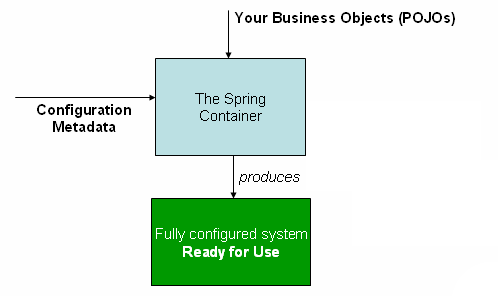

## 1. Spring 概述

Spring 是一个开放源代码的设计层面框架。Spring 是分层的 Java SE/EE 应用 full-stack 轻量级开源框架，<font color=red>**以 IoC（Inverse Of Control：反转控制）和 AOP（Aspect Oriented Programming：面向切面编程）为内核**</font>，提供了展现层 SpringMVC 和持久层 Spring JDBC 以及业务层事务管理等众多的企业级应用技术，还能整合开源世界众多著名的第三方框架和类库，逐渐成为使用最多的 Java EE 企业应用开源框架。

spring 是一站式框架

- Spring 在 javaee 三层结构中，每一层都提供不同的解决技术
- web 层：springMVC
- service 层：spring 的 ioc
- dao 层：spring 的 jdbcTemplate

> - Spring 框架：https://spring.io/projects/spring-framework
> - Spring 最新版本文档：https://docs.spring.io/spring-framework/docs/current/reference/html/
> - Spring 5.2.x 官方参考文档：https://docs.spring.io/spring-framework/docs/5.2.12.RELEASE/spring-framework-reference/

### 1.1. 工厂模式

#### 1.1.1. 程序的耦合与解耦

以往在三层架构中，都使用 `new` 关键字来创建层与层之间的关系。`new` 关系字有很强的耦合性问题。以后在三层架构中创建依赖关系时不使用 `new` 对象。

实际开发中，理想状态应该是：<font color=red>**在编译时不依赖，在运行时才依赖**</font>

原来获取对象都是使得 `new` 方式，是主动；使用工厂为查找或者创建对象，是被动；这种被动接收方式获取对象的思想就是控制反转，是 spring 框架核心之一。它的作用只有一个：削减计算机程序的耦合。

#### 1.1.2. 使用工厂模式解耦

使用工厂模式，是通过反射来解决耦合性的问题。工厂模式的特点：方法返回类型都是 `Object`，调用时按需进行强转。一般将一些参数写到配置文件中：xml和Properties

选择 xml 类型原因是其能够描述类的层级关系

#### 1.1.3. 工厂模式创建对象

##### 1.1.3.1. 示例代码

- 创建实例工厂类，解析 xml 配置，根据配置值通过反射来创建对象实例，并存储到工厂类中一个 `Map` 类型容器中。

```java
public class BeanFactory {
	// 通过一个全局变量接收解析后的xml信息,使用map取值比较方便
	private static Map<String, Object> beans = new HashMap<String, Object>();

	// 使用静态代码块在，在创建类的时候读取xml配置文件
	static {
		// 获取dom4j的SAXReader对象
		SAXReader sax = new SAXReader();
		try {
			// 获取Document对象
			Document document = sax.read(BeanFactory.class.getResourceAsStream("/mySpring.xml"));
			// 获取根标签
			Element root = document.getRootElement();
			// 获取子标签的集合
			List<Element> elements = root.elements();
			// 遍历集合
			for (Element e : elements) {
				String id = e.attributeValue("id");
				String className = e.attributeValue("class");
				// 使用反射创建对象
				Object bean = Class.forName(className).newInstance();
				// 将id和对象放到全局变量map集合中
				beans.put(id, bean);
			}
			System.out.println(beans);
		} catch (Exception e) {
			e.printStackTrace();
		}
	}

	/**
	 * 获取反射创建的对象
	 */
	public static Object getBean(String id) {
		return beans.get(id);
	}
}
```

- 创建 xml 配置文件，配置待实例化的类全限定名称

```xml
<?xml version="1.0" encoding="UTF-8"?>
<beans>
	<!-- 注意解析的顺序 -->
	<bean id="userDao" class="com.moonzero.dao.impl.UserDaoImpl"></bean>
	<bean id="userService" class="com.moonzero.service.impl.UserServiceImpl"></bean>
</beans>
```

- 创建示例业务层与持久层实现，通过对象工厂类获取相应的实例

```java
// =====模拟三层架构=====
public class FactoryTest {
	public static void main(String[] args) {
		// 获取业务逻辑层对象
		IUserService us = (IUserService) BeanFactory.getBean("userService");
		// 调用业务层方法
		us.add("工厂模式解耦~~");
	}
}

public class UserServiceImpl implements IUserService {
	// 获取数据访问层对象
	private IUserDao dao = (IUserDao) BeanFactory.getBean("userDao");

	@Override
	public void add(String name) {
		// 调用数据访问层方法
		dao.add(name);
	}
}

public class UserDaoImpl implements IUserDao {
	@Override
	public void add(String name) {
		System.out.println(name + "===被执行了。");
	}
}
```

##### 1.1.3.2. 示例编写时注意问题

在编写代码时，出现的错误。具体错误描述：创建一个工厂类去读取自己写的xml配置文件，在view层使用工厂类创建service层对象时，可以创建。但service层使用工厂类获取dao层的对象时却是null

```xml
<?xml version="1.0" encoding="UTF-8"?>
<beans>
	<bean id="userDao" class="com.moonzero.dao.impl.UserDaoImpl"></bean>
	<bean id="userService" class="com.moonzero.service.impl.UserServiceImpl"></bean>
</beans>
```

错误原因分析：当时配置文件顺序错误。

当测试层调用工具类创建 service 层对象时，工厂类开始读取 xml 文件，但当时 xml 文本顺序是 service 标签在 dao 标签上面，<font color=red>xml 的解析是有层级关系的。但 xml 解析第一行时，userService 标签已经读取了，程序就开始创建 userService 对象，创建 service 层对象的同时，也开始创建 dao 层对象，但现在 xml 只是解析第一行，map 集合中没有 userDao 标签的类全名，所有此时 userDao 无法创建，对象为 null。</font>

当 xml 继续解析，但 dao 层对象已经创建，所以在后台使用 debug 查看解析 xml 后的 map 集合是有数据，但 userDao 对象却是 null

所以需要<font color=red>将 userDao 标签放到上面，才确保创建 userService 层时，xml 全部解析完。因为如果工厂类没有读取到 map 集合有对应的 id 时，是不会去创建对象的。</font>


### 1.2. Spring 核心部分

Spring 核心主要分成两部分：

- **控制反转（IOC）** - 将对象的创建交给 Spring，通过使用配置等方式创建类对象，Spring 通过一种称作控制反转（IoC）的技术促进了低耦合。当应用了 IoC，一个对象依赖的其它对象会通过被动的方式传递进来，而不是这个对象自己创建或者查找依赖对象。可以认为IoC与JNDI相反，不是对象从容器中查找依赖，而是容器在对象初始化时不等对象请求就主动将依赖传递给它。
- **面向切面编程（AOP）** - Spring 提供了面向切面编程的丰富支持，可以不通过修改源代码来实现扩展功能，允许通过分离应用的业务逻辑与系统级服务（例如审计（auditing）和事务（transaction）管理）进行内聚性的开发。应用对象只实现它们应该做的“完成业务逻辑”仅此而已。它们并不负责（甚至是意识）其它的系统级关注点，例如日志或事务支持。

### 1.3. Spring 容器高层视图

Spring 启动时读取应用程序提供的 Bean 配置信息，并在 Spring 容器中生成一份相应的 Bean 配置注册表，然后根据这张注册表实例化 Bean，装配好 Bean 之间的依赖关系，为上层应用提供准备就绪的运行环境。其中 Bean 缓存池为 `HashMap` 实现


### 1.4. Spring 运行环境要求

Minimum requirements

- JDK 8+ for Spring Framework 5.x
- JDK 6+ for Spring Framework 4.x
- JDK 5+ for Spring Framework 3.x

### 1.5. Spring 包结构

Spring 系统的 lib 包中都是以基本 jar 包、文档、源代码三种结构存在，只需要导入基本包


4个核心 jar 包分别是 Beans、Core、Context、ExpressionLanguage

- spring-beans-x.x.x.RELEASE.jar
- spring-context-x.x.x.RELEASE.jar
- spring-core-x.x.x.RELEASE.jar
- spring-expression-x.x.x.RELEASE.jar

2 个支撑 jar 包

- commons-logging-1.2.jar
- dom4j-1.6.1.jar

> <font color=red>**注：要使用 spring，其实只需要导入 spring-context-x.x.x.RELEASE 即可**</font>

## 2. Spring IOC 容器

IoC（Inversion of Control）也被称为依赖性注入（DI）。`org.springframework.beans` 和 `org.springframework.context` 包是 Spring Framework 的 IoC 容器的基础。

`BeanFactory` 接口提供了一种高级配置机制，能够管理任何类型的对象，提供了配置框架和基本功能，是 Spring 容器中的顶层接口（*远古版本时使用？实现类 `XmlBeanFactory`，已过时*）。`ApplicationContext` 是 `BeanFactory` 的一个子接口，完整的超集，它增加了更多的企业级开发的特定功能：

- Spring 的 AOP 功能的集成
- 消息资源处理（用于国际化）
- 事件发布
- 应用层的特定上下文，如 `WebApplicationContext`，用于 Web 应用程序。

在 Spring 构建的应用程序中，Spring IoC 容器管理的对象被称为 Bean。Bean 是一个由 Spring IoC 容器实例化、组装和管理的对象。

### 2.1. 容器概述

通常 Spring IoC 容器是指 `org.springframework.context.ApplicationContext` 接口，该接口负责实例化、配置和组装 bean。容器通过读取**配置元数据**来获得关于要实例化、配置和组装哪些对象。可以通过 XML 文件、Java 注解或 Java 代码配置元数据，告诉容器要实例化的对象及其依赖关系。在 `ApplicationContext` 被创建和初始化后，就有了一个完全配置好的可执行系统或应用程序。



#### 2.1.1. 配置元数据

Spring IoC 容器通过使用者对 bean 配置元数据，从而知道如何实例化、配置和组装对象。

```xml
<?xml version="1.0" encoding="UTF-8"?>
<beans xmlns="http://www.springframework.org/schema/beans"
    xmlns:xsi="http://www.w3.org/2001/XMLSchema-instance"
    xsi:schemaLocation="http://www.springframework.org/schema/beans
        https://www.springframework.org/schema/beans/spring-beans.xsd">

    <!-- 
        id 属性：定义 bean 的唯一标识名称
        class 属性：指定 bean 的全限定类名称            
    -->
    <bean id="..." class="...">  
        <!-- collaborators and configuration for this bean go here -->
    </bean>

    <bean id="..." class="...">
        <!-- collaborators and configuration for this bean go here -->
    </bean>

    <!-- more bean definitions go here -->

</beans>
```

#### 2.1.2. IOC 容器创建（ApplicationContext 接口实现类）

IOC 容器的创建，即创建 `ApplicationContext` 接口实现类实例。如：

```xml
ApplicationContext context = new ClassPathXmlApplicationContext("services.xml", "daos.xml");
```

Spring 提供几个 `ApplicationContext` 接口的实现类。创建一个 `ClassPathXmlApplicationContext` 或 `FileSystemXmlApplicationContext` 实例对象

- `ClassPathXmlApplicationContext` 从类的根路径下加载配置文件（**此方式已过时**）

```java
public class ClassPathXmlApplicationContext extends AbstractXmlApplicationContext {
    // ...省略
    /**
     * Create a new ClassPathXmlApplicationContext, loading the definitions
     * from the given XML file and automatically refreshing the context.
     * @param configLocation resource location 参数为类根目录，可以加“/”也可以不加
     * @throws BeansException if context creation failed
     */
    public ClassPathXmlApplicationContext(String configLocation) throws BeansException {
    }
    // ...省略
}
```

- `FileSystemXmlApplicationContext` 从磁盘路径上加载配置文件，配置文件可以在磁盘的任意位置。构造方法中参数文件使用相对路径或绝对路径。

```java
public class FileSystemXmlApplicationContext extends AbstractXmlApplicationContext {
    // ...省略
	/**
	 * Create a new FileSystemXmlApplicationContext, loading the definitions
	 * from the given XML file and automatically refreshing the context.
	 * @param configLocation file path 文件的相对路径或绝对路径
	 * @throws BeansException if context creation failed
	 */
	public FileSystemXmlApplicationContext(String configLocation) throws BeansException {
	}
	// ...省略
}
```

- `AnnotationConfigApplicationContext` 通过指定包扫描路径或者配置类，创建基于注解的 IOC 容器

```java
public class AnnotationConfigApplicationContext extends GenericApplicationContext implements AnnotationConfigRegistry {
    // ...省略
    /**
     * Create a new AnnotationConfigApplicationContext, deriving bean definitions
     * from the given component classes and automatically refreshing the context.
     * @param componentClasses one or more component classes &mdash; for example,
     * {@link Configuration @Configuration} classes
     */
    public AnnotationConfigApplicationContext(Class<?>... componentClasses) {
    }

    /**
     * Create a new AnnotationConfigApplicationContext, scanning for components
     * in the given packages, registering bean definitions for those components,
     * and automatically refreshing the context.
     * @param basePackages the packages to scan for component classes
     */
    public AnnotationConfigApplicationContext(String... basePackages) {
    }
    // ...省略
}
```

#### 2.1.3. ApplicationContext 常用方法（整理中!）

- 继承于 `BeanFactory`，根据 bean 的名称获取实例对象

```java
Object getBean(String name) throws BeansException;
```

- 继承于 `BeanFactory`，根据 bean 的名称与指定类型，获取实例对象

```java
<T> T getBean(String name, Class<T> requiredType) throws BeansException;
```


### 2.2. Bean 概述

JavaBean：是一种 Java 语言写成的可重用组件。一个 Spring IoC 容器管理着一个或多个 Bean。这些 Bean 都根据使用者提供给容器的配置元数据创建的（例如，以 XML 文件 `<bean/>` 标签定义的形式）。

在容器本身中，这些 Bean 会被封装为 `BeanDefinition` 对象，它包含（除其他信息外）以下元数据：

- Bean 实际实现类的全限定名称
- Bean 在容器中的行为方式（范围、生命周期等）
- Bean 与其他 Bean 的引用（依赖关系）
- 在新创建的对象中设置的其他配置。例如，在管理连接池的 Bean 中，连接池的大小限制或使用的连接数。

传统上，配置元数据是以简单直观的 XML 格式实现，Spring 2.5 引入了对基于注解的配置元数据的支持。从 Spring 3.0 开始，Spring JavaConfig 项目提供的许多功能成为 Spring 框架的核心部分。后面建议使用 Java 注解来配置 Bean 的元数据。（*具体详见后面 `@Configuration`、`@Bean`、`@Import` 和 `@DependsOn` 等相关内容*）

### 2.3. IOC 底层原理（待整理或删除）

1. xml 配置文件（老旧）、注解
2. dom4j 解决 xml（老旧）、解析注解
3. 工厂设计模式
4. 反射创建实例

## 3. Spring Bean 的加载方式

### 3.1. 方式1：基于 xml 配置的 `<bean>` 标签

Spring 核心配置文件名称和位置不是固定的，只要名字不包含中文和空格即可。建议放到 src 根目录，官方建议：applicationContext.xml，也可以简单命名为 bean.xml

#### 3.1.1. 引入 schema 约束

**导入约束需要导入一个 `beans` 名称空间下的约束，因为是第 1 个约束，可以省略前缀**

```xml
<?xml version="1.0" encoding="UTF-8"?>
<beans xmlns="http://www.springframework.org/schema/beans"
		xmlns:xsi="http://www.w3.org/2001/XMLSchema-instance"
		xsi:schemaLocation="http://www.springframework.org/schema/beans
				http://www.springframework.org/schema/beans/spring-beans.xsd">
</beans>
```

引用的 `beans` 名称约束文件所在路径：spring-beans-x.x.x.jar\org\springframework\beans\factory\xml\spring-beans.dtd


#### 3.1.2. 配置 bean 标签

在配置文件中定义 `<bean />` 标签即可创建对象，其中核心属性如下：

- `id` 属性：根据值来获取相应的类的对象
- `class` 属性：需要创建类的类全名

```xml
<?xml version="1.0" encoding="UTF-8"?>
<beans xmlns="http://www.springframework.org/schema/beans"
	xmlns:xsi="http://www.w3.org/2001/XMLSchema-instance"
	xsi:schemaLocation="
        http://www.springframework.org/schema/beans http://www.springframework.org/schema/beans/spring-beans.xsd">
        
	<!-- 配置资源让 spring 来创建对象 -->
	<bean id="foo" class="com.moon.entity.Foo"></bean>
	
</beans>
```

#### 3.1.3. 获取 bean 实例

在测试用例中，使用实现类 `ClassPathXmlApplicationContext` 创建 spring 容器对象 `ApplicationContext`，读取 xml 文件，通过 `getBean(String id)` 方法获取配置的对象

```java
/**
 * 测试spring配置xml文件创建对象
 */
public class BeanBasicTest {

	@Test
	public void test() {
		// 创建spring容器ApplicationContext
		ApplicationContext context = new ClassPathXmlApplicationContext("bean.xml");
		// 根据bean的id获取对象
		Foo foo = (Foo) context.getBean("foo");
		System.out.println(foo);
	}
}
```

## 4. Spring 的依赖注入(DI)

### 4.1. 概述

DI (dependcy injection)：依赖注入，Spring 框架核心 IOC 的具体实现方式。即让框架自动把对象传入，不需要使用者自动去获取。
	
依赖注入（DI）是一个过程，对象仅通过构造方法的形参、类属性、setter 方法来定义当前类依赖的其他对象。然后 Spring 容器在创建 Bean 时自动注入这些依赖关系的对象实例。这个过程本质是 Bean 本身调用构造方法创建实例时，会到 Spring 容器中查找其依赖的对象，找到的将其依赖的对象引用设置到当前实例化中的 Bean

#### 4.1.1. IOC 和 DI 区别

- IOC：控制反转，把对象创建交给spring进行配置
- DI：依赖注入，向类里面的属性中设置值

IOC 和 DI 关系：依赖注入不能单独存在，需要在 IOC 基础之上完成操作

#### 4.1.2. 依赖注入的方式

在 java 代码中给类的属性注入（就是给对象的属性设置值），有以下几种方式：

1. 使用 set 方法注入
2. 使用有参构造注入
3. 使用接口注入

在 spring 框架中，支持以下几种方式：

1. 有参构造器注入
2. set 方法注入
3. 静态工厂注入
4. 实例工厂注入

### 4.2. 方式1：构造器注入

使用类中的构造函数，给成员变量赋值。赋值的操作是通过配置的方式，让 Spring 框架来注入。<font color=red>**注意，必须提供与配置文件对应配置的成员变量的有参构造方法**</font>

#### 4.2.1. constructor-arg 标签

`<constructor-arg>` 标签代表是构造方法的参数，每一个标签代表一个参数。

标签相关属性：

|  属性名   |                                                  说明                                                  |
| ------- | ----------------------------------------------------------------------------------------------------- |
| `index` | 指定参数在构造方法参数列表的索引位置（索引值从0开始）                                                            |
| `type`  | 指定参数在构造方法中的数据类型（可选，一般很少用）                                                              |
| `name`  | 指定构造方法中的参数名称（**注：参数名称是构造方法的参数名称**）                                                |
| `value` | 给成员变量赋值，包含基本数据类型和 String 类型                                                                |
| `ref`   | 给成员变量赋值为其他bean类型，值为其他bean的id，<font color=purple>**必须是在配置文件中配置过的bean对象**</font> |

#### 4.2.2. 示例

构造器依赖注入 xml 配置：

```xml
<?xml version="1.0" encoding="UTF-8"?>
<beans xmlns="http://www.springframework.org/schema/beans"
    xmlns:xsi="http://www.w3.org/2001/XMLSchema-instance"
    xsi:schemaLocation="
        http://www.springframework.org/schema/beans http://www.springframework.org/schema/beans/spring-beans.xsd">
	<bean id="customer" class="com.moonzero.entity.Customer">
		<constructor-arg name="custId" value="23"></constructor-arg>
		<constructor-arg name="custName" value="剑圣"></constructor-arg>
		<constructor-arg name="custSource" value="dota2"></constructor-arg>
		<constructor-arg name="custIndustry" value="剑刃风暴"></constructor-arg>
		<constructor-arg name="custLevel" value="3级"></constructor-arg>
		<constructor-arg name="custAddress" value="夜魇"></constructor-arg>
		<constructor-arg name="custPhone" value="123456789"></constructor-arg>
		<constructor-arg name="birthday" ref="now"></constructor-arg>
	</bean>
	<bean id="now" class="java.util.Date"></bean>
</beans>
```

测试代码：

```java
/** 构造方法注入 */
@Test
public void testConstructor () {
	// 创建spring容器ApplicationContext
	ApplicationContext context = new ClassPathXmlApplicationContext("bean.xml");
	// 根据id获取bean对象
	Customer customer = (Customer) context.getBean("customer");
	System.out.println(customer);
}
```

### 4.3. 方式2：set 方法注入（实际开发中常用）

注意在类中提供需要注入的成员变量相应的 set 方法

#### 4.3.1. property 标签

|  属性名  |                               说明                               |
| :-----: | --------------------------------------------------------------- |
| `name`  | 指定参数的名称，**参数名字是在类中set方法的后面字符串，首字母小写** |
|  `ref`  | 给属性赋值是其他bean类型，必须是在配置文件中配置过的bean对象          |
| `value` | 给属性赋值是基本数据类型和String类型                                |

#### 4.3.2. 示例

set 方法依赖注入 xml 配置：

```xml
<bean id="customer" class="com.moonzero.entity.Customer">
	<property name="custId" value="24"></property>
	<property name="custName" value="敌法师"></property>
	<property name="custSource" value="dota2"></property>
	<property name="custIndustry" value="法力损毁"></property>
	<property name="custLevel" value="4级"></property>
	<property name="custAddress" value="天辉"></property>
	<property name="custPhone" value="123452222"></property>
	<property name="birthday" ref="now"></property>
</bean>
<bean id="now" class="java.util.Date"></bean>
```

测试代码：

```java
/** set方法注入 */
@Test
public void testProperty() {
	// 创建spring容器ApplicationContext
	ApplicationContext context = new ClassPathXmlApplicationContext("bean1.xml");
	// 根据id获取bean对象
	Customer customer = (Customer) context.getBean("customer");
	System.out.println(customer);
}
```

#### 4.3.3. 使用p名称空间注入数据（了解）

p名称空间注入，本质还是调用set方法，几乎不用。通过在 xml 中导入 p 名称空间，使用 `p:propertyName` 来注入数据，本质仍然是调用类中的set方法实现注入功能。示例配置如下：

```xml
<?xml version="1.0" encoding="UTF-8"?>
	<!-- 使用p名称空间注入数据 -->
<beans xmlns="http://www.springframework.org/schema/beans"
	xmlns:p="http://www.springframework.org/schema/p"
    xmlns:xsi="http://www.w3.org/2001/XMLSchema-instance"
    xsi:schemaLocation="http://www.springframework.org/schema/beans http://www.springframework.org/schema/beans/spring-beans.xsd">
	<bean id="now" class="java.util.Date"></bean>
	<!-- 使用p名称空间注入数据 -->
	<bean id="customer2" class="com.moonzero.entity.Customer"
		p:custId="33" p:custName="死灵法师" p:birthday-ref="now"></bean>
</beans>
```

测试：

```java
/** p名称空间注入数据 */
@Test
public void testP() {
	// 创建spring容器ApplicationContext
	ApplicationContext context = new ClassPathXmlApplicationContext("bean.xml");
	// 根据id获取bean对象
	Customer customer = (Customer) context.getBean("customer2");
	System.out.println(customer);
}
```

#### 4.3.4. 注入集合属性（复杂类型）

给类中的集合成员传值，也是set方法注入的方式，只不过变量的数据类型都是集合。

- `<property>`表示List结构的子标签分别是：`<array>`、`<list>`、`<set>`
- `<property>`表示Map结构的子标签分别是：`<map>-子标签<entry>`、`<props>-子标签<prop>`

> Notes: <font color=red>**在注入集合数据时，只要结构相同，标签是可以互换，一般只需要记住`<list>`和`<map>`标签即可**</font>

示例配置：

```xml
<!-- 注入集合属性 -->
<bean id="user" class="com.moonzero.entity.User">
	<!-- 数组(可以使用<array>,<list>,<set>标签) -->
	<property name="arrs">
		<set>
			<value>露娜</value>
			<value>安吉娜</value>
			<value>幻影刺客</value>
		</set>
	</property>
	<!-- List集合(可以使用<array>,<list>,<set>标签) -->
	<property name="list">
		<array>
			<value>主宰</value>
			<value>敌法师</value>
			<value>幽鬼</value>
		</array>
	</property>
	<!-- set集合(可以使用<array>,<list>,<set>标签) -->
	<property name="set">
		<list>
			<value>撼地神牛</value>
			<value>影魔</value>
			<value>剧毒术士</value>
		</list>
	</property>
	<!-- map集合(可以使用<map>-<entry>,<props>-<prop>标签) -->
	<property name="map">
		<props>
			<prop key="1">宙斯</prop>
			<prop key="2">斧王</prop>
			<prop key="3">地狱领主</prop>
		</props>
	</property>
	<!-- Properties(可以使用<map>,<entry>,<props>,<prop>标签) -->
	<property name="props">
		<map>
			<entry key="A" value="暗影猎手"></entry>
			<entry key="B" value="矮人阻击手"></entry>
			<entry key="C">
				<value>变体精灵</value>
			</entry>
		</map>
	</property>
</bean>
```

测试：

```java
/** 注入集合属性 */
@Test
public void testOther() {
	// 创建spring容器ApplicationContext
	ApplicationContext context = new ClassPathXmlApplicationContext("bean.xml");
	// 根据id获取bean对象
	User user = (User) context.getBean("user");
	user.test();
}
```

### 4.4. 方式3：静态工厂注入

静态工厂注入是通过调用工厂类中定义的静态方法来获取需要的对象。为了让 Spring 管理所有对象，应用程序不能直接通过 `工厂类.静态方法()` 的方式来获取对象，而需要通过 Spring 注入的方式获取。

定义一个`FooStaticFactory`工厂类和`getStaticBeanFoo()`静态工厂方法，该方法实例化并返回一个`Foo`实例；同时定义一个`SpringFactoryMethodDemo`类，测试通过 set 方法获取注入的`Foo`实例。示例代码如下：

```java
public class Foo {
}

public class FooStaticFactory {

    public static final Foo getStaticBeanFoo() {
        return new Foo();
    }
}

public class SpringFactoryMethodDemo {

    private Foo foo; // 定义需要通过 factory-method 方式注入的属性

    // 通过set方法注入
    public void setFoo(Foo foo) {
        this.foo = foo;
    }
}
```

修改 xml 配置文件，通过`<bean>`标签定义实例化`FooStaticFactory`类，并配置通过`factory-method`属性定义该类中的用于实例化`Foo`类的静态方法`getStaticBeanFoo`。该静态方法返回`Foo`的实例对象，在定义`SpringFactoryMethodDemo`实例化配置中，通过`<property>`标签注入静态工厂实例。示例配置如下：

```xml
<!-- 定义获取工厂对象的静态方法
    其中 factory-method 属性用于指定调用哪个工厂方法
-->
<bean id="fooStaticFactory" class="com.moonzero.FooStaticFactory" factory-method="getStaticBeanFoo"/>

<!-- 定义待注入的对象 -->
<bean class="com.moonzero.SpringFactoryMethodDemo" id="springFactoryMethodDemo">
    <!-- 通过 property 标签中的 ref 属性找到对应的静态工厂方法，注入对象 -->
    <property name="foo" ref="fooStaticFactory"/>
</bean>
```

### 4.5. 方式4：实例工厂注入

实例工厂注入指的是获取对象实例的方法是非静态的，因此首先需要实例化一个工厂类对象，然后调用对象的方法来实例化对象。示例代码如下：

```java
public class Foo {
}

// 实例工厂
public class FooFactory {

    public Foo getBeanFoo() {
        return new Foo();
    }
}

public class SpringFactoryMethodDemo {

    private Foo foo; // 定义需要通过 factory-method 方式注入的属性

    // 通过set方法注入
    public void setFoo(Foo foo) {
        this.foo = foo;
    }
}
```

修改 xml 配置文件，通过`<bean>`标签定义实例化`FooFactory`类，再使用`<bean>`标签定义实例化`Foo`类，并配置`factory-baen`为相关的工厂实例，`factory-method`属性定义工厂类中的用于实例化`Foo`类的方法`getBeanFoo`。在定义`SpringFactoryMethodDemo`实例化配置中，通过`<property>`标签注入工厂实例。示例配置如下：

```xml
<!-- 定义获取工厂对象的静态方法
    其中 factory-method 属性用于指定调用哪个工厂方法
-->
<bean id="fooFactory" class="com.moonzero.FooFactory"/>
<bean id="fooBean" factory-bean="fooFactory" factory-method="getBeanFoo"/>

<!-- 定义待注入的对象 -->
<bean class="com.moonzero.SpringFactoryMethodDemo" id="springFactoryMethodDemo">
    <!-- 通过 property 标签中的 ref 属性找到对应的工厂类创建的实例，注入对象 -->
    <property name="foo" ref="fooBean"/>
</bean>
```

### 4.6. 自动装配（自动注入）

Spring 的 Bean 属性依赖注入分成为手动装配和自动装配。上面介绍的 xml 配置与注解配置方法均为手动装配。自动装配是用来引导 Spring 容器自动完成依赖注入，具体有以下几种方式：

- no：关闭自动装配，通过显示设置 `ref` 属性来进行对象装配。
- byName：通过参数名自动装配，Bean 的 autowire 被设置为 byName 后，Spring 容器试图匹配并装配与该 Bean 的属性具有相同名字的 Bean
- byType：通过参数类型自动装配，Bean 的 autowire 被设置为 byType 后，Spring 容器试图匹配并装配与该 Bean 的属性具有相同类型的 Bean
- constructor：通过设置构造器参数的方式来装配对象，如果没有匹配到带参数的构造器参数类型，则 Spring 会抛出异常
- autodetect：首先尝试使用 constructor 来自动装配，如果无法完成自动装配，则使用 byType 方式进行装配

## 5. Spring Bean 的作用范围

### 5.1. 概述

Spring 创建的 Bean 对象的都有其作用范围。Spring 框架支持6种作用域，其中4种只有在 Web 环境的 `ApplicationContext` 容器中才可用，使用者也可以创建一个自定义作用域。下表是支持的作用域描述：

| 作用范围取值  |                                                                                  描述                                                                                   |
| :---------: | ----------------------------------------------------------------------------------------------------------------------------------------------------------------------- |
|  singleton  | (默认) Bean 定义的作用域存在整个 Spring IoC 容器                                                                                                                           |
|  prototype  | Bean 定义的作用域存在任何数量的对象实例。                                                                                                                                   |
|   request   | Bean 定义的作用域存在单个 HTTP 请求的生命周期中。即每个 HTTP 请求都有自己的 Bean 实例，这些实例基于单个 Bean 定义的基础上创建的。（只在 Web 环境的 `ApplicationContext` 容器中有效） |
|   session   | Bean 定义的作用域存在一个 HTTP 会话的生命周期。（只在 Web 环境的 `ApplicationContext` 容器中有效）                                                                            |
| application | Bean 定义的作用域存在 `ServletContext` 的生命周期。（只在 Web 环境的 `ApplicationContext` 容器中有效）                                                                       |
|  websocket  | Bean 定义的作用域存在 `WebSocket` 的生命周期。（只在 Web 环境的 `ApplicationContext` 容器中有效）                                                                            |

> 注：有些历史资料中提及有 `globalSession` 这种作用范围，目前 Spring 中已废弃

### 5.2. 各种作用范围说明

#### 5.2.1. singleton 单例对象

一个应用只有一个共享的对象实例，无论有多少个 Bean 引用它，都始终指向同一个 Bean 对象。它的作用范围就是整个引用。<font color=red>**该模式在多线程下是不安全的**</font>。Singleton 作用域是 Spring 中的缺省作用域。**单例 bean 生命周期**如下：

- 对象创建：当应用加载，创建容器时，对象就被创建了。
- 对象存活：只要容器在，对象一直存活
- 对象销毁：当应用卸载，销毁容器时，对象就被销毁了。

单例作用域注解配置（一般不用配置，默认即可）：

```java
@Scope(ConfigurableBeanFactory.SCOPE_SINGLETON) // 直接写 "singleton" 字符或者不写，默认作用范围也是单例
@Component
public class SingletonScopeBean {}
```

单例作用域 xml 配置：

```xml
<bean id="foo" class="com.moon.foo" scope="singleton"/>
```

#### 5.2.2. prototype 原型对象

Prototype 是原型模式（又叫多例模式），每次通过 Spring 容器获取 prototype 定义的 bean 时，容器都将创建一个新的 Bean 实例，每个 Bean 实例都有自己的属性和状态。根据经验，对有状态的 bean 使用 prototype 作用域，而对无状态的 bean 使用 singleton 作用域。**原型模式 bean 生命周期**如下：

- 对象创建：当使用对象时，创建新的对象实例。
- 对象存活：只要对象在使用中，就一直存活。
- 对象销毁：当对象长时间不用时，被 java 的垃圾回收器回收了。

> Tips: 一般使用在管理 Struts2/Spring MVC 中的 action/controller 的创建

原型作用域注解配置示例：

```java
@Scope(ConfigurableBeanFactory.SCOPE_PROTOTYPE) // 或 "prototype" 字符串
@Component
public class PrototypeScopeBean {}
```

原型作用域 xml 配置示例：

```xml
<bean id="foo" class="com.moon.foo" scope="prototype"/>
```

#### 5.2.3. request 请求域对象

在一次 Http 请求中，容器会返回该 Bean 的同一实例。而对不同的 Http 请求则会产生新的 Bean，而且该 bean 仅在当前 Http Request 内有效，当前 Http 请求结束，该 bean 实例也将会被销毁。

请求作用域注解配置示例：

```java
@Scope(WebApplicationContext.SCOPE_REQUEST) // 或 "request" 字符串
@Component
public class LoginAction {}
```

或者直接使用 `@RequestScope` 注解

```java
@RequestScope
@Component
public class LoginAction {
    // ...
}
```

请求作用域 xml 配置示例：

```xml
<bean id="loginAction" class="com.moon.LoginAction" scope="request"/>
```

#### 5.2.4. session 会话域对象

在一次 Http Session 中，容器会返回该 Bean 的同一实例。而对不同的 Session 请求则会创建新的实例，该 bean 实例仅在当前 Session 内有效。同 Http 请求相同，每一次 session 请求创建新的实例，而不同的实例之间不共享属性，且实例仅在自己的 session 请求内有效，请求结束，则实例将被销毁。

会话作用域注解配置示例：

```java
@Scope(WebApplicationContext.SCOPE_SESSION) // 或 "session" 字符串
@Component
public class UserPreferences {}
```

或者直接使用 `@SessionScope` 注解

```java
@SessionScope
@Component
public class UserPreferences {
    // ...
}
```

会话作用域 xml 配置示例：

```xml
<bean id="userPreferences" class="com.moon.UserPreferences" scope="session"/>
```

#### 5.2.5. application 应用上下文对象

在一个全局的 Http Session 中，容器会返回该 Bean 的同一个实例，仅在使用 portlet context 时有效。

应用上下文作用域注解配置示例：

```java
@Scope(WebApplicationContext.SCOPE_APPLICATION) // 或 "application" 字符串
@Component
public class AppPreferences {}
```

或者直接使用 `@ApplicationScope` 注解

```java
@ApplicationScope
@Component
public class AppPreferences {
    // ...
}
```

应用上下文作用域 xml 配置示例：

```xml
<bean id="appPreferences" class="com.moon.AppPreferences" scope="application"/>
```

#### 5.2.6. 作用范围测试

- 按上面创建不同作用范围的类，然后在每个类中都创建初始化后与销毁方法。

```java
@PostConstruct
public void init() {
    System.out.println("xxxScopeBean postConstruct...");
}
@PreDestroy
public void destroy() {
    System.out.println("xxxScopeBean destroy...");
}
```

- 创建请求控制层，注入各种作用范围的实例。值得

```java
@SpringBootApplication
@RestController
public class BeanScopesApplication {

    public static void main(String[] args) {
        SpringApplication.run(BeanScopesApplication.class, args);
    }

    @Autowired
    private SingletonScopeBean singletonScopeBean;

    @Lazy
    @Autowired
    private PrototypeScopeBean prototypeScopeBean;

    @Lazy
    @Autowired
    private RequestScopeBean requestScopeBean;

    @Lazy
    @Autowired
    private SessionScopeBean sessionScopeBean;

    @Lazy
    @Autowired
    private ApplicationScopeBean applicationScopeBean;

    @GetMapping(value = "/test", produces = "text/html")
    public String test(HttpServletRequest request, HttpSession session) {
        ServletContext sc = request.getServletContext();
        return "<ul>" +
                "<li>" + "singleton scope:" + singletonScopeBean + "</li>" +
                "<li>" + "prototype scope:" + prototypeScopeBean + "</li>" +
                "<li>" + "request scope:" + requestScopeBean + "</li>" +
                "<li>" + "session scope:" + sessionScopeBean + "</li>" +
                "<li>" + "application scope:" + applicationScopeBean + "</li>" +
                "</ul>";
    }
}
```

> 注意：**上例中使用 `@Autowired` 注解自动注入非单例作用域的对象时，需要同时使用 `@Lazy` 注解，否则会出现作用域失效问题**。原因与解决方法详见下面章节内容

- 访问 `http://localhost:8080/test`，观察页面返回的对象地址与后端控制台输出日志。刷新请求再观察变化。也可以设置项目配置 `server.servlet.session.timeout=30s` 观察 session bean 的销毁


> 测试时需要注意：如果项目环境的 JDK >= 9，以上示例会涉及反射调用 jdk 中方法，程序会报错。此时需要运行时添加参数 `--add-opens java.base/java.lang=ALL-UNNAMED`

### 5.3. singleton 注入其它 scope 失效问题

#### 5.3.1. 问题分析

下面以单例作用域对象注入多例作用域对象为例（其他类型作用域均一样）

- 创建多例作用域类

```java
@Scope(ConfigurableBeanFactory.SCOPE_PROTOTYPE)
@Component
public class PrototypeScopeBean1 {
}
```

- 创建单例作用域类，并直接自动注入多例对象

```java
@Component
public class SingletonScopeBean {

    @Autowired
    private PrototypeScopeBean1 bean1;
    
    public PrototypeScopeBean1 getBean1() {
        return bean1;
    }
}
```

- 测试代码

```java
@Test
public void basicTest() {
    AnnotationConfigApplicationContext context = new AnnotationConfigApplicationContext(BeanScopesApplication.class);
    SingletonScopeBean bean = context.getBean(SingletonScopeBean.class);
    // 多次获取，观察是否为同一个对象
    System.out.println(bean.getBean1());
    System.out.println(bean.getBean1());
    System.out.println(bean.getBean1());
}
```

- 运行测试结果：

```
com.moon.springsample.bean.PrototypeScopeBean1@1bb1fde8
com.moon.springsample.bean.PrototypeScopeBean1@1bb1fde8
com.moon.springsample.bean.PrototypeScopeBean1@1bb1fde8
```

从测试结果可见，期望的是多例对象，但每次获取都是同一个对象。原因其实很简单，就是单例对象只会被初始化一次，依赖注入也只有一次，所有后续每次获取注入的对象都是初始化时注入的对象。解决作用域失效有以下几种方式，<font color=red>**其原理都是推迟其他作用域 bean 的获取时机**</font>

#### 5.3.2. 解决方式1 - @Lazy 注解

在注入的对象上标识 `@Lazy` 注解，此时单例对象实例化是注入的是代理对象，代理对象虽然还是同一个，但当每次使用代理对象的任意方法时，由代理创建新的多例对象

```java
@Lazy
@Autowired
private PrototypeScopeBean1 bean1;
```

#### 5.3.3. 解决方式2 - 设置 proxyMode 属性

在 `@Scope` 注解中使用 `proxyMode` 属性指定使用代理模式

```java
@Scope(value = ConfigurableBeanFactory.SCOPE_PROTOTYPE, proxyMode = ScopedProxyMode.TARGET_CLASS)
@Component
public class PrototypeScopeBean2 {
}
```

#### 5.3.4. 解决方式3 - ObjectFactory 对象

使用 `ObjectFactory` 将注入的多例对象进行包装，获取对象实例时调用其 `getObject` 方法

```java
@Autowired
private ObjectFactory<PrototypeScopeBean3> bean3;

public PrototypeScopeBean3 getBean3() {
    return bean3.getObject();
}
```

#### 5.3.5. 解决方式4 - 从容器中获取

注入 Spring 容器，直接从容器中获取实例对象

```java
@Autowired
private ApplicationContext bean4;

public PrototypeScopeBean4 getBean4() {
    return bean4.getBean(PrototypeScopeBean4.class);
}
```

## 6. Spring Bean 的生命周期

### 6.1. 概述

一个受 Spring 管理的 bean，生命周期主要阶段有

1. 创建：根据 bean 的构造方法或者工厂方法来创建 bean 实例对象
2. 依赖注入：根据 `@Autowired`，`@Value` 或其它一些手段，为 bean 的成员变量填充值、建立关系
3. 初始化：回调各种 `Aware` 接口，调用对象的各种初始化方法
4. 销毁：在容器关闭时，会销毁所有单例对象（即调用它们的销毁方法）。prototype （多例）对象也能够销毁，不过需要容器主动调用


在整个生命周期过程中，可以自定义 Bean 的初始化和销毁钩子函数，当 Bean 的生命周期到达相应的阶段的时候，Spring 会调用自定义的 Bean 的初始化和销毁方法。Spring 还提供一种 `BeanPostProcessor` 接口（Bean 后处理器），也可以用于在 bean 的初始化的前后，提供一些扩展逻辑，但不单单只对生命周期有作用（*`BeanPostProcessor` 接口详细说明见后面章节*）

自定义 Bean 初始化和销毁方法有多种方式。参考代码详见：`spring-note\spring-sample\39-annotation-lifecycle\`

Bean 对象在 spring 框架的上下文中的生命周期图（网络资料）


1. 实例化一个 Bean，也就是我们常说的 new。
2. IOC 依赖注入：按照 Spring 上下文对实例化的 Bean 进行配置，也就是 IOC 注入。
3. setBeanName 实现：如果这个 Bean 已经实现了 BeanNameAware 接口，会调用它实现的 setBeanName(String) 方法，此处传递的就是 Spring 配置文件中 Bean 的 id 值
4. BeanFactoryAware 实现：如果这个 Bean 已经实现了 BeanFactoryAware 接口，会调用它实现的 setBeanFactory，setBeanFactory(BeanFactory)传递的是 Spring 工厂自身（可以用这个方式来获取其它 Bean，只需在 Spring 配置文件中配置一个普通的 Bean 就可以）。
5. ApplicationContextAware 实现：如果这个 Bean 已经实现了 ApplicationContextAware 接口，会调用 setApplicationContext(ApplicationContext)方法，传入 Spring 上下文（同样这个方式也可以实现步骤 4 的内容，但比 4 更好，因为 ApplicationContext 是 BeanFactory 的子接口，有更多的实现方法）
6. postProcessBeforeInitialization 接口实现 - 初始化预处理：如果这个 Bean 关联了 BeanPostProcessor 接口，将会调用 postProcessBeforeInitialization(Object obj, String s)方法，BeanPostProcessor 经常被用作是 Bean 内容的更改，并且由于这个是在 Bean 初始化结束时调用那个的方法，也可以被应用于内存或缓存技术。
7. init-method：如果 Bean 在 Spring 配置文件中配置了 init-method 属性会自动调用其配置的初始化方法。
8. postProcessAfterInitialization：如果这个 Bean 关联了 BeanPostProcessor 接口，将会调用 postProcessAfterInitialization(Object obj, String s) 方法。
    - 注：以上工作完成以后就可以应用这个 Bean 了，那这个 Bean 是一个 Singleton 的，所以一般情况下我们调用同一个 id 的 Bean 会是在内容地址相同的实例，当然在 Spring 配置文件中也可以配置非 Singleton。
9. Destroy 过期自动清理阶段：当 Bean 不再需要时，会经过清理阶段，如果 Bean 实现了 DisposableBean 这个接口，会调用那个其实现的 destroy()方法；
10. destroy-method 自配置清理：最后，如果这个 Bean 的 Spring 配置中配置了 destroy-method 属性，会自动调用其配置的销毁方法

### 6.2. @Bean 注解方式实现生命周期回调

- 创建自定义Bean

```java
public class CustomBean {
    public CustomBean() {
        System.out.println("CustomBean构造方法执行了...");
    }

    public void init() {
        System.out.println("CustomBean基于@Bean注解initMethod方式实现的初始化方法");
    }

    public void destory() {
        System.out.println("CustomBean基于@Bean注解destroyMethod方式实现的销毁方法");
    }
}
```

- 在配置类里注册该组件，并使用`@Bean`注解指定初始化和销毁方法

```java
@Configuration
// 配置包扫描
@ComponentScan("com.moon.springsample")
public class SpringConfiguration {

    public SpringConfiguration() {
        System.out.println("SpringConfiguration 类构造方法执行");
    }

    /* 通过@Bean 注解方式创建对象并注册到IOC容器中，实现initMethod与destroyMethod方法 */
    @Bean(value = "customBean", initMethod = "init", destroyMethod = "destory")
    // @Scope("prototype") // 设置多例，用于测试生命周期
    public CustomBean createCustomBean() {
        return new CustomBean();
    }
}
```

*注：其中`initMethod = "init"`和`destroyMethod = "destory"`与CustomBean类里的init，destory方法相对应*

- 测试代码

```java
@Test
public void lifecycleBasicTest() {
    // 创建容器，观察单例对象的初始化方法
    System.out.println("************* 容器准备创建 *************");
    AnnotationConfigApplicationContext context = new AnnotationConfigApplicationContext(SpringConfiguration.class);
    System.out.println("************* 容器创建完毕 *************");

    System.out.println("************* 容器准备关闭 *************");
    // 关闭容器，观察单例对象的销毁前的方法
    context.close();
    System.out.println("************* 容器关闭完毕 *************");
}
```

启动项目，观察控制台测试结果

1. 单例模式

```
************* 容器准备创建 *************
SpringConfiguration 类构造方法执行
CustomBean 构造方法执行了...
CustomBean 基于 @Bean 注解 initMethod 方式实现的初始化方法
************* 容器创建完毕 *************
************* 容器准备关闭 *************
CustomBean 基于 @Bean 注解 destroyMethod 方式实现的销毁方法
************* 容器关闭完毕 *************
```

> 分析：此情况是对于单例，在容器启动之前，先调用对象的无参构造器创建对象，然后调用初始化方法，在容器关闭的时候调用销毁方法。

2. 多例模式

因为是多例对象，在获取 bean 对象时才会创建，所以在测试方法中增加获取对象的操作

```java
System.out.println(context.getBean(CustomBean.class));
```

```
************* 容器准备创建 *************
SpringConfiguration 类构造方法执行
************* 容器创建完毕 *************
CustomBean 构造方法执行了...
CustomBean 基于 @Bean 注解 initMethod 方式实现的初始化方法
com.moon.springsample.bean.CustomBean@6b4a4e18
************* 容器准备关闭 *************
************* 容器关闭完毕 *************
```

> 分析：此情况在多例模式下，IOC 容器启动的时候并不会去创建对象，而是在每次获取的时候才会去调用方法创建对象，创建完对象后再调用初始化方法。但在容器关闭后，Spring 并没有调用相应的销毁方法，这是因为在多例模式下，容器不会管理这个组件（只负责在你需要的时候创建这个组件），所以容器在关闭的时候并不会调用相应的销毁方法。

### 6.3. InitializingBean & DisposableBean 接口实现生命周期回调

除了上面注解方式指定初始化和销毁方法外，Spring 还提供了和初始化，销毁相对应的接口

- `org.springframework.beans.factory.InitializingBean` 接口包含一个 `afterPropertiesSet` 方法，可以通过实现该接口，然后在这个方法中编写初始化逻辑。
- `org.springframework.beans.factory.DisposableBean` 接口包含一个 `destory` 方法，可以通过实现该接口，然后再这个方法中编写销毁逻辑。

1. 新建一个UserService类，然后实现这两个接口

```java
@Service
public class UserService implements InitializingBean, DisposableBean {
    public UserService() {
        System.out.println("UserService构造方法执行了");
    }

    @Override
    public void afterPropertiesSet() throws Exception {
        System.out.println("UserService实现InitializingBean接口实现初始化的afterPropertiesSet()方法执行了");
    }

    @Override
    public void destroy() throws Exception {
        System.out.println("UserService实现DisposableBean接口实现销毁的destroy()方法执行了");
    }
}
```

2. 在配置类指定包扫描

```java
@Configuration
@ComponentScan("com.moon.springsample")
public class SpringConfiguration {
}
```

3. 测试代码

```java
@Test
public void lifecycleBasicTest() {
    // 创建容器，观察单例对象的初始化方法
    System.out.println("************* 容器准备创建 *************");
    AnnotationConfigApplicationContext context = new AnnotationConfigApplicationContext(SpringConfiguration.class);
    System.out.println("************* 容器创建完毕 *************");

    System.out.println("************* 容器准备关闭 *************");
    // 关闭容器，观察单例对象的销毁前的方法
    context.close();
    System.out.println("************* 容器关闭完毕 *************");
}
```

测试结果

```
************* 容器准备创建 *************
SpringConfiguration 类构造方法执行
UserService 构造方法执行了
UserService 实现 InitializingBean 接口实现初始化的 afterPropertiesSet() 方法执行了
************* 容器创建完毕 *************
************* 容器准备关闭 *************
UserService 实现 DisposableBean 接口实现销毁的 destroy() 方法执行了
************* 容器关闭完毕 *************
```

### 6.4. @PostConstruct & @PreDestroy 注解方式实现生命周期回调

还可以使用 `@PostConstruct` 和 `@PreDestroy` 注解修饰方法来指定相应的初始化和销毁方法

1. 创建 `LogUtil` 类，定义 `@PostConstruct` 和 `@PreDestroy` 注解修饰的方法

```java
// @Component
/*
 * 注意：单例的生命周期与容器的生命周期一致，对象随着容器的创建而创建，随容器的销毁而销毁
 *   如果将作用范围设置为多例，则对象的生命周期会脱离容器，当对象被使用时创建，
 *   因为容器不知道对象什么时候会不再使用，所以对象的销毁是GC垃圾回收器决定
 */
// @Scope("prototype")
public class LogUtil {
    /* 构造方法 */
    public LogUtil() {
        System.out.println("LogUtil 类的无参构造函数执行了...");
    }

    /* @PostConstruct 注解用于指定bean对象的初始化后执行的方法 */
    @PostConstruct
    public void init() {
        System.out.println("LogUtil 基于 @PostConstruct 注解的初始化后的方法执行了...");
    }

    /* @PreDestroy 用于指定bean对象的销毁前执行的方法 */
    @PreDestroy
    public void destroy() {
        System.out.println("LogUtil 基于 @PreDestroy 注解销毁前的方法执行了...");
    }
}
```

2. 在配置类指定包扫描

```java
@Configuration
@ComponentScan("com.moon.springsample")
public class SpringConfiguration {
}
```

3. 测试代码

```java
@Test
public void lifecycleBasicTest() {
    // 创建容器，观察单例对象的初始化方法
    System.out.println("************* 容器准备创建 *************");
    AnnotationConfigApplicationContext context = new AnnotationConfigApplicationContext(SpringConfiguration.class);
    System.out.println("************* 容器创建完毕 *************");

    System.out.println("************* 容器准备关闭 *************");
    // 关闭容器，观察单例对象的销毁前的方法
    context.close();
    System.out.println("************* 容器关闭完毕 *************");
}
```

测试结果

```
************* 容器准备创建 *************
SpringConfiguration 类构造方法执行
LogUtil 类的无参构造函数执行了...
LogUtil 基于 @PostConstruct 注解的初始化后的方法执行了...
************* 容器创建完毕 *************
************* 容器准备关闭 *************
LogUtil 基于 @PreDestroy 注解销毁前的方法执行了...
************* 容器关闭完毕 *************
```

<font color=purple>*注：这两个注解并非Spring提供，而是JSR250规范提供*</font>

### 6.5. 各种初始化与销毁方式的执行顺序

Spring 提供了以上多种初始化与销毁的方式，如果同一个 bean 同时使用了以上方式声明了 3 个初始化方法，那么它们的执行顺序是：

1. `@PostConstruct` 标注的初始化方法
2. `InitializingBean` 接口的初始化方法
3. `@Bean(initMethod=xxx)` 指定的初始化方法

与初始化类似，3 个销毁方式的执行顺序为：

1. `@PreDestroy` 标注的销毁方法
2. `DisposableBean` 接口的销毁方法
3. `@Bean(destroyMethod=xxx)` 指定的销毁方法

### 6.6. BeanPostProcessor 接口实现生命周期回调

Spring 提供了一个 `BeanPostProcessor` 接口，俗称 Bean 后置通知处理器，它提供了两个方法 `postProcessBeforeInitialization` 和 `postProcessAfterInitialization`

其中 `postProcessBeforeInitialization` 在组件的初始化方法调用之前执行，`postProcessAfterInitialization` 在组件的初始化方法调用之后执行。它们都包含两个入参：

- `bean`：当前组件对象
- `beanName`：当前组件在容器中的名称。

两个方法都返回一个 Object 类型，可以直接返回当前组件对象，或者包装后返回。

1. 定义一个 `BeanPostProcessor` 接口的实现类 `MyBeanPostProcessor`

```java
@Component
public class MyBeanPostProcessor implements BeanPostProcessor {
    public MyBeanPostProcessor() {
        System.out.println("MyBeanPostProcessor类构造方法执行了");
    }

    @Override
    public Object postProcessBeforeInitialization(Object bean, String beanName) throws BeansException {
        System.out.println("基于实现BeanPostProcessor接口postProcessBeforeInitialization()方法，" + beanName + "初始化之前调用");
        return bean;
    }

    @Override
    public Object postProcessAfterInitialization(Object bean, String beanName) throws BeansException {
        System.out.println("基于实现BeanPostProcessor接口postProcessAfterInitialization()方法" + beanName + "初始化之后调用");
        return bean;
    }
}
```

2. 在配置类指定包扫描

```java
@Configuration
@ComponentScan("com.moon.springsample")
public class SpringConfiguration {
}
```

3. 测试代码

```java
@Test
public void lifecycleBasicTest() {
    // 创建容器，观察单例对象的初始化方法
    System.out.println("************* 容器准备创建 *************");
    AnnotationConfigApplicationContext context = new AnnotationConfigApplicationContext(SpringConfiguration.class);
    System.out.println("************* 容器创建完毕 *************");

    System.out.println("************* 容器准备关闭 *************");
    // 关闭容器，观察单例对象的销毁前的方法
    context.close();
    System.out.println("************* 容器关闭完毕 *************");
}
```

多准备一个普通的 `OrdinaryBean` 类并注册到容器中，测试结果

```
************* 容器准备创建 *************
MyBeanPostProcessor 类构造方法执行了
SpringConfiguration 类构造方法执行
基于实现 BeanPostProcessor 接口 postProcessBeforeInitialization() 方法，springConfiguration初始化之前调用
基于实现 BeanPostProcessor 接口 postProcessAfterInitialization() 方法，springConfiguration初始化之后调用
OrdinaryBean 构造方法执行了...
基于实现 BeanPostProcessor 接口 postProcessBeforeInitialization() 方法，ordinaryBean初始化之前调用
基于实现 BeanPostProcessor 接口 postProcessAfterInitialization() 方法，ordinaryBean初始化之后调用
************* 容器创建完毕 *************
************* 容器准备关闭 *************
************* 容器关闭完毕 *************
```

<font color=red>**注：`BeanPostProcessor` 对 IOC 容器中所有组件（对象）都生效**</font>

### 6.7. Bean 的生命周期总结（流程图）


1. 调用 bean 的构造方法创建 Bean
2. 通过反射调用 setter 方法进行属性的依赖注入
3. 如果 Bean实 现了 `BeanNameAware` 接口，Spring 将调用 `setBeanName()`，设置 Bean 的 name（xml 文件中 bean 标签的 id）
4. 如果 Bean 实现了 `BeanFactoryAware` 接口，Spring 将调用 `setBeanFactory()` 把 BeanFactory 实例设置给 Bean
5. 如果 Bean 实现了 `ApplicationContextAware` 接口，Spring 容器将调用 `setApplicationContext()` 给 Bean 设置 ApplictionContext
6. 如果存在 `BeanPostProcessor`，Spring 将调用它们的 `postProcessBeforeInitialization`（预初始化）方法，在 Bean 初始化前对其进行处理
7. 如果 Bean 实现了 `InitializingBean` 接口，Spring 将调用它的 `afterPropertiesSet` 方法，然后调用 xml 定义的 `init-method` 方法，两个方法作用类似，都是在初始化 Bean 的时候执行
8. 如果存在 `BeanPostProcessor`，Spring 将调用它们的 `postProcessAfterInitialization`（后初始化）方法，在 Bean 初始化后对其进行处理
9. Bean 初始化完成，供应用使用，直到应用被销毁
10. 如果 Bean 实现了 `DisposableBean` 接口，Spring 将调用它的 `destory` 方法，然后调用在 xml 中定义的 `destory-method` 方法，这两个方法作用类似，都是在 Bean 实例销毁前执行

## 7. Spring Bean 的 Aware 接口

Spring 框架提供了一系列的以 Aware 结尾的回调接口，可以让 Bean 注入相关 Spring 框架的功能依赖，一般名称表示依赖关系的类型。下表是 Spring 一些常用比较重要的 Aware 接口清单

| Name                             | Injected Dependency                                                                 |
| :------------------------------- | :---------------------------------------------------------------------------------- |
| `ApplicationContextAware`        | 注入 `ApplicationContext` 容器                                                       |
| `ApplicationEventPublisherAware` | 注入 `ApplicationContext` 的事件发布者                                                 |
| `BeanClassLoaderAware`           | 获取用于加载 Bean 类的类加载器                                                          |
| `BeanFactoryAware`               | 注入 `BeanFactory` 工厂                                                              |
| `BeanNameAware`                  | 获取当前 Bean 在容器中的名称                                                            |
| `LoadTimeWeaverAware`            | 用于在加载时处理类定义                                                                  |
| `MessageSourceAware`             | 注入配置了用于解析消息的策略（支持参数化和国际化）                                          |
| `NotificationPublisherAware`     | 注入 Spring JMX 通知发布器                                                            |
| `ResourceLoaderAware`            | 获取低级别的资源访问的加载器                                                             |
| `ServletConfigAware`             | 获取容器运行的当前 `ServletConfig`。仅在 Web 环境的 Spring `ApplicationContext` 中有效    |
| `ServletContextAware`            | 获取容器所运行的当前 `ServletContext`。仅在 Web 环境的 Spring `ApplicationContext` 中有效 |
| `EmbeddedValueResolverAware`     | 注入 `${}` 表达式解析器                                                                |

以上所有接口的用法都一样，实现相应的接口，在容器某个时间点会执行该接口的回调方法，然后实现类可以在此回调方法中获取到相应的 Spring 框架功能的对象引用，从而进行功能处理

### 7.1. ApplicationContextAware

实现 `org.springframework.context.ApplicationContextAware` 接口的对象实例，该实例可以获取 `ApplicationContext` 容器的引用。

```java
public interface ApplicationContextAware extends Aware {

	void setApplicationContext(ApplicationContext applicationContext) throws BeansException;
}
```

基础使用：

```java
@Component
public class CustomApplicationContextAware implements ApplicationContextAware {

    @Override
    public void setApplicationContext(ApplicationContext applicationContext) throws BeansException {
        System.out.println("ApplicationContextAware 接口，用于获取 ApplicationContext 容器引用");
    }
}
```

### 7.2. BeanNameAware

实现 `org.springframework.beans.factory.BeanNameAware` 接口的对象实例，可以获取当前实例在 Spring 容器中引用的名称。

```java
public interface BeanNameAware {

    void setBeanName(String name) throws BeansException;
}
```

接口的 `setBeanName` 方法回调执行时机是在正常的 Bean 属性依赖注入之后，但会在 `InitializingBean.afterPropertiesSet()` 或自定义 `init-method` 等初始化回调之前。

```java
@Component
public class CustomBeanNameAware implements BeanNameAware, InitializingBean {

    @Override
    public void setBeanName(String name) {
        System.out.println("BeanNameAware 接口用于获取当前 bean 在容器的名称：" + name);
    }

    // 测试与 BeanNameAware 接口的 setBeanName 方法调用顺序
    @Override
    public void afterPropertiesSet() throws Exception {
        System.out.println("CustomBeanNameAware 实现 InitializingBean 接口的 afterPropertiesSet 方法执行...");
    }

    // 测试与 BeanNameAware 接口的 setBeanName 方法调用顺序
    @PostConstruct
    public void init() {
        System.out.println("CustomBeanNameAware 类 @PostConstruct 修饰的方法执行...");
    }
}
```

测试运行结果：

```
BeanNameAware 接口用于获取当前 bean 在容器的名称：customBeanNameAware
CustomBeanNameAware 类 @PostConstruct 修饰的方法执行...
CustomBeanNameAware 实现 InitializingBean 接口的 afterPropertiesSet 方法执行...
```

### 7.3. Aware 功能分析

Aware 接口是 Spring 提供了一种“内置”的注入手段，假如：

- `BeanNameAware` 注入 bean 的名字
- `BeanFactoryAware` 注入 `BeanFactory` 容器
- `ApplicationContextAware` 注入 `ApplicationContext` 容器
- `EmbeddedValueResolverAware` 注入 `${}` 解析器

#### 7.3.1. 内置注入与 @Autowired 注入的区别

Aware 系列接口注入 Spring 框架功能实例对象，同样也可以使用 `@Autowired` 注解方式的注入。但值得注意，使用 `@Autowired` 注解方式的注入是需要 Spring 框架中一些 `BeanPostProcessor` 后置处理器来实现，在某种情况影响下，可以会出现注入功能失效的问题

而 Aware 系列接口与 `InitializingBean` 接口一样，都是编程式的调用，这种内置的注入不会受扩展功能的限制，不存在失效的问题

#### 7.3.2. 配置类 @Autowired 失效分析

下面分析一下什么情况会导致 `@Autowired` 失效。比如在 Spring 项目中，出现以下代码：

```java
@Configuration
@ComponentScan("com.moon.springsample")
public class SpringConfiguration {

    @Autowired
    public void setApplicationContext(ApplicationContext applicationContext) {
        System.out.println("SpringConfiguration 配置类注入 ApplicationContext");
    }

    @PostConstruct
    public void init() {
        System.out.println("SpringConfiguration 使用 @PostConstruct 注解初始化");
    }

    @Bean // 注释或添加 beanFactory 后处理器观察 @Autowired 与 @PostConstruct 注解是否执行
    public BeanFactoryPostProcessor postProcessor() {
        return beanFactory -> {
            System.out.println("SpringConfiguration 配置类注入 BeanFactoryPostProcessor");
        };
    }
}
```

程序运行时，控制台会输出以下日志：

```
org.springframework.context.annotation.ConfigurationClassEnhancer$BeanMethodInterceptor intercept
信息: @Bean method SpringConfiguration.postProcessor is non-static and returns an object assignable to Spring's BeanFactoryPostProcessor interface. This will result in a failure to process annotations such as @Autowired, @Resource and @PostConstruct within the method's declaring @Configuration class. Add the 'static' modifier to this method to avoid these container lifecycle issues; see @Bean javadoc for complete details.
SpringConfiguration 配置类注入 BeanFactoryPostProcessor
```

在 Java 配置类不包含创建 `BeanFactoryPostProcessor` 的情况时，Spring 容器启动的过程如下：


而 Java 配置类包含创建 `BeanFactoryPostProcessor` 的情况，时，Spring 容器启动的过程会变成如下：


因为创建其中的 `BeanFactoryPostProcessor` 必须提前创建 Java 配置类，而此时的 `BeanPostProcessor` 还未准备好，导致 `@Autowired` 等注解失效。解决发生这种问题的方案：

- 改用内置依赖注入（如：Aware 接口）和初始化（如：`InitializingBean` 接口）取代扩展依赖注入和初始化
- 用静态工厂方法代替实例工厂方法，避免工厂对象提前被创建。代码如下：

```java
@Bean
public static BeanFactoryPostProcessor postProcessor() {
    return beanFactory -> {
        System.out.println("SpringConfiguration 配置类注入 BeanFactoryPostProcessor");
    };
}
```

## 8. 容器扩展点

Spring IoC 容器提供了一些特殊的接口，通过实现此类接口可以对功能进行扩展

### 8.1. BeanPostProcessor 接口扩展 Bean 功能

```java
public interface BeanPostProcessor {
    @Nullable
    default Object postProcessBeforeInitialization(Object bean, String beanName) throws BeansException {
        return bean;
    }

    @Nullable
    default Object postProcessAfterInitialization(Object bean, String beanName) throws BeansException {
        return bean;
    }
}
```

`BeanPostProcessor` 接口定义了<font color=red>**Bean的初始化之前以及初始化之后**</font>的回调方法，可以实现这些方法来提供自定义（或覆盖容器的默认）实例化逻辑、依赖性解决逻辑等。

通过实现 `BeanPostProcessor` 接口可以干涉 Spring 创建 Bean 的过程，在 Spring 容器对任意一个 Bean 完成实例化、配置和初始化的<font color=red>**前后**</font>去完成一些用户自定义的处理逻辑，也可以通过判断 beanName 来进行针对性处理（针对某个Bean，或某部分Bean）。

Spring 支持创建一个或多个自定义 `BeanPostProcessor` 实现。

#### 8.1.1. 基础使用示例

- 创建 bean 与配置类

```java
@Component
@Data
public class Cat {
    private String name;
    private int age;
    private String color;
}
```

```java
@Configuration
// 配置包扫描
@ComponentScan("com.moon.springsample")
public class SpringConfiguration {
}
```

- 创建 `BeanPostProcessor` 接口实现类，分别在 `postProcessBeforeInitialization` 与 `postProcessAfterInitialization` 对象指定的 bean 对象做增强、修改等等

```java
@Component
public class CustomBeanPostProcessor implements BeanPostProcessor {

    @Override
    public Object postProcessBeforeInitialization(Object bean, String beanName) throws BeansException {
        if (bean instanceof Cat) {
            System.out.println("基于实现 BeanPostProcessor 接口 postProcessBeforeInitialization() 方法，" + beanName + "初始化之前调用");
            Cat cat = (Cat) bean;
            // 模拟功能增强，这里只是设置属性
            cat.setName("在 BeanPostProcessor 接口中设置的名称");
            cat.setAge(1);
            return cat;
        }
        return bean;
    }

    @Override
    public Object postProcessAfterInitialization(Object bean, String beanName) throws BeansException {
        if (bean instanceof Cat) {
            System.out.println("基于实现 BeanPostProcessor 接口 postProcessAfterInitialization() 方法，" + beanName + "初始化之后调用");
            Cat cat = (Cat) bean;
            // 模拟功能增强，这里只是设置属性
            cat.setColor("pink");
            cat.setAge(cat.getAge() + 1);
            return cat;
        }
        return bean;
    }
}
```

- 编写测试用例

```java
@Test
public void TestBasicBeanPostProcessor() {
    AnnotationConfigApplicationContext context = new AnnotationConfigApplicationContext(SpringConfiguration.class);
    System.out.println(context.getBean(Cat.class));
}
```

测试结果

```
基于实现 BeanPostProcessor 接口 postProcessBeforeInitialization() 方法，cat初始化之前调用
基于实现 BeanPostProcessor 接口 postProcessAfterInitialization() 方法，cat初始化之后调用
Cat(name=在 BeanPostProcessor 接口中设置的名称, age=2, color=pink)
```

#### 8.1.2. 增强接口 InstantiationAwareBeanPostProcessor 示例（待整理）

`InstantiationAwareBeanPostProcessor` 继承 `BeanPostProcessor` 接口

#### 8.1.3. 增强接口 DestructionAwareBeanPostProcessor 示例（待整理）

`DestructionAwareBeanPostProcessor` 继承 `BeanPostProcessor` 接口

#### 8.1.4. 内置的 BeanPostProcessor 后置处理器实现

Spring 框架通常会将回调接口或注解与自定义 `BeanPostProcessor` 实现结合起来使用，从而扩展 Spring IoC 容器。如 Spring 的内置一些的 `BeanPostProcessor` 实现类，它们会在 Spring 容器创建时初始化，分别具有不同的扩展功能：

- `AutowiredAnnotationBeanPostProcessor` 用于解析 `@Autowired` 与 `@Value`
- `CommonAnnotationBeanPostProcessor` 用于解析 `@Resource`、`@PostConstruct`、`@PreDestroy`
- `ConfigurationPropertiesBindingPostProcessor` 用于解析 `@ConfigurationProperties`。（是 Spring Boot 框架）

另外，ContextAnnotationAutowireCandidateResolver 接口负责获取 `@Value` 的值，解析 `@Qualifier`、泛型、`@Lazy` 等

#### 8.1.5. 后置处理器排序

配置多个 `BeanPostProcessor` 实现时，可以通过以下方式指定后置处理器的排序：

- 实现 `org.springframework.core.Ordered` 接口，在 `getOrder()` 方法返回排序值
- 在后置处理器实现类上标识 `@Order` 注解，并指定排序值
- 实现 `org.springframework.core.PriorityOrdered` 接口，在 `getOrder()` 方法返回排序值

以上几种方式均可控制 `BeanPostProcessor` 实例的加载顺序。总体规则是：<font color=red>**数值越小，优先级越高**</font>。但值得注意的是，实现了 `PriorityOrdered` 接口的优先级最高，`Ordered` 接口与 `@Order` 注解是平级，没有实现排序的排最后。（在源码分析里可以看到原因）

创建多个 `BeanPostProcessor`，使用不同方式指定排序值

```java
@Component
@Order(1)
public class Bpp1 implements BeanPostProcessor {
    @Override
    public Object postProcessBeforeInitialization(Object bean, String beanName) throws BeansException {
        System.out.println("使用 @Order(1) 注解排序的 BeanPostProcessor 实现 Bpp1");
        return bean;
    }
}

@Component
@Order(2)
public class Bpp2 implements BeanPostProcessor {
    @Override
    public Object postProcessBeforeInitialization(Object bean, String beanName) throws BeansException {
        System.out.println("使用 @Order(2) 注解排序的 BeanPostProcessor 实现 Bpp2");
        return bean;
    }
}

@Component
public class Bpp3 implements BeanPostProcessor, PriorityOrdered {
    @Override
    public Object postProcessBeforeInitialization(Object bean, String beanName) throws BeansException {
        System.out.println("使用 PriorityOrdered 接口 getOrder 方法返回 5 排序的 BeanPostProcessor 实现 Bpp3");
        return bean;
    }

    /** 排序 */
    @Override
    public int getOrder() {
        return 5;
    }
}

@Component
public class Bpp4 implements BeanPostProcessor, PriorityOrdered {
    @Override
    public Object postProcessBeforeInitialization(Object bean, String beanName) throws BeansException {
        System.out.println("使用 PriorityOrdered 接口 getOrder 方法返回 2 排序的 BeanPostProcessor 实现 Bpp4");
        return bean;
    }

    /** 排序 */
    @Override
    public int getOrder() {
        return 2;
    }
}

@Component
public class Bpp5 implements BeanPostProcessor, Ordered {
    @Override
    public Object postProcessBeforeInitialization(Object bean, String beanName) throws BeansException {
        System.out.println("使用 Ordered 接口 getOrder 方法返回 1 排序的 BeanPostProcessor 实现 Bpp5");
        return bean;
    }

    /** 排序 */
    @Override
    public int getOrder() {
        return 1;
    }
}

@Component
public class Bpp6 implements BeanPostProcessor {
    @Override
    public Object postProcessBeforeInitialization(Object bean, String beanName) throws BeansException {
        System.out.println("无指定排序的 BeanPostProcessor 实现 Bpp6");
        return bean;
    }
}
```

编写测试用例，不直接启动 Spring 容器来测试，为了不让其他内置处理器影响日志输出

```java
 @Test
public void TestBeanPostProcessorOrder() {
    DefaultListableBeanFactory beanFactory = new DefaultListableBeanFactory();
    AnnotationConfigUtils.registerAnnotationConfigProcessors(beanFactory);

    List<BeanPostProcessor> list = Arrays.asList(new Bpp1(), new Bpp2(), new Bpp3(), new Bpp4(), new Bpp5(), new Bpp6());
    // 使用 Spring 的 dependencyComparator 排序器
    list.sort(beanFactory.getDependencyComparator());

    list.forEach(processor -> processor.postProcessBeforeInitialization(new Object(), ""));
}
```

测试结果：

```
使用 PriorityOrdered 接口 getOrder 方法返回 2 排序的 BeanPostProcessor 实现 Bpp4
使用 PriorityOrdered 接口 getOrder 方法返回 5 排序的 BeanPostProcessor 实现 Bpp3
使用 @Order(1) 注解排序的 BeanPostProcessor 实现 Bpp1
使用 Ordered 接口 getOrder 方法返回 1 排序的 BeanPostProcessor 实现 Bpp5
使用 @Order(2) 注解排序的 BeanPostProcessor 实现 Bpp2
无指定排序的 BeanPostProcessor 实现 Bpp6
```

### 8.2. BeanFactoryPostProcessor 接口

```java
@FunctionalInterface
public interface BeanFactoryPostProcessor {

	void postProcessBeanFactory(ConfigurableListableBeanFactory beanFactory) throws BeansException;

}
```

与 `BeanPostProcessor` 一样，`BeanFactoryPostProcessor` 接口也是用于容器功能的扩展，可以创建一个或多个自定义 `BeanFactoryPostProcessor` 实现，并且可以通过 `PriorityOrdered`、`Ordered` 接口与 `@Order` 注解来设置实例的运行顺序（*使用参考 `BeanPostProcessor` 章节*）

`BeanFactoryPostProcessor` 与 `BeanPostProcessor` 很相似，都可以对实例的 bean 进行修改，但主要区别是：`BeanFactoryPostProcessor` 是对 Bean 的配置元数据进行操作。

> TODO: 后面分析源码的时候再详细看看是什么区别

#### 8.2.1. 内置的 BeanFactoryPostProcessor 实现

Spring 提供了一些内置的 `BeanFactoryPostProcessor` 实现类

- `ConfigurationClassPostProcessor` 用于解析 `@ComponentScan`、`@Bean`、`@Import`、`@ImportResource`
- `MapperScannerConfigurer` 用于解析 Mybatis 的 Mapper 接口

#### 8.2.2. 自定义 BeanFactoryPostProcessor 实现

以下示例自定义 `BeanFactoryPostProcessor` 后置处理器实现，分别模拟 `@ComponentScan` 注解扫描注册实例、`@Bean` 生成实例、解析 Mybatis 的 Mapper 接口生成代理实例等功能。

注：以下示例选择实现 `BeanFactoryPostProcessor` 子接口 `BeanDefinitionRegistryPostProcessor`，因为此接口的方法可以获取 `BeanDefinitionRegistry` 对象，此对象有注册 BeanDefinition 的方法

##### 8.2.2.1. 模拟解析 @ComponentScan

- 创建配置类

```java
@Configuration
@ComponentScan("com.moon.springsample.component") // 配置包扫描
public class SpringConfiguration {
}
```

- 在配置类扫描的包路径中创建几个标识 `@Component` 注解或者其衍生注解的类，与没有标识注解的类，用于观察哪些加入到 Spring 容器中

```java
@Component
public class Component1 {
    public Component1() {
        System.out.println("Component1 加载到 Spring 容器中");
    }
}
```

- 创建 `BeanFactoryPostProcessor` 后置处理器实现模拟解析 `@ComponentScan` 包扫描并生成实例功能。
    1. Spring 操作元数据的工具类 `CachingMetadataReaderFactory`
    2. 通过注解元数据（`AnnotationMetadata`）获取直接或间接标注的注解信息
    3. 通过类元数据（`ClassMetadata`）获取类名，`AnnotationBeanNameGenerator` 工具方法生成 bean 名
    4. 解析元数据是基于 ASM 技术

```java
public class ComponentScanPostProcessor implements BeanDefinitionRegistryPostProcessor {

    @Override
    public void postProcessBeanFactory(ConfigurableListableBeanFactory beanFactory) throws BeansException {
    }

    @Override
    public void postProcessBeanDefinitionRegistry(BeanDefinitionRegistry registry) throws BeansException {
        try {
            // 使用 Spring 的工具类 AnnotationUtils 获取指定的类上注解。此处获取配置类上的 @ComponentScan 注解
            // TODO: 这里是写死特定配置类，应该是读取容器中所有配置，日后有时间优化
            ComponentScan componentScan = AnnotationUtils.findAnnotation(SpringConfiguration.class, ComponentScan.class);

            if (componentScan != null) {
                // 获取 @ComponentScan 注解上配置的包路径
                for (String p : componentScan.basePackages()) {
                    // 需要将包形式转换成路径形式，如: com.moon.springsample.component -> classpath*:com/moon/springsample/component/**/*.class
                    String path = "classpath*:" + p.replace(".", "/") + "/**/*.class";
                    System.out.println(p + " --> " + path);

                    // 创建 Spring 操作元数据的工具类 CachingMetadataReaderFactory
                    CachingMetadataReaderFactory factory = new CachingMetadataReaderFactory();
                    // 使用 Spring 的获取资源文件的工具类，解析配置扫描的路径下所有 class 文件，并封装成 Resource 对象
                    Resource[] resources = new PathMatchingResourcePatternResolver().getResources(path);
                    // Bean 名称生成器
                    AnnotationBeanNameGenerator generator = new AnnotationBeanNameGenerator();
                    for (Resource resource : resources) {
                        // 获取被扫描类的元数据，解析元数据是基于 ASM 技术
                        MetadataReader reader = factory.getMetadataReader(resource);
                        // 获取初始扫描类的注解元数据
                        AnnotationMetadata annotationMetadata = reader.getAnnotationMetadata();
                        // 判断类上是否标识了 @Component 及其衍生的注解（如：@Controller、@Serivce 等）
                        if (annotationMetadata.hasAnnotation(Component.class.getName())
                                || annotationMetadata.hasMetaAnnotation(Component.class.getName())) {
                            // 创建 BeanDefinition 实例
                            AbstractBeanDefinition bd = BeanDefinitionBuilder
                                    .genericBeanDefinition(reader.getClassMetadata().getClassName())
                                    .getBeanDefinition();
                            // 生成 bean 名称
                            String name = generator.generateBeanName(bd, registry);
                            // 注册 BeanDefinition
                            registry.registerBeanDefinition(name, bd);
                        }
                    }
                }
            }
        } catch (IOException e) {
            e.printStackTrace();
        }
    }
}
```

##### 8.2.2.2. 模拟解析 @Bean

- 在配置类中创建一些使用 `@Bean` 注解实例化的方法

```java
@Configuration
@ComponentScan("com.moon.springsample.component") // 配置包扫描
public class SpringConfiguration {

    @Bean
    public Component3 component3() {
        return new Component3();
    }

    @Bean
    public Component4 component4(Component5 component5) {
        return new Component4(component5);
    }

    @Bean(initMethod = "init")
    public Component5 component5() {
        return new Component5();
    }
}
```

- 创建 `BeanFactoryPostProcessor` 后置处理器实现模拟解析 `@Bean` 并生成实例功能。

```java
public class AtBeanPostProcessor implements BeanDefinitionRegistryPostProcessor {

    @Override
    public void postProcessBeanDefinitionRegistry(BeanDefinitionRegistry registry) throws BeansException {
        try {
            // 创建 Spring 操作元数据的工具类 CachingMetadataReaderFactory
            CachingMetadataReaderFactory factory = new CachingMetadataReaderFactory();
            // 创建指定文件的元数据信息对象
            // TODO: 这里是写死特定配置类，应该是读取容器中所有配置，日后有时间优化
            MetadataReader reader = factory.getMetadataReader(new ClassPathResource("com/moon/springsample/config/SpringConfiguration.class"));
            // 从元数据信息对象中，获取所有标识了 @Bean 注解的方法
            Set<MethodMetadata> methods = reader.getAnnotationMetadata().getAnnotatedMethods(Bean.class.getName());

            // 循环所有方法
            for (MethodMetadata method : methods) {
                // 创建 bean 定义构造器 BeanDefinitionBuilder
                BeanDefinitionBuilder builder = BeanDefinitionBuilder.genericBeanDefinition();
                // 设置通过工厂方法生成 BeanDefinition，注意不是手动定义 BeanDefinition，还需要指定相应的 @Bean 注解所在的配置类的名称
                // TODO: 这里是写死配置类名称，应该是动态读取日后有时间优化
                builder.setFactoryMethodOnBean(method.getMethodName(), "springConfiguration");
                // 设置方法形参自动注入，默认是 AutowireCapableBeanFactory.AUTOWIRE_NO 不自动注入
                builder.setAutowireMode(AutowireCapableBeanFactory.AUTOWIRE_CONSTRUCTOR);

                // 处理 @Bean 注解中配置的属性值，此示例以 initMethod 属性为例
                Optional.ofNullable(method.getAnnotationAttributes(Bean.class.getName()).get("initMethod"))
                        .ifPresent(initMethod -> builder.setInitMethodName(initMethod.toString()));

                // 生成 BeanDefinition
                AbstractBeanDefinition bd = builder.getBeanDefinition();
                // 注册 BeanDefinition
                registry.registerBeanDefinition(method.getMethodName(), bd);
            }
        } catch (IOException e) {
            e.printStackTrace();
        }
    }

    @Override
    public void postProcessBeanFactory(ConfigurableListableBeanFactory beanFactory) throws BeansException {
    }

}
```

##### 8.2.2.3. 模拟生成 MyBatis Mapper 接口代理

- 增加数据库操作相关依赖

```xml
<!-- 仅用于测试，没有实现具体的数据层交互 -->
<dependency>
    <groupId>org.mybatis</groupId>
    <artifactId>mybatis</artifactId>
</dependency>
<dependency>
    <groupId>org.mybatis</groupId>
    <artifactId>mybatis-spring</artifactId>
</dependency>
<dependency>
    <groupId>org.springframework</groupId>
    <artifactId>spring-jdbc</artifactId>
</dependency>
<dependency>
    <groupId>mysql</groupId>
    <artifactId>mysql-connector-java</artifactId>
</dependency>
```

- 创建几个 Mapper 接口，部分标识 `@Mapper` 注解，部分不标识。
- 在配置类中配置创建数据源实例，并注册到 Spring 容器中

```java
@Bean
public SqlSessionFactoryBean sqlSessionFactoryBean() {
    SqlSessionFactoryBean sqlSessionFactoryBean = new SqlSessionFactoryBean();
    SingleConnectionDataSource dataSource = new SingleConnectionDataSource();
    dataSource.setUrl("jdbc:mysql://localhost:3306/tempdb");
    dataSource.setUsername("root");
    dataSource.setPassword("123456");
    sqlSessionFactoryBean.setDataSource(dataSource);
    return sqlSessionFactoryBean;
}
```

- 创建 `BeanFactoryPostProcessor` 后置处理器模拟实现批量生成 Mapper 代理实例功能。
    1. Mapper 接口被 Spring 管理的本质：实际是将其转换成 `MapperFactoryBean` 注册到容器中
    2. Spring 根据接口生成的 BeanDefinition 仅为根据接口名生成 bean 名

```java
public class MapperScanPostProcessor implements BeanDefinitionRegistryPostProcessor {

    @Override
    public void postProcessBeanDefinitionRegistry(BeanDefinitionRegistry registry) throws BeansException {
        try {
            // 创建 Spring 的获取资源文件的工具类 PathMatchingResourcePatternResolver
            PathMatchingResourcePatternResolver resolver = new PathMatchingResourcePatternResolver();
            // 解析配置扫描的路径下所有 class 文件，并封装成 Resource 对象
            // TODO: 这里是写死路径，应该是动态获取，日后有时间优化
            Resource[] resources = resolver.getResources("classpath:com/moon/springsample/mapper/**/*.class");

            // 创建 Spring 操作元数据的工具类 CachingMetadataReaderFactory
            CachingMetadataReaderFactory factory = new CachingMetadataReaderFactory();
            // Bean 名称生成器
            AnnotationBeanNameGenerator generator = new AnnotationBeanNameGenerator();
            for (Resource resource : resources) {
                // 获取资源元数据
                MetadataReader metadataReader = factory.getMetadataReader(resource);
                // 获取类元数据
                ClassMetadata classMetadata = metadataReader.getClassMetadata();
                // 判断是否为接口
                if (classMetadata.isInterface() && metadataReader.getAnnotationMetadata().hasAnnotation(Mapper.class.getName())) {
                    // 接口名称
                    String className = classMetadata.getClassName();
                    // Mapper 接口被 Spring 管理的本质：实际被创建为 MapperFactoryBean 注册到容器中
                    AbstractBeanDefinition bd = BeanDefinitionBuilder.genericBeanDefinition(MapperFactoryBean.class)
                            .addConstructorArgValue(className)
                            .setAutowireMode(AbstractBeanDefinition.AUTOWIRE_BY_TYPE)
                            .getBeanDefinition();
                    /*
                     * 生成 bean 名称。
                     * 这里需要注意：如果直接使用上面的 MapperFactoryBean 的 BeanDefinition 生成名称，
                     * 此时第个 mapper 接口的名称都是一样，最终多个 mapper 接口只会注册一个到容器中（因为保存 bean 的名称都一样）
                     * 参考 Mybatis 整合到 Spring 的源码，使用当前 mapper 接口来创建一个临时的 BeanDefinition，只用于生成 bean 的名称，并不会去实例化
                     */
                    AbstractBeanDefinition tempBd = BeanDefinitionBuilder.genericBeanDefinition(className).getBeanDefinition();
                    String beanName = generator.generateBeanName(tempBd, registry);
                    // 注册
                    registry.registerBeanDefinition(beanName, bd);
                }
            }
        } catch (IOException e) {
            e.printStackTrace();
        }
    }

    @Override
    public void postProcessBeanFactory(ConfigurableListableBeanFactory beanFactory) throws BeansException {
    }
}
```

### 8.3. FactoryBean 接口

#### 8.3.1. 接口概述

`org.springframework.beans.factory.FactoryBean` 接口，是 Spring IoC 容器实例化逻辑的一个可插入点。作用是用于创建相对复杂的 bean，如 `SqlSessionFactory` 等。但使用 `@Bean` 的方式一样可以实现创建

`FactoryBean` 接口调用的时机是在实例化和 IOC/DI 完成后，就会调用此类型接口重写的 `getObject()` 方法，可以返回自定义的 bean 类型，此 bean 实例会被 Spring 容器管理

#### 8.3.2. API 概述

`FactoryBean<T>` 接口提供了以下几个方法

```java
@Nullable
T getObject() throws Exception;
```

- 返回该工厂创建的对象的一个实例。可以是单例也可以是多例对象

```java
@Nullable
Class<?> getObjectType();
```

- 指定 `getObject()` 方法返回对象的类型，如果不确定该返回对象的类型，则返回 null

```java
default boolean isSingleton() {
	return true;
}
```

- 如果这个 `FactoryBean` 接口中的 `getObject()` 方法返回单例，则返回 true，若返回多例对象，则返回 false。方法的默认实现返回 true

#### 8.3.3. 基础使用示例

示例如下：

- 创建用于测试的 bean 与测试生命周期不同阶段的回调方法

```java
@Component
public class Bean2 {
}

public class Bean1 implements BeanFactoryAware, InitializingBean {

    private Bean2 bean2;

    // 使用 FactoryBean 方式创建实例，不会触发依赖注入
    @Autowired
    public void setBean2(Bean2 bean2) {
        System.out.println("setBean2() 方法注入 bean2: " + bean2);
        this.bean2 = bean2;
    }

    public Bean2 getBean2() {
        return bean2;
    }

    // 使用 FactoryBean 方式创建实例，不会触发 Aware 系列接口回调
    @Override
    public void setBeanFactory(BeanFactory beanFactory) throws BeansException {
        System.out.println("Bean1 的 setBeanFactory 方法执行了...");
    }

    // 使用 FactoryBean 方式创建实例，不会触发 InitializingBean 接口的 afterPropertiesSet
    @Override
    public void afterPropertiesSet() throws Exception {
        System.out.println("Bean1 的 afterPropertiesSet 方法执行了...");
    }
}
```

```java
@Component
public class MyBeanPostProcessor implements BeanPostProcessor {

    // 使用 FactoryBean 方式创建实例，不会执行 BeanPostProcessor 的实例初始化前回调
    @Override
    public Object postProcessBeforeInitialization(Object bean, String beanName) throws BeansException {
        if (beanName.equals("myFactoryBean") && bean instanceof Bean1) {
            System.out.println(beanName + " postProcessBeforeInitialization");
        }
        return bean;
    }

    // 使用 FactoryBean 方式创建实例，会执行 BeanPostProcessor 的初始化后回调
    @Override
    public Object postProcessAfterInitialization(Object bean, String beanName) throws BeansException {
        if (beanName.equals("myFactoryBean") && bean instanceof Bean1) {
            System.out.println(beanName + " postProcessAfterInitialization");
        }
        return bean;
    }
}
```

- 创建 FactoryBean 接口实现

```java
/**
 * Spring 框架 FactoryBean 接口使用示例
 * FactoryBean 是泛型接口，如果不指定泛型，但 getObject() 方法返回值为 Object 类型
 */
@Component("myFactoryBean")
public class FactoryBeanDemo implements FactoryBean<Bean1> {

    /*
     * 此方法可以进行一些其他的逻辑处理，然后返回一个新的bean。该 bean 是单例还是多例取决于 isSingleton 方法的返回值
     *  注：此处返回的新的实例与原来实现了FactoryBean接口当前类的实例互不干扰，都会被spring管理
     */
    @Override
    public Bean1 getObject() throws Exception {
        Bean1 bean = new Bean1();
        System.out.println("getObject() create bean: " + bean);
        return bean;
    }

    /*
     * 指定 getObjectType() 方法返回对象的类型，如果不确定该返回对象的类型，则返回 null
     *  值得注意的是，若返回 null，在使用 getBean 方法根据类型获取此实例时，会报错！
     */
    @Override
    public Class<?> getObjectType() {
        return Bean1.class;
    }

    /*
     * 用于指定 getObject() 方法返回对象是否为单例
     * 若返回单例，则返回 true，若返回多例，则返回 false。方法的默认实现返回 true
     */
    @Override
    public boolean isSingleton() {
        return FactoryBean.super.isSingleton();
    }
}
```

- 测试

```java
@Test
public void test1() {
    AnnotationConfigApplicationContext context = new AnnotationConfigApplicationContext("com.moon.springsample");
    // 实现了FactoryBean接口的类，通过bean的id只能获取该类实现了getObject()方法返回的对象实例
    System.out.println(context.getBean("myFactoryBean"));
    System.out.println(context.getBean("myFactoryBean")); // 测试多次获取是否为单例
    System.out.println(context.getBean("myFactoryBean")); // 测试多次获取
    // 测试若 getObjectType() 方法返回 null，在使用 getBean 方法根据类型获取 getObject 的实例时，会报错！
    System.out.println(context.getBean(Bean1.class));

    // 如果要获取实现了 FactoryBean 接口的类的实例，只能通过【"&" + beanName】来获取实例
    FactoryBeanDemo factoryBean = context.getBean("&myFactoryBean", FactoryBeanDemo.class);
    System.out.println(factoryBean);
}
```

#### 8.3.4. 接口使用注意点

- `FactoryBean` 类型的类本身与 `getObject()` 方法返回的实例都会被 Spring 容器管理，可以通过 `BeanFactory` 的 `getBean` 方法来获取相应的实例。因此假设有一个 beanName 为 `myBean` 的 `FactoryBean` 接口实现：
    - 若获取 `FactoryBean` 接口实现类实例本身，就必须在 beanName 前加上`&`符号，如：`getBean("&myBean")`
    - 若获取 `getObject()` 方法返回的实例，直接使用 beanName 即可，如：`getBean("myBean")`
- 使用 `FactoryBean` 接口创建的实例，不会触发 Spring 的依赖注入、Aware 系列接口回调、`InitializingBean` 接口的 `afterPropertiesSet`、`BeanPostProcessor` 接口的 `postProcessBeforeInitialization` 等操作。但会执行 `BeanPostProcessor` 接口的 `postProcessAfterInitialization` 实例初始化后回调，也就是意味着创建的实例可以被代理增强

#### 8.3.5. FactoryBean 接口与 @Bean 创建的对象的区别

实现 `FactoryBean` 接口与 `@Bean` 这两种创建对象方式其实在大部分场景下都可以相互替换。但从实现原理来讲，使用 `@Bean` 注解定义的 Bean 是会经过完整的 Bean 生命周期的。而实现 `FactoryBean` 接口 `getObject()` 方法创建的 Bean 对象，Spring 只会对其进行**初始化后**的埋点增强。

> Notes: 具体区别详见《Spring 源码分析》的笔记

## 9. BeanFactory

### 9.1. 概述

BeanFactory API 为 Spring 的 IoC 功能提供了底层基础。`BeanFactory` 及其相关的接口，例如：`BeanFactoryAware`，`InitializingBean`，`DisposableBean`，仍在 Spring 中保留，目的就是为了让大量的第三方框架和 Spring 集成时保持向后兼容。

`BeanFactory` 表面上只有 `getBean` 方法，实际上控制反转、基本的依赖注入、直至 Bean 的生命周期的各种功能，都由它的实现类提供。Spring 大量使用了 `BeanPostProcessor` 后置处理器去扩展功能（以便使用代理等）。如果仅仅只使用简单的 `BeanFactory` 接口，很多的支持功能将不会有效

示例如下：

```java
@Test
public void test() {
    // 获取 BeanFactory 实现 DefaultListableBeanFactory
    DefaultListableBeanFactory beanFactory = new DefaultListableBeanFactory();
    // BeanFactory 刚创建后，里面是没有任务实例对象
    for (String bdName : beanFactory.getBeanDefinitionNames()) {
        System.out.println(bdName);
    }
    System.out.println("======================= 分隔线 =====================");

    /*
     * 当使用一个 BeanFactory 的实现 就要明确的注册一些 BeanFactoryPostProcessor，必须编写类似以下的代码：
     * 因此使用 ApplicationContext 的各种实现都优于 BeanFactory 实现
     */
    // 创建 bean 的定义对象 BeanDefinition（用于封装待创建的类实例的 class, scope, 初始化, 销毁等信息）
    AbstractBeanDefinition beanDefinition = BeanDefinitionBuilder
            .genericBeanDefinition(SpringConfiguration.class)
            .setScope("singleton")
            .getBeanDefinition();
    // 注册 bean
    beanFactory.registerBeanDefinition("springConfiguration", beanDefinition);
    for (String bdName : beanFactory.getBeanDefinitionNames()) {
        System.out.println(bdName);
    }
    System.out.println("======================= 分隔线 =====================");

    // 使用 AnnotationConfigUtils 工具类，给 BeanFactory 添加一些常用的后处理器，用于扩展功能
    AnnotationConfigUtils.registerAnnotationConfigProcessors(beanFactory);

    // BeanFactoryPostProcessor 后处理器。主要功能是补充了一些 bean 定义
    beanFactory.getBeansOfType(BeanFactoryPostProcessor.class).values().forEach(beanFactoryPostProcessor -> {
        System.out.println("BeanFactoryPostProcessor 类型实例：" + beanFactoryPostProcessor);
        beanFactoryPostProcessor.postProcessBeanFactory(beanFactory);
    });
    // BeanPostProcessor 后处理器, 针对 bean 的生命周期的各个阶段提供扩展, 例如 @Autowired @Resource ...
    beanFactory.getBeansOfType(BeanPostProcessor.class)
            .values()
            .stream()
            .sorted(beanFactory.getDependencyComparator())
            .forEach(beanPostProcessor -> {
                System.out.println("BeanPostProcessor 类型实例：" + beanPostProcessor);
                beanFactory.addBeanPostProcessor(beanPostProcessor);
            });
    System.out.println("======================= 分隔线 =====================");
    for (String bdName : beanFactory.getBeanDefinitionNames()) {
        System.out.println(bdName);
    }
}
```

上述示例中，新创建的 `BeanFactory` 实例不具备 `BeanPostProcessor` 与 `BeanFactoryPostProcessor` 自动注册的功能，需要手动进行注册。

- `BeanPostProcessor`：解析 `@Bean`、`@ComponentScan` 等注解
- `BeanFactoryPostProcessor`：解析 `@Autowired`、`@Resource` 等注解，并其添加到容器的顺序也影响到解析结果

## 10. ApplicationContext

正如前面章节介绍，`ApplicationContext` 接口继承了 `BeanFactory` 接口，它增加了更多特定功能：

### 10.1. MessageSource 国际化

`ApplicationContext` 接口继承了一个叫做 `MessageSource` 的接口，它也提供了国际化(i18n)的功能。接口定义3个常用获取国际化信息的方法

```java
public interface MessageSource {

	/**
	 * 获取国际化信息
	 * @param code 国际化资源中的属性名称
	 * @param args 用于传递格式化串占位符所用的运行参数
	 * @param defaultMessage 当在资源找不到对应的属性时，返回 defaultMessage 参数指定的默认值
	 * @param locale 本地化对象
	 */
	@Nullable
	String getMessage(String code, @Nullable Object[] args, @Nullable String defaultMessage, Locale locale);

	/**
	 * 与上面的方法类似，只不过在找不到资源中对应的属性名时，直接抛出 NoSuchMessageException 异常
	 */
	String getMessage(String code, @Nullable Object[] args, Locale locale) throws NoSuchMessageException;

	/**
	 * 它的功能和第一个方法相同
	 * @param resolvable 将属性名、参数数组以及默认信息封装起来
	 */
	String getMessage(MessageSourceResolvable resolvable, Locale locale) throws NoSuchMessageException;
}
```

#### 10.1.1. MessageSource 常见3个实现类

- `ResourceBundleMessageSource`：这个是基于 Java 的 `ResourceBundle` 基础类实现，允许仅通过资源名加载国际化资源
- `ReloadableResourceBundleMessageSource`：这个功能和第一个类的功能类似，多了定时刷新功能，允许在不重启系统的情况下，更新资源的信息
- `StaticMessageSource`：它允许通过编程的方式提供国际化信息

#### 10.1.2. 国际化使用步骤

- **步骤一：创建国际化文件**。国际化文件命名格式：`名称_语言_地区.properties`

在 resource 资源目录中分别创建 message.properties（这个文件名称没有指定Local信息，当系统找不到的时候会使用这个默认的）、messages_en.properties、messages_ja.properties、messages_zh.properties

```properties
# messages_en.properties
hi=Hello
# messages_ja.properties
hi=こんにちは
# messages_zh.properties
hi=你好
```

> 注意编码问题：
>
> - 调整 properties 国际化资源文件编码为 UTF-8/GBK，然而 `ResourceBundleMessageSource` 的默认编码 defaultEncoding 是 ISO-8859-1，在配置类创建 `ResourceBundleMessageSource` 实例时，设置 defaultEncoding 属性值为 UTF-8/GBK 即可。
> - 如果想统一国际化资源文件使用 ISO-8859-1 格式，可以将原本用 UTF-8 写好的中文资源文件使用 jdk 自带的工具 native2ascii 将 UTF-8 文件和内容转为 ISO-8859-1 文件，其中的中文内容会使用 16 进制 unicode 编码为 `\u****` 格式。命令如下：
>
> ```bash
> JAVA_HOME\bin\native2ascii -encoding UTF-8 messages_zh_CN.properties messages_zh_C1N.properties
> ```

- **步骤二：向容器中注册一个 `MessageSource` 类型的 bean，bean 名称必须为：`messageSource`**

```java
@Configuration
@ComponentScan("com.moon.springsample") // 配置包扫描
public class SpringConfiguration {
    /**
     * 注册国际化的 bean，MessageSource 实例，bean名称必须为：messageSource
     * @return
     */
    @Bean
    public ResourceBundleMessageSource messageSource(){
        // 创建 MessageSource 的实现类 ResourceBundleMessageSource
        ResourceBundleMessageSource messageSource = new ResourceBundleMessageSource();
        /*
         * 指定国际化配置文件的位置，格式：路径/文件名称，注意文件名称不包含语言后缀这部分。
         * 即：messages_zh.properties 配置的名称为 messages
         */
        messageSource.setBasename("messages");
        messageSource.setDefaultEncoding("UTF-8");
        return messageSource;
    }
}
```

- **步骤三：调用 `ApplicationContext` 接口中的 `getMessage` 方法来获取国际化信息，其内部将交给第二步中注册的 `messageSource` 名称的 bean 进行处理**

```java
@Test
public void testMessageSource() {
    ApplicationContext context = new AnnotationConfigApplicationContext(SpringConfiguration.class);
    /*
     * String getMessage(String code, @Nullable Object[] args, Locale locale)
     * 	获取国际化信息
     *      code 参数：国际化资源中的属性名称
     *      args 参数：用于传递格式化串占位符所用的运行参数
     *      locale 参数：本地化对象
     */
    System.out.println(context.getMessage("hi", null, Locale.CHINA)); // CHINA 对应：messages_zh.properties
    System.out.println(context.getMessage("hi", null, Locale.ENGLISH)); // ENGLISH 对应：messages_en.properties
    System.out.println(context.getMessage("hi", null, Locale.JAPANESE)); // JAPANESE 对应：messages_ja.properties
}
```

### 10.2. 访问资源

`ApplicationContext` 接口继承了 `ResourceLoader` 接口，提供了用来读取资源的功能。比如，可以直接利用 `ApplicationContext` 获取某个文件的内容、一些网络资源、配置文件等：

```java
AnnotationConfigApplicationContext context = new AnnotationConfigApplicationContext(AppConfig.class);
// 获取指定位置的文件
Resource resource = context.getResource("file://D:\\code\\src\\main\\java\\com\\moon\\service\\UserService.java");
System.out.println(resource.contentLength());
System.out.println(resource.getFilename());
// 获取网络资源
Resource resource1 = context.getResource("https://www.baidu.com");
System.out.println(resource1.contentLength());
System.out.println(resource1.getURL());
// 获取项目类路径下的配置文件
Resource resource2 = context.getResource("classpath:spring.xml");
System.out.println(resource2.contentLength());
System.out.println(resource2.getURL());
```

还可以通过 `getResources` 方法，一次性获取多个资源：

```java
@Test
public void testGetResources() throws IOException {
    ApplicationContext context = new AnnotationConfigApplicationContext(SpringConfiguration.class);
    /*
     * Resource[] getResources(String locationPattern) throws IOException;
     *  获取项目的资源文件，Spring 将其封装成 Resource 对象
     *      locationPattern 参数：资源文件的路径，如果访问依赖的 jar 包的资源目录，使用 classpath*:xxx 即可
     */
    Resource[] resources = context.getResources("classpath*:META-INF/spring.factories");
    for (Resource resource : resources) {
        System.out.println(resource);
    }
}
```

### 10.3. 标准和自定义事件

`ApplicationContext` 继承 `ApplicationEventPublisher` 接口后具有发布事件的功能。而 `ApplicationEvent` 类和 `ApplicationListener` 接口提供了事件处理。如果一个 bean 实现了 `ApplicationListener` 接口并注册到 Spring 容器中，那么每次 `ApplicationEvent` 发布到 `ApplicationContext` 容器中时，bean 都会收到通知。本质上是观察者模型。

#### 10.3.1. 内置事件

Spring 提供了一下的标准内置事件：

- `ContextRefreshedEvent`：当 `ApplicationContext` 容器被初始化或者被刷新的时候发布。在 `ConfigurableApplicationContext` 接口上调用 `refresh()` 方法。
- `ContextStartedEvent`：当 `ApplicationContext` 启动时发布，在 `ConfigurableApplicationContext` 接口上调用 `start()` 方法时
- `ContextStoppedEvent`：当 `ApplicationContext` 停止时发布，在 `ConfigurableApplicationContext` 接口上调用 `stop()` 方法。
- `ContextClosedEvent`：当 `ApplicationContext` 关闭时发布，在 `ConfigurableApplicationContext` 接口上调用 `close()` 方法。
- `RequestHandledEvent`：接受一个 HTTP 请求的时候，在请求完成后，会通知所有的 bean
- `ServletRequestHandledEvent`：`RequestHandledEvent` 的一个子类，增加了 Servlet 特定的上下文信息。

#### 10.3.2. 自定义事件

- 创建自定义事件类

```java
@Getter
@Setter
@ToString
public class MyEvent extends ApplicationEvent {

    private final String code;
    private final String message;

    /**
     * 创建 ApplicationEvent 对象，后面两个参数是自定义
     */
    public MyEvent(Object source, String code, String message) {
        super(source);
        this.code = code;
        this.message = message;
    }
}
```

#### 10.3.3. 发送事件

要发送事件，主要是要获取 `ApplicationEventPublisher` 对象。创建类实现 `ApplicationEventPublisherAware` 接口，在接口的 `setApplicationEventPublisher` 方法中获取 `ApplicationEventPublisher` 实例。然后在类中的其他方法中使用该实例发送事件即可

```java
@Component
public class MyEventPublisher implements ApplicationEventPublisherAware {

    private ApplicationEventPublisher publisher;

    /**
     * 获取 ApplicationEventPublisher 实例
     *
     * @param applicationEventPublisher
     */
    @Override
    public void setApplicationEventPublisher(ApplicationEventPublisher applicationEventPublisher) {
        this.publisher = applicationEventPublisher;
    }

    // 定义方法，发送事件
    public void doEventPublish(String code, String message) {
        publisher.publishEvent(new MyEvent(this, code, message));
    }
}
```

也可以直接使用 `@Autowired` 自动注入事件发布器对象 `ApplicationEventPublisher`。

> Notes: <font color=red>**在默认情况下，事件监听器是同步接收事件的。`ApplicationEventPublisher.publishEvent()` 方法会阻塞，直到所有的监听器都完成对事件的处理**</font>。若修改为异步监听事件，详见下面的章节内容

#### 10.3.4. 事件监听

创建事件监听器，有如下两种方式：

- 创建类实现 `org.springframework.context.ApplicationListener` 接口，接口的泛型为事件的类型。

```java
@Component
public class MyApplicationListener implements ApplicationListener<MyEvent> {

    private static final Logger log = LoggerFactory.getLogger(MyApplicationListener.class);

    /**
     * 监听事件，当前有事件发布时，执行此方法
     *
     * @param event 事件发送的信息
     */
    @Override
    public void onApplicationEvent(MyEvent event) {
        log.debug("基于 ApplicationListener 接口实现的事件监听器。获取事件数据：{}", event);
    }
}
```

- 基于注解的事件监听器。从 Spring 4.2 开始，在自定义的类中，使用 `@EventListener` 注解标识的方法（*方法名称随意*），并指定监听的事件类型（可以是多个，使用数组指定）。将类注册到 Spring 容器中，当有该类型的事件发布，该方法则会被执行。

```java
@Component
public class MyEventListener {

    private static final Logger log = LoggerFactory.getLogger(MyEventListener.class);

    /*
     * 使用 @EventListener 标识的方法，并指定监听的事件类型，可以指定监听多个事件
     * 当有该类型的事件发布，此方法会被执行。（方法的名称随意即可）
     */
    @EventListener({MyEvent.class, ContextRefreshedEvent.class})
    public void listenEvent(Object event) {
        if (event instanceof MyEvent) {
            MyEvent myEvent = (MyEvent) event;
            log.debug("基于 @EventListener 注解实现的事件监听器。获取事件数据：{}", myEvent);
        }
    }
}
```

#### 10.3.5. 测试

测试代码：

```java
@RunWith(SpringJUnit4ClassRunner.class)
@ContextConfiguration(classes = SpringConfiguration.class)
public class SpringEventTest {

    private static final Logger log = LoggerFactory.getLogger(SpringEventTest.class);

    // 注入 Spring 事件发布器
    @Autowired
    private ApplicationEventPublisher publisher;

    @Test
    public void test1() {
        log.debug("主线业务执行开始...");
        // 发送事件
        publisher.publishEvent(new MyEvent("{事件的数据}"));
        log.debug("主线业务执行结束...");
    }
}
```

> *注：为了测试方法，自定义事件类将属性都去掉*

测试结果：

```
[DEBUG] 16:03:36.957 [main] c.m.s.test.SpringEventTest - 主线业务执行开始... 
[DEBUG] 16:03:36.957 [main] c.m.s.l.MyApplicationListener - 基于 ApplicationListener 接口实现的事件监听器。获取事件数据：com.moon.springsample.event.MyEvent[source={事件的数据}] 
[DEBUG] 16:03:36.957 [main] c.m.s.listener.MyEventListener - 基于 @EventListener 注解实现的事件监听器。获取事件数据：com.moon.springsample.event.MyEvent[source={事件的数据}] 
[DEBUG] 16:03:36.957 [main] c.m.s.test.SpringEventTest - 主线业务执行结束... 
```

### 10.4. 异步事件监听

<font color=red>**值得注意，在默认情况下，事件监听器是同步接收事件的。这意味着上面的 `ApplicationEventPublisher` 事件发布器的 `publishEvent()` 方法会阻塞，直到所有的监听器都完成对事件的处理。**</font>

如果需要将事件监听器改成异步接收事件，只需要在容器中增加 `ApplicationEventMulticaster` 接口的实例即可（默认实现类 `SimpleApplicationEventMulticaster`），在配置类添加如下代码：

```java
@Configuration
@ComponentScan("com.moon.springsample")
public class SpringConfiguration {

    @Bean
    public ThreadPoolTaskExecutor executor() {
        ThreadPoolTaskExecutor executor = new ThreadPoolTaskExecutor();
        executor.setCorePoolSize(3);
        executor.setMaxPoolSize(10);
        executor.setQueueCapacity(100);
        return executor;
    }

    // 创建 ApplicationEventMulticaster 实现，如果 Spring 容器存在此接口实现，则会自动实现异步的事件监听
    @Bean
    public SimpleApplicationEventMulticaster applicationEventMulticaster(ThreadPoolTaskExecutor executor) {
        SimpleApplicationEventMulticaster multicaster = new SimpleApplicationEventMulticaster();
        multicaster.setTaskExecutor(executor);
        return multicaster;
    }
}
```

再测试上个章节的示例，结果如下：

```
[DEBUG] 15:50:39.239 [main] c.m.s.test.SpringEventTest - 主线业务执行开始... 
[DEBUG] 15:50:39.239 [main] c.m.s.test.SpringEventTest - 主线业务执行结束... 
[DEBUG] 15:50:39.239 [executor-2] c.m.s.l.MyApplicationListener - 基于 ApplicationListener 接口实现的事件监听器。获取事件数据：com.moon.springsample.event.MyEvent[source={事件的数据}] 
[DEBUG] 15:50:39.239 [executor-3] c.m.s.listener.MyEventListener - 基于 @EventListener 注解实现的事件监听器。获取事件数据：com.moon.springsample.event.MyEvent[source={事件的数据}] 
```

### 10.5. 异步事件（待整理!）

暂未整理，整合 `@EnableAsync`，`@Async` 的用法

> 待参考资料：https://mp.weixin.qq.com/s?__biz=Mzg2MjEwMjI1Mg==&mid=2247492001&idx=3&sn=d755f64a1104034aebe19e8aff9f9c9b&chksm=ce0e5622f979df3491e9775daf23936503213e56cbbd6abf23819f10c589749d3fafe2e20fce&mpshare=1&scene=1&srcid=&sharer_sharetime=1582440241694&sharer_shareid=6087581adbbb79acccd7e873962f1a09#rd

#### 10.5.1. @Async 注解失效的情况

以下情况会使 `@Async` 注解失效

- 异步方法使用 `static` 修饰
- 异步类没有使用 `@Component` 注解（或其他注解）导致 spring 无法扫描到异步类
- 异步方法不能与被调用的异步方法在同一个类中
- 类中需要使用 `@Autowired` 或 `@Resource` 等注解自动注入，不能自己手动 new 对象
- 如果使用 SpringBoot 框架必须在启动类中增加 `@EnableAsync` 注解

### 10.6. 番外：模拟实现事件监听器和事件发布器

#### 10.6.1. 模拟事件监听器

此示例简单模拟 Spring 的 `@EventListener` 注解实现事件监听器

- 创建自定义注解

```java
@Target({ElementType.METHOD, ElementType.ANNOTATION_TYPE})
@Retention(RetentionPolicy.RUNTIME)
@Documented
public @interface CustomListener {
}
```

- 在方法标识该自定义注解，用于后面模拟以该方法生成事件监听器

```java
@Component
public class MyCustomEventListener {

    private static final Logger log = LoggerFactory.getLogger(MyCustomEventListener.class);

    /* 模拟使用自定义注解 @CustomListener 标识文件，模拟实现事件监听 */
    @CustomListener
    public void listenEvent(Object event) {
        if (event instanceof MyEvent) {
            MyEvent myEvent = (MyEvent) event;
            log.debug("基于自定义注解模拟实现的事件监听器。获取事件数据：{}", myEvent);
        }
    }
}
```

- 在项目的配置类中，创建 `SmartInitializingSingleton` 实例，该接口的 `afterSingletonsInstantiated` 方法是在容器的所有 bean 都实例化完成后执行的回调。因此在此回调方法中，循环所有容器中的实例并找出标识了自定义注解的方法，然后创建 `ApplicationListener` 监听器，在实现方法中反射调用注解标识的监听方法即可

```java
@Configuration
@ComponentScan("com.moon.springsample")
public class SpringConfiguration {

    @Bean
    public SmartInitializingSingleton smartInitializingSingleton(ConfigurableApplicationContext context) {
        return () -> {
            // 循环所有 bean 的名称
            for (String name : context.getBeanDefinitionNames()) {
                Object bean = context.getBean(name);
                for (Method method : bean.getClass().getMethods()) {
                    // 判断方法上是否标识了自定义的注解
                    if (method.isAnnotationPresent(CustomListener.class)) {
                        // 创建 ApplicationListener 实现，在接口的方法中反射调用注解标识的方法即可
                        context.addApplicationListener((event) -> {
                            Class<?> eventType = method.getParameterTypes()[0];// 监听器方法需要的事件类型，此示例为了简单，直接取第一个参数
                            if (eventType.isAssignableFrom(event.getClass())) {
                                try {
                                    method.invoke(bean, event);
                                } catch (Exception e) {
                                    e.printStackTrace();
                                }
                            }
                        });
                    }
                }
            }
        };
    }
}
```

- 运行上面测试示例，结果如下：

```
[DEBUG] 16:25:41.204 [main] c.m.s.test.SpringEventTest - 主线业务执行开始... 
[DEBUG] 16:25:41.204 [main] c.m.s.test.SpringEventTest - 主线业务执行结束... 
[DEBUG] 16:25:41.204 [executor-1] c.m.s.l.MyCustomEventListener - 基于自定义注解模拟实现的事件监听器。获取事件数据：com.moon.springsample.event.MyEvent[source={事件的数据}] 
```

#### 10.6.2. 模拟事件发布器

此示例简单模拟 Spring 的实现事件发布器，需要实现 `org.springframework.context.event.ApplicationEventMulticaster` 接口

##### 10.6.2.1. 基础实现

- 创建 `ApplicationEventMulticaster` 接口实现，此示例只实现其中两个方法
    - `addApplicationListenerBean` 负责收集容器中的监听器。方法中监听器会统一转换为 `GenericApplicationListener` 对象，以支持判断事件类型。*注意：此方法传入的都是通过实现 `ApplicationListener` 接口方式的监听器实例（待分析源码时再确认）*
    - `multicastEvent` 用于遍历监听器集合，发布事件，发布前先通过 `GenericApplicationListener.supportsEventType` 判断支持该事件类型才发事件

```java
public class MyApplicationEventMulticaster implements ApplicationEventMulticaster {

    // 定义属性，存放收集到的监听器
    private List<GenericApplicationListener> listeners = new ArrayList<>();
    // Spring 容器
    private ConfigurableApplicationContext context;

    public MyApplicationEventMulticaster() {
    }

    public MyApplicationEventMulticaster(ConfigurableApplicationContext context) {
        this.context = context;
    }

    /**
     * 收集监听器，
     * 注意：此方法传入的都是通过实现 ApplicationListener 接口方式的监听器实例
     *
     * @param listenerBeanName 实例 bean 的名称
     */
    @Override
    public void addApplicationListenerBean(String listenerBeanName) {
        // 获取监听器实例
        ApplicationListener listener = context.getBean(listenerBeanName, ApplicationListener.class);
        // 获取该监听器支持的事件类型，即 ApplicationListener 接口的泛型。示例为了方便，直接取第一个元素
        ResolvableType type = ResolvableType.forClass(listener.getClass()).getInterfaces()[0].getGeneric();
        // 将原始的 ApplicationListener 封装为支持事件类型检查的 GenericApplicationListener
        GenericApplicationListener genericApplicationListener = new GenericApplicationListener(){
            // 是否支持某事件类型，方法参数的 ResolvableType 是真实的事件类型
            @Override
            public boolean supportsEventType(ResolvableType eventType) {
                // 判断真实的事件类型是否
                return  type.isAssignableFrom(eventType);
            }

            // 事件的调用
            @Override
            public void onApplicationEvent(ApplicationEvent event) {
                listener.onApplicationEvent(event);
            }
        };
        // 加入集合
        listeners.add(genericApplicationListener);
    }

    /**
     * 发布事件
     *
     * @param event
     * @param eventType
     */
    @Override
    public void multicastEvent(ApplicationEvent event, ResolvableType eventType) {
        // 循环所有监听器，调用 onApplicationEvent 方法
        for (GenericApplicationListener listener : listeners) {
            // 判断是否支持的事件类型
            if (listener.supportsEventType(ResolvableType.forClass(event.getClass()))) {
                listener.onApplicationEvent(event);
            }
        }
    }
    // ...省略接口的其他方法，均为空实现
}
```

> **注意：如果发送的事件对象不是 `ApplicationEvent` 类型，Spring 会把它包装为 `PayloadApplicationEvent` 并用泛型技术解析事件对象的原始类型。**

- 在项目的配置中，将自定义的事件发布器加入容器中。加入自定义事件发布器后，会覆盖 Spring 默认的事件发布器。

```java
@Bean
public ApplicationEventMulticaster applicationEventMulticaster(ConfigurableApplicationContext context) {
    return new MyApplicationEventMulticaster(context);
}
```

- 运行上面的测试程序，会使用自定义的事件发布器来发布事件。

##### 10.6.2.2. 利用线程池进行异步事件处理优化

- 修改自定义事件的实现，增加线程池属性，在收集创建监听器的 `onApplicationEvent` 方法，从线程池中获取线程，处理事件

```java
// 线程池
private ThreadPoolTaskExecutor executor;

public MyApplicationEventMulticaster(ConfigurableApplicationContext context, ThreadPoolTaskExecutor executor) {
    this.context = context;
    this.executor = executor;
}

// 收集监听器
@Override
public void addApplicationListenerBean(String listenerBeanName) {
    // ...
    GenericApplicationListener genericApplicationListener = new GenericApplicationListener(){
        // ...
        // 事件的调用
        @Override
        public void onApplicationEvent(ApplicationEvent event) {
            executor.submit(() -> listener.onApplicationEvent(event));
        }
    };
    // ...
}
```

- 修改配置类，传入线程池对象

```java
@Bean
public ThreadPoolTaskExecutor executor() {
    ThreadPoolTaskExecutor executor = new ThreadPoolTaskExecutor();
    executor.setCorePoolSize(3);
    executor.setMaxPoolSize(10);
    executor.setQueueCapacity(100);
    return executor;
}

@Bean
public ApplicationEventMulticaster applicationEventMulticaster(ConfigurableApplicationContext context, ThreadPoolTaskExecutor executor) {
    return new MyApplicationEventMulticaster(context, executor);
}
```

### 10.7. 获取运行时环境

`ApplicationContext` 接口具有获取运行时环境功能，通过 `getEnvironment()` 方法获取到 `ConfigurableEnvironment` 对象，通过该对象可以再获取不同类型的环境对象。基础使用示例如下：

```java
AnnotationConfigApplicationContext context = new AnnotationConfigApplicationContext(AppConfig.class);

Map<String, Object> systemEnvironment = context.getEnvironment().getSystemEnvironment();
System.out.println(systemEnvironment);

Map<String, Object> systemProperties = context.getEnvironment().getSystemProperties();
System.out.println(systemProperties);

MutablePropertySources propertySources = context.getEnvironment().getPropertySources();
System.out.println(propertySources);

System.out.println(context.getEnvironment().getProperty("NO_PROXY"));
System.out.println(context.getEnvironment().getProperty("sun.jnu.encoding"));
System.out.println(context.getEnvironment().getProperty("moon"));
```

注意上面示例中的 `MutablePropertySources` 对象是读取项目的 properties 配置文件，也可以利用 `@PropertySource` 注解来导入指定的 properties 文件中参数，并添加到运行时环境中

```java
@Configuration
@PropertySource("classpath:spring.properties")
public class ConfigApp {}
```

### 10.8. BeanFactory 和 ApplicationContext 的区别
  
两者创建对象的时间点不一样

- `ApplicationContext`：只要读取到配置文件，默认情况下就会创建对象
- `BeanFactory`：不会主动创建对象，当使用的时候才创建

## 11. Spring 的类型转换

Spring 3.0 后引入了 core.convert 包，提供了一个通用的类型转换模块。该模块定义了一个用于实现类型转换逻辑的 SPI 和一个用于在运行时执行类型转换的 API。在 Spring 容器中，可以使用这套实现作为JDK 原生的 `PropertyEditor` 类型转换器的替换品，将一些配置中字符串类型的属性值转换为 Bean 对象所需的属性类型。

### 11.1. PropertyEditor

`java.beans.PropertyEditor` 接口，是由 JDK 提供的类型转化工具

- 自定义类型转化工具类，需要实现 `PropertyEditor` 接口

```java
public class StringToUserPropertyEditor extends PropertyEditorSupport implements PropertyEditor {

	@Override
	public void setAsText(String text) throws IllegalArgumentException {
		User user = new User();
		user.setName(text);
		this.setValue(user);
	}
}
```

- 基础使用

```java
StringToUserPropertyEditor propertyEditor = new StringToUserPropertyEditor();
propertyEditor.setAsText("1");
User value = (User) propertyEditor.getValue();
System.out.println(value);
```

- 向 Spring 中注册自定义 `PropertyEditor`

```java
@Bean
public CustomEditorConfigurer customEditorConfigurer() {
	CustomEditorConfigurer customEditorConfigurer = new CustomEditorConfigurer();
	Map<Class<?>, Class<? extends PropertyEditor>> propertyEditorMap = new HashMap<>();
    
    // 表示StringToUserPropertyEditor可以将String转化成User类型，在Spring源码中，如果发现当前对象是String，而需要的类型是User，就会使用该PropertyEditor来做类型转化
	propertyEditorMap.put(User.class, StringToUserPropertyEditor.class);
	customEditorConfigurer.setCustomEditors(propertyEditorMap);
	return customEditorConfigurer;
}
```

- 注册后，以下bean就可以正常完成属性赋值

```java
@Component
public class UserService {

	@Value("xxx")
	private User user;

	public void test() {
		System.out.println(user);
	}
}
```

### 11.2. Converter SPI 接口

Spring 提供了 `org.springframework.core.convert.converter.Converter` 接口用于实现强数据类型转换，只需要重写 `convert` 方法，在方法中做数据转换的逻辑处理

```java
@FunctionalInterface
public interface Converter<S, T> {

	@Nullable
	T convert(S source);

	default <U> Converter<S, U> andThen(Converter<? super T, ? extends U> after) {
		Assert.notNull(after, "After Converter must not be null");
		return (S s) -> {
			T initialResult = convert(s);
			return (initialResult != null ? after.convert(initialResult) : null);
		};
	}
}
```

- 参数S（Source）：源，转换前的数据类型
- 参数T（Target）：目标，转换后的数据类型

值得注意的是：调用 `convert` 方法时需要保证源参数 `source` 不为 null。如果转换失败，可以抛出任何未检查的异常。建议抛出一个 `IllegalArgumentException` 来说明是无效的源参数

在 core.convert.support 包中提供了一些转换器的实现类


### 11.3. ConverterFactory 实现类型转换

Spring 的 `org.springframework.core.convert.converter.ConverterFactory` 接口

```java
public interface ConverterFactory<S, R> {

	/**
	 * Get the converter to convert from S to target type T, where T is also an instance of R.
	 * @param <T> the target type
	 * @param targetType the target type to convert to
	 * @return a converter from S to T
	 */
	<T extends R> Converter<S, T> getConverter(Class<T> targetType);
}
```

- 泛型 S：是要转换的类型
- 泛型 R：定义可以转换类范围的基本类型
- 实现 `getConverter(Class<T>)` 方法，返回值为 `Converter` 接口的实现类，其中 T 是 R 的子类

例如 Spring 的提供的实现类 `StringToEnumConverterFactory`

```java
final class StringToEnumConverterFactory implements ConverterFactory<String, Enum> {

	@Override
	public <T extends Enum> Converter<String, T> getConverter(Class<T> targetType) {
		return new StringToEnum(ConversionUtils.getEnumType(targetType));
	}


	private static class StringToEnum<T extends Enum> implements Converter<String, T> {

		private final Class<T> enumType;

		StringToEnum(Class<T> enumType) {
			this.enumType = enumType;
		}

		@Override
		@Nullable
		public T convert(String source) {
			if (source.isEmpty()) {
				// It's an empty enum identifier: reset the enum value to null.
				return null;
			}
			return (T) Enum.valueOf(this.enumType, source.trim());
		}
	}
}
```

### 11.4. GenericConverter 实现类型转换

当需要一个复杂的转换器时，可以使用 Spring 的 `org.springframework.core.convert.converter.GenericConverter` 接口，该接口支持在多个源类型和目标类型之间进行转换，此外还提供了可用的源字段和目标字段上下文，在实现转换逻辑时，可以使用。`GenericConverter` 的接口定义如下：

```java
public interface GenericConverter {

    public Set<ConvertiblePair> getConvertibleTypes();

    Object convert(Object source, TypeDescriptor sourceType, TypeDescriptor targetType);
}
```

### 11.5. ConversionService 接口

`ConversionService` 接口是 Spring 提供的类型转化服务统一的 API，用于在运行时执行类型转换逻辑。它比原生的 `PropertyEditor` 更强大

#### 11.5.1. 接口相关方法

```java
package org.springframework.core.convert;

public interface ConversionService {

    boolean canConvert(Class<?> sourceType, Class<?> targetType);

    <T> T convert(Object source, Class<T> targetType);

    boolean canConvert(TypeDescriptor sourceType, TypeDescriptor targetType);

    Object convert(Object source, TypeDescriptor sourceType, TypeDescriptor targetType);
}
```

#### 11.5.2. 基础示例

创建字符串转对象的转换器

```java
public class StringToUserConverter implements ConditionalGenericConverter {

	@Override
	public boolean matches(TypeDescriptor sourceType, TypeDescriptor targetType) {
		return sourceType.getType().equals(String.class) && targetType.getType().equals(User.class);
	}

	@Override
	public Set<ConvertiblePair> getConvertibleTypes() {
		return Collections.singleton(new ConvertiblePair(String.class, User.class));
	}

	@Override
	public Object convert(Object source, TypeDescriptor sourceType, TypeDescriptor targetType) {
		User user = new User();
		user.setName((String)source);
		return user;
	}
}
```

使用示例

```java
DefaultConversionService conversionService = new DefaultConversionService();
conversionService.addConverter(new StringToUserConverter());
User value = conversionService.convert("1", User.class);
System.out.println(value);
```

#### 11.5.3. 自定义转换器的注册

- xml 配置自定义转换器注册到 Spring 容器中

```xml
<bean id="conversionService"
      class="org.springframework.context.support.ConversionServiceFactoryBean">
    <property name="converters">
        <set>
            <bean class="example.MyCustomConverter"/>
        </set>
    </property>
</bean>
```

- 注解配置自定义转换器注册到 Spring 容器中

```java
@Bean
public ConversionServiceFactoryBean conversionService() {
	ConversionServiceFactoryBean conversionServiceFactoryBean = new ConversionServiceFactoryBean();
	conversionServiceFactoryBean.setConverters(Collections.singleton(new StringToUserConverter()));
	return conversionServiceFactoryBean;
}
```

### 11.6. TypeConverter 

`org.springframework.beans.TypeConverter` 接口 Spring 底层使用，整合了 `PropertyEditor` 和 `ConversionService` 的功能

```java
public interface TypeConverter {
	@Nullable
	<T> T convertIfNecessary(@Nullable Object value, @Nullable Class<T> requiredType) throws TypeMismatchException;

	@Nullable
	<T> T convertIfNecessary(@Nullable Object value, @Nullable Class<T> requiredType,
			@Nullable MethodParameter methodParam) throws TypeMismatchException;

	@Nullable
	<T> T convertIfNecessary(@Nullable Object value, @Nullable Class<T> requiredType, @Nullable Field field)
			throws TypeMismatchException;

	@Nullable
	default <T> T convertIfNecessary(@Nullable Object value, @Nullable Class<T> requiredType,
			@Nullable TypeDescriptor typeDescriptor) throws TypeMismatchException {
		throw new UnsupportedOperationException("TypeDescriptor resolution not supported");
	}
}
```

使用示例：

```java
SimpleTypeConverter typeConverter = new SimpleTypeConverter();
typeConverter.registerCustomEditor(User.class, new StringToUserPropertyEditor());
//typeConverter.setConversionService(conversionService);
User value = typeConverter.convertIfNecessary("1", User.class);
System.out.println(value);
```

## 12. Resources 资源接口

### 12.1. 概述

> TODO: 整理中

### 12.2. Resource 接口

Spring 提供了 `org.springframework.core.io.Resource` 接口，是用于访问资源的抽象。

```java
public interface Resource extends InputStreamSource {

    boolean exists();

    boolean isReadable();

    boolean isOpen();

    boolean isFile();

    URL getURL() throws IOException;

    URI getURI() throws IOException;

    File getFile() throws IOException;

    ReadableByteChannel readableChannel() throws IOException;

    long contentLength() throws IOException;

    long lastModified() throws IOException;

    Resource createRelative(String relativePath) throws IOException;

    String getFilename();

    String getDescription();
}
```

`Resource` 接口继承了 `org.springframework.core.io.InputStreamSource` 接口，返回一个用于读取资源的 `InputStream`

```java
public interface InputStreamSource {
    InputStream getInputStream() throws IOException;
}
```

### 12.3. Resource 接口实现

Spring 内置了一些 `Resource` 接口实现类，用于通过不同方式读取资源文件，常用的实现类包括：

- `UrlResource`
- `ClassPathResource`
- `FileSystemResource`
- `PathResource`
- `ServletContextResource`
- `InputStreamResource`
- `ByteArrayResource`

#### 12.3.1. UrlResource

Spring 提供的 `UrlResource` 实现类用于访问 URL 类型的资源

```java
Resource resource = new UrlResource("http://www.moon.com/code/demo.txt");
```

#### 12.3.2. ClassPathResource

Spring 提供的 `ClassPathResource` 实现类用于访问类路径下的资源

```java
Resource resource = new ClassPathResource("demo.txt");
```

#### 12.3.3. FileSystemResource

Spring 提供的 `UrlResource` 实现类用于访问文件系统路径下的资源

```java
Resource resource = new FileSystemResource("c:/code/demo.txt");
```

## 13. （！待整理整合的内容）基于 XML 的 IOC 配置（已过时）

### 13.1. bean 标签

`<bean>` 标签是用于配置对象让 spring 来创建。**默认情况下它调用的是类中的无参构造方法**，如果没有无参构造方法则不能创建并抛出异常。

#### 13.1.1. bean 标签的属性

有两个 `init-method` 和 `destroy-method` 重要的属性，该属性可以自定义初始化和注销方法。与其相同作用的的注解是 `@PostConstruct` 和 `@PreDestroy`。

```xml
<bean id="" class="" init-method="初始化方法" destroy-method="销毁方法"/>
```

## 14. （！待整理整合的内容）基于注解的 IOC 配置

注解配置和 xml 配置要实现的功能都是一样的，都是要降低程序间的耦合。只是配置的形式不一样。根据不同公司的使用习惯，两种配置方式都有可能使用。

### 14.1. 关于注解和 XML 的配置选择问题

- 注解的优势：配置简单，维护方便（找到类，就相当于找到了对应的配置）
- XML 的优势：修改时，不用改源码。不涉及重新编译和部署 

> **注：目前已经是全注解配置开发的方式，xml 的方式几乎已经被完全弃用**
