## 1. Spring MVC 框架介绍

> 最新官方文档：https://docs.spring.io/spring-framework/docs/current/reference/html/web.html#spring-web

Spring Web MVC 是基于 Servlet API 上， MVC 的表现层的 Web 框架，用于 web 项目的开发，也可以称为 "Spring MVC"。是 Spring 框架的一个模块（一部分），包含在 Spring Framework 中 spring-webmvc 模块。Spring MVC 和 Spring 无需通过中间整合层进行整合。

与 Spring Web MVC 并行，Spring Framework 5.0 引入了一个新 Web 框架 Spring WebFlux，具体在 spring-webflux 模块。（*此框架本笔记中不涉及，详见其他笔记*）

> Spring MVC 的 jar 包：`spring-webmvc-x.x.x.RELEASE.jar` 或者 `spring-webmvc-x.x.x.jar`


### 1.1. MVC 是什么(b/s 系统)

MVC 是一种设计模式。模型（model） -> 视图（view） -> 控制器（controller），三层架构设计模式，主要用于实现前端页面的展现和后端业务数据处理逻辑分离

- View，视图是指用户看到并与之交互的界面。比如由 html 元素组成的网页界面，或者软件的客户端界面。MVC的好处之一在于它能为应用程序处理很多不同的视图。在视图中其实没有真正的处理发生，它只是作为一种输出数据并允许用户操纵的方式。
- model，模型是指模型表示业务规则。在 MVC 的三个部件中，模型拥有最多的处理任务。被模型返回的数据是中立的，模型与数据格式无关，这样一个模型能为多个视图提供数据，由于应用于模型的代码只需写一次就可以被多个视图重用，所以减少了代码的重复性。
- controller，控制器是指控制器接受用户的输入并调用模型和视图去完成用户的需求，控制器本身不输出任何东西和做任何处理。它只是接收请求并决定调用哪个模型构件去处理请求，然后再确定用哪个视图来显示返回的数据。

MVC 设计模式的优点：

1. 它是分层架构的设计，实现业务系统各个组件之间的解耦
2. 有利于系统的可扩展性，可维护性
3. 有利于实现系统的并行开发，提升开发效率

### 1.2. SpringMVC 优点

1. 与 Spring 集成使用非常方便，生态好。
2. 配置简单，快速上手。
3. 支持 RESTful 风格。
4. 支持各种视图技术，支持各种请求资源映射策略。

### 1.3. Spring MVC 与 struts2 的区别

**相同点**：都是基于 mvc 的表现层框架，都用于 web 项目的开发

**不同点**：

1. 前端控制器（核心）不一样。
   - SpringMVC 的前端控制器是 servlet（DispatcherServlet）
   - struts2 的前端控制器是 filter（StrutsPrepareAndExecutorFilter）
2. 请求参数接收方式不一样。
   - SpringMVC 是使用方法的形参接收请求的参数，基于方法的开发，线程安全，可以设计为单例或者多例模式的开发，推荐使用单例模式的开发，执行效率会更高（默认就是单例模式开发）。
   - strut2 是使用类的成员变量来接收请求的参数数据，基于类的开发，是线程不安全的，只能设计为多例模式的开发。
> 原因：springmvc 传递参数操作的是方法的形参，多个线程操作不会影响到另一个线程。但 strut2 传递封装参数操作的是成员变量，但一个线程改变了变量的值，会影响到另一个线程的操作时变量的值。所以会出现线程不安全的问题，所以 struts2 框架的 action 都是设计成单例模式
3. 开发的方式不同
   - Springmvc 基于方法开发的。springmvc 将 url 和 controller 里的方法映射。映射成功后 springmvc 生成一个 Handler 对象，对象中只包括了一个 method。方法执行结束，形参数据销毁。springmvc 的 controller 开发类似 web service 开发。
   - Struts2 基于类开发的。
4. 与 Spring 整合不一样。SpringMVC 框架本身就是 spring 框架的一部分，不需要整合。
5. 加载速度不相同。Struts 处理速度稍微比 SpringMVC 慢，因为 Struts 使用了自己的标签，加载数据较慢。
6. SpringMVC 支持单例开发模式，而 Struts 只能使用多例。Struts 由于只能通过类的成员变量接收参数，故只能使用多例。
    
## 2. Spring MVC 入门程序（基于 xml 配置）

### 2.1. 编写入门程序步骤

1. 导入框架包
2. 准备主配置文件：springmvc.xml（不是固定，可修改）
3. 在 web.xml 文件配置前端控制器：DispatcherServlet
4. 准备 jsp 页面：hello.jsp
5. 准备控制器：HelloWolrd.java
6. 在 springmvc.xml 中配置组件扫描 controller
7. 启动执行

### 2.2. 快速入门案例

#### 2.2.1. 创建 maven 项目，配置依赖

创建 war 类型的 maven 项目，配置 pom.xml 文件，加入依赖。除了需要加入 Spring MVC 相关依赖外，还需要配置 jdk 和 tomcat7 插件(用于打包部署，如果直接使用 idea 运行测试，则也可省略)

> 注：快速入门示例只需要依赖 spring-webmvc 依赖，因为此依赖包含了 Spring 的 aop、beans、context、core、expression、web 等

```xml
<modelVersion>4.0.0</modelVersion>
<groupId>com.moon</groupId>
<artifactId>01-spring-mvc-quickstart</artifactId>
<version>0.0.1-SNAPSHOT</version>
<packaging>war</packaging>

<properties>
	<!-- spring版本号 -->
	<spring.version>5.3.19</spring.version>
	<!-- jstl标签版本 -->
	<jstl.version>1.2</jstl.version>
</properties>

<dependencies>
	<!-- springmvc 依赖包 -->
	<dependency>
		<groupId>org.springframework</groupId>
		<artifactId>spring-webmvc</artifactId>
		<version>${spring.version}</version>
	</dependency>
	<!-- JSTL标签类 -->
	<dependency>
		<groupId>jstl</groupId>
		<artifactId>jstl</artifactId>
		<version>${jstl.version}</version>
	</dependency>
</dependencies>

<build>
	<pluginManagement>
		<!-- 设置jdk插件 -->
		<plugins>
			<plugin>
				<groupId>org.apache.maven.plugins</groupId>
				<artifactId>maven-compiler-plugin</artifactId>
				<version>3.2</version>
				<configuration>
					<source>1.8</source>
					<target>1.8</target>
					<encoding>UTF-8</encoding>
					<showWarnings>true</showWarnings>
				</configuration>
			</plugin>
			<!-- 设置maven tomcat插件 -->
			<plugin>
				<groupId>org.apache.tomcat.maven</groupId>
				<artifactId>tomcat7-maven-plugin</artifactId>
				<version>2.2</version>
				<configuration>
					<!-- 指定端口号 -->
					<port>8080</port>
					<!-- 指定请求路径 -->
					<path>/</path>
				</configuration>
			</plugin>
		</plugins>
	</pluginManagement>
</build>
```

#### 2.2.2. 创建相关的配置文件

- 创建`springmvc.xml`文件，springmvc 框架的主配置文件（文件名称是可以修改的），配置组件扫描 controller

```xml
<?xml version="1.0" encoding="UTF-8"?>
<beans xmlns="http://www.springframework.org/schema/beans"
	xmlns:xsi="http://www.w3.org/2001/XMLSchema-instance"
	xmlns:p="http://www.springframework.org/schema/p"
	xmlns:context="http://www.springframework.org/schema/context"
	xmlns:mvc="http://www.springframework.org/schema/mvc"
	xsi:schemaLocation="http://www.springframework.org/schema/beans
		http://www.springframework.org/schema/beans/spring-beans.xsd
		http://www.springframework.org/schema/mvc
		http://www.springframework.org/schema/mvc/spring-mvc.xsd
		http://www.springframework.org/schema/context
		http://www.springframework.org/schema/context/spring-context.xsd">
	<!-- 配置开启扫描controller -->
	<context:component-scan base-package="com.moon.controller" />
</beans>
```

- 创建`web.xml`文件，配置前端控制器 DispatcherServlet

```xml
<!-- 配置前端控制器DispatcherServlet -->
<servlet>
	<servlet-name>dispatcherServlet</servlet-name>
	<servlet-class>org.springframework.web.servlet.DispatcherServlet</servlet-class>

	<!-- 配置初始化加载springMVC主配置文件 -->
	<init-param>
		<param-name>contextConfigLocation</param-name>
		<param-value>classpath:springmvc.xml</param-value>
	</init-param>

	<!-- 配置什么时候加载前端控制器，说明：
	  	 1.配置大于等于0的整数，表示web服务器启动的时候加载
	  	 2.配置小于0的整数，表示在第一次请求到达的时候加载
	-->
	<load-on-startup>1</load-on-startup>
</servlet>

<servlet-mapping>
	<servlet-name>dispatcherServlet</servlet-name>
	<!-- 配置拦截的url，说明：
		1.*.do，表示以.do结尾的请求，进入前端控制器
		2./，表示所有请求都进入前端控制器
	 -->
	<url-pattern>*.do</url-pattern>
</servlet-mapping>
```

#### 2.2.3. 创建控制器（controller）

相当于 struts2 框架中的 action

```java
// 使用注解让spring容器管理
@Controller
public class DemoController {
	/*
	 * @RequestMapping：配置请求url，
	 * 	当请求的url为/hello.do，执行当前方法
	 *
	 * ModelAndView：模型和视图。
	 * 	用于设置响应的模型数据;
	 * 	用于设置响应的视图
	 */
	@RequestMapping("/hello.do")
	public ModelAndView hello() {
		// 1.创建ModelAndView对象
		ModelAndView mav = new ModelAndView();
		/*
		 * 2.设置响应的模型与视图
		 * addObject方法：设置响应的模型数据
		 *	attributeName参数：模型的名称
		 * 	attributeValue参数：模型数据
		 */
		mav.addObject("hello", "springMVC第1次测试使用");
		/*
		 * 3.设置响应的视图
		 * setViewName方法：设置响应的视图的名称
		 * 	viewName参数：视图的名称(页面的物理路径)
		 */
		mav.setViewName("/WEB-INF/jsp/helloSpringMVC.jsp");
		// 4.返回模型视图对象
		return mav;
	}
}
```

#### 2.2.4. 创建跳转的视图页面

创建`/WEB-INF/jsp/helloSpringMVC.jsp`文件，最后运行项目查看效果

```jsp
<!-- 读取springMVC返回模型的数据 -->
<h1 style="color: red">${hello}</h1>
```

## 3. Spring MVC 组件与运行流程

### 3.1. Spring MVC 框架重要组件

框架提供组件包含：

- DispatcherServlet：前端控制器
- HandlerMapping：处理器映射器
- HandlerAdapter：处理器适配器
- Handler：处理器 
- ViewResolver：视图解析器
- ModelAndView：视图模型，是 Spring MVC 框架的一个底层对象，包括 Model 和 View
- View：视图

**在上述的组件中：处理器映射器（HandlerMapping）、处理器适配器（HandlerAdapter）、视图解析器（ViewResolver）称为 Spring MVC 的三大组件**。其中 handler 与 view 组件是由使用者来实现

#### 3.1.1. 前端控制器 DispatcherServlet

Spring MVC 和其他许多 Web 框架一样，是围绕前端控制器模式设计的，`DispatcherServlet` 就是相当于一个中央处理器、转发器，作用是接收请求，响应结果。

用户请求到达前端控制器，它就相当于 MVC 模式中的 C，`DispatcherServlet` 是整个流程控制的中心，由它调用其它组件处理用户的请求，<font color=red>**`DispatcherServlet`的存在降低了组件之间的耦合性**</font>

#### 3.1.2. 处理器映射器 HandlerMapping

HandlerMapping 是作用是负责根据用户请求 url，通过注解或者 xml 配置寻找到匹配的 Handler（即处理器的方法），Spring MVC 提供了不同的映射器实现不同的映射方式，例如：配置文件方式，实现接口方式，注解方式等

#### 3.1.3. 处理器适配器 HandlerAdapter

按照指定的规则（处理器适配器 HandlerAdapter 设置的特定规则），执行 Handler 处理器的方法，并处理方法参数与方法返回值。这是适配器模式的应用，通过扩展适配器可以对更多类型的处理器进行执行。

#### 3.1.4. 处理器 Handler

Handler 是继承 `DispatcherServlet` 前端控制器的**后端控制器**，在 `DispatcherServlet` 的控制下 Handler 对具体的用户请求进行处理，并返回相应的数据和视图信息，将其封装到 ModelAndView 对象中。编写 Handler 时按照 HandlerAdapter 的要求去完成，这样适配器才可以去正确执行 Handler。

> 由于 Handler 涉及到具体的用户业务请求，所以一般情况需要程序员根据业务需求开发 Handler。

#### 3.1.5. 视图解析器 ViewResolver

ViewResolver 作用是进行视图解析，把逻辑视图（在 controller 中设置的视图名称）解析成物理视图（在浏览器看到的实际页面，即 view）。ViewResolver 首先根据逻辑视图名解析成物理视图名即具体的页面地址，再生成 View 视图对象，最后对 View 进行渲染将处理结果通过页面展示给用户。

#### 3.1.6. 视图 View

View 是一个接口，实现类支持不同的 View 类型（jsp、freemarker、pdf 等）。

Spring MVC 框架提供了很多的 View 视图类型的支持，包括：jstlView、freemarkerView、pdfView 等，最常用的视图就是 jsp。一般情况下需要通过页面标签或页面模版技术将模型数据通过页面展示给用户，需要由程序员根据业务需求开发具体的页面。

### 3.2. Spring MVC 运行流程（整理中，待更新流程图）

Spring 的模型-视图-控制器（MVC）框架是围绕一个 `DispatcherServlet` 来设计的，这个 Servlet 会把请求分发给各个处理器，并支持可配置的处理器映射、视图渲染、本地化、时区与主题渲染等，甚至还能支持文件上传。

当浏览器发送一个请求 `http://www.moon.com/hello` 后，请求到达服务器，其处理流程是：

- 第 1 步：客户端向服务器发起HTTP请求，请求会统一转发到 `DispatcherServlet`（中央控制器），它使用的是标准 Servlet 技术，默认映射路径为 `/`，即会匹配到所有请求 URL，它作为请求的统一入口。
> *注：jsp 不会匹配到 DispatcherServlet （了解）*。其它有路径的 Servlet 匹配优先级也高于 DispatcherServlet。
- 第 2 步：`DispatcherServlet` 根据 xml 配置、注解配置对请求的 URL 进行解析，得到请求资源标识符（URI）。请求一个或多个 `HandlerMapping` 查找相应的 Handler。 
- 第 3 步：`HandlerMapping` 获取到相应的 Handler，该 Handler 配置的所有相关的对象（包括 Handler 对象以及 Handler 对象对应的拦截器），最后以 `HandlerExecutionChain` 对象的形式返回到 `DispatcherServlet`。
- 第 4 步：`DispatcherServlet` 根据获得的 Handler，选择合适的 `HandlerAdapter` 去执行 Handler。
> 注：如果成功获得 `HandlerAdapter` 后，此时将开始执行拦截器的 `preHandler()` 方法。如果返回 true，则放行继续执行；如果返回 false，则拦截。
- 第 5 步：`HandlerAdapter` 准备数据绑定工厂、模型工厂、ModelAndViewContainer、将 HandlerMethod 完善为 ServletInvocableHandlerMethod 等工作后，开始执行 Handler。在填充 Handler 的入参过程中，Spring 会根据配置来做一些额外的工作：
    - 使用 HttpMessageConveter 将请求消息（如 Json、xml 等数据）转换成一个对象，将对象转换为指定的响应信息。
    - 对请求消息进行**数据转换**。如 String 转换成 Integer、Double 等。
    - 对请求消息进行**数据格式化**。如将字符串转换成格式化数字或格式化日期等。
    - **验证数据**的有效性（长度、格式等），验证结果存储到 BindingResult 或 Error 中。
- 第 6 步：Handler 调用业务逻辑处理完成后，给 `HandlerAdapter` 返回 `ModelAndView`
- 第 7 步：`HandlerAdapter` 向 `DispatcherServlet` 返回 `ModelAndView`。
- 第 8 步：`DispatcherServlet` 请求 `ViewResoler` 去进行视图解析，根据逻辑视图名解析成真正的视图(jsp)
- 第 9 步：`ViewResoler` 向 `DispatcherServlet` 返回 View
- 第 10 步：`DispatcherServlet` 进行视图渲染。视图渲染将模型数据(在 `ModelAndView` 对象中)填充到 request 域中
- 第 11 步：`DispatcherServlet` 向用户响应结果

#### 3.2.1. TODO: 整理中内容

1. 服务器提供了 DispatcherServlet
   - 创建：在 Boot 中，由 DispatcherServletAutoConfiguration 这个自动配置类提供 DispatcherServlet 的 bean
   - 初始化：DispatcherServlet 初始化时会优先到容器里寻找各种组件，作为它的成员变量
     - HandlerMapping，初始化时记录映射关系
     - HandlerAdapter，初始化时准备参数解析器、返回值处理器、消息转换器
     - HandlerExceptionResolver，初始化时准备参数解析器、返回值处理器、消息转换器
     - ViewResolver
2. DispatcherServlet 会利用 RequestMappingHandlerMapping 查找控制器方法
   - 例如根据 /hello 路径找到 @RequestMapping("/hello") 对应的控制器方法
   - 控制器方法会被封装为 HandlerMethod 对象，并结合匹配到的拦截器一起返回给 DispatcherServlet
   - HandlerMethod 和拦截器合在一起称为 HandlerExecutionChain（调用链）对象
3. DispatcherServlet 接下来会：
   1. 调用拦截器的 preHandle 方法
   2. RequestMappingHandlerAdapter 调用 handle 方法
      - @ControllerAdvice 全局增强点 1：补充模型数据
      - @ControllerAdvice 全局增强点 2：补充自定义类型转换器
      - 使用 HandlerMethodArgumentResolver 准备参数
        - @ControllerAdvice 全局增强点 3：RequestBody 增强
      - 调用 ServletInvocableHandlerMethod
      - 使用 HandlerMethodReturnValueHandler 处理返回值
        - @ControllerAdvice 全局增强点 4：ResponseBody 增强
      - 根据 ModelAndViewContainer 获取 ModelAndView
        - 如果返回的 ModelAndView 为 null，不走第 4 步视图解析及渲染流程
          - 例如，有的返回值处理器调用了 HttpMessageConverter 来将结果转换为 JSON，这时 ModelAndView 就为 null
        - 如果返回的 ModelAndView 不为 null，会在第 4 步走视图解析及渲染流程
   3. 调用拦截器的 postHandle 方法
   4. 处理异常或视图渲染
      - 如果 1~3 出现异常，走 ExceptionHandlerExceptionResolver 处理异常流程
        - @ControllerAdvice 全局增强点 5：@ExceptionHandler 异常处理
      - 正常，走视图解析及渲染流程
   5. 调用拦截器的 afterCompletion 方法


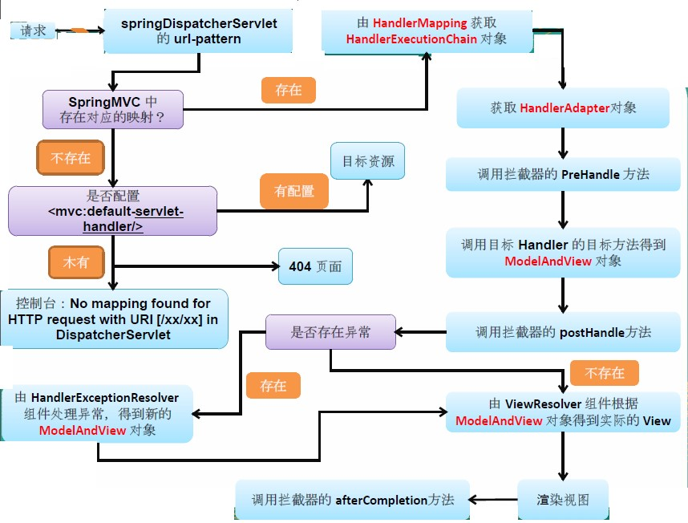


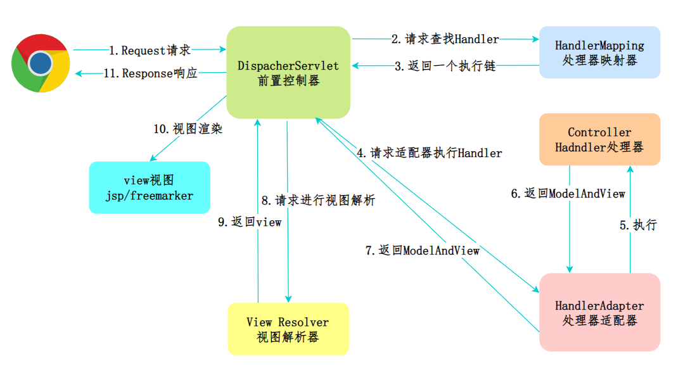

## 4. DispatcherServlet 前端控制器配置

DispatcherServlet 和其他 Servlet 一样，<font color=red>**实质是一个 Servlet**</font>。需要通过使用 Java 编程式配置或在 web.xml 中根据 Servlet 规范进行声明和映射。通过配置来绑定请求映射、视图解析、异常处理等方面的组件。

### 4.1. DispatcherServlet 注册与初始化配置

#### 4.1.1. 编程式配置

在 Servlet 3.0+ 环境中，可以选择以编程方式配置 Servlet 容器。在 Servlet3.0 规范提供的标准接口 `ServletContainerInitializer`，作用是在启动 web 容器(如 tomcat)，会自动调用接口的 `onStartup` 方法。

##### 4.1.1.1. WebApplicationInitializer

`WebApplicationInitializer` 是 Spring MVC 提供的一个接口，用于自动初始化任何 Servlet 3 容器检测自定义的实现

- 创建 `org.springframework.web.WebApplicationInitializer` 的实现类，在 `onStartup` 方法中，注册和初始化 `DispatcherServlet` 和初始化 Spring 容器的配置类

```java
public class WebConfig implements WebApplicationInitializer {

    @Override
    public void onStartup(ServletContext servletContext) throws ServletException {
        // 创建基于注解的上下文容器
        AnnotationConfigWebApplicationContext context = new AnnotationConfigWebApplicationContext();
        context.register(SpringConfiguration.class);

        // 注册并初始化 DispatcherServlet
        DispatcherServlet servlet = new DispatcherServlet(context);
        ServletRegistration.Dynamic registration = servletContext.addServlet("app", servlet);
        registration.setLoadOnStartup(1);
        registration.addMapping("/*");
    }
}
```

- 创建 `SpringConfiguration` 类，用于 Spring 配置

```java
@Configuration
@ComponentScan("com.moon.springmvc")
public class SpringConfiguration {}
```

> 注：`WebApplicationInitializer` 也是同样的作用。

##### 4.1.1.2. AbstractDispatcherServletInitializer

`AbstractDispatcherServletInitializer` 是 `WebApplicationInitializer` 接口的抽象实现，提供一些注册与初始化 `DispatcherServlet` 的实现，重写了部分的方法（如：Servlet 的映射、DispatcherServlet 配置位置等），还提供一些方法（如：`getServletFilters` 配置过滤器），让初始化配置更加便利与方便扩展

如果是使用基于 XML 的 Spring 配置，推荐直接从 `AbstractDispatcherServletInitializer` 进行扩展

```java
public class WebConfig extends AbstractDispatcherServletInitializer {

    /**
     * 重写web项目启动方法，可自定义的初始化处理
     *
     * @param servletContext
     * @throws ServletException
     */
    @Override
    public void onStartup(ServletContext servletContext) throws ServletException {
        // 触发父类的onStartup方法
        super.onStartup(servletContext);
        // 下面可以做其他初始化相关的工作
    }

    /* 用于创建SpringMVC的ioc容器 */
    @Override
    protected WebApplicationContext createServletApplicationContext() {
        // 创建基于注解的web应用上下文容器
        AnnotationConfigWebApplicationContext context = new AnnotationConfigWebApplicationContext();
        // 将SpringMVC配置类注册到web容器中
        context.register(SpringConfiguration.class);
        // 返回容器对象，完成创建
        return context;
    }

    /*
     * 用于指定DispatcherServlet的请求映射
     *  相当于web.xml中配置的
     *  <servlet-mapping>
     *      <servlet-name>dispatcherServlet</servlet-name>
     *      <url-pattern>/</url-pattern>
     *  </servlet-mapping>
     */
    @Override
    protected String[] getServletMappings() {
        return new String[]{"/"};
    }

    /* 用于创建Spring的ioc容器（即根容器，非web层的对象容器） */
    @Override
    protected WebApplicationContext createRootApplicationContext() {
        // 如果不需要，返回 null 即可
        return null;
    }

    /* 添加自定义过滤器 */
    @Override
    protected Filter[] getServletFilters() {
        return super.getServletFilters();
    }
}
```

如果需要进一步定制 `DispatcherServlet` 本身，可以重写 `createDispatcherServlet` 方法。

#### 4.1.2. xml 文件配置

使用 web.xml 配置也可注册并初始化 `DispatcherServlet`

```java
<?xml version="1.0" encoding="UTF-8"?>
<web-app xmlns:xsi="http://www.w3.org/2001/XMLSchema-instance"
         xmlns="http://java.sun.com/xml/ns/javaee"
         xsi:schemaLocation="http://java.sun.com/xml/ns/javaee http://java.sun.com/xml/ns/javaee/web-app_2_5.xsd"
         version="2.5">
    <display-name>dispatcherservlet-init-xml</display-name>

    <listener>
        <listener-class>org.springframework.web.context.ContextLoaderListener</listener-class>
    </listener>

    <context-param>
        <param-name>contextConfigLocation</param-name>
        <param-value>classpath:springmvc.xml</param-value>
    </context-param>

    <servlet>
        <servlet-name>app</servlet-name>
        <servlet-class>org.springframework.web.servlet.DispatcherServlet</servlet-class>
        <init-param>
            <param-name>contextConfigLocation</param-name>
            <param-value></param-value>
        </init-param>
        <!-- 配置 web 容器启动时马上加载 -->
        <load-on-startup>1</load-on-startup>
    </servlet>

    <servlet-mapping>
        <servlet-name>app</servlet-name>
        <url-pattern>/</url-pattern>
    </servlet-mapping>

</web-app>
```

创建 Spring MVC 配置文件 springmvc.xml，配置包扫描与基于注解驱动的方式配置处理器映射器、处理器适配器

```xml
<?xml version="1.0" encoding="UTF-8"?>
<beans xmlns="http://www.springframework.org/schema/beans"
       xmlns:xsi="http://www.w3.org/2001/XMLSchema-instance"
       xmlns:context="http://www.springframework.org/schema/context"
       xmlns:mvc="http://www.springframework.org/schema/mvc"
       xsi:schemaLocation="http://www.springframework.org/schema/beans
		http://www.springframework.org/schema/beans/spring-beans.xsd
		http://www.springframework.org/schema/mvc
		http://www.springframework.org/schema/mvc/spring-mvc.xsd
		http://www.springframework.org/schema/context
		http://www.springframework.org/schema/context/spring-context.xsd">

    <!-- 配置开启扫描 controller -->
    <context:component-scan base-package="com.moon.springmvc"/>

    <!-- 注解驱动的方式配置处理器映射器、处理器适配器
        相当于同时配置了RequestMappingHandlerMapping/RequestMappingHandlerAdapter
     -->
    <mvc:annotation-driven/>
</beans>
```

### 4.2. 前端控制器委托处理接口（整理中）

`DispatcherServlet`（前端控制器）处理请求与响应的工作都会交给以下接口去完成，Spring MVC 都提供这些接口内置实现，但也可以通过自定义这些接口实现来扩展功能。接口列表如下：

|                 接口类型                 | 说明                                                                    |
| :--------------------------------------: | ----------------------------------------------------------------------- |
|             `HandlerMapping`             | 处理器映射器，将一个请求和前后拦截器列表的按照一定规则建立映射关系      |
|             `HandlerAdapter`             | 处理器适配器，帮助 DispatcherServlet 根据请求的映射，调用相应的处理程序 |
|        `HandlerExceptionResolver`        |                                                                         |
|              `ViewResolver`              |                                                                         |
| `LocaleResolver`/`LocaleContextResolver` |                                                                         |
|             `ThemeResolver`              |                                                                         |
|           `MultipartResolver`            |                                                                         |
|            `FlashMapManager`             |                                                                         |

`DispatcherServlet` 检查 `WebApplicationContext` 中的以上接口的实现对象。如果没有匹配相关自定义实现，就会使用 `DispatcherServlet.properties` 文件（org.springframework.web.servlet 包）中列出的默认实现

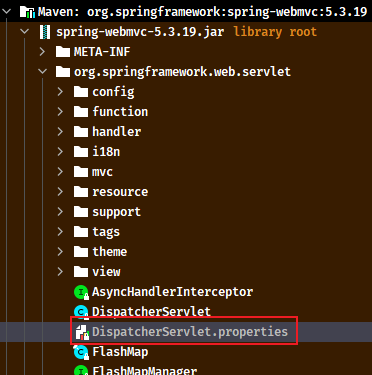

```properties
# Default implementation classes for DispatcherServlet's strategy interfaces.
# Used as fallback when no matching beans are found in the DispatcherServlet context.
# Not meant to be customized by application developers.

org.springframework.web.servlet.LocaleResolver=org.springframework.web.servlet.i18n.AcceptHeaderLocaleResolver

org.springframework.web.servlet.ThemeResolver=org.springframework.web.servlet.theme.FixedThemeResolver

org.springframework.web.servlet.HandlerMapping=org.springframework.web.servlet.handler.BeanNameUrlHandlerMapping,\
	org.springframework.web.servlet.mvc.method.annotation.RequestMappingHandlerMapping,\
	org.springframework.web.servlet.function.support.RouterFunctionMapping

org.springframework.web.servlet.HandlerAdapter=org.springframework.web.servlet.mvc.HttpRequestHandlerAdapter,\
	org.springframework.web.servlet.mvc.SimpleControllerHandlerAdapter,\
	org.springframework.web.servlet.mvc.method.annotation.RequestMappingHandlerAdapter,\
	org.springframework.web.servlet.function.support.HandlerFunctionAdapter


org.springframework.web.servlet.HandlerExceptionResolver=org.springframework.web.servlet.mvc.method.annotation.ExceptionHandlerExceptionResolver,\
	org.springframework.web.servlet.mvc.annotation.ResponseStatusExceptionResolver,\
	org.springframework.web.servlet.mvc.support.DefaultHandlerExceptionResolver

org.springframework.web.servlet.RequestToViewNameTranslator=org.springframework.web.servlet.view.DefaultRequestToViewNameTranslator

org.springframework.web.servlet.ViewResolver=org.springframework.web.servlet.view.InternalResourceViewResolver

org.springframework.web.servlet.FlashMapManager=org.springframework.web.servlet.support.SessionFlashMapManager
```

> <font color=red>**注意：如果没有手动创建的以上接口的自定义实现并加入到 Spring，Spring MVC 会去自动创建默认的实现，但只会保存在 `DispatcherServlet` 中相应的属性中，此时 Spring 容器是没有这些实现的实例。**</font>

### 4.3. 映射器和适配器

#### 4.3.1. HandlerMapping（处理器映射器）

Spring MVC 提供了一些默认的处理器映射器

> 注意事项：旧版本中的默认的处理器映射器是 `org.springframework.web.servlet.mvc.annotation.DefaultAnnotationHandlerMapping` 已经过时。在企业项目不推荐使用。新的版本已经换成默认是 `RequestMappingHandlerMapping`

旧版本 Spring MVC 中，需要手动创建其对象实例

- xml 配置

```xml
<!-- 配置处理器映射器(RequestMappingHandlerMapping) -->
<bean class="org.springframework.web.servlet.mvc.method.annotation.RequestMappingHandlerMapping" />
```

- 注解配置

```java
@Bean
public RequestMappingHandlerMapping requestMappingHandlerMapping() {
    return new RequestMappingHandlerMapping();
}
```

> 注意事项：处理器映射器和处理器适配器必须配对使用。

#### 4.3.2. HandlerAdapter（处理器适配器）

Spring MVC 提供了一些默认的处理器适配器

> 注意事项：旧版本中的默认的处理器映射器是 `org.springframework.web.servlet.mvc.annotation.AnnotationMethodHandlerAdapter` 已经过时。在企业项目不推荐使用。新的版本已经换成默认是 `RequestMappingHandlerAdapter`

旧版本 Spring MVC 中，需要手动创建其对象实例

- xml 配置

```xml
<!-- 配置处理器适配器(RequestMappingHandlerAdapter) -->
<bean class="org.springframework.web.servlet.mvc.method.annotation.RequestMappingHandlerAdapter" />
```

- 注解配置

```java
@Bean
public RequestMappingHandlerAdapter requestMappingHandlerAdapter() {
    return new RequestMappingHandlerAdapter();
}
```

> 注意事项：处理器映射器和处理器适配器必须配对使用。

#### 4.3.3. 处理器映射器和处理器适配器同时配置方式

如果使用 web.xml 的配置方式，需要在 springmvc.xml 配置文件中，配置 `<mvc:annotation-driven>` 标签，表示基于注解驱动的方式配置处理器映射器、处理器适配器，相当于同时配置了 `RequestMappingHandlerMapping`/`RequestMappingHandlerAdapter`（_企业开发推荐使用_）

```xml
<mvc:annotation-driven />
```

<font color=red>**注意事项：上面配置中，处理器映射器和处理器适配器必须配对使用**</font>。否则会报【HTTP Status 500 - No adapter for handler】的异常


#### 4.3.4. RequestMappingHandlerMapping 与 RequestMappingHandlerAdapter

`RequestMappingHandlerMapping` 与 `RequestMappingHandlerAdapter` 是一对配合使用

- `RequestMappingHandlerMapping` 用于处理 `@RequestMapping` 映射相应的控制器方法
- `RequestMappingHandlerAdapter` 用于调用控制器方法、并处理方法参数与方法返回值

初始化流程如下：

1. `DispatcherServlet` 是在第一次被访问时执行初始化，也可以通过配置修改为 Tomcat 启动后就初始化
2. 在初始化时会从 Spring 容器中找一些 Web 需要的组件，如` HandlerMapping`、`HandlerAdapter` 等，并逐一调用它们的初始化
3. `RequestMappingHandlerMapping` 初始化时，会收集所有 `@RequestMapping` 映射信息，封装为 Map，其中
   - key 是 `RequestMappingInfo` 类型，包括请求路径、请求方法等信息
   - value 是 `HandlerMethod` 类型，包括控制器方法对象、控制器对象
4. 当前端有请求到达时，快速从映射中找到 `HandlerMethod` 并与匹配的拦截器一起返回给 `DispatcherServlet`
5. `RequestMappingHandlerAdapter` 初始化时，会准备 `HandlerMethod` 调用时需要的各个组件，如：
   - `HandlerMethodArgumentResolver` 解析控制器方法参数
   - `HandlerMethodReturnValueHandler` 处理控制器方法返回值

#### 4.3.5. BeanNameUrlHandlerMapping 与 SimpleControllerHandlerAdapter

`BeanNameUrlHandlerMapping` 与 `SimpleControllerHandlerAdapter` 是一对配合使用

- `BeanNameUrlHandlerMapping` 用于映射相应的控制器方法，但控制器实例在 Spring 容器中的名称必须以`/`开头，将会被当作映射路径。这些 bean 相当于 handler，并且需要实现 `Controller` 接口
- `SimpleControllerHandlerAdapter` 用于调用其 handler

示例：

- 创建配置类

```java
@Configuration
public class WebConfig {
    @Bean // 内嵌 web 容器工厂
    public TomcatServletWebServerFactory servletWebServerFactory() {
        return new TomcatServletWebServerFactory(8080);
    }

    @Bean // 创建 DispatcherServlet
    public DispatcherServlet dispatcherServlet() {
        return new DispatcherServlet();
    }

    @Bean // 注册 DispatcherServlet, Spring MVC 的入口
    public DispatcherServletRegistrationBean servletRegistrationBean(DispatcherServlet dispatcherServlet) {
        return new DispatcherServletRegistrationBean(dispatcherServlet, "/");
    }

    @Bean
    public BeanNameUrlHandlerMapping beanNameUrlHandlerMapping() {
        return new BeanNameUrlHandlerMapping();
    }

    @Bean
    public SimpleControllerHandlerAdapter simpleControllerHandlerAdapter() {
        return new SimpleControllerHandlerAdapter();
    }

    // 创建控制类，指定bean的名称以“`/`”开头，并实现 `Controller` 接口
    @Bean("/c3")
    public Controller controller3() {
        return (request, response) -> {
            response.getWriter().print("this is c3");
            return null;
        };
    }
}
```

- 创建控制类，指定 bean 的名称以“`/`”开头，并实现 `Controller` 接口

```java
@Component("/c1")
public class Controller1 implements Controller {
    @Override
    public ModelAndView handleRequest(HttpServletRequest request, HttpServletResponse response) throws Exception {
        response.getWriter().print("this is c1");
        return null;
    }
}

@Component("/c2")
public class Controller2 implements Controller {
    @Override
    public ModelAndView handleRequest(HttpServletRequest request, HttpServletResponse response) throws Exception {
        response.getWriter().print("this is c2");
        return null;
    }
}
```

- 创建 web 容器进行测试，是否能成功访问 /c1、/c2、/c3

```java
 AnnotationConfigServletWebServerApplicationContext context = new AnnotationConfigServletWebServerApplicationContext(WebConfig.class);
```

#### 4.3.6. RouterFunctionMapping 与 HandlerFunctionAdapter

在 Spring 5.2 版本后才新增的两个实现类，是一对配合使用。

- `RouterFunctionMapping` 用于收集所有 `RouterFunction`，包括 `RequestPredicate`（设置映射条件）与 `HandlerFunction`（处理的逻辑）两部分。请求时，会根据映射条件找到相应的 `HandlerFunction`，即 handler
- `RouterFunction` 是函数式控制器，handler 要实现 `HandlerFunction` 接口
- `HandlerFunctionAdapter` 用于调用 handler

示例：

- 创建配置类与定义 `RouterFunction`

```java
import org.springframework.boot.autoconfigure.web.servlet.DispatcherServletRegistrationBean;
import org.springframework.boot.web.embedded.tomcat.TomcatServletWebServerFactory;
import org.springframework.context.annotation.Bean;
import org.springframework.context.annotation.Configuration;
import org.springframework.web.servlet.DispatcherServlet;
import org.springframework.web.servlet.function.*;
import org.springframework.web.servlet.function.support.HandlerFunctionAdapter;
import org.springframework.web.servlet.function.support.RouterFunctionMapping;

import static org.springframework.web.servlet.function.RequestPredicates.*;
import static org.springframework.web.servlet.function.RouterFunctions.*;
import static org.springframework.web.servlet.function.ServerResponse.*;

@Configuration
public class WebConfig {
    @Bean // 内嵌 web 容器工厂
    public TomcatServletWebServerFactory servletWebServerFactory() {
        return new TomcatServletWebServerFactory(8080);
    }

    @Bean // 创建 DispatcherServlet
    public DispatcherServlet dispatcherServlet() {
        return new DispatcherServlet();
    }

    @Bean // 注册 DispatcherServlet, Spring MVC 的入口
    public DispatcherServletRegistrationBean servletRegistrationBean(DispatcherServlet dispatcherServlet) {
        return new DispatcherServletRegistrationBean(dispatcherServlet, "/");
    }

    @Bean
    public RouterFunctionMapping routerFunctionMapping() {
        return new RouterFunctionMapping();
    }

    @Bean
    public HandlerFunctionAdapter handlerFunctionAdapter() {
        return new HandlerFunctionAdapter();
    }

    @Bean
    public RouterFunction<ServerResponse> r1() {
        // 参数1：指定映射条件；参数2：handler 要实现 HandlerFunction 接口
        return route(GET("/r1"), request -> ok().body("this is r1"));
    }

    @Bean
    public RouterFunction<ServerResponse> r2() {
        return route(GET("/r2"), request -> ok().body("this is r2"));
    }
}
```

#### 4.3.7. SimpleUrlHandlerMapping 与 HttpRequestHandlerAdapter

`SimpleUrlHandlerMapping` 与 `HttpRequestHandlerAdapter` 是一对配合使用

- `SimpleUrlHandlerMapping` 用于映射静态资源路径，常用通配符的方式进行映射。值得注意，该类不会在初始化时收集映射信息，需要手动配置收集
- `ResourceHttpRequestHandler` 作为静态资源 handler
- `HttpRequestHandlerAdapter` 调用此 handler

##### 4.3.7.1. 基础使用示例

创建配置类与静态资源处理器 `ResourceHttpRequestHandler`，并需要配置 `SimpleUrlHandlerMapping` 收集相应的处理器

```java
@Configuration
public class WebConfig {
    @Bean // 内嵌 web 容器工厂
    public TomcatServletWebServerFactory servletWebServerFactory() {
        return new TomcatServletWebServerFactory(8080);
    }

    @Bean // 创建 DispatcherServlet
    public DispatcherServlet dispatcherServlet() {
        return new DispatcherServlet();
    }

    @Bean // 注册 DispatcherServlet, Spring MVC 的入口
    public DispatcherServletRegistrationBean servletRegistrationBean(DispatcherServlet dispatcherServlet) {
        return new DispatcherServletRegistrationBean(dispatcherServlet, "/");
    }

    @Bean // 手动收集
    public SimpleUrlHandlerMapping simpleUrlHandlerMapping(ApplicationContext context) {
        SimpleUrlHandlerMapping handlerMapping = new SimpleUrlHandlerMapping();
        Map<String, ResourceHttpRequestHandler> map = context.getBeansOfType(ResourceHttpRequestHandler.class);
        handlerMapping.setUrlMap(map);
        System.out.println(map);
        return handlerMapping;
    }

    @Bean
    public HttpRequestHandlerAdapter httpRequestHandlerAdapter() {
        return new HttpRequestHandlerAdapter();
    }

    @Bean("/**") // 配置静态页面的映射，如 /r2.html 相应于项目中 /static/r2.html
    public ResourceHttpRequestHandler handler1() {
        ResourceHttpRequestHandler handler = new ResourceHttpRequestHandler();
        handler.setLocations(Arrays.asList(new ClassPathResource("static/")));
        return handler;
    }

    @Bean("/img/**") // 配置图片的映射，如 /img/1.jpg 相应于项目中 /images/1.jpg
    public ResourceHttpRequestHandler handler2() {
        ResourceHttpRequestHandler handler = new ResourceHttpRequestHandler();
        handler.setLocations(Arrays.asList(new ClassPathResource("images/")));
        return handler;
    }
}
```

##### 4.3.7.2. 静态资源解析优化

在创建的 `ResourceHttpRequestHandler` 对象中通过 `setResourceResolvers` 方法，增加相应的资源处理器

```java
@Bean("/**") // 配置静态页面的映射，如 /r2.html 相应于项目中 /static/r2.html
public ResourceHttpRequestHandler handler1() {
    ResourceHttpRequestHandler handler = new ResourceHttpRequestHandler();
    handler.setLocations(Arrays.asList(new ClassPathResource("static/")));
    handler.setResourceResolvers(Arrays.asList(
        // 缓存优化
        new CachingResourceResolver(new ConcurrentMapCache("cache1")),
        // 压缩优化
        new EncodedResourceResolver(),
        // 原始资源解析
        new PathResourceResolver()
    ));
    return handler;
}
```

值得注意：`EncodedResourceResolver` 并不会生成压缩文件，需要手动生成。参考示例如下：

```java
// 在配置类中定义
@PostConstruct
@SuppressWarnings("all")
public void initGzip() throws IOException {
    Resource resource = new ClassPathResource("static");
    File dir = resource.getFile();
    for (File file : dir.listFiles(pathname -> pathname.getName().endsWith(".html"))) {
        System.out.println(file);
        try (FileInputStream fis = new FileInputStream(file); GZIPOutputStream fos = new GZIPOutputStream(new FileOutputStream(file.getAbsoluteFile() + ".gz"))) {
            byte[] bytes = new byte[8 * 1024];
            int len;
            while ((len = fis.read(bytes)) != -1) {
                fos.write(bytes, 0, len);
            }
        }
    }
}
```

##### 4.3.7.3. 欢迎页

欢迎页支持静态欢迎页与动态欢迎页

- WelcomePageHandlerMapping 映射欢迎页（即只映射 '`/`'）
  - 它内置的 handler ParameterizableViewController 作用是不执行逻辑，仅根据视图名找视图
  - 视图名固定为 `forward:index.html`
- SimpleControllerHandlerAdapter, 调用 handler
  - 转发至 `/index.html`
  - 处理 `/index.html` 又会走上面的静态资源处理流程

在配置类中创建 `WelcomePageHandlerMapping` 实例，指定根路径相应的静态资源

```java
@Bean
public WelcomePageHandlerMapping welcomePageHandlerMapping(ApplicationContext context) {
    Resource resource = context.getResource("classpath:static/index.html");
    return new WelcomePageHandlerMapping(null, context, resource, "/**");
}

@Bean
public SimpleControllerHandlerAdapter simpleControllerHandlerAdapter() {
    return new SimpleControllerHandlerAdapter();
}
```

#### 4.3.8. 小结

`HandlerMapping` 负责建立请求与控制器之间的映射关系

- `RequestMappingHandlerMapping`：用于解析 `@RequestMapping` 及其衍生注解标识的控制器方法
- `WelcomePageHandlerMapping`：用于解析 `/` 根路径
- `BeanNameUrlHandlerMapping`：用于解析以 bean 的名字匹配路径映射，并且 bean 名称要以 `/` 开头，并实现 `Controller` 接口
- `RouterFunctionMapping`：用于解析函数式 `RequestPredicate`（定义匹配逻辑与请求路径）、`HandlerFunction`（定义具体的处理逻辑）
- `SimpleUrlHandlerMapping`：用于映射静态资源，基于通配符，如：`/**`、`/img/**` 等

> <font color=red>**注意：以上的映射器有顺序的限制，不需要顺意调换定义的顺序，否则会出现所有请求只能匹配到一种映射器的情。Spring boot 的默认顺序如上述**</font>

`HandlerAdapter` 负责实现对各种各样的 handler 的适配调用

- `RequestMappingHandlerAdapter` 处理 `@RequestMapping` 及其衍生注解标识的处理器。包括参数解析器、返回值处理器，体现了组合模式
- `SimpleControllerHandlerAdapter` 处理实现了 `Controller` 接口的处理器
- `HandlerFunctionAdapter` 处理 `HandlerFunction` 函数式接口的处理器
- `HttpRequestHandlerAdapter` 处理 `HttpRequestHandler` 接口的处理器(静态资源处理)

> `HandlerAdapter` 是典型适配器模式体现

补充：Spring 的 `ResourceHttpRequestHandler.setResourceResolvers` 是典型责任链模式体现

### 4.4. ViewResolver（视图解析器）

Spring MVC 提供了默认的视图解析器 `InternalResourceViewResolver`，在容器初始化时会创建，也可以手动创建并设置相关属性

- 使用编程式创建视图解析器，在 Spring 的配置类中增加以下内容：

```java
 /**
  * 创建视图解析器(InternalResourceViewResolver)并存入ioc容器
  *
  * @return ViewResolver
  */
@Bean
public ViewResolver createViewResolver() {
    InternalResourceViewResolver viewResolver = new InternalResourceViewResolver();
    // 配置视图的公共目录路径(前缀)
    viewResolver.setPrefix("/WEB-INF/pages/");
    // 配置视图的扩展名称(后缀)
    viewResolver.setSuffix(".jsp");
    return viewResolver;
}
```

- 使用 xml 配置方式配置默认的视图解析器，在 Spring 的 xml 配置文件增加以下内容：

```xml
<!-- 配置视图解析(InternalResourceViewResolver)  -->
<bean class="org.springframework.web.servlet.view.InternalResourceViewResolver">
	<!-- 配置视图的公共目录路径(前缀) -->
	<property name="prefix" value="/WEB-INF/jsp/"></property>
	<!-- 配置视图的扩展名称(后缀) -->
	<property name="suffix" value=".jsp"></property>
</bean>
```

- 在 Controller 接口中，直接返回视图的名称即可，会自动拼接上面配置的前后缀

```java
// 配置视图解析器后只需要设置视图名称即可。（原因是视图解析器进行拼接）
mav.setViewName("helloSpringMVC");
```

### 4.5. WebApplicationContext 上下文层次结构

```java
public interface WebApplicationContext extends ApplicationContext
```

`WebApplicationContext` 是普通 `ApplicationContext` 的扩展，它会绑定到 `ServletContext` 中。可以使用 `RequestContextUtils` 工具类的静态方法来获取 `WebApplicationContext` 上下文对象。一个根 `WebApplicationContext` 被多个 `DispatcherServlet`（或其他 Servlet）实例共享，每个实例有自己的子 `WebApplicationContext` 配置。结构关系如下图：


> Tips: WebApplicationContext 与普通的 ApplicationContext 在解析主题和决定与哪个 servlet 关联的能力方面有所不同。英文原文链接：https://www.edureka.co/blog/interview-questions/spring-interview-questions/

#### 4.5.1. 编程式配置

```java
public class MyWebAppInitializer extends AbstractAnnotationConfigDispatcherServletInitializer {

    @Override
    protected Class<?>[] getRootConfigClasses() {
        return new Class<?>[] { RootConfig.class };
    }

    @Override
    protected Class<?>[] getServletConfigClasses() {
        return new Class<?>[] { App1Config.class };
    }

    @Override
    protected String[] getServletMappings() {
        return new String[] { "/app/*" };
    }
}
```

> 注：如果不需要应用上下文的层次结构，应用程序可以通过 `getRootConfigClasses()` 方法返回所有配置，而 `getServletConfigClasses()` 方法返回 null

#### 4.5.2. xml 文件配置

也可使用 web.xml 配置

```xml
<web-app>

    <listener>
        <listener-class>org.springframework.web.context.ContextLoaderListener</listener-class>
    </listener>

    <context-param>
        <param-name>contextConfigLocation</param-name>
        <param-value>/WEB-INF/root-context.xml</param-value>
    </context-param>

    <servlet>
        <servlet-name>app1</servlet-name>
        <servlet-class>org.springframework.web.servlet.DispatcherServlet</servlet-class>
        <init-param>
            <param-name>contextConfigLocation</param-name>
            <param-value>/WEB-INF/app1-context.xml</param-value>
        </init-param>
        <load-on-startup>1</load-on-startup>
    </servlet>

    <servlet-mapping>
        <servlet-name>app1</servlet-name>
        <url-pattern>/app1/*</url-pattern>
    </servlet-mapping>

</web-app>
```

> 注：如果不需要应用上下文层次结构，应用程序可以只配置一个根上下文，并将 contextConfigLocation Servlet 参数留空即可

## 5. Spring MVC 处理器方法 - 参数绑定

### 5.1. 概念

通过 `@RequestMapping` 注解标识的方法都被定义为处理器（Handler）。参数绑定指的是通过处理器（Handler）方法的形参，接收到请求的 url 或者表单中的参数数据。即通过定义方法的形参来封装请求提交的参数数据。

以下是控制器方法支持的绑定参数类型：

- `ServletRequest`：请求类型，例如：`ServletRequest`、`HttpServletRequest`、Spring 的 `MultipartRequest`、`MultipartHttpServletRequest`。
- `ServletResponse`：响应类型，例如：`ServletResponse`、`HttpServletResponse`。
- `HttpSession`：请求会话类型。此类型可保证方法参数永远不会空。值得注意，使用会话类型的方法形参是非线程安全的。如果允许多个请求同时访问一个会话，考虑将 `RequestMappingHandlerAdapter` 实例的 `synchronizeOnSession` 标志设置为 `true`
- `Model`/`ModelMap`：用于访问 HTML 控制器中使用的模型，并作为视图渲染的一部分暴露给模板。
- `@RequestParam`：用于获取请求参数（即查询参数或表单数据、上传的文件），绑定到控制器中的方法参数。参数值会被转换为声明的方法形参的类型。注意，对于简单类型的参数值，只要形参名称与请求参数名称一致，该注解可省略。
- `Map`集合：key 为请求上送的参数名称，value 是参数值。需要与`@RequestParam`注解配置使用
- 任何其他参数类型：控制方法形参是 Java 基本数据类型、对象、包装类型等，由`BeanUtils#isSimpleProperty`决定，它被解析为`@RequestParam`还是`@ModelAttribute`

> 支持使用 JDK 8 的 `java.util.Optional` 作为方法参数，与具有必填属性的注解相结合（例如，`@RequestParam`、`@RequestHeader` 等），相当于 `required=false`

### 5.2. HttpServletRequest

Spring MVC 默认支持绑定 `javax.servlet.ServletRequest` 类型的参数。通过定义控制器方法形参为 `HttpServletRequest` 类型，处理适配器默认识别并赋值。

示例：`HttpServletRequest` 是默认支持绑定的参数，方法定义 request 形参，Spring MVC 在执行此方法的时候，会把 request 对象绑定到方法形参 request 上

```java
@RequestMapping("/queryItemById.do")
public ModelAndView queryItemById(HttpServletRequest request) {
	// 1.创建ModelAndView对象
	ModelAndView mav = new ModelAndView();
	// 2.通过request对象获取请求提交的参数
	String id = request.getParameter("id");
	// 3.调用service层方法，根据id查询的方法
	Item item = itemService.queryItemById(Integer.parseInt(id));
	// 4.设置响应商品的数据
	mav.addObject("item", item);
	// 5.设置响应商品列表页面
	mav.setViewName("item/itemEdit");
	// 6.返回模型视图对象
	return mav;
}
```

### 5.3. HttpServletResponse

Spring MVC 默认支持绑定 `javax.servlet.ServletResponse` 类型的参数。通过定义控制器方法形参为 `HttpServletResponse` 类型，处理适配器默认识别并赋值。

### 5.4. HttpSession

Spring MVC 默认支持绑定 `javax.servlet.http.HttpSession` 类型的参数。通过定义控制器方法形参为 `HttpSession` 类型，处理适配器默认识别并赋值。从而使用 session 对象，获取放到会话域中的数据。

### 5.5. Model / ModelMap

- `org.springframework.ui.Model` 是模型，是一个接口。<font color=red>**用于设置响应的模型数据**</font>
- `org.springframework.ui.ModelMap` 是一个实现类，使用 `ModelMap` 和使用 `Model` 是一样的。使用 `Model`，Spring MVC 在执行的时候，会实例化成 `ModelMap`

使用 `Model` 响应模型数据，就可以不使用 `ModelAndView`，视图可以使用字符串 String 返回。<font color=red>**不管是 `Model` 还是 `ModelAndView`，其本质都是使用 `Request` 对象向 jsp 传递数据**</font>

#### 5.5.1. Model / ModelMap 相关方法

```java
Model addAttribute(String attributeName, @Nullable Object attributeValue);
```

- 设置响应的模型数据
  - `attributeName` 参数：设置页面响应的名称(key)
  - `attributeValue` 参数：设置模型响应的数据

#### 5.5.2. 示例

```java
/**
 * SpringMVC参数绑定：2.默认支持绑定的参数(使用Model绑定)
 * 使用Model封装，可以直接返回String类型响应视图
 *
 * 	request形参，接收请求的商品id参数数据。
 * 	springmvc在执行这个方法的时候，会把request对象传递过来
 */
@RequestMapping("/queryItemById.do")
public String queryItemById(Model model, HttpServletRequest request) {
	// 1.通过request对象获取请求提交的参数
	String id = request.getParameter("id");
	// 2.调用service层方法，根据id查询的方法
	Item item = itemService.queryItemById(Integer.parseInt(id));
	/*
	 *  3.使用Model对象设置响应商品的数据
	 *  addAttribute方法：响应模型数据
	 * 	 	attributeName参数：模型名称(响应)
	 *  	attributeValue参数：模型值（响应）
	 */
	model.addAttribute("item", item);
	// 4.返回字符串，设置响应视图
	return "item/itemEdit";
}
```

### 5.6. @RequestParam 注解绑定参数

设置请求的参数名称，与方法形参名称匹配。<font color=red>**绑定后传递的请求参数必须是设置的值。注意：注解的使用位置在需要绑定的形参前面**</font>

示例：使用 `@RequestParam` 注解解决请求参数与方法形参名称不匹配的问题

```java
/**
 * SpringMVC参数绑定：3.简单类型参数绑定(使用@RequestParam注解)
 * 	使用Model封装，可以直接返回String类型响应视图
 * 	使用简单类型Integer，接收请求的商品itemId参数数据
 *
 * 	@RequestParam注解属性：
 * 		value：设置请求的参数名称
 * 		required：设置参数是否必须传递。取值true/false。true必须要传递；false可以传递，也可以不传递。默认是true。
 * 		defaultValue：设置参数的默认值。如果传递，使用实际传递的参数值；如果不传递使用默认值
 */
@RequestMapping("/queryItemById.do")
public String queryItemById(Model model,
		@RequestParam(value = "itemId", required = false, defaultValue = "3") Integer id)
```

> 注：上面示例请求设置了 `@RequestParam` 注解，请求参数的名称必须为 `itemId`，如果请求不带参数，则方法形参 id 会有默认值为 3
>
> 关于 `@RequestParam` 注解更多使用说明，详见[《Spring MVC 注解汇总.md》文档](/后端框架/SpringMVC/SpringMVC-注解汇总)

### 5.7. Map 类型参数绑定

控制器方法形参可以使用 `Map` 集合实现参数绑定，但<font color=purple>**必须要配合 `@RequestParam` 注解一起使用**</font>

```java
/**
 * 高级参数绑定 Map 类型
 * 	跳转登录页面
 * 		http://127.0.0.1:8080/ssm/toLogin.do?id=1&name=anan
 */
@RequestMapping("/toLogin.do")
public String toLogin(@RequestParam Map<String, String> map) {
	System.out.println("id=" + map.get("id"));
	System.out.println("name=" + map.get("name"));
	return "common/success";
}
```

### 5.8. (实际使用时再整理) @ModelAttribute 和 @SessionAttributes 传递和保存数据

SpringMVC 支持使用 `@ModelAttribute` 和 `@SessionAttributes` 在不同的模型和控制器之间共享数据。 `@ModelAttribute` 主要有两种使用方式，一种是标注在方法上，一种是标注在 Controller 方法参数上。

当 `@ModelAttribute` 标记在方法上的时候，该方法将在处理器方法执行之前执行，然后把返回的对象存放在 session 或模型属性中，属性名称可以使用 `@ModelAttribute("attributeName")` 在标记方法的时候指定，若未指定，则使用返回类型的类名称（首字母小写）作为属性名称。关于 `@ModelAttribute` 标记在方法上时对应的属性是存放在 session 中还是存放在模型中，我们来做一个实验，看下面一段代码。

`@SessionAttributes` 用于标记需要在 Session 中使用到的数据，包括从 Session 中取数据和存数据。`@SessionAttributes` 一般是标记在 Controller 类上的，可以通过名称、类型或者名称加类型的形式来指定哪些属性是需要存放在 session 中的。

### 5.9. 任何其他参数类型

#### 5.9.1. 支持常用的简单类型参数绑定

|   类型名称   | 包装类型 | 基础类型 |
| ---------- | ------- | ------- |
| 整型        | Integer | int     |
| 长整型      | Long    | long    |
| 单精度浮点型 | Float   | float   |
| 双精度浮点型 | Double  | double  |
| 字符串      | String  | String  |

示例：

```java
/**
 * SpringMVC参数绑定：简单类型参数绑定
 * 	使用Model封装，可以直接返回String类型响应视图
 * 	使用简单类型Integer，接收请求的商品id参数数据
 */
@RequestMapping("/queryItemById.do")
public String queryItemById(Model model, Integer id) {
	// 1.调用service层方法，根据id查询的方法
	Item item = itemService.queryItemById(id);
	// 2.使用Model对象设置响应商品的数据
	model.addAttribute("item", item);
	// 3.返回字符串，设置响应视图
	return "item/itemEdit";
}
```

**使用简单类型绑定注意事项**：

- 使用简单类型绑定参数，建议使用简单类型的包装类型（如：`Integer`），不建议使用简单类型的基础类型(如：`int`)。原因是基础类型不能为空值(null)。如果不传递参数会报异常
- 请求的参数名称需要与方法形参名称一致，才能绑定。如果名称不一致，需要使用 `@RequestParam` 注解并在指定请求参数名称

#### 5.9.2. 对象类型参数绑定

如果请求提交的参数很多，或者提交的表单中的内容很多的时候，可以使用简单类型接受数据，也可以使用 pojo（对象类型）接收数据。

注意：<font color=red>**pojo 对象中的属性名 setter 方法和提交的表单中 input 元素的 `name` 属性一致或是上送的 json 对象属性名一致。（注：与属性名称无关，set 方法名称去掉 set 后的，首字母改成小写后与请求的参数名称一致即可）**</font>。Spring MVC 框架会自动将请求参数赋值给 pojo 的属性

示例：

```java
/**
 * SpringMVC参数绑定：对象类型参数绑定
 * 	直接返回String类型响应视图
 * 	使用Item对象，接收请求的商品参数数据
 */
@RequestMapping("/updateItem.do")
public String updateItem(Item item) {
	try {
		// 1.调用service层方法，保存商品数据
		itemService.updateItem(item);
	} catch (Exception e) {
		e.printStackTrace();
		// 保存失败发生异常，设置响应视图，跳转到异常页面
		return "common/failure";
	}
	// 2.保存成功返回字符串，设置响应视图
	return "common/success";
}
```

> 注：提交后会出现中文乱码的问题，解决方式参考后面章节中的 《中文参数传递乱码解决》

#### 5.9.3. 对象包装类型绑定

示例需求：使用 pojo 包装类型，接收综合查询条件（一个模拟操作）

创建包装类 QueryVo，用于使用 `<input type="text" name="item.name" value=""/>` 提交的参数

```java
public class QueryVo implements Serializable {
	private Item item;
	public Item getItem() {
		return item;
	}
	public void setItem(Item item) {
		this.item = item;
	}
}
```

测试

```java
/**
 * pojo包装类型接收参数
 * 	形参queryVo，接收请求的综合查询条件
 */
@RequestMapping("/queryItem.do")
public String queryItem(Model model, QueryVo queryVo) {
	// 1.测试包装类是否有接收数据
	if (queryVo != null && queryVo.getItem() != null) {
		System.out.println("页面提交的参数是：" + queryVo.getItem().getName());
	}
	// 2.调用service层方法，查询所有商品
	List<Item> itemList = itemService.queryAllItems();
	// 3.设置响应商品的数据
	model.addAttribute("itemList", itemList);
	// 4.返回字符串,设置响应视图
	return "item/itemList";
}
```

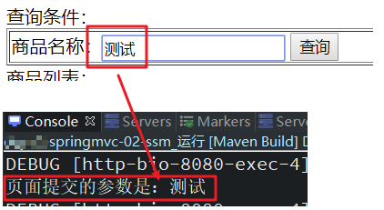

#### 5.9.4. 数组类型参数绑定

示例需求：实现商品数据的批量删除

- 修改商品列表页面，增加商品 id 的复选框

```html
<c:forEach items="${itemList}" var="item" varStatus="vs">
  <%-- 测试数组类型绑定 时使用 --%>
  <tr>
    <td><input type="checkbox" name="ids" value="${item.id}" /></td>
    <td>${item.name }</td>
    <td>${item.price }</td>
    <td><fmt:formatDate value="${item.createtime}" pattern="yyyy-MM-dd HH:mm:ss" /></td>
    <td>${item.detail }</td>
    <td><a href="${pageContext.request.contextPath }/queryItemById.do?id=${item.id}">修改</a></td>
  </tr>
</c:forEach>
```

- 后端接口实现方式 1：增加数组类型形参，与页面请求的名称一致，用于接收页面传递的值

```java
/**
 * 数组类型绑定(直接定义数组做为形参)
 * 	形参ids，用于接收请求的多个商品id
 */
@RequestMapping("/queryItem.do")
public String queryItem(Model model, Integer[] ids) {
	// 1.测试数组类型绑定
	if (ids != null && ids.length > 0) {
		for (Integer i : ids) {
			System.out.println("商品的ID：" + i);
		}
	}
	// 2.调用service层方法，查询所有商品
	List<Item> itemList = itemService.queryAllItems();
	// 3.设置响应商品的数据
	model.addAttribute("itemList", itemList);
	// 4.返回字符串,设置响应视图
	return "item/itemList";
}
```

- 后端接口实现方式 2：增加包装类类型形参，在包装类中增加数组类型的属性，与页面请求的名称一致

```java
// 测试包装类数组类型绑定
private Integer[] ids;


/**
 * 数组类型绑定(形参使用包装类)
 */
@RequestMapping(value= {"/queryItem.do"})
public String queryItem(Model model, QueryVo queryVo) {
	// 1.测试包装类的数组类型绑定
	if (queryVo != null && queryVo.getIds() != null) {
		for (Integer i : queryVo.getIds()) {
			System.out.println("商品的ID：" + i);
		}
	}
	// 2.调用service层方法，查询所有商品
	List<Item> itemList = itemService.queryAllItems();
	// 3.设置响应商品的数据
	model.addAttribute("itemList", itemList);
	// 4.返回字符串,设置响应视图
	return "item/itemList";
}
```

#### 5.9.5. 集合类型参数绑定

示例需求：商品数据的批量修改（使用 list 接收多个商品对象）

- 修改 itemList.jsp 页面，增加批量修改

```html
<form action="${pageContext.request.contextPath }/queryItem.do" method="post">
  商品列表：
  <table width="100%" border="1">
    <tr>
      <td>商品名称</td>
      <td>商品价格</td>
      <td>生产日期</td>
      <td>商品描述</td>
    </tr>
    <c:forEach items="${itemList}" var="item" varStatus="vs">
      <%-- 测试list集合类型绑定 时使用 --%>
      <!-- itemList:要绑定的商品集合的属性
				itemList[0]:商品集合属性中第一个商品对象
				itemList[0].id：第一个商品对象的id属性
				
				varStatus：当前遍历对象的状态
				vs.index：当前对象的索引 -->
      <tr>
        <td><input type="text" name="itemList[${vs.index}].name" value="${item.name}" /></td>
        <td><input type="text" name="itemList[${vs.index}].price" value="${item.price}" /></td>
        <td>
          <input
            type="text"
            name="itemList[${vs.index}].createtime"
            value='<fmt:formatDate value="${item.createtime}"
						pattern="yyyy-MM-dd HH:mm:ss" />'
          />
        </td>
        <td><input type="text" name="itemList[${vs.index}].detail" value="${item.detail}" /></td>
      </tr>
    </c:forEach>
    <tr>
      <!-- 测试list集合类型绑定  -->
      <td colspan="6">
        <input type="submit" value="批量修改" />
      </td>
    </tr>
  </table>
</form>
```

- 修改包装类，添加 List 类型的属性

```java
// 测试list类数组类型
private List<Item> itemList;
```

- 在控制器方法上定义包装类形参

```java
/**
 * List集合类型绑定
 */
@RequestMapping("/queryItem.do")
public String queryItem(Model model, QueryVo queryVo) {
	// 1.测试包装类的数组类型绑定
	if (queryVo != null && queryVo.getItemList() != null && queryVo.getItemList().size() > 0) {
		for (Item i : queryVo.getItemList()) {
			System.out.println(i);
		}
	}
	// 2.调用service层方法，查询所有商品
	List<Item> itemList = itemService.queryAllItems();
	// 3.设置响应商品的数据
	model.addAttribute("itemList", itemList);
	// 4.返回字符串,设置响应视图
	return "item/itemList";
}
```

> <font color=red>**注意事项：使用 list 类型参数绑定，list 需要作为 pojo 的属性。不能直接在方法的形参中使用 list，否则不能完成绑定**</font>

### 5.10. 参数解析器

#### 5.10.1. 默认参数解析器

Spring MVC 提供了很多默认的参数解析器，用于实现前面各种控制方法形参的解析绑定，具体实现类如下：

```
org.springframework.web.method.annotation.RequestParamMethodArgumentResolver
org.springframework.web.method.annotation.RequestParamMapMethodArgumentResolver
org.springframework.web.servlet.mvc.method.annotation.PathVariableMethodArgumentResolver
org.springframework.web.servlet.mvc.method.annotation.PathVariableMapMethodArgumentResolver
org.springframework.web.servlet.mvc.method.annotation.MatrixVariableMethodArgumentResolver
org.springframework.web.servlet.mvc.method.annotation.MatrixVariableMapMethodArgumentResolver
org.springframework.web.servlet.mvc.method.annotation.ServletModelAttributeMethodProcessor
org.springframework.web.servlet.mvc.method.annotation.RequestResponseBodyMethodProcessor
org.springframework.web.servlet.mvc.method.annotation.RequestPartMethodArgumentResolver
org.springframework.web.method.annotation.RequestHeaderMethodArgumentResolver
org.springframework.web.method.annotation.RequestHeaderMapMethodArgumentResolver
org.springframework.web.servlet.mvc.method.annotation.ServletCookieValueMethodArgumentResolver
org.springframework.web.method.annotation.ExpressionValueMethodArgumentResolver
org.springframework.web.servlet.mvc.method.annotation.SessionAttributeMethodArgumentResolver
org.springframework.web.servlet.mvc.method.annotation.RequestAttributeMethodArgumentResolver
org.springframework.web.servlet.mvc.method.annotation.ServletRequestMethodArgumentResolver
org.springframework.web.servlet.mvc.method.annotation.ServletResponseMethodArgumentResolver
org.springframework.web.servlet.mvc.method.annotation.HttpEntityMethodProcessor
org.springframework.web.servlet.mvc.method.annotation.RedirectAttributesMethodArgumentResolver
org.springframework.web.method.annotation.ModelMethodProcessor
org.springframework.web.method.annotation.MapMethodProcessor
org.springframework.web.method.annotation.ErrorsMethodArgumentResolver
org.springframework.web.method.annotation.SessionStatusMethodArgumentResolver
org.springframework.web.servlet.mvc.method.annotation.UriComponentsBuilderMethodArgumentResolver
org.springframework.web.servlet.mvc.method.annotation.PrincipalMethodArgumentResolver
org.springframework.web.method.annotation.RequestParamMethodArgumentResolver
org.springframework.web.servlet.mvc.method.annotation.ServletModelAttributeMethodProcessor
```

`RequestMappingHandlerAdapter` 调用过程大概如下：

1. 将控制器方法封装为 `HandlerMethod`
2. 准备对象绑定与类型转换
3. 准备 `ModelAndViewContainer` 用来存储中间 Model 结果
4. 解析方法每个参数值

其中解析参数依赖的上面各种参数解析器，它们都有两个重要方法

- `supportsParameter` 判断是否支持方法参数
- `resolveArgument` 解析方法参数

> 参考：\spring-note\springmvc-sample\11-argument-resolver 示例代码

#### 5.10.2. 自定义参数解析器

Spring MVC 提供了用于参数绑定的接口 `org.springframework.web.method.support.HandlerMethodArgumentResolver`，自定义参数绑定只需要实现该接口，实现怎样的参数生效与参数解析的逻辑

示例：自定义一个注解 `@Token`，当该接收请求方法形参标识此注解时，则获取请求头中的 `token` 属性值，并绑定到方法形参中。实现步骤如下：

- 创建自定义注解

```java
@Target({ElementType.PARAMETER})
@Retention(RetentionPolicy.RUNTIME)
@Documented
public @interface Token {
}
```

- 创建自定义的参数解析器，并实现 `HandlerMethodArgumentResolver` 接口。

```java
// Spring MVC 自定义参数解析需要实现 HandlerMethodArgumentResolver 接口
public class CustomArgumentResolver implements HandlerMethodArgumentResolver {

    /**
     * 判断是否支持当前参数
     *
     * @param parameter
     * @return
     */
    @Override
    public boolean supportsParameter(MethodParameter parameter) {
        // 判断当前请求的方法参数是否有 @Token 注解
        Token annotation = parameter.getParameterAnnotation(Token.class);
        return annotation != null;
    }

    /**
     * 参数解析处理
     *
     * @param parameter
     * @param mavContainer
     * @param webRequest
     * @param binderFactory
     * @return
     * @throws Exception
     */
    @Override
    public Object resolveArgument(MethodParameter parameter, ModelAndViewContainer mavContainer,
                                  NativeWebRequest webRequest, WebDataBinderFactory binderFactory) throws Exception {
        // 获取请求头中指定参数的值
        return webRequest.getHeader("token");
    }
}
```

- 编写测试的控制方法

```java
@RestController
public class ArgumentResolverController {

    @PostMapping("/customArgumentResolver")
    public ModelAndView customArgumentResolver(@Token String token) {
        System.out.println("自定义注解解析参数绑定 token: " + token);
        return null;
    }
}
```

- 此示例为了方便，不想部署到 tomcat，使用了 Spring Boot 内置 tomcat 容器，并且因为 Spring MVC 是通过 `RequestMappingHandlerAdapter` 去调用实际的请求方法，而调用的核心方法 `invokeHandlerMethod` 的修饰符是 `protected`，因此编写一个子类继承 `RequestMappingHandlerAdapter`，并将该方法的修饰符修改为 `public`，方法里面直接调用父类的方法，不做其他处理

```java
public class MyHandlerAdapter extends RequestMappingHandlerAdapter {

    /**
     * 适配器调用相应请求处理方法。
     * 注：只修改原方法的修饰符，然后直接调用父类中的方法，不作任何更改
     */
    @Override
    public ModelAndView invokeHandlerMethod(HttpServletRequest request, HttpServletResponse response,
                                            HandlerMethod handlerMethod) throws Exception {
        return super.invokeHandlerMethod(request, response, handlerMethod);
    }
}
```

- 在配置类中，配置内置 tomcat 容器，并注册自定义的参数解析器到 `RequestMappingHandlerAdapter` 适配器对象（示例是自定义子类 `MyHandlerAdapter`）

```java
@Configuration
@ComponentScan("com.moon.springmvc")
public class SpringMvcConfig {

    /*
     * DispatcherServlet 初始化时默认添加 RequestMappingHandlerMapping 组件，但只保存在 DispatcherServlet 类的属性中
     * 为了方便测试，因此不使用默认创建，手动创建并加入到 Spring 容器
     */
    @Bean
    public RequestMappingHandlerMapping requestMappingHandlerMapping() {
        return new RequestMappingHandlerMapping();
    }

    /*
     * DispatcherServlet 初始化时默认添加 RequestMappingHandlerAdapter 组件，但只保存在 DispatcherServlet 类的属性中
     * 为了方便测试，因此不使用默认创建，手动创建并加入到 Spring 容器
     */
    @Bean
    public MyHandlerAdapter requestMappingHandlerAdapter() {
        MyHandlerAdapter handlerAdapter = new MyHandlerAdapter();
        handlerAdapter.setCustomArgumentResolvers(Arrays.asList(new CustomArgumentResolver()));
        return handlerAdapter;
    }

    // 创建内嵌 web 容器工厂
    @Bean
    public TomcatServletWebServerFactory tomcatServletWebServerFactory() {
        return new TomcatServletWebServerFactory(8080);
    }

    // 创建 DispatcherServlet
    @Bean
    public DispatcherServlet dispatcherServlet() {
        return new DispatcherServlet();
    }

    // 注册 DispatcherServlet, Spring MVC 的入口
    @Bean
    public DispatcherServletRegistrationBean dispatcherServletRegistrationBean(DispatcherServlet dispatcherServlet) {
        DispatcherServletRegistrationBean registrationBean = new DispatcherServletRegistrationBean(dispatcherServlet, "/");
        registrationBean.setLoadOnStartup(1);
        return registrationBean;
    }
}
```

- 测试

```java
@Test
public void testCustomArgumentResolver() throws Exception {
    // 创建 Spring boot 中 servlet web 环境容器，在配置类中手动创建 tomcat 实例
    AnnotationConfigServletWebServerApplicationContext context =
            new AnnotationConfigServletWebServerApplicationContext(SpringMvcConfig.class);
    // 从容器中获取 RequestMappingHandlerMapping
    // 该对象用于解析 @RequestMapping 以及派生注解，生成路径与控制器方法的映射关系, 在 web 容器初始化时就生成
    RequestMappingHandlerMapping handlerMapping = context.getBean(RequestMappingHandlerMapping.class);

    // 模拟的请求
    MockHttpServletRequest mockRequest = new MockHttpServletRequest("POST", "/customArgumentResolver");
    // 设置请求头
    mockRequest.addHeader("token", "this is a token");
    // 模拟的响应
    MockHttpServletResponse mockResponse = new MockHttpServletResponse();
    // 从映射处理器中，根据请求获取处理链（因为一个请求可能会包含若干个过滤器）
    HandlerExecutionChain chain = handlerMapping.getHandler(mockRequest);
    System.out.println("处理器执行链对象: " + chain);

    // 获取 RequestMappingHandlerAdapter
    MyHandlerAdapter handlerAdapter = context.getBean(MyHandlerAdapter.class);
    // 通过处理器适配器调用相应的控制器方法
    handlerAdapter.invokeHandlerMethod(mockRequest, mockResponse, (HandlerMethod) chain.getHandler());
}
```

### 5.11. 控制器方法的参数类型转换

一些控制器方法参数都基于字符串的请求输入（如 `@RequestParam`、`@RequestHeader`、`@PathVariable`、`@MatrixVariable` 和 `@CookieValue`），如果请求参数非字符串类型，可能需要进行类型转换。

对于这种情况，会根据配置的转换器自动进行类型转换。默认情况下，支持简单类型（int、long、Date 和其他）。可以通过 `WebDataBinder`（详见下面 `DataBinder` 相关章节）或通过向 `FormattingConversionService` 注册 `Formatters` 来定制类型转换。详见[《Spring笔记01-基础.md》文档](/后端框架/Spring/Spring-基础)中的类型转换章节。

#### 5.11.1. 类型转换与绑定基础使用示例

> 完整示例代码详见 spring-note\springmvc-sample\13-type-conversion-data-binder

- 创建用于测试的 bean

```java
@ToString
@Getter
public class BeanNoSetter {
    private int a;
    private String b;
    private Date c;
}

@Data
public class NormalBean {
    private int a;
    private String b;
    private Date c;
}

@Data
public class Address {
    private String name;
}

@Data
public class User {
    private Date birthday;
    private Address address;
}
```

- `SimpleTypeConverter`、`BeanWrapperImpl`、`DirectFieldAccessor`、`DataBinder`、`ServletRequestDataBinder` 进行数据类型转换与绑定测试

```java
// SimpleTypeConverter 类实现类型转换测试
@Test
public void testSimpleConverter() {
    // 仅只有类型转换的功能
    SimpleTypeConverter typeConverter = new SimpleTypeConverter();
    Integer number = typeConverter.convertIfNecessary("13", int.class);
    Date date = typeConverter.convertIfNecessary("2022/03/04", Date.class);
    System.out.println(number);
    System.out.println(date);
}

// BeanWrapperImpl 类实现类型转换与数据绑定测试
@Test
public void testBeanWrapperImpl() {
    // 利用反射原理，通过 setter 方法为 bean 的属性赋值
    NormalBean target = new NormalBean();
    BeanWrapperImpl wrapper = new BeanWrapperImpl(target);
    wrapper.setPropertyValue("a", "10");
    wrapper.setPropertyValue("b", "hello");
    wrapper.setPropertyValue("c", "2022/03/04");
    System.out.println(target);
}

// DirectFieldAccessor 类实现类型转换与数据绑定测试
@Test
public void testDirectFieldAccessor() {
    // 利用反射原理，直接设置 Field 值（无需提供 setter 方法）
    BeanNoSetter target = new BeanNoSetter();
    DirectFieldAccessor accessor = new DirectFieldAccessor(target);
    accessor.setPropertyValue("a", "10");
    accessor.setPropertyValue("b", "hello");
    accessor.setPropertyValue("c", "2022/03/04");
    System.out.println(target);
}

// DataBinder 类实现类型转换与数据绑定测试
@Test
public void testDataBinder() {
    // 利用反射原理，直接设置 Field 值（无需提供 setter 方法）
    BeanNoSetter target = new BeanNoSetter();
    DataBinder dataBinder = new DataBinder(target);
    /*
        * 设置 directFieldAccess 属性，用于判断反射时选择 Property 方式还是 Field 方式赋值
        * 因为 bean 无 setter 方法，设置 directFieldAccess 为 true
        */
    dataBinder.initDirectFieldAccess();
    // 设置属性与值
    MutablePropertyValues pvs = new MutablePropertyValues();
    pvs.add("a", "10");
    pvs.add("b", "hello");
    pvs.add("c", "2022/03/04");
    // 绑定属性
    dataBinder.bind(pvs);
    System.out.println(target);
}

// ServletDataBinder 类实现类型转换与数据绑定测试
@Test
public void testServletDataBinder() {
    NormalBean target = new NormalBean();
    // web 环境下数据绑定
    ServletRequestDataBinder dataBinder = new ServletRequestDataBinder(target);
    // 模拟请求对象
    MockHttpServletRequest request = new MockHttpServletRequest();
    request.setParameter("a", "10");
    request.setParameter("b", "hello");
    request.setParameter("c", "2022/03/04");
    // 将请求数据封装 java 对象中
    dataBinder.bind(new ServletRequestParameterPropertyValues(request));
    System.out.println(target);
}

// ServletDataBinder 对象特殊格式数据绑定测试
@Test
public void testServletDataBinderBySpecialCharacters() {
    // 创建请求对象
    MockHttpServletRequest request = new MockHttpServletRequest();
    // 定义特殊的日期格式
    request.setParameter("birthday", "2022|01|02");
    // 定义对象形式的字符串
    request.setParameter("address.name", "广州");
    User target = new User();
    // web 环境下数据绑定
    ServletRequestDataBinder dataBinder = new ServletRequestDataBinder(target);
    // 将请求数据封装 java 对象中
    dataBinder.bind(new ServletRequestParameterPropertyValues(request));
    // 对于特殊的日期格式是无法实现转换与绑定
    System.out.println(target);
}
```

#### 5.11.2. 自定义参数类型转换器

例如：有些业务，如商品生成日期类型的数据，格式多不固定，需要根据业务需求来确定。由于日期数据有很多种格式，Spring mvc 没办法把字符串转换成日期类型。所以需要自定义参数类型转换

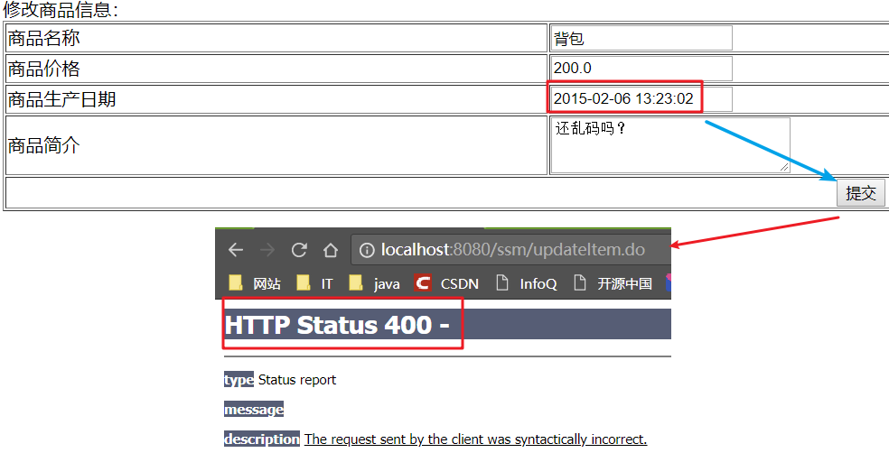

前端控制器接收到请求后，找到注解形式的处理器适配器，对 `@RequestMapping` 注解标记的方法进行适配，并对方法中的形参进行参数绑定。可以在 Spring MVC 处理器适配器上通过自定义转换器`Converter` 转换后再进行参数绑定。一般需要配置开启注解的支持，如下：

- xml 配置方式，则使用 `<mvc:annotation-driven/>` 标签进行配置，开启注解驱动加载处理器适配器
- 基于纯注解配置，则在配置类中设置包扫描

自定义参数类型转换器，需要实现一个接口(`Converter`)，该接口中是泛型接口

```java
/**
 * 自定义参数转换器
 *
 * Converter<S, T>接口
 * 	S：Source：源，转换前的数据，这里是字符串类型（String）的商品生产日期
 * 	T:Target：目标，转换后的数据，这里是Date类型的商品生产日期
 */
public class DateConverter implements Converter<String, Date> {
	@Override
	public Date convert(String source) {
		try {
			// 定义日期格式化对象，指定日期的格式:2016-02-03 13:22:53
			SimpleDateFormat format = new SimpleDateFormat("yyyy-MM-dd HH:mm:ss");
			// 返回格式后的日期对象
			return format.parse(source);
		} catch (ParseException e) {
			e.printStackTrace();
		}
		// 转换不成功返回null;
		return null;
	}
}
```

#### 5.11.3. 自定义参数类型转换器的配置

> 注：详见《Spring MVC 配置》章节

### 5.12. ServletRequestDataBinderFactory 数据绑定工厂

对于上面示例中一些比较特殊的字符，默认是无法实现数据绑定，需要自定义一些扩展。通过 `ServletRequestDataBinderFactory` 来创建数据绑定对象，并实现扩展

测试自定义日期转换器，实现 `org.springframework.format.Formatter` 接口

```java
public class MyDateFormatter implements Formatter<Date> {

    private final String desc; // 用于测试是哪种方式进行转换

    public MyDateFormatter(String desc) {
        this.desc = desc;
    }

    @Override
    public Date parse(String text, Locale locale) throws ParseException {
        System.out.println(desc + "进入了 MyDateFormatter.parse 方法");
        SimpleDateFormat sdf = new SimpleDateFormat("yyyy|MM|dd");
        return sdf.parse(text);
    }

    @Override
    public String print(Date date, Locale locale) {
        System.out.println(desc + "进入了 MyDateFormatter.print 方法");
        SimpleDateFormat sdf = new SimpleDateFormat("yyyy|MM|dd");
        return sdf.format(date);
    }
}
```

#### 5.12.1. @InitBinder 实现数据绑定

- `@InitBinder` 注解需要标识在控制类的方法上，所以创建一个控制类，定义一个方法并标识该注解（方法名随意），在方法中加入自定义的日期转换器对象

```java
public class InitBinderController {
    /**
     * 在某个 Controller 控制类中使用了 @InitBinder 注解进行数据转换绑定，
     * 只能对当前控制类生效，其他的控制类是不起作用
     *
     * @param dataBinder
     */
    @InitBinder
    public void initBinder(WebDataBinder dataBinder) {
        // 通过 @InitBinder 方式扩展 dataBinder 的转换器
        dataBinder.addCustomFormatter(new MyDateFormatter("用 @InitBinder 方式扩展的"));
    }
}
```

- 测试，创建 `ServletRequestDataBinderFactory` 时指定 `@InitBinder` 标识的方法对象，

```java
@Test
public void testRequestDataBinderByInitBinder() throws Exception {
    // 创建请求对象
    MockHttpServletRequest request = new MockHttpServletRequest();
    // 定义特殊的日期格式
    request.setParameter("birthday", "2022|01|02");
    // 定义对象形式的字符串
    request.setParameter("address.name", "广州");
    User target = new User();
    // 指定反射调用的哪个控制类中的那个方法
    InvocableHandlerMethod method = new InvocableHandlerMethod(new InitBinderController(), InitBinderController.class.getMethod("initBinder", WebDataBinder.class));
    // 创建 ServletRequestDataBinderFactory，指定回调标识了 @InitBinder 的方法
    ServletRequestDataBinderFactory factory = new ServletRequestDataBinderFactory(Arrays.asList(method), null);
    // 通过数据绑定工厂创建数据绑定器
    WebDataBinder dataBinder = factory.createBinder(new ServletWebRequest(request), target, "user");
    // 将请求数据封装 java 对象中
    dataBinder.bind(new ServletRequestParameterPropertyValues(request));
    // 对特殊的日期格式实现转换与绑定
    System.out.println(target);
}
```

#### 5.12.2. ConversionService 实现数据绑定

使用 `ConversionService` 实现数据绑定

```java
@Test
public void testRequestDataBinderByConversionService() throws Exception {
    // 创建请求对象
    MockHttpServletRequest request = new MockHttpServletRequest();
    // 定义特殊的日期格式
    request.setParameter("birthday", "2022|01|02");
    // 定义对象形式的字符串
    request.setParameter("address.name", "广州");
    User target = new User();

    // 创建 ConversionService 对象
    FormattingConversionService service = new FormattingConversionService();
    // 增加自定义转换器
    service.addFormatter(new MyDateFormatter("用 ConversionService 方式扩展转换功能"));
    // WebBindingInitializer 实现类
    ConfigurableWebBindingInitializer webBindingInitializer = new ConfigurableWebBindingInitializer();
    // 增加自定义 ConversionService 对象
    webBindingInitializer.setConversionService(service);

    // 创建 ServletRequestDataBinderFactory
    ServletRequestDataBinderFactory factory = new ServletRequestDataBinderFactory(null, webBindingInitializer);
    // 通过数据绑定工厂创建数据绑定器
    WebDataBinder dataBinder = factory.createBinder(new ServletWebRequest(request), target, "user");
    // 将请求数据封装 java 对象中
    dataBinder.bind(new ServletRequestParameterPropertyValues(request));
    // 对特殊的日期格式实现转换与绑定
    System.out.println(target);
}
```

如果同时定义 `@InitBinder` 方式与 `ConversionService` 方式来实现数据转换与绑定，则 `@InitBinder` 注解方式优先级高

```java
@Test
public void testRequestDataBinderByInitBinderAndConversionService() throws Exception {
    // 创建请求对象
    MockHttpServletRequest request = new MockHttpServletRequest();
    // 定义特殊的日期格式
    request.setParameter("birthday", "2022|01|02");
    // 定义对象形式的字符串
    request.setParameter("address.name", "广州");
    User target = new User();

    // 指定反射调用的哪个控制类中的那个方法
    InvocableHandlerMethod method = new InvocableHandlerMethod(new InitBinderController(), InitBinderController.class.getMethod("initBinder", WebDataBinder.class));
    // 创建 ConversionService 对象
    FormattingConversionService service = new FormattingConversionService();
    // 增加自定义转换器
    service.addFormatter(new MyDateFormatter("用 ConversionService 方式扩展转换功能"));
    // WebBindingInitializer 实现类
    ConfigurableWebBindingInitializer webBindingInitializer = new ConfigurableWebBindingInitializer();
    // 增加自定义 ConversionService 对象
    webBindingInitializer.setConversionService(service);

    // 创建 ServletRequestDataBinderFactory，同时指定 @InitBinder 与 ConversionService 来实现数据转换
    ServletRequestDataBinderFactory factory = new ServletRequestDataBinderFactory(Arrays.asList(method), webBindingInitializer);
    // 通过数据绑定工厂创建数据绑定器
    WebDataBinder dataBinder = factory.createBinder(new ServletWebRequest(request), target, "user");
    // 将请求数据封装 java 对象中
    dataBinder.bind(new ServletRequestParameterPropertyValues(request));
    // 对特殊的日期格式实现转换与绑定
    System.out.println(target);
}
```

#### 5.12.3. 使用默认 ConversionService 实现数据绑定

使用 Spring 默认的 `ConversionService` 实现类 `DefaultFormattingConversionService`，配置对象属性上使用 `@DateTimeFormat(pattern = "yyyy|MM|dd")` 注解，完成数据转换与绑定

```java
@DateTimeFormat(pattern = "yyyy|MM|dd")
private Date birthday;
```

```java
// 测试使用默认 ConversionService 实现数据转换与绑定
@Test
public void testRequestDataBinderByDefaultConversionService() throws Exception {
    // 创建请求对象
    MockHttpServletRequest request = initRequest();
    User target = new User();

    /*
        * 创建默认的 ConversionService 实现 DefaultFormattingConversionService
        * 如果是 Spring boot 工程，也可以使用 org.springframework.boot.convert.ApplicationConversionService 默认实现
        */
    DefaultFormattingConversionService service = new DefaultFormattingConversionService();
    // WebBindingInitializer 实现类
    ConfigurableWebBindingInitializer webBindingInitializer = new ConfigurableWebBindingInitializer();
    // 增加默认的 ConversionService 实现
    webBindingInitializer.setConversionService(service);

    // 创建 ServletRequestDataBinderFactory
    ServletRequestDataBinderFactory factory = new ServletRequestDataBinderFactory(null, webBindingInitializer);
    // 通过数据绑定工厂创建数据绑定器
    WebDataBinder dataBinder = factory.createBinder(new ServletWebRequest(request), target, "user");
    // 将请求数据封装 java 对象中
    dataBinder.bind(new ServletRequestParameterPropertyValues(request));
    // 对特殊的日期格式实现转换与绑定
    System.out.println(target);
}
```

## 6. Spring MVC 处理器方法 - 返回值

### 6.1. 默认返回值处理器

Spring MVC 支持多种不同的控制器方法返回值类型（*注：所有的返回值都支持响应式类型*）。

Spring MVC 默认提供了很多返回值处理器实现（以 `ReturnValueHandler` 结尾来命名），对控制器方法的返回值进行处理，具体实现类如下：

```java
org.springframework.web.servlet.mvc.method.annotation.ModelAndViewMethodReturnValueHandler
org.springframework.web.method.annotation.ModelMethodProcessor
org.springframework.web.servlet.mvc.method.annotation.ViewMethodReturnValueHandler
org.springframework.web.servlet.mvc.method.annotation.ResponseBodyEmitterReturnValueHandler
org.springframework.web.servlet.mvc.method.annotation.StreamingResponseBodyReturnValueHandler
org.springframework.web.servlet.mvc.method.annotation.HttpEntityMethodProcessor
org.springframework.web.servlet.mvc.method.annotation.HttpHeadersReturnValueHandler
org.springframework.web.servlet.mvc.method.annotation.CallableMethodReturnValueHandler
org.springframework.web.servlet.mvc.method.annotation.DeferredResultMethodReturnValueHandler
org.springframework.web.servlet.mvc.method.annotation.AsyncTaskMethodReturnValueHandler
org.springframework.web.servlet.mvc.method.annotation.ServletModelAttributeMethodProcessor
org.springframework.web.servlet.mvc.method.annotation.RequestResponseBodyMethodProcessor
org.springframework.web.servlet.mvc.method.annotation.ViewNameMethodReturnValueHandler
org.springframework.web.method.annotation.MapMethodProcessor
org.springframework.web.servlet.mvc.method.annotation.ServletModelAttributeMethodProcessor
```

常见的返回值处理器如下：

- 返回值类型为 `ModelAndView`，分别获取其模型和视图名，放入 `ModelAndViewContainer`
- 返回值类型为 `String` 时，把它当做视图名，放入 `ModelAndViewContainer`
- 返回值添加了 `@ModelAttribute` 注解时，将返回值作为模型，放入 `ModelAndViewContainer`，此时需找到默认视图名
- 返回值省略 `@ModelAttribute` 注解且返回非简单类型时，将返回值作为模型，放入 `ModelAndViewContainer`，此时需找到默认视图名
- 返回值类型为 `ResponseEntity` 时，此时走 `MessageConverter`，并设置 `ModelAndViewContainer.requestHandled` 为 true
- 返回值类型为 `HttpHeaders` 时，会设置 `ModelAndViewContainer.requestHandled` 为 true
- 返回值添加了 `@ResponseBody` 注解时，此时走 `MessageConverter`，返回值会通过`HttpMessageConverter`实现转换，并设置 `ModelAndViewContainer.requestHandled` 为 true

> 示例代码参考：\spring-note\springmvc-sample\12-return-value-handler

### 6.2. 自定义返回值处理器

Spring MVC 提供了返回值处理功能的接口 `org.springframework.web.method.support.HandlerMethodReturnValueHandler`，自定义返回值处理器只需要实现该接口，实现怎样的参数生效与参数解析的逻辑

示例：自定义一个注解 `@Yml`，用于标识方法，将该方法的返回值转换成 yml 的字符串返回。实现步骤如下：

- 创建自定义注解

```java
@Target({ElementType.METHOD})
@Retention(RetentionPolicy.RUNTIME)
@Documented
public @interface Yml {
}
```

- 创建自定义的返回值处理器，并实现 `HandlerMethodReturnValueHandler` 接口。

```java
public class CustomReturnValueHandler implements HandlerMethodReturnValueHandler {

    /**
     * 判断是否支持此返回值的类型。示例是判断是否标识了 @Yml 注解
     *
     * @param returnType
     * @return
     */
    @Override
    public boolean supportsReturnType(MethodParameter returnType) {
        // 判断当前控制器方法上是否有 @Yml 注解
        Yml annotation = returnType.getMethodAnnotation(Yml.class);
        return annotation != null;
    }

    /**
     * 对象返回值进行处理
     *
     * @param returnValue
     * @param returnType
     * @param mavContainer
     * @param webRequest
     * @throws Exception
     */
    @Override
    public void handleReturnValue(Object returnValue, MethodParameter returnType,
                                  ModelAndViewContainer mavContainer, NativeWebRequest webRequest) throws Exception {
        // 1. 转换返回结果为 yaml 字符串
        String str = new Yaml().dump(returnValue);

        // 2. 将 yaml 字符串写入响应
        HttpServletResponse response = webRequest.getNativeResponse(HttpServletResponse.class);
        response.setContentType("text/plain;charset=utf-8");
        response.getWriter().print(str);

        // 3. 设置请求已经处理完毕
        mavContainer.setRequestHandled(true);
    }
}
```

- 编写测试的控制方法。

```java
@Controller
public class ReturnValueHandlerController {

    @RequestMapping("/customReturnValueHandler")
    @Yml // 使用自定义注解，测试对返回值处理
    public User customReturnValueHandler(String name, int age) {
        User user = new User();
        user.setName(name);
        user.setAge(age);
        return user;
    }
}
```

> 注：此处有一个小坑，因为要返回字符串，如果在控制类上换成 `@RestController` 或者在方法上增加标识 `@ResponseBody`，则会因为返回值类型而报错
>
> `org.springframework.web.HttpMediaTypeNotAcceptableException: Could not find acceptable representation`

- 此示例为了方便，不想部署到 tomcat，使用了 Spring Boot 内置 tomcat 容器，并且因为 Spring MVC 是通过 `RequestMappingHandlerAdapter` 去调用实际的请求方法，而调用的核心方法 `invokeHandlerMethod` 的修饰符是 `protected`，因此编写一个子类继承 `RequestMappingHandlerAdapter`，并将该方法的修饰符修改为 `public`，方法里面直接调用父类的方法，不做其他处理

```java
public class MyHandlerAdapter extends RequestMappingHandlerAdapter {

    /**
     * 适配器调用相应请求处理方法。
     * 注：只修改原方法的修饰符，然后直接调用父类中的方法，不作任何更改
     */
    @Override
    public ModelAndView invokeHandlerMethod(HttpServletRequest request, HttpServletResponse response,
                                            HandlerMethod handlerMethod) throws Exception {
        return super.invokeHandlerMethod(request, response, handlerMethod);
    }
}
```

- 在配置类中，配置内置 tomcat 容器，并注册自定义的参数解析器到 `RequestMappingHandlerAdapter` 适配器对象（示例是自定义子类 `MyHandlerAdapter`）

```java
@Configuration
@ComponentScan("com.moon.springmvc")
public class SpringMvcConfig {

    /*
     * DispatcherServlet 初始化时默认添加 RequestMappingHandlerMapping 组件，但只保存在 DispatcherServlet 类的属性中
     * 为了方便测试，因此不使用默认创建，手动创建并加入到 Spring 容器
     */
    @Bean
    public RequestMappingHandlerMapping requestMappingHandlerMapping() {
        return new RequestMappingHandlerMapping();
    }

    /*
     * DispatcherServlet 初始化时默认添加 RequestMappingHandlerAdapter 组件，但只保存在 DispatcherServlet 类的属性中
     * 为了方便测试，因此不使用默认创建，手动创建并加入到 Spring 容器
     */
    @Bean
    public MyHandlerAdapter requestMappingHandlerAdapter() {
        MyHandlerAdapter handlerAdapter = new MyHandlerAdapter();
        // 加入自定义返回值处理器
        handlerAdapter.setCustomReturnValueHandlers(Arrays.asList(new CustomReturnValueHandler()));
        return handlerAdapter;
    }

    // 创建内嵌 web 容器工厂
    @Bean
    public TomcatServletWebServerFactory tomcatServletWebServerFactory() {
        return new TomcatServletWebServerFactory(8080);
    }

    // 创建 DispatcherServlet
    @Bean
    public DispatcherServlet dispatcherServlet() {
        return new DispatcherServlet();
    }

    // 注册 DispatcherServlet, Spring MVC 的入口
    @Bean
    public DispatcherServletRegistrationBean dispatcherServletRegistrationBean(DispatcherServlet dispatcherServlet) {
        DispatcherServletRegistrationBean registrationBean = new DispatcherServletRegistrationBean(dispatcherServlet, "/");
        registrationBean.setLoadOnStartup(1);
        return registrationBean;
    }
}
```

- 测试

```java
@Test
public void testCustomReturnValueHandler() throws Exception {
    // 创建 Spring boot 中 servlet web 环境容器，在配置类中手动创建 tomcat 实例
    AnnotationConfigServletWebServerApplicationContext context =
            new AnnotationConfigServletWebServerApplicationContext(SpringMvcConfig.class);
    // 从容器中获取 RequestMappingHandlerMapping
    // 该对象用于解析 @RequestMapping 以及派生注解，生成路径与控制器方法的映射关系, 在 web 容器初始化时就生成
    RequestMappingHandlerMapping handlerMapping = context.getBean(RequestMappingHandlerMapping.class);

    // 模拟的请求
    MockHttpServletRequest mockRequest = new MockHttpServletRequest("GET", "/customReturnValueHandler");
    // 设置请求参数
    mockRequest.setParameter("name", "MoonZero");
    mockRequest.setParameter("age", "18");
    // 模拟的响应
    MockHttpServletResponse mockResponse = new MockHttpServletResponse();
    // 从映射处理器中，根据请求获取处理链（因为一个请求可能会包含若干个过滤器）
    HandlerExecutionChain chain = handlerMapping.getHandler(mockRequest);
    System.out.println("处理器执行链对象: " + chain);

    // 获取 RequestMappingHandlerAdapter
    MyHandlerAdapter handlerAdapter = context.getBean(MyHandlerAdapter.class);
    // 通过处理器适配器调用相应的控制器方法
    handlerAdapter.invokeHandlerMethod(mockRequest, mockResponse, (HandlerMethod) chain.getHandler());

    // 检查响应
    byte[] content = mockResponse.getContentAsByteArray();
    System.out.println(new String(content, StandardCharsets.UTF_8));
}
```

### 6.3. SpringMVC 返回重定向和转发

- 转发：在返回值前面加 `forward:`，譬如 `"forward:user.do?name=method4"`
- 重定向：在返回值前面加 `redirect:`，譬如 `"redirect:http://www.baidu.com"`

## 7. MessageConverter

### 7.1. 概述

spring-web 模块包含 `HttpMessageConverter` 接口，用于通过 `InputStream` 和 `OutputStream` 读写 HTTP 请求和响应的主体。如给 `@ResponseBody` 标识的方法返回值处理器解析。

请求的 MediaType 的选择顺序如下：

- 首先看控制方法的 `@RequestMapping` 上有没有指定
- 其次看 request 的 Accept 头有没有指定
- 最后按 `MessageConverter` 的顺序，谁能谁先转换

### 7.2. HttpMessageConverter 接口默认实现（未整理完）

|                        MessageConverter 实现                         |                                         说明                                         |
| :-----------------------------------------------------------------: | ----------------------------------------------------------------------------------- |
|                    `StringHttpMessageConverter`                     |                                                                                     |
|                     `FormHttpMessageConverter`                      |                                                                                     |
|                   `ByteArrayHttpMessageConverter`                   |                                                                                     |
|                  `MarshallingHttpMessageConverter`                  |                                                                                     |
|                `MappingJackson2HttpMessageConverter`                | 通过使用 Jackson 的`ObjectMapper`来读写 JSON 格式数据，默认支持 HTTP 的 application/json  |
|              `MappingJackson2XmlHttpMessageConverter`               | 通过使用 Jackson XML 扩展的`XmlMapper`读写 XML 格式数据，默认支持 HTTP 的 application/xml |
|                    `SourceHttpMessageConverter`                     |                                                                                     |
|                 `BufferedImageHttpMessageConverter`                 |                                                                                     |
|                               `void`                                |                                                                                     |
|                         `DeferredResult<V>`                         |                                                                                     |
|                            `Callable<V>`                            |                                                                                     |
| `ListenableFuture<V>`, `CompletionStage<V>`, `CompletableFuture<V>` |                                                                                     |
|                 `ResponseBodyEmitter`, `SseEmitter`                 |                                                                                     |
|                       `StreamingResponseBody`                       |                                                                                     |

### 7.3. 使用示例

示例是使用 jackson 作为转换的底层实现，所以需要添加 jackson 的相关依赖

```xml
<dependency>
    <groupId>com.fasterxml.jackson.dataformat</groupId>
    <artifactId>jackson-dataformat-xml</artifactId>
</dependency>
```

示例代码

```java
public class MessageConverterTest {

    // MappingJackson2HttpMessageConverter 模拟实现 http 响应对象转 json
    @Test
    public void test1() throws IOException {
        MockHttpOutputMessage message = new MockHttpOutputMessage();
        MappingJackson2HttpMessageConverter converter = new MappingJackson2HttpMessageConverter();
        if (converter.canWrite(User.class, MediaType.APPLICATION_JSON)) {
            converter.write(new User("张三", 18), MediaType.APPLICATION_JSON, message);
            System.out.println(message.getBodyAsString());
        }
    }

    // MappingJackson2XmlHttpMessageConverter 模拟实现 http 响应对象转 xml
    @Test
    public void test2() throws IOException {
        MockHttpOutputMessage message = new MockHttpOutputMessage();
        MappingJackson2XmlHttpMessageConverter converter = new MappingJackson2XmlHttpMessageConverter();
        if (converter.canWrite(User.class, MediaType.APPLICATION_XML)) {
            converter.write(new User("李四", 20), MediaType.APPLICATION_XML, message);
            System.out.println(message.getBodyAsString());
        }
    }

    // MappingJackson2HttpMessageConverter 模拟实现 http 请求中的json，转成对象
    @Test
    public void test3() throws IOException {
        MockHttpInputMessage message = new MockHttpInputMessage("{\"name\":\"MooNkirA\",\"age\":20}".getBytes(StandardCharsets.UTF_8));
        MappingJackson2HttpMessageConverter converter = new MappingJackson2HttpMessageConverter();
        if (converter.canRead(User.class, MediaType.APPLICATION_JSON)) {
            Object read = converter.read(User.class, message);
            System.out.println(read);
        }
    }

    /*
      请求的 MediaType 的选择顺序如下：
        - 首先看控制方法的 @RequestMapping 上有没有指定
        - 其次看 request 的 Accept 头有没有指定
        - 最后按 MessageConverter 的顺序, 谁能谁先转换
     */
    @Test
    public void test4() throws Exception {
        MockHttpServletRequest request = new MockHttpServletRequest();
        MockHttpServletResponse response = new MockHttpServletResponse();
        ServletWebRequest webRequest = new ServletWebRequest(request, response);

        request.addHeader("Accept", "application/xml"); // 转换优先级其次
        response.setContentType("application/json"); // 转换优先级最高
        // 如果请求头与响应类型都没有，则按设置的顺序要决定使用哪个转换
        RequestResponseBodyMethodProcessor processor = new RequestResponseBodyMethodProcessor(
                Arrays.asList(new MappingJackson2HttpMessageConverter(), new MappingJackson2XmlHttpMessageConverter())
        );
        processor.handleReturnValue(
                new User("MooNkirA", 18),
                new MethodParameter(DemoController.class.getMethod("user"), -1),
                new ModelAndViewContainer(),
                webRequest
        );
        System.out.println(new String(response.getContentAsByteArray(), StandardCharsets.UTF_8));
    }
}
```

## 8. Spring MVC 配置（整理中！）

Spring MVC 提供了 Java 编程式与 xml 命名空间两种方式对 web 程序进行配置。

### 8.1. WebMvcConfigurer 接口

`org.springframework.web.servlet.config.annotation.WebMvcConfigurer` 接口，是 Spring MVC 提供用于编程式配置，通过实现不能的方法来进行相关的配置。`WebMvcConfigurer` 接口有以下常用的重写方法：

```java
public interface WebMvcConfigurer {
    default void configurePathMatch(PathMatchConfigurer configurer) {
    }
    /** 配置内容裁决的一些选项 **/
    default void configureContentNegotiation(ContentNegotiationConfigurer configurer) {
    }

    default void configureAsyncSupport(AsyncSupportConfigurer configurer) {
    }
    /** 默认静态资源处理器 **/
    default void configureDefaultServletHandling(DefaultServletHandlerConfigurer configurer) {
    }

    default void addFormatters(FormatterRegistry registry) {
    }
    /** 添加拦截器 **/
    default void addInterceptors(InterceptorRegistry registry) {
    }
    /** 静态资源处理 **/
    default void addResourceHandlers(ResourceHandlerRegistry registry) {
    }
    /** 解决跨域问题 **/
    default void addCorsMappings(CorsRegistry registry) {
    }
    /** 视图跳转控制器 **/
    default void addViewControllers(ViewControllerRegistry registry) {
    }
    /** 配置视图解析器 **/
    default void configureViewResolvers(ViewResolverRegistry registry) {
    }

    default void addArgumentResolvers(List<HandlerMethodArgumentResolver> resolvers) {
    }

    default void addReturnValueHandlers(List<HandlerMethodReturnValueHandler> handlers) {
    }

    default void configureMessageConverters(List<HttpMessageConverter<?>> converters) {
    }

    default void extendMessageConverters(List<HttpMessageConverter<?>> converters) {
    }

    default void configureHandlerExceptionResolvers(List<HandlerExceptionResolver> resolvers) {
    }

    default void extendHandlerExceptionResolvers(List<HandlerExceptionResolver> resolvers) {
    }

    @Nullable
    default Validator getValidator() {
        return null;
    }

    @Nullable
    default MessageCodesResolver getMessageCodesResolver() {
        return null;
    }
}
```

### 8.2. 开启 MVC 配置

#### 8.2.1. 编程式配置

在编程式配置中，可以使用 `@EnableWebMvc` 注解来启用 MVC 配置。然后通过实现 `WebMvcConfigurer` 接口，在各个配置方法中定制相关的配置。

```java
@Configuration
@EnableWebMvc
public class WebConfig implements WebMvcConfigurer {
    // 实现各个配置方法
}
```

#### 8.2.2. xml 配置

在 xml 配置中，可以使用 `<mvc:annotation-driven>` 标签来启用 MVC 配置，并通过标签中各个属性或者其他`mvc`命名空间的标签来定制相关的配置

```xml
<?xml version="1.0" encoding="UTF-8"?>
<beans xmlns="http://www.springframework.org/schema/beans"
    xmlns:mvc="http://www.springframework.org/schema/mvc"
    xmlns:xsi="http://www.w3.org/2001/XMLSchema-instance"
    xsi:schemaLocation="
        http://www.springframework.org/schema/beans
        https://www.springframework.org/schema/beans/spring-beans.xsd
        http://www.springframework.org/schema/mvc
        https://www.springframework.org/schema/mvc/spring-mvc.xsd">

    <mvc:annotation-driven />

</beans>
```

### 8.3. 拦截器配置

基于编程式配置，通过 `WebMvcConfigurer` 接口中 `addInterceptors` 来配置拦截器

```java
@Configuration
@EnableWebMvc
public class WebConfig implements WebMvcConfigurer {

    @Override
    public void addInterceptors(InterceptorRegistry registry) {
        registry.addInterceptor(new LocaleChangeInterceptor());
        registry.addInterceptor(new ThemeChangeInterceptor()).addPathPatterns("/**").excludePathPatterns("/admin/**");
        registry.addInterceptor(new SecurityInterceptor()).addPathPatterns("/secure/*");
    }
}
```

基于 xml 配置，通过 `<mvc:interceptors>` 标签来配置拦截器

```xml
<mvc:interceptors>
    <bean class="org.springframework.web.servlet.i18n.LocaleChangeInterceptor"/>
    <mvc:interceptor>
        <mvc:mapping path="/**"/>
        <mvc:exclude-mapping path="/admin/**"/>
        <bean class="org.springframework.web.servlet.theme.ThemeChangeInterceptor"/>
    </mvc:interceptor>
    <mvc:interceptor>
        <mvc:mapping path="/secure/*"/>
        <bean class="org.example.SecurityInterceptor"/>
    </mvc:interceptor>
</mvc:interceptors>
```

### 8.4. 自定义类型转换器配置

默认情况下，Spring MVC 提供了各种数字和日期类型的格式化器，同时支持通过在对象字段上的 `@NumberFormat` 和 `@DateTimeFormat` 进行自定义。在 Spring MVC 配置自定义参数转换器以如下方式：

- xml 配置方式。配置创建 `org.springframework.format.support.FormattingConversionServiceFactoryBean` 参数转换器服务对象。注入 converters 属性，是 set 集合类型。值是自定义参数转换类的全限定名，可以配置多个自定参数转换类，使用 `<set>` 标签

```xml
<?xml version="1.0" encoding="UTF-8"?>
<beans xmlns="http://www.springframework.org/schema/beans"
    xmlns:mvc="http://www.springframework.org/schema/mvc"
    xmlns:xsi="http://www.w3.org/2001/XMLSchema-instance"
    xsi:schemaLocation="
        http://www.springframework.org/schema/beans
        https://www.springframework.org/schema/beans/spring-beans.xsd
        http://www.springframework.org/schema/mvc
        https://www.springframework.org/schema/mvc/spring-mvc.xsd">

    <!-- 注解驱动的方式配置处理器映射器、处理器适配器 -->
    <mvc:annotation-driven conversion-service="conversionService"/>

    <!-- 配置自定义类型转换器 -->
    <bean id="conversionService" class="org.springframework.format.support.FormattingConversionServiceFactoryBean">
        <!-- 注入自定义类型转换类 -->
        <property name="converters">
            <set>
                <bean class="com.moon.ssm.converter.DateConverter"/>
            </set>
        </property>
        <!-- 可注入其他的内容 -->
        <property name="formatters">
            <set>
                <bean class="org.example.MyFormatter"/>
                <bean class="org.example.MyAnnotationFormatterFactory"/>
            </set>
        </property>
        <property name="formatterRegistrars">
            <set>
                <bean class="org.example.MyFormatterRegistrar"/>
            </set>
        </property>
    </bean>

</beans>
```

- 创建配置类，使用 `@EnableWebMvc` 注解开启 Spring MVC 配置，实现 `WebMvcConfigurer` 接口的 `addFormatters` 方法中进行注册

```java
@Configuration
@EnableWebMvc
public class WebConfig implements WebMvcConfigurer {

    @Override
    public void addFormatters(FormatterRegistry registry) {
        // 增加自定义的类型转换类实例
        registry.addConverter(new DateConverter());
    }
}
```

> 注：默认情况下，Spring MVC 在解析和格式化日期值时，会考虑请求的 Locale。对于"日期"和"时间"表单字段，浏览器使用 HTML 规范中定义的固定格式。在这种情况下，日期和时间的格式化可以按以下方式定制。

```java
@Configuration
@EnableWebMvc
public class WebConfig implements WebMvcConfigurer {

    @Override
    public void addFormatters(FormatterRegistry registry) {
        DateTimeFormatterRegistrar registrar = new DateTimeFormatterRegistrar();
        registrar.setUseIsoFormat(true);
        registrar.registerFormatters(registry);
    }
}
```

- 使用 `@InitBinder` 的方式配置，详见[《Spring MVC 注解汇总.md》文档](/后端框架/SpringMVC/SpringMVC-注解汇总)

## 9. 拦截器

### 9.1. 拦截器介绍

拦截器相当于 servlet 中过滤器（filter）。可以对处理器方法执行预处理（在处理器方法执行前执行），可以对处理器方法执行后处理（在处理器方法执行后执行）

### 9.2. HandlerInterceptor 接口方法说明

```java
public interface HandlerInterceptor {
	default boolean preHandle(HttpServletRequest request, HttpServletResponse response, Object handler)
			throws Exception {
		return true;
	}

	default void postHandle(HttpServletRequest request, HttpServletResponse response, Object handler,
			@Nullable ModelAndView modelAndView) throws Exception {
	}

	default void afterCompletion(HttpServletRequest request, HttpServletResponse response, Object handler,
			@Nullable Exception ex) throws Exception {
	}
}
```

- `preHandle`方法（通常关注此方法）：在处理器方法执行前，在响应 jsp 页面前执行，执行预处理。返回布尔类型的值，返回 true，继续执行；返回 false，终止执行。在企业项目中，可以在这个方法实现用户是否登录校验，是否有权限操作的校验。
- `postHandle`方法：在处理器方法执行后，在响应 jsp 页面前执行，执行后处理。企业项目中，可以在这个方法设置页面的公共模型数据，比如页面的头部信息，尾部信息。
- `afterCompletion`方法：在处理器方法执行后，在 jsp 页面响应后执行，执行后处理。在企业项目中，可以在这个方法实现用户访问日志的记录。

### 9.3. 自定义拦截器（基于 xml 配置文件）

自定义拦截器需要实现`HandlerInterceptor`接口，此接口比较特别有三个方法，都为默认方法，所以自定义拦截器时，可以选择性重写此三个方法即可

#### 9.3.1. 创建拦截器

```java
public class MyInterceptor implements HandlerInterceptor {
	@Override
	public boolean preHandle(HttpServletRequest request, HttpServletResponse response, Object handler)
			throws Exception {
		System.out.println("preHandle方法执行中......");
		return false;
	}

	@Override
	public void postHandle(HttpServletRequest request, HttpServletResponse response, Object handler, ModelAndView modelAndView) throws Exception {
		System.out.println("postHandle方法执行中......");
		// 使用模型视图对象赋值
		modelAndView.addObject("message", "我是postHandle方法。。。");
	}

	@Override
	public void afterCompletion(HttpServletRequest request, HttpServletResponse response, Object handler, Exception ex)
			throws Exception {
		System.out.println("afterCompletion方法执行中......");
	}
}
```

#### 9.3.2. 配置拦截器

在 springmvc.xml 总配置文件中配置拦截器步骤：

1. 配置拦截器使用`<mvc:interceptors>`标签，子标签可以配置多个拦截器
2. 子标签`<mvc:interceptor>`标签用于配置一个拦截器
3. 在`<mvc:interceptor>`标签中配置`<mvc:mapping path=""/>`，配置拦截的 url 规则。
   - 拦截单个 url：`/xxxx.do`
   - 拦截一组 url：`/xxx/**`，表示拦截以`/xxx`开头的所有请求
4. 在`<mvc:interceptor>`标签中`<bean>`标签，创建自定义拦截器对象

```xml
<!-- 6.配置自定义拦截器 -->
<mvc:interceptors>
	<!-- 配置自定义拦截器1 -->
	<mvc:interceptor>
		<!-- 配置拦截的url规则，说明：
				1.拦截单个url：/interceptor.do，表示拦截请求/interceptor.do
				2.拦截一组url：/inter/**，表示拦截以/inter开头的请求
					如：/inter/user.do
					   /inter/user/hello.do
		 -->
		 <!-- 拦截所有请求 -->
		 <!-- <mvc:mapping path="/**"/> -->
		 <!-- 拦截单个请求 -->
		 <mvc:mapping path="/interceptor.do"/>
		 <!-- 配置自定义拦截器对象 -->
		 <bean class="com.moon.ssm.interceptor.MyInterceptor"></bean>
	</mvc:interceptor>
</mvc:interceptors>
```

#### 9.3.3. 自定义拦截器执行测试

- 测试拦截器方法

```java
/**
 * 拦截器测试专用
 * 	访问url：http://127.0.0.1:8080/ssm/interceptor.do
 */
@RequestMapping("/interceptor.do")
public String testInterceptor(Model model){
	System.out.println("测试拦截器--testInterceptor方法执行中......");
	model.addAttribute("message1", "我是testInterceptor方法......");
	return "inter/interceptor";
}
```

- 执行结果说明执行的顺序

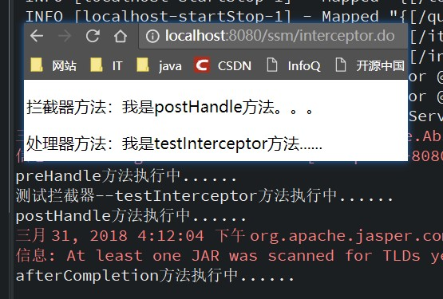

1. 执行拦截器的 preHandle 方法
2. 执行处理器的 testInterceptor 方法
3. 执行拦截器的 postHandle 方法
4. 响应 jsp 页面
5. 执行拦截器的 afterCompletion 方法

如果设置<font color=red>**preHandle 方法返回值为 false**</font>，则只会执行 preHandle 方法，终止执行。请求的方法都被拦截，不再执行

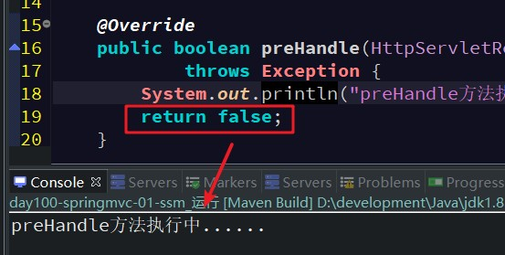

### 9.4. 自定义拦截器（基于纯注解方式）

此部分内容详情《02-SpringMVC 注解汇总.md》

### 9.5. 自定义多个拦截器

定义多个拦截器，测试拦截器执行的顺序

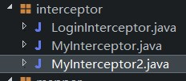

#### 9.5.1. 配置多个拦截器

修改 springmvc.xml 文件

```xml
<!-- 6.配置自定义拦截器 -->
<mvc:interceptors>
	<!-- 配置自定义拦截器1 -->
	<mvc:interceptor>
		 <mvc:mapping path="/interceptor.do"/>
		 <bean class="com.moon.ssm.interceptor.MyInterceptor"></bean>
	</mvc:interceptor>

	<!-- 配置自定义拦截器2 -->
	<mvc:interceptor>
		<mvc:mapping path="/interceptor.do"/>
		<bean class="com.moon.ssm.interceptor.MyInterceptor2"></bean>
	</mvc:interceptor>
</mvc:interceptors>
```

#### 9.5.2. 多个拦截器的执行顺序测试

- 测试拦截器 1 返回 true，拦截器 2 返回 true


执行结果说明：

1. 拦截器 preHandle 方法，按照配置的顺序执行
2. 拦截器 postHandle 方法，按照配置的逆序执行
3. 拦截器 afterCompletion 方法，按照配置的逆序执行

- 测试拦截器 1 返回 true，拦截器 2 返回 false


执行结果说明：

1. 拦截器的 afterCompletion 方法，只要当前拦截器返回 true，就可以得到执行。

### 9.6. 拦截器应用案例

#### 9.6.1. 案例需求

1. 访问商品列表数据，需要判断用户是否登录
2. 如果用户已经登录，直接让他访问商品列表
3. 如果用户未登录，先去登录页面进行登录，成功登录以后再访问商品列表

- 注：本 demo 只是模拟用户输入用户名和密码，没有进行数据库的校验，没有创建用户对象

#### 9.6.2. 准备用户登录页面 login.jsp

```jsp
<form id="userForm"
	action="${pageContext.request.contextPath }/user/login.do"
	method="post">
	<table width="100%" border=1>
		<tr>
			<td>用户名</td>
			<td><input type="text" name="username" value="" /></td>
		</tr>
		<tr>
			<td>密码</td>
			<td><input type="password" name="userpwd" value="" /></td>
		</tr>
		<tr>
			<td colspan="2" align="center"><input type="submit" value="提交" />
			</td>
		</tr>
	</table>
</form>
```

#### 9.6.3. 用户登陆控制层方法

UserController.java 编写跳转到登陆页面方法与登陆方法

涉及小知识：

- 如果是跨模块访问的话，使用绝对路径；因为不同模块的命名空间可能会不一样。如：用户模块`@Requestmapping("user")`和商品模块`@Requestmapping("item")`
- <font color=red>**如果是当前模块之间的访问，使用相对路径**</font>

```java
// 使用注解让spring容器管理
@Controller
// 使用命名空间
@RequestMapping("/user")
public class UserController {
	/**
	 * 1.跳转到登陆页面
	 * 	执行的url：127.0.0.1:8080/ssm/user/toLogin.do
	 */
	@RequestMapping("/toLogin.do")
	public String toLogin() {
		// 返回跳转登陆页面视图
		return "user/login";
	}
	/**
	 * 2.实现用户登录，登录跳转到
	 */
	@RequestMapping("login.do")
	public String login(String username, String userpwd, HttpSession session) {
		// 1.判断请求提交的参数,判断用户输入用户名和密码是否空
		if (StringUtils.isNotBlank(username) && StringUtils.isNotBlank(userpwd)) {
			//  用户登陆成功，将用户名放到域中
			session.setAttribute("user", username);
		}else {
			// 用户名或者密码为空，登陆失败。跳转到登陆页面
			return "user/login";
		}
		/*
		 * 2.成功登陆后，跳转访问商品列表
		 * 	因为用户名放到session域中，所有重定向即可
		 *
		 * 相对路径与绝对路径：
		 * 		当前路径：http://127.0.0.1:8080/ssm/user/login.do
		 * 		1.不加斜杠是相对路径，相对于当前路径,下一步访问的路径：
		 * 			http://127.0.0.1:8080/ssm/user/+目标url
		 * 		2.加上斜杠是绝对路径，下一步访问的路径：
		 * 			http://127.0.0.1:8080/ssm/+目标url
		 */
		return "redirect:/queryItem.do";
	}
}
```

#### 9.6.4. 用户登陆拦截器

创建 LoginInterceptor 拦截器

```java
/**
 * preHandle方法在请求方法前执行，对用户登陆验证
 */
@Override
public boolean preHandle(HttpServletRequest request, HttpServletResponse response, Object handler) throws Exception {
	// 1.获取session对象
	HttpSession session = request.getSession();
	// 2.从session域中获取用户数据
	if(session.getAttribute("user") == null) {
		// 2.1 用户没有登陆，跳转到登陆页面
		System.out.println("用户没有登陆..."); // 用于测试打印
		response.sendRedirect(request.getContextPath() + "/user/toLogin.do");
		return false;
	}
	// 2.2 用户已登陆登录，直接放行
	System.out.println("用户已经登陆。。。放行。。。"); // 用于测试打印
	return true;
}
```

#### 9.6.5. 配置登陆拦截器

修改 springmvc.xml 配置文件

```xml
<!-- 6.配置自定义拦截器 -->
<mvc:interceptors>
	<!-- ...省略其他拦截器... -->
	<!-- 配置登陆拦截器 -->
	<mvc:interceptor>
		<!-- 拦截查询商品列表请求url -->
		<mvc:mapping path="/queryItem.do"/>
		<!-- 配置登陆拦截器对象 -->
		<bean class="com.moon.ssm.interceptor.LoginInterceptor"></bean>
	</mvc:interceptor>
</mvc:interceptors>
```

## 10. 异常处理器

### 10.1. HandlerExceptionResolver 接口

Spring MVC 提供了 `org.springframework.web.servlet.HandlerExceptionResolver` 接口用于异常处理

```java
/* 异常处理器的根接口 */
public interface HandlerExceptionResolver {
	/* 用于提供异常处理的逻辑 */
	@Nullable
	ModelAndView resolveException(HttpServletRequest request, HttpServletResponse response, @Nullable Object handler, Exception ex);
}
```

Spring MVC 提供了一些异常处理器的默认实现，如：`org.springframework.web.servlet.handler.SimpleMappingExceptionResolver`

```java
public class SimpleMappingExceptionResolver extends AbstractHandlerExceptionResolver
```

### 10.2. 自定义异常处理器

自定义异常处理需要实现`HandlerExceptionResolver`接口，将使用注解注册到容器中

```java
/**
 * 自定义异常处理解析器
 */
@Component
public class CustomHandlerExceptionResolver implements HandlerExceptionResolver {
    /**
     * 此方法是处理异常的。异常就分为系统异常和业务异常
     */
    @Override
    public ModelAndView resolveException(HttpServletRequest request, HttpServletResponse response, Object handler, Exception ex) {
        // 1. 创建返回值对象
        ModelAndView mv = new ModelAndView();
        // 2. 设置错误提示信息
        String errorMsg;
        if (ex instanceof CustomException) {
            errorMsg = ex.getMessage();
        } else {
            // 系统异常
            errorMsg = "服务器内部错误，请联系管理员！";
        }
        mv.addObject("errorMsg", errorMsg);
        // 3. 设置结果视图名称
        mv.setViewName("error");
        // 4. 返回
        return mv;
    }
}
```

### 10.3. 实现接口方式异常处理器总结

实现`HandlerExceptionResolver`接口的异常处理是在控制器方法处理的过程中出现的异常才能捕获，并做处理。所以如果在控制器方法执行前数据绑定时出现的异常，这种方式的异常处理器是无法捕获的。

这种实现方式现在已经被淘汰了，一般都直接`@ControllerAdvice`配合`@ExceptionHandler`使用来完成异常的全局处理

### 10.4. @ExceptionHandler 注解

标识 `@Controller` 和 `@ControllerAdvice` 类可以使用 `@ExceptionHandler` 注解标识方法来处理来自控制器方法的异常。

> 详见[《Spring MVC 注解汇总.md》文档](/后端框架/SpringMVC/SpringMVC-注解汇总)

### 10.5. 番外 - Tomcat 异常处理

前面的 `@ExceptionHandler` 只能处理发生在 Spring MVC 流程中的异常，例如控制器内、拦截器内，但如果是 Filter 出现了异常，则会由 tomcat(Web 服务器)来处理

#### 10.5.1. Spring Boot 的实现流程

1. 因为内嵌了 Tomcat 容器，因此可以配置 Tomcat 的错误页面，Filter 与 错误页面之间是通过请求转发跳转的
2. 先通过 `ErrorPageRegistrarBeanPostProcessor` 这个后处理器配置错误页面地址，默认为 `/error` 也可以通过 `${server.error.path}` 进行配置
3. 当 Filter 发生异常时，不会走 Spring 流程，但会走 Tomcat 的错误处理，于是就会转发至 `/error` 这个地址。如果没有 `@ExceptionHandler`，最终也会走到 Tomcat 的错误处理
4. Spring Boot 又提供了一个 `BasicErrorController`，它就是一个标准 `@Controller`，`@RequestMapping` 配置为 `/error`，所以处理异常的职责就又回到了 Spring 框架
5. 异常信息由于会被 Tomcat 放入 `request` 作用域，key 的名称固定是 `javax.servlet.error.exception`（Spring 提供了此常量 `RequestDispatcher.ERROR_EXCEPTION`）。因此 `BasicErrorController` 类也能获取到异常的信息
6. 具体异常信息会由 `DefaultErrorAttributes` 封装好
7. `BasicErrorController` 通过 Accept 头判断需要生成哪种 MediaType 的响应。如果要的不是 text/html，走 MessageConverter 流程；如果需要 text/html，走 mvc 流程，此时又分两种情况
   - 配置了 `ErrorViewResolver`，根据状态码去找 View
   - 没配置或没找到，用 `BeanNameViewResolver` 根据一个固定为 `error` 的名字找到 View，即所谓的 `WhitelabelErrorView`

#### 10.5.2. 配置关键部分

基于注解配置的关键代码

```java
@Bean // 修改了 Tomcat 服务器默认错误地址。出现错误，会使用请求转发 forward 跳转到 error 地址
public ErrorPageRegistrar errorPageRegistrar() {
    return webServerFactory -> webServerFactory.addErrorPages(new ErrorPage("/error"));
}

@Bean // TomcatServletWebServerFactory 初始化前用它增强，注册所有 ErrorPageRegistrar
public ErrorPageRegistrarBeanPostProcessor errorPageRegistrarBeanPostProcessor() {
    return new ErrorPageRegistrarBeanPostProcessor();
}

@Bean // ErrorProperties 封装环境键值，ErrorAttributes 控制有哪些错误信息
public BasicErrorController basicErrorController() {
    ErrorProperties errorProperties = new ErrorProperties();
    errorProperties.setIncludeException(true);
    return new BasicErrorController(new DefaultErrorAttributes(), errorProperties);
}

@Bean // 名称为 error 的视图，作为 BasicErrorController 的 text/html 响应结果
public View error() {
    return new View() {
        @Override
        public void render(Map<String, ?> model, HttpServletRequest request, HttpServletResponse response) throws Exception {
            System.out.println(model);
            response.setContentType("text/html;charset=utf-8");
            response.getWriter().print("""
                    <h3>服务器内部错误</h3>
                    """);
        }
    };
}

@Bean // 收集容器中所有 View 对象，bean 的名字作为视图名
public ViewResolver viewResolver() {
    return new BeanNameViewResolver();
}
```

## 11. 请求体与响应体切面增强

### 11.1. RequestBodyAdvice

#### 11.1.1. 接口概述

`org.springframework.web.servlet.mvc.method.annotation.RequestBodyAdvice` 是 Spring MVC 提供的一个增强接口。通过实现该接口，并注册为 Spring 的 Bean，可以在 `HttpMessageConverter` 读取请求体并把它转换为 Java 对象之前或之后对请求体进行定制化的处理操作。这样可以实现一些常见的需求，例如请求体解密、数据验签、日志记录等。

接口源码如下：

```java
public interface RequestBodyAdvice {

	boolean supports(MethodParameter methodParameter, Type targetType,
			Class<? extends HttpMessageConverter<?>> converterType);

	HttpInputMessage beforeBodyRead(HttpInputMessage inputMessage, MethodParameter parameter,
			Type targetType, Class<? extends HttpMessageConverter<?>> converterType) throws IOException;

	Object afterBodyRead(Object body, HttpInputMessage inputMessage, MethodParameter parameter,
			Type targetType, Class<? extends HttpMessageConverter<?>> converterType);

	@Nullable
	Object handleEmptyBody(@Nullable Object body, HttpInputMessage inputMessage, MethodParameter parameter,
			Type targetType, Class<? extends HttpMessageConverter<?>> converterType);
}
```

方法解析：

- `supports` 方法：是否要执行此接口，如果返回 false，则该 `RequestBodyAdvice` 会跳过。在这个方法中，可以获取到 Controller 方法中参数及其类型的信息，以及要使用的 `HttpMessageConverter` 信息。
- `beforeBodyRead` 方法：在请求体被读取前执行，在这个方法中，可以获取到完整的请求体，请求头以进行修改。最后，需要返回修改后的 `HttpInputMessage`。
- `afterBodyRead` 方法：在请求体读取后执行。
- `handleEmptyBody` 方法：如果读取到的请求体是空，则执行。

#### 11.1.2. 基础使用示例

示例需求：假设客户端 POST 给服务器的所有请求数据都是通过 Base64 进行编码的，通过 `RequestBodyAdvice` 进行统一的解码。

定义 `@DecodeBody` 注解。该注解用于 Controller 方法中的参数，只有注解了 `@DecodeBody` 的请求体（`@RequestBody`）才需要解码。

```java
/** 对请求体进行解码 */
@Retention(RUNTIME)
@Target(PARAMETER)
public @interface DecodeBody {}
```

定义一个很简单的 Controller，接收客户端 POST 的字符串，并且原样返回。使用 `@DecodeBody` 注解标识方法参数，表示需要对客户端的请求体进行解码。

```java
@RestController
@RequestMapping
public class DemoController {
    @PostMapping("/demo")
    public ResponseEntity<String> demo (@RequestBody @DecodeBody String payload) {
        return ResponseEntity.ok(payload);
    }
}
```

编写 `RequestBodyDecodeAdvice` 核心类，直接继承 `RequestBodyAdviceAdapter` 适配器类，该类实现了 `RequestBodyAdvice` 接口，并且提供了默认实现，所以只需要覆写自己感兴趣的方法即可。

```java
@RestControllerAdvice
public class RequestBodyDecodeAdvice extends RequestBodyAdviceAdapter {

    static final Logger log = LoggerFactory.getLogger(RequestBodyDecodeAdvice.class);

    @Override
    public boolean supports(MethodParameter methodParameter, Type targetType, Class<? extends HttpMessageConverter<?>> converterType) {
        return methodParameter.hasParameterAnnotation(DecodeBody.class);
    }

    @Override
    public HttpInputMessage beforeBodyRead(HttpInputMessage inputMessage, MethodParameter parameter, Type targetType,
                                           Class<? extends HttpMessageConverter<?>> converterType) throws IOException {

        // 读取完整的客户端请求体，也就是加密/编码后的数据
        byte[] payload = StreamUtils.copyToByteArray(inputMessage.getBody());

        log.info("加密 Payload：{}", new String(payload));

        // 解码为原始数据
        byte[] rawPayload = Base64.getDecoder().decode(payload);

        log.info("原始 Payload：{}", new String(rawPayload));

        // 返回 HttpInputMessage 匿名对象
        return new HttpInputMessage() {
            @Override
            public HttpHeaders getHeaders() {
                return inputMessage.getHeaders();
            }

            @Override
            public InputStream getBody() throws IOException {
                // 使用原始数据构建为 ByteArrayInputStream
                return new ByteArrayInputStream(rawPayload);
            }
        };
    }
}
```

启动服务器，在控制台使用 cURL 发起请求测试：

```
$ curl -H "Content-Type: text/plain; charset=UTF-8" -X POST -d "SGVsbG8gTW9vTmtpckE" "http://localhost:8080/demo"
```

如上，POST 到服务器的字符串 `SGVsbG8gTW9vTmtpckE` 是 `Hello MooNkirA` 字符串的 Base64 编码。得到的响应和原文相匹配，说明在 Controller 中得到的请求体，已经是正确解码后的数据了。后端输出的日志如下：

```
[nio-8080-exec-8] c.s.d.w.advice.RequestBodyDecodeAdvice   : 加密 Payload：SGVsbG8gTW9vTmtpckE
[nio-8080-exec-8] c.s.d.w.advice.RequestBodyDecodeAdvice   : 原始 Payload：Hello MooNkirA
```

#### 11.1.3. 示例实现流程解析

示例中的 `RequestBodyDecodeAdvice` 类对请求体统一处理的实现流程：

1. 通过 `@RestControllerAdvice` 注解，自动注册到 `RequestMappingHandlerAdapter` 中。
2. 在 `supports` 方法中判断 Controller 的注解是否有 `@DecodeBody` 注解，如果没有的话，表示不需要进行解码，返回 false。
3. 当 `beforeBodyRead` 被调用，使用 `StreamUtils` 工具类读取完整的请求体，也就是客户端 Base64 编码后的数据。接着对其进行解码，得到原文。
4. 返回 `HttpInputMessage` 对象，请求头不做任何修改，但是请求体使用的是 解码后的原文。

### 11.2. ResponseBodyAdvice

#### 11.2.1. 接口概述

`org.springframework.web.servlet.mvc.method.annotation.ResponseBodyAdvice` 是 Spring MVC 提供的一个增强接口，用于 Controller 接口在返回对象被 `HttpMessageConverter` 执行序列化之前对其进行一些自定义的操作。例如添加统一的响应头、修改响应体的内容格式、对响应体进行编码、加密等。这能够更加方便地实现全局的响应处理逻辑，提升代码的可维护性和复用性。

接口源码如下：

```java
public interface ResponseBodyAdvice<T> {

	boolean supports(MethodParameter returnType, Class<? extends HttpMessageConverter<?>> converterType);

	@Nullable
	T beforeBodyWrite(@Nullable T body, MethodParameter returnType, MediaType selectedContentType,
			Class<? extends HttpMessageConverter<?>> selectedConverterType,
			ServerHttpRequest request, ServerHttpResponse response);
}
```

这是一个带泛型 `<T>` 的接口，`T` 表示返回的对象类型，这决定了它会对哪些返回的对象生效。

- `supports` 方法：用于确定该实现类是否支持对响应体进行处理，通过 returnType 参数可以获取到 Controller 方法的返回类型等信息。
- `beforeBodyWrite`：该方法在响应体写入之前被调用，在这个方法中可以通过参数获取到最终要响应给客户端的对象，可以对这个对象进行一些操作，最后返回修改后的对象。

#### 11.2.2. 基础使用示例

示例需求：将服务器返回的所有 JSON 数据都会被编码为 Base64 格式。

定义 `@EncodeBody` 注解，用于 Controller 方法，并且只有使用 @EncodeBody 注解标识的 API 方法返回的对象，才会被编码。

```java
@Retention(RUNTIME)
@Target(METHOD)
public @interface EncodeBody {}
```

编写一个非常普通的 API 端点，返回一个 Map 对象，并且方法上标识 `@EncodeBody` 注解。

```java
@RestController
@RequestMapping
public class DemoController {
    @GetMapping("/demo")
    @EncodeBody
    public ResponseEntity<Object> demo() {
        Map<String, Object> response = new HashMap<>();
        response.put("title", "MooNkirA");
        response.put("url", "moon.com");
        return ResponseEntity.ok(response);
    }
}
```

定义 `ResponseBodyEncodeAdvice` 类，实现 `ResponseBodyAdvice` 接口，用于把响应的 JSON 数据编码为 Base64。

```java
@RestControllerAdvice
public class ResponseBodyEncodeAdvice implements ResponseBodyAdvice<Object> {

    // 系统中默认使用的 ObjectMapper
    @Autowired
    private ObjectMapper objectMapper;

    @Override
    public boolean supports(MethodParameter returnType, Class<? extends HttpMessageConverter<?>> converterType) {
        // 方法上注解了 @EncodeBody，才对返回对象进行编码
        return returnType.hasMethodAnnotation(EncodeBody.class);
    }

    @Override
    public Object beforeBodyWrite(Object body, MethodParameter returnType, MediaType selectedContentType,
                                  Class<? extends HttpMessageConverter<?>> selectedConverterType, ServerHttpRequest request,
                                  ServerHttpResponse response) {

        if (body == null) {
            return body;
        }

        String jsonText = null;

        try {
            // 把响应体序列化为 JSON 字符串
            jsonText = this.objectMapper.writeValueAsString(body);
        } catch (JsonProcessingException e) {
            throw new RuntimeException(e);
        }

        // 对原始数据进行 Base64 编码
        String encodedText = Base64.getEncoder().encodeToString(jsonText.getBytes(StandardCharsets.UTF_8));

        // 以 Map 形式响应给客户端，保持 JSON 格式
        return Collections.singletonMap("data", encodedText);
    }
}
```

启动应用，使用 cURL 进行测试：

```
$ curl localhost:8080/demo
```

返回结果：

```json
{"data":"eyJ0aXRsZSI6InNwcmluZyDkuK3mlofnvZEiLCJ1cmwiOiJzcHJpbmdkb2MuY24ifQ"}
```

返回的 JSON 格式正是在 `ResponseBodyEncodeAdvice` 中定义的。其中 data 字段的值就是对响应原文进行 Base64 编码后的密文。测试解码 data：

```java
public class ResponseBodyEncodeAdviceTest {
    public static void main(String[] args) throws Exception {
        byte[] raw = Base64.getDecoder().decode("eyJ0aXRsZSI6InNwcmluZyDkuK3mlofnvZEiLCJ1cmwiOiJzcHJpbmdkb2MuY24ifQ");      
        System.out.println(new String(raw, StandardCharsets.UTF_8));
    }
}
```

输出如下：

```json
{"title":"MooNkirA","url":"moon.com"}
```

#### 11.2.3. 示例实现细节解析

自定义的 `ResponseBodyEncodeAdvice` 类实现了 `ResponseBodyAdvice` 接口，并且指定了泛型为 `Object`，意味着该实现对所有返回对象都生效。

在类中注入了 `ObjectMapper`，用于把返回的对象序列化为 JSON 字符串。spring mvc 默认使用 Jackson 作为 JSON 的序列化、反序列化库，所以 `ObjectMapper` 是已经预置的，不需要自己创建。如果对序列化方式有特殊需求，可以自己实例化一个 `ObjectMapper`，甚至是换一个 JSON 库，比如：FastJson。

在 `beforeBodyWrite` 方法中，先使用 `ObjectMapper` 把返回对象序列化为 JSON 字符串，也就是响应的原文。然后再把原文编码为 Base64 字符串。最后通过一个通用的 Map 返回到客户端。

## 12. 扩展：方法参数名获取

### 12.1. 正常编译反射获取方法名

在 src 以外目录，准备一个类和一个接口用于测试。（*注：不在放在 src 目录是避免 idea 自动编译它下面的类*）

```java
public class Bean1 {
    public void foo(String name, int age) {
    }
}

public interface Bean2 {
    void foo(String name, int age);
}
```

直接编译

```bash
javac Bean1.java
```

反编译

```bash
javap -c -v Bean1.class

public class com.moon.common.model.Bean1
  minor version: 0
  major version: 52
  flags: ACC_PUBLIC, ACC_SUPER
Constant pool:
   #1 = Methodref          #3.#12         // java/lang/Object."<init>":()V
   #2 = Class              #13            // com/moon/common/model/Bean1
   #3 = Class              #14            // java/lang/Object
   #4 = Utf8               <init>
   #5 = Utf8               ()V
   #6 = Utf8               Code
   #7 = Utf8               LineNumberTable
   #8 = Utf8               foo
   #9 = Utf8               (Ljava/lang/String;I)V
  #10 = Utf8               SourceFile
  #11 = Utf8               Bean1.java
  #12 = NameAndType        #4:#5          // "<init>":()V
  #13 = Utf8               com/moon/common/model/Bean1
  #14 = Utf8               java/lang/Object
{
  public com.moon.common.model.Bean1();
    descriptor: ()V
    flags: ACC_PUBLIC
    Code:
      stack=1, locals=1, args_size=1
         0: aload_0
         1: invokespecial #1                  // Method java/lang/Object."<init>":()V
         4: return
      LineNumberTable:
        line 3: 0

  public void foo(java.lang.String, int);
    descriptor: (Ljava/lang/String;I)V
    flags: ACC_PUBLIC
    Code:
      stack=0, locals=3, args_size=3
         0: return
      LineNumberTable:
        line 5: 0
}
SourceFile: "Bean1.java"
```

> 注：因为测试的类在 src 目录下，所有 idea 无法找到此测试类

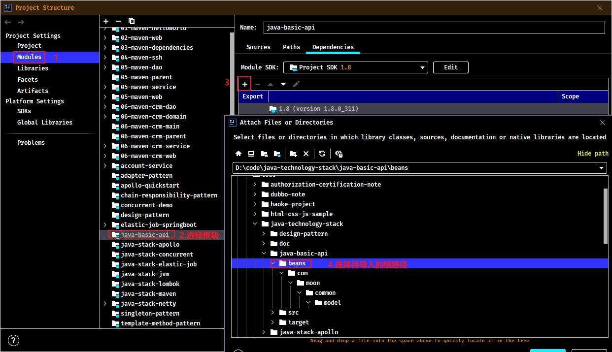

通过反射是获取方法形参名称

```java
@Test
public void testGetMethodArgumentName() throws Exception {
    // 1. 反射获取参数名
    Method foo = Bean1.class.getMethod("foo", String.class, int.class);
    for (Parameter parameter : foo.getParameters()) {
        System.out.println(parameter);
    }
}
```

输出结果

```
java.lang.String arg0
int arg1
```

正常编译后反射是无法获取真正的方法参数名称，需要通过以下两种方式：

### 12.2. 生成参数表

如果编译时添加了 `-parameters` 参数，可以生成参数表，通过反射就可以拿到方法参数名（<font color=red>**注：这种方式对象类与接口都同样有效**</font>）

```bash
javac -parameters Bean1.java
```

反编译查看

```
javap -c -v Bean1.class

public class com.moon.common.model.Bean1
  minor version: 0
  major version: 52
  flags: ACC_PUBLIC, ACC_SUPER
Constant pool:
   #1 = Methodref          #3.#15         // java/lang/Object."<init>":()V
   #2 = Class              #16            // com/moon/common/model/Bean1
   #3 = Class              #17            // java/lang/Object
   #4 = Utf8               <init>
   #5 = Utf8               ()V
   #6 = Utf8               Code
   #7 = Utf8               LineNumberTable
   #8 = Utf8               foo
   #9 = Utf8               (Ljava/lang/String;I)V
  #10 = Utf8               MethodParameters
  #11 = Utf8               name
  #12 = Utf8               age
  #13 = Utf8               SourceFile
  #14 = Utf8               Bean1.java
  #15 = NameAndType        #4:#5          // "<init>":()V
  #16 = Utf8               com/moon/common/model/Bean1
  #17 = Utf8               java/lang/Object
{
  public com.moon.common.model.Bean1();
    descriptor: ()V
    flags: ACC_PUBLIC
    Code:
      stack=1, locals=1, args_size=1
         0: aload_0
         1: invokespecial #1                  // Method java/lang/Object."<init>":()V
         4: return
      LineNumberTable:
        line 3: 0

  public void foo(java.lang.String, int);
    descriptor: (Ljava/lang/String;I)V
    flags: ACC_PUBLIC
    Code:
      stack=0, locals=3, args_size=3
         0: return
      LineNumberTable:
        line 5: 0
    MethodParameters:
      Name                           Flags
      name
      age
}
SourceFile: "Bean1.java"
```

再次运行测试程序，结果如下：

```
java.lang.String name
int age
```

### 12.3. 生成调试信息

如果编译时添加了 `-g` 参数，可以生成调试信息，但分为以下两种情况：

> <font color=red>**注：大部分 IDE 编译时都会自动加 `-g` 参数**</font>

#### 12.3.1. 普通类

对于普通类，使用 `-g` 参数编译，会包含局部变量表，用 asm 技术可以拿到方法参数名

```bash
javac -g Bean1.java
```

反编译

```
javap -c -v Bean1.class

public class com.moon.common.model.Bean1
  minor version: 0
  major version: 52
  flags: ACC_PUBLIC, ACC_SUPER
Constant pool:
   #1 = Methodref          #3.#19         // java/lang/Object."<init>":()V
   #2 = Class              #20            // com/moon/common/model/Bean1
   #3 = Class              #21            // java/lang/Object
   #4 = Utf8               <init>
   #5 = Utf8               ()V
   #6 = Utf8               Code
   #7 = Utf8               LineNumberTable
   #8 = Utf8               LocalVariableTable
   #9 = Utf8               this
  #10 = Utf8               Lcom/moon/common/model/Bean1;
  #11 = Utf8               foo
  #12 = Utf8               (Ljava/lang/String;I)V
  #13 = Utf8               name
  #14 = Utf8               Ljava/lang/String;
  #15 = Utf8               age
  #16 = Utf8               I
  #17 = Utf8               SourceFile
  #18 = Utf8               Bean1.java
  #19 = NameAndType        #4:#5          // "<init>":()V
  #20 = Utf8               com/moon/common/model/Bean1
  #21 = Utf8               java/lang/Object
{
  public com.moon.common.model.Bean1();
    descriptor: ()V
    flags: ACC_PUBLIC
    Code:
      stack=1, locals=1, args_size=1
         0: aload_0
         1: invokespecial #1                  // Method java/lang/Object."<init>":()V
         4: return
      LineNumberTable:
        line 3: 0
      LocalVariableTable:
        Start  Length  Slot  Name   Signature
            0       5     0  this   Lcom/moon/common/model/Bean1;

  public void foo(java.lang.String, int);
    descriptor: (Ljava/lang/String;I)V
    flags: ACC_PUBLIC
    Code:
      stack=0, locals=3, args_size=3
         0: return
      LineNumberTable:
        line 5: 0
      LocalVariableTable:
        Start  Length  Slot  Name   Signature
            0       1     0  this   Lcom/moon/common/model/Bean1;
            0       1     1  name   Ljava/lang/String;
            0       1     2   age   I
}
SourceFile: "Bean1.java"
```

测试程序，此示例没有使用原生的 asm 技术，而使用 Spring 框架中一个工具类来实现

增加 spring 依赖

```xml
<dependency>
    <groupId>org.springframework</groupId>
    <artifactId>spring-context</artifactId>
    <version>5.3.10</version>
</dependency>
```

```java
@Test
public void testGetMethodArgumentName2() throws Exception {
    // 使用 asm 技术获取普通中方法参数名，示例不使用 asm 原生的，而使用 Spring 框架封装好的工具类
    Method foo = Bean1.class.getMethod("foo", String.class, int.class);

    // 基于 LocalVariableTable 本地变量表
    LocalVariableTableParameterNameDiscoverer discoverer = new LocalVariableTableParameterNameDiscoverer();
    String[] parameterNames = discoverer.getParameterNames(foo);
    System.out.println(Arrays.toString(parameterNames));  // 输出结果 [name, age]
}
```

#### 12.3.2. 接口

对于接口，使用 `-g` 参数编译，不会包含局部变量表，无法获取方法参数名。<font color=purple>**扩展：这也是 MyBatis 在实现 Mapper 接口时为何要提供 `@Param` 注解来辅助获得参数名**</font>

```bash
javac -g Bean2.java
```

反编译

```
javap -c -v Bean2.class

public interface com.moon.common.model.Bean2
  minor version: 0
  major version: 52
  flags: ACC_PUBLIC, ACC_INTERFACE, ACC_ABSTRACT
Constant pool:
  #1 = Class              #7              // com/moon/common/model/Bean2
  #2 = Class              #8              // java/lang/Object
  #3 = Utf8               foo
  #4 = Utf8               (Ljava/lang/String;I)V
  #5 = Utf8               SourceFile
  #6 = Utf8               Bean2.java
  #7 = Utf8               com/moon/common/model/Bean2
  #8 = Utf8               java/lang/Object
{
  public abstract void foo(java.lang.String, int);
    descriptor: (Ljava/lang/String;I)V
    flags: ACC_PUBLIC, ACC_ABSTRACT
}
SourceFile: "Bean2.java"
```

## 13. SpringMVC 其他扩展知识整理

### 13.1. SpringMVC 相关名词解释

#### 13.1.1. XxxVo 包装类

以 Vo 结尾的类，一般用于封装值的实体类。(Vo:value Object)

#### 13.1.2. 相对路径与绝对路径

当前路径：http://127.0.0.1:8080/ssm/user/login.do

1. 不加斜杠是相对路径，相对于当前路径，下一步访问的路径：`http://127.0.0.1:8080/ssm/user/+目标url`
2. 加上斜杠是绝对路径，下一步访问的路径：`http://127.0.0.1:8080/ssm/+目标url`

### 13.2. Tomcat 服务中文参数传递乱码解决

传递对象后有可能出现的问题：中文乱码的原因是因为使用的 tomcat 服务器，它的默认字符集编码是 ISO-8859-1，不支持中文。

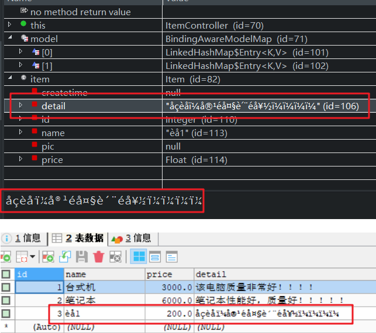

#### 13.2.1. POST 请求 - 解决中文乱码

Spring 提供了一个字符集编码的过滤器(`CharacterEncodingFilter`)，解决 post 请求的中文乱码，它实质相当于一个拦截器

只需要在 web.xml 中配置即可使用，使用 `<filter>` 标签

```xml
<!-- !配置字符集编码过滤器  -->
<filter>
	<filter-name>characterEncodingFilter</filter-name>
	<filter-class>org.springframework.web.filter.CharacterEncodingFilter</filter-class>

	<!-- 配置指定的编码-->
	<init-param>
		<param-name>encoding</param-name>
		<param-value>UTF-8</param-value>
	</init-param>
</filter>

<!-- 配置拦截的请求url -->
<filter-mapping>
	<filter-name>characterEncodingFilter</filter-name>
	<!-- 配置所有请求都经过字符集编码过滤器处理 -->
	<url-pattern>/*</url-pattern>
</filter-mapping>
```

配置后解决 post 请求的中文乱码问题

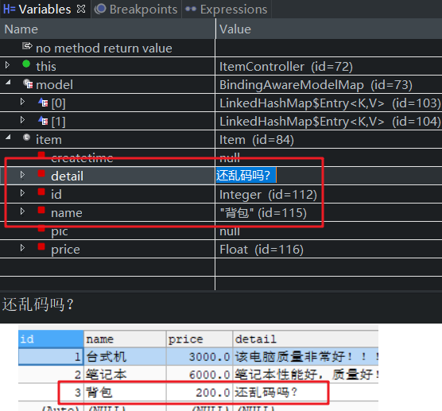

#### 13.2.2. GET 请求 - 解决中文乱码

测试 get 请求方式中文参数乱码

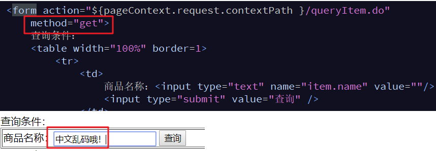

或者请求 url 带中文

```
localhost:8080/ssm/queryItem.do?item.name=中文乱码哦!
```

测试结果

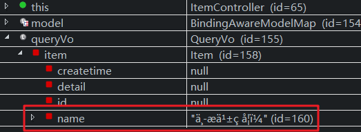

##### 13.2.2.1. 解决方式 1

对请求参数进行重新编码。ISO8859-1 是 tomcat 默认编码，需要将 tomcat 编码后的内容按 utf-8 编码。修改出现乱码的控制方法

```java
@RequestMapping("/queryItem.do")
public String queryItem(Model model, QueryVo queryVo) {
	// 解决get请求中文乱码方式1：解码再编码
	try {
		if (queryVo != null && queryVo.getItem() != null) {
			// 1.获取参数数据
			String name = queryVo.getItem().getName();
			// 2.将数据按ISO-8859-1获取字节数组
			byte[] bytes = name.getBytes("ISO-8859-1");
			// 3.将字节数组使用UTF-8重新编码
			name = new String(bytes, "UTF-8");
			// 4.将编码后的数据重新设置到对象中
			queryVo.getItem().setName(name);
		}
	} catch (Exception e) {
		e.printStackTrace();
	}
	// =========解决end==========
		....省略
}
```

> 这种方式显然不可取，重复编码

##### 13.2.2.2. 解决方式 2

项目开发阶段，可以修改 maven 中 pom.xml，tomcat 插件的配置

```xml
<!-- 设置maven tomcat插件 -->
<plugin>
	<groupId>org.apache.tomcat.maven</groupId>
	<artifactId>tomcat7-maven-plugin</artifactId>
	<version>2.2</version>
	<configuration>
		<!-- 指定端口号 -->
		<port>8080</port>
		<!-- 指定请求路径 -->
		<path>/ssm</path>
		<!-- URL按UTF-8进行编码，解决中文参数乱码 -->
		<uriEncoding>UTF-8</uriEncoding>
		<!-- tomcat名称 -->
		<server>tomcat7</server>
	</configuration>
</plugin>
```

项目部署阶段，需要修改 tomcat 配置文件，添加编码与工程编码一致


```xml
...
<Connector URIEncoding="UTF-8" port="8080" protocol="HTTP/1.1"
               connectionTimeout="20000"
               redirectPort="8443" />
...
```

### 13.3. SpringMVC 从后台向前台传递数据的方式

1. 将数据绑定到 request
2. 返回 ModelAndView
3. 通过 ModelMap 对象，可以在这个对象里面调用 put 方法，把对象加到里面，前端就可以通过 el 表达式拿到
4. 绑定数据到 Session 中

### 13.4. 对于 Restful 风格支持

#### 13.4.1. Restful 风格简述

restful，它是一种软件设计风格，指的是表现层资源的状态转换（Representational state transfer）。互联网上的一切都可以看成是资源，比如一张图片，一部电影。restful 根据 HTTP 请求方法：POST/GET/PUT/DELETE，定义了资源的操作方法：新增/查询/修改/删除。这样有什么好处呢？好处是使得请求的 URL 更加简洁

传统的 url：

```
http://127.0.0.1:8080/springmvc-03/item/queryItem.do?id=1	查询
http://127.0.0.1:8080/springmvc-03/item/saveItem.do			新增
http://127.0.0.1:8080/springmvc-03/item/updateItem.do		修改
http://127.0.0.1:8080/springmvc-03/item/deleteItem.do?id=1	删除
```

restful 风格的 url：

```
http://127.0.0.1:8080/springmvc-03/item/1	查询/删除
http://127.0.0.1:8080/springmvc-03/item		新增/修改
```

说明：

1. restful 是一种软件设计风格
2. restful 指的是表现层资源状态转换，是根据 http 的请求方法：post/get/put/delete，定义了资源的：新增/查询/修改/删除操作
3. 使用 restful 的优点是使得请求的 url 更加简洁，更加优雅。

#### 13.4.2. restful 的使用示例

需求：使用 restful 风格实现根据商品 id 查询数据

##### 13.4.2.1. 项目配置

修改项目 web.xml 配置中的 `<servlet-mapping>` 标签

如果使用 restful 编程风格，需要修改前端拦截器的拦截 url，因为 restful 风格的 url 不带映射方法的标识，根据请求方式判断执行哪个方法。所以将拦截的 url 修改为 `/`

```xml
<!-- 配置拦截的url -->
<servlet-mapping>
	<servlet-name>SpringMVC</servlet-name>
	<!-- 拦截所有.do结尾的请求
	<url-pattern>*.do</url-pattern>
	-->
	<!-- !!配置支持restful风格后，拦截url需要修改配置
		如果按原来的*.do配置，无法拦截该风格的url
	-->
	<url-pattern>/</url-pattern>
</servlet-mapping>
```

##### 13.4.2.2. 修改请求控制器的 url

使用 Reatful 风格的 url，需要配置 `@PathVariable` 注解来使用。

- 作用：把路径变量的值，绑定到方法到形参上。
- 路径变量格式：`{变量名}`，路径变量（模版参数），用于使用 restful 风格时传递提交参数
- 注解示例写法：

```java
@PathVariable(name="变量名")
@PathVariable(value="变量名")
@PathVariable("变量名")
// 以下写法的前提是：路径变量的名称，与方法的形参名称一致
@PathVariable
```

测试 restful 风格请求

```java
/**
 * restful讲解专用
 * 		使用restful风格，实现根据商品id查询商品数据。
 * 		http://127.0.0.1:8080/ssm/item/1
 *
 * 	{id}：路径变量（模版参数）
 * 	@PathVariable注解：把路径变量的值，绑定到方法的形参上
 * 注解写法：
 * 		@PathVariable(name="id")
 * 		@PathVariable(value="id")
 * 		@PathVariable("id")
 *
 * 前提是路径变量的名称，与方法的形参名称一致：
 * 		@PathVariable() 或者 @PathVariable
 */
@RequestMapping("/item/{id}")
@ResponseBody
public Item testRestful(@PathVariable Integer id) {
	// 1.调用业务层方法，根据id查询
	Item item = itemService.queryItemById(id);
	// 2.返回查询结果
	return item;
}

// 模拟restful风格执行新增方法
@RequestMapping(value = "/item", method = RequestMethod.POST)
public String testRestfulInsert(Item item) {
	System.out.println("执行了新增方法");
	return "common/success";
}

// 模拟restful风格执行更新方法
@RequestMapping(value = "/item", method = RequestMethod.PUT)
public String testRestfulUpdate(Item item) {
	System.out.println("执行了修改方法");
	return "common/success";
}

// 模拟restful风格执行查询方法
@RequestMapping(value = "/item/{id}", method = RequestMethod.GET)
public String testRestfulQuery(@PathVariable Integer id) {
	System.out.println("执行了查询方法");
	return "common/success";
}

// 模拟restful风格执行删除方法
@RequestMapping(value = "/item/{id}", method = RequestMethod.DELETE)
public String testRestfulDelete(@PathVariable Integer id) {
	System.out.println("执行了删除方法");
	return "common/success";
}
```

> 注：更多 `@PathVariable` 注解的说明，详见[《Spring MVC 注解汇总.md》文档](/后端框架/SpringMVC/SpringMVC-注解汇总)
