## 1. Spring MVC 流程概述

> Spring MVC 最新官方文档：https://docs.spring.io/spring-framework/docs/current/reference/html/web.html#spring-web

### 1.1. Spring MVC 时序图

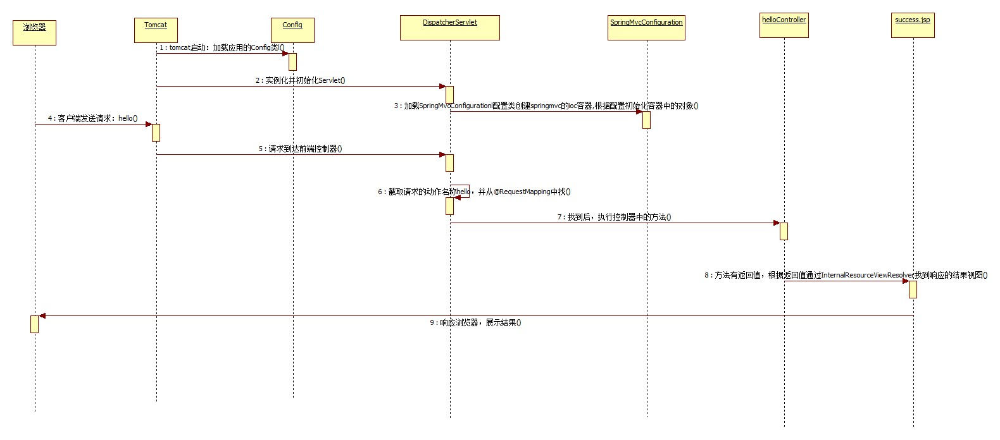

### 1.2. 官方流程图

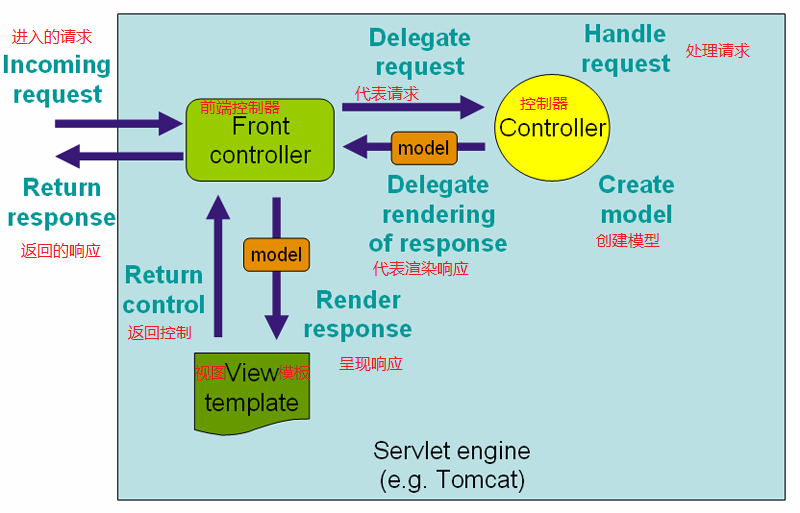

## 2. web 项目初始化过程分析

### 2.1. Servlet 3.0 规范加入的内容

- Servlet3.0规范提供的标准接口，在web容器启动的时候，首先触发`ServletContainerInitializer`此接口的实现类的`onStartup()`方法

```java
/* Servlet3.0规范提供的标准接口 */
public interface ServletContainerInitializer {
    /*
     * 启动容器是做一些初始化操作，例如注册Servlet、Filter、Listener等等
     */
    public void onStartup(Set<Class<?>> c, ServletContext ctx)
        throws ServletException;
}
```

- `@HandlesTypes`注解用于标识在`ServletContainerInitializer`的实现类中，指定要加载到`ServletContainerInitializer`接口实现类中的字节码，在`onStartup(@Nullable Set<Class<?>> webAppInitializerClasses, ServletContext servletContext);`方法的入参`webAppInitializerClasses`中可以获取到此注解的值

```java
/* 用于指定要加载到ServletContainerInitializer接口实现类中的字节码 */
@Target({ElementType.TYPE})
@Retention(RetentionPolicy.RUNTIME)
public @interface HandlesTypes {
    /*
     * 指定要加载到ServletContainerInitializer实现类的onStartUp方法中类的字节码。
     * 字节码可以是接口，抽象类或者普通类。
     */
    Class<?>[] value();
}
```

### 2.2. SpringMVC 框架使用 Servlet 3.0 规范

任何要使用Servlet3.0规范且脱离web.xml的配置，在使用时都必须在对应的jar包的`META-INF/services`目录创建一个名为`javax.servlet.ServletContainerInitializer`的文件，文件内容指定具体的`ServletContainerInitializer`实现类，那么，当web容器启动时就会运行这个初始化器做一些组件内的初始化工作。


### 2.3. AbstractDispatcherServletInitializer 中的 onStartUp 方法

`AbstractDispatcherServletInitializer`类是Spring MVC提供的`WebApplicationInitializer`接口的实现抽象类。

### 2.4. 注册 DisptatcherServlet

> TODO: 整理中

## 3. 前端控制器 DispatcherServlet

### 3.1. 简介

在 web.xml 中配置，<font color=red>**实质是一个 Servlet**</font>

作用：接收请求，响应结果。相当于转发器，中央处理器

用户请求到达前端控制器，它就相当于 MVC 模式中的 C，`DispatcherServlet` 是整个流程控制的中心，由它调用其它组件处理用户的请求，<font color=red>**`DispatcherServlet`的存在降低了组件之间的耦合性**</font>

### 3.2. 执行过程分析

#### 3.2.1. doService方法

此方法在接收到请求首先执行的方法，通过跟踪源码得知，它重写父类`FrameworkServlet`的，`FrameworkServlet`是继承了`HttpServlet`，所以它就相当于执行了Servlet中的service方法

#### 3.2.2. doDispatche方法

在doService方法执行的逻辑中，会调用doDispatche方法，此方法是处理请求分发的核心方法。它负责通过反射调用控制器方法、执行拦截器和处理结果视图

## 4. 处理器映射器 HandlerMapping

### 4.1. 作用

`HandlerMapping` 负责根据用户请求找到相应的 Handler（即处理器），Spring MVC 提供了不同的映射器实现不同的映射方式，例如：配置文件方式，实现接口方式，注解方式等。

### 4.2. RequestMappingHandlerMapping 的执行时机

`RequestMappingHandlerMapping` 是 `HandlerMapping` 接口的实现，是在项目启动的时候就进行

因为 `DispatcherServlet` 本质是一个 Servlet，所以在项目启动时必定会触发 `init` 方法。通过源码可以看到，`init()`方法的具体实现在定义在`HttpServlet`抽象类中，该方法又调用子类`FrameworkServlet`的`initServletBean()`方法，该中有一个无实现的`onRefresh()`，这个是方法由子类`DispatcherServlet`来实现，方法实现如下：

```java
@Override
protected void onRefresh(ApplicationContext context) {
	initStrategies(context);
}
/**
 * Initialize the strategy objects that this servlet uses.
 * <p>May be overridden in subclasses in order to initialize further strategy objects.
 */
/* 此方法就是DispatcherServlet中的初始化方法 */
protected void initStrategies(ApplicationContext context) {
	// 初始化文件上传的处理器
	initMultipartResolver(context);
	// 初始化国际化资源的处理器
	initLocaleResolver(context);
	// 初始化主题资源处理器
	initThemeResolver(context);
	// 初始化控制器映射的处理器，重点程度【5】
	initHandlerMappings(context);
	// 初始化适配器
	initHandlerAdapters(context);
	// 初始化异常解析器
	initHandlerExceptionResolvers(context);
	initRequestToViewNameTranslator(context);
	// 初始化视图解析器
	initViewResolvers(context);
	initFlashMapManager(context);
}
```

处理控制器映射的方法源码

```java
/* 初始化处理器映射器方法 */
private void initHandlerMappings(ApplicationContext context) {
	this.handlerMappings = null;
	if (this.detectAllHandlerMappings) {
		// Find all HandlerMappings in the ApplicationContext, including ancestor contexts.
		/*
		 * 此方法会初始化三个处理器
		 * 	RequestMappingHandlerMapping：请求映射处理器
		 * 		此对象中MappingRegistry属性（LinkedHashMap结构），就是用来存储所有@RequestMapping中定义的url与相应的方法的映射
		 * 	BeanNameUrlHandlerMapping：beanName与url映射处理器
		 * 	SimpleUrlHandlerMapping：资源处理器
		 */
		Map<String, HandlerMapping> matchingBeans =
				BeanFactoryUtils.beansOfTypeIncludingAncestors(context, HandlerMapping.class, true, false);
		if (!matchingBeans.isEmpty()) {
			this.handlerMappings = new ArrayList<>(matchingBeans.values());
			// We keep HandlerMappings in sorted order.
			AnnotationAwareOrderComparator.sort(this.handlerMappings);
		}
	}
	else {
		try {
			HandlerMapping hm = context.getBean(HANDLER_MAPPING_BEAN_NAME, HandlerMapping.class);
			this.handlerMappings = Collections.singletonList(hm);
		}
		catch (NoSuchBeanDefinitionException ex) {
			// Ignore, we'll add a default HandlerMapping later.
		}
	}
	// Ensure we have at least one HandlerMapping, by registering
	// a default HandlerMapping if no other mappings are found.
	if (this.handlerMappings == null) {
		this.handlerMappings = getDefaultStrategies(context, HandlerMapping.class);
		if (logger.isTraceEnabled()) {
			logger.trace("No HandlerMappings declared for servlet '" + getServletName() +
					"': using default strategies from DispatcherServlet.properties");
		}
	}
}
```

## 5. 处理器适配器 HandlerAdapter

### 5.1. 作用

### 5.2. 适配器模式

适配器模式就是把一个类的接口变换成客户端所期待的另一种接口，从而使原本因接口原因不匹配而无法一起工作的两个类能够一起工作。适配类可以根据参数返还一个合适的实例给客户端。

通过`HandlerAdapter`对处理器进行执行，这是适配器模式的应用，通过扩展适配器可以对更多类型的处理器进行执行。


### 5.3. SpringMVC控制器的三种编写方式

#### 5.3.1. 使用Controller注解

```java
@Controller
public class BasicController {
    @RequestMapping("/hello")
    public String sayHello() {
        System.out.println("BasicController控制器sayHello()方法执行了...");
        return "success";
    }
}
```

#### 5.3.2. 实现Controller接口（少用）

此实现方式的，返回值也是让spring mvc框架来处理后生成的ModelAndView

```java
/* 编写SpringMVC控制器，可以实现此接口 */
@FunctionalInterface
public interface Controller {
	/* 用于处理请求并返回ModelAndView */
	@Nullable
	ModelAndView handleRequest(HttpServletRequest request, HttpServletResponse response) throws Exception;
}
```

#### 5.3.3. 实现HttpRequestHandler接口（少用）

此实现方式的与实现`Controller`接口方式的区别在于，返回值是让使用者通过response来处理

```java
/* 编写SpringMVC控制器，可以实现此接口 */
@FunctionalInterface
public interface HttpRequestHandler {
	/* 用于处理器请求，并由使用者提供相应返回处理 */
	void handleRequest(HttpServletRequest request, HttpServletResponse response)
			throws ServletException, IOException;
}
```

## 6. 视图解析器 ViewResovler 和 View

> 注：现在互联网项目，都不会使用直接响应视图的方式返回。都是前后端分离，将数据以流的方式返回到前端，在html中显示。所以此部分的内容很少用，只作了解即可

### 6.1. View

视图的作用是渲染模型数据，将模型里的数据以某种形式呈现给用户。

为了实现视图模型和具体实现技术的解耦，Spring在`org.springframework.web.servlet`包中定义了一个高度抽象的`View`接口。视图是无状态的，无状态是指对于每一个请求，都会创建一个`View`对象，所以他们不会有线程安全的问题。

在SpringMVC中常用的视图类型：

|   分类    |         视图类型         |                                     说明                                      |
| --------- | ----------------------- | ---------------------------------------------------------------------------- |
| URL视图    | InternalResourceView    | 将JSP或者其他资源封装成一个视图，是InternaleResourceViewResolver默认使用的视图类型 |
|           | JstlView                | 它是当我们在页面中使用了JSTL标签库的国际化标签后，需要采用的类型                    |
| 文档类视图 | AbstractPdfView         | PDF文档视图的抽象类                                                            |
|           | AbstarctXlsView         | Excel文档视图的抽象类，该类是4.2版本之后才有的。之前使用的是AbstractExcelView      |
| JSON视图   | MappingJackson2JsonView | 将模型数据封装成Json格式数据输出。它需要借助Jackson开源框架                        |
| XML视图    | MappingJackson2XmlView  | 将模型数据封装成XML格式数据。它是从4.1版本之后才加入的                             |

### 6.2. ViewResolver

`ViewResolver`负责将处理结果生成`View`视图，`ViewResolver`首先根据逻辑视图名解析成物理视图名即具体的页面地址，再生成`View`视图对象，最后对`View`进行渲染将处理结果通过页面展示给用户。视图对象是由视图解析器负责实例化。

视图解析器的作用是将逻辑视图转为物理视图，所有的视图解析器都必须实现`ViewResolver`接口

SpringMVC为逻辑视图名的解析提供了不同的策略，可以在Spring WEB上下文中配置一种或多种解析策略，并指定他们之间的先后顺序。每一种映射策略对应一个具体的视图解析器实现类。程序员可以选择一种视图解析器或混用多种视图解析器。可以通过order属性指定解析器的优先顺序，order越小优先级越高，SpringMVC会按视图解析器顺序的优先顺序对逻辑视图名进行解析，直到解析成功并返回视图对象，否则抛出`ServletException`异常。

|      分类       |           解析器类型           |                                   说明                                    |
| -------------- | ---------------------------- | ----------------------------------------------------------------------- |
| 解析为Bean的名称 | BeanNameViewResolver         | Bean的id即为逻辑视图名称                                                    |
| 解析为URL文件    | InternalResourceViewResolver | 将视图名解析成一个URL文件，一般就是一个jsp或者html文件。文件一般都存放在WEB-INF目录中 |
| 解析指定XML文件  | XmlViewResolver              | 解析指定位置的XML文件，默认在/WEB-INF/views.xml                               |
| 解析指定属性文件  | ResourceBundleViewResolver   | 解析properties文件                                                        |

## 7. 请求参数封装的源码分析

### 7.1. 传统表单数据封装原理(!待整理)

第1步：`DispatcherServlet` 的 `doService` 方法执行

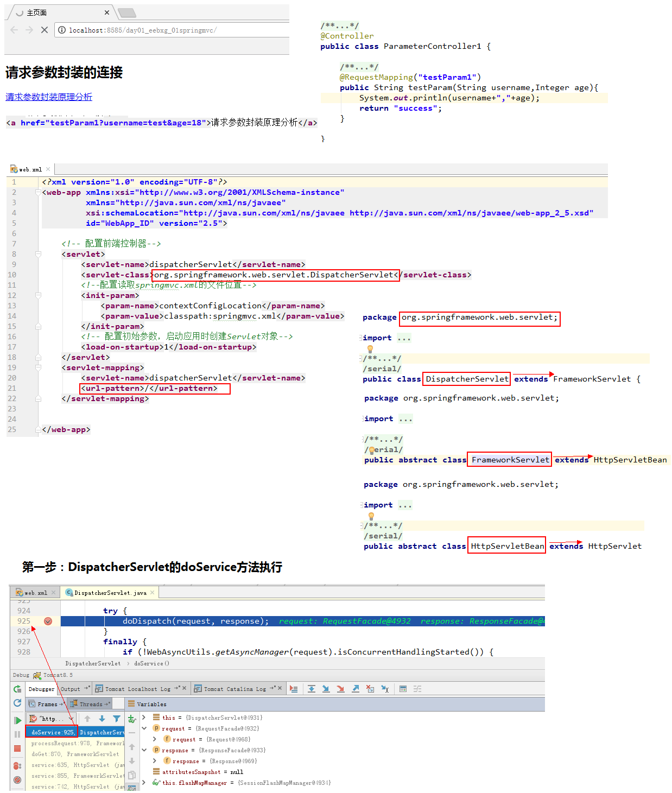

第2步：`DispatcherServlet` 的 `doDispatch` 方法执行

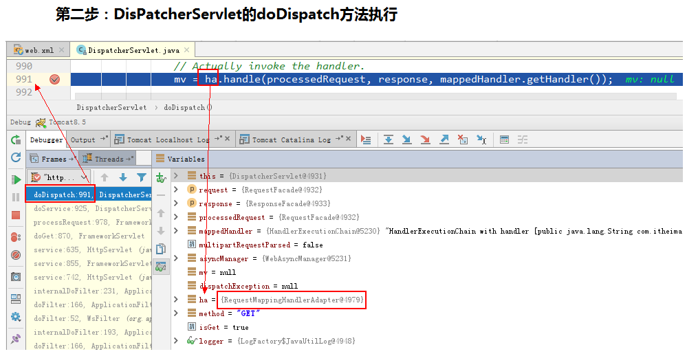

第3步：`RequestMappingHandlerAdapter` 的 `handleInternal` 方法执行

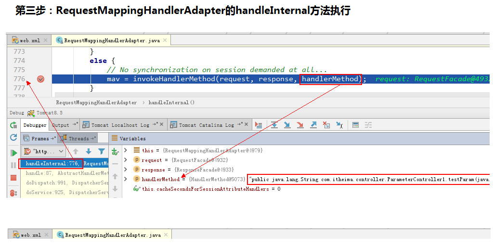

第4步：`RequestMappingHandlerAdapter` 的 `invokeHandlerMethod` 方法执行

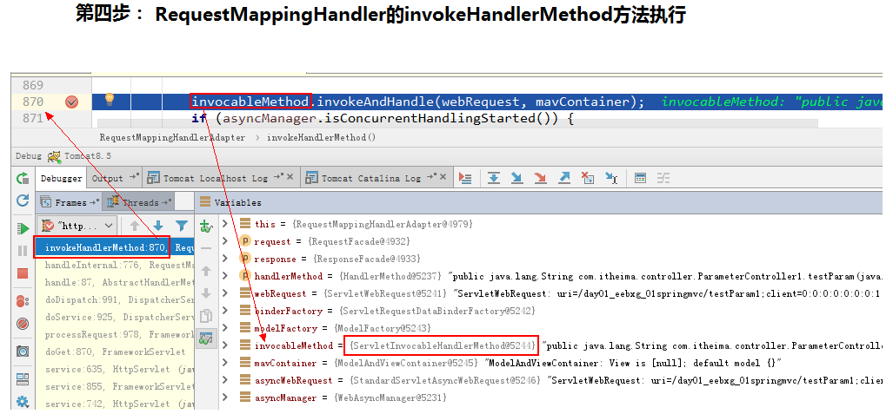

第5步：`ServletInvocableHandlerMethod` 的 `invokeAndHandle` 方法执行

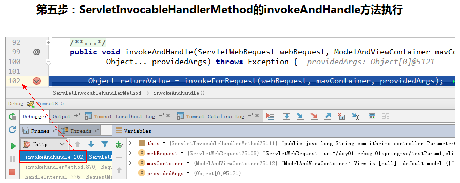

第6步：`InvocableHandlerMethod` 的 `invokeForRequest` 方法执行。其中有会调用到最后一步（第10步）：`InvocableHandlerMethod` 的 `doInvoke` 方法执行

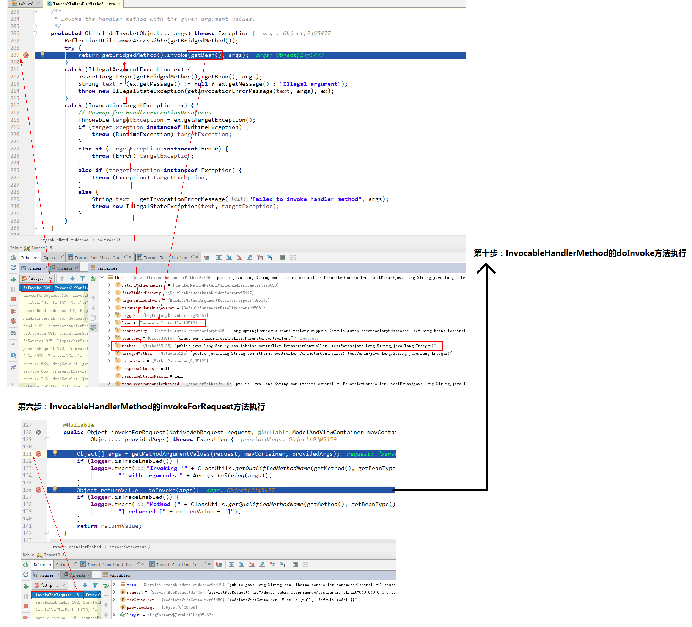

第7步：`InvocableHandlerMethod` 的 `getMethodArgumentValues` 方法执行

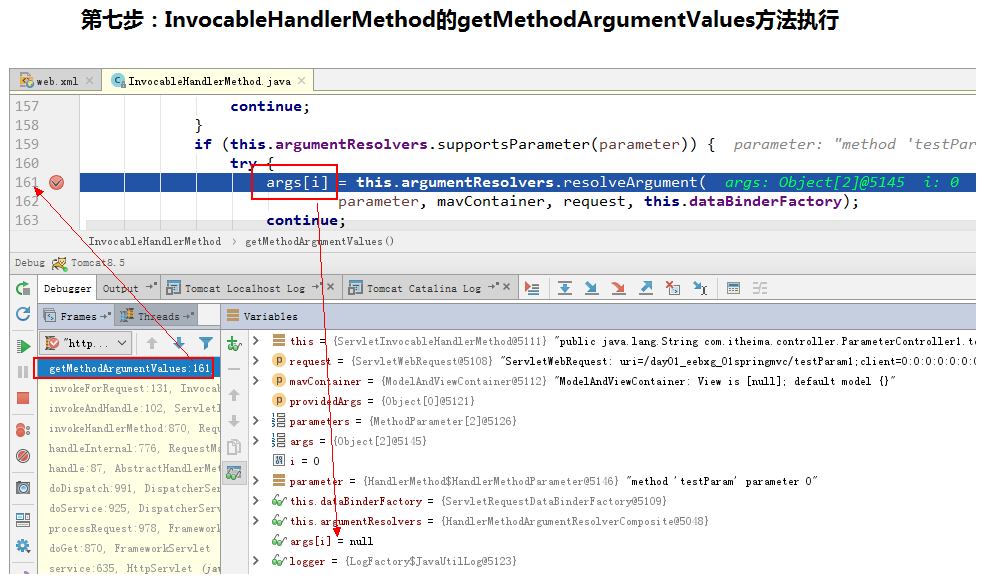

第8步：`HandlerMethodArgumentResolverComposite` 的 `resolveArgument` 方法执行

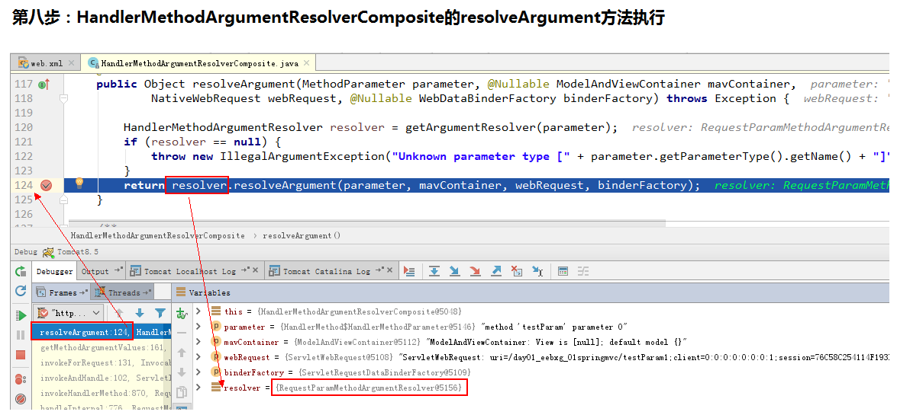

第9步：`RequestParamMethodArgumentResolver` 的 `resolveName` 方法执行


### 7.2. @RequestBody 注解执行原理(!待整理)

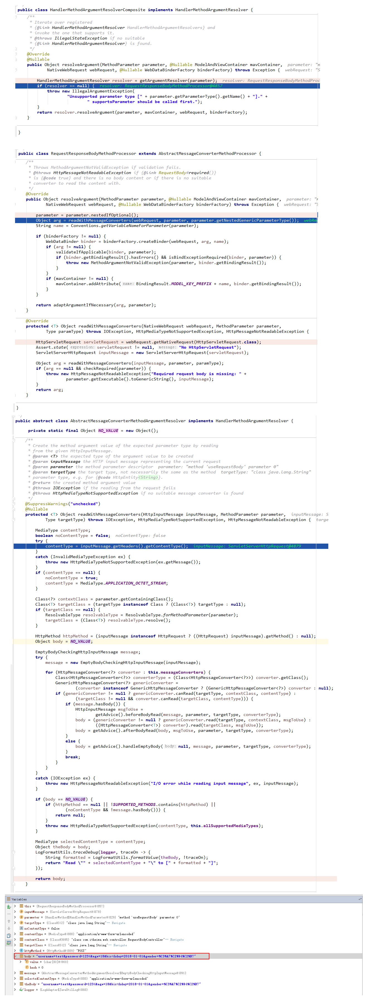

### 7.3. @PathVariable 注解实现原理(!待整理)

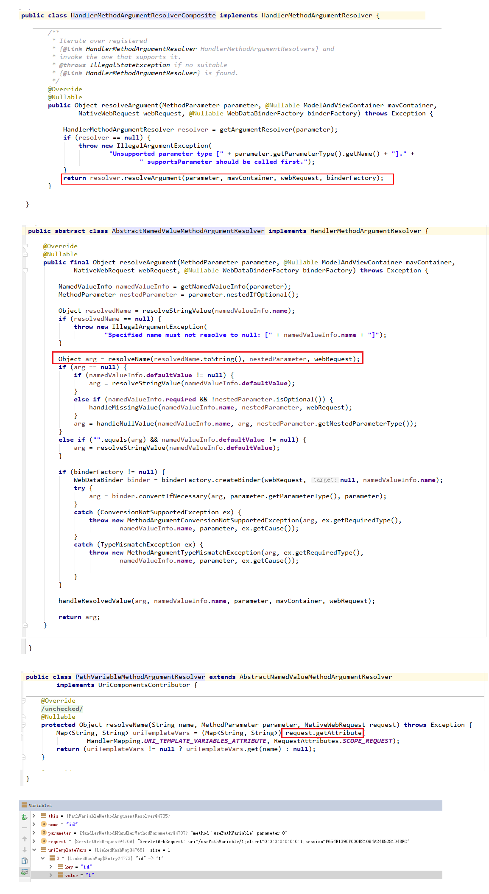

### 7.4. 对象绑定与类型转换

#### 7.4.1. 底层第一套转换接口与实现

```mermaid
classDiagram

Formatter --|> Printer
Formatter --|> Parser

class Converters {
   Set~GenericConverter~
}
class Converter

class ConversionService
class FormattingConversionService

ConversionService <|-- FormattingConversionService
FormattingConversionService o-- Converters

Printer --> Adapter1
Adapter1 --> Converters
Parser --> Adapter2
Adapter2 --> Converters
Converter --> Adapter3
Adapter3 --> Converters

<<interface>> Formatter
<<interface>> Printer
<<interface>> Parser
<<interface>> Converter
<<interface>> ConversionService
```

- `Printer` 把其它类型转为 String
- `Parser` 把 String 转为其它类型
- `Formatter` 综合 Printer 与 Parser 功能
- `Converter` 把任意类型 S 转为任意类型 T
- `Printer`、`Parser`、`Converter` 经过适配转换成 `GenericConverter` 类放入 `org.springframework.core.convert.support.GenericConversionService` 类中的 `Converters` 属性中（`Converters` 是 `GenericConversionService` 定义的内部类）
- `FormattingConversionService` 继承了 `GenericConversionService` 类，利用其它们实现转换。类关系图如下：

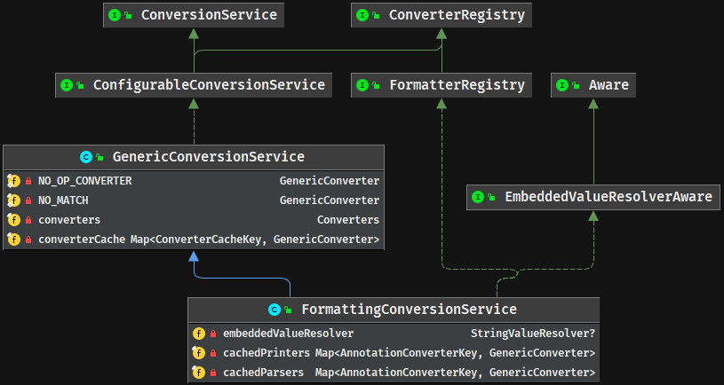

#### 7.4.2. 底层第二套转换接口

```mermaid
classDiagram

PropertyEditorRegistry o-- "多" PropertyEditor

<<interface>> PropertyEditorRegistry
<<interface>> PropertyEditor
```

此套接口是 JDK 原生

- `PropertyEditor` 把 String 与其它类型相互转换
- `PropertyEditorRegistry` 可以注册多个 `PropertyEditor` 对象
- 与第一套接口直接可以通过 `FormatterPropertyEditorAdapter` 来进行适配

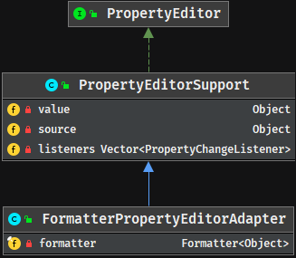

#### 7.4.3. 高层接口与实现

```mermaid
classDiagram
TypeConverter <|-- SimpleTypeConverter
TypeConverter <|-- BeanWrapperImpl
TypeConverter <|-- DirectFieldAccessor
TypeConverter <|-- ServletRequestDataBinder

SimpleTypeConverter --> TypeConverterDelegate
BeanWrapperImpl --> TypeConverterDelegate
DirectFieldAccessor --> TypeConverterDelegate
ServletRequestDataBinder --> TypeConverterDelegate

TypeConverterDelegate --> ConversionService
TypeConverterDelegate --> PropertyEditorRegistry

<<interface>> TypeConverter
<<interface>> ConversionService
<<interface>> PropertyEditorRegistry
```

`org.springframework.beans.TypeConverter` 是转换功能的最顶层接口，在转换时，会用到 `TypeConverterDelegate` 委派 `ConversionService` 与 `PropertyEditorRegistry` 真正执行转换（Facade 门面模式）。具体处理逻辑如下：

- 先判断是否有自定义转换器，`@InitBinder` 添加的即属于这种 (用了适配器模式把 Formatter 转为需要的 PropertyEditor)
- 再判断有没有 `ConversionService` 转换
- 再利用默认的 `PropertyEditor` 转换
- 最后进行特殊处理

Spring 中 `TypeConverter` 默认实现有如下：

- `SimpleTypeConverter` 仅做类型转换
- `BeanWrapperImpl` 为 bean 的属性赋值，当需要时做类型转换，通过 getter/setter 方法来设置 Property
- `DirectFieldAccessor` 为 bean 的属性赋值，当需要时做类型转换，通过反射来设置 Field（无需提供 setter 方法）
- `ServletRequestDataBinder` 从配置文件中读取值，为 bean 的属性执行绑定，当需要时做类型转换，根据 directFieldAccess 属性来选择 Property 方式还是 Field 方式，具备校验与获取校验结果功能

## 8. 拦截器的执行时机和调用过程

### 8.1. 拦截器的执行流程图


### 8.2. 拦截器的源码执行过程分析


### 8.3. 拦截器的责任链模式

责任链模式是一种常见的行为模式。它是使多个对象都有处理请求的机会，从而避免了请求的发送者和接收者之间的耦合关系。将这些对象串成一条链，并沿着这条链一直传递该请求，直到有对象处理它为止。

- 优点：
    - 解耦了请求与处理
    - 请求处理者（节点对象）只需关注自己感兴趣的请求进行处理即可，对于不感兴趣的请求，直接转发给下一级节点对象
    - 具备链式传递处理请求功能，请求发送者无需知晓链路结构，只需等待请求处理结果
    - 链路结构灵活，可以通过改变链路结构动态地新增或删减责任
    - 易于扩展新的请求处理类（节点），符合开闭原则
- 缺点：
    - 责任链路过长时，可能对请求传递处理效率有影响
    - 如果节点对象存在循环引用时，会造成死循环，导致系统崩溃

## 9. SpringMVC 中的文件上传

### 9.1. MultipartFile

#### 9.1.1. 源码

```java
/* SpringMVC中对上传文件的封装 */
public interface MultipartFile extends InputStreamSource {
	/* 获取临时文件名称 */
	String getName();

	/* 获取真实（原始）文件名称 */
	@Nullable
	String getOriginalFilename();

	/* 获取上传文件的MIME类型 */
	@Nullable
	String getContentType();

	/* 是否是空文件 */
	boolean isEmpty();

	/* 获取上传文件的字节大小 */
	long getSize();

	/* 获取上传文件的字节数组 */
	byte[] getBytes() throws IOException;

	/* 获取上传文件的字节输入流 */
	@Override
	InputStream getInputStream() throws IOException;

	/* 把上传文件转换成一个Resource对象 */
	default Resource getResource() {
		return new MultipartFileResource(this);
	}

	/* 把临时文件移动到指定位置并重命名，参数是一个文件对象 */
	void transferTo(File dest) throws IOException, IllegalStateException;

	/* 把临时文件移动到指定位置并重命名，参数是一个文件路径 */
	default void transferTo(Path dest) throws IOException, IllegalStateException {
		FileCopyUtils.copy(getInputStream(), Files.newOutputStream(dest));
	}
}
```

#### 9.1.2. commons-fileupload的实现

`MultipartFile`的实现类其中一个实现是`CommonsMultipartFile`，通过导包就看出了，此类是借助apache的commons-fileupload实现的文件上传

### 9.2. MultipartResolver

#### 9.2.1. 源码

```java
/*
 * 它是SpringMVC中文件解析器的标准
 * 通过一个接口规定了文件解析器中必须包含的方法
 */
public interface MultipartResolver {

	/* 判断是否支持文件上传 */
	boolean isMultipart(HttpServletRequest request);

	/* 解析HttpServletRequest */
	MultipartHttpServletRequest resolveMultipart(HttpServletRequest request) throws MultipartException;

	/* 删除临时文件和一些清理操作 */
	void cleanupMultipart(MultipartHttpServletRequest request);
}
```

#### 9.2.2. CommonsFileUploadResolver

`MultipartResolver`的实现类是`CommonsMultipartResolver`，此类继承抽象类`CommonsFileUploadSupport`，解析`CommonsMultipartFile`逻辑在此抽象类

```java
public class CommonsMultipartResolver extends CommonsFileUploadSupport
		implements MultipartResolver, ServletContextAware {
}
```

从导包能得知，也是借助apache的commons-fileupload实现的文件上传。具体方法作用，查看源码工程注释

## 10. @ControllerAdvice 注解调用流程

### 10.1. @ControllerAdvice 与 @InitBinder 配合实现流程

#### 10.1.1. 流程图

`@InitBinder` 在整个 `HandlerAdapter` 调用过程中所处的位置

```mermaid
sequenceDiagram
participant adapter as HandlerAdapter
participant bf as WebDataBinderFactory
participant mf as ModelFactory
participant ihm as ServletInvocableHandlerMethod
participant ar as ArgumentResolvers 
participant rh as ReturnValueHandlers
participant container as ModelAndViewContainer
rect rgb(200, 150, 255)
adapter ->> +bf: 准备 @InitBinder
bf -->> -adapter: 
end
adapter ->> +mf: 准备 @ModelAttribute
mf ->> +container: 添加Model数据
container -->> -mf: 
mf -->> -adapter: 

adapter ->> +ihm: invokeAndHandle
ihm ->> +ar: 获取 args
ar ->> ar: 有的解析器涉及 RequestBodyAdvice
ar ->> container: 有的解析器涉及数据绑定生成Model数据
ar -->> -ihm: args
ihm ->> ihm: method.invoke(bean,args) 得到 returnValue
ihm ->> +rh: 处理 returnValue
rh ->> rh: 有的处理器涉及 ResponseBodyAdvice
rh ->> +container: 添加Model数据,处理视图名,是否渲染等
container -->> -rh: 
rh -->> -ihm: 
ihm -->> -adapter: 
adapter ->> +container: 获取 ModelAndView
container -->> -adapter: 
```

> 上图图示解释：
>
> - `RequestMappingHandlerAdapter` 在图中缩写为 `HandlerAdapter`
> - `HandlerMethodArgumentResolverComposite` 在图中缩写为 `ArgumentResolvers`
> - `HandlerMethodReturnValueHandlerComposite` 在图中缩写为 `ReturnValueHandlers`

调用流程大致如下：

1. `RequestMappingHandlerAdapter` 初始化时会解析 `@ControllerAdvice` 中的 `@InitBinder` 方法
2. `RequestMappingHandlerAdapter` 会以类为单位，在该类首次使用时，解析此类的 `@InitBinder` 方法
3. 以上两种情况 `@InitBinder` 的解析结果都会缓存来避免重复解析
4. 控制器方法调用时，会综合利用本类的 `@InitBinder` 方法和 `@ControllerAdvice` 中的 `@InitBinder` 方法创建绑定工厂

#### 10.1.2. 模拟 @InitBinder 在控制器方法调用示例

源码详见 springmvc-sample 项目中的 10-handleradapter 模块中 `ControllerAdviceInitBinderTest` 测试类

- 准备测试的带 `@InitBinder` 注解的 controller

```java
// 带 @InitBinder 注解的增强控制器
@ControllerAdvice
public class InitBinderControllerAdvice {
    @InitBinder
    public void binder(WebDataBinder webDataBinder) {
        System.out.println("InitBinderControllerAdvice.binder 转换器方法执行了...");
    }
}

// 带 @InitBinder 注解的控制器1
@Controller
public class InitBinderController1 {
    @InitBinder
    public void binder1(WebDataBinder webDataBinder) {
        System.out.println("InitBinderController1.binder1 转换器方法执行了...");
    }

    public void foo() {
    }
}

// 带 @InitBinder 注解的控制器2
@Controller
public class InitBinderController2 {
    @InitBinder
    public void binder1(WebDataBinder webDataBinder) {
        System.out.println("InitBinderController2.binder1 转换器方法执行了...");
    }

    @InitBinder
    public void binder2(WebDataBinder webDataBinder) {
        System.out.println("InitBinderController2.binder2 转换器方法执行了...");
    }

    public void bar() {
    }
}
```

- 测试代码，观察 `@InitBinder` 标识的方法解析与缓存的时机

```java
public class ControllerAdviceInitBinderTest {

    private static final Logger log = LoggerFactory.getLogger(ControllerAdviceInitBinderTest.class);

    @Test
    public void test() throws Exception {
        /*
            @InitBinder 的来源有两个
            1. @ControllerAdvice 中 @InitBinder 标注的方法，由 RequestMappingHandlerAdapter 在初始化时解析并记录
            2. @Controller 中 @InitBinder 标注的方法，由 RequestMappingHandlerAdapter 会在控制器方法首次执行时解析并记录
         */
        AnnotationConfigApplicationContext context = new AnnotationConfigApplicationContext(SpringConfiguration.class);
        // 手动创建 RequestMappingHandlerAdapter
        RequestMappingHandlerAdapter handlerAdapter = new RequestMappingHandlerAdapter();
        handlerAdapter.setApplicationContext(context);
        handlerAdapter.afterPropertiesSet();

        log.debug("1. 初始化...");
        showBindMethods(handlerAdapter); // 打印目前已经绑定的 @InitBinder 标注的方法

        Method getDataBinderFactory = RequestMappingHandlerAdapter.class.getDeclaredMethod("getDataBinderFactory", HandlerMethod.class);
        getDataBinderFactory.setAccessible(true);

        log.debug("2. 模拟调用 InitBinderController1 的 foo 方法时 ...");
        getDataBinderFactory.invoke(handlerAdapter, new HandlerMethod(new InitBinderController1(), InitBinderController1.class.getMethod("foo")));
        showBindMethods(handlerAdapter); // 打印目前已经绑定的 @InitBinder 标注的方法

        log.debug("3. 模拟调用 InitBinderController2 的 bar 方法时 ...");
        getDataBinderFactory.invoke(handlerAdapter, new HandlerMethod(new InitBinderController2(), InitBinderController2.class.getMethod("bar")));
        showBindMethods(handlerAdapter); // 打印目前已经绑定的 @InitBinder 标注的方法

        context.close();
    }

    private void showBindMethods(RequestMappingHandlerAdapter handlerAdapter) throws NoSuchFieldException, IllegalAccessException {
        // 通过反射查看 RequestMappingHandlerAdapter 对象中的 initBinderAdviceCache 属性，该属性是用于缓存 @ControllerAdvice + @InitBinder 注解的解析结果，避免重复解析
        Field initBinderAdviceCache = RequestMappingHandlerAdapter.class.getDeclaredField("initBinderAdviceCache");
        initBinderAdviceCache.setAccessible(true);
        Map<ControllerAdviceBean, Set<Method>> globalMap = (Map<ControllerAdviceBean, Set<Method>>) initBinderAdviceCache.get(handlerAdapter);
        log.debug("全局的 @InitBinder 方法 {}",
                globalMap.values().stream()
                        .flatMap(ms -> ms.stream().map(Method::getName))
                        .collect(Collectors.toList())
        );
        // 通过反射查看 RequestMappingHandlerAdapter 对象中的 initBinderCache 属性，该属性是用于缓存 @InitBinder 注解的解析结果，避免重复解
        Field initBinderCache = RequestMappingHandlerAdapter.class.getDeclaredField("initBinderCache");
        initBinderCache.setAccessible(true);
        Map<Class<?>, Set<Method>> controllerMap = (Map<Class<?>, Set<Method>>) initBinderCache.get(handlerAdapter);
        log.debug("控制器的 @InitBinder 方法 {}",
                controllerMap.entrySet().stream()
                        .flatMap(e -> e.getValue().stream().map(v -> e.getKey().getSimpleName() + "." + v.getName()))
                        .collect(Collectors.toList())
        );
    }
}
```

运行结果

```
16:24:20.355 [main] DEBUG com.moon.springmvc.test.ControllerAdviceInitBinderTest - 1. 初始化...
16:24:20.358 [main] DEBUG com.moon.springmvc.test.ControllerAdviceInitBinderTest - 全局的 @InitBinder 方法 [binder]
16:24:20.359 [main] DEBUG com.moon.springmvc.test.ControllerAdviceInitBinderTest - 控制器的 @InitBinder 方法 []
16:24:20.361 [main] DEBUG com.moon.springmvc.test.ControllerAdviceInitBinderTest - 2. 模拟调用 InitBinderController1 的 foo 方法时 ...
16:24:20.367 [main] DEBUG com.moon.springmvc.test.ControllerAdviceInitBinderTest - 全局的 @InitBinder 方法 [binder]
16:24:20.368 [main] DEBUG com.moon.springmvc.test.ControllerAdviceInitBinderTest - 控制器的 @InitBinder 方法 [InitBinderController1.binder1]
16:24:20.368 [main] DEBUG com.moon.springmvc.test.ControllerAdviceInitBinderTest - 3. 模拟调用 InitBinderController2 的 bar 方法时 ...
16:24:20.368 [main] DEBUG com.moon.springmvc.test.ControllerAdviceInitBinderTest - 全局的 @InitBinder 方法 [binder]
16:24:20.368 [main] DEBUG com.moon.springmvc.test.ControllerAdviceInitBinderTest - 控制器的 @InitBinder 方法 [InitBinderController2.binder1, InitBinderController2.binder2, InitBinderController1.binder1]
```

### 10.2. @ControllerAdvice 与 @ModelAttribute 配合实现流程

#### 10.2.1. 流程图

`@ModelAttribute` 在整个 `HandlerAdapter` 调用过程中所处的位置

```mermaid
sequenceDiagram
participant adapter as HandlerAdapter
participant bf as WebDataBinderFactory
participant mf as ModelFactory
participant ihm as ServletInvocableHandlerMethod
participant ar as ArgumentResolvers 
participant rh as ReturnValueHandlers
participant container as ModelAndViewContainer

adapter ->> +bf: 准备 @InitBinder
bf -->> -adapter: 
rect rgb(200, 150, 255)
adapter ->> +mf: 准备 @ModelAttribute
mf ->> +container: 添加Model数据
container -->> -mf: 
mf -->> -adapter: 
end
adapter ->> +ihm: invokeAndHandle
ihm ->> +ar: 获取 args
ar ->> ar: 有的解析器涉及 RequestBodyAdvice
ar ->> container: 有的解析器涉及数据绑定生成Model数据
ar -->> -ihm: args
ihm ->> ihm: method.invoke(bean,args) 得到 returnValue
ihm ->> +rh: 处理 returnValue
rh ->> rh: 有的处理器涉及 ResponseBodyAdvice
rh ->> +container: 添加Model数据,处理视图名,是否渲染等
container -->> -rh: 
rh -->> -ihm: 
ihm -->> -adapter: 
adapter ->> +container: 获取 ModelAndView
container -->> -adapter: 
```

调用流程大致如下：

1. `RequestMappingHandlerAdapter` 初始化时会解析 `@ControllerAdvice` 中的 `@ModelAttribute` 方法
2. `RequestMappingHandlerAdapter` 会以类为单位，在该类首次使用时，解析此类的 `@ModelAttribute` 方法
3. 以上两种 `@ModelAttribute` 的解析结果都会缓存来避免重复解析
4. 控制器方法调用时，会综合利用本类的 `@ModelAttribute` 方法和 `@ControllerAdvice` 中的 `@ModelAttribute` 方法创建模型工厂

#### 10.2.2. 模拟 @ModelAttribute 在控制器方法调用示例

源码详见 springmvc-sample 项目中的 10-handleradapter 模块中 `ControllerAdviceModelAttributeTest` 测试类

- 准备测试的带 `@ModelAttribute` 注解的 controller

```java
// 带 @ModelAttribute 注解的增强控制器
@ControllerAdvice
public class ModelAttributeControllerAdvice {
    @ModelAttribute("AA")
    public String foo() {
        return "ModelAttributeControllerAdvice.foo()方法返回值";
    }
}

// 带 @ModelAttribute 注解的控制器
public class ModelAttributeController {
    @ModelAttribute("BB")
    public String foo() {
        return "ModelAttributeController.foo()方法返回值";
    }

    @ResponseStatus(HttpStatus.OK)
    public ModelAndView bar(@ModelAttribute("u") User user) {
        System.out.println("ModelAttributeController.bar 方法执行了...");
        return null;
    }
}
```

- 测试代码，观察 `@ModelAttribute` 标识的方法与参数相应的值是否加入到 `ModelAndViewContainer` 中

```java
public class ControllerAdviceModelAttributeTest {

    @Test
    public void test() throws Exception {
        // 创建基于注解的容器
        AnnotationConfigApplicationContext context = new AnnotationConfigApplicationContext(SpringConfiguration.class);
        // 手动创建 RequestMappingHandlerAdapter
        RequestMappingHandlerAdapter adapter = new RequestMappingHandlerAdapter();
        adapter.setApplicationContext(context);
        // 初始化参数处理器(HandlerMethodArgumentResolverComposite)与返回值处理器(HandlerMethodReturnValueHandlerComposite)
        // 这里会解析标识 @ControllerAdvice 的类中的 @ModelAttribute
        adapter.afterPropertiesSet();

        MockHttpServletRequest request = new MockHttpServletRequest();
        request.setParameter("name", "张三");
        /* 现在可以通过 ServletInvocableHandlerMethod 把这些整合在一起, 并完成控制器方法的调用, 如下 */
        ServletInvocableHandlerMethod handlerMethod =
                new ServletInvocableHandlerMethod(new ModelAttributeController(), ModelAttributeController.class.getMethod("bar", User.class));

        ServletRequestDataBinderFactory factory = new ServletRequestDataBinderFactory(null, null);

        handlerMethod.setDataBinderFactory(factory);
        handlerMethod.setParameterNameDiscoverer(new DefaultParameterNameDiscoverer());
        HandlerMethodArgumentResolverComposite composite = new HandlerMethodArgumentResolverComposite();
        composite.addResolvers(
                new RequestParamMethodArgumentResolver(context.getDefaultListableBeanFactory(), false),
                new PathVariableMethodArgumentResolver(),
                new RequestHeaderMethodArgumentResolver(context.getDefaultListableBeanFactory()),
                new ServletCookieValueMethodArgumentResolver(context.getDefaultListableBeanFactory()),
                new ExpressionValueMethodArgumentResolver(context.getDefaultListableBeanFactory()),
                new ServletRequestMethodArgumentResolver(),
                new ServletModelAttributeMethodProcessor(false),
                new RequestResponseBodyMethodProcessor(Arrays.asList(new MappingJackson2HttpMessageConverter())),
                new ServletModelAttributeMethodProcessor(true),
                new RequestParamMethodArgumentResolver(context.getDefaultListableBeanFactory(), true)
        );
        handlerMethod.setHandlerMethodArgumentResolvers(composite);
        // 初始化 ModelAndViewContainer
        ModelAndViewContainer container = new ModelAndViewContainer();

        // 获取模型工厂方法，因为 getModelFactory 方法是私有，此处使用反射调用
        Method getModelFactory = RequestMappingHandlerAdapter.class.getDeclaredMethod("getModelFactory", HandlerMethod.class, WebDataBinderFactory.class);
        getModelFactory.setAccessible(true);
        ModelFactory modelFactory = (ModelFactory) getModelFactory.invoke(adapter, handlerMethod, factory);

        // 初始化模型数据，将之前记录的 @ModelAttribute 的方法，反射调用后将返回值保存到 ModelAndView 对象
        modelFactory.initModel(new ServletWebRequest(request), container, handlerMethod);

        handlerMethod.invokeAndHandle(new ServletWebRequest(request), container);

        System.out.println(container.getModel());
        context.close();
    }
}
```

运行结果

```
ModelAttributeController.bar 方法执行了...
{AA=ModelAttributeControllerAdvice.foo()方法返回值, BB=ModelAttributeController.foo()方法返回值, u=User[name='张三', age=0], org.springframework.validation.BindingResult.u=org.springframework.validation.BeanPropertyBindingResult: 0 errors}
```

### 10.3. @ControllerAdvice 之 ResponseBodyAdvice

#### 10.3.1. 概述

`ResponseBodyAdvice` 接口是用于返回响应体前进行包装处理，一般配置 `@ControllerAdvice` 注解使用。

#### 10.3.2. 流程图

**ResponseBodyAdvice 增强**在整个 `HandlerAdapter` 调用过程中所处的位置

```mermaid
sequenceDiagram
participant adapter as HandlerAdapter
participant bf as WebDataBinderFactory
participant mf as ModelFactory
participant ihm as ServletInvocableHandlerMethod
participant ar as ArgumentResolvers 
participant rh as ReturnValueHandlers
participant container as ModelAndViewContainer

adapter ->> +bf: 准备 @InitBinder
bf -->> -adapter: 
adapter ->> +mf: 准备 @ModelAttribute
mf ->> +container: 添加Model数据
container -->> -mf: 
mf -->> -adapter: 
adapter ->> +ihm: invokeAndHandle
ihm ->> +ar: 获取 args
ar ->> ar: 有的解析器涉及 RequestBodyAdvice
ar ->> container: 有的解析器涉及数据绑定生成Model数据
ar -->> -ihm: args
ihm ->> ihm: method.invoke(bean,args) 得到 returnValue
ihm ->> +rh: 处理 returnValue
rect rgb(200, 150, 255)
rh ->> rh: 有的处理器涉及 ResponseBodyAdvice
end
rh ->> +container: 添加Model数据,处理视图名,是否渲染等
container -->> -rh: 
rh -->> -ihm: 
ihm -->> -adapter: 
adapter ->> +container: 获取 ModelAndView
container -->> -adapter: 
```

#### 10.3.3. ResponseBodyAdvice 返回值增强示例

示例需求：将标识了 `@ResponseBody` 注解的控制器方法的返回值包装成统一响应格式。示例源码详见 springmvc-sample 项目中的 10-handleradapter 模块中 `ControllerAdviceResponseBodyTest` 测试类

- 创建用于测试的控制器

```java
@RestController
// @Controller
// @ResponseBody
public class ResponseBodyDemoController {

    // @ResponseBody
    public User user() {
        return new User("王五", 18);
    }
}
```

- 创建控制器增强类，并实现 `org.springframework.web.servlet.mvc.method.annotation.ResponseBodyAdvice` 接口

```java
@ControllerAdvice
public class ResponseBodyControllerAdvice implements ResponseBodyAdvice<Object> {

    /**
     * 用于指定满足哪些条件才进行转换
     *
     * @param returnType    返回的类型
     * @param converterType 选定转换器的类型
     * @return 如返回 true 则代表可以进行转换，否则返回 false
     */
    @Override
    public boolean supports(MethodParameter returnType, Class<? extends HttpMessageConverter<?>> converterType) {
        /*
         * 这里需要判断三种情况
         *      1. 在控制器方法上标识 @ResponseBody 注解
         *      2. 在控制器类上标识 @ResponseBody 注解  可以使用 returnType.getContainingClass().isAnnotationPresent(ResponseBody.class) 来判断
         *      3. 在控制器类上标识 @RestController 注解
         * 其中 Spring 提供的 AnnotationUtils 工具类的 findAnnotation 方法，可以判断类上或者类上组合注解是否包含某个注解
         */
        if (returnType.getMethodAnnotation(ResponseBody.class) != null ||
                AnnotationUtils.findAnnotation(returnType.getContainingClass(), ResponseBody.class) != null) {
            return true;
        }
        return false;
    }

    /**
     * 响应体转换处理逻辑
     *
     * @param body                  响应数据
     * @return
     */
    @Override
    public Object beforeBodyWrite(Object body, MethodParameter returnType, MediaType selectedContentType,
                                  Class<? extends HttpMessageConverter<?>> selectedConverterType,
                                  ServerHttpRequest request, ServerHttpResponse response) {
        if (body instanceof Result) {
            // 如果是 Result 统一响应类型，则直接返回
            return body;
        }
        return Result.ok(body);
    }
}
```

- 测试程序

```java
@Test
public void test1() throws Exception {
    AnnotationConfigApplicationContext context = new AnnotationConfigApplicationContext(SpringConfiguration.class);

    ServletInvocableHandlerMethod handlerMethod = new ServletInvocableHandlerMethod(
            context.getBean(ResponseBodyDemoController.class),
            ResponseBodyDemoController.class.getMethod("user")
    );
    handlerMethod.setDataBinderFactory(new ServletRequestDataBinderFactory(Collections.emptyList(), null));
    handlerMethod.setParameterNameDiscoverer(new DefaultParameterNameDiscoverer());
    // 此示例的控制器方法没有入参数，所以可以不用设置参数解析器
    // handlerMethod.setHandlerMethodArgumentResolvers(getArgumentResolvers(context));
    // 添加 advice
    List<ControllerAdviceBean> annotatedBeans = ControllerAdviceBean.findAnnotatedBeans(context);
    List<Object> collect = annotatedBeans.stream()
            .filter(b -> ResponseBodyAdvice.class.isAssignableFrom(b.getBeanType()))
            .collect(Collectors.toList());

    HandlerMethodReturnValueHandlerComposite composite = new HandlerMethodReturnValueHandlerComposite();
    // 此示例只测试 @ResponseBody，所以只加 RequestResponseBodyMethodProcessor 返回值处理器
    composite.addHandler(new RequestResponseBodyMethodProcessor(Arrays.asList(new MappingJackson2HttpMessageConverter()), collect));
    handlerMethod.setHandlerMethodReturnValueHandlers(composite);

    MockHttpServletRequest request = new MockHttpServletRequest();
    MockHttpServletResponse response = new MockHttpServletResponse();
    ModelAndViewContainer container = new ModelAndViewContainer();
    handlerMethod.invokeAndHandle(new ServletWebRequest(request, response), container);

    System.out.println(new String(response.getContentAsByteArray(), StandardCharsets.UTF_8));
}
```

## 11. 控制器方法执行流程

### 11.1. 方法调用处理类 ServletInvocableHandlerMethod 关系图

```mermaid
classDiagram
class ServletInvocableHandlerMethod {
	+invokeAndHandle(ServletWebRequest,ModelAndViewContainer)
}
HandlerMethod <|-- ServletInvocableHandlerMethod
HandlerMethod o-- bean
HandlerMethod o-- method
ServletInvocableHandlerMethod o-- WebDataBinderFactory
ServletInvocableHandlerMethod o-- ParameterNameDiscoverer
ServletInvocableHandlerMethod o-- HandlerMethodArgumentResolverComposite
ServletInvocableHandlerMethod o-- HandlerMethodReturnValueHandlerComposite
```

`HandlerMethod` 方法处理接口有多属性，其中包含：

- `bean` 即是调用哪个 Controller
- `method` 即是调用 Controller 中的哪个方法

`ServletInvocableHandlerMethod` 对方法调用进行处理，

- `WebDataBinderFactory` 负责对象绑定、类型转换
- `ParameterNameDiscoverer` 负责参数名解析
- `HandlerMethodArgumentResolverComposite` 负责解析参数
- `HandlerMethodReturnValueHandlerComposite` 负责处理返回值

### 11.2. 控制器方法执行流程图

图1：方法调用前准备阶段流程图

```mermaid
sequenceDiagram
participant adapter as RequestMappingHandlerAdapter
participant bf as WebDataBinderFactory
participant mf as ModelFactory
participant container as ModelAndViewContainer
adapter ->> +bf: 准备 @InitBinder
bf -->> -adapter: 
adapter ->> +mf: 准备 @ModelAttribute
mf ->> +container: 添加Model数据
container -->> -mf: 
mf -->> -adapter: 
```

图2：方法调用阶段流程图

```mermaid
sequenceDiagram
participant adapter as RequestMappingHandlerAdapter
participant ihm as ServletInvocableHandlerMethod
participant ar as ArgumentResolvers
participant rh as ReturnValueHandlers
participant container as ModelAndViewContainer

adapter ->> +ihm: invokeAndHandle
ihm ->> +ar: 获取 args
ar ->> ar: 有的解析器涉及 RequestBodyAdvice
ar ->> container: 有的解析器涉及数据绑定生成模型数据
container -->> ar: 
ar -->> -ihm: args
ihm ->> ihm: method.invoke(bean,args) 得到 returnValue
ihm ->> +rh: 处理 returnValue
rh ->> rh: 有的处理器涉及 ResponseBodyAdvice
rh ->> +container: 添加Model数据,处理视图名,是否渲染等
container -->> -rh: 
rh -->> -ihm: 
ihm -->> -adapter: 
adapter ->> +container: 获取 ModelAndView
container -->> -adapter: 
```
