# SpringMVC 注解驱动开发入门示例

## 1. 基于Servlet3.0的环境搭建

> 注：此工程将包含所有Spring MVC的注解使用示例，而前端是使用古老的jsp技术，以后有时间再考虑要不要换成纯html+js的方式进行前端请求

### 1.1. 导入坐标

- 使用maven创建war工程，导入以下相关依赖

```xml
<!-- 版本号按实际需要来定，此处省略 -->
<dependencies>
    <!-- Spring 核心依赖 -->
    <dependency>
        <groupId>org.springframework</groupId>
        <artifactId>spring-context</artifactId>
    </dependency>
    <!-- Spring MVC 核心依赖 -->
    <dependency>
        <groupId>org.springframework</groupId>
        <artifactId>spring-webmvc</artifactId>
    </dependency>
    <!-- servlet 支持 -->
    <dependency>
        <groupId>javax.servlet</groupId>
        <artifactId>javax.servlet-api</artifactId>
        <scope>provided</scope>
    </dependency>
    <dependency>
        <groupId>javax.servlet.jsp</groupId>
        <artifactId>javax.servlet.jsp-api</artifactId>
        <scope>provided</scope>
    </dependency>
    <!-- 日志框架 -->
    <dependency>
        <groupId>log4j</groupId>
        <artifactId>log4j</artifactId>
    </dependency>
</dependencies>
```

### 1.2. 编写控制器

- 创建一个基础的控制器`BasicController.java`

```java
/**
 * 入门案例的基础控制器
 */
// 标识当前类为控制层
@Controller
public class BasicController {
    // 配置请求url
    @RequestMapping("/hello")
    public String sayHello() {
        System.out.println("BasicController控制器sayHello()方法执行了...");
        return "success";
    }
}
```

### 1.3. 编写配置类

- 创建Spring核心配置类`SpringConfiguration.java`，用于替代`applicationContext.xml`配置文件

```java
/**
 * Spring核心配置类，用于替代applicationContext.xml配置文件
 */
@Configuration // 标识为配置类
/*
 * 配置包扫描
 * 因为包扫描的范围较大，将控制层的注解也扫描了，为了让此配置类专注于替代原spring的applicationContext.xml配置文件
 * 所以使用excludeFilters属性，排除不扫描@Controller等注解，在专门的SpringMVC的配置类中扫描即可
 */
@ComponentScan(value = "com.moon.springmvc",
        excludeFilters = @ComponentScan.Filter(type = FilterType.ANNOTATION, classes = Controller.class))
public class SpringConfiguration {}
```

- 创建 SpringMVC 配置类 `SpringMvcConfiguration.java`，用于替代 `springmvc.xml` 配置文件

```java
/**
 * SpringMVC 的配置类，用于替代springmvc.xml配置文件
 */
@Configuration // 标识为配置类
// 配置包扫描，专注于扫描springmvc相关的包
@ComponentScan("com.moon.springmvc.web")
public class SpringMvcConfiguration {
    /**
     * 创建视图解析器(InternalResourceViewResolver)并存入ioc容器
     *
     * @return ViewResolver
     */
    @Bean
    public ViewResolver createViewResolver() {
        InternalResourceViewResolver viewResolver = new InternalResourceViewResolver();
        // 配置视图的公共目录路径(前缀)
        viewResolver.setPrefix("/WEB-INF/pages/");
        // 配置视图的扩展名称(后缀)
        viewResolver.setSuffix(".jsp");
        return viewResolver;
    }
}
```

- 创建配置类`WebConfig.java`，用于替代web项目的`web.xml`配置文件。初始化Spring和SpringMVC IOC容器的配置类

> 注：Servlet3.0 规范提供的标准接口 `ServletContainerInitializer`，作用是在启动容器是做一些初始化操作，所以创建 `WebConfig` 类可以实现 `ServletContainerInitializer` 接口，或者继承 Spring MVC 提供的抽象实现 `AbstractDispatcherServletInitializer` 类，重写里面的 `onStartUp()` 方法，调用执行父类的 `onStartUp()` 方法的同时，执行自己项目需要的一些初始化操作

```java
/**
 * Servlet3.0规范提供的标准接口ServletContainerInitializer，作用是在启动容器是做一些初始化操作，
 * 所以创建`WebConfig`类可以实现ServletContainerInitializer接口，
 * 或者继承SpringMVC提供的抽象实现AbstractDispatcherServletInitializer类，
 * 重写里面的onStartUp()方法，调用执行父类的onStartUp()方法的同时，执行自己项目需要的一些初始化操作
 * <p>
 * 用于初始化Spring和SpringMVC ioc容器的配置类
 *
 * @author MooNkirA
 * @version 1.0
 * @date 2020-9-17 15:36
 * @description
 */
/* 注：此类不需要加任何注解，因为它是基于Servlet3.0规范，在web项目启动处理完此类的逻辑再到spring与springmvc的容器创建 */
public class WebConfig extends AbstractDispatcherServletInitializer {
    /**
     * 重写web项目启动方法，增加注册字符集过滤器
     *
     * @param servletContext
     * @throws ServletException
     */
    @Override
    public void onStartup(ServletContext servletContext) throws ServletException {
        // 触发父类的onStartup方法
        super.onStartup(servletContext);
        // 1. 创建字符集过滤器对象
        CharacterEncodingFilter characterEncodingFilter = new CharacterEncodingFilter();
        // 2. 设置使用的字符集
        characterEncodingFilter.setEncoding("UTF-8");
        // 3. 添加到容器（注：此容器不是ioc容器，而是ServletContainer）
        servletContext.addFilter("characterEncodingFilter", characterEncodingFilter);
        /*
         * 4. 给过滤器添加映射规则
         *      第1个参数是拦截的类型
         *      第2个参数是此过滤器的优先级设置，
         *          true：就是此过滤器在web.xml配置的过滤器之后加载
         *          false：就是此过滤器在web.xml配置的过滤器之前加载
         *      第3个参数是拦截的url，"/*"代表拦截所有
         */
        registration.addMappingForUrlPatterns(
                EnumSet.of(DispatcherType.REQUEST, DispatcherType.FORWARD, DispatcherType.INCLUDE),
                false, "/*");
    }

    /*
     * 用于创建SpringMVC的ioc容器
     */
    @Override
    protected WebApplicationContext createServletApplicationContext() {
        // 创建基于注解的web应用上下文容器
        AnnotationConfigWebApplicationContext context = new AnnotationConfigWebApplicationContext();
        // 将SpringMVC配置类注册到web容器中
        context.register(SpringMvcConfiguration.class);
        // 返回容器对象，完成创建
        return context;
    }

    /*
     * 用于指定DispatcherServlet的请求映射
     *  相当于web.xml中配置的
     *  <servlet-mapping>
     *      <servlet-name>dispatcherServlet</servlet-name>
     *      <url-pattern>/</url-pattern>
     *  </servlet-mapping>
     */
    @Override
    protected String[] getServletMappings() {
        /*
         * 配置拦截的url，说明：
         *  1.*.do，表示以.do结尾的请求，进入前端控制器
         *  2./，表示所有请求都进入前端控制器
         */
        return new String[]{"/"};
    }

    /*
     * 用于创建Spring的ioc容器（即根容器，非web层的对象容器）
     */
    @Override
    protected WebApplicationContext createRootApplicationContext() {
        // 创建基于注解的web应用上下文容器
        AnnotationConfigWebApplicationContext context = new AnnotationConfigWebApplicationContext();
        // 将Spring配置类注册到web容器中
        context.register(SpringMvcConfiguration.class);
        // 返回容器对象，完成创建
        return context;
    }
}
```

### 1.4. 准备页面

```jsp
<%@page contentType="text/html; UTF-8" language="java" pageEncoding="UTF-8" %>
<html>
<body>
<!-- 入门案例的请求 -->
<a href="${pageContext.request.contextPath}/hello">SpringMVC基于servlet3.0规范纯注解开发的入门</a>
<hr/>
</body>
</html>
```

```jsp
<%@page contentType="text/html; UTF-8" language="java" pageEncoding="UTF-8" %>
<html>
<body>
<h2>执行成功！</h2>
</body>
</html>
```

### 1.5. 启动项目测试

- 创建后的项目目录结构

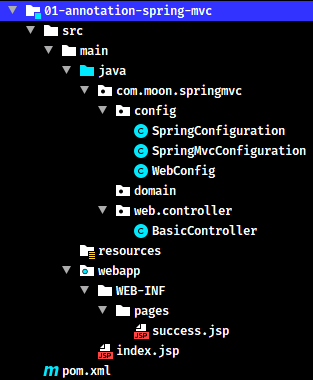

- 选择部署本案例的war包

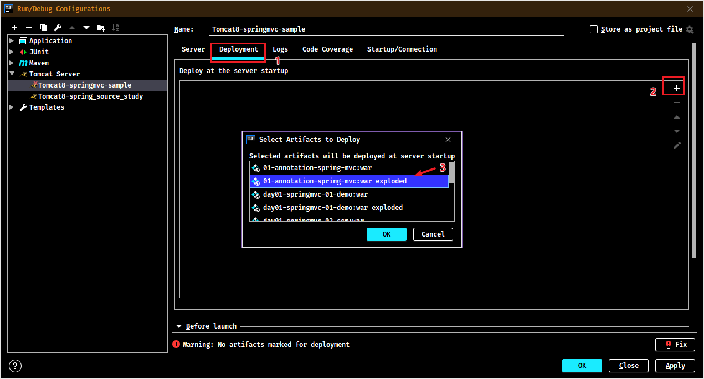

- 选择tomcat版本，修改VM options选择，让资源修改后进行重启

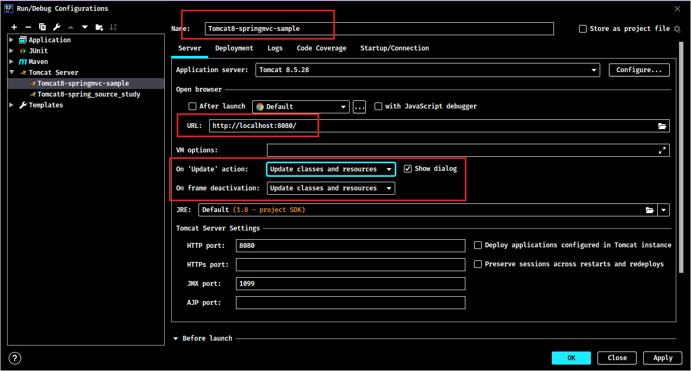

## 2. 入门案例执行过程分析

> 注：Spring MVC 案例执行过程分析详见《SpringMVC源码分析》

## 3. (!整理中)Spring MVC 注解汇总清单

> TODO: 整理中！在《SpringMVC注解汇总-相关表格.xlsx》中，整理完成后转为图片形式放入笔记

## 4. 注解示例源码说明

各个注解的详细说明与用法详见源码项目`spring-note\Spring-Framework`，使用示例详见`spring-note\springmvc-sample\05-spring-mvc-annotation\`

一些测试案例需要使用postman或者idea自带的Http Client这种请求工具来测试。示例项目中有idea的Http Client请求文件

# SpringMVC 基础注解

## 1. @Controller

`@Controller`注解是由`@Component`注解衍生出来。此注解用于修饰表现层控制器的。是spring框架的注解，非SpringMVC的注解，只是在web项目中，此注解会交给SpringMVC的容器管理

> 具体用法详见《Spring注解汇总.md》

## 2. @RequesetMapping

### 2.1. 作用与用法

- **作用**：用于建立请求URL和处理请求方法之间的对应关系
- **用法**：
    - **标识在类上**：请求URL的第一级访问目录。此处不写的话，就相当于应用的根目录。它出现的目的是为了使我们的URL可以按照模块化管理，使我们的URL更加精细
    - **标识在方法上**：请求URL的第二级访问目录
- 例如：
    - 账户模块：/account/add、/account/update、/account/delete、...
    - 订单模块：/order/add、/order/update、/order/delete、...

```java
@Controller
@RequesetMapping("account")
public class AccountController {
    @RequesetMapping("/add")
    public R add() {}
}

@Controller
@RequesetMapping("order")
public class OrderController {
    @RequesetMapping("/add")
    public R add() {}
}
```

### 2.2. 相关属性

|   属性名    |                                     作用                                     |                                                              取值/示例                                                              |
| :--------: | ---------------------------------------------------------------------------- | --------------------------------------------------------------------------------------------------------------------------------- |
|   `name`   | 给请求URL提供一个名称                                                           |                                                                                                                                   |
|  `value`   | 用于指定请求的URL。它和path属性的作用是一样的。                                      | 注意细节：在配置此属性时，写不写"/"都是可以的                                                                                              |
|   `path`   | 它是4.2版本中加入的注解，和value属性是一样的                                        |                                                                                                                                   |
|  `method`  | 用于指定请求的方式。                                                             | RequestMethod枚举指定的类型：GET, POST, HEAD, OPTIONS, PUT, PATCH, DELETE, TRACE                                                      |
|  `params`  | 用于指定限制请求参数的条件。它支持简单的表达式。要求请求参数的key和value必须和配置的一模一样 | `params = {"accountName"}`：表示请求参数必须有accountName<br/>`params = {"moeny!100"}`：表示请求参数中money不能是100                       |
| `consumes` | 用于指定可以接收的请求正文类型（MIME类型）                                          | `consumes = "text/plain"`<br/>`consumes = {"text/plain", "application/*"}`                                                        |
| `produces` | 用于指定可以生成的响应正文类型（MIME类型）                                          | `produces = "text/plain"`<br/>`produces = {"text/plain", "application/*"}`<br/>`produces = MediaType.APPLICATION_JSON_UTF8_VALUE` |

> **使用细节**：属性只要出现2个或以上时，他们的关系是“与”的关系。表示必须同时满足条件。*（name属性除外）*

### 2.3. 衍生注解

`@RequestMapping`的衍生注解是：`@GetMapping`、`@PostMapping`、`@PutMapping`、`@DeleteMapping`、`@PatchMapping`，其衍生的注解的基础用法与`@RequestMapping`一样。但有以下注意细节：

- 衍生注解只是将请求方式限定了，即没有与不用设置method属性，其他属性作用与用法与`@RequestMapping`一样
- <font color=red>**衍生注解只能标识在方法上，而`@RequestMapping`注解可以分别标识在类与方法上**</font>

### 2.4. 使用示例

```java
/**
 * 注解使用示例控制器 - @RequestMapping注解
 */
@Controller
/*
 * @RequestMapping标识在类上，代表url的一级访问目录
 * 目的是为了使URL可以按照模块化管理
 */
@RequestMapping("springmvc")
public class RequestMappingController {
    /**
     * @RequestMapping标识在方法上，代表url的二级访问目录
     */
    /*
     * value属性，用于指定请求的URL。如果只有value属性时，可省略不写属性名
     * value属性与path属性作用一样，path属性是4.2版本中加入
     * 注意细节：
     *      1. 在配置value属性时，写不写"/"效果都是一样
     *      2. 配置多个属性（name属性除外）时，它们之间是”与“的关系，即如果有一个属性不符合，则都不能请求成功
     */
    // @RequestMapping("/useRequestMapping")
    // @RequestMapping(path = "useRequestMapping")
    /*
     * name属性：用于标识当前请求URL，在使用AOP时，可以通过获取注解的name属性值来判断需要增加的方法
     * method属性：用于指定请求的方式，指定后必须符合此请求方式才能成功调用到此方法
     */
    // @RequestMapping(value = "useRequestMapping", name = "使用RequestMapping注解的请求映射",
    //         method = RequestMethod.POST)
    /*
     * params属性：指定限制请求参数的条件。示例表示请求时必须要有name属性，否则不能请求成功
     * headers属性：用于指定限制请求消息头的条件。示例表示请求时请求头必须要有Accept-Encoding与custom-auth属性，否则不能请求成功
     */
    // @RequestMapping(value = "useRequestMapping", method = RequestMethod.GET, params = {"name"},
    //         headers = {"Accept-Encoding", "custom-auth"})
    /*
     * @RequestMapping的衍生注解：
     *      @GetMapping、@PostMapping、@PutMapping、@DeleteMapping、@PatchMapping
     *      其衍生注解的属性与@RequestMapping一样，只是将请求方式限定了，即没有与不用设置method属性
     */
    @PostMapping(value = "useRequestMapping", params = {"name"}, headers = {"Accept-Encoding"})
    public String useRequestMapping() {
        System.out.println("RequestMappingController.useRequestMapping()方法执行了...");
        return "success";
    }
}
```

## 3. @RequestParam

### 3.1. 作用与用法

`@RequestParam` 是从请求正文中获取请求参数（包括请求上传文件），给控制器方法形参赋值的。参数值会被转换成声明方法形参的类型。

对于简单类型的参数值，当请求参数的名称和控制器方法形参变量名称一致时，此注解可省略。同时，当没有获取到请求参数时，此注解还可以给控制器方法形参提供默认值。

**注意：此注解只能出现在方法的参数上**

### 3.2. 相关属性

|     属性名      |                              作用                              |  取值/示例   |
| :------------: | ------------------------------------------------------------- | ---------- |
|    `value`     | 用于指定获取请求参数的名称。它和`name`属性的作用一样                   |            |
|     `name`     | 在4.2版本中加入的。和`value`属性互为引用                            |            |
|   `required`   | 指定参数是否请求时必须传递。默认值为true。当为true时，参数没有值时会报错； | true/false |
| `defaultValue` | 设置请求参数的默认值。如果传递则使用实际的参数值。如果不传递则使用默认值    |            |

### 3.3. 使用示例

```java
/**
 * 注解使用示例控制器 - @RequestParam注解
 */
@Controller
public class RequestParamController {
    /*
     * 基本类型和String类型的封装
     *  请求参数的名称与方法形参的名称一致即可
     */
    @RequestMapping("/useParam1")
    public String param1(String name, Integer age) {
        System.out.println("name is " + name + ", age is " + age);
        return "success";
    }

    /*
     * 实体类类型的封装
     *  注：只要实体类中的setXxx方法名称，去掉set后部分名称与请求参数的名称一致即可封装成功
     *      与属性的名称无关
     */
    @RequestMapping(value = "/useParam2")
    public String param2(User user) {
        System.out.println("user is " + user);
        return "success";
    }

    /*
     * @RequestParam注解的使用示例
     *  value与name（4.2版本引入）属性均为指定获取请求参数的名称，用于请求参数与方法名称不一致的情况
     *  required属性：指定参数是否必须有值，默认值为true。当为true时，参数没有值时会报错
     *  defaultValue属性：在参数没有值时的默认值
     */
    @RequestMapping("/useRequestParam")
    public String useRequestParam(@RequestParam(name = "currentPage", defaultValue = "10", required = false) int page) {
        System.out.println("当前页是：" + page);
        return "success";
    }
}
```

> 注：请求参数封装到实体类中，只需要实体类中的setXxx方法名称在去掉set后部分名称与请求参数的名称一致即可封装成功，与属性的名称无关

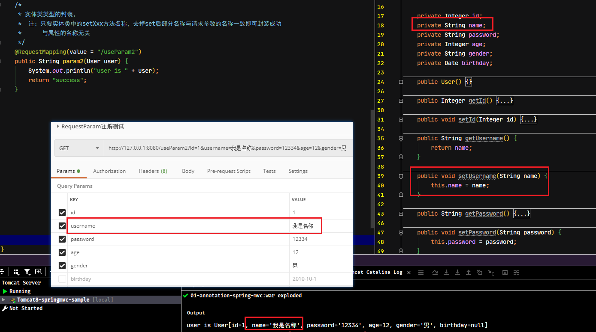

## 4. @PathVariable

### 4.1. 作用与用法

`@PathVariable` 注解用于获取请求 url 映射中占位符对应的值（*在`@RequestMapping`的`value`属性中，指定url的占位符，其占位符格式：“`{xxx}`”*），是 SpringMVC 框架支持 rest 风格 url 的标识。使用时有以下两个注意点：

- 如果使用`@PathVariable`注解修饰的方法的形参名称与占位符名称一致，则不需要指定value（或name）属性占位符名称
- 如果使用`@PathVariable`注解修饰的方法的形参名称与占位符名称不一致，则通过指定value（或name）属性占位符名称

### 4.2. 相关属性

|   属性名    |                                         作用                                         |  取值/示例   |
| :--------: | ----------------------------------------------------------------------------------- | ---------- |
|  `value`   | 指定url映射中占位符的名称                                                               |            |
|   `name`   | 4.3.3版本新加入的属性。作用和value一样                                                    |            |
| `required` | 4.3.3版本新加入的属性，用于指定是否必须有此占位符，默认值为true。当取默认值时，没有映射占位符则会报错 | true/false |

### 4.3. 使用示例

```java
/**
 * 注解使用示例控制器 - @PathVariable注解
 */
// @Controller
// @ResponseBody
@RestController // 等同于上面两个注解
@RequestMapping("user")
public class PathVariableController {
    /*
     * rest风格url - 保存方法
     */
    @RequestMapping(method = RequestMethod.POST)
    public String save(@RequestBody User user) {
        return "user is " + user;
    }

    /*
     * rest风格url - 更新方法
     *  在@RequestMapping中使用“{xxx}”占位符
     *  @PathVariable注解获取映射占位符的值，
     *  如果方法形参的名称与占位符一致，则可以直接映射值
     *
     */
    @RequestMapping(method = RequestMethod.PUT, value = "/{id}")
    public String update(@PathVariable Integer id, @RequestBody User user) {
        // 给user的id赋值
        user.setId(id);
        return "user is " + user;
    }

    /*
     * rest风格url - 删除方法
     * @PathVariable注解获取映射占位符的值，
     * 如果方法形参的名称与占位符不一致，则设置value与name属性值，指定url映射中占位符的名称
     */
    @RequestMapping(method = RequestMethod.DELETE, value = "/{userId}")
    public String delete(@PathVariable("userId") Integer id) {
        return "删除用户的Id是：" + id;
    }

    /*
     * rest风格url - 根据id查询方法
     * @PathVariable注解的required属性，用于指定是否必须有此占位符
     *  默认值为true，即没有映射占位符的值时会报错
     */
    @RequestMapping(method = RequestMethod.GET, value = "/{id}")
    public String findById(@PathVariable(value = "id", required = false) Integer id) {
        return "查询用户的Id是：" + id;
    }
}
```

## 5. @InitBinder

### 5.1. 作用与用法

`@InitBinder`用于初始化请求参数的数据绑定器。如请求参数有日期字符串的数据，是无法直接绑定到实体类中的`Date`属性，此时就需要使用该注解来初始化一些数据的转换器，转换成相应的类型封装到实体类中

> <font color=red>**注意点：在某个Controller控制类中使用了`@InitBinder`注解进行数据转换绑定，只能对当前控制类生效，其他的控制类是不起作用**</font>

### 5.2. 相关属性

|  属性名  |          作用          | 取值/示例 |
| :-----: | --------------------- | -------- |
| `value` | 指定给哪些参数进行绑定操作 |          |

### 5.3. 使用示例

示例需求：将请求参数中的日期字符串转成日期类型，封装到对象属性中

```java
/**
 * 注解使用示例控制器 - @InitBinder注解
 */
@Controller
public class InitBinderController {
    /*
     * @InitBinder注解的使用示例
     */
    @RequestMapping("/useInitBinder")
    public String useInitBinder(User user) {
        System.out.println("user is " + user);
        return "success";
    }

    /*
     * 通过@InitBinder初始化请求参数的数据绑定器
     *  注解只有value属性：用于指定给哪些参数进行绑定操作
     *  如果什么都不指定，只会将当前控制器类中所有方法的形参实体类进行初始化绑定
     *
     * 注意点：在某个Controller控制类中使用了`@InitBinder`注解进行数据转换绑定，只能对当前控制类生效，其他的控制类是不起作用
     */
    @InitBinder({"user", "otherParams"})
    // @InitBinder
    public void initBinder(WebDataBinder webDataBinder) {
        // 初始化请求参数中日期字符串转成日期Date对象
        webDataBinder.addCustomFormatter(new DateFormatter("yyyy-MM-dd"));
    }
}
```

### 5.4. 扩展注解 @DateTimeFormat

还一种方法实现上面的效果，在 Spring MVC 配置类`SpringMvcConfiguration.java`中增加 `@EnableWebMvc` 注解，开启 Spring MVC 配置

```java
@Configuration
@ComponentScan("com.moon.springmvc.web")
// 开启对SpringMVC的注解支持，该注解会引入DelegatingWebMvcConfiguration配置类，该类会创建很功能增强的对象
@EnableWebMvc
public class SpringMvcConfiguration {
    ....
}
```

然后在相应封装的实体类中，增加日期转换的注解`@DateTimeFormat(pattern = "yyyy-MM-dd")`，即可实现同样的效果。

```java
public class User implements Serializable {
    ....
    /* 日期转换器，需要在配置类中标识@EnableWebMvc注解开启SpringMVC注解的支持 */
    @DateTimeFormat(pattern = "yyyy-MM-dd")
    private Date birthday;
    ....
}
```

**总结**：使用`@InitBinder`注解初始化数据转换绑定器，可以自定义一些绑定规则，功能强大，但缺点就是只在作用于当前标识此注解的控制类，其他控制类不起作用。

而使用`@DateTimeFormat`注解进行日期的转换，作用的范围比较大，凡是用到当前对象的都可以实现转换的效果，但缺点就是功能单一。

## 6. @ControllerAdvice

### 6.1. 作用与用法


`@ControllerAdvice`，是 Spring 3.2 版本提供的新注解，用于给控制器提供一个增强的通知。以保证可以在多个控制器之间实现增强共享。

**使用`@ControllerAdvice`，不用任何的配置，只要把这个类放在项目中配置了Spring包扫描的位置（`<context:component-scan>`或`@ComponentScan`），就可以实现全局异常的回调。值得注意：增强通知功能只对标识`@Controller`注解的控制类生效**。

> Tips: 此注解一般配合`@ExceptionHandler`使用，作为全局的异常处理器，此注解的作用是当出现其定义的异常时进行处理的方法，其可以使用 SpringMVC 提供的数据绑定，比如注入 `HttpServletRequest` 等，还可以接受一个当前抛出的 `Throwable` 对象。

官方定义说明：

> - `@ControllerAdvice`是一个`@Component`，与`@ExceptionHandler`，`@InitBinder`和`@ModelAttribute` 等注解配合使用，适用于所有使用`@RequestMapping`方法。
> - Spring 4 之前，`@ControllerAdvice`在同一调度的 Servlet 中协助所有控制器。Spring 4 已经改变：`@ControllerAdvice`支持配置控制器的子集，而默认的行为仍然可以利用。
> - 在 Spring 4 中，`@ControllerAdvice`通过`annotations()`, `basePackageClasses()`, `basePackages()`方法定制用于选择控制器子集。

### 6.2. 相关属性

|        属性名         |                         作用                          | 取值/示例 |
| :------------------: | ---------------------------------------------------- | -------- |
|       `value`        | 用于指定对哪些包下的控制器进行增强，与basePackages属性作用一样 |          |
|    `basePackages`    | 用于指定对哪些包下的控制器进行增强，与value属性作用一样        |          |
| `basePackageClasses` | 用于指定特定的类型，给该类型所在的包及其子包的所有类提供增强     |          |
|  `assignableTypes`   | 用于指定特定的类型提供增强                                 |          |
|    `annotations`     | 用于指定给特定注解提供增强                                 |          |

### 6.3. 基础使用示例

```java
/**
 * 全局异常处理器 也可以将 @ControllerAdvice 和 @ResponseBody 换成 @RestControllerAdvice
 */
@ControllerAdvice
@ResponseBody
public class GlobalExceptionHandler {

    private static final Logger log = LoggerFactory.getLogger(GlobalExceptionHandler.class);

    /**
     * 权限校验失败 如果请求为ajax返回json，普通请求跳转页面
     */
    @ExceptionHandler(AuthorizationException.class)
    public Object handleAuthorizationException(HttpServletRequest request, AuthorizationException e) {
        log.error(e.getMessage(), e);
        if (ServletUtils.isAjaxRequest(request)) {
            return AjaxResult.error(PermissionUtils.getMsg(e.getMessage()));
        } else {
            ModelAndView modelAndView = new ModelAndView();
            modelAndView.setViewName("/error/unauth");
            return modelAndView;
        }
    }

    /**
     * 请求方式不支持
     */
    @ExceptionHandler({HttpRequestMethodNotSupportedException.class})
    public AjaxResult handleException(HttpRequestMethodNotSupportedException e) {
        log.error(e.getMessage(), e);
        return AjaxResult.error("不支持' " + e.getMethod() + "'请求");
    }

    /**
     * 拦截未知的运行时异常
     */
    @ExceptionHandler(RuntimeException.class)
    public AjaxResult notFount(RuntimeException e) {
        log.error("运行时异常:", e);
        return AjaxResult.error("运行时异常:" + e.getMessage());
    }

    /**
     * 系统异常
     */
    @ExceptionHandler(Exception.class)
    public AjaxResult handleException(Exception e) {
        log.error(e.getMessage(), e);
        return AjaxResult.error("服务器错误，请联系管理员");
    }

    /**
     * 业务异常
     */
    @ExceptionHandler(BusinessException.class)
    public AjaxResult businessException(BusinessException e) {
        log.error(e.getMessage(), e);
        return AjaxResult.error(e.getMessage());
    }
}
```

*注：AjaxResult.error是自定义的一个方法，封装了一个返回的map，用来返回前端是一个json对象*

### 6.4. 配合 @InitBinder 注解使用示例

示例需求：实现全局所有控制器的请求日期字符串转成日期类型封装到实体类中，*将上面的`@InitBinder`示例的逻辑移动到`@ControllerAdvice`的增强通知类中即可*

- 创建自定义注解`CustomAnnotation`，用于测试`@ControllerAdvice`的`annotations`属性。并在标识需要增强的控制类上

```java
/**
 * 自定义注解，用于测试 @ControllerAdvice 的 指定特定注解增强的属性 annotations
 */
@Target(ElementType.TYPE)
@Retention(RetentionPolicy.RUNTIME)
@Documented
public @interface CustomAnnotation {
    String value() default "";
}
```

```java
@Controller
@CustomAnnotation
public class InitBinderController {
    ....
}
```

- 创建控制器增强通知类

```java
/**
 * 注解使用示例通知控制器增强 - @ControllerAdvice注解
 */
/* 标识当前类为增强通知类，可以增强指定或者所有控制类（配置包扫描时所包含的范围） */
// @ControllerAdvice // 增强所有能扫描到的控制类

/*
 * value属性basePackages属性作用一样，可以指定哪些包下的控制器进行增强
 *      示例：增强com.moon.springmvc.web包及其子包下的所有控制类
 */
// @ControllerAdvice(basePackages = {"com.moon.springmvc.web"})

/*
 * basePackageClasses属性：用于指定特定的类型，给该类型所在的包及其子包的所有类提供增强
 *      示例：给BasicController所在的包及其子包的所有类提供增强
 */
// @ControllerAdvice(basePackageClasses = BasicController.class)

/*
 * assignableTypes属性：用于指定特定的类型提供增强
 *      示例：给InitBinderController类提供增强
 */
// @ControllerAdvice(basePackageClasses = InitBinderController.class)

/*
 * annotations属性：用于指定给特定注解提供增强
 *      示例：给标识了自定义@CustomAnnotation注解的控制类提供增强
 */
@ControllerAdvice(annotations = CustomAnnotation.class)
public class InitBinderAdvice {
    /* 配置@InitBinder注解使用，对所有控制进行请求数据绑定的初始化 */
    @InitBinder
    public void initBinder(WebDataBinder webDataBinder) {
        // 初始化请求参数中日期字符串转成日期Date对象
        webDataBinder.addCustomFormatter(new DateFormatter("yyyy-MM-dd"));
    }
}
```

### 6.5. 配合 @ModelAttribute 注解使用示例（未整理）

> TODO: 待整理

## 7. @RequestHeader

### 7.1. 作用与用法

`@RequestHeader`注解是从请求消息头中获取消息头的值，并把值赋给控制器方法形参

**注意：此注解只能出现在方法的参数上**

### 7.2. 相关属性

|     属性名      |                               作用                                |  取值/示例   |
| :------------: | ---------------------------------------------------------------- | ---------- |
|    `value`     | 用于指定请求消息头的名称。它和name属性作用一样                            |            |
|     `name`     | 在4.2版本中加入的。和value属性互为引用                                 |            |
|   `required`   | 用于指定是否必须有此消息头。默认值为true，当为true时，请求没有此消息头时会报错 | true/false |
| `defaultValue` | 用于指定消息头的默认值                                                |            |

### 7.3. 使用示例

```java
/**
 * 注解使用示例控制器 - @RequestHeader注解
 */
@Controller
public class RequestHeaderController {
    @RequestMapping("/useRequestHeader")
    /*
     * @RequestHeader 注解是从请求消息头中获取消息头的值，并把值赋给控制器方法形参
     *  注：只能用于方法形参上
     *  value属性与name属性：用于指定请求消息头的名称
     *  required属性：用于指定是否必须有此消息头。默认值为true，表示必须有此消息头，否则请求报错
     *  defaultValue属性：用于指定请求没此消息头时，给相应的方法形参设置此默认值
     */
    public String useRequestHeader(@RequestHeader(value = "Accept-Language", required = false, defaultValue = "test") String header) {
        System.out.println("Accept-Language:" + header);
        return "success";
    }
}
```

## 8. @CookieValue

### 8.1. 作用与用法

`@RequestHeader`注解是从请求消息头中获取Cookie的值，并把值赋给控制器方法形参

**注意：此注解只能出现在方法的参数上**

### 8.2. 相关属性

|     属性名      |                             作用                              |  取值/示例   |
| :------------: | ------------------------------------------------------------ | ---------- |
|    `value`     | 用于指定cookie的名称。它和name属性作用一样                          |            |
|     `name`     | 在4.2版本中加入的。和value属性互为引用                             |            |
|   `required`   | 用于指定是否必须有cookie。默认值为true。当为true时，没有cookie会报错。 | true/false |
| `defaultValue` | 用于指定cookie不存在时，将默认值赋值给形参                           |            |

### 8.3. 使用示例

```java
/**
 * 注解使用示例控制器 - @CookieValue注解
 */
@Controller
public class CookieValueController {
    @RequestMapping("/useCookieValue")
    /*
     * @CookieValue 注解是从请求消息头中获取Cookie的值，并把值赋给控制器方法形参
     *  注：只能用于方法形参上
     *  value属性与name属性：用于指定请求cookie的名称
     *  required属性：用于指定是否必须有此cookie。默认值为true，表示必须有此cookie，否则请求报错
     *  defaultValue属性：用于指定请求没此cookie时，给相应的方法形参设置此默认值
     */
    public String useCookieValue(@CookieValue(value = "springmvc_sample", required = false,
            defaultValue = "give me defaultValue!") String myCookie) {
        System.out.println(myCookie);
        return "success";
    }
}
```

## 9. @ModelAttribute

### 9.1. 作用与用法

`@ModelAttribute`注解可以用于修饰方法，或者是参数

- 当修饰方法时，表示执行控制器方法之前，被此注解修饰的方法都会执行
- 当修饰参数时，用于获取指定的数据给参数赋值

### 9.2. 相关属性

|   属性名   |                                                                       作用                                                                       |  取值/示例   |
| :-------: | ----------------------------------------------------------------------------------------------------------------------------------------------- | ---------- |
|  `value`  | 指定的是Model存入时的key<br/>当注解写在方法上，则表示存入时的名称。（值是方法的返回值）<br/>当注解写在参数上，可以从ModelMap、Model、Map中的获取数据。（前提是之前存入过） |            |
|  `name`   | 4.3版本收入，与value属性作用一样                                                                                                                     |            |
| `binding` | 用于指定是否支持数据绑定，默认值true。它是4.3版本中新加入的属性                                                                                            | true/false |

### 9.3. 使用示例

```java
/**
 * 注解使用示例控制器 - @ModelAttribute注解
 */
@Controller
public class ModelAttributeController {
    /*
     * @ModelAttribute修饰方法时，表示执行控制器所有方法之前，先执行此注解修饰的方法
     *  获取@ModelAttribute修饰方法时对请求参数的处理值方式1：
     *      1. 在方法形参上增加Modal对象，
     *      2. 将处理的参数设置到Model对象中，对象的key-value的map结构
     */
    /*@ModelAttribute
    public void showModel(String name, Model model) {
        System.out.println("showModel method name is " + name);
        name = "[" + name + "]";
        model.addAttribute("username", name);
    }*/

    /*
     * @ModelAttribute修饰方法时，表示执行控制器所有方法之前，先执行此注解修饰的方法
     *  获取@ModelAttribute修饰方法时对请求参数的处理值方式2：
     *      1. @ModelAttribute设置value或name属性值，该值为存入Model对象时的key
     *      2. 然后在方法中返回需要存入的值
     */
    @ModelAttribute("username")
    public String showModel(String name) {
        System.out.println("showModel method name is " + name);
        return "[" + name + "]";
    }

    @RequestMapping("/useModelAttribute")
    /*
     * @ModelAttribute修饰方式形参时，用于获取指定的数据给参数赋值
     *  无论使用方式1或者方式2，都可以通过@ModelAttribute注解指定存入时的key，从而绑定处理后的值
     */
    public String useModelAttribute(@ModelAttribute("username") String name) {
        System.out.println("controller method name is " + name);
        return "success";
    }
}
```

## 10. @SessionAttribute 和 @SessionAttributes

### 10.1. 作用与用法

- `@SessionAttribute`注解用于方法形参上，作用是从会话域中获取数据，相当于`HttpSession`的`getAttribute`方法
- `@SessionAttributes`注解用于类或者接口上，作用是把数据存入会话域，相当于`HttpSession`的`setAttribute`方法

### 10.2. 相关属性

#### 10.2.1. @SessionAttribute 属性

|   属性名    |                                 作用                                 |  取值/示例   |
| :--------: | ------------------------------------------------------------------- | ---------- |
|  `value`   | 用于指定在会话域中数据的名称。它和name属性作用一样                           |            |
|   `name`   | 和value属性互为引用                                                    |            |
| `required` | 用于指定是否必须从会话域中获取到数据。默认值是true，表示如果指定名称不存在会报错。 | true/false |

#### 10.2.2. @SessionAttributes  属性

|  属性名  |                   作用                   | 取值/示例 |
| :-----: | --------------------------------------- | -------- |
| `value` | 指定可以存入会话域中的名称。它和name属性作用一样 |          |
| `names` | 4.2版本中加入的属性。作用和value是一样         |          |
| `types` | 指定可以存入会话域中的数据类型。               |          |


### 10.3. 使用示例

- 测试代码

```java
/**
 * 注解使用示例控制器 - @SessionAttribute与@SessionAttributes注解
 */
@Controller
/*
 * @SessionAttributes注解是用于将数据存入会话域
 *   value或者names属性：指定存入时的名称。本示例只往session域存入“username”、“age”
 *   types属性：指定可以存入会话域中的数据类型。（暂时没有看出来有什么作用）
 */
@SessionAttributes(names = {"username", "age"}, types = {Integer.class}) // 或 @SessionAttributes({"username", "age"})
public class SessionAttributesController {
    /*
     * 往session域中存入数据请求
     *  注：在没有@SessionAttributes注解时，当控制器方法的参数有Model或ModelMap时，是默认往请求域中存入数据
     *  Model是spring提供的一个接口，该接口有一个实现类ExtendedModelMap类继承了ModelMap，而ModelMap就是LinkedHashMap子类
     */
    @RequestMapping("/useSessionAttributes")
    public String useSessionAttributes(Model model) {
        model.addAttribute("username", "石原里美");
        model.addAttribute("password", "123456");
        model.addAttribute("age", "18");
        // 跳转之前将数据保存到username、password和age中，因为注解@SessionAttribute中有这几个参数
        return "success";
    }

    /*
     * 从session域中获取数据请求
     *  @SessionAttribute注解用于从session域中获取数据，value或者name属性获取数据的名称
     *  required属性：用于指定是否必须从会话域中获取到数据。默认值是true，表示如果指定名称不存在会报错
     */
    @RequestMapping("/useSessionAttribute")
    public String useSessionAttribute(@SessionAttribute(value = "username", required = false) String username,
                                      @SessionAttribute(value = "age", required = false) Integer age,
                                      HttpServletRequest request) {
        System.out.println("username: " + username);
        System.out.println("age: " + age);
        System.out.println("request attribute username: " + request.getAttribute("username"));
        System.out.println("request attribute age: " + request.getAttribute("age"));
        return "success";
    }
}
```

- 测试页面success.jsp

```jsp
请求域username：<%=request.getAttribute("username")%><br/>
请求域password：<%=request.getAttribute("password")%><br/>
请求域age：<%=request.getAttribute("age")%>
<hr/>
会话域username：<%=session.getAttribute("username")%><br/>
会话域password：<%=session.getAttribute("password")%><br/>
会话域age：<%=session.getAttribute("age")%>
```

测试存入session域结果

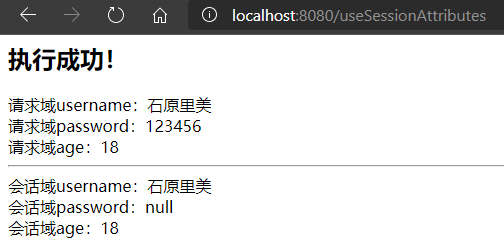

测试获取session域结果

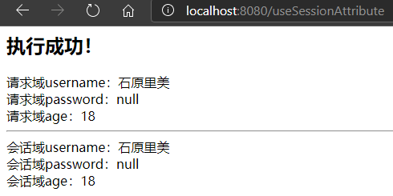

后台输出结果

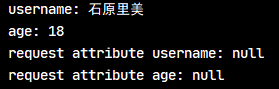

## 11. @ExceptionHandler

### 11.1. 作用与用法

`@ExceptionHandler` 注解用于修饰控制器类的方法，表明当前方法是该控制器执行产生异常后的处理方法

### 11.2. 相关属性

|  属性名  |          作用          | 取值/示例 |
| :-----: | --------------------- | -------- |
| `value` | 指定用于需要捕获的异常类型 |          |

### 11.3. 基础使用示例

- 在控制器类中使用 `@ExceptionHandler` 标识方法（方法名随意），如当前控制器相关请求方法出现异常时，就会触发该注解的方法

```java
@Controller
public class SimpleController {

    // ...

    @ExceptionHandler
    public ResponseEntity<String> handle(IOException ex) {
        // ...
    }
}
```

- 对于匹配的异常类型，最好将目标异常作为方法参数来声明（如上示例）。当多个异常方法匹配时，一般都是定义其根异常。
- 可以通过注解的属性，缩小要匹配的异常类型的范围。此时方法的参数也可以使用更大范围通用的异常类型

```java
@ExceptionHandler({FileSystemException.class, RemoteException.class})
public ResponseEntity<String> handle(Exception ex) {
    // ...
}
```

### 11.4. 配合 @ControllerAdvice 全局异常处理示例

- 创建自定义异常类

```java
public class CustomException extends RuntimeException {
    private String message;

    public CustomException(String message) {
        this.message = message;
    }

    @Override
    public String getMessage() {
        return message;
    }
}
```

- 创建错误展示页面error.jsp

```jsp
<body>
<h2>执行失败！</h2>
<h4>${errorMsg}</h4>
</body>
```

- 创建全局的异常处理增强通知类，配置`@ControllerAdvice`使用

```java
/**
 * 全局异常处理增强通知
 */
@ControllerAdvice
public class ExceptionHandlerAdvice {
    /*
     * @ExceptionHandler注解是用于标识当前方法用于处理控制器执行所产生的异常
     *      value属性是指定哪些异常类型需要捕获
     */
    @ExceptionHandler(Exception.class)
    public String handleException(Model model, Exception e) {
        String errorMsg;
        // 判断Exception的类型是不是CustomException
        if (e instanceof CustomException) {
            errorMsg = e.getMessage();
        } else {
            // 系统异常
            errorMsg = "服务器内部错误，请联系管理员！";
        }
        // 将错误的信息加到请求域中
        model.addAttribute("errorMsg", errorMsg);
        // 跳转错误页面
        return "error";
    }
}
```

- 测试控制类

```java
/**
 * 注解使用示例控制器 - @ExceptionHandler注解 */
@Controller
public class ExceptionHandlerController {
    @RequestMapping("/useExceptionHandler")
    public String useExceptionHandler(Integer age) {
        if (age == null) {
            throw new NullPointerException();
        }
        if (age > 100) {
            throw new CustomException("年龄不合法!");
        }
        System.out.println("年龄是：" + age);
        return "success";
    }
}
```

# JSON 数据交互相关注解

## 1. @RequestBody

### 1.1. 作用与用法

`@RequestBody` 注解用于修饰方法的形参，用于获取全部的请求体数据。<font color=red>**注：此注解主要是获取请求体的数据，并没有将json数据封装到实体对象的功能，具体由第三方的json组件或者自定义json转换来实现。**</font>

GET 请求方式无请求体，所以使用 `@RequestBody` 无法接收数据，前端需要使用 POST 方式进行提交。

### 1.2. 相关属性

|   属性名    |                         作用                         |  取值/示例  |
| :--------: | ---------------------------------------------------- | ---------- |
| `required` | 用于指定是否必须有请求体，默认值true，表示请求必须有请求体 | true/false |

### 1.3. 使用示例

Spring MVC默认只能获取请求类型为“`Content-Type: application/form-data`”或者“`Content-Type: application/x-www-form-urlencoded`”并绑定到方法形参中

如果数据是在请求体中“`Content-Type: application/json`”，则无法绑定到方法形参中

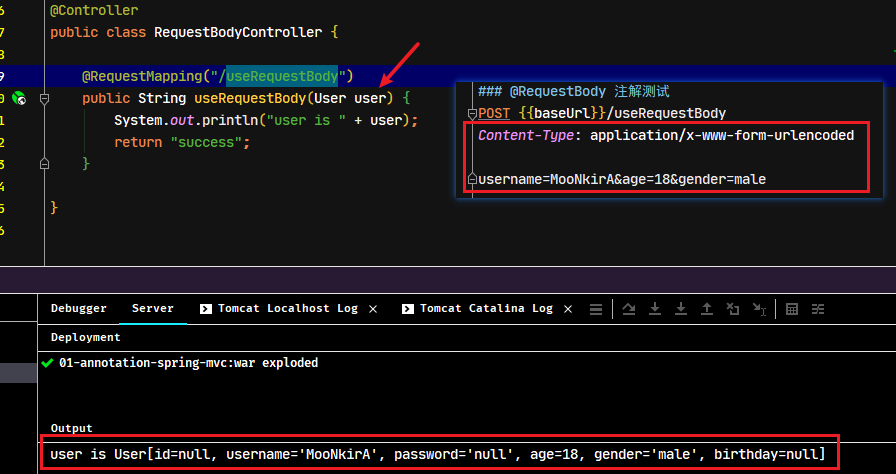

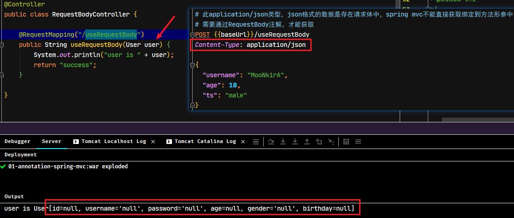

通过`@RequestBody`注解，可以获取请求体的参数，并绑定到方法形参中

```java
/**
 * 注解使用示例控制器 - @RequestBody注解
 */
@Controller
public class RequestBodyController {
    @RequestMapping("/useRequestBody")
    /*
    * Spring MVC默认能绑定到方法形参的请求类型为
    *   “Content-Type: application/form-data”或者“Content-Type: application/x-www-form-urlencoded”
    * 如果数据是在请求体中“`Content-Type: application/json`”，则无法绑定到方法形参中
    * @RequestBody注解用于获取全部的请求体数据
    *   required属性：用于指定是否必须有请求体，默认值为true，请求中必须有请求体
    */
    public String useRequestBody(@RequestBody(required = false) String user) {
        System.out.println("user is " + user);
        return "success";
    }
}
```

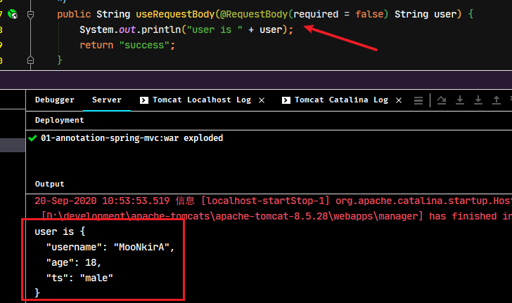

要实现将请求体的json数据封装到实体对象中，需要配置使用第三方json处理类库或者自定义实现，此示例使用jackson作为json处理框，具体配置详见*《其他 2. spring MVC实现JSON数据封装成对象》*

```java
/*
 * @RequestBody注解没有实现将json数据封装到实体类中的功能，需要借助第三JSON处理类库或者自定义实现
 *  此示例引入jackson作为json数据处理框架，详情配置参考pom.xml与SpringMvcConfiguration
 */
@RequestMapping("/useRequestBody")
public String useRequestBody(@RequestBody User user) {
    System.out.println("user is " + user);
    return "success";
}
```

### 1.4. @RequestBody 扩展内容

#### 1.4.1. @RequestBody 和 @RequestParam 的用法比较

1. 当同时使用 `@RequestParam` 和 `@RequestBody` 时，`@RequestParam` 指定的参数可以是普通元素、数组、集合、对象等等
	- 接收机制不一样。`@RequestBody` 接收的是**请求体里面的数据**；而 `@RequestParam` 接收的是**key-value 里面的参数**，所以它会被切面进行处理从而可以用普通元素、数组、集合、对象等接收
	- 如果参数时放在请求体中，传入后台的话，那么后台要用 `@RequestBody` 才能接收到；如果不是放在请求体中的话，那么后台接收前台传过来的参数时，要用 `@RequestParam` 来接收，或则形参前什么也不写也能接收
2. 如果参数前写了 `@RequestParam(xxx)`，那么前端请求时必须上送对应的xxx名字(不管其是否有值，当然可以通过设置该注解的 `required` 属性来调节是否必须传)的请求参数，如果无上送该名称的参数，请求会报 400 的错误
3. 如果参数前不写 `@RequestParam(xxx)` 的话，前端上送的参数如果有xxx名的话，那么就会自动匹配；没有的话，请求也能正确发送
	- 扩展：这里与 feign 消费服务时不同；feign 消费服务时，如果参数前什么也不写，那么会被默认是 `@RequestBody` 的
4. 在同一个接收请求方法中，`@RequestBody` 与 `@RequestParam` 可以同时使用，此时原 Spring MVC 接收参数的机制不变。`@RequestBody` 最多只能有一个，而 `@RequestParam` 可以有多个

#### 1.4.2. @RequestBody 修饰的对象接收数据的注意问题

如果后端参数是一个对象，且该参数前是以 `@RequestBody` 修饰的，那么前端传递 json 参数时，必须满足以下要求

1. `@RequestBody` 注解对应的类在将 HTTP 的输入流(含请求体)装配到目标类(即：`@RequestBody` 后面的类)时，会根据 json 字符串中的 key 来匹配对应实体类的属性，如果匹配一致且 json 中的该 key 对应的值符合(或可转换为)，实体类的对应属性的类型要求时，会调用实体类的 setter 方法将值赋给该属性。
2. json 字符串中，如果 value 为 `""` 空字符串的话，后端对应属性如果是 `String` 类型的，那么接受到的就是 `""`，如果是后端属性的类型是 `Integer`、`Double` 等类型，那么接收到的值为 null
3. json 字符串中，如果 value 为 null 的话，后端对应收到的值为 null
4. 如果某个参数没有 value 的话，在传 json 字符串给后端时，要么干脆就不把该字段写到 json 字符串中；要么写 value 时，必须有值，`null` 或 `""` 均可。千万不能有类似『`"stature":`』的写法

## 2. @ResponseBody

### 2.1. 作用与用法

`@ResponseBody`注解用于使用流输出响应正文（数据），可以标识在类、方法上

- 标识在类上，代表当前类所有方法都使用流输出响应正文（数据）
- 标识在方法返回值前或者方法上，代表当前方法使用流输出响应正文（数据）

### 2.2. 相关属性

无

### 2.3. 使用示例

```java
/**
 * 注解使用示例控制器 - @ResponseBody注解 */
@Controller
/* @ResponseBody标识在类上，代表当前类所有方法都使用流输出响应正文（数据） */
@ResponseBody
public class ResponseBodyController {
    @RequestMapping("/useRequestBodyOnMethod")
    /* @ResponseBody标识在方法返回值前，代表当前方法使用流输出响应正文（数据） */
    @ResponseBody
    public String useRequestBodyOnMethod() {
        return "success! use @ResponseBody at method";
    }

    @RequestMapping("/useResponseBodyOnClass")
    public String useResponseBodyOnClass() {
        return "use @ResponseBody at class";
    }
}
```

## 3. @RestController

### 3.1. 作用与用法

`@RestController`注解只标识在类或接口上，相当于`@Controller`+`@ResponseBody`，它同时具备以上两个注解的全部功能

### 3.2. 相关属性

相关属性用法与说明，参照`@Controller`注解

### 3.3. 使用示例

```java
/**
 * 注解使用示例控制器 - @RestController注解
 */
/* @RestController注解相当于 @Controller + @ResponseBody，它同时具备以上两个注解的全部功能 */
@RestController
public class RestControllerController {
    @RequestMapping("/useRestController")
    public String useRestController() {
        return "use @RestController to response";
    }
}
```

## 4. @RestControllerAdvice

### 4.1. 作用与用法

`@RestControllerAdvice` 是 Spring 4.3 版本提供的新注解，是`@ControllerAdvice`与`@ResponseBody`的组合体。它同时具备以上两个注解的全部功能

### 4.2. 相关属性

相关属性用法与说明，参照`@ControllerAdvice`注解

### 4.3. 使用示例

- 创建一个测试使用控制器

```java
/**
 * 注解使用示例控制器 - @RestControllerAdvice注解
 */
@Controller
public class RestControllerAdviceController {
    @RequestMapping("/useRestControllerAdvice")
    public void useRestControllerAdvice() {
        throw new CustomException("use @RestControllerAdvice to catch CustomException");
    }
}
```

- 修改原来全局异常处理类，增加测试`@RestControllerAdvice`注解效果的方法

```java
/* @RestControllerAdvice注解相当于 @ControllerAdvice + @ResponseBody，它同时具备以上两个注解的全部功能 */
@RestControllerAdvice(assignableTypes = {RestControllerAdviceController.class}) // 测试 @RestControllerAdvice 注解专用
public class ExceptionHandlerAdvice {
    // 此异常捕获方法专用于测试 @RestControllerAdvice 注解
    @ExceptionHandler(CustomException.class)
    public String handleException(CustomException e) {
        // 直接使用流输出返回错误信息
        return e.getMessage();
    }
}
```

# 跨域访问

## 1. 关于跨域访问

跨域访问即跨站 HTTP 请求(Cross-site HTTP request)，它是指发起请求的资源所在域不同于该请求所指向资源所在的域的 HTTP 请求

比如说，域名A(http://www.moon.example)的某 Web 应用程序中通过标签引入了域名B(http://www.moon.foo)站点的某图片资源(http://www.moon.foo/image.jpg)，域名A的那 Web 应用就会导致浏览器发起一个跨站 HTTP 请求。

在 Web 开发中，使用跨站 HTTP 请求加载各类资源（包括CSS、图片、JavaScript 脚本以及其它类资源），已经成为了一种普遍且流行的方式。

## 2. @CrossOrigin

### 2.1. 作用与用法

`@CrossOrigin`注解用于指定是否支持跨域访问

### 2.2. 相关属性

|       属性名        |                                                                    作用                                                                    |     取值/示例     |
| :----------------: | ----------------------------------------------------------------------------------------------------------------------------------------- | --------------- |
|     `origins`      | 所有支持域的集合，例如"http://domain1.com"。这些值都显示在请求头中的Access-Control-Allow-Origin。"`*`"代表所有域的请求都支持。如果没有定义，所有请求的域都支持 |                 |
|      `value`       | 和origins属性一样                                                                                                                           |                 |
|  `allowedHeaders`  | 允许请求头中的header，默认都支持                                                                                                               | String[]        |
|  `exposedHeaders`  | 响应头中允许访问的header，默认为空                                                                                                              | String[]        |
|     `methods`      | 用于指定支持的HTTP请求方式列表                                                                                                                 | RequestMethod[] |
| `allowCredentials` | 是否允许cookie随请求发送，使用时必须指定具体的域                                                                                                   |                 |
|      `maxAge`      | 预请求的结果的有效期。默认值是：1800秒 (30分钟)                                                                                                   | long类型值       |


### 2.3. 使用示例

> 创建一个新的web工程，用于发送ajax请求测试。工程代码详见`springmvc-sample-annotation\01-crossorigin-test`

#### 2.3.1. 创建跨域测试的控制器

在示例工程创建新的控制类

```java
/**
 * 注解使用示例控制器 - @CrossOrigin注解
 */
@Controller
public class CrossOriginController {
    /*
     * 跨域访问的定义：
     *   当一个域名请求另一个域名的资源时，即是跨域
     *   怎么是不同的域？协议，主机，端口任何一个元素不相同都为不同的域，请求访问即为跨域
     * 本地测试模拟域名：
     *   查找C:/Windows/System32/drivers/ect/hosts（文件）
     *   修改此文件，建立IP和域名的对应关系
     * 刷新域名不重启计算机的命令，打开cmd命令行输入：：
     *   ipconfig /displaydns
     *   ipconfig /flushdns
     *
     * 定义跨域请求访问的测试方法
     */
    @RequestMapping("/useCrossOrigin")
    @ResponseBody
    public String useCrossOrigin(@RequestBody(required = false) User user) {
        return "user is " + user;
    }
}
```

#### 2.3.2. 使用过滤器的方式实现跨域访问

```
Access to XMLHttpRequest at 'http://www.moon.com:8080/useCrossOrigin' from origin 'http://www.moon.com:8085' has been blocked by CORS policy: Response to preflight request doesn't pass access control check: No 'Access-Control-Allow-Origin' header is present on the requested resource.
```

从控制的报错信息分析得到结论，响应无法返回，原因是缺少了相关header信息

- 创建自定义过滤器

```java
/**
 * 自定义过滤器，用于解决跨域请求的问题
 * <p>注：自定义过滤器需要实现Filter接口，并且在web配置类中的onStartup方法将其注册到web容器，才能生效
 */
public class CrossOriginFilter implements Filter {
    @Override
    public void init(FilterConfig filterConfig) throws ServletException {}

    /**
     * 过滤处理的逻辑
     */
    @Override
    public void doFilter(ServletRequest req, ServletResponse res, FilterChain chain) throws IOException, ServletException {
        try {
            // 1. 强制带http协议的请求与响应对象
            HttpServletRequest request = (HttpServletRequest) req;
            HttpServletResponse response = (HttpServletResponse) res;
            System.out.println("解决跨域的过滤器CrossOriginFilter执行了...");

            // 2. 设置response的响应消息头实现跨域问题的解决
            /* 允许跨域的主机地址 */
            response.setHeader("Access-Control-Allow-Origin", "*");
            /* 允许跨域的请求方法GET, POST, HEAD 等 */
            response.setHeader("Access-Control-Allow-Methods", "*");
            /* 重新预检验跨域的缓存时间 (s) */
            response.setHeader("Access-Control-Max-Age", "3600");
            /* 允许跨域的请求头 */
            response.setHeader("Access-Control-Allow-Headers", "*");
            /* 是否携带cookie */
            response.setHeader("Access-Control-Allow-Credentials", "true");

            // 3. 放行
            chain.doFilter(request, response);
        } catch (Exception exception) {
            exception.printStackTrace();
        }
    }

    @Override
    public void destroy() {}
}
```

- 修改webConfig配置类，注册自定义跨域过滤器到web容器中

```java
public class WebConfig extends AbstractDispatcherServletInitializer {
    /**
     * 重写web项目启动方法
     */
    @Override
    public void onStartup(ServletContext servletContext) throws ServletException {
        // 省略其他代码....
        /* 注册处理跨域请求问题的过滤器 */
        FilterRegistration.Dynamic crossOriginFilter = servletContext.addFilter("crossOriginFilter", new CrossOriginFilter());
        crossOriginFilter.addMappingForUrlPatterns(
                EnumSet.of(DispatcherType.REQUEST, DispatcherType.FORWARD, DispatcherType.INCLUDE),
                false, "/*");
    }
    // 省略其他代码....
}
```

启动项目，测试请求成功

#### 2.3.3. 使用@CrossOrigin注解实现跨域访问

> 将上面示例的过滤器注册到web容器的配置注释

- 修改请求方法，增加`@CrossOrigin`注解即可（或者在类上增加）。

```java
@RequestMapping("/useCrossOrigin")
@ResponseBody
/*
 * @CrossOrigin注解用于指定是否支持跨域访问
 *      修饰方法：代表此方法支持跨域访问
 *      修饰类：代表此类中所有方法支持跨域访问
 */
@CrossOrigin
public String useCrossOrigin(@RequestBody(required = false) User user) {
    return "user is " + user;
}
```

#### 2.3.4. 测试图片、css等src属性导入的资源

图片、css等src属性导入的资源不存在跨域的问题。

- 在测试工程增加图片与css资源，然后在Spring MVC配置类中设置放行静态资源

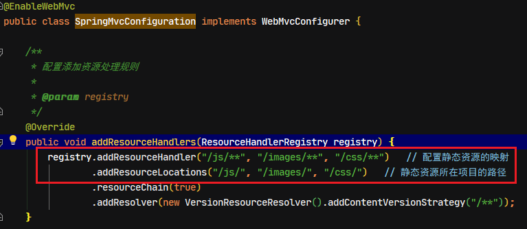

- 在跨域测试控制类中增加获取图片与css文件的方法

```java
/**
 * 请求获取图片流
 *
 * @param request
 * @param response
 * @throws Exception
 */
@RequestMapping("/getImage")
public void getImage(HttpServletRequest request, HttpServletResponse response) throws Exception {
    // 1. 获取ServletContext对象
    ServletContext servletContext = request.getServletContext();
    // 2. 获取图片的磁盘绝对路径
    String path = servletContext.getRealPath("/images/6.jpg");
    // 3. 获取spring提供的文件系统资源对象
    Resource resource = new FileSystemResource(path);
    // 4. 使用spring的工具类把resource中的文件转换成一个字节数组
    byte[] images = FileCopyUtils.copyToByteArray(resource.getFile());
    // 5. 使用response设置响应消息头
    response.setContentType("application/octet-stream");
    // 6. 输出字节数组
    response.getOutputStream().write(images, 0, images.length);
}
/**
 * 请求获取css文件流
 *
 * @param request
 * @param response
 * @throws Exception
 */
@RequestMapping("/getCss")
public void getCss(HttpServletRequest request, HttpServletResponse response) throws Exception {
    // 1. 获取ServletContext对象
    ServletContext servletContext = request.getServletContext();
    // 2. 获取图片的磁盘绝对路径
    String path = servletContext.getRealPath("/css/demo.css");
    // 3. 获取spring提供的文件系统资源对象
    Resource resource = new FileSystemResource(path);
    // 4. 使用spring的工具类把resource中的文件转换成一个字节数组
    byte[] images = FileCopyUtils.copyToByteArray(resource.getFile());
    // 5. 使用response设置响应消息头
    response.setContentType("text/css");
    // 6. 输出字节数组
    response.getOutputStream().write(images, 0, images.length);
}
```

启动项目测试，在没有使用`@CrossOrigin`注解的情况下，能正常请求图片与css文件

# Spring MVC 基于注解的其他相关内容

## 1. 纯注解配置方式的项目配置引入静态资源

### 1.1. 引入静态资源的问题

- 在jsp页面引入jquery，用于发起ajax请求

```jsp
<!-- @RequestBody注解的使用 -->
<script src="${pageContext.request.contextPath}/js/jquery-2.2.3.min.js"></script>
<script type="text/javascript">
//页面加载事件
$(function () {
    // 给Id为useRequestBodyAjax超链接绑定一个点击事件
    $("#useRequestBodyAjax").click(function () {
        alert("点击事件绑定成功");
        $.ajax({
            url:"useRequestBody",
            type:"post",
            // data:"username=test&age=18&gender=male",
            data:'{"username":"test","age":25,"gender":"male"}',//json
            contentType:"application/json",
            dataType:"text",
            success:function (data) {
                alert(data);
            }
        });
    });
})
</script>

<a href="#" id="useRequestBodyAjax">RequestBody注解的使用</a>
```

如果在jsp页面直接引入静态资源，是无法生效。原因是项目在web配置类中，配置DispatcherServlet的请求映射为“`/`”，导致找到不静态资源

```
20-Sep-2020 09:09:03.048 警告 [http-nio-8080-exec-2] org.springframework.web.servlet.DispatcherServlet.noHandlerFound No mapping for GET /js/jquery-2.2.3.min.js
```

### 1.2. 配置静态资源路径

> 相关配置可以参考官方文档：https://docs.spring.io/spring-framework/docs/5.1.19.BUILD-SNAPSHOT/spring-framework-reference/web.html#spring-web

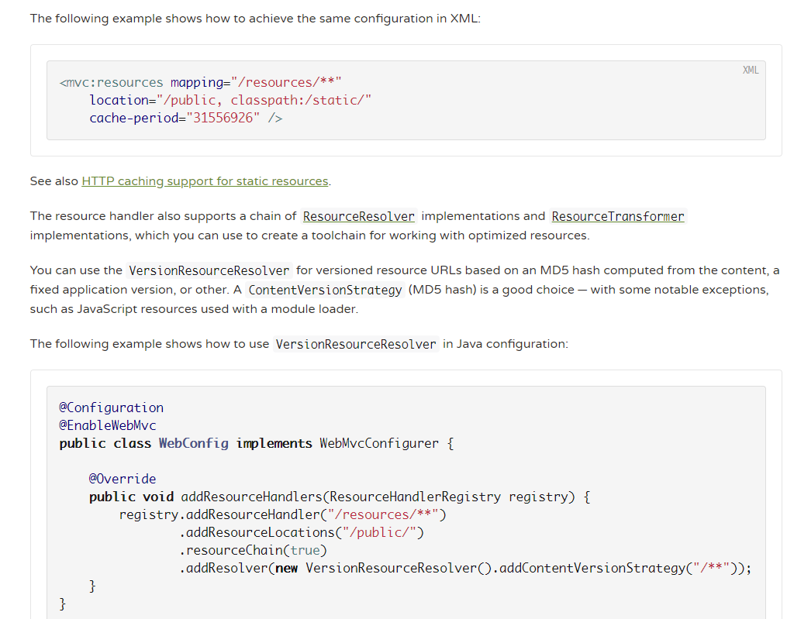

在原来基于xml配置文件的方式中，需要在`springmvc.xml`文件中配置`<mvc:resources>`来指定可读取的静态。而在纯注解的配置方式，参考官方文档，让SpringMVC配置类实现`WebMvcConfigurer`接口，实现`addResourceHandlers`方法即可。在上面示例项目加上以下配置：

```java
@Configuration
@ComponentScan("com.moon.springmvc.web")
@EnableWebMvc
public class SpringMvcConfiguration implements WebMvcConfigurer {
    /**
     * 配置添加资源处理规则
     *
     * @param registry
     */
    @Override
    public void addResourceHandlers(ResourceHandlerRegistry registry) {
        registry.addResourceHandler("/js/**")   // 配置静态资源的映射
                .addResourceLocations("/js/")   // 静态资源所在项目的路径
                .resourceChain(true)
                .addResolver(new VersionResourceResolver().addContentVersionStrategy("/**"));
    }
    ....
}
```

<font color=red>**注：配置类需要标识`@EnableWebMvc`注解开启web mvc的配置，添加的资源处理规则才生效**</font>

## 2. Spring MVC 实现 JSON 数据封装成对象

Spring MVC 相关注解并没有实现 JSON 数据封装成实体对象的功能，都是通过引入第三方 JSON 处理组件库，或者自定义 JSON 转换来实现的。

### 2.1. 使用 jackson 类库实现

#### 2.1.1. 配置依赖

配置pom.xml文件，加入jackson依赖。*注：springmvc 5.1.x+版本，需要使用jackson 2.9.0+的版本*

```xml
<properties>
    <!-- jackson类库版本 -->
    <jackson.version>2.9.0</jackson.version>
</properties>

<dependencies>
<!-- jackson依赖，提供json数据处理支持 -->
    <dependency>
        <groupId>com.fasterxml.jackson.core</groupId>
        <artifactId>jackson-core</artifactId>
        <version>${jackson.version}</version>
    </dependency>
    <dependency>
        <groupId>com.fasterxml.jackson.core</groupId>
        <artifactId>jackson-databind</artifactId>
        <version>${jackson.version}</version>
    </dependency>
    <dependency>
        <groupId>com.fasterxml.jackson.core</groupId>
        <artifactId>jackson-annotations</artifactId>
        <version>${jackson.version}</version>
    </dependency>
</dependencies>
```

#### 2.1.2. 配置类

此示例使用纯注解配置方式，<font color=red>**配置类`SpringMvcConfiguration`确认标识`@EnableWebMvc`注解开启web mvc的注解支持**</font>，其他不需要增加任何配置，因为spring mvc 默认支持jackson

> 注：如果使用基于xml配置文件的方式，则修改springmvc.xml配置文件，在配置处理器映射器和处理器适配器时，使用注解驱动方式`<mvc:annotation-driven />`配置。它默认就支持jackson的转换

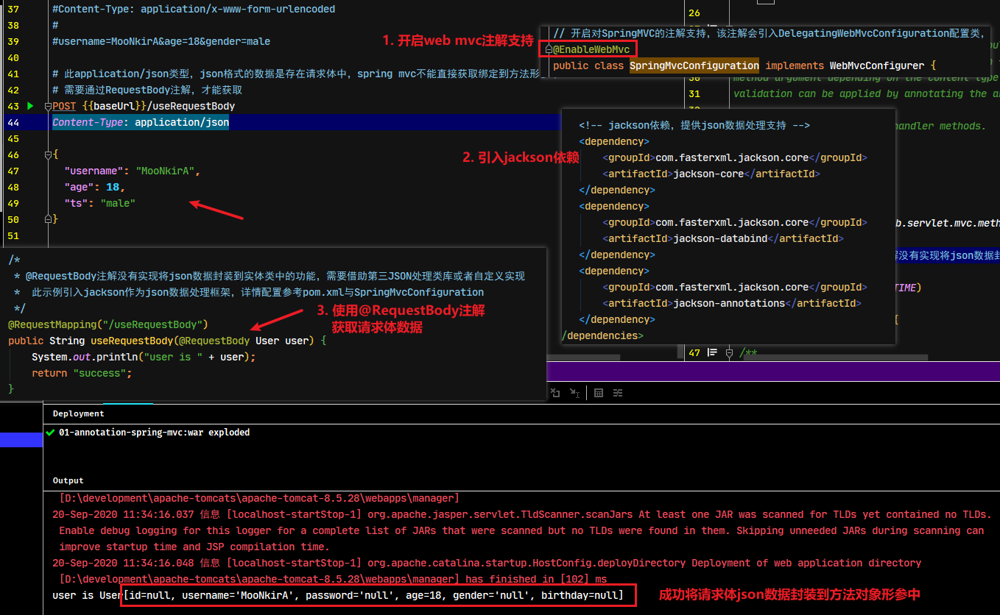

## 3. 自定义拦截器（基于纯注解方式）

### 3.1. 纯注解开发自定义拦截器实现步骤总结

1. 编写一个普通类，实现`HandlerInterceptor`接口
2. 使用注解，把拦截器存入IOC容器
3. 修改配置类，将拦截器注册到`InterceptorRegistry`中

### 3.2. 创建拦截器

```java
/**
 * 自定义拦截器，纯注解开发中自定义拦截器步骤：
 * 第一步：编写一个普通类，实现HandlerInterceptor接口
 * 第二步：使用注解，把拦截器存入IOC容器
 * 第三步：修改配置类，将拦截器注册到 InterceptorRegistry 中
 */
@Component
public class MyInterceptor1 implements HandlerInterceptor {
    /**
     * 拦截器的拦截方法，它是在控制器方法执行之前先执行。可以做一些前置增强
     */
    @Override
    public boolean preHandle(HttpServletRequest request, HttpServletResponse response, Object handler) throws Exception {
        System.out.println("MyInterceptor1.preHandle()方法执行了....");
        // 示例需求：如果是登陆请求，直接放行；如果会话域存在“loginName”属性，则放行，否拦截
        if (request.getRequestURL().toString().contains("login")) {
            // 登录方法直接放行
            return true;
        }
        Object obj = request.getSession().getAttribute("loginName");
        // 判断“loginName”属性是否有值，不为空则放行，否则不放行
        return obj != null;
    }

    /**
     * 拦截器的后处理方法，执行时机在控制器方法执行之后，同时结果视图执行之前。可以用于对响应数据进行增强
     */
    @Override
    public void postHandle(HttpServletRequest request, HttpServletResponse response, Object handler, ModelAndView modelAndView) throws Exception {
        System.out.println("MyInterceptor1.postHandle()方法执行了....");
        Assert.notNull(modelAndView, "modelAndView must be not null!");
        Object object = modelAndView.getModelMap().get("message");
        if (object != null) {
            String message = (String) object;
            message = message.replace("xxoo", "**");
            modelAndView.getModelMap().addAttribute("message", message);
        }
    }

    /**
     * 拦截器最后执行的方法，执行时机在结果视图执行完成之后，响应之前。可以用于实现一些清理的操作
     */
    @Override
    public void afterCompletion(HttpServletRequest request, HttpServletResponse response, Object handler, Exception ex) throws Exception {
        System.out.println("MyInterceptor1.afterCompletion()方法执行了....");
    }
}
```

### 3.3. 修改配置类，注册自定义拦截器

修改Spring MVC配置类`SpringMvcConfiguration`，此配置类实现`WebMvcConfigurer`接口，实现`addInterceptors`方法进行拦截器的注册

```java
@Configuration
@ComponentScan("com.moon.springmvc.web")
@EnableWebMvc
public class SpringMvcConfiguration implements WebMvcConfigurer {
    // 省略其他代码....
    // 注入自定义拦截器
    @Autowired
    private MyInterceptor1 myInterceptor1;

    /**
     * 注册拦截器方法
     */
    @Override
    public void addInterceptors(InterceptorRegistry registry) {
        // InterceptorRegistry中注册拦截器（注：此处的注册顺序决定了多个拦截器的执行顺序）
        registry.addInterceptor(myInterceptor1);
    }
}
```

### 3.4. 创建请求的控制器

```java
/**
 * 自定义拦截器使用示例控制器
 */
@Controller
public class CustomInterceptorController {
    /**
     * 测试自定义拦截拦截器请求
     */
    @RequestMapping("/testCustomInterceptor")
    public String testCustomInterceptor(ModelMap model) {
        System.out.println("testCustomInterceptor方法执行了");
        // 设置message信息
        model.addAttribute("message", "Hello MooNkirA, xxoo!");
        return "message";
    }

    /**
     * 模拟登录方法
     */
    @RequestMapping("/login")
    public String login(HttpServletRequest request) {
        // 往会话域中设置loginName属性
        request.getSession().setAttribute("loginName", "test");
        // 使用关键字“forward”，进行页面转发。此时会脱离web项目配置的视图解析器，直接找index.jsp
        return "forward:/index.jsp";
    }
}
```

### 3.5. 创建相关测试页面

创建login.jsp页面

```jsp
<%@page contentType="text/html; UTF-8" language="java" pageEncoding="UTF-8" %>
<html>
<body>
<h2>登录页面</h2>
<a href="${pageContext.request.contextPath}/login">登录</a>
</body>
</html>
```

修改index.jsp页面

```jsp
<!-- SpringMVC中的拦截器 -->
<a href="${pageContext.request.contextPath}/testCustomInterceptor">SpringMVC中的拦截器</a>
```

创建测试拦截器请求后跳转的页面message.jsp，输出请求域中的数据与打印一下页面生成的信息

```jsp
<h2>测试拦截器成功跳转页面</h2>

<h3>message: ${requestScope.message}<h3>
<%System.out.println("message.jsp执行了");%>
```

### 3.6. 测试

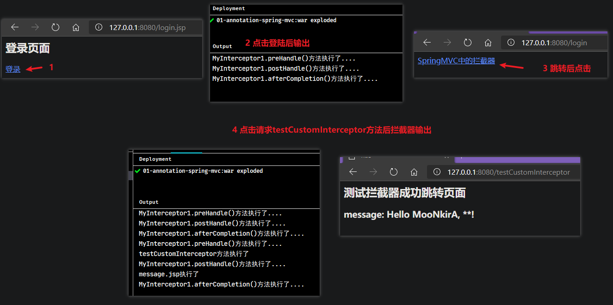

### 3.7. 多个拦截器执行顺序测试

> 注：多个拦截器的配置方法与单个拦截器配置方法一样，<font color=red>**需要注意是在`addInterceptors`方法中，注册到`InterceptorRegistry`时的顺序决定了多个拦截器的执行顺序**</font>。
>
> 多个拦截器执行顺序测试结果详见《01-SpringMVC基础.md》，代码示例：`spring-analysis-note\springmvc-sample-annotation\`

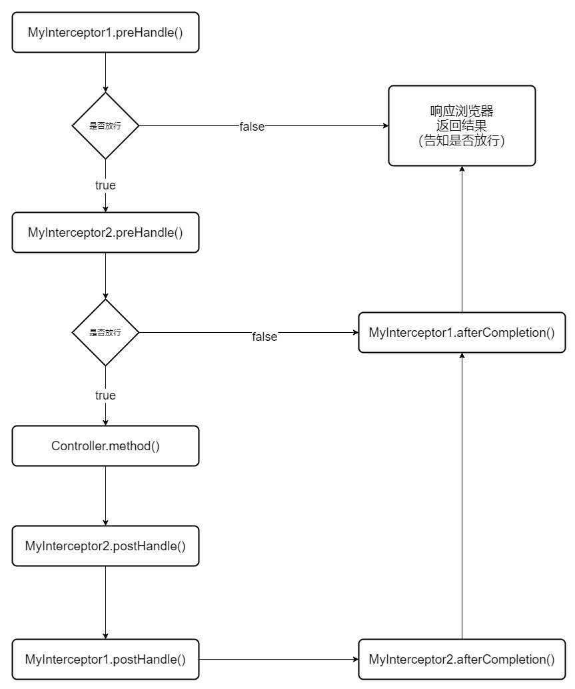

## 4. 类型转换器(整理中)

类型转换器，就是在处理请求前，对象一些数据进行类型的转换处理。

实现类型转换的功能多种方式。如之前的示例中的`@InitBinder`可以进行数据预处理；或者spring mvc提供的内置转换器，如：`@DateTimeFormat`也能实现日期类型的转换

### 4.1. Converter 接口

`Converter` 接口是 Spring 提供的用于处理类型转换的接口

```java
/* 类型转换器接口 */
@FunctionalInterface
public interface Converter<S, T> {
	/**
	 * Convert the source object of type {@code S} to target type {@code T}.
	 * @param source the source object to convert, which must be an instance of {@code S} (never {@code null})
	 * @return the converted object, which must be an instance of {@code T} (potentially {@code null})
	 * @throws IllegalArgumentException if the source cannot be converted to the desired target type
	 */
	/* 提供类型转换的逻辑 */
	@Nullable
	T convert(S source);
}
```

### 4.2. 自定义 Converter

自定义类型转换器需要实现`Converter`接口，实现`convert`方法，在方法中进行相关的类型转换的处理逻辑。

> 使用`@Component`注解注册到spring ioc容器中，方便在定义全局增强方法中从容器中直接获取

```java
/**
 * 自定义类型转换器 - 处理字符串转日期类型
 */
@Component
public class StringToDateConverter implements Converter<String, Date> {
    /*
     * Converter<S, T>接口的泛型
     *  S：转换处理方法形参的类型，即待转换的内容
     *  T：转换处理方法返回值的类型，即转换后返回的内容
     */
    @Override
    public Date convert(String source) {
        // 1. 判断来源是否有值
        if (StringUtils.isEmpty(source)) {
            throw new NullPointerException("Source can not be null!");
        }
        try {
            // 2. 定义转换器
            DateFormat format = new SimpleDateFormat("yyyy-MM-dd");
            // 3. 转换并返回
            return format.parse(source);
        } catch (Exception e) {
            e.printStackTrace();
        }
        return null;
    }
}
```

### 4.3. 注册类型转换器

修改之前字符串转日期类型的全局切面通知类，修改注册自定义的日期转换器

```java
@ControllerAdvice // 增强所有能扫描到的控制类
public class InitBinderAdvice {
    // 注入自定义类型转换器
    @Autowired
    private StringToDateConverter stringToDateConverter;

    @InitBinder
    public void initBinder(WebDataBinder webDataBinder) {
        // 1. 获取转换服务对象
        ConversionService conversionService = webDataBinder.getConversionService();
        // 2. 判断conversionService是否为GenericConversionService类型
        if (conversionService instanceof GenericConversionService) {
            // 3. 强转
            GenericConversionService genericConversionService = (GenericConversionService) conversionService;
            // 4. 添加类型转换器
            genericConversionService.addConverter(stringToDateConverter);
        }
    }
}
```
