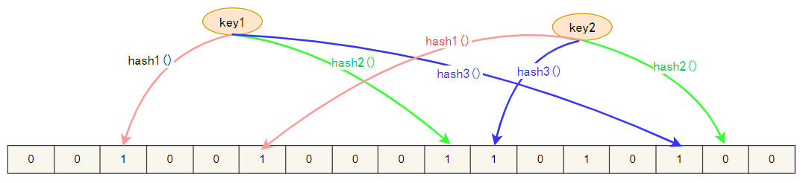

## 1. Bloom Filter(布隆过滤器) 概述

布隆过滤器，它是一个连续的数据结构。直观的说，bloom 算法类似一个 hash set，用来判断某个元素（key）是否在某个集合中。

和一般的 hash set 不同的是，这个算法无需存储 key 的值。对于每个 key，只需要 k 个比特位，每个存储位存储都是一个 bit（即0或者1），来标识数据是否存在。

### 1.1. 实现算法

1. 首先需要 k 个 hash 函数，每个函数可以把 key 散列成为 1 个整数。
2. 初始化时，需要一个长度为 n 比特的数组，每个比特位初始化为 0。
3. 某个 key 加入集合时，用 k 个 hash 函数计算出 k 个散列值，并把数组中对应的比特位置为 1。
4. 判断某个 key 是否在集合时，用 k 个 hash 函数计算出 k 个散列值，并查询数组中对应的比特位，如果所有的比特位都是 1，认为在集合中。

### 1.2. 优缺点

- 优点：不需要存储 key，节省空间。
- 缺点：
    1. 算法在判断元素是否在集合中时，会有一定错误几率(即 key 其实不在集合中)，因为哈希算法有一定的碰撞的概率。
    2. 不支持删除元素。

### 1.3. 典型的应用场景

某些存储系统的设计中，会存在空查询缺陷：当查询一个不存在的key时，需要访问慢设备，导致效率低下。

比如一个前端页面的缓存系统，可能这样设计：先查询某个页面在本地是否存在，如果存在就直接返回，如果不存在，就从后端获取。但是当频繁从缓存系统查询一个页面时，缓存系统将会频繁请求后端，把压力导入后端。

**一般用于缓存击穿的场景**

## 2. 布隆过滤器的原理

### 2.1. 数据误判的原因

当一个元素加入布隆过滤器中的时候，会进行哪些操作：

1. 使用布隆过滤器中的哈希函数对元素值进行计算，得到哈希值（有几个哈希函数得到几个哈希值）。
2. 根据得到的哈希值，在位数组中把对应下标的值置为 1。

当需要判断一个元素是否存在于布隆过滤器的时候，会进行哪些操作：

1. 对给定元素再次进行相同的哈希计算；
2. 得到值之后判断位数组中的每个元素是否都为 1，如果值都为 1，那么说明这个值在布隆过滤器中;如果存在一个值不为 1，说明该元素不在布隆过滤器中。

然后一定会出现这样一种情况：不同的字符串可能哈希出来的位置相同，从而产生误判。但可以适当增加位数组大小或者调整用于计算的哈希函数来降低概率。

## 3. 待整理（参考资料）

https://www.cnblogs.com/liyulong1982/p/6013002.html
