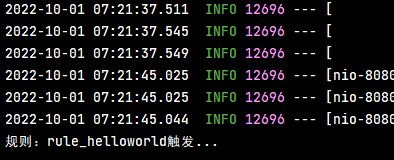
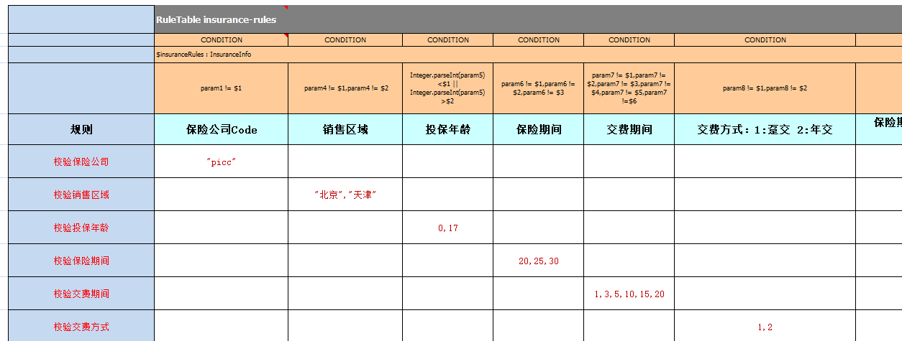

# Drools 开源规则引擎

> TODO: [Drools 规则引擎应用 看这一篇就够了](https://zhuanlan.zhihu.com/p/482763434)。参考资料，阅后删除

## 1. 业务规则问题的引出

现有一个在线申请信用卡的业务场景，用户需要录入个人信息，如下图所示：


通过上图可以看到，用户录入的个人信息包括姓名、性别、年龄、学历、电话、所在公司、职位、月收入、是否有房、是否有车、是否有信用卡等。录入完成后点击申请按钮提交即可。用户提交申请后，需要在系统的服务端进行**用户信息合法性检查**(是否有资格申请信用卡)，只有通过合法性检查的用户才可以成功申请到信用卡(注意：不同用户有可能申请到的信用卡额度不同)。

检查用户信息合法性的规则如下：

| 规则编号 |           名称           |                                         描述                                          |
| :------: | ----------------------- | ------------------------------------------------------------------------------------ |
|    1     | 检查学历与薪水1           | 如果申请人既没房也没车，同时学历为大专以下，并且月薪少于5000，那么不通过                     |
|    2     | 检查学历与薪水2           | 如果申请人既没房也没车，同时学历为大专或本科，并且月薪少于3000，那么不通过                   |
|    3     | 检查学历与薪水3           | 如果申请人既没房也没车，同时学历为本科以上，并且月薪少于2000，同时之前没有信用卡的，那么不通过 |
|    4     | 检查申请人已有的信用卡数量 | 如果申请人现有的信用卡数量大于10，那么不通过                                              |

用户信息合法性检查通过后，还需要根据如下**信用卡发放规则**确定用户所办信用卡的额度：

| 规则编号 | 名称  |                                       描述                                       |
| :------: | ----- | ------------------------------------------------------------------------------- |
|    1     | 规则1 | 如果申请人有房有车，或者月收入在20000以上，那么发放的信用卡额度为15000                 |
|    2     | 规则2 | 如果申请人没房没车，但月收入在10000~20000之间，那么发放的信用卡额度为6000              |
|    3     | 规则3 | 如果申请人没房没车，月收入在10000以下，那么发放的信用卡额度为3000                      |
|    4     | 规则4 | 如果申请人有房没车或者没房但有车，月收入在10000以下，那么发放的信用卡额度为5000         |
|    5     | 规则5 | 如果申请人有房没车或者是没房但有车，月收入在10000~20000之间，那么发放的信用卡额度为8000 |

实现上面的业务逻辑，最简单就是使用分支判断(if-else)来实现，例如通过如下伪代码来检查用户信息合法性：

```java
// 检查用户信息合法性，返回true表示检查通过，返回false表示检查不通过
public boolean checkUser(User user){
    // 如果申请人既没房也没车，同时学历为大专以下，并且月薪少于5000，那么不通过
    if(user.getHouse() == null && user.getcar() == null 
       && user.getEducation().equals("大专以下") && user.getSalary < 5000){
        return false;
    }
    // 如果申请人既没房也没车，同时学历为大专或本科，并且月薪少于3000，那么不通过
    else if(user.getHouse() == null && user.getcar() == null && user.getEducation().equals("大专或本科") 
       && user.getSalary < 3000){
        return false;
    }
    // 如果申请人既没房也没车，同时学历为本科以上，并且月薪少于2000，同时之前没有信用卡的，那么不通过
    else if(user.getHouse() == null && user.getcar() == null && user.getEducation().equals("本科以上") 
       && user.getSalary < 2000 && user.getHasCreditCard() == false){
        return false;
    }
    // 如果申请人现有的信用卡数量大于10，那么不通过
    else if(user.getCreditCardCount() > 10){
        return false;
    }
    return true;
}
```

如果用户信息合法性检查通过后，还需要通过如下代码确定用户所办信用卡的额度：

```java
// 根据用户输入信息确定信用卡额度
public Integer determineCreditCardLimit(User user){
    // 如果申请人有房有车，或者月收入在20000以上，那么发放的信用卡额度为15000
    if((user.getHouse() != null && user.getcar() != null) || user.getSalary() > 20000){
        return 15000;
    }
    // 如果申请人没房没车，并且月收入在10000到20000之间，那么发放的信用卡额度为6000
    else if(user.getHouse() == null && user.getcar() == null
       && user.getSalary() > 10000 && user.getSalary() < 20000){
        return 6000;
    }
    // 如果申请人没房没车，并且月收入在10000以下，那么发放的信用卡额度为3000
    else if(user.getHouse() == null && user.getcar() == null
       && user.getSalary() < 10000){
        return 3000;
    }
    // 如果申请人有房没车或者没房但有车，并且月收入在10000以下，那么发放的信用卡额度为5000
    else if((((user.getHouse() != null && user.getcar() == null) || (user.getHouse() == null && user.getcar() != null))
       && user.getSalary() < 10000){
        return 5000;
    }
    // 如果申请人有房没车或者没房但有车，并且月收入在10000到20000之间，那么发放的信用卡额度为8000
    else if((((user.getHouse() != null && user.getcar() == null) || (user.getHouse() == null && user.getcar() != null))
       && (user.getSalary() > 10000 && user.getSalary() < 20000)){
        return 8000;
    }
}
```

通过上面的伪代码可以看到，通过Java代码的方式实现的业务规则检查，这种实现方式存在如下问题：

1. 硬编码实现业务规则难以维护
2. 硬编码实现业务规则难以应对变化
3. 业务规则发生变化需要修改代码，重启服务后才能生效

为了优化以上业务规则所存在的问题，需要使用“**规则引擎**”来实现上面的业务场景

## 2. 规则引擎概述

### 2.1. 什么是规则引擎

**规则引擎**，全称为**业务规则管理系统**，英文名为BRMS(即Business Rule Management System)。规则引擎的主要思想是将应用程序中的业务决策部分从应用程序代码中分离出来，并使用预定义的语义模块编写业务决策（业务规则），由用户或开发者在需要时进行配置、管理。**规则引擎其实就是一个输入输出平台**，接收数据输入，解释业务规则，并根据业务规则做出业务决策。

前面的申请信用卡业务场景使用规则引擎后效果如下：


系统中引入规则引擎后，业务规则不再以程序代码的形式驻留在系统中，取而代之的是处理规则的规则引擎，业务规则存储在规则库中，完全独立于程序。业务人员可以像管理数据一样对业务规则进行管理，比如查询、添加、更新、统计、提交业务规则等。业务规则被加载到规则引擎中供应用系统调用。

> Notes: 规则引擎并不是一个具体的技术框架，而是指的一类系统，即业务规则管理系统。目前市面上具体的规则引擎产品有：drools、VisualRules、iLog 等。

### 2.2. 规则引擎的优势

使用规则引擎的优势如下：

1. 业务规则与系统代码分离，实现业务规则的集中管理
2. 在不重启服务的情况下可随时对业务规则进行扩展和维护
3. 可以动态修改业务规则，从而快速响应需求变更
4. 规则引擎是相对独立的，只关心业务规则，使得业务分析人员也可以参与编辑、维护系统的业务规则
5. 减少了硬编码业务规则的成本和风险
6. 使用规则引擎提供的规则编辑工具，使复杂的业务规则实现变得的简单

### 2.3. 规则引擎应用场景

对于一些存在比较复杂的业务规则并且业务规则会频繁变动的系统比较适合使用规则引擎，如下：

1. 风险控制系统：风险贷款、风险评估
2. 反欺诈项目：银行贷款、征信验证
3. 决策平台系统：财务计算
4. 促销平台系统：满减、打折、加价购

## 3. Drools 快速入门

### 3.1. Drools 简介

drools 是一款由 JBoss 组织提供的基于 Java 语言开发的开源规则引擎，可以将复杂且多变的业务规则从硬编码中解放出来，以规则脚本的形式存放在文件或特定的存储介质中(例如存放在数据库中)，使得业务规则的变更不需要修改项目代码、重启服务器就可以在线上环境立即生效。

- [Drools 官网地址](https://drools.org/)
- [Drools 源码仓库](https://github.com/kiegroup/drools)

### 3.2. Drools 的使用步骤

在项目中使用 drools 时，即可以单独使用也可以整合 spring 使用。如果单独使用只需要导入如下 maven 坐标即可：

```xml
<dependencyManagement>
    <dependencies>
        <dependency>
            <groupId>org.drools</groupId>
            <artifactId>drools-bom</artifactId>
            <type>pom</type>
            <version>7.10.0.Final</version>
            <scope>import</scope>
        </dependency>
    </dependencies>
</dependencyManagement>

<dependency>
    <groupId>org.drools</groupId>
    <artifactId>drools-compiler</artifactId>
    <scope>runtime</scope>
</dependency>
```

*学习使用时，当时使用最新版本 7.73.0.Final，按默认的配置方式没有生效，后面需要排查原因*

> Tips: 如果使用 IDEA/eclipse 开发 drools 应用，需要单独安装 drools 插件。但早期的 IDEA 中会集成 drools 插件，较新版本需要自行安装
>
> 

### 3.3. drools API 开发步骤


### 3.4. 入门案例

#### 3.4.1. 案例实现的业务场景说明

业务场景：消费者在图书商城购买图书，下单后需要根据以下的规则计算优惠后的价格，并在支付页面显示该价格。具体优惠规则如下：

| 规则编号 | 规则名称 |               描述               |
| :------: | -------- | -------------------------------- |
|    1     | 规则一   | 所购图书总价在100元以下的没有优惠  |
|    2     | 规则二   | 所购图书总价在100到200元的优惠20元 |
|    3     | 规则三   | 所购图书总价在200到300元的优惠50元 |
|    4     | 规则四   | 所购图书总价在300元以上的优惠100元 |

#### 3.4.2. 引入依赖

创建 maven 工程 drools-quickstart 并导入 drools 相关坐标

```xml
<!-- https://mvnrepository.com/artifact/org.drools/drools-compiler -->
<dependency>
    <groupId>org.drools</groupId>
    <artifactId>drools-compiler</artifactId>
    <version>7.73.0.Final</version>
</dependency>
```

#### 3.4.3. drools 默认配置

根据 drools 要求，在 resources/META-INF 目录中，创建 kmodule.xml 配置文件

```xml
<?xml version="1.0" encoding="UTF-8" ?>
<kmodule xmlns="http://www.drools.org/xsd/kmodule">
    <!--
        name 属性: 指定kbase的名称，任意命名，但必须保证唯一
        packages 属性: 指定规则文件的目录，需要根据实际情况填写，否则无法加载到规则文件
        default 属性: 指定当前kbase是否为默认
    -->
    <kbase name="myKbase1" packages="rules" default="true">
        <!--
            name 属性: 指定ksession名称，任意命名，但必须保证唯一
            default 属性: 指定当前session是否为默认
        -->
        <ksession name="ksession-rule" default="true"/>
    </kbase>
</kmodule>
```

> Notes: <font color=red>**drools 默认配置文件的名称和位置都是固定写法，不能更改**</font>

#### 3.4.4. 创建数据输入输出的实体类

创建实体类Order，用于 drools 接收数据输入与解释业务规则后返回

```java
package com.moon.drools.entity;

public class Order {
    private Double originalPrice; // 订单原始价格，即优惠前价格
    private Double realPrice; // 订单真实价格，即优惠后价格

    public String toString() {
        return "Order{" +
                "originalPrice=" + originalPrice +
                ", realPrice=" + realPrice +
                '}';
    }

    public Double getOriginalPrice() {
        return originalPrice;
    }

    public void setOriginalPrice(Double originalPrice) {
        this.originalPrice = originalPrice;
    }

    public Double getRealPrice() {
        return realPrice;
    }

    public void setRealPrice(Double realPrice) {
        this.realPrice = realPrice;
    }
}
```

#### 3.4.5. 创建规则文件

在 resources/rules 目录中，创建规则文件 bookDiscount.drl（任意命名）

```java
// 图书优惠规则
package book.discount // 定义包（逻辑，非真实）
import com.moon.drools.entity.Order // 导入实体类

/*
    这是一个多行注释
*/
// 规则一：所购图书总价在100元以下的没有优惠
rule "book_discount_1"
    when
        $order:Order(originalPrice < 100)
    then
        $order.setRealPrice($order.getOriginalPrice()); // 模式匹配，到规则引擎中（工作内存）查找Order对象
        System.out.println("成功匹配到规则一：所购图书总价在100元以下的没有优惠");
end

// 规则二：所购图书总价在100到200元的优惠20元
rule "book_discount_2"
    when
        $order:Order(originalPrice < 200 && originalPrice >= 100)
    then
        $order.setRealPrice($order.getOriginalPrice() - 20);
        System.out.println("成功匹配到规则二：所购图书总价在100到200元的优惠20元");
end

// 规则三：所购图书总价在200到300元的优惠50元
rule "book_discount_3"
    when
        $order:Order(originalPrice <= 300 && originalPrice >= 200)
    then
        $order.setRealPrice($order.getOriginalPrice() - 50);
        System.out.println("成功匹配到规则三：所购图书总价在200到300元的优惠50元");
end

// 规则四：所购图书总价在300元以上的优惠100元
rule "book_discount_4"
    when
        $order:Order(originalPrice >= 300)
    then
        $order.setRealPrice($order.getOriginalPrice() - 100);
        System.out.println("成功匹配到规则四：所购图书总价在300元以上的优惠100元");
end
```

> Tips: 安装 drools 插件后，文件的图标会改变，输入内容时会有提示信息
>
> 

#### 3.4.6. 测试

编写单元测试

```java
@Test
public void test1() {
    // 获取 KieServices
    KieServices kieServices = KieServices.Factory.get();
    // 获得 KieContainer（容器）对象
    KieContainer kieContainer = kieServices.newKieClasspathContainer();
    // 从 KieContainer（容器）对象中获取会话对象，用于和规则引擎交互
    KieSession session = kieContainer.newKieSession();

    // 构造订单对象（Fact对象，事实对象），设置原始价格，由规则引擎根据优惠规则计算优惠后的价格
    Order order = new Order();
    order.setOriginalPrice(500d);

    // 将数据提供给规则引擎（放入工作内存中），规则引擎会根据提供的数据进行规则匹配
    session.insert(order);
    System.out.println("没有激活规则前，优惠价格属性是：" + order.getRealPrice());

    // 激活规则，由Drools框架自动进行规则匹配，如果规则匹配成功，则执行当前规则
    session.fireAllRules();

    // 关闭会话
    session.dispose();
    System.out.println("优惠后价格：" + order.getRealPrice());
}
```

输出结果

```
没有激活规则前，优惠价格属性是：null
成功匹配到规则四：所购图书总价在300元以上的优惠100元
优惠后价格：400.0
```

#### 3.4.7. 小结

通过上面的入门案例可以发现，使用 drools 规则引擎主要工作就是编写规则文件，在规则文件中定义相关的业务规则（例如入门案例定义的 就是图书优惠规则）。规则定义好后就需要调用drools 提供的 API 将数据提供给规则引擎进行规则模式匹配，规则引擎会执行匹配成功的规则计算的结果并将返回

使用 drools 框架后，不需要在代码中编写规则的判断逻辑，而是在规则文件中编写了业务规则。使用规则引擎时业务规则可以做到动态管理。业务人员可以像管理数据一样对业务规则进行管理，比如查询、添加、更新、统计、提交业务规则等。这样就可以做到在不重启服务的情况下调整业务规则。

## 4. Drools 介绍

### 4.1. 规则引擎构成

drools 规则引擎由以下三部分构成：

- Working Memory（工作内存）
- Rule Base（规则库）
- Inference Engine（推理引擎）

其中 Inference Engine（推理引擎）又包括：

- Pattern Matcher（匹配器）
- Agenda（议程）
- Execution Engine（执行引擎）

如下图所示：


### 4.2. 相关概念说明

- **Working Memory**：工作内存，drools 规则引擎会从 Working Memory 中获取数据并和规则文件中定义的规则进行模式匹配，所以我们开发的应用程序只需要将我们的数据插入到 Working Memory 中即可，例如本案例中调用 `kieSession.insert(order)` 就是将 order 对象插入到了工作内存中。
- **Fact**：事实，是指在 drools 规则应用当中，将一个普通的 JavaBean 插入到 Working Memory 后的对象就是 Fact 对象，例如本案例中的 Order 对象就属于 Fact 对象。Fact 对象是应用和规则引擎进行数据交互的桥梁或通道。
- **Rule Base**：规则库，我们在规则文件中定义的规则都会被加载到规则库中。
- **Pattern Matcher**：匹配器，将 Rule Base 中的所有规则与 Working Memory 中的 Fact 对象进行模式匹配，匹配成功的规则将被激活并放入 Agenda 中。
- **Agenda**：议程，用于存放通过匹配器进行模式匹配后被激活的规则。
- **Execution Engine**：执行引擎，执行 Agenda 中被激活的规则。

### 4.3. 规则引擎执行过程


### 4.4. KIE 介绍

在操作 Drools 时经常使用的 API 以及它们之间的关系如下图：


通过上面的核心 API 可以发现，大部分类名都是以 Kie 开头。Kie 全称为 Knowledge Is Everything，即"知识就是一切"的缩写，是 Jboss 一系列项目的总称。如下图所示，Kie 的主要模块有 OptaPlanner、Drools、UberFire、jBPM。


通过上图可以看到，Drools 是整个 KIE 项目中的一个组件，Drools 中还包括一个 Drools-WB 的模块，它是一个可视化的规则编辑器。

## 5. Drools 基础语法

### 5.1. 规则文件构成

在使用 Drools 时非常重要的一个工作就是编写规则文件，通常规则文件的后缀为 `.drl`。drl 是 Drools Rule Language 的缩写。在规则文件中编写具体的规则内容。

一套完整的规则文件内容构成如下：

|  关键字   |                            描述                            |
| :------: | --------------------------------------------------------- |
| package  | 包名，只限于逻辑上的管理，同一个包名下的查询或者函数可以直接调用 |
|  import  | 用于导入类或者静态方法                                       |
|  global  | 全局变量                                                   |
| function | 自定义函数                                                 |
|  query   | 查询                                                       |
| rule end | 规则体                                                     |

<font color=purple>**Drools 支持的规则文件，除了 drl 形式，还有 Excel 文件类型的。**</font>

### 5.2. 规则体语法结构

规则体是规则文件内容中的重要组成部分，是进行业务规则判断、处理业务结果的部分。规则体语法结构如下：

```drl
rule "ruleName"
    attributes
    when
        LHS
    then
        RHS
end
```

**关键字与名词解释**：

- `rule`：关键字，表示规则开始，参数为规则的唯一名称。
- `attributes`：规则属性，是rule与when之间的参数，为可选项。
- `when`：关键字，后面跟规则的条件部分。
- `LHS`(Left Hand Side)：是规则的条件部分的通用名称。它由零个或多个条件元素组成。如果LHS为空，则它将被视为始终为true的条件元素。
- `then`：关键字，后面跟规则的结果部分。
- `RHS`(Right Hand Side)：是规则的后果或行动部分的通用名称。
- `end`：关键字，表示一个规则结束

### 5.3. 注释

在 drl 形式的规则文件中使用注释和 Java 类中使用注释一致，分为单行注释和多行注释。

单行注释用"`//`"进行标记，多行注释以"`/*`"开始，以"`*/`"结束。如下示例：

```drl
// 规则rule1的注释，这是一个单行注释
rule "rule1"
    when
    then
        System.out.println("rule1触发");
end
​
/*
  规则rule2的注释，
  这是一个多行注释
*/
rule "rule2"
    when
    then
        System.out.println("rule2触发");
end
```

### 5.4. Pattern 模式匹配

Drools 中的匹配器可以将 Rule Base 中的所有规则与 Working Memory 中的 Fact 对象进行模式匹配，那么就需要在规则体的 LHS 部分定义规则并进行模式匹配。LHS 部分由一个或者多个条件组成，条件又称为 pattern。

pattern 的语法结构为：`绑定变量名:Object(Field约束)`

其中绑定变量名可以省略，通常绑定变量名的命名一般建议以`$`开始。如果定义了绑定变量名，就可以在规则体的 RHS 部分使用此绑定变量名来操作相应的 Fact 对象。Field 约束部分是需要返回 true 或者 false 的0个或多个表达式。以快速入门为案例来说明：

```drl
//规则二：所购图书总价在100到200元的优惠20元
rule "book_discount_2"
    when
        //Order为类型约束，originalPrice为属性约束
        $order:Order(originalPrice < 200 && originalPrice >= 100)
    then
        $order.setRealPrice($order.getOriginalPrice() - 20);
        System.out.println("成功匹配到规则二：所购图书总价在100到200元的优惠20元");
end
```

案例必须同时满足当前规则才有可能被激活，匹配条件为：

1. 工作内存中必须存在 Order 这种类型的 Fact 对象 - 类型约束
2. Fact 对象的 originalPrice 属性值必须小于 200 - 属性约束
3. Fact 对象的 originalPrice 属性值必须大于等于 100 - 属性约束

**绑定变量既可以用在对象上，也可以用在对象的属性上**。例如：

```drl
rule "book_discount_2"
    when
        $order:Order($op:originalPrice < 200 && originalPrice >= 100)
    then
        System.out.println("$op=" + $op);
        $order.setRealPrice($order.getOriginalPrice() - 20);
        System.out.println("成功匹配到规则二：所购图书总价在100到200元的优惠20元");
end
```

LHS 部分还可以**定义多个 pattern，之间可以使用 and 或者 or 进行连接，也可以不写，默认连接为 and**。例如：

```drl
rule "book_discount_2"
    when
        $order:Order($op:originalPrice < 200 && originalPrice >= 100) and
        $customer:Customer(age > 20 && gender=='male')
    then
        System.out.println("$op=" + $op);
        $order.setRealPrice($order.getOriginalPrice() - 20);
        System.out.println("成功匹配到规则二：所购图书总价在100到200元的优惠20元");
end
```

### 5.5. 比较操作符

Drools 提供的比较操作符，如下表：

|     符号     |                            说明                             |
| :----------: | ---------------------------------------------------------- |
|     `>`      | 大于                                                        |
|     `<`      | 小于                                                        |
|     `>=`     | 大于等于                                                    |
|     `<=`     | 小于等于                                                    |
|     `==`     | 等于                                                        |
|     `!=`     | 不等于                                                      |
|   contains   | 检查一个Fact对象的某个属性值是否包含一个指定的对象值             |
| not contains | 检查一个Fact对象的某个属性值是否不包含一个指定的对象值           |
|   memberOf   | 判断一个Fact对象的某个属性是否在一个或多个集合中                |
| not memberOf | 判断一个Fact对象的某个属性是否不在一个或多个集合中              |
|   matches    | 判断一个Fact对象的属性是否与提供的标准的Java正则表达式进行匹配   |
| not matches  | 判断一个Fact对象的属性是否不与提供的标准的Java正则表达式进行匹配 |

#### 5.5.1. 语法

- contains | not contains 语法结构

```java
Object(Field[Collection/Array] contains value)
Object(Field[Collection/Array] not contains value)
```

- memberOf | not memberOf 语法结构

```java
Object(field memberOf value[Collection/Array])
Object(field not memberOf value[Collection/Array])
```

- matches | not matches 语法结构

```java
Object(field matches "正则表达式")
Object(field not matches "正则表达式")
```

#### 5.5.2. 使用示例

- 创建用于测试比较操作符的实体类

```java
public class ComparisonOperatorEntity {
    private String names;
    private List<String> list;
    // ...省略getter/setter
}
```

- 在 /resources/rules 目录中，创建比较操作符示例使用的规则文件 comparisonOperator.drl

```drl
package comparisonOperator
import com.moon.drools.entity.ComparisonOperatorEntity

// 当前规则文件用于测试Drools提供的比较操作符
// 测试比较操作符contains
rule "rule_comparison_contains"
    when
        ComparisonOperatorEntity(names contains "张三")
        ComparisonOperatorEntity(list contains names)
    then
        System.out.println("规则：rule_comparison_contains触发了...");
end

// 测试比较操作符not contains
rule "rule_comparison_notcontains"
    when
        ComparisonOperatorEntity(names not contains "张三")
        ComparisonOperatorEntity(list not contains names)
    then
        System.out.println("规则：rule_comparison_notcontains触发了...");
end

// 测试比较操作符memberOf
rule "rule_comparison_memberOf"
    when
        ComparisonOperatorEntity(names memberOf list)
    then
        System.out.println("规则：rule_comparison_memberOf触发了...");
end

// 测试比较操作符 not memberOf
rule "rule_comparison_not memberOf"
    when
        ComparisonOperatorEntity(names not memberOf list)
    then
        System.out.println("规则：rule_comparison_not memberOf触发了...");
end

// 测试比较操作符 matches
rule "rule_comparison_matches"
    when
        ComparisonOperatorEntity(names matches "王.*")
    then
        System.out.println("规则：rule_comparison_matches触发了...");
end

// 测试比较操作符 not matches
rule "rule_comparison_not matches"
    when
        ComparisonOperatorEntity(names not matches "王.*")
    then
        System.out.println("规则：rule_comparison_not matches触发了...");
end
```

- 编写单元测试

```java
@Test
public void test2() {
    // 获取 KieServices
    KieServices kieServices = KieServices.Factory.get();
    // 获得 KieContainer（容器）对象
    KieContainer kieContainer = kieServices.newKieClasspathContainer();
    // 从 KieContainer（容器）对象中获取会话对象，用于和规则引擎交互
    KieSession session = kieContainer.newKieSession();

    // 构造条件对象（Fact对象，事实对象），设置原始价格，由规则引擎根据优惠规则计算优惠后的价格
    ComparisonOperatorEntity fact = new ComparisonOperatorEntity();
    fact.setNames("李四");
    List<String> list = new ArrayList<>();
    list.add("张三2");
    fact.setList(list);

    // 将数据提供给规则引擎（放入工作内存中），规则引擎会根据提供的数据进行规则匹配
    session.insert(fact);

    // 激活规则，由Drools框架自动进行规则匹配，如果规则匹配成功，则执行当前规则
    session.fireAllRules();

    // 关闭会话
    session.dispose();
}
```

### 5.6. 执行指定规则

在上面的案例中，调用规则代码时，满足条件的规则都会被执行。Drools 提供了通过<font color=red>**规则过滤器**</font>来实现执行指定某个的规则。对于规则文件不用做任何修改，只需要修改 Java 代码即可，如下：

```java
KieServices kieServices = KieServices.Factory.get();
KieContainer kieContainer = kieServices.newKieClasspathContainer();
KieSession session = kieContainer.newKieSession();

// 构造Fact对象
ComparisonOperatorEntity fact = new ComparisonOperatorEntity();
fact.setNames("李四");
List<String> list = new ArrayList<>();
list.add("张三2");
fact.setList(list);
// 将数据提供给规则引擎（放入工作内存中），规则引擎会根据提供的数据进行规则匹配
session.insert(fact);

// 使用框架提供的规则过滤器(RuleNameStartsWithAgendaFilter)执行指定某个名称的规则
session.fireAllRules(new RuleNameEqualsAgendaFilter("rule_comparison_notcontains"));
// 使用框架提供的规则过滤器(RuleNameStartsWithAgendaFilter)执行指定某个前缀的规则
// session.fireAllRules(new RuleNameStartsWithAgendaFilter("rule_"));

session.dispose();
```

### 5.7. 关键字

Drools 的关键字分为：**硬关键字(Hard keywords)**和**软关键字(Soft keywords)**。

- 硬关键字是在规则文件中定义包名或者规则名时明确不能使用的，否则程序会报错。包含：`true`、`false`、`null`
- 软关键字虽然可以使用，但是不建议使用。包括：lock-on-active date-effective date-expires no-loop auto-focus activation-group agenda-group ruleflow-group entry-point duration package import dialect salience enabled attributes rule extend when then template query declare function global eval not in or and exists forall accumulate collect from action reverse result end over init

### 5.8. Drools 内置方法

规则文件的 `RHS` 部分的主要作用是通过插入，删除或修改工作内存中的 Fact 数据，来达到控制规则引擎执行的目的。Drools 提供了一些方法可以用来操作工作内存中的数据，操作完成后规则引擎会重新进行相关规则的匹配，原来没有匹配成功的规则在我们修改数据完成后有可能就会匹配成功了。

创建用于测试的实体类 `Student`

```java
public class Student {
    private int id;
    private String name;
    private int age;
    // ...省略setter/getter
}
```

#### 5.8.1. update 方法

update 方法的作用是更新工作内存中的数据，并让相关的规则重新匹配。

- 第一步：编写规则文件 /resources/rules/method-update.drl，文件内容如下：

```drl
package test.methodupdate
import com.moon.drools.entity.Student

/* 当前规则文件用于测试Drools提供的内置方法*/
rule "rule_student_age小于10岁"
    when
        $s:Student(age < 10)
    then
        $s.setAge(15);
        update($s); // 更新数据，导致相关的规则会重新匹配
        System.out.println("规则rule_student_age小于10岁触发");
end

rule "rule_student_age小于20岁同时大于10岁"
    when
        $s:Student(age < 20 && age > 10)
    then
        $s.setAge(25);
        update($s); // 更新数据，导致相关的规则会重新匹配
        System.out.println("规则rule_student_age小于20岁同时大于10岁触发");
end

rule "rule_student_age大于20岁"
    when
        $s:Student(age > 20)
    then
        System.out.println("规则rule_student_age大于20岁触发");
end
```

- 第二步：编写单元测试

```java
KieServices kieServices = KieServices.Factory.get();
KieContainer kieContainer = kieServices.newKieClasspathContainer();
KieSession session = kieContainer.newKieSession();

Student student = new Student();
student.setAge(4);
// 将数据提供给规则引擎（放入工作内存中），规则引擎会根据提供的数据进行规则匹配
session.insert(student);

// 激活规则，由Drools框架自动进行规则匹配，如果规则匹配成功，则执行当前规则
session.fireAllRules();
session.dispose();
```

通过控制台的输出可以看到规则文件中定义的三个规则都触发了，因为 update 方法会再次触发规则的校验。<font color=red>**在更新数据时需要注意防止发生死循环**</font>。

#### 5.8.2. insert 方法

insert 方法的作用是向工作内存中插入数据，并让相关的规则重新匹配。

- 第一步：编写规则文件 /resources/rules/method-insert.drl，文件内容如下：

```drl
package test.methodinsert
import com.moon.drools.entity.Student

/* 当前规则文件用于测试Drools提供的内置方法*/
rule "rule_student_age等于10岁"
    when
        $s:Student(age == 10)
    then
        Student student = new Student();
        student.setAge(5);
        insert(student); // 插入数据，导致相关的规则会重新匹配
        System.out.println("规则rule_student_age等于10岁触发");
end

rule "rule_student_age小于10岁"
    when
        $s:Student(age < 10)
    then
        System.out.println("规则rule_student_age小于10岁触发");
end

rule "rule_student_age小于20岁同时大于10岁"
    when
        $s:Student(age < 20 && age > 10)
    then
        System.out.println("规则rule_student_age小于20岁同时大于10岁触发");
end

rule "rule_student_age大于20岁"
    when
        $s:Student(age > 20)
    then
        System.out.println("规则rule_student_age大于20岁触发");
end
```

- 第二步：编写单元测试

```java
KieServices kieServices = KieServices.Factory.get();
KieContainer kieContainer = kieServices.newKieClasspathContainer();
KieSession session = kieContainer.newKieSession();

Student student = new Student();
student.setAge(10);
// 将数据提供给规则引擎（放入工作内存中），规则引擎会根据提供的数据进行规则匹配
session.insert(student);

// 激活规则，由Drools框架自动进行规则匹配，如果规则匹配成功，则执行当前规则
session.fireAllRules();
session.dispose();
```

通过控制台输出可以发现，两个规则都触发了，这是因为首先进行规则匹配时只有第一个规则可以匹配成功，但是在第一个规则中向工作内存中插入了一个数据导致重新进行规则匹配，此时第二个规则可以匹配成功。

#### 5.8.3. retract 方法

retract 方法的作用是删除工作内存中的数据，并让相关的规则重新匹配。

- 第一步：编写规则文件 /resources/rules/method-insert.drl，文件内容如下：

```drl
package test.methodretract
import com.moon.drools.entity.Student

/* 当前规则文件用于测试Drools提供的内置方法*/
rule "rule_student_age等于10岁时删除数据"
    /*
        salience：设置当前规则的执行优先级，数值越大越优先执行，默认值为0.
        因为当前规则的匹配条件和下面规则的匹配条件相同，为了保证先执行当前规则，需要设置优先级
    */
    salience 100
    when
        $s:Student(age == 10)
    then
        retract($s); // retract方法的作用是删除工作内存中的数据，并让相关的规则重新匹配。
        System.out.println("规则rule_student_age等于10岁时删除数据触发");
end

rule "rule_student_age等于10岁"
    when
        $s:Student(age == 10)
    then
        System.out.println("规则rule_student_age等于10岁触发");
end
```

- 第二步：编写单元测试

```java
KieServices kieServices = KieServices.Factory.get();
KieContainer kieContainer = kieServices.newKieClasspathContainer();
KieSession session = kieContainer.newKieSession();

Student student = new Student();
student.setAge(10);
// 将数据提供给规则引擎（放入工作内存中），规则引擎会根据提供的数据进行规则匹配
session.insert(student);

// 激活规则，由Drools框架自动进行规则匹配，如果规则匹配成功，则执行当前规则
session.fireAllRules();
session.dispose();
```

通过控制台输出可以发现，只有第一个规则触发了，因为在第一个规则中将工作内存中的数据删除了导致第二个规则并没有匹配成功。

### 5.9. 规则属性

前面规则体的构成中，`attributes`就是针对规则体的属性部分。Drools中提供的属性如下表(部分属性)：

|      属性名       |                     说明                      |
| :--------------: | --------------------------------------------- |
|     salience     | 指定规则执行优先级                              |
|     dialect      | 指定规则使用的语言类型，取值为java和mvel         |
|     enabled      | 指定规则是否启用                                |
|  date-effective  | 指定规则生效时间                                |
|   date-expires   | 指定规则失效时间                                |
| activation-group | 激活分组，具有相同分组名称的规则只能有一个规则触发 |
|   agenda-group   | 议程分组，只有获取焦点的组中的规则才有可能触发     |
|      timer       | 定时器，指定规则触发的时间                       |
|    auto-focus    | 自动获取焦点，一般结合agenda-group一起使用       |
|     no-loop      | 防止死循环                                     |

#### 5.9.1. enabled 属性

enabled 属性对应的取值为true和false，默认值为true。用于指定当前规则是否启用，如果设置的值为 false 则当前规则无论是否匹配成功都不会触发。

- 创建规则文件 attributes-enabled.drl

```drl
// 当前规则文件用于测试执行 enabled 属性
package test.attributesenabled

// 定义第一个规则
rule "enabled_rule_1"
    enabled false  // 指定当前规则是否可用，默认值为true。当前规则即使匹配也不会触发
    when
        eval(true) // 返回true，即当前规则匹配成功
    then
        System.out.println("规则：enabled_rule_1 触发了...");
end

// 定义第二个规则
rule "enabled_rule_2"
    when
        eval(true)
    then
        System.out.println("规则：enabled_rule_2 触发了...");
end
```

- 编写测试用例

```java
KieServices kieServices = KieServices.Factory.get();
KieContainer kieContainer = kieServices.newKieClasspathContainer();
KieSession session = kieContainer.newKieSession();

// 激活规则，由Drools框架自动进行规则匹配，如果规则匹配成功，则执行当前规则
session.fireAllRules();
session.dispose();
```

#### 5.9.2. dialect 属性

dialect 属性用于指定当前规则使用的语言类型，取值为`java`和`mvel`，默认值为`java`。

> Notes: mvel 是一种基于 java 语法的表达式语言。mvel 像正则表达式一样，有直接支持集合、数组和字符串匹配的操作符，还提供了用来配置和构造字符串的模板语言。mvel 表达式内容包括属性表达式，布尔表达式，方法调用，变量赋值，函数定义等。

```drl
rule "dialect_rule"
    dialect "mvel"  // 当前规则使用的语言类型为 mvel
    when
        ...
    then
        ...
end
```

#### 5.9.3. salience 属性

`salience` 属性用于指定规则的执行优先级，取值类型为 `Integer`，<font color=red>**数值越大越优先执行**</font>。每个规则都有一个默认的执行顺序，如果不设置 `salience` 属性（默认值为0），规则体的执行顺序为由上到下。

- 创建规则文件 attributes-salience.drl

```drl
// 当前规则文件用于测试执行优先级 salience 属性
package test.attributessalience

// 定义第一个规则
rule "salience_rule_1"
    salience 10 // 指定规则执行的优先级，数值越大越优先
    when
        eval(true) // 返回true，即当前规则匹配成功
    then
        System.out.println("规则：salience_rule_1触发了...");
end

// 定义第二个规则
rule "salience_rule_2"
    salience 11
    when
        eval(true)
    then
        System.out.println("规则：salience_rule_2触发了...");
end

// 定义第二个规则
rule "salience_rule_3"
    salience 5
    when
        eval(true)
    then
        System.out.println("规则：salience_rule_3触发了...");
end
```

- 编写测试用例

```java
KieServices kieServices = KieServices.Factory.get();
KieContainer kieContainer = kieServices.newKieClasspathContainer();
KieSession session = kieContainer.newKieSession();

// 激活规则，由Drools框架自动进行规则匹配，如果规则匹配成功，则执行当前规则
session.fireAllRules();
session.dispose();
```

通过控制台可以看到，规则文件执行的顺序是按照我们设置的 `salience` 值由大到小顺序执行的。如果不指定 salience 属性（默认值都为0），则执行的顺序是按照规则文件中规则的顺序由上到下执行的。一般建议在编写规则时使用 `salience` 属性明确指定执行优先级。

#### 5.9.4. no-loop 属性

`no-loop` 属性用于防止死循环，当规则通过 update 之类的函数修改了 Fact 对象时，可能使当前规则再次被激活从而导致死循环。取值类型为 Boolean，默认值为 false。测试步骤如下：

- 第一步：编写规则文件 /resource/rules/attributes-noloop.drl

```java
// 当前规则文件用于测试执行优先级 salience 属性
package test.attributessalience
import com.moon.drools.entity.Student

rule "rule_noloop"
    when
        $s:Student(age == 50)
    then
        update($s); // 调用update方法会导致相关规则重新匹配
        System.out.println("规则：rule_noloop 触发了...");
end
```

- 第二步：编写单元测试

```java
KieServices kieServices = KieServices.Factory.get();
KieContainer kieContainer = kieServices.newKieClasspathContainer();
KieSession session = kieContainer.newKieSession();
Student student = new Student();
student.setAge(50);
session.insert(student);

// 激活规则，由Drools框架自动进行规则匹配，如果规则匹配成功，则执行当前规则
session.fireAllRules();
session.dispose();
```

通过控制台可以看到，由于没有设置 `no-loop` 属性的值，所以发生了死循环。下面设置 `no-loop` 的值为 true 再次测试则不会发生死循环。

```drl
rule "rule_noloop"
    no-loop true // 使用no-loop解决死循环问题
    when
        $s:Student(age == 50)
    then
        update($s); // 调用update方法会导致相关规则重新匹配
        System.out.println("规则：rule_noloop 触发了...");
end
```

#### 5.9.5. lock-on-active 属性

`lock-on-active` 属性用于限制当前规则只会被执行一次，包括当前规则的重复执行不是由本身触发的。取值类型为 `Boolean`，默认值为 false。测试步骤如下：

- 第一步：编写规则文件 /resource/rules/attributes-lockonactive.drl

```java
// 当前规则文件用于测试 lock-on-active 属性防止规则执行时死循环问题
package test.attributeslockonactive
import com.moon.drools.entity.Student

rule "rule_noloop"
    no-loop true // 使用 no-loop 解决死循环问题，但不能解决其他规则引起的死循环
    when
        $s:Student(age == 50)
    then
        update($s); // 调用update方法会导致相关规则重新匹配
        System.out.println("规则：rule_noloop 触发了...");
end

rule "lock_on_active"
    lock-on-active true // 使用 lock-on-active 解决包含自身或者其他规则所引起的死循环问题
    when
        $s:Student(age == 50)
    then
        update($s); // 调用update方法会导致相关规则重新匹配
        System.out.println("规则：lock_on_active 触发了...");
end
```

- 第二步：编写单元测试

```java
KieServices kieServices = KieServices.Factory.get();
KieContainer kieContainer = kieServices.newKieClasspathContainer();
KieSession session = kieContainer.newKieSession();
Student student = new Student();
student.setAge(50);
session.insert(student);

// 激活规则，由Drools框架自动进行规则匹配，如果规则匹配成功，则执行当前规则
session.fireAllRules();
session.dispose();
```

- 测试结果

```
规则：rule_noloop 触发了...
规则：lock_on_active 触发了...
规则：rule_noloop 触发了...
```

`no-loop` 属性的作用是限制因为 modify 等更新操作导致规则重复执行，但是只限定于当前规则中进行更新而导致当前规则重复执行的情况，并不会防止其他规则更新相同的 fact 对象而导致当前规则更新。`lock-on-active` 属性可以看作是 `no-loop` 的加强版，不仅能限制自己的更新，还能限制别人的更新造成的死循环。

#### 5.9.6. activation-group 属性

`activation-group` 属性是指激活分组，取值为 String 类型。具有相同分组名称的规则只能有一个规则被触发。

- 第一步：编写规则文件 /resources/rules/attributes-activationgroup.drl

```drl
// 当前规则文件用于测试activation-group属性
package test.attributesactivationgroup

rule "rule_activationgroup_1"
    activation-group "mygroup" // 对于同一个组内的规则，只能有一个触发
    salience 5
    when
        // 如果条件不写，默认为true，表示规则匹配成功
    then
        System.out.println("规则：rule_activationgroup_1触发了...");
end

rule "rule_activationgroup_2"
    activation-group "mygroup"
    salience 10
    when
        // 如果条件不写，默认为true，表示规则匹配成功
    then
        System.out.println("规则：rule_activationgroup_2触发了...");
end

rule "rule_activationgroup_3"
    // 不指定 activation-group 属性
    when
        // 如果条件不写，默认为true，表示规则匹配成功
    then
        System.out.println("规则：rule_activationgroup_3触发了...");
end
```

- 第二步：编写单元测试

```java
KieServices kieServices = KieServices.Factory.get();
KieContainer kieContainer = kieServices.newKieClasspathContainer();
KieSession session = kieContainer.newKieSession();

// 激活规则，由Drools框架自动进行规则匹配，如果规则匹配成功，则执行当前规则
session.fireAllRules();
session.dispose();
```

- 输出结果

```
规则：rule_activationgroup_2触发了...
规则：rule_activationgroup_3触发了...
```

通过控制台可以发现，上面设置了 `activation-group` 属性且值为相同的两个规则因为属于同一个分组，所以只有一个触发了。同一个分组中的多个规则如果都能够匹配成功，具体哪一个最终能够被触发可以通过 `salience` 属性确定。

#### 5.9.7. agenda-group 属性

`agenda-group` 属性为议程分组，属于另一种可控的规则执行方式。用户可以通过设置 `agenda-group` 来控制规则的执行，只有获取焦点的组中的规则才会被触发。

- 第一步：创建规则文件 /resources/rules/attributes-agendagroup.drl

```drl
// 当前规则文件用于测试 agenda-group 属性
package test.attributesagendagroup

// 第一个规则
rule "rule_agendagroup_1"
    agenda-group "agenda_group_1" // agenda-group 属性为议程分组，只有获得焦点的组中的规则才可以触发
    when
    then
        System.out.println("规则：rule_agendagroup_1触发了...");
end

// 第二个规则
rule "rule_agendagroup_2"
    agenda-group "agenda_group_1"
    when
    then
        System.out.println("规则：rule_agendagroup_2触发了...");
end

// 第三个规则
rule "rule_agendagroup_3"
    agenda-group "agenda_group_2"
    when
    then
        System.out.println("规则：rule_agendagroup_3触发了...");
end

// 第四个规则
rule "rule_agendagroup_4"
    agenda-group "agenda_group_2"
    when
    then
        System.out.println("规则：rule_agendagroup_4触发了...");
end
```

- 第二步：编写单元测试

```java
KieServices kieServices = KieServices.Factory.get();
KieContainer kieContainer = kieServices.newKieClasspathContainer();
KieSession session = kieContainer.newKieSession();

// 设置焦点，对应agenda-group分组中的规则才可能被触发
session.getAgenda().getAgendaGroup("agenda_group_1").setFocus();

// 激活规则，由Drools框架自动进行规则匹配，如果规则匹配成功，则执行当前规则
session.fireAllRules();
session.dispose();
```

- 输出结果

```
规则：rule_agendagroup_1触发了...
```

通过控制台可以看到，只有获取焦点的分组中的规则才会触发。与 `activation-group` 属性不同的是，`activation-group` 属性定义的分组中只能够有一个规则可以被触发，而 `agenda-group` 分组中的多个规则都可以被触发(前提是符合条件)。

#### 5.9.8. auto-focus 属性

`auto-focus` 属性为自动获取焦点，取值类型为 Boolean，默认值为 false。一般结合 `agenda-group` 属性使用，当一个议程分组未获取焦点时，可以设置 `auto-focus` 属性来控制。

- 第一步：创建规则文件 /resources/rules/attributes-autofocus.drl

```drl
// 当前规则文件用于测试 auto-focus 属性（需要配合 agenda-group 属性）
package test.attributesautofocus

// 第一个规则
rule "rule_autofocus_1"
    agenda-group "agenda_group_1" // agenda-group属性为议程分组，只有获得焦点的组中的规则才可以触发
    when
    then
        System.out.println("规则：rule_autofocus_1触发了...");
end

// 第二个规则
rule "rule_autofocus_2"
    agenda-group "agenda_group_1"
    when
    then
        System.out.println("规则：rule_autofocus_2触发了...");
end

// 第三个规则
rule "rule_autofocus_3"
    agenda-group "agenda_group_2"
    auto-focus true // auto-focus 属性用于指定当前所属组自动获取焦点
    when
    then
        System.out.println("规则：rule_autofocus_3触发了...");
end

// 第四个规则
rule "rule_autofocus_4"
    agenda-group "agenda_group_2"
    // 如果同一个 agenda-group 议程组中某个规则设置 kauto-focus 属性为 true，则其他的规则均为自动获取焦点
    auto-focus false
    when
    then
        System.out.println("规则：rule_autofocus_4触发了...");
end
```

- 第二步：编写单元测试

```java
KieServices kieServices = KieServices.Factory.get();
KieContainer kieContainer = kieServices.newKieClasspathContainer();
KieSession session = kieContainer.newKieSession();

// 激活规则，由Drools框架自动进行规则匹配，如果规则匹配成功，则执行当前规则
session.fireAllRules();
session.dispose();
```

- 输出结果

```
规则：rule_autofocus_3触发了...
规则：rule_autofocus_4触发了...
```

通过控制台可以看到，设置 `auto-focus` 属性为 true 的规则，不需要通过代码获取焦点，都会触发了。

#### 5.9.9. timer 属性

`timer` 属性可以通过定时器的方式指定规则执行的时间，使用方式有两种：

- 方式一：`timer (int: <initial delay> <repeat interval>?)`。此方式遵循 `java.util.Timer` 对象的使用方式，第一个参数表示几秒后执行，第二个参数表示每隔几秒执行一次，第二个参数为可选
- 方式二：`timer(cron: <cron expression>)`。此方式使用标准的 unix cron 表达式的使用方式来定义规则执行的时间。

> Tips: 以下单元测试的代码和以前的有所不同，因为规则文件中使用到了 timer 进行定时执行，需要程序能够持续一段时间才能够看到定时器触发的效果。

##### 5.9.9.1. 方式1实现

- 第一步：创建规则文件 /resources/rules/attributes-timer.drl

```drl
// 当前规则文件用于测试timer属性
package test.attributestimer
import java.util.Date
import java.text.SimpleDateFormat

// timer 第一种用方式
rule "rule_timer_1"
    timer (3s 2s) // 当前timer属性用于指定规则触发的时间，当前表达式表示3s后触发，每个2s触发一次
    when
    then
        System.out.println("规则：rule_timer_1触发了...");
end
```

- 第二步：编写单元测试。*因为是测试用例，运行后程序就会结束，所以睡眠10秒来观察定时器运行效果*

```java
KieServices kieServices = KieServices.Factory.get();
KieContainer kieContainer = kieServices.newKieClasspathContainer();
final KieSession session = kieContainer.newKieSession();

new Thread(() -> {
    // 启动规则引擎进行规则匹配，直到调用halt方法才结束规则引擎
    session.fireUntilHalt();
}).start();

Thread.sleep(10000);
// 结束规则引擎
session.halt();
// 关闭会话
session.dispose();
```

##### 5.9.9.2. 方式2实现

- 第一步：创建规则文件 /resources/rules/attributes-timer.drl

```drl
// 当前规则文件用于测试 timer 属性
package test.attributestimer
import java.util.Date
import java.text.SimpleDateFormat

// timer 第二种用方式
rule "rule_timer_2"
    timer (cron:0/2 * * * * ?) // 基于cron表达式指定规则触发的时间
    when
    then
        System.out.println("规则：rule_timer_2触发了...触发的时间为：" + new SimpleDateFormat("yyyy-MM-dd HH:mm:ss").format(new Date()));
end
```

- 第二步：编写单元测试。*因为是测试用例，运行后程序就会结束，所以睡眠10秒来观察定时器运行效果*

```java
KieServices kieServices = KieServices.Factory.get();
KieContainer kieContainer = kieServices.newKieClasspathContainer();
final KieSession session = kieContainer.newKieSession();

new Thread(() -> {
    // 启动规则引擎进行规则匹配，直到调用halt方法才结束规则引擎
    session.fireUntilHalt();
}).start();

Thread.sleep(10000);
// 结束规则引擎
session.halt();
// 关闭会话
session.dispose();
```

- 输出结果

```
规则：rule_timer_2触发了...触发的时间为：2022-09-25 15:10:52
规则：rule_timer_2触发了...触发的时间为：2022-09-25 15:10:54
规则：rule_timer_2触发了...触发的时间为：2022-09-25 15:10:56
规则：rule_timer_2触发了...触发的时间为：2022-09-25 15:10:58
规则：rule_timer_2触发了...触发的时间为：2022-09-25 15:11:00
```

#### 5.9.10. date-effective 属性

`date-effective` 属性用于指定规则的生效时间，即只有当前系统时间大于等于设置的时间或者日期规则才有可能触发。默认日期格式为：`dd-MMM-yyyy`。用户也可以自定义日期格式，使用时需要指定自定义的格式，否则会报错。

- 第一步：编写规则文件 /resources/rules/attributes-dateeffective.drl

```drl
// 当前规则文件用于测试 date-effective 属性
package test.attributesdateeffective
import java.text.SimpleDateFormat
import java.util.Date

rule "rule_dateeffective"
    date-effective "2022-09-25 10:00" // date-effective属性用于指定当前规则生效时间
    when
    then
        System.out.println("规则：rule_dateeffective触发了，触发的时间为：" + new SimpleDateFormat("yyyy-MM-dd HH:mm:ss").format(new Date()));
end
```

- 第二步：编写单元测试

```java
// 设置日期格式，设置环境变量名称固定为 drools.dateformat
System.setProperty("drools.dateformat","yyyy-MM-dd HH:mm");
KieServices kieServices = KieServices.Factory.get();
KieContainer kieContainer = kieServices.newKieClasspathContainer();
KieSession session = kieContainer.newKieSession();

// 激活规则，由Drools框架自动进行规则匹配，如果规则匹配成功，则执行当前规则
session.fireAllRules();
session.dispose();
```

注意：上面的代码需要系统环境变量设置日期格式，并且变量名称固定为 `drools.dateformat`，否则在规则文件中写的日期格式和默认的日期格式不匹配程序会报错。

```
java.lang.RuntimeException: Error while creating KieBase[Message [id=1, kieBase=myKbase1, level=ERROR, path=D:\code\java-technology-stack\java-stack-drools\drools-quickstart\target\classes\rules\attributes-dateeffective.drl, line=6, column=0
   text=Wrong date-effective value: Invalid date input format: [2022-09-25 10:00] it should follow: [dd-MMM-yyyy]]]
```

#### 5.9.11. date-expires 属性

date-expires 属性用于指定规则的失效时间，即只有当前系统时间小于设置的时间或者日期规则才有可能触发。默认日期格式为：`dd-MMM-yyyy`。用户也可以自定义日期格式，使用时需要指定自定义的格式，否则会报错。

- 第一步：编写规则文件 /resource/rules/attributes-dateexpires.drl

```drl
// 当前规则文件用于测试 date-expires 属性
package test.attributesdateexpires

rule "rule_dateexpires"
    date-expires "2022-09-25 15:30" // date-expires 属性用于指定当前规则的失效时间
    when
    then
        System.out.println("规则：rule_dateexpires触发了...");
end
```

- 第二步：编写单元测试

```java
// 设置日期格式，设置环境变量名称固定为 drools.dateformat
System.setProperty("drools.dateformat","yyyy-MM-dd HH:mm");
KieServices kieServices = KieServices.Factory.get();
KieContainer kieContainer = kieServices.newKieClasspathContainer();
KieSession session = kieContainer.newKieSession();

// 激活规则，由Drools框架自动进行规则匹配，如果规则匹配成功，则执行当前规则
session.fireAllRules();
session.dispose();
```

注意：上面的代码需要系统环境变量设置日期格式，并且变量名称固定为 `drools.dateformat`，否则在规则文件中写的日期格式和默认的日期格式不匹配程序会报错。

## 6. Drools 高级语法

前面基础语法已经知道了一套完整的规则文件包含的内容，此章节主要学习 global（全局变量）、function（自定义函数）、query（查询）、rule end（规则体）等关键字的使用

### 6.1. global 全局变量

`global` 关键字用于在规则文件中定义全局变量，它可以让应用程序的对象在规则文件中能够被访问。可以用来为规则文件提供数据或服务。语法结构如下：

```java
global 对象类型 对象名称
```

在使用 `global` 定义的全局变量时有两点需要注意：

1. 如果`global`定义的对象类型为包装类型时，在一个规则中改变了 global 的值，那么只针对当前规则有效，对其他规则中的 global 值不会有影响。可以理解为它是当前规则代码中的 global 副本，规则内部修改不会影响全局的使用。
2. 如果`global`定义的对象类型为集合类型或 JavaBean 时，在一个规则中改变了 global 的值，对 java 代码和所有规则都有效。

使用案例如下：

- 第一步：编写规则文件 /resources/rules/global.drl

```drl
// 当前规则文件用于测试 global 全局变量
package testglobal
import com.moon.drools.entity.Student

global java.lang.Integer count // 定义一个包装类型的全局变量
global java.util.List globalList // 定义一个集合类型的全局变量
global Student globalStudent // 定义一个JavaBean类型的全局变量

rule "rule_global_1"
    when
    then
        count += 10; // 对于包装类型的全局变量的修改只针对当前规则生效
        System.out.println("规则：rule_global_1触发了...");
        System.out.println("全局变量count计算之后的值为：" + count);

        globalList.add("MooN"); // 修改集合类型的全局变量
        System.out.println("全局变量globalList的size：" + globalList.size());
        globalStudent.setName("MooNZero");  // 修改 JavaBean 全局变量中的属性
        System.out.println("++++++++++ 规则：rule_global_1 修改变量完成 ++++++++++");
end

rule "rule_global_2"
    when
    then
        System.out.println("规则：rule_global_2触发了...");
        System.out.println("全局变量的值为：" + count);
        System.out.println("全局变量globalList的size：" + globalList.size());
        System.out.println("全局变量globalStudent的name属性：" + globalStudent.getName());
end
```

- 第二步：编写单元测试

```java
KieServices kieServices = KieServices.Factory.get();
KieContainer kieContainer = kieServices.newKieClasspathContainer();
KieSession session = kieContainer.newKieSession();

// 设置全局变量，变量名称必须和规则文件中定义的变量名一致
session.setGlobal("count", 5); // 包装对象的全局变量

List<String> list = new ArrayList<>();
list.add("N");
session.setGlobal("globalList", list); // 集合类型的全局变量

Student student = new Student();
session.setGlobal("globalStudent", student);

System.out.println("执行规则前全局变量globalList的size：" + list.size());
System.out.println("执行规则前全局变量globalStudent的name属性：" + student.getName());
System.out.println("--------------------------------------------------------");

// 激活规则，由Drools框架自动进行规则匹配，如果规则匹配成功，则执行当前规则
session.fireAllRules();

System.out.println("--------------------------------------------------------");
System.out.println("执行规则后全局变量globalList的size：" + list.size());
System.out.println("执行规则后全局变量globalStudent的name属性：" + student.getName());

session.dispose();
```

- 输出结果

```
执行规则前全局变量globalList的size：1
执行规则前全局变量globalStudent的name属性：null
--------------------------------------------------------
规则：rule_global_1触发了...
全局变量count计算之后的值为：15
全局变量globalList的size：2
++++++++++ 规则：rule_global_1 修改变量完成 ++++++++++
规则：rule_global_2触发了...
全局变量的值为：5
全局变量globalList的size：2
全局变量globalStudent的name属性：MooNZero
--------------------------------------------------------
执行规则后全局变量globalList的size：2
执行规则后全局变量globalStudent的name属性：MooNZero
```

### 6.2. query 查询

query 查询提供了一种查询 working memory 中符合约束条件的 Fact 对象的简单方法。它仅包含规则文件中的 LHS 部分，不用指定“when”和“then”部分并且以 end 结束。具体语法结构如下：

```drl
query 查询的名称(可选参数)
    LHS
end
```

具体操作步骤：

- 第一步：编写规则文件 /resources/rules/query.drl

```drl
// 当前规则文件用于测试query查询
package testquery
import com.moon.drools.entity.Student

// 定义一个不带参数的 Query 查询，可以到工作内存中查询符合条件的Fact对象
query "rule_query_1"
    $s:Student(age > 10)
end

// 定义一个带有参数的 Query 查询，可以到工作内存中查询符合条件的Fact对象
query "rule_query_2"(String sname)
    $s:Student(age > 5 && name == sname)
end
```

- 第二步：编写单元测试

```java
KieServices kieServices = KieServices.Factory.get();
KieContainer kieContainer = kieServices.newKieClasspathContainer();
KieSession session = kieContainer.newKieSession();

// 创建多个对象，后面加入到working memory(工作内存)中，用于测试
Student student1 = new Student();
student1.setName("张三");
student1.setAge(12);
Student student2 = new Student();
student2.setName("李四");
student2.setAge(8);
Student student3 = new Student();
student3.setName("王五");
student3.setAge(22);

// 将对象插入Working Memory中
session.insert(student1);
session.insert(student2);
session.insert(student3);

// 调用规则文件中的查询（不带参数的查询）
QueryResults results1 = session.getQueryResults("rule_query_1");
int size = results1.size();
System.out.println("size=" + size);
for (QueryResultsRow row : results1) {
    Student student = (Student) row.get("$s"); // 与规则文件设置对象的变量名称一致
    System.out.println(student);
}

// 调用规则文件中的查询（带有参数的查询）
QueryResults results2 = session.getQueryResults("rule_query_2", "王五");
size = results2.size();
System.out.println("size=" + size);
for (QueryResultsRow row : results2) {
    Student student = (Student) row.get("$s");
    System.out.println(student);
}

// session.fireAllRules(); // 因为只是测试查询工作内存，不需要激活规则
// 关闭会话
session.dispose();
```

- 输出结果

```
size=2
com.moon.drools.entity.Student@39109136
com.moon.drools.entity.Student@127f9161
size=1
com.moon.drools.entity.Student@127f9161
```

### 6.3. function 函数

`function` 关键字用于在规则文件中定义函数，就相当于 Java 类中的方法一样。可以在规则体中调用定义的函数。使用函数的好处是可以将业务逻辑集中放置在一个地方，根据需要可以对函数进行修改。函数定义的语法结构如下：

```java
function 返回值类型 函数名(可选参数){
    // 逻辑代码
}
```

具体操作步骤：

- 第一步：编写规则文件 /resources/rules/function.drl

```drl
// 当前规则文件用于测试function函数
package testfunction
import com.moon.drools.entity.Student

// 定义一个函数
function String sayHello(String name){
    return "hello " + name;
}

// 定义一个规则，在规则中调用上面的函数
rule "rule_function_1"
    when
        $s:Student(age > 25)
    then
        // 调用定义的函数
        String ret = sayHello($s.getName());
        System.out.println("调用sayHello函数，获得返回结果：" + ret);
end
```

- 第二步：编写单元测试

```java
KieServices kieServices = KieServices.Factory.get();
KieContainer kieContainer = kieServices.newKieClasspathContainer();
KieSession session = kieContainer.newKieSession();

Student student = new Student();
student.setName("MooNkirA");
student.setAge(28);
// 加入到工作内存中
session.insert(student);

// 激活规则，由Drools框架自动进行规则匹配，如果规则匹配成功，则执行当前规则
session.fireAllRules();
session.dispose();
```

- 输出结果

```
调用sayHello函数，获得返回结果：hello MooNkirA
```

### 6.4. LHS（规则的条件部分）进阶

在规则体中的 LHS 部分是介于 `when` 和 `then` 之间的部分，主要用于模式匹配，只有匹配结果为 true 时，才会触发 RHS 部分的执行。

#### 6.4.1. 复合值限制 in/not in

复合值限制是指超过一种匹配值的限制条件，类似于 SQL 语句中的 `in` 关键字。Drools 规则体中的 LHS 部分可以使用 `in` 或者 `not in` 进行复合值的匹配。具体语法结构如下：

```java
Object(field in (比较值1,比较值2...))
```

- 第一步：编写规则文件 /resources/rules/lhs-in-notin.drl

```drl
// 当前规则文件用于测试LHS部分---in not in
package test.lhsinnotin
import com.moon.drools.entity.Student

// 编写规则，演示in关键字用法
rule "rule_lhs_in"
    when
        $s:Student(name in ("MooNkirA","L","Zero"))
    then
        System.out.println("规则：rule_lhs_in 触发了...");
end

// 编写规则，演示 not in 关键字用法
rule "rule_lhs_not_in"
    when
        $s:Student(name not in ("MooNkirA","L"))
    then
        System.out.println("规则：rule_lhs_not_in 触发了...");
end
```

- 第二步：编写单元测试

```java
KieServices kieServices = KieServices.Factory.get();
KieContainer kieContainer = kieServices.newKieClasspathContainer();
KieSession session = kieContainer.newKieSession();

Student student = new Student();
student.setName("Zero");
// 加入到工作内存中
session.insert(student);

// 激活规则，由Drools框架自动进行规则匹配，如果规则匹配成功，则执行当前规则
session.fireAllRules();
session.dispose();
```

- 输出结果

```
规则：rule_lhs_1触发了...
规则：rule_lhs_2触发了...
```

#### 6.4.2. 条件元素 eval

`eval` 用于规则体的 LHS 部分，并返回一个 Boolean 类型的值。语法结构如下：

```java
eval(表达式)
```

- 第一步：编写规则文件 /resources/rules/lhs-eval.drl

```drl
// 当前规则文件用于测试LHS部分---eval
package test.lhseval

// 编写规则，演示eval关键字用法
rule "rule_lhs_eval"
    when
        // eval(true) // 必定会触发规则
        // eval(false) // 永远不触发规则
        eval(1 == 1)
    then
        System.out.println("规则：rule_lhs_eval 触发了...");
end
```

- 第二步：编写单元测试

```java
KieServices kieServices = KieServices.Factory.get();
KieContainer kieContainer = kieServices.newKieClasspathContainer();
KieSession session = kieContainer.newKieSession();
// 激活规则，由Drools框架自动进行规则匹配，如果规则匹配成功，则执行当前规则
session.fireAllRules();
session.dispose();
```

- 输出结果

```
规则：rule_lhs_eval 触发了...
```

#### 6.4.3. 条件元素 not

`not` 用于判断 Working Memory 中是否存在某个 Fact 对象，如果不存在则返回 true，如果存在则返回 false。语法结构如下：

```java
not Object(可选属性约束)
```

- 第一步：编写规则文件 /resources/rules/lhs-not.drl

```drl
// 当前规则文件用于测试LHS部分---not
package test.lhsnot
import com.moon.drools.entity.Student

// 编写规则，演示not关键字用法
rule "rule_lhs_not"
    when
        // not Student() // 工作内存中不存在Student对象
        not Student(age < 20)  // 工作内存中存在的Student对象，但age属性不小于20
    then
        System.out.println("规则：rule_lhs_not 触发了...");
end
```

- 第二步：编写单元测试

```java
KieServices kieServices = KieServices.Factory.get();
KieContainer kieContainer = kieServices.newKieClasspathContainer();
KieSession session = kieContainer.newKieSession();

Student student = new Student();
student.setAge(22);
// 加入到工作内存中
session.insert(student);

// 激活规则，由Drools框架自动进行规则匹配，如果规则匹配成功，则执行当前规则
session.fireAllRules();
session.dispose();
```

- 输出结果

```
规则：rule_lhs_not 触发了...
```

#### 6.4.4. 条件元素 exists

`exists` 的作用与 `not` 相反，用于判断 Working Memory 中是否存在某个 Fact 对象，如果存在则返回 true，不存在则返回 false。语法结构如下：

```java
exists Object(可选属性约束)
```

示例：

```java
exists Student()
exists Student(age < 10 && name != null)
```

扩展：前面在 LHS 部分进行条件编写时并没有使用 `exists` 关键字也可以达到判断 Working Memory 中是否存在某个符合条件的 Fact 元素的目的。两者的区别：当向 Working Memory 中加入多个满足条件的 Fact 对象时，使用了 `exists` 的规则只会执行一次，而不使用 `exists` 的规则会执行多次。

- 第一步：编写规则文件 /resources/rules/lhs-exists.drl

```drl
// 当前规则文件用于测试LHS部分---exists
package test.lhsexists
import com.moon.drools.entity.Student

// 编写规则，演示exists关键字用法
rule "rule_lhs_exists"
    when
        exists Student()
    then
        System.out.println("规则：rule_lhs_exists 触发了...");
end

// 编写规则，演示exists关键字用法----没有使用exists关键字
rule "rule_lhs_no_exists"
    when
        Student()
    then
        System.out.println("规则：rule_lhs_no_exists 触发了...");
end
```

- 第二步：编写单元测试

```java
KieServices kieServices = KieServices.Factory.get();
KieContainer kieContainer = kieServices.newKieClasspathContainer();
KieSession session = kieContainer.newKieSession();
// 加入两个对象到工作内存中
session.insert(new Student());
session.insert(new Student());
// 激活规则，由Drools框架自动进行规则匹配，如果规则匹配成功，则执行当前规则
session.fireAllRules();
session.dispose();
```

- 输出结果

```
规则：rule_lhs_exists 触发了...
规则：rule_lhs_no_exists 触发了...
规则：rule_lhs_no_exists 触发了...
```

> Notes: 从上面示例可知，第一个使用 `exists` 关键字的规则只会执行一次，因为 Working Memory 中存在两个满足条件的 Fact 对象，第二个没有使用 `exists` 的规则会执行两次。

#### 6.4.5. 规则继承

规则之间可以使用 `extends` 关键字进行规则条件部分的继承，类似于 Java 类之间的继承。例如：

- 第一步：编写规则文件 /resources/rules/lhs-extends.drl

```drl
// 当前规则文件用于测试LHS部分---extends
package test.lhsextends
import com.moon.drools.entity.Student

// 编写规则，演示extends关键字实现规则的条件部分继承
rule "rule_lhs_extends_1"
    when
        Student(age > 10)
    then
        System.out.println("规则：rule_lhs_extends_1 触发了...");
end

// 编写规则，演示extends关键字实现规则的条件部分继承
rule "rule_lhs_extends_2" extends "rule_lhs_extends_1"
    when
        /*
            此处的条件虽然只写了一个，但是从上面的规则继承了一个条件，
            所以当前规则存在两个条件，即Student(age < 20)和Student(age > 10)
        */
        Student(age < 20)
    then
        System.out.println("规则：rule_lhs_extends_2 触发了...");
end
```

- 第二步：编写单元测试

```java
KieServices kieServices = KieServices.Factory.get();
KieContainer kieContainer = kieServices.newKieClasspathContainer();
KieSession session = kieContainer.newKieSession();

Student student = new Student();
student.setAge(8);
// 加入到工作内存中
session.insert(student);

// 激活规则，由Drools框架自动进行规则匹配，如果规则匹配成功，则执行当前规则
session.fireAllRules();
session.dispose();
```

以上示例无任何输出，因为第二规则继承了第一个规则，即 age 属性需要大于 10 同时小于 20 才能匹配成功。

### 6.5. RHS（规则的行动部分）进阶

RHS 部分是规则体的重要组成部分，当 LHS 部分的条件匹配成功后，对应的 RHS 部分就会触发执行。一般在 RHS 部分中需要进行业务处理。在 RHS 部分 Drools 为提供了一个内置对象，名称是 `drools`。

以下是几个 `drools` 对象提供的方法。

#### 6.5.1. halt 方法

`halt` 方法的作用是立即终止后面所有规则的执行

```drl
rule "rule_halt_1"
    when
    then
        System.out.println("规则：rule_halt_1触发");
        drools.halt(); // 立即终止后面所有规则执行
end
​
// 当前规则并不会触发，因为上面的规则调用了halt方法导致后面所有规则都不会执行
rule "rule_halt_2"
    when
    then
        System.out.println("规则：rule_halt_2触发");
end
```

#### 6.5.2. getWorkingMemory 方法

`getWorkingMemory` 方法的作用是返回工作内存对象

```drl
rule "rule_getWorkingMemory"
    when
    then
        System.out.println(drools.getWorkingMemory());
end
```

#### 6.5.3. getRule 方法

`getRule` 方法的作用是返回规则对象

```drl
rule "rule_getRule"
    when
    then
        System.out.println(drools.getRule());
end
```

#### 6.5.4. 综合示例

- 第一步：编写规则文件 /resources/rules/rhs-drools.drl

```drl
// 当前规则文件用于测试RHS部分drools对象的相关方法
package test.rhsdrools
import org.drools.core.WorkingMemory

rule "rule_rhs_1"
    when
    then
        System.out.println("规则：rule_rhs_1 触发了...");
        // getWorkingMemory 方法用于获得工作内存对象，本质上是一个会话对象
        WorkingMemory workingMemory = drools.getWorkingMemory();
        System.out.println(workingMemory);
        // getRule 方法用于获得当前规则对象
        org.drools.core.definitions.rule.impl.RuleImpl rule = drools.getRule();
        System.out.println(rule);
        System.out.println(rule.getAutoFocus());
        System.out.println(rule.getId());
        System.out.println(rule.getDateExpires());
        // halt方法，用于终止后面所有规则的执行
        drools.halt();
end

rule "rule_rhs_2"
    when
    then
        System.out.println("规则：rule_rhs_2 触发了...");
end
```

- 第二步：编写单元测试

```java
KieServices kieServices = KieServices.Factory.get();
KieContainer kieContainer = kieServices.newKieClasspathContainer();
KieSession session = kieContainer.newKieSession();
// 激活规则，由Drools框架自动进行规则匹配，如果规则匹配成功，则执行当前规则
session.fireAllRules();
session.dispose();
```

- 输出结果

```
规则：rule_rhs_1 触发了...
KieSession[0]
[Rule name=rule_rhs_1, agendaGroup=MAIN, salience=0, no-loop=false]
false
rule_rhs_1
null
```

### 6.6. 规则文件编码规范

drl 类型的规则文件编写时尽量遵循如下规范：

- 所有的规则文件(.drl)应统一放在一个规定的文件夹中，如：rules文件夹
- 书写的每个规则应尽量加上注释。注释要清晰明了，言简意赅
- 同一类型的对象尽量放在一个规则文件中，如所有 Student 类型的对象尽量放在一个规则文件中
- 规则结果部分(RHS)尽量不要有条件语句，如`if(...)`，尽量不要有复杂的逻辑和深层次的嵌套语句
- 每个规则最好都加上 `salience` 属性，明确执行顺序
- Drools 默认 `dialect` 为"Java"，尽量避免使用 dialect "mvel"

## 7. Spring 整合 Drools

### 7.1. Spring 简单整合 Drools

在项目中使用 Drools 时往往会跟 Spring 整合来使用。具体整合步骤如下：

- 第一步：创建 maven 工程 drools-spring 并配置 pom.xml，引入相关依赖

```xml
<properties>
    <drools.version>7.10.0.Final</drools.version>
    <junit.version>4.13.2</junit.version>
    <spring.version>5.0.10.RELEASE</spring.version>
</properties>

<dependencies>
    <!--
        spring 整合 drools 依赖包，已包含 spring-context、spring-tx、spring-core、spring-beans 等依赖
        也包含了 drools-compiler 依赖
    -->
    <dependency>
        <groupId>org.kie</groupId>
        <artifactId>kie-spring</artifactId>
        <version>${drools.version}</version>
        <!--注意：此处必须排除传递过来的依赖，否则会跟导入的Spring jar包产生冲突-->
        <exclusions>
            <exclusion>
                <groupId>org.springframework</groupId>
                <artifactId>spring-beans</artifactId>
            </exclusion>
            <exclusion>
                <groupId>org.springframework</groupId>
                <artifactId>spring-core</artifactId>
            </exclusion>
            <exclusion>
                <groupId>org.springframework</groupId>
                <artifactId>spring-context</artifactId>
            </exclusion>
        </exclusions>
    </dependency>

    <dependency>
        <groupId>org.springframework</groupId>
        <artifactId>spring-context</artifactId>
        <version>${spring.version}</version>
    </dependency>
    <dependency>
        <groupId>org.springframework</groupId>
        <artifactId>spring-test</artifactId>
        <version>${spring.version}</version>
    </dependency>

    <dependency>
        <groupId>junit</groupId>
        <artifactId>junit</artifactId>
        <version>${junit.version}</version>
        <scope>test</scope>
    </dependency>
</dependencies>
```

- 第二步：创建规则目录 /resources/rules 目录，并创建规则文件 helloworld.drl

```drl
package helloworld

rule "rule_helloworld"
    when
        eval(true)
    then
        System.out.println("规则：rule_helloworld触发...");
end
```

- 第三步：在 resources 目录中创建 Spring 配置文件 spring.xml，配置 drools 的规则文件位置与相关的 bean

```xml
<?xml version="1.0" encoding="UTF-8"?>
<beans xmlns="http://www.springframework.org/schema/beans"
       xmlns:xsi="http://www.w3.org/2001/XMLSchema-instance"
       xmlns:kie="http://drools.org/schema/kie-spring"
       xsi:schemaLocation="http://www.springframework.org/schema/beans
                            http://www.springframework.org/schema/beans/spring-beans.xsd
                            http://drools.org/schema/kie-spring
                            http://drools.org/schema/kie-spring.xsd">
    <kie:kmodule id="kmodule">
        <kie:kbase name="kbase" packages="rules">
            <kie:ksession name="ksession"/>
        </kie:kbase>
    </kie:kmodule>

    <bean class="org.kie.spring.annotations.KModuleAnnotationPostProcessor"/>
</beans>
```

- 第四步：编写单元测试

```java
@RunWith(SpringJUnit4ClassRunner.class)
@ContextConfiguration(locations = {"classpath:spring.xml"})
public class DroolsSpringTest {

    @KBase("kbase")
    private KieBase kieBase; // 注入 KieBase 对象

    @KSession("ksession")
    private KieSession kieSession; // 不建议直接注入 KieSession 对象


    @Test
    public void test1() {
        KieSession session = kieBase.newKieSession();
        session.fireAllRules();
        session.dispose();
    }

    @Test
    public void test2() {
        kieSession.fireAllRules();
        kieSession.dispose();
    }
}
```

### 7.2. Spring web 整合 Drools

Drools 和 Spring Web 的整合，具体操作步骤如下：

- 第一步：创建 war 类型的 maven 工程 drools-spring-web，并在 pom.xml 文件中导入相关坐标

```xml
<artifactId>drools-spring-web</artifactId>
<packaging>war</packaging>

<dependencies>
    <!--
        spring 整合 drools 依赖包，已包含 spring-context、spring-tx、spring-core、spring-beans 等依赖
        也包含了 drools-compiler 依赖
    -->
    <dependency>
        <groupId>org.kie</groupId>
        <artifactId>kie-spring</artifactId>
        <version>7.10.0.Final</version>
        <!--注意：此处必须排除传递过来的依赖，否则会跟导入的Spring jar包产生冲突-->
        <exclusions>
            <exclusion>
                <groupId>org.springframework</groupId>
                <artifactId>spring-beans</artifactId>
            </exclusion>
            <exclusion>
                <groupId>org.springframework</groupId>
                <artifactId>spring-core</artifactId>
            </exclusion>
            <exclusion>
                <groupId>org.springframework</groupId>
                <artifactId>spring-context</artifactId>
            </exclusion>
        </exclusions>
    </dependency>

    <dependency>
        <groupId>org.springframework</groupId>
        <artifactId>spring-webmvc</artifactId>
        <version>5.0.10.RELEASE</version>
    </dependency>
</dependencies>

<build>
    <plugins>
        <plugin>
            <groupId>org.apache.tomcat.maven</groupId>
            <artifactId>tomcat7-maven-plugin</artifactId>
            <configuration>
                <!-- 指定端口 -->
                <port>8080</port>
                <!-- 请求路径 -->
                <path>/</path>
            </configuration>
        </plugin>
    </plugins>
</build>
```

- 第二步：配置 web.xml

```xml
<!DOCTYPE web-app PUBLIC
        "-//Sun Microsystems, Inc.//DTD Web Application 2.3//EN"
        "http://java.sun.com/dtd/web-app_2_3.dtd" >

<web-app>
    <servlet>
        <servlet-name>springmvc</servlet-name>
        <servlet-class>org.springframework.web.servlet.DispatcherServlet</servlet-class>
        <!-- 指定加载的配置文件 ，通过参数contextConfigLocation加载 -->
        <init-param>
            <param-name>contextConfigLocation</param-name>
            <param-value>classpath:springmvc.xml</param-value>
        </init-param>
        <load-on-startup>1</load-on-startup>
    </servlet>

    <servlet-mapping>
        <servlet-name>springmvc</servlet-name>
        <url-pattern>*.do</url-pattern>
    </servlet-mapping>
</web-app>

```

- 第三步：在 resources 目录中创建 Spring 配置文件 springmvc.xml，配置 drools 的规则文件位置与相关的 bean

```xml
<?xml version="1.0" encoding="UTF-8"?>
<beans xmlns="http://www.springframework.org/schema/beans"
       xmlns:xsi="http://www.w3.org/2001/XMLSchema-instance"
       xmlns:context="http://www.springframework.org/schema/context"
       xmlns:mvc="http://www.springframework.org/schema/mvc"
       xmlns:kie="http://drools.org/schema/kie-spring"
       xsi:schemaLocation="http://www.springframework.org/schema/beans
       http://www.springframework.org/schema/beans/spring-beans.xsd
       http://drools.org/schema/kie-spring
       http://drools.org/schema/kie-spring.xsd
       http://www.springframework.org/schema/mvc
	   http://www.springframework.org/schema/mvc/spring-mvc.xsd
	   http://www.springframework.org/schema/context
	   http://www.springframework.org/schema/context/spring-context.xsd">

    <kie:kmodule id="kmodule">
        <kie:kbase name="kbase" packages="rules">
            <kie:ksession name="ksession"/>
        </kie:kbase>
    </kie:kmodule>

    <bean class="org.kie.spring.annotations.KModuleAnnotationPostProcessor"/>

    <!-- 开启 Spring 注解扫描 -->
    <context:component-scan base-package="com.moon.drools"/>
    <context:annotation-config/>
    <!-- SpringMVC 注解驱动 -->
    <mvc:annotation-driven/>
</beans>
```

- 第四步：在 resources/rules 目录中，创建规则文件 helloworld.drl（复用前面 spring 整合 drools 示例的内容）
- 第五步：创建规则处理业务类 RuleService

```java
import org.kie.api.KieBase;
import org.kie.api.cdi.KBase;
import org.kie.api.runtime.KieSession;
import org.springframework.stereotype.Service;

@Service
public class RuleService {
    @KBase("kbase") // 注入KieBase对象
    private KieBase kieBase;

    public void rule() {
        KieSession kieSession = kieBase.newKieSession();
        kieSession.fireAllRules();
        kieSession.dispose();
    }
}
```

- 第六步：创建测试请求控制类 HelloController

```java
@Controller
@RequestMapping("/hello")
public class HelloController {
    @Autowired
    private RuleService ruleService;

    @RequestMapping("/rule")
    public String rule() {
        ruleService.rule();
        return "OK";
    }
}
```

- 第七步：使用 tomcat 插件运行项目（`tomcat7:run -f pom.xml`），浏览器请求访问 `http://127.0.0.1:8080/hello/rule.do`。查看控制台输出规则文件内容是否输出。


### 7.3. Spring Boot 整合 Drools（推荐）

目前企业级开发的主流是使用 Spring Boot 整合 Drools，具体操作步骤如下：

- 第一步：创建 maven 工程 drools-spring-boot，并配置pom.xml

```xml
<parent>
    <groupId>org.springframework.boot</groupId>
    <artifactId>spring-boot-starter-parent</artifactId>
    <version>2.0.6.RELEASE</version>
</parent>

dependencies>
    <!-- spring web -->
    <dependency>
        <groupId>org.springframework.boot</groupId>
        <artifactId>spring-boot-starter-web</artifactId>
    </dependency>

    <!--
        spring 整合 drools 依赖包，已包含 spring-context、spring-tx、spring-core、spring-beans 等依赖
        也包含了 drools-compiler 依赖
    -->
    <dependency>
        <groupId>org.kie</groupId>
        <artifactId>kie-spring</artifactId>
        <version>7.10.0.Final</version>
        <!--注意：此处必须排除传递过来的依赖，否则会跟导入的Spring jar包产生冲突-->
        <exclusions>
            <exclusion>
                <groupId>org.springframework</groupId>
                <artifactId>spring-beans</artifactId>
            </exclusion>
            <exclusion>
                <groupId>org.springframework</groupId>
                <artifactId>spring-core</artifactId>
            </exclusion>
            <exclusion>
                <groupId>org.springframework</groupId>
                <artifactId>spring-context</artifactId>
            </exclusion>
        </exclusions>
    </dependency>
    <dependency>
        <groupId>org.drools</groupId>
        <artifactId>drools-templates</artifactId>
        <version>7.10.0.Final</version>
    </dependency>
</dependencies>

<build>
    <finalName>${project.artifactId}</finalName>
    <resources>
        <resource>
            <directory>src/main/java</directory>
            <includes>
                <include>**/*.xml</include>
            </includes>
            <filtering>false</filtering>
        </resource>
        <resource>
            <directory>src/main/resources</directory>
            <includes>
                <include>**/*.*</include>
            </includes>
            <filtering>false</filtering>
        </resource>
    </resources>
    <plugins>
        <!-- 插件作用：将一个SpringBoot的工程打包成为可执行的jar包 -->
        <plugin>
            <groupId>org.springframework.boot</groupId>
            <artifactId>spring-boot-maven-plugin</artifactId>
            <!-- 直接使用时不需要指定版本，在 spring-boot-starter-parent 已进行依赖管理 -->
            <!--<version>${spring-boot.version}</version>-->
            <executions>
                <execution>
                    <goals>
                        <goal>repackage</goal>
                    </goals>
                </execution>
            </executions>
        </plugin>
    </plugins>
</build>
```

- 第二步：创建项目配置文件 application.yml

```yml
server:
  port: 8080
spring:
  application:
    name: drools-spring-boot
```

- 第三步：在 resources/rules 目录中，创建规则文件 helloworld.drl（复用前面 spring 整合 drools 示例的内容）
- 第四步：编写规则引擎配置类 DroolsConfig

```java
import org.kie.api.KieBase;
import org.kie.api.KieServices;
import org.kie.api.builder.KieBuilder;
import org.kie.api.builder.KieFileSystem;
import org.kie.api.builder.KieRepository;
import org.kie.api.runtime.KieContainer;
import org.kie.internal.io.ResourceFactory;
import org.kie.spring.KModuleBeanFactoryPostProcessor;
import org.springframework.boot.autoconfigure.condition.ConditionalOnMissingBean;
import org.springframework.context.annotation.Bean;
import org.springframework.context.annotation.Configuration;
import org.springframework.core.io.Resource;
import org.springframework.core.io.support.PathMatchingResourcePatternResolver;
import org.springframework.core.io.support.ResourcePatternResolver;

import java.io.IOException;

@Configuration
public class DroolsConfig {

    // 指定规则文件存放的目录
    private static final String RULES_PATH = "rules/";
    private final KieServices kieServices = KieServices.Factory.get();

    @Bean
    @ConditionalOnMissingBean
    public KieFileSystem kieFileSystem() throws IOException {
        System.setProperty("drools.dateformat","yyyy-MM-dd");
        KieFileSystem kieFileSystem = kieServices.newKieFileSystem();
        ResourcePatternResolver resourcePatternResolver = new PathMatchingResourcePatternResolver();
        Resource[] files = resourcePatternResolver.getResources("classpath*:" + RULES_PATH + "*.*");
        String path = null;
        for (Resource file : files) {
            path = RULES_PATH + file.getFilename();
            kieFileSystem.write(ResourceFactory.newClassPathResource(path, "UTF-8"));
        }
        return kieFileSystem;
    }

    @Bean
    @ConditionalOnMissingBean
    public KieContainer kieContainer() throws IOException {
        KieRepository kieRepository = kieServices.getRepository();
        kieRepository.addKieModule(kieRepository::getDefaultReleaseId);
        KieBuilder kieBuilder = kieServices.newKieBuilder(kieFileSystem());
        kieBuilder.buildAll();
        return kieServices.newKieContainer(kieRepository.getDefaultReleaseId());
    }

    @Bean
    @ConditionalOnMissingBean
    public KieBase kieBase() throws IOException {
        return kieContainer().getKieBase();
    }

    @Bean
    @ConditionalOnMissingBean
    public KModuleBeanFactoryPostProcessor kiePostProcessor() {
        return new KModuleBeanFactoryPostProcessor();
    }
}
```

- 第五步：创建规则处理业务类 RuleService

```java
import org.kie.api.KieBase;
import org.kie.api.runtime.KieSession;
import org.springframework.beans.factory.annotation.Autowired;
import org.springframework.stereotype.Service;

@Service
public class RuleService {
    // 此处直接注入即可，在配置类中已经创建并且加入到容器中
    @Autowired
    private KieBase kieBase;

    public void rule() {
        KieSession kieSession = kieBase.newKieSession();
        kieSession.fireAllRules();
        kieSession.dispose();
    }
}
```

- 第六步：创建测试请求控制类 HelloController

```java
@RestController
@RequestMapping("/hello")
public class HelloController {
    @Autowired
    private RuleService ruleService;

    @RequestMapping("/rule")
    public String rule() {
        ruleService.rule();
        return "OK";
    }
}
```

- 第七步：创建启动类 DroolsApplication

```java
@SpringBootApplication
public class DroolsApplication {
    public static void main(String[] args) {
        SpringApplication.run(DroolsApplication.class, args);
    }
}
```

- 启动服务，访问请求 `http://localhost:8080/hello/rule`，查看控制台日志是否输出规则文件内容



## 8. Drools 实战1 - 个人所得税计算器

本案例通过 Drools 规则引擎来根据规则计算个人所得税，最终页面效果如下：


### 8.1. 名词解释

- 税前月收入：即税前工资，指交纳个人所得税之前的总工资
- 应纳税所得额：指按照税法规定确定纳税人在一定期间所获得的所有应税收入减除在该纳税期间依法允许减除的各种支出后的余额
- 税率：是对征税对象的征收比例或征收额度
- 速算扣除数：指为解决超额累进税率分级计算税额的复杂技术问题，而预先计算出的一个数据，可以简化计算过程
- 扣税额：是指实际缴纳的税额
- 税后工资：是指扣完税后实际到手的工资收入

### 8.2. 计算规则

要实现个人所得税计算器，需要了解如下计算规则：

| 规则编号 |                  名称                  |                          描述                           |
| :------: | ------------------------------------- | ------------------------------------------------------ |
|    1     | 计算应纳税所得额                        | 应纳税所得额为税前工资减去3500                            |
|    2     | 设置税率，应纳税所得额<=1500             | 税率为0.03，速算扣除数为0                                 |
|    3     | 设置税率，应纳税所得额在1500至4500之间   | 税率为0.1，速算扣除数为105                                |
|    4     | 设置税率，应纳税所得额在4500志9000之间   | 税率为0.2，速算扣除数为555                                |
|    5     | 设置税率，应纳税所得额在9000志35000之间  | 税率为0.25，速算扣除数为1005                              |
|    6     | 设置税率，应纳税所得额在35000至55000之间 | 税率为0.3，速算扣除数为2755                               |
|    7     | 设置税率，应纳税所得额在55000至80000之间 | 税率为0.35，速算扣除数为5505                              |
|    8     | 设置税率，应纳税所得额在80000以上        | 税率为0.45，速算扣除数为13505                             |
|    9     | 计算税后工资                           | 扣税额=应纳税所得额*税率-速算扣除数 税后工资=税前工资-扣税额 |

### 8.3. 实现步骤

> 本案例基于 spring Boot 整合 Drools 的方式来实现。

- 第一步：创建 maven 工程 drools-demo-calculation 并配置 pom.xml 文件

```xml
<parent>
    <groupId>org.springframework.boot</groupId>
    <artifactId>spring-boot-starter-parent</artifactId>
    <version>2.0.6.RELEASE</version>
</parent>

dependencies>
    <!-- spring web -->
    <dependency>
        <groupId>org.springframework.boot</groupId>
        <artifactId>spring-boot-starter-web</artifactId>
    </dependency>

    <!-- spring 整合 drools 依赖包 -->
    <dependency>
        <groupId>org.kie</groupId>
        <artifactId>kie-spring</artifactId>
        <version>7.10.0.Final</version>
        <exclusions>
            <exclusion>
                <groupId>org.springframework</groupId>
                <artifactId>spring-beans</artifactId>
            </exclusion>
            <exclusion>
                <groupId>org.springframework</groupId>
                <artifactId>spring-core</artifactId>
            </exclusion>
            <exclusion>
                <groupId>org.springframework</groupId>
                <artifactId>spring-context</artifactId>
            </exclusion>
        </exclusions>
    </dependency>
    <dependency>
        <groupId>org.drools</groupId>
        <artifactId>drools-templates</artifactId>
        <version>7.10.0.Final</version>
    </dependency>
</dependencies>

<build>
    <finalName>${project.artifactId}</finalName>
    <resources>
        <resource>
            <directory>src/main/java</directory>
            <includes>
                <include>**/*.xml</include>
            </includes>
            <filtering>false</filtering>
        </resource>
        <resource>
            <directory>src/main/resources</directory>
            <includes>
                <include>**/*.*</include>
            </includes>
            <filtering>false</filtering>
        </resource>
    </resources>
    <plugins>
        <plugin>
            <groupId>org.springframework.boot</groupId>
            <artifactId>spring-boot-maven-plugin</artifactId>
            <executions>
                <execution>
                    <goals>
                        <goal>repackage</goal>
                    </goals>
                </execution>
            </executions>
        </plugin>
    </plugins>
</build>
```

- 第二步：创建项目配置文件 application.yml

```yml
server:
  port: 8080
spring:
  application:
    name: drools-demo-calculation
```

- 第三步：编写规则引擎配置类 DroolsConfig（复用 Spring Boot 整合 Drools 示例的配置类）
- 第四步：编写实体类 Calculation

```java
public class Calculation {
    private double wage; // 税前工资
    private double wagemore; // 应纳税所得额
    private double cess; // 税率
    private double preminus; // 速算扣除数
    private double wageminus; // 扣税额
    private double actualwage; // 税后工资
    // ...省略setter/getter
}
```

- 第五步：在 resources/rules 目录中，创建规则文件 calculation.drl

```drl
// 当前规则文件用于计算个人所得税
package calculation
import com.moon.drools.entity.Calculation

/**
    当前规则文件中的规则主要分为三类
    1、计算应纳税所得额有1个规则
    2、设置税率、速算扣除数有7个规则
    3、计算税后工资有1个规则
**/
// 计算应纳税所得额
rule "计算应纳税所得额"
    salience 100
    date-effective "2011-09-01"
    no-loop true
    when
        $cal:Calculation(wage > 0)
    then
        double wagemore = $cal.getWage() - 3500;
        $cal.setWagemore(wagemore);
        update($cal);
end

// 设置税率、速算扣除数
rule "设置税率，应纳税所得额<=1500"
    salience 90
    no-loop true
    activation-group "SETCess_Group"
    when
        $cal:Calculation(wagemore <= 1500)
    then
        $cal.setCess(0.03); // 税率
        $cal.setPreminus(0); // 速算扣除数
        update($cal);
end

rule "设置税率，应纳税所得额在1500至4500之间"
    salience 90
    no-loop true
    activation-group "SETCess_Group"
    when
        $cal:Calculation(wagemore <= 4500 && wagemore > 1500)
    then
        $cal.setCess(0.1); // 税率
        $cal.setPreminus(105); // 速算扣除数
        update($cal);
end


rule "个人所得税：设置税率-->>应纳税所得额在4500志9000之间"
    salience 90
    no-loop true
    activation-group "SETCess_Group"
    when
        $cal : Calculation(wagemore > 4500 && wagemore <= 9000)
    then
        $cal.setCess(0.2);
        $cal.setPreminus(555);
        update($cal);
end

rule "个人所得税：设置税率-->>应纳税所得额在9000志35000之间"
    salience 90
    no-loop true
    activation-group "SETCess_Group"
    when
        $cal : Calculation(wagemore > 9000 && wagemore <= 35000)
    then
        $cal.setCess(0.25);
        $cal.setPreminus(1005);
        update($cal);
end

rule "个人所得税：设置税率-->>应纳税所得额在35000至55000之间"
    salience 90
    no-loop true
    activation-group "SETCess_Group"
    when
        $cal : Calculation(wagemore > 35000 && wagemore <= 55000)
    then
        $cal.setCess(0.3);
        $cal.setPreminus(2755);
        update($cal);
end

rule "个人所得税：设置税率-->>应纳税所得额在55000至80000之间"
    salience 90
    no-loop true
    activation-group "SETCess_Group"
    when
        $cal : Calculation(wagemore > 55000 && wagemore <= 80000)
    then
        $cal.setCess(0.35);
        $cal.setPreminus(5505);
        update($cal);
end

rule "个人所得税：设置税率-->>应纳税所得额在80000以上"
    salience 90
    no-loop true
    activation-group "SETCess_Group"
    when
        $cal : Calculation(wagemore > 80000)
    then
        $cal.setCess(0.45);
        $cal.setPreminus(13505);
        update($cal);
end

rule "个人所得税：计算税后工资"
    salience 80
    when
        $cal : Calculation(wage > 0 && wagemore > 0 && cess > 0)
    then
        // 扣税额
        double wageminus = $cal.getWagemore() * $cal.getCess() - $cal.getPreminus();
        double actualwage = $cal.getWage() - wageminus;
        $cal.setWageminus(wageminus);
        $cal.setActualwage(actualwage);
        System.out.println("-----税前工资："+$cal.getWage());
        System.out.println("-----应纳税所得额："+$cal.getWagemore());
        System.out.println("-----税率：" + $cal.getCess());
        System.out.println("-----速算扣除数：" + $cal.getPreminus());
        System.out.println("-----扣税额：" + $cal.getWageminus());
        System.out.println("-----税后工资：" + $cal.getActualwage());
end
```

- 第六步：创建规则处理业务类 RuleService

```java
@Service
public class RuleService {

    @Autowired
    private KieBase kieBase;

    // 个人所得税计算
    public Calculation calculate(Calculation calculation) {
        KieSession kieSession = kieBase.newKieSession();
        kieSession.insert(calculation);
        kieSession.fireAllRules();
        kieSession.dispose();
        return calculation;
    }
}
```

- 第七步：创建请求控制类 RuleController

```java
@RestController
@RequestMapping("/rule")
public class RuleController {

    @Autowired
    private RuleService ruleService;

    @RequestMapping("/calculate")
    public Calculation rule(double wage) {
        Calculation calculation = new Calculation();
        calculation.setWage(wage);
        calculation = ruleService.calculate(calculation);
        return calculation;
    }
}
```

- 第八步：创建启动类
- 第九步：导入测试使用的静态资源文件到 resources/static 目录下
- 第十步：启动服务，访问请求 `http://127.0.0.1:8080/calculation.html`，输入不同类型数据进行测试

## 9. Drools 实战2 - 信用卡申请

本案例需要通过 Drools 规则引擎来根据规则进行申请人的合法性检查，检查通过后再根据规则确定信用卡额度，最终页面效果如下：


### 9.1. 计算规则

合法性检查规则如下：

| 规则编号 |           名称           |                                         描述                                          |
| :------: | ------------------------ | ------------------------------------------------------------------------------------ |
|    1     | 检查学历与薪水1           | 如果申请人既没房也没车，同时学历为大专以下，并且月薪少于5000，那么不通过                     |
|    2     | 检查学历与薪水2           | 如果申请人既没房也没车，同时学历为大专或本科，并且月薪少于3000，那么不通过                   |
|    3     | 检查学历与薪水3           | 如果申请人既没房也没车，同时学历为本科以上，并且月薪少于2000，同时之前没有信用卡的，那么不通过 |
|    4     | 检查申请人已有的信用卡数量 | 如果申请人现有的信用卡数量大于10，那么不通过                                              |

信用卡额度确定规则：

| 规则编号 | 名称  |                                       描述                                       |
| :------: | ----- | ------------------------------------------------------------------------------- |
|    1     | 规则1 | 如果申请人有房有车，或者月收入在20000以上，那么发放的信用卡额度为15000                 |
|    2     | 规则2 | 如果申请人没房没车，但月收入在10000~20000之间，那么发放的信用卡额度为6000              |
|    3     | 规则3 | 如果申请人没房没车，月收入在10000以下，那么发放的信用卡额度为3000                      |
|    4     | 规则4 | 如果申请人有房没车或者没房但有车，月收入在10000以下，那么发放的信用卡额度为5000         |
|    5     | 规则5 | 如果申请人有房没车或者是没房但有车，月收入在10000~20000之间，那么发放的信用卡额度为8000 |

### 9.2. 实现步骤

> 本案例基于 spring Boot 整合 Drools 的方式来实现。

- 第一步：创建 maven 工程 drools-demo-creditcard-apply 并配置 pom.xml 文件（复用“个人所得税计算器”的配置）
- 第二步：创建项目配置文件 application.yml

```yml
server:
  port: 8080
spring:
  application:
    name: drools-demo-calculation
```

- 第三步：编写规则引擎配置类 DroolsConfig（复用 Spring Boot 整合 Drools 示例的配置类）
- 第四步：编写实体类 CreditCardApplyInfo

```java
public class CreditCardApplyInfo {

    public static final String EDUCATION_1 = "专科以下";
    public static final String EDUCATION_2 = "专科";
    public static final String EDUCATION_3 = "本科";
    public static final String EDUCATION_4 = "本科以上";

    private String name;
    private String sex;
    private int age;
    private String education;
    private String telephone;
    private double monthlyIncome = 0; // 月收入
    private String address;

    private boolean hasHouse = false; // 是否有房
    private boolean hasCar = false; // 是否有车
    private int hasCreditCardCount = 0; // 现持有信用卡数量

    private boolean checkResult = true; // 审核是否通过
    private double quota = 0; // 额度
    
    public String toString() {
        if (checkResult) {
            return "审核通过，信用卡额度为：" + quota;
        } else {
            return "审核不通过";
        }
    }

    // ...省略setter/getter
}
```

- 第五步：在 resources/rules 目录中，创建规则文件 creditCardApply.drl

```drl
// 当前规则文件负责处理两类规则：用户信息合法性检查、确定信用卡额度规则
package creditCardApply
import com.moon.drools.entity.CreditCardApplyInfo

// 用户信息合法性检查---共4个规则
rule "如果申请人既没房也没车，同时学历为大专以下，并且月薪少于5000，那么不通过"
    salience 100
    no-loop true
    when
        $c:CreditCardApplyInfo(hasHouse == false && hasCar == false && education == CreditCardApplyInfo.EDUCATION_1 && monthlyIncome < 5000)
    then
        $c.setCheckResult(false);//审核不通过
        drools.halt();
end

rule "如果申请人既没房也没车，同时学历为大专或本科，并且月薪少于3000，那么不通过"
    salience 100
    no-loop true
    when
        $c:CreditCardApplyInfo(hasCar == false &&
                                    hasHouse == false &&
                                    (education == CreditCardApplyInfo.EDUCATION_2  ||
                                    education == CreditCardApplyInfo.EDUCATION_3) &&
                                    monthlyIncome < 3000)
    then
        $c.setCheckResult(false); // 审核不通过
        drools.halt();
end

rule "如果申请人既没房也没车，同时学历为本科以上，并且月薪少于2000，同时之前没有信用卡的，那么不通过"
    salience 100
    no-loop true
    when
        $c:CreditCardApplyInfo(hasCar == false &&
                                        hasHouse == false &&
                                        education == CreditCardApplyInfo.EDUCATION_4 &&
                                        monthlyIncome < 2000 &&
                                        hasCreditCardCount == 0)
    then
        $c.setCheckResult(false); // 审核不通过
        drools.halt();
end

rule "如果申请人现有的信用卡数量大于10，那么不通过"
    salience 100
    no-loop true
    when
         $c:CreditCardApplyInfo(hasCreditCardCount > 10)
    then
        $c.setCheckResult(false); // 审核不通过
        drools.halt();
end

// 确定信用卡额度规则---共5个规则
rule "如果申请人有房有车，或者月收入在20000以上，那么发放的信用卡额度为15000"
    salience 10
    no-loop true
    activation-group "quota_group"
    when
        $c:CreditCardApplyInfo(checkResult == true && (hasCar == true && hasHouse == true) || (monthlyIncome > 20000))
    then
        $c.setQuota(15000);
end

rule "如果申请人没房没车，但月收入在10000~20000之间，那么发放的信用卡额度为6000"
    salience 10
    no-loop true
    activation-group "quota_group"
    when
        $c:CreditCardApplyInfo(checkResult == true &&
                                        hasHouse == false &&
                                        hasCar == false &&
                                        monthlyIncome >= 10000 &&
                                        monthlyIncome <= 20000)
    then
        $c.setQuota(6000);
end

rule "如果申请人没房没车，月收入在10000以下，那么发放的信用卡额度为3000"
    salience 10
    no-loop true
    activation-group "quota_group"
    when
        $c:CreditCardApplyInfo(checkResult == true &&
                                                hasHouse == false &&
                                                hasCar == false &&
                                                monthlyIncome < 10000)
    then
        $c.setQuota(3000);
end

rule "如果申请人有房没车或者没房但有车，月收入在10000以下，那么发放的信用卡额度为5000"
    salience 10
    no-loop true
    activation-group "quota_group"
    when
        $c:CreditCardApplyInfo(checkResult == true &&
                                ((hasHouse == true && hasCar == false) ||
                                (hasHouse == false && hasCar == true)) &&
                                monthlyIncome < 10000)
    then
        $c.setQuota(5000);
end

rule "如果申请人有房没车或者是没房但有车，月收入在10000~20000之间，那么发放的信用卡额度为8000"
    salience 10
    no-loop true
    activation-group "quota_group"
    when
        $c:CreditCardApplyInfo(checkResult == true &&
                                        ((hasHouse == true && hasCar == false) ||
                                        (hasHouse == false && hasCar == true)) &&
                                        monthlyIncome >= 10000 &&
                                        monthlyIncome <= 20000)
    then
        $c.setQuota(8000);
end
```

- 第六步：创建规则处理业务类 RuleService

```java
@Service
public class RuleService {

    @Autowired
    private KieBase kieBase;

    // 调用Drools规则引擎实现信用卡申请
    public CreditCardApplyInfo creditCardApply(CreditCardApplyInfo creditCardApplyInfo) {
        KieSession session = kieBase.newKieSession();
        session.insert(creditCardApplyInfo);
        session.fireAllRules();
        session.dispose();
        return creditCardApplyInfo;
    }
}
```

- 第七步：创建请求控制类 RuleController

```java
@RestController
@RequestMapping("/rule")
public class RuleController {

    @Autowired
    private RuleService ruleService;

    @RequestMapping("/creditCardApply")
    public CreditCardApplyInfo rule(@RequestBody CreditCardApplyInfo creditCardApplyInfo) {
        creditCardApplyInfo = ruleService.creditCardApply(creditCardApplyInfo);
        return creditCardApplyInfo;
    }
}
```

- 第八步：创建启动类
- 第九步：导入测试使用的静态资源文件到 resources/static 目录下
- 第十步：启动服务，访问请求 `http://127.0.0.1:8080/creditCardApply.html`，输入不同类型数据进行测试

## 10. Drools 实战3 - 保险产品准入规则

### 10.1. 决策表

前面示例编写的规则文件都是 drl 形式的文件，Drools 除了支持 drl 形式的文件外还支持 xls 格式的文件（即Excel文件）。这种 xls 格式的文件通常称为决策表（decision table）。

决策表（decision table）是一个“精确而紧凑的”表示条件逻辑的方式，非常适合商业级别的规则。决策表与现有的 drl 文件可以无缝替换。Drools 提供了相应的 API 可以将 xls 文件编译为 drl 格式的字符串。一个决策表的例子如下：


#### 10.1.1. 决策表语法

|    关键字     |                                                          说明                                                          |                            是否必须                             |
| :----------: | --------------------------------------------------------------------------------------------------------------------- | -------------------------------------------------------------- |
|   RuleSet    | 相当于drl文件中的package                                                                                                | 必须，只能有一个。如果没有设置RuleSet对应的值则使用默认值rule_table |
|  Sequential  | 取值为Boolean类型。true表示规则按照表格自上到下的顺序执行，false表示乱序                                                     | 可选                                                           |
|    Import    | 相当于drl文件中的import，如果引入多个类则类之间用逗号分隔                                                                   | 可选                                                           |
|  Variables   | 相当于drl文件中的global，用于定义全局变量，如果有多个全局变量则中间用逗号分隔                                                 | 可选                                                           |
|  RuleTable   | 它指示了后面将会有一批rule，RuleTable的名称将会作为以后生成rule的前缀                                                       | 必须                                                           |
|  CONDITION   | 规则条件关键字，相当于drl文件中的when。下面两行则表示 LHS 部分，第三行则为注释行，不计为规则部分，从第四行开始，每一行表示一条规则 | 每个规则表至少有一个                                             |
|    ACTION    | 规则结果关键字，相当于drl文件中的then                                                                                     | 每个规则表至少有一个                                             |
|   NO-LOOP    | 相当于drl文件中的no-loop                                                                                                | 可选                                                           |
| AGENDA-GROUP | 相当于drl文件中的agenda-group                                                                                           | 可选                                                           |

在决策表中还经常使用到占位符，语法为`$`后面加数字，用于替换每条规则中设置的具体值。

#### 10.1.2. 决策表转换为 drl 文件示例

上面的决策表例子转换为drl格式的规则文件内容如下：

```drl
package rules;
​
import com.moon.drools.entity.PersonInfoEntity;
import java.util.List;
global java.util.List listRules;
​
rule "personCheck_10"
    salience 65535
    agenda-group "sign"
    when
        $person : PersonInfoEntity(sex != "男")
    then
        listRules.add("性别不对");
end
​
rule "personCheck_11"
    salience 65534
    agenda-group "sign"
    when
        $person : PersonInfoEntity(age < 22 || age > 25)
    then
        listRules.add("年龄不合适");
end
​
rule "personCheck_12"
    salience 65533
    agenda-group "sign"
    when
        $person : PersonInfoEntity(salary < 10000)
    then
        listRules.add("工资太低了");
end
```

#### 10.1.3. 决策表的依赖与 API

要进行决策表相关操作，需要导入如下maven坐标：

```xml
<dependency>
    <groupId>org.drools</groupId>
    <artifactId>drools-decisiontables</artifactId>
    <version>7.10.0.Final</version>
</dependency>
```

通过下图可以发现，由于 maven 的依赖传递特性在导入 drools-decisiontables 坐标后，drools-core 和 drools-compiler 等坐标也被传递了过来


Drools 提供的将 xls 文件编译为 drl 格式字符串的 API 如下：

```java
String realPath = "C:\\testRule.xls"; // 指定决策表xls文件的磁盘路径
File file = new File(realPath);
InputStream is = new FileInputStream(file);
SpreadsheetCompiler compiler = new SpreadsheetCompiler();
String drl = compiler.compile(is, InputType.XLS);
```

Drools 还提供了基于 drl 格式字符串创建 KieSession 的 API：

```java
KieHelper kieHelper = new KieHelper();
kieHelper.addContent(drl, ResourceType.DRL);
KieSession session = kieHelper.build().newKieSession();
```

#### 10.1.4. 基于决策表的入门案例

- 第一步：创建 maven 工程 drools-decisiontable-demo 并配置 pom.xml 文件

```xml
<dependency>
    <groupId>org.drools</groupId>
    <artifactId>drools-decisiontables</artifactId>
    <version>7.10.0.Final</version>
</dependency>
<dependency>
    <groupId>junit</groupId>
    <artifactId>junit</artifactId>
    <version>4.12</version>
</dependency>
```

- 第二步：创建实体类 PersonInfoEntity

```java
public class PersonInfoEntity {
    private String sex;
    private int age;
    private double salary;
    ​// ...省略 setter/getter
}
```

- 第三步：创建xls规则文件（可以直接使用资料中提供的 testRule.xls 文件）
- 第四步：创建单元测试

```java
@Test
public void test1() throws Exception{
    String realPath = "d:\\testRule.xls"; // 指定决策表xls文件的磁盘路径
    File file = new File(realPath);
    InputStream is = new FileInputStream(file);
    SpreadsheetCompiler compiler = new SpreadsheetCompiler();
    String drl = compiler.compile(is, InputType.XLS);
​
    System.out.println(drl);
    KieHelper kieHelper = new KieHelper();
    kieHelper.addContent(drl, ResourceType.DRL);
    KieSession session = kieHelper.build().newKieSession();
​
    PersonInfoEntity personInfoEntity = new PersonInfoEntity();
    personInfoEntity.setSex("男");
    personInfoEntity.setAge(35);
    personInfoEntity.setSalary(1000);
​
    List<String> list = new ArrayList<String>();
    session.setGlobal("listRules",list);
​
    session.insert(personInfoEntity);
    
    session.getAgenda().getAgendaGroup("sign").setFocus();
    
    session.fireAllRules();
​
    for (String s : list) {
        System.out.println(s);
    }
    session.dispose();
}
```

### 10.2. 案例规则介绍

各保险公司针对人身、财产推出了不同的保险产品，作为商业保险公司，筛选出符合公司利益最大化的客户是非常重要的，即各保险产品的准入人群是不同的，也就是说保险公司会针对不同的人群特征，制定不同的产品缴费和赔付规则。

案例是某保险产品准入规则的简化版，当不满足以下规则时，系统模块需要返回准入失败标识和失败原因

- 规则1：保险公司是：PICC
- 规则2：销售区域是：北京、天津
- 规则3：投保人年龄：0 ~ 17岁
- 规则4：保险期间是：20年、25年、30年
- 规则5：缴费方式是：趸交（一次性交清）或年交
- 规则6：保险期与交费期规则一：保险期间为20年期交费期间最长10年交且不能选择[趸交]
- 规则7：保险期与交费期规则二：保险期间为25年期交费期间最长15年交且不能选择[趸交]
- 规则8：保险期与交费期规则三：保险期间为30年期交费期间最长20年交且不能选择[趸交]
- 规则9：被保人要求：（投保年龄+保险期间）不得大于40周岁
- 规则10：保险金额规则：投保时约定，最低为5万元，超过部分必须为1000元的整数倍
- 规则11：出单基本保额限额规则：线上出单基本保额限额62.5万元，超62.5万元需配合契调转线下出单

在本案例中规则文件是一个 Excel 文件，业务人员可以直接更改这个文件中指标的值，系统不需要做任何变更。

### 10.3. 实现步骤

> 本案例基于 spring Boot 整合 Drools 的方式来实现。

- 第一步：创建 maven 工程 drools-demo-insurance-check 并配置 pom.xml 文件（复用“个人所得税计算器”的配置）
    > Tips: kie-spring 依赖已包含 drools-decisiontables
- 第二步：创建项目配置文件 application.yml

```yml
server:
  port: 8080
spring:
  application:
    name: drools-demo-insurance-check
```

- 第三步：编写实体类 CreditCardApplyInfo

```java
public class InsuranceInfo {
    private String param1; // 保险公司
    private String param2; // 方案代码
    private String param3; // 渠道号
    private String param4; // 销售区域
    private String param5; // 投保年龄
    private String param6; // 保险期间
    private String param7; // 缴费期间
    private String param8; // 缴费方式
    private String param9; // 保障类型
    private String param10; // 等待期
    private String param11; // 犹豫期
    private String param12; // 职业类型
    private String param13; // 保额限制
    private String param14; // 免赔额
    private String param15; // 主险保额
    private String param16; // 主险保费
    private String param17; // 附加险保额
    private String param18; // 附加险保费
    private String param19; // 与投保人关系
    private String param20; // 与被保人关系
    private String param21; // 性别
    private String param22; // 证件
    private String param23; // 保费
    private String param24; // 保额
    // ...省略setter/getter
}
```

- 第四步：在 resources/decisiontables 目录中，创建决策表文件 insuranceInfoCheck.xls 文件。（具体规则内容详见原文件）



- 第五步：封装工具类KieSessionUtils

```java
package com.moon.drools.utils;

import org.drools.decisiontable.InputType;
import org.drools.decisiontable.SpreadsheetCompiler;
import org.kie.api.builder.Message;
import org.kie.api.builder.Results;
import org.kie.api.io.ResourceType;
import org.kie.api.runtime.KieSession;
import org.kie.internal.utils.KieHelper;

import java.io.File;
import java.io.FileInputStream;
import java.io.FileNotFoundException;
import java.io.InputStream;
import java.util.List;

/**
 * Drools 决策表解析工具类
 */
public class KieSessionUtils {

    private KieSessionUtils() {
    }

    // 把xls文件解析为String
    public static String getDRL(String realPath) throws FileNotFoundException {
        File file = new File(realPath); // 例如：C:\\abc.xls
        InputStream is = new FileInputStream(file);
        SpreadsheetCompiler compiler = new SpreadsheetCompiler();
        String drl = compiler.compile(is, InputType.XLS);
        System.out.println(drl);
        return drl;
    }

    // drl为含有内容的字符串
    public static KieSession createKieSessionFromDRL(String drl) throws Exception {
        KieHelper kieHelper = new KieHelper();
        kieHelper.addContent(drl, ResourceType.DRL);
        Results results = kieHelper.verify();
        if (results.hasMessages(Message.Level.WARNING, Message.Level.ERROR)) {
            List<Message> messages = results.getMessages(Message.Level.WARNING, Message.Level.ERROR);
            for (Message message : messages) {
                System.out.println("Error: " + message.getText());
            }
            // throw new IllegalStateException("Compilation errors were found. Check the logs.");
        }
        return kieHelper.build().newKieSession();
    }

    // realPath为Excel文件绝对路径
    public static KieSession getKieSessionFromXLS(String realPath) throws Exception {
        return createKieSessionFromDRL(getDRL(realPath));
    }
}
```

- 第六步：创建规则处理业务类 RuleService

```java
@Service
public class RuleService {

    public List<String> insuranceInfoCheck(InsuranceInfo insuranceInfo) throws Exception {
        // 使用工具类读取决策表
        KieSession session = KieSessionUtils.getKieSessionFromXLS("D:\\insuranceInfoCheck.xls");
        session.getAgenda().getAgendaGroup("sign").setFocus();

        session.insert(insuranceInfo);

        List<String> listRules = new ArrayList<>();
        session.setGlobal("listRules", listRules);

        session.fireAllRules();
        session.dispose();

        return listRules;
    }
}

```

- 第七步：创建请求控制类 RuleController

```java
@RestController
@RequestMapping("/rule")
public class RuleController {

    @Autowired
    private RuleService ruleService;

    @RequestMapping("/insuranceInfoCheck")
    public Map<String, Object> insuranceInfoCheck() {
        Map<String, Object> map = new HashMap<>();

        //模拟数据，实际应为页面传递过来
        InsuranceInfo insuranceInfo = new InsuranceInfo();
        insuranceInfo.setParam1("picc");
        insuranceInfo.setParam4("上海");
        insuranceInfo.setParam5("101");
        insuranceInfo.setParam6("12");
        insuranceInfo.setParam7("222");
        insuranceInfo.setParam8("1");
        insuranceInfo.setParam13("3");

        try {
            List<String> list = ruleService.insuranceInfoCheck(insuranceInfo);
            if (list != null && list.size() > 0) {
                map.put("checkResult", false);
                map.put("msg", "准入失败");
                map.put("detail", list);
            } else {
                map.put("checkResult", true);
                map.put("msg", "准入成功");
            }
            return map;
        } catch (Exception e) {
            e.printStackTrace();
            map.put("checkResult", false);
            map.put("msg", "未知错误");
            return map;
        }
    }
}
```

- 第八步：创建启动类
- 第九步：启动服务，访问请求 `http://127.0.0.1:8080/rule/insuranceInfoCheck`，查看检查返回结果。可以直接修改代码中的测试值，重启服务后再测试。

## 11. WorkBench（了解）

### 11.1. 简介

WorkBench 是 KIE 组件中的元素，也称为 KIE-WB，是 Drools-WB 与 JBPM-WB 的结合体。它是一个可视化的规则编辑器。WorkBench 其实就是一个 war 包，安装到 tomcat 中就可以运行。使用 WorkBench 可以在浏览器中创建数据对象、创建规则文件、创建测试场景并将规则部署到 maven 仓库供其他应用使用。

下载地址：https://download.jboss.org/drools/release

> Notes: 以下示例使用的是 kie-drools-wb-7.6.0.Final-tomcat8.war。下载的 war 包需要部署到 tomcat8 中。

### 11.2. WorkBench 安装步骤

以下示例使用的软件环境如下：

- 操作系统：Windows 10 64位
- JDK版本：1.8
- maven版本：3.5.4
- Tomcat版本：8.5

**具体安装步骤**：

- 第一步：配置 Tomcat 的环境变量 `CATALINA_HOME`，对应的值为Tomcat安装目录
- 第二步：在 Tomcat 的 bin 目录下创建 setenv.bat 文件，内容如下：

```bat
CATALINA_OPTS="-Xmx512M \
    -Djava.security.auth.login.config=$CATALINA_HOME/webapps/kie-drools-wb/WEB-INF/classes/login.config \
    -Dorg.jboss.logging.provider=jdk"
```

- 第三步：将下载的 WorkBench 的 war 包改名为 kie-drools-wb.war 并复制到 Tomcat 的 webapps 目录下
- 第四步：修改 Tomcat 目录的 conf/tomcat-users.xml 文件

```xml
<?xml version='1.0' encoding='utf-8'?>
<tomcat-users xmlns="http://tomcat.apache.org/xml"
              xmlns:xsi="http://www.w3.org/2001/XMLSchema-instance"
              xsi:schemaLocation="http://tomcat.apache.org/xml tomcat-users.xsd"
              version="1.0">
  <!--定义admin角色-->
  <role rolename="admin"/>
  <!--定义一个用户，用户名为kie，密码为kie，对应的角色为admin角色-->
  <user username="kie" password="kie" roles="admin"/>
</tomcat-users>
```

- 第五步：下载以下三个 jar 包并复制到 Tomcat 的 lib 目录下
    - kie-tomcat-integration-7.10.0.Final.jar
    - javax.security.jacc-api-1.5.jar
    - slf4j-api-1.7.25.jar
- 第六步：修改 Tomcat 的 conf/server.xml 文件，添加 Valve 标签，内容为：

```xml
<Valve className="org.kie.integration.tomcat.JACCValve"/>
```

- 第七步：启动 Tomcat 并访问 `http://localhost:8080/kie-drools-wb`，可以看到 WorkBench 的登录页面。使用前面在 tomcat-users.xml 文件中定义的用户进行登录即可


登录成功后进入系统首页：


### 11.3. 使用方式

#### 11.3.1. 创建空间、项目

WorkBench 中存在空间和项目的概念。在使用 WorkBench 时首先需要创建空间（Space），在空间中创建项目，在项目中创建数据对象、规则文件等。

##### 11.3.1.1. 创建空间

第一步：登录 WorkBench 后进行系统首页，点击首页中的 Design 区域进入项目列表页面：


> 如果是第一次登录还没有创建项目则无法看到项目

第二步：点击左上角 Spaces 导航链接进入空间列表页面


第三步：点击右上角【Add Space】按钮弹出创建添加空间窗口


录入空间名称，点击【Save】按钮则完成空间的创建，如下图：


##### 11.3.1.2. 创建项目

在 WorkBench 中需要先创建空间，在空间中才能创建项目。基于上面创建的一个空间中创建项目。

第一步：点击此空间，进入此空间


> 可以看到当前空间中还没有项目

第二步：点击【Add Project】按钮弹出添加项目窗口


第三步：在添加项目窗口中录入项目名称（例如项目名称为pro1），点击【Add】按钮完成操作


可以看到在完成项目创建后，系统直接跳转到了项目页面。要查看当前空间中的所有项目，可以点击左上角空间名称的链接：


#### 11.3.2. 创建数据对象

数据对象其实就是 JavaBean，一般都是在 drl 规则文件中使用进行规则匹配。

第一步：在空间中点击 pro1 项目，进入此项目页面


第二步：点击【Create New Asset】按钮选择“数据对象”


第三步：在弹出的创建数据对象窗口中输入数据对象的名称，点击确定按钮完成操作


操作完成后可以看到如下：


第四步：点击“添加字段”按钮弹出新建字段窗口


第五步：在新建字段窗口中录入字段Id（其实就是属性名），选择类型，点击创建按钮完成操作


完成操作后可以看到刚才创建的字段：


可以点击添加字段按钮继续创建其他字段，注意添加完字段后需要点击右上角保存按钮完成保存操作：


点击源代码按钮可以查看刚才创建的 Person 对象源码：


点击左上角 pro1 项目链接，可以看到当前 pro1 项目中已经创建的各种类型的对象：


#### 11.3.3. 创建 DRL 规则文件

第一步：在 pro1 项目页面点击右上角【Create New Asset】按钮，选择【DRL文件】，弹出创建DRL文件窗口


第二步：在添加DRL文件窗口录入DRL文件名称，点击确定按钮完成操作


第三步：上面点击确定按钮完成创建DRL文件后，页面会跳转到编辑DRL文件页面


可以看到DRL规则文件页面分为两个部分：左侧为项目浏览视图、右侧为编辑区域，需要注意的是左侧默认展示的不是项目浏览视图，需要点击上面设置按钮，选择“资料库视图”和“显示为文件夹”，如下图所示：


第四步：在编辑DRL文件页面右侧区域进行DRL文件的编写，点击右上角保存按钮完成保存操作，点击检验按钮进行规则文件语法检查


点击左上角 pro1 项目回到项目页面，可以看到此项目下已经存在两个对象，即 person.drl 规则文件和 Person 类：


#### 11.3.4. 创建测试场景

前面已经创建了Person数据对象和person规则文件，现在需要测试一下规则文件中的规则，可以通过创建测试场景来进行测试。

第一步：在项目页面点击【Create New Asset】按钮选择“测试场景”，弹出创建测试场景窗口


第二步：在弹出的创建测试场景窗口中录入测试场景的名称，点击确定完成操作


完成测试场景的创建后，页面会跳转到测试场景编辑页面，如下图：


第三步：因为编写的规则文件中需要从工作内存中获取Person对象进行规则匹配，所以在测试场景中需要准备Person对象给工作内存，点击“GIVEN”按钮弹出新建数据录入窗口，选择Person类，输入框中输入事实名称（名称任意），如下图


第四步：录入事实名称后点击后面的添加按钮，可以看到Person对象已经添加成功


第五步：我们给工作内存提供的Person对象还需要设置age属性的值，点击“添加字段”按钮弹出窗口，选择age属性


点击确定按钮后可以看到字段已经添加成功：


第六步：点击age属性后面的编辑按钮，弹出字段值窗口


第七步：在弹出的窗口中点击字面值按钮，重新回到测试场景页面，可以看到age后面出现输入框，可以为age属性设置值。设置值后点击保存按钮保存测试场景


第八步：点击右上角“运行测试场景”按钮进行测试


测试成功后可以查看 WorkBench 部署的 Tomcat 控制台：


#### 11.3.5. 设置 KieBase 和 KieSession

第一步：在pro1项目页面点击右上角【Settings】按钮进入设置页面


第二步：在设置页面选择“知识库和会话”选项


第三步：在弹出的知识库和会话页面点击“添加”按钮进行设置


第四步：设置完成后点击右上角保存按钮完成设置操作，可以通过左侧浏览视图点击kmodule.xml，查看文件内容


#### 11.3.6. 编译、构建、部署

前面已经在 WorkBench 中创建了一个空间，并且在此空间中创建了一个项目pro1，在此项目中创建了数据文件、规则文件和测试场景，如下图：


点击右上角“Compile”按钮可以对项目进行编译，点击“Bulid&Deploy”按钮进行构建和部署。部署成功后可以在本地maven仓库中看到当前项目已经被打成jar包：


将上面的jar包进行解压，可以看到创建的数据对象Person和规则文件person以及 kmodule.xml 都已经打到 jar 包中了。

#### 11.3.7. 在项目中使用部署的规则

前面已经在 WorkBench 中创建了 pro1 项目，并且在 pro1 项目中创建了数据文件、规则文件等。最后将此项目打成 jar 包部署到了 maven 仓库中。本小节就需要在外部项目中使用自定义的规则。

第一步：在IDEA中创建一个maven项目并在pom.xml文件中导入相关坐标

```xml
<dependency>
    <groupId>org.drools</groupId>
    <artifactId>drools-compiler</artifactId>
    <version>7.10.0.Final</version>
</dependency>
<dependency>
    <groupId>junit</groupId>
    <artifactId>junit</artifactId>
    <version>4.12</version>
</dependency>
```

第二步：在项目中创建一个数据对象Person，需要和WorkBench中创建的Person包名、类名完全相同，属性也需要对应

```java
package com.moon.pro1;
​
public class Person implements java.io.Serializable {
​
    static final long serialVersionUID = 1L;
​
    private java.lang.String id;
    private java.lang.String name;
    private int age;
​    // ...省略getter/setter
}
```

第三步：编写单元测试，远程加载maven仓库中的jar包最终完成规则调用

```java
@Test
public void test1() throws Exception{
    // 通过此URL可以访问到maven仓库中的jar包
    // URL地址构成：http://ip地址:Tomcat端口号/WorkBench工程名/maven2/坐标/版本号/xxx.jar
    String url = "http://localhost:8080/kie-drools-wb/maven2/com/moon/pro1/1.0.0/pro1-1.0.0.jar";
    
    KieServices kieServices = KieServices.Factory.get();
    
    // 通过Resource资源对象加载jar包
    UrlResource resource = (UrlResource) kieServices.getResources().newUrlResource(url);
    // 通过Workbench提供的服务来访问maven仓库中的jar包资源，需要先进行Workbench的认证
    resource.setUsername("kie");
    resource.setPassword("kie");
    resource.setBasicAuthentication("enabled");
    
    // 将资源转换为输入流，通过此输入流可以读取jar包数据
    InputStream inputStream = resource.getInputStream();
    
    // 创建仓库对象，仓库对象中保存Drools的规则信息
    KieRepository repository = kieServices.getRepository();
    
    // 通过输入流读取maven仓库中的jar包数据，包装成KieModule模块添加到仓库中
    KieModule kieModule = repository.addKieModule(kieServices.getResources().newInputStreamResource(inputStream));
    
    // 基于KieModule模块创建容器对象，从容器中可以获取session会话
    KieContainer kieContainer = kieServices.newKieContainer(kieModule.getReleaseId());
    KieSession session = kieContainer.newKieSession();
​
    Person person = new Person();
    person.setAge(10);
    session.insert(person);
​
    session.fireAllRules();
    session.dispose();
}
```

执行单元测试可以发现控制台已经输出了相关内容。通过 WorkBench 修改规则输出内容并发布，再次执行单元测试可以发现控制台输出的内容也发生了变化。

### 11.4. 小结

通过上面的案例可以发现，在 IEDA 中开发的项目中并没有编写规则文件，规则文件是通过 WorkBench 开发并安装部署到 maven 仓库中，开发的项目只需要远程加载 maven 仓库中的 jar 包就可以完成规则的调用。这种开发方式的好处是应用可以和业务规则完全分离，同时通过 WorkBench 修改规则后应用不需要任何修改就可以加载到最新的规则从而实现规则的动态变更。
