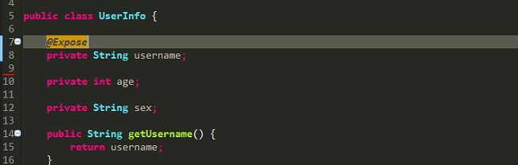
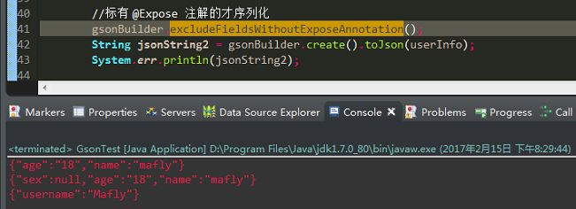
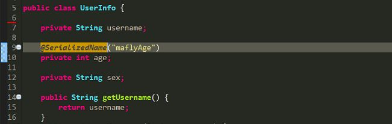
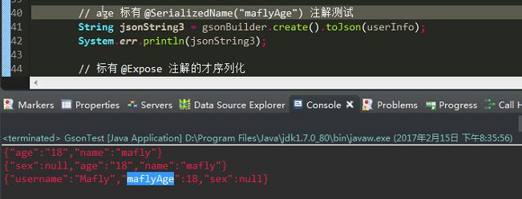
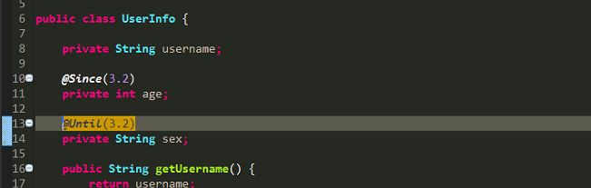
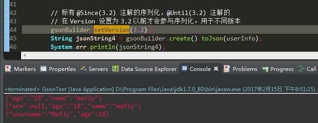

## 1. Gson介绍

Gson 是 Google 提供的用来在 Java 对象和 JSON 数据之间进行映射的 Java 类库。可以将 Java 对象转换为相应的 JSON 形式，也可以将 JSON 字符串转换为对应的 Java 对象。

Gson 可以使用任意 Java 对象，包括哪些预先存在的、但不在源代码中的对象（因此并不知道对象的属性）。

### 1.1. 特点

- 提供一种机制，使得将 Java 对象转换为 JSON，或相反如使用 `toString()`以及构造器（工厂方法）一样简单。
- 允许预先存在的不可变的对象转换为 JSON，或与之相反。
- 允许自定义对象的表现形式
- 支持任意复杂的对象
- 输出轻量易读的JSON
- 数据传递和解析方便

### 1.2. 依赖包

Gson，需要导入 jar 包：`gson-2.2.4.jar`

## 2. Gson 基础 API

```java
public Gson();
```

- 无参构造方法

```java
public String toJson(Objcet obj)
```

- 将任意类型转换成Json格式字符串

```java
public T fromJson(String jsonStr, T.class)
```

- 将json字符串转化为指定类型为T的Java对象

## 3. Gson 基础使用

可以仅仅通过 `new Gson()` 的方式创建 Gson 的核心对象。也可以通过 `GsonBuilder` 类去创建 Gson 实例，该类允许进行一系列配置，例如版本控制等等。

Gson 实例不会保存任何进行 Json 操作时的状态。因此可以自由的使用相同的 Gson 对象进行多个的 Json 序列化和反序列化操作。

### 3.1. 引入 maven 依赖

```xml
<!-- https://mvnrepository.com/artifact/com.google.guava/guava -->
<dependency>
    <groupId>com.google.guava</groupId>
    <artifactId>guava</artifactId>
    <version>28.2-jre</version>
</dependency>
```

### 3.2. 序列化

```java
// 基础类型
Gson gson = new Gson();
gson.toJson(1);            // prints 1
gson.toJson("abcd");       // prints "abcd"
gson.toJson(new Long(10)); // prints 10
int[] values = { 1 };
gson.toJson(values);       // prints [1]

// 对象
BagOfPrimitives obj = new BagOfPrimitives();
Gson gson = new Gson();
String json = gson.toJson(obj);  
// json is {"value1":1,"value2":"abc"}

// 数组
Gson gson = new Gson();
int[] ints = {1, 2, 3, 4, 5};
String[] strings = {"abc", "def", "ghi"};
gson.toJson(ints);     // prints [1,2,3,4,5]
gson.toJson(strings);  // prints ["abc", "def", "ghi"]

// 集合
Gson gson = new Gson();
Collection<Integer> ints = Lists.immutableList(1,2,3,4,5);
String json = gson.toJson(ints); // json is [1,2,3,4,5]
```

其中的对象代码：

```java
class BagOfPrimitives {
    private int value1 = 1;
    private String value2 = "abc";
    private transient int value3 = 3;
    BagOfPrimitives() {
        // no-args constructor
    }
}
```

### 3.3. 反序列化

```java
// 基础类型
Gson gson = new Gson();
int one = gson.fromJson("1", int.class);
Integer one = gson.fromJson("1", Integer.class);
Long one = gson.fromJson("1", Long.class);
Boolean false = gson.fromJson("false", Boolean.class);
String str = gson.fromJson("\"abc\"", String.class);
String anotherStr = gson.fromJson("[\"abc\"]", String.class);

// 对象
BagOfPrimitives obj2 = gson.fromJson(json, BagOfPrimitives.class);   
// obj2 is just like obj

// 数组
Gson gson = new Gson();
int[] ints2 = gson.fromJson("[1,2,3,4,5]", int[].class); 
// ints2 will be same as ints

// 集合
Gson gson = new Gson();
Type collectionType = new TypeToken<Collection<Integer>>(){}.getType();
Collection<Integer> ints2 = gson.fromJson(json, collectionType);
// ints2 is same as ints
```

### 3.4. 自定义序列化和反序列化机制

有时，默认的实现并非想要的，在处理类库时常常发生（例如 DateTime）。Gson 允许注册自己自定义的序列化器和反序列化器。该过程分为两部分：

- **Json 序列化器**：需要为一个对象自定义序列化机制。
- **Json 反序列化器**：需要为一个类型自定义反序列化机制。

如果无参构造器是可用的或者注册了一个反序列化器，则并不需要实例构造者。

```java
GsonBuilder gson = new GsonBuilder();
gson.registerTypeAdapter(MyType2.class, new MyTypeAdapter());
gson.registerTypeAdapter(MyType.class, new MySerializer());
gson.registerTypeAdapter(MyType.class, new MyDeserializer());
gson.registerTypeAdapter(MyType.class, new MyInstanceCreator());
```

`registerTypeAdapter` 会检查类型适配器是否实现了上面三个接口中的一个以上并且它们都注册了类型适配器。

## 4. Gson 使用案例

### 4.1. 案例-输出JSON字符串包含null值的属性

```java
public static void main(String[] args) {
   HashMap<String, Object> map = new HashMap<String, Object>();
   map.put("name", "mafly");
   map.put("age", "18");
   map.put("sex", null);

   String jsonString = new Gson().toJson(map);
   System.err.println(jsonString);
}
```

就是这个当`Sex=null`时，用Gson的tojson方法会把null值忽略，从而序列化之后输出不包含这个属性值的Json串。其实预期是输出`{"sex": ""}`或`{"sex": null}`，那怎么做呢？

**通过搜索引擎发现，网上大概存在以下三种解决方案：**

- 调用 `toJson(Object src, Type typeOfSrc, JsonWriter writer)` 方法
- 注册自定义 `TypeAdapter`
- 设置 `serializeNulls` 属性值（推荐)

使用第三种方式，源码如下：

```java
GsonBuilder gsonBuilder = new GsonBuilder();
String jsonString1 = gsonBuilder.serializeNulls().create().toJson(map);
System.err.println(jsonString1);
```

输出符合需求了，`{"sex": null}`

因为调用serializeNulls()后，Gson设置serializeNulls属性值为true，默认是false，源码:

```java
public GsonBuilder serializeNulls() {
   this.serializeNulls = true;
   return this;
}
```

### 4.2. Gson其他使用要点

可以用 `@SerializedName` 注解给属性重命名，用 `@Expose` 注解标识属性不进行序列化，支持 Map 的 key 为复杂对象的形式，日期类型转化为特定格式，还有区分版本进行显示，这些在日常项目中都极常用到，只不过好像我们之前都是自己实现的。

简单建立了一个 `UserInfo` 实体类，里边包含了 username、age、sex 这三个属性值。试着测试了一下其中一两个：

1. `@Expose` 想让谁输出谁输出，注解代码如图：



设置 `excludeFieldsWithoutExposeAnnotation()`，看下面第三行是输出



2. `@SerializedName` 想怎么显示怎么显示，注解代码如图：



想把 age 在 Json 序列化时显示 maflyAge，现在就可以了，输出如下图



3. `@Since`、`@Until` 不同版本不同数据，注解代码如图



这里要设置 `setVersion(3.2)`，`@Since` 标注的在 3.2 版本或之后才会输出，`@Until` 标注的只在 3.2 版本前才有。效果输出如下图



当然，还有好多特性呢，比如字段首字母大写阿、结果格式化阿等等

## 5. 参考资料

- [Gson用户指南（中文翻译）](https://www.jianshu.com/p/1e20b28c39d1)
