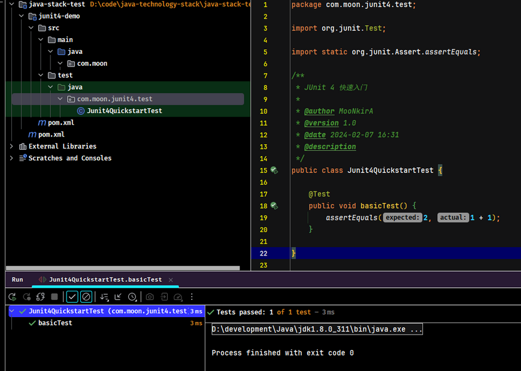

## 1. JUnit 概述

JUnit 是 Java 语言编写第三方单元测试框架。简单理解为可以用于取代使用 java 的 main 方法来测试代码。JUnit 属于第三方工具，一般情况下需要导入jar 包。不过多数 Java 开发环境已经集成了JUnit 作为单元测试工具。

### 1.1. 单元测试

> 百度百科：单元测试（unit testing），是指对软件中的最小可测试单元进行检查和验证。对于单元测试中单元的含义，一般来说，要根据实际情况去判定其具体含义，如 C 语言中单元指一个函数，Java 里单元指一个类，图形化的软件中可以指一个窗口或一个菜单等。总的来说，单元就是人为规定的最小的被测功能模块。单元测试是在软件开发过程中要进行的最低级别的测试活动，软件的独立单元将在与程序的其他部分相隔离的情况下进行测试。

简单来说，在 Java 中，一个类就是一个单元。开发者编写的一小段代码，用来检验某个类中的某个方法是否正确执行。可以让符合条件的方法独立运行(不依赖 main 方法)。

### 1.2. JUnit 特点

- 提供注解来识别测试方法。
- 提供断言来测试预期结果。
- JUnit 测试允许编写代码更快，并能提高质量。
- JUnit 优雅简洁。没那么复杂，花费时间较少。
- JUnit 测试可以自动运行并且检查自身结果并提供即时反馈。所以也没有必要人工梳理测试结果的报告。
- JUnit 测试可以被组织为测试套件，包含测试用例，甚至其他的测试套件。
- JUnit 在一个条中显示进度。如果运行良好则是绿色；如果运行失败，则变成红色。

### 1.3. 官方资料

- 官网： https://junit.org/junit4/
- 官方入门文档： https://github.com/junit-team/junit4/wiki/Assertions
- 官方 github： https://github.com/junit-team

## 2. JUnit 的基础使用步骤

整体的使用步骤：

1. 编写业务类
2. 编写测试类（编写测试方法）

### 2.1. 导入 JUnit

- 普通的 Java 项目：可以直接通过导入 jar 包的方式进行使用
- maven 项目：在 pom.xml 文件中，引入 JUnit 依赖

```xml
<dependency>
    <groupId>junit</groupId>
    <artifactId>junit</artifactId>
    <version>${junit.version}</version>
    <!-- 设置 junit 的作用范围 -->
    <scope>test</scope>
</dependency>
```

### 2.2. 编写测试方法

使用 `@Test` 注解标记的方法为测试方法，以便构建工具和 IDE 能够识别并执行它们。

```java
import org.junit.Test;

import static org.junit.Assert.assertEquals;

public class Junit4QuickstartTest {
    @Test
    public void basicTest() {
        assertEquals(2, 1 + 1);
    }
}
```

> Notes: <font color=red>**JUnit 4 测试方法必须是 `public` 修饰，没有返回值，没有方法参数，必须使用 `@Test` 注解修饰。这和 Junit 5 有差别！**</font>

### 2.3. 运行单元测试

- elipse：选中（方法/类/项目），右键 -> Run As -> JUnit Test
- idea：选中（方法/类/项目），右键 -> Run。或者直接点击类、方法所在行的左侧按钮

点击不同的位置，运行的效果有区别：

- **选中方法**：只执行该测试方法
- **选中类**：执行类中所有的测试方法
- **选中项目**：执行项目中所有测试类中的测试方法

### 2.4. 查看测试结果

- 输出标识是<font color=green>**绿色**</font>：表示测试没有问题
- 输出标识是<font color=red>**红色**</font>：表示测试失败，有 Bug



### 2.5. 通过断言辅助测试验证结果

示例代码：

```java
@Test
public void testSaveProduct(){
	// 创建产品对象
	boolean b = dao.saveProduct(new Product());
	/* 
	 * 断言：预先判断某个条件一定成立，如果不成立，则直接崩溃。
	 *   message：当期望值和实际值不一致，显示的提示信息
	 *   expected：期望值
	 *   actual：实际值
	 *   java.lang.AssertionError: 期望值和实际值不一致 expected:<true> but was:<false>
	 */
	Assert.assertEquals("期望值和实际值不一致", false, b);
	System.out.println(b);
}
```

### 2.6. JUnit 使用规范

- 测试类命名规范：一般建议 `Test+业务类名`
- 测试方法命名规范：`Test+被测试方法的名字`，使用驼峰命名方式

## 3. 生命周期测试

### 3.1. 相关注解

- `@BeforeClass` 注解修饰的方法（该方法要用 `static` 修饰）会**在所有方法运行前被执行，且只执行一次**。通常用来为后面测试方法的准备工作，如加载配置、进行数据库的连接等。父类的 `@BeforeClass` 注解方法会在子类的 `@BeforeClass` 注解方法执行前执行。
- `@Before` 注解修饰的方法会**在每个测试方法执行前执行一次**，父类 `@Before` 修饰的方法会在子类 `@Before` 修饰的方法执行前执行。
- `@After` 注解修饰的方法会**在每个测试方法执行后执行一次**，父类 `@After` 修饰的方法会在子类 `@After` 修饰的方法执行后执行。
- `@AfterClass` 注解修饰的方法（该方法要用 `static` 修饰）会**在所有方法执行结束后执行一次，且也只执行一次**。通常用来对资源进行释放，比如数据库连接的关闭等，无论测试用例里的其他方法有没有抛出异常，该方法最终都会被执行。而且父类中的被 `@AfterClass` 注解方法修饰的方法会在子类的 `@AfterClass` 注解修饰的方法执行之后才会被执行。

### 3.2. 使用示例

```java
package com.moon.junit4.test;

import org.junit.After;
import org.junit.AfterClass;
import org.junit.Before;
import org.junit.BeforeClass;
import org.junit.Test;

/**
 * 方法的生命周期相关测试示例
 */
public class StandardTest {

    @BeforeClass
    public static void beforeClass() {
        System.out.println("in before class");
    }

    @AfterClass
    public static void afterClass() {
        System.out.println("in after class");
    }

    @Before
    public void before() {
        System.out.println("in before");
    }

    @After
    public void after() {
        System.out.println("in after");
    }

    @Test
    public void testCase1() {
        System.out.println("in test case 1");
    }

    @Test
    public void testCase2() {
        System.out.println("in test case 2");
    }
}
```

运行结果：

```
in before class
in before
in test case 1
in after
in before
in test case 2
in after
in after class
```

## 4. 禁用测试

### 4.1. @Ignore 注解

`@Ignore`：暂不执行该方法。

### 4.2. 使用示例

```java
import org.junit.Ignore;
import org.junit.Test;


public class IgnoreTest {

    @Ignore
    @Test
    public void testIgnore() {
        System.out.println("ignore test");
    }
}
```

执行结果：


## 5. 断言测试

### 5.1. Assert 类

`org.junit.Assert` 类提供很多用于方便验证测试结果的工具方法。常用方法如下：


- `assertEquals` 方法：断言两个值相等。值类型可能是 int，short，long，byte，char，Object，第一个参数是一个可选字符串消息。
- `assertTrue` 方法：断言一个条件为真
- `assertFalse` 方法：断言一个条件为假
- `assertNotNull` 方法：断言一个对象不为空（null）
- `assertNull` 方法：断言一个对象为空（null）
- `assertSame` 方法：断言两个对象引用相同的对象
- `assertNotSame` 方法：断言两个对象不是引用同一个对象
- `assertArrayEquals`：断言预期数组和结果数组相等，数组类型可能是int，short，long，byte，char，Object

### 5.2. 基础使用示例

```java
import org.junit.Assert;
import org.junit.Test;

/**
 * 断言测试示例
 */
public class AssertionTest {
    @Test
    public void testAssert() {
        String obj1 = "junit";
        String obj2 = "junit";
        String obj3 = "test";
        String obj4 = "test";
        String obj5 = null;

        int var1 = 1;
        int var2 = 2;

        int[] array1 = {1, 2, 3};
        int[] array2 = {1, 2, 3};

        Assert.assertEquals(obj1, obj2);

        Assert.assertSame(obj3, obj4);
        Assert.assertNotSame(obj2, obj4);

        Assert.assertNotNull(obj1);
        Assert.assertNull(obj5);

        Assert.assertTrue(var1 < var2);
        Assert.assertFalse(var1 > var2);

        Assert.assertArrayEquals(array1, array2);
    }
}
```

从执行结果可见：

- `assertEquals()` 如果比较的两个对象是相等的，此方法将正常返回；否则失败显示在 JUnit 的窗口测试将中止。
- `assertSame()` 和 `assertNotSame()` 方法测试两个对象引用指向完全相同的对象。
- `assertNull()` 和 `assertNotNull()` 方法测试一个变量是否为空或不为空(null)。
- `assertTrue()` 和 `assertFalse()` 方法测试 if 条件或变量是 true 还是 false。
- `assertArrayEquals()` 将比较两个数组，如果它们相等，则该方法将继续进行不会发出错误。否则失败将显示在 JUnit 窗口和中止测试。

### 5.3. 官方示例

更多测试，来自官网 https://github.com/junit-team/junit4/wiki/Assertions

```java
import static org.hamcrest.CoreMatchers.allOf;
import static org.hamcrest.CoreMatchers.anyOf;
import static org.hamcrest.CoreMatchers.both;
import static org.hamcrest.CoreMatchers.containsString;
import static org.hamcrest.CoreMatchers.equalTo;
import static org.hamcrest.CoreMatchers.everyItem;
import static org.hamcrest.CoreMatchers.hasItems;
import static org.hamcrest.CoreMatchers.not;
import static org.hamcrest.CoreMatchers.sameInstance;
import static org.hamcrest.CoreMatchers.startsWith;
import static org.junit.Assert.assertArrayEquals;
import static org.junit.Assert.assertEquals;
import static org.junit.Assert.assertFalse;
import static org.junit.Assert.assertNotNull;
import static org.junit.Assert.assertNotSame;
import static org.junit.Assert.assertNull;
import static org.junit.Assert.assertSame;
import static org.junit.Assert.assertThat;
import static org.junit.Assert.assertTrue;

import java.util.Arrays;

import org.hamcrest.core.CombinableMatcher;
import org.junit.Test;

public class AssertTests {
    @Test
    public void testAssertArrayEquals() {
        byte[] expected = "trial".getBytes();
        byte[] actual = "trial".getBytes();
        assertArrayEquals("failure - byte arrays not same", expected, actual);
    }

    @Test
    public void testAssertEquals() {
        assertEquals("failure - strings are not equal", "text", "text");
    }

    @Test
    public void testAssertFalse() {
        assertFalse("failure - should be false", false);
    }

    @Test
    public void testAssertNotNull() {
        assertNotNull("should not be null", new Object());
    }

    @Test
    public void testAssertNotSame() {
        assertNotSame("should not be same Object", new Object(), new Object());
    }

    @Test
    public void testAssertNull() {
        assertNull("should be null", null);
    }

    @Test
    public void testAssertSame() {
        Integer aNumber = Integer.valueOf(768);
        assertSame("should be same", aNumber, aNumber);
    }

    // JUnit Matchers assertThat
    @Test
    public void testAssertThatBothContainsString() {
        assertThat("albumen", both(containsString("a")).and(containsString("b")));
    }

    @Test
    public void testAssertThatHasItems() {
        assertThat(Arrays.asList("one", "two", "three"), hasItems("one", "three"));
    }

    @Test
    public void testAssertThatEveryItemContainsString() {
        assertThat(Arrays.asList(new String[]{"fun", "ban", "net"}), everyItem(containsString("n")));
    }

    // Core Hamcrest Matchers with assertThat
    @Test
    public void testAssertThatHamcrestCoreMatchers() {
        assertThat("good", allOf(equalTo("good"), startsWith("good")));
        assertThat("good", not(allOf(equalTo("bad"), equalTo("good"))));
        assertThat("good", anyOf(equalTo("bad"), equalTo("good")));
        assertThat(7, not(CombinableMatcher.<Integer>either(equalTo(3)).or(equalTo(4))));
        assertThat(new Object(), not(sameInstance(new Object())));
    }

    @Test
    public void testAssertTrue() {
        assertTrue("failure - should be true", true);
    }
}
```

## 6. 异常测试

### 6.1. expected 参数

`@Test` 注解的 `expected` 参数是 Junit 提供的一个追踪异常的选项，可以测试代码是否它抛出了想要得到的异常。

### 6.2. 使用示例

```java
import org.junit.Test;

/**
 * 异常测试示例
 */
public class ExceptionTest {

    @Test(expected = ArithmeticException.class)
    public void exceptionTest() {
        System.out.println("in exception success test");
        int a = 0;
        int b = 1 / a;
    }

    @Test(expected = NullPointerException.class)
    public void exceptionFailTest() {
        System.out.println("in exception fail test");
        int a = 0;
        int b = 1 / a;
    } 
}
```

执行结果


输出的错误信息：

```java
in exception success test
in exception fail test

java.lang.Exception: Unexpected exception, expected<java.lang.NullPointerException> but was<java.lang.ArithmeticException>

	at org.junit.internal.runners.statements.ExpectException.evaluate(ExpectException.java:30)
	at org.junit.runners.ParentRunner$3.evaluate(ParentRunner.java:306)
	at org.junit.runners.BlockJUnit4ClassRunner$1.evaluate(BlockJUnit4ClassRunner.java:100)
	at org.junit.runners.ParentRunner.runLeaf(ParentRunner.java:366)
	at org.junit.runners.BlockJUnit4ClassRunner.runChild(BlockJUnit4ClassRunner.java:103)
	at org.junit.runners.BlockJUnit4ClassRunner.runChild(BlockJUnit4ClassRunner.java:63)
	at org.junit.runners.ParentRunner$4.run(ParentRunner.java:331)
	at org.junit.runners.ParentRunner$1.schedule(ParentRunner.java:79)
	at org.junit.runners.ParentRunner.runChildren(ParentRunner.java:329)
	at org.junit.runners.ParentRunner.access$100(ParentRunner.java:66)
	at org.junit.runners.ParentRunner$2.evaluate(ParentRunner.java:293)
	at org.junit.runners.ParentRunner$3.evaluate(ParentRunner.java:306)
	at org.junit.runners.ParentRunner.run(ParentRunner.java:413)
	at org.junit.runner.JUnitCore.run(JUnitCore.java:137)
	at com.intellij.junit4.JUnit4IdeaTestRunner.startRunnerWithArgs(JUnit4IdeaTestRunner.java:69)
	at com.intellij.rt.junit.IdeaTestRunner$Repeater$1.execute(IdeaTestRunner.java:38)
	at com.intellij.rt.execution.junit.TestsRepeater.repeat(TestsRepeater.java:11)
	at com.intellij.rt.junit.IdeaTestRunner$Repeater.startRunnerWithArgs(IdeaTestRunner.java:35)
	at com.intellij.rt.junit.JUnitStarter.prepareStreamsAndStart(JUnitStarter.java:232)
	at com.intellij.rt.junit.JUnitStarter.main(JUnitStarter.java:55)
Caused by: java.lang.ArithmeticException: / by zero
	at com.moon.junit4.test.ExceptionTest.exceptionFailTest(ExceptionTest.java:26)
	at sun.reflect.NativeMethodAccessorImpl.invoke0(Native Method)
	at sun.reflect.NativeMethodAccessorImpl.invoke(NativeMethodAccessorImpl.java:62)
	at sun.reflect.DelegatingMethodAccessorImpl.invoke(DelegatingMethodAccessorImpl.java:43)
	at java.lang.reflect.Method.invoke(Method.java:498)
	at org.junit.runners.model.FrameworkMethod$1.runReflectiveCall(FrameworkMethod.java:59)
	at org.junit.internal.runners.model.ReflectiveCallable.run(ReflectiveCallable.java:12)
	at org.junit.runners.model.FrameworkMethod.invokeExplosively(FrameworkMethod.java:56)
	at org.junit.internal.runners.statements.InvokeMethod.evaluate(InvokeMethod.java:17)
	at org.junit.internal.runners.statements.ExpectException.evaluate(ExpectException.java:19)
	... 19 more
```

## 7. 时间测试

### 7.1. timeout 参数

`@Test` 注解的 `timeout ` 参数是 Junit 提供的一个测试运行时间的选项，如果一个测试用例比起指定的毫秒数花费了更多的时间，那么 JUnit 将自动将它标记为失败。

### 7.2. 使用示例

```java
import org.junit.Test;

import java.util.concurrent.TimeUnit;

/**
 * 时间测试示例
 */
public class TimeoutTest {
    @Test(timeout = 1000)
    public void testTimeout() throws InterruptedException {
        TimeUnit.SECONDS.sleep(5000);
        System.out.println("in timeout exception");
    }
}
```

执行结果：

```java
org.junit.runners.model.TestTimedOutException: test timed out after 1000 milliseconds

	at java.lang.Thread.sleep(Native Method)
	at java.lang.Thread.sleep(Thread.java:340)
	at java.util.concurrent.TimeUnit.sleep(TimeUnit.java:386)
	at com.moon.junit4.test.TimeoutTest.testTimeout(TimeoutTest.java:19)
	at sun.reflect.NativeMethodAccessorImpl.invoke0(Native Method)
	at sun.reflect.NativeMethodAccessorImpl.invoke(NativeMethodAccessorImpl.java:62)
	at sun.reflect.DelegatingMethodAccessorImpl.invoke(DelegatingMethodAccessorImpl.java:43)
	at java.lang.reflect.Method.invoke(Method.java:498)
	at org.junit.runners.model.FrameworkMethod$1.runReflectiveCall(FrameworkMethod.java:59)
	at org.junit.internal.runners.model.ReflectiveCallable.run(ReflectiveCallable.java:12)
	at org.junit.runners.model.FrameworkMethod.invokeExplosively(FrameworkMethod.java:56)
	at org.junit.internal.runners.statements.InvokeMethod.evaluate(InvokeMethod.java:17)
	at org.junit.internal.runners.statements.FailOnTimeout$CallableStatement.call(FailOnTimeout.java:299)
	at org.junit.internal.runners.statements.FailOnTimeout$CallableStatement.call(FailOnTimeout.java:293)
	at java.util.concurrent.FutureTask.run(FutureTask.java:266)
	at java.lang.Thread.run(Thread.java:748)
```

### 7.3. 超时规则示例

应用到测试类的所有测试用例

```java
import org.junit.Rule;
import org.junit.Test;
import org.junit.rules.Timeout;

import java.util.concurrent.CountDownLatch;
import java.util.concurrent.TimeUnit;

/**
 * 将超时时间应用到测试类的所有测试用例
 */
public class GlobalTimeoutTest {

    public static String log;

    private final CountDownLatch latch = new CountDownLatch(1);

    @Rule
    public Timeout globalTimeout = Timeout.seconds(10); // 10 seconds max per method tested

    @Test
    public void testSleepForTooLong() throws Exception {
        log += "ran1";
        TimeUnit.SECONDS.sleep(100); // sleep for 100 seconds
    }

    @Test
    public void testBlockForever() throws Exception {
        log += "ran2";
        latch.await(); // will block
    }
}
```

执行结果

```java
org.junit.runners.model.TestTimedOutException: test timed out after 10 seconds

	at sun.misc.Unsafe.park(Native Method)
	at java.util.concurrent.locks.LockSupport.park(LockSupport.java:175)
	at java.util.concurrent.locks.AbstractQueuedSynchronizer.parkAndCheckInterrupt(AbstractQueuedSynchronizer.java:836)
	at java.util.concurrent.locks.AbstractQueuedSynchronizer.doAcquireSharedInterruptibly(AbstractQueuedSynchronizer.java:997)
	at java.util.concurrent.locks.AbstractQueuedSynchronizer.acquireSharedInterruptibly(AbstractQueuedSynchronizer.java:1304)
	at java.util.concurrent.CountDownLatch.await(CountDownLatch.java:231)
	at com.moon.junit4.test.TimeoutTest.testBlockForever(TimeoutTest.java:42)
	at sun.reflect.NativeMethodAccessorImpl.invoke0(Native Method)
	at sun.reflect.NativeMethodAccessorImpl.invoke(NativeMethodAccessorImpl.java:62)
	at sun.reflect.DelegatingMethodAccessorImpl.invoke(DelegatingMethodAccessorImpl.java:43)
	at java.lang.reflect.Method.invoke(Method.java:498)
	at org.junit.runners.model.FrameworkMethod$1.runReflectiveCall(FrameworkMethod.java:59)
	at org.junit.internal.runners.model.ReflectiveCallable.run(ReflectiveCallable.java:12)
	at org.junit.runners.model.FrameworkMethod.invokeExplosively(FrameworkMethod.java:56)
	at org.junit.internal.runners.statements.InvokeMethod.evaluate(InvokeMethod.java:17)
	at org.junit.internal.runners.statements.FailOnTimeout$CallableStatement.call(FailOnTimeout.java:299)
	at org.junit.internal.runners.statements.FailOnTimeout$CallableStatement.call(FailOnTimeout.java:293)
	at java.util.concurrent.FutureTask.run(FutureTask.java:266)
	at java.lang.Thread.run(Thread.java:748)


org.junit.runners.model.TestTimedOutException: test timed out after 10 seconds

	at java.lang.Thread.sleep(Native Method)
	at java.lang.Thread.sleep(Thread.java:340)
	at java.util.concurrent.TimeUnit.sleep(TimeUnit.java:386)
	at com.moon.junit4.test.TimeoutTest.testSleepForTooLong(TimeoutTest.java:36)
	at sun.reflect.NativeMethodAccessorImpl.invoke0(Native Method)
	at sun.reflect.NativeMethodAccessorImpl.invoke(NativeMethodAccessorImpl.java:62)
	at sun.reflect.DelegatingMethodAccessorImpl.invoke(DelegatingMethodAccessorImpl.java:43)
	at java.lang.reflect.Method.invoke(Method.java:498)
	at org.junit.runners.model.FrameworkMethod$1.runReflectiveCall(FrameworkMethod.java:59)
	at org.junit.internal.runners.model.ReflectiveCallable.run(ReflectiveCallable.java:12)
	at org.junit.runners.model.FrameworkMethod.invokeExplosively(FrameworkMethod.java:56)
	at org.junit.internal.runners.statements.InvokeMethod.evaluate(InvokeMethod.java:17)
	at org.junit.internal.runners.statements.FailOnTimeout$CallableStatement.call(FailOnTimeout.java:299)
	at org.junit.internal.runners.statements.FailOnTimeout$CallableStatement.call(FailOnTimeout.java:293)
	at java.util.concurrent.FutureTask.run(FutureTask.java:266)
	at java.lang.Thread.run(Thread.java:748)


Process finished with exit code -1
```

## 8. 参数化测试

### 8.1. 参数化测试步骤

Junit 4 引入了一个新的功能参数化测试。参数化测试允许开发人员使用不同的值反复运行同一个测试。需要遵循 5 个步骤来创建参数化测试：

1. 为准备使用参数化测试的测试类指定特殊的运行器 `org.junit.runners.Parameterized`。
2. 为测试类声明几个变量，分别用于存放期望值和测试所用数据。
3. 为测试类声明一个带有参数的公共构造函数，并在其中为第二个环节中声明的几个变量赋值。
4. 为测试类声明一个使用注解 `org.junit.runners.Parameterized.Parameters` 修饰的，返回值为 `java.util.Collection` 的公共静态方法，并在此方法中初始化所有需要测试的参数对。
5. 编写测试方法，使用定义的变量作为参数进行测试。

### 8.2. @RunWith 注解

先梳理以下涉及的相关概念：

- 测试方法就是用@Test注解的一些函数。
- 测试类是包含一个或多个测试方法的一个 `**Test.java` 文件。
- 测试集是一个suite，可能包含多个测试类。
- 测试运行器则决定了用什么方式偏好去运行这些测试集/类/方法。

`@RunWith` 是放在测试类名之前，用来确定这个类怎么运行的。也可以不标注，会使用默认运行器。常见的运行器有：

- `@RunWith(Parameterized.class)` 参数化运行器，配合 `@Parameters` 使用 JUnit 的参数化功能
- `@RunWith(Suite.class)`、`@SuiteClasses({ATest.class,BTest.class,CTest.class})` 测试集运行器配合使用测试集功能
- `@RunWith(JUnit4.class)`， JUnit4 的默认运行器
- `@RunWith(JUnit38ClassRunner.class)`，用于兼容 JUnit3.8 的运行器和一些其它运行器具备更多功能。例如 `@RunWith(SpringJUnit4ClassRunner.class)` 集成了 spring 的一些功能。

### 8.3. 使用示例

准备待测试类

```java
public class PrimeNumberChecker {
    public Boolean validate(final Integer parimeNumber) {
        for (int i = 2; i < (parimeNumber / 2); i++) {
            if (parimeNumber % i == 0) {
                return false;
            }
        }
        return true;
    }
}
```

编写测试类

```java
import com.moon.junit4.PrimeNumberChecker;
import org.junit.Assert;
import org.junit.Before;
import org.junit.Test;
import org.junit.runner.RunWith;
import org.junit.runners.Parameterized;

import java.util.Arrays;
import java.util.Collection;

/**
 * 参数化测试示例
 */
@RunWith(Parameterized.class) // 步骤一: 指定定参数运行器
public class ParameterizedTest {
    /**
     * 步骤二：声明变量
     */
    private final Integer inputNumber;
    private final Boolean expectedResult;
    private PrimeNumberChecker primeNumberChecker;

    /**
     * 步骤三：为测试类声明一个带有参数的公共构造函数，为变量赋值
     */
    public ParameterizedTest(Integer inputNumber, Boolean expectedResult) {
        this.inputNumber = inputNumber;
        this.expectedResult = expectedResult;
    }

    /**
     * 步骤四：为测试类声明一个使用注解 org.junit.runners.Parameterized.Parameters 修饰的，返回值为
     * java.util.Collection 的公共静态方法，并在此方法中初始化所有需要测试的参数对
     * 1）该方法必须由Parameters注解修饰
     * 2）该方法必须为public static的
     * 3）该方法必须返回Collection类型
     * 4）该方法的名字不做要求
     * 5）该方法没有参数
     */
    @Parameterized.Parameters
    public static Collection primeNumbers() {
        return Arrays.asList(new Object[][]{{2, true}, {6, false}, {19, true}, {22, false}, {23, true}});
    }

    @Before
    public void initialize() {
        primeNumberChecker = new PrimeNumberChecker();
    }

    /**
     * 步骤五：编写测试方法，使用自定义变量进行测试
     */
    @Test
    public void testPrimeNumberChecker() {
        System.out.println("Parameterized Number is : " + inputNumber);
        Assert.assertEquals(expectedResult, primeNumberChecker.validate(inputNumber));
    }
}
```

执行结果


## 9. 套件测试

### 9.1. @Suite 注解

**套件测试**是指捆绑了几个单元测试用例并运行起来。在 JUnit 中，`@RunWith` 和 `@Suite` 这两个注解是用于运行套件测试。

### 9.2. 使用示例

创建两个测试类

```java
public class JunitTest1 {
    @Test
    public void printMessage() {
        System.out.println("in JunitTest1");
    }
}

public class JunitTest2 {
    @Test
    public void printMessage() {
        System.out.println("in JunitTest2");
    }
}
```

编写测试套件

```java
import org.junit.runner.RunWith;
import org.junit.runners.Suite;

/**
 * 套件测试示例
 */
@RunWith(Suite.class)
@Suite.SuiteClasses({JunitTest1.class, JunitTest2.class}) // 此处类的配置顺序会影响执行顺序
public class JunitSuiteTest {
}
```

执行结果


## 10. 测试顺序

### 10.1. @FixMethodOrder 注解

在 JUnit 中，测试方法的执行顺序默认是按在类中定义的顺序。而通过 `@FixMethodOrder` 注解，可以自定义测试方法的顺序。

### 10.2. 使用示例

按照方法的名字顺序：

```java
import org.junit.FixMethodOrder;
import org.junit.Test;
import org.junit.runners.MethodSorters;

/**
 * 自定义测试方法的顺序示例
 */
@FixMethodOrder(MethodSorters.NAME_ASCENDING)
public class FixMethodOrderTest {

    @Test
    public void testA() {
        System.out.println("first");
    }

    @Test
    public void testC() {
        System.out.println("third");
    }

    @Test
    public void testB() {
        System.out.println("second");
    }
}
```

执行结果


