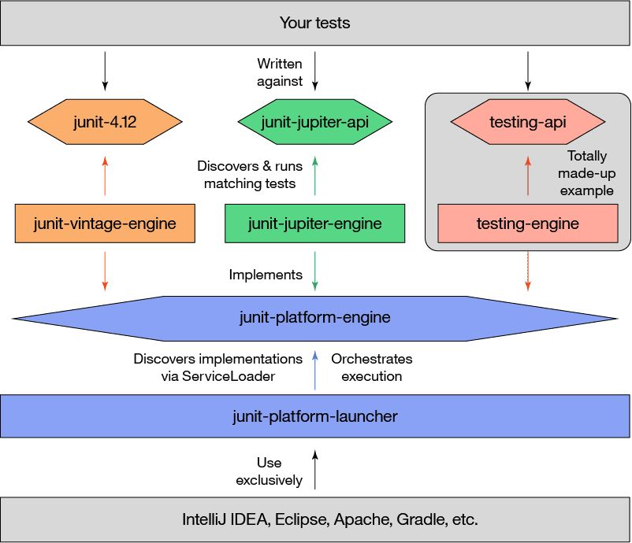
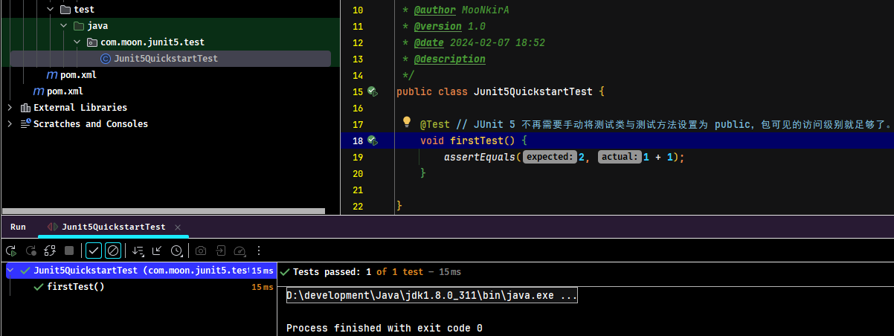
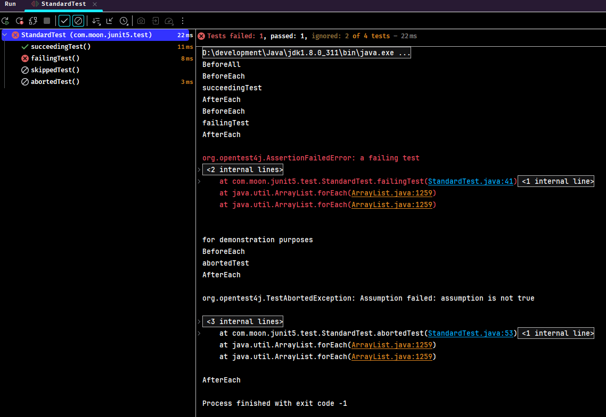
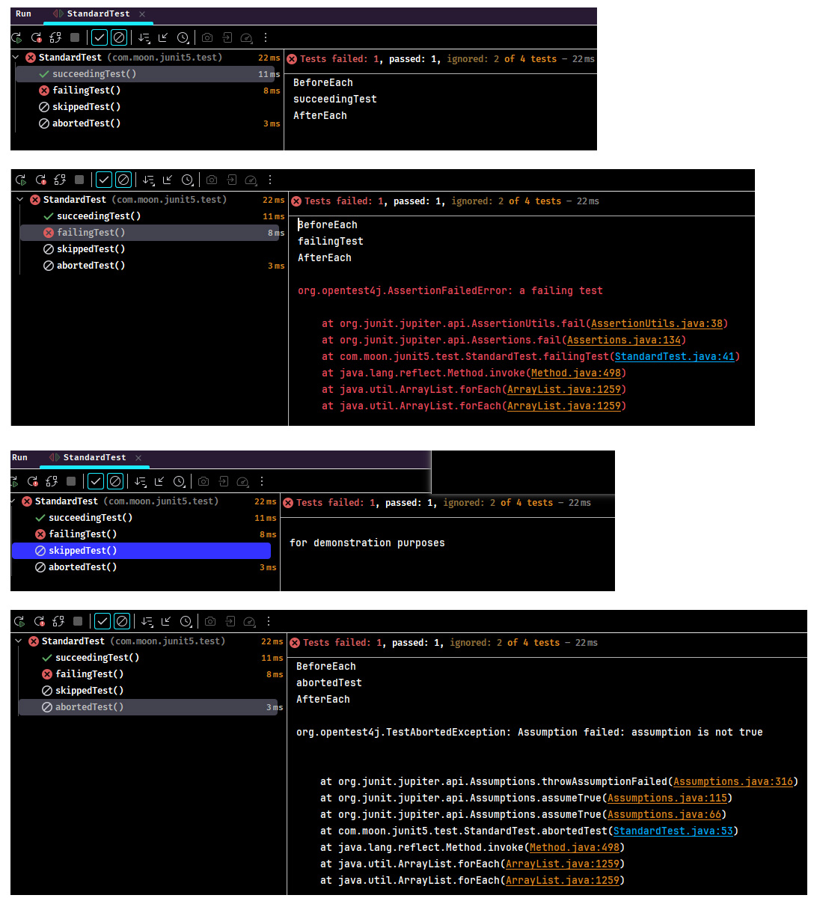
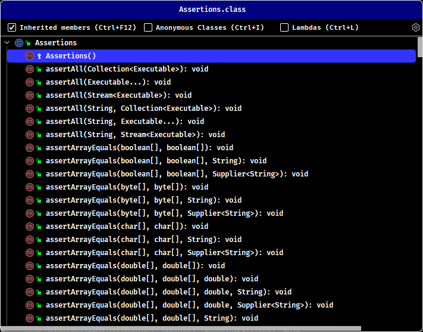
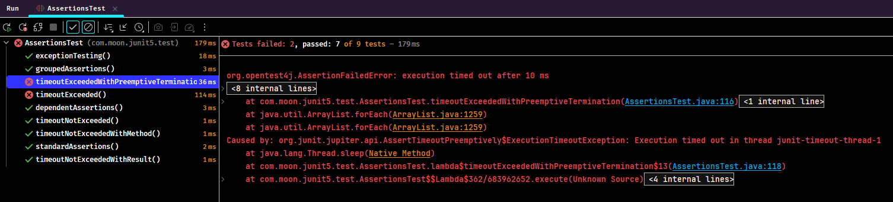
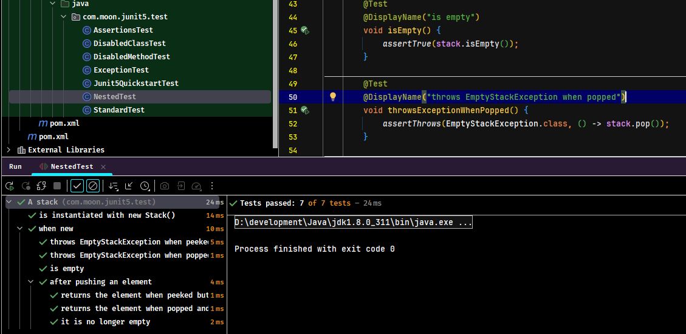
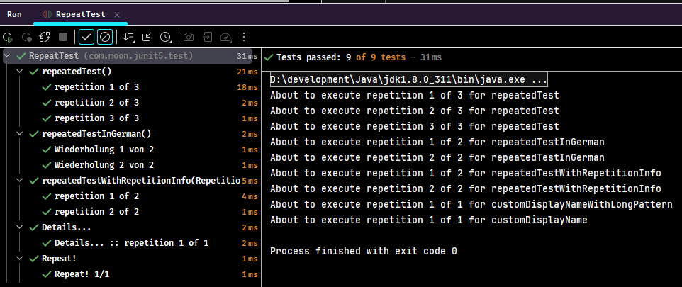

## 1. JUnit5 简介

JUnit 5 是当前一代的 JUnit 测试框架，它为 JVM 上的开发人员的测试提供了现代化的基础。这包括专注于 Java 8 及以上版本，以及支持多种不同风格的测试。

### 1.1. 官方资料

- 官网： https://junit.org/junit5/
- 官方入门文档： https://junit.org/junit5/docs/current/user-guide/#overview
- 官方示例： https://github.com/junit-team/junit5-samples
- 官方 github： https://github.com/junit-team

### 1.2. Junit5 的架构

与以前版本的 JUnit 不同，JUnit 5 由三个不同子项目中的几个不同模块组成。

> JUnit 5 = JUnit Platform + JUnit Jupiter + JUnit Vintage

- JUnit Platform 是基于 JVM 的运行测试的基础框架在，它定义了开发运行在这个测试框架上的 TestEngine API。此外该平台提供了一个控制台启动器，可以从命令行启动平台，可以为 Gradle 和 Maven 构建插件，同时提供基于 JUnit 4 的 Runner。
- JUnit Jupiter 是在 JUnit 5 中编写测试和扩展的新编程模型和扩展模型的组合，Jupiter 子项目提供了一个 TestEngine 在平台上运行基于 Jupiter 的测试。
- JUnit Vintage 提供了一个 TestEngine 在平台上运行基于 JUnit 3 和 JUnit 4 的测试。

架构图：



### 1.3. Junit5 常用注解

- `@Test` 表示方法是一种测试方法。与 JUnit 4 的 `@Test` 注解不同，此注释不会声明任何属性。
- `@ParameterizedTest` 表示方法是参数化测试
- `@RepeatedTest` 表示方法是重复测试模板
- `@TestFactory` 表示方法是动态测试的测试工程
- `@DisplayName` 为测试类或者测试方法自定义一个名称
- `@BeforeEach` 表示方法在每个测试方法运行前都会运行
- `@AfterEach` 表示方法在每个测试方法运行之后都会运行
- `@BeforeAll` 表示方法在所有测试方法之前运行
- `@AfterAll` 表示方法在所有测试方法之后运行
- `@Nested` 表示带注解的类是嵌套的非静态测试类，`@BeforeAll` 和 `@AfterAll` 方法不能直接在 `@Nested` 测试类中使用，除非修改测试实例生命周期。
- `@Tag` 用于在类或方法级别声明用于过滤测试的标记
- `@Disabled` 用于禁用测试类或测试方法
- `@ExtendWith` 用于注册自定义扩展，该注解可以继承
- `@FixMethodOrder(MethodSorters.NAME_ASCENDING)`，控制测试类中方法执行的顺序，这种测试方式将按方法名称的进行排序，由于是按字符的字典顺序，所以以这种方式指定执行顺序会始终保持一致；不过这种方式需要对测试方法有一定的命名规则，如测试方法均以 `testNNN` 开头（`NNN` 表示测试方法序列号 `001-999`）

## 2. JUnit5 快速开始

### 2.1. 引入 maven 依赖

```xml
<dependencies>
    <dependency>
        <groupId>org.junit.platform</groupId>
        <artifactId>junit-platform-launcher</artifactId>
        <version>1.10.0</version>
        <scope>test</scope>
    </dependency>
    <dependency>
        <groupId>org.junit.jupiter</groupId>
        <artifactId>junit-jupiter-engine</artifactId>
        <version>5.10.0</version>
        <scope>test</scope>
    </dependency>
    <dependency>
        <groupId>org.junit.vintage</groupId>
        <artifactId>junit-vintage-engine</artifactId>
        <version>5.10.0</version>
        <scope>test</scope>
    </dependency>
    <dependency>
        <groupId>org.junit.jupiter</groupId>
        <artifactId>junit-jupiter-api</artifactId>
        <version>5.10.0</version>
    </dependency>

    <dependency>
        <groupId>org.projectlombok</groupId>
        <artifactId>lombok</artifactId>
        <version>1.18.30</version>
    </dependency>
</dependencies>
```

### 2.2. 编写 @Test 测试方法

`@Test` 注解标记的方法为测试方法，以便构建工具和 IDE 能够识别并执行它们。<font color=red>**JUnit 5 不再需要手动将测试类与测试方法为 `public`，包可见的访问级别即可**</font>。

```java
import org.junit.jupiter.api.Test;

import static org.junit.jupiter.api.Assertions.assertEquals;

public class Junit5QuickstartTest {
    @Test // JUnit 5 不再需要手动将测试类与测试方法设置为 public，包可见的访问级别就足够了。
    void firstTest() {
        assertEquals(2, 1 + 1);
    }
}
```

### 2.3. 运行单元测试



## 3. 生命周期测试

### 3.1. 相关注解

需要特别注意，Junit5 和 Junit4 注解不一样：

- `@BeforeAll` 表示使用了该注解的方法应该在**当前类中所有测试方法之前执行（只执行一次），并且它必须是 static 方法**（除非 `@TestInstance` 指定生命周期为 `Lifecycle.PER_CLASS`）。*（等同于 Junit4 的 `@BeforeClass`）*
- `@BeforeEach` 表示使用了该注解的方法应该在**当前类中每一个测试方法之前执行**。*（等同于 Junit4 的 `@Before`）*
- `@AfterEach` 表示使用了该注解的方法应该在**当前类中每一个测试方法之后执行**。*（等同于 Junit4 的 `@After`）*
- `@AfterAll` 表示使用了该注解的方法应该在**当前类中所有测试方法之后执行（只执行一次），并且它必须是 static 方法**（除非 `@TestInstance` 指定生命周期为 `Lifecycle.PER_CLASS`）。*（等同于 Junit4 的 `@AfterClass`）*

### 3.2. 使用示例

```java
import org.junit.jupiter.api.AfterAll;
import org.junit.jupiter.api.AfterEach;
import org.junit.jupiter.api.BeforeAll;
import org.junit.jupiter.api.BeforeEach;
import org.junit.jupiter.api.Disabled;
import org.junit.jupiter.api.Test;

import static org.junit.jupiter.api.Assertions.fail;
import static org.junit.jupiter.api.Assumptions.assumeTrue;

/**
 * 生命周期测试示例
 */
public class StandardTest {
    @BeforeAll
    static void initAll() {
        System.out.println("BeforeAll");
    }

    @BeforeEach
    void init() {
        System.out.println("BeforeEach");
    }

    @Test
    void succeedingTest() {
        System.out.println("succeedingTest");
    }

    @Test
    void failingTest() {
        System.out.println("failingTest");
        fail("a failing test");
    }

    @Test
    @Disabled("for demonstration purposes")
    void skippedTest() {
        // not executed
    }

    @Test
    void abortedTest() {
        System.out.println("abortedTest");
        assumeTrue("abc".contains("Z"));
        fail("test should have been aborted");
    }

    @AfterEach
    void tearDown() {
        System.out.println("AfterEach");
    }

    @AfterAll
    static void tearDownAll() {
        System.out.println("AfterEach");
    }
}
```

运行所有测试用例，观察正确和错误的结果：





## 4. 禁用测试

### 4.1. @Disabled 注解

`@Disabled` 用于禁用（或者说忽略）一个测试类或测试方法。*（等同于 Junit4 的 `@Ignore`）*

### 4.2. 使用示例

禁用整个测试示例：

```java
import org.junit.jupiter.api.Disabled;
import org.junit.jupiter.api.Test;

/**
 * 禁用整个类测试示例
 */
@Disabled
public class DisabledClassTest {
    @Test
    void testWillBeSkipped() {
    }
}
```

带有禁用测试方法的测试示例：

```java
import org.junit.jupiter.api.Disabled;
import org.junit.jupiter.api.Test;

/**
 * 禁用测试方法示例
 */
public class DisabledMethodTest {
    @Disabled
    @Test
    void testWillBeSkipped() {
    }

    @Test
    void testWillBeExecuted() {
    }
}
```

## 5. 断言测试

### 5.1. 断言概述

断言能确保得到执行了被测类的方法以后想要的结果。

一般的断言，无非是检查一个实例的属性（比如，判空与判非空等），或者对两个实例进行比较（比如，检查两个实例对象是否相等）等。无论哪种检查，断言方法都可以接受一个字符串作为最后一个可选参数，它会在断言失败时提供必要的描述信息。如果提供出错信息的过程比较复杂，它也可以被包装在一个 lambda 表达式中，这样，只有到真正失败的时候，消息才会真正被构造出来。

### 5.2. Assertions 断言类

`org.junit.jupiter.api.Assertions` 是 JUnit 5 提供的断言工具类



- `assertEquals` 断言预期值和实际值相等
- `assertAll` 分组断言，执行其中包含的所有断言
- `assertArrayEquals` 断言预期数组和实际数组相等
- `assertFalse` 断言条件为假
- `assertNotNull` 断言不为空
- `assertSame` 断言两个对象相等
- `assertTimeout` 断言超时
- `fail` 使单元测试失败

### 5.3. 使用示例

创建用于测试的类：

```java
@Data
@AllArgsConstructor
public class Person {
    private String firstName;

    private String lastName;
}
```

创建测试用例

```java
import com.moon.junit5.entity.Person;
import org.junit.jupiter.api.Test;

import static java.time.Duration.ofMillis;
import static java.time.Duration.ofMinutes;
import static org.junit.jupiter.api.Assertions.*;

/**
 * 断言测试示例
 */
public class AssertionsTest {

    Person person = new Person("John", "Doe");

    @Test
    void standardAssertions() {
        assertEquals(2, 2);
        assertEquals(4, 4, "The optional assertion message is now the last parameter.");
        assertTrue(2 == 2, () -> "Assertion messages can be lazily evaluated -- "
                + "to avoid constructing complex messages unnecessarily.");
    }

    @Test
    void groupedAssertions() {
        // In a grouped assertion all assertions are executed, and any
        // failures will be reported together.
        assertAll("person",
                () -> assertEquals("John", person.getFirstName()),
                () -> assertEquals("Doe", person.getLastName())
        );
    }

    @Test
    void dependentAssertions() {
        // Within a code block, if an assertion fails the
        // subsequent code in the same block will be skipped.
        assertAll("properties",
                () -> {
                    String firstName = person.getFirstName();
                    assertNotNull(firstName);

                    // Executed only if the previous assertion is valid.
                    assertAll("first name",
                            () -> assertTrue(firstName.startsWith("J")),
                            () -> assertTrue(firstName.endsWith("n"))
                    );
                },
                () -> {
                    // Grouped assertion, so processed independently
                    // of results of first name assertions.
                    String lastName = person.getLastName();
                    assertNotNull(lastName);

                    // Executed only if the previous assertion is valid.
                    assertAll("last name",
                            () -> assertTrue(lastName.startsWith("D")),
                            () -> assertTrue(lastName.endsWith("e"))
                    );
                }
        );
    }

    @Test
    void exceptionTesting() {
        Throwable exception = assertThrows(IllegalArgumentException.class, () -> {
            throw new IllegalArgumentException("a message");
        });
        assertEquals("a message", exception.getMessage());
    }

    @Test
    void timeoutNotExceeded() {
        // The following assertion succeeds.
        assertTimeout(ofMinutes(2), () -> {
            // Perform task that takes less than 2 minutes.
        });
    }

    @Test
    void timeoutNotExceededWithResult() {
        // The following assertion succeeds, and returns the supplied object.
        String actualResult = assertTimeout(ofMinutes(2), () -> {
            return "a result";
        });
        assertEquals("a result", actualResult);
    }

    @Test
    void timeoutNotExceededWithMethod() {
        // The following assertion invokes a method reference and returns an object.
        String actualGreeting = assertTimeout(ofMinutes(2), AssertionsTest::greeting);
        assertEquals("hello world!", actualGreeting);
    }

    @Test
    void timeoutExceeded() {
        // The following assertion fails with an error message similar to:
        // execution exceeded timeout of 10 ms by 91 ms
        assertTimeout(ofMillis(10), () -> {
            // Simulate task that takes more than 10 ms.
            Thread.sleep(100);
        });
    }

    @Test
    void timeoutExceededWithPreemptiveTermination() {
        // The following assertion fails with an error message similar to:
        // execution timed out after 10 ms
        assertTimeoutPreemptively(ofMillis(10), () -> {
            // Simulate task that takes more than 10 ms.
            Thread.sleep(100);
        });
    }

    private static String greeting() {
        return "hello world!";
    }

}
```

执行结果



<font color=red>**值得注意，`assertTimeoutPreemptively()` 和 `assertTimeout()` 的区别为：两者都是断言超时，前者在指定时间没有完成任务就会立即返回断言失败；后者会在任务执行完毕之后才返回**</font>。

## 6. 异常测试

### 6.1. assertThrows 异常抛出断言

代码中对于带有异常的方法通常都是使用 try-catch 方式捕获处理，JUnit 5 在 `Assertions` 类中提供 `assertThrows` 方法来针对测试带有异常抛出的代码。

```java
public static <T extends Throwable> T assertThrows(Class<T> expectedType, Executable executable)
public static <T extends Throwable> T assertThrows(Class<T> expectedType, Executable executable, String message) 
public static <T extends Throwable> T assertThrows(Class<T> expectedType, Executable executable, Supplier<String> messageSupplier)
```

- 第一个参数 `expectedType` 为异常类型。
- 第二个参数 `executable` 为函数式接口，跟 Runnable 接口相似，不需要参数，也没有返回，并且支持 Lambda表达式方式使用。
- 第三个参数 `message`/`messageSupplier` 是断言提示的信息

### 6.2. 使用示例

```java
import org.junit.jupiter.api.DisplayName;
import org.junit.jupiter.api.Test;

import static org.junit.jupiter.api.Assertions.assertThrows;

/**
 * 异常测试示例
 */
public class ExceptionTest {
    // 标准的测试例子
    @Test
    @DisplayName("Exception Test Demo")
    void assertThrowsException() {
        String str = null;
        assertThrows(IllegalArgumentException.class, () -> Integer.valueOf(str));
    }

    // 注:异常失败例子，当Lambda表达式中代码出现的异常会跟首个参数的异常类型进行比较，如果不属于同一类异常，则失败
    @Test
    @DisplayName("Exception Test Demo2")
    void assertThrowsException2() {
        String str = null;
        assertThrows(NullPointerException.class, () -> Integer.valueOf(str));
    }
}
```

执行结果

```java
org.opentest4j.AssertionFailedError: Unexpected exception type thrown, 
Expected :class java.lang.NullPointerException
Actual   :class java.lang.NumberFormatException

	at org.junit.jupiter.api.AssertionFailureBuilder.build(AssertionFailureBuilder.java:151)
	at org.junit.jupiter.api.AssertThrows.assertThrows(AssertThrows.java:67)
	at org.junit.jupiter.api.AssertThrows.assertThrows(AssertThrows.java:35)
	at org.junit.jupiter.api.Assertions.assertThrows(Assertions.java:3111)
	at com.moon.junit5.test.ExceptionTest.assertThrowsException2(ExceptionTest.java:31)
	at java.lang.reflect.Method.invoke(Method.java:498)
	at java.util.ArrayList.forEach(ArrayList.java:1259)
	at java.util.ArrayList.forEach(ArrayList.java:1259)
Caused by: java.lang.NumberFormatException: null
	at java.lang.Integer.parseInt(Integer.java:542)
	at java.lang.Integer.valueOf(Integer.java:766)
	at com.moon.junit5.test.ExceptionTest.lambda$assertThrowsException2$1(ExceptionTest.java:31)
	at org.junit.jupiter.api.AssertThrows.assertThrows(AssertThrows.java:53)
	... 6 more
```

## 7. 嵌套测试

### 7.1. @Nested 注解

`@Nested` 注解标识的类是嵌套的非静态测试类，`@BeforeAll` 和 `@AfterAll` 方法不能直接在 `@Nested` 测试类中使用，除非修改测试实例生命周期。

嵌套测试给测试编写者更多的能力，来表达几组测试之间的关系。

### 7.2. 使用示例

```java
import org.junit.jupiter.api.BeforeEach;
import org.junit.jupiter.api.DisplayName;
import org.junit.jupiter.api.Nested;
import org.junit.jupiter.api.Test;

import java.util.EmptyStackException;
import java.util.Stack;

import static org.junit.jupiter.api.Assertions.assertEquals;
import static org.junit.jupiter.api.Assertions.assertFalse;
import static org.junit.jupiter.api.Assertions.assertThrows;
import static org.junit.jupiter.api.Assertions.assertTrue;

/**
 * 嵌套测试示例
 */
@DisplayName("A stack")
public class NestedTest {

    Stack stack;

    @Test
    @DisplayName("is instantiated with new Stack()")
    void isInstantiatedWithNew() {
        new Stack<>();
    }

    @Nested
    @DisplayName("when new")
    class WhenNew {
        @BeforeEach
        void createNewStack() {
            stack = new Stack<>();
        }

        @Test
        @DisplayName("is empty")
        void isEmpty() {
            assertTrue(stack.isEmpty());
        }

        @Test
        @DisplayName("throws EmptyStackException when popped")
        void throwsExceptionWhenPopped() {
            assertThrows(EmptyStackException.class, () -> stack.pop());
        }

        @Test
        @DisplayName("throws EmptyStackException when peeked")
        void throwsExceptionWhenPeeked() {
            assertThrows(EmptyStackException.class, () -> stack.peek());
        }

        @Nested
        @DisplayName("after pushing an element")
        class AfterPushing {
            String anElement = "an element";

            @BeforeEach
            void pushAnElement() {
                stack.push(anElement);
            }

            @Test
            @DisplayName("it is no longer empty")
            void isNotEmpty() {
                assertFalse(stack.isEmpty());
            }

            @Test
            @DisplayName("returns the element when popped and is empty")
            void returnElementWhenPopped() {
                assertEquals(anElement, stack.pop());
                assertTrue(stack.isEmpty());
            }

            @Test
            @DisplayName("returns the element when peeked but remains not empty")
            void returnElementWhenPeeked() {
                assertEquals(anElement, stack.peek());
                assertFalse(stack.isEmpty());
            }
        }
    }
}
```

执行结果



## 8. 重复测试

### 8.1. @RepeatedTest 注解

JUnit Jupiter 通过使用 `@RepeatedTest` 注解标识方法并指定所需的重复次数，提供了重复测试指定次数的功能。每次重复测试的调用都像执行常规的 `@Test` 方法一样，完全支持相同的生命周期回调和扩展。例如指定测试方法自动重复10次：

```java
@RepeatedTest(10)
void repeatedTest() {
    // ...
}
```

除了指定重复次数外，还可以通过 `@RepeatedTest` 注解的 name 属性为每次重复配置自定义显示名称。此外，显示名称可以是模式，由静态文本和动态占位符的组合而成。目前支持以下占位符：

- `{displayName}`：`@RepeatedTest` 标识的方法显示的名称
- `{currentRepetition}`：当前重复次数
- `{totalRepetitions}`：重复的总次数

### 8.2. 使用示例

```java
import org.junit.jupiter.api.BeforeEach;
import org.junit.jupiter.api.DisplayName;
import org.junit.jupiter.api.RepeatedTest;
import org.junit.jupiter.api.RepetitionInfo;
import org.junit.jupiter.api.TestInfo;

import static org.junit.jupiter.api.Assertions.assertEquals;

/**
 * 重复测试示例
 */
public class RepeatTest {
    @BeforeEach
    void beforeEach(TestInfo testInfo, RepetitionInfo repetitionInfo) {
        int currentRepetition = repetitionInfo.getCurrentRepetition();
        int totalRepetitions = repetitionInfo.getTotalRepetitions();
        String methodName = testInfo.getTestMethod().get().getName();
        System.out.println(String.format("About to execute repetition %d of %d for %s",
                currentRepetition, totalRepetitions, methodName));
    }

    @RepeatedTest(3)
    void repeatedTest() {
        // ...
    }

    @RepeatedTest(2)
    void repeatedTestWithRepetitionInfo(RepetitionInfo repetitionInfo) {
        assertEquals(2, repetitionInfo.getTotalRepetitions());
    }

    @RepeatedTest(value = 1, name = "{displayName} {currentRepetition}/{totalRepetitions}")
    @DisplayName("Repeat!")
    void customDisplayName(TestInfo testInfo) {
        assertEquals(testInfo.getDisplayName(), "Repeat! 1/1");
    }

    @RepeatedTest(value = 1, name = RepeatedTest.LONG_DISPLAY_NAME)
    @DisplayName("Details...")
    void customDisplayNameWithLongPattern(TestInfo testInfo) {
        assertEquals(testInfo.getDisplayName(), "Details... :: repetition 1 of 1");
    }

    @RepeatedTest(value = 2, name = "Wiederholung {currentRepetition} von {totalRepetitions}")
    void repeatedTestInGerman() {
        // ...
    }
}
```

执行结果：



## 9. 参数化测试(个人使用的版本无法使用，待确认)


## 10. 动态测试


