## 1. 前置知识：BIO 与 NIO 编程

此部分内容详见[《Java基础 - IO编程、序列化》笔记](/Java/Java基础-IO编程)

## 2. Netty 网络应用程序框架概述

Netty 是由 JBOSS 提供的一个 Java 开源框架。Netty 提供异步的、基于事件驱动的网络应用程序框架，用以快速开发高性能、高可靠性的网络 IO 程序。

Netty 是一个**基于 NIO 的网络编程框架**，使用 Netty 可以快速、简单的开发出一个网络应用，相当于简化和流程化了 NIO 的开发过程。

作为当前最流行的 NIO 框架，Netty 在互联网领域、大数据分布式计算领域、游戏行业、通信行业等获得了广泛的应用，知名的 Elasticsearch 、Dubbo 框架内部都采用了 Netty 框架


## 3. Netty 整体设计

### 3.1. 线程模型

1. 单线程模型

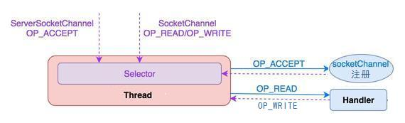

服务器端用一个线程通过多路复用搞定所有的 IO 操作（包括连接，读、写等），编码简单，清晰明了，但是如果客户端连接数量较多，将无法支撑，前面的 NIO 案例就属于这种模型

2. 线程池模型

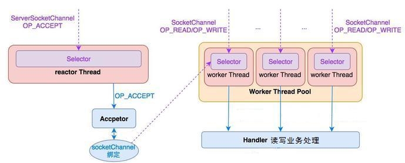

服务器端采用一个线程专门处理客户端连接请求，采用一个线程池负责 IO 操作。在绝大多数场景下，该模型都能满足使用

3. Netty 模型

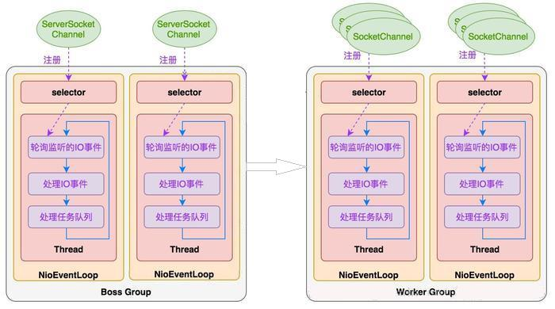

比较类似于上面的线程池模型，Netty 抽象出两组线程池，BossGroup 专门负责接收客户端连接，WorkerGroup 专门负责网络读写操作。NioEventLoop 表示一个不断循环执行处理任务的线程，每个 NioEventLoop 都有一个 selector，用于监听绑定在其上的 socket 网络通道。NioEventLoop 内部采用串行化设计，从消息的读取 --> 解码 --> 处理 --> 编码 --> 发送，始终由 IO 线程 NioEventLoop 负责

- 一个 NioEventLoopGroup 下包含多个 NioEventLoop
- 每个 NioEventLoop 中包含有一个 Selector，一个 taskQueue
- 每个 NioEventLoop 的 Selector 上可以注册监听多个 NioChannel
- 每个 NioChannel 只会绑定在唯一的 NioEventLoop 上
- 每个 NioChannel 都绑定有一个自己的 ChannelPipeline

### 3.2. 异步模型

包括：FUTURE, CALLBACK 和 HANDLER 三部分

- Netty 的异步模型是建立在 future 和 callback 的之上
    - callback 就是回调方法
    - Future，它的核心思想是：假设一个方法 fun，计算过程可能非常耗时，等待 fun 返回显然不合适。那么可以在调用 fun 的时候，立马返回一个 Future，后续可以通过 Future 去监控方法 fun 的处理过程。

在使用 Netty 进行编程时，拦截操作和转换出入站数据只需要您提供 callback 或利用future 即可。这使得链式操作简单、高效, 并有利于编写可重用的、通用的代码。Netty 框架的目标就是让你的业务逻辑从网络基础应用编码中分离出来、解脱出来

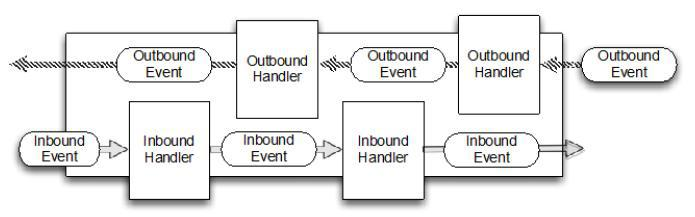

## 4. 核心 API

### 4.1. ChannelHandler 及其实现类
#### 4.1.1. 概述

ChannelHandler 接口定义了许多事件处理的方法，可以通过重写这些方法去实现具体的业务逻辑。API 关系如下图所示

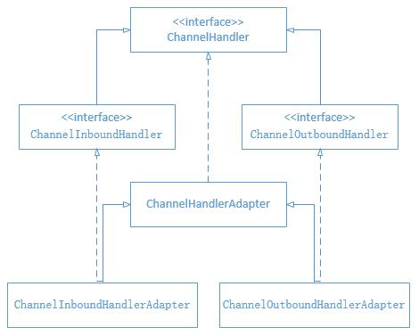

#### 4.1.2. 用法

具体用法：需要自定义一个 Handler 类去继承 ChannelInboundHandlerAdapter，然后通过重写相应方法实现业务逻辑

#### 4.1.3. 常用方法

```java
public void channelActive(ChannelHandlerContext ctx)
```

- 通道就绪事件

```java
public void channelRead(ChannelHandlerContext ctx, Object msg)
```

- 通道读取数据事件

```java
public void channelReadComplete(ChannelHandlerContext ctx)
```

- 数据读取完毕事件

```java
public void exceptionCaught(ChannelHandlerContext ctx, Throwable cause)
```

- 通道发生异常事件

### 4.2. Pipeline 和 ChannelPipeline
#### 4.2.1. 概述

ChannelPipeline 是一个 Handler 的集合，它负责处理和拦截 inbound 或者 outbound 的事件和操作，相当于一个贯穿 Netty 的链

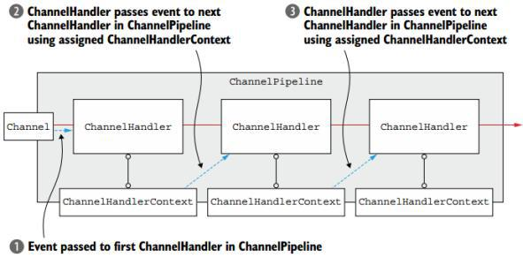

#### 4.2.2. 常用方法

```java
ChannelPipeline addFirst(ChannelHandler... handlers)
```

- 把一个业务处理类（handler）添加到链中的第一个位置

```java
ChannelPipeline addLast(ChannelHandler... handlers)
```

- 把一个业务处理类（handler）添加到链中的最后一个位置

### 4.3. ChannelHandlerContext
#### 4.3.1. 概述

这是事件处理器上下文对象，Pipeline 链中的实际处理节点。每个处理节点ChannelHandlerContext中包含一个具体的事件处理器 ChannelHandler，同时 ChannelHandlerContext 中也绑定了对应的 pipeline 和 Channel 的信息，方便对 ChannelHandler 进行调用

#### 4.3.2. 常用方法

```java
ChannelFuture close()
```

- 关闭通道

```java
ChannelOutboundInvoker flush()
```

- 刷新

```java
ChannelFuture writeAndFlush(Object msg)
```

- 将数据写到 ChannelPipeline 中当前 ChannelHandler 的下一个 ChannelHandler 开始处理（出站）

### 4.4. ChannelOption
#### 4.4.1. 概述

Netty 在创建 Channel 实例后，一般都需要设置 ChannelOption 参数。ChannelOption 是 Socket 的标准参数，而非 Netty 独创的。

#### 4.4.2. 常用参数配置值

1. `ChannelOption.SO_BACKLOG`
    - 对应 TCP/IP 协议 listen 函数中的 backlog 参数，用来初始化服务器可连接队列大小。服务端处理客户端连接请求是顺序处理的，所以同一时间只能处理一个客户端连接。多个客户端来的时候，服务端将不能处理的客户端连接请求放在队列中等待处理，backlog 参数指定了队列的大小
2. `ChannelOption.SO_KEEPALIVE`
    - 一直保持连接活动状态

### 4.5. ChannelFuture
#### 4.5.1. 概述

表示 Channel 中异步 I/O 操作的结果，在 Netty 中所有的 I/O 操作都是异步的，I/O 的调用会直接返回，调用者并不能立刻获得结果，但是可以通过 ChannelFuture 来获取 I/O 操作的处理状态

#### 4.5.2. 常用方法

```java
Channel channel();
```

- 返回当前正在进行 IO 操作的通道

```java
ChannelFuture sync() throws InterruptedException;
```

- 等待异步操作执行完毕

### 4.6. EventLoopGroup 和其实现类 NioEventLoopGroup
#### 4.6.1. 概述

EventLoopGroup 是一组 EventLoop 的抽象，Netty 为了更好的利用多核 CPU 资源，一般会有多个 EventLoop 同时工作，每个 EventLoop 维护着一个 Selector 实例

EventLoopGroup 提供 next 接口，可以从组里面按照一定规则获取其中一个 EventLoop 来处理任务。在 Netty 服务器端编程中，一般都需要提供两个 EventLoopGroup，例如：BossEventLoopGroup 和 WorkerEventLoopGroup

通常一个服务端口即一个 ServerSocketChannel 对应一个 Selector 和一个 EventLoop 线程。BossEventLoop 负责接收客户端的连接并将 SocketChannel 交给 WorkerEventLoopGroup 来进行 IO 处理，如下图所示：

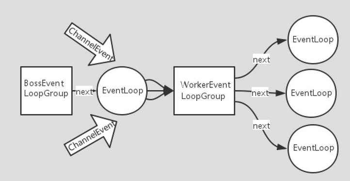

BossEventLoopGroup 通常是一个单线程的 EventLoop，EventLoop 维护着一个注册了ServerSocketChannel 的 Selector 实例，BossEventLoop 不断轮询 Selector 将连接事件分离出来，通常是 OP_ACCEPT 事件，然后将接收到的 SocketChannel 交给 WorkerEventLoopGroup，WorkerEventLoopGroup 会由 next 选择其中一个 EventLoopGroup 来将这个 SocketChannel 注册到其维护的 Selector 并对其后续的 IO 事件进行处理

#### 4.6.2. 常用方法

```java
public NioEventLoopGroup()
```

- 构造方法

```java
public Future<?> shutdownGracefully()
```

- 断开连接，关闭线程

### 4.7. ServerBootstrap 和 Bootstrap
#### 4.7.1. 概述

- ServerBootstrap 是 Netty 中的服务器端启动助手，通过它可以完成服务器端的各种配置
- Bootstrap 是 Netty 中的客户端启动助手，通过它可以完成客户端的各种配置

#### 4.7.2. 常用方法

```java
public ServerBootstrap group(EventLoopGroup parentGroup, EventLoopGroup childGroup)
```

- 该方法用于服务器端，用来设置两个 EventLoop

```java
public B group(EventLoopGroup group)
```

- 该方法用于客户端，用来设置一个 EventLoop

```java
public B channel(Class<? extends C> channelClass)
```

- 该方法用来设置一个服务器端的通道实现

```java
public <T> B option(ChannelOption<T> option, T value)
```

- 用来给 ServerChannel 添加配置

```java
public <T> ServerBootstrap childOption(ChannelOption<T> childOption, T value)
```

- 用来给接收到的通道添加配置

```java
public ServerBootstrap childHandler(ChannelHandler childHandler)
```

- 该方法用来设置业务处理类（自定义的 handler）

```java
public ChannelFuture bind(int inetPort)
```

- 该方法用于服务器端，用来设置占用的端口号

```java
public ChannelFuture connect(String inetHost, int inetPort)
```

- 该方法用于客户端，用来连接服务器端

### 4.8. Unpooled 类
#### 4.8.1. 概述

这是 Netty 提供的一个专门用来操作缓冲区的工具类

#### 4.8.2. 常用方法

```java
public static ByteBuf copiedBuffer(CharSequence string, Charset charset)
```

- 通过给定的数据和字符编码返回一个 ByteBuf 对象（类似于 NIO 中的 ByteBuffer 对象，但与 ByteBuffer 有区别）

## 5. 入门案例

1. 编写pom.xml，添加 netty 的坐标，采用 4.1.8 版本

```xml
<!-- 引入netty框架依赖，之前是叫netty，不是netty-all -->
<dependency>
    <groupId>io.netty</groupId>
    <artifactId>netty-all</artifactId>
    <version>4.1.8.Final</version>
</dependency>
```

2. 定义了一个服务器端业务处理类，继承 ChannelInboundHandlerAdapter，并分别重写channelRead（通道读取数据事件）、channelReadComplete（数据读取完毕事件）、exceptionCaught（通道发生异常事件）三个方法

```java
package com.moon.system.testmodule.netty.basic;

import io.netty.buffer.ByteBuf;
import io.netty.buffer.Unpooled;
import io.netty.channel.ChannelHandlerContext;
import io.netty.channel.ChannelInboundHandlerAdapter;
import io.netty.util.CharsetUtil;

/**
 * netty 自定义服务器端的业务处理类
 */
public class NettyServerHandler extends ChannelInboundHandlerAdapter {
    /**
     * 读取数据事件
     *
     * @param ctx
     * @param msg
     * @throws Exception
     */
    @Override
    public void channelRead(ChannelHandlerContext ctx, Object msg) throws Exception {
        System.out.println("Server:" + ctx);
        // 获取客户端消息
        ByteBuf byteBuf = (ByteBuf) msg;
        System.out.println("客户端发来的消息：" + byteBuf.toString(CharsetUtil.UTF_8));
    }

    /**
     * 数据读取完毕事件
     *
     * @param ctx
     * @throws Exception
     */
    @Override
    public void channelReadComplete(ChannelHandlerContext ctx) throws Exception {
        // 使用操作缓冲区的工具类，获取 ByteBuf 对象，并返回数据
        ctx.writeAndFlush(Unpooled.copiedBuffer("服务器数据读取完毕后处理逻辑", CharsetUtil.UTF_8));
    }

    /**
     * 通道发生异常事件
     *
     * @param ctx
     * @param cause
     * @throws Exception
     */
    @Override
    public void exceptionCaught(ChannelHandlerContext ctx, Throwable cause) throws Exception {
        // 打印异常信息
        cause.printStackTrace();
        // 发生异常，将通道关闭
        ctx.close();
    }
}
```

3. 编写了一个服务器端程序，配置了线程组，配置了自定义业务处理类，并绑定端口号进行了启动

```java
package com.moon.system.testmodule.netty.basic;

import io.netty.bootstrap.ServerBootstrap;
import io.netty.channel.ChannelFuture;
import io.netty.channel.ChannelInitializer;
import io.netty.channel.ChannelOption;
import io.netty.channel.EventLoopGroup;
import io.netty.channel.nio.NioEventLoopGroup;
import io.netty.channel.socket.SocketChannel;
import io.netty.channel.socket.nio.NioServerSocketChannel;

/**
 * netty 服务器端程序
 */
public class NettyServer {
    public static void main(String[] args) throws InterruptedException {
        // 1. 创建一个线程组：用来处理网络事件，接收客户端连接
        EventLoopGroup bossGroup = new NioEventLoopGroup();

        // 2. 创建一个线程组：处理网络事情，处理通道 IO 操作
        EventLoopGroup workerGroup = new NioEventLoopGroup();

        // 3. 创建服务器端启动助手来配置参数
        ServerBootstrap serverBootstrap = new ServerBootstrap();

        serverBootstrap.group(bossGroup, workerGroup)   // 4. 设置两个线程组
                .channel(NioServerSocketChannel.class)  // 5. 使用NioServerSocketChannel作为服务器端通道的实现
                .option(ChannelOption.SO_BACKLOG, 128)  // 6. 设置线程队列中等待连接的个数
                .childOption(ChannelOption.SO_KEEPALIVE, true)  // 7. 保持活动连接状态
                .childHandler(new ChannelInitializer<SocketChannel>() { // 8. 创建一个通道初始化对象
                    // 9. 往Pipeline链中添加自定义的handler类
                    @Override
                    protected void initChannel(SocketChannel socketChannel) throws Exception {
                        socketChannel.pipeline().addLast(new NettyServerHandler());
                        System.out.println("......Server is ready......");
                    }
                });

        // 10. 启动服务器端并绑定端口，等待接受客户端连接(非阻塞)。bind方法是异步的  sync方法是同步阻塞的
        ChannelFuture channelFuture = serverBootstrap.bind(9999).sync();
        System.out.println("......Server is starting......");

        // 11. 关闭通道，关闭线程组
        channelFuture.channel().closeFuture().sync();   // 异步
        bossGroup.shutdownGracefully();
        workerGroup.shutdownGracefully();
    }
}
```

4. 自定义了一个客户端业务处理类，继承 ChannelInboundHandlerAdapter ，并分别重写channelActive、channelRead、channelReadComplete、exceptionCaught等四个方法

```java
package com.moon.system.testmodule.netty.basic;

import io.netty.buffer.ByteBuf;
import io.netty.buffer.Unpooled;
import io.netty.channel.ChannelHandlerContext;
import io.netty.channel.ChannelInboundHandlerAdapter;
import io.netty.util.CharsetUtil;

/**
 * netty 自定义客户端业务处理类
 */
public class NettyClientHandler extends ChannelInboundHandlerAdapter {
    /**
     * 通道就绪事件
     *
     * @param ctx
     * @throws Exception
     */
    @Override
    public void channelActive(ChannelHandlerContext ctx) throws Exception {
        System.out.println("Client:" + ctx);
        ctx.writeAndFlush(Unpooled.copiedBuffer("客户端通道就绪，发送消息", CharsetUtil.UTF_8));
    }

    /**
     * 读取数据事件
     *
     * @param ctx
     * @param msg
     * @throws Exception
     */
    @Override
    public void channelRead(ChannelHandlerContext ctx, Object msg) throws Exception {
        // 获取客户端消息
        ByteBuf byteBuf = (ByteBuf) msg;
        System.out.println("服务器端发来的消息：" + byteBuf.toString(CharsetUtil.UTF_8));
    }

    /**
     * 数据读取完毕事件
     *
     * @param ctx
     * @throws Exception
     */
    @Override
    public void channelReadComplete(ChannelHandlerContext ctx) throws Exception {
        ctx.flush();
    }

    /**
     * 异常发生事件
     *
     * @param ctx
     * @param cause
     * @throws Exception
     */
    @Override
    public void exceptionCaught(ChannelHandlerContext ctx, Throwable cause) throws Exception {
        // 打印异常信息
        cause.printStackTrace();
        // 发生异常，将通道关闭
        ctx.close();
    }
}
```

5. 编写了一个客户端程序，配置了线程组，配置了自定义的业务处理类，并启动连接了服务器端

```java
package com.moon.system.testmodule.netty.basic;

import io.netty.bootstrap.Bootstrap;
import io.netty.channel.ChannelFuture;
import io.netty.channel.ChannelInitializer;
import io.netty.channel.nio.NioEventLoopGroup;
import io.netty.channel.socket.SocketChannel;
import io.netty.channel.socket.nio.NioSocketChannel;

/**
 * netty 网络客户端程序
 */
public class NettyClient {
    public static void main(String[] args) throws InterruptedException {
        // 1. 创建一个 EventLoopGroup 线程组
        NioEventLoopGroup group = new NioEventLoopGroup();

        // 2. 创建客户端的启动助手，完成相关配置
        Bootstrap bootstrap = new Bootstrap();

        bootstrap.group(group)  // 3. 设置线程组
                .channel(NioSocketChannel.class)    // 4. 设置客户端通道的实现类
                .handler(new ChannelInitializer<SocketChannel>() {  // 5. 创建一个通道初始化对象
                    // 6. 往Pipeline链中添加自定义的handler类
                    @Override
                    protected void initChannel(SocketChannel socketChannel) throws Exception {
                        // 客户端业务处理类
                        socketChannel.pipeline().addLast(new NettyClientHandler());
                        System.out.println("......Client is ready......");
                    }
                });

        // 7. 启动客户端去连接服务器端(非阻塞)。connect方法是异步的；sync方法是同步阻塞的
        ChannelFuture channelFuture = bootstrap.connect("127.0.0.1", 9999).sync();

        // 8.关闭连接(异步非阻塞)
        channelFuture.channel().closeFuture().sync();
    }
}
```

6. 最后运行效果

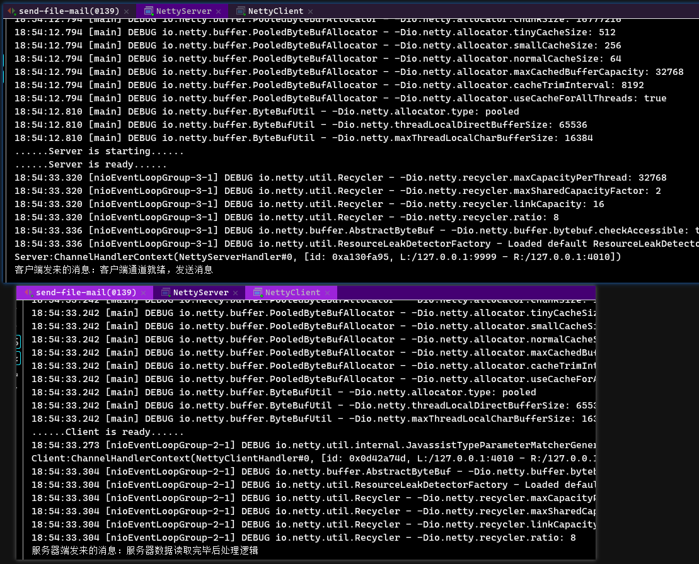

## 6. 网络聊天案例

1. 通过继承SimpleChannelInboundHandler类自定义了一个服务器端业务处理类，并在该类中重写了四个方法
    1. `channelActive`：当通道就绪时，输出在线；
    2. `channelInactive`：当通道未就绪时，输出下线；
    3. `channelRead`：当通道发来数据时，读取数据；
    4. `exceptionCaught`：当通道出现异常时，关闭通道。

```java
package com.moon.system.testmodule.netty.chat;

import io.netty.channel.Channel;
import io.netty.channel.ChannelHandlerContext;
import io.netty.channel.SimpleChannelInboundHandler;

import java.util.ArrayList;
import java.util.List;

/**
 * 网络聊天案例 - netty 自定义服务器端业务处理类
 */
public class ChatServerHandler extends SimpleChannelInboundHandler<String> {

    private static List<Channel> channels = new ArrayList<>();

    /**
     * 通道就绪事件
     *
     * @param ctx
     * @throws Exception
     */
    @Override
    public void channelActive(ChannelHandlerContext ctx) throws Exception {
        // 获取通道
        Channel channel = ctx.channel();
        // 将通道增加到集合中
        channels.add(channel);
        // 输出服务端信息
        System.out.println("[Server]:" + channel.remoteAddress().toString().substring(1) + "上线");
    }

    /**
     * 通道未就绪事件
     *
     * @param ctx
     * @throws Exception
     */
    @Override
    public void channelInactive(ChannelHandlerContext ctx) throws Exception {
        // 获取通道
        Channel channel = ctx.channel();
        // 删除掉线的通道
        channels.remove(channel);
        // 输出服务端信息
        System.out.println("[Server]:" + channel.remoteAddress().toString().substring(1) + "掉线");
    }

    /**
     * 读取数据事件
     *
     * @param ctx
     * @param msg
     * @throws Exception
     */
    @Override
    protected void channelRead0(ChannelHandlerContext ctx, String msg) throws Exception {
        // 获取当前连接通道
        Channel currentChannel = ctx.channel();
        // 循环所有通道，排除当前通道
        for (Channel channel : channels) {
            if (channel != currentChannel) {
                // 向其他的客户端输出读取的数据
                channel.writeAndFlush("[" + channel.remoteAddress().toString().substring(1) + "]" + "说：" + msg + "\n");
            }
        }

    }

    /**
     * 通道发生异常处理事件
     *
     * @param ctx
     * @param cause
     * @throws Exception
     */
    @Override
    public void exceptionCaught(ChannelHandlerContext ctx, Throwable cause) throws Exception {
        // 获取当前连接通道
        Channel channel = ctx.channel();
        // 输出信息
        System.out.println("[Server]:" + channel.remoteAddress().toString().substring(1) + "异常");
        // 关闭通道
        ctx.close();
    }
}
```

2. 通过 Netty 编写了一个服务器端程序，里面要特别注意的是：在往 Pipeline 链中添加了处理字符串的编码器和解码器，它们加入到 Pipeline 链中后会自动工作，使得在服务器端读写字符串数据时更加方便（不用人工处理 ByteBuf）

```java
package com.moon.system.testmodule.netty.chat;

import io.netty.bootstrap.ServerBootstrap;
import io.netty.channel.ChannelFuture;
import io.netty.channel.ChannelInitializer;
import io.netty.channel.ChannelOption;
import io.netty.channel.ChannelPipeline;
import io.netty.channel.EventLoopGroup;
import io.netty.channel.nio.NioEventLoopGroup;
import io.netty.channel.socket.SocketChannel;
import io.netty.channel.socket.nio.NioServerSocketChannel;
import io.netty.handler.codec.string.StringDecoder;
import io.netty.handler.codec.string.StringEncoder;

/**
 * 网络聊天案例 - netty 聊天程序服务器端
 */
public class ChatServer {

    /* 服务器端口号 */
    private int port;

    public ChatServer(int port) {
        this.port = port;
    }

    /**
     * 业务处理
     */
    private void run() {
        // 1. 创建一个线程组：用来处理网络事件，接收客户端连接
        EventLoopGroup bossGroup = new NioEventLoopGroup();
        // 2. 创建一个线程组：处理网络事情，处理通道 IO 操作
        EventLoopGroup workerGroup = new NioEventLoopGroup();
        try {
            // 3. 创建服务器端启动助手来配置参数
            ServerBootstrap serverBootstrap = new ServerBootstrap();
            // 启动助手完成服务器端的各种配置
            serverBootstrap.group(bossGroup, workerGroup)   // 4. 设置两个线程组
                    .channel(NioServerSocketChannel.class)  // 5. 使用NioServerSocketChannel作为服务器端通道的实现
                    .option(ChannelOption.SO_BACKLOG, 128)  // 6. 设置线程队列中等待连接的个数
                    .childOption(ChannelOption.SO_KEEPALIVE, true)  // 7. 保持活动连接状态
                    .childHandler(new ChannelInitializer<SocketChannel>() { // 8. 创建一个通道初始化对象
                        // 9. 往Pipeline链中添加自定义的handler类
                        @Override
                        protected void initChannel(SocketChannel socketChannel) throws Exception {
                            // 获取ChannelPipeline通道处理链
                            ChannelPipeline pipeline = socketChannel.pipeline();
                            // 往pipeline链中添加一个解码器(使用netty提供的解码器)
                            pipeline.addLast("decoder", new StringDecoder());
                            // 往pipeline链中添加一个编码器(使用netty提供的编码器)
                            pipeline.addLast("encoder", new StringEncoder());
                            // 往pipeline链中添加自定义的handler(业务处理类)
                            pipeline.addLast(new ChatServerHandler());
                            System.out.println("......Netty Chat Server is ready......");
                        }
                    });

            System.out.println("Netty Chat Server start......");
            // 10. 启动服务器端并绑定端口，等待接受客户端连接(非阻塞)。bind方法是异步的；sync方法是同步阻塞的
            ChannelFuture channelFuture = serverBootstrap.bind(port).sync();
            // 11. 关闭通道(异步)
            channelFuture.channel().closeFuture().sync();

        } catch (InterruptedException e) {
            e.printStackTrace();
        } finally {
            // 关闭线程组
            bossGroup.shutdownGracefully();
            workerGroup.shutdownGracefully();
            System.out.println("Netty Chat Server is close......");
        }
    }

    public static void main(String[] args) {
        // 开启服务
        new ChatServer(9999).run();
    }
}
```

3. 通过继承 SimpleChannelInboundHandler 自定义了一个客户端业务处理类，重写了一个方法用来读取服务器端发过来的数据

```java
package com.moon.system.testmodule.netty.chat;

import io.netty.channel.ChannelHandlerContext;
import io.netty.channel.SimpleChannelInboundHandler;

/**
 * 网络聊天案例 - netty 自定义客户端业务处理类
 */
public class ChatClientHandler extends SimpleChannelInboundHandler<String> {

    /**
     * 读取数据事件
     *
     * @param ctx
     * @param msg
     * @throws Exception
     */
    @Override
    protected void channelRead0(ChannelHandlerContext ctx, String msg) throws Exception {
        // 输出信息
        System.out.println(msg.trim());
    }
}
```

4. 通过 Netty 编写了一个客户端程序，里面要特别注意的是：往 Pipeline 链中添加了处理字符串的编码器和解码器，他们加入到 Pipeline 链中后会自动工作，使得在客户端读写字符串数据时更加方便（不用人工处理 ByteBuf）

```java
package com.moon.system.testmodule.netty.chat;

import io.netty.bootstrap.Bootstrap;
import io.netty.channel.Channel;
import io.netty.channel.ChannelFuture;
import io.netty.channel.ChannelInitializer;
import io.netty.channel.ChannelPipeline;
import io.netty.channel.nio.NioEventLoopGroup;
import io.netty.channel.socket.SocketChannel;
import io.netty.channel.socket.nio.NioSocketChannel;
import io.netty.handler.codec.string.StringDecoder;
import io.netty.handler.codec.string.StringEncoder;

import java.util.Scanner;

/**
 * 网络聊天案例 - netty 聊天程序客户端
 */
public class ChatClient {

    /* 服务器端IP地址 */
    private final String host;
    /* 服务器端端口号 */
    private final int port;

    public ChatClient(String host, int port) {
        this.host = host;
        this.port = port;
    }

    /**
     * 业务处理
     */
    private void run() {
        // 1. 创建一个 EventLoopGroup 线程组
        NioEventLoopGroup group = new NioEventLoopGroup();

        try {
            // 2. 创建客户端的启动助手，完成相关配置
            Bootstrap bootstrap = new Bootstrap()
                    .group(group)   // 3. 设置线程组
                    .channel(NioSocketChannel.class)    // 4. 设置客户端通道的实现类
                    .handler(new ChannelInitializer<SocketChannel>() {  // 5. 创建一个通道初始化对象
                        // 6. 往Pipeline链中添加自定义的handler类
                        @Override
                        protected void initChannel(SocketChannel socketChannel) throws Exception {
                            // 获取ChannelPipeline通道处理链
                            ChannelPipeline pipeline = socketChannel.pipeline();
                            // 往pipeline链中添加一个解码器(使用netty提供的解码器)
                            pipeline.addLast("decoder", new StringDecoder());
                            // 往pipeline链中添加一个编码器(使用netty提供的编码器)
                            pipeline.addLast("encoder", new StringEncoder());
                            // 往pipeline链中添加自定义的handler(业务处理类)
                            pipeline.addLast(new ChatClientHandler());
                            System.out.println("......Netty Chat Client is ready......");
                        }
                    });

            // 7. 启动客户端去连接服务器端(非阻塞)。connect方法是异步的；sync方法是同步阻塞的
            ChannelFuture channelFuture = bootstrap.connect(host, port).sync();

            // 8. 获取通道
            Channel channel = channelFuture.channel();
            System.out.println("------" + channel.localAddress().toString().substring(1) + "------");
            Scanner scanner = new Scanner(System.in);
            while (scanner.hasNextLine()) {
                String msg = scanner.nextLine();
                // 给服务端输出信息
                channel.writeAndFlush(msg + "\r\n");
            }

        } catch (InterruptedException e) {
            e.printStackTrace();
        } finally {
            // 线程组
            group.shutdownGracefully();
        }
    }

    public static void main(String[] args) {
        // 开启客户端
        new ChatClient("127.0.0.1", 9999).run();
    }
}
```

5. 同时运行多个客户端，运行效果如下：

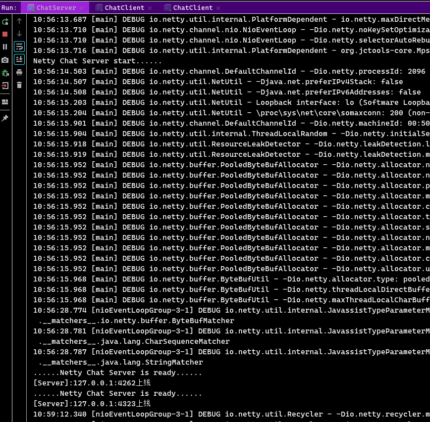

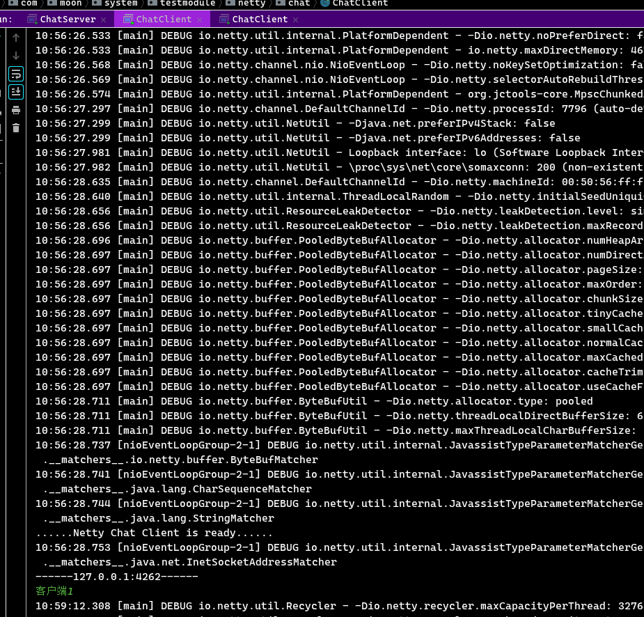

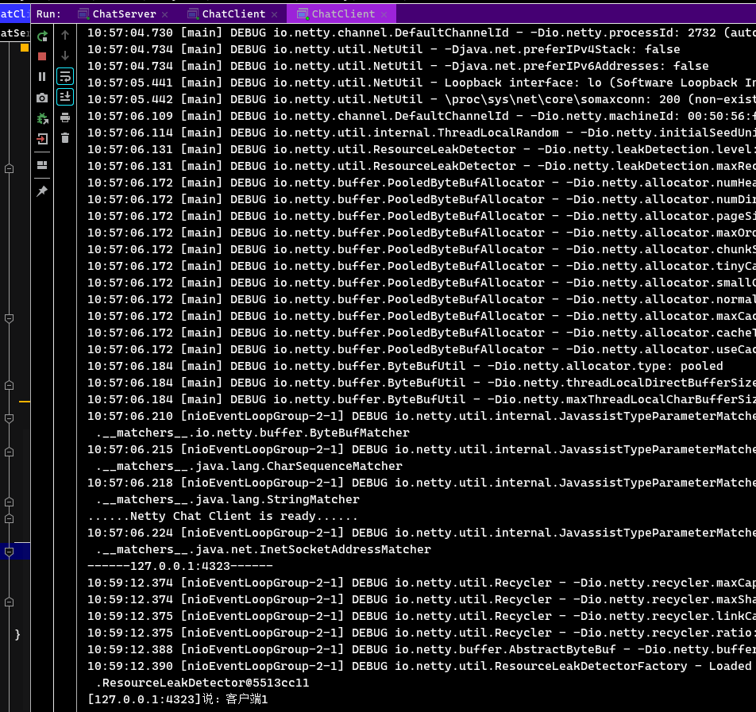

如果客户下载，则服务端会执行channelInactive与exceptionCaught的方法

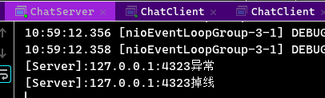

## 7. 编码和解码

### 7.1. 编解码器

在编写网络应用程序的时候需要注意 codec (编解码器)，因为数据在网络中传输的都是二进制字节码数据，而拿到的目标数据往往不是字节码数据。因此在发送数据时就需要编码，接收数据时就需要解码。

codec 的组成部分有两个：decoder(解码器)和 encoder(编码器)。

- `encoder` 负责把业务数据转换成字节码数据
- `decoder` 负责把字节码数据转换成业务数据

扩展：Java 的序列化技术就可以作为 codec 去使用，但是它存在很多问题。如：

1. 无法跨语言，这应该是 Java 序列化最致命的问题了
2. 序列化后的体积太大，是二进制编码的 5 倍多
3. 序列化性能太低

### 7.2. Netty 编解码器

#### 7.2.1. 概述

Netty codec 自身提供了一些解码器：

1. StringDecoder，对字符串数据进行解码
2. ObjectDecoder，对 Java 对象进行解码

Netty 提供的编码器

1. StringEncoder，对字符串数据进行编码
2. ObjectEncoder，对 Java 对象进行编码

*Netty 本身自带的 ObjectDecoder 和 ObjectEncoder 可以用来实现 POJO 对象或各种业务对象的编码和解码，但其内部使用的仍是 Java 序列化技术，所以不建议使用*。因此对于 POJO 对象或各种业务对象要实现编码和解码，需要更高效更强的技术。

#### 7.2.2. Netty 编解码器的作用

1. 编码器可以**将 Java 对象转换为字节流**，以便在网络上传输。例如，将字符串、数字、图像等对象编码成二进制数据。
2. 解码器可以**将字节流转换为 Java 对象**，以便在应用程序中使用。例如，将二进制数据解码成字符串、数字、图像等对象。
3. 使用编解码器可以减少网络流量，提高网络性能。例如，通过压缩数据来减少数据的大小，从而减少网络流量。
4. 使用编解码器可以简化开发，减少代码的复杂度。例如，使用 Netty 提供的内置编解码器，可以避免手动处理数据转换的细节。

### 7.3. Google 的 Protobuf

Protobuf 是 Google 发布的开源项目，全称 Google Protocol Buffers，特点如下：

- 支持跨平台、多语言（支持目前绝大多数语言，例如 C++、C#、Java、python 等）
- 高性能，高可靠性
- 使用 protobuf 编译器能自动生成代码，Protobuf 是将类的定义使用`.proto`文件进行描述，然后通过 protoc.exe 编译器根据`.proto`自动生成`.java`文件

### 7.4. Protobuf 案例

目前在使用 Netty 开发时，经常会结合 Protobuf 作为 codec (编解码器)去使用，具体使用步骤如下：

1. 在 pom 文件中分别引入 netty 和 protobuf 的坐标

```xml
<!-- 引入netty框架依赖 -->
<dependency>
    <groupId>io.netty</groupId>
    <artifactId>netty-all</artifactId>
    <version>4.1.8.Final</version>
</dependency>
<!--  引入 Google开源编解码器框架 Protobuf -->
<dependency>
    <groupId>com.google.protobuf</groupId>
    <artifactId>protobuf-java</artifactId>
    <version>3.6.1</version>
</dependency>
```

2. 案例要处理的数据是图书信息，那就需要为此编写 proto 文件

```
syntax = "proto3";
option java_outer_classname = "BookMessage";
message Book {
   int32 id = 1;
   string name = 2;
}
```

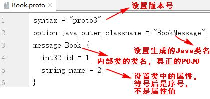

3. 将编写好的book.proto文件复制到【\07-编程工具资料\03-Java相关框架+源代码\Google Protobuf【codec(编解码器)组件】\protoc-3.6.1-win32\bin】目录下，通过 protoc.exe 根据描述文件生成 Java 类。输入以下命令

```bash
# cmd下的命令
protoc.exe --java_out=. book.proto

# powershell的命令
.\protoc.exe --java_out=. book.proto
```

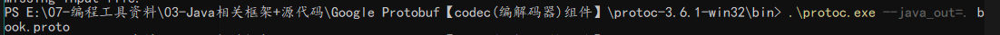

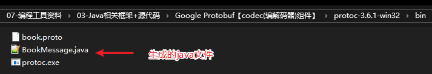

4. 把通过 protoc.exe 生成的类（BookMessage.java）拷贝到项目中打开。**一定要注意：这个类不要编辑它，直接拿着用即可，该类内部有一个内部类，这个内部类才是真正的POJO**

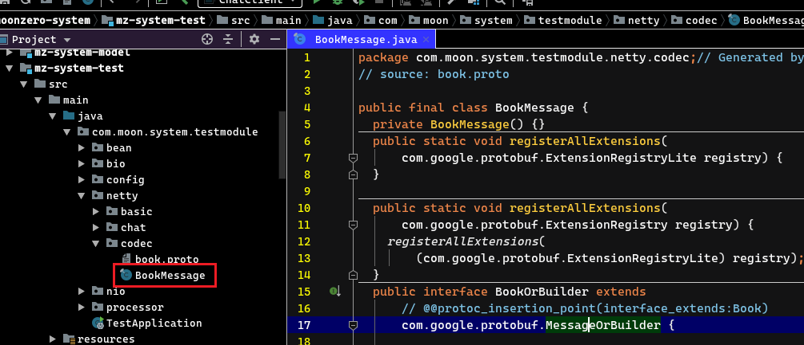

5. 编写客户端业务处理类，在往服务器端发送图书（POJO）时就可以使用生成的 BookMessage 类搞定

```java
package com.moon.system.testmodule.netty.codec;

import io.netty.channel.ChannelHandlerContext;
import io.netty.channel.ChannelInboundHandlerAdapter;

/**
 * Protobuf 编解码器案例 - 客户端业务处理类
 */
public class NettyClientHandler extends ChannelInboundHandlerAdapter {
    /**
     * 通道就绪方法
     *
     * @param ctx
     * @throws Exception
     */
    @Override
    public void channelActive(ChannelHandlerContext ctx) throws Exception {
        System.out.println("Client========" + ctx);
        // 使用Protobuf程序生成的java类对发送的信息进行处理
        BookMessage.Book book = BookMessage.Book.newBuilder().setId(1).setName("Java从入门到放弃").build();
        // 向服务端输出数据
        ctx.writeAndFlush(book);
    }
}
```

6. 在编写客户端程序时，要向 Pipeline 链中添加 ProtobufEncoder 编码器对象

```java
package com.moon.system.testmodule.netty.codec;

import io.netty.bootstrap.Bootstrap;
import io.netty.channel.ChannelFuture;
import io.netty.channel.ChannelInitializer;
import io.netty.channel.ChannelPipeline;
import io.netty.channel.nio.NioEventLoopGroup;
import io.netty.channel.socket.SocketChannel;
import io.netty.channel.socket.nio.NioSocketChannel;
import io.netty.handler.codec.protobuf.ProtobufEncoder;

/**
 * Protobuf 编解码器案例 - 客户端
 */
public class NettyClient {
    public static void main(String[] args) throws InterruptedException {
        // 1. 创建一个 EventLoopGroup 线程组
        NioEventLoopGroup group = new NioEventLoopGroup();
        // 2. 创建客户端的启动助手，完成相关配置
        Bootstrap bootstrap = new Bootstrap();
        bootstrap.group(group)  // 3. 设置线程组
                .channel(NioSocketChannel.class)    // 4. 设置客户端通道的实现类
                .handler(new ChannelInitializer<SocketChannel>() {  // 5. 创建一个通道初始化对象
                    // 6. 往Pipeline链中添加自定义的handler类
                    @Override
                    protected void initChannel(SocketChannel socketChannel) throws Exception {
                        // 获取通道
                        ChannelPipeline pipeline = socketChannel.pipeline();
                        /* 向 Pipeline 链中添加 ProtobufEncoder 编码器对象 */
                        pipeline.addLast("encoder", new ProtobufEncoder());
                        // 客户端业务处理类
                        pipeline.addLast(new NettyClientHandler());
                        System.out.println("......Client is ready......");
                    }
                });
        // 7. 启动客户端去连接服务器端(非阻塞)
        ChannelFuture channelFuture = bootstrap.connect("127.0.0.1", 9999).sync();
        // 8.关闭连接(异步非阻塞)
        channelFuture.channel().closeFuture().sync();
    }
}
```

7. 编写服务端业务处理类，在服务器端接收数据时，直接就可以把数据转换成 POJO 使用

```java
package com.moon.system.testmodule.netty.codec;

import io.netty.channel.ChannelHandlerContext;
import io.netty.channel.ChannelInboundHandlerAdapter;

/**
 * Protobuf 编解码器案例 - 服务端处理类
 */
public class NettyServerHandler extends ChannelInboundHandlerAdapter {
    /**
     * 通道读取事件
     *
     * @param ctx
     * @param msg
     * @throws Exception
     */
    @Override
    public void channelRead(ChannelHandlerContext ctx, Object msg) throws Exception {
        System.out.println("Server========" + ctx);
        // 获取客户端发送的数据
        BookMessage.Book book = (BookMessage.Book) msg;
        System.out.println("客户端发来数据：" + book.getName());
    }
}
```

8. 在编写服务器端程序时，要向 Pipeline 链中添加 ProtobufDecoder 解码器对象

```java
package com.moon.system.testmodule.netty.codec;

import io.netty.bootstrap.ServerBootstrap;
import io.netty.channel.ChannelFuture;
import io.netty.channel.ChannelInitializer;
import io.netty.channel.ChannelOption;
import io.netty.channel.ChannelPipeline;
import io.netty.channel.EventLoopGroup;
import io.netty.channel.nio.NioEventLoopGroup;
import io.netty.channel.socket.SocketChannel;
import io.netty.channel.socket.nio.NioServerSocketChannel;
import io.netty.handler.codec.protobuf.ProtobufDecoder;

/**
 * Protobuf 编解码器案例 - 服务端
 */
public class NettyServer {
    public static void main(String[] args) throws InterruptedException {
        // 1. 创建一个线程组：用来处理网络事件，接收客户端连接
        EventLoopGroup bossGroup = new NioEventLoopGroup();
        // 2. 创建一个线程组：处理网络事情，处理通道 IO 操作
        EventLoopGroup workerGroup = new NioEventLoopGroup();
        // 3. 创建服务器端启动助手来配置参数
        ServerBootstrap serverBootstrap = new ServerBootstrap();
        serverBootstrap.group(bossGroup, workerGroup)   // 4. 设置两个线程组
                .channel(NioServerSocketChannel.class)  // 5. 使用NioServerSocketChannel作为服务器端通道的实现
                .option(ChannelOption.SO_BACKLOG, 128)  // 6. 设置线程队列中等待连接的个数
                .childOption(ChannelOption.SO_KEEPALIVE, true)  // 7. 保持活动连接状态
                .childHandler(new ChannelInitializer<SocketChannel>() { // 8. 创建一个通道初始化对象
                    // 9. 往Pipeline链中添加自定义的handler类
                    @Override
                    protected void initChannel(SocketChannel socketChannel) throws Exception {
                        // 获取通道
                        ChannelPipeline pipeline = socketChannel.pipeline();
                        /* 向 Pipeline 链中添加 ProtobufDecoder 解码器对象 */
                        pipeline.addLast("decoder", new ProtobufDecoder(BookMessage.Book.getDefaultInstance()));
                        pipeline.addLast(new NettyServerHandler());
                    }
                });
        // 10. 启动服务器端并绑定端口，等待接受客户端连接(非阻塞)
        ChannelFuture channelFuture = serverBootstrap.bind(9999).sync();
        System.out.println("......Server is starting......");
        // 11. 关闭通道，关闭线程组
        channelFuture.channel().closeFuture().sync();
        bossGroup.shutdownGracefully();
        workerGroup.shutdownGracefully();
    }
}
```

## 8. 基于 Netty 自定义 RPC

### 8.1. RPC 概述

RPC (Remote Procedure Call)，即远程过程调用，它是一种通过网络从远程计算机程序上请求服务，而不需要了解底层网络实现的技术。

> 常见的 RPC 框架有: 源自阿里的 Dubbo，Spring 旗下的 Spring Cloud，Google 出品的 grpc 等等

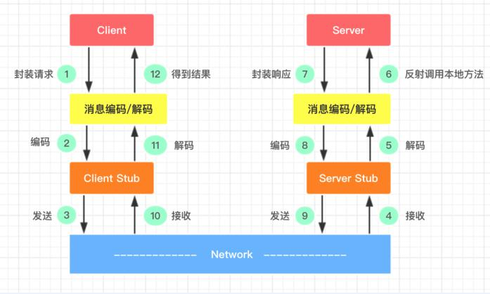

1. 服务消费方(client)以本地调用方式调用服务
2. client stub 接收到调用后负责将方法、参数等封装成能够进行网络传输的消息体
3. client stub 将消息进行编码并发送到服务端
4. server stub 收到消息后进行解码
5. server stub 根据解码结果调用本地的服务
6. 本地服务执行并将结果返回给 server stub
7. server stub 将返回导入结果进行编码并发送至消费方
8. client stub 接收到消息并进行解码
9. 服务消费方(client)得到结果

RPC 的目标就是将 2-8 这些步骤都封装起来，用户无需关心这些细节，可以像调用本地方法一样即可完成远程服务调用。

### 8.2. 设计和实现
#### 8.2.1. 结构设计

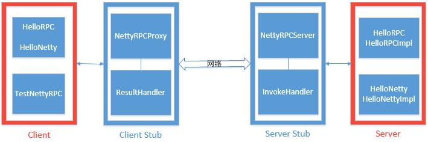

- Client(服务的调用方): 两个接口 + 一个包含 main 方法的测试类
- Client Stub: 一个客户端代理类 + 一个客户端业务处理类
- Server(服务的提供方): 两个接口 + 两个实现类
- Server Stub: 一个网络处理服务器 + 一个服务器业务处理类

> 注意：服务调用方的接口必须跟服务提供方的接口保持一致（包路径可以不一致）
>
> 最终要实现的目标是：在 TestNettyRPC 中远程调用 HelloRPCImpl 或 HelloNettyImpl 中的方法

#### 8.2.2. 代码实现

##### 8.2.2.1. Server端(服务提供方)

作为服务的提供方，分别编写了两个接口和两个实现类，供消费方远程调用

```java
public interface HelloNetty {
    String hello();
}

public class HelloNettyImpl implements HelloNetty {
    @Override
    public String hello() {
        return "hello, netty";
    }
}

public interface HelloRPC {
    String hello(String name);
}

public class HelloRPCImpl implements HelloRPC {
    @Override
    public String hello(String name) {
        return "hello, " + name;
    }
}
```

##### 8.2.2.2. Server Stub(业务逻辑处理)

1. 创建实体类，用来封装消费方发起远程调用时传给服务方的数据

```java
/**
 * 封装RPC调用时相关类信息
 */
@Data
@ToString
public class ClassInfo implements Serializable {
    private static final long serialVersionUID = 1694348021302617385L;
    /* 类名 */
    private String className;
    /* 方法名 */
    private String methodName;
    /* 参数类型 */
    private Class<?>[] types;
    /* 参数列表 */
    private Object[] objects;
}
```

2. 创建业务处理类，读取消费方发来的数据，并根据得到的数据进行本地调用，然后把结果返回给消费方

```java
package com.moon.system.testmodule.netty.rpc.serverStub;

import io.netty.channel.ChannelHandlerContext;
import io.netty.channel.ChannelInboundHandlerAdapter;
import org.reflections.Reflections;

import java.lang.reflect.Method;
import java.util.Set;

/**
 * 自定义RPC案例 - 服务器端业务处理类
 */
public class InvokeHandler extends ChannelInboundHandlerAdapter {

    /* 服务方接口和实现类所在的包路径 */
    private final static String INTERFACE_PATH = "com.moon.system.testmodule.netty.rpc.server";

    /**
     * 通道读取数据事件。读取客户端发来的数据并通过反射调用实现类的方法
     *
     * @param ctx
     * @param msg
     * @throws Exception
     */
    @Override
    public void channelRead(ChannelHandlerContext ctx, Object msg) throws Exception {
        // 1. 向下强转成调用相关类信息对象ClassInfo
        ClassInfo classInfo = (ClassInfo) msg;
        // 2. 通过反射获取请求需要调用的接口的实现类的字节码对象
        Class<?> clazz = Class.forName(getImplClassName(classInfo));
        // 3. 通过反射获取调用的方法对象
        Method method = clazz.getMethod(classInfo.getMethodName(), classInfo.getTypes());
        // 4. 调用实现类的方法
        Object result = method.invoke(clazz.newInstance(), classInfo.getObjects());
        // 5. 将调用方法后返回的数据写到客户端
        ctx.channel().writeAndFlush(result);
    }

    /**
     * 得到指定接口下某个实现类的名字
     *
     * @param classInfo
     * @return 类全命名
     */
    private String getImplClassName(ClassInfo classInfo) throws Exception {
        // 截取调用的接口的名称
        int lastDot = classInfo.getClassName().lastIndexOf(".");
        String interfaceName = classInfo.getClassName().substring(lastDot);

        // 获取接口的字节码对象
        Class superClass = Class.forName(INTERFACE_PATH + interfaceName);

        // 扫描接口所在的包
        Reflections reflections = new Reflections(INTERFACE_PATH);
        // 获取所有接口的实现类
        Set<Class> implClassSet = reflections.getSubTypesOf(superClass);

        if (implClassSet.size() == 0) {
            System.out.println("未找到实现类");
            return null;
        } else if (implClassSet.size() > 1) {
            System.out.println("找到多个实现类，未明确使用哪一个");
            return null;
        } else {
            Class[] classes = implClassSet.toArray(new Class[0]);
            // 返回实现类名称
            return classes[0].getName();
        }
    }
}
```

3. 用 Netty 实现的网络服务器，采用 Netty 自带的 ObjectEncoder 和 ObjectDecoder 作为编解码器（为了降低复杂度，这里并没有使用第三方的编解码器），当然实际开发时也可以采用 JSON 或 XML

```java
package com.moon.system.testmodule.netty.rpc.serverStub;

import io.netty.bootstrap.ServerBootstrap;
import io.netty.channel.ChannelFuture;
import io.netty.channel.ChannelInitializer;
import io.netty.channel.ChannelOption;
import io.netty.channel.ChannelPipeline;
import io.netty.channel.EventLoopGroup;
import io.netty.channel.nio.NioEventLoopGroup;
import io.netty.channel.socket.SocketChannel;
import io.netty.channel.socket.nio.NioServerSocketChannel;
import io.netty.handler.codec.serialization.ClassResolvers;
import io.netty.handler.codec.serialization.ObjectDecoder;
import io.netty.handler.codec.serialization.ObjectEncoder;

/**
 * 自定义RPC案例 - 网络处理服务器
 */
public class NettyRPCServer {
    /* 服务器端口号 */
    private int port;

    public NettyRPCServer(int port) {
        this.port = port;
    }

    /**
     * 业务处理
     */
    private void start() {
        EventLoopGroup bossGroup = new NioEventLoopGroup();
        EventLoopGroup workerGroup = new NioEventLoopGroup();
        try {
            ServerBootstrap serverBootstrap = new ServerBootstrap();
            serverBootstrap.group(bossGroup, workerGroup)
                    .channel(NioServerSocketChannel.class)
                    .option(ChannelOption.SO_BACKLOG, 128)
                    .childOption(ChannelOption.SO_KEEPALIVE, true)
                    .localAddress(port) // 设置端口号
                    .childHandler(new ChannelInitializer<SocketChannel>() {
                        @Override
                        protected void initChannel(SocketChannel socketChannel) throws Exception {
                            ChannelPipeline pipeline = socketChannel.pipeline();
                            // 往pipeline链中添加一个编码器(使用netty提供的编码器)
                            pipeline.addLast("encoder", new ObjectEncoder());
                            /*
                             * 往pipeline链中添加一个解码器(使用netty提供的解码器)
                             *      构造方法第一个参数设置二进制数据的最大字节数  第二个参数设置具体使用哪个类解析器
                             */
                            pipeline.addLast("decoder", new ObjectDecoder(Integer.MAX_VALUE, ClassResolvers.cacheDisabled(null)));
                            // 往pipeline链中添加自定义的handler(业务处理类)
                            pipeline.addLast(new InvokeHandler());
                            System.out.println("......Netty RPC Server handler is ready......");
                        }
                    });

            System.out.println("Netty RPC Server start......");
            ChannelFuture channelFuture = serverBootstrap.bind(port).sync();
            channelFuture.channel().closeFuture().sync();

        } catch (InterruptedException e) {
            e.printStackTrace();
        } finally {
            bossGroup.shutdownGracefully();
            workerGroup.shutdownGracefully();
            System.out.println("Netty RPC Server is close......");
        }
    }

    public static void main(String[] args) {
        // 开启服务
        new NettyRPCServer(9999).start();
    }
}
```

##### 8.2.2.3. Client Stub(业务逻辑处理)

1. 创建客户端的业务处理类读取远程调用返回的数据

```java
package com.moon.system.testmodule.netty.rpc.clientStub;

import io.netty.channel.ChannelHandlerContext;
import io.netty.channel.ChannelInboundHandlerAdapter;

/**
 * 自定义RPC案例 - 客户端业务处理类
 */
public class ResultHandler extends ChannelInboundHandlerAdapter {
    private Object response;

    public Object getResponse() {
        return response;
    }

    /**
     * 读取服务器端返回的数据(远程调用的结果)
     *
     * @param ctx
     * @param msg
     * @throws Exception
     */
    @Override
    public void channelRead(ChannelHandlerContext ctx, Object msg) throws Exception {
        // 获取返回结果
        this.response = msg;
        // 关闭通道
        ctx.close();
    }
}
```

2. 用 Netty 实现的客户端代理类，采用 Netty 自带的 ObjectEncoder 和 ObjectDecoder 作为编解码器（为了降低复杂度，这里并没有使用第三方的编解码器），当然实际开发时也可以采用 JSON 或 XML。

```java
package com.moon.system.testmodule.netty.rpc.clientStub;

import com.moon.system.testmodule.netty.rpc.serverStub.ClassInfo;
import io.netty.bootstrap.Bootstrap;
import io.netty.channel.Channel;
import io.netty.channel.ChannelFuture;
import io.netty.channel.ChannelInitializer;
import io.netty.channel.ChannelPipeline;
import io.netty.channel.nio.NioEventLoopGroup;
import io.netty.channel.socket.SocketChannel;
import io.netty.channel.socket.nio.NioSocketChannel;
import io.netty.handler.codec.serialization.ClassResolvers;
import io.netty.handler.codec.serialization.ObjectDecoder;
import io.netty.handler.codec.serialization.ObjectEncoder;

import java.lang.reflect.InvocationHandler;
import java.lang.reflect.Method;
import java.lang.reflect.Proxy;

/**
 * 自定义RPC案例 - 客户端代理类
 */
public class NettyRPCProxy {
    /**
     * 根据接口创建代理对象
     *
     * @param target
     * @return
     */
    public static Object create(Class target) {
        return Proxy.newProxyInstance(target.getClassLoader(), new Class[]{target}, new InvocationHandler() {
            @Override
            public Object invoke(Object proxy, Method method, Object[] args) throws Throwable {
                // 封装RPC调用时相关类信息对象
                ClassInfo classInfo = new ClassInfo();
                classInfo.setClassName(target.getName());
                classInfo.setMethodName(method.getName());
                classInfo.setTypes(method.getParameterTypes());
                classInfo.setObjects(args);

                // 使用netty发送数据
                NioEventLoopGroup group = new NioEventLoopGroup();
                // 创建返回数据对象
                ResultHandler resultHandler = new ResultHandler();

                try {
                    Bootstrap bootstrap = new Bootstrap()
                            .group(group)
                            .channel(NioSocketChannel.class)
                            .handler(new ChannelInitializer<SocketChannel>() {
                                @Override
                                protected void initChannel(SocketChannel socketChannel) throws Exception {
                                    ChannelPipeline pipeline = socketChannel.pipeline();
                                    // 往pipeline链中添加一个编码器(使用netty提供的编码器)
                                    pipeline.addLast("encoder", new ObjectEncoder());
                                    /*
                                     * 往pipeline链中添加一个解码器(使用netty提供的解码器)
                                     *      构造方法第一个参数设置二进制数据的最大字节数  第二个参数设置具体使用哪个类解析器
                                     */
                                    pipeline.addLast("decoder", new ObjectDecoder(Integer.MAX_VALUE, ClassResolvers.cacheDisabled(null)));
                                    // 往pipeline链中添加自定义的handler(业务处理类)
                                    pipeline.addLast("handler", resultHandler);
                                    System.out.println("......Netty RPC Client is ready......");
                                }
                            });

                    // 连接通道
                    ChannelFuture channelFuture = bootstrap.connect("127.0.0.1", 9999).sync();
                    // 获取通道
                    Channel channel = channelFuture.channel();

                    /* 向服务端发送调用的信息 */
                    channel.writeAndFlush(classInfo).sync();

                    // 关闭连接
                    channel.closeFuture().sync();
                } catch (InterruptedException e) {
                    e.printStackTrace();
                } finally {
                    // 线程组
                    group.shutdownGracefully();
                }

                return resultHandler.getResponse();
            }
        });
    }
}
```

##### 8.2.2.4. Client( 服务的调用方 - 消费方)

创建两个与服务端相同的接口，创建消费方进行调用，*需要注意是导入本地接口，不是服务端包下的接口*

```java
package com.moon.system.testmodule.netty.rpc.client;

import com.moon.system.testmodule.netty.rpc.clientStub.NettyRPCProxy;

/**
 * 自定义RPC案例 - 服务调用方
 */
public class TestNettyRPC {
    public static void main(String[] args) {
        /*
         * 第1次PRC运程调用，创建HelloNetty接口的代理对象
         *      注意：导入是本地（本包下）的接口
         */
        HelloNetty helloNetty = (HelloNetty) NettyRPCProxy.create(HelloNetty.class);
        System.out.println(helloNetty.hello());

        /*
         * 第1次PRC运程调用，创建HelloRPC接口的代理对象
         *      注意：导入是本地（本包下）的接口
         */
        HelloRPC helloRPC = (HelloRPC) NettyRPCProxy.create(HelloRPC.class);
        System.out.println(helloRPC.hello("MooNkirA"));
    }
}
```

##### 8.2.2.5. 运行效果

消费方不需要知道底层的网络实现细节，就像调用本地方法一样成功发起了两次远程调用。运行效果如下图所示

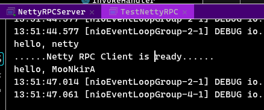

> 该案例的目的不是为了实现一个多么成熟的 RPC 框架，因此会有很多地方不够完善，目的是通过该案例更熟悉 Netty 的使用

## 9. 基于Netty网络编程项目实战（待学习）

学习资料：阶段2-项目框架架构与优化\2-5 Netty网络编程\


