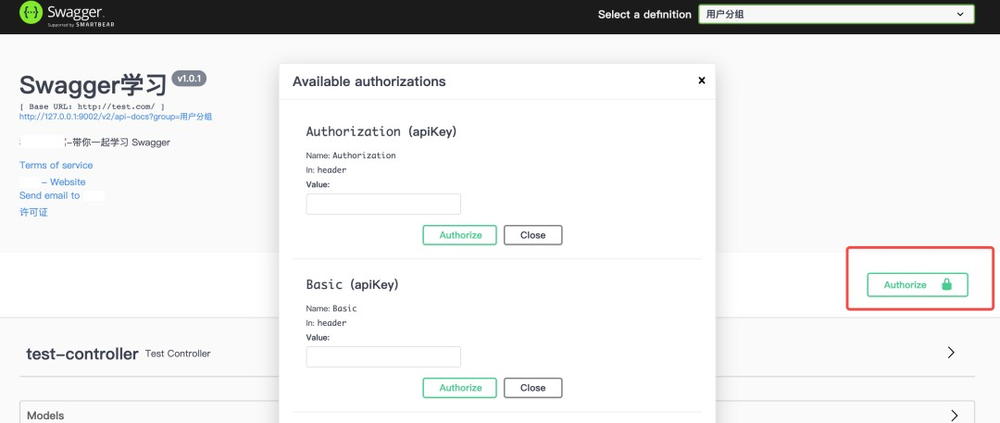
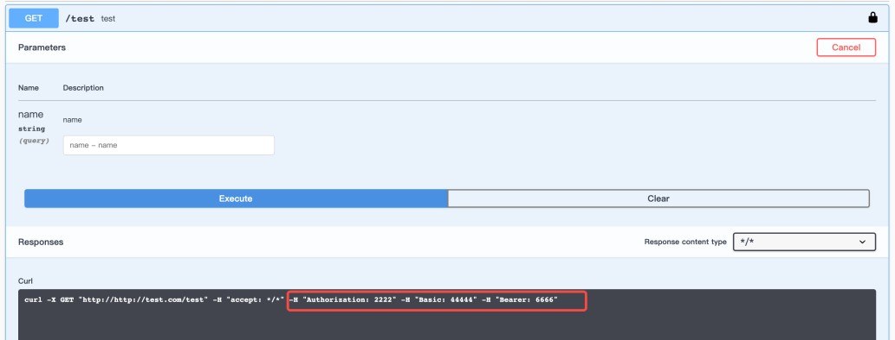
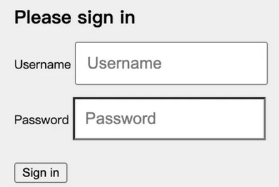

## 1. Swagger 接口文档工具简介

> Swagger 官网：https://swagger.io/

OpenAPI 规范（OpenAPI Specification 简称OAS）是Linux基金会的一个项目，试图通过定义一种用来描述 API 格式或 API 定义的语言，来规范 RESTful 服务开发过程，目前版本是V3.0，并且已经发布并开源在 github 上。https://github.com/OAI/OpenAPI-Specification

Swagger 是全球最大的 OpenAPI 规范（OAS）API开发工具框架，支持从设计和文档到测试和部署的整个 API 生命周期的开发。

使用 Swagger 只需要按照它的规范去定义接口及接口相关的信息。再通过 Swagger 衍生出来的一系列项目和工具，就可以做到生成各种格式的接口文档，生成多种语言的客户端和服务端的代码，以及在线接口调试页面等等。这样，如果按照新的开发模式，在开发新版本或者迭代版本的时候，只需要更新 Swagger 描述文件，就可以自动生成接口文档和客户端服务端代码，做到调用端代码、服务端代码以及接口文档的一致性。

### 1.1. Springfox 概述

Springfox 是一个开源的 API Doc 的框架，它的前身是 swagger-springmvc，可以将项目的 Controller 中的方法以文档的形式展现。

为了简化 swagger 的使用，Spring 框架对 swagger 进行了整合，建立了 Spring-swagger 项目，后面改成了现在的 Springfox。即 Swagger 是一套规范，而 springfox-swagger 是基于 Spring 生态系统对 Swagger 规范的实现。springfox-swagger-ui 又是对 swagger-ui 的封装，让其可以使用 spring 服务。

Spring Boot 可以集成 Swagger，生成 Swagger 接口。

### 1.2. knife4j 概述

knife4j 是为 Java MVC 框架集成 Swagger 生成 Api 文档的增强解决方案，前身是 swagger-bootstrap-ui，后面取名为 knife4j 是希望它能像一把匕首一样小巧，轻量，并且功能强悍！其底层是对 Springfox 的封装，使用方式也和 Springfox 一致，只是对接口文档 UI 进行了优化。

**核心功能**：

- **文档说明**：根据 Swagger 的规范说明，详细列出接口文档的说明，包括接口地址、类型、请求示例、请求参数、响应示例、响应参数、响应码等信息，对该接口的使用情况一目了然。
- **在线调试**：提供在线接口联调的强大功能，自动解析当前接口参数，同时包含表单验证，调用参数可返回接口响应内容、headers、响应时间、响应状态码等信息，帮助开发者在线调试。

优缺点：

- 优点：基于 swagger 生成实时在线文档，支持在线调试，全局参数、国际化、访问权限控制等，功能非常强大。
- 缺点：界面有一点点丑，需要依赖额外的 jar 包

> 建议：如果公司对 ui 要求不太高，可以使用这个文档生成工具，比较功能还是比较强大的。

## 2. Swagger 依赖

### 2.1. Springfox

通过在项目中引入 Springfox，可以扫描相关的代码，生成描述文件，进而生成与代码一致的接口文档和客户端代码。Springfox 对应的 maven 坐标如下：

```xml
<dependency>
    <groupId>io.springfox</groupId>
    <artifactId>springfox-swagger-ui</artifactId>
    <version>2.9.2</version>
</dependency>
<dependency>
    <groupId>io.springfox</groupId>
    <artifactId>springfox-swagger2</artifactId>
    <version>2.9.2</version>
</dependency>
```

### 2.2. knife4j

knife4j 对应的 maven 坐标如下：

```xml
<dependency>
    <groupId>com.github.xiaoymin</groupId>
    <artifactId>knife4j-spring-boot-starter</artifactId>
    <version>2.0.1</version>
</dependency>
```

## 3. Swagger 配置

### 3.1. Springfox Docket 对象各项配置属性

Springfox 提供了一个 `Docket` 对象，用于灵活的配置 Swagger 的各项属性。Docket 对象内提供了很多的方法来配置文档。常用的配置项如下：

#### 3.1.1. select

`select()` 返回一个 `ApiSelectorBuilder` 对象，是使用 `apis()`、`paths()` 两个方法的前提，用于指定 Swagger 要扫描的接口和路径。

#### 3.1.2. apis

默认情况下，Swagger 会扫描整个项目中的接口，通过 `apis()` 方法，可以传入一个 `RequestHandlerSelector` 对象实例来指定要包含的接口所在的包路径。

```java
@Bean
public Docket docket(Environment environment) {
    return new Docket(DocumentationType.SWAGGER_2)
            .select()
            .apis(RequestHandlerSelectors.basePackage("com.springboot101.controller"))
            .build();
}
```

#### 3.1.3. paths

仅将某些特定请求路径的 API 展示在 Swagger 文档中。例如路径中包含`/test`，可以使用 apis() 和 paths() 方法一起来过滤接口。

```java
@Bean
public Docket docket(Environment environment) {
    return new Docket(DocumentationType.SWAGGER_2)
            .select()
            .paths(PathSelectors.ant("/test/**"))
            .build();
}
```

#### 3.1.4. groupName

为生成的 Swagger 文档指定分组的名称，用来区分不同的文档组。

```java
@Bean
public Docket docket(Environment environment) {
    return new Docket(DocumentationType.SWAGGER_2)
            .groupName("用户分组")
            .build();
}
```

实现文档的多个分组，则需创建多个 Docket 实例，设置不同的组名，和组内过滤 API 的条件。

```java
@Bean
public Docket docket1(Environment environment) {
    return new Docket(DocumentationType.SWAGGER_2)
            .groupName("商家分组")
            .select()
            .paths(PathSelectors.ant("/test1/**"))
            .build();
}
```

#### 3.1.5. apiInfo

设置 API 文档的基本信息，例如标题、描述、版本等。可以使用 ApiInfo 对象自定义信息。

```java
@Bean
public Docket docket(Environment environment) {
    return new Docket(DocumentationType.SWAGGER_2)
            .apiInfo(apiInfo()); // 文档基础配置
}

private ApiInfo apiInfo() {
    Contact contact = new Contact("测试", "http://moon.com", "email@example.com");
    return new ApiInfoBuilder()
            .title("Swagger 学习")
            .description("一起学习 Swagger")
            .version("v1.0.1")
            .termsOfServiceUrl("http://moon.com")
            .contact(contact)
            .license("许可证")
            .licenseUrl("许可链接")
            .extensions(Arrays.asList(
                    new StringVendorExtension("我是", "MooN"),
                    new StringVendorExtension("你是", "谁")
            ))
            .build();
}
```

#### 3.1.6. enable

启用或禁用 Swagger 文档的生成，有时测试环境会开放 API 文档，但在生产环境则要禁用，可以根据环境变量控制是否显示。

```java
@Bean
public Docket docket(Environment environment) {
    // 可显示 swagger 文档的环境
    Profiles of = Profiles.of("dev", "test", "pre");
    boolean enable = environment.acceptsProfiles(of);

    return new Docket(DocumentationType.SWAGGER_2)
            .enable(enable)
            .apiInfo(apiInfo()); // 文档基础配置
}
```

#### 3.1.7. host

API 文档显示的主机名称或 IP 地址，即在测试执行接口时使用的 IP 或域名。

```java
@Bean
public Docket docket(Environment environment) {
    return new Docket(DocumentationType.SWAGGER_2)
            .host("http://test.com") // 请求地址
            .apiInfo(apiInfo()); // 文档基础配置
}
```

#### 3.1.8. securitySchemes

配置 API 安全认证方式，比如常见的在 `header` 中设置如 `Bearer`、`Authorization`、`Basic` 等鉴权字段，`ApiKey` 对象中字段含义分别是别名、鉴权字段 key、鉴权字段添加的位置。

```java
@Bean
public Docket docket(Environment environment) {
    return new Docket(DocumentationType.SWAGGER_2)
            .securitySchemes(
                    Arrays.asList(
                            new ApiKey("Bearer鉴权", "Bearer", "header"),
                            new ApiKey("Authorization鉴权", "Authorization", "header"),
                            new ApiKey("Basic鉴权", "Basic", "header")
                    )
            );
}
```

这样配置后，Swagger 文档将会包含一个 Authorize 按钮，供用户输入设定的 Bearer 、Authorization、Basic 进行身份验证。



#### 3.1.9. securityContexts

`securitySchemes` 方法中虽然设置了鉴权字段，但此时在测试接口的时候不会自动在 header 中加上鉴权字段和值，还要配置 API 的安全上下文，指定哪些接口需要进行安全认证。

```java
@Bean
public Docket docket(Environment environment) {
    return new Docket(DocumentationType.SWAGGER_2)
            .securitySchemes(
                    Arrays.asList(
                            new ApiKey("Bearer鉴权", "Bearer", "header"),
                            new ApiKey("Authorization鉴权", "Authorization", "header"),
                            new ApiKey("Basic鉴权", "Basic", "header")
                    )
            )
            .securityContexts(Collections.singletonList(securityContext()));
}

private SecurityContext securityContext() {
    return SecurityContext.builder()
            .securityReferences(
                    Arrays.asList(
                            new SecurityReference("Authorization", new AuthorizationScope[0]),
                            new SecurityReference("Bearer", new AuthorizationScope[0]),
                            new SecurityReference("Basic", new AuthorizationScope[0])))
            .build();
}
```

现在在测试调用 API 接口时，header 中可以正常加上鉴权字段和值了。



#### 3.1.10. tags

为 API 文档中的接口添加标签，标签可以用来对 API 进行分类或分组，并提供更好的组织和导航功能。

```java
@Bean
public Docket docket(Environment environment) {
    return new Docket(DocumentationType.SWAGGER_2)
            .tags(new Tag("测试接口", "测试相关的测试接口"))
}
```

### 3.2. 文档注解

在 Java 类中添加 Swagger 的注解即可生成 Swagger 接口文档，常用 Swagger 注解如下：

|         注解          |                         作用                          |
| :------------------: | ---------------------------------------------------- |
|        `@Api`        | 修饰整个请求类，描述 Controller 的作用                   |
|   `@ApiOperation`    | 用在请求的方法上，描述类的某个方法或者一个接口的用途、作用    |
|     `@ApiParam`      | 单个参数描述                                           |
|     `@ApiModel`      | 通常用于用对象来接收参数，表示一个返回响应数据的信息         |
| `@ApiModelProperty`  | 用对象接收参数时，用在类属性上，描述对象的某一个字段         |
|    `@ApiResponse`    | HTTP 响应其中 1 个描述                                 |
|   `@ApiResponses`    | HTTP 响应整体描述                                      |
|     `@ApiIgnore`     | 使用该注解忽略这个 API                                  |
|     `@ApiError`      | 发生错误返回的信息                                      |
| `@ApiImplicitParam`  | 用在`@ApiImplicitParams`注解中，指定一个请求参数的各种说明 |
| `@ApiImplicitParams` | 用在请求的方法上的多个请求参数，表示一组参数说明             |

#### 3.2.1. @ApiIgnore

在 Docket 配置对象可以根据指定路径或者包路径来提供 API，也可以使用粒度更细的 `@ApiIgnore` 注解，来实现某个 API 在文档中忽略。

```java
@ApiIgnore
@GetMapping("/user2/{id}")
public User test2(@PathVariable Integer id, @RequestBody User user) {
    return user;
}
```

#### 3.2.2. @ApiModel

在接口中，只要使用实体作为参数或响应体，Swagger 就会自动扫描到它们，但这些实体缺乏详细的描述信息。为了让使用者通俗易懂，需要使用 swagger 提供的注解为这些实体添加详细的描述。

`@ApiModel` 注解的使用在实体类上，提供对 Swagger Model 额外信息的描述。

#### 3.2.3. @ApiModelProperty

`@ApiModelProperty` 注解为实体类中的属性添加描述，提供了字段名称、是否必填、字段示例等描述信息。

```java
@ApiModel(value = "用户实体类", description = "用于存放用户登录信息")
@Data
public class User {
    @ApiModelProperty(value = "用户名字段", required = true, example = "测试")
    private String name;

    @ApiModelProperty(value = "年龄", required = true, example = "19")
    private Integer age;

    @ApiModelProperty(value = "邮箱", required = true, example = "测试")
    private String email;
}
```

#### 3.2.4. @Api

`@Api` 注解用于标记一个控制器（`controller`）类，并提供接口的详细信息和配置项。

- `value`：API 接口的描述信息，由于版本 swagger 版本原因，`value` 可能会不生效，此时可以使用 `description`
- `hidden`：该 API 是否在 Swagger 文档中隐藏
- `tags`：API 的标签，如果此处与 `new Docket().tags` 中设置的标签一致，则会将该 API 放入到这个标签组内
- `authorizations`：鉴权配置，配合 `@AuthorizationScope` 注解控制权限范围或者特定密钥才能访问该 API。
- `produces`：API 的响应内容类型，例如 application/json。
- `consumes`：API 的请求内容类型，例如 application/json。
- `protocols`：API 支持的通信协议。

```java
@Api(value = "用户管理接口描述",
    description = "用户管理接口描述",
    hidden = false,
    produces = "application/json",
    consumes = "application/json",
    protocols = "https",
    tags = {"用户管理"},
    authorizations = {
        @Authorization(value = "apiKey", scopes = {
            @AuthorizationScope(scope = "read:user", description = "读权限"),
            @AuthorizationScope(scope = "write:user", description = "写权限")
        }),
        @Authorization(value = "basicAuth")
    })
@RestController
public class TestController {
}
```

#### 3.2.5. @ApiOperation

`@ApiOperation`该注解作用在接口方法上，用来对一个操作或 HTTP 方法进行描述。

- `value`：对接口方法的简单说明
- `notes`：对操作的详细说明。
- `httpMethod`：请求方式
- `code`：状态码，默认为 200。可以传入符合标准的 HTTP Status Code Definitions。
- `hidden`：在文档中隐藏该接口
- `response`：返回的对象
- `tags`：使用该注解后，该接口方法会单独进行分组
- `produces`：API 的响应内容类型，例如 application/json。
- `consumes`：API 的请求内容类型，例如 application/json。
- `protocols`：API 支持的通信协议。
- `authorizations`：鉴权配置，配合 `@AuthorizationScope` 注解控制权限范围或者特定密钥才能访问该 API。
- `responseHeaders`：响应的 header 内容

```java
@ApiOperation(
    value = "获取用户信息",
    notes = "通过用户ID获取用户的详细信息",
    hidden = false,
    response = UserDto.class,
    tags = {"用户管理"},
    produces = "application/json",
    consumes = "application/json",
    protocols = "https",
    authorizations = {
        @Authorization(value = "apiKey", scopes = {@AuthorizationScope(scope = "read:user", description = "读权限")}),
        @Authorization(value = "Basic")
    },
    responseHeaders = {@ResponseHeader(name = "X-Custom-Header", description = "Custom header", response = String.class)},
    code = 200,
    httpMethod = "GET"
)
@GetMapping("/user1")
public UserDto user1(@RequestBody User user) {
    return new UserDto();
}
```

#### 3.2.6. @ApiImplicitParams

`@ApiImplicitParams` 注解用在方法上，以数组方式存储，配合 `@ApiImplicitParam` 注解使用。

#### 3.2.7. @ApiImplicitParam

`@ApiImplicitParam` 注解对API方法中的单一参数进行注解。

> Notes: **此注解 `@ApiImplicitParam` 必须被包含在注解 `@ApiImplicitParams` 之内。**

- `name`：参数名称
- `value`：参数的简短描述
- `required`：是否为必传参数
    - true：必填
    - false：非必填 
- `dataType`：参数类型，可以为类名，也可以为基本类型（String，int、boolean等）。只作为标志说明，并没有实际验证。
- `paramType`：参数的传入（请求）类型，可选的值有 path、query、body、header、form。
    - `path`：以地址的形式提交数据取值
    - `query`：直接跟参数完成自动映射赋值
    - `body`：以流的形式提交，仅支持 POST 请求
    - `header`：参数在 request headers 里边提交
    - `form`：以 form 表单的形式提交，仅支持 POST 请求
- `defaultValue`：默认值

```java
@ApiImplicitParams({
    @ApiImplicitParam(name = "用户名", value = "用户名称信息", required = true, dataType = "String", paramType = "query")
})
@GetMapping("/user")
public String user(String name) {
    return name;
}
```

#### 3.2.8. @ApiParam

`@ApiParam()` 也是对 API 方法中的单一参数进行注解，其内部属性和 `@ApiImplicitParam` 注解相似。

```java
@GetMapping("/user4")
public String user4(@ApiParam(name = "主键ID", value = "@ApiParam注解测试", required = true) String id) {
    return id;
}
```

#### 3.2.9. @ApiResponses

`@ApiResponses` 注解可用于描述请求的状态码，作用在方法上，以数组方式存储，配合 `@ApiResponse` 注解使用。

#### 3.2.10. @ApiResponse

`@ApiResponse` 注解描述一种请求的状态信息。

- `code`：HTTP 请求响应码。
- `message`：响应的文本消息
- `response`：返回类型信息。
- `responseContainer`：如果返回类型为容器类型，可以设置相应的值。有效值为 `List`、`Set`、`Map` 其他任何无效的值都会被忽略。

```java
@ApiResponses(value = {
    @ApiResponse(code = 200, message = "@ApiResponse注解测试通过", response = String.class),
    @ApiResponse(code = 401, message = "可能参数填的有问题", response = String.class),
    @ApiResponse(code = 404, message = "可能请求路径写的有问题", response = String.class)
})
@GetMapping("/user4")
public String user4(@ApiParam(name = "主键ID", value = "@ApiParam注解测试", required = true) String id) {
    return id;
}
```

## 4. Swagger 入门案例

### 4.1. 项目依赖

创建 maven 工程 swagger-demo 并配置 pom.xml 文件引入 swagger 的依赖

```xml
<parent>
    <groupId>org.springframework.boot</groupId>
    <artifactId>spring-boot-starter-parent</artifactId>
    <version>2.2.2.RELEASE</version>
    <relativePath/>
</parent>

<dependencies>
    <dependency>
        <groupId>org.springframework.boot</groupId>
        <artifactId>spring-boot-starter-web</artifactId>
    </dependency>
    <!-- swagger 依赖 -->
    <dependency>
        <groupId>io.springfox</groupId>
        <artifactId>springfox-swagger-ui</artifactId>
        <version>3.0.0</version>
    </dependency>
    <dependency>
        <groupId>io.springfox</groupId>
        <artifactId>springfox-swagger2</artifactId>
        <version>3.0.0</version>
    </dependency>

    <dependency>
        <groupId>org.projectlombok</groupId>
        <artifactId>lombok</artifactId>
    </dependency>
</dependencies>
```

> Tips: swagger 文档项目需要是 web 工程

### 4.2. swagger 配置

创建 Swagger 配置类，类标注 `@EnableSwagger2` 关键注解

```java
@Configuration
@EnableSwagger2 // 开启 Swagger
public class SwaggerConfiguration {

    // 模拟创建多个文档组 - 用户模块
    @Bean
    public Docket createRestApi1() {
        // docket对象用于封装接口文档相关信息
        return new Docket(DocumentationType.SWAGGER_2)
                .apiInfo(apiInfo())
                .groupName("用户接口组").select()
                .apis(RequestHandlerSelectors.basePackage("com.moon.examples.swagger.controller.user"))
                .build();
    }

    // 模拟创建多个文档组 - 用户模块
    @Bean
    public Docket createRestApi2() {
        // docket对象用于封装接口文档相关信息
        return new Docket(DocumentationType.SWAGGER_2)
                .apiInfo(apiInfo())
                .groupName("菜单接口组").select()
                .apis(RequestHandlerSelectors.basePackage("com.moon.examples.swagger.controller.menu"))
                .build();
    }

    /**
     * 添加摘要信息
     */
    private ApiInfo apiInfo() {
        // 用ApiInfoBuilder进行定制
        return new ApiInfoBuilder()
                .title("我的接口文档")
                .contact(new Contact("MooNkirA", "http://www.moon.com", "hello@moon.com")) // 设置作者
                .version("1.0") // 设置版本
                .description("接口文档描述") // 设置描述
                .build();
    }
}
```

### 4.3. 创建接口与实体类

- 创建示例测试使用实体类User和Menu，增加相应 swagger 文档的注解

```java
@Data
@ApiModel(value = "用户实体", description = "用户实体")
public class User {
    @ApiModelProperty(value = "主键")
    private int id;
    @ApiModelProperty(value = "姓名")
    private String name;
    @ApiModelProperty(value = "年龄")
    private int age;
    @ApiModelProperty(value = "地址")
    private String address;
}

@Data
@ApiModel(value = "菜单实体", description = "菜单实体")
public class Menu {
    @ApiModelProperty(value = "主键")
    private int id;
    @ApiModelProperty(value = "菜单名称")
    private String name;
}
```

- 创建示例测试使用的 Controller 接口，增加相应 swagger 文档的注解

```java
package com.moon.examples.swagger.controller.user;

import com.moon.examples.swagger.entity.User;
import io.swagger.annotations.Api;
import io.swagger.annotations.ApiImplicitParam;
import io.swagger.annotations.ApiImplicitParams;
import io.swagger.annotations.ApiOperation;
import org.springframework.web.bind.annotation.DeleteMapping;
import org.springframework.web.bind.annotation.GetMapping;
import org.springframework.web.bind.annotation.PathVariable;
import org.springframework.web.bind.annotation.PostMapping;
import org.springframework.web.bind.annotation.PutMapping;
import org.springframework.web.bind.annotation.RequestBody;
import org.springframework.web.bind.annotation.RequestMapping;
import org.springframework.web.bind.annotation.RestController;

import java.util.ArrayList;
import java.util.List;

@RestController
@RequestMapping("/user")
@Api(tags = "用户控制器")
public class UserController {

    @GetMapping("/getUsers")
    @ApiOperation(value = "查询所有用户", notes = "查询所有用户信息")
    public List<User> getAllUsers() {
        User user = new User();
        user.setId(100);
        user.setName("MooN");
        user.setAge(20);
        user.setAddress("earth");
        List<User> list = new ArrayList<>();
        list.add(user);
        return list;
    }

    @PostMapping("/save")
    @ApiOperation(value = "新增用户", notes = "新增用户信息")
    public String save(@RequestBody User user) {
        return "OK";
    }

    @PutMapping("/update")
    @ApiOperation(value = "修改用户", notes = "修改用户信息")
    public String update(@RequestBody User user) {
        return "OK";
    }

    @DeleteMapping("/delete")
    @ApiOperation(value = "删除用户", notes = "删除用户信息")
    public String delete(int id) {
        return "OK";
    }

    @ApiImplicitParams({
            @ApiImplicitParam(name = "pageNum", value = "页码", required = true, type = "Integer"),
            @ApiImplicitParam(name = "pageSize", value = "每页条数", required = true, type = "Integer"),
    })
    @ApiOperation(value = "分页查询用户信息")
    @GetMapping(value = "page/{pageNum}/{pageSize}")
    public String findByPage(@PathVariable Integer pageNum, @PathVariable Integer pageSize) {
        return "OK";
    }
}
```

> Notes: 再创建一个接口类 MenuController，代码与上面一样即可，**但注意将该类放到 `com.moon.examples.swagger.controller.menu` 包，为了后面测试文档分组的功能**

### 4.4. 运行测试

创建启动类 SwaggerApplication

```java
@SpringBootApplication
public class SwaggerApplication {
    public static void main(String[] args) {
        SpringApplication.run(SwaggerApplication.class, args);
    }
}
```

执行启动类 main 方法启动项目，访问地址：http://localhost:8080/swagger-ui.html


可以在右上角的下拉框中，选择不同的文档分组

### 4.5. 启动异常

#### 4.5.1. 问题概述

启动时可能会报如下的错误，这是由于高版本的 Springboot 与 Swagger 版本使用的路径匹配策略冲突导致的。

```java
org.springframework.context.ApplicationContextException: Failed to start bean 'documentationPluginsBootstrapper'; nested exception is java.lang.NullPointerException
 at org.springframework.context.support.DefaultLifecycleProcessor.doStart(DefaultLifecycleProcessor.java:181) ~[spring-context-5.3.24.jar:5.3.24]
 at org.springframework.context.support.DefaultLifecycleProcessor.access$200(DefaultLifecycleProcessor.java:54) ~[spring-context-5.3.24.jar:5.3.24]
 at org.springframework.context.support.DefaultLifecycleProcessor$LifecycleGroup.start(DefaultLifecycleProcessor.java:356) ~[spring-context-5.3.24.jar:5.3.24]
 at java.lang.Iterable.forEach(Iterable.java:75) ~[na:1.8.0_341]
 at org.springframework.context.support.DefaultLifecycleProcessor.startBeans(DefaultLifecycleProcessor.java:155) ~[spring-context-5.3.24.jar:5.3.24]
 at org.springframework.context.support.DefaultLifecycleProcessor.onRefresh(DefaultLifecycleProcessor.java:123) ~[spring-context-5.3.24.jar:5.3.24]
 at org.springframework.context.support.AbstractApplicationContext.finishRefresh(AbstractApplicationContext.java:935) ~[spring-context-5.3.24.jar:5.3.24]
 at org.springframework.context.support.AbstractApplicationContext.refresh(AbstractApplicationContext.java:586) ~[spring-context-5.3.24.jar:5.3.24]
 at org.springframework.boot.web.servlet.context.ServletWebServerApplicationContext.refresh(ServletWebServerApplicationContext.java:147) ~[spring-boot-2.7.6.jar:2.7.6]
 at org.springframework.boot.SpringApplication.refresh(SpringApplication.java:731) [spring-boot-2.7.6.jar:2.7.6]
 at org.springframework.boot.SpringApplication.refreshContext(SpringApplication.java:408) [spring-boot-2.7.6.jar:2.7.6]
 at org.springframework.boot.SpringApplication.run(SpringApplication.java:307) [spring-boot-2.7.6.jar:2.7.6]
 at org.springframework.boot.SpringApplication.run(SpringApplication.java:1303) [spring-boot-2.7.6.jar:2.7.6]
 at org.springframework.boot.SpringApplication.run(SpringApplication.java:1292) [spring-boot-2.7.6.jar:2.7.6]
 at com.springboot101.SwaggerApplication.main(SwaggerApplication.java:10) [classes/:na]
```

> Springfox 使用的路径匹配规则为 `AntPathMatcher` 的，而 SpringBoot2.7.6 使用的是 `PathPatternMatcher`，两者冲突了。

#### 4.5.2. 解决方案

有以下4种解决方案：

1. **降低版本**：将 SpringBoot 版本降低到 2.5.X 、springfox 降到 3.X 以下可以解决问题，不过不推荐这么做，毕竟降配置做兼容的做法不合理。
2. **统一路径匹配策略**：将 SpringMVC 的匹配 URL 路径的策略改为 `ant_path_matcher`，application.yml 文件增加如下的配置：

```yml
spring:
  mvc:
    pathmatch:
      matching-strategy: ant_path_matcher
```

3. 在配置类 `SwaggerConfig` 上标注 `@EnableWebMvc` 注解。Swagger 框架需要通过解析和扫描带有注解的 Controller 类和方法来生成 API 文档。`@EnableWebMvc` 注解会注册一个 `RequestMappingHandlerMapping` 的 Bean，并将其作为默认的请求映射处理器，以确保这些 Controller 类和方法能够被正确处理，可以与 Swagger 的路径配置规则相匹配，从而使得 Swagger 能够成功生成 API 文档。

```java
@EnableWebMvc
@Configuration
@EnableSwagger2
public class SwaggerConfig {
    // ...省略
}
```

4. 在 Spring 容器中注册一个 `BeanPostProcessor`，在该处理器中对 `HandlerMappings` 进行定制。通过过滤掉已存在 `PatternParser` 的映射，意味着可以将 Swagger 特定的 `HandlerMappings` 添加到 `HandlerMappings` 列表中，从而使用自定义的设置来替代原有的 `HandlerMappings`。

```java
@Bean
public static BeanPostProcessor springfoxHandlerProviderBeanPostProcessor() {
    return new BeanPostProcessor() {
        @Override
        public Object postProcessAfterInitialization(Object bean, String beanName) throws BeansException {
            if (bean instanceof WebMvcRequestHandlerProvider || bean instanceof WebFluxRequestHandlerProvider) {
                customizeSpringfoxHandlerMappings(getHandlerMappings(bean));
            }
            return bean;
        }

        private <T extends RequestMappingInfoHandlerMapping> void customizeSpringfoxHandlerMappings(List<T> mappings) {
            List<T> copy = mappings.stream()
                    .filter(mapping -> mapping.getPatternParser() == null)
                    .collect(Collectors.toList());
            mappings.clear();
            mappings.addAll(copy);
        }

        @SuppressWarnings("unchecked")
        private List<RequestMappingInfoHandlerMapping> getHandlerMappings(Object bean) {
            try {
                Field field = ReflectionUtils.findField(bean.getClass(), "handlerMappings");
                field.setAccessible(true);
                return (List<RequestMappingInfoHandlerMapping>) field.get(bean);
            } catch (IllegalArgumentException | IllegalAccessException e) {
                log.warn("修改 WebMvcRequestHandlerProvider 的属性：handlerMappings 出错，可能导致 swagger 不可用", e);
                throw new IllegalStateException(e);
            }
        }
    };
}
```

### 4.6. 授权登录

出于对系统安全性的考虑，通常还会为 API 文档增加登录功能。

#### 4.6.1. 引入 maven 依赖

swagger 的安全登录是基于 security 实现的，引入相关的 maven 依赖。

```xml
<dependency>
    <groupId>org.springframework.boot</groupId>
    <artifactId>spring-boot-starter-security</artifactId>
</dependency>
```

#### 4.6.2. 登录配置

在 application.yml 文件中配置登录 swagger 的用户名和密码。

```yml
spring:
  security:
    user:
      name: admin
      password: 123456
```

再次访问文档就会出现如下的登录页



## 5. knife4j 入门案例

### 5.1. 项目依赖

创建 maven 工程 swagger-knife4j-demo 并配置 pom.xml 文件引入 knife4j 的依赖

```xml
<parent>
    <groupId>org.springframework.boot</groupId>
    <artifactId>spring-boot-starter-parent</artifactId>
    <version>2.2.2.RELEASE</version>
    <relativePath/>
</parent>

<dependencies>
    <dependency>
        <groupId>org.springframework.boot</groupId>
        <artifactId>spring-boot-starter-web</artifactId>
    </dependency>
    <!-- knife4j 核心依赖 -->
    <dependency>
        <groupId>com.github.xiaoymin</groupId>
        <artifactId>knife4j-spring-boot-starter</artifactId>
        <version>2.0.1</version>
    </dependency>

    <dependency>
        <groupId>org.projectlombok</groupId>
        <artifactId>lombok</artifactId>
    </dependency>
    <dependency>
        <groupId>com.google.guava</groupId>
        <artifactId>guava</artifactId>
        <version>20.0</version>
    </dependency>
</dependencies>
```

> Tips: swagger 文档项目需要是 web 工程

### 5.2. 创建接口与实体类

此步骤复用前面的《Swagger 入门案例》章节的代码即可

### 5.3. knife4j 配置

> Notes: knife4j 配置与 swagger 的配置几乎是一致，不过此示例做了一些配置上的优化，将原来硬编码的配置内容，修改为读取项目的 application.yml 配置文件

#### 5.3.1. 配置属性映射类

创建配置属性类，用于封装yml配置文件中关于 Swagger 接口文档相关的配置信息

```java
@Data
@ConfigurationProperties(prefix = "example.swagger")
public class SwaggerProperties {
    // 以下属性用于不配置分组的情况
    private String title = "在线文档"; // 标题
    private String group = ""; // 自定义组名
    private String description = "在线文档"; // 描述
    private String version = "1.0"; // 版本
    private Contact contact = new Contact(); // 联系人
    private String basePackage = "com.moon.examples.knife4j"; // swagger会解析的包路径
    private List<String> basePath = new ArrayList<>(); // swagger会解析的url规则
    private List<String> excludePath = new ArrayList<>();// 在basePath基础上需要排除的url规则
    // 以下用于保存配置分组文档
    private Map<String, DocketInfo> docket = new LinkedHashMap<>();

    public String getGroup() {
        if (group == null || "".equals(group)) {
            return title;
        }
        return group;
    }

    @Data
    public static class DocketInfo {
        private String title = "在线文档"; // 标题
        private String group = ""; // 自定义组名
        private String description = "在线文档"; // 描述
        private String version = "1.0"; // 版本
        private Contact contact = new Contact(); // 联系人
        private String basePackage = ""; // swagger会解析的包路径
        private List<String> basePath = new ArrayList<>(); // swagger会解析的url规则
        private List<String> excludePath = new ArrayList<>();// 在basePath基础上需要排除的url

        public String getGroup() {
            if (group == null || "".equals(group)) {
                return title;
            }
            return group;
        }
    }

    @Data
    public static class Contact {
        private String name = "MooN"; // 联系人
        private String url = ""; // 联系人url
        private String email = ""; // 联系人email
    }
}
```

#### 5.3.2. 配置文档属性

在项目 resources 目录中创建 application.yml 文件，参照配置属性映射类 `SwaggerProperties` 中的属性名称和结构，配置文档相关的属性值

```yml
example:
  swagger:
    enabled: true # 是否启用swagger
    title: knife4j 在线文档
    description: 我的在线文档
    version: 1.0.1
    docket:
      user:
        title: 用户模块
        group: 用户模块组
        base-package: com.moon.examples.knife4j.controller.user
      menu:
        title: 菜单模块
        group: 菜单模块组
        base-package: com.moon.examples.knife4j.controller.menu
```

#### 5.3.3. knife4j 配置类

创建 Swagger 配置类，参考前面示例的配置类，将硬编码部分修改为读取配置属性类即可。*里面的代码逻辑还有优化的空间*^-^

```java
import com.google.common.base.Predicate;
import com.google.common.base.Predicates;
import org.springframework.beans.BeansException;
import org.springframework.beans.factory.BeanFactory;
import org.springframework.beans.factory.BeanFactoryAware;
import org.springframework.beans.factory.annotation.Autowired;
import org.springframework.beans.factory.config.ConfigurableBeanFactory;
import org.springframework.boot.autoconfigure.condition.ConditionalOnMissingBean;
import org.springframework.boot.autoconfigure.condition.ConditionalOnProperty;
import org.springframework.boot.context.properties.EnableConfigurationProperties;
import org.springframework.context.annotation.Bean;
import org.springframework.context.annotation.Configuration;
import springfox.documentation.builders.ApiInfoBuilder;
import springfox.documentation.builders.PathSelectors;
import springfox.documentation.builders.RequestHandlerSelectors;
import springfox.documentation.service.ApiInfo;
import springfox.documentation.service.Contact;
import springfox.documentation.spi.DocumentationType;
import springfox.documentation.spring.web.plugins.Docket;
import springfox.documentation.swagger2.annotations.EnableSwagger2;

import java.util.ArrayList;
import java.util.LinkedList;
import java.util.List;
import java.util.Map;
import java.util.Set;

/**
 * knife4j 配置类
 */
@Configuration
@EnableConfigurationProperties(SwaggerProperties.class) // 引入配置映射类
@EnableSwagger2 // 开启 swagger
// 当 example.swagger.enabled 值为 true 时，才加载当前配置类
@ConditionalOnProperty(name = "example.swagger.enabled", havingValue = "true", matchIfMissing = true)
public class Knife4jConfiguration implements BeanFactoryAware {

    private static final String BASE_PATH = "/**";

    private BeanFactory beanFactory;

    @Override
    public void setBeanFactory(BeanFactory beanFactory) throws BeansException {
        this.beanFactory = beanFactory;
    }

    @Autowired
    private SwaggerProperties swaggerProperties;

    // 因为此方法返回是 List 对象集合，所以需要使用到 BeanFactory 来辅助注册集合中的实例到 Spring 容器
    @Bean
    @ConditionalOnMissingBean // 配置当容器中不存在该bean时，才创建
    public List<Docket> createRestApi() {
        ConfigurableBeanFactory configurableBeanFactory = (ConfigurableBeanFactory) beanFactory;
        List<Docket> docketList = new LinkedList<>();
        // 获取配置中的分组数据
        Map<String, SwaggerProperties.DocketInfo> docketListConfig = swaggerProperties.getDocket();

        if (docketListConfig.isEmpty()) {
            // 没有分组
            Docket docket = createDocket(swaggerProperties);
            // 手动注册 Docket 实例到 Spring 容器
            configurableBeanFactory.registerSingleton(swaggerProperties.getTitle(), docket);
            docketList.add(docket);
        } else {
            // 存在分组
            Set<Map.Entry<String, SwaggerProperties.DocketInfo>> entries = docketListConfig.entrySet();

            for (Map.Entry<String, SwaggerProperties.DocketInfo> entry : entries) {
                SwaggerProperties.DocketInfo docketInfo = entry.getValue();
                ApiInfo apiInfo = new ApiInfoBuilder()
                        .title(docketInfo.getTitle()) // 页面标题
                        .contact(new Contact(docketInfo.getContact().getName(),
                                docketInfo.getContact().getUrl(),
                                docketInfo.getContact().getEmail()))  // 创建人
                        .version(docketInfo.getVersion()) // 版本号
                        .description(docketInfo.getDescription()) // 描述
                        .build();

                // base-path处理
                if (docketInfo.getBasePath().isEmpty()) {
                    // 当没有配置任何path的时候，解析/**
                    docketInfo.getBasePath().add(BASE_PATH);
                }
                List<Predicate<String>> basePath = new ArrayList<>();
                for (String path : docketInfo.getBasePath()) {
                    basePath.add(PathSelectors.ant(path));
                }

                // exclude-path处理
                List<Predicate<String>> excludePath = new ArrayList<>();
                for (String path : docketInfo.getExcludePath()) {
                    excludePath.add(PathSelectors.ant(path));
                }

                Docket docket = new Docket(DocumentationType.SWAGGER_2)
                        .apiInfo(apiInfo)
                        .groupName(docketInfo.getGroup())
                        .select()
                        // 为当前包路径
                        .apis(RequestHandlerSelectors.basePackage(docketInfo.getBasePackage()))
                        .paths(Predicates.and(Predicates.not(Predicates.or(excludePath)), Predicates.or(basePath)))
                        .build();
                // 手动注册 Docket 实例到 Spring 容器
                configurableBeanFactory.registerSingleton(entry.getKey(), docket);
                docketList.add(docket);
            }
        }
        return docketList;
    }

    // 创建接口文档对象
    private Docket createDocket(SwaggerProperties swaggerProperties) {
        SwaggerProperties.Contact contact = swaggerProperties.getContact();

        // 构建 api文档的详细信息
        ApiInfo apiInfo = new ApiInfoBuilder()
                .title(swaggerProperties.getTitle())  // 页面标题
                .contact(new Contact(contact.getName(), contact.getUrl(), contact.getEmail()))  // 创建人
                .version(swaggerProperties.getVersion())  // 版本号
                .description(swaggerProperties.getDescription())// 描述
                .build();

        // base-path 处理
        List<String> basePathConfig = swaggerProperties.getBasePath();
        if (basePathConfig.isEmpty()) {
            // 当没有配置任何path的时候，解析 /**
            basePathConfig.add(BASE_PATH);
        }

        List<Predicate<String>> basePath = new ArrayList<>();
        for (String path : basePathConfig) {
            basePath.add(PathSelectors.ant(path));
        }

        // exclude-path 处理
        List<Predicate<String>> excludePath = new ArrayList<>();
        for (String path : swaggerProperties.getExcludePath()) {
            excludePath.add(PathSelectors.ant(path));
        }

        return new Docket(DocumentationType.SWAGGER_2)
                .apiInfo(apiInfo)
                .groupName(swaggerProperties.getGroup())
                .select()
                .apis(RequestHandlerSelectors.basePackage(swaggerProperties.getBasePackage()))
                .paths(Predicates.and(Predicates.not(Predicates.or(excludePath)), Predicates.or(basePath)))
                .build();
    }
}
```

### 5.4. 运行测试

创建启动类 Knife4jApplication

```java
@SpringBootApplication
public class Knife4jApplication {
    public static void main(String[] args) {
        SpringApplication.run(Knife4jApplication.class, args);
    }
}
```

执行启动类 main 方法启动项目，访问地址：http://localhost:8080/doc.html


如果需要接口文档不分组，可以修改 application.yml 配置文件：

```yml
example:
  swagger:
    enabled: true # 是否启用swagger
    title: knife4j test 在线文档
    description: Test 在线文档
    version: 1.0.2
    basePackage: com.moon.examples.knife4j
```


## 6. 其他同类在线文档生成工具

### 6.1. gitbook

github 地址：https://github.com/GitbookIO/gitbook

gitBook 是一款文档编辑工具。它的功能类似金山 WPS 中的 word 或者微软 office 中的 word 的文档编辑工具。它可以用来写文档、建表格、插图片、生成 pdf。gitBook 还有更最强大的功能：它可以用文档建立一个网站，另外，最最核心的是，它支持 Git，也就意味着，它是一个分布式的文档编辑工具。可以随时随地来编写文档，也可以多人共同编写文档，哪怕多人编写同一页文档，它也能记录每个人的内容，然后告诉你他们之间的区别，也能记录每一次改动，可以查看每一次的书写记录和变化，哪怕将文档都删除了，它也能找回来！这就是它继承 git 后的厉害之处！

- 优点：使用起来非常简单，支持全文搜索，可以跟 git 完美集成，对代码无任何嵌入性，支持 markdown 格式的文档编写。
- 缺点：需要单独维护一个文档项目，如果接口修改了，需要手动去修改这个文档项目，不然可能会出现接口和文档不一致的情况。并且，不支持在线调试功能。

> 建议：如果对外的接口比较少，或者编写之后不会经常变动可以用这个。

### 6.2. smartdoc

gitee 地址：https://gitee.com/smart-doc-team/smart-doc

smart-doc 是一个 java restful api 文档生成工具，smart-doc 颠覆了传统类似 swagger 这种大量采用注解侵入来生成文档的实现方法。smart-doc 完全基于接口源码分析来生成接口文档，完全做到零注解侵入，只需要按照 java 标准注释的写就能得到一个标准的 markdown 接口文档。

- 优点：基于接口源码分析生成接口文档，零注解侵入，支持 html、pdf、markdown 格式的文件导出。
- 缺点：需要引入额外的 jar 包，不支持在线调试

> 建议：如果实时生成文档，但是又不想打一些额外的注解，比如：使用 swagger 时需要打上 @Api、@ApiModel 等注解，就可以使用这个。

### 6.3. redoc

github 地址：https://github.com/Redocly/redoc

redoc 号称是一个最好的在线文档工具。它支持 swagger 接口数据，提供了多种生成文档的方式，非常容易部署。使用 redoc-cli 能够将文档捆绑到零依赖的 HTML 文件中，响应式三面板设计，具有菜单/滚动同步。

- 优点：非常方便生成文档，三面板设计
- 缺点：不支持中文搜索，分为：普通版本和付费版本，普通版本不支持在线调试。另外 UI 交互个人感觉不适合国内大多数程序员的操作习惯。

> 建议：如果想快速搭建一个基于swagger的文档，并且不要求在线调试功能，可以使用这个。

### 6.4. yapi

github 地址：https://github.com/YMFE/yapi

yapi 是去哪儿前端团队自主研发并开源的，主要支持以下功能：

- 可视化接口管理
- 数据mock
- 自动化接口测试
- 数据导入（包括swagger、har、postman、json、命令行）
- 权限管理
- 支持本地化部署
- 支持插件
- 支持二次开发

- 优点：功能非常强大，支持权限管理、在线调试、接口自动化测试、插件开发等，BAT等大厂等在使用，说明功能很好。
- 缺点：在线调试功能需要安装插件，用户体检稍微有点不好，主要是为了解决跨域问题，可能有安全性问题。不过要解决这个问题，可以自己实现一个插件，应该不难。

> 建议：如果不考虑插件安全的安全性问题，这个在线文档工具还是非常好用的，可以说是一个神器。

### 6.5. apidoc

github 地址：https://github.com/apidoc/apidoc

apidoc 是一个简单的 RESTful API 文档生成工具，它从代码注释中提取特定格式的内容生成文档。支持诸如 Go、Java、C++、Rust 等大部分开发语言，具体可使用 apidoc lang 命令行查看所有的支持列表。有以下特点：

1. 跨平台，linux、windows、macOS 等都支持；
2. 支持语言广泛，即使是不支持，也很方便扩展；
3. 支持多个不同语言的多个项目生成一份文档；
4. 输出模板可自定义；
5. 根据文档生成 mock 数据；

- 优点：基于代码注释生成在线文档，对代码的嵌入性比较小，支持多种语言，跨平台，也可自定义模板。支持搜索和在线调试功能。
- 缺点：需要在注释中增加指定注解，如果代码参数或类型有修改，需要同步修改注解相关内容，有一定的维护工作量。

> 建议：这种在线文档生成工具提供了另外一种思路，swagger 是在代码中加注解，而 apidoc 是在注解中加数据，代码嵌入性更小，推荐使用。

### 6.6. showdoc

github 地址：https://github.com/star7th/showdoc

showDoc 就是一个非常适合 IT 团队的在线文档分享工具，它可以加快团队之间沟通的效率。有如下功能：

1. 响应式网页设计，可将项目文档分享到电脑或移动设备查看。同时也可以将项目导出成 word 文件，以便离线浏览。
2. 权限管理，ShowDoc 上的项目有公开项目和私密项目两种。公开项目可供任何登录与非登录的用户访问，而私密项目则需要输入密码验证访问。密码由项目创建者设置。
3. ShowDoc 采用 markdown 编辑器，点击编辑器上方的按钮可方便地插入 API 接口模板和数据字典模板。
4. ShowDoc 为页面提供历史版本功能，你可以方便地把页面恢复到之前的版本。
5. 支持文件导入，文件可以是 postman 的 json 文件、swagger 的 json 文件、showdoc 的 markdown 压缩包，系统会自动识别文件类型。

- 优点：支持项目权限管理，多种格式文件导入，全文搜索等功能，使用起来还是非常方便的。并且既支持部署自己的服务器，也支持在线托管两种方式。
- 缺点：不支持在线调试功能

> 建议：如果不要求在线调试功能，这个在线文档工具值得使用。
