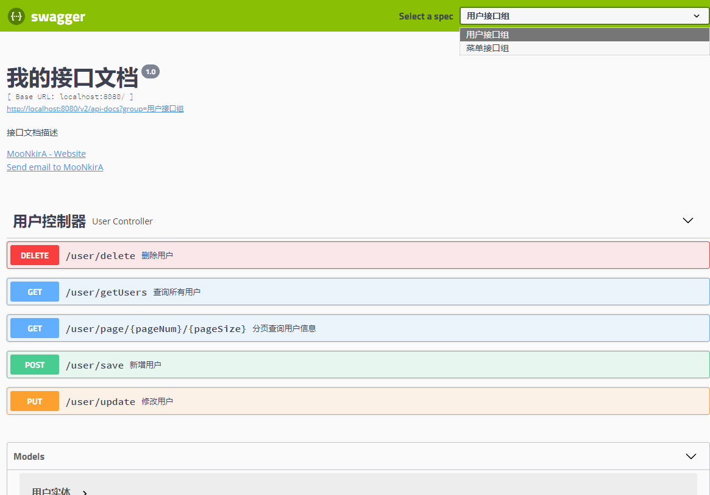
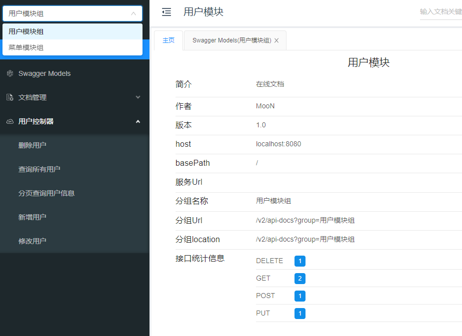
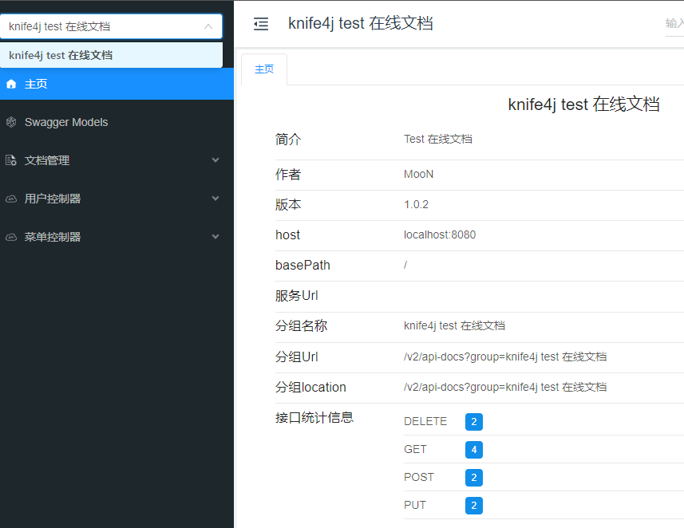

## 1. Swagger 接口文档工具简介

> Swagger 官网：https://swagger.io/

OpenAPI规范（OpenAPI Specification 简称OAS）是Linux基金会的一个项目，试图通过定义一种用来描述API格式或API定义的语言，来规范RESTful服务开发过程，目前版本是V3.0，并且已经发布并开源在github上。https://github.com/OAI/OpenAPI-Specification

Swagger 是全球最大的 OpenAPI 规范（OAS）API开发工具框架，支持从设计和文档到测试和部署的整个API生命周期的开发。

使用 Swagger 只需要按照它的规范去定义接口及接口相关的信息。再通过 Swagger 衍生出来的一系列项目和工具，就可以做到生成各种格式的接口文档，生成多种语言的客户端和服务端的代码，以及在线接口调试页面等等。这样，如果按照新的开发模式，在开发新版本或者迭代版本的时候，只需要更新 Swagger 描述文件，就可以自动生成接口文档和客户端服务端代码，做到调用端代码、服务端代码以及接口文档的一致性。

### 1.1. Springfox 概述

Springfox 是一个开源的 API Doc 的框架，它的前身是 swagger-springmvc，可以将项目的 Controller 中的方法以文档的形式展现。

为了简化 swagger 的使用，Spring 框架对 swagger 进行了整合，建立了 Spring-swagger 项目，后面改成了现在的 Springfox。即 Swagger 是一套规范，而 springfox-swagger 是基于 Spring 生态系统对 Swagger 规范的实现。springfox-swagger-ui 又是对 swagger-ui 的封装，让其可以使用 spring 服务

Spring Boot 可以集成 Swagger，生成 Swagger 接口

### 1.2. knife4j 概述

knife4j 是为 Java MVC 框架集成 Swagger 生成 Api 文档的增强解决方案，前身是 swagger-bootstrap-ui，后面取名为 knife4j 是希望它能像一把匕首一样小巧，轻量，并且功能强悍！其底层是对 Springfox 的封装，使用方式也和 Springfox 一致，只是对接口文档 UI 进行了优化。

**核心功能**：

- **文档说明**：根据 Swagger 的规范说明，详细列出接口文档的说明，包括接口地址、类型、请求示例、请求参数、响应示例、响应参数、响应码等信息，对该接口的使用情况一目了然。
- **在线调试**：提供在线接口联调的强大功能，自动解析当前接口参数，同时包含表单验证，调用参数可返回接口响应内容、headers、响应时间、响应状态码等信息，帮助开发者在线调试。

## 2. Swagger 依赖

### 2.1. Springfox

通过在项目中引入 Springfox，可以扫描相关的代码，生成描述文件，进而生成与代码一致的接口文档和客户端代码。Springfox 对应的 maven 坐标如下：

```xml
<dependency>
    <groupId>io.springfox</groupId>
    <artifactId>springfox-swagger-ui</artifactId>
    <version>2.9.2</version>
</dependency>
<dependency>
    <groupId>io.springfox</groupId>
    <artifactId>springfox-swagger2</artifactId>
    <version>2.9.2</version>
</dependency>
```

### 2.2. knife4j

knife4j 对应的 maven 坐标如下：

```xml
<dependency>
    <groupId>com.github.xiaoymin</groupId>
    <artifactId>knife4j-spring-boot-starter</artifactId>
    <version>2.0.1</version>
</dependency>
```

## 3. Swagger 常用注解

在 Java 类中添加 Swagger 的注解即可生成 Swagger 接口文档，常用 Swagger 注解如下：

### 3.1. 常用注解列表

|         注解          |                          作用                           | 取值 |
| :------------------: | ------------------------------------------------------ | ---- |
|        `@Api`        | 修饰整个请求类，描述Controller的作用                      |      |
|   `@ApiOperation`    | 用在请求的方法上，描述类的某个方法或者一个接口的用途、作用    |      |
|     `@ApiParam`      | 单个参数描述                                             |      |
|     `@ApiModel`      | 通常用于用对象来接收参数，表示一个返回响应数据的信息         |      |
| `@ApiModelProperty`  | 用对象接收参数时，用在类属性上，描述对象的某一个字段         |      |
|    `@ApiResponse`    | HTTP响应其中1个描述                                      |      |
|   `@ApiResponses`    | HTTP响应整体描述                                         |      |
|     `@ApiIgnore`     | 使用该注解忽略这个API                                    |      |
|     `@ApiError`      | 发生错误返回的信息                                       |      |
| `@ApiImplicitParam`  | 用在`@ApiImplicitParams`注解中，指定一个请求参数的各种说明 |      |
| `@ApiImplicitParams` | 用在请求的方法上的多个请求参数，表示一组参数说明             |      |

### 3.2. @ApiImplicitParam 属性说明

|      属性       |                   作用                    |                                                                                                取值                                                                                                 |
| :------------: | ----------------------------------------- | -------------------------------------------------------------------------------------------------------------------------------------------------------------------------------------------------- |
|  `paramType`   | 查询参数类型                               | `path`：以地址的形式提交数据取值<br/>`query`：直接跟参数完成自动映射赋值<br/>`body`：以流的形式提交，仅支持POST请求<br/>`header`：参数在request headers里边提交<br/>`form`：以form表单的形式提交，仅支持POST请求 |
|   `dataType`   | 参数的数据类型 只作为标志说明，并没有实际验证 | Long类型/String类型                                                                                                                                                                                 |
|     `name`     | 接收参数名                                 |                                                                                                                                                                                                    |
|    `value`     | 接收参数的意义描述                          |                                                                                                                                                                                                    |
|   `required`   | 参数是否必填                               | true-必填；false-非必填                                                                                                                                                                              |
| `defaultValue` | 默认值                                    |                                                                                                                                                                                                    |


## 4. Swagger 入门案例

### 4.1. 项目依赖

创建 maven 工程 swagger-demo 并配置 pom.xml 文件引入 swagger 的依赖

```xml
<parent>
    <groupId>org.springframework.boot</groupId>
    <artifactId>spring-boot-starter-parent</artifactId>
    <version>2.2.2.RELEASE</version>
    <relativePath/>
</parent>

<dependencies>
    <dependency>
        <groupId>org.springframework.boot</groupId>
        <artifactId>spring-boot-starter-web</artifactId>
    </dependency>
    <!-- swagger 依赖 -->
    <dependency>
        <groupId>io.springfox</groupId>
        <artifactId>springfox-swagger-ui</artifactId>
        <version>3.0.0</version>
    </dependency>
    <dependency>
        <groupId>io.springfox</groupId>
        <artifactId>springfox-swagger2</artifactId>
        <version>3.0.0</version>
    </dependency>

    <dependency>
        <groupId>org.projectlombok</groupId>
        <artifactId>lombok</artifactId>
    </dependency>
</dependencies>
```

> Tips: swagger 文档项目需要是 web 工程

### 4.2. 创建接口与实体类

- 创建示例测试使用实体类User和Menu，增加相应 swagger 文档的注解

```java
@Data
@ApiModel(value = "用户实体", description = "用户实体")
public class User {
    @ApiModelProperty(value = "主键")
    private int id;
    @ApiModelProperty(value = "姓名")
    private String name;
    @ApiModelProperty(value = "年龄")
    private int age;
    @ApiModelProperty(value = "地址")
    private String address;
}

@Data
@ApiModel(value = "菜单实体", description = "菜单实体")
public class Menu {
    @ApiModelProperty(value = "主键")
    private int id;
    @ApiModelProperty(value = "菜单名称")
    private String name;
}
```

- 创建示例测试使用的 Controller 接口，增加相应 swagger 文档的注解

```java
package com.moon.examples.swagger.controller.user;

import com.moon.examples.swagger.entity.User;
import io.swagger.annotations.Api;
import io.swagger.annotations.ApiImplicitParam;
import io.swagger.annotations.ApiImplicitParams;
import io.swagger.annotations.ApiOperation;
import org.springframework.web.bind.annotation.DeleteMapping;
import org.springframework.web.bind.annotation.GetMapping;
import org.springframework.web.bind.annotation.PathVariable;
import org.springframework.web.bind.annotation.PostMapping;
import org.springframework.web.bind.annotation.PutMapping;
import org.springframework.web.bind.annotation.RequestBody;
import org.springframework.web.bind.annotation.RequestMapping;
import org.springframework.web.bind.annotation.RestController;

import java.util.ArrayList;
import java.util.List;

@RestController
@RequestMapping("/user")
@Api(tags = "用户控制器")
public class UserController {

    @GetMapping("/getUsers")
    @ApiOperation(value = "查询所有用户", notes = "查询所有用户信息")
    public List<User> getAllUsers() {
        User user = new User();
        user.setId(100);
        user.setName("MooN");
        user.setAge(20);
        user.setAddress("earth");
        List<User> list = new ArrayList<>();
        list.add(user);
        return list;
    }

    @PostMapping("/save")
    @ApiOperation(value = "新增用户", notes = "新增用户信息")
    public String save(@RequestBody User user) {
        return "OK";
    }

    @PutMapping("/update")
    @ApiOperation(value = "修改用户", notes = "修改用户信息")
    public String update(@RequestBody User user) {
        return "OK";
    }

    @DeleteMapping("/delete")
    @ApiOperation(value = "删除用户", notes = "删除用户信息")
    public String delete(int id) {
        return "OK";
    }

    @ApiImplicitParams({
            @ApiImplicitParam(name = "pageNum", value = "页码", required = true, type = "Integer"),
            @ApiImplicitParam(name = "pageSize", value = "每页条数", required = true, type = "Integer"),
    })
    @ApiOperation(value = "分页查询用户信息")
    @GetMapping(value = "page/{pageNum}/{pageSize}")
    public String findByPage(@PathVariable Integer pageNum, @PathVariable Integer pageSize) {
        return "OK";
    }
}
```

> Notes: 再创建一个接口类 MenuController，代码与上面一样即可，**但注意将该类放到 `com.moon.examples.swagger.controller.menu` 包，为了后面测试文档分组的功能**

### 4.3. swagger 配置

创建 Swagger 配置类

```java
@Configuration
@EnableSwagger2 // 开启 Swagger
public class SwaggerConfiguration {

    // 模拟创建多个文档组 - 用户模块
    @Bean
    public Docket createRestApi1() {
        // docket对象用于封装接口文档相关信息
        return new Docket(DocumentationType.SWAGGER_2)
                .apiInfo(apiInfo())
                .groupName("用户接口组").select()
                .apis(RequestHandlerSelectors.basePackage("com.moon.examples.swagger.controller.user"))
                .build();
    }

    // 模拟创建多个文档组 - 用户模块
    @Bean
    public Docket createRestApi2() {
        // docket对象用于封装接口文档相关信息
        return new Docket(DocumentationType.SWAGGER_2)
                .apiInfo(apiInfo())
                .groupName("菜单接口组").select()
                .apis(RequestHandlerSelectors.basePackage("com.moon.examples.swagger.controller.menu"))
                .build();
    }

    /**
     * 添加摘要信息
     */
    private ApiInfo apiInfo() {
        // 用ApiInfoBuilder进行定制
        return new ApiInfoBuilder()
                .title("我的接口文档")
                .contact(new Contact("MooNkirA", "http://www.moon.com", "hello@moon.com")) // 设置作者
                .version("1.0") // 设置版本
                .description("接口文档描述") // 设置描述
                .build();
    }
}
```

### 4.4. 运行测试

创建启动类 SwaggerApplication

```java
@SpringBootApplication
public class SwaggerApplication {
    public static void main(String[] args) {
        SpringApplication.run(SwaggerApplication.class, args);
    }
}
```

执行启动类 main 方法启动项目，访问地址：http://localhost:8080/swagger-ui.html



可以在右上角的下拉框中，选择不同的文档分组

## 5. knife4j 入门案例

### 5.1. 项目依赖

创建 maven 工程 swagger-knife4j-demo 并配置 pom.xml 文件引入 knife4j 的依赖

```xml
<parent>
    <groupId>org.springframework.boot</groupId>
    <artifactId>spring-boot-starter-parent</artifactId>
    <version>2.2.2.RELEASE</version>
    <relativePath/>
</parent>

<dependencies>
    <dependency>
        <groupId>org.springframework.boot</groupId>
        <artifactId>spring-boot-starter-web</artifactId>
    </dependency>
    <!-- knife4j 核心依赖 -->
    <dependency>
        <groupId>com.github.xiaoymin</groupId>
        <artifactId>knife4j-spring-boot-starter</artifactId>
        <version>2.0.1</version>
    </dependency>

    <dependency>
        <groupId>org.projectlombok</groupId>
        <artifactId>lombok</artifactId>
    </dependency>
    <dependency>
        <groupId>com.google.guava</groupId>
        <artifactId>guava</artifactId>
        <version>20.0</version>
    </dependency>
</dependencies>
```

> Tips: swagger 文档项目需要是 web 工程

### 5.2. 创建接口与实体类

此步骤复用前面的《Swagger 入门案例》章节的代码即可

### 5.3. knife4j 配置

> Notes: knife4j 配置与 swagger 的配置几乎是一致，不过此示例做了一些配置上的优化，将原来硬编码的配置内容，修改为读取项目的 application.yml 配置文件

#### 5.3.1. 配置属性映射类

创建配置属性类，用于封装yml配置文件中关于 Swagger 接口文档相关的配置信息

```java
@Data
@ConfigurationProperties(prefix = "example.swagger")
public class SwaggerProperties {
    // 以下属性用于不配置分组的情况
    private String title = "在线文档"; // 标题
    private String group = ""; // 自定义组名
    private String description = "在线文档"; // 描述
    private String version = "1.0"; // 版本
    private Contact contact = new Contact(); // 联系人
    private String basePackage = "com.moon.examples.knife4j"; // swagger会解析的包路径
    private List<String> basePath = new ArrayList<>(); // swagger会解析的url规则
    private List<String> excludePath = new ArrayList<>();// 在basePath基础上需要排除的url规则
    // 以下用于保存配置分组文档
    private Map<String, DocketInfo> docket = new LinkedHashMap<>();

    public String getGroup() {
        if (group == null || "".equals(group)) {
            return title;
        }
        return group;
    }

    @Data
    public static class DocketInfo {
        private String title = "在线文档"; // 标题
        private String group = ""; // 自定义组名
        private String description = "在线文档"; // 描述
        private String version = "1.0"; // 版本
        private Contact contact = new Contact(); // 联系人
        private String basePackage = ""; // swagger会解析的包路径
        private List<String> basePath = new ArrayList<>(); // swagger会解析的url规则
        private List<String> excludePath = new ArrayList<>();// 在basePath基础上需要排除的url

        public String getGroup() {
            if (group == null || "".equals(group)) {
                return title;
            }
            return group;
        }
    }

    @Data
    public static class Contact {
        private String name = "MooN"; // 联系人
        private String url = ""; // 联系人url
        private String email = ""; // 联系人email
    }
}
```

#### 5.3.2. 配置文档属性

在项目 resources 目录中创建 application.yml 文件，参照配置属性映射类 `SwaggerProperties` 中的属性名称和结构，配置文档相关的属性值

```yml
example:
  swagger:
    enabled: true # 是否启用swagger
    title: knife4j 在线文档
    description: 我的在线文档
    version: 1.0.1
    docket:
      user:
        title: 用户模块
        group: 用户模块组
        base-package: com.moon.examples.knife4j.controller.user
      menu:
        title: 菜单模块
        group: 菜单模块组
        base-package: com.moon.examples.knife4j.controller.menu
```

#### 5.3.3. knife4j 配置类

创建 Swagger 配置类，参考前面示例的配置类，将硬编码部分修改为读取配置属性类即可。*里面的代码逻辑还有优化的空间*^-^

```java
import com.google.common.base.Predicate;
import com.google.common.base.Predicates;
import org.springframework.beans.BeansException;
import org.springframework.beans.factory.BeanFactory;
import org.springframework.beans.factory.BeanFactoryAware;
import org.springframework.beans.factory.annotation.Autowired;
import org.springframework.beans.factory.config.ConfigurableBeanFactory;
import org.springframework.boot.autoconfigure.condition.ConditionalOnMissingBean;
import org.springframework.boot.autoconfigure.condition.ConditionalOnProperty;
import org.springframework.boot.context.properties.EnableConfigurationProperties;
import org.springframework.context.annotation.Bean;
import org.springframework.context.annotation.Configuration;
import springfox.documentation.builders.ApiInfoBuilder;
import springfox.documentation.builders.PathSelectors;
import springfox.documentation.builders.RequestHandlerSelectors;
import springfox.documentation.service.ApiInfo;
import springfox.documentation.service.Contact;
import springfox.documentation.spi.DocumentationType;
import springfox.documentation.spring.web.plugins.Docket;
import springfox.documentation.swagger2.annotations.EnableSwagger2;

import java.util.ArrayList;
import java.util.LinkedList;
import java.util.List;
import java.util.Map;
import java.util.Set;

/**
 * knife4j 配置类
 */
@Configuration
@EnableConfigurationProperties(SwaggerProperties.class) // 引入配置映射类
@EnableSwagger2 // 开启 swagger
// 当 example.swagger.enabled 值为 true 时，才加载当前配置类
@ConditionalOnProperty(name = "example.swagger.enabled", havingValue = "true", matchIfMissing = true)
public class Knife4jConfiguration implements BeanFactoryAware {

    private static final String BASE_PATH = "/**";

    private BeanFactory beanFactory;

    @Override
    public void setBeanFactory(BeanFactory beanFactory) throws BeansException {
        this.beanFactory = beanFactory;
    }

    @Autowired
    private SwaggerProperties swaggerProperties;

    // 因为此方法返回是 List 对象集合，所以需要使用到 BeanFactory 来辅助注册集合中的实例到 Spring 容器
    @Bean
    @ConditionalOnMissingBean // 配置当容器中不存在该bean时，才创建
    public List<Docket> createRestApi() {
        ConfigurableBeanFactory configurableBeanFactory = (ConfigurableBeanFactory) beanFactory;
        List<Docket> docketList = new LinkedList<>();
        // 获取配置中的分组数据
        Map<String, SwaggerProperties.DocketInfo> docketListConfig = swaggerProperties.getDocket();

        if (docketListConfig.isEmpty()) {
            // 没有分组
            Docket docket = createDocket(swaggerProperties);
            // 手动注册 Docket 实例到 Spring 容器
            configurableBeanFactory.registerSingleton(swaggerProperties.getTitle(), docket);
            docketList.add(docket);
        } else {
            // 存在分组
            Set<Map.Entry<String, SwaggerProperties.DocketInfo>> entries = docketListConfig.entrySet();

            for (Map.Entry<String, SwaggerProperties.DocketInfo> entry : entries) {
                SwaggerProperties.DocketInfo docketInfo = entry.getValue();
                ApiInfo apiInfo = new ApiInfoBuilder()
                        .title(docketInfo.getTitle()) // 页面标题
                        .contact(new Contact(docketInfo.getContact().getName(),
                                docketInfo.getContact().getUrl(),
                                docketInfo.getContact().getEmail()))  // 创建人
                        .version(docketInfo.getVersion()) // 版本号
                        .description(docketInfo.getDescription()) // 描述
                        .build();

                // base-path处理
                if (docketInfo.getBasePath().isEmpty()) {
                    // 当没有配置任何path的时候，解析/**
                    docketInfo.getBasePath().add(BASE_PATH);
                }
                List<Predicate<String>> basePath = new ArrayList<>();
                for (String path : docketInfo.getBasePath()) {
                    basePath.add(PathSelectors.ant(path));
                }

                // exclude-path处理
                List<Predicate<String>> excludePath = new ArrayList<>();
                for (String path : docketInfo.getExcludePath()) {
                    excludePath.add(PathSelectors.ant(path));
                }

                Docket docket = new Docket(DocumentationType.SWAGGER_2)
                        .apiInfo(apiInfo)
                        .groupName(docketInfo.getGroup())
                        .select()
                        // 为当前包路径
                        .apis(RequestHandlerSelectors.basePackage(docketInfo.getBasePackage()))
                        .paths(Predicates.and(Predicates.not(Predicates.or(excludePath)), Predicates.or(basePath)))
                        .build();
                // 手动注册 Docket 实例到 Spring 容器
                configurableBeanFactory.registerSingleton(entry.getKey(), docket);
                docketList.add(docket);
            }
        }
        return docketList;
    }

    // 创建接口文档对象
    private Docket createDocket(SwaggerProperties swaggerProperties) {
        SwaggerProperties.Contact contact = swaggerProperties.getContact();

        // 构建 api文档的详细信息
        ApiInfo apiInfo = new ApiInfoBuilder()
                .title(swaggerProperties.getTitle())  // 页面标题
                .contact(new Contact(contact.getName(), contact.getUrl(), contact.getEmail()))  // 创建人
                .version(swaggerProperties.getVersion())  // 版本号
                .description(swaggerProperties.getDescription())// 描述
                .build();

        // base-path 处理
        List<String> basePathConfig = swaggerProperties.getBasePath();
        if (basePathConfig.isEmpty()) {
            // 当没有配置任何path的时候，解析 /**
            basePathConfig.add(BASE_PATH);
        }

        List<Predicate<String>> basePath = new ArrayList<>();
        for (String path : basePathConfig) {
            basePath.add(PathSelectors.ant(path));
        }

        // exclude-path 处理
        List<Predicate<String>> excludePath = new ArrayList<>();
        for (String path : swaggerProperties.getExcludePath()) {
            excludePath.add(PathSelectors.ant(path));
        }

        return new Docket(DocumentationType.SWAGGER_2)
                .apiInfo(apiInfo)
                .groupName(swaggerProperties.getGroup())
                .select()
                .apis(RequestHandlerSelectors.basePackage(swaggerProperties.getBasePackage()))
                .paths(Predicates.and(Predicates.not(Predicates.or(excludePath)), Predicates.or(basePath)))
                .build();
    }
}
```

### 5.4. 运行测试

创建启动类 Knife4jApplication

```java
@SpringBootApplication
public class Knife4jApplication {
    public static void main(String[] args) {
        SpringApplication.run(Knife4jApplication.class, args);
    }
}
```

执行启动类 main 方法启动项目，访问地址：http://localhost:8080/doc.html



如果需要接口文档不分组，可以修改 application.yml 配置文件：

```yml
example:
  swagger:
    enabled: true # 是否启用swagger
    title: knife4j test 在线文档
    description: Test 在线文档
    version: 1.0.2
    basePackage: com.moon.examples.knife4j
```


