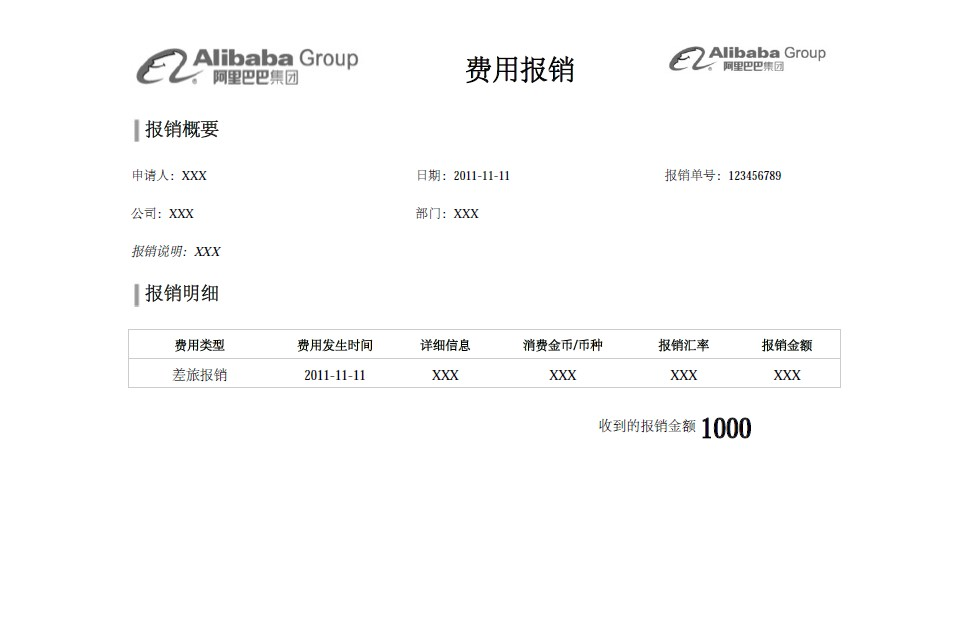

## 1. iText PDF 操作工具类库库简介

- 官网：https://itextpdf.com/
- itext5官方例子：https://developers.itextpdf.com/itext-5-examples
- iText7官方例子：https://developers.itextpdf.com/examples-itext7

## 2. iText库创建PDF文件使用总结

### 2.1. iText库概述

好的一面是，iText是开源的API，但是需要注意，虽然iText是开源，如果你出于商业目的使用它，仍然需要购买商业许可证。你可以从http://itextpdf.com上免费获取iText的Java类库，iText库非常强大，支持HTML、RTF、XML以及PDF文件的生产，你可以在文档中使用各种各样的字体，并且，还可以使用同样的代码生成上述不同类型的文件，这真的是一个很棒的特性，不是吗？

iText库包含一系列接口，可以生成不同字体的PDF文件，在PDF中创建表格，添加水印等等功能。当然，iText还有许许多多其它的功能，这将留给读者去探索。

如果你的项目是maven工程的话，在pom.xml文件中添加如下依赖，即可以给自己的应用程序添加iText库支持。

```xml
<dependency>
    <groupId>com.itextpdf</groupId>
    <artifactId>itextpdf</artifactId>
    <version>5.0.6</version>
</dependency>
```

当然，你也可以自己去下载最新的jar文件，然后添加到工程里，下载地址。

### 2.2. iText库常用类

- com.itextpdf.text.Document：这是iText库中最常用的类，它代表了一个pdf实例。如果你需要从零开始生成一个PDF文件，你需要使用这个Document类。首先创建（new）该实例，然后打开（open）它，并添加（add）内容，最后关闭（close）该实例，即可生成一个pdf文件。
- com.itextpdf.text.Paragraph：表示一个缩进的文本段落，在段落中，你可以设置对齐方式，缩进，段落前后间隔等。
- com.itextpdf.text.Chapter：表示PDF的一个章节，他通过一个Paragraph类型的标题和整形章数创建。
- com.itextpdf.text.Font：这个类包含了所有规范好的字体，包括family of font，大小，样式和颜色，所有这些字体都被声明为静态常量。
- com.itextpdf.text.List：表示一个列表；
- com.itextpdf.text.pdf.PDFPTable：表示一个表格；
- com.itextpdf.text.Anchor：表示一个锚，类似于HTML页面的链接。
- com.itextpdf.text.pdf.PdfWriter：当这个PdfWriter被添加到PdfDocument后，所有添加到Document的内容将会写入到与文件或网络关联的输出流中。
- com.itextpdf.text.pdf.PdfReader：用于读取PDF文件；


## 3. java使用itext生成pdf文档并直接输出到HttpResponse流中给用户下载

java使用itext生成pdf文档并直接输出到HttpResponse流中给用户下载, 这和将pdf文件生成到文件中的不同之处在于下面两行代码：

```java
// 设置http的content-type为application/pdf
response.setContentType("application/pdf");
// 将PdfWriter定向到response的输出流上
PdfWriter.getInstance(document, response.getOutputStream());
```

案例：

```java
public class PdfHelloWorldAction extends Action {
    public ActionForward execute(ActionMapping mapping, ActionForm form,
            HttpServletRequest request, HttpServletResponse response)
            throws Exception {
      Document document = new Document();
      try{
          response.setContentType("application/pdf");
          PdfWriter.getInstance(document, response.getOutputStream());
          document.open();
          document.add(new Paragraph("Hello Kiran"));
          document.add(new Paragraph(new Date().toString()));
      }catch(Exception e){
          e.printStackTrace();
      }
      document.close();
      return null;
      }
}
```


## 4. 模板导入，设置导入的form值的样式

1. 通过软件，Adobe Acrobat或者PDF-XChange_Editor等软件，将文本域的相应样式设置好，基本上可以满足导入后数据显示的样式要求。
2. 使用Acrobat打开制作好的表格PDF文件，制作表单域。注意域名要唯一，同时，注意域的字体、格式、排列等相关属性。
3. 使用iText的PDFreader来读取模板PDF文件，使用setField(fieldname,value)来填充PDF上的表格域，将完成后的PDF文件输出保存即得到完美的PDF表格文件。
4. 对于PDF表格文本域，如果是多行文本域，在用Acrobat制作表单时，需要将域拉伸到将来文本可能填充的区域，iText不会自动扩充扩大。
5. PDF模板的字体尽量使用标准字体，最好不用Acrobat的专有字体。
6. 在iText制作中文表格中，使用iTextAsian.jar包，加入import com.lowagie.text.pdf.fonts.*，否则可能报字体错误或PDF文件不正常。调试时注意服务器的JVM可能缓存，不能即时应用java的变更代码

## 5. iText代码示例

### 5.1. 关于字体

```java
BaseFont.IDENTITY_H, BaseFont.NOT_EMBEDDED);
// 华文中宋
BaseFont bfComic99 = BaseFont.createFont("c:\\windows\\fonts\\STZHONGS.TTF", BaseFont.IDENTITY_H, BaseFont.NOT_EMBEDDED);
//隶书
BaseFont bfComic11= BaseFont.createFont("c:\\windows\\fonts\\SIMLI.TTF", BaseFont.IDENTITY_H, BaseFont.NOT_EMBEDDED);
//宋体&新宋体 (这种字体的输出不了.有问题)
// BaseFont bfComic12 = BaseFont.createFont("c:\\windows\\fonts\\SIMSUN.TTC", null, BaseFont.NOT_EMBEDDED, BaseFont.NOT_EMBEDDED, null, null);
//宋体-方正超大字符集
BaseFont bfComic13 = BaseFont.createFont("c:\\windows\\fonts\\SURSONG.TTF", BaseFont.IDENTITY_H, BaseFont.NOT_EMBEDDED);
//幼圆
BaseFont bfComic14 = BaseFont.createFont("c:\\windows\\fonts\\SIMYOU.TTF", BaseFont.IDENTITY_H, BaseFont.NOT_EMBEDDED);
Font font = new Font(bfComic0, 14);
String text1 = "啊发生的发球特工是大哥是法国时的风格是This is the quite popular True Type
font (繁体字测试VS简体字测试) ==>"+new java.util.Date();
document.add(new Paragraph(text1, font));
}
catch(DocumentException de) {
  System.err.println(de.getMessage());
}
catch(IOException ioe) {
  System.err.println(ioe.getMessage());
}
  // step 5: we close the document
  document.close();
  System.out.println(">>> Export : "+"D:\\ChinesePDF005__.pdf");
}
}
这里调用的都是系统中的字体，如果系统中没有，找个下下来，在C:/windows/fonts/ 安装即可。
```

### 5.2. 导出word、pdf报表

```java
/**
* 导出PDF示例
* @author raintion [2]  * @param args
*/
public static void main(String[] args) {
  try {
    Document document = new Document();
    PdfWriter. getInstance(document, new FileOutputStream("F:\\test.pdf"));
    document.open();
    document.add(new Paragraph( "pride in me!" ));
    document.close();
  } catch (FileNotFoundException e) {
    e.printStackTrace();
  } catch (DocumentException e) {
    e.printStackTrace();
  }
}
/**
* 导出Word示例
* @author raintion
* @param args
*/
public static void main(String[] args) {
  try {
    Document document = new Document(PageSize.A4);
    RtfWriter2. getInstance(document, new FileOutputStream("F:\\test.doc"));
    document.open();
    Paragraph title = new Paragraph("你好 地球人..." );
    document.add(title);
    document.close();
  } catch (FileNotFoundException e) {
    e.printStackTrace();
  } catch (DocumentException e) {
    e.printStackTrace();
  }
}
```

### 5.3. 通过PdfPCell的方法可以隐藏单元格的边框

```java
//新建单元格对象
PdfPCell cell = new PdfPCell(new Phrase("test"));
//隐藏上边框
// cell.disableBorderSide(1);
//隐藏下边框
// cell.disableBorderSide(2);
//隐藏上、下边框
//cell.disableBorderSide(3);
//隐藏左边框
//cell.disableBorderSide(4);
//隐藏左、上边框
//cell.disableBorderSide(5);
//隐藏左、下边框
//cell.disableBorderSide(6);
//隐藏左、上、下边框
//cell.disableBorderSide(7);
//隐藏右边框
//cell.disableBorderSide(8);
//隐藏右、上边框
// cell.disableBorderSide(9);
//隐藏右、下边框
//cell.disableBorderSide(10);
//隐藏右、上、下边框
//cell.disableBorderSide(11);
//隐藏左、右边框
//cell.disableBorderSide(12);
//隐藏上、左、右边框
//cell.disableBorderSide(13);
//隐藏下、左、右边框
//cell.disableBorderSide(14);
//隐藏全部 无边框
//cell.disableBorderSide(15);
```

## 6. 个人实际项目案例

### 6.1. 项目需求概述

浏览器客户端显示pdf的内容，点击下载按钮后，生成pdf文件下载。原来是做成读取pdf模板文件，但因为pdf文件的正文的内容是由通过用户的录入excle表，再导入到区块链中。所有模板导入的方式就出现问题是，无法根据用户录入的内容而进行扩展，会导致当内容过长的时候，显示不全的问题。

所以项目生成PDF的方式改成使用手动设置样式与内容的方式

### 6.2. 生成PDF文件代码（模拟）

说明：原实际项目中，使用的技术是封装了IViewer的接口，用来做为flowc相关逻辑处理后输出的。项目的实现就是实现IViewer接口，重写里面的输出方法，在该方法中就可以获取到request与response等对象。此案例代码只是模拟，直接继承HttpServlet抽象类，重写doPost与doGet方法，模拟项目的实现

```java
package com.nantian.util;

import java.io.IOException;
import java.util.Map;

import javax.servlet.ServletException;
import javax.servlet.ServletOutputStream;
import javax.servlet.http.HttpServlet;
import javax.servlet.http.HttpServletRequest;
import javax.servlet.http.HttpServletResponse;
import javax.servlet.http.HttpSession;

import com.itextpdf.text.Document;
import com.itextpdf.text.Element;
import com.itextpdf.text.Font;
import com.itextpdf.text.FontFactory;
import com.itextpdf.text.PageSize;
import com.itextpdf.text.Paragraph;
import com.itextpdf.text.pdf.BaseFont;
import com.itextpdf.text.pdf.PdfPCell;
import com.itextpdf.text.pdf.PdfPTable;
import com.itextpdf.text.pdf.PdfWriter;

/**
 * 使用itextPdf生成pdf文件
 */
public class PDFViewer extends HttpServlet {

	/**
	 *  模拟请求，生成pdf下载
	 */
	@Override
	protected void doPost(HttpServletRequest request, HttpServletResponse response)
			throws ServletException, IOException {

		// 获取当前工程的字体存放的路径
		String fontPath = request.getContextPath() + "xxx/simsun.ttc";
		// 如果是 ttc 后缀的字体文体，需要后面增加【,0】
		if (fontPath.endsWith("ttc")) {
			fontPath += ",0";
		}

		// 模拟获取请求参数
		request.setCharacterEncoding("UTF-8");

		/**************** 生成pdf文件部分 ***********************/
		Document doc = null;
		ServletOutputStream os = null;
		PdfWriter pdfWriter = null;

		try {
			// 模拟获取数据库数据，数据已经存储在会话域中
			HttpSession session = request.getSession();
			Object pdfData = session.getAttribute("pdfData");

			Map<String, Object> dataMap = null;

			if (pdfData instanceof Map<?, ?>) {
				dataMap = (Map<String, Object>) pdfData;
			}

			if (dataMap == null) {
				throw new RuntimeException();
			}

			// 获取标题数据
			Map<String, String> titleMap = null;

			if (dataMap.get("titleData") instanceof Map<?, ?>) {
				titleMap = (Map<String, String>) dataMap.get("titleData");
			}

			// 获取下载的文件名(如果有中文需要转码)
			String fileName = new String(dataMap.get("fileName").toString().getBytes("UTF-8"), "ISO8859-1");

			// 设置响应头相关内容
			response.setCharacterEncoding("UTF-8");
			response.setContentType("application/pdf; charset=uft-8");
			response.addHeader("Content-Disposition", "attachment;filename=" + fileName + ".pdf");

			// 创建文档对象与输出流
			doc = new Document(PageSize.A4);

			os = response.getOutputStream();

			/************* 设置中文体，处理中文显示问题方式1 ***************/
			BaseFont baseFont = BaseFont.createFont(fontPath, BaseFont.IDENTITY_H, BaseFont.EMBEDDED);
			// 正文的字体
			Font font = new Font(baseFont, 10, Font.NORMAL);
			// 粗体
			Font boldFont = new Font(baseFont, 10, font.BOLD);
			// 标题抬头
			Font titleFont = new Font(baseFont, 20, font.BOLD);

			/************* 设置中文体，处理中文显示问题方式2 ***************/
			// 正文的字体
			Font font1 = FontFactory.getFont(fontPath, 10, Font.NORMAL);
			// 粗体
			Font boldFont1 = FontFactory.getFont(fontPath, 10, font.BOLD);
			// 标题抬头
			Font titleFont1 = FontFactory.getFont(fontPath, 20, font.BOLD);

			// 创建PdfWriter对象
			pdfWriter = pdfWriter.getInstance(doc, os);

			// 打开文档
			doc.open();

			/************* 开始写入数据 ***************/
			// 1.标题
			Paragraph title = new Paragraph(titleMap.get("lgTitle"), titleFont);
			// 居中设置
			title.setAlignment(Element.ALIGN_CENTER);
			// 设置行间距，设置上空间宽度
			title.setLeading(20F);
			doc.add(title);

			// 2.建立pdf表格
			PdfPTable table = new PdfPTable(3);
			/*// 创建方式表格方式2
			float[] widths = { 120F, 200F, 80F };
			PdfPTable table = new PdfPTable(widths);
			// 设置表格上方的空白宽度
			table.setSpacingBefore(20F);
			// 设置表格的宽度
			table.setTotalWidth(700);
			// 设置表格默认边框宽度（0为无边框），注：只对 table.addCell(String str) 或 table.addCell(new Paragraph(content))起作用
			table.getDefaultCell().setBorder(PdfPCell.NO_BORDER);*/

			// 设置表格内容过长不自动转换到下一页显示（每页能显示多少内容即显示多少）
			table.setSplitLate(false);

			// 定义表格边框样式变量
			int borderType = 15;

			// 表格标题1
			addContentCell(table, titleMap.get("tableTitle1"), titleFont, Element.ALIGN_CENTER, Element.ALIGN_CENTER,
					40F, 3, borderType);

			// 插入空行
			addNullCell(table, 20F, 3, borderType);

			// 准备循环的key数组
			String[] titleKeys = { "t1", "t2", "t3", "t4", "t5" };
			String[] contentKeys = { "c1", "c2", "c3", "c4", "c5" };

			// 循环数组数据，
			for (int i = 0; i < contentKeys.length; i++) {
				// 定义垂直对齐
				int vertical = Element.ALIGN_CENTER;
				// 定义高度
				Float height = 20F;

				// 从第3行开始进行特殊处理（如设置高度0F，让单元格自适应内容）
				if (i >= 3) {
					vertical = Element.ALIGN_TOP;
					height = 0F;
				}

				// 设置标题列
				addContentCell(table, titleMap.get(titleKeys[i]), boldFont, Element.ALIGN_LEFT, vertical, height, 0,
						borderType);

				// 设置内容列
				addContentCell(table, dataMap.get(contentKeys[i]).toString(), font, Element.ALIGN_LEFT, vertical,
						height, 2, borderType);
			}

			// 插入空行
			addNullCell(table, 10F, 3, borderType);

			// 增加有边框的bodyText内容，设置水平左对齐，垂直顶端对齐（设置高度0F，让单元格自适应内容）
			String bodyText = dataMap.get("bodyText").toString();
			addContentCell(table, bodyText, font, Element.ALIGN_LEFT, Element.ALIGN_TOP, 0F, 3, 0);

			// 使用默认单元格完成当前行，删除不完整的行
			table.completeRow();

			// 写入表格
			doc.add(table);

			/************* PDF文件生成结束 ***************/

		} catch (Exception e) {
			e.printStackTrace();
		} finally {
			// 关闭文档
			if (null != doc) {
				doc.close();
			}
			// 关闭writer对象，在关闭的同时会使用输出流输出到客户端
			if (null != pdfWriter) {
				pdfWriter.close();
			}
		}

	}

	@Override
	protected void doGet(HttpServletRequest request, HttpServletResponse response)
			throws ServletException, IOException {
		doGet(request, response);
	}

	/**
	 * 插入空的单元格
	 * @param table			表格对象
	 * @param height		设置行高
	 * @param colspan		设置合并的列数
	 * @param borderSide	设置边框
	 */
	public void addNullCell(PdfPTable table, Float height, int colspan, int borderSide) {
		// 创建空的单元格
		PdfPCell cell = new PdfPCell(new Paragraph(""));

		// 设置行高
		if (null != height && height > 0) {
			cell.setFixedHeight(height);
		}

		// 设置是否合并列
		if (colspan > 1) {
			cell.setColspan(colspan);
		}

		// 选择边框显示的样式(0是正常显示4个边框)
		if (borderSide > 0) {
			cell.disableBorderSide(borderSide);
		}

		table.addCell(cell);
	}

	/**
	 * 设置内容的单元格
	 * @param table		表格对象
	 * @param content	数据内容
	 * @param font		设置字体样式
	 * @param horizontal	设置水平对齐方式
	 * @param vertical	设置垂直对齐方式
	 * @param height	设置行高
	 * @param colspan	设置合并的列数
	 * @param borderSide	设置边框样式
	 */
	public void addContentCell(PdfPTable table, String content, Font font, int horizontal, int vertical, Float height,
			int colspan, int borderSide) {
		// 创建单元格，设置字体样式
		PdfPCell cell = new PdfPCell(new Paragraph(content, font));

		// 设置水平对齐
		cell.setHorizontalAlignment(horizontal);
		// 设置垂直对齐
		cell.setVerticalAlignment(vertical);

		// 设置行高
		if (null != height && height > 0) {
			cell.setFixedHeight(height);
		}

		// 设置是否合并列
		if (colspan > 1) {
			cell.setColspan(colspan);
		}

		// 选择边框显示的样式(0是正常显示4个边框)
		if (borderSide > 0) {
			cell.disableBorderSide(borderSide);
		}

		table.addCell(cell);
	}

}
```

## 7. 模板导入网上案例

### 7.1. 案例1：itext生成PDF

java-pdf-itext7、itextpdf 生成pdf 文档,使用pdf模板生成(支持中文字体)

itext7 内置对中文（CJK字体）进行了支持，不在依赖其他组件。

```java
//处理中文问题
PdfFont font = PdfFontFactory.createFont("STSongStd-Light", "UniGB-UCS2-H", false);
```

一、iText 7 资料：

官网：http://developers.itextpdf.com/

官网示例：http://developers.itextpdf.com/content/itext-7-jump-start-tutorial/examples


二、itext7 maven 依赖

```xml
<dependency>
	<groupId>com.itextpdf</groupId>
	<artifactId>itext7-core</artifactId>
	<version>7.0.2</version>
	<type>pom</type>
</dependency>
```

三、生成pdf 和使用pdf模板生成pdf 的方法

pdf模板需要使用：Adobe Acrobat DC 进行表单制作


```java
package com.demo.preview;
 
 
import java.io.FileOutputStream;
import java.io.IOException;
import java.util.Map;
 
 
import org.junit.Test;
 
 
import com.itextpdf.forms.PdfAcroForm;
import com.itextpdf.forms.fields.PdfFormField;
import com.itextpdf.kernel.color.Color;
import com.itextpdf.kernel.font.PdfFont;
import com.itextpdf.kernel.font.PdfFontFactory;
import com.itextpdf.kernel.pdf.PdfDocument;
import com.itextpdf.kernel.pdf.PdfReader;
import com.itextpdf.kernel.pdf.PdfWriter;
import com.itextpdf.layout.Document;
import com.itextpdf.layout.border.SolidBorder;
import com.itextpdf.layout.element.Paragraph;
 
 
import me.grass.extend.DateExtend;
import me.grass.extend.PathExtend;
import me.grass.extend.StringExtend;
 
 
/**
 *
 * @author xxj
 */
public class ITextPdf7Test {
	/**
	 * 生成一个简单的pdf文件
	 * 
	 */
	@Test
	public void createPdf(){
		// 生成的新文件路径
		String fileName = StringExtend.format("itext-pdf-{0}.pdf", DateExtend.getDate("yyyyMMddHHmmss"));
		String newPDFPath = PathExtend.Combine("D:/Temp/pdf/", fileName);
	
		try {	
 
 
			//处理中文问题  
			PdfFont font = PdfFontFactory.createFont("STSongStd-Light", "UniGB-UCS2-H", false);  
			
			PdfWriter writer = new PdfWriter(new FileOutputStream(newPDFPath));
			//Initialize PDF document  
	        PdfDocument pdf = new PdfDocument(writer);    
	        Document document = new Document(pdf);
	        
	        Paragraph p =new Paragraph("你好,世界！hello word!");
	        p.setFont(font);
	        p.setFontSize(12);
	        p.setBorder(new SolidBorder(Color.BLACK,0.5f));
			document.add(p);			
			
			document.close();
			writer.close();
			pdf.close();
		} catch (Exception e) {
			e.printStackTrace();
		}
	}
	/**
	 * 使用pdf 模板生成 pdf 文件
	 * 	 */
	@Test
	public void fillTemplate() {// 利用模板生成pdf
		// 模板路径
		String templatePath = "D:/Temp/pdf/pdf-template-form.pdf";
		// 生成的新文件路径
		String fileName = StringExtend.format("itext-template-{0}.pdf", DateExtend.getDate("yyyyMMddHHmmss"));
		String newPDFPath = PathExtend.Combine("D:/Temp/pdf/", fileName);
 
 
		try {
	        //Initialize PDF document
	        PdfDocument pdf = new PdfDocument(new PdfReader(templatePath), new PdfWriter(newPDFPath));
	        PdfAcroForm form = PdfAcroForm.getAcroForm(pdf, true);
	        Map<String, PdfFormField> fields = form.getFormFields();
	        
			//处理中文问题  
			PdfFont font = PdfFontFactory.createFont("STSongStd-Light", "UniGB-UCS2-H", false);  
			String[] str = {
					"01.hello word!", 
					"02.你好，世界！",
					"03.hello word!", 
					"04.你好，世界！",
					"05.hello word!", 
					"06.你好，世界！",
					"07.hello word!", 
					"08.你好，世界！",
					"09.hello word!", 
					"10.你好，世界！",
					"11.hello word!", 
					"12.你好，世界！", };
			int i = 0;
			java.util.Iterator<String> it = fields.keySet().iterator();
			while (it.hasNext()) {
				//获取文本域名称
				String name = it.next().toString();
				//填充文本域
				fields.get(name).setValue(str[i++]).setFont(font).setFontSize(12);
				System.out.println(name);
			}	
			form.flattenFields();//设置表单域不可编辑			
			pdf.close();
 
 
		} catch (IOException e) {
			e.printStackTrace();
		} catch (Exception e){
			e.printStackTrace();
		}
 
 
	}
}
```

### 7.2. 案例2：java 操作pdf  填入数据后，生成新pdf无法显示中文

```java
.........
 
try {
    PdfReader reader = new PdfReader(path);//读模板文件
    PdfStamper stamper = new PdfStamper(reader, new FileOutputStream(tempPath));//复制模板文件
    AcroFields s = stamper.getAcroFields();//获取所有域名
// 设置中文显示
BaseFont bfChinese = BaseFont.createFont("STSong-Light", "UniGB-UCS2-H", BaseFont.NOT_EMBEDDED);
 
    for (String key : map.keySet()) {
        String value = (String) map.get(key);
        s.setFieldProperty(key,"textfont",bfChinese,null);
        s.setField(key, value); // 为字段赋值,注意字段名称是区分大小写的
    }
    stamper.setFormFlattening(true);
    reader.close();
    stamper.close();
} catch (IOException e) {
    logger.info(e.getMessage());
    e.printStackTrace();
} catch (DocumentException e) {
    logger.info(e.getMessage());
    e.printStackTrace();
}
```

### 7.3. 案例3：Java程序通过 pdf模板 添加pdf表单数据并打印

```java
package document.pdf;

import java.io.ByteArrayOutputStream;
import java.io.FileOutputStream;
import java.io.IOException;
import java.text.SimpleDateFormat;
import java.util.ArrayList;
import java.util.Date;
import java.util.List;

import com.lowagie.text.DocumentException;
import com.lowagie.text.Font;
import com.lowagie.text.pdf.AcroFields;
import com.lowagie.text.pdf.BaseFont;
import com.lowagie.text.pdf.PdfReader;
import com.lowagie.text.pdf.PdfStamper;

public class OperatePdf {
    public static void main(String[] args) {
        fromPDFTempletToPdfWithValue();
    }

    public static void fromPDFTempletToPdfWithValue(){
        String fileName = "f:/test.pdf";

        try {
            //获得pdf阅读器
            PdfReader reader = new PdfReader(fileName);
            //字节数组输出流
            ByteArrayOutputStream bos = new ByteArrayOutputStream();

            PdfStamper ps = new PdfStamper(reader,bos);

            BaseFont bf = BaseFont.createFont("STSong-Light", "UniGB-UCS2-H", BaseFont.NOT_EMBEDDED);
            //设置中文12号字体
            Font fontChinese = new Font(bf,12,Font.NORMAL);
            //自定义表单
            AcroFields form = ps.getAcroFields();

            String str = "黑龙江沙河科技";
            if(str.length()>6)
                str = str.substring(0,6);
            form.setField("company", str);

            Date date = new Date(System.currentTimeMillis());
            SimpleDateFormat format = new SimpleDateFormat("yyyy-MM-dd HH:mm:ss");
            String dateStr = format.format(date);
            form.setField("date", dateStr);

            List<List<String>> lists = new ArrayList<List<String>>();
            List<String> list = new ArrayList<String>();
            for (int j = 0; j <5; j++) {
                list.add("张三"+(j+1));
                list.add("经理"+(j+1));
                list.add("身份证");
                list.add("4111111111111");
                lists.add(list);
            }
            for(int i=0;i<lists.size();i++){
                List<String> list2 = lists.get(i);
                form.setField("seq"+(i+1),String.valueOf(i+1));
                form.setField("name"+i,list2.get(0));
                form.setField("position"+i,list2.get(1));
                form.setField("certificate"+i,list2.get(2));
                form.setField("number"+i,list2.get(3));
            }
            // 设置为true/false在点击生成的pdf文档的填充域时有区别，
            ps.setFormFlattening(true);
            ps.close();
            FileOutputStream fos = new FileOutputStream("f:/1.pdf");
            fos.write(bos.toByteArray());

        } catch (IOException | DocumentException e) {
            // TODO Auto-generated catch block
            e.printStackTrace();
        }
    }
}

public static void printFile(String path) throws Exception {
    File file = new File(path);
    File[] fies=file.listFiles();
    for(File f:fies){
        System.out.println("file "+f.getName());
        String fileExt=f.getName().substring(f.getName().indexOf(".")+1,f.getName().length());
        if("pdf".equalsIgnoreCase(fileExt)){
            String filepath=path+File.separator+f.getName();
            File pdfFile=new File(filepath);
            //构建打印请求属性集
            PrintRequestAttributeSet pras = new HashPrintRequestAttributeSet();
            //设置打印格式，因为未确定文件类型，这里选择AUTOSENSE
            DocFlavor flavor = DocFlavor.INPUT_STREAM.AUTOSENSE;
            //查找所有的可用打印服务
            PrintService printService[] = PrintServiceLookup.lookupPrintServices(flavor, pras);
            //定位默认的打印服务
            PrintService defaultService = PrintServiceLookup.lookupDefaultPrintService();
            //显示打印对话框
            //PrintService service = ServiceUI.printDialog(null, 200, 200, printService, defaultService, flavor, pras);
            if(defaultService!=null){
                DocPrintJob job = defaultService.createPrintJob(); //创建打印作业
                FileInputStream fis = new FileInputStream(pdfFile); //构造待打印的文件流
                DocAttributeSet das = new HashDocAttributeSet();
                Doc doc = new SimpleDoc(fis, flavor, das); //建立打印文件格式
                job.print(doc, pras); //进行文件的打印
            }
            f.delete();
        }
    }
}
```

### 7.4. 案例4：itext5生成pdf使用总结

最近在忙一个租赁行业的一个业务系统，其中客户要求自动生成PDF通知书文件，itext5首先生成PDF文件有两种方式，1：利用Adobe Acrobat 8 Professional专业版来制作PDF模板 2：就是用PdfWriter去生成。我个人建议第二种，因为模板定义的文本域是要框定长宽的，而业务数据往往不规则就会出现有的内容放不下有的内容就位置太大，无法动态去换行和收缩控制。但第二种去手动生成可以通过API属性来排版和自动换行等灵活的效果。下面来事例一个基本的PDF生成代码。

```java
Document document = new Document(PageSize.A4, 80, 79, 20, 45); // A4纸大小 左、右、上、下
/* 使用中文字体 */
BaseFont bfChinese = BaseFont.createFont("STSongStd-Light","UniGB-UCS2-H", BaseFont.NOT_EMBEDDED);
// 中文处理
Font FontChinese = new Font(bfChinese, 14, Font.COURIER);
// 其他所有文字字体
Font BoldChinese = new Font(bfChinese, 14, Font.BOLD); // 粗体
Font titleChinese = new Font(bfChinese, 20, Font.BOLD); // 模板抬头的字体
Font subFontChinese = new Font(bfChinese, 12, Font.COURIER); // 币种和租金金额的小一号字体
Font moneyFontChinese = new Font(bfChinese, 8, Font.COURIER); // 币种和租金金额的小一号字体
Font subBoldFontChinese = new Font(bfChinese, 8, Font.BOLD); // 币种和租金金额的小一号字体

   PdfWriter.getInstance(document,new FileOutputStream("D:/opt/yd_apps/rim/uploadfolder/RENTAL_NOTICE/20110707/P48231_RENTAL_NOTICE_20110707.pdf"));
    document.open(); //打开文档
    //------------开始写数据-------------------
    Paragraph title = new Paragraph("起租通知书", titleChinese);// 抬头
		title.setAlignment(Element.ALIGN_CENTER); // 居中设置
		title.setLeading(1f);//设置行间距//设置上面空白宽度
		document.add(title);

		title = new Paragraph("致：XXX公司", BoldChinese);// 抬头
		title.setSpacingBefore(25f);//设置上面空白宽度
		document.add(title);

		title = new Paragraph("         贵我双方签署的编号为 XXX有关起租条件已满足，现将租赁合同项下相关租赁要素明示如下：", FontChinese);
		title.setLeading(22f);//设置行间距
		document.add(title);

		float[] widths = { 10f,25f,30f,30f };// 设置表格的列宽和列数  默认是4列
		if(depositBean.isExpress()==5){	//如果是明示就是6列
			widths = new float[]{ 8f,15f,19f,19f,19f,20f };
		}else if(depositBean.isExpress()==6){	//如果是业发事业部就是7列
			widths = new float[]{ 8f,15f,15f,15f,15f,16f,16f };
		}

		PdfPTable table = new PdfPTable(widths);// 建立一个pdf表格
		table.setSpacingBefore(20f);// 设置表格上面空白宽度
		table.setTotalWidth(500);// 设置表格的宽度
		table.setWidthPercentage(100);//设置表格宽度为%100
		// table.getDefaultCell().setBorder(0);//设置表格默认为无边框

		String[] tempValue = new Stirng[4]{"1","2011-07-07","2222","11.11","11.11","3000","9999"};	//租金期次列表
		int rowCount=1;	//行计数器
		PdfPCell cell = null;
		//---表头
		cell = new PdfPCell(new Paragraph("期次", subBoldFontChinese));//描述
		cell.setFixedHeight(20);
		cell.setHorizontalAlignment(Element.ALIGN_CENTER);// 设置内容水平居中显示
		cell.setVerticalAlignment(Element.ALIGN_MIDDLE);  // 设置垂直居中
		table.addCell(cell);
		cell = new PdfPCell(new Paragraph("租金日", subBoldFontChinese));//描述
		cell.setFixedHeight(20);
		cell.setHorizontalAlignment(Element.ALIGN_CENTER);// 设置内容水平居中显示
		cell.setVerticalAlignment(Element.ALIGN_MIDDLE);  // 设置垂直居中
		table.addCell(cell);
		cell = new PdfPCell(new Paragraph("各期租金金额", subBoldFontChinese));//描述
		cell.setFixedHeight(20);
		cell.setHorizontalAlignment(Element.ALIGN_CENTER);// 设置内容水平居中显示
		cell.setVerticalAlignment(Element.ALIGN_MIDDLE);  // 设置垂直居中
		table.addCell(cell);

		cell = new PdfPCell(new Paragraph("各期租金后\n剩余租金", subBoldFontChinese));//描述
		cell.setHorizontalAlignment(Element.ALIGN_CENTER);// 设置内容水平居中显示
		cell.setVerticalAlignment(Element.ALIGN_MIDDLE);  // 设置垂直居中
		cell.setFixedHeight(20);
		table.addCell(cell);

		for (int j = 1 ; j< tempValue.length; j++){
                        if(j%argument==1){		//第一列 日期
					cell = new PdfPCell(new Paragraph(rowCount+"", moneyFontChinese));//描述
					cell.setFixedHeight(20);
					cell.setHorizontalAlignment(Element.ALIGN_CENTER);// 设置内容水平居中显示
					cell.setVerticalAlignment(Element.ALIGN_MIDDLE);  // 设置垂直居中
					table.addCell(cell);
					rowCount++;
			}
			cell = new PdfPCell(new Paragraph(tempValue[j], moneyFontChinese));//描述
			cell.setFixedHeight(20);
			cell.setHorizontalAlignment(Element.ALIGN_CENTER);// 设置内容水平居中显示
			cell.setVerticalAlignment(Element.ALIGN_MIDDLE);  // 设置垂直居中
			table.addCell(cell);
		}
		document.add(table);

		title = new Paragraph("                租金总额：XXX", FontChinese);
		title.setLeading(22f);//设置行间距
		document.add(title);
		title = new Paragraph("         特此通知！", FontChinese);
		title.setLeading(22f);//设置行间距
		document.add(title);
		//-------此处增加图片和日期，因为图片会遇到跨页的问题，图片跨页，图片下方的日期就会脱离图片下方会放到上一页。
                //所以必须用表格加以固定的技巧来实现
		float[] widthes = { 50f };// 设置表格的列宽和列数
		PdfPTable hiddenTable = new PdfPTable(widthes);// 建立一个pdf表格
		hiddenTable.setSpacingBefore(11f);	//设置表格上空间
		hiddenTable.setTotalWidth(500);// 设置表格的宽度
		hiddenTable.setWidthPercentage(100);//设置表格宽度为%100
		hiddenTable.getDefaultCell().disableBorderSide(1);
		hiddenTable.getDefaultCell().disableBorderSide(2);
		hiddenTable.getDefaultCell().disableBorderSide(4);
		hiddenTable.getDefaultCell().disableBorderSide(8);

		Image upgif = Image.getInstance("D:/opt/yd_apps/rim/uploadfolder/stamp1.jpg");
		upgif.scalePercent(7.5f);//设置缩放的百分比%7.5
		upgif.setAlignment(Element.ALIGN_RIGHT);

		cell = new PdfPCell(new Paragraph("", FontChinese));//描述
		cell.setHorizontalAlignment(Element.ALIGN_RIGHT);// 设置内容水平居中显示
		cell.addElement(upgif);
		cell.setPaddingTop(0f);				//设置内容靠上位置
		cell.setPaddingBottom(0f);
		cell.setPaddingRight(20f);
		cell.setBorder(Rectangle.NO_BORDER);//设置单元格无边框
		hiddenTable.addCell(cell);

		cell = new PdfPCell(new Paragraph("XX 年 XX 月 XX 日                    ", FontChinese));//金额
		cell.setHorizontalAlignment(Element.ALIGN_RIGHT);// 设置内容水平居中显示
		cell.setPaddingTop(0f);
		cell.setPaddingRight(20f);
		cell.setBorder(Rectangle.NO_BORDER);
		hiddenTable.addCell(cell);
		document.add(hiddenTable);
		logger.debug("拼装起租通知书结束...");
		document.close();
```

### 7.5. 案例5：使用itext生成pdf的，各种布局

jar包为itext.jar，itextAsia.jar，最好都是最新的。最后生成的pdf如下：



```java
package com.itext.test;

import java.io.FileOutputStream;

import com.itextpdf.text.BaseColor;
import com.itextpdf.text.Document;
import com.itextpdf.text.Element;
import com.itextpdf.text.Image;
import com.itextpdf.text.PageSize;
import com.itextpdf.text.Paragraph;
import com.itextpdf.text.pdf.BaseFont;
import com.itextpdf.text.pdf.PdfPCell;
import com.itextpdf.text.pdf.PdfPTable;
import com.itextpdf.text.pdf.PdfWriter;


public class BaoXiaoDan {
    public static void main(String[] args) {
        try{
             Document document = new Document(PageSize.A4.rotate());
             PdfWriter.getInstance(document, new FileOutputStream("D:\\Helloworld.PDF"));

            //设置字体
            BaseFont bfChinese = BaseFont.createFont("STSong-Light", "UniGB-UCS2-H",BaseFont.NOT_EMBEDDED);
            com.itextpdf.text.Font FontChinese24 = new com.itextpdf.text.Font(bfChinese, 24, com.itextpdf.text.Font.BOLD);
            com.itextpdf.text.Font FontChinese18 = new com.itextpdf.text.Font(bfChinese, 18, com.itextpdf.text.Font.BOLD);
            com.itextpdf.text.Font FontChinese16 = new com.itextpdf.text.Font(bfChinese, 16, com.itextpdf.text.Font.BOLD);
            com.itextpdf.text.Font FontChinese12 = new com.itextpdf.text.Font(bfChinese, 12, com.itextpdf.text.Font.NORMAL);
            com.itextpdf.text.Font FontChinese11Bold = new com.itextpdf.text.Font(bfChinese, 11, com.itextpdf.text.Font.BOLD);
            com.itextpdf.text.Font FontChinese11 = new com.itextpdf.text.Font(bfChinese, 11, com.itextpdf.text.Font.ITALIC);
            com.itextpdf.text.Font FontChinese11Normal = new com.itextpdf.text.Font(bfChinese, 11, com.itextpdf.text.Font.NORMAL);

            document.open();
            //table1
            PdfPTable table1 = new PdfPTable(3);
            PdfPCell cell11 = new PdfPCell(new Paragraph("费用报销",FontChinese24));
            cell11.setVerticalAlignment(Element.ALIGN_MIDDLE);
            cell11.setHorizontalAlignment(Element.ALIGN_CENTER);
            cell11.setBorder(0);
            String imagePath = "D:/alibaba.jpg";
            Image image1 = Image.getInstance(imagePath); 

            Image image2 = Image.getInstance(imagePath); 
            //设置每列宽度比例   
            int width11[] = {35,40,25};
            table1.setWidths(width11); 
            table1.getDefaultCell().setBorder(0);
            table1.addCell(image1);  
            table1.addCell(cell11);  
            table1.addCell(image2);
            document.add(table1);
            //加入空行
            Paragraph blankRow1 = new Paragraph(18f, " ", FontChinese18); 
            document.add(blankRow1);

            //table2
            PdfPTable table2 = new PdfPTable(2);
            //设置每列宽度比例   
            int width21[] = {2,98};
            table2.setWidths(width21); 
            table2.getDefaultCell().setBorder(0);
            PdfPCell cell21 = new PdfPCell(new Paragraph("报销概要",FontChinese16));
            String imagePath2 = "D:/boder.jpg";
            Image image21 = Image.getInstance(imagePath2); 
            cell21.setBorder(0);
            table2.addCell(image21);
            table2.addCell(cell21); 
            document.add(table2);
            //加入空行
            Paragraph blankRow2 = new Paragraph(18f, " ", FontChinese18); 
            document.add(blankRow2);

            //table3
            PdfPTable table3 = new PdfPTable(3);
            int width3[] = {40,35,25};
            table3.setWidths(width3); 
            PdfPCell cell31 = new PdfPCell(new Paragraph("申请人："+"XXX",FontChinese11Normal));
            PdfPCell cell32 = new PdfPCell(new Paragraph("日期："+"2011-11-11",FontChinese11Normal));
            PdfPCell cell33 = new PdfPCell(new Paragraph("报销单号："+"123456789",FontChinese11Normal));
            cell31.setBorder(0);
            cell32.setBorder(0);
            cell33.setBorder(0);
            table3.addCell(cell31);
            table3.addCell(cell32);
            table3.addCell(cell33);
            document.add(table3);
            //加入空行
            Paragraph blankRow31 = new Paragraph(18f, " ", FontChinese11); 
            document.add(blankRow31);

            //table4
            PdfPTable table4 = new PdfPTable(2);
            int width4[] = {40,60};
            table4.setWidths(width4); 
            PdfPCell cell41 = new PdfPCell(new Paragraph("公司："+"XXX",FontChinese11Normal));
            PdfPCell cell42 = new PdfPCell(new Paragraph("部门："+"XXX",FontChinese11Normal));
            cell41.setBorder(0);
            cell42.setBorder(0);
            table4.addCell(cell41);
            table4.addCell(cell42);
            document.add(table4);
            //加入空行
            Paragraph blankRow41 = new Paragraph(18f, " ", FontChinese11); 
            document.add(blankRow41);

            //table5
            PdfPTable table5 = new PdfPTable(1);
            PdfPCell cell51 = new PdfPCell(new Paragraph("报销说明："+"XXX",FontChinese11));
            cell51.setBorder(0);
            table5.addCell(cell51);
            document.add(table5);
            //加入空行
            Paragraph blankRow51 = new Paragraph(18f, " ", FontChinese18); 
            document.add(blankRow51);

            //table6
            PdfPTable table6 = new PdfPTable(2);
            table6.getDefaultCell().setBorder(0);
            table6.setWidths(width21); 
            PdfPCell cell61 = new PdfPCell(new Paragraph("报销明细",FontChinese16));
            cell61.setBorder(0);
            table6.addCell(image21);
            table6.addCell(cell61); 
            document.add(table6);
            //加入空行
            Paragraph blankRow4 = new Paragraph(18f, " ", FontChinese16); 
            document.add(blankRow4);

            //table7
            PdfPTable table7 = new PdfPTable(6);
            BaseColor lightGrey = new BaseColor(0xCC,0xCC,0xCC);
            int width7[] = {20,18,13,20,14,15};
            table7.setWidths(width7); 
            PdfPCell cell71 = new PdfPCell(new Paragraph("费用类型",FontChinese11Bold));
            PdfPCell cell72 = new PdfPCell(new Paragraph("费用发生时间",FontChinese11Bold));
            PdfPCell cell73 = new PdfPCell(new Paragraph("详细信息",FontChinese11Bold));
            PdfPCell cell74 = new PdfPCell(new Paragraph("消费金币/币种",FontChinese11Bold));
            PdfPCell cell75 = new PdfPCell(new Paragraph("报销汇率",FontChinese11Bold));
            PdfPCell cell76 = new PdfPCell(new Paragraph("报销金额",FontChinese11Bold));
            //表格高度
            cell71.setFixedHeight(25);
            cell72.setFixedHeight(25);
            cell73.setFixedHeight(25);
            cell74.setFixedHeight(25);
            cell75.setFixedHeight(25);
            cell76.setFixedHeight(25);
            //水平居中
            cell71.setHorizontalAlignment(Element.ALIGN_CENTER);
            cell72.setHorizontalAlignment(Element.ALIGN_CENTER);
            cell73.setHorizontalAlignment(Element.ALIGN_CENTER);
            cell74.setHorizontalAlignment(Element.ALIGN_CENTER);
            cell75.setHorizontalAlignment(Element.ALIGN_CENTER);
            cell76.setHorizontalAlignment(Element.ALIGN_CENTER);
            //垂直居中
            cell71.setVerticalAlignment(Element.ALIGN_MIDDLE);
            cell72.setVerticalAlignment(Element.ALIGN_MIDDLE);
            cell73.setVerticalAlignment(Element.ALIGN_MIDDLE);
            cell74.setVerticalAlignment(Element.ALIGN_MIDDLE);
            cell75.setVerticalAlignment(Element.ALIGN_MIDDLE);
            cell76.setVerticalAlignment(Element.ALIGN_MIDDLE);
            //边框颜色
            cell71.setBorderColor(lightGrey);
            cell72.setBorderColor(lightGrey);
            cell73.setBorderColor(lightGrey);
            cell74.setBorderColor(lightGrey);
            cell75.setBorderColor(lightGrey);
            cell76.setBorderColor(lightGrey);
            //去掉左右边框
            cell71.disableBorderSide(8);
            cell72.disableBorderSide(4);
            cell72.disableBorderSide(8);
            cell73.disableBorderSide(4);
            cell73.disableBorderSide(8);
            cell74.disableBorderSide(4);
            cell74.disableBorderSide(8);
            cell75.disableBorderSide(4);
            cell75.disableBorderSide(8);
            cell76.disableBorderSide(4);
            table7.addCell(cell71);
            table7.addCell(cell72);
            table7.addCell(cell73);
            table7.addCell(cell74);
            table7.addCell(cell75);
            table7.addCell(cell76);
            document.add(table7);

                    //table8
                    PdfPTable table8 = new PdfPTable(6);
                    int width8[] = {20,18,13,20,14,15};
                    table8.setWidths(width8); 
                    PdfPCell cell81 = new PdfPCell(new Paragraph("差旅报销",FontChinese12));
                    PdfPCell cell82 = new PdfPCell(new Paragraph("2011-11-11",FontChinese12));
                    PdfPCell cell83 = new PdfPCell(new Paragraph("XXX",FontChinese12));
                    PdfPCell cell84 = new PdfPCell(new Paragraph("XXX",FontChinese12));
                    PdfPCell cell85 = new PdfPCell(new Paragraph("XXX",FontChinese12));
                    PdfPCell cell86 = new PdfPCell(new Paragraph("XXX",FontChinese12));
                    //表格高度
                    cell81.setFixedHeight(25);
                    cell82.setFixedHeight(25);
                    cell83.setFixedHeight(25);
                    cell84.setFixedHeight(25);
                    cell85.setFixedHeight(25);
                    cell86.setFixedHeight(25);
                    //水平居中
                    cell81.setHorizontalAlignment(Element.ALIGN_CENTER);
                    cell82.setHorizontalAlignment(Element.ALIGN_CENTER);
                    cell83.setHorizontalAlignment(Element.ALIGN_CENTER);
                    cell84.setHorizontalAlignment(Element.ALIGN_CENTER);
                    cell85.setHorizontalAlignment(Element.ALIGN_CENTER);
                    cell86.setHorizontalAlignment(Element.ALIGN_CENTER);
                    //垂直居中
                    cell81.setVerticalAlignment(Element.ALIGN_MIDDLE);
                    cell82.setVerticalAlignment(Element.ALIGN_MIDDLE);
                    cell83.setVerticalAlignment(Element.ALIGN_MIDDLE);
                    cell84.setVerticalAlignment(Element.ALIGN_MIDDLE);
                    cell85.setVerticalAlignment(Element.ALIGN_MIDDLE);
                    cell86.setVerticalAlignment(Element.ALIGN_MIDDLE);
                    //边框颜色
                    cell81.setBorderColor(lightGrey);
                    cell82.setBorderColor(lightGrey);
                    cell83.setBorderColor(lightGrey);
                    cell84.setBorderColor(lightGrey);
                    cell85.setBorderColor(lightGrey);
                    cell86.setBorderColor(lightGrey);
                    //去掉左右边框
                    cell81.disableBorderSide(8);
                    cell82.disableBorderSide(4);
                    cell82.disableBorderSide(8);
                    cell83.disableBorderSide(4);
                    cell83.disableBorderSide(8);
                    cell84.disableBorderSide(4);
                    cell84.disableBorderSide(8);
                    cell85.disableBorderSide(4);
                    cell85.disableBorderSide(8);
                    cell86.disableBorderSide(4);
                    table8.addCell(cell81);
                    table8.addCell(cell82);
                    table8.addCell(cell83);
                    table8.addCell(cell84);
                    table8.addCell(cell85);
                    table8.addCell(cell86);
                    document.add(table8);
              //加入空行
              Paragraph blankRow5 = new Paragraph(18f, " ", FontChinese18); 
              document.add(blankRow5);

            //table9
            PdfPTable table9 = new PdfPTable(3);
            int width9[] = {30,50,20};
            table9.setWidths(width9);
            PdfPCell cell91 = new PdfPCell(new Paragraph("",FontChinese12));
            PdfPCell cell92 = new PdfPCell(new Paragraph("收到的报销金额",FontChinese12));
            PdfPCell cell93 = new PdfPCell(new Paragraph("1000",FontChinese24));
            cell92.setHorizontalAlignment(Element.ALIGN_RIGHT);
            cell92.setVerticalAlignment(Element.ALIGN_MIDDLE);
            cell93.setHorizontalAlignment(Element.ALIGN_LEFT);
            cell93.setVerticalAlignment(Element.ALIGN_MIDDLE);
            cell91.setBorder(0);
            cell92.setBorder(0);
            cell93.setBorder(0);
            table9.addCell(cell91); 
            table9.addCell(cell92); 
            table9.addCell(cell93); 
            document.add(table9);

             document.close();

        } catch (Exception ex) 
        {
          ex.printStackTrace();
        }
    }
}
```

### 7.6. 案例6：在linux环境下使用itext生成pdf

项目中需要对订单生成pdf文件，在不断的尝试之后，终于生成了比较满意的pdf文档。

简单介绍一下背景：项目是一个erp项目，docker容器化CentOS 7运行环境，应用打包方式jar,使用itext生成pdf

我们从后面的三个背景来分析

1. 首先是使用itext库，需要明确的是itext是默认不支持中文显示的，这个问题很容易找到的方法是添加itext-asin库，一个解决中日韩文字问题的拓展，而在这个拓展自然也是需要另外添加中文字体支持的，所以我们为了支持中文，在itext的基础上需要itext-asin库和字体文件。
2. 第二个背景，也就是jar打包方式，许多博客在介绍这一段时，会把字体文件添加到项目文件下，这样本地开发是没有问题的，但是一旦部署到了linux(CentOS)环境下，就会有中文字无法显示的问题（这时候如果你将应用的jar包在windows环境下跑，一般是可以正常显示的，为什么？等会看看第三个背景你就会明白了），这是因为在itext中，并不是用文件流（fileinputstream）的形式去读取字体，自然无法读取到jar包中的文件，那么我们换一个思路，把字体文件移动到项目外的一个路径下，然后指定itext去读取这个路径。
3. 第三个背景CentOS，一般的服务器环境自然不会带中文字体的，那么我们需要将添加字体到哪里？随便加一个地方？且慢，我们先看一个地方

在`com.itextpdf.text.FontFactoryImp#registerDirectories()`下，我们发现了这样一段代码

```java
String windir = System.getenv("windir");
String fileseparator = System.getProperty("file.separator");
if (windir != null && fileSeparator != null) {
  fontResolver.addFontDirectory(windir + fileseparator + "fonts", BaseFont.NOT_EMBEDDED);
}
fontResolver.addFontDirectory("/usr/share/X11/fonts", BaseFont.EMBEDDED);
fontResolver.addFontDirectory("/usr/X/lib/X11/fonts", BaseFont.EMBEDDED);
fontResolver.addFontDirectory("/usr/openwin/lib/X11/fonts", BaseFont.EMBEDDED);
fontResolver.addFontDirectory("/usr/share/fonts", BaseFont.EMBEDDED);
fontResolver.addFontDirectory("/usr/X11R6/lib/X11/fonts", BaseFont.EMBEDDED);
fontResolver.addFontDirectory("/Library/Fonts", BaseFont.EMBEDDED);
fontResolver.addFontDirectory("/System/Library/Fonts", BaseFont.EMBEDDED);
```

也就是说，itext已经把背景分析2中的指定字体路径的事情做了，只是我们还没有字体在对应的路径上

然后我们再看看其中的这个代码

```java
String windir = System.getenv("windir");
String fileseparator = System.getProperty("file.separator");
if (windir != null && fileSeparator != null) {
  fontResolver.addFontDirectory(windir + fileseparator + "fonts", BaseFont.NOT_EMBEDDED);
}
```

windir? 比较熟悉windows下变量的人可以知道，这个是获取windows系统根路径的一个环境变量，我是win 10的电脑，获取的就是C:\Windows。

我们打开C:\Windows\fonts路径，会发现都是相关字体文件，也就是解释了为什么在linux中文无法显示的jar包在Windows下可以正常显示了——并不是在windows下可以读取到jar包的字体文件，而是在windows下可以读取到系统中的字体文件。

因为这个原因，自然可以显示中文字体；所以，如果要显示任何自定义的字体，在windows下，我们可以将可以添加到C:\Windows\fonts下；在liunx环境下，添加到对应的路径下即可。我们理论上可以使用任何一个系统中已经定义的字体。在这里，我们选择了/usr/share/fonts这个路径，当然这个路径在CentOS中是不存在的，所以要手动创建，然后将需要的中文字体复制进去

因为公司的环境是k8s的docker容器，为了平时的docker容器部署方便，我们依然把字体文件放在工程下（与dockerfile同一级），然后使用docker的命令将字体复制到指定路径下

```shell
COPY ./fonts/ /usr/share/fonts/
```

## 8. 其他注意事项

利用Itext可以实现pdf的高效动态生成,但在实践过程中遇到了一个问题:

即itext利用map中的值设置到pdf模板上建立的文本域中时:能成功生成,但是在部分浏览器上（360,QQ,等浏览器）无法正常显示

搜寻资料发现:

我们在将map键值添加到pdf模板的文本域中时，在AcroFields设置完后，关闭PdfReader和PdfStamper之前。应加上：

```java
stamper.setFormFlattening(true)
```

大概意思即：将值填充到文本域后即将文本域转换为一般文字对象,这样就避免了某些浏览器不能显示PDF文本域问题

但是这样设置后生成的Pdf文档中设置的文本域就不再具有编辑框功能(Pdf编辑器依然能够编辑)

部分代码如下:

```java
// 设置中文显示
bfChinese = BaseFont.createFont("STSong-Light", "UniGB-UCS2-H", BaseFont.NOT_EMBEDDED);

.........
try {
    PdfReader reader = new PdfReader(path);//读模板文件
    PdfStamper stamper = new PdfStamper(reader, new FileOutputStream(tempPath));//复制模板文件
    AcroFields s = stamper.getAcroFields();//获取所有域名
    for (String key : map.keySet()) {
        String value = (String) map.get(key);
        s.setFieldProperty(key,"textfont",bfChinese,null);
        s.setField(key, value); // 为字段赋值,注意字段名称是区分大小写的
    }
    stamper.setFormFlattening(true);
    reader.close();
    stamper.close();
} catch (IOException e) {
    logger.info(e.getMessage());
    e.printStackTrace();
} catch (DocumentException e) {
    logger.info(e.getMessage());
    e.printStackTrace();
}
```

### 8.1. 使用itext踩过的坑

说明：很多时候我们会使用itext 来导出pdf。其实我们最关心的无非是两个问题。1.如何快速使用itext导出pdf。2.使用哪个版本以及能否支持中文。

第一点我将在下一篇文章中写自己开发了一套报表打印后的收获，以及代码。这里主要说第二点。下面我先贴一段代码(这个是我从网上搜来的)。

```java
Document document = new Document();
File file = new File("chinese.pdf");
System.out.println(file.getAbsolutePath());
OutputStream os = new FileOutputStream(file);
PdfWriter.getInstance(document,os);
document.open();
//方法一：使用Windows系统字体(TrueType)
//BaseFont baseFont = BaseFont.createFont("C:/Windows/Fonts/SIMYOU.TTF",BaseFont.IDENTITY_H,BaseFont.NOT_EMBEDDED);

//方法二：使用iTextAsian.jar中的字体
//BaseFont baseFont = BaseFont.createFont("STSong-Light",BaseFont.IDENTITY_H,BaseFont.NOT_EMBEDDED);

//方法三：使用资源字体(ClassPath)
String resourcePath ="/Users/nsh/IdeaProjects/dingcw/dingfinance-app/src/main/resources/font/simhei.ttf";
String mainPath = "/Users/nsh/IdeaProjects/dingcw/dingfinance-app/src/main/java/com/raycloud/dingfinance/app/simhei.ttf";
String targetPath ="/Users/nsh/IdeaProjects/dingcw/dingfinance-app/target/classes/font/simhei.ttf";
String absPath = "font/simhei.ttf";
BaseFont baseFont = BaseFont.createFont(targetPath,BaseFont.IDENTITY_H,BaseFont.NOT_EMBEDDED);

Font font = new Font(baseFont);
document.add(new Paragraph("解决中文问题了！",font));
document.close();
```

我觉得这个就是最简单的也是最经典的导出pdf的实现方式。其中第一种我没有试，因为我是mac。后面两个都试过是可以的，但是这里有一些坑需要注意。

1. 使用方法二导出时，你可能会报错，如果你起网上查，好多是告诉你 编译然后修改itext的文件名称。其实完全不需要，只要看看自己项目中现在用的是哪个版本，我用的这两个版本是可以的。

```xml
<!-- itextpdf 导出pdf -->
<dependency>
    <groupId>com.itextpdf</groupId>
    <artifactId>itextpdf</artifactId>
    <version>5.5.11</version>
</dependency>
<!-- pdf导出中文需要用到 -->
<dependency>
    <groupId>com.itextpdf</groupId>
    <artifactId>itext-asian</artifactId>
    <version>5.2.0</version>
</dependency>
```

如果你也换成了这两个版本还是不支持中文(具体的异常信息就不贴了),请注意你的maven依赖中是否有其他组件也内含了itext相关的jar，这个我当时也遇到了，头疼的要死。为什么别人的可以我的不行呢，后来仔细找maven中的依赖发现了问题。

```xml
<dependency>
    <groupId>com.qumoon</groupId>
    <artifactId>qumoon-job-queue</artifactId>
    <exclusions>
        <exclusion>
            <groupId>org.slf4j</groupId>
            <artifactId>slf4j-log4j12</artifactId>
        </exclusion>
        <exclusion>
            <groupId>com.lowagie</groupId>
            <artifactId>itext</artifactId>
        </exclusion>
    </exclusions>
</dependency>
```

在我引用的 qumoon-job-queue中也有itext,而他里边的是比较旧的版本，这里我们需要配置一个 <exclusion></exclusion> 如上图，将itext相关的忽略掉。如果去除掉其他版本的干扰，这个时候你应该已经可以使用第二种方法导出中文的pdf了。但是还有个小问题，就是我们用的这个是iTextAsian.jar的中文字体。这个字体显示中文没问题，但是显示数字时数字之间的间距太小了，而且在部分xp系统中数字格式会完全乱掉（生产环境客户实际反馈的问题

所以我们需要使用其他字体去显示，所以有了第三种实现方式。

2. 第三种方式是我们使用自己的字体(支持中文的)去显示，这里也有一些问题。

不要把字体文件放在resource目录下，因为经过maven打包到target后文件部分内容会被替换

因为这个字体文件中可能有一些我们项目中其他配置文件的关键字，所以会被替换掉。这样就导致itext初始化字体失败。但是这个路径可以使用绝对路径，也可以使用相对路径，但是注意不要放在resource目录下。我是放在webapp目录下了。我项目中用的字体文件是黑体，比之前的数字显示会好很多。另外如果你使用第三种方式还报错，请仔细看下错误信息如果是报文件不存在还是资源解析失败。因为itext写死了是从字体文件中取"name"属性(打断点从源码中可以看到)，所以确保你的字体文件是正确的而且没有放到resource目录下。

### 8.2. 如何使用生成PDF的表格不会因内容过长而另起一页

使用itext的PdfPTable和PdfPCell生成PDF内容。当PdfPCell中的内容过长，页面剩余空白不足以填充时，PdfPCell的整格会自动换到下一页显示，导致上一页尾部一片空白，

是否有什么参数可以设置表格内容无论是否超出页面空白长度，都可以衔接在页面尾部，超出部分自动在下一页显示？

设置table的属性：`table.setSplitLate(false);`

### 8.3. 关于itext使用的字体格式的问题

1. 如果读取的字体文件是.ttf后缀的，直接通过路径读取就可以
2. 如果读取的字体文件是.ttc后缀的，需要在路径字体名的字符串后面加",1"

例：
```java
// 使用微软雅黑字体显示中文
String yaHeiFontName = getResources().getString(R.raw.msyhl);
yaHeiFontName += ",1";
Font yaHeiFont = new Font(BaseFont.createFont(yaHeiFontName, BaseFont.IDENTITY_H, BaseFont.EMBEDDED));  //中文简体
```

## 9. 官网案例

### 9.1. 字体使用案例1

```java
@WrapToTest
public class F03_Embedded {
    public static final String DEST = "results/fonts/tutorial/f03_embedded.pdf";
    public static final String FONT = "resources/fonts/FreeSans.ttf";

    public static void main(String[] args) throws IOException, DocumentException {
        File file = new File(DEST);
        file.getParentFile().mkdirs();
        new F03_Embedded().createPdf(DEST);
    }

    public void createPdf(String dest) throws IOException, DocumentException {
        Document document = new Document();
        PdfWriter.getInstance(document, new FileOutputStream(dest));
        document.open();
        Font font = FontFactory.getFont(FONT, "Cp1250", BaseFont.EMBEDDED);
        document.add(new Paragraph("Odkud jste?", font));
        document.add(new Paragraph("Uvid\u00edme se za chvilku. M\u011bj se.", font));
        document.add(new Paragraph("Dovolte, abych se p\u0159edstavil.", font));
        document.add(new Paragraph("To je studentka.", font));
        document.add(new Paragraph("V\u0161echno v po\u0159\u00e1dku?", font));
        document.add(new Paragraph("On je in\u017een\u00fdr. Ona je l\u00e9ka\u0159.", font));
        document.add(new Paragraph("Toto je okno.", font));
        document.add(new Paragraph("Zopakujte to pros\u00edm.", font));
        document.close();
    }
}

// ############################
@WrapToTest
public class F06_Different_encodings {
    public static final String DEST = "results/fonts/tutorial/f06_unicode.pdf";
    public static final String FONT = "resources/fonts/FreeSans.ttf";

    public static void main(String[] args) throws IOException, DocumentException {
        File file = new File(DEST);
        file.getParentFile().mkdirs();
        new F06_Different_encodings().createPdf(DEST);
    }

    public void createPdf(String dest) throws IOException, DocumentException {
        Document document = new Document();
        PdfWriter.getInstance(document, new FileOutputStream(dest));
        document.open();
        BaseFont bf1 = BaseFont.createFont(FONT, BaseFont.WINANSI, BaseFont.EMBEDDED);
        Font french = new Font(bf1, 12);
        BaseFont bf2 = BaseFont.createFont(FONT, BaseFont.CP1250, BaseFont.EMBEDDED);
        Font czech = new Font(bf2, 12);
        BaseFont bf3 = BaseFont.createFont(FONT, "Cp1251", BaseFont.EMBEDDED);
        Font russian = new Font(bf3, 12);
        document.add(new Paragraph("Vous \u00eates d'o\u00f9?", french));
        document.add(new Paragraph("\u00c0 tout \u00e0 l'heure. \u00c0 bient\u00f4t.", french));
        document.add(new Paragraph("Je me pr\u00e9sente.", french));
        document.add(new Paragraph("C'est un \u00e9tudiant.", french));
        document.add(new Paragraph("\u00c7a va?", french));
        document.add(new Paragraph("Il est ing\u00e9nieur. Elle est m\u00e9decin.", french));
        document.add(new Paragraph("C'est une fen\u00eatre.", french));
        document.add(new Paragraph("R\u00e9p\u00e9tez, s'il vous pla\u00eet.", french));
        document.add(new Paragraph("Odkud jste?", czech));
        document.add(new Paragraph("Uvid\u00edme se za chvilku. M\u011bj se.", czech));
        document.add(new Paragraph("Dovolte, abych se p\u0159edstavil.", czech));
        document.add(new Paragraph("To je studentka.", czech));
        document.add(new Paragraph("V\u0161echno v po\u0159\u00e1dku?", czech));
        document.add(new Paragraph("On je in\u017een\u00fdr. Ona je l\u00e9ka\u0159.", czech));
        document.add(new Paragraph("Toto je okno.", czech));
        document.add(new Paragraph("Zopakujte to pros\u00edm.", czech));
        document.add(new Paragraph("\u041e\u0442\u043a\u0443\u0434\u0430 \u0442\u044b?", russian));
        document.add(new Paragraph("\u0423\u0432\u0438\u0434\u0438\u043c\u0441\u044f \u0432 \u043d\u0435\u043c\u043d\u043e\u0433\u043e. \u0423\u0432\u0438\u0434\u0438\u043c\u0441\u044f.", russian));
        document.add(new Paragraph("\u041f\u043e\u0437\u0432\u043e\u043b\u044c\u0442\u0435 \u043c\u043d\u0435 \u043f\u0440\u0435\u0434\u0441\u0442\u0430\u0432\u0438\u0442\u044c\u0441\u044f.", russian));
        document.add(new Paragraph("\u042d\u0442\u043e \u0441\u0442\u0443\u0434\u0435\u043d\u0442.", russian));
        document.add(new Paragraph("\u0425\u043e\u0440\u043e\u0448\u043e?", russian));
        document.add(new Paragraph("\u041e\u043d \u0438\u043d\u0436\u0435\u043d\u0435\u0440. \u041e\u043d\u0430 \u0434\u043e\u043a\u0442\u043e\u0440.", russian));
        document.add(new Paragraph("\u042d\u0442\u043e \u043e\u043a\u043d\u043e.", russian));
        document.add(new Paragraph("\u041f\u043e\u0432\u0442\u043e\u0440\u0438\u0442\u0435, \u043f\u043e\u0436\u0430\u043b\u0443\u0439\u0441\u0442\u0430.", russian));
        document.close();
    }
}
```

## 10. 暂存

```
https://blog.csdn.net/vsilence/article/details/79904241

https://blog.csdn.net/sunzuqiang/article/details/6590369


https://www.cnblogs.com/chenpi/p/5534595.html

https://www.cnblogs.com/majianming/p/9537173.html


springMVC中itext生成PDF，根本上解决中文乱码以及不显示问题
https://blog.csdn.net/ShawSuper/article/details/52710397
```


