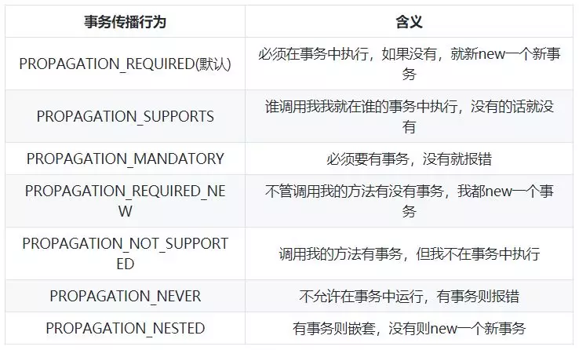

# Spring事务管理（一）快速入门

> 说起事务，大家应该多多少少用过，尤其是在一个service方法中调用多次dao操作，我们一定要用到事务( `@Transational注解`)，那么这个事务的默认隔离级别和传播机制是什么呢?

先来讲讲 `脏读` `不可重复读` 和 `幻读`。

1. 脏读:我们在并发编程中是很熟悉的，通俗的讲就是你读得数据已经被修改了，已经过时失去意义了。
2. 不可重复读： 同一个事务里面多次读取同一行数据，却返回不同的结果。
3. 幻读：同样一笔查询在整个事务过程中多次执行后，查询所得的结果集不一样。

## 1. 事务四大特性 ACID

### 1.1. 原子性 `(Atomicity)`

> 要求事务所包含的全部操作是一个不可分割的整体，如果有一步发生异常，则全部不提交。

### 1.2. 一致性 `（Consistency）`

> A给B转钱，A减和B增这两个操作必须保持一致。

### 1.3. 隔离性 `（Isolation）`

> 事务会将一部分数据与其他事务隔离，防止脏读等。

### 1.4. 持久性 `（Durability）`

> 事务的结果被写到持久化存储器中。

## 2. 事务四大隔离级别

> 隔离级别越高，则性能相对越低，反之亦然。

### 2.1. Read Uncommitted

> 最低的隔离级别，跟你直译的意思一样：可以读取其它事务未完成的结果。(脏读)

很明显， `脏读` `不可重复读` 和 `幻读`这三个问题它都有。

### 2.2. Read Committed

> 大部分数据库采用的**默认隔离级别**，比上一个隔离级别多了限定：在该事务完成后，才能读取该事务的数据更新后的结果。

它可以避免脏读，但是也有不可重复读取和幻读的问题。

### 2.3. Repeatable Read

> 可以保证在整个事务的过程中，对同一笔数据的读取结果是相同的，不管其他事务是否同时在对同一笔数据进行更新，也不管其他事务对同一笔数 据的更新提交与否。

Repeatable Read隔离级别避免了脏读和不可重复读取的问题，但无法避免幻读。

### 2.4. Serializable

> 最为严格的隔离级别，所有的事务操作都必须依次顺序执行，可以避免其他隔离级别遇到的所有问题，是最为安全的隔离级别， 但同时也是性能最差的隔离级别。

通常情况下，我们会使用其他隔离级别加上相应的并发锁的机制来控制对数据的访问，这样既保证 了系统性能不会损失太大，也能够一定程度上保证数据的一致性。

## 3. Spring事务传播机制



### 3.1. 从JDBC的事务说起

> 我们都知道，JDBC给我们提供了事务。

```java
try{
    con.setAutoCommit(false);//开启事务
    ......
    con.commit();//try的最后提交事务
} catch（）{
    con.rollback();//回滚事务
}
```

获取事务隔离级别

```java
Connection.getTransactionIsolation()
```

设置事务隔离级别

```java
con.setTransactionIsolation(Connection.TRANSACTION_REPEATABLE_READ);
```

## 4. Spring事务机制

> Spring并不会直接管理事务，而是提供了事务管理器，将事务管理的职责委托给JPA JDBC JTA DataSourceTransaction JMSTransactionManager 等框架提供的事务来实现。

那么，Spring提供的事务管理器是什么呢?

是 `PlatformTransactionManager.java`接口:

### 4.1. PlatformTransactionManager.java

> Spring提供的事务管理器。不同的事务遵循该事务管理器的API，便能很轻松的交给Spring管理。

```java
public interface PlatformTransactionManager {
    // 通过Transation定义 获取Transation
    TransactionStatus getTransaction(@Nullable TransactionDefinition var1) throws TransactionException;
    // 提交事务
    void commit(TransactionStatus var1) throws TransactionException;
    // 回滚事务
    void rollback(TransactionStatus var1) throws TransactionException;
}
```

可以看到它里面引用到了 `TransactionDefinition`和 `TransactionStatus`.

### 4.2. TransactionDefinition.java

> 它里面包含了事务的定义。

```java
public interface TransactionDefinition {
    // 传播机制
    int PROPAGATION_REQUIRED = 0;
    int PROPAGATION_SUPPORTS = 1;
    int PROPAGATION_MANDATORY = 2;
    int PROPAGATION_REQUIRES_NEW = 3;
    int PROPAGATION_NOT_SUPPORTED = 4;
    int PROPAGATION_NEVER = 5;
    int PROPAGATION_NESTED = 6;
    // 隔离级别
    int ISOLATION_DEFAULT = -1;
    int ISOLATION_READ_UNCOMMITTED = 1;
    int ISOLATION_READ_COMMITTED = 2;
    int ISOLATION_REPEATABLE_READ = 4;
    int ISOLATION_SERIALIZABLE = 8;
    int TIMEOUT_DEFAULT = -1;

    int getPropagationBehavior();
    // 获取隔离级别
    int getIsolationLevel();

    int getTimeout();

    boolean isReadOnly();

    @Nullable
    String getName();
}
```

### 4.3. TransactionStatus.java

> 事务的状态。

```java
public interface TransactionStatus extends SavepointManager, Flushable {
    boolean isNewTransaction();
    boolean hasSavepoint();
    void setRollbackOnly();
    boolean isRollbackOnly();
    void flush();
    boolean isCompleted();
}
```

## 5. Spring默认事务使用

### 5.1. 代码方式使用

```java
@Autowired
private PlatformTransactionManager transactionManager;
public void testTX(){
    DefaultTransactionDefinition definition = new DefaultTransactionDefinition();
    TransactionStatus status = transactionManager.getTransaction(definition);
    try {
        // 业务逻辑
        // ...

        // 提交事务
        transactionManager.commit(status);
    } catch (Exception e) {
        // 发生异常，事务回滚
        transactionManager.rollback(status);
    }
}
```

### 5.2. 注解方式使用

```java
@Transactional
void testTX2() {
    // 业务逻辑 ...
}
```

这不是玄学，它的底层是依靠AOP动态代理实现，其实重新渲染出的代码和第一个使用方式类似，不过大大减少了开发复杂度。

### 5.3. 扩展：@Transactional注解

```java
@Target({ElementType.METHOD, ElementType.TYPE})
@Retention(RetentionPolicy.RUNTIME)
@Inherited
@Documented
public @interface Transactional {

    //指定使用的事务管理器
    @AliasFor("transactionManager")
    String value() default "";

    @AliasFor("value")
    String transactionManager() default "";
    // 可选的事务传播行为设置
    Propagation propagation() default Propagation.REQUIRED;
    // 可选的事务隔离级别设置
    Isolation isolation() default Isolation.DEFAULT;
    // 事务超时时间设置
    int timeout() default -1;
    // 读写或只读事务，默认读写
    boolean readOnly() default false;
    // 导致事务回滚的异常类数组
    Class<? extends Throwable>[] rollbackFor() default {};
    // 导致事务回滚的异常类名字数组
    String[] rollbackForClassName() default {};
    // 不会导致事务回滚的异常类数组
    Class<? extends Throwable>[] noRollbackFor() default {};
    // 不会导致事务回滚的异常类名字数组
    String[] noRollbackForClassName() default {};
}
```

## 6. Spring事务实践

> 非入门选手下面的demo可能会引起你的不适(浪费时间)。 假设我要完成一个功能，当删除用户的时候，将与该用户有关的所有数据行都删除。

```java
public void delUser(Integer userId) {
    // 删除和用户相关的信息
    otherRepository.deleteByUserId(userId);
    // 删除用户
    userRepository.deleteById(userId);
}
```

这样的写法一般来讲，会成功的完成任务。但是如果这样一段代码：

```java
public void delUser(Integer userId) {
    // 删除和用户相关的信息
    otherRepository.deleteByUserId();
    if (true) {
        throw new RuntimeException("xxx");
    }
    // 删除用户
    userRepository.deleteById(userId);
}
```

结果会是： `deleteByUserId()`执行成功， `deleteById()`执行失败，不满足数据的一致性。

所以我们需要事务来限制：要么全部执行，要么全部不执行(方法中有异常就自动回滚)。那怎么实现呢，只需要在方法上加一个注解： `@Transactional`

```java
@Transactional
public void delUser(Integer userId) {
    // 删除和用户相关的信息
    otherRepository.deleteByUserId();
    if (true) {
        throw new RuntimeException("xxx");
    }
    // 删除用户
    userRepository.deleteById(userId);
}
```

## 7. Spring 加载第三方事务管理

> 比如我有个需求(接着上次的强票系统II)，要求信息不能丢失，要用到RabbitMQ的事务管理，那怎么去加载到Spring的事务管理器中呢？

```java
@Bean
public ConnectionFactory connectionFactory() {
    CachingConnectionFactory connectionFactory = new CachingConnectionFactory();
    return connectionFactory;
}
@Bean
public RabbitTransactionManager rabbitTransactionManager(ConnectionFactory connectionFactory) {
    return new RabbitTransactionManager(connectionFactory);
}
```

我们只需要这样做便可以使的使用 `@Transactional注解`来实现对RabbitMQ的事务管理,其它框架也类似。