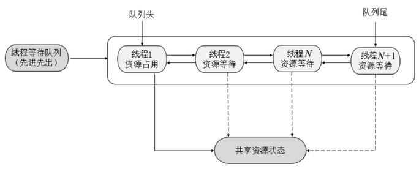

## 1. AQS 概述

早期程序员会通过一种同步器去实现另一种相近的同步器，例如用可重入锁去实现信号量，或反之。这显然不够优雅，于是在 JSR166（java 规范提案）中创建了 AQS，提供了这种通用的同步器机制。

队列同步器 AbstractQueuedSynchronizer（简称同步器或 AQS），是一个抽象的队列同步器，是用来构建**阻塞式锁或者相关同步组件的基础框架**。许多并发工具的实现都依赖于它，如常用的 `ReentrantLock`/`Semaphore`/`CountDownLatch`。

```java
public abstract class AbstractQueuedSynchronizer
    extends AbstractOwnableSynchronizer
    implements java.io.Serializable
```

AQS 它使用了一个 int 类型的共享成员变量 `state` 表示同步状态，通过内置的 FIFO (先进先出)的线程等待队列来完成资源获取线程的排队工作，类似于 Monitor 的 EntryList；而条件变量用于实现等待、唤醒机制，支持多个条件变量，类似于 Monitor 的 WaitSet。

> *并发包的大师（Doug Lea）期望它能够成为实现大部分同步需求的基础*

### 1.1. 目标

实现的功能目标：

- 阻塞版本获取锁 acquire 和非阻塞的版本尝试获取锁 tryAcquire
- 获取锁超时机制
- 通过打断取消机制
- 独占机制及共享机制
- 条件不满足时的等待机制

要实现的性能目标：

> Instead, the primary performance goal here is scalability: to predictably maintain efficiency even, or especially, when synchronizers are contended.

### 1.2. 设计

AQS 的基本设计思想很简单

1. 获取锁的逻辑

```java
while(state 状态不允许获取) {
    if(队列中还没有此线程) {
        入队并阻塞
    }
}
当前线程出队
```

2. 释放锁的逻辑

```java
if(state 状态允许了) {
    恢复阻塞的线程(s)
}
```

其中要点包含：

- 原子维护 state 状态
- 阻塞及恢复线程
- 维护队列

#### 1.2.1. state 设计

- state 使用 `volatile` 配合 cas 保证其修改时的原子性
- state 使用了 32bit int 来维护同步状态，因为当时使用 long 在很多平台下测试的结果并不理想

#### 1.2.2. 阻塞恢复设计

早期的控制线程暂停和恢复的 api 有 suspend 和 resume，但它们是不可用的，因为如果先调用的 resume 那么 suspend 将感知不到。

解决方法是使用 park & unpark 来实现线程的暂停和恢复，因为先 unpark 再 park 也没问题。park & unpark 是针对线程的，而不是针对同步器的，因此控制粒度更为精细。park 线程还可以通过 interrupt 打断

#### 1.2.3. 队列设计

使用了 FIFO 先入先出队列，并不支持优先级队列。设计时借鉴了 CLH 队列，它是一种单向无锁队列。


队列中有 head 和 tail 两个指针节点，都用 volatile 修饰配合 cas 使用，每个节点有 state 维护节点状态。

只需要考虑 tail 赋值的原子性，以下是入队伪代码：

```java
do {
    // 原来的 tail
    Node prev = tail;
    // 用 cas 在原来 tail 的基础上改为 node
} while(tail.compareAndSet(prev, node))
```

出队伪代码：

```java
// prev 是上一个节点
while((Node prev=node.prev).state != 唤醒状态) {
}
// 设置头节点
head = node;
```

使用 CLH 的好处：

- 无锁，使用自旋
- 快速，无阻塞

AQS 在一些方面改进了 CLH

```java
private Node enq(final Node node) {
    for (; ; ) {
        Node t = tail;
        // 队列中还没有元素 tail 为 null
        if (t == null) {
            // 将 head 从 null -> dummy
            if (compareAndSetHead(new Node()))
                tail = head;
        } else {
            // 将 node 的 prev 设置为原来的 tail
            node.prev = t;
            // 将 tail 从原来的 tail 设置为 node
            if (compareAndSetTail(t, node)) {
                // 原来 tail 的 next 设置为 node
                t.next = node;
                return t;
            }
        }
    }
}
```

## 2. AQS 实现原理

AQS 核心思想是，如果被请求的共享资源空闲，则将当前请求资源的线程设置为有效的工作线程，并且将共享资源设置为锁定状态；如果被请求的共享资源被占用，那么就需要一套线程阻塞等待以及被唤醒时锁分配的机制，这个机制 AQS 是用 CLH 队列锁实现的，即将暂时获取不到锁的线程加入到等待队列中。许多同步类的实现都依赖于 AQS，例如常用的 ReentrantLock、Semaphore 和 CountDownLatch。

> CLH(Craig,Landin,and Hagersten)队列是一个虚拟的双向队列（虚拟的双向队列即不存在队列实例，仅存在结点之间的关联关系）。AQS是将每条请求共享资源的线程封装成一个CLH锁队列的一个结点（Node）来实现锁的分配。



同步器依赖内部的同步队列（一个 FIFO 双向队列）来完成同步状态的管理，当前线程获取同步状态失败时，同步器会将当前线程以及等待状态（独占或共享）构造成为一个节点（Node）并将其加入同步队列并进行自旋，当同步状态释放时，会把首节点中的后继节点对应的线程唤醒，使其再次尝试获取同步状态。


### 2.1. state：状态

AQS 维护了一个 `volatile int` 类型的成员变量 `state`，用于表示当前资源的同步状态（分独占模式和共享模式）。通过内置的 FIFO 队列来完成获取资源线程的排队工作，AQS 使用 CAS 对该同步状态进行原子操作实现对其值的修改

```java
private volatile int state; // 共享变量，使用 volatile 修饰保证线程可见性
```

子类需要定义如何维护这个状态，控制如何获取锁和释放锁。state 属性访问方式有三种：

- `getState()`：获取 state 状态
- `setState()`：设置 state 状态
- `compareAndSetState()`：通过 cas 机制设置 state 状态

以上方法均是原子操作，其中 `compareAndSetState` 的实现依赖于 `Unsafe` 类的 `compareAndSwapInt()` 方法。具体的 JDK 代码实现如下：

```java
/** 返回同步状态的当前值，此操作的内存语义为 volatile 修饰的原子读操作 */
protected final int getState() {
    return state;
}

/** 设置同步状态的值，此操作的内存语义为 volatile 修饰的原子写操作 */
protected final void setState(int newState) {
    state = newState;
}

/**
 * 如果当前同步状态的值等于 expect（期望值），则自动将同步状态值设置为给定值 update。原子操作（CAS）
 * 此操作的内存语义为 volatile 修饰的原子读写操作
 */
protected final boolean compareAndSetState(int expect, int update) {
    // See below for intrinsics setup to support this
    return unsafe.compareAndSwapInt(this, stateOffset, expect, update);
}
```

### 2.2. AQS 核心方法

AQS 是一个框架，只定义了一个接口，具体资源的获取、释放都交由自定义同步器去实现。不同的自定义同步器争用共享资源的方式也不同，自定义同步器在实现时只需实现共享资源 state 的获取与释放方式即可，至于具体线程等待队列的维护，如获取资源失败入队、唤醒出队等，AQS 已经在顶层实现好，不需要具体的同步器再做处理。

自定义同步器的主要方法如下：

```java
protected boolean isHeldExclusively()
```

- 查询该线程是否正在独占资源，只有用到 condition 需要去实现它

```java
protected boolean tryAcquire(int arg)
```

- 尝试获取独占式资源：成功则返回 true，失败则返回 false

```java
protected boolean tryRelease(int arg)
```

- 尝试释放独占式资源：成功则返回 true，失败则返回 false

```java
protected int tryAcquireShared(int arg)
```

- 尝试获取共享式资源：负数表示失败；0 表示成功，但没有剩余可用资源；正数表示成功，且有剩余资源

```java
protected boolean tryReleaseShared(int arg)
```

- 尝试释放共享式资源：如果释放资源后允许唤醒后续等待线程，则返回 true，否则返回 false

> Tips: 同步器的实现是 AQS 的核心。以上方法均默认抛出 `UnsupportedOperationException`

#### 2.2.1. 基础使用实践

获取锁：

```java
// 如果获取锁失败
if (!tryAcquire(arg)) {
    // 入队, 可以选择阻塞当前线程 park unpark
}
```

释放锁

```java
// 如果释放锁成功
if (tryRelease(arg)) {
    // 让阻塞线程恢复运行
}
```

### 2.3. AQS 对共享资源支持的两种模式

AQS 定义了两种资源共享方式：独占模式（Exclusive mode）和共享模式（Shared mode）

- 独占模式：又称排他模式，相当于互斥锁，只有一个线程能执行与访问资源。当一个线程以独占模式成功获取锁，其它线程获取锁的尝试都将失败，类似 `synchronized` 关键字。具体的 Java 实现有 `ReentrantLock`
- 共享模式：多个线程可同时执行与访问资源，用于控制一定量的线程并发执行。设计者建议共享模式下的同步状态支持0，小于0和大于0三种情况，以便在某种情况下和独占模式兼容。在此模式下，`同步状态>=0`都代表获取锁成功。具体的 Java 实现有 `Semaphore` 和 `CountDownLatch`

ReentrantLock 对 **AQS 的独占方式实现**为：ReentrantLock 中的 state 初始值为 0 时表示无锁状态。在线程执行 tryAcquire() 获取该锁后 ReentrantLock 中的 state+1，这时该线程独占 ReentrantLock 锁，其他线程在通过 tryAcquire() 获取锁时均会失败，直到该线程释放锁后 state 再次为 0，其他线程才有机会获取该锁。该线程在释放锁之前可以重复获取此锁，每获取一次便会执行一次 state+1，因此 ReentrantLock 也属于可重入锁。但获取多少次锁就要释放多少次锁，这样才能保证 state 最终为 0。如果获取锁的次数多于释放锁的次数，则会出现该线程一直持有该锁的情况；如果获取锁的次数少于释放锁的次数，则运行中的程序会报锁异常。

CountDownLatch 对 **AQS 的共享方式实现**为：CountDownLatch 将任务分为 N 个子线程去执行，将 state 也初始化为 N，N 与线程的个数一致，N 个子线程是并行执行的，每个子线程都在执行完成后 countDown() 一次，state 会执行 CAS 操作并减 1。在所有子线程都执行完成（即 `state=0`）时会 `unpark()` 主线程，然后主线程会从 `await()` 返回，继续执行后续的动作。

一般来说，自定义同步器要么采用独占方式，要么采用共享方式，实现类只需实现 tryAcquire、tryRelease 或 tryAcquireShared、tryReleaseShared 中的一组即可。但 AQS 也支持自定义同步器同时实现独占和共享两种方式，例如 `ReentrantReadWriteLock` 在读取时采用了共享方式，在写入时采用了独占方式。

## 3. 实现不可重入锁

### 3.1. 自定义同步器

自定义同步器，继承 `AbstractQueuedSynchronizer`

```java
// 自定义同步器，实现 AbstractQueuedSynchronizer
class CustomQueuedSynchronizer extends AbstractQueuedSynchronizer {

    @Override
    protected boolean tryAcquire(int arg) {
        if (compareAndSetState(0, 1)) {
            // 加上了锁，并设置 owner 为当前线程
            setExclusiveOwnerThread(Thread.currentThread());
            return true;
        }
        return false;
    }

    @Override
    protected boolean tryRelease(int arg) {
        setExclusiveOwnerThread(null);
        setState(0);
        return true;
    }

    // 是否持有独占锁
    @Override
    protected boolean isHeldExclusively() {
        return getState() == 1;
    }

    public Condition newCondition() {
        return new ConditionObject();
    }
}
```

### 3.2. 自定义锁

有了自定义同步器，复用 AQS 相关已实现的功能，实现一个功能完备的自定义锁

```java
// 自定义锁（不可重入锁）
class CustomLock implements Lock {

    private CustomQueuedSynchronizer sync = new CustomQueuedSynchronizer();

    // 加锁（不成功会进入等待队列）
    @Override
    public void lock() {
        sync.acquire(1);
    }

    // 加锁，不成功，进入等待队列，可打断
    @Override
    public void lockInterruptibly() throws InterruptedException {
        sync.acquireInterruptibly(1);
    }

    // 尝试加锁（一次），不成功返回，不进入队列
    @Override
    public boolean tryLock() {
        return sync.tryAcquire(1);
    }

    // 尝试加锁，不成功，进入等待队列，带超时
    @Override
    public boolean tryLock(long time, TimeUnit unit) throws InterruptedException {
        return sync.tryAcquireNanos(1, unit.toNanos(time));
    }

    // 解锁
    @Override
    public void unlock() {
        sync.release(1);
    }

    // 创建条件变量
    @Override
    public Condition newCondition() {
        return sync.newCondition();
    }
}
```

### 3.3. 测试

编写测试程序：

```java
@Slf4j
public class AbstractQueuedSynchronizerDemo {

    public static void main(String[] args) {
        CustomLock lock = new CustomLock();
        new Thread(() -> {
            lock.lock();
            try {
                log.debug("locking...");
                Thread.sleep(1000);
            } catch (InterruptedException e) {
                e.printStackTrace();
            } finally {
                log.debug("unlocking...");
                lock.unlock();
            }
        }, "t1").start();

        new Thread(() -> {
            lock.lock();
            try {
                log.debug("locking...");
            } finally {
                log.debug("unlocking...");
                lock.unlock();
            }
        }, "t2").start();
    }
}
```

输出结果：

```java
2023-03-04 08:29:15.142 [t1] DEBUG c.m.c.j.AbstractQueuedSynchronizerDemo - locking...
2023-03-04 08:29:16.151 [t1] DEBUG c.m.c.j.AbstractQueuedSynchronizerDemo - unlocking...
2023-03-04 08:29:16.151 [t2] DEBUG c.m.c.j.AbstractQueuedSynchronizerDemo - locking...
2023-03-04 08:29:16.151 [t2] DEBUG c.m.c.j.AbstractQueuedSynchronizerDemo - unlocking...
```

不可重入测试，将代码修改为两次加锁，会发现自己也会被挡住（只会打印一次 locking）


