## 1. 锁原理 - 信号量 vs 管程

在并发编程领域，有两大核心问题：**互斥**与**同步**。

- 互斥，即同一时刻只允许一个线程访问共享资源。
- 同步，即线程之间如何通信、协作。

以上这两大问题可以通过<font color=red>**信号量**</font>和<font color=red>**管程**</font>来解决。

### 1.1. 信号量

信号量（Semaphore）是操作系统提供的一种进程间常见的通信方式，主要用来协调并发程序对共享资源的访问，操作系统可以保证对信号量操作的原子性。

- 信号量由一个共享整型变量 S 和两个原子操作 P、V 组成，S 只能通过 P 和 V 操作来改变
- P 操作：即请求资源，意味着 S 要减 1，如果 S <  0, 则表示没有资源了，此时线程要进入等待队列（同步队列）等待
- V 操作：即释放资源，意味着 S 要加 1， 如果 S 小于等于 0，说明等待队列里有线程，此时就需要唤醒线程。

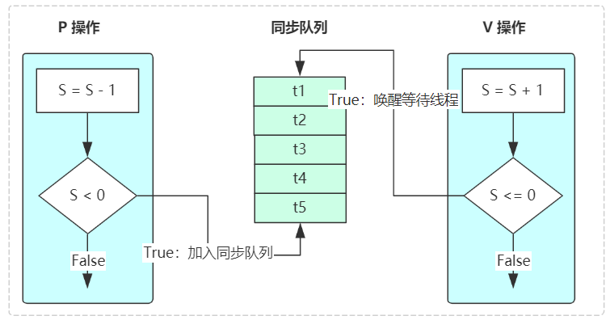

信号量机制的引入解决了进程同步和互斥问题，但信号量的大量同步操作分散在各个进程中不便于管理，还有可能导致系统死锁。如：生产者消费者问题中将P、V颠倒可能死锁，另外条件越多，需要的信号量就越多，需要更加谨慎地处理信号量之间的处理顺序，否则很容易造成死锁现象。

> Tips: 基于信号量给编程带来的隐患，于是有了提出了对开发者更加友好的并发编程模型-**管程**

### 1.2. 管程

把所有进程对某一种临界资源的同步操作都集中起来，构成一个所谓的**秘书进程**。凡要访问该临界资源的进程，都需先报告秘书，由秘书来实现诸进程对同一临界资源的**互斥**使用，这种机制就是管程。

管程是一种在信号量机制上进行改进的并发编程模型，解决了信号量在临界区的 PV 操作上配对的麻烦，把配对的 PV 操作集中在一起，并且加入了条件变量的概念，使得在多条件下线程间的同步实现变得更加简单。从而形成的并发编程方法理论，极大降低了使用和理解成本。管程由四部分组成：

1. 管程内部的共享变量。
2. 管程内部的条件变量。
3. 管程内部并行执行的进程。
4. 对于局部与管程内部的共享数据设置初始值的语句。

管程其实就是一个**对象监视器**。任何线程想要访问该资源（共享变量），就要排队进入监控范围。进入之后，接受检查，不符合条件，则要继续等待，直到被通知，然后继续进入监视器。

理解管程中的入口等待队列，共享变量，条件变量等概念，可以借助生活中的场景来帮助我们理解，就以我们的就医场景为例来简单说明一下，正常的就医流程如下：

1. 病人去挂号后，去侯诊室等待叫号
2. 叫到自己时，就可以进入就诊室就诊了
3. 就诊时，有两种情况，一种是医生很快就确定病人的病，并作出诊断，诊断完成后，就通知下一位病人进来就诊，一种是医生无法确定病因，需要病人去做个验血 / CT 检查才能确定病情，于是病人就先去验个血 /  CT
4. 病人验完血 / 做完 CT 后，重新取号，等待叫号（进入入口等待队列）
5. 病人等到自己的号，病人又重新拿着验血 / CT 报告去找医生就诊

整个流程如下：


管程是如何解决互斥和同步的呢？

首先来看互斥，上文中医生即共享资源（也即共享变量），就诊室即为临界区，病人即线程，任何病人如果想要访问临界区，必须首先获取共享资源（即医生），入口一次只允许一个线程经过，在共享资源被占有的情况下，如果再有线程想占有共享资源，就需要到等待队列去等候，等到获取共享资源的线程释放资源后，等待队列中的线程就可以去竞争共享资源了，这样就解决了互斥问题，所以本质上管程是通过将共享资源及其对共享资源的操作（线程安全地获取和释放）封装起来来保证互斥性的。

再来看同步，同步是通过文中的条件变量及其等待队列实现的，同步的实现分两种情况：

1. 病人进入就诊室后，无需做验血 / CT 等操作，于是医生诊断完成后，就会释放共享资源（解锁）去通知（notify，notifyAll）入口等待队列的下一个病人，下一个病人听到叫号后就能看医生了。
2. 如果病人进入就诊室后需要做验血 / CT 等操作，会去验血 / CT 队列（条件队列）排队， 同时释放共享变量（医生），通知入口等待队列的其他病人（线程）去获取共享变量（医生），获得许可的线程执行完临界区的逻辑后会唤醒条件变量等待队列中的线程，将它放到入口等待队列中 ，等到其获取共享变量（医生）时，即可进入入口（临界区）处理。

### 1.3. 信号量与管程的区别

信号量和管程两者是等价的，信号量可以实现管程，管程也可以实现信号量，只是两者的表现形式不同而已，管程对开发者更加友好。两者的区别如下：

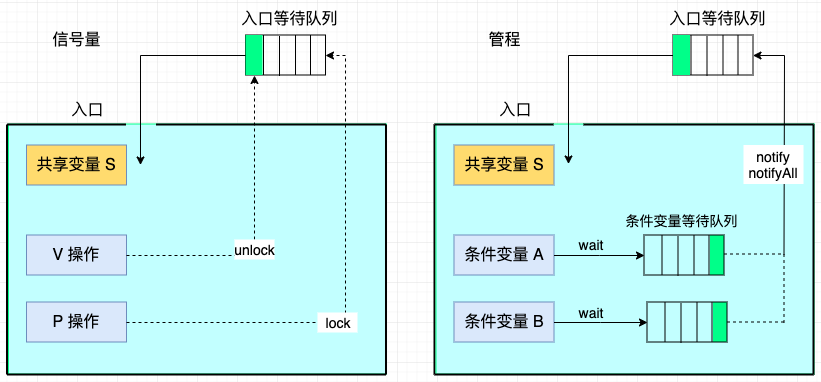

在 Java 里，锁大多是依赖于管程来实现的，以 `synchronized` 为例，它的实现原理如下：

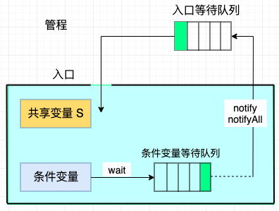

可以看到 `synchronized` 锁也是基于管程实现的，只不过它只有且只有一个条件变量（就是锁对象本身）而已，这也是为什么 JDK 要实现 `Lock` 锁的原因之一，就是 `Lock` 支持多个条件变量。

## 2. AQS 概述

早期程序员会通过一种同步器去实现另一种相近的同步器，例如用可重入锁去实现信号量，或反之。这显然不够优雅，于是在 JSR166（java 规范提案）中创建了 AQS，提供了这种通用的同步器机制。

队列同步器 AbstractQueuedSynchronizer（简称同步器或 AQS），是一个抽象的队列同步器，是用来构建**阻塞式锁或者相关同步器(组件)的基础框架**。许多并发工具的实现都依赖于它，如常用的 `ReentrantLock`/`Semaphore`/`CountDownLatch`。

```java
public abstract class AbstractQueuedSynchronizer
    extends AbstractOwnableSynchronizer
    implements java.io.Serializable
```

AQS 它使用了一个 int 类型的共享成员变量 `state` 表示同步状态，通过内置的 FIFO (先进先出)的线程等待队列来完成资源获取线程的排队工作，类似于 Monitor 的 EntryList；而条件变量用于实现等待、唤醒机制，支持多个条件变量，类似于 Monitor 的 WaitSet。

> *并发包的大师（Doug Lea）期望它能够成为实现大部分同步需求的基础*

AQS 实现的功能目标：

- 阻塞版本获取锁 acquire 和非阻塞的版本尝试获取锁 tryAcquire
- 获取锁超时机制
- 通过打断取消机制
- 独占机制及共享机制
- 条件不满足时的等待机制

要实现的性能目标：

> Instead, the primary performance goal here is scalability: to predictably maintain efficiency even, or especially, when synchronizers are contended.

## 3. AQS 的设计

### 3.1. 对象锁工作流程回顾

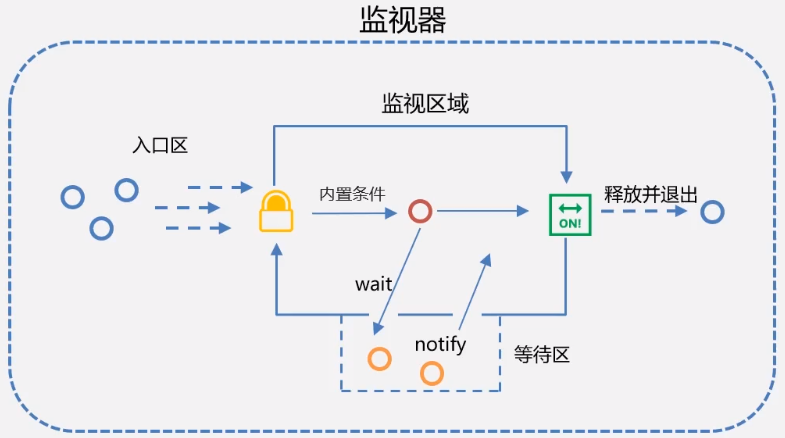

1. **进入并持有监视器**：线程到达监视区域，并进入监视器处于入口区。它会尝试获取锁，由于现在没有其它线程持有监视器，所以该线程会立即持有监视器，并执行监视区域中的代码。线程进入监视区域，执行的就是 JVM 的 `monitorenter` 指令。
2. **其它线程阻塞**：新的线程到达监视区域后，也会尝试获取监视器，但它此时必须在入口区等待，因为第一个线程还在执行监视区域的代码。后续的线程也会在入口区等待（准确地说是阻塞状态），直到该监视器当前的持有者（第一个线程）完全释放。
3. **关于等待区和退出**：监视器的持有者，即活动线程会通过两种途径释放监视器：完成监视区域的代码或者执行一个等待命令。如果它执行完监视区域，会从最右边的出口处释放并退出监视器，进入监视器的 JVM 指令是 `monitorenter`，退出的指令是 `monitorexit` （第二次退出的含义：在程序发生异常时也要确保退出监视器）。如果活动线程执行了等待（wait）命令，它就会释放监视器并进入等待区（wait set），注意，此时它并没有退出监视区域。
4. **条件对象**：`synchronized` 关键字有个内置的条件对象，它是有 JVM 原生支持的，不需要/也不能对它进行操作，只需知道它的存在即可。
5. **同步状态与可重入性**：对象锁是可重入的，持有该监视器的线程每进入一次由该监视器锁保护的同步块/方法，锁的状态（计数器）就会 +1，同样的，每退出一次，锁的状态就会 -1，直到锁状态变成默认状态 0，锁被完全释放，该线程就退出了监视器。

### 3.2. 基本设计思想

基于 `synchronized` 关键字对象锁的实现流程，同步器 AQS 的基本设计思想很简单，工作流程与内部对象锁大致相同，它的核心操作也是获取锁、释放锁：

1. 获取锁的逻辑

```java
while(state 状态不允许获取) {
    if(队列中还没有此线程) {
        入队并阻塞
    }
}
当前线程出队
```

2. 释放锁的逻辑

```java
if(state 状态允许了) {
    恢复阻塞的线程(s)
}
```

AQS 与 `synchronized` 有一点不同，就是需要手动处理操作线程的同步状态。为了实现与 `synchronized` 关键字同样的功能，需要考虑以下三个基本组件的相互协作：

- **同步状态的原子性管理**：维护 state 状态
- **锁的获取与释放**：即线程阻塞及恢复
- **维护队列**：入口区和等待区线程的管理

### 3.3. state 设计

- state 使用 `volatile` 配合 cas 保证其修改时的原子性
- state 使用了 32bit int 来维护同步状态，因为当时使用 long 在很多平台下测试的结果并不理想

### 3.4. 阻塞恢复设计

早期的控制线程暂停和恢复的 api 有 suspend 和 resume，但它们是不可用的，因为如果先调用的 resume 那么 suspend 将感知不到。

解决方法是使用 park & unpark 来实现线程的暂停和恢复，因为先 unpark 再 park 也没问题。park & unpark 是针对线程的，而不是针对同步器的，因此控制粒度更为精细。park 线程还可以通过 interrupt 打断

### 3.5. 队列设计

使用了 FIFO 先入先出队列，并不支持优先级队列。设计时借鉴了 CLH 队列，它是一种单向无锁队列。

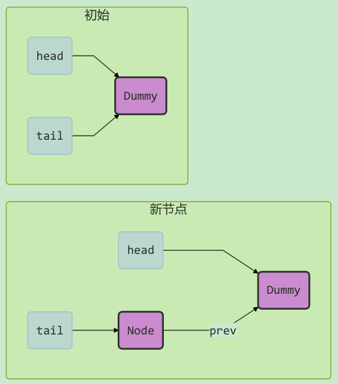

队列中有 head 和 tail 两个指针节点，都用 volatile 修饰配合 cas 使用，每个节点有 state 维护节点状态。

只需要考虑 tail 赋值的原子性，以下是入队伪代码：

```java
do {
    // 原来的 tail
    Node prev = tail;
    // 用 cas 在原来 tail 的基础上改为 node
} while(tail.compareAndSet(prev, node))
```

出队伪代码：

```java
// prev 是上一个节点
while((Node prev=node.prev).state != 唤醒状态) {
}
// 设置头节点
head = node;
```

使用 CLH 的好处：

- 无锁，使用自旋
- 快速，无阻塞

AQS 在一些方面改进了 CLH

```java
private Node enq(final Node node) {
    for (; ; ) {
        Node t = tail;
        // 队列中还没有元素 tail 为 null
        if (t == null) {
            // 将 head 从 null -> dummy
            if (compareAndSetHead(new Node()))
                tail = head;
        } else {
            // 将 node 的 prev 设置为原来的 tail
            node.prev = t;
            // 将 tail 从原来的 tail 设置为 node
            if (compareAndSetTail(t, node)) {
                // 原来 tail 的 next 设置为 node
                t.next = node;
                return t;
            }
        }
    }
}
```

## 4. 实现不可重入锁

### 4.1. 自定义同步器

自定义同步器，继承 `AbstractQueuedSynchronizer`

```java
// 自定义同步器，实现 AbstractQueuedSynchronizer
class CustomQueuedSynchronizer extends AbstractQueuedSynchronizer {

    @Override
    protected boolean tryAcquire(int arg) {
        if (compareAndSetState(0, 1)) {
            // 加上了锁，并设置 owner 为当前线程
            setExclusiveOwnerThread(Thread.currentThread());
            return true;
        }
        return false;
    }

    @Override
    protected boolean tryRelease(int arg) {
        setExclusiveOwnerThread(null);
        setState(0);
        return true;
    }

    // 是否持有独占锁
    @Override
    protected boolean isHeldExclusively() {
        return getState() == 1;
    }

    public Condition newCondition() {
        return new ConditionObject();
    }
}
```

### 4.2. 自定义锁

有了自定义同步器，复用 AQS 相关已实现的功能，实现一个功能完备的自定义锁

```java
// 自定义锁（不可重入锁）
class CustomLock implements Lock {

    private CustomQueuedSynchronizer sync = new CustomQueuedSynchronizer();

    // 加锁（不成功会进入等待队列）
    @Override
    public void lock() {
        sync.acquire(1);
    }

    // 加锁，不成功，进入等待队列，可打断
    @Override
    public void lockInterruptibly() throws InterruptedException {
        sync.acquireInterruptibly(1);
    }

    // 尝试加锁（一次），不成功返回，不进入队列
    @Override
    public boolean tryLock() {
        return sync.tryAcquire(1);
    }

    // 尝试加锁，不成功，进入等待队列，带超时
    @Override
    public boolean tryLock(long time, TimeUnit unit) throws InterruptedException {
        return sync.tryAcquireNanos(1, unit.toNanos(time));
    }

    // 解锁
    @Override
    public void unlock() {
        sync.release(1);
    }

    // 创建条件变量
    @Override
    public Condition newCondition() {
        return sync.newCondition();
    }
}
```

### 4.3. 测试

编写测试程序：

```java
@Slf4j
public class AbstractQueuedSynchronizerDemo {

    public static void main(String[] args) {
        CustomLock lock = new CustomLock();
        new Thread(() -> {
            lock.lock();
            try {
                log.debug("locking...");
                Thread.sleep(1000);
            } catch (InterruptedException e) {
                e.printStackTrace();
            } finally {
                log.debug("unlocking...");
                lock.unlock();
            }
        }, "t1").start();

        new Thread(() -> {
            lock.lock();
            try {
                log.debug("locking...");
            } finally {
                log.debug("unlocking...");
                lock.unlock();
            }
        }, "t2").start();
    }
}
```

输出结果：

```java
2023-03-04 08:29:15.142 [t1] DEBUG c.m.c.j.AbstractQueuedSynchronizerDemo - locking...
2023-03-04 08:29:16.151 [t1] DEBUG c.m.c.j.AbstractQueuedSynchronizerDemo - unlocking...
2023-03-04 08:29:16.151 [t2] DEBUG c.m.c.j.AbstractQueuedSynchronizerDemo - locking...
2023-03-04 08:29:16.151 [t2] DEBUG c.m.c.j.AbstractQueuedSynchronizerDemo - unlocking...
```

不可重入测试，将代码修改为两次加锁，会发现自己也会被挡住（只会打印一次 locking）

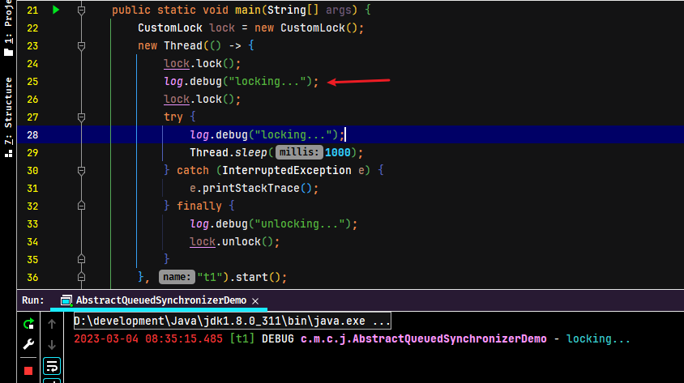

## 5. AQS 实现原理

### 5.1. AQS 的工作流程概述

AQS 核心思想是，如果被请求的共享资源空闲，则将当前请求资源的线程设置为有效的工作线程，并且将共享资源设置为锁定状态；如果被请求的共享资源被占用，那么就需要一套线程阻塞等待以及被唤醒时锁分配的机制，这个机制 AQS 是用 CLH 队列锁实现的，即将暂时获取不到锁的线程加入到等待队列中。许多同步类的实现都依赖于 AQS，例如常用的 ReentrantLock、Semaphore 和 CountDownLatch。

> CLH(Craig,Landin,and Hagersten)队列是一个虚拟的双向队列（虚拟的双向队列即不存在队列实例，仅存在结点之间的关联关系）。AQS是将每条请求共享资源的线程封装成一个CLH锁队列的一个结点（Node）来实现锁的分配。

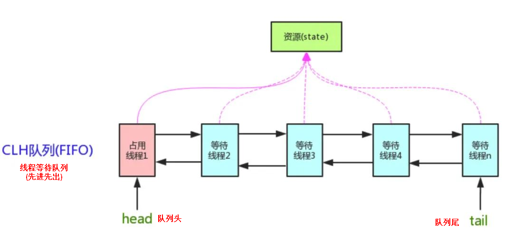

同步器依赖内部的同步队列（一个 FIFO 双向队列）来完成同步状态（state）的管理，当前线程获取同步状态失败时，同步器会将当前线程以及等待状态（独占或共享）构造成为一个节点（Node）并将其加入同步队列并进行自旋，当同步状态释放时，会把首节点中的后继节点对应的线程唤醒，使其再次尝试获取同步状态。

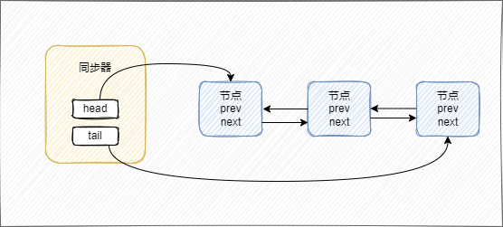

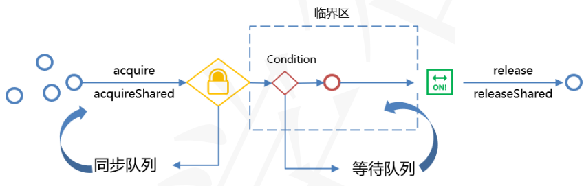

### 5.2. state：同步状态

在 `AbstractQueuedSynchronizer` 类中维护了一个 `volatile int` 类型的成员变量 `state`，用于表示当前资源的同步状态（分独占模式和共享模式，加锁与释放锁的操作，本质就是操作 state 的结果）。通过内置的 FIFO 队列来完成获取资源线程的排队工作。

```java
private volatile int state; // 共享变量，使用 volatile 修饰保证线程可见性
```

子类需要定义如何维护 `state` 这个状态属性，控制如何获取锁和释放锁。对 `state` 的操作必须是原子的，而且该属性不能被继承，所有同步机制的实现均依赖于对该变量的原子操作。AQS 使用 `volatile` 和 CAS 操作确保了同步状态（`state`）的原子性管理。

state 属性访问方式有三种：

- `getState()`：获取 state 状态
- `setState()`：设置 state 状态
- `compareAndSetState()`：通过 cas 机制设置 state 状态

以上方法均是原子操作，其中 `compareAndSetState` 的实现依赖于 `Unsafe` 类的 `compareAndSwapInt()` 方法。具体的 JDK 代码实现如下：

```java
/** 返回同步状态的当前值，此操作的内存语义为 volatile 修饰的原子读操作 */
protected final int getState() {
    return state;
}

/** 设置同步状态的值，此操作的内存语义为 volatile 修饰的原子写操作 */
protected final void setState(int newState) {
    state = newState;
}

/**
 * 如果当前同步状态的值等于 expect（期望值），则自动将同步状态值设置为给定值 update。原子操作（CAS）
 * 此操作的内存语义为 volatile 修饰的原子读写操作
 */
protected final boolean compareAndSetState(int expect, int update) {
    // See below for intrinsics setup to support this
    return unsafe.compareAndSwapInt(this, stateOffset, expect, update);
}
```

### 5.3. AQS 核心方法

AQS 是一个框架，只定义了一个接口，具体资源的获取、释放都交由自定义同步器去实现。不同的自定义同步器争用共享资源的方式也不同，自定义同步器在实现时只需实现共享资源 state 的获取与释放方式即可，至于具体线程等待队列的维护，如获取资源失败入队、唤醒出队等，AQS 已经在顶层实现好，不需要具体的同步器再做处理。

自定义同步器的主要方法如下：

```java
protected boolean isHeldExclusively()
```

- 查询该线程是否正在独占资源，只有用到 condition 需要去实现它

```java
protected boolean tryAcquire(int arg)
```

- 尝试获取独占式资源：成功则返回 true，失败则返回 false

```java
protected boolean tryRelease(int arg)
```

- 尝试释放独占式资源：成功则返回 true，失败则返回 false

```java
protected int tryAcquireShared(int arg)
```

- 尝试获取共享式资源：负数表示失败；0 表示成功，但没有剩余可用资源；正数表示成功，且有剩余资源

```java
protected boolean tryReleaseShared(int arg)
```

- 尝试释放共享式资源：如果释放资源后允许唤醒后续等待线程，则返回 true，否则返回 false

> Tips: 同步器的实现是 AQS 的核心。以上方法均默认抛出 `UnsupportedOperationException`

#### 5.3.1. 基础使用实践

获取锁：

```java
// 如果获取锁失败
if (!tryAcquire(arg)) {
    // 入队, 可以选择阻塞当前线程 park unpark
}
```

释放锁

```java
// 如果释放锁成功
if (tryRelease(arg)) {
    // 让阻塞线程恢复运行
}
```

### 5.4. AQS 对共享资源支持的两种模式

AQS 定义了两种资源共享方式：独占模式（Exclusive mode）和共享模式（Shared mode）

- 独占模式：又称排他模式，相当于互斥锁，只有一个线程能执行与访问资源。当一个线程以独占模式成功获取锁，其它线程获取锁的尝试都将失败，类似 `synchronized` 关键字。具体的 Java 实现有 `ReentrantLock`
- 共享模式：多个线程可同时执行与访问资源，用于控制一定量的线程并发执行。设计者建议共享模式下的同步状态支持0，小于0和大于0三种情况，以便在某种情况下和独占模式兼容。在此模式下，`同步状态>=0`都代表获取锁成功。具体的 Java 实现有 `Semaphore` 和 `CountDownLatch`

#### 5.4.1. 独占模式的实现

**AQS 的独占模式实现（以 ReentrantLock 为例）**：ReentrantLock 中的 state 初始值为 0 时表示无锁状态。在线程执行 tryAcquire() 获取该锁后 ReentrantLock 中的 state+1，这时该线程独占 ReentrantLock 锁，其他线程在通过 tryAcquire() 获取锁时均会失败，直到该线程释放锁后 state 再次为 0，其他线程才有机会获取该锁。该线程在释放锁之前可以重复获取此锁，每获取一次便会执行一次 state+1，因此 ReentrantLock 也属于可重入锁。但获取多少次锁就要释放多少次锁，这样才能保证 state 最终为 0。如果获取锁的次数多于释放锁的次数，则会出现该线程一直持有该锁的情况；如果获取锁的次数少于释放锁的次数，则运行中的程序会报锁异常。

#### 5.4.2. 共享模式的实现

**AQS 的共享模式实现（以 CountDownLatch 为例）**：CountDownLatch 将任务分为 N 个子线程去执行，将 state 也初始化为 N，N 与线程的个数一致，N 个子线程是并行执行的，每个子线程都在执行完成后 countDown() 一次，state 会执行 CAS 操作并减 1。在所有子线程都执行完成（即 `state=0`）时会 `unpark()` 主线程，然后主线程会从 `await()` 返回，继续执行后续的动作。

一般来说，自定义同步器要么采用独占方式，要么采用共享方式，实现类只需实现 tryAcquire、tryRelease 或 tryAcquireShared、tryReleaseShared 中的一组即可。但 AQS 也支持自定义同步器同时实现独占和共享两种方式，例如 `ReentrantReadWriteLock` 在读取时采用了共享方式，在写入时采用了独占方式。

### 5.5. AQS 源码解析之 acquire（获取独占锁）

```java
public final void acquire(int arg) {
    if (!tryAcquire(arg) &&
        acquireQueued(addWaiter(Node.EXCLUSIVE), arg))
        selfInterrupt();
}

/* 尝试获取独占锁，需要子类重写（钩子方法） */
protected boolean tryAcquire(int arg) {
    throw new UnsupportedOperationException();
}

/* 获取独占锁，支持响应线程中断 */
public final void acquireInterruptibly(int arg)
        throws InterruptedException {
    if (Thread.interrupted())
        throw new InterruptedException();
    if (!tryAcquire(arg))
        doAcquireInterruptibly(arg);
}

/**
 * 执行获取独占锁之后的工作
 * 1. 将线程添加到同步队列，并标记为独占模式
 */
private Node addWaiter(Node mode) {
    Node node = new Node(Thread.currentThread(), mode);
    // Try the fast path of enq; backup to full enq on failure
    Node pred = tail;
    if (pred != null) {
        node.prev = pred;
        if (compareAndSetTail(pred, node)) {
            pred.next = node;
            return node;
        }
    }
    enq(node);
    return node;
}

/**
 * 执行获取独占锁之后的工作
 * 2. 阻塞添加到队列中的线程，并在该线程被激活时尝试获取锁
 */
final boolean acquireQueued(final Node node, int arg) {
    boolean failed = true;
    try {
        boolean interrupted = false;
        for (;;) {
            final Node p = node.predecessor();
            if (p == head && tryAcquire(arg)) {
                setHead(node);
                p.next = null; // help GC
                failed = false;
                return interrupted;
            }
            if (shouldParkAfterFailedAcquire(p, node) &&
                parkAndCheckInterrupt())
                interrupted = true;
        }
    } finally {
        if (failed)
            cancelAcquire(node);
    }
}
```

`acquire` 方法用于以独占模式获取锁，如果获取失败，则将此线程添加到队列（如果不存在则创建）并阻塞此线程，底层调用工具类 `java.util.concurrent.locks.LockSupport` 的静态方法 `park()` 来实现。此方法是独占模式下获取锁（state）的顶层入口，它的调用流程如下：

1. `tryAcquire` 方法：尝试获取共享资源（state），获取成功后，线程就会进入临界区执行相关的代码并导致 `acquire` 方法直接返回。该方法的默认实现只是单纯的抛出 `UnsupportedOperationException` 异常，设计目的就是要让实现的子类去重写该方法，并定义获取共享资源的具体算法。
2. `addWaiter` 方法：尝试获取共享资源失败，才会执行这个方法。它的作用是将此线程加入同步队列（尾部），并标记为“独占模式”。
3. `acquireQueued` 方法：线程进入等待队列之后，会执行此方法。该方法的主要作用就是调用 `LockSupport.park()` 方法阻塞当前线程。为了提高效率，线程进入阻塞队列之后，会检查前一个节点是否为头节点，若是，则再进行一次尝试获取锁，一旦成功则直接返回。当阻塞的线程被激活（unpark），会再次尝试获取资源，获取成功则返回，如果失败，则以自旋的方式执行上述操作，直到成功后返回。在此过程中如果发生异常，则取消获取共享资源的动作（这与内置锁是不同的）；如果该线程接收到中断请求，并不会立即响应，而是在获取锁成功之后，将中断状态返回，再由 acquire 方法响应中断。如果想要在线程获取锁的过程中支持响应中断，可以调用 acquire 的兄弟方法：`acquireInterruptibly`，这是与内置锁另一个不同之处。

### 5.6. AQS 源码解析之 release（释放独占锁）

```java
public final boolean release(int arg) {
    if (tryRelease(arg)) {
        Node h = head;
        if (h != null && h.waitStatus != 0)
            unparkSuccessor(h);
        return true;
    }
    return false;
}

/* 尝试释放独占锁，需要子类重写 */
protected boolean tryRelease(int arg) {
    throw new UnsupportedOperationException();
}
```

`release` 方法用于<font color=purple>**释放独占模式的同步锁**</font>，底层调用工具类 `java.util.concurrent.locks.LockSupport` 的静态方法 `unpark()` 来实现，如果释放失败，则直接返回。此方法是独占模式下释放共享资源的顶层入口。类似的，此方法中调用了 `tryRelease` 并根据其返回值来判断是否完成了释放锁的操作，默认实现也是抛出 `UnsupportedOperationException` 异常的方法，目的也是为了让子类自己去重写。

在独占模式下，线程释放资源之前，必定已经预先拿到了资源，所以重写的方法中只需要减掉相应的资源量即可，不需要过多考虑线程安全问题。当前线程释放完成后，会通过 `unparkSuccessor` 方法激活队列中等待的下一个线程。一般被激活的线程就是当前线程的“next”节点，但如果该线程由于超时或者被中断而已经被激活，则（从队列尾部倒序）查找距离当前线程最近的可激活线程，通过 `LockSupport.unpark()` 方法激活它。

```java
private void unparkSuccessor(Node node) {

    int ws = node.waitStatus;
    if (ws < 0)
        compareAndSetWaitStatus(node, ws, 0);

    Node s = node.next;
    if (s == null || s.waitStatus > 0) {
        s = null;
        for (Node t = tail; t != null && t != node; t = t.prev)
            if (t.waitStatus <= 0)
                s = t;
    }
    if (s != null)
        LockSupport.unpark(s.thread);
}
```

### 5.7. AQS 源码解析之共享模式获取锁、释放锁

共享模式获取锁、释放锁的顶层方法命名规则和实现逻辑与独占模式几乎相同，以下节选自源码：

```java
/* 获取共享锁，共享模式获取锁的顶层入口 */
public final void acquireShared(int arg) {
    if (tryAcquireShared(arg) < 0)
        doAcquireShared(arg);
}

/* 获取共享锁，支持响应中断 */
public final void acquireSharedInterruptibly(int arg)
        throws InterruptedException {
    if (Thread.interrupted())
        throw new InterruptedException();
    if (tryAcquireShared(arg) < 0)
        doAcquireSharedInterruptibly(arg);
}

/* 释放共享锁，共享模式释放锁的顶层入口 */
public final boolean releaseShared(int arg) {
    if (tryReleaseShared(arg)) {
        doReleaseShared();
        return true;
    }
    return false;
}

/* 尝试获取共享锁，需要子类重写 */
protected int tryAcquireShared(int arg) {
    throw new UnsupportedOperationException();
}

/* 尝试释放共享锁，需要子类重写 */
protected boolean tryReleaseShared(int arg) {
    throw new UnsupportedOperationException();
}

/* 
 * 执行获取共享锁之后的工作
 * 1. 将线程添加到同步队列，并标记为共享模式
 * 2. 阻塞此线程，并在它被激活时尝试获取锁
 */
private void doAcquireShared(int arg) {
    final Node node = addWaiter(Node.SHARED);
    boolean failed = true;
    try {
        boolean interrupted = false;
        for (;;) {
            final Node p = node.predecessor();
            if (p == head) {
                int r = tryAcquireShared(arg);
                if (r >= 0) {
                    setHeadAndPropagate(node, r);
                    p.next = null; // help GC
                    if (interrupted)
                        selfInterrupt();
                    failed = false;
                    return;
                }
            }
            if (shouldParkAfterFailedAcquire(p, node) &&
                parkAndCheckInterrupt())
                interrupted = true;
        }
    } finally {
        if (failed)
            cancelAcquire(node);
    }
}
```

相对于独占模式，共享模式获取锁、释放锁的基本流程没有任何变化。对锁的获取操作都应该被子类重写：独占模式：`tryAcquire` 方法，共享模式：`tryAcquireShared` 方法；同样的，释放锁的具体操作也是在子类中重新定义：独占模式：`tryRelease` 方法，共享模式：`tryReleaseShared` 方法。

不同的地方是，在独占模式下获取锁操作，队列中的线程获取锁成功之后，将当前节点设置为头结点，仅仅是将节点对象关联的前后节点重新赋值：

```java
private void setHead(Node node) {
    head = node;
    node.thread = null;
    node.prev = null;
}
```

而共享模式下，第一个线程获取锁后，如果共享资源仍然可以使用（`state >= 0`），则会唤醒当前节点的后续节点（多个线程是可以同时获取锁）。所以队列中的线程重新被激活之后，除了设置当前节点为头节点，还需要（可能需要）进行后续节点的唤醒：

```java
private void setHeadAndPropagate(Node node, int propagate) {
    Node h = head; // Record old head for check below
    setHead(node);

    if (propagate > 0 || h == null || h.waitStatus < 0 ||
        (h = head) == null || h.waitStatus < 0) {
        Node s = node.next;
        if (s == null || s.isShared())
            doReleaseShared(); // 继续唤醒后续节点
    }
}
```

共享模式下释放锁操作，释放掉共享资源（state）之后，唤醒后续节点。独占模式下的 `tryRelease()` 在完全释放掉资源（`state=0`）后，才会返回 true 去唤醒其他线程（可重入性）；而共享模式下的 `releaseShared` 则没有这种要求，共享模式的实质是控制一定量的线程并发执行，那么拥有资源的线程在释放掉部分资源时就可以唤醒后继等待结点：

```java
private void doReleaseShared() {
    for (;;) {
        Node h = head;
        if (h != null && h != tail) {
            int ws = h.waitStatus;
            if (ws == Node.SIGNAL) {
                if (!compareAndSetWaitStatus(h, Node.SIGNAL, 0))
                    continue;            // loop to recheck cases
                unparkSuccessor(h);
            }
            else if (ws == 0 &&
                     !compareAndSetWaitStatus(h, 0, Node.PROPAGATE))
                continue;                // loop on failed CAS
        }
        if (h == head)                   // loop if head changed
            break;
    }
}
```

### 5.8. AQS 的等待队列

当线程进入临界区，发现必须满足某个（些）条件才能继续，则该线程将在该条件对象上等待，并进入等待区（wait set）。因为在多线程并发的环境中，不确定线程的先后执行顺序。因此需要<font color=red>**通过设置 `Condition` 对象让进入临界区却不满足条件的线程等待，并在条件满足时继续执行，从而可以确保程序按设计的顺序执行**</font>。这就是条件对象的本质。

一个锁可以管理多个条件对象，一个条件对象上可能会有多个线程处于等待状态。

AQS 类中定义了一个 `ConditionObject` 类，该类实现了 `java.util.concurrent.locks.Condition` 接口，并提供如 `await`、`signal` 和 `signalAll` 操作，还扩展了带有超时、检测和监控的方法。`ConditionObject` 类有效地将条件与其它同步操作结合到了一起。这里要注意，当且仅当一个线程持有锁且要操作的条件对象属于该锁时，条件操作才是合法的。一个条件对象（`ConditionObject`）关联到一个锁对象（同步器的实例）上就表现出跟 `synchronized` 对象锁一样的行为了。

## 6. AQS 的数据结构

AQS 使用队列结构来管理入口区和等待区的线程。

- 入口区：同步队列
- 等待区：等待队列

两种队列的本质相同，都是先进先出的链表结构，而且使用的是同一个内部类 Node 的实例做为节点。唯一的区别是：

- 同步队列是一个**双向队列**
- 等待队列是一个**单向队列**

### 6.1. AQS 的节点

AQS 使用 `java.util.concurrent.locks.AbstractQueuedSynchronizer.Node` 内部类作为节点，封装线程及相关同步信息，从而构成一个链式结构的队列。源码如下：

```java
static final class Node {
    /** Marker to indicate a node is waiting in shared mode */
    static final Node SHARED = new Node();
    /** Marker to indicate a node is waiting in exclusive mode */
    static final Node EXCLUSIVE = null;

    /** waitStatus value to indicate thread has cancelled */
    static final int CANCELLED =  1;
    /** waitStatus value to indicate successor's thread needs unparking */
    static final int SIGNAL    = -1;
    /** waitStatus value to indicate thread is waiting on condition */
    static final int CONDITION = -2;
    /** waitStatus value to indicate the next acquireShared should unconditionally propagate */
    static final int PROPAGATE = -3;

    /** 节点等待状态，默认0。当前节点的值表示后续节点的状态 */
    volatile int waitStatus;

    volatile Node prev;

    volatile Node next;

    volatile Thread thread;

    Node nextWaiter;

    final boolean isShared() {
        return nextWaiter == SHARED;
    }

    final Node predecessor() throws NullPointerException {
        Node p = prev;
        if (p == null)
            throw new NullPointerException();
        else
            return p;
    }

    Node() {    // Used to establish initial head or SHARED marker
    }

    Node(Thread thread, Node mode) {     // Used by addWaiter
        this.nextWaiter = mode;
        this.thread = thread;
    }

    Node(Thread thread, int waitStatus) { // Used by Condition
        this.waitStatus = waitStatus;
        this.thread = thread;
    }
}
```


同步队列：使用 `prev`、`next` 两个指针分别指向前一个、后一个节点，使用 `waitStatus` 属性表示节点的同步状态，同时封装了当前 Thread 对象。源码如下：

```java
volatile Node prev; // 前一个节点
volatile Node next; // 下一个节点
volatile Thread thread; // 线程对象
```

等待队列：使用 `nextWaiter` 一个指针指向后一个节点，使用 `waitStatus` 属性表示节点的同步状态，同时封装了当前 Thread 对象。

```java
Node nextWaiter; // 等待队列中的下一个节点
```

源码中 `waitStatus` 代表**节点等待状态**，默认 0。<font color=red>**当前节点的值表示后续节点的状态**</font>。

```java
volatile int waitStatus;
```

等待状态具体的可选值为以下常量：

- `CANCELLED = 1` 取消状态，唯一大于0的值，当线程等待超时、发生异常或中断，节点会变成取消状态。
- `SIGNAL = -1` 一般正常的节点状态，代表后一个节点需要被唤醒。
- `CONDITION = -2` 在条件对象上等待的节点处于此状态，与 SIGNAL 唯一的区别就是数值不同，从而表示处于同步队列还是条件队列。
- `PROPAGATE = -3` 传播，共享模式的节点处于此状态，表示当前节点的行为会向后续节点传播，即后续节点与当前节点行为相同。事实上，很少/很短时间有节点会处于此状态。

### 6.2. AQS 的同步队列

AQS 的同步队列用于存放获取锁失败的线程，线程会被封装成 Node 节点加入同步队列的尾部。同步队列有个头指示器（head）和尾指示器（tail）分别指向首节点和尾节点。

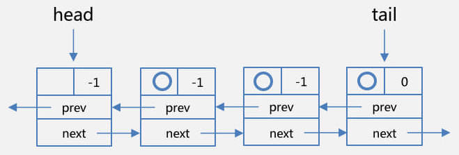

**值得注意的是，头节点的状态为-1，即代表后续节点需要被唤醒。头结点（head）中并未封装线程实例，而且，前一个节点的状态其实代表的时候后一个节点的行为，而最后一个节点的状态，是默认值0**。

### 6.3. AQS 的等待（条件）队列

获取锁成功后，线程进入监视区域，但是如果线程不满足某些条件，就会再次进行等待。AQS 的等待（条件）队列用于存放不满足条件对象的线程，并且线程会被封装成节点，进入等待状态并加入等待队列的尾部。

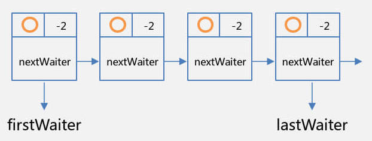

等待队列有个首节点指示器 `firstWaiter` 和尾节点指示器 `lastWaiter`。与同步队列不同的是，`firstWaiter` 指向的首节点是封装了线程实例的；同步队列的首节点是一个标志位，是一个具有特殊功能的头部，而等待队列只需要封装线程和它的同步信息即可。

### 6.4. 同步队列节点的入队和出队（待整理）

> TODO: 整理中
