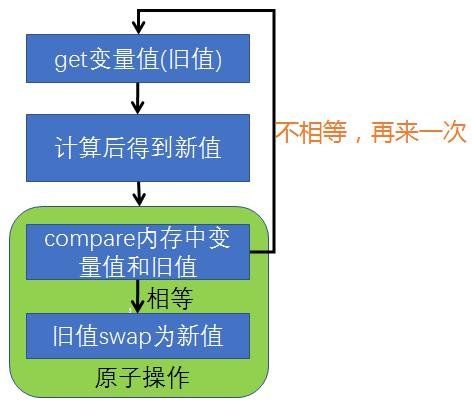
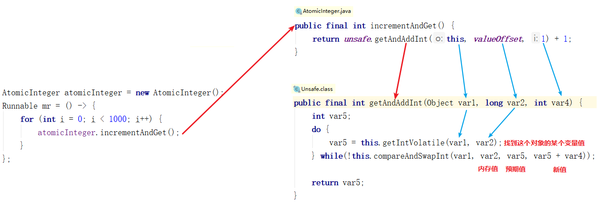

## 1. 原子操作

假定有两个操作 A 和 B，如果从执行 A 的线程来看，当另一个线程执行 B 时，要么将 B 全部执行完，要么完全不执行 B，那么 A 和 B 对彼此来说是原子的。

可以使用锁机制来实现原子操作，`synchronized` 关键字是基于阻塞的锁机制，也就是说当一个线程拥有锁的时候，访问同一资源的其它线程需要等待，直到该线程释放锁。

## 2. CAS（Compare And Swap）

### 2.1. 概念

CAS（Compare And Swap）指比较并交换。是现代 CPU 广泛支持的一种对内存中的共享数据进行操作的一种特殊指令。CAS 操作采用了乐观锁的思想，通过比较和交换保证共享变量赋值时的原子操作，这个原子操作直接由 CPU 保证。

CAS 算法包含 V,E,N 等 3 个参数：

- V 表示要更新的变量（内存中的值）
- E 表示预期的值（旧值）
- N 表示新值

仅在 V 值等于 E 值时，才会将 V 值设为 N；如果 V 值和 E 值不同，则说明已经有其他线程做了更新，当前线程什么都不做。最后 CAS 返回当前 V 的真实值。



### 2.2. CAS 与 volatile

在 CAS 获取共享变量时，为了保证该变量的可见性，需要使用 `volatile` 修饰。通常 CAS 结合 `volatile` 可以实现无锁并发，适用于线程数少、竞争不激烈、多核 CPU 的场景。

其实 CAS 的底层是 lock cmpxchg 指令（X86 架构），在单核 CPU 和多核 CPU 下都能够保证【比较-交换】的原子性。

在多核状态下，某个核执行到带 lock 的指令时，CPU 会让总线锁住，当这个核把此指令执行完毕，再开启总线。这个过程中不会被线程的调度机制所打断，保证了多个线程对内存操作的准确性，是原子的。

获取共享变量时，为了保证该变量的可见性，需要使用 volatile 修饰。它可以用来修饰成员变量和静态成员变量，避免线程从自己的工作缓存中查找变量的值，必须到主存中获取它的值，线程操作 volatile 变量都是直接操作主存。即一个线程对 volatile 变量的修改，对另一个线程可见。因此 CAS 必须借助 volatile 才能读取到共享变量的最新值来实现【比较并交换】的效果

> Notes: volatile 仅仅保证了共享变量的可见性，让其它线程能够看到最新值，但不能解决指令交错问题（不能保证原子性）

### 2.3. 无锁效率高的原因

无锁情况下，因为没有使用 `synchronized`，所以线程不会陷入阻塞，这是效率提升的因素之一。即使重试失败，线程始终在高速运行，没有停歇。而使用 synchronized 会让线程在没有获得锁的时候，发生上下文切换，进入阻塞，这个比无锁重试的花销更大。

值得注意的是，无锁需要额外 CPU 的支持。因为线程要保持运行，如果超出 CPU 核心数时，虽然线程不会进入阻塞，但由于竞争激烈，线程没有分到时间片，仍然会进入可运行状态，还是会导致上下文切换，反而效率会受影响。

## 3. CAS 实现原子操作存在的问题

### 3.1. ABA 问题

CAS 需要在操作值的时候，检查值有没有发生变化，如果没有发生变化则更新，但是如果一个值原来是 A，变成了 B，又变成了 A，那么使用 CAS 进行检查时不会感知到该值已发生变化，但是实际上却变化了。

**ABA 问题的解决思路就是使用版本号**。在变量前面追加上版本号，每次变量更新的时候把版本号加 1，那么 A -> B -> A 就会变成 1A -> 2B -> 3A。

### 3.2. 循环时间长开销大

CAS 操作如果长时间不成功，会导致一直自旋，会给 CPU 带来非常大的执行开销。

#### 3.2.1. CAS 循环时间长占用资源大问题解决方案

如果 JVM 能支持处理器提供的 `pause` 指令，那么效率会有一定的提升。

1. 它可以延迟流水线执行指令(de-pipeline)，使 CPU 不会消耗过多的执行资源，延迟的时间取决于具体实现的版本，有些处理器延迟时间是 0。
2. 它可以避免在退出循环的时候因内存顺序冲突而引起的 CPU 流水线被清空，从而提高 CPU 执行效率。

### 3.3. 只能保证一个共享变量的原子操作

当对一个共享变量执行操作时，可以使用循环 CAS 的方式来保证原子操作，但是对多个共享变量操作时，循环 CAS 就无法保证操作的原子性，此时必须使用锁来保证。

但还有一种思路，就是把多个共享变量合并成一个共享变量来操作。比如，有两个共享变量 i＝2，j=a，合并一下 ij=2a，然后用 CAS 来操作 ij。

> Tips: 从 Java 1.5 开始，JDK 提供了 `AtomicReference` 类来保证引用对象之间的原子性，就可以把多个变量放在一个对象里来进行 CAS 操作。

## 4. JDK 的原子操作类

### 4.1. 概述

在 JDK1.5 之前需要开发者通过同步技术自行实现原子操作。

从 JDK1.5 开始，`java.util.concurrent` 包里面提供了一组原子类。其基本的特性就是在多线程环境下，当有多个线程同时执行这些类的实例包含的方法时，具有排他性，即当某个线程进入方法，执行其中的指令时，不会被其他线程打断，而让其他线程类似自旋锁一样，一直等到该方法执行完成，才由 JVM 从等待队列中选择一个另一个线程进入，从而实现原子操作。

### 4.2. 原子整数

在 J.U.C 并发包提供了整数类型数据的原子操作工具类，分别如下：

- `java.util.concurrent.atomic.AtomicBoolean` 布尔型原子类
- `java.util.concurrent.atomic.AtomicInteger` 整型原子类
- `java.util.concurrent.atomic.AtomicLong` 长整型原子类

#### 4.2.1. 常用方法

列举 `AtomicInteger` 类常用的方法：

```java
public final int get()
```

- 获取当前的值

```java
public final int getAndSet(int newValue)
```

- 获取当前的值，并设置新的值

```java
public final int getAndIncrement()
```

- 获取当前的值，后自增

```java
public final int incrementAndGet()
```

- 先自增，再获取自增后的值

```java
public final int getAndDecrement()
```

- 获取当前的值，后自减

```java
public final int decrementAndGet()
```

- 先自减，再获取自减后的值

```java
public final int getAndAdd(int delta)
```

- 获取当前的值，并加上预期的值

```java
public final boolean compareAndSet(int expect, int update)
```

- 如果输入的数值等于预期值，则以原子方式将该值设置为输入值（update）

```java
public final void lazySet(int newValue)
```

- 最终设置为 newValue，使用 lazySet 设置之后可能导致其他线程在之后的一小段时间内还是可以读到旧的值。

#### 4.2.2. 基础 API 使用示例

以 `AtomicInteger` 为例，相关 API 的使用如下：

```java
AtomicInteger i = new AtomicInteger(0);

// 获取并自增（i = 0, 结果 i = 1, 返回 0），类似于 i++
System.out.println(i.getAndIncrement());

// 自增并获取（i = 1, 结果 i = 2, 返回 2），类似于 ++i
System.out.println(i.incrementAndGet());

// 自减并获取（i = 2, 结果 i = 1, 返回 1），类似于 --i
System.out.println(i.decrementAndGet());

// 获取并自减（i = 1, 结果 i = 0, 返回 1），类似于 i--
System.out.println(i.getAndDecrement());

// 获取并加值（i = 0, 结果 i = 5, 返回 0）
System.out.println(i.getAndAdd(5));

// 加值并获取（i = 5, 结果 i = 0, 返回 0）
System.out.println(i.addAndGet(-5));

// 获取并更新（i = 0, p 为 i 的当前值, 结果 i = -2, 返回 0）
// 其中函数中的操作能保证原子，但函数需要无副作用
System.out.println(i.getAndUpdate(p -> p - 2));

// 更新并获取（i = -2, p 为 i 的当前值, 结果 i = 0, 返回 0）
// 其中函数中的操作能保证原子，但函数需要无副作用
System.out.println(i.updateAndGet(p -> p + 2));

// 获取并计算（i = 0, p 为 i 的当前值, x 为参数1, 结果 i = 10, 返回 0）
// 其中函数中的操作能保证原子，但函数需要无副作用
// getAndUpdate 如果在 lambda 中引用了外部的局部变量，要保证该局部变量是 final 的
// getAndAccumulate 可以通过 参数1 来引用外部的局部变量，但因为其不在 lambda 中因此不必是 final
System.out.println(i.getAndAccumulate(10, (p, x) -> p + x));

// 计算并获取（i = 10, p 为 i 的当前值, x 为参数1, 结果 i = 0, 返回 0）
// 其中函数中的操作能保证原子，但函数需要无副作用
System.out.println(i.accumulateAndGet(-10, (p, x) -> p + x));
```

#### 4.2.3. 通过 CAS 实现锁

> Tips: 注意不要用于实际开发生产！

定义使用原子操作工具类 `AtomicInteger` 的 CAS 来实现锁

```java
public class LockCas {
    private AtomicInteger state = new AtomicInteger(0);

    public void lock() {
        while (true) {
            if (state.compareAndSet(0, 1)) {
                break;
            }
        }
    }

    public void unlock() {
        log.debug("unlock...");
        state.set(0);
    }
}
```

测试：

```java
@Test
public void lockCasTest() throws InterruptedException {
    LockCas lock = new LockCas();
    new Thread(() -> {
        log.debug("begin...");
        lock.lock();
        try {
            log.debug("lock...");
            Thread.sleep(1000);
        } catch (InterruptedException e) {
            e.printStackTrace();
        } finally {
            lock.unlock();
        }
    }).start();
    new Thread(() -> {
        log.debug("begin...");
        lock.lock();
        try {
            log.debug("lock...");
        } finally {
            lock.unlock();
        }
    }).start();
    Thread.sleep(2500);
}
```

测试结果：

```java
2023-03-13 17:15:42.220 [Thread-2] DEBUG com.moon.java.common.test.BasicTest - begin...
2023-03-13 17:15:42.220 [Thread-1] DEBUG com.moon.java.common.test.BasicTest - begin...
2023-03-13 17:15:42.222 [Thread-2] DEBUG com.moon.java.common.test.BasicTest - lock...
2023-03-13 17:15:42.222 [Thread-2] DEBUG com.moon.java.common.test.BasicTest - unlock...
2023-03-13 17:15:42.222 [Thread-1] DEBUG com.moon.java.common.test.BasicTest - lock...
2023-03-13 17:15:43.236 [Thread-1] DEBUG com.moon.java.common.test.BasicTest - unlock...
```

### 4.3. 原子引用

在 J.U.C 并发包提供了引用类型数据的原子操作工具类，分别如下：

- `java.util.concurrent.atomic.AtomicReference` 引用类型原子类
- `java.util.concurrent.atomic.AtomicStampedReference` 带有版本号的引用类型原子类。该类将整数值与引用关联起来，可用于解决原子的更新数据和数据的版本号，可以解决使用 CAS 进行原子更新时可能出现的 ABA 问题。
- `java.util.concurrent.atomic.AtomicMarkableReference` 原子更新带有标记的引用类型。该类将 boolean 标记与引用关联起来

#### 4.3.1. AtomicReference

引用对象不安全的实现示例：

```java
BigDecimal balance;

@Test
public void decimalUnsafeTest() {
    balance = new BigDecimal(10000);
    List<Thread> ts = new ArrayList<>();
    for (int i = 0; i < 1000; i++) {
        ts.add(new Thread(() -> {
            balance = balance.subtract(BigDecimal.TEN);
        }));
    }
    ts.forEach(Thread::start);
    ts.forEach(t -> {
        try {
            t.join();
        } catch (InterruptedException e) {
            e.printStackTrace();
        }
    });
    System.out.println(balance.toString());
}
```

上面示例最终输出结果几乎都不会为0。可以使用 `AtomicReference` 通过 cas 来实现线程安全操作：

```java
AtomicReference<BigDecimal> balance;

@Test
public void atomicReferenceTest() {
    balance = new AtomicReference<>(new BigDecimal(10000));
    List<Thread> ts = new ArrayList<>();
    for (int i = 0; i < 1000; i++) {
        ts.add(new Thread(() -> {
            while (true) {
                BigDecimal prev = balance.get();
                BigDecimal next = prev.subtract(new BigDecimal(10));
                if (balance.compareAndSet(prev, next)) {
                    break;
                }
            }
        }));
    }
    ts.forEach(Thread::start);
    ts.forEach(t -> {
        try {
            t.join();
        } catch (InterruptedException e) {
            e.printStackTrace();
        }
    });
    System.out.println(balance.get());
}
```

#### 4.3.2. AtomicStampedReference

前面提过的 ABA 问题，如果希望感知到是否有其他线程对共享变量进行过「改动」，此时不能仅仅比较值，需要加一个版本号。

`AtomicStampedReference` 可以给原子引用加上版本号，追踪原子引用整个的变化过程，并且可以知道引用变量中途被更改的次数。如： A -> B -> A -> C

```java
static AtomicStampedReference<String> ref = new AtomicStampedReference<>("A", 0);

public static void main(String[] args) throws InterruptedException {
    log.debug("main start...");
    // 获取值 A
    String prev = ref.getReference();
    // 获取版本号
    int stamp = ref.getStamp();
    log.debug("版本 {}", stamp);
    // 如果中间有其它线程干扰，发生了 ABA 现象
    other();
    Thread.sleep(1000);
    // 尝试改为 C
    log.debug("change A->C {}", ref.compareAndSet(prev, "C", stamp, stamp + 1));
}

private static void other() throws InterruptedException {
    new Thread(() -> {
        log.debug("change A->B {}", ref.compareAndSet(ref.getReference(), "B", ref.getStamp(), ref.getStamp() + 1));
        log.debug("更新版本为 {}", ref.getStamp());
    }, "t1").start();
    Thread.sleep(500);
    new Thread(() -> {
        log.debug("change B->A {}", ref.compareAndSet(ref.getReference(), "A", ref.getStamp(), ref.getStamp() + 1));
        log.debug("更新版本为 {}", ref.getStamp());
    }, "t2").start();
}
```

输出结果：

```
2023-02-21 12:18:32.058 [main] DEBUG com.moon.java.common.test.BasicTest - main start...
2023-02-21 12:18:32.061 [main] DEBUG com.moon.java.common.test.BasicTest - 版本 0
2023-02-21 12:18:32.103 [t1] DEBUG com.moon.java.common.test.BasicTest - change A->B true
2023-02-21 12:18:32.103 [t1] DEBUG com.moon.java.common.test.BasicTest - 更新版本为 1
2023-02-21 12:18:32.603 [t2] DEBUG com.moon.java.common.test.BasicTest - change B->A true
2023-02-21 12:18:32.603 [t2] DEBUG com.moon.java.common.test.BasicTest - 更新版本为 2
2023-02-21 12:18:33.605 [main] DEBUG com.moon.java.common.test.BasicTest - change A->C false
```

#### 4.3.3. AtomicMarkableReference

`AtomicMarkableReference` 类原子操作<u>只关注共享引用变量是否被改动过，而不关心引用变量更忙的次数</u>。示例代码如下：

```java
@Test
public void aBAAtomicMarkableReferenceTest() throws InterruptedException {
    GarbageBag bag = new GarbageBag("装满了垃圾");
    // 参数2 mark 可以看作一个标记，表示垃圾袋满了
    AtomicMarkableReference<GarbageBag> ref = new AtomicMarkableReference<>(bag, true);

    log.debug("主线程 start...");
    GarbageBag prev = ref.getReference();
    log.debug(prev.toString());

    new Thread(() -> {
        log.debug("打扫卫生的线程 start...");
        bag.setDesc("空垃圾袋");
        while (!ref.compareAndSet(bag, bag, true, false)) {
        }
        log.debug(bag.toString());
    }).start();
    
    Thread.sleep(1000);
    log.debug("主线程想换一只新垃圾袋？");
    boolean success = ref.compareAndSet(prev, new GarbageBag("空垃圾袋"), true, false);
    log.debug("换了么？" + success);
    log.debug(ref.getReference().toString());
}

class GarbageBag {
    String desc;

    public GarbageBag(String desc) {
        this.desc = desc;
    }

    public void setDesc(String desc) {
        this.desc = desc;
    }

    @Override
    public String toString() {
        return super.toString() + " " + desc;
    }
}
```

输出结果：

```java
2023-02-21 12:31:47.791 [main] DEBUG com.moon.java.common.test.BasicTest - 主线程 start...
2023-02-21 12:31:47.793 [main] DEBUG com.moon.java.common.test.BasicTest - com.moon.java.common.test.BasicTest$GarbageBag@57fffcd7 装满了垃圾
2023-02-21 12:31:47.837 [Thread-1] DEBUG com.moon.java.common.test.BasicTest - 打扫卫生的线程 start...
2023-02-21 12:31:47.837 [Thread-1] DEBUG com.moon.java.common.test.BasicTest - com.moon.java.common.test.BasicTest$GarbageBag@57fffcd7 空垃圾袋
2023-02-21 12:31:48.840 [main] DEBUG com.moon.java.common.test.BasicTest - 主线程想换一只新垃圾袋？
2023-02-21 12:31:48.840 [main] DEBUG com.moon.java.common.test.BasicTest - 换了么？false
2023-02-21 12:31:48.840 [main] DEBUG com.moon.java.common.test.BasicTest - com.moon.java.common.test.BasicTest$GarbageBag@57fffcd7 空垃圾袋
```

### 4.4. 原子数组

在 J.U.C 并发包提供了数组类型的原子操作工具类，分别如下：

- `java.util.concurrent.atomic.AtomicIntegerArray` 整形数组原子类
- `java.util.concurrent.atomic.AtomicLongArray` 长整形数组原子类
- `java.util.concurrent.atomic.AtomicReferenceArray` 引用类型数组原子类

#### 4.4.1. 常用方法

以 `AtomicIntegerArray` 类为例，常用方法：

```java
public final int get(int i)
```

- 获取 index=i 位置元素的值    

```java
public final int getAndSet(int i, int newValue)
```

- 返回 index=i 位置的当前的值，并将其设置为新值：newValue

```java
public final int getAndIncrement(int i)
```

- 获取 index=i 位置元素的值，并让该位置的元素自增

```java
public final int getAndDecrement(int i)
```

- 获取 index=i 位置元素的值，并让该位置的元素自减

```java
public final int getAndAdd(int i, int delta)
```

- 获取 index=i 位置元素的值，并加上预期的值

```java
public final boolean compareAndSet(int i, int expect, int update)
```

- 如果输入的数值等于预期值，则以原子方式将 index=i 位置的元素值设置为输入值（update）

```java
public final void lazySet(int i, int newValue)
```

- 最终将 index=i 位置的元素设置为 newValue，使用 lazySet 设置之后可能导致其他线程在之后的一小段时间内还是可以读到旧的值。

#### 4.4.2. 基础使用示例

数组不安全的操作示例：

```java
@Test
public void unsafeArrayTest() {
    List<Thread> ts = new ArrayList<>();
    int[] array = new int[10];
    int length = array.length;
    
    for (int i = 0; i < length; i++) {
        // 每个线程对数组作 10000 次操作
        ts.add(new Thread(() -> {
            for (int j = 0; j < 10000; j++) {
                array[j % length]++;
            }
        }));
    }
    
    ts.forEach(Thread::start); // 启动所有线程
    ts.forEach(t -> {
        try {
            t.join();
        } catch (InterruptedException e) {
            e.printStackTrace();
        }
    }); // 等所有线程结束
    System.out.println(Arrays.toString(array));
}
```

输出结果：

```java
[5129, 5055, 4994, 4979, 5068, 5125, 5164, 5133, 5167, 5174]
```

以 `AtomicIntegerArray` 原子数组操作类为例，进行数组的安全操作：

```java
@Test
public void AtomicIntegerArrayTest() {
    List<Thread> ts = new ArrayList<>();
    AtomicIntegerArray array = new AtomicIntegerArray(10);
    int length = array.length();

    for (int i = 0; i < length; i++) {
        // 每个线程对数组作 10000 次操作
        ts.add(new Thread(() -> {
            for (int j = 0; j < 10000; j++) {
                array.getAndIncrement(j % length);
            }
        }));
    }

    ts.forEach(Thread::start); // 启动所有线程
    ts.forEach(t -> {
        try {
            t.join();
        } catch (InterruptedException e) {
            e.printStackTrace();
        }
    }); // 等所有线程结束
    System.out.println(array);
}
```

输出结果正常：

```java
[10000, 10000, 10000, 10000, 10000, 10000, 10000, 10000, 10000, 10000]
```

### 4.5. 字段更新器

在 J.U.C 并发包提供了原子操作的字段更新器，分别如下：

- `java.util.concurrent.atomic.AtomicReferenceFieldUpdater`
- `java.util.concurrent.atomic.AtomicIntegerFieldUpdater`
- `java.util.concurrent.atomic.AtomicLongFieldUpdater`

利用字段更新器，可以针对对象的某个域（Field）进行原子操作，并必须配合 `volatile` 修饰的字段使用，否则会出现异常

```java
Exception in thread "main" java.lang.IllegalArgumentException: Must be volatile type
```

以 `AtomicIntegerFieldUpdater` 为例：

```java
public class BasicTest {

    private volatile int field;

    @Test
    public void atomicIntegerFieldUpdaterTest() {
        AtomicIntegerFieldUpdater<BasicTest> fieldUpdater =
                AtomicIntegerFieldUpdater.newUpdater(BasicTest.class, "field");

        BasicTest testDemo = new BasicTest();
        fieldUpdater.compareAndSet(testDemo, 0, 10);
        System.out.println(testDemo.field); // 修改成功 field = 10
        fieldUpdater.compareAndSet(testDemo, 10, 20); // 修改成功 field = 20
        System.out.println(testDemo.field);
        fieldUpdater.compareAndSet(testDemo, 10, 30); // 修改失败 field = 20
        System.out.println(testDemo.field);
    }
}
```

### 4.6. 原子累加器

在 J.U.C 并发包提供了专用于累加操作的原子累加器，其性能是高于使用原始原子整数操作类，分别如下：

- `java.util.concurrent.atomic.LongAdder`

#### 4.6.1. 累加器性能比较

比较 `AtomicLong` 与 `LongAdder` 示例：

```java
@Test
public void atomicLongTest() {
    // 测试 AtomicLong
    increment(AtomicLong::new, AtomicLong::incrementAndGet);
    // 测试 LongAdder
    increment(LongAdder::new, LongAdder::increment);
}

private <T> void increment(Supplier<T> supplier, Consumer<T> action) {
    // 获取测试的原子类
    T oprator = supplier.get();
    List<Thread> ts = new ArrayList<>();
    long start = System.nanoTime();

    // 40 个线程，每个累加 50 万
    for (int i = 0; i < 40; i++) {
        // 每个线程对数组作 10000 次操作
        ts.add(new Thread(() -> {
            for (int j = 0; j < 500000; j++) {
                action.accept(oprator); // 操作
            }
        }));
    }

    ts.forEach(Thread::start); // 启动所有线程
    ts.forEach(t -> {
        try {
            t.join();
        } catch (InterruptedException e) {
            e.printStackTrace();
        }
    }); // 等所有线程结束
    long end = System.nanoTime();
    System.out.println(oprator + " cost:" + (end - start) / 1000_000);
}
```

最终测试结果：

```
20000000 cost:394
20000000 cost:91
```

原子累加器性能提升的原因很简单，就是在有竞争时，<font color=red>**设置多个累加单元**</font>，Therad-0 累加 Cell[0]，而 Thread-1 累加 Cell[1] ... 最后将结果汇总。这样它们在累加时操作的不同的 Cell 变量，因此减少了 CAS 重试失败，从而提高性能。

## 5. Unsafe 类

通过刚才 `AtomicInteger` 的源码可以看到，`Unsafe` 类提供了原子操作。

### 5.1. 概述

```java
public final class Unsafe {}
```

`sun.misc.Unsafe` 类提供了非常底层的，操作内存、线程的方法。使 Java 拥有了像 C 语言的指针一样操作内存空间的能力，同时也带来了指针的问题。过度的使用 Unsafe 类会使得出错的几率变大，因此 Java 官方并<u>**不建议使用**</u>的，官方文档也几乎没有。<font color=red>**Unsafe 对象不能直接调用，只能通过反射获得**</font>。


### 5.2. Unsafe 的 CAS 操作

通过反射来获取 `Unsafe` 类对象

```java
import sun.misc.Unsafe;

import java.lang.reflect.Field;

public class UnsafeAccessor {
    static Unsafe unsafe;

    static {
        try {
            Field theUnsafe = Unsafe.class.getDeclaredField("theUnsafe");
            theUnsafe.setAccessible(true);
            unsafe = (Unsafe) theUnsafe.get(null);
        } catch (NoSuchFieldException | IllegalAccessException e) {
            throw new Error(e);
        }
    }

    static Unsafe getUnsafe() {
        return unsafe;
    }
}
```

创建示例的实体类

```java
@Data
class Student {
    volatile int id;
    volatile String name;
}
```

示例代码：

```java
public static void main(String[] args) throws NoSuchFieldException {
    Unsafe unsafe = UnsafeAccessor.getUnsafe();
    Field id = Student.class.getDeclaredField("id");
    Field name = Student.class.getDeclaredField("name");

    // 获得成员变量的偏移量
    long idOffset = UnsafeAccessor.unsafe.objectFieldOffset(id);
    long nameOffset = UnsafeAccessor.unsafe.objectFieldOffset(name);
    Student student = new Student();

    // 使用 cas 方法替换成员变量的值
    UnsafeAccessor.unsafe.compareAndSwapInt(student, idOffset, 0, 20); // 返回 true
    UnsafeAccessor.unsafe.compareAndSwapObject(student, nameOffset, null, "张三"); // 返回 true
    System.out.println(student); // 输出：Student{id=20, name='张三'}
}
```

### 5.3. Unsafe 实现 CAS 原理


