## 1. 计算机结构（前置知识简述）

冯诺依曼，提出计算机由五大组成部分，输入设备，输出设备，存储器，控制器，运算器。

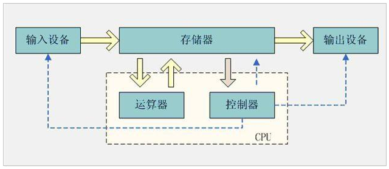

- **CPU**：中央处理器，是计算机的控制和运算的核心，程序最终都会变成指令让CPU去执行，处理程序中的数据。
- **内存**：程序都是在内存中运行的，内存会保存程序运行时的数据，供CPU处理。
- **缓存**：CPU的运算速度和内存的访问速度相差比较大。这就导致CPU每次操作内存都要耗费很多等待时间。内存的读写速度成为了计算机运行的瓶颈。于是就有了在CPU和主内存之间增加缓存的设计。最靠近CPU的缓存称为L1，然后依次是 L2，L3和主内存，CPU缓存模型如图下图所示。

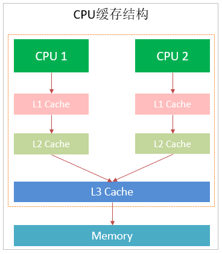

CPU Cache分成了三个级别: L1， L2， L3。级别越小越接近 CPU，速度也更快，同时也代表着容量越小。

1. L1 是最接近 CPU 的，它容量最小，例如 32K，速度最快，每个核上都有一个 L1 Cache。
2. L2 Cache 更大一些，例如 256K，速度要慢一些，一般情况下每个核上都有一个独立的 L2 Cache。
3. L3 Cache 是三级缓存中最大的一级，例如 12MB，同时也是缓存中最慢的一级，在同一个 CPU 插槽之间的核共享一个 L3 Cache。

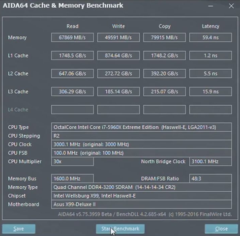

Cache 的出现是为了解决 CPU 直接访问内存效率低下问题的，程序在运行的过程中，CPU 接收到指令后，它会最先向 CPU 中的一级缓存（L1 Cache）去寻找相关的数据，如果命中缓存，CPU 进行计算时就可以直接对 CPU Cache 中的数据进行读取和写人，当运算结束之后，再将 CPU Cache 中的最新数据刷新到主内存当中，CPU 通过直接访问 Cache 的方式替代直接访问主存的方式极大地提高了 CPU 的吞吐能力。但是由于一级缓存（L1 Cache）容量较小，所以不可能每次都命中。这时 CPU 会继续向下一级的二级缓存（L2 Cache）寻找，同样的道理，当所需要的数据在二级缓存中也没有的话，会继续转向 L3 Cache、内存(主存)和硬盘。

### 1.1. CPU 缓存结构原理

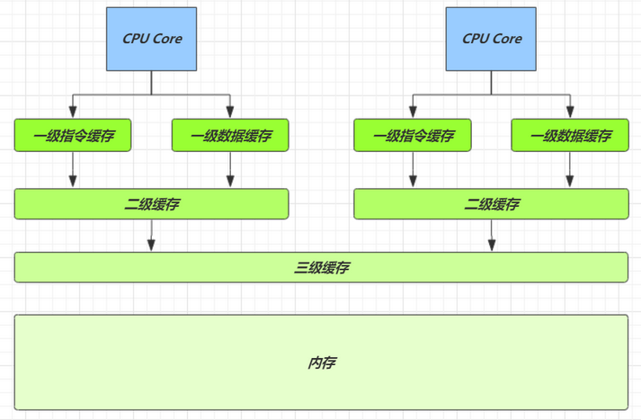

查看 cpu 缓存

```
root@moonkira ~ lscpu
Architecture: x86_64
CPU op-mode(s): 32-bit, 64-bit
Byte Order: Little Endian
CPU(s): 1
On-line CPU(s) list: 0
Thread(s) per core: 1
Core(s) per socket: 1
Socket(s): 1
NUMA node(s): 1
Vendor ID: GenuineIntel
CPU family: 6
Model: 142
Model name: Intel(R) Core(TM) i7-8565U CPU @ 1.80GHz
Stepping: 11
CPU MHz: 1992.002
BogoMIPS: 3984.00
Hypervisor vendor: VMware
Virtualization type: full
L1d cache: 32K
L1i cache: 32K
L2 cache: 256K
L3 cache: 8192K
NUMA node0 CPU(s): 0
```

速度比较

| 从 cpu 到 |         大约需要的时钟周期          |
| --------- | ------------------------------- |
| 寄存器     | 1 cycle (4GHz 的 CPU 约为0.25ns) |
| L1        | 3~4 cycle                       |
| L2        | 10~20 cycle                     |
| L3        | 40~45 cycle                     |
| 内存      | 120~240 cycle                   |


查看 cpu 缓存行

```bash
root@moonkira ~ cat /sys/devices/system/cpu/cpu0/cache/index0/coherency_line_size64
```

cpu 拿到的内存地址格式是：`[高位组标记][低位索引][偏移量]`

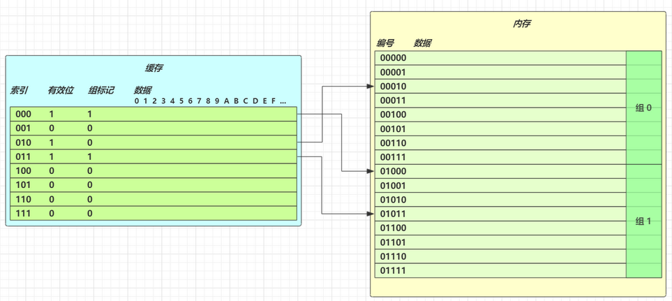

### 1.2. CPU 缓存读

读取数据流程是根据低位，计算在缓存中的索引，判断是否有效。

- 0 去内存读取新数据更新缓存行
- 1 再对比高位组标记是否一致
    - 一致，根据偏移量返回缓存数据
    - 不一致，去内存读取新数据更新缓存行

### 1.3. CPU 缓存一致性

MESI 协议

1. E、S、M 状态的缓存行都可以满足 CPU 的读请求
2. E 状态的缓存行，有写请求，会将状态改为 M，这时并不触发向主存的写
3. E 状态的缓存行，必须监听该缓存行的读操作，如果有，要变为 S 状态

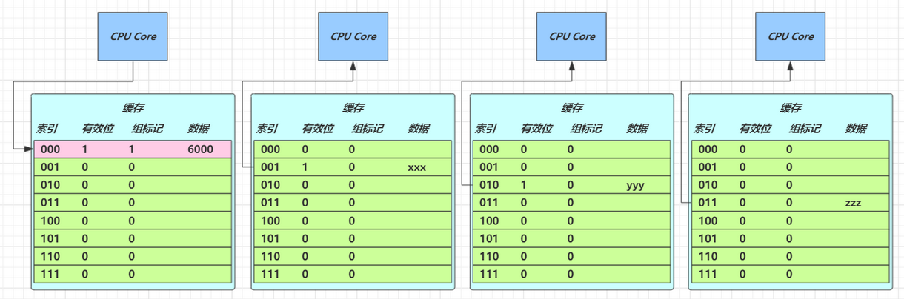

4. M 状态的缓存行，必须监听该缓存行的读操作，如果有，先将其它缓存（S 状态）中该缓存行变成 I 状态（即第6步的流程），写入主存，自己变为 S 状态
5. S 状态的缓存行，有写请求，走第4步的流程
6. S 状态的缓存行，必须监听该缓存行的失效操作，如果有，自己变为 I 状态
7. I 状态的缓存行，有读请求，必须从主存读取

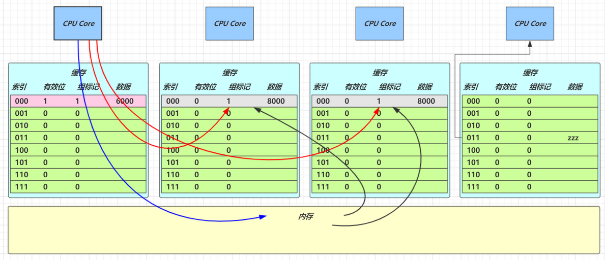

## 2. Java 内存模型 (JMM)

### 2.1. 概念

Java Memory Molde (Java内存模型)，简称：JMM，是 Java 虚拟机规范中所定义的一套标准化的内存模型规范，描述了 Java 程序中各种变量(线程共享变量)的访问规则，以及在 JVM 中将变量存储到内存和从内存中读取变量的相关底层细节，保证指令的正确性。

JMM 定义的主存、工作内存抽象概念，底层对应着 CPU 寄存器、缓存、硬件内存、CPU 指令优化等，屏蔽掉了底层不同计算机的区别。具体如下：

- **主内存**：是所有线程都共享的，都能访问的。所有的共享变量都存储于主内存。
- **工作内存**：每一个线程有自己的工作内存，工作内存只存储该线程对共享变量的副本。线程对变量的所有的操作(读，取)都必须在工作内存中完成，而不能直接读写主内存中的变量，不同线程之间也不能直接访问对方工作内存中的变量。

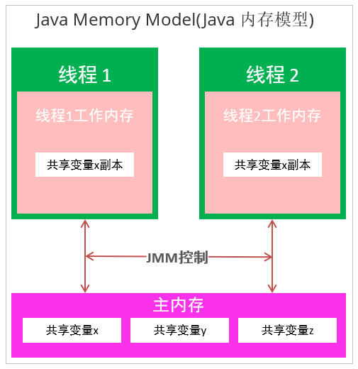

> Notes: 不要将 JMM 与 Java 内存结构混淆！关于“Java内存模型”的权威解释参考官网 https://download.oracle.com/otn-pub/jcp/memory_model-1.0-pfd-spec-oth-JSpec/memory_model-1_0-pfd-spec.pdf

#### 2.1.1. 作用

Java 内存模型的作用是，在多线程读写共享数据时，对共享数据的可见性、有序性和原子性规则的保障。如：`synchronized`，`volatile` 等应用。

- 原子性：保证指令不会受到线程上下文切换的影响
- 可见性：保证指令不会受 cpu 缓存的影响
- 有序性：保证指令不会受 cpu 指令并行优化的影响

#### 2.1.2. 特点

1. 所有的共享变量都存储于主内存(计算机的RAM)，变量指的是实例变量和类变量。不包含局部变量，因为局部变量是线程私有的，因此不存在竞争问题。
2. 每一个线程还存在自己的工作内存，线程的工作内存，保留了被线程使用的变量的工作副本。
3. 线程对变量的所有的操作(读，写)都必须在工作内存中完成，而不能直接读写主内存中的变量，不同线程之间也不能直接访问对方工作内存中的变量，线程间变量的值的传递需要通过主内存完成。

### 2.2. CPU 缓存、内存与 Java 内存模型的关系

JMM 内存模型与 CPU 硬件内存架构的关系：

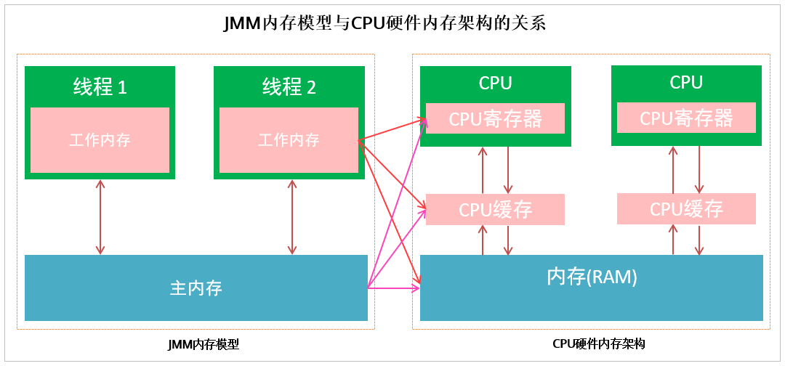

多线程的执行最终都会映射到硬件处理器上进行执行。但 Java 内存模型和硬件内存架构并不完全一致。对于硬件内存来说只有寄存器、缓存内存、主内存的概念，并没有工作内存和主内存之分，也就是说 Java 内存模型对内存的划分对硬件内存并没有任何影响，因为 JMM 只是一种抽象的概念，是一组规则，不管是工作内存的数据还是主内存的数据，对于计算机硬件来说都会存储在计算机主内存中，当然也有可能存储到 CPU 缓存或者寄存器中，因此总体上来说，Java 内存模型和计算机硬件内存架构是一个相互交叉的关系，是一种抽象概念划分与真实物理硬件的交叉。

### 2.3. 主内存与工作内存之间的交互

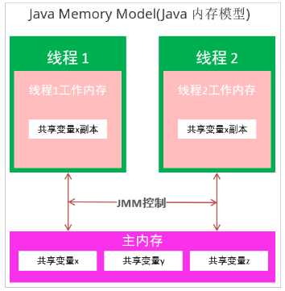

Java 内存模型中定义了以下8种操作来完成，主内存与工作内存之间具体的交互协议，即一个变量如何从主内存拷贝到工作内存、如何从工作内存同步回主内存之类的实现细节，虚拟机实现时必须保证下面提及的每一种操作都是原子的、不可再分的。对应如下的流程图：

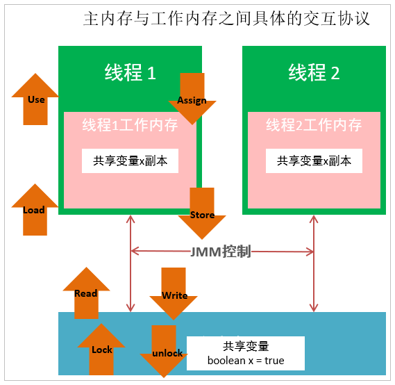

主内存与工作内存之间的数据交互过程是：`lock -> read -> load -> use -> assign -> store -> write -> unlock`

> Notes: 
>
> 1. 如果对一个变量执行lock操作，将会清空工作内存中此变量的值
> 2. 对一个变量执行unlock操作之前，必须先把此变量同步到主内存中

### 2.4. 内存屏障

Memory Barrier（Memory Fence）

**可见性**：

- 写屏障（sfence）保证在该屏障之前的，对共享变量的改动，都同步到主存当中
- 读屏障（lfence）保证在该屏障之后，对共享变量的读取，加载的是主存中最新数据

**有序性**

- 写屏障会确保指令重排序时，不会将写屏障之前的代码排在写屏障之后
- 读屏障会确保指令重排序时，不会将读屏障之后的代码排在读屏障之前

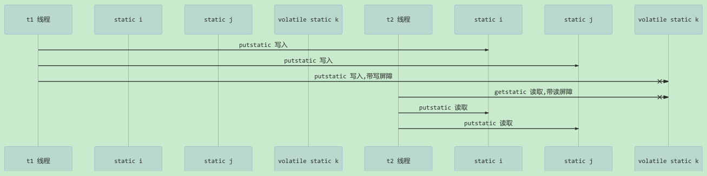

## 3. 保证可见性

### 3.1. 多线程共享变量可见性问题分析

用以下的代码来说明可见性的问题，main 线程对 run 变量的修改对于 t 线程不可见，导致了 t 线程无法停止。

```java
static boolean run = true;
public static void main(String[] args) throws InterruptedException {
    Thread t = new Thread(()->{
        while(run){
            // ....
        }
    });
    
    t.start();
    Thread.sleep(1000);
    run = false; // 线程t不会如预想的停下来
}
```

### 3.2. 共享变量可见性问题分析与解决

以上示例中，初始状态 t 线程刚开始从主内存读取了 run 的值到工作内存。

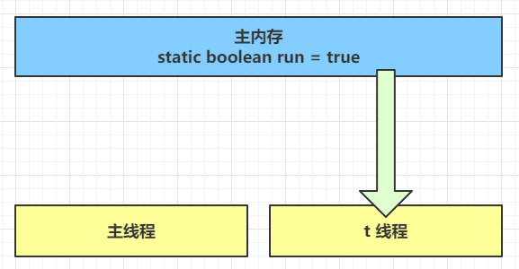

因为 t 线程要频繁从主内存中读取 run 的值，JIT 编译器会将 run 的值缓存至自己工作内存中的高速缓存中，减少对主存中 run 的访问，提高效率

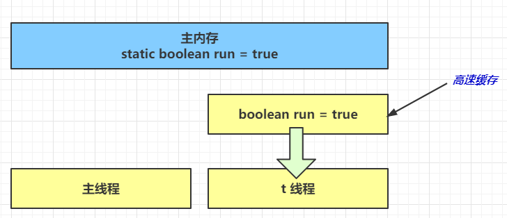

1 秒之后，main 线程修改了 run 的值，并同步至主存，而 t 是从自己工作内存中的高速缓存中读取这个变量的值，结果永远是旧值

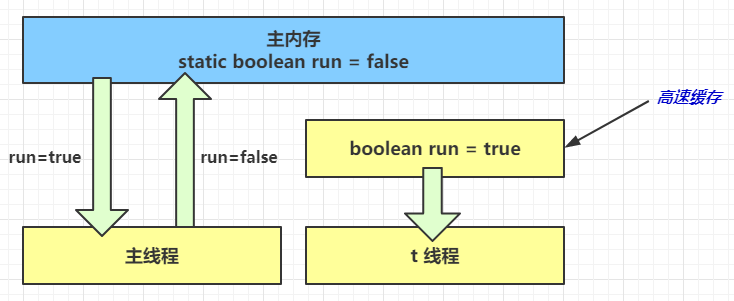

**解决方法**：使用 `volatile`（易变关键字），用于修饰成员变量和静态成员变量，可以避免线程从自己的工作缓存中查找变量的值，让线程必须到主存中获取变量的值，线程操作 `volatile` 变量都是直接操作主存。

### 3.3. 可见性 vs 原子性

前面例子体现的实际就是可见性，它保证的是在多个线程之间，一个线程对 `volatile` 变量的修改对于另一个线程是可见，但不能保证变量的原子性，仅用在一个写线程，多个读线程的情况：上例从字节码理解如下：

```
getstatic run // 线程 t 获取 run true
getstatic run // 线程 t 获取 run true
getstatic run // 线程 t 获取 run true
getstatic run // 线程 t 获取 run true
putstatic run // 线程 main 修改 run 为 false，仅此一次
getstatic run // 线程 t 获取 run false
```

比较如果有两个线程对同一个共享变量操作，一个 `i++` 一个 `i--` ，此时只能保证看到最新值，但不能解决指令交错。从字节码理解如下：

```
// 假设i的初始值为0
getstatic i // 线程2-获取静态变量i的值 线程内i=0
getstatic i // 线程1-获取静态变量i的值 线程内i=0
iconst_1    // 线程1-准备常量1
iadd        // 线程1-自增 线程内i=1
putstatic i // 线程1-将修改后的值存入静态变量i 静态变量i=1
iconst_1    // 线程2-准备常量1
isub        // 线程2-自减 线程内i=-1
putstatic i // 线程2-将修改后的值存入静态变量i 静态变量i=-1
```

> Tips: 
>
> - `synchronized` 语句块既可以保证代码块的原子性，也同时保证代码块内变量的可见性。但缺点是 `synchronized` 是属于重量级操作，性能相对更低
> - 如果在前面示例的死循环中加入 `System.out.println()` 会发现即使不加 `volatile` 修饰符，线程 t 也能正确看到对 run 变量的修改了

## 4. 保证有序性

JVM 会在不影响程序的正确性前提下，可以调整语句的执行顺序。这种特性称之为『指令重排』，多线程下『指令重排』会影响正确性。

> Notes: 指令重排原理详见《并发编程-原理篇》笔记的“指令级并行原理”章节

### 4.1. 问题示例

```java
int num = 0;
boolean ready = false;

// 线程1 执行此方法
public void actor1(I_Result r) {
    if (ready) {
        r.r1 = num + num;
    } else {
        r.r1 = 1;
    }
}

// 线程2 执行此方法
public void actor2(I_Result r) {
    num = 2;
    ready = true;
}
```

以上示例代码 `I_Result` 是一个对象，有一个属性 r1 用来保存结果。可能的结果有以下几种：

- 情况1：线程1 先执行，这时 `ready = false`，所以进入 else 分支结果为 1
- 情况2：线程2 先执行 `num = 2`，但没来得及执行 `ready = true`，线程1 执行，还是进入 else 分支，结果为1
- 情况3：线程2 执行到` ready = true`，线程1 执行，这回进入 if 分支，结果为 4（因为 num 已经执行过了）
- <font color=red>**情况4**</font>：线程2 执行 `ready = true`，切换到线程1，进入 if 分支，相加为 0，再切回线程2 执行 num = 2，因此最终结果是 0

### 4.2. 测试工具 jcstress

这种现象叫做指令重排，是 JIT 编译器在运行时的一些优化，这个现象需要借助 java 并发压测工具 jcstress 通过大量测试才能复现。

> jcstress 介绍：https://wiki.openjdk.java.net/display/CodeTools/jcstress

使用命令：

```bash
mvn archetype:generate -DinteractiveMode=false -DarchetypeGroupId=org.openjdk.jcstress -DarchetypeArtifactId=jcstress-java-test-archetype -DarchetypeVersion=0.5 -DgroupId=com.moon -DartifactId=ordering -Dversion=1.0
```

创建 maven 项目，提供如下测试类

```java
@JCStressTest
@Outcome(id = {"1", "4"}, expect = Expect.ACCEPTABLE, desc = "ok")
@Outcome(id = "0", expect = Expect.ACCEPTABLE_INTERESTING, desc = "!!!!")
@State
public class ConcurrencyTest {

    int num = 0;
    boolean ready = false;

    @Actor
    public void actor1(I_Result r) {
        if (ready) {
            r.r1 = num + num;
        } else {
            r.r1 = 1;
        }
    }

    @Actor
    public void actor2(I_Result r) {
        num = 2;
        ready = true;
    }
}
```

执行以下命令：

```bash
mvn clean install
java -jar target/jcstress.jar
```

执行后会输出设定好感兴趣的结果，摘录其中一次结果：

```
*** INTERESTING tests
    Some interesting behaviors observed. This is for the plain curiosity.
    2 matching test results.
        [OK] test.ConcurrencyTest
    (JVM args: [-XX:-TieredCompilation])
    Observed state Occurrences Expectation Interpretation
        0 1,729 ACCEPTABLE_INTERESTING !!!!
        1 42,617,915 ACCEPTABLE ok
        4 5,146,627 ACCEPTABLE ok
        [OK] test.ConcurrencyTest
    (JVM args: [])
    Observed state Occurrences Expectation Interpretation
        0 1,652 ACCEPTABLE_INTERESTING !!!!
        1 46,460,657 ACCEPTABLE ok
        4 4,571,072 ACCEPTABLE ok
```

可以看到，出现结果为 0 的情况有 638 次，虽然次数相对很少，但毕竟是出现了。

### 4.3. 指令重排问题解决方法

以上示例可以使用 `volatile` 修饰的变量，可以禁用指令重排

```java
volatile boolean ready = false;
```

测试结果：

```
*** INTERESTING tests
  Some interesting behaviors observed. This is for the plain curiosity.
  0 matching test results.
```
