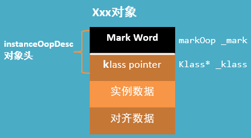
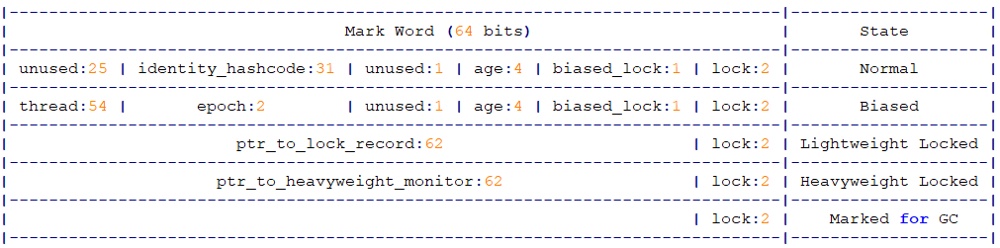
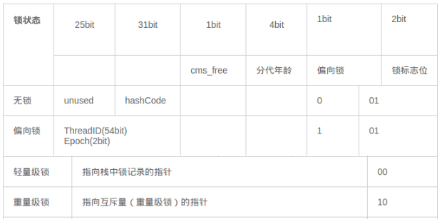
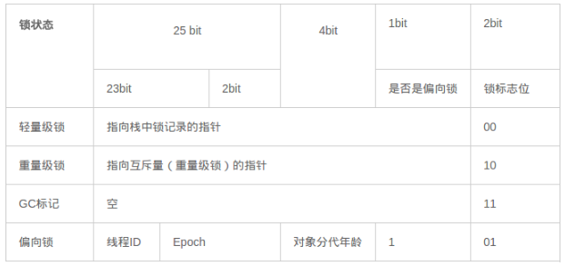
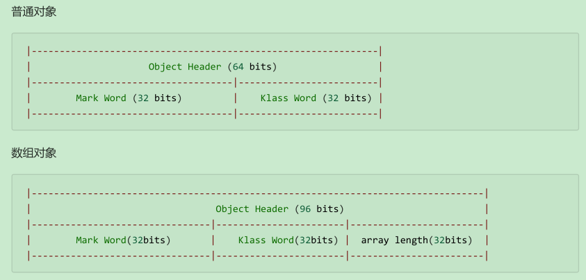

# 并发编程-原理篇

## 1. Java 对象的布局

术语参考: http://openjdk.java.net/groups/hotspot/docs/HotSpotGlossary.html

在 JVM 中，对象在内存中的布局分为三块区域：**对象头**、**实例数据**和**对齐填充**。如下图所示：



### 1.1. 对象头

当一个线程尝试访问 `synchronized` 修饰的代码块时，它首先要获得锁，这个锁是存在锁对象的对象头中的。HotSpot 采用 `instanceOopDesc` 和 `arrayOopDesc` 来描述对象头，`arrayOopDesc` 对象用来描述数组类型。`instanceOopDesc` 的定义的在 Hotspot 源码的 instanceOop.hpp 文件中，另外，`arrayOopDesc` 的定义对应 arrayOop.hpp。

```cpp
class instanceOopDesc : public oopDesc {
    public:
    // aligned header size.
    static int header_size() { return sizeof(instanceOopDesc)/HeapWordSize; }

    // If compressed, the offset of the fields of the instance may not be aligned.
    static int base_offset_in_bytes() {
        // offset computation code breaks if UseCompressedClassPointers
        // only is true
        return (UseCompressedOops && UseCompressedClassPointers) ?
            klass_gap_offset_in_bytes() : sizeof(instanceOopDesc);
    }
    static bool contains_field_offset(int offset, int nonstatic_field_size) {
        int base_in_bytes = base_offset_in_bytes();
        return (offset >= base_in_bytes &&
            (offset-base_in_bytes) < nonstatic_field_size * heapOopSize);
    }
};
```

从 instanceOopDesc 代码中可以看到 instanceOopDesc 继承自 oopDesc，oopDesc 的定义载 Hotspot 源码中的 oop.hpp 文件中。

```cpp
class oopDesc {
    friend class VMStructs;
    private:
    volatile markOop _mark;
    union _metadata {
        Klass* _klass;
        narrowKlass _compressed_klass;
    } _metadata;

    // Fast access to barrier set. Must be initialized.
    static BarrierSet* _bs;
    // 省略其他代码
};
```

在普通实例对象中，oopDesc 的定义包含两个成员，分别是 `_mark` 和 `_metadata`

- `_mark` 表示对象标记、属于 markOop 类型，也就是接下来要讲解的 Mark World，它记录了对象和锁有关的信息
- `_metadata` 表示类元信息，类元信息存储的是对象指向它的类元数据(Klass)的首地址，其中Klass表示普通指针、`_compressed_klass`表示压缩类指针。

对象头由两部分组成，一部分用于存储自身的运行时数据，称之为 Mark Word，另外一部分是类型指针，及对象指向它的类元数据的指针。

#### 1.1.1. Mark Word

Mark Word 用于存储对象自身的运行时数据，如哈希码（HashCode）、GC分代年龄、锁状态标志、线程持有的锁、偏向线程ID、偏向时间戳等等，占用内存大小与虚拟机位长一致。Mark Word 对应的类型是 markOop 。源码位于 markOop.hpp 中。

```cpp
// Bit-format of an object header (most significant first, big endian layout below):
//
// 32 bits:
// --------
// hash:25 ------------>| age:4 biased_lock:1 lock:2 (normal object)
// JavaThread*:23 epoch:2 age:4 biased_lock:1 lock:2 (biased object)
// size:32 ------------------------------------------>| (CMS free block)
// PromotedObject*:29 ---------->| promo_bits:3 ----->| (CMS promoted object)
//
// 64 bits:
// --------
// unused:25 hash:31 -->| unused:1 age:4 biased_lock:1 lock:2 (normal object)
// JavaThread*:54 epoch:2 unused:1 age:4 biased_lock:1 lock:2 (biased object)
// PromotedObject*:61 --------------------->| promo_bits:3 ----->| (CMS promoted object)
// size:64 ----------------------------------------------------->| (CMS free block)
// [JavaThread* | epoch | age | 1 | 01] lock is biased toward given thread
// [0 | epoch | age | 1 | 01] lock is anonymously biased
//
// - the two lock bits are used to describe three states: locked/unlocked and monitor.
//
// [ptr | 00] locked ptr points to real header on stack
// [header | 0 | 01] unlocked regular object header
// [ptr | 10] monitor inflated lock (header is wapped out)
// [ptr | 11] marked used by markSweep to mark an object
// not valid at any other time
```



在 64 位虚拟机下，Mark Word 是 64bit 大小的，其存储结构如下：



在 32 位虚拟机下，Mark Word 是 32bit 大小的，其存储结构如下：



#### 1.1.2. klass pointer

这一部分用于存储对象的类型指针，该指针指向它的类元数据，JVM 通过这个指针确定对象是哪个类的实例。该指针的位长度为 JVM 的一个字大小，即 32 位的 JVM 为 32 位，64 位的 JVM 为 64 位。 如果应用的对象过多，使用 64 位的指针将浪费大量内存，统计而言，64 位的 JVM 将会比 32 位的 JVM 多耗费 50% 的内存。为了节约内存可以使用选项 `-XX:+UseCompressedOops` 开启指针压缩，其中，oop 即 ordinary object pointer 普通对象指针。开启该选项后，下列指针将压缩至 32 位：

1. 每个 Class 的属性指针（即静态变量）
2. 每个对象的属性指针（即对象变量）
3. 普通对象数组的每个元素指针

当然，也不是所有的指针都会压缩，一些特殊类型的指针 JVM 不会优化，比如指向 PermGen 的 Class 对象指针(JDK8中指向元空间的Class对象指针)、本地变量、堆栈元素、入参、返回值和 NULL 指针等。

对象头 = Mark Word + 类型指针（未开启指针压缩的情况下）

- 在 32 位系统中，Mark Word = 4 bytes，类型指针 = 4bytes，对象头 = 8 bytes = 64 bits；
- 在 64 位系统中，Mark Word = 8 bytes，类型指针 = 8bytes，对象头 = 16 bytes = 128bits；

#### 1.1.3. 示例

以 32 位虚拟机为例




### 1.2. 实例数据

**实例数据**就是类中定义的成员变量。

### 1.3. 对齐填充

对齐填充并不是必然存在的，也没有什么特别的意义，它仅仅起着占位符的作用，由于 HotSpot VM 的自动内存管理系统要求对象起始地址必须是 8 字节的整数倍，换句话说，就是对象的大小必须是 8 字节的整数倍。而对象头正好是 8 字节的倍数，因此，当对象实例数据部分没有对齐时，就需要通过对齐填充来补全。

### 1.4. 查看 Java 对象布局工具库

```xml
<dependency>
    <groupId>org.openjdk.jol</groupId>
    <artifactId>jol-core</artifactId>
    <version>0.9</version>
</dependency>
```

## 2. Monitor 实现原理分析

Monitor 被翻译为监视器或管程。

每个 Java 对象都可以关联一个 Monitor 对象，如果使用 `synchronized` 给对象上锁（重量级）之后，该对象头的 Mark Word 中就被设置指向 Monitor 对象的指针。

Monitor 结构如下：


监视流程分析：

- 刚开始 Monitor 中 Owner 为 null
- 当 Thread-2 执行 `synchronized(obj)` 就会将 Monitor 的所有者 Owner 置为 Thread-2，Monitor 中只能有一个 Owner
- 在 Thread-2 上锁的过程中，如果 Thread-3，Thread-4，Thread-5 也来执行 `synchronized(obj)`，就会进入 EntryList BLOCKED
- Thread-2 执行完同步代码块的内容，然后唤醒 EntryList 中等待的线程来竞争锁，竞争的时是非公平的
- 图中 WaitSet 中的 Thread-0，Thread-1 是之前获得过锁，但条件不满足进入 WAITING 状态的线程，<u>*详见 `wait-notify` 原理分析*</u>

注意事项：

- `synchronized` 必须是进入同一个对象的 monitor 才有上述的效果
- 不加 `synchronized` 的对象不会关联监视器，不遵从以上规则

## 3. synchronized 原理

### 3.1. javap 反汇编源码后分析

先编写简单的示例代码如下：

```java
static final Object lock = new Object();
static int counter = 0;

public static void main(String[] args) {
    synchronized (lock) {
        counter++;
    }
}
```

使用 JDK 自带的一个反编译工具：`javap`，对字节码进行反汇编，查看字节码指令。在 DOS 命令行输入：

```bash
javap -p -v -c C:\code\target\classes\com\moon\synchronized_monitor\Increment.class
```

反汇编后对应的字节码如下：

```class
public static void main(java.lang.String[]);
    descriptor: ([Ljava/lang/String;)V
    flags: ACC_PUBLIC, ACC_STATIC
    Code:
        stack=2, locals=3, args_size=1
            0: getstatic #2     // <- lock引用 （synchronized开始）
            3: dup
            4: astore_1         // lock引用 -> slot 1
            5: monitorenter     // 将 lock对象 MarkWord 置为 Monitor 指针
            6: getstatic #3     // <- i
            9: iconst_1         // 准备常数 1
            10: iadd            // +1
            11: putstatic #3    // -> i
            14: aload_1         // <- lock引用
            15: monitorexit     // 将 lock对象 MarkWord 重置, 唤醒 EntryList
            16: goto 24
            19: astore_2        // e -> slot 2
            20: aload_1         // <- lock引用
            21: monitorexit     // 将 lock对象 MarkWord 重置, 唤醒 EntryList
            22: aload_2         // <- slot 2 (e)
            23: athrow          // throw e
            24: return
        Exception table:
            from to target  type
             6   16   19    any
             19  22   19    any
        LineNumberTable:
            line 8: 0
            line 9: 6
            line 10: 14
            line 11: 24
        LocalVariableTable:
            Start Length Slot Name   Signature
            0      25     0   args   s[Ljava/lang/String;
        StackMapTable: number_of_entries = 2
            frame_type = 255 /* full_frame */
                offset_delta = 19
                locals = [ class "[Ljava/lang/String;", class java/lang/Object ]
                stack = [ class java/lang/Throwable ]
            frame_type = 250 /* chop */
                offset_delta = 4
```

在执行同步代码块之前之后都有一个 `monitor***` 的指令，其中前面的是 monitorenter，后面的是 monitorexit，由此可知一个线程也执行同步代码块，首先要获取锁，而获取锁的过程就是 monitorenter ，在执行完代码块之后，要释放锁，释放锁就是执行 monitorexit 指令

然后示例中出现两个 monitorexit 指令，这个主要是防止在同步代码块中线程因异常退出，而锁没有得到释放，从而会造成死锁（等待的线程永远获取不到锁）。因此最后一个 monitorexit 是保证在异常情况下，锁也可以得到释放，避免死锁。

仅有 ACC_SYNCHRONIZED 这么一个标志，该标记表明线程进入该方法时需要 monitorenter，退出该方法时需要 monitorexit。

> 注意：方法级别的 `synchronized` 不会在字节码指令中有所体现

#### 3.1.1. monitorenter

JVM 规范中对于 monitorenter 的描述：https://docs.oracle.com/javase/specs/jvms/se8/html/jvms-6.html#jvms-6.5.monitorenter

> Each object is associated with a monitor. A monitor is locked if and only if it has an owner. The thread that executes monitorenter attempts to gain ownership of the monitor associated with objectref, as follows:
>
> - Each object is associated with a monitor. A monitor is locked if and only if it has an owner. The thread that executes monitorenter attempts to gain ownership of the monitor associated with objectref, as follows:
> - If the thread already owns the monitor associated with objectref, it reenters the monitor, incrementing its entry count.
> - If another thread already owns the monitor associated with objectref, the thread blocks until the monitor's entry count is zero, then tries again to gain ownership.

翻译：每一个对象都会和一个监视器 monitor 关联。监视器被占用时会被锁住，其他线程无法来获取该 monitor。当 JVM 执行某个线程的某个方法内部的 monitorenter 时，它会尝试去获取当前对象对应的 monitor 的所有权。其过程如下：

1. 若 monitor 的进入数为 0，线程可以进入 monitor，并将 monitor 的进入数置为 1。当前线程成为 monitor 的 owner（所有者）
2. 若线程已拥有 monitor 的所有权，允许它重入 monitor，则进入 monitor 的进入数加 1
3. 若其他线程已经占有 monitor 的所有权，那么当前尝试获取monitor的所有权的线程会被阻塞，直到monitor的进入数变为0，才能重新尝试获取monitor的所有权。

小结：synchronized 的锁对象会关联一个 monitor，这个 monitor 是 JVM 的线程执行到这个同步代码块，发现锁对象没有就会创建 monitor，该内部有两个重要的成员变量 owner:拥有这把锁的线程，recursions 会记录线程拥有锁的次数，当一个线程拥有 monitor 后其他线程只能等待

#### 3.1.2. monitorexit

JVM 规范中对于 monitorexit 的描述：https://docs.oracle.com/javase/specs/jvms/se8/html/jvms-6.html#jvms-6.5.monitorexit

> The thread that executes monitorexit must be the owner of the monitor associated with the instance referenced by objectref.
>
> The thread decrements the entry count of the monitor associated with objectref. If as a result the value of the entry count is zero, the thread exits the monitor and is no longer its owner. Other threads that are blocking to enter the monitor are allowed to attempt to do so.

翻译：

1. 能执行 monitorexit 指令的线程一定是拥有当前对象的 monitor 的所有权的线程。
2. 执行 monitorexit 时会将 monitor 的进入数减 1。当 monitor 的进入数减为 0 时，当前线程退出 monitor，不再拥有 monitor 的所有权，此时其他被这个 monitor 阻塞的线程可以尝试去获取这个 monitor 的所有权

<font color=red>**monitorexit 插入在方法结束处和异常处，JVM 保证每个 monitorenter 必须有对应的 monitorexit，确保释放锁。**</font>

#### 3.1.3. 同步方法

https://docs.oracle.com/javase/specs/jvms/se8/html/jvms-2.html#jvms-2.11.10

可以看到同步方法在反汇编后，会增加 `ACC_SYNCHRONIZED` 修饰。会隐式调用 monitorenter 和 monitorexit。在执行同步方法前会调用 monitorenter，在执行完同步方法后会调用 monitorexit。

#### 3.1.4. 小结


### 3.2. synchronized 实现流程（待优化）

> TODO: 待后面深入学习时再优化具体的实现流程

在 synchronized 内部包括 ContentionList 、EntryList 、WaitSet、OnDeck、Owner、!Owner 这6个区域，每个区域的数据都代表锁的不同状态。

- ContentionList：锁竞争队列，所有请求锁的线程都被放在竞争队列中。
- EntryList：竞争候选列表，在 ContentionList 中有资格成为候选者来竞争锁资源的线程被移动到了 EntryList 中。
- WaitSet：等待集合，调用 `wait` 方法后被阻塞的线程将被放在 WaitSet 中
- OnDeck：竞争候选者，在同一时刻最多只有一个线程在竞争锁资源，该线程的状态被称为 OnDeck。
- Owner：竞争到锁资源的线程被称为 Owner 状态线程。
- !Owner： 在 Owner 线程释放锁后，会从 Owner 的状态变成 !Owner。

synchronized 在收到新的锁请求时首先自旋，如果通过自旋也没有获取锁资源，则将被放入锁竞争队列 ContentionList 中。

为了防止锁竞争时 ContentionList 尾部的元素被大量的并发线程进行 CAS 访问而影响性能，Owner 线程会在释放锁资源时将 ContentionList 中的部分线程移动到 EntryList 中，并指定 EntryList 中的某个线程（一般是最先进入的线程）为 OnDeck 线程。Owner 线程并没有直接把锁传递给 OnDeck 线程，而是把锁竞争的权利交给 OnDeck，让 OnDeck 线程重新竞争锁。在 Java 中把该行为称为“竞争切换”，该行为牺牲了公平性，但提高了性能。

获取到锁资源的 OnDeck 线程会变为 Owner 线程，而未获取到锁资源的线程仍然停留在 EntryList 中。

Owner 线程在被 `wait` 方法阻塞后，会被转移到 WaitSet 队列中，直到某个时刻被 `notify` 方法或者 `notifyAll` 方法唤醒，会再次进入 EntryList 中。ContentionList、EntryList、WaitSet 中的线程均为阻塞状态，该阻塞是由操作系统来完成的（在Linux内核下是采用 `pthread_mutex_lock` 内核函数实现的）。

Owner 线程在执行完毕后会释放锁的资源并变为 !Owner 状态，如下图：


在 synchronized 中，在线程进入 ContentionList 之前，等待的线程会先尝试以自旋的方式获取锁，如果获取不到就进入 ContentionList，该做法对于已经进入队列的线程是不公平的，因此 synchronized 是非公平锁。另外，自旋获取锁的线程也可以直接抢占 OnDeck 线程的锁资源。

synchronized 是一个重量级操作，需要调用操作系统的相关接口，性能较低，给线程加锁的时间有可能超过获取锁后具体逻辑代码的操作时间。

JDK 1.6 对 synchronized 做了很多优化，引入了适应自旋、锁消除、锁粗化、轻量级锁及偏向锁等以提高锁的效率。锁可以从偏向锁升级到轻量级锁，再升级到重量级锁。这种升级过程叫作**锁膨胀**。在 JDK 1.6 中默认开启了偏向锁和轻量级锁，可以通过 `-XX:UseBiasedLocking` 配置来禁用偏向锁。

### 3.3. 轻量级锁

轻量级锁的使用场景：如果一个对象虽然有多线程要加锁，但加锁的时间是错开的（也就是没有竞争），那么可以使用轻量级锁来优化。轻量级锁对使用者是透明的，仍然使用 `synchronized` 关键字实现

假设有两个方法同步块，利用同一个对象加锁，代码如下：

```java
static final Object obj = new Object();
public static void method1() {
    synchronized( obj ) {
        // 同步块 A
        method2();
    }
}
public static void method2() {
    synchronized( obj ) {
        // 同步块 B
    }
}
```

加锁流程如下：

- 创建锁记录（Lock Record）对象，每个线程都的栈帧都会包含一个锁记录的结构，内部可以存储锁定对象的 Mark Word


- 让锁记录中 Object reference 指向锁对象，并尝试用 cas 替换 Object 的 Mark Word，将 Mark Word 的值存入锁记录


- 如果 cas 替换成功，对象头中存储了 锁记录地址和状态 00 ，表示由该线程给对象加锁，这时图示如下


- 如果 cas 失败，有两种情况
    - 如果是其它线程已经持有了该 Object 的轻量级锁，这时表明有竞争，进入锁膨胀过程
    - 如果是自己执行了 `synchronized` 锁重入，那么再添加一条 Lock Record 作为重入的计数


- 当退出 `synchronized` 代码块（解锁时）如果有取值为 `null` 的锁记录，表示有重入，这时重置锁记录，表示重入计数减一


- 当退出 `synchronized` 代码块（解锁时）锁记录的值不为 `null`，这时使用 cas 将 Mark Word 的值恢复给对象头
    - 成功，则解锁成功
    - 失败，说明轻量级锁进行了锁膨胀或已经升级为重量级锁，进入重量级锁解锁流程

### 3.4. 锁膨胀

如果在尝试加轻量级锁的过程中，CAS 操作无法成功，这时一种情况就是有其它线程为此对象加上了轻量级锁（有竞争），这时需要进行**锁膨胀，将轻量级锁变为重量级锁**。

```java
static Object obj = new Object();
public static void method1() {
    synchronized( obj ) {
        // 同步块
    }
}
```

- 当 Thread-1 进行轻量级加锁时，Thread-0 已经对该对象加了轻量级锁


- 此时 Thread-1 加轻量级锁失败，进入锁膨胀流程。即为 `Object` 对象申请 Monitor 锁，让 `Object` 指向重量级锁地址。然后自己进入 Monitor 的 EntryList BLOCKED


- 当 Thread-0 退出同步块解锁时，使用 cas 将 Mark Word 的值恢复给对象头，失败。这时会进入重量级解锁流程，即按照 Monitor 地址找到 Monitor 对象，设置 Owner 为 null，唤醒 EntryList 中 BLOCKED 线程

### 3.5. 自旋优化

重量级锁竞争的时候，还可以使用自旋来进行优化，如果当前线程自旋成功（即这时候持锁线程已经退出了同步块，释放了锁），这时当前线程就可以避免阻塞。

自旋重试成功的情况


自旋重试失败的情况


**自旋注意事项**：

- 自旋会占用 CPU 时间，单核 CPU 自旋就是浪费，多核 CPU 自旋才能发挥优势。
- 在 Java 6 之后自旋锁是自适应的，比如对象刚刚的一次自旋操作成功过，那么认为这次自旋成功的可能性会高，就多自旋几次；反之，就少自旋甚至不自旋。
- Java 7 之后不能控制是否开启自旋功能

### 3.6. 偏向锁

轻量级锁在没有竞争时（就自己这个线程），每次重入仍然需要执行 CAS 操作。

Java 6 中引入了偏向锁来做进一步优化：只有第一次使用 CAS 将线程 ID 设置到对象的 Mark Word 头，之后发现这个线程 ID 是自己的就表示没有竞争，不用重新 CAS。以后只要不发生竞争，这个对象就归该线程所有

```java
static final Object obj = new Object();
public static void m1() {
    synchronized( obj ) {
        // 同步块 A
        m2();
    }
}
public static void m2() {
    synchronized( obj ) {
        // 同步块 B
        m3();
    }
}
public static void m3() {
    synchronized( obj ) {
        // 同步块 C
    }
}
```


### 3.7. 锁消除(待整理)

### 3.8. 多线程中 synchronized 锁升级的原理

synchronized 锁升级原理：在锁对象的对象头里面有一个 threadid 字段，在第一次访问的时候 threadid 为空，jvm 让其持有偏向锁，并将 threadid 设置为其线程 id，再次进入的时候会先判断 threadid 是否与其线程 id 一致，如果一致则可以直接使用此锁对象，如果不一致，则升级偏向锁为轻量级锁，通过自旋循环一定次数来获取锁，执行一定次数之后，如果还没有正常获取到要使用的对象，此时就会把锁从轻量级升级为重量级锁，此过程就构成了 synchronized 锁的升级。

锁的升级的目的：锁升级是为了减低了锁带来的性能消耗。在 Java 6 之后优化 `synchronized` 的实现方式，使用了偏向锁升级为轻量级锁再升级到重量级锁的方式，从而减低了锁带来的性能消耗。

## 4. wait/notify 原理


- Owner 线程发现条件不满足，调用 `wait` 方法，即可进入 WaitSet 变为 WAITING 状态
- BLOCKED 和 WAITING 的线程都处于阻塞状态，不占用 CPU 时间片
- BLOCKED 线程会在 Owner 线程释放锁时唤醒
- WAITING 线程会在 Owner 线程调用 `notify` 或 `notifyAll` 时唤醒，但唤醒后并不意味者立刻获得锁，仍需进入 EntryList 重新竞争

## 5. Thread 类 join 方法实现原理

JDK 源码

```java
public final synchronized void join(long millis)
throws InterruptedException {
    long base = System.currentTimeMillis();
    long now = 0;

    if (millis < 0) {
        throw new IllegalArgumentException("timeout value is negative");
    }

    if (millis == 0) {
        while (isAlive()) {
            wait(0);
        }
    } else {
        while (isAlive()) {
            long delay = millis - now;
            if (delay <= 0) {
                break;
            }
            wait(delay);
            now = System.currentTimeMillis() - base;
        }
    }
}
```

- 如果没有传入最大等待时间，就是让调用者（线路）轮询检查线程 `alive` 状态，如果存活则调用 `wait` 方法进行等待。
- 如传入最大等待时间，也会让调用者（线路）轮询检查线程 `alive` 状态，如果存活则会累加每次唤醒的时间是否超出最大等待时间，如超出则不再等待。

> `join` 方法就是体现了【保护性暂停】模式

## 6. 各类锁的实现原理

### 6.1. 偏向锁

偏向锁是 JDK 6 中的重要引进，在大多数情况下，锁不仅不存在多线程竞争，而且总是由同一线程多次获得，为了让线程获得锁的代价更低，引进了偏向锁。

偏向锁会偏向于第一个获得它的线程，会在对象头存储锁偏向的线程 ID，以后该线程进入和退出同步块时只需要检查是否为偏向锁、锁标志位以及 ThreadID 即可。

不过一旦出现多个线程竞争时必须撤销偏向锁，所以撤销偏向锁消耗的性能必须小于之前节省下来的CAS原子操作的性能消耗，否则性能可能会更低。

#### 6.1.1. 偏向锁的原理

当线程第一次访问同步块并获取锁时，偏向锁处理流程如下：

1. 虚拟机将会把对象头中的标志位设为“01”，即偏向模式。
2. 同时使用 CAS 操作把获取到这个锁的线程的 ID 记录在对象的 Mark Word 之中 ，如果 CAS 操作成功，持有偏向锁的线程以后每次进入这个锁相关的同步块时，虚拟机都可以不再进行任何同步操作，偏向锁的效率高。


持有偏向锁的线程以后每次进入这个锁相关的同步块时，虚拟机都可以不再进行任何同步操作，偏向锁的效率高。

#### 6.1.2. 偏向锁的撤销

1. 偏向锁的撤销动作必须等待全局安全点
2. 暂停拥有偏向锁的线程，判断锁对象是否处于被锁定状态
3. 撤销偏向锁，恢复到无锁（标志位为 01）或轻量级锁（标志位为 00）的状态

#### 6.1.3. 偏向锁好处

偏向锁是在只有一个线程执行同步块时进一步提高性能，适用于一个线程反复获得同一锁的情况。偏向锁可以提高带有同步但无竞争的程序性能。

它同样是一个带有效益权衡性质的优化，也就是说，它并不一定总是对程序运行有利，如果程序中大多数的锁总是被多个不同的线程访问比如线程池，那偏向模式就是多余的。

### 6.2. 轻量级锁

轻量级锁是JDK 6之中加入的新型锁机制，是相对于使用 monitor 的传统的“重量级”锁而言的。首先需要强调一点的是，**轻量级锁并不是用来代替重量级锁的**。

引入轻量级锁的目的：在多线程交替执行同步块的情况下，尽量避免重量级锁引起的性能消耗，但是如果多个线程在同一时刻进入临界区，会导致轻量级锁膨胀升级重量级锁，所以轻量级锁的出现并非是要替代重量级锁。

#### 6.2.1. 轻量级锁原理

当关闭偏向锁功能或者多个线程竞争偏向锁导致偏向锁升级为轻量级锁，则会尝试获取轻量级锁，其步骤如下：

1. 判断当前对象是否处于无锁状态（hashcode、0、01），如果是，则 JVM 首先将在当前线程的栈帧中建立一个名为锁记录（Lock Record）的空间，用于存储锁对象目前的 Mark Word 的拷贝（官方把这份拷贝加了一个 Displaced 前缀，即 Displaced Mark Word），将对象的 Mark Word 复制到栈帧中的 Lock Record 中，将 Lock Reocrd 中的 owner 指向当前对象。
2. JVM 利用 CAS 操作尝试将对象的 Mark Word 更新为指向 Lock Record 的指针，如果成功表示竞争到锁，则将锁标志位变成 00，执行同步操作。
3. 如果失败则判断当前对象的 Mark Word 是否指向当前线程的栈帧，如果是则表示当前线程已经持有当前对象的锁，则直接执行同步代码块；否则只能说明该锁对象已经被其他线程抢占了，这时轻量级锁需要膨胀为重量级锁，锁标志位变成 10，后面等待的线程将会进入阻塞状态。

  

#### 6.2.2. 轻量级锁的释放

轻量级锁的释放也是通过CAS操作来进行的，主要步骤如下：

1. 取出在获取轻量级锁保存在 Displaced Mark Word 中的数据。
2. 用CAS操作将取出的数据替换当前对象的 Mark Word 中，如果成功，则说明释放锁成功。
3. 如果CAS操作替换失败，说明有其他线程尝试获取该锁，则需要将轻量级锁需要膨胀升级为重量级锁

对于轻量级锁，其性能提升的依据是“对于绝大部分的锁，在整个生命周期内都是不会存在竞争的”，如果打破这个依据则除了互斥的开销外，还有额外的 CAS 操作，因此在有多线程竞争的情况下，轻量级锁比重量级锁更慢。

#### 6.2.3. 轻量级锁好处

在多线程交替执行同步块的情况下，可以避免重量级锁引起的性能消耗。

### 6.3. 自旋锁

#### 6.3.1. 自旋锁原理

monitor 实现锁的时候，会阻塞和唤醒线程，线程频繁的阻塞和唤醒需要 CPU 从用户态转为核心态，这些操作给系统的并发性能带来了很大的压力。同时在大数应用中，共享数据的锁定状态只会持续很短的一段时间，为了这段时间阻塞和唤醒线程并不值得。如果物理机器有一个以上的处理器，能让两个或以上的线程同时并行执行，就可以让后面请求锁的那些线程“稍等一下”，但不放弃处理器的执行时间，看看持有锁的线程是否很快就会释放锁。为了让线程等待，只需让线程执行一个循环(自旋)，这项技术就是**自旋锁**。

自旋锁在 JDK 1.4.2 中就已经引入，只不过默认是关闭的，可以使用 `-XX:+UseSpinning` 参数来开启，在**JDK 6 中改为默认开启**了。自旋等待不能代替阻塞，且先不说对处理器数量的要求，自旋等待本身虽然避免了线程切换的开销，但它是要占用处理器时间的。因此，如果锁被占用的时间很短，自旋等待的效果就会非常好，反之，如果锁被占用的时间很长。那么自旋的线程只会白白消耗处理器资源，而不会做任何有用的工作，反而会带来性能上的浪费。因此，自旋等待的时间必须要有一定的限度，如果自旋超过了限定的次数仍然没有成功获得锁，就应当使用传统的方式去挂起线程了。自旋次数的默认值是 10 次，用户可以使用参数 `-XX:PreBlockSpin` 来更改。

#### 6.3.2. 适应性自旋锁

在 JDK 6 中引入了自适应的自旋锁。自适应意味着自旋的时间不再固定了，而是由前一次在同一个锁上的自旋时间及锁的拥有者的状态来决定。如果在同一个锁对象上，自旋等待刚刚成功获得过锁，并且持有锁的线程正在运行中，那么虚拟机就会认为这次自旋也很有可能再次成功，进而它将允许自旋等待持续相对更长的时间，比如100次循环。另外，如果对于某个锁，自旋很少成功获得过，那在以后要获取这个锁时将可能省略掉自旋过程，以避免浪费处理器资源。

有了自适应自旋，随着程序运行和性能监控信息的不断完善，虚拟机对程序锁的状况预测就会越来越准确。

### 6.4. 锁消除

**锁消除**是指虚拟机即时编译器（JIT）在运行时，对一些代码上要求同步，但是被检测到不可能存在共享数据竞争的锁进行消除。锁消除的主要判定依据来源于逃逸分析的数据支持，如果判断在一段代码中，堆上的所有数据都不会逃逸出去从而被其他线程访问到，那就可以把它们当做栈上数据对待，认为它们是线程私有的，同步加锁自然就无须进行。

变量是否逃逸，对于虚拟机来说需要使用数据流分析来确定，同步的代码在 Java 程序中的普遍存在。下面这段非常简单的代码仅仅是输出3个字符串相加的结果，无论是源码字面上还是程序语义上都没有同步。

```java
public class Demo {
    public static void main(String[] args) {
        contactString("aa", "bb", "cc");
    }

    public static String contactString(String s1, String s2, String s3) {
        return new StringBuffer().append(s1).append(s2).append(s3).toString();
    }
}
```

`StringBuffer` 的 `append()` 是一个同步方法，锁就是 `this` 也就是 `new StringBuilder()`。虚拟机发现它的动态作用域被限制在 `concatString()` 方法内部。`new StringBuilder()`对象的引用永远不会“逃逸”到 `concatString()` 方法之外，其他线程无法访问到它，因此，虽然这里有锁，但是可以被安全地消除掉，在即时编译之后，这段代码就会忽略掉所有的同步而直接执行了。

### 6.5. 锁粗化

大部分情况下推荐，在编写代码的时候推荐将同步块的作用范围限制得尽量小，只在共享数据的实际作用域中才进行同步，这样是为了使得需要同步的操作数量尽可能变小，如果存在锁竞争，那等待锁的线程也能尽快拿到锁。但是如果一系列的连续操作都对同一个对象反复加锁和解锁，甚至加锁操作是出现在循环体中的，那即使没有线程竞争，频繁地进行互斥同步操作也会导致不必要的性能损耗。此时 JVM 会探测到这一连串细小的操作都使用同一个对象加锁，将同步代码块的范围放大，放到这串操作的外面，这样只需要加一次锁即可。

```java
public class Demo {
    public static void main(String[] args) {
        StringBuffer sb = new StringBuffer();
    
        for (int i = 0; i < 100; i++) {
            sb.append("aa");
        }
    
        System.out.println(sb.toString());
    }
}
```
